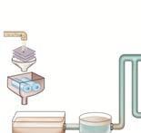

க்‌ "அலகு 1%: தாவரச்‌ சூழ்நிலையியல்‌ பாடம்‌ \[ச சுற்றுச்சூழல்‌ பிரச்சினைகள்‌ ரர கற்றல்‌ நோக்கங்கள்‌: 89 மழைநீர்‌ சேகரிப்பு

810 ுழிவநீர்‌ வெளியேற்றம்‌.

இப்படத்தினை கத்போர்‌ க சற்றுச்கழல்‌ தாக்கத்தின்‌ மதிபீ (04) 9 சுற்றுக்கழல்பரர்சினைகளை மட்ட ௧12 பவிமயல்சா்‌ தகவல்‌ அமைப்புகள்‌ அதிகளவில்‌ தாவரங்கள்‌ வளர்க்க "வேண்டியதன்‌ அவசியத்தை உணரவும்‌ உலகில்‌ கணக்க மரானச்‌ 2 இடவரை தாவரங்களையும்‌ அழிவின்‌ குழல்மண்டலங்களின்‌.. அமைப்பு... மற்றம்‌ சவ்வு செயல்பாடுகளை அறிந்துள்ள. நிலையில்‌, மாணவச்‌ முக்கியத்துவம்‌ மற்றம்‌ பாதுகாப்பின்‌ சமகாயம்‌ தங்களது வப்பாற, தேசிய, சர்வதே சட்படையில்‌ வேறுபக்கம்‌ அனவிலான சம்று்மல்‌ பீரர்சினையை உற்று 9 வேளாண்மை.வனவியல்‌ துறைகளில்‌ நோற்க அவற்றை நன்கு பந்து வாள்ளைக்‌ கஷாழில்நுட்பங்களின்‌ பயன்பாட்டை வேண்டம்‌ உணரும்‌ கழ. கொரக்க்பப்டள்ள.... சற்று்ுழல்‌

க கப ககை கனையர பிரச்சினைகள்‌ சிலவற்றை இங்கு தலிந்து ஷாள்வோம்‌.

சமூகத்துடன்‌ இணைசந்து பணியாற்றவும்‌ (காண்போம்‌. 4 நிநிலைகளைப் பாதுகாக்கவும்‌, தாவரங்கள்‌. மக்கள்‌ தொகை பெருக்கம்‌ தொடர்ந்து வளரவும்‌ தேவையானபுதிய ப்ப யுக்திகளை உருவாக்கவும்‌. த பகன்‌ 4 அன்றாட வாழ்வின்‌ தேவைகளைப்பூர்க்கி கழிவுநீர்‌ வளியேற்றம்‌. செய்யச்‌ செயற்கைக்கோள்‌ தொழில்நுட்ப அனைத்துவகையான மாசபாடகள்‌ அறிவைப்‌ பயன்பருக்கவும்‌ இயலும்‌.

பசுமை இல்ல வாயுக்கள்‌

பாட உள்ளடக்கம்‌. நீ$ஆற்றல்‌ உணவு பற்மக்குறை,

8௭ பசுமை இல்ல விளைவும்‌ காடுகளை சுழிக்க. புவி வப்பமடைதலும்‌

றவை காலநிலையில்‌ மாற்றம்‌.

௧3 காடழிப்பு கழில்மயனகல்‌ ட

௬௧ புதிய காரு வளர்ப்பு நக

௨௧ வேளாண்‌ வேதி. படம்‌ ஊஃசற்றுச்கழல்‌ பிரச்சினைகள்‌. பொருட்களும்‌ சுன்‌: ன்‌ மனிதனின்‌ சிந்திக்காத செயல்களால்‌ ஏற்ப தீய

வனி விளைவுகளே சுற்றுச்சூழல்‌ பிரச்சினைகளாகின்றன.

பதத (ப்தளைஅயம்‌ கடக "மேலும்‌ இயற்கையில்‌ கிடைக்கும்‌ விலைமதிப்புமிக்க. தாவ வள ஆகாரங்களைப்‌ வருமளவில்‌ பயன்படுத்துவதால்‌

கர பாதுகாத்தல்‌. பிரச்சினைகள்‌ எழுகின்றன. தற்போது எதிர்கொள்ளும்‌

8 கார்பன்‌ கவரப்படகல்‌ மற்றும்‌ சேமித்தல்‌. சற்றுச்ல்‌ பீரச்சினைகளை மாணவர்கள்‌ அறிந்து (009) கொள்வதுடன்‌, அவற்றைக்‌ குறைப்பத்க்‌, ஈரி

ய்வதங்கம்‌ தீர்வு காண வேண்டும்‌.

கற்முக்குள்ளைக்‌. 1

ஹவராடுஞ்௦9ட/

௨௯௨. நாடுகள்‌ அனைத்தம்‌. சற்றுச்மூல்‌ மரச்சினைகளைக்‌. களைய வேண்டியதன்‌. அவரியத்தை ஏற்றுக்காண்டிருக்கின்றன. உலகளாவிய உச்சி மாநாடுகள்‌, கலந்தாய்வு கட்டங்கள்‌ மாநாடுகள்‌ போன்றவற்றை சவ்வப்போது, கக்கிய நாடுகள்‌ நடத்தி வருகின்றன. மனிதனின்‌. வாயிலாக... உண்டாக்கப்படும்‌. பிரச்சினைகளைக்‌. குறைக்கும்‌. ஒப்பத்தில்‌ சுமார்‌ 50 நாடகள்‌ கைவங்பமட்டள்ளன.

செயல்பாடு,

மாணைர்கள்‌. இணைந்து. மல்‌. கழு 800000) ஒன்றை உருவாக்குவதன்‌ மூலம்‌, பள்ளி. வளாகத்தில்‌ எழும்‌ சற்றுச்‌

பிரச்சினைகளை விவாதித்து அதற்குத்‌ தீர்வு

காண முயல வேண்டும்‌. குப்பைகள்‌ சேகரமாதல்‌, நீர தேங்குகல்‌, உடல்நலம்‌ மற்றும்‌ சுகாதாரம்‌. சார்ந்த பிரச்சினைகளுக்கு அவர்களாகவே தீர்வு, காண முயற்சிக்கலாம்‌... இவற்றுடன்‌ பள்ளி, வளாகத்தில்‌ செடிகளை நட்டு, பராமரித்து, பசுமையாக்கிட முயற்சிக்கலாம்‌.

நன்ற. மக்கட்சொகைப்‌ கதிகரிப்பால்‌, உணவுப்‌ பொருட்கள்‌, நார்கள்‌, எறிவாருள்‌ போன்றவற்றின்‌ 'தேவைகதிகரிக்கிறது இக்ககையகாரணங்களுக்காக "விவசாய நிலங்களை மாற்றிப்‌ பண்பருத்தும்‌ போது. கற்றச்ூழல்‌ பிரச்சினைகள்‌ ஏற்பட்டு. உயிரி பன்முகத்தன்மை குறைதல்‌, நிலவனம்‌ குன்றுகல்‌, நன்னீர்‌ வளம்‌ குறைதல்‌ போன்றவைகளுக்கு மனிதகுலம்‌ காரணமாகிறது. உண்டாக்கப்படும்‌ பசுமை. "இல்ல. வாயுக்கள்‌ தட்பவெப்ப நிலையில்‌ பெரும்‌ மாற்றத்தை ஏற்படுத்தி மனிதனால்‌ ஏற்பரச்ப்படம்‌ புவி ஷெப்பயமாவதற்குக்‌ காரணமாகிறது.

81.  பசுமை இல்ல. விளைவும்‌ புவி 'எெப்பமடைதலும்‌ (ரச 140096 11௪௦1 8ம்‌ இல்ல ளாக

கூறியனிபமிருந்து. வரக்கூடிய வெய்பக்கதிர்கள்‌. வளிமண்டல... வாயுக்களால்‌... கவரப்பட்ட "வளிமண்டலத்தில்‌ வெப்பம்‌ அதிகரிக்கும்‌ நிகழ்வைப்‌ பசுமை இல்ல விளைவு:

என்கிறோம்‌... வப்பக்‌

கதிர்களைக்‌

கவர்ந்திழுக்கும்‌.

வாயுக்களைம்‌ பசுமை:

"இல்ல வாயுக்கள்‌ (மேன.

பவட ஸெகு என

அழைக்கப்படகின்றன.

இவற்றுள்‌ கார்பன்‌.

டை-ஆக்ணையு (00\]. பல க2 பசுமை தில்ல வயல்களின்‌ எறபுபங்களபப

ப௧ம விறகும்‌ கி்சிளைகள்‌

மீத்தேன்‌ (01) நைட்ரஸ்‌ ஆக்ஸைய (1.0) ஆகியவை ங்கும்‌. மேலும்‌ செயற்கை வேதி பொருட்களாகிய களோரோஃபுளோரோ கார்பன்‌... (00) போன்றவைகளும்‌ வெப்பக்‌ கதிர்களைக்‌.

மகமை. இல்ல விளைவை உண்டாக்கும்‌ மனிதச்‌

செயல்பாகள்‌

உ தொல்லுமிர்‌ படிம. ஏறிவாருட்களை எரிக்கும்‌ போது 00,மற்றும்‌ 01,அதிகம்‌ வெளிப்பதல்‌

உ வேளாண்‌. மற்றம்‌. கால்நடை வார்ப்பு போன்றவற்றின்‌ வயல்முறைகளில்‌ மாற்றங்களை உண்டாக்ககல்‌

உட களிர்சாதனம்‌ பெட்டி சாற்று குளிர்விப்பான்கள்‌ போன்ற. மின்னணு சாதனங்களிலிரந்ு 'களோரோஃபுளோரோ கார்பன்‌ வெளியேறுகல்‌

உ: வேளாண்‌. நிலங்களில்‌ பயன்படுத்தப்‌ உரங்களில்‌ இரந்து ட,0 ஷளிப்படகல்‌

4: தானியங்கி வாகனங்களில்‌ இருந்து வெளிவரும்‌ பகமை இல்ல வாயுக்களின்‌ அடர்த்தி அதிகரிக்கும்‌

போது வியின்‌ சராசரி கப்பறிலையம்‌ உயர்கன்றது

(அதிகபட்சம்‌ 4000. வருடங்கள்‌). இதுவே புவி வெப்பமடைதல்‌ (ஒன்ன. ஒளான்ஜு.. என அழைக்கப்புகின்றத.

பெருகிவரும்‌ மக்கள்‌ தொகைக்கேற்ப உணவுப்‌ பொருட்களின்‌ உற்பத்தி, நார்‌ வருட்கள்‌ மற்றும்‌ எறிப்வாருட்களின்‌ தேவையும்‌ அதிகரிக்கப்பட வேண்டியுள்ளது. இதுவே புவி வப்பமடைதலுக்கு முக்கிய காரணமாகக்‌ கருதப்படுகிறது.

க. புவி வப்படைதலின்‌ விளைவுகள்‌

உட புலியின்‌ வவப்பம்‌ அதிகறிக்கும்‌ போது துருவப்‌ பகுதியில்‌ பனிக்குன்றுகள்‌ மற்றும்‌ பனிக்கட்டிகள்‌. உருகத்‌ தொடங்குகின்றன. இதன்‌ காரணமாக( குபல்நீர்‌. மப்பம்‌ உயர்ந்து. உலகின்‌ பல. பகுதிகளிலுள்ள கடலோர நகரங்கள்‌ மூழ்தம்‌. இலை ஏற்பமம்‌.ஹவராடுஞ்௦9ட/

உ. காலநிலையில்‌ தீவிர மாற்றங்கள்‌ ஏற்பட்ட அதன்‌ மூலம்‌ கரம்‌ வெள்ளப்பெருக்கு, அதிக வறட்சி போன்றவை நிலவம்‌.

உ. உமிரியன்மைத்‌ தன்மை குறைந்து வருவகோடி, சில சிற்றினங்கள்‌ அழியும்‌ நிலை ஏற்படும வெப்ப மண்டல மற்றும்‌ மித. வெப்பமண்டலப்‌ ரதேசங்களில்‌ உணவு உற்பத்தி குறையும்‌.

812 பசுமை இல்ல வாயுக்கள்‌ வெளிவிடும்‌.

மூலங்கள்‌ (இயற்கை மற்றும்‌ மனித இனம்‌:

மூலம்‌) (8௦07௦௯ ௦1 ௫௦1 110066 02%

கிவி ரிசப சா கரம்ர௦900ளர)

(00, கார்பன்‌-டை-ஆக்லையு)

உட நிலக்கறியைச்‌ சார்ந்துள்ள மின்‌ உற்பத்தி நிலையங்களில்‌. தொல்லுயிர்‌ படிம எறிப்வொருட்கள்‌ எரிக்கப்படும்‌ போது,

உ. தானியங்கி வாகனங்கள்‌, வணிக ஊர்திகள்‌, வானூர்திகள்‌ போன்றவற்றின்‌ எறிப்பொருட்கள்‌ எாிக்கப்படுவதால்‌ புவி. வெப்பமடைதல்‌. அதிகளவில்‌ ஏற்படுகிறது.

உ வேளாண்‌ நிலங்களில்‌ அறுவடையின்போது, எஞ்சி. ற்கும்‌ அடிக்கட்டைப்‌ பயிர்களை, எறிப்பதாலும்‌ 00, வளியேற்றப்படகின்றது.இ

உட றிமப்வொருட்கள்‌,.... எரிமலைகள்‌, மித வெப்பக்கடங்கள்‌ மற்றும்‌ வீழ்படிவங்கள்‌ மூலம்‌. இயற்கையாக உருவாதல்‌.

புன்‌. ஷெப்பமாதலால்‌ தாவரங்களில்‌ ஏற்பும்‌

விளைவுகள்‌.

*   வெப்ப. மண்டலப்‌ பிரதேசங்களில்‌ உணவு, உற்பத்தி குறைகல்‌.

உ வளி மண்டலத்தில்‌ அதிகளவில்‌ வெப்பக்‌ கதிர்கள்‌ \[ட ஏய/௯) வீசதல்‌. (களைகள்‌, பூச்சிகள்‌ மற்றும்‌ பூஞ்சைகளுக்கு அதிக வெப்பம்‌ தேவைப்படுகிறது!

*   நோய்‌ கடத்திகள்‌ மற்றும்‌ தொற்றுநோங்கள்‌: அதிகம்‌ பரவுதல்‌

உயலத்த.. கூறாவளிக்காற்றம்‌, ெள்ளப்வருக்கும்‌ ஏற்படுதல்‌.

உ தண்ணீர்‌ தட்டுப்பாடு மற்றும்‌. நீர்பாசனக்‌. குறையாம.

பூக்கள்‌... தோன்றும்‌. காலங்கள்‌. மறும்‌ மகரந்தச்சேரபபிகளில்‌ மாற்றங்கள்‌ நிகற்கல்‌

“தாவரப்‌ பரவல்‌ பிரதேசங்களின்‌ சிற்றினங்களில்‌. மாற்றங்கள்‌ காணப்படுதல்‌.

தாவரங்கள்‌ அழிந்து வருதல்‌.

கேன்‌ மீத்தேன்‌, 00,-வைம்‌. காட்மலும்‌ 20 மடங்க. கம்பத்தை வளி மண்டலத்தில்‌ கூட்டுகிறது. நல்‌. மனறிடல்‌, கால்நடை வார்ப்பு நீர்நிலைகளில்‌ வாயும்‌.

கடுமையான.

பாக்கரியங்கள்‌. மற்றும்‌... தொல்லுயிர்‌ படம £ிவாருட்களின்‌ உற்பத்தி, கடல்‌, எரக்தன்மையற்ற. நிலம்‌, கட்ுததீ வாயிலாக மீத்தேன்‌ உருவாகிறது. 10 நப்ஸ்‌ கக்லைப்‌, இயற்கையில்‌ பெருங்கடல்களிலிருந்தம்‌, மழைக்‌. காடுகளிலிரந்தம்‌ 10 உருவாகிறது. நைலான்‌, நைப்ரிக்‌ அமில உற்பத்தி, வேளாண்‌ உரங்களைப்‌ மமன்படத்துகல்‌, விணைவேக மாற்றிகள்‌ பொருத்தப்பட்ட மகிழுந்துகளைப்‌ பயன்படத்துகல்‌. மற்றும்‌ கரிமப்வருட்சளை எரித்தல்‌ போன்றவற்றின்‌. மூலம்‌), செயற்கையாக உருவாகிறது. கட புளி, வழிமுறை; உபுல்‌ பரப்‌. மீது தாவரப்‌ போர்வையை அதிகரித்தல்‌, திக மரங்களை வளர்க்க்‌ உ. ஷால்லுவிர்‌ படிம எரி பொருட்கள்‌, பசுமை இல்ல. வாயுக்கள்‌ பயன்பாட்டைக்‌ குறைக்கல்‌. உட புபிக்கத்தக்க ஆற்றல்‌ வள ஆதாரங்களைப்‌ பெருக்கம்‌ உ. நைப்ரன்‌ உரங்கள்‌ மற்றும்‌ ஏரோசால்‌ (௭௦0) “குறைந்த அளவு பயன்பருத்துகல்‌. 814 ஓசோன்‌ குறைதல்‌ (02009 029/6100) ஒசோன்‌ அடுக்கு புவியின்‌ மீவளிமண்டல சரக்கின்‌. (ன்ஸ்ஷன) ஒரு பகுதியாக அமைந்துள்ளது. இது, ஆறியனிபசிரந்து வரக்கூடிய பற ஊதாக்‌ கதிர்களைப்‌ பெருமளவில்‌ கவர்ந்து. கொள்கிறது. இதனால்‌. 'இல்வடுக்கினை ஒசோன்‌ கவசம்‌ (020 51/41) என்றும்‌ அழைக்கலாம்‌. இவ்வரக்கம்‌ புற ஊதாக்‌. ுதிர்களைத்‌ தடுத்து நறுக்கிப்‌ புவியில்‌ வாழும்‌: உயிரினங்களைப்‌. பாதுகாக்கும்‌ அடுக்காக விளங்குகிறது வனி மண்டலத்தின்‌. மேற்பகுதியில்‌ இரண்ட பிக்குகள்‌. காணப்படுகின்றன... அவையாவன. டிவளி மண்டலம்‌ (ர௦20ட0) (கழடக்க மற்றும்‌ மீளி மண்டலம்‌ (5௦6) (மேலுக்கு) அடவி மண்டலப்‌ பகுதியில்‌ காணக்கூடிய ஒசோன்‌ படலம்‌: பயனற்றதாகும்‌ (௦4 மரா. அதே சமயம்‌ மேலருக்க்‌ காணப்படம்‌. ஒசோன்‌ பலம்‌ நன்மைத்தரும்‌ அடக்காகம்‌ (6௦௦4. 0207. எனில்‌ இல்வடக்கு மட்டுமே ரியனிபமிரந்துவெளிப்டுமப'/ கதிர்களை, பெருமளவில்‌ கடத்து நிறுத்தி 004. சிதைவினால்‌. உமிரினங்களில்‌ தீங்குண்டாவது. தடுக்கப்படுகிறது. ஒனேன்‌ டக்கன்‌ தடிமண்‌ டங்ஸன்‌ அலகுகளால்‌. (ல்லா படு அனவிடப்படுகின்றன. இதன்மூலம்‌ முப்‌ பரப்பிலிருந்து வளி மண்டலத்தின்‌ வளிப்பகலி வரையிலும்‌ காற்றில்‌ கலந்துள்ள ஒசோன்‌ படலந்தை செவிடமுவமம்‌

வப்பயடைதலைத்‌ தருக்கும்‌:

றரவுல்மசினைன்‌ஹவராடுஞ்௦9ட/

ஒசோன்‌ ஒரு நிறமற்ற வாயு, இது காற்றின்‌ மாசப்பொருட்களுடன்‌ \_ தறிதமாக வினை: புியக்கூடயது. இது இப்பரில்‌ வெடிப்புகளையும்‌, தாவர உயிர்களில்‌ காயத்தையும்மற்றும்‌நுரையீ்‌ பிகக்களி்‌ சிதைவினையு்‌. ஏற்படுத்தக்கூஷயதாகும்‌. கரிய ஒளியிலிருந்து ப1- உமற்று்‌ ப - 6 எனும்‌ தீங்கு விளைவிக்கும்‌. ன ல்கத கன்ன அகம தன்மையுடையது.

'பாய்லன்‌ சகு என்றால்‌ என்ன? மத்த ஒசோன்‌. அளவிட உதவும்‌ ஓர்‌ அலகு பாப்ஸன்‌ கதை. “எனப்படும்‌. 0” வெப்பநிலையில்‌ | வளிமண்டல. அழுக்கக்தில்‌ (புனி்பர்பின்‌ மீதுள்ள காற்றமக்க்‌) 1௦0 மில்லிமீட்டர்‌ தமன்‌ கொண்ட தூய ஒசோன்‌ அடுக்கை உருவாக்கத்‌ தேவைப்படும்‌ ஓசோன்‌:

மூலக்கூறுகள்‌ எண்ணிக்கை ஒரு டாப்ஸன்‌ அலகு. (௫௦0 ஸ்ட னா) எனப்படும்‌. பவிப்பரப்ின்‌ மீது: காணப்படும்‌ ஷாத்தஒளேன்‌ அடக்கு௦36மீ(3மிமி) கடிப்புள்ளது.

ஆகம்‌. இது 300.

௦ம்‌ ப்‌

குறிப்பிடும்‌.

புவியின்‌ மாத்த.

ஒ்சான்‌.

அமைய்மைக்‌

காண்டிக்கும்‌ “விவ 22200

பப உம்‌ பவுலின்‌ மோத்தஒசோன்‌. நமல்‌ அமைய்பைக்கான்பிக்கும போய்‌

மிறத்தோற்றம்‌. லக்‌

ஊதா மற்றும்‌ நீல.

நிறங்கள்‌ ஒசோன்‌ மிகக்‌ குறைந்த பகுதியாகும்‌. மஞ்சள்‌ மற்றும்‌ சிவப்பு நிறப்‌ பததிகள்‌ ஒசோன்‌ மித, புதியன அறியலாம்‌.

சில வகையான வேதிப்‌ பொருட்கள்‌ வளி மண்டலத்தில்‌ வெளியிடப்படும்‌ போது ஒசோன்‌ படலம்‌: கொடர்ந்து. பதிப்ிறகள்ளாகிறது.... குறிப்பாக, குளிர்சாதனம்‌ பெட்டளிலிறுந்து. வெளியேறும்‌ குளோரோஃபுளோரோ கார்பன்‌, ஒரோசால்‌, கொழித்சாலைகளில்‌ அழுக்கு நீக்கம்‌. வேதிப்‌ பொருட்கள்‌ போன்றவை இத்தகைய பாதிப்பினை: ஏற்படுத்துகின்றன... ஒசோன்‌ அடுக்கின்‌ கர்வ, வெகுவாகக்‌ குறைந்து காணப்படும்‌. பகுதிகள்‌ சயாயகரமான. பகுதியாகக்‌. கண்டறியப்பட்டு ப்பததியை ஒசோன்‌ துளை (020 006) என:

ப்டம்பர்‌5- உலக ஒசோன்‌ தினம்‌

மீவேளிமண்பல... அரக்கில்‌ ஒசோன்‌ கனவு 'குறைந்துவரும்‌ நிலையில்‌ அதிகப்பூயான புற ஊதாக்‌, கற்கள்‌ குறிப்பாக பர்‌ 8 கதிர்கள்‌ புவியை. வந்தடைகின்றன... இக்கதிர்கள்‌.. உமர்‌:

படட வறுகுல்க்சிளைகன்‌

மூலக்கூறுகளையும்‌, .. உயிர்ச்‌. செல்களையும்‌ அழிக்கின்றன (தோல்‌ மூப்படைதல்‌) ப! -0 என்பது அதிகளவு. சேதம்‌ விளைவிக்கும்‌ (4. கதிறியக்க வகையாகும்‌. ஆனால்‌ ஒசோன்‌ படலத்தால்‌ இது, முற்றிலும்‌ தடுக்கப்படுகிறது. 95 சதவீத ப கதிரியக்கம்‌ 'தோலின்‌ நிறமாற்றம்‌, தோல்‌ கருகுகல்‌ மற்றும்‌ தோல்‌. புற்றுநோய்‌... போன்றவற்றைத்‌ தாண்டவும்‌ காரணமாகிறது... இதன்வாயிலாகம்‌ புவியில்‌ உமிரினங்கள்‌ அனைத்தும்‌ ஆரோக்கியமாக வாழ: ஒசோன்‌ அடக்கு சீராக இருப்பது ஒன்றே தீர்வாகும்‌ என்று உணர முடிகிறது.

னர௦-ஆம்‌ ஆண்டு நடத்தப்பட ஆய்வு முடிவில்‌

மனிசன்‌ வாயிலாக... வெளியிடப்‌ குனரோஃபுணேரோ கார்பன்‌. (௬0) ஒன்‌. முலங்கறுகளை சதிகளில்‌... சிதைத்து

வளிமண்டலத்தின்‌ ஒசோன்‌ சளவை வெதவாகக்‌ குறைத்துவிடுவது. கண்டறியப்பட்டது... இத்தகைய ஒசோன்‌ குறையாக மற்றும்‌ ஆபத்து சர்வதேச அளவில்‌ ச்சறுக்கலை..... உண்பங்கும்‌... முக்கியமான: ேர்சினையாக உள்ளன உலக வானிலை ஆய்வு அமைப்பும்‌ ஐக்கிய நாருகள்‌ சபையும்‌ எடத்துரைக்கன. ௦௧-ஆம்‌ ஆண்டில்‌ நடைபபற்ற வியன்னாமாறாட்கல்‌. இறைவேற்றபபட்ட ஒபபந்கங்கள்‌ (நடவடிக்கைகள்‌) முகல்‌. னிரமாக.. நடைமுறைப்ப்கப்ப்டது. குற்றுச்கரலைப்‌ பாதுகாக்க ஏற்பக்கப்ப்ட வியன்னா. கூட்டத்தில்‌ ஆக்கப்பூர்வமான ஒழுங்கு நடைமுறைகள்‌ ஒப்பந்தம்‌... (உடன்படிக்கைகள்‌) வதக்கப்பட்டது. சர்வதோ சளவிலான மான்ட்ரியல்‌ ஒப்பக்‌ (உடன்படிக்கை) நார... ஜம\]. என: இழைக்கப்பட்டு. 967-ல்‌ கனடாவில்‌ நடையற்ற. சர்வதே... ிரதிறிிகள்‌... கழு. கட்டத்தில்‌, வளிமண்டலத்தில்‌ ஓசோன்‌ படலத்தைச்‌ சேதப்பதத்‌ பொருட்களைக்‌ களைவது: குறித்தும்‌ படிப்படியாக. அத்தகைய பொருட்கள்‌ உற்பத்தியை நிறுக்ி, பயன்பாட்டைக்‌. குறைக்கவும்‌. குறிக்கோளாகக்‌ கொண்டு விவாதிக்கப்ப்டது.

தூய்மை... மேம்பாடு. செயல்திட்டம்‌ (02 மவஸ்ஜானப ஷியா -0ெ10க்யோட்டோ ஒப்ந்கம்‌ 1 உடன்படிக்கை (646/௦ 810௦௦4) (2007) எனவும்‌. நனை வரையறுக்கலாம்‌... இதில்‌ சரியான: குறிக்கோளுக்காக.. செயல்திட்டம்‌ வரக்கப்ப்டு நடைமுறைப்பரக்கப்பட்ட... வருகிறது... சாவது, வானிலை... மாற்றத்தின்‌. விளைவால்‌ ஏற்பர்‌ வொயத்திலிருந்து பாதுகாப்பது மற்றும்‌ பசுமை இல்ல. வாயுக்கள்‌ வளி மண்டலத்தில்‌ வவளியிடப்படுவதைக்‌ "குறைப்பது போன்ற முக்கிய கறிக்கோள்களுக்கான. செயல்‌. இப்பம்‌. உருவாக்கப்ப்டள்ளது... 0014 தஇட்டத்தின்‌ மூலம்‌ பல்வேறு நாடுகளில்‌ நச்சு வாயுக்களின்‌ வெளியேற்றம்‌. குறைந்திறுப்பதோடு சற்றுக்கழல்‌...... தொயர்ந்து... மேம்யாடடைய சக்குவிக்கப்ப்டு்‌ வருகிறது.

ஹவராடுஞ்௦9ட/

பெய்‌. இட்டந்தில்‌ குறிப்பிடத்தக்க செயலுக்கு எடுத்தக்காட்டாகச்‌ கூறிய ஒளியிலிருந்து அல்லது, "வலிமையான கொதிகலன்களிலிருந்ும்‌ மின்னாம்‌. 'தயாழிக்கப்படுவதைக்‌ சுறிப்பிடவாம்‌. இவை மரபுச்‌ மின்சார உற்பத்திக்குச்‌ சிறந்தமாற்றாக அமைகின்றன. மேற்குறிப்பிட்ட திப்டங்கள்‌ செயல்படக்கப்படம்போது, வளிமண்டலத்தில்‌ மாசு குறைவதால்‌ அவை. சான்றளிக்கப்பட்ட உமிழ்வுகுறைப்பு(ளொரிகபசாலஸ மஸ்லின்‌. - பொடு விருநுகளையும்‌, சான்றிதழ்கள்‌ மற்றும்‌ தர மதிப்வேண்களையும்‌ பெறுகின்றன. ஒவ்வவாரு தர எண்ணும்‌ ஒரு டன்‌ 00,-விற்கு "இணையாகக்‌ கருதப்படுகிறது. இவை க்யோட்டோ 18096) இலக்கினை சடைய உதவி பரிகின்றன.

சில தாவரங்களின்‌ இருப்பு அல்லது இல்லாமை: அங்கு நிலவும்‌ கழலைச்‌ சுட்டிக்காட்டும்‌ விதத்தில்‌ காணப்படும்‌. தணிக்காவர சிற்றினமோ அல்லது தாவரத்‌ தொகுப்போ கழல்‌ நிலைகளைக்‌ கண்டி

வெவிட உதவுகின்றன. அவை,

உமிரி்கப்டக்கப்டிகள்‌ .. அல்லது... தாவரக்‌

சட்டிககாட்டிகள்‌ எனப்படும்‌. உதாரணமாக. காரங்கள்‌. கறிகட்டவத.

1 மைக்கள்கள்‌.பமைசஸ்‌, | சல்பற்-டைக்ைை ீறுஸ்ரோனா ப்டக்கப்ள்‌

உ ர்வ்னியா, நைழ்மேட்கஙிகட்

(5 |கக்டபோலல்‌. மம்ணுரைப்சையாம

ன்‌

க (ஷவீனிம்‌ கன உனக்‌.

கபோககேகம்‌ நால்மைக்கே்டைம்‌

௧௩5 ஒசோன்‌ குறைதலின்‌ விளைவுகள்‌

முக்கிய விளைவுகளாவன:

2 கண்ணில்‌ புரை உண்டாதல்‌, தோல்புற்றுநோய்‌ அதிகளவில்‌. தோன்றுதல்‌, மனிதனின்‌. நோலதிர்ப்ு சகதி குறைந்துவிடும்‌

உ. இளமைக்காலங்களிலேயே விலங்கினங்கள்‌ மடிந்து போதல்‌.

4 சர்கிமாற்றங்கள்‌ கடிக்க எற்பகல்‌.

உ ஒணிச்சேர்க்கை வேதிப்பொருட்கள்‌ பாதிக்கப்பட்ட அதன்‌ மூலம்‌ தாவரங்களின்‌ ஒளிச்சேர்க்கை: தடைப்படுகிறது. ஒளிச்சேர்க்கை அளவு குறைந்து (வரும்‌ வேளையில்‌ உணவு உற்பத்தி குறைந்து உணவு பற்றாக்குறை ஏற்படும்‌. மேலும்‌ வளி. மண்டலத்தில்‌ ௦0, கனவு அதிகரிக்கப்‌ புவி வெப்பமடைய.

4.  வெப்பநிலை அதிகரிக்கும்‌ போது வானிலை, மழைப்பொழிவு போன்ற காலநிலையில்‌ மாற்றம்‌.

ஏற்படும்‌. இதன்‌ விளைவால்‌ வென்ளப்பருக்ு, வறட்சி, கடல்மட்டம்‌ உயர்தல்‌ போன்றவை. ஏற்படம்‌. கழல்மண்டலங்கள்‌ நடநிலைத்தன்மை. இழந்து. தாவரங்களும்‌, விலங்குகளும்‌: பாதிப்மற்கள்ளாகம்‌.

8.2 வனவியல்‌:

8.21 வேளாண்‌ காரிகள்‌: வேளாண்‌. காடுகள்‌ என்பது ஒரு நிலப்பகுதியில்‌ காணப்படும்‌... மரங்கள்‌, பயிர்கள்‌. மற்றும்‌ கால்நடைகளின்‌: ஒருங்கிணைப்பாகம்‌. அவஜ்றிற்கிடையேயுள்ள தொடர்புகளை அறிவதே. 'இதன்முக்கிய நோக்கமாகும்‌ எடுத்துக்காட்டி பல்வேறு, வகையான மரங்கள்‌ மற்றும புதர்‌ செடிகளுக்கிடையே ஒன்று அல்லது சுதற்கு மேற்பட்ட பயிர்களை ஊட, பிரில்‌, இவை அதிக விளைச்சலைத்‌ தருவகோடி மணாமரிப்பு மலவையும்‌ குறைக்கிறது. இந்த வேளாண்‌: மற்றும்‌ வணனியல்‌ கூட்டு செயல்பாடு உயிரிபன்மம்‌. அதிகரிப்பதோடு மண்‌ அரிப்பைத்‌ தடத்கல்‌ போன்ற பல்வேறு வகையான நன்மைகளைத்‌ தருகிறது.

வணிக நீதியாக வளர்க்கப்படும்‌ வேளாண்‌: காடுகளில்‌ சில முக்கியத்‌ தாவரச்‌ சிற்றினங்களான கெகரைனா, யூக்களிப்டல்‌, மலை: வேம்பு தேக்கு கடம்பு ஆகியவைகள்‌ சடங்கும்‌. அவைகளில்‌ 2௦ மரச்‌ சிற்றினங்கள்‌ வணிக நீதியான வெட்டமரங்களாக, அடையாளம்‌ காணப்பட்டுள்ளது. இவைகள்‌ மரம்‌ சார்ந்த ொழிற்சாலைகளில்‌ பெரம்‌ முக்கியத்துவம்‌ வாய்ந்தவை.

வேளாண்‌ காடுகளின்‌ நன்மைகள்‌:

உ. இது. மண்‌ பிரச்சினையைத்‌ தீர்ப்பதோடு நீர்‌ சேகரிப்பு மற்றம்‌ மண்ணின்‌: நிலைப்பத்தன்மையை நிலை... ிறுச்தவம்‌.

(உவர்தன்மை. மற்றும்‌ நீர்மட்டம்‌), நிலச்சரிவு. மறறும்‌ நீரின்‌ ஒட்டத்தையும்‌ குறைக்கின்றன.

உ உயிரினங்களுக்கு இடையேயான ஊட்டச்‌ சுழற்சியை... மெம்புத்துவதோடு. கரிமப்‌ பொருட்களையும்‌ பராமரிக்க உதவுகின்றன.

உட மரங்கள்‌ பலிர்களுக்கு நுண்‌ காலநிலையைக்‌ கொடுப்பதோடு ஒரே சான 0, - 00, சமநிலை, வளிமண்டல. வெப்பநிலை. மற்றும்‌ ஒப்பு ஈறய்ககக்தைய்‌ பராமரிக்கின்றன.

உ: குறைந்தபட்சம்மழையளவு காணப்படம்‌ வறண்ட மஇலங்களுக்கும்‌ வொருக்தமானது.. ஆகையால்‌. இம்முறை ஒரு சிறந்த மாற்று நில்‌ பயன்பாட் முறையாக.

உட பல நோக்கும்‌ பயனுடைய சக்சேவியா போன்ற மர வகைகள்‌ மரக்கழ்‌, தோல்‌ பதனிருக்‌,

காகிதம்‌ மற்றும்‌ விறகாகவும்‌ உட மின்வரும்‌.. நோக்கங்களுக்காக வேளாண்‌: கற்முக்கக்கைக்‌.ஹவராடுஞ்௦9ட/

காடுகள்‌. பரிந்துரைக்கப்படிறது... வனங்கள்‌ விரிவாக்கம்‌... செய்வதற்காகப்‌. பண்ணைக்‌ காடுகளாகவும்‌, கலப்பு காுகளாகவம்‌, காட்டி விசைத்‌ த௦ப்பரண்களாகவம்‌, நெடககக்துண்டு நிலங்களில்‌. நோட்டத்தாவர.. வளர்பபு 'போன்றவற்றிற்காகப்‌பயன்படக்த்பகிறத. நிலையறிந்த வனங்கள்‌ மற்றும்‌ பொழுதுபோக்கும்‌. காடுகளைப்புளமைத்கல்‌ புந்களடன்‌ கட்டைந்தன்மையுடைய தாவரங்களை வர்க்கம்‌ முறை மரப்பல்வளி. (ந்ரவபாு எனக்‌ குறிப்பிட்டது. மரங்கள்‌ மற்றும்‌ பத்‌ ககன்‌ கால்நடைகளுக்கக்‌ தீவனங்கள்‌. தயாரிப்பதில்‌ முதன்மையாகம்‌ பயன்படுத்தப்படலாம்‌ அல்லது இவைகள்‌ வெட்டும்‌ எரி்கட்டை மற்றும்‌ மம்‌ அல்லது. மண்ணின்‌ தரத்தை மேம்படுத்த. வர்க்கப்படலம்‌.

இறு ற்கண்டலாறு வகைப்ப்த்பிறு பத வங்கி ராவுஸ்‌ ணம்‌; தீவன உற்பத்திக்காக மல்நோக்குடைய மரங்களை வேளாண்‌ மற்றம்‌ குற்றப்ப நிலங்களின்‌ உன்‌ மற்றும்‌ எல்லாப்‌ பக்கங்களிலும்‌ நடவு செய்து வளர்க்கப்புகிறது. ுத்தக்காட்ட:... அக்சேஷியா.... நிிலரிசா, அன்பியா. ஷமப்பக்‌, அளாடராக்பா. இண்டிகா, கிைரிக்யா.. சமியம்‌,.. வஸ்பேனியா கராண்டிஃபுளோரா.

௩ உமிறி வேலி மற்றும்‌ காப்பரணாகத்‌ தீவன. மரங்கள்‌ (1/6 ஸம 011௦49 ர சாப்‌) களி விலங்குகள்‌ அல்லது. பிற உமிரக்‌ காரணிகளின்‌ தாக்கத்திலிறந்து சொத்துக்களைப்‌ பாதுகாக்கப்‌ பல்வேறுவகையான தீவன மரங்கள்‌. மற்றும்‌ கா்பரண்கள்‌ ஆகியன உயிரி வேலியாக. வெனர்க்கப்படகிறது. குத்ு்கட்ட:கிணிசிடியாசிரயம்‌, ஏஸ்பிபனியா கராண்டியுளோறா,. ணிச்ரைனா. சறறினம்‌, அக்கேவியாசிறறினம்‌.

௨.2.2. சமூகக்‌ காடுகள்‌ (5006 10௦81) உள்ளும்‌ சமூகத்தால்‌ நடத்த நிலைத்த காடுகளைப்‌ பராமரிப்பதன்‌ நோக்கம்‌ வளிக்‌ கார்பன்‌ சேகரிப்பு மாற்றங்களைக்‌ குறைக்கல்‌,மாசபாரநீக்கம்‌, காடழிப்பு, குகள்‌ மீட்ப்பு. மற்றும்‌ இளைகுர்களுக்கு மறைமுக வேலைவாய்ப்பு ஆகியவற்றைக்‌ கறக்கும்‌. சமூகக்காடு ஊர்ப்பு வெற்று நிலங்களில்‌ காடுகள்‌. பராமரிப்பு மற்றும்‌ காடு வளர்ப்பு ஆகியவற்றைக்‌, 'ுறிப்பதோு சற்றுச்கழல்‌, சமூகம்‌ மற்றும்‌ கிராமப்புற 'வனர்ச்சி ஆகிய நன்மைகளுக்கு உதவுகிறது. காட வார்ப்பு. திப்டம்‌ மக்களின்‌ நன்மைக்காகவும்‌, அவர்கள்‌ பங்கு பெறுவதற்கும்‌ செயல்படக்தப்புகிறு. அரசியல்‌ மற்றும்‌ பொது நிறுவனங்கள்‌ மூலம்‌: காமுகளுக்கு வெளியேமறங்கள்‌ ஊர்ப்பது குகளின்‌: மீதுள்ள தாக்கத்தைக்‌ குறைக்கிறது.

படக கனறுகுல்கி்சிளைகள்‌

காடுகளுக்கு. வெளியே மரம்‌. வளர்ப்பதை. ஊக்குவிக்க, 2007-0௦ முதல்‌ 201-2 வரை மாநில. அரசால்‌ தனியார்‌ நிலங்களில்‌ மர வளர்ப்பு என்ற முறை. செயல்படத்தபட்பது.. இலாபகரமான: மரவகைகளான தேக்கு, சேசுரைனா; எய்லாந்கஸ்‌, சில்வர்‌ ஒக்‌ முதலியவற்றைத்‌ தொகுதி நடவு மற்றும்‌ ஊடுபயிர்‌ நடவு மூலம்‌ விவசாய நிலங்களில்‌: செயல்முறைபடுத்தப்பூவதோடு கரைகளில்‌ நடவு செய்வதற்காக. இலாபகரமான மர. இனங்கள்‌: இலவசமாக... இதற்காக வழங்கப்படுகின்றன. 'தமிழ்ாட்டல்‌ நீர்நிலைக்‌ கரையோரத்‌ தோட்டத்தாவர ர்ப்பு எரிப்வாருளுக்கான முக்கிய ஆதாரமாக. விளங்குகிறது. தமிழ்நாட்பலுள்ள 32 வன விரிவாக்க மையங்கள்‌ கிறாமப்பறங்களில்‌ மரம்‌ வளர்க்கத்‌ தேவையான ஷொழில்நுட்பஆூரவைவழங்குகின்றன. "இந்த மையங்களில்‌ தரமான முட்கள்‌ / ுட்களற்றமரக்‌ கன்றுகள்‌ மூங்கில்‌, கேசுரைனா; தேக்கு, வேம்பு, மினியா மியா, ஒட்டி ரகப்‌ புளி மற்றும்‌ ஜெல்லி முதலியவற்றை. வழங்கித்‌ தனியார்‌ நிலங்களில்‌ வனர்ப்பதோடு பயிற்சி மாணவர்களுக்கிடையே.

முகாம்கள்‌ மூலம்‌: விழிப்புணர்வை.

செயல்பாடுகள்‌:

உட மர வளர்ப்புபயிற்சி அளித்தல்‌.

4 மர வளர்ப்பு பற்றிய விளம்பரமும்‌, பிரச்சாரமும்‌

உ நடவு களங்களை உருவாக்கி விளக்குதல்‌.

உட மலிவு. விலையில்‌ நாற்றுகள்‌ வழங்குவதை: அதிகரித்தல்‌

உட பமிற்சி மற்றும்‌ முகாம்களின்‌ மூலம்‌. பள்ளி,

மாணவர்கள்‌. மற்றும்‌ இளைகுர்களுக்கம்‌. காடுகளின்‌. முக்கியத்துவம்‌... பற்றிய விழிப்புணர்வை ஏற்படுத்துகல்‌

௧௮ காடழிப்பு (௭௦௯000)

காபழிப்பு பசுமை இல்ல விளைவையும்‌, புவி வெப்ப

மயமாதலையும்‌... சதிசறிப்பதில்‌ முக்கியம்‌

பங்களிப்பாளர்களில்‌ .. ஒன்றாகும்‌... காரள்ள

பகுதிகளைக்‌ காடற்ற பகுதிகளாக மாற்றப்படுவதற்கக்‌

காடழிப்பு என்று பயர்‌. வெட்டு மரம்‌, காகிதம்‌, மரந்து

மற்றும்‌. தொழிற்சாலை... தயாரிப்புகள்‌ போன்ற

பொருட்கள்‌ உட்படப்‌ பல நன்மைகளை நமக்கு

வழங்குகின்றன.

காடழிப்பிற்கான காரணங்கள்‌:

உட குகள்‌ விவசாயத்‌. தோட்டங்கள்‌. மற்றும்‌ கால்நடை வளர்ப்பு நிலங்களாக மாற்றப்புகல்‌ ஆகியன. முக்கியமான காடழப்பிற்கான. காரணங்களாகம்‌.ஹவராடுஞ்௦9ட/

உ மரத்துண்டிகளுக்காக வட்டுல.

உட ளலை மேம்பாடு மின்‌ கோரம்‌ அமைத்தல்‌ மற்றும்‌ அணை கட்டுதல்‌ போன்ற மேம்பட்ட நடலடிக்கைகளுக்காக அழித்தல்‌

உட முக்கள்‌ தொகை அதிகறிப்புதொாழில்‌ மயமா நகர மயமாக்கல்‌ மற்றும்‌ அதிகரித்து வரம்‌ உலகளாவிய நேவைகளுக்காகக்‌ காடுகளை பழிக்க

கயழமன்‌ வைவ்‌ காட்டமரக்கட்டைகளை எரிப்பதால்‌ சே கார்பன்‌ ஷளினிடுவதோடி இது கார்பன்‌ சேகறிபுக்கு எதிர்‌ விளைவைத்‌ தருகிறது.

உ மரங்களும்‌ தாவரங்களும்‌ மண்‌: துகள்களை மிணைக்க உதவுகின்றன. காடுகளை அகற்றுவது. மண்‌ அறிப்பினை கதிகறிப்பதோடு மண்‌: வளத்தையும்‌ குறைக்கிறது. காடழிப்பு வறண்ட பகுதிகளில்‌ பாலைவனங்களை உருவாக்க. வழிவமக்கின்றத.

உ. நீரின்‌ ஒப்பம்‌ மண்‌ அறிப்யை அதிகரிப்பதோடு "இவர்‌ வெள்ளப்பருக்கை ஏற்படுத்துகிறது. இவை. ஏப்பதம்மற்றும்‌ஈரச்தன்மையைக்‌ குறைக்கிறது.

உ. உள்ளுர்‌ மழையளவு மாற்றத்தின்‌ காரணமாகப்‌ மல மகுநிகளின்‌ வண்ட நிலைக்கு. வழி வககிறது. இது எதிர்காலக்‌ காலநிலையைக்‌ நாண்டுவதோம. மழல்மண்பலத்தின்‌. நீர்‌ சுழத்ியையும்‌ மற்றி அமைக்கிறது

உ உயிரினங்களின்‌ வாழிடம்‌ பாதக்கப்பவாலம்‌ ஊட்டச்சழற்சித்‌ தகவு. ஏற்படுவதாலும்‌

அளவில்‌. உயிரிப்பன்மம்‌

உ வ£ாமப்பற மற்றும்‌ காடுகளில்‌ வாழ்பவர்களின்‌ வாழ்வாதாரம்‌ பாதக்கப்பரிறது.

உ மூன்றில்‌ ஒருபங்குகார்மன்‌ வெளியிடப்பவதால்‌ உலக ஷெய்பமயமாதல்‌ அதிகரிக்கின்றன.

உ. வாழ்வாதார மூலங்களான ஹிவாருள்‌, மருத்துவ மூலிகைகள்‌ மற்றும்‌ இயல்கூழலில்‌ காணப்படும்‌ உண்ணத்தக்க கனிகள்‌ ஆகியன இழக்க்பம்‌.

நடவு செய்தலே காரு வளர்ப்பு ஆகும்‌. எடக்துககாட்டி: அணைகளின்‌. சரிவுகளில்‌ உருவாக்கப்படும்‌ “இக்காருகளால்‌ நீர்‌ வழிந்தோரகல்‌, மண்‌ அரிப்பு மண்‌: மமதல்‌ போன்றவற்றைக்‌ குறைக்க உதவுகிறது. மேலும்‌ பல்வேறு சூழல்‌ சேவைகளான கார்பன்‌ சேகறிப்ுமற்றம்‌ நீர்‌ சேமிப்பையும்‌ களிக்கிறது.

ஒரு தனி மனிதன்‌: உருவாக்கிலார்‌.

ஜாதவ்‌ "மலாய்‌" பயேங்‌ (௦5 ஆம்‌ ஆண்டை பிறந்தவர்‌) என்ற சற்றுச்ழல்‌ ஆர்வலர்‌ தனி மனிதனாக ஒரு வெற்று பயன்படாத நிலத்தின்‌ மத்தியில்‌ தாவரங்களை நடவு செய்து காட்டை உருவாக்கினார்‌. இந்தியாவின்‌ வன மனிகன்‌. என்றழைக்கப்படம்‌ இவர்‌ இந்தியாவின்‌ முக்கிய நதிகளில்‌ ஒன்றான. நரம்மபத்திராவில்‌ அமைந்துள்ள உலகத்தின்‌ பெரிய ஆற்றுக்‌ தீவான. முதிலியை அடர்ந்த காழுகளாக மாற்றியதன்‌. விளைவாகக்‌. காண்பாமிருகங்கள்‌, மான்கள்‌, யானைகள்‌, புலிகள்‌ மற்றும்‌ பறவைகளின்‌ புகலிடமாக இநு விளங்குகிறது. இன்று இது, மத்தியத்‌ தோட்டத்தை விடப்‌ றியது. ஜவஹர்லால்‌ நேரு. பல்கலைக்கழத்தின்‌: முன்னாள்‌ துணைவேக்கர்‌ சிர்கமார்‌ சோபோரி என்பவரால்‌ ஜாதவ்‌ "மோலாய்ப்பயேங்‌" அக்டோபர்‌ 2௦5 ஆண்டு 'இந்திய வன மனிதன்‌' என்று, அழைக்கப்பட்பர்‌. வன இந்திய மேலாண்மை: நிறுவனத்தின்‌. ஆண்டு நிகழ்வில்‌ இவர்‌: கஷவிக்கப்பப்பர

20 ஆம்‌ ஆண்டு இந்தியாவின்‌. நான்காவது, மிகப்வறிய குடிமகன்‌ விருதான பத்மளி விருது

அடர்ந்த. காட்டை

இவருக்கு வழங்கப்பட்டு. இவருடைய பங்களிப்பித்காக.. தஸ்ஸாம்‌.. வேளாண்‌ பல்கலைக்கழகம்‌... மற்றும்‌. காசிரங்கா

பல்கலைக்கழகம்‌ இவருக்குக்‌ கெளரவ டாக்டர்‌ மட்டம்‌ வழங்கியது.

மதிய காட வனர்பபன்‌ நோக்கங்கள்‌ காடுகளின்‌ பரப்பளவை அதிகரித்தல்‌, அதிக. மரங்களை. நடவு... வய்தல்‌, ஆக்ஸிஜன்‌.

உற்பத்தியை அதிகரித்தல்‌ மற்றும்‌ காற்றின்‌ தரத்தை உயர்த்தல்‌.

உ வளங்குன்றிய காருகளைப்‌ புனரமைப்பதனால்‌ கார்பன்‌ நிலைநிறுக்துகலை அதிகரி்தல்மற்ும்‌ வளி மண்டலக்‌ கார்பன்டைஷக்ஸைடை குறைத்தல்‌.

உ. மூங்கில்‌ தோட்டங்களை வளர்க்கும்‌

சிறிய வனவளம்‌ பொருட்கள்‌ உற்பத்தி மற்றும்‌ மருத்துவத்‌ தாவரங்களை நடவு செய்தல்‌.

உட உள்ளுர்‌. சிறு செடி. பதர்‌ வட்களை மீளுருவாக்குக்‌.

உ விழிப்புணர்வு எற்பு்துகல்‌, கண்காணித்தல்‌ மற்றும்‌ மதிப்பீடு ஊ்கல்‌.

4 நீிமப்பம்‌. கல்லது. நிலத்தடி நீர்‌ மட்டத்தை

உயர்த்தல்‌, மண்ணில்‌ நைப்ரதன்‌. வழிந்தோடுவதையும்‌, குடநீறில்‌ நைட்ரஜன்‌. குலப்பதையும்‌ குறைத்தல்‌. அதன்‌ காரணமாக

நைட்ரகன்‌ மாசற்ற தூய நீர்‌ உருவாதல்‌.

கற்முக்குக்கைக்‌. 17ஹவராடுஞ்௦9ட/

உ இயற்கையின்‌ துணை கொண்டு செயற்கை. மீளுருவாக்கம்‌ சாத்தியமாகிறது.

'மிழ்நாடு புதிய காடு வளர்பப்தட்டம்‌ (னார்‌ ந காளவலள 900-720)

குழலில்‌ மறுசீரமைப்ிற்காகவம்‌, பதிக்கப்பட்ட காடுகள்‌ மற்றும்‌ பிற. நிலங்களிலுள்ள. உமிழினங்களை மேம்பருத்தவுற்‌ தமிழ்நாடு, அரசால்‌ இரண்டு நிலைகளில்‌ 12) | (907. 20௦௦9)... என்ற திப்ம்‌ மேற்கூறிய நோக்கங்களுடன்‌. தொடங்கப்பட்டது, "வனப்பகுதிகள்‌ அருகில்‌ உள்ள கிராம மக்களின்‌ சரம்‌ மற்றம்‌ வாழ்வாதாரத்தை மேம்படத்துகலும்‌. தமிழ்நாட்டின்‌. பாதிக்கப்பட்ட காருகளை: மீட்டடுச்தலும்‌ இதன்‌ முக்கிய நோக்கங்களாகம்‌. "இவை ஒருமிகப்பெரிய கூட்டு வன மேலாண்மை 'திப்டமாகம்‌:1801(2005-2015)இரண்டுமுக்கிய

'கறிக்கோள்களைக்‌ கொண்டது. உ தமிழ்நாட்டிலுள்ள வனம்சார்‌ கிராமங்கள்‌,

நீப்பு பகுநிகள்‌ மற்றும்‌ காடகளின்‌ சற்றுச்கழல்‌ ஆகியவற்றில்‌ சமநிலையை, மறுச்ரமைக்கல்‌

காடுகளை மீளுருவாக்கத்தின்‌ மூலம்‌ சங்க, வசிப்பவர்களின்‌ உயர்‌ வாழ்க்கைத்தரம்‌, நீர்‌ பாதுகாப்பு. மற்றும்‌... தொடர்‌ சமூகச்‌ செயல்பாடுகள்‌ மூலம்‌ மேம்பு்துல்‌.

குறிக்கோள்‌ அடைவுகள்‌ / சாதனைகள்‌

உ சிதைவுற்ற காடுகள்‌ மறுசீரமைக்கப்பட்டுள்ளன.

உ சமூகச்‌ சொத்துக்களான மேல்நிலை தொட்டிகள்‌, ஆழ்துளை கிணறுகள்‌, கை பம்புகள்‌, சமுதாயக்‌.

கூடங்கள்‌... நூகைங்கள்‌... முதலியன. நிறுவப்பட்டுள்ள. உட சுற்றுகுழ்நிலையியல்‌ மற்றும்‌. கழலியல்‌.

'நிலைப்புதன்மை பராமரிக்கப்ப்டள்ளது.

உ. உமரிபன்மம்‌, வன உயிரிகள்‌ மற்றும்‌ மரபணு, மூலங்கள்‌ பாதுகாக்கப்பட்டள்ளன.

உ: காடு மேலாண்மையில்‌ சமூக ஈடுவாடு குறிப்பாகப்‌ பெண்கள்‌ பங்கு கறிப்பிடத்தக்கு.

பட வறுகுல் சினைக்‌

8.5 வேளாண்‌ வேதிப்‌ பொருட்களும்‌ அதன்‌: விளைவுகளும்‌:

வேளாண்‌. வேதி. வாருட்களை வேளாண்‌: மேலாண்மை. மற்றும்‌ பமிரிப்பம்‌ பகுதிகளில்‌: பயன்படுத்துவது... சற்றச்கழலின்‌. முக்கியம்‌ மரச்சினைகளில்‌... ஒன்றாகம்‌.... வேளாண்‌. வேதிப்வாருட்கள்‌.... எனப்படுவது... உரங்கள்‌,

'சண்ணக்கலப்பு மற்றும்‌ அமிலமாக்கும்‌ காரணிகள்‌, மண்‌ பாங்குபரத்தும்‌ பொருட்கள்‌ (60 மாஸிமசன, மூ்சிக்‌ ஷொல்லிகள்‌ மற்றும்‌ விலங்கு வளர்ப்பில்‌ உபயோகப்படுத்தப்பம்‌ வேதிப்வாருட்கள்‌ ஆகும்‌.

ப்ரைகணோரோ ஈக்தேன்‌. (07), பாலிதளோரின்பை$னைல்‌(109) ஆகியன ஊட்டசத்து, ரரி எற்றக்தற்வு மற்றும்‌ வேளாண்‌ பொருப்களின்‌. கரத்தையும்‌ பாதிக்கிறது. இபபிழச்சினையை நீக்க நிலையான வேளாண்மை மூலம்‌ குறைக்கலாம்‌.

மச்க்கால்லிகள்‌ மூளைச்சாவு இரக்கப்‌ புற்றுநோய்‌, நம்புறச்சதன்மை நடக்க வா்‌ போன்ற சளிதளகள்‌, கெப்டக்ன்மை,ிவிக்‌ குறைபாடுகள்‌, இனப்பெருக்க மறறும்‌. நடந்தை. பிறழ்வுகள்‌ ஆகியவைகளை, அதிகரிக்கிறது.

ஹவராடுஞ்௦9ட/

௧௨ ஆக்கிரமிப்பு செய்துள்ள சுயல்நாட்ட தாவரங்கள்‌

கப்ப படக்க சிற்றினங்கள்‌ கழல்மண்டல செயல்முறைகளைக்‌: தக்கல்‌, உமரியன்மத்‌ தன்மையை அச்சறக்கல்‌, மிறப்பிடர்‌ சிறு செடிகளைக்‌ குறைத்தலோரு அதனால்‌. குழல்மண்டல சேவைகளையும்‌ (நன்மைகளையும்‌) குறைக்கிறது. இந்த்‌ சிற்ரினங்களை அழிக்கம்‌ பயன்படும்‌. வேதிப்பொருட்கள்‌. பசுமை இல்ல. வாயுக்களை. சதிகறிப்பதோடி, மெதுவாக. நுண்காலநிலை, மண்ணின்தன்மை. கழல்மண்டலத்தை மாற்றி அமைக்கிறது. எனவே. பிஜபபிடத்‌ தாவரங்கள்‌ வளர்வதற்கு ஏற்றகல்லாக. இலை ஏற்கிறது. மனிகர்களுக்கு உடல்குலக்கே௦, பொன்ற ஒவ்வாத்தன்மையும்‌, உள்ளார்‌ சற்றுச்‌. அழிவு மற்றும்‌ முக்கியமான உள்ளூர்‌ சிற்றினங்கள்‌ இழப்பையும்‌ ஏற்பத்துகிறது.

உலகம்‌ பாதுகாப்பு சங்கத்தின்படி அன்னிய ஆக்கிரமிப்பத்‌ தாவரங்கள்‌ வாழ்விட இழய்பற்கம்‌ மற்றும்‌... உமரி... பன்மத்தற்கும்‌.. ஏற்பதும்‌ இரண்டாவது மிக முக்கிய சச்சறுக்கலாகம்‌. ஆக்கிரமிப்பு தாவரங்கள்‌ என்றால்‌ என்ன? உள்ளூர்‌ ச்லாத ஒரு சிற்றினம்‌ இயற்கையாகவே. சூழல்‌ ஷொகு்பில்‌ அல்லது குறிப்பட்ட நாட்டல்‌ பரவி, உள்ளூர்‌ சிற்றினங்களின்‌ உயிரியல்‌ மற்றம்‌ வாழ்லிலையில்‌ குறுக்கீடு செய்வது... மற்றம்‌ கழ்ததாகயபிற்க ஒரு வரிய அச்சறும்தலை. ஏற்பக்தி, பொருளாதார... இழப்பையும்‌ ஏற்படத்துவதாகம்‌.. கற்று, வான்‌ கல்லது கடல்‌. வழியாகத்‌ துறைமுகங்கள்‌ மூலம்‌ பல ஆக்கிரமிப்பு இனங்கள்‌ சுற்செயலாக அறிமுகமாகியவை. என: இலைநிறுக்கம்பட்டது. சில ஆராய்ச்சி நிறுவனங்கள்‌. சாப்ட இயல்வகைகளின்‌ மரபணுவளக்கூறுகளை: (னோண்ண.. இறக்குமதி செய்யும்போதும்‌ இவை. 'அறிமகப்பத்தப்பட்டு்ளன. வழக்கமாக ஆக்கரமிப தாஷங்களின்‌ உண்ணத்‌ தகுந்த பழங்கள்‌. பறவைகளின்‌ மூலம்‌ பரப்பப்படகின்றன.

ஆக்கிரமிப்புக்‌... தாவரங்கள்‌ வேகமாக. ஊரக்கூடியதாகவும்‌, . எளிதில்‌ தகவமைத்துக்‌ கொள்வநாகவும்‌ உள்ளது. இவைகள்‌ இலைமட்சம்‌ தரத்தை மாற்றுவதன்‌ மூலம்‌ மண்ணின்‌ சமூக. அமைப்பை மாற்றி மண்ணிலுள்ள உயிரினங்கள்‌, மண்ட... விலங்குகள்‌... மற்றும்‌... கழல்மண்டல. செயல்பாடுகளைப்‌ பாதிக்கிறது.

"இவை மண்ணில்‌ சிதைக்கலின்‌ மீது எதிர்மறை: விளைவை... ஏற்ரக்தி. அருகிலுள்ள உள்ளூர்‌ சிற்றினங்களுக்கு... அழுந்தத்தைக்‌ கொரக்கிறது. குற்றுகழல்‌ பிரச்சினைகளை ஏற்படுத்தும்‌ சில. ஆக்கிரமிப்பது... தாவரங்களைப்‌ பற்றி கீழே.

விவாதிக்கப்ப்டள்ளது.

பாணனை ப ககோர்னியாகிரானிபஸ்‌. தது ஷன்‌: அலமரிக்காவைம்‌ புகலிடமாகக்‌ கொண்ட ஆக்கிரமிய்புத்‌ தாவரமாகம்‌. இது, நீர்நிலை அலங்காரத்‌ தாவரமாக புடம்சகதகோர்னியா. பற. கறாணியஸ்‌

ஆண்டி முழுவதம்‌ வேகமாக வளர்கிறது. இதன்‌ பரந்துவிர$்க ணர்ச்சி... உலகளவிலான உமிரிபன்மத்தின்‌ இழப்ிற்கக்‌ காரணமாகிறது. இது தாவ மிதவை. உயிரிகளின்‌ வளர்ச்சியைப்‌ பாதிப்பதோடு இறுதியாக நீர்‌ கழல்மண்டலத்தையே மாற்றிவிடுகிறது. நீர்நிலைகளில்‌ ஆக்ஸிரனின்‌ அளவை குறைப்பதோடு சட்ட மிக்தலுக்கும்‌ வழிவகுக்கிறது. இது மனித உடல்நலத்திற்கு அச்சுறுத்தலாக உள்ளது. ஏனனில்‌ (இது நோயை உருவாக்கும்‌ கொசக்களின்‌ (குறிப்பாக அமினாயிலிஸ்‌) ... இனப்வருக்கம்‌.. ய்யும்‌ உறைவிபமாகவும்‌, தனியாக மிதக்கும்‌ டர்ந்து "வேர்களும்‌, பாதி மூழ்கிய இலைகளில்‌ நந்தைகளும்‌. உள்ளன... இது ஆழ்நிலைக்குச்‌ சூரிய ஒளி ஊடருவுவதைத்‌ தடை மய்வதோு நீர்‌ வழிகளுக்கு இபையறாகவும்‌, விவசாயம்‌, மீன்‌ பிடித்‌, வாழுதுபோக்குமற்று்‌நீர்மின்னாரம்‌ உற்பத்தியையும்‌ பாதிக்கிறது. லெண்டானா கமரா உலக... ஆக்கிரமிப்பு சிற்றினங்களின்‌ தரவுத்தள அமைப்பு மூலம்‌ மிகவம்‌ மோசமான ஆக்கிரமிப்புச்‌ சிற்றினமாக இது காணப்பட்டுள்ளது... இது வட அமெரிக்காவிகிரந்ு அழகுக்‌... தாமாக அறிழுகப்ப்தப்பட்ட ஒரு ஆக்கிரமிப்பு சற்றினாகம்‌. “இது பரவலாகத்‌ ககவமைவுடைய பல்வேறு, வாழிடத்தை ஆக்கிரமிக்கிறது

"இது பறவைகள்‌ மூலம்‌ பரவுகிறது. வேர்சரப்பு உமிர்வேதி விளைவை (விஷ்னு) இவை ்பரத்துவதால்‌ சற்றிக்‌ காணப்படும்‌ தாவர விதை: முளைத்தல்‌. மற்றும்‌ வேர்‌ நீட்சியடைதலின்‌: வளர்ச்சியைத்‌ கடக்கிறது. வேர்களை நக்குதல்மற்றும்‌ உமிரிவரிக்‌ கட்டப்பரக்துகல்‌ ஆகியன இதனைக்‌ கட்டப்பத்தும்‌ சிறந்த முறைகளாகும்‌. தற்போது மலைவாழ்‌. மக்களுக்கு இவற்றின்‌ தண்டுகளை உபயோகித்து வீட்டி உபயோகப்‌ பொருட்களான கூடைகள்‌,மரச்சாமான்கள்‌ (கட்டல்‌ உட்பட) தயாரிக்கப்‌ பிற்சி அளிக்கப்புகிறு

றரவுல்மசினைன்‌

ஹவராடுஞ்௦9ட/

பார்த்தினியம்‌ ஹிஸ்டரோஃபோரஸ்‌. கென்‌ அணரிக்காவை. இருப்பிடமாகக்‌ கொண்ட மார்த்தீனியம்‌. ஹில்டிரோஃபோரஸ்‌. இறக்குமதி செய்யப்பட்‌ உணவுத்‌ தானியங்களுடன்‌.

ஏதிர்பாராத விதமாகக்‌ பூம்‌ ஈர: பாரக்கீளியம்‌ கலந்து... உலகின்‌ ஹஷ்டிரோஃபோரஸ்‌: பல்வேறு... பகுதிகளில்‌:

அறிமுகப்பு்தப்ப்டது. இது காடுகளில்‌ காணப்படும்‌ தீங்கு விளைவிக்கக்கூடிய களைச்‌ சடியாகும்‌. இவை. மிறப்பிடச்‌.. சிற்றினங்களின்‌ வளர்ச்சியைக்‌ 'றைப்பதோடு... விலங்குகளுக்குக்‌. கிடைக்கும்‌: 'தீவனங்களையும்‌ குறைக்கிறது. மேய்ச்சல்‌ மற்றும்‌ 'விளைநிலங்ளிலும்‌ பொதுவாக அதன்‌ விளைச்சலைக்‌ குறைக்கிறது. இக்தாவரங்களால்‌ வேறில்‌ உற்பத்தி செய்யப்படும்‌ உயிர்வேதிப்‌ பொருட்கள்‌ பயிர்‌ மற்றும்‌ மிறப்பிடத்‌ தாவரங்களின்‌ வளர்ச்சியை ஒடுக்குகிறது. இதன்‌ மகரந்தத்துகள்கள்‌ மனிதர்களில்‌ நாசியழற்சி, ஆஸ்துமா,தோலழற்சிபோன்றவற்றைஏற்படுத்துகிறது. புரோசஙில்‌ தாலிஃப்ளேரா.

புரோசயிஸ்‌ தானிஃம்ளோரா மெக்ஸிகோ மற்றும்‌ ன்‌. 'அஷரிக்காவிலிருந்து வந்த ஆக்கிரமி்புத்தாவரமாகம்‌. இது குஜராத்தில்‌ முதன்முதலாகப்‌ பாலைவனப்‌ பரவலைத்‌ கருக்க அறிமுகப்புத்தப்பட்டது. பிறகு ஆந்திரப்பிரதேசம்‌ மற்றும்‌ தமிழ்நாட்டில்‌ ஸிாருளாக அறிமுகப்படுத்தபபட்டது.

“இது ஒரு வலிமைமிகு ஆக்கிரமிப்பு கடியேறியாகம்‌. "இதன்‌ விளைவாக வாழ்விடங்கள்‌ இச்சிற்ினங்களால்‌. "விரைவாக ஆக்கிரமிக்கப்பகிறது. இதன்‌ ஆக்கிரமிப்பு 'வளறிடவாழ்‌ மருத்துவ மூலிகைச்‌ சிற்றினங்களின்‌ வளர்பரப்பைக்‌ குறைக்கிறது. இது காற்றுவழி மண்‌: அறிமாணத்தைக்‌ தடுக்கவும்‌, பாலைவன மற்றம்‌ கற்கரையோரங்களில்‌ காணப்படும்‌. மணற்‌. (கன்றுகள்‌ நிலையெறவும்‌ உதவுகிறது. இவை மண்ணில்‌ காணப்படம்‌ தீங்கு விளைவிக்கக்கூடிய அபாயகரமான வேதிப்போருட்களை உறிஞ்சுவகோரு மரக்கரி உருவாக்கத்திற்கமுக்கியமூல ஆதாரமாகவும்‌ விளங்குகிறது

நட கனறுகுல்பி்சினைகள்‌

கர பாதுகாப்பு

'இலப்ப்ு புவியியல்‌ மற்றும்‌ காலநிலை வடிவங்கள்‌, முறைகள்‌ ஆகியவற்றால்‌ இந்தியா பல்வேறுபட்ட உயிரி வகைகளைக்‌ கொண்டுள்ளன. இம்மாபெரும்‌ பன்முகத்தன்மை பல சற்றுச்ூழல்‌ பிரச்சினைகள்‌ காரணமாக... தற்போது, கச்சறக்தலக்கு. உள்ளாகியுள்ளது. இதற்குப்‌ பாதுகாப்பு என்ற ஒரு முக்கிய கருவியை நமது சுந்த மண்ணிலிருந்து ல. இனங்கள்‌... இழத்தலைக்‌.. குறைப்பறறக்‌ பயன்படுத்தலாம்‌. இனச்செல்‌ வளக்கூறு பாதுகாப்பு வாழிடப்‌ பேணுகைர்‌ எப , புற வாழிடம்‌ பேணுகை (டமி, ஆய்வுக்கூட வளர்ப்பு முறைமாதிரிகள்‌ (௬ ண்ஷி. ஆகிய. மேலாண்மை. உத்திகளைம்‌ பயன்படுத்துவதன்‌ மூலம்‌ இடவரை (ஸம்‌) ம்ம்‌ அச்சறக்கப்பம சிற்றினங்கள்‌ பதுகாக்கப்படகின்றன. வழிப்‌ யேணுகை பாதுகாப ஈன வானா), "இவை இயற்கை வாழிடங்களில்‌ காணப்படும்‌ மரபியல்‌ ஆேசாரங்களின்‌ மேலாண்மை மற்றும்‌ பாதுகாப்பு என்பதாகும்‌... இங்குக்‌... தாவரங்கள்‌. அல்லது. "விலங்கினங்கள்‌ தற்போதுள்ள வாழ்விடங்களிலேயே. பாதுகக்கப்படகின்றன. இப்பாதகப்பு முறை மூலம்‌ அச்சறுக்கலுக்கட்பட்ட வன மரங்கள்‌, மருத்துவமற்றம்‌ நறுமணக்தாஷங்கள்‌ .... பாதுகாக்கப்படகின்றன. சமுதாயம்‌ அல்லது மாநிலப்‌ பாதுகாப்பு மூலம்‌ வனவிலங்கு, தேசியம்‌ பூங்கா மற்றும்‌ உயிர்கோள காப்பகங்கள்‌ உள்ளடக்கியவை செயல்படத்தப்படகின்றன... சறறச்கழல்‌.. ரியாக. 'கணித்துவம்‌ பெற்ற மற்றும்‌ பல்வசைமை நிறைந்த பகுதிகள்‌. சட்பபபூர்வமாக.. வன... விலங்கு சரணாலயங்கள்‌, தேசியம்‌ பூங்காக்கள்‌ மற்றம்‌ உமிர்கோளம்‌, உயிரியல்‌. கப்பகங்களாகம்‌ பாதுகாக்கப்படுகின்றன. மேகமலை , சத்தியமங்கலம்‌ வன உயிரி காப்கசம்‌, கிண்டி மற்றும்‌ வெறியார்‌ தேசியப்பங்கா , மேற்கு தொடர்ச்சி மலை , நீலகிரி, அகஸ்திய மலை. மற்றும்‌ மன்னார்‌ வளைகுடா ஆகியவை தமிழ்நாட்டின்‌ உயிர்கோன காப்பகங்கள்‌ ஆமம்‌.

கோயில்‌ குகள்‌ (62௬௦0௦9)

"இவை சமூகங்களால்‌ பாதுகாக்கப்பட்ட வளர்க்கப்பட்ட மரங்களின்‌. தொகுப்புகளாகவோ .. அல்லது, 'தோப்டங்களாகவோ சமூகத்தின்‌ பாதுகாப்பிற்காக ஒருகுறிப்பிட்ட சமயச்‌... சித்தாந்தங்களைக்‌, கொண்டிருக்கும்‌ வலுவான மத நம்பிக்கை கொண்ட அமைப்புகளை அடிப்படையாகக்‌ கொண்டவை. பெரும்பாலும்‌... ஒவ்வாரு... கிராமத்துக்‌ 'கோயில்காமகளும்‌ ஐயனார்‌ அல்லது அம்மன்‌ போன்ற. ஷாமஆண்‌.பேண்தெய்வங்களின்‌ உறைவிடமாகவே. "இவை கருகப்புகின்றன. தமிழ்நா முழுவதும்‌ 24௨. “கோயில்‌ காடுகள்‌ ஆவணப்பட்தப்பட்டள்ளன. கில்‌, ஆறு கோயில்‌ காடுகள்‌ விரிவான தாவர மற்றம்‌ "விலங்கின வகை(10௯1௦ சப/வாக ஆ்வுகளுக்கு

எனா |) பகா ப எமமம்க்வா பெசுபபன்மப்பறுக்ப ரச ன வ ன்‌ வை ன ன ன ன ரு ணை ன்ஷைவை | ௪” ப ப ப சணன்னானு ரரர்ரகனான்‌ இணவ கனாது இன்னா கை மதிக்க\] அர்த்‌\] வட வாதனுக்) மப பவைவ்தியகா,

கமுகப்பேணக்கக்ல்‌\] மதகாம்‌,

| \_., கொவிக்‌(சோயு

ஒனிமாறுக்ட

வணர்‌ வணல்ல ககன்‌ கோலம்‌ தேசயழக்க்கள்‌ கப்கள்‌ கனம்‌ கவர்‌: லர்‌. டடம 2௮: உமரின்மக்‌ பாதுகாப்பின்‌ தொடர்‌ வரைபடம்‌ கருத்துக்கொள்ளப்ப்டு்ளன.... (பணங்குகசோலை,. அமைப்பாக விளங்குகிறது. சற்றக்கூழல்‌ பாதுகாப்பு 'திருகுறுங்குடி மற்றும்‌. உதயங்குடிகாரு, மற்றும்‌ நிலையான வளர்ச்சியுடன்‌ நொடர்புடைய

'ிக்கன்னாவாகல்‌, புத்துப்பப்டு மற்றும்‌ தேவதானம்‌\]. "இவை நீர்பாசனம்‌, தீவனம்‌, மருத்துவத்‌ தாவரங்கள்‌ மற்றும்‌ நுண்காலநிலை கட்டப்பாரு ஆகியவற்றைப்‌ பாதுகாப்பதன்‌. மூலம்‌ ஏராளமான சற்றச்மூல்‌. மமைப்பச்சேவைகளை அண்டை பகுதிகளுக்கு வழங்குகின்றன.

பற வாழிபப்‌ பேணுகை (5 லாவா)

இப்பதுகாப்பு.. முறையில்‌ சிற்றினங்கள்‌ ள்‌

பாதுக்கக்கப்பருகின்றன இவை... தாவரவியல்‌. தோட்டங்கள்‌, விலங்கியல்‌ பூங்காக்களைத்‌

தோற்றுவித்தல்‌, பாதுகாப்பு உத்திகளான மரபணு. மகரந்தம்‌, விதை, அகவளர்‌ முறை பாதுகாப்பு உறை களிர்‌ பாதுகாப்பு நாற்றுகள்‌, திக வளர்ப்புமற்றும்‌ 014. வங்கிகள்‌ மூலம்‌ பாதுகாக்கப்பகின்றன.. இந்த வாதிகள்‌ அச்சருத்தலுக்குண்டான சிற்றினங்களுக்கு உறைவிடம்‌ மற்றும்‌ பராமரிப்பு வழங்குவதோம, மட்டுமல்லாமல்‌ சமுதாயத்திற்கான கல்வி மற்றும்‌ பொழுதுபோக்கு சம்சங்களையும்‌ பற்றுக்தருகின்றன.

871 இயற்கை பாதுகாப்பிற்கான பன்னாட்ட ஒன்றியம்‌ (ர!சாசபராசி ப்ள 1௭ ௦ோஃஸளிளு. ருசியாக - 00.

"இயற்கை பாதுகாப்பிற்கான: பன்னாட்டு ஒன்றியம்‌ 10000 0௨ சம்‌ ஆண்டு தோற்றுவிக்கப்பட்ட உலகின்‌: பழமையான தற்றச்கூழல்‌ சமைப்பாும்‌... இசன்‌: தலைமையகம்‌ சுவிட்ஸர்லாந்து நாட்டிலுள்ள க்லாந்ு எனும்‌ இடத்திலுன்ளது. இறு சரசு, சரசு சாரா. நிறுவனங்கள்‌, விஞ்ஞானிகள்‌, வணிகம்‌ மற்றம்‌. உள்ளாட்சி சழுதாயங்களுக்கும்‌ ஒரு நடநிலை.

கொள்கைகளை நுடைமுறைப்படத்தம்‌ நோக்கத்துடன்‌ இது உருவக்கப்ப்டள்ளது.

0 சிவப்பு பட்டியல்‌ (சம்பட்யல்‌)

"இப்‌ பட்டியலின்‌ பிரிவுகள்‌, தாவர மற்றும்‌ விலங்கின. வளங்களுக்கு ஏற்படும்‌ அச்சுக்கல்களின்‌ விகசம்‌ மற்றும்‌ பாதுகாப்‌) முன்னுரிமைகள்‌ ஆகியவற்றை. மிப ய்ய நமக்கு உகவகிறது.

ட

படம்‌ 810: (/01 சிவப்பு பட்டியல்‌ வகைப்பாடுகள்‌

(இது உலகலாவிய அனைத்தும்‌ தாவர மற்றம்‌ "விலங்கின்‌ சிற்றினங்களின்‌ அச்சறுக்கமக்கு உன்ன. பாதுகாப்பினை வழங்க. கரசினை இணங்க வைப்பதற்கு உதவும்‌ ஒரு சக்திவாயந்க கருவியாகும்‌

கற்மாக்கன்ளைகள்‌. 21
ஹவராடுஞ்௦9ட/

"பபப பாதுகாக்கப்பட்ட பகுதிகளை உருவாக்கி மறறும்‌

அச்சறுக்கலுக்கு.. உள்ளான. சிற்றினங்களைப்‌ பாதுகால்‌ உமிரினங்களுக்குத்‌... தந்த. பெய்படைகளை உருவாக்கியுள்ளன... அதன்‌ டப்படைகள்‌ பின்வருமாறு:

அ - உயிரினத்தொகை குறைப்பு ஆ புவியியல்‌ வரம்பு 'இ-சிறிய உமிரினக்கதோகை அளவுமற்றும்‌ சரிவு ர எமிகவும்‌. சிறிய அல்லது. குறுக்கப்ப்ட உமிரினத்தொகை உ-அளவுபசப்பய்வு 1001 சிவப்பப்பப்டியல்‌ வகைப்பாரகள்‌. அழிந்தவை (0௦-60) கடைசி தனி உயிரியின்‌ இறப்பிற்து எந்த நியாயமான: சந்தேகமும்‌ இல்லாத போது அந்த வகைப்பாட்மண்‌. அலகு (லா) அழிந்துவிட்டது எனக்‌ கருதப்படும்‌, மிக. விரிவான கள ஆய்வுகள்‌, முன்பே பதிவு செய்யப்பட்ட இடங்களிலும்‌, அத்தகைய பிற வாழிடங்களிலும்‌ பொருக்கமான காலங்களில்‌ (நாள்‌, பருவம்‌, மற்றும்‌ ஆண்டி முழுவதம்‌) பரவல்‌ எல்லைகள்‌ முழுவதம்‌ ஒர (கண்‌ சற்றினத்தைய்‌ பதிவு ஊய்யத்‌ தவறினால்‌ சக்க. உமிரினம்‌ முற்றிலும்‌ அழிந்ததாகக்‌. குருகப்பம்‌. எடுத்துக்காட்டு: நியரகாந்கஸ்‌ நீசியானஸ்‌. 'இயல்வாழிடத்தில்‌ அறிந்தவை (6ஸஃ0௨ 910-௫17) இரு. வகைய்பாட்ப சுலக இயற்கை மழலில்‌ அழிந்துவிட்ட போதிலும்‌ கடந்தகாலப்‌. பரவல்‌. 'ஷம்புகளுக்கு வெளியே வளர்ப்பு மலிலோ அல்லது, (இயல்கூழல்‌ மயப்பட்ட உயிரித்‌ ஒொகையாகவோ, 'அதனுபைய பழைய பரவல்‌ வரம்பிற்கு மிக வளியே. (உயிறித்தாகை) மட்டம்‌ உயிர்‌ வாழக்கூஷயவை. எடுத்துக்காட்ட: தின்கோ பைலோயா. அழி விளிம்பில்‌ உள்ளவை (ரிஸ்‌ பப்னளக4-05) ஒரு வகைப்பாட்டி அதை கிடைக்கின்ற சிறந்க சான்றுகளின்‌ அடப்படையில்‌அமுதல்‌ உவரையிலான. காரணிகளில்‌. சழினிளிம்பு.... காரணிக்கான. கம்சங்களைப்‌ வறுமாயின்‌ . அழிவிள்பில்‌ உள்ளதாகக்‌ கருதப்படும்‌, இந்தப்‌ பப்டியலில்‌ உள்ள. தாவரங்கள்‌. மாரும்‌ குழிவு. விளைவை. நோக்கியதாகக்‌ கருதப்படும்‌. (இயல்‌ சூழலில்‌, எடுத்துக்காட்டு: யூஃபோற்பியா சரந்கம்பாயி, வைப்பர்‌ பார்வ சைஞ்தியம்‌ கேம்பிவியானம்‌. 'அழிறிலைத்‌ தாவரங்கள்‌ (ரள 91) இரு வகைப்பட்ட அதை கிடைக்கின்ற சான்றுகளின்‌: கடிப்படையில்‌அமுதல்‌ உவரையிலான காரணிகளில்‌. "ஏதேனும்‌ ஒன்றின்‌ அழிறிலைக்கான சம்சங்களுக்கப்‌ பொருந்தமாயின்‌ அது அழிநிலை.. தாவரமாக. குருகப்ப௦ுகிறது. அவை இயற்கைச்ூழலில்‌ சுழியம்‌: கடுமையான அழிவுகளை எதிர்‌ நோக்கியதாகவே. கருதப்படுகின்றன. எடுத்துக்காட்ட: இலியோகார்பஸ்‌

நமல்‌ சைக்‌

வெனுஸ்டஸ்‌,... போகோஸ்உமான்‌..நீக்கரிஸ்‌, முனியா ிங்கம்பட்டியானா.

பாதுகாப்‌ இயக்கம்‌ இரு சமூக நிலையிலான பங்களிப்பு நமது, சுற்றச்கழலின்‌ பேணுகை மற்றும்‌ பாதுகாப்பிற்கு உதவுகிறது... பூிமிலுன்ள... அனைத்து உயரினங்களுக்கும்‌ நம்முடைய சற்று்கல்‌ ஒரு வொதுவான பொக்கிஷமாகும்‌. ஒஸ்லவாரு தனி நபரும்‌ இதுபற்றி எச்சிக்கையாக இருக்கவேண்டும்‌ மற்றம்‌ உள்ளூர்‌ குழலைப்‌ பாதுகாப்பிற்காக வடிலமைக்கப்பட்ட. கட்டங்களில்‌. தீவிரமாகப்‌ பங்கேற்க... வேண்டும்‌... சற்றுச்மழலைப்‌ பாதுகாப்பதற்காகம்‌ பல மக்கள்‌ இயக்கங்களை இந்திய ஷலாறு கண்டிருக்கிறது

௫2ஆம்‌ ஆண்டு இமயமலை. பகுதியிலுள்ள.

பழங்கும பெண்கள்‌ காடுகள்‌ சரண்டப்படுவதற்கு

எதிர்ப்பு தெரிவித்தனர்‌. 74-ஆம்‌ ஆண்ட சாமோலி மாவட்டத்திலுள்ள மண்டல்‌ கிராமத்தில்‌ சுந்கர்லல்‌ மககனா என்பவரால்‌ இது சிப்கோ இயக்கம்‌ என: மாற்றப்பட்டது ஒருவிளையாட்டப்வாருள்தயாரிபபு நிறுவனம்‌ மரங்களை வெட்டுவதற்கு எதிராக

ன்‌ கப க திரப்பைத்‌ தெரிவித்தனர்‌. சிப்கோ இயக்கத்தின்‌. முக்கிய சம்சங்கள்‌.

உ இந்த இயக்கம்‌ அரசியல்‌ சார்பற்றது.

இது காந்தியச்சிந்தனைகள்‌ சடிப்படையிலான. தன்னார்வ இயக்கமாகம்‌.

உ க்கோதியக்கத்தின்பிரதானநோக்கங்களான: உணவு, தீவனம்‌, எரிபொருள்‌, நார்‌ மற்றம்‌: உரம்‌ ஆகிய தந்து முழக்கங்கள்‌ (781'5 7000, ரட்ட ம்ம ளாம்‌ “மிமல) மூலம்‌ தங்கள்‌ கஷப்படைதேவைகளுக்கான தன்னிறைவை. ஏற்படத்துவதாகம்‌

அப்பிக்கோ இயக்கம்‌ இமயமலையிலுள்ள உத்தரகாண்டில்‌ புகழ்வற்ற சிய்கோ. இயக்கத்தால்‌. ஈர்க்கப்பட்டு. உக்தரக்‌ கர்நாடகாவின்‌ கிராமவாசிகள்‌ தங்களுடைய காடுகளைக்‌ காப்பற்றுவதற்காக இதே போன்ற 'இயக்கத்தினைத்தொடங்கினார்கள்‌. இந்த இயங்கம்‌ சர்நாடகானில்‌ சர்சக்கு அருகிலுள்ள கப்பிகட்டே என்ற ஒரு சிறிய கிராமத்தில்‌ பாண்டரங்க ஓஹெக்டேனினால்‌ தொடங்கப்ப்டது. இந்த இயக்கம்‌ மரங்களை வெட்டுதல்‌, ஒற்றைச்‌ சிற்றன வளர்பபு வனக்கொள்கை, காடு அழிய) ஆகியவற்றிற்கு ஒதிராகழ்ப்பப்பம்‌ நட்தத்‌ தொடங்கியது.

பாதிபி்கு உட்பட்டவை (/ பாள - 1/0) இரு வகைப்பாட்ட அலகு ஏதேனும்‌ கிடைக்கின்ற சிறந்த சான்றுகளின்‌ சடப்படையில்‌ அ முதல்‌ உஹவராடுஞ்௦9ட/

வரையிலான... காரணிகளில்‌ ஏதேனும்‌. ஒரு பாதிபபிற்கான அம்சங்களுக்கப்‌ போருந்துமாயின்‌ அது பாதிப்பிறகட்பட்ட தாவரமாகக்‌ கருகப்படம்‌. எனவே. "இயற்கை ஆழலில்‌ அழிவின்‌ பாதிப்பிற்கு உட்ப்டதாகக்‌

கருதப்படும்‌... எடுத்துக்காட்ட: பால்வற்ஜியா ஊாப்டிபோனியா,... சாண்டலம்‌.. ஆவ்ஸம்‌, 'குசோரோனைலான்‌ சவிட்டினாயா.

அழிவு அன்மைத்தாவரங்கள்‌ (மல ரமாக -1ர) ஒரு வகைப்பட்ட அதை கிடைக்கின்ற சிந்க சான்றுகளின்‌ சப்படையில்‌ அழுதல்‌ உவரையிலான. காரணிகளில்‌ ஏதேனும்‌ ஒன்றின்‌ சம்சங்களுக்க: அழிவுசன்மைகலகின்‌தன்மைக்கும்பொரு்தமாயன்‌' மது அழிவு கன்ம தாவரமாகக்‌ கருப்பம்‌ மஇக்ககைய தாவரங்கள்‌ எறர்காலத்தில்‌ அழிவு, ச்சறுக்கலக்கு உட்டும்‌ தாவரங்களாகும்‌. குறைந்த... கவனத்திற்கு உட்பட்டவை. (மஸ: கொல்‌)

ஓரு வகைப்பாட்டின்‌ அலகு மேற்கண்ட அலகுகளுக்கு அப்பற்பப்பவையாய்‌. இருப்பின்‌, சுது. குறைந்த. கவனத்திற்கு உட்பட்டவை எனக்‌ கருதப்படுகிறது. வல்‌ குறைபாடு உள்ளவை (09௦ 061௦௭1-00) ஒரு வகைப்பாட்டன்‌ அலகின்‌ அழிநிலைகளைப்பற்ி

தெனுபைய பரவல்‌. மற்றும்‌ உமிரித்வதாகையின்‌. கஷப்படைமில்‌ நேரடியாகவோ. அல்லது... மறைமுகமாகவோ. மதிப்ிடுவதற்குப்‌ போதுமான: கரவுகள்‌ இல்லாத. தாவரங்களுக்குத்‌.. தகவல்‌: குறையாம. உள்ளதாகக்‌ கருதப்படுகிறது.

மதிபபிடப்பபாதது (492௮4 -18) மேற்கண்ட காரணிகளின்‌ அடிப்படையில்‌ உரிய மதிப்பிடப்பபாத வகைப்பாட்டின்‌ அலகு மதிப்‌ செய்யப்படாதவை எனக்‌ கருகப்பரகிறது

87.2 இடவரைமையங்கள்‌ மற்றும்‌ இடவரை: தாவரங்கள்‌ (காம்சார்‌௦ சாரே காம்‌ எச்சாம்‌ இளக) ஒருகறிப்பட்டபுவிமியல்‌பதியில்ம்டம்‌ காணப்படும்‌ தாவரங்கள்‌... மற்றும்‌... விலங்குகள்‌ இடவரை சிற்றனங்கள்‌ எனப்பரகின்றன.. புவியின்‌ வரிய அல்லது சிறிய பகுதிகளில்‌ இடரை சிற்றினங்கள்‌. காணப்படலாம்‌. சில இடவரைத்‌ தாவரங்கள்‌ ஒரு. குறிப்பிட்ட கண்டத்திலும்‌ கல்லது ஒரு கண்டக்கின்‌. ஒரு பகுதியிலும்‌ மற்றவை. இரு தனித்‌ தீவிலும்‌: ஒரு கறிப்பிட்டபுவிபரப்ின்‌ வரமபிற்குப்பப்ட ந்‌ ஒரு. சிற்றினமும்‌. இடவரை சிற்றினம்‌. எனக்‌. குறிபபிடப்பகின்றன.. இதற்குக்‌ தனிமைப்பல்‌,

சிநறினங்களுக்கு இடையேயான இடைர்செயல்கள்‌, "விதை பரவுதல்‌ சக்கல்கள்‌ஒரு கறப்பிட்டஇடம்‌ தன: 'வீரேடத்துவம்‌, மற்றம்‌ பல: சற்றுச்கழல்‌ மற்றம்‌ கழ்நிலையியல்‌ பிரச்சினைகள்‌ போன்ற பல்வேறு காரணங்களாக இருக்கலாம்‌. மூன்று வரிய இடவரை மையங்கள்‌ மற்றும்‌ 27 நுண்ணியமிடவரை மையங்கள்‌ இந்தியாவில்‌ காணப்படுகின்றன. "இந்தியாவில்‌ சுமார்‌ மூன்றில்‌ ஒரு பங்கு இடவரைக்‌ தாவர இனங்களாக அடையாளம்‌ காணப்பட்டள்ளன. மற்றும்‌ இந்தியாவின்‌ மூன்று முக்கிய தாவரவியல்‌. மண்டலங்களில்‌, அஜாவது இந்திய இமயமலை, தீபகற்ப. இந்தியா மற்றும்‌ அந்தமான்‌ நிக்கோபார்‌ தீவுகளில்‌ பரவிக்‌ காணப்படுகின்றன. குறிப்பாக மேற்குத்‌ தொடர்ச்சி மலைப்‌ பகுதியில்‌ அதிகமான. ஊறிவில்‌ இடவரை தாவரங்கள்‌ காணப்படுகின்றன. ஹரிட்விக்கியா பைனேட்டா மற்றும்‌ வண்டிக்கியா. கொண்டப்பனாஆகியன இடவரைத்தாவரங்களுக்கு்‌ சிறந்த... எழத்துக்காப்டகளாகும்‌.. ஃபோயேஸி, எப்பியேஸி , ஆஸ்ட்ரேஸி மற்றும்‌ ஆர்க்கிடேஸி. குடம்பத்தைச்‌ சார்ந்த சிறு சசடகளே அதிகச்‌ சத்தில்‌ காணப்படும்‌ இடவரை காவரங்களாகம்‌.

'இடவரைக்காவரங்கள்‌ ஊனரியல்பு'இடவரைமையம்‌ | பக்தியா ஸம்‌. |மேற்தத்தோடர்சச கம்மாலன்சிஸ்‌. மலையின்‌ கற்க அகஸ்தியமலைய்யா | ரம்‌. | தயகற்பஇநதியா

தகற்பம்மற்றம்‌ வட க்லயாபகன்‌ மழமாுமறற்‌ கோண்‌ மேத்கம்‌ ஷாபச்மலைகள்‌ காசிமலைகள் மற்றம்‌ சகானா மேகாலயா

குறுகிய குறிப்பட்ட வசிப்ிப்‌, குறைவான விதை உற்பத்தி, குறைக்க பரவல்‌ வகதம்‌ குறைந்த வாழும்‌ தன்மையுடையவை மற்றும்‌ மனிதக்‌ குறுக்கீடுகள்‌ ஆகியன. வரும்பலும்‌... இபவரைக்‌ தார்‌ சத்றினங்களின்‌ சச்சறு்தலக்குமுக்கியகாரணங்கள்‌ ஆகும்‌. வற்றின்‌ பாதுகாப்பிற்கு தீஷை முயற்சிகளை: மேற்ஷாள்ளப்படாவிடன்‌ உலகளவில்‌. இர்சற்றினங்கள்‌ கழிவது உறுகியாகம்‌.

படம்‌ ௧௭ இடவரைத் தாவரங்கள்‌ கெவண்டிக்கியா கொண்டப்பணா ஆ.பக்காறியாகு்மாலன்சிஸ்‌.

கற்முக்குக்கைக்‌. 71

ஹவராடுஞ்௦9ட/

௨8 கார்பன்‌ கவரப்பருதல்‌ மற்றும்‌ சேமிப்பு (0௭60௭ ௦801 சாம்‌ 5101206- 009)

உயிரிஷாழில்நுப்பம்‌ மூலமாகக்‌ கைப்பற்றி ஒரு கிலோமீட்டர்‌ அல்லது அதற்குக்‌ கீழான ஆழத்தில்‌ உள்ள நஇலத்தமப்‌ பாறைகளுக்கிடையே உட்சலுக்கச்‌

கேமப்பாகவம்‌, உலோக ஆக்லைடைப்‌ பயன்படக்‌ ற்பன்‌ டைடக்லைடை நுறைக்க்‌ மூலம்‌ திபனன கா்பனேப்பாகமாற்றிஉலர்சல்லதுநிடச்கேச்பாகம்‌. செரித்து வைக்கப்பகறத. இது புவியியல்‌ சோசிப்ப என்றும்‌ அறியப்படுகிறது மறறும்‌ நிலக்க புனிமியல்‌. வைப்பவன்‌ காற்பன்‌ வடஷக்ககைய நரவயலை உப்ணலுக்தகலை... உள்ளடக்கிய முறையாகும்‌.

கார்பன்‌ தேக்கி(3௦ன எ) வளி மண்டலத்தில்‌ உள்ள. கார்பனைக்‌ குறிப்பட்ட கால இடையவளியில்‌ கரியமில வாயுவாக. வெளியேறாமல்‌: கருத்துச்‌ சேமித்து வைக்கும்‌ 'திறன்வற்ற அமைப்புகள்‌

கார்பன்தேக்கிஎனப்புகிறத.

தாவரங்களிலும்‌, கடலிலும்‌ இயற்கையாகவே காறீபன்‌ சேகரிப்பு நிகழ்கிறது. வன மற்றும்‌ மண்‌ பாதுகாப்பு. வயல்முறைகள்‌. கார்பன்‌ சேகரிப்பை மிகரப்பதன்‌ மூலம்‌ நிலக்கர்பன்‌ சேகரிப்பு மற்றும்‌ சேவ வழுகைநிஷைைபி வனை எட்தக்காப்பாக பாசிகளின்‌: ஆமினங்களான ஒாவல்ல்‌,. வனிடல்மஸ்‌, கீருக்க்கஸ்‌.. மற்றும்‌... கனாமிபோமோனஸ்‌. உலகஷங்கும்‌ கரியமில வாயுவின்‌ கார்பனைச்‌ சேகரிப்பதற்கு. உதவிப்‌ புரிகின்றன. கனியா கேரிபொலபிம்மேப்பா, . உக்கேமா டேன்ஸ்‌, கின்னமோமம்‌ வேரம்‌ ஆகிய மரங்கள்‌ சதிகளவு, கார்பன்‌. சேனிப்த்‌. தறன்‌... வற்றுள்ளன. குபற்பரும்பாசகள்‌, கடற்பறகள்‌ மற்றும்‌ சத்புிலக்‌. காடுகளும்‌ சறியமில வாயுவைக்‌ கட்டுப்படுத்த அதிக்‌ திறன்‌ உற்றுள்ளன. கார்பன்‌ வழித்தடம்‌ (மன ஈவார்‌! மனிதனின்‌ ஒவ்வவாரு செயலும்‌ நம்‌ காலச்சஷட. பொல்‌ ஒரிதடத்தினைத்தோற்றுவிக்கின்றன. விவ்‌, ௫ எ மம்‌ பக்கல்‌ ணியாருளைஸிக்கல்‌போன்றமானுட நடவடிக்கைகள்‌: மூலம்‌ நேரலயாகவோ அல்லது. மறைமுகமாகவோ பசுமை. இல்ல வாயுப்‌ பொருட்களை வாத்தாாக கன்னக்‌ எய்‌ இதனை ஒரு தனி நபர்‌, கம்பம்‌, நிறுவனம்‌ போன்ற. ஷொழிற்ாலைகள்‌ ஆகிய நிலைகளில்‌ மற்றும்‌ மாறிஹவராடுஞ்௦9ட/

காரணமாக உலக வெப்பநிலை அதிகரிக்கச்‌ செய்து பணிக்கப்டகள்‌ கரைதல்‌, அதனால்‌ பல தாழ்வான. மருதிகள்‌ நீரில்‌ மூழ்ுசல்‌ மற்றும்‌ நிவரக்‌ காலநிலை.

"உமிரிமரக்கரிமம்‌ (904௭)

உயிரிமரகறிமம்‌ என்பது. கார்பணைச்‌ சேகறிககப்‌

ிறுமண்ணின்‌வளத்தைர்‌சரமைக்க!கிரக்தியமைக்க. உதவும்‌ ஒர்‌ வகை கர்சேர்மம்‌ ஆகம்‌... இது ஒரு. 'இிடமான, உறுதியான, கார்ன்‌ மிதந்த பல்லாிர்‌ ஆண்டு மண்ணில்‌ நடத்து நிலைத்திருக்கக்கூடய. ஒன்றாகும்‌... வரும்பாலாண மரக்கரி போல உயிரிய குறிமழும்‌. உமிரத்திரர்களை குறைந்த அனவ, கொணவயுவுபன்‌.. வரத்து... உருவாக்கும்‌ வழிமுறையாகும்‌. இதன்‌ மூலம்‌ மரம முற்றல்‌ எந விடுவது தலி்க்கப்பகிறது. எனவே உமிரியக்கரிமம்‌ கரிமச்‌ சேரரி்பக்திறன்‌ மூலம்‌ சற்றச்ழல்‌ மாசுபாட்டை மட்ட்டக்க உதவுகிறது... உயிரிய கரிமற்கைம்‌

(தனித்தே சமில மண்ணில்‌ சேர்க்கப்பட்டாலம்‌ அது, மண்ணின்‌ வளத்தைக்‌ கூட்டவதோடல்லாமல்‌ அதிக. 'விவராய மகம்‌ சந்து, சி தழை மற்றும்‌ மண்‌ மூலம்‌ மம்‌ நோய்க்காரணிகளிடமிரந்தும்‌ பாதுகாப்பினை ளிக்க. இது மக்கிவு ம்ம்‌ மர்துண்டாள்‌ 'இபற்கையாகச்‌ சிதைவுறுவதைத்‌ தவிர்த்துக்‌ கார்பன்‌ சேமிப்பு மூலப்வாருளாக. உயிரிய கரிமந்தை மாற்றியமைக்கும்‌ ஏர சிற்க முறையாகும்‌.

௨9 மழைநீர்‌ சேகரிப்பு (ஸ்0டச(எ ரகமாக) முண்ணீர்‌... த்டபபப்கற்கான.. திவு - ஒர. சற்றுச்‌ பீர்சினை,

மழைநீர்‌. வழிந்தோடுவதை.. அனுமதியாது மீண்டும்‌. பயன்படுத்தும்‌. விதத்தில்‌ சேகரித்த,

சேமித்து வைப்பது மழைதீர்‌ சேகரிப்பு எனப்படும்‌ திகள்‌ மற்றும்‌ மாடிக்‌ கூரைகளிலிருந்து மழைநீர்‌

ஹவராடுஞ்௦9ட/

சேகரிக்கப்பப்டி. ஆழ்குழிகளுக்குத்‌. திருப்பபப்ட்‌ செழிக்கப்புகிறது. நீர்‌... வழிந்து. ஊடுருவிப்‌ மன்ளங்களில்‌ சேமிக்கப்படுகிறது. மழைநீர்‌ சேகரிப்பு

வழிமுறையாக: "வருங்காலங்களில்‌ ர்‌ முக்கிய,சிக்கனமான மற்றும்‌ (றைந்த செலவுடைய முறையாக அமையம்‌,

௧91. மழைநீர்‌ சேகரிப்பின்‌ சுற்றுச்சுழல்‌:

\*- தேவையான அளவு நிலத்தடி நீர்க்‌ தேவை மற்றும்‌ தர்‌ பாதுகாப்சிற்கு ஊக்குவிக்கின்றத. உ. வஹட்சியின்‌ கடுமையை மட்டப்பத்துிறது. உட பரப்பில்‌ வழிந்தோடுவதைக்‌ தடுப்பதால்‌ மண்‌: அறிப்பு குறைக்கப்புகிறது. 4: வெள்ள அபாயத்தைக்‌ குறைக்கிறது. உட |ிலத்தடி நீர தரம்‌ மற்றும்‌ நிலத்த நீர்மட்டம்‌ மேம்படத்தப்பருகிறது, உவர்தன்மையை: குறைக்கின்றது. உ நீரி சேமிய்பின்போது நிலப்பரப்பு எணாவதில்லை. மற்றும்‌ மக்கள்‌ இடப்யர்வம்‌ தவர்க்கப்புிறது. 4 நிலத்தடிநீர்‌ சேமிப்பு ஒரு சிறப்பான சறறுச்ழல்‌ முறையாகும்‌ மற்றும்‌ உள்ளூர்‌ சமூகத்திற்கு உகந்த நிலையான நீர்‌ சேமிப்பு ுக்தியின்‌ ஒரு மகதியாகம்‌. ௨92. ஹிகளின்‌ முக்கியத்துவம்‌. ணிகள்‌, களங்கள்‌ போன்ற நீர்நிலை. தொகுப்புக்‌ மல்வேறு... சற்றுச்கழல்‌.. பயன்பாடுகளை தனிப்பதோடல்லாமல்‌. நம்‌. பொருளாதாரத்தை. மலப்பு்கி நம்‌ தரமான சுகாதார வாழ்விற்கும்‌ வழிவகுக்கின்றது. ஏரிகள்‌ மழைநீரைச்‌ சேமித்து, நமக்குக்‌ குடிநீர்‌ அளிக்கிறது. மற்றும்‌ நிலக்க. பீழமட்டத்தை: மேம்பரத்கி நன்னீர்‌ உமிர்பேன்மத்தையும்‌..... ஏரி... அமைந்துள்ள 'வாழ்விடங்களையும்‌ பாதுகாக்க உதவுகிறது. செவைகளைப்‌ பொருக்கமப்ில்‌ ஏரிகள்‌ நீர பராமரிப்பு மற்றும்‌ காலநிலை தாக்கங்கள்‌ போன்ற முக்கிய மிரச்சினைகளுக்கும்‌, தொடர்‌ தீரிவுகளை: அனத்து... வருகின்றன. மேலும்‌ நுண்ணாட்டம பொருட்களைத்‌ தேக்கி வைப்பதற்கும்‌ உள்ளூர்‌ மழை பொழிவிற்கு வழிவகை சய்வதம்‌,மாசக்களை: குற்றும்‌ பாஸ்பரஸ்‌, நைப்ரஷன்‌ மற்றும்‌ கார்பன்‌ சேகரிபபிற்கும்‌ இவை உலவுகின்றன. தி்நாப்டின்‌ முக்கிய ஏரிகள்‌ எஹிகள்‌ மனிதனால்‌ உருவாக்கப்பட்ட ப்ர சேகரிப்பு அமைப்புகளாகும்‌.அவை விவசாயம்‌, குடர்‌,

சமுதாயத்தின்‌ கூட்டும்‌ பொறுப்பாகும்‌. நீர்‌ பிடிப்பு பகுதிகளை நாம்‌. அறிந்து கொள்வதன்‌ மூலம்‌ நீரிமிலைகளைச்‌ சீறழிவிலிரந்து. தடுக்க இயலும்‌ மற்றும்‌ மாசடைவிலிரந்ு பாதுக்கக்கவும்‌ இயலும்‌. சோழவரம்‌... ஏரி: திருவள்ளுர்‌ மாவட்டத்தின்‌ பொன்னேரி வட்டத்தில்‌ அமைந்துள்ளது. மழைற்ரால்‌ நிரப்பப்படும்‌ இந்த ஏரிலிரந்து. ஊன்னைக்கான: 'ககநீர்‌ வறப்பப்டு வழங்கப்பறகிறது. ௧ சம. கொள்ளளவு... றன்‌ பெற்றது. பிரித்தானியர்கள்‌ காலத்தில்‌ கட்டப்பட்ட இந்த ஏரி.நீர்‌ விளையாட்ட முகவர்களை மகிழ்விக்கும்‌. பொறுப்பேற்கிறது. மேலும்‌ பல்வகைத்‌ தாவர. மற்றும்‌ விலங்கின்‌ சிற்றினங்களை திக களவு வெற்றுக்‌ காணப்பரகிறது.

செம்பரம்பாக்கம்‌ ஏரி: சன்னையிலிருந்து ௯ கிலோ. மபர்‌. ஷொலைவில்‌ அமைந்துள்ளது. 500 வருட பழமை. வாய்ந்த இந்த எரி மழைநீரால்‌ நிரப்‌ எரியாகவும்‌,

சென்னையின்‌

வரர்‌ வழங்கலுக்கும்‌

முதன்மையாக

இளியேறும்‌ நீர டம்‌ 2. அடையாறு. ல்‌ என்றழைக்குப்பரும்‌ \_ \*பபம்பக்கம்‌ ஸி.

ஆறு நோன்றுமிடமாகவம்‌. விளங்குகிறது. இது ௩: சரக்‌ கிலோ மீட்பர்‌ அளவு பரந்த விரிந்த ஏரியாக. உள்ளது.

மதராந்தகம்‌ ஏரி: மனிதனால்‌ உருவாக்கபட்ட இந்த ணி காக்சியும்‌. மாவட்டத்தில்‌ அமைந்துள்ளது. மாலை நேரம்‌... பொழுதுபோக்கிடமாகவம்‌ அமைதியாகக்‌ காட்சியளிக்கும்‌ உன்னத இடமாகவும்‌: 'கென்ற தூய நீரினைப்‌ வெற்ற ஏரியாகத்திகழ்கிறது 223௯௨ ல்‌

"கிளியாறு' என்ற ஒரு சிற்றாறு தோன்றுகிமநு.2908 ஏக்கர்‌... பர்பளவில்‌ . உத்தமச்சோழனால்‌. க்டப்ப்டநாக்‌.(2060 அமி பரந்த அமைப்புடையது) “இதன்‌ கரைகள்‌ பிரத்தானியர்களால்‌ வலுவூட்ட்பட்டி, 690 மில்லியம்‌ கன சம. சேமிப்புத்‌ திறனுடையது, செய்யாறு... திருவண்ணாமலை. ற்றும்‌ வந்தவாசியிலிருந்து வறப்படம்‌ மழைநீர்‌ இந்த ணியை சடைகிறது.

௧4௦ கழிவுநீர்‌ வெளியேற்றம்‌ 0௫059)

கழிவுப்பொருள்‌. நீக்கச்‌. செயல்முறைகள்‌. மலக்கழிபருட்களை. எளிதில்‌ நர்வகிக்க்‌ கூடியதாக மாற்றியமைக்க உதவுகிறது மற்றும்‌.

(92௧0௨
ஹவராடுஞ்௦9ட/

வீட மற்றும்‌. தொழிற்சாலைகளில்‌ இருந்து வெளிவரும்‌ கழிவுப்‌ பொருட்களை, மலக்கழிவு அல்லது அழுக்கடைந்த நீர்‌ போன்றவை கழிவரீர்‌ (குழாய்கள்‌ மூலம்‌ பாய்கிறது. கழிவரீர்‌ சந்திகரிபு என்பது முழுமையான வீடு சார்ந்த மாகக்களைக்‌: குழிவதீரிலிருந்து அகற்றம்‌. செயல்முறையாகம்‌. இதல்‌ வேதமும்‌, மறம்‌ உம்ம்‌ செயல்முறைகள்‌. ஆகியவை. மா

கென்றுவதோரு, க்திக£ம்கப்பபட.. கழிவுநீரை உருவாக்கச்‌ சற்றச்குழலுக்கு. ஏற்ற வகையில்‌ மாற்றி அமைத்து உதவுகின்றன. கழித்‌ அதிக. அனவில்‌. கரிமப்‌. பொருட்களாலும்‌. மற்றம்‌ நுண்ணுயிரிகளையும்‌ கொண்டுள்ளன. நீரோடைகள்‌, ஆறுகள்‌ போன்ற இயற்கை நீர்நிலைகளுக்கு நேரடியாக இவற்றை வெளியேற்ற முடியாது.

யிலை க

மம ர கழித்‌ சத்தகபு நிலையத்தின்‌ செயல்முறை விளக்கப்பட

எனவே. கழிவுநீர்‌ சுத்திகரிப்பு. நிலையங்கள்‌. குழிவுநீரைக்‌ குறைவான. மாசடைஷாக. மாற்றியமைக்க உதவுகின்றன.

கழிவுநீர்‌. சுத்திகரிப்பு. போதுவாக. மூன்று, வகைகளை உள்ளடக்கியது. இவை முதன்மை, இரண்டாம்‌. மற்றும்‌. மூன்றாம்நிலை சத்திகரிப்பு என்று கழைக்கப்புின்றன.

"திடக்கழிவு மேலாண்மை (9014 4280௨. ராகாகராசா) 'இிடக்கழிவு எனப்படுவது திரவமல்லாத கழிவுகளைக்‌. குிப்பிுவசாகம்‌.சகாதாறப்‌ பிரச்சினைகள்‌ மற்றம்‌ மாசபாட்கற்கு. வழிவகுக்கும்‌. விரும்பத்‌. தகாத. வாழ்க்கைச்‌ குழலை ஏற்படுத்துகிறது. திடக்கழிவு மேலாண்மை

ட பரவரிக்க்‌ உள்ளடக்கியது இககழிுகள்‌ பயனுள்ள வளங்களாக

மாற்றியமைக்கப்ப்ட.... மறுகழற்ி

செய்யப்படுவது எப்படி என்பதைக்‌ குறிப்பதாகும்‌. நலத்தில்‌... நரப்பதல்‌, எரித்துச்‌ சாம்பலாக்ககல்‌, ம்ப, மறுசுழற்சி, உரமாக்ககல்‌ மற்றும்‌ உயர்வெ்பச சிதைவு. ஆகிய முறைகளைக்‌ திடக்கழிவு உள்ளடக்கியதாகம்‌

றுவதற்கான தொழில்நுட்ப முன்னேற்றம்‌. மற்றும்‌. கரிம எருவாக. மாற்றியமைக்க உதவுகிறது.

றரவுல்மசினைன்‌

ஹவராடுஞ்௦9ட/

உ வமிரிகளால்‌.... சிதைக்க... முலியாத நச்சத்கன்மையினைக்‌ கொண்ட மின்னும்‌. கழிவுகள்‌, மனிதநத்தை சச்சறு்தகலுக்க, உப்படத்துவதுடன்‌. மறுசழற்சியின்‌ போது இவளியிடம்‌. புகை வெளியேற்றம்‌. மற்றம்‌: வெற்றின்‌ கசதஸ்‌,நீர நிலைகளுக்கு மிகப்வறிய அச்சுக்கலை... உருவாக்குகின்றன. இந்‌ பிரச்சினைகளைக்‌ குறைக்க வேளாண்‌: நில. நிரப்ப ஒரு சிறந்த முறையாகம்‌,

'திரவக்‌ கழிவு மேலாண்மை (4/4 6881 ப ட்ட்டய

"திரவக்‌. கழிவு என்பது. மூல ஆதாரங்கள்‌ ப்ட்‌ மச மற்றும்‌ மூலமறியா ஆதாரங்கள்‌ \[டரா ஷப மூலம்‌ வெளியேற்றப்படும்‌ வெள்ளமர்‌ மற்றும்‌ குழிவு\]. ஆகியவற்றை. உள்ளடக்கியதாக. களிலிருந்து... வெளியேறும்‌. கழிவரீர்‌, கதொழிற்சாலைகளில்‌.. சுத்தப்பக்கப்‌.. பயன்படும்‌ கழிவுநீர்‌. திரவங்கள்‌, வீணடிக்கப்பட்ட அழுக்கு நீக்கிகள்‌. ஆகியவன.. திரவக்‌ கழிவுகளுக்கு எடுத்து்காட்ரகளாகும்‌.

நகராய்சி கழிவுகளிலிருந்து வெளியேற்றப்பும்‌ நீர தீங்கு விளைவிக்கக்கூடிய நோய்‌ கிருமிகளைக்‌. கொண்டிள்ளது. இதுவும்‌ பயனுறு நீர்‌ (ரவு எம\] எனப்படும்‌. கழிப்பறை நீங்கலாக வீட்டி உபயோகக்‌: கருவிகளிலிருந்து. (குளியல்‌ நாட்டி குளியல்‌. நீர்க்தூவிகள்‌, சமையலறை... கழுவித்‌ தொட்டிகள்‌. மற்றும்‌ துணி துவைக்கும்‌ இயந்திரம்‌) வெளியேறும்‌ நீரும்‌ பயனுறு நீர்‌ எனப்படும்‌. நகராட்சி கழிவுகள்‌ உயிரியல்‌ முறையில்‌ நச்சுக்கள்‌ நீககப்பட்ட்‌ பிறகு மறுச்சழற்சி செய்யப்பரகின்றன. வீட்டி உபயோகக்‌. கழுவு நீர மறுகழற்சிசய்யப்பட்டத்‌ தோட்டங்களுக்கப மயன்பருத்தப்புகின்றன.

8 சுற்றுச்சூழல்‌ தாக்க மதிப்பீடு (8ஈ/்ராளா(. ராகப்‌ ககன 8)

கற்றுக்‌ தூக்க. மதிப்ப என்பது சுற்றக்‌, மேகாண்மையின்‌ ஒரு உயாயமாதம்‌ கழல்மண்டகம்‌. மற்றம்‌ உமிரியல்‌ சமுதாயங்கள்‌ மீது ஏற்பக்‌ தாக்கத்தை வெகுவாகக்‌ குறைக்கவும்‌, இயற்கை. வளங்களை உகந்த. அளவு... பயன்படுக்கவ்‌, கட்டப்படுத்தும்‌. பரிந்துரைக்க... உதவி புரிகிறது. வருங்கால... நதிஎம்‌.. வளரசசத்‌. திட்டங்கள்‌, அணைசக்கட்டகள்‌, ஜடஞ்சாலைக்‌.... இடங்கள்‌, முன்வாழியப்ப்ட வளர்ச்சித்‌ இட்டங்களால்‌ ஏறப்‌ சற்றச்கழல்‌ விளைவுகளை முன்னரே கணிக்க மன்படுகிறது. சமூக பொருளாத, கலார்னர மற்றும்‌ மனிகஙலக்காக்கம்‌... ஆகியவற்றைக்‌. கரககல்‌. கொண்டி அறியப்படுகிறது... பிறநதியச்‌ கழ்நிலைகளுக்கேற்றவாறு... தட்டங்களுக்கரிய வஷவத்தினை..... களிக்கும்‌, . சற்றக்மூல்‌. நாக்கத்தினைக்‌ குறைக்கவும்‌ உதவுகிறது மேலம்‌:

நட கனறுகுல்ப்சினைகள்‌

உறுதியான சற்றுச்சூூல்‌ சீரழிவினைத்‌ தவிர்க்கவும்‌, கழிவுப்‌ பொருட்களை அகற்றுவதற்கும்‌ இயற்கை: ஆதாரங்களை. உகந்த களவு பயன்பருக்கம்‌: வழிவகுக்கின்றது.

சமூகத்திற்கச்‌ சுற்றுச்சூழல்‌ தாக்க மதிபசீ்டினால்‌ ற்படம்‌ பயன்கள்‌:

“ன்‌ ஆரோக்கியமான சற்றுகழல்‌ உயிரிப்பன்மத்‌ தொகுப்பினைப்‌ பராமரித்தல்‌ (குறைந்தளவு ஊனங்கள்‌ பயன்பாடு

"குறைந்த அளவு வாயு வெளியேற்றம்‌ மற்றும்‌

கு்றுகுழல்‌.. சேதம்‌, ஆகிய. பயன்கள்‌. ஏற்பருகின்றன. காம... உயிறிப்பன்மத்‌ தாக்க மதிப்பீடு

(இஸ்‌ (௧௦ &௦௨ஸசா(- 6)

உமிரப்பன்மத்‌ தாக்க மதிய வளர்ச்சி திட்பம்‌

மற்றும்‌ சயல்பருக்கலு்கம்‌|முடவுகளுக்கும்‌ உதவும்‌

ஒரு கருவியாகும்‌. இது வளர்ச்சி திட்டங்களுக்கு

உறுகியளிப்பதைக்‌ குறிக்கோளாகக்‌ கொண்டுள்ளது.

மேலும்‌. இது. உமிரிபன்மம்‌. தொடர்பான:

ஆலோசனைகளை ஒருங்கிணைக்கவும்‌ உதவுகிறது.

மெலும்‌. இவைகள்‌ உயிரியன்ம ஆதாரங்களைப்‌

பாதுகாக்கும்‌. செயல்முறைகளுக்கான... சட்ட

"இணக்கத்தை களிக்கவும்‌ உயிரிபன்ம நன்மைகளை,

சமமான, நியாயமான. முறையில்‌ பயன்களைப்‌

பகர்தலையும்‌ வழங்குகிறது.

உமிற்பன்மத்‌ தாக்க மதீட்ுபயன்கள்‌

உ. இலமாற்றம்‌ மற்றும்‌ பயன்பாடு காப்பதிலும்‌

உ நிகக்‌. துண்டாக்குகல்‌ மற்றும்‌. தனிமைப்படக்தமலம்‌

உட வளங்கள்‌ பறித்டத்தல்‌

உட முகை வெளியேற்றம்‌, கழிவுகள்‌, வேதிவோருட்கள்‌ பற உள்ளீடு ஊய்யவு

உ. மரபு மாற்றப்பட்ட சிற்றினங்கள்‌, சந்நிய மற்றும்‌ ஆக்கிரமிப்பு சிற்றினங்களை அறிமுகப்படத்தகல்‌

“- இடவரை மற்றும்‌ அச்சறுச்சலுக்குட்படம்‌ தாவர மற்றும்‌ விலங்கினங்களின்‌ மீது ஏற்படும்‌ தாக்கம்‌ ஆகியவற்றிற்கு உதவுகின்றன.

812.  புவியியல்சார்‌ தகவல்‌ அமைப்புகள்‌: (லேஷு% ஈாளாவிஸ 9/௭),

முுப்பர்பின்‌ மீதுள்ள அமைப்பு சக்த தகவல்களை: (பனு. பம்ிடிக்க,. சேமிக்க, சோதிக்க. மற்றம்‌ சாபசப்பத்த உதவும்‌ தகவல்சார்‌ கணினிச்‌ ஏர்‌ அமைப்பாகும்‌. மேலும்‌ புவசர்ந்த தகவல்‌ புவி மற்றம்‌ வான்னம்‌.. தகவல்கள்‌. களிக்கவும்‌, திறம்படக்‌ கையாள்வதல்கம்‌, பகக்கரிலுக்கு்‌, நிர்வகிக்கவும்‌ உதவுகிறது. மூரிப்பரப்பின்‌ மீறுள்ள ஒரு பொருளின்‌. இலையை நிர்ணயிக்க உதவும்‌ செயற்கைக்கோள்‌. வழிகாட்டும்‌ ஒர்‌ அமைப்பாகும்‌.ஹவராடுஞ்௦9ட/

உயிரி கண்காணிப்பு (90ாளமாடு, கழல்ஷாதப்பு உமிரி பன்மக்கூறுகள்‌, இயற்கை, வாழிடங்கள்‌, சிற்றினம்‌ மற்றும்‌ உயிரினத்தொகை: சாரந்த நிலப்பரப்பு ஆகியவற்றில்‌ நடைவற்றுக கொண்டிருக்கும்‌ மாற்றங்கள்‌ மற்றும்‌ அவற்றின்‌ த்போதைய நிலை குறித்துக்‌ கண்காணிக்கவும்‌, மதிப்பிடவும்‌ உதவும்‌ ஒரு செயலாகும்‌.

ஆளில்லா வேளாண்‌ பறக்கும்‌ இயந்திரம்‌ (40) எண்பது பயண்பபாடுடைய பயிர்‌ பெருக்கம்‌ மற்றம்‌ பலர்‌. வார்ச்சியைக்‌. கண்காணிக்கும்‌, வேளாண்மைக்கு. உதவும்‌. ஒரு. ஆனில்லா. வானுச்தியாகும்‌. வவாயிகளுக்கு இவ்வேளாண்‌. "இயந்திரம்‌ விவசாயிகள்‌ தங்களது நிலங்களை: வானிலிருந்து கண்காணிக்கும்‌. வாய்ப்பினை: வழங்குகிறது நீர்பாசன பிரச்சினைகள்‌, மண்ணின்‌: மாற்றங்கள்‌, பச்சி மற்றும்‌ பூஞ்சைத்‌ தாக்கங்கள்‌. முதலிய தொல்லைகளைக்‌ கூரிய பார்வையால்‌. (மாம்‌ வடர) தெளிவுபடுத்த... உதவுகிறது பாதுகாப்பான, சிக்கனமான, சபாயங்களற்ற பூச்சி மருந்து மற்றும்‌ உரங்களைம்‌ பயன்பரக்துவதற்க உதவும்‌ மேலும்‌ ஒரு எளிய முறையாகம்‌.

ம்க்‌ ஆளில்லா வேண்‌ ப்ம்‌ இயற்க

புவியின்‌ மீதுள்ள. ஒர்‌ கமைவிடத்தை மக்கள்‌: கல்லியமாகக்‌.. கண்டுணரம்‌ பயன்படும்‌ சம இடைவெளியில்‌ நிலை நிறுக்கப்ப்டள்ள பசியின்‌ மீது சுற்றிவரும்‌ நட்சத்திரக்‌ கூப்பம்‌ போன்ற 3௦ செயற்கைக்கோள்கள்‌. ஒருங்கமைந்ச. கெல்மைக்கேப்‌

சுரங்கம்‌, வான்பயணம்‌, வேளாண்‌: மற்றும்‌ கடல்சார்‌ சூழல்‌ ஷொகுப்பு உலகம்‌. முழுவதும்‌: னந்தறியும்‌ தற்போதைய பயன்பாட்டிலுன்ள செயலிகளாகம்‌. புவிலியல்சார்‌ தகவல்‌ அமைப்புகளின்‌ முக்கியத்துவம்‌ உட கழல்‌ தாக்க மதிப்‌ உ. இயற்கை சீற்றம்‌ மேலாண்மை, நிலச்சரிவு

கோயங்களை வரையறுக்க: நிலப்பரப்பு மற்றும்‌ பயன்பாடு தீரிமானிக்க வெள்ள அவாயப்‌ பாதிப்புகளை மதிப்பிட "இயற்கை வளங்களை மேலாண்மை செய்ய மண்‌ வரைபடம்‌ உருவா எறநில வரைபடத்‌ தயாரிப்பு நீர்பாசன மேலாண்மை: மற்றும்‌ காயங்களை கண்டறிய:

எரிமலை.

உ சச்கறக்தலுக்கப்பட்ட மற்றும்‌... இடவரை சிற்றினங்கள்‌. மேலும்‌ தாவரக்‌ கூட்டங்களின்‌: வரைபடம்‌ தயாரிக்கவும்‌ பயன்படுகிறது

ஷொலைஉணரி ௫௦௨ னான்‌ கொலைஉணரி என்பது ஒரு குறிப்பட்ட இடத்தின்‌. பஇயற்பியம்‌ பண்புளை கண்டுபிடிக்கவும்‌. மற்றம்‌ கண்காணிக்கவும்‌ உறவும்‌ ஒரு செயல்முறையாகம்‌. “இது ஒரு குறிபிட்ட இடத்திலிருந்து கதிரியக்க. உமிழ்வு மறுப்ிரதியலித்தலைத்‌ தொலைவிலிருந்து குறிப்பட்ட இடத்தை கனவிட உசவகிரது.ஒரு கனி. மரம்‌ முதல்‌ வறிய தாவரத்தாகப்பு மற்றும்‌ வன: உமிரிகளைப்‌ பாதுகாக்கின்ற செயல்‌ முறைகளின்‌ சரியான படக்கு மற்றும்‌. தகவல்கள்‌ மூலம்‌: கண்டறிதல்‌... கருவியாகும்‌, நலப்பயன்பாட்ட முறைகளின்‌ வகைப்பட்டற்கம்‌ மற்றும்‌ அவற்றை. அறிந்து கொள்வதற்கும்‌ உயிரி பன்மம்‌ குறைந்க அல்லது... திகம்‌. பரபபிலுள்ள... தாவரங்கள்‌: இனங்காணுகலுக்கும்‌, பணப்பமர்‌, மருத்துவத்‌ தாவரங்கள்‌, அச்சுக்கக்கட்பட்ட தாஹங்களில்‌. பல்வேறு... சிற்ினங்களை வருங்காலங்களில்‌ பாதுகாக்கவும்‌, பராமரிக்கவும்‌ உதவுகிறது.

சிலம்பி பயன்கள்‌

உ விரும்பத்தக்க குழலை. நிர்ணயிக்கவம்‌, நோய்‌ பரவல்மற்றம்‌ கட்டப்படுத்தும்‌ முதலியவற்றை. அறிய உதவகிறத.

உ வனக்கி. மற்றும்‌... சிற்றினம்‌ வரைபபமாக்கப்‌ பயன்பருகிறத.

4.  நகரப்பகுதி வார்சசி மற்றும்‌ வேளாண்‌ நிலம்‌ அல்லது காடுகளில்‌ பல வருடங்களில்‌ நிகழும்‌ மாறுபாடுகளையும்‌ கண்காணிக்க உதவுகிறது

4 கபலமப்டம்‌ மற்றம்‌ அவற்றின்‌ வளங்களையும்‌ படிப்‌ பயன்படுகிறது.

ரகஎ-ஸ௩

சமர ௨. 'சன௦வள 2

நாமாவது செயற்கைக்கோள்‌

ண்ஷிணை ஸனஉற்றுநோ்கல்‌. ணவ) எ்கைப்பதுகங்பை

றரவுல்மசினைன்‌
ஹவராடுஞ்௦9ட/

பாடச்சருக்கம்‌

பசுமை இல்ல விளைவு காலநிலை மாற்றங்களைக்‌. தோற்றுவித்துஉலகவெப்பமாதலை உருவாக்குகிறது. காடுகளை அழிப்பதால்‌ மண்‌ அரப்பு எற்பலம்‌, பதிய காடுகள்‌ உருவாக்குவதினால்‌ தாவரக்‌ கூட்டங்களை: மீப்பெடக்கவும்‌.. நிலத்தடி. நீர. மப்பத்தினை. உயர்க்நிடவம்‌.. உதவுகிறது... உரங்கள்‌ மூசசிக்கொல்லிகள்‌.. போன்ற வேளாண்‌ வேதி பொருட்கள்‌. நிலத்தில்‌ வழிந்தோருவதால்‌ மண்‌: மலட்டுத்தன்மை உருவாகத்‌ தாவரங்களின்‌ வளர்சி கன்றுகிறது. அரச தாவரக்‌ கூட்டங்களை மீட்டரக்க. இது உதவுகிறது சமூகம்‌ மற்றும்‌ அரசின்‌ பங்களிப்பால்‌. 'வேளாண்காடு வளர்ப்ப மூலம்மரங்கள்‌ மீனறுவாக்க்‌ மயன்புகிறது. தாவரங்கள்‌ மற்றும்‌ விலங்குகளை, அவற்றின்‌... இயற்கையான... வளரிடங்களில்‌. பாதுகாத்திட உதவுகிறது. மேலும்‌ மனித முயற்சியால்‌. உருவாக வன உயிரி பூங்காக்கள்‌ மற்றும்‌ தேசியம்‌ மு்காக்கள்‌ போன்ற ஆழங்களையும்‌ பாதுகாக்க. இயலுகிறது... பன்னாட்டு. இயற்கை பாதுகாப்ப கூட்டமைபு (0) பழமையான கழல்‌ அமைப்பாகும்‌. இறு இடவரை மற்றும்‌. ச்சறும்தலுங்கப்ப்ட சநறினங்களைப்‌... பாதுகாக்க... உதவுகிறது வளிமண்டலத்தில்‌ கார்பன்‌ சுளவினைச்‌ சேகரிப்பு மூலம்‌ குறைவறச்‌ செய்யவும்‌ உதவுகிறது. மழைநீர்‌ சகிப்பு மூலம்‌ நிலத்தடி ீர்‌ மட்டம்‌ மேம்பாடடைய. வழிகோலும்‌... நகரங்களில்‌ குர்‌ வழங்கிடவும்‌, தமழ்நாட்டன்‌ ஏரிகளின்‌ முக்கியத்துவம்‌ பேணவும்‌ உதவுகிறது. இயற்கைச்ச்ற வேளாண்மை, சபாய்‌. மகக்தாய்வு பமிலவம்‌, சூழல்‌ மற்றும்‌ உமிரப்பன்மம்‌ மதிப்பிட உதவுகிறது. புனிிய தகவலமைப்பு மறும்‌ தொலையுணரி. மூலம்‌. காடுகளின்‌ பரப்பைக்‌ கண்காணிக்கப்‌ பயன்படுகிறது

மதிப்பீடு 1 பகமை இல்ல விளைவினை: அதிக கனவிலே குறைப்பது, சகீழ்கண்டவற்றுள்‌ எது எனக்‌. குறிப்படக. ௮. வெப்பமண்டலக்‌. காடு கைக்‌ கால்நடைக்கான.. மேய்ச்சல்‌... நிலங்களாக

மாற்றுக்‌.

ஆ) சுிசப்படயான.. பொதிக்கும்‌ தாள்களை: எரித்துச்‌. சாம்யாலாக்கிப்‌ புதைக்தலை. உறுதிப்படத்துவது.

'இமறுவடவமைப்பு மூலம்‌ நில நிரப்ப கடைதல்‌. மீத்தேன்‌ சேமிக்க அனுமதித்தல்‌.

ஈ)வாகுப்‌ போக்குவரத்தினை விடத்‌ தனியார்‌ போக்குவரத்தினைம்‌ பயன்படுத்தும்‌. ஊக்குவித்தல்‌.

நம கறுகுல்ி்சிளைகள்‌

ஆகாயத்‌ தாமரையைப்‌ வொறுக்தவரை:

கூற்று! தேங்கும்‌ நரல்‌ ஊர்ந்து காணப்படிறது

மற்றும்‌ இது நீரிலுள்ள ஆக்ஸிஜனை முற்றிலும்‌

ஷளியேற்றுகிறு.

கூற்று 1- இது நமது நாப்டன்‌ உள்றாட்ட

ட

அர கூற்று! சரியானதுமற்றம்‌ கூற்று | தவஹானது.

ஆ)கல்று | மற்றும்‌ 1 - இரண்டு கூறுகளும்‌ சரியானது.

இகூற்று!கூலானதுமற்றும கூற்று சரியானது.

ஈர கூற்று! மற்றம்‌ ॥- இரு கூறுகளும்‌ தவறானது.

'தவான இணையிணையினை கண்டறிக

இ) இடவறை - சிறதினங்கள்‌ ஒரு குறிப்பட்ட எல்லைக்குள்‌ காணப்படம்மற்றும்‌ வேறங்கும்‌ காண்பதில்லை.

ஆமி வளங்கள்‌ - மேற்கு ஷொடரசசிமலை:

இஷனி வாழிடம்‌ பேணுகை - விலங்கினப்‌

மங்காக்கள்‌. கோயில்‌. தோட்டங்கள்‌ - இராதஸ்தானின்‌. செயின்ற்ரி கன்று

உ)கந்தியாவின்‌. கன்னிய ஆக்கிரமிப்பு

சிற்றினங்‌. தோல்‌ புற்றுநோயை அதிகரிக்கும்‌ நிகழ்வு எந்த வளிமண்டல வாயு. குறைவு காரணமாக. ஏற்படுகிறது?

அ)சம்மோனியா.. ஆமமீத்தேன்‌. 'இரைப்ரஸ்‌ ஆக்ஸைட்‌ர) ளேன்‌.

ப ஆகாயத்தாமரை

(ட மற்றும்‌ ௪ பசுமை இல்ல வாயுக்கள்‌ புவி

இவப்பமயமாதலுக்குக்‌ காரணமான முறையே

௮) 0,0மற்றும்‌ 00, ஆ) 005மற்று்‌ (௦

இ) 0மற்றும்‌ 00, ௭) 0மற்றும்‌ 070௨

'கீழ்கண்டவற்றில்‌ எது கச்சறுக்தம்‌ சிற்றினங்கள்‌.

உண்டாவதைக்‌ குறைக்கும்முக்கிய காரணமாகக்‌.

கருகப்படுவது?.

௮) அதிகப்படியான வேட்டையாடுதல்‌ மற்றும்‌ அத்துமீறல்கள்‌

ஆ)பசுமை இல்ல விளைவு,

'இ) போப்டிமிடகல்‌ மற்றும்‌ கொன்று உண்ணாமல்‌

ரி வழிடகழிவு

காடுகள்‌ அழிக்கப்பதல்‌ எனப்படுவது.

று காடுகனற்ற பகுதிகளில்‌ வளரும்‌ தாஷங்கள்‌: மற்றும்‌ மரங்கள்‌

தகடுகள்‌ அழிந்த... பகுதிகளில்‌ வாரும்‌

தாஷங்கள்‌ மற்றும்‌ மரங்கள்‌

'இரகுளங்களில்‌ வளரும்‌ தாவரங்கள்‌ மற்றும்‌ மரங்கள்‌

ஈுதாஷங்கள்‌ மற்றும்‌ மரங்கள்‌ ஆகியவற்றை அகற்றுதல்‌.

காடுகள்‌... சழி்தல்‌

செல்வதில்லை?

எதை... முன்னிறுக்கிச்‌
ஹவராடுஞ்௦9ட/

௮) வேகமான ஊட்டாத்து சுழற்சி ஆண்‌ அரிப்ப

'இ)மாற்றியமைக்கப்பட்ட உள்ளூர்‌ வானிலை

1.  இயற்கை வாழிட வானிலை நிலை அழிகல்‌.

5, ஒனேனின்‌ தடிமனை களவிடும்‌ அலகு?

ட்ட ஆகினோ இரபாப்சன்‌ எ) வட்‌

“ம. இந்திய இராணுவத்‌ தளத்திற்கு. அருகில்‌ ஆங்கிலேயச்‌ சங்கத்தில்‌ உருவாக்கப்பட்ட எரி? அண்ணம்‌. எரி... இமதுராந்தகம்‌ எரி இ) சோடிஷரம்‌ ஸி ஸி ஷம்பரம்பாக்கம்‌ எரி

1 கற்நாடகாவின்‌ சரசி என்னும்‌ இடத்தில்‌ கழலைப்‌ பாதுகாக்கும்‌ மக்களின்‌ இயக்கம்‌ யாது? அ௮சிப்கோ இயக்கம்‌: ஆ) சமர்தா தேவிபிஸ்வாஸ்‌ இயக்கம்‌ "இ;அப்பிக்கோ இயக்கம்‌:

ஏ) மேற்ஷாண்ட எதுவுமில்லை. ட மிலப்பைன்சிலிரந்து. இந்தியாவ. அறிழுகப்பக்சபபட்ட ஆக்கிரமிப்பு சிற்றினம்‌? அஷண்பானா... ஆபுரோனாய்மஸ்‌. இபபர்க்கினியம்‌.. கப்பாரபைவைகஸ்‌. ஜூ என்‌. மற்றும்‌. சம்பு. போன்ற பணப்பயிர்‌

வணர்ச்சிகளைக் கட்கம்‌ காவரம்‌? அகப்பாகபைகஸ்‌.. இயருக்கிளிம்‌ இஷண்பானா.. ஈியுரோசயபி்‌

14 மரத்தீவனத்திற்காக வளர்‌, எந அ) வஸ்பேனியாமற்றும்‌ அக்கேசியா. ஆ! வாலானம்‌ மற்றும்‌ குரோட்டலேரியா "இ அளைட்பேறியாமற்றும்‌ பிகோனியா. ்‌்‌ பறியா கற்று

"௯. மருட சிவப்ு பட்டியல்‌ சுலகுகளில்‌ அச்சுறுத்தும்‌ சிற்றினப்‌ படியில்‌ ௦ எதைக்‌ குறிப்பிடுகிறது? அ)பவியில்‌ வரை ஆ எண்ணிக்கைசர்‌ பகுப்பாய்வு இ) சிறிய தாஷக்‌ கூட்டத்தின்‌ அவவுமற்றும்‌ வச்சி ஈ)தாவக்கூட்டம்‌ குறைத்தல்‌

1௩. ஒளேன்‌ துளை என்றால்‌ என்ன?

ர. வணிக வேளாண்‌ காடு வளர்ப்பு மூலம்‌ வளர்க்கப்படும்‌ நான்கு. தாவர எரு்துக்காட்டுகளைக் கருக.

௯. வேளாண்‌ வேதி வாருட்கள்‌ என்றால்‌ என்ன?

௫9. கார்பன்‌ கவரப்படதல்‌ மற்றும்‌ சேகரித்தல்‌ (005) என்றால்‌ என்ன?

20.  காலநிலையினை:

ப்படுகின்ற தாவரம்‌.

நிர்வகிப்பதில்‌ காடுகள்‌:

எவ்வாறு உதவிபரிகின்றன? ஐடபன்ம பாதுகாப்பில்‌ கோவில்‌ காடுகள்‌ எவ்வாறு, உதவிரரிகின்றன?

22 யாதுவான நான்கு பசுமை இல்ல வாயுக்களில்‌, மீக அதிகமாகக்‌ காணப்படுகின்ற வாயு எது? இந்த வய... தாவரத்தின்‌ வளர்ச்சியை எவ்வாறு, பாதிக்கிறது என்பதைக்‌ குறிப்பி.

2 அச்சுறுத்தலுக்கு உட்பட்டது, பாதிப்பிற்கு உட்பட்டது. மற்றும்‌ அரிதான சிற்றினங்கள்‌. இவற்றை: 'வேறு்த்துக.

நீர்‌ பற்றாக்குறை தீர்வை ஆலோசித்து அதன்‌: நன்மைகளை விளக்கவும்‌.

சகயுதிய காடுகள்‌ தோற்றுவித்தலில்‌ தனி ஆய்வுகள்‌: "குறித்து விளக்குக.

மீண்டும்‌ காடுகள்‌ உருவாக்குவதால்‌ ஏற்படும்‌ 'வினைவுகள்‌ யாவை மற்றும்‌ வேளாண்‌ காட, வளர்ப்பின்‌ நன்மைகள்‌ யாவை?

குலைச்சசால்‌ அகராதி.

பாசிகளின்‌ மலர்ச்சி. நரன்‌ வேதிய மாற்றக்கிற்ு காரணியாகவும்‌... நீரின்‌. தன்மை... பதிப்பிற்கு காரணமாகவும்‌. அமையும்‌ தீங்கு விளைவிக்கும்‌ பாசிகளின்‌ தகர்‌ வளரசசி 'பாசிகளின்‌ மலர்ச்சி எனப்படம.

வளி மண்டகம்‌: மழல்‌ ஷொகுதியின்‌ ஒத்த வாழிடம்‌ பதியில்‌ வாழும்‌ நாவர, விலங்கு மற்றும்‌ உயிரினத்‌

கொகுகிகளின்‌ சற்றுக்கூல்‌ நிலை.

உமிரிகளால்‌ சிதைவறும்‌ சிவுகள்‌: தாவர மற்றும்‌ விலங்கு. மூலங்கள்‌. சீரிய உயிரினங்களால்‌. சிதைகருக்கஷய கரிமக் கழிவு

உமிறிகோசம்‌:.. உயிரிகளுக்கு. உயிராஜாங்களை அளிக்கம்பூழிமன்‌ வளிமண்டலம்‌ கடங்கிய ஒருபக்க.

கழிவறரக்‌. கசிவு. வடிகால்‌: சில. கழித்‌ கொப்டகளிவிரநகம்‌,.. தொழிற்சாலைகளிலிருந்தும்‌ 'ஒவளியேறும்‌ கழிவுநீர்‌ கசிந்தோரும்‌ வடிகால்‌ \_

நிலத்தில்‌ நிரப்பத்‌: ரல்‌ பாநுகப்புமுகமையகந்தால்‌ உறிமம்‌ பெற்ற கழிவுகளை நிரப்ப வடிவமைக்கபட்ட நிலப்ப்

எண்ணைய்‌ கசிவு: வதுவாக நீரின்‌ மூமம்‌ குற்று்கழமுக்கு.... வெளியேற்றப்படும்‌... தங்கு 'விலைவிக்கக்கூடிய எண்ணெய்‌ கசிவு இவற்றை. கெற்றுவதுமிகவம்‌ கடினம்‌ மற்றும்‌ இவைபறவைகள்‌, மீன்கள்‌ மற்றம்‌ வன உமிரினங்களை அழப்பசாகம்‌ கதிர்வீச்சு... இயற்கையாகவோ. கல்லது. செயற்கையாகவோ. துகள்களினூடே நுழைத்து, செல்லத்தக்க ஆற்றல்‌. மக்க. கதிர்கள்‌ முறையே. கரியன்‌ மற்றும்‌ பூமியிலிருந்து உருவாகக்கூடிய. அல்லது. 9கதர்‌ இயந்திரத்திலிுந்து உருவாகும்‌: கதி்களாகம்‌

றரவுல்மசினைன்‌ஹவராடுஞ்௦9ட/

கதிறியக்கமுற்றவை: பொருட்கள்‌. கதிர்வீர்சினை சாக்கடை நீர்‌ அல்லது கழிுநர: பஷைரப்ப்ட வீட்ட

வெளியேற்றினால்‌ அவை கதிரியக்கழுற்றவை மற்றும்‌ 2ொழிற்சாலைகளிலிருந்து வெளியேற்றப்படும்‌

என்பர்‌ நஇிரவக்கழிவு நீர்றிலைகளிில்‌ கலந்துள்ள பல்வேறு

மலுசழற்சி. பழுதுபட்ட அல்லது. பயன்படுத்தப்பட. “ட

கழிவுப்‌... பொருட்களை மீண்டும்‌... புத்து... தொடர்பயன்தரும்‌ வளர்ச்சி: ஆற்றல்‌ ஆகாரங்களை

உபயோகிக்கும்‌ முறையாகும்‌. மக்களின்‌. இன்றைய தேவையை "பூர்த்தி செய்வதோடல்லாமல்‌, வருங்கால சந்ததிகளுக்கும்‌ துறைவறாமல்‌ பெற பயன்படும்‌ வளர்ச்சி, ஹாட்‌ பயன்தரும்‌ வளர்ச்சி ஆகம்‌.

௮௯. ண ராமாரா ணை

சுற்றுச்சூழல்‌ பிரச்சினைகள்‌

கணட நமம 2 நாசாவால்‌ வெளியிடப்பட்ட

ன. ஊயலியாகும்‌, இது நமது பூமியின்‌ மீது நிகழும்‌: சின்ன மாற்றங்களையும்‌ நமக்கு உடனடியாக. எர: ன காட்டுகிறது. ட

செயல்முறை.

(01. ஷயலியைதிறந்தவுடனேருமதுமூமிசழல்வதுஷரியும்‌அதனைச்சற்றிநாசாவின்‌செயற்கைகோள்கள்‌. சுற்றிவருவதம்‌ தெரியம்‌.

(2. அந்த செயற்கைகோள்களை சொடுக்கினால்‌ அதன்‌ வடிவம்‌ மற்றும்‌ அதன்‌ செயல்பாடுகளை சலிந்து

படட பாடு இர௩ என்பதை சொடுக்கினால்‌ கார்பன்‌ டை ஆக்சை௫ூகார்பன்‌ மோனாக்கைர ஒசோன்‌. போன்றவை விரவியள்ளதை காணலாம்‌.

படம

பு நழழவிறிஷ ததி ஸடறைறவ மேவி -ரவவவ்ரி வம்மஷிகர்படு

பயங்கள்‌ அடையாளத்திற்கு மட்டம்‌

பட கு்முல்கசிளைகள்‌

