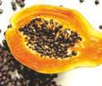
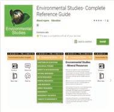

ந கலைப்‌தாஷர்‌ கழ்நிலையியல்‌

சூழ்நிலையியல்‌ கோட்பாடுகள்‌

ட டட

நி டைய

இப்பாடத்தினைக்‌ கற்போர்‌

9: உயிரினங்கள்‌ மற்றும்‌ சுவற்றின்‌: குழ்நிலைகளுக்கிடையேயான தொடர்வை பந்த வள்ளம்‌

4 உமர்மறறம்‌ உயிரற்ற காரணிகள்‌ உமிரத்தாகை இயக்கத்தின்‌ மீத ஏற்பத்‌ தாக்கத்தை விவரிக்கும்‌

2 உயிரினங்கள்‌ எவ்வாறு கழல்‌ மாற்றங்களுக்கேற்ப்‌

சஷக்முறைகைபப்ி ந “அறிந்து கொள்ளவும்‌ இயலும்‌

௨1 கழ்நிலையியல்‌. ௩௨ கழ்நிலையியல்‌ காரணிகள்‌.

83 குழ்றிலையியல்‌தக அமைவுகள்‌:

௨௩ கனிகள்‌ மற்றும்‌ விதைகள்‌ பரவுதல்‌. உமிரினங்களுக்கும்‌ கழலுக்கும்‌ இடையேயுள்ள. தொடர்மினைப்‌ பற்றிய உயிரியல்‌ பிரிவு கழ்நிலையியல்‌ எனப்படும்‌. இதைத்‌ தனிப்பட்ட உயிரினம்‌, உயிரித்தொகை,. குழுமம்‌, உயிர்மம்‌: அல்லது உயிர்க்கோளம்‌ மற்றும்‌ அவற்றின்‌ கழல்‌

ஆகியவற்றைக்‌... கரத்தில்‌ கொண்டு. ஆய்வு, செய்யலாம்‌. வெவ்வேறு. வகையான நமது, குழ்திலைகளை நோக்கும்‌. போது ஒருவர்‌

"இவ்வாறான வினாக்களைக்‌ கேட்கலாம்‌,

உரன்‌... தாவரங்கள்‌... கல்லது... விலங்குகள்‌: “இடங்களைப்‌ பொறுத்து வேறுபருகின்றன?

“வெவ்வேறு. இடங்களின்‌ உயிரி பன்மம்‌. மாறுபடுவதற்கான காரணங்கள்‌ யாவை?

பட்பட்ட்டப

\-- மண்காலநிலை மற்றும்‌ பிற புவி சம்சங்கள்‌ எவ்வாறு தாவர: மற்றும்‌ விலங்கினங்களைப்‌ பாதிக்கின்றன?

'இந்றிலையானது நேர்‌ எதிராகவும்‌ நடைபெறுகிறது. "இது போன்ற வினாக்களுக்கு சூழ்நிலையியல்‌,

படிப்பின்‌ மூலம்‌ சிறப்பாகப்‌ பதிலளிக்க முடியும்‌. குழலுக்கேற்ப உயிரினங்கள்‌ எவ்வாறு நடந்து கொள்கின்றன என்பனவற்றைக்‌ கண்டறிகலுக்கறிய கோட்பாடுகளைப்‌ பிந்து கொள்ளும்‌ முக்கியச்‌ செயல்‌. அறிவியலாகச்‌.. சழ்நிலையியல்‌ ஆய்வுகள்‌: நிகழ்கின்றன.

6.1 சூழ்நிலையியல்‌ (8௦009).

கழ்திலையியல்‌.. (04௦௦06) ர என்பது. சி (ஸீ அல்லது

கயிருப்பு மற்றும்‌. 00௦ (த்தல்‌) என்ற இரண்டு வாற்களால்‌.. ஆனது... இது முதலில்‌ ஷய்ப்பர்‌ (2௦௮) என்ப வராம்‌ முன்மாழியம்பட்டது கழ்திலையியல்‌ பற்றிய பரவலாகஏற்றுக்கொள்ளப்பட்ட வரையறை எர்னஸ்ட்ஹெக்லகல்‌ 1969) என்பவரால்‌ உருவாக்கப்பட்டது அஷச்சாண்பர்‌ வன்‌ சம்போல்ட - ஐழ்நிலையியலின்‌ மரின்‌. ஓடம்‌ தற்காக கஷ்நிலையியலின்‌ ரந்தை

(உ மி்ரா இந்தியர்‌ மழ்றிலையியலின்‌ ந்தை

க்‌ மிஸ்ரா

கப கழ்நிலைமியல்‌ வரையறை இயற்கை வாழுங்கள்‌ உறைவிடங்களிலுள்ள. தாவறங்கள்‌ மற்றும்‌ விலங்குகளைப்பற்றிய படிப்பு இதவாகம்‌. எய்ட்‌ (265) உமிரினங்களுக்கம்‌ அவற்றின்‌ கலக்கம்‌ "இடையேயான பரஸ்பர உறவு பற்திய படிப்பே கழ்திலையியல்‌ எனப்படுகிறது. “சர்னஸ்ட்‌9ஹக்கல்‌ (6009)

ரழ்றலையியல்‌ கோப்புகள்‌. 133

எணகபதது

ஹவராடுஞ்௦9ட/

&1௨. சூழ்நிலையியல்‌ படிகள்‌ (8௦0௦908 ட்ட

கழ்றிலையியம்‌. பன்‌ “கானம்‌ அல்லது. உயிரினங்களின்‌: குழ்நிலைமியம்‌.. பக்‌. உயரம்‌ என்பவை, சூழலோடு 4 உம்ரினங் கள்‌ நவ்ரப்ப செயல்படுவதால்‌ ஏற்பட்‌: ௩ உமிரினத்‌.. நொதிகள்‌ ஆகம்‌... குழ்றிலைமியல்‌ பல்மண்பம்‌ மிலை.... அமைப்பின்‌ ்‌. அப்படை அலகு ஒரு குழுமம்‌ குனித்த உமிரினம்‌ ஆகம்‌. ௩ ழ்நிலையியல்‌ அமைப்பின்‌ கி பேகன்‌ கழ வக்கம்‌ உட கொடுக்க்பட்டுள்ளது.

தனி உமரின்‌. 619 சூழ்நிலையியலின்‌: வகைகள்‌

கழ்நிலையியல்‌ முக்கியமாக இரண்டு பிறிவகளாகப்‌ மிரக்கப்பட்டள்ளது. அவை சுய சூழ்நிலையியல்‌ மற்றும்‌ கூட்டச்‌ கழநிலையியல்‌ ஆகும்‌.

உச சூழ்நிலையியல்‌ (4யடீஃ௦1௦ஐ)) : ஒரு தனிச்‌ சிற்றினத்தின்‌ சூழ்நிலையியல்‌, சுய சூழ்நிலையியல்‌. எனப்படம்‌. இது சிற்றினச்‌ சூழ்நிலையியல்‌ என்றும்‌ அழைக்கப்படுகிறது.

"2 கூட்டச்‌ சூழ்நிலையியல்‌ ($ர௨ர1௦8)) - ஒன்று அல்லது அதற்கு மேற்பட்ட உயிரிக்தொகை அல்லது. உயிரினச்‌ குழுமத்தின்‌ சூழ்நிலையியல்‌, கட்டுச்‌ கழ்றிலையியல்‌ எனப்பரும்‌, இது சமுதாய குழ்நிலையியல்‌ என்றும்‌ அழைக்கப்படுகிறது.

சூழ்நிலையியல்‌ துறையில்‌ ஏற்பட்ட பல்வேறு முன்னேற்றங்கள்‌... மற்றும்‌... ஊளர்ச்சிகளின்‌: விளைவாக, இதில்‌ புதிய பரிமாணங்களும்‌

வகைகளும்‌ தோன்றின. மூலக்கூறுகழ்நிலையியல்‌, ரழ்நிலையியல்‌.. ஷாழில்நுட்பம்‌, . புள்ளியியல்‌. கூழ்நிலையியல்‌ மற்றும்‌ ஸல்‌ நர்சியல்‌ ஆகியன இவற்றின்‌ சில மேம்பட்ட துறைகளைக்‌.

௫௩4 புவிவாழிடம்‌ மற்றும்‌ செயல்வாழிடம்‌. (ன்ன எ்ற்ள்‌)

புவிவாழிடம்‌: உயிரினங்கள்‌ அல்லது சிற்றினங்கள்‌ வாழும்‌ ஒரு குறிப்பிட்ட புறச்சூழல்‌ காரணிகள்‌ பற்ற "இடத்திற்கு பனிவாழிடம்‌ என்று பெயர்‌ ஆனால்‌ ஒரு "குழுமத்தின்‌ சூழலுக்கு உயிரி நில அமைவு (8:௦05) என்று வயர்‌.

செயல்‌ வாழிபம்‌:. உயிரிக்காறணிச்ரூலில்‌. ஏர்‌ உயிரினத்தின்‌ அமைவிடம்‌ மற்றும்‌ கழ்நிலைத்‌ தொகுப்பில்‌ அதன்‌ வினையாற்றல்‌ ஆகியவை கொண்ட அமைப்பு ச்வுயிரினத்தின்‌ செயல்‌ வாழிடம்‌ என்று

பட ஒழ்றிகையியல் கோப்புகள்‌

'அழைக்கப்பரகிறறு. ரோஸ்வல்‌ ஹில்‌ ஜான்சன்‌ என்ற 'இயற்கையாளர்‌ இர்வால்லை. உருவாக்கினாலும்‌, கிரைம்‌. (ளா) என்பவர்‌ இந்தச்‌ சொல்லை. 'கையாண்டவராகக்கருதப்பரகிறது ஒரு உயிரினத்தின்‌: வழிடம்மற்றும்‌ யல்‌ வாழிடம்‌ ஆகியவற்றைகூட்டாக. கழ்நிலை அமைவு (5:0௦) என்று அழைக்கலாம்‌. வாழிடம்‌ மற்றும்‌ செயல்‌ வாழிடத்திற்கிடையேயான:

வேறுபாகள்‌கீரகண்டவாறு வழிம செயல்வாழிமம்‌ உமர்‌ (சிற்றினம்‌). ரகழ்நிலை. அமைந்திருக்கும்‌ ஒரு... கொகுபபிலு்ளடர்‌ றபட்ட பண இடமாகும்‌. உயிரினம்‌ வற்றிக்கம்‌ டக்‌ டக வழிபறி... ஒரு யல்‌ ஊாழிடத்ில்‌ \[மேற்பட்ட உயிரினங்களால்‌ ஒரேயாரு சிற்றினம்‌. (சனங்கள்‌ பகிந்து அடைந்திருக்க. 0ண்ப்வை. உயிரினம்‌ னி வாழிடம்‌ | உமரினங்கள்‌ கம தன்மையை மறம்‌ பவ நிலைக்க கவளிய்பட்தகிறது... ஏற்பச்சவல்‌ வறம்‌ நடவட அம

அப வணை 2 வாழிடம்‌ மற்றும்‌ ஊயல்‌. ஊழிடத்திற்கிடையேயான வேறுயாடகள்‌ பயன்பாட்டு... கழ்திலையியல்‌

ஜு ல்லதைஷழல்‌ தொழில்நுட்ப 6000 2 ௭014 ௦4௦௦)/ : கழ்மிலையியல்‌.. சிவில்‌ பெண்பாமுயன்பாட்ு கழ்நிலையியல்‌ அல்லது, சூழல்‌ தொழில்நுட்பம்‌ என அழைக்கப்படுகிறது. "இயற்கை வளங்களை நிர்வகிக்கவும்‌, குழப்பக்‌ ல்‌ அமைப்புக்‌, கா வன உயிரி அகியவற்ின்‌. முகா மற்றும்‌ மேலாண்மை போன்றவற்றை. \[நிர்வகிக்கவும்‌ பதுக்காக்கவும்‌ உறவுகிறறு. உயிரி பன்மப்பாதுகாப்பு, சூழல்‌ மறுசீரமைப்பு, புவிவாழிட. ஊழ்வதஏ. மேலாண்மை... ககர இனங்களின்‌ மேலாண்மை, பாதுகாக்கப்பட்ட நதிகளின்‌. செலாண்மை, இயற்கை "நிலத்தோற்றத்தை திட்டமிடல்‌, சூழலின்‌ தாக்கம்‌, கணையப்‌. ஆகிவற்றை..." கதிர்க்‌ கழ்றிலைகளுக்கு ஜப உப்டககப்பவது கழல்‌

லக்‌ 615 சூழ்நிலையியல்‌ சமானங்கள்‌ (5001௦908' கய்விளா(,

வகைப்பாப்டியலில்‌ வேறுபட்ட சிற்றினங்கள்‌

வெவ்வேறு புனிப்‌ பரப்புகளில்‌ ஒரே மாதிறியான: வாழிடங்கள்‌ (செயல்‌ வாழிடங்கள்‌) பெற்றிருந்தால்‌ அவற்றைச்‌ கழ்நிலையியல்‌ சமானங்கள்‌ என: அழைக்கின்றோம்‌.ஹவராடுஞ்௦9ட/

எரத்தக்காட்ட “இந்திய மேற்குக்‌ தொடர்ச்சி மலைகளிலுள்ள.

குறிப்பிட்ட சில. தொற்றுகாவ. ஆர்கிட்‌ சிற்றினங்கள்‌, தென்‌ அமெரிக்காவில்‌ உள்ள. தொற்றுக்தாவர ஆர்கிட்களிலிருந்து

வேறுபடுகிறது. இருப்பினும்‌ அவை அனைத்தம்‌ காற்று தாஷரங்களே.

2 இந்திய மேற்கு. ஷொடர்ச்சி. மலையிலுள்ள புல்வெளி சற்தினங்கள்‌ அமேரிக்காவின்‌ களிர்‌: மதேசப்பு்கவெளி(ஷ சிறநினங்களிலிரந்ு 'வேறுபருகிறது. இருப்பினும்‌ அவை அனைத்தம்‌. சூழ்நிலையியல்‌ புல்‌வளி இனங்களே. இவை. அனைக்கும்‌. முதல்நிலை. உற்பத்தியாளர்கள்‌ ஆரும்‌.மேலும்‌ இவை சூழ்நிலை ஷாப்பில்‌ ஒரே. மாதிரியாகச்‌ செயல்படுகின்றன.

62 சூழ்நிலையியல்‌ காரணிகள்‌ (5000908. ட்‌\] மங்வேறு... உயிரினங்களும்‌. கழலோம ஒருங்கிணைந்துள்ளன. கழல்‌ என்பது (ு்று்ு்‌) இயற்பியல்‌, வேதியியல்‌ மற்றும்‌ உயிரியல்‌ ஆகிய கூறுகளை உள்ளடக்கியது உயிரினத்தைர்‌ ச்றிய்ள. ஒரு கூறானது ஒரு உமிரனத்தின்‌ வாழ்க்கையைப்‌. பாதிக்கும்‌ பொது அது ஒரு காரணியாமிறது. இத்தகைய. அனைக்குக்‌ காரணிகளும்‌ ஒன்றாக, மல்‌ காரணிகள்‌: கல்லது... கழ்நிலைக்‌ காரணிகள்‌. ஈன: இழைக்கப்படகின்றன... இந்தக்‌ காரணிகள்‌ ஒரு. உயிரினத்தின்‌ கழலை உருவாக்கம்‌ உயிருள்ள. உயிரற்ற காரணிகள்‌ என:

'இவைபின்வறுமாறு: ௩கால நிலை காரணிகள்‌:

௨மண்‌ காரணிகள்‌.

நிலப்பரப்பியல்‌ காரணிகள்‌:

4.  உயிரி காரணிகள்‌

"மேற்கண்ட காரணிகளைப்‌ பற்றி நாம்‌ சுருக்கமா! விவாதிப்போமாக,

6.21 கால நிலை காரணி (0121௦ 8801019) கால. நிலையானது. தாவ வாழ்க்கையினைக்‌ கட்டப்படுத்தும்‌ முக்கியமான இயற்கை காரணிகளில்‌. ஒன்றாகும்‌. கால நிலை காரணிகள்‌ ஒளி, இவப்பநிலை, நீர்‌, கற்று மற்றும்‌ தீ ஆகியவற்றை

மவ தாவரங்களை பாக்கம்‌ ம்‌ கரணிகன்‌. அ) ஒளி (மம.

ஒளி என்பது தாவரங்களின்‌ அடிப்படை வாழ்வியல்‌. செயல்முறைகளான ஒளிச்சேர்க்கை, நீராவீப்போக்ு, விதை முளைத்தல்‌ மற்றும்‌ மலர்தல்‌ ஆகியவற்றிற்கக்‌, “தேவையான நன்கு அறியப்பட்ட காரணியாகும்‌. மணிகனுக்கும்‌ புலனாகும்‌ சரிய ஒளியின்‌ பகுதியே. வளிச்சம்‌(கண்ணுருடளிஎன்று அழைக்கப்படுகிறது. ஒனியில்‌ காணக்கூடிய பகுதியின்‌ அலைநீஎம்‌ சமர. 800 ர (சேதா) முகல்‌ 700 0. (சிவப்பு வரை: அமைத்துள்ளது. ஒளிச்சேர்க்கையின்‌ வீதம்‌ நீலம்‌ 1400 - ௧௦௦ ரா) மற்றும்‌ சிவப்பு (500 - 700 ர அலைரிளத்தில்‌.. அதிகபட்சமாக. உள்ளது. நிமமாலையில்‌ பர்சை (500 - 60௦ ௭) அலைநீஎம்‌ "குறைவாகவே தாவரங்களால்‌ உறிக்சப்பகிறது.

ஒளியினால்‌ தாவரங்களுக்கு ஏற்படும்‌ விளைவுகள்‌:

ஹவராடுஞ்௦9ட/

ஒளியின்‌. தீவிரச்‌ சகிப்புத்‌ தன்மையின்‌:

டிப்படையில்‌ தாவரங்கள்‌ இரண்டு வகைகளாகப்‌

மிரிக்கப்படுகின்றன. அவைகள்‌.

1 ஒனிநாட்டத்‌ தாவரங்கள்‌. (எஷஸுஸ). ஒளியினை. விரும்பும்‌... தாவரங்கள்‌, எடுத்துக்காட்ட: ஆஞ்சியோஸ்பெர்்கள்‌.

௨. நிழல்‌ நாட்டத்‌ தாவரங்கள்‌ (50௦ 0ர//29)-நிடலை. வரம்பும்‌. தாவரங்கள்‌... எடுத்துக்காட்ட பிரையோஃபைப்டகள்‌. மற்றும்‌ பெரிடோஃபைட்டுகள்‌.

ஆழ்கடலில்‌ (2 ௦௦ மீ) ல்‌ ஒளியற்ற இருள்‌. காணப்படுகிறது மற்றும்‌ அங்கு வசிப்பவை கூரிய ஆற்றலின்‌ தேவையை அறிந்திருக்க. வாய்ப்பில்லைபிறகு அவைகளுக்கான கற்றல்‌. மூலம்‌ எது?

ட வதொல்கால நிலையியல்‌. (ஸ்லனானி று: தற்போது, பனியில்‌ வாழும்‌ தாவரங்கள்‌, விலங்குகள்‌ மற்றும்‌ சூழல்‌.

மண்டலம்‌ ஆகியவை.கற்காலக்‌.

காலச்‌ கழ்நிலையை வடிவமைக்க உதவுகிறது. ட்தக்கட்ட: பல்லாயிரக்கணக்கான: ஆண்டிகளுக்கு. முன்‌ பனி. கமிழ்களுக்கள்‌ காணப்படம்‌ மகரந்தம்‌, பவளம்‌ பாறை, மற்றம்‌ மப்கியவிடங்கு மற்றும்‌ தாவரங்கள்‌

ஆ) வெப்பநிலை: வெப்பநிலை என்பது ஒரு உயிரினத்தின்‌ கிட்டதட்ட அனைத்து வளர்சிதை மாற்றங்களையும்‌ பாதிக்கும்‌ முக்கியக்‌ காரணிகளில்‌ ஒன்றாகும்‌.

உமிரினத்தின்‌ ஒவ்வாரு வாழ்வியல்‌. செயல்முறையும்‌, அதிகளவு வளர்சிதை மாற்ற விகிதத்தை உண்டாக்க ஒரு உகந்த வெப்பநிலை. தேவைப்படுகிறது. வெப்பநிலையின்‌ மூன்று வரையறைகள்‌. எந்த. உயிரினத்திற்கும்‌ அங்கிகறிக்கப்படலாம்‌. அவை.

11 குறைந்தபட்ச வெப்பநிலை குறைந்த வாழ்வியல்‌

நடவடிக்கைகளுக்கு உகந்தது

௨. உகந்த வெப்பநிலை - அதிகமான வாழ்வியல்‌. நடவடிக்கைகளுக்கு உகந்தது

க அதிகபட்ச வெப்பநிலை. - வாழ்னியல்‌ நடவடிக்கைகள்‌ தடைப்பருகிறது.

ஒரு பகுதியில்‌ நிலவும்‌ அஷப்படையில்‌, நாங்கியர்‌ (ய தாவரங்களைப்‌ பின்வரும்‌ நான்கு வகைகளில்‌. வகைப்பரத்தியுள்ளார்‌. அவை மெகாஷர்ம்கள்‌, மீசோஷர்ம்கள்‌,. மைக்ரோஷர்ம்கள்‌.. மற்றும்‌

(பக. ஒழ்ிகையியல் கோப்புகள்‌

ஈஹக்கிஸ்ட்டோேர்ம்கள்‌. வெப்ப நீர்‌ ஊற்றுகளிலும்‌, ஆழமான. கடல்‌. நீரோட்டங்களிலும்‌ சராசரி இப்பநிலை 100 “0 க்கு அதிகமாக இருக்கம்‌. இப்ப சகிப்பு தன்மையின்‌ அடிப்படையில்‌. உமிரினங்கள்‌ இரண்டு வகைகளாக மிரிக்கப்படுகின்றன. அவை உயூரிஷெர்மல்‌: இவை அதிக வெப்பநிலை ஏற்ற இறக்கங்களைப்‌ பொறுத்துக்‌. கொள்ளும்‌: உயிரினங்கள்‌, எருக்துக்காட்டு ஜோஸ்மரா (கடல்‌ ஆஞ்சியோஸ்ஷர்ம்‌) மற்றும்‌ ஆர்ட்டிமீசியா ப்ரைஷண்டேட்டா. உஸ்டனோஷர்மல்‌: இவை குறைந்த வெப்பநிலை. மாறுபாடுகளை மட்டும்‌ பருத்து கொள்ளக்கூடிய உயிரினங்கள்‌. எடுத்துக்காட்டு : மா மற்றும்‌ பனை: (மில வாழ்‌ ஆஞ்சியோஸ்வர்ம்கள்‌) வம்பமண்டல நாடுகளான கனடா, மற்றும்‌ 6ஜர்மனி. "போன்றவற்றில்‌ மா தாவரமானது வளர்வதுமில்லை. காணப்படிவதுமில்லை. வெப்ப அருக்கமைவு (7/எ௱வி $ரகின0ர)

பம்‌ ஐ: களத்தின்‌ ஒவப்ப அரக்கமைவு

1 எிலி்னியான்‌ : நீரின்‌ வப்பமான மேல்‌ கடுக்க உ ஷப்பாகிம்னியான்‌:.. நீரின்‌. வெம்பநிலை. படப்பயாகக்‌ குறையும்‌ ஒரு மண்டலம்‌ ட ஹைப்போலிம்னியான்‌: குளிர்ந்த நீருள்ள ச்‌ அடுக்கு வெப்பநிலை. கடிப்படைமிலான மண்டலங்கள்‌: (ளாம சாவி: விரிவகலம்‌ மற்றும்‌ கத்துயரம்‌ ஆகியவற்றில்‌

உள்ள மாறுமாடுகன்‌ பூமியின்‌ மேற்பரப்பில்‌ இவப்பநிலை.. மற்றும்‌ தாவரக்கூட்டங்களை: பாதிக்கிறது... விரிவகலம்‌ மற்றும்‌ குத்துயரம்‌ ஆகியவற்றின்‌. அடிப்படையில்‌.

தாவரக்கூட்டங்களானவை படங்கள்‌ மூலம்‌ கீழே விவரிக்கப்ப்டள்ளது.ஹவராடுஞ்௦9ட/

விறிவகலம்‌ (மய்ய): விரிவகலம்‌. என்பது. முத்திய ரேகையின்‌ 01 முதல்‌, துருவங்களின்‌: 90 வரையில்‌ காணப்படும்‌ கோணமாகம்‌, குத்தயரம்‌ (யய; எவ்வளவு,

கடல்‌. மட்டத்திலிருந்து: மேலே... சந்தப்‌. பகுதியானது.

அமைந்துள்ளது என்பதைக்‌ குறிப்பதாகும்‌.

படம்‌ கக குத்துயர தாவரக்கூட்டங்களின்‌ மண்டலம்‌.

வெப்ப நிலையினால்‌ எற்படும்‌ விளைவுகள்‌: கீழ்கண்ட வாழ்வியல்‌ செயல்‌ முறைகள்‌:

வெப்பநிலையால்‌ பாதிக்கின்றன.

உ ஷெப்பறிலை ஒரு தாவர உடலில்‌ நடைவறும்‌. அனைத்து உயிர்வேதியியல்‌ வினைகளுக்கு.

உதவும்‌. நொதிகளின்‌ செயல்பாட்டைப்‌ பாதிக்கின்றன.

இது உயிரியல்‌ அமைப்புகளில்‌ 00, மற்றும்‌ 0, குரைதிறனை.. பாதிக்கிறது... சுவாசத்தை. அதிகரிக்கிறது... மற்றும்‌ நாற்றுக்களின்‌. வளர்ச்சியைத்‌ தூண்டுகிறது

உயர்‌ ஈரப்பதத்துபன்‌. கூடிய குறைந்த. வெப்பநிலை. தாவரங்களுக்கிடையே நோய்களைப்‌ பரப்புகிறது.

உரரப்பதத்துடன்‌... மாறுபரும்‌. வெப்பநிலை. தாவரக்கூட்ட வகைகளின்‌ பரவலை; தீர்மானிக்கிறது.

இங்க: ர்‌ மிகவும்‌ முக்கியமான காலநிலை காரணிகளில்‌. ஒன்றாகும்‌. இது அனைத்து உயிரினங்களின்‌:

முக்கியச்‌. செயல்பாடுகளைப்‌. பாதிக்கின்றன. பரிணாம. வளர்ச்சியின்போது நீரிலிருந்து தான்‌: புவியின்‌... உயிரினங்கள்‌... தோன்றியதாக

நம்பப்படுகிறது. பூமியின்‌ மேற்பரப்பு 70% க்கம்‌: மேற்பட்ட நீரை உள்ளடக்கியுள்ளது. இயற்கையில்‌ நீரானது மூன்று விதங்களில்‌ தாவரங்களுக்குக்‌ கிடைக்கின்றன. அவை வளிமண்டல ஈரப்பதம்‌, முழைவோழிவு மற்றும்‌ மண்‌ நீர்‌ முதலியனவாகும்‌.

தாவரங்களின்‌. உற்பத்தி திறன்‌, ஆகியவைகள்‌ நீர்‌ கிடைப்பனன்‌ சளவினைச்‌ சார்ந்தது. மேலும்‌ நீரின்‌ தரம்‌ குறிப்பாக நீர்‌ வாழ்‌

பரவல்‌,

உயிரினங்களுக்கு முக்கியமானதாகும்‌. பல்வேறு,

நீர்நிலைகளில்‌... நீரில்‌. காணப்படுகின்ற.

உய்பத்தன்மையின்‌ மாத்த அளவு,

உ௨ள்‌ நாட்டி. நீர்‌ அல்லது நன்னீர்‌, ஆகியவற்றில்‌ 5%.

௨. கடல்‌ நீறில்‌50-05%.

% உப்பங்கழி(ஷஸட)-100%மேலான உப்பு தன்மை:

உப்பு. சகிப்புத்‌. தன்மையின்‌ அடிப்படையில்‌.

உயிரினங்கள்‌... இரண்டு வகைகளாகப்‌

மிிக்கப்படுகின்றன.அவை

உயூரிஹாலைன்‌: இவை உப்புத்தன்மை அதிகமான

நீரிலும்‌ வாழக்கூடிய உயிரினங்கள்‌. எடுத்துக்காட்டி:

கமல்‌. பாசிகள்‌. மற்றும்‌. கடல்‌ வாழ்‌

ஆக்சியோஸ்வர்ம்கள்‌.

2௨ ஸ்ஷனோஹாலைன்‌: இவை குறைவான

உப்புத்தன்மை உள்ள நீரில்‌ மட்டுமே வாழுக்கூடிய

கீர்‌

உயிரினங்கள்‌. எருக்தக்காட்ட: கழிமுகத்துவாரத்‌ தாவரங்கள்‌,

வல்ஷக்க. ஒஸ்காணி. \[ஸ்டனோர்கல்‌ | யூரஷர்கல்‌ | வெப்பநிலை. \[கடோஹாலைன்‌ |யூரீஹாலைன்‌ | உப்த்கன்மை. ஸ்னோசியஸ்‌.. | யூரசியஸ்‌. | வழிபந்தேர்வ.

(யல்‌ வாழிப்‌,

டைசோஹைப்ரக்‌ | யூரீணைப்ர்‌ தண்ணர்‌ (கஷமோாஃபாலிக்‌|யூர்பாதிம்‌ உணவு, ஸ்பைனோபேதக்‌. யூதக்‌. நானம்‌ கபரகன்‌.

கமம்‌ "அட்டவணை ௨: சகிப்புத்‌ தன்மைக்கான ழம்‌ காரணி

ர்றலையியல்‌ கோப்புகள்‌. 137

ஹவராடுஞ்௦9ட/

நச்சு சகிப்புத்‌ தன்மைக்கான (70 லா (௦ (டப00) எடுத்துக்காட்ட மசோயா.தக்காளி போன்ற தாவரங்கள்‌ காட்மியத்வை பிறிக்குத்துச்‌ சில: சிறப்பு கூட்டிச்‌ செல்களில்‌: செமித்துக்‌ காட்மியத்தின்‌ நச்சுத்தன்மை மற்ற. செல்களைப்‌ பாதிக்காமல்‌ நிர்வகிக்கும்‌ தன்மையைப்‌ பெற்றுள்ளன.

ல்‌ஆகாயத்‌ தாமரை போன்ற தாவரங்கள்‌: காப்மியத்தைதங்களதுபரதக்தோரு இணையச்‌ செயது சகிப்புத்தன்மையை... ஏறபுததிக்ககாள்கின்றன. (இந்தத்‌ தாவரங்கள்‌ மாசடைந்த மண்ணிலிருந்து காப்மியத்தை அகற்றவும்‌ பயன்படுகின்றன. இதற்கம்‌, தாவரங்களால்‌.. சீரமைக்கப்படதல்‌ (90. (ரமரிவ0ர) என்று வயர்‌.

ஸுகற்றா விகையடன்‌ கூடிய இயங்கும்‌ வளி, கா்று என: இழைச்சம்பறகிறது.. இது ஒரு மன்கியர்‌ நல்‌ காரணியாகும்‌. வளிமண்டலக்‌ காற்று பல வளிகள்‌, மகள்கள்‌ மறறும்‌ பிற கூறுகளைக்‌ கொண்டுள்ளது. வளிமண்டலத்தில்‌ காணப்படும்‌ வளிகளின்‌ கலவை. கீழ்வரனாறு : நைப்ரகன்‌ 7௦4, ஆக்ஸிகன்‌ 27. கார்பன்டை ஆக்லைரு. 000% ஆர்கான்‌ மற்றம்‌ பேர வயக்கள்‌ ௦2௦5. ரானி, வளிமாசக்க்‌, நாரி, புகைத்துகள்கள்‌,.. நுண்ணியிரிகள்‌,.. மரந்க்‌ மகள்கள்‌... வித்துக்கள்‌. போன்றவை. காற்றில்‌ காணை்பகின்ற சனைய கூறுகளாகம்‌. காற்றின்‌. (வேகத்தை அளவிருவதற்குப்‌ பயண்பருத்தப்பரும்‌. கருவ சனிமோம்ப்டர்‌ ஆகம்‌.

காற்றினால்‌ ஏற்படும்‌ விளைவுகள்‌:

உ காற்று மழையினை உருவாக்கும்‌ ஒரு முக்கியக்‌ காரணியாகும்‌.

உ-இது ஏரிகள்‌ மற்றும்‌ கடல்களில்‌ நீர்‌ அலைகளை: ஏற்படுத்துவதால்‌. காற்றோட்டத்தினை. மேம்படத்துகிறத.

உ வலுவான காற்று மண்‌ சறிப்பை ஏற்படுத்துகிறது. மற்றும்‌ மண்ணின்‌ வளத்தினைக்‌ குறைக்கிறது.

உ இது நீராலிப்போக்கின்‌ வேகத்தினை அதிகரிக்கச்‌ வய்கிறது.

உ காற்றின்‌ மூலம்‌ மகரந்தச்‌ சேர்க்கை நடைவறும்‌. தாவரங்களுக்கு இது உதவிபுரிகிறது.

இது. கனிகள்‌, விதைகள்‌, வித்துக்கள்‌: இன்னும்‌. மலவற்றினைப்‌ பரவச்‌ செய்வதற்கு உதவிபுரிகிறத.

உ வலுவான காற்று வரிய மரங்களை வேரோடு சாய்த்து விரகிறது.

உ ஒற்றைத்‌. திசை ஸம்‌ காற்றானது மரங்களில்‌ கொடி வவ ரஷ நல வளர்ச்சியினைக்‌ தூண்டுகிறது.

வத்ரால.

ரிவாருள்களின்‌ வேதியியல்‌ செயல்‌ முறை

காரணமாக, வெப்பம்‌ மற்றும்‌ ஒளி ஆகியவை.

வெளியிருவதால்‌ ஏற்படக்கூடிய வெப்ப. உமிழ்‌ காரணியே தீ எனப்படுகிறது. இது வரும்பாலும்‌ மனிதர்களால்‌. உருவாக்கம்பருகின்றன.... சில

"நேரங்களில்‌ மரத்தின்‌ மேற்பரப்புகளுக்கு இடையே

படம்‌ 65. மரங்களின்‌. கொடி வடிவம்‌

உராய்வு ஏற்படுவதாலும்‌ இயற்கையாக இது, உருவாக்கப்பகிறது. தீப்‌. பொதுவாக கீழ்கண்டவாறு பிரிக்கப்படுகிறது. அவை.

தரைத்‌ தீ (ரப்‌ 8). இது சற்ற நிலையில்‌.

(நிலத்தடியில்‌ எரிகின்றன.

உருப்பு தீ (9120௨ 89: இது சீறு வடள்‌ மற்றும்‌

மர்‌ படிகளை எரககின்றன.

பெ கிரடத்‌ தீ (மமஸ ஈஷுட இது காடுகளின்‌:

மேற்பகுதிகளை எரிககின்றன.

தீயன்‌ விளைவுகள்‌

உட தீயானது... தாஷங்களுக்கு அழிவுக்காரணியாக விளங்குகிறது.

4 வரி காயம்‌ அல்லது எறிதலால்‌ ஏற்படும்‌ வடுக்கள்‌ ஒட்டண்ணி. பூஞ்சைகள்‌. மற்றும்‌. பூர்சிக்‌ நுழைவதற்கான பொருத்தமான இடங்களாகத்‌

நிகழ்கின்றன.

நேரடியான:ஹவராடுஞ்௦9ட/

உ ஒளி, மழை, ஊட்டர்சத்து சுழற்சி, மண்ணின்‌: "வளம்‌, ஹைட்ரஜன்‌ அயனிச்‌ செறிவு, (44, மண்‌: தாவரங்கள்‌ மற்றும்‌ விலங்குகள்‌ ஆகியவற்றில்‌ "இது மாறுபாடுகளை உண்டாக்குகிறது.

உ. எரிந்த பகுதியிலுள்ள மண்ணில்‌ வளரும்‌ சில: வகையான பூஞ்சைகள்‌ எறிந்த மண்‌ விரும்பி. (௫௦) எனப்பருகின்றன.. எருத்துக்காட்ட: 'பைரோனிமா கண்‌ஃப்புளுவென்ஸ்‌,

தீச்‌ சப்டிகாப்டிகள்‌ (ரமியசமா 61 89: உர்‌ (வரணி) மற்றும்‌ பைரோணிமா (பூஞ்சை) தாவரங்கள்‌ எரிந்த மற்றும்‌ தீயினால்‌ அழிக்க பகுதிகளைச்‌ சட்டம்‌ காட்டிகளாக திகழ்கின்றன. எனவே இவை தீச்‌ சப்டக்காப்டிகள்‌ என: அழைக்கம்படுகின்றன.

தீத்‌ தடுப்பான்‌ (௨ மாஷ6: தீயின்‌ வேகத்தைக்‌, குறைக்கவும்‌ அல்லது. தீ. முன்னேறாமல்‌: நிறுத்தவும்‌ தாவரப்‌ பகுதிகளுக்கிடையே. காணப்படுகின்ற இடைவெளியே ஆகம்‌.

"இயற்கை தீத்தநப்பு (8. ஈனபல்‌ ட நாகர): 'தாஷங்களிடையே காணப்படுகின்ற ஆறுகள்‌ எிகள்‌, பள்ளத்தாக்குகள்‌ ஆகியவை தீதகடபபற்கு "இயற்கையாகவே அமைந்துள்ள தடைகளாகம்‌.

ரைப்டிபோம்‌. (ரரர்மளாலு:.... தாவரங்களில்‌ காணப்படும்‌ தீக்கு எதிரான உடற்கட்டமைவு, 'இதுவாகம்‌. இது குறுக்கு வளர்ச்சியின்‌ முடிவாகக்‌ தோன்றிய சூபரினால்‌ ஆன வரிடம்‌, புறணி, வேனோயம்‌ திசுக்களான. பல கருக்களை: கொண்டது. இப்பண்பு க, ீர்‌ இழப்பு பூச்சிகளின்‌ காக்குகல்‌, நுண்ணுயிர்‌ கற்று: ஆகியவற்றிலிருந்து தாவரங்களின்‌ தண்டுகளைப்‌ பாதுகாக்கின்றன.

6.2.2 மண்‌ காரணிகள்‌ (80209௦ 12025): ஒரு குறிப்பிட்ட பகுதியில்‌ உருவான மண்ணின்‌ “இயற்பியல்‌ மற்றும்‌ வேதியியல்‌ கூழமைப்பை பற்ற ஒரு. உயிரற்ற காரணி மண்‌ காரணிகள்‌ எனப்படுகின்றன. மண்ணைப்‌ பற்றிப்‌ படக்கும்‌ பிரிவு பெடாலஜி (96்ஸ்று) எனப்படம

மண்‌:

தாவரங்கள்‌ வளர்வதற்கு உகந்த, உதிர்வடைந்க புவியின்‌ மேற்புற அரக்கு மண்‌ எனப்பருகிறது. இது நீர. காற்று... மண்வாம்‌... உயிரினங்கள்‌ போன்றவற்றைக்‌ கொண்ட ஒருங்கிணைந்த கூப்டுக்கலவை ஆகம்‌.

மண்‌ உருவாக்கம்‌

கழல்‌. மற்றும்‌ காலநிலை செயல்முறைகளின்‌: படிப்படையில்‌ பாறைகளிிருந்து படிப்படியாக ஒவெவ்வேறுவீதங்களில்மண்‌ உருவாக்கப்படகின்றது.

மண்‌. உருவாக. பாறை உதிர்வடைதல்‌.

முதற்காரணமாகிறது.உயிறியல்‌ வழி உதிர்வடைதல்‌

(னனடு.. உறவாக மண்‌ உமிரிகளான

பாக்கரியம்‌, பூஞ்சை, லைக்கன்கள்‌ மற்றும்‌

தாவரங்களின்‌ மூலம்‌ உருவாக்கப்படும்‌ சில வேதி வாருட்கள்‌, அமிலங்கள்‌ ஆகியவை உதவுகின்றன. மண்ணின்‌ வகைகள்‌:

மண்‌ உருவாக்க (வெடாஜெனிசிஸ்‌) கடிப்படையில்‌

மண் பின்வருமாறு பிறிக்கப்பட்டள்ளது. அவை.

ட வீழ்ப்படி மண்‌ (மலம்‌ ஊர; இது உதிர்தல்‌. காரணமாகப்‌ பாறை கிதைவற்றுக்‌ தோன்றிய மண்‌ ஆமம்‌.

௨. இடம்‌ வெயர்ந்தமைந்த மண்‌ (ராகாவா 6016) பல்வேறு காரணிகள்‌ மூலம்‌ இடம்‌ பெயர்ந்து, உருவான மண்‌ ஆகம்‌.

மண்ணின்‌. காரணிகள்‌ தாஷக்கூட்டங்களை: பின்வருமாறு பாதிக்கின்றன.

மண்ட றப்பதன்‌: தாஷங்கள்‌ மழைஞீர்‌ மற்றும்‌ வளி மண்டல ரரப்பதத்தலிருந்ு நீரை உறிஞ்சுகின்றன. ௨ மண்ணின்‌. நீர்‌: தாவரங்களின்‌ பரவலைம்‌ பாதிக்கும்‌ மற்ற கழ்றிலை காரணிகளை விட மண்‌: ர மிகவம்‌ முக்கியமான காரணியாகம்‌. மழை நீ்‌ மண்ணின்‌ முக்கிய ஆதாரமாக உள்ளது. மண்‌: நுகள்களுக்கு இடையில்‌ காணப்படும்‌ நுண் துளை மற்றும்‌ கோணங்களில்‌ உள்ள நுண்புழை நீர. தாவரங்களுக்குக்‌ கிடைக்கும்‌ முக்கியமான நீரின்‌ வஷிவமாகம்‌

மண்‌ வினைகள்‌ : மண்‌: மில அல்லது கார. அல்லது. நடுநிலைத்‌ தன்மையுடன்‌ இருக்கலாம்‌ மண்‌ கரைசலில்‌ காணப்படுகின்ற நைப்பஒன் மற்றம்‌. ணைப்சகன்‌ சுயணி செறிவை. (௪) பொறுக்கே தாவரங்களுக்கு. ஊட்டர்‌ சத்துக்கள்‌ கிடைப்பது. நிர்ணிக்கப்பகிறது.... பலர்‌. தாவரங்களின்‌: சாபடுக்க மிகச்‌ சிற்த ஹைப்ரரன்‌ அயனி ஊளிவு மதிப்ப கக முகல்‌ ௨9 வரை ஆகம்‌.

௩ மண்‌ ஊட்டச்சத்து: தாவர ஊப்டங்களுக்கு தேவையான தனிமங்கள்‌, கரிம ஊட்பப்‌ பொருட்கள்‌. ஆகியவற்றினை அயனி வடிவில்‌ கிடைக்கச்சய்ய.

உதவும்‌ திறனே மண்ணின்‌ வளம்‌ மற்றும்‌ உற்பத்தித்திறன்‌ எனப்படுகிறது. ௩. மண்‌: வெப்பநிலை : ஒரு பகுதியின்‌ மண்‌:

உவப்பநிலையானது

தாவரங்களின்‌... புவியியல்‌:

பரவை சரிமானி்பதில்‌

முக்கியம்‌... பங்காற்றுகிறது.

வேர்கள்‌ மூலம்‌ தண்ணீர்‌

மற்றம்‌ 'திரவக்கரைசல்‌.

உறிக்சதலைக்‌ குறைவான:

வெப்பநிலை குறைக்கிறது. கழ்றலையியல்‌கொப்படகள்‌... 19.
ஹவராடுஞ்௦9ட/

அடுக்கு. விவரம்‌:

0 - கடக்க (கரிமல்யதறி இலையப்கு.. | இறுதியமற்றும்‌பாதிமட்கிய கனிமப்‌ வொருட்களைய்‌

உதிரக்‌ இலைகள்‌, கிளைகள்‌, மெர்கள்‌ மற்றும்‌. கனிகள்‌. ஆகியவற்றைல்‌

2.  \-. நுண்ணுமிரிகளால்‌ மட்கிய தாவரங்கள்‌,

விலங்குகள்‌ மற்றும்‌ அதன்‌: கழிவுப்‌ பொருட்கள்‌

ஆகியவற்றைக்‌ கொண்டது.

இது சாகுபடி நிலங்களிலும்‌ பாலைவனங்களிலம்‌

காணப்படவதில்லை.

"கடுக்க... திரவம்‌ பொருட்களைல்‌ | இது இலைமட்ககள்‌, உயிரனங்கள்‌ மற்றும்‌ கனிமம்‌

கசியவிடம்பககி) வாருட்கள்‌ கொண்ட மண்ணின்‌ பேற்பட்டபககி.

(கீரன்‌ கேத்‌ பததி மண்‌ - அதிக கனவு | 41-கரில மற்றும்‌ கனிமப்‌ பொருட்கள்‌ இரண்டும்‌

இலை. மட்க. மற்றும்‌ கனிமங்களைக்‌ சிக அளவில்‌ கொண்ட கருநிறம்‌ பததி

கொண்டது. நஉவறிய அளவுள்ள. கனிமம்‌ பொருட்களைக்‌ காண்ட வெளிறிய பகி

உக்கு (ரட்சியான பகதி) இறு இரும்பணலுசினியம்‌ மற்றும சலிக்க சலக்‌

(ன்‌ ௯ஷ மண்‌: “குறைந்த அளவு | கொண்டகரிமல்‌ கலவை கொண்ட களிமண்‌ பதி.

இலைமட்து.. அதிகம்‌... கனிமங்களைக்‌

கண்டகி,

பக்க (கலி உஜிர்வடைந்த அரக்க) | இறு மண்ணின்‌ முன்னம்‌ பொஞனாகம்‌. இற: உறர்வடைந்க்‌ பாறை நண்டுகள்‌ | உிரினங்கள்‌ காணங்படாஜ குறைவான கரிமம்‌ இறைவன. அல்லது... தாஷரங்கள்‌ பொருட்களைக்‌ கொண்டத. அைங்ககள்‌ அற்ற பதக

நஅடக்க (கற்கை, இறு முகன்மை கற்பறுவைநிகன்‌ மீறு நான்‌ நி இ தாய்பாறை எனப்பரகிறத. மனச படத

படம்‌ கர மண்ணின்‌ ஊடக்கவெட்டி விஷம்‌

௨ மண்வளி மண்பலம்‌: மண்‌: துகள்களிடையே ... மண்‌ துகள்களின்‌ வகைகள்‌: காணப்படுகின்ற. இடைவெளிகள்‌. மண்வளி . மணி ுகள்களின்‌ ஒப்பீட்டளவில்‌ நான்கு வகையான மண்டலத்தை அமைக்கிறது. இது ஆக்கின்‌ மற்றம்‌... மண்‌ வகைகள்‌ அடையாளம்‌ காணப்படுகின்றன.

கர்பன்‌ டை ஆக்கைய ஆகிய வரிகளைக்‌ பட்‌ கெ\] கவ | ஓப ௩. மண்‌. வாழ்‌. உயிரினங்கள்‌, மண்ணில்‌. |. களிமண்‌ ௦௦0௯. க௦்களிமண்மந்ற்‌. காணப்படுகின்ற பம்பரியங்கள்‌, பூஞ்சைகள்‌ (டடத ஸ%லண்டல்மண்‌: சகன்‌, பரரோப்போசோலான்கள்‌, தெமட்போட்கள்‌,.. |. \[ரி கறைவாக (களிர்க/கணமான மசிகள்‌ மண்டு ஆகியவை மண்‌ உயிரினங்கள்‌ ன்‌ என அழைக்கப்புின்றன. உண்டல்‌ \[௦௦௦௨முகல்‌ (60% வண்பல்மற்ற்‌ மண்ணின்‌ ஊடிக்கவட்டு வரம்‌ (எனி க பிட மண்ட பொதுவாக வெவ்வேறு சட்கள்ற |. ணை கா மண்ட௰ங்களாகபல்வேலு ஆழத்தில்‌ பரவிபள்ளத. கண்ட \[காலவரை (59%களிமண்‌ர. ௬ அக்குள்‌ அவற்றின்‌ இயற்பியல்‌, வேதியியல்‌. |. வ மறறும்‌ உயிரியல்‌ பண்புகளின்‌ அஷப்பபையில்‌ | (8) கண்டம்‌. வேழுபருகன்றன. தொடர்ச்சியான ஒன்றின்‌ மீது க்்துமண்‌ ஒன்றாக. அடுக்கப்பட்ட மண்ணின்‌ பகுதியே. எனபபுகிறது. மண்ணின்‌. நடக்க. வெட்டு விவரம்‌ என: (க |மணல்‌ |௦முலல்‌ உ |மா்மணால்மறறம்‌ ஒழைக்கப்பகிறது. (படம்‌ 67) ணரா கரை எ்கமண்

ச ன்‌

னப்கதை.

'சட்டவணை 85: மண்‌ துகள்களின்‌ வகைகள்‌

பம ழறிகையியல் கோப்புகள்‌

ஹவராடுஞ்௦9ட/

பசலைமண்‌ சாகுபடிக்கு ஏற்ற மண்‌ வகையாகம்‌, "இது 70% மணல்‌ மற்றும்‌ 30% களிமண்‌ அல்லது, வண்டல்‌... மண்‌. கல்லது... இரண்டும்‌: கலந்திரப்பதஆகும்‌ . இது நன்கு நீர்‌ தக்குதல்‌. மற்றும்‌ ஹதுவாக வடிகால்‌ பண்புகளை உறுகி' சய்கிறது. இந்த வகை மண்ணில்‌ மண்‌: துகள்களிடையே இடைவெளியுடன்‌ நல்ல. காற்றோட்டம்‌ இருப்பால்‌ தாவரங்களின்‌ வேர்கள்‌ நன்கு மண்ணில்‌ ஊடுருவி வளர முடிகிறது. மண்ணின்‌ நீர்‌ தேக்குத்திறன்‌, காற்றோற்றம்‌. மற்றும்‌ ஊட்டாத்தம்‌ பொருட்கள்‌ அடிப்படையில்‌ தாவரங்கள்‌ கீழ்கண்டவாறு பிரிக்கப்பட்ளது. 1 உவர்‌ சதுப்பு நிலத்‌ தாவரங்கள்‌ (வஸு; உவர்‌ மண்ணில்‌ வாழும்‌ தாஷங்கள்‌ 2 மணல்பகுதி வாழும்‌ தாவரங்கள்‌ (\*வ௱௱ப0்ம5. மணற்பாங்கான பகுதியில்‌ வாழும்‌ தாவரங்கள்‌: ஒட யாறை வாழ்‌. தாவரங்கள்‌ (மரா: பாறை மீது வாழும்‌ தாவரங்கள்‌: 4 பாறைதஇடைவாழ்ச்காவரங்கள்‌ (ரர). பாறையின்‌ இருக்குகளில்‌ வாழும்‌ தாவரங்கள்‌ கட யுவைடிவாழ்க்‌. தாவரங்கள்‌ (நெறஸ்/ஸூ: புவப்பரப்பின்‌ கீழ்‌ வாழும்‌ தாவரங்கள்‌. க யணி பகுதிவாழ்த்‌ தாவரங்கள்‌ (பெஸ்ர25);: மணிப்படலம்‌ மீது வாழும்‌ தாவரங்கள்‌

1.  அமில நிலத்‌ தாவரங்கள்‌ (0ஃ9/9ஸ்/129; சமில. மண்ணில்‌ வாழம்‌ தாவரங்கள்‌ ௨ சுண்ண மண்‌ வாழ்த்தாவரங்கள்‌ (24௦0௦5). கால்சியம்‌ அதிகமான காரமண்ணில்‌ வாழும்‌ ஹாலார்கு(\*/எி. “மண்ணில்‌ காணப்படும்‌ வாத்தநீர்‌ வலர்‌ சோனம்‌: சாணங்களுக்ம்‌ க்ஹார்ம னன). -தாவரங்களுக்கப்‌ பயன்படாதநீர்‌ 6.28. நிலப்பரப்பு வடிவமைப்புக்காரணிகள்‌: (7909-919௦ 6009): (இது பவியின்‌ மேற்பரப்பு வடிவம்‌ மற்றும்‌ சம்சங்களை: ஆய்வது ஆகும்‌. இது இயற்கை நில சமைவு என: அழைக்கப்படுகிறது. கூறிய ஒனி கதிர்வீச்சு, வெப்ப இலை, ஈரப்பதம்‌, மழைப்பொழிவு, வீரிவகலம்‌, கத்துயரம்‌... ஆகியவற்றின்‌... ஒருங்கமைப்பால்‌ எந்தலவாரு பகுதியின்‌ தட்ப வெப்ப நிலை இவற்றால்‌. தீரிமானிக்கப்புகிறது குறைவான பரப்பில்‌ ஏற்ப. காலநிலை மாற்றங்கள்‌ (நுன்‌ காலநிலை) மூலம்‌: மண்ணின்‌ தன்மையை மாற்றிசங்கு வாழும்‌ தாவரக்கூட்டர்வரிவை . மாற்றியமைக்கிறது,

நிலப்பர்ு காரணிகள்‌ விரிவகலம்‌, குத்தம்‌, மலையின்‌ திசைகள்‌, மலையின்‌ வங்கத்து ஆகிய. பண்புகளை உள்ளடக்கியது.

௮) விறிவகலம்‌ மற்றும்‌ கத்துயரம்‌ (ரிய ஈம்‌ எடை

விரிவகலம்‌... எனப்படுவது... ஸூத்திய ரேகை: பகுதியிலிருந்து காணப்படுகின்ற நூரம்‌, பூமத்திய 'ரேசை யததியில்‌ வெப்பநிலையானது அதிகமாகவும்‌, ஐருவங்களை நோக்கம்‌ படப்டிாகல்‌ குறைந்தும்‌ காணப்படுகின்றன முத்திய ரேகை பகுதியிலிருந்து, துருவங்களை. நோ காணப்படுகின்ற வெவ்வேறு... வகையான... தாவரக்கூட்டங்கள்‌. படத்துடன்‌ கீர வாரக்க்பட்டள்ளது.

படிப்பு்‌ கேன்பன்‌

தேன இலை பலம மறம்‌ கரச 8 சேன புங்கன்‌

ந வெயண்ட பமனின்‌ 4) \*வைதிக்‌ என்‌ பயஸ்‌ உவம என்‌ மை வதம்‌ 1 விமலம்‌ கடன்‌ ப பலாக்‌ மலும்‌ ப

0 பமனிகுவயி

கவ பல்‌,

மடம்‌ கச விிவகலமழ்று்‌ கத்துயர நாஷக்கட்டக்க்‌

"கடல்‌ மட்டத்திலிருந்து காணம்படும்‌ உயரமே. கத்துயரம்‌ எனப்படுகிறது. அதிகக்‌ கத்துயரத்தல. காற்றின்‌ வேகம்‌ அதிகமாக உள்ளது. வெப்பநிலை. மற்றும்‌ காற்றின்‌ அழுத்தம்‌ குறைந்தும்‌, ஈரப்பதன்‌. மற்றும்‌ ஒளிமின்‌ தீவிரம்‌ அதிகரித்தும்‌ காணப்படுகின்றன... இந்தக்‌... காரணிகளால்‌. வெவ்வேறு ுத்துயரங்களில்‌ தாவரங்கள்‌ மாறுபட்டுக்‌ தனித்துவமான மண்டலத்தை உருவாக்குகின்றன. ஆ) மலைகளின்‌ நோக்கு திசைகள்‌ (91௦:0௦௩௦1 நிவோட்: 'வடக்குமற்றும்‌ ற்கு நோக்கி அமைந்த மலைகளில்‌, ஏற்படும்‌... வேறுபட்ட... மழைப்பொழிவு, ஈரப்பதன்‌. ஒளியின்‌ தீவிரம்‌, ஒளியின்‌ காலகளவு, அப்பகுதியின்‌ வெப்பநிலை போன்ற காரணங்களால்‌, பலவிதமான தாவரங்கள்‌ மற்றும்‌ விலங்குகள்‌ காணப்படுகின்றன.

ஒரு மலை௰ன்‌ இரண்டை. பக்கங்களும்‌ வெவ்வேறான ஆரிய ஒனி, கதிர்வீச்சு, காற்று செயல்கள்‌ மழை ஆகியவற்றினைப்‌ பெறுகின்றன. “இந்த இரண்டு பக்கங்களின்‌ மழை ஊறும்‌ பகுதியில்‌, (ரம எரா 9) அதிகத்‌ தாவரங்களையும்‌ மழை:

க்றலையியல்‌ கோப்புகள்‌ 141
ஹவராடுஞ்௦9ட/

மறைவு பகுதியில்‌ மழை பற்றாக்குறை காரணமாகக்‌ குறைவான தாவரங்களையே காணலம்‌.

இடைர்குழலமைப்பு (-௯௦மால: இரண்டு மல்‌ மண்டலங்களுக்கு. இடையே காணப்பட. இடைநிலை மண்டலம்‌ இதுவாகும்‌. எத்துக்கட்டு: காரகளுக்கு்‌புல்வவளிகளுக்கும்‌ இடையே காணப்படம்‌ எல்லை ஆகம்‌. விளிம்பு விளைவு (549 வி): சில சற்றி இரு வாழ்விடர்‌ கழலின்‌ விளைவு காரணமாக, இடைச்குழலமைப்பு.. (82மாம)... பகுதியில்‌ காணப்படின்‌ அது விளிம்பு. விளைவு என: அழைக்கப்படுகிறது... எடத்தக்காட்ம: ஆந்தை: காமகளுக்கும்புல்வளிகளுக்கும்‌ இடையேயான: இடைச்சூழலமைப்ு பகுதியில்‌ காணப்படுகிறது. 'இநே போல நீர்நிலைகளான குளங்களில்‌. மண்ணின்‌ சரிவமைப்பு காரணமாக விளம்பு மற்றும்‌. மையப்‌ பகுதியில்‌ நீர்‌ பல்வேறு ஆழங்களைக்‌. கொண்டும்‌, வேறுபட்டிள்ள அலை இயக்கத்தின்‌ காரணமாகவும்‌ ஒரே பரப்பளவில்‌ வேறுபட்ட பகுதிகளில்‌ பல்வேறு வகையான உயிரினங்களைக்‌, கொண்டுள்ளன. இ) மலையின்‌ ஊங்குத்தான பகுதி (மஷாம௯ 01. மகவாக்‌): (கன்று கல்லது மலையின்‌ ஈசங்குக்தான பகுதிமழை: நீரை விரைந்து. ஓட அனுமதிக்கிறது. இதன்‌: "விளைவாக நீரிழப்பு மற்றும்‌ மேல்‌ மண்‌ விரைவாக. அகற்றப்பப்டு மண்‌: அறிப்பு நிகழ்கிறது. இதன்‌: காரணமாகக்‌ குறைந்த தாவக்கூட்ட வளர்ச்சி இங்கு ஏற்படுகிறது. இகன்‌ மறுபறம்‌ உள்ள சமலெளிமற்றும்‌ பள்ளத்தாக்கப்பகுதிகளில்‌ மண்ணில்‌ மேற்பரப்பு நீர மெதுவாக வடீவதாலும்‌ மற்றும்‌ நீர்‌ நன்கு. பராமறிக்கப்புவதாலும்‌ தாவரக்கூட்டங்கள்‌ இங்க. நிறைந்துள்ளன.

கேகங்கள்‌

6.2.4. உயிறி காரணிகள்‌ (8401 12010):

தாவரங்கள்‌. மற்றும்‌. விலங்குகள்‌ ஆகிய உயிரினங்களுக்கிடையே ஏற்பநும்‌ இடைச்சயல்‌. விளைவுகள்‌... உமரக்காரணிகள்‌.. என 'அழைக்கப்பருகின்றன. அவை தாவரங்களின்‌ மீது குறிப்பிடத்தக்க விளைவுகளை ஏற்படத்தக்கூரம்‌. விளைவுகள்‌. நேரடியாகவோ ச்லது, மறைமுகமாகவோ கழலை. மாற்றியமைக்கலாம்‌. பெரும்பாலும்‌ தாவரங்கள்‌ குழுமம்‌ ஒன்றில்‌ வாழும்போது ஒன்றின்‌ மீது ஒன்று ஆதிக்கம்‌ லுக்நுகின்றன. இதே போலத்‌ தாவரங்களுடன்‌ தொடர்புபைய விலங்குகளும்‌ ஒன்று அல்லது பல. வழிகளில்‌ தாவரங்களின்‌ வாழ்க்கையினைப்‌ பாதிக்கின்றன. இவற்றின்‌ மத்தியில்‌ காணும்‌. பல்வேறு இடைர்மெயல்களை பின்வரும்‌ இரண்டு வகைகளாக வகைப்பருத்தப்படத்தலாம்‌. அவை. நேர்மறை இடைர்சயல்கள்‌ மற்றம்‌ எதிர்மறை 'இடைச்வயல்கள்‌ ஆகும்‌.

நேர்மறை இடைச்சயல்கள்‌ (2௦61/௨ 1௭௦21206;

(இவ்வகை... இடைச்செயல்களில்‌, பங்கேற்கும்‌ 'ிற்றினங்களில்‌ ஒன்று மட்டமே அல்லது இரண்டுமே. பயன்‌... அடைகின்றன... எடத்ுக்காட்ட ஒருங்குமிரிறிலை... \[கயளின$ு,... உடன்‌ உண்ணும்நிலை (ளார்‌, அட ஒருங்குவிரி நிலை (பயல) “இங்கு இரண்டு வகையான சிற்றினங்களுக்கு 'இபையில்‌ ஏற்படும்‌ கட்பாய இடைச்செயல்களால்‌. இரண்டு... சற்றினங்களும்‌. பயணடைகின்றன. இதற்கான சில பொதுவான எரத்தக்காட்ட பின்வருமாறு. 'ரநைப்ரதன்‌ நிலைப்படுத்திகள்‌ (௦92 ௫௯0௭). தாவரங்களின்‌ வேர்களில்‌ காணப்படும்‌ முடிச்சுகளில்‌ ரைசேயியம்‌(॥ாக்ரியம்‌) ஒருங்குயிரி நிலையில்‌ வாழ்கிறது. ஸெகூம்‌ தாவ. வேர்களிலிருந்து பை ோமியம்‌. உணவ டன எடுத்துக்கொள்கிறது. அதற்குப்‌ பதிலாக வளி மண்டல நைட்ரஜனை: நிலைநிறுத்தி நைநட்ரேட்டாக மாற்றி ஓம்பும்‌ தாவரங்களுக்குக்‌ கிடைக்குமாறு செய்கிறது. மற்ற உதாரணங்கள்‌: உ நீர்வரணியாகிய அசோலாமற்றும்‌ நைப்ரதனை நிலை நிறுக்நம்‌ சயனோ பாக்கரியம்‌ (அனபீனா)

ம கு பக்கரியங்கள்‌. வேரன்‌ முடிச்ச.

ஹவராடுஞ்௦9ட/

உ சைகஸ்‌ (ஜிம்ோஸ்வர்ம்‌) தாவரப்‌ பவள வேர்‌: பகுதியில்‌ காணப்படுகின்ற அனபீனா.

உ ஆந்தோவராஸ்‌....... பிரையோஃபைட்டகள்‌) உடலத்தில்‌ காணப்படுகின்ற சயனோபாக்கரியம்‌. மாஸ்டால்‌,

உ அத்தி பழங்களில்‌ காணப்படும்‌ குளவிகள்‌ (24250)

உலைக்கன்கள்‌.. ஒல்கா. மற்றும்‌ முஞ்சையிடையேயான ஒருங்குயிரி நிலை.

உ மைக்கோரைசா - (பூஞ்சைவேரிகள்‌) - உயர்‌: தாவர... வேர்களுக்கும்‌. பூர்சைகளுக்கும்‌ "இடையேயான உறவு,

ஆ) உடன்‌ உண்ணும்‌ நிலை (ோ௱ளி)

'இரு வேறு சிற்றினங்களுக்கு இடையிலான இடைச்‌

செயல்களால்‌ இன்று பயன்‌ அடைகிறது மற்ஜொன்று

மயன்‌. அடைவதில்லை. அல்லது... பாதிப்பு அடைவதில்லை. இதில்‌ பயன்‌ ௬டைகின்ற சசிற்றினமானது. கமன்செல்‌ (60ர£க50) எனவும்‌

அதே சமயம்‌ மற்ற சிற்றினமானது ஒம்புவிரி (௦)

எனவும்‌... அழைக்கப்பருகின்றன.... இவற்றிற்குப்‌

பொதுவான எடுத்துக்காட்டு பின்வருமாறு,

தொற்றுக்‌ தாவரங்கள்‌ (590129;

ஒரு தாவமானது மற்ஹாரு தாவரத்தின்‌ மீது

வலுவாக வெப்ப மண்டல. க மெழக்காடுகளில்‌ காமைப்பகன்றன. வ உயர்நிலை... வற்றக்‌ றி தாவரங்கள்‌. (ஆர்கிட்கள்‌), ய்‌ கேன்‌. வளிலண்டலத்திலிருந்து. வரவர ஊட்டச்சத்துக்கள்‌, நீர வன பதயவற்றை உறி்சம்‌ படம்‌ போ ஷாற்ற்‌ வேர்களில்‌. ஸர்ருைு காஷம்‌- காண்டா காண்பமம்‌.. வவாமன்‌

((44ஸன) எனும்‌. சிறப்பு வகை திசக்கள்‌ மூலம்‌: பெறுகின்றன. எனவே இத்தாவரங்கள்‌ தங்களுக்குத்‌ தேவையான உணவினை அவைகளே தயாரித்துக்‌ கொள்கின்றன. இவை பிற ஒம்புயிரி தாவரங்களை உறைவிடத்திற்காக மட்டம்‌ நம்பியுள்ளன இதனால்‌.

ஒம்புயிரி தாவரத்திற்கு எந்த்‌ தீங்கும்‌ ஏற்படுவதில்லை.

உ. பலஆர்கிட்கள்‌ பேரணிகள்‌, வன்கொடிகள்‌, தொங்கும்‌. மாஸ்கள்‌, வப்பரோமியா, மணித்தாவரம்‌, அஸ்ணியா(லைக்கன்‌) ஆகியவை. தொற்றுக்‌... தாவரங்களுக்கான... பிற. எடுத்துக்காட்டுகளாகம்‌.

ஸ்பானிய மாஸ்‌, டில்லாண்ஷியா ஆகியன ஓக்‌.

எந்தலவாரு தீங்கும்‌ விளைவிக்காமல்‌ தொற்றி மற்றும்‌ பைன்‌ மரப்பட்டைகளின்‌ மேலே. “வாழ்வது தொற்றுக்‌ தாவரங்கள்‌ எனப்படும்‌. இவை. வணர்கின்றன. 'இடைர்யல்கள்‌ | சேர்க்கை. விளைவுகள்‌. எடுத்துக்காட்ட நேர்மறை இடைச்செயல்கள்‌. 1 ஒருங்குமிரிநிலை () (4) இரண்டிசிற்றினங்களும்‌: 'லைக்கன்கள்‌, (பயல்ள) பயனடைகின்றன. பூத்சைவேரிகள்‌ முதலியன. 2 உடன்‌ உண்ணும்‌ (9 (0) | ஒருசிற்றினம்‌ பயணடைகிறது. | ஆர்கட்கள்‌, வன்கொடிகள்‌ நிலை. மற்ஹொரு சிற்றினம்‌. முதயைன. டட பயனடைவதில்லை அல்லது. பாதிப்படைவதில்லை. '2௭திர்மறை இடைச்மயல்கள்‌. 4. வான்று உண்ணும்‌ (1) 12 | ஒரு சிற்றினம்‌ பயனடைகிறது. | பரீரா ஹெப்பத்கஸ்‌ முதலியன. 'வழ்க்கைமுறை மற்றொரு சிற்றினம்‌. மரு பாதிப்படைகிறது, 5 ஒடண்ணி (9) (0 இருசிற்றினம்‌பயணடைகிறது. 'சஸ்குட்டா முராண்டா விஸ்சம்‌ வாழ்க்கை முறை மற்ஷான்று பாதிப்படைகிறது. | முதலியன. மனன 6 போட்டில்‌ (1) (9 \]இரண்டிசிற்றினங்களும்‌ | புல்லவளிசிற்றினங்கள்‌. ட்ட பாதிப்படைகின்றன. 5 \[மன்ளனைம்‌. \[3 \[(0) \[ஒன்று பாதிப்படைகிறது. 'வனிச்ையமமற்றும்‌. (ராளகளிளா ஆனால்‌ மற்ஞாரு சிற்றினம்‌ | ஸ்டப்பைலோ காக்கஸ்‌. பாதிப்படைவதில்லை. (டயயனடைதல்‌ (-) யாதிப்படைதல்‌ (0) நடறிலை

அட்டவணை 64: த

ங்களின்‌ பல்வகை இடைச்செயல்கள்‌.

ரழ்றலையியல்‌ கோப்புகள்‌ 142ஹவராடுஞ்௦9ட/

கதிர்மறை இடைச்செயல்கள்‌ (ஷப்கர(எலமாக: பங்கேற்தம்‌ சிற்றினங்களில்‌ ஒன்று பயனடைகிறது. ஆனால்‌. மற்ஜொன்று பாஜிக்கப்புகிறது.. இறு: எதிர்மனை இடைச்சயல்‌ ன்று, அழைக்கப்படகின்றது.

எழத்துக்காட்ட: கொன்று உண்ணும்‌ வாழ்க்கை: முறை, ஒப்டுண்ணி வாழ்க்கை, போட்டில்‌ மற்றும்‌ சமன்சாலிஸம்‌, ௮) ஷான்று உண்ணும்‌. வாழ்க்கை முறை. ப

மண்டி வகையான: உயிரினங்களுக்கு இடையிலான அணி இடைச்சயல்களில்‌ ஒரு உயிரி ஞ்‌ மற்ஸான்றை. கழித்து மயல்‌ உணவினைப்‌. வறுகறது, நல்‌ உயிரினங்களில்‌, ஷால்லம்‌ ம இனங்கள்‌ மொன்று உண்ணிகள்‌ ல்‌ ரண்னை என்றம்‌,

கொல்கய்ப்பவை.. இரை புடல்‌

உயிரிகள்‌ மானி ட

என்ற்‌ தாவரம்பூச்சியுடன்‌

கொன்றுஉண்ணிகள்‌ நன்மையபையும்‌ போது இரை: அ வதய

எழத்துக்கட்ட;

உ“ ப்சசரா (ரியப்‌ பனித்துளி தாவரம்‌, ஏறப்பந்தஸ்‌ (குடுவைக்‌ தாவரம்‌) டையோனியா (வீனஸ்பிச்சி உண்ணும்‌ தாவரம்‌). வப்ரிதலேரியா. (பை தாவரம்‌), சாரசினியா போன்ற பல்வேறு பூச்சி உண்ணும்‌ தாவரங்கள்‌ பூச்சிகள்‌ மற்றும்‌ சிறு விலங்குகளைச்‌... சாப்பிடுவதன்‌... மூலம்‌. தேவையான நைட்ரனைப்‌ பெறுகின்றன.

உட பல தாவர உண்ணிகள்‌ கொன்று உண்ணிகள்‌ எனப்படுகின்றன... கால்நடைகள்‌, ஒட்டகங்கள்‌, ஆடுகள்‌ முதலியன அடிக்கம, சிறுசெடி, பர்‌ இடிகள்‌ மற்றும்‌ மரங்களின்‌ இளம்‌ தாவரக்‌ 'கண்டினுடைய தினம்‌ துளிர்களை மேய்கின்றன. வபொதுவாகுப்பல்பருவத்தாவரங்களைக்காட்டலம்‌ ஒருபருவத்‌ தாவரங்களே அதிக களவில்‌ பாிப்புக்கு உள்ளாகின்றன. மேய்தல்‌ மற்றும்‌ இனந்தளிர்‌.. மேய்தல்‌. தாவரச்சசறிவில்‌ குறிப்பிடத்தக்க மாற்றங்களை ஏற்படுத்துகின்றன.

பட ஒழறிகையியல் கோப்புகள்‌

முச்சிகளின்‌ கிட்டத்தட்ட 25 சதவீதம்‌ பூச்சிகள்‌. தாவரக்‌ கொல்லிகளாகும்‌ (ர ஜவ) தாவது,

உண்ணுகல்‌..

மற்றும்‌ தாவரப்‌ பாகங்களை: ம்ம்‌ கவர

றில்‌

வெட்‌ நோற்ற

மடம்‌ கரு பூச்சியுண்ணும்‌ தாவரம்‌ - பூப்ரிதலேரியா.

உ தாவரங்களில்‌ பல... தற்காப்பு. செயல்கள்‌: உருவாக்கப்படவதன்‌.. மூலம்‌. கொன்று உண்ணுகுல்‌ தவிர்க்கப்புகிறது. எடுத்துக்காட்ட: எருக்கு 'இதயத்தைப்பாதிக்கும்‌ ரச்சு்தன்மையுள்ள கிளைக்கோசை௫ுகளை உற்பத்தி. ஊங்கிறது. புகையிலையானது. நிக்கோடினை உற்பத்தி செய்கிறது, காஃபி. தாவரங்கள்‌ காஃபினை உற்பத்தி செய்கிறது.

ர 1\] $ 1 $

முட்களும்‌, ஒயன்ஷியாவின்‌ சிறுமட்களும்‌, "கள்ளி ஊமிகளில்‌ சரக்கப்படம்‌ பால்‌ ஆகியவை. கொன்று. திண்ணரிகளை வெறுக்கச்சய்து அத்தாவரங்களைப்‌. பாதுகாத்துக்கொள்ள உதவுகின்றன. ஆ\] டப்டண்ணி வாழ்க்கை (2௦௯) "இவை இரண்டு வெவ்வேறான சிற்றனங்களுக்கு இடையிலான இடைச்செயல்களாகம்‌. இதில்‌ சிறிய கூப்பாளியானது...... இப்பண்ணி). வரிய கூட்டாளியிபமிரந்து (ஒம்பயிரி அல்லது. தாவரம்‌) உணவினைப்‌ பெறுகின்றது. எனவே ஒட்டுண்ணி சித்மினமானது..... பயன்பெறும்‌... போது, ஒம்புவிரியிகளானது பாதிப்படைகின்றது. ஓம்பி? ஒட்டுண்ணி இடைச்செயல்களின்‌ அடிப்படையில்‌ ஒட்ண்ணிவாழ்க்கையானது திரண்டு வகைகளாக வகைம்படத்தப்பட்டள்ளன. அவை முழு ஒட்டுண்ணி மற்றும்‌ பாதி ஒட்டுண்ணி முழு இப்டுண்ணிகள்‌ (10னாகிஸ).

ஒரு உமிரினமானது தனது உணவிற்காக ஒம்புவிரி தாவரக்தினை: முழுவதுமாகச்‌ சார்ந்திரந்தால்‌ அது முழு ஒட்டிண்ணரி என அழைக்கப்படுகிறது. இவை மாத்த ஒட்டுண்ணிகள்‌ (7௦14! னக) எனவும்‌. அழைக்கப்படுகின்றன.ஹவராடுஞ்௦9ட/

எடுத்துக்காட்டு

உ ஒமயமிரிகளான அல்கேசியா, மராண்டா மற்றும்‌ பல்வேறு தாவரங்களின்‌ மீது சஸ்குட்டா என்ற. தாஷம்‌.. முழுதண்டு ஒட்டண்ணியாகல்‌. காணப்படுகின்றன... மலர்தலைத்‌. தூண்ட தேவையான ஹார்மோன்களைக்‌ கூட கஸ்சட்டா, ஒ்பமிரி தாவரத்திலிரந்து பெறுகிறது.

உ உயர்‌ தாவரங்களின்‌ மீது வலனொஃபோரா, ஒரபாங்கி, ஹஃம்வீசியா போன்றவை முழுவேர்‌. இப்டுண்ணிகளாகக்‌ காணப்படுகின்றன.

ஜெமீல்‌ மரமே நேற்ற. ஒபன்‌ மேல்‌ கண்கபா பு

மடம்‌ 6:4௯) ஒம்பவிியின்‌ மேல்‌ - கஸ்கட்டா ஆ! தண்டுவாழ்‌ பகதி ஒட்டிண்ணி- விஸ்சம்‌. இ) கத்திரிக்காய்‌ வேரின்‌ ஒட்டிண்ணி- ஓூபாங்கி ன்‌ ஒப்‌ பாதி ஒட்டுண்ணிகள்‌ (சஸாஷ்னாகக(29; ஓர்‌ உயிரினமானது ஒம்பிரியிலிறுந்ு நீர்‌ மற்றம்‌

குணிமங்களை மட்டம்‌ வற்று, தானே ஒளிச்சேர்க்கையின்‌ மூலமாகத்‌... தனக்கும்‌ தேவையான. உணவினைத்‌ தயாரித்துக்‌ ஷொள்பவை பாதி ஒட்டுண்ணி எனப்படும்‌. இது பகதி ஒப்டண்ணி முனக. ஜனானக). எனவும்‌ அழைக்கப்படுகிறது.

எடுத்துக்காட்ட:

உ வஸ்கம்‌ மற்றும்‌ லோரான்தஸ்‌ தண்டுவாழ்‌ பகுதி. இட்டண்ணியாகம்‌. உ சேண்டலம்‌ (சந்தன?! இப்டுண்ணியாகம்‌. உ ஒட்டண்ணித்‌ தாவரங்கள்‌ ஒம்பபிரி தாவரத்தின்‌. வாஸ்கலத்‌ திசுவிலிருந்து ஊட்டச்சத்துக்களை: உறிக்சுவதற்குக்‌ தோற்றுவிக்கும்‌ சிறப்பான:

ட்டை) வேற்வாழ்‌ பகுதி

வேர்கள்‌ ஒட்டண்ணி உறிக்க. (ரிவலமாக ௦19) எனப்படுகின்றன.

இ) போட்டியிடுதல்‌ (ளொடசி0சா)

(இதில்‌ இரு வகையான உயிரினங்கள்‌ அல்லது. சிற்றினங்களுக்கு இடையிலான இடைச்செயல்களில்‌. இரண்டு உயிரினங்களும்‌ பாதிப்படைகின்றன ஒழுங்கற்ற முறையில்‌ பரவியிருக்கும்‌ எந்த ஒரு. உயிரித்தாகையின்‌ உயிரிகளுக்கிடையே நிகழும்‌ போட்டி... இதற்கு... எடுத்துக்காட்டாக, 'போப்டிமிருதலானது. ஒத்த சிற்றினத்திற்கிடையே. நிகழும்‌. போட்டி மற்றும்‌. வேறுபட்ட சிற்றினங்களிடையே நிகழும்‌ போட்டி என வகைப்படுககப்புகிறது ஒத்த சிற்றினத்திற்கிடையே நிகழும்‌ போட்டி ரஷ மாழவா0) இது ஒரே சிற்றினத்தைச்‌' சேர்ந்த. தனி உயிரிகளுக்கிடையேயான: இடைர்மயல்‌ ஆகும்‌. இந்தப்போப்டி மிகவும்‌ கடுமையானது. எலனனில்‌ இவற்றின்‌ உணவு, எாழிடம்‌, மகரந்தச்சேர்க்கை ஆகியவற்றின்‌: தேவை ஒரே விதத்தில்‌ எல்லா உறுப்பினருக்கும்‌ 'இரும்பதேயாகம்‌. இதனைப்‌ பூர்த்தி செய்வதற்கு. ஒரே மாதிறியான தகவமைப்புகளைப்‌ பெற. வேண்டயுள்ளது. உவேலுபட்ட சிற்றினங்களிடையே நிகழும்‌ போட்டி மரன்ஷைரிவ. வாழனள;.. இது பல்வேறு, உயிரினச்‌ சிற்றினங்களுக்கு இடையேயான: 'இடைர்செயல்களாகு்‌, புல்லவளிகளில்‌ பல்வேறு, புல்‌. சிற்றினங்கள்‌ வளர்ந்து. அவற்றிற்கும்‌

வர்கள்‌.

தேவைப்படும்‌... ஊட்டச்சத்துக்கள்‌, நீர்‌ ஆகியவற்றைக்‌ கூட்டாகப்‌ பெறுவதால்‌ சிறிய அளவிலான. போட்டி காணப்பருகின்றது.

வறட்சியில்‌ நீர்‌ பற்றாக்குறை ஏற்படம்போது, புல்வெளிகளில்‌ பல்வேறு சிற்றினங்களிடையே. வாழ்வா, சாவா என்ற போட்டி துவங்குகிறது. (இந்தப்‌ போட்டிகளில்‌, உயிர்‌ பிழைத்கிரக்கப்‌ போதுமான ஊட்டச்சத்தக்களின்‌ அளவ. நீ்‌ கிடைக்கும்‌ களவு ஆகியவற்றைப்‌ பற அவை. பல்வேறு புதிய இடங்களுக்கு இடம்‌ பெயர: நேரிடுகிறது

பல்வேறு தாவர. உண்ணிகள்‌, லார்வா, வெட்டுகள்‌. போன்றவை தங்களுடைய உணவுக்காகப்‌ போட்டியிருகின்றன.. காடுகளில்‌. வாழ்கின்ற மரங்கள்‌, புதர்ச்சகடிகள்‌, சிறுசடிகள்‌ ஆகியவை சூரிய ஒளி, நீர்‌, ஊட்டச்சத்துப்‌ பொருட்களுக்காக மட்டுமல்லாமல்‌ மகரந்தசேர்க்கை மற்றும்‌. கணி, விதை பரவதலுக்காவும்‌ போட்டியிடுகின்றன... நீர்‌ வாழ்த்தாவரமாகிய மூப்ரேலேரியா (பைத்காஷம்‌) சறு மீன்கள்‌, சிறிய முச்சிகள்‌. மற்றும்‌ சிறிய ஒருடைய இனங்கள்‌ ஆகியவற்றிற்காகப்‌ போட்டியிடுகின்றன.

ரழ்றலையியல்‌ கோப்புகள்‌. 142ஹவராடுஞ்௦9ட/

௫) சமன்சாலிஸம்‌ (காளி), இங்கு இரண்டி உமிரிகளுக்கிடையே நிகழும்‌ இடைச்செயல்களில்‌ ஒரு உயிரி ஒரக்க்பட்பாலம்‌ (ல்லி மற்ஹாரு உயிரி எந்தப்‌ பயனையும்‌ அடைவதில்லை... அல்லது... பாதக்கப்புவதில்லை.

'இடைத்தடை வேதிப்பொருட்கள்‌ (2/4) என்ற சில. வேதிப்வாருட்களைச்‌ சர்பது.. மூலம்‌ இந்த

வெனிசிலியம்‌. தொட்டேப்பம்‌ பெனிசிலினை உற்பத்தி ய்து குறிப்பாக ஸ்டஃம்பைலோ சரக்கஸ்‌ என்ற ஒரு வகையான பாக்கரியாவின்‌ வளர்ச்சியைத்‌ கடக்கின்றன. அஸ்பர்கில்லஸ்‌.. பூஞ்சையின்‌. வளர்ச்சியை ப/ரைக்கோஷர்மா பூஞ்சை சடக்கிறது 'ீசலன்ஸ்‌... இக்ரா. என்ற கருப்புவால்ஷட்‌ தாவரத்தின்‌ கனிகளின்‌ மேல்‌ ஒரு மற்றும்‌ வேர்களில்‌ ஜீகலோன்‌ என்ற அல்கலாய்டைச்‌ சுரந்து அருகில்‌ வளரும்‌ ஆம்பன்‌, தக்காளி, ஆல்ஃபால்‌ஃபா.. போன்ற. தாவரங்களின்‌ நாற்றுகள்‌ வளர்ச்சியினைக்‌ தரக்கறது. சிற்றினங்களுக்கிடையேயான இடைச்செயல்கள்‌ 'இணைப்பரிணாமக்குழு இயக்கவியல்‌ (ர1௭ஷச௦ி% \*/ஸக௦ிச 0௦-ஐ/௦ப்ளாஸு ஞானா, டபாவனை செயல்கள்‌ (4௬4௦) ஒரு உயிறி தனது அமைப்பு, வடிவம்‌, தோற்றம்‌, நடத்தை ஆகியவற்றை மாற்றிக்‌ கொள்வதன்‌ மூலம்‌,வாழும்‌.. வாய்ப்பைப்பெருக்கவும்‌ தன்னை பாதுகாத்துக்கொள்ளவும்‌ நிகழ்த்தப்படும்‌ ஒரு செயலாகும்‌. பூக்களில்‌ காணப்படும்‌ பாவனை: செயல்கள்‌. மகரந்தச்சேர்க்கையாளர்களைக்‌ 'கவரவும்‌,விலங்குபாவனை செயல்கள்‌ வரும்பாலு்‌: பாதுகாப்சற்காகவும்‌ அமைந்தவை. இயற்கை தேர்வ முறைகளைப்‌ பேனுவதற்காக நிகழும்‌ மரபுவழி. அடையும்‌ சரி மாற்றங்களாலும்‌ ஏற்படம்‌ பாவனை செயல்கள்‌ பரினாம முக்கியத்துவம்‌ காண்டவை.

படம்‌ 6 பாவனை செயல்கள்‌ ௮) ஃபில்வியம்‌ ௱ண்டோனம்‌ ஆ) காராசியஸ்‌ மொரோஸஸ்‌. எடுத்துக்காட்ட: 'ஓ.பிரிஸ்‌ என்ற ஆர்கிட்‌ தாவரத்தின்‌ மலரானது. வெண்‌ பூச்சிமினை ஒத்து காணப்பட்ட, ஆண்‌: முச்சிகளைக்கவர்ந்து.. மகரந்தச்சேர்க்கையை: நிகழ்த்துகின்றன. இதுமலர்‌ பாவனை செயல்கள்‌: (நின ரண / ௭) என சழைக்கப்பரகிறது.

பக. ஒழ்றிகையியல் கோப்புகள்‌

முய ரபள) ஆகம்‌. உ. பில்சியம்‌ பராண்டோஸம்‌ என்ற இலைப்பசசி பாதுகாப்பிற்கான. பாவனை செயல்களின்‌: மற்றோரு சரத்ுக்காட்டாகும்‌

1.  மிர்மிகோஃபில்லி (ரரால௦௦ா) எற்புகள்‌ சில நேரங்களில்‌ மா, லட்ச, நாழுன்‌, அக்சேஷியா. போன்ற சில. தாஷங்களைத்‌ தங்குமிடமாக. எடத்துக்காள்கின்றன. இந்த எறும்புகள்‌ அந்க்‌ தாவங்களுக்கக்‌.... தொந்சவு... களிக்கும்‌. உயிரினங்களிடமிருந்து காக்கும்‌ கப்பாளாகலம்‌, "இதற்கும்‌ பதிலாகத்‌ தாவரங்கள்‌ எறும்புகளுக்கு உணவு. மற்றம்‌ தங்குமிடத்தையும்‌ அளிக்கின்றன... இது மிர்மிகோஃபில்லி என அழைக்கப்படுகிறது. எடுத்துக்காட்டி அல்கேஷியா.. மற்றம்‌ அக்க்ெவியா எறும்பு
2.  கூட்டப்பரிணாமம்‌. களுக்கு இடையிலான. இடைச்சயல்களில்‌. இரு. உமரகளின்‌: மரபியல்‌ மற்றும்‌ புற பலைய்பியல்‌ பண்புகளில்‌ ஏற்பம்‌ பரிமாற்ற மாறுபாடுகள்‌ பலதலைமுறையை கருத்தில்‌. வாண்டு நொடர்கிறது.. இத்தகைய பரிணாமம்‌ கூட்டப்பரிணாமம்‌... என. அழைக்கப்பருகிறத. இடைச்வயல்‌. பரியும்‌ சிற்றினங்களில்‌ நிகழும்‌ ஒருங்கு. நிலை. மாற்றம்‌ ஒருவகை கூட்டத்‌ தகவமைப்பாகம்‌. எடுத்துக்காட்டு: உட பபபாம்டி்சிகள்‌... மற்றும்‌... தந்தபிச்சிகள்‌ (ஹாமிமேனியா மற்றும்‌ மோத்‌) ஆகியவற்றின்‌ உறக்கம்‌... குழலின்‌. நீளமும்‌மலரின்‌ அல்லிவட்டக்கழல்‌ நீளமும்‌ சமமானவை. உட பறவையின்‌ அலகை வடிவம்‌ மற்றும்‌ மலரின்‌ வடிவம்‌ மற்றும்‌ சவ, பற எடுத்துக்காட்ட உட ஹார்ன்‌ மில்கள்‌ மற்றும்‌ முப்கர்க்காடகளின்‌ பறவைகள்‌, உ அபோசினேசி... தாவரங்களில்‌ காணப்படும்‌ வாலினியா பிளவின்‌ அளவும்‌ மற்றம்பூ்சகளின்‌ காலின்‌ அளவும்‌.

கட்ட

படம்‌ 66 மர்மிகே

(0வவ்ரள:. உயிரினம்‌.

மடம்‌ கர கூட்டம்பறிணாமம்‌

ஹவராடுஞ்௦9ட/

௧3. கூழ்நிலைமியல்‌ தக அமைவுகள்‌:

(600908 கச்ச 21006): ஒரு. சூழ்நிலையில்‌ வெற்றிகரமாக வாழ:

உயிரினங்களின்‌. கட்டமைப்பில்‌ எற்படும்‌ | மக்கம்‌ நீர்வாழ்‌ தாவரங்கள்‌: மாறுபாடுகள்‌ உயிரினங்களின்‌ தக அமைவுகள்‌ அமிஸ்டியா ஆ) ஆகாயத்‌ தாம

என்று அழைக்கப்படுகின்றன. வாழ்விடத்தில்‌ நிலம்‌: குழலுக்கேற்ப உயிரினங்கள்‌ உயிர்வாழ இந்த. அமைவுகள்‌ உதவுகின்றன.

சவம்‌, ச்ஸ்‌,

தாவரங்களின்‌ வாழ்விடங்கள்‌ மற்றும்‌ அதற்கான.

தாவரங்கள்‌, தொற்றுத்தாவங்கள்‌ மற்றும்‌ உவர்‌: சபி வற்காஷங்கள்‌ என்பன இவவ்களாகம்‌ திம்‌ சாண்ட்ரா

ந சல்லதாரமான மழலில்‌ வ்கன்ற காய்கள்‌ நவம்‌ காஷங்கள்‌ என்று அழைக்கப்படி்றன. நரமற்ம்‌ சறறன்‌ கொடர்பினைம்‌ வறுத்த கலை "கீழ்கண்ட வகைகளாகப்‌ பிரிக்கப்பருகின்றன.

௩. மிதக்கும்‌ நீர்வாழ்‌ தாவரங்கள்‌.

௩. வேரூன்றி மிதக்கும்‌ நீர்வாழ்‌ தாவரங்கள்‌

௩. நீருள்‌ மூழ்கி மிதக்கும்‌ நீர்வாழ்‌ தாவரங்கள்‌ ்‌ு பட ள்‌ முழ்லவேரன்றிய ரர்‌ காரங்கள்‌ புதன்‌ ஏல ம்ம தர்‌ காரங்கள்‌ ர்‌ டக \* ௨) சரட்டோஃபில்லம்‌ 2௯) யூட்ரிக்குலேரியா

மிதக்கும்‌ நீர்வாழ்‌ தாவரங்கள்‌ (௦௨ 16எ்9 நுச்மஷ1டை . இல்வகை.. தாவரங்கள்‌ நீரின்‌ மேற்பரப்பில்‌ சதந்திரமாக மிதக்கின்றன. இவைகள்‌. மண்ணுடன்‌ தொடர்பு கொள்ளாமல்‌ நீர்‌ மற்றம்‌: காற்றுடன்‌ மட்டிமே தொடர்பு. கொண்டுள்ளன. எடுத்துக்காட்ட: ஆகாயத்‌ தாமரை. (அளி்ளாம்‌, மிஸ்டியா மற்றும்‌ உரல்மியா என்ற மிகச்‌ சிறிய மூக்கும்‌ தாவரம்‌.

வேரூன்றி மிதக்கும்‌ நீர்வாழ்‌ தாவரங்கள்‌ (1௦014 11௦௮ பஸ்ஸ) இத்‌ தாவரங்களின்‌ வேர்கள்‌. மண்ணில்‌ பதிந்தள்ளன... ஆனால்‌ அவற்றின்‌: இலைகள்‌ மற்றும்‌ மலர்கள்‌ நீரின்‌ மேற்பரப்பில்‌ மிதக்கின்றன. இந்‌ தாவரங்கள்‌ மண்‌, நீர்‌, காற்று, ஆகிய மூன்றுபன்‌. தொடர்பு. கொண்டுள்ளன. எடுத்துக்காட்டு: திலம்போ (தாமரை), தமம்‌ஃவயா. (ல்லி, பொட்டமோனிட்டான்‌ மற்றும்‌ மார்சீசியா (ர்வாழ்வாணி,

1.  வேர்‌ ஊன்றி வளிப்பட்ட நீர்வாழ்‌ தாவரங்கள்‌. க) சாஜிப்பரியா. ஓ) ஷணன்குலஸ்‌. படம்‌ கல ீர்வா்த்‌ தாவரங்கள்‌:

ஒற்திலையியல்கோப்பரகள்‌... 142

ஹவராடுஞ்௦9ட/

தாவர உலகில்‌ தாமரையின்‌ விதைகள்‌ தான்‌ மிகவும்‌ நீத்த வாழ்நாளைக்‌ கொண்டவை.

நீருள்‌ மூழ்கி மிதக்கும்‌ நீர்வாழ்‌. தாவரங்கள்‌: டஸ்ளரா்‌ 16 பர்ஸ்‌; இக்தாவரங்கள்‌: முற்றிலும்‌ நீரில்‌ மூழ்கியுள்ளது. இவைகள்‌ மண்‌: மற்றும்‌. காற்றோடு தொடர்பு பற்றிருப்பதில்லை. எடுத்துக்காட்ட. ஏரப்போஃமில்லம்‌.... மற்றம்‌. மபிக்குலேரியா. ட நீருள்‌ மூழ்கி வேரூன்றிய நீர்வாழ்‌ தாவரங்கள்‌: (க வம்ப ப்ப: இத்தாவரங்கள்‌: நீருள்‌ மூழ்கி மண்ணில்‌ வேறான்றி காற்றுடன்‌. கதொடர்ப.. கொள்ளாதவை... எடுத்துக்காட்டு: ஹைப்ரில்லா, வாலிஸ்நெரியாமற்றும்‌ ஜாய்ஸ்‌. டட நீர இல. வாழ்பவை சுல்லது. வேர்‌ ஊன்றி. இவளிப்பட்ட நீர்வாழ்‌. தாவரங்கள்‌ (சார்லி௦0. ரஸம்‌ ௭. ௦064. ௭எசா( ச்ஸ்‌) 'இத்தாவரங்கள்‌ நீர்‌ மற்றும்‌ நிலப்பரப்பு தக அமைவு முறைகளுக்கு ஏற்றவாறு வாழ்கின்றன. இலைகள்‌ ஆழமற்ற நீரில்‌ வளர்கின்றன. எரு்தக்காட்டு: வ்னன்சுலஸ்‌, டைஃபா மற்றும்‌ சாவிடேரியா

ஹைக்ரோபைட்கள்‌ (ரள ஈரத்தன்மையுடைய சூழல்‌ மற்றும்‌ நிழல்‌ உள்ள இடங்களில்‌... வளரும்‌. தாவரங்கள்‌ ஹைக்ரோஃபைட்கள்‌. என்று, 'அழைக்கப்படுகின்றன. எடுத்துக்காட்டு ஜஹேபிேறியா.. (ஆர்கிட்கள்‌, மாஸ்கள்‌ (மிரையோஃபைட்கள்‌) முதலியன.

மற அமைப்பில்‌ தக அமைவுகள்‌ (4/சரர/0965'

வலமமடு:

வேர்‌

உ பொதுவாக உல்‌ஃபியா மற்றம்‌ சால்வீனியாவல்‌ வேர்கள்‌ முற்றிலும்‌ காணப்படவதில்லை அல்லது ஹைப்ரம்லாவில்‌ குறைவற்ற ஈனன்குலணில்‌ நன்கு. வள வேர்களும்‌ காணப்படுகின்றன.

4 வேற்மூககளுக்கு. பதிலாக அமைந்திருக்கிறது. எடுத்துக்காட்ட: ஆகாயத்‌

தண்டி:

உ: நீருள்மூழ்கித்தாவரங்களில்‌. நீண்ட, மிருதுவான புசு போன்ற நீட்சியடைந்த தண்டி காணப்படுகிறது.

உட மிதக்கும்‌. தாவரங்களில்‌ தண்டானது. தடிக்க, குறுகிய, பஞ்சு போன்ற ஒ௫ு தண்டுடனும்‌, வேரூன்றி மிதக்கும்‌ தாவரங்களில்‌ இது: கிடைமட்ட தண்டாகவும்‌ (கழங்கு) காணப்படுகிறது.

பக. ஒழறிகையியல் கோப்புகள்‌

*   தரைபடர்‌ ஓருதண்டு, தரைகீழ்‌ உந்து தண்டு, தரைமேல்‌ ஒடதண்மி, தண்டி மற்றம்‌ வேர்‌ மதியன்கள்‌ கிழங்குகள்‌, உறங்கு நிலைநுணிகள்‌: ஆகியவத்றின்‌ மூலம்‌ உடல இனப்வருக்க்‌ நிகழ்கிறது

இலைகள்‌:

உ: வாவிஸ்‌நேரியாவில்‌ இலைகள்‌ மெல்லியவை, மீண்டவை.. மற்றும்‌. பட்டையான நாடா வடிவழுபையது. .. வொட்போமோதிடானல்‌. இலைகள்‌... மல்கியவை,... நீண்டவை. ெட்போஃபில்லம்‌ தாவரத்தில்‌ நுன்பளவுற். "இலைகள்‌ காணப்படுகின்றன.

உ அல்லி (ராளிமிமற்றும்‌ தாமரையில்‌ 19௦9) மிதக்கும்‌ இலைகள்‌ பெரியது... மற்றும்‌ தட்டையானது. தக்கார்னியாமற்றும்‌ ட்ராப்பாவில்‌. இலைக்காம்பு. பருத்தும்‌, பஞ்ச. போன்று காணப்படுகின்றன.

4 வேரூன்றி வெளிப்பட்ட நீர்வாழ்‌ தாஷங்களில்‌ இரு வகையான இலைகள்‌ (நீர்‌ மட்டத்திற்குக்‌. கீழே பிளவுற்ற இலைகளும்‌, நர்‌ மட்டத்திற்கு மேலே. முழுமையான... இலைகளும்‌) காணப்படுகின்றன. எடுத்துக்காட்ட னனன்குலஸ்‌,கிம்னோஃபில்லாஎட்டிரோயிக்லா மற்றும்‌ சானிடேரியா.

உள்ளமைப்கில்‌ தக சுமைவுகள்‌ (மால

கிவள புறத்தோல்‌

ர மம்வனிஎம்‌ க்ஷ

மன

| ட்ப வரில்‌ பத்‌

வரப வமை

எப்சி தண்டு (கந்த கெட தேரர்‌

படம்‌ ௫-9 ஹைப்ரில்லா தண்டி (௧௦).

உ: கியூப்டிக்கள்‌ முழுமையாகக்‌ காணப்படாமலோ. அல்லது. காணப்பட்டால்‌ மல்லியதாகவோ. அல்லது... குறைவாகவோ ணர்ச்சி அடைந்திருக்க,

உ. ஒழ்‌ அரக்கு புறத்தோல்‌ காணப்படுவது,

உட நன்கு. வளர்ச்சியடைந்த ஏங்கைமாவினால்‌, ஆன புறணி காணப்படுவது,

உ: வாஸ்தலத்‌ திசுக்கள்‌. குறைவான வளர்ச்சிஹவராடுஞ்௦9ட/

அடைந்துள்ளது. வேருன்றி வெளிப்பட்ட நீர்வாழ்‌ தாவரங்களில்‌. வாஸ்கலத்திசக்கள்‌ நன்கு வளர்ச்சி பெற்றுள்ளது.

உ வேளன்றி வெளிப்பட்ட நீர்வாழ்‌ தாவரங்களைக்‌ தவிர மற்ற தாவரங்களில்‌ வலுவைக்‌ கொடுக்கும்‌ 'இகக்கள்‌ பொதுவாகக்‌ காணப்படுவதில்லை. பத ல்கள்‌ ஸ்லளிரங்கைமாவினால்‌ ஆனது.

வாழ்வியல்‌... தக. அமைவுகள்‌ (9ல்‌

க்ஷி:

உ நீர்வாழ்தாவரங்கள்காற்றிலாச்சூழலைத்தாங்கிக்‌ கொள்ளும்‌ திறன்‌ கொண்டது

4.  இவை வாய பரிமாற்றத்திற்கு உதவும்‌ சிற்ப உறுப்புகளைக்‌ கொண்டுள்ளது.

"வண்ட நிலத்தாவரங்கள்‌ (பர்‌

உலர்‌ அல்லது. வறன்நிலச்சூழலில்‌ வாழ்கின்ற தாவரங்கள்‌. வறண்ட நிலத்‌ தாவறங்கள்‌ எனப்பருகின்றன... வண்ட நில வாழிடங்கள்‌

இருவகையானது. அவை, ௮) இயல்நிலை வறட்சி (99௮ ராக) இவ்வகை. வாழிடங்களில்‌ காணப்படும்‌ மண்‌: குறைத்த. மழையளவு பெறுவதாலும்‌ மற்றும்‌ நீரைக்‌ குறைந்த. வெனில்‌. சேமிக்கும்‌ திறன்‌ கொண்டுள்ளதாலும்‌ மண்ணானது சிறிதளவு நீரையே பெற்றுள்ளது. ஆ) செயல்நிலை வறட்சி (ரஸ்மி ராகா: (வகை வாழிடங்களில்‌ தேவைக்கு அதிகமான நீர்‌ கொண்டிருந்தாலும்‌ மண்ணில்‌ புழைவவனிகள்‌. (ஷண ஷைகு, காணப்படுவதில்லை. எனவே. நீரை வேர்கள்‌ உறிஞ்சிக்கொள்ள முலவதில்லை. எடுத்துக்காட்ட: உவர்‌ மற்றும்‌ சுமில மண்ணில்‌ வாழும்‌ தாவரங்கள்‌ தக அமைவு அடிப்படையில்‌ வறண்ட நிலத்‌ தாவரங்கள்‌ மூன்று வகைகளாக வகைப்படுத்த்படகின்றன. அவை. பட றுகிய காலம்‌ வாழும்‌ ஒரு பருவத்தாவரங்கள்‌ ௨: சதைப்பற்றுபைய அல்லது. நீரைச்‌ சேமித்து வைக்கக்‌ கூடிய தாவரங்கள்‌: 9. சதைப்பற்றற் வ்லது நீரைச்‌ சேமிக்க இயலாக்‌ தாவரங்கள்‌: குறுகிய காலம்‌ வாழும்‌ பி மருவத்தாவரங்கள்‌ (வவ இவைகள்‌. வறட்சி நிலையைத்தவிர்ககம்‌ இல்லது சாமாளிக்கம்‌

வாழ்க்கை சழர்சியினை முத்துக்‌ கொள்கின்றன. "இவை உண்மையான வறண்ட நிலத்‌ தாவரங்கள்‌ இல்லை எடுத்துக்காட்ட: ஆர்லிமோன்‌ வால்லுசோ, பபிலஸ்மற்றும்‌ உடஃம்ரோசியா

ஐ). சதைய்பற்றுபைய அல்லது. நீரைச்‌ சேமித்து “வைக்கக்‌ கடய தாவரங்கள்‌ (பப்ளி):

இவை வறட்சியைச்‌ சமாளிக்கும்‌ திறனுடைய தாவரங்கள்‌ எனப்படுகின்றன. இத்தாவரங்கள்‌. ப்ச்‌ போது அதன்‌ உடலப்‌ பகுதிகளில்‌ நீரைச்‌ சேவித்து வைத்தும்‌ கொள்வதுடன்‌. கழமையான. ுறப்சி நிலைகளை எதிர்கொள்ளச்‌ சிறப்பான சீல \*லவைமைவுகளை கொண்டுள்ளன. ரத்து்காப்: ஒவ்பன்ஷியா, ஆலோ, மிரையோமபில்ம்‌ மற்றும்‌ மிகோனியா.

4.  சதைப்பற்றற்ற அல்லது நீரைச்‌ சேமிக்க இலாக்‌ தாவரங்கள்‌ (மா வலா: இவை வறட்சியை. எதிர்கொண்டு நாங்கிக்காள்ளும்‌ தாவரங்கள்‌ எனவே. இவை உண்மையான வறண்ட நிலம்‌ தாவரங்கள்‌ என அழைக்கப்படகின்றன... இலை. வெளிய்ற. மற்றம்‌. உப்ப. ட்ரியினை: எதிர்கொள்கின்றன. உலர்‌ நிலைகளை எதிர்த்து வாழம்‌ பல. ௧௩ அமைவுகளைக்‌ கொண்டுள்ளன.

எடுத்துக்காட்ட: கேசுவரைனா, . நீரியம்‌(அரளி, பணக கன்‌ ஸ்‌ \] ப\] ம்பன்‌ கவ எலைபிறுபை \[ப்‌ நனறி நன்ற ட்‌ கன்‌ கா

படம்‌ ௨௮௮) சதைப்பற்றுபைய வறண்ட நிலத்தாவரம்‌ - ஆலோ.

ஆ) சதைய்பற்றற்ற பல்லாண்டுத்தாவரம்‌ - அிறிபஸ்‌

பற சமைப்ில்‌ தக அமைவகள்‌:

வேர்‌

4 வேர்த்தாகுப்பு நன்கு வளர்ச்சி அடைந்துள்ளது. 'தண்டுதொகுப்பினைக்காட்டிலும்வேர்ச்சோகப்பு அதிக வளர்ச்சி அடைந்துள்ளது.

ஈ- வேர்‌ தூவிகள்‌ மற்றும்‌ வேர்‌ மூடிகள்‌ நன்கு வளர்ச்சியடைந்தள்ளன.

கண்ட

உ கண்டு பெரும்பாலும்‌ கடினமானது, கட்டை தன்மையுடையது. இது தரைமேல்‌ சஸ்றது, தரைகிழக்‌ காணப்படலாம்‌.

கழ்றலையியல்கொப்படகள்‌... 14.

ஹவராடுஞ்௦9ட/

உட தண்டு மற்றும்‌ இலைகளின்‌ மேற்பரப்புகளில்‌, மெழுகு பூச்சு காணப்படுவதுடன்‌ அடர்த்தியான. தூவிகளும்‌ காணப்படிகின்றன.

உ. சில வறண்ட நிலத்‌ தாவரங்களின்‌ தண்டின்‌: அனைத்துக்‌. கணுவிடைப்‌ பகுதிகளும்‌. சதைப்பற்றுள்ள. இலை வடிவ அமைப்பாக. மாற்றமடைந்துள்ளன.இவை இலைக்கொழில்‌, தண்டி. (கபில்லோகிளாட்‌) (ஒம்பன்ஷியா) எனப்படுகின்றன.

உ வேறு சில தாவரங்களில்‌ ஒன்று அல்லது அரிதாக. "இரண்ட கணுவிடைப்‌ பகுதிகள்‌ சதைப்பற்றுள்ள.

பசுமையான... சமைப்பாக.. மாறுபாடு: அடைந்துள்ளது. இவைகிளாடோடு(ஆஸ்பராகஸ்‌)

உ சிலவற்றில்‌ இலைக்‌ காம்பானது சதைப்பற்றுள்ள. இலை போன்று உருமாற்றம்‌ அடைந்துள்ளது. (இது காம்மிலை (ஃமில்லோரு) (அல்கேவியா. ஹலபினாசைலான்‌) என அழைக்கப்படுகிறது.

௫ வது

௪ 1. இலைக்கம்பு பங்கள்‌ ்‌

சேரியில்‌ \[23 ம்ம்‌ 1 பன்‌ ிலகளின்‌ ஜான ஊரி

மம்கனைஷண்டறிலத்துஷங்கள்‌

எுகங்கிலை-அல்கேவியா

தண்டி, இலை ஆகியவை

குழப்பப்டள்ள வறண்ட நிலத்‌ தாவரங்கள்‌. ட்ரைக்கோஃபில்லஸ்‌. தாவரங்கள்‌. என:

'அழைக்கப்படுகின்றன எடுத்துக்காட்ட: பூசணி.

வகைகள்‌. (பிமீலாச்ரியாமற்றும்‌ முகியா)

இலைகள்‌.

உ. கரிய ஒளி மற்றும்‌ வெப்பத்தினைப்‌ பிரதிபலிக்க உதவும்‌ தோல்‌ போன்றும்‌, பளபளப்பாகவும்‌ உள்ள. இலைகள்‌. பொதுவாகக்‌ காணப்படுகின்றன.

பல. தாவிகளால்‌.

பம ழறிகையியல் கோப்புகள்‌

பார்மியா,... அக்கேஷியா,... இிஜிபஸ்‌, கெப்பாறிஸ்‌ போன்ற தாவரங்களில்‌ இலையடச்‌ செதில்கள்‌ முட்களாக மாறுபாரு அடைந்துள்ளன. முழு... இலைகளும்‌ முட்களாகவோ. டுவன்ஷியாமற்றும்‌ வதில்களாகவோ. (ஆஸ்மாகஸ்‌) மாற்று... அடைந்து காணப்பருகிறன.

"உள்ளமைப்பில்‌ தக அமைவுகள்‌:

நீராவிப்‌ போக்கின்‌ காரணமாக நீர்‌ இழப்பினைக்‌. 'டப்பதற்காகப்பல்லக்குபுறுத்கோலுடன்‌ தடிக்க கியூட்டிகளும்‌ காணப்படுகின்றன. ஸ்கிலிரங்கைமாவினாலான பறத்தோலடித்தோல்‌ (ஜமனா) நன்கு, வளர்ச்சி அடைந்துள்ளது.

உட்குழிந்த குழிகளில்‌, தூவிகளுடன்‌ கூடிய உட்குழிந்தமைந்க இலைத்துளைகள்‌ (பெர்னா.

ஷானடு. கீதறத்‌. தோலில்‌ மட்டிமே. காணப்படுகின்றன. “இரவில்‌ திறக்கும்‌ (30௯ கட்க வனாக)

வகையான இலைத்‌ துளைகள்‌ சதைப்பற்றுள்ள. தாவரங்களில்‌ காணப்படுகின்றன.

மம்லருக்கு கற்றைஉறை கொண்ட வாஸ்குலத்‌. தொகுப்புகள்‌ நன்கு வளர்ச்சி அடைந்துள்ளது. 'இலையிடைத்‌ திசுவானது. பாலிசேடு மற்றும்‌ பஞ்சு திசவாக நன்கு வேறுபாரு அடைந்துள்ளது.

சதைப்பறறுள்ளவற்றில்‌..... தண்டும்புதியல்‌.

நீர்ரேமிக்கம்‌ தசக்களைப்வற்ற பகுதியாக கதத கியூப்‌ பலக பர்தோல்‌

பாலி\] பாங்கை.

பதக பாங்கை.

இலைத்தாள. பாம்‌\]

கழி (அறை! இனக்‌ மூரி, கழற்ற.

கிய படம்க2௦ சளி இலை கறுக்க வெட்டத்‌கோற்ம்‌

நீர்‌ சேமிக்கும்‌ செல்கள்‌. தத்‌ | னபா 1 கீழ்ப்புறத்நோல்‌

(ம்க்‌ வ்ளோவியா சதைப்‌ வறுள் இலை. (ு்குவெட்ட்மே்றம்‌ (கலையின்‌ ப்கா்ட தி)ஹவராடுஞ்௦9ட/

உ வெரும்பலான வாழ்வியல்‌ நிகழ்வுகள்‌ நீராவிப்‌ போக்கினைக்‌. குறைக்கின்ற வகையில்‌: 'வடிவமைக்கப்பட்டள்ளன.

உ வாழ்க்கை சுழற்சியைக்‌ குறுகிய காலத்திலேயே முடித்துக்‌ கொள்கின்றன (குறுகிய காலம்‌ வாழும்‌ ஒரு பருவத்தாவரங்கள்‌)

'வளறிலத்‌ தாவரங்கள்‌ (1(௦2௦90)/1௦5.

உ மிதமானகுழ்நிலையில்‌(பிகஎரமாகவோ கல்லது மிக வறண்டோ அல்லாத) வாழும்‌ தாவரங்கள்‌: வளறிலை. தாங்கள்‌ என அழைக்கப்படகின்றன.

“ட இவை பொதுவாக நிலத்‌ தாவரங்கள்‌ என: அழைக்கப்படுகின்றன. எடுத்துக்காட்டு: சோளம்‌: (பல) மற்றம்‌ சம்பரு்தி (4).

பற அமைப்பில்‌ தக அமைவுகள்‌:

உ வேர்தாவிகள்‌ மற்றம்‌ வேர்‌ முடிச்சுகளுடன்‌ வேர்‌ கொகப்பானது நன்கு வளர்ச்சி அடைந்துள்ளது. உட தண்டு வாதுவாகத்‌ தரைக்கு மேலே. கடித்து

ண்கு கிளைத்துக்‌ காணப்பரகிறது.

4.  இலைகள்‌ வாதுவாகப்‌ பெறிய, பரந்த, மெல்லிய, மல வடீவங்களுடன்‌ காணப்படுகிறது.

உள்ளமைப்பில்‌ தக அமைவுகள்‌:

உ. தரைமேல்‌ பகுதியின்‌ தாவரப்‌ பாகங்களில்‌ மிதமான கியூப்டிகிள்‌ வளர்ச்சி அடைந்து காணப்படுகிறது.

உட நன்கு. வளர்ச்சியடைந்த புறத்தோல்‌ மற்றும்‌ இலைத்துளைகள்‌.. வோதவாக இரு பறத்தோல்களிலும்‌ காணப்படுகின்றன.

“- இலையிடைத்‌ திச நன்கு வேறுபட்ட பாலிசேடு

மற்றும்‌... பத்சு.. பாரங்கைமானினை. கொண்டுள்ளது.

உ: வாஸ்குலத்திசக்கள்‌... மற்றும்‌ வலுவூட்டும்‌: ' திசுக்கள்‌. மிதமான வளர்ச்சியுடன்‌ நன்கு. "வேறுபாடு அடைந்து காணப்படுகிறன.

வாழ்வியல்‌ தக அமைவுகள்‌:

உ அனைத்து... வாழ்னியல்‌.. நிகழ்வுகளும்‌:

"இயற்கையாகவே காணப்பருகிறது.

உ. நர பற்றாக்குறை ஏற்பருமானால்‌ அறை வெப்ப. நிலைகளில்‌ தற்காலிக வாடல்‌ நிலையை:

ஏற்படத்திகொள்கின்றன. கோடைக்‌... காலங்களில்‌. வறண்ட நிலத்தாவரங்களாகவும்‌, மழைக்காலங்களில்‌:

'வளறிலத்‌ தாவரங்களாகவோ அல்லது நீர்வாழ்‌

தாவரங்களாகவோ செயல்படும்‌ தாவரங்‌க ட்ரோங்போபைப்கள்‌ (ராமஷஸு/-).. என அழைக்கப்படுகின்ற.

காற்றுத்‌ தாவரங்கள்‌ (09௬129) மற்ற தாவரங்களின்‌ மேல்‌ (ஆதாரத்‌ தாவரங்கள்‌) காற்றி. வாழ்பவை... கூற்றுக்‌. தாவரங்கள்‌: எனப்படுகின்றன... இதில்‌ காரத்‌ தாவரக்தை. உறைவிடத்திற்காக. மட்டுமே... பயன்படுத்திக்‌ கொள்கின்றன. அனால்‌ நீர்‌ அல்லது உணவினைம்‌ வெற்றுக்‌ கொள்வதில்லை. தொற்றுத்‌ தாவரங்கள்‌: வாதுவாக வெப்ப மண்டல மழைக்‌ காடுகளில்‌ அதிகம்‌ காணப்படுகின்றன. கரத்தக்கட்டி ஆர்கட்ுகள்‌, வன்கொமிகள்‌(ப லண, தொங்கும்‌ மாஸ்கள்‌, மணி தாவரங்கள்‌. பற அமைப்பில்‌ தக அமைவுகள்‌: உட வேர்‌. தொகுப்புகள்‌. விரிவாக. வளர்ச்சி அடைந்துள்ளது... இதில்‌ இருவகை: வேர்கள்‌ காணப்படுகின்றன. இவை அயற்று வேர்கள்‌ மற்றும்‌ இ உறிஞ்சும்‌ வேர்கள்‌

உற்றுக்‌. தாவரங்களின்‌ பற்று வேர்கள்‌ (விழாம ஆசாரக்‌ தாவரங்களின்‌ மீது உறுதியாக நிலை நிறுக்க உகவுகின்றன.

உட இடப்புற வேர்கள்‌(4வப 2௦) பகமையானது. இவை. கழ்ோக்கித்‌... வாங்கக்‌ கொண்டிருப்பவை... மேலும்‌ இது. வளி மண்டலத்திலிருந்து ஈரப்பதத்தை

உறுக்சவதற்காக வெலாமன்‌ ((/யலன்ற பஞ்ச போன்ற திசவுடையறு

“சில ஷாற்றுக்‌ தாவரங்களின்‌ தண்டு சகம்‌ மத்று்‌ளதாகஷஸ்மற்றும்‌ போலி குமிழ்களையோ "அல்லு கிழங்குகளையோ உருவாக்குகின்றன.

உ இலைகள்‌... வாதுவாகக்‌.. கரைந்த எண்ணிக்கையிலும்‌ தவ்பான தோல்‌ போன்றும்‌ காணப்படுகின்றன.

உ ஷான்று. உண்ணிகளிடமிந்து. தன்னைக்‌ கத்தக்‌ கொள்ளத்‌ காற்று காஹக்கூட்டங்களல்‌ மர்ம்கோஃமில்கி வோதுவாகல்‌ காணம்பரகிறறு.

உ கனிகள்‌ மற்றம்‌ விசைகள்‌ மிகவம்‌ சிறியவை. வொதுவாக இவை, காற்று, பூச்சிகள்‌ மற்றம்‌ பறவைகள்‌ மூலம்‌ பரவுகின்றன.

உள்ளமைபபல்‌ தக அமைவுகள்‌

பட மல்லரக்கு.. புறத்தோல்‌. காணம்பரகிறது வெலாமன்‌ திசவினை அரத்து்‌ சிறப்பாக மைந்த எக்கோடர்மஸ்‌ (டன்ன) அரக்க ஒன்று காணம்படகிறது

உற்றால்‌... போக்கினை... வெகுவாகக்‌ குறைப்பதற்காகத்‌ தடத்த கியூட்டகன்‌ மற்றும்‌ உப்கறிக்க.. இலைத்துளைகள்‌ ஆகியன. காணப்படுகின்றன.

கழ்றலையியல்‌ கோப்புகள்‌ 181ஹவராடுஞ்௦9ட/

உட சதைப்பற்றுள்ள... தொற்றுக்‌. தாவரங்களில்‌, நீரினைச்‌ சேமிக்க நன்கு வளர்ச்சி கடைந்த பாரங்கைமா திசுக்கள்‌ காணப்படுகின்றன.

முஹ்ம்‌

படம 6.28 வலாமன்‌ திசக்‌ கொண்டி ஆர்கிட்‌ நில மேல்‌ வேரின்‌ கறுக்குவட்ுக்‌ தோற்றம்‌. வாழ்வியல்‌ தக அமைவுகள்‌: உட நீரைச்‌ சிறப்பாக உறிஞ்ச வெலாமன்‌ திசு உதவுகிறது

உவர்‌ சத்பு நில வாழ்த்தாவரங்கள்‌ (199/2). மிகையான உப்புகள்‌ காணப்படல்‌ நிலப்பகுதியில்‌, வளரும்‌ சிறப்பு வகை தாவரங்கள்‌ உவர்‌ தப்பு நநிலவாழ்த தாவரங்கள்‌ என அழைக்கப்பருகின்றன. எடுத்துக்காட்ட ரைசோஃபோரா, சானரேஸியா மற்றும்‌ அவிசன்னியா. இவை. கடற்கரை. ஒறங்களிலும்‌, முகத்துவாரங்களிலும்‌ வாழ்கின்றன. இங்கு நிலம்‌: ஈரத்தன்மையயாடருந்தாலும்‌ வாழ்வியல்‌ ரீதியாக உலர்தன்மையுபையது.. தாவரங்கள்‌ உப்புீரை: நேரடியாகப்‌ பயன்படுத்த முடியாது. ஆகையால்‌. அவை உப்பை வடிகட்டுவதற்காக வாழ்வியல்‌. செயல்முறைகளைப்‌ பயன்படுத்த வேண்டியுள்ளது. இவ்வகையான: தாவரக்கூட்டங்கள்‌ சதபபதிலக்காடுகள்‌ அல்லது அலையாத்திக்காுகள்‌: (யமா (௦) என அழைக்கப்படுகின்றன. இதில்‌. வாழும்‌ தாவரங்கள்‌ சதப்புறிலத்‌ தாவரங்கள்‌ என: அறியப்படுகின்றன. பற அமைப்பில்‌ தக அமைவுகள்‌: உட மீத வெப்பமண்டலப்‌ பகுதிகளில்‌ காணப்படும்‌ உவர்சதப்புநிலத்தாவரங்கள்சிறுசெடிகளாகவம்‌, இப்ப மண்பலப்பகுதிகளில்‌ காணப்படும்‌ உவர்‌ சப்பு நிலத்‌ தாவரங்கள்‌ பெரும்பாலும்‌ புதர்‌ சசெடிகளாகவும்‌ காணப்படுகின்றன. “இயல்பான வேர்களுடன்‌ கூடுதலாக. முட்ட வெர்கள்‌(9/௦௦09இவற்றில்‌ தோன்றுகின்றன. உ புவிர்ப்புவிசைக்கு எதிராக இவற்றில்‌ தோன்றும்‌

மம ஒழறிகையியல் கோப்புகள்‌

சிறப்பு வகை வேர்கள்‌ நிமட்டோஃபோர்கள்‌. (ரவவவடிற்ளவு. எனப்படுகின்றன. அதில்‌ அமைந்துள்ள நிமத்தோடுகள்‌ (90ஃபாப11௦4௯) கொண்டு தாவரம்‌ அதற்குத்தேவையான அளவு, காற்றோட்டத்தைப்‌.. வறுகிறநு. இவை. சுவாசிக்கும்‌ வேர்கள்‌ (1-பபரபவ; ௦6) எனவும்‌ 'அழைக்கப்பறுகின்றன. எடுத்துக்காட்ட அனிவன்னியா.

ஜய வயவனந பெய்த

படம்‌ ௩28 ௯) நிமட்டோஃபோர்கள்‌ கொண்ட சதுப்பு

நிலத்‌ தாவரம்‌

உ. தாவ உபலத்தின்‌ தரைமேல்‌ பகுதிகள்‌ தடித்த கியூட்டிக்கிளை பெற்றுள்ளது.

உ இலைகள்‌ தடித்தவை, முழுமையானவை, சதைப்பற்றுள்ளவை-, மளபளப்பானவை... சில. சிற்றினங்களில்‌,

படம்‌ 6,26ஆ) இடை கள்‌. சதைப்ற்றுள்ள காணப்படுவதில்லை. தறம பக்காவறம்‌ முகை \_ சலகற்னியா ப கனிக்கள்‌... வதை

முளைத்தல்‌... (/ரஷுவகையான விதை

முளைத்தல்‌ அதாவது கனியில்‌ உள்ளபோதே. விதைகள்‌ முளைப்பது உவர்‌ சதுப்பு நிலத்‌ தாவரங்களில்‌ காணப்படுகிறது.

உள்ளமைப்பில்‌ தக அமைவுகள்‌:

உட தண்டில்‌ காணப்படம்‌ சதுர ஷஷவப்‌ புறத்தோல்‌, சங்கள்‌ மிகையான க்யூப்டின்‌ பூச்சைப்‌

பெற்றிருப்பதுடன்‌ அவற்றில்‌, எண்ணெய்ப்‌ பொருட்கள்‌ மற்றும்‌ டான்னின்‌ நிரம்பிக்‌ காணப்படுகின்றன.

4 தண்டன்‌ பணிப்‌ பகுதியில்‌ வலவப்டவதற்காக நட்சத்திர வஷவ ஸ்கிலிரைட்களும்‌, 14 ஷிவ கக்க. கடரதகியுற்ற. "ஸமகில்களும்‌! காணப்படுகின்றன.

உ இலைகள்‌ இருபக்க இலைகளாகவோ சல்லது மயக்க இலைகளாகவோ இருப்பதுடன்‌ உப்ப சரக்கும்‌ சரபசிகளையும்வற்றுள்ளன.

வாழ்வியல்‌ தக அமைவுகள்‌: உட சில தாவரங்களின்‌ மால்கள்‌ அதிக கழுத்த்‌
ஹவராடுஞ்௦9ட/

'சவ்வூட பரவல்‌ அழுத்தத்தைக்‌ கொண்டுள்ளன.

உ விதை முளைத்தலானது கனி தாய்‌ தாவரத்தில்‌ இருக்கும்போதே நடைபெறுகின்றது (கனிக்குள்‌ விதை முளைத்தல்‌)

முலம்‌. \[. ன மகனை கல்லை ட்‌ ப ர பரண்‌.

படம்‌ ௬.27 கணிக்குள்‌ விதை முளைந்தல்‌ வகை. விதை முளைக்கல்‌.

(நாகப்பட்டினம்‌, மற்றும்‌ திருவாரூர்‌, காடுகள்‌.

வள,

குஞ்சாஷர்‌: இவ்வகை. காணப்படுகின்றன. கஜா புயல்‌ (05)

"விளைவாக (நவம்பர்‌ 2016) முத்துப்பேட்டையில்‌ மட்டம்‌ (திருவாரூர்‌ மாவட்டம்‌) குறைந்த கனவு

செதமே ஏற்பட்டது, அலையாத்திக்காடுகளே. 'நிலக்காடுகள்‌) காரணம்‌,

இங்க. கங்கள்ள. மண்‌ தபு,

4 கனிகள்‌ மற்றும்‌ விதை பரவுதல்‌ (050௭௦௯! ஏர கம்‌ 5௦649: மறவைகள்‌, பாலூட்டிகள்‌, ஊர்வன, மீன்‌, எறும்புகள்‌ மற்றும்‌ பூச்சிகள்‌, மண்ட புழு. ஆகியவற்றால்‌. பரவுவதற்குத்‌ தேவையான கவர்ச்சியான நிறம்‌, "நறுமணம்‌, வடிவம்‌, சுவை ஆகியவற்றைக்‌ கனிகள்‌ மற்றும்‌ விதைகள்‌ பெற்றுள்ளன. விதை ஒன்று ௧௫. செகரிக்கபட்ட உணவுப்‌ பொருட்கள்‌. மற்றும்‌ பாதுகாப்பு உறையான விதையுறை ஆகியவற்றைக்‌. கொண்டுள்ளது.

ஒவ்வவாரு விதையும்‌ உறங்கு நிலையிலுள்ள, எதிர்காலத்‌... தாவங்களைக்‌ தன்‌ உள்ளே. கொண்டருக்கிறது..பனிமியல்‌ பகுதிகளில்‌ மீது, பரவலாக... விதைகளை விறியோகிப்பதற்கும்‌, அவற்றை நிலை நிறுவுவதல்கும்‌ விதை பரவுதல்‌ ஒரு முக்கியக்‌ காரணியாக விளங்குகிறது

ஒருதாய்தாவரக்திலிருந்துபல்வேறு நாரக்கிற்கு்‌ கனிகள்‌ மற்றும்‌ விதைகள்‌ பரவகலே விதை மற்றும்‌ 'கனி பரவுதல்‌ என அழைக்கப்படுகிறது. இது காற்று. நீர்‌. மற்றும்‌ விலங்குகள்‌ போன்ற சுழ்நிலை. காரணிகளின்‌ உதவியுடன்‌ நடைபறுகிறது.

தாவர இனங்களின்‌ மீனாருவாக்கவும்‌ மற்றும்‌ புதிய பரப்பில்‌ வளரவும்‌, ப்போது ஏற்படும்‌ நாற்றுகளின்‌ போட்டி மற்றும்‌ இயற்கை எதிரிகளான. 'தாவரஉண்ணிகள்‌, பழ உண்ணிகள்‌ மற்றும்‌ நோய்க்கிருமிகளிடமிருந்து.. தப்பிதம்‌. புதிய 'தாவரங்களைக்‌ குடியேற்றுவதற்கும்‌ தேவைப்படும்‌ இருவதுவான வழிமுறையே விதை பரவுதல்‌ ஆகம்‌.

கனிழுதிர்தல்‌ மற்றும்‌ விதைப்பரவல்‌ பல உகந்த. குழல்‌ காரணிகளால்‌ ஊக்குவிக்கப்படகின்றன. கோடை போன்ற தகுந்த காலம்‌, ச்கச்சூழல்‌ மற்றும்‌ காலநிலைக்கேற்ப. காணப்படும்‌. பரவல்‌: முகவர்களான பறவைகள்‌, பூச்சிகள்‌ ஆகியவை. இதற்கு உதவுகின்றன.

உலகளவில்‌ பல... கழல்‌ மண்டலங்களில்‌. காணப்படும்‌. பல்வேறு. தாவரச்‌ சமுதாயங்கள்‌ உருவாக்கத்திற்கு ஏதுவாக விதைகள்‌ பரவுதலடைய முகவர்கள்‌. தேவைப்படுகின்றன. உணவு, சட்டர்சத்தமிக்க. வாழ்விடங்களில்‌ விதைகளை: இடம்வயரச்‌ ஊய்யவும்‌, தாவர மரபணு பன்முகத்தன்மையை ஏற்படுத்தவும்‌, இம்முகவர்கள்‌. உதவுகின்றன.

6.41. காற்றின்‌ மூலம்‌ பரவுதல்‌ (069௭5௪ 6) பயா யயப்பப்‌

தனி விதைகள்‌ அல்லது முழுக்‌ கனிகளில்‌ தோன்றும்‌ பல மாற்றுளுக்கள்‌ காற்றின்‌ மூலம்‌ சுவை பரவ. உதவி செய்கின்றன. உயரமான மரங்களில்‌ கனிகள்‌

“மிகச்சிறிய விதைகள்‌ (1 பம ௭௦௮9: விதைகள்‌. நுண்ணியதாக,... மிகமி சிறியதா? கேசானதாக, தட்டையான (ரிஸ்‌ கெளிஉறையை வேற்றதாக இருப்பின்‌ அவற்றினால்‌ எளிதில்‌ பரவுதலடைய முட்‌. எடுத்துக்காட்ட: ஆர்கட்கள்‌.

“இறக்கைகள்‌ (00%) : தட்டையான அமைப்பு கொண்ட இறக்கைகள்‌ கொண்ட விதைகள்‌: மற்றும்‌. முழுக்‌ கணிகள்‌ காணப்படுவது. எடுத்துக்காட்டு: மேப்பின்‌, கைரோகாற்்பஸ்‌, ஒஷ்ரோகர்பஸ்மற்று்‌ உர்மினேலியா

௪

ந்து!

டம்‌ க2௦ கஸ்கிலபியாஸ்‌.

மகக கையகப்‌.

ரழ்றுலையியல்‌ கோப்புகள்‌. 125

ஹவராடுஞ்௦9ட/

இறத வடிவ இணை அமைப்புகள்‌ (7வட்ரு: கரசாண்டாக கனிகள்‌ மற்றும்‌ விதைகளில்‌. காணப்படுகின்ற. இறக வவ. 'இணையுுப்பமைப்புகள்‌ பரவுதலில்‌ மிதக்கும்‌: திறனை அதிகரித்து உயர்ந்த இடங்களை: அடைய உதவுகின்றன... எடுத்துக்காட்ட: 8ெஜ்சனொணியாமற்றும்‌ அஸ்கிலிபியாஸ்‌.

“காற்று விசை உணரும்‌ செயல்முறை (சோனா நிஷ்ளிளாடு : ஒரு வலுவான காற்று மூலம்‌. கனிகள்‌ அதிர்வடைய செய்யும்‌ போது, அவை. பிளக்கப்பட்டு. அதன்‌ மூலம்‌ விதைகள்‌. வெளியேறுகின்றன. எடுத்துக்காட்ட: அறிஸ்டோலோக்கியா, பாப.

நான்‌ விதை மேல்வளர்‌ சதையினை (029) கண்டிருக்கிறேன்‌. மேலும்‌ நான்‌ எறும்புகள்‌ மூலம்‌ பரவகிறேன்‌. நான்‌ யார்‌? கிக்க

6.42 நீர்‌ மூலம்‌ பரவுதல்‌ (069௭6 6) 144௭)

(1ள௦ள௭ு)

நீ்‌ இலைகள்‌ அல்லது நீர்‌ நிலைகளுக்கு அருகில்‌

"வளரும்‌ தாவரங்களின்‌ விதைகள்‌ மற்றும்‌ கணிகள்‌

பொதுவாக நீர்‌ மூலமாகப்‌ பரவுகின்றன. நீர்‌ மூலம்‌ பரவுதலின்‌ தக அமைவுகள்‌,

உ. தலைகீற்க்‌ கூம்பு வடிவப்‌ பூத்தனம்‌ (1௦0221௦06) கொண்டு. அவற்றில்‌ காற்று. அறைகள்‌. காணப்பருதல்‌ எடுத்துக்காட்ட: தாமரை,

உ. கனியில்ஹல்லியவெளியுறையும்‌,நார்களாலான.

௧௦... உறையினையும்‌ கொண்டிருப்பது. எடுத்துக்காட்ட: தேங்காய்‌, உ இலேசான. சிறிய. மற்றும்‌... காற்றினை:

உள்ளடக்கிய விதைஒட்ட வரிகளை விதைகள்‌: பற்றிறப்பது எடுத்துக்காட்டி: அல்லி.

உ உப்மியத்தன்மையுடன்‌ கூடிய கனிகளைக்‌: கொண்டிருத்தல்‌, எடுத்துக்காட்டு: வஹரிட்டரா. விட்பேராலிஸ்‌.

உட தானாகவே... காற்றில்‌. மிதக்க. இயலாத. தன்மைஷாண்ட விதைகள்‌ ஒடு நீரின்‌ வேகத்தினால்‌ அடித்துச்‌ செல்லப்படுகின்றன. எடுத்துக்காட்ட: தேங்காய்‌,

த்க்‌

படம்‌ 630 தாமரை. படம்‌ கரு நேங்காய்‌.

மட ஒழ்றிகையியல்‌ கோப்புகள்‌

6.48 விலங்குகள்‌ மூலம்‌ பரவுதல்‌ (019௭5௯! ட கீண்டு (2௦2௦0);

ணிகள்‌. மற்றும்‌ விதைகள்‌ பரவுதலில்‌ மனிதன்‌: உள்ளிட்டபாலூட்டிகள்‌, பறவைகள்‌ மிக முக்கியமான பங்கு... வகிக்கின்றன... இவைகள்‌ பின்வரும்‌ அமைப்புகளைக்‌ கொண்டுள்ளன.

9 கொக்கிகளுடன்‌ கூடிய கணிகள்‌ (டம்‌ 1010: கனிகள்மற்றும்‌விதைகளில்‌ காணப்படும்‌ கொக்கிகள்‌ (காந்தியம்‌)... நுண்ணிழை... ஊதிங்கள்‌: (ன்ட்வாப்ொகன்‌) முள்‌ போன்ற அமைப்புகள்‌. (செிஸ்டிபா) விலங்குகளின்‌ உடல்கள்‌ மீது அல்லது, மனிதனின்‌ உடைகளின்‌ மீது ஒட்டி கொண்டி எளிதில்‌ பரப்புகின்றன.

இ ஒட்டக்‌ கொள்ளும்‌ கனிகள்‌ மற்றும்‌ விதைகள்‌: மடமட க்50269)-

அ) சில கனிகளில்‌ ஒட்டுக்‌ கொள்ளும்‌ சரப்புத்தூவிகள்‌ காணப்பட்டு. அவற்றின்‌. உதவியால்‌ மேயும்‌: "விலங்குகளின்‌ ரோமங்கள்‌ மீது ஒப்டிக்‌ கொண்டு. எளிதில்‌. பரவுகின்றன... எடுத்துக்காட்ட: பொயர்ஹானியாமற்றும்‌ கிளியோம்‌.

ஆ) கனிகளின்‌ மீது காணப்பரும்‌ பிசுபிசுப்பான: அடுக்கு பறவைகள்‌ கண்களை உண்ணும்‌ போது, அவற்றின்‌ அதைகளில்‌ ஒட்டக்‌ கொண்டு, பறவைகள்‌ அலகினை மரக்கிளைகளின்‌ மீது தேய்க்கும்‌ போது, "விதைகள்‌ பரவிப்‌ புதிய இடங்களை அடைகிறது. எடுத்துக்காட்டு காரிடயாமற்றும்‌ அலாச்சியம்‌

ஐ சதைப்பற்றுள்ள கனிகள்‌ (ரஸ ரபடுடசில. பகட்பான நிறமுடைய சதைப்பற்றுள்ள கனிகள்‌ மனிதர்களால்‌ உண்ணப்பட்டப்‌ பின்னர்‌ அவற்றின்‌. விதைகள்‌. வெகு. தொலைவில்‌ எி்ப்டப்‌ பவுதலடைகின்றன.

மடம்‌ க கறியகாந்தி படம்‌ ஒர பப்பாளி

6:44. வெடித்தல்‌ வழிமுறை மூலம்‌ சிதறிம்‌

பரவுதல்‌ (0160எ54 6 6081086 146௦௨7௭)

(கய)

பசில கனிகள்‌ திவனன்று ஒரு விசையடன்‌ கடத்து. அதனுபைய விதைகள்‌ அர்கம்‌ தாவரத்தின்‌ அருகிலேயே பாவ உதவுகிறது 'இல்வகை கனிகளில்‌ காணப்படும்‌ தக அமைவுகள்‌: பின்வருமாறு:

ஹவராடுஞ்௦9ட/

சில கனிகளைத்‌ தொடுவதன்‌ மூலம்‌ அவை. 'திய5ன வடித்து விதைகள்‌ மிசந்த விசையுடன்‌: நக்கி எறியப்பருகின்றன. எருக்தக்காட்டி காசித்நம்பை (இம்பேசியன்ஸ்‌ -பால்ச்‌) ஹீரா. சில கனிகளில்‌ மழை... நூரமக்குப்பின்‌, மழைநீருடன்‌ தொபர்பு. கொள்ளும்‌ போது, 'தியவரனச் சத்தத்துடன்‌ வெடித்து விதைகளானது, ஸவம்பருகின்றன. எடுத்துக்காட்ட: ரூயில்லியா. மற்றும்‌ கிரசான்ப்ா.

"சில கனிகள்‌, பட்டாசு போன்ற அதிகச்‌ சத்தத்துடன்‌ வெடித்து அனைத்து திசைகளிலும்‌ விதைகளைச்‌: சிதறடக்கச்‌.. செய்கின்றன... எடுத்துக்காட்ட: யாவரினியா வாண்லி என்ற ஒட்டகப்பாதக்ககாமி (0௭/5 (69. ஸாம.

ணிகள்‌ முதி்சசியடைந்தவுடன்‌ விதைகளைச்‌ சுற்றியுள்ள. திசுக்கள்‌. பிசின்‌ போன்ற அயர்த்தியான திரவமாக மாற்றமடைவதால்‌. கனிகளின்‌ உள்ளே அதிகத்‌ விறைப்பழுக்க்‌ மால மான

ப!

வெள்ளரி (9ரப/ராட வாமன\] சைரோகார்பஸ்‌. மற்றும்‌ ப்ரோ கார்பஸ்‌.

பயம்‌ ௫:34 எக்வல்னியம்‌ படம்‌ காசித்தம்யை

மனித உதவிபுடன்‌ விதைபரவல்‌ விதைப்பந்து (92௦0. 6 களிமண்‌ மற்றம்‌. இலைமட்குடன்‌. (யகமாட்டின்‌ சாணம்‌: உட்டட) விதைகளைக்கலந்து:

உருவாக்கம்பமம்‌ படம்‌ விதைப்பந்து விதைய்பந்துகள்‌. கம்பானியர்களின்‌. பழமையான நுட்பமாகம்‌.

"இம்முறையில்‌ நேரடியாகத்‌ தாவரங்களைக்‌ தக்க குழலில்‌ வளர, பொருத்தமான இடங்களுக்குக்‌ கொண்டி சேர்க்க மனிதன்‌ உதவுகிறான்‌. இம்முறையானது.. தாவரமற்ற. வெற்று, நிலங்களில்‌ தாவரங்களைப்‌ மீள்உருவாக்கலம்‌, தாவரங்களை பருவமழை காலத்திற்கு முன்‌ தகுந்த பரவல்‌ முறையில்‌ அரிதான இடங்களில்‌ பரவச்‌ செய்வதற்கும்‌ துணை புரிகின்றது.

எட்டிலோகோரி அல்லது ஏகோரி (4-௭) ௭ ௨௪) என்றால்‌ என்ன யூகிக்க?

கழ்மிலையியலில்‌ முக்கிய தினங்கள்‌ வர்க உலக கதிம்‌

ஏப்ரல்‌ 22டனி தினம்‌:

0௦22-௨௨ உயிரியன்ம தினம்‌ கண்டக உலக சுற்றுசுழல்‌ தினம்‌

கலை 07- வன மகோற்சவ தினம்‌ ட்டர்‌ -அகில உலக ஒரோன்‌ தினம்‌

64௧. விதை பரவலின்‌ நன்மைகள்‌ (ஸி கா(0௦8 01 9960 90௭8) உடதாய்‌.. தாவரத்தின்‌... ஆருகில்‌. விதைகள்‌.

முளைப்பதைக்‌ தவிர்ப்பதால்‌ விலங்குகளால்‌. உண்ணப்படவது அல்லது நோயறுவது கல்லது, க. போட்டிகளைத்‌ தவிர்ப்பது... போன்ற ஊயல்களிலிரந்து தாவரங்கள்‌ தப்பிக்கன்றன.

உட விதை பரவுதல்‌ விதை முளைக்கலுக்கு உகந்த இடத்தினைப்‌ பெறும்‌ வாய்ப்பை அளிக்க விதை பரவுதல்‌ உதவுகிறது.

உ தண்மகரந்தசேர்ச்கையை மகழ்்தம்‌ தாவரங்களில்‌ அவற்றின்‌ மரபணுக்களின்‌ இடம்‌ வயர்வதற்கு உகவம்‌ ஒரே முக்கியச்‌ செயலாக (இது உள்ளது. யல்‌ மகரந்தச்‌ சேர்க்கையில்‌ ஈடுபடும்‌ வெளிகலப்பு தாவரங்களில்‌ தாய்வழி மரபணு பரிமாற்றத்திற்கு விதை பரவதல்‌ உதவி ய்கிற.

உட முணிதர்களால்‌... மாற்றியமைக்கப்பப்ட மல்‌ மண்டலத்திலும்‌ கூடப்‌ பல சிற்றினங்களின்‌ மாகுகாப்பிற்த விலங்கின்‌ உதவியால்‌ விதை: பரவும்‌ சல்‌ உதவுகிறது.

உ: பாலைவனம்‌ முதல்‌ பசுமை மாறாக்‌ காடுகள்‌ வரையிலான பல்வேறு கழல்‌ மண்டலங்களின்‌: இலை நிறுக்கம்‌ மற்றும்‌ சயல்பாடுகளை கறந்து கொள்ளவும்‌ உயிரி மன்மத்தை தக்க வைத்த்‌

பாதுகாக்கவும்‌ கனிகள்‌ மற்றும்‌ விதைகள்‌: பரவுதலடைதல்‌ அதிகம்‌ உதவுகிறது.

பாடச்சுருக்கம்‌

உமிரினங்களுக்கும்‌ கழலுக்கும்‌ இடையேயுள்ள.

தொடர்மினைப்‌ பற்றிய உயிரியல்‌ பிரிவு

கழ்நிலையியல்‌ எனப்படும்‌... சூழ்நிலையியல்‌.

முக்கியமாக கண்டி பிரிவுகளாகப்‌

மிக்கப்ப்டள்ளது. அவை. சுய கஷ்நிலையியல்‌. மற்றும்‌ கூட்டுச்‌ கழ்றிலையியல்‌ ஆகம்‌யல்வேறு, உயிரினங்களும்‌ கடலோடி ஒருங்கிணைந்துள்ளன. கழல்‌ என்பது (ற்று்பும்‌) இயற்பியல்‌, வேதியியல்‌.

ரழ்ுலையியல்‌ கோப்புகள்‌. 125

ஹவராடுஞ்௦9ட/

மற்றும்‌ உயிரியல்‌ ஆகிய கூறுகளை உள்ளடக்கியது. "இந்தக்‌ காரணிகள்‌ ஒரு உயிரினத்தின்‌ ரழலை.

உருவாக்கம்‌ உயிருள்ள மற்றும்‌ உயிரற்ற காரணிகள்‌ என வகைப்படத்தப்பருகின்றன. இருப்பினும்‌ குழல்‌. காரணிகள்‌. நான்கு வகுப்புக்களாகப்‌ பிறக்கப்படிகின்றன. இவை

மின்வறுமாறு ட கால நிலை காரணிகள்‌, 2. மண்‌ காரணிகள்‌, ம. இிபபு்பியல்‌ காரணிகள்‌, க உயிரி காரணிகள்‌

கால நிலையானது தாவ வாழ்க்கையினைக்‌. கட்டப்படுத்தும்‌ முக்கியமான இயற்கை காரணிகளில்‌, ஒன்றாகும்‌... கால. நிலை. காரணிகள்‌ ஒளி, வெப்பறிலை, ர்‌ கற்று மற்றும்‌ தீ ஆகியவற்றை. உள்ளடக்கியதாகும்‌. ஒரு குறிப்பட்ட பகுதியில்‌ உருவான. மண்ணின்‌... இயற்பியல்‌. மற்றும்‌. வேதியியல்‌ கூறமைப்பை பெற்ற ஒரு உயிரற்ற காரணி மண்‌ காரணிகள்‌ எனப்படுகின்றன. இத, முனியன்‌ மேற்பரப்பு வடிவம்‌ மற்றும்‌ சம்சங்களை: ஆய்வது ஆகம்‌. இது இயற்கை நில அமைவு என அழைக்கப்படுகிறது. சரிய ஒளி கதிறவீச்ச, வெப்ப இலை, ஈரப்பதம்‌, மழைப்பொழிவு. விரிவகலம்‌, குத்துயரம்‌. ஆகியவற்றின்‌ ஒருங்கமைப்பால்‌ ஏந்தலவாரு பகுதியின்‌ தட்ப வெப்ப நிலை இவற்றால்‌. தீரிமானக்கப்படகிறது. தாவரங்கள்‌ மற்றம்‌. விலங்குகள்‌... ஆகிய. உமிறினங்களுக்கிடையே. ஏற்படும்‌... இடைர்னயல்‌ விளைவுகள்‌. உமிரிக்காரணிகள்‌ என அழைக்கப்படகின்றன. கவை தாவரங்களின்‌. மீது. குறிப்பிடத்தக்க விளைவுகளை ஏற்புக்கக்கூட்‌

ஒரு. கழ்ஜிலையில்‌ எவற்றிகரமாக வாழி உமிரினங்களின்‌ கட்டமைப்பில்‌. ஏற்படும்‌. மாறுபாடுகள்‌ உயிரினங்களின்‌ தக அமைவுகள்‌: என்று சழைக்கப்புகின்றன. வாழ்விடத்தல்‌ நிலவும்‌. கழலக்கேற்ம உயிரினங்கள்‌ உயிர்வாழ இத்‌ கசமைவுகள்‌ உதவுகின்றன.

தாவரங்களின்‌ வாழ்விடங்கள்‌ மற்றும்‌ அதற்கான: ககனமைவுகளைப்‌ பொறுத்து அவை கீழ்வருமாறு, 'வசைப்படத்த்பகின்றன. நீர்‌ வாழ்‌ தாவரங்கள்‌, வறண்ட நில வாழ்‌ தாங்கள்‌, வள நிலத்‌ தாவரங்கள்‌, ஷொற்றுக்காவங்கள்‌ மற்றும்‌ உவர்‌ சப்புநில வாழ்தாவரங்கள்‌ என்பன இவைகளாகம்‌.

ஒரு. தூய்‌... தாஷரத்திலிுந்து.. பல்வேறு நூக்கற்குக்‌ கனிகள்‌ மற்றும்‌ விதைகள்‌ பரவதலே. விதைமற்றும்‌ கனி பரவல்‌ என அழைக்க்படகிறது. (இது காற்று, நீர்‌ மற்றம்‌ விலங்குகள்‌ போன்ற. கழ்றிலை..... காரணிகளின்‌... உதலிபுடன்‌ நடையபறுகிறது.

(௨. ஒழ்றிகையியல் கோப்புகள்‌

மதிப்பீடு

ஆலைகள்‌ சரியான

விலட கவிக்‌

சர்மி ல எனனகக்க

பல்கி லக்க

வரி சப் படுத்தி ப

கயல்‌

வெள்‌ உசன்‌ 9. உமரக்வகை 3 தக்கார்‌ கம்‌ மண்டகம்‌

இரகக்ள்க்‌ 2 மல்‌ ம்க்‌ 4 உண்ம உண்க

ஓகம்‌ மல்மண்டமம்‌ அ நிவ்மே்ஸ்‌ பவம்‌

ம உணம்மாகை 4 உமர்‌ 4 உளம்‌ நறவம்‌

ஒரு தன்‌ சிற்றினத்தின்‌ சூழ்நிலையியல்‌ பற்றி முப்பது?

ப குழும குழ்நிலையியல்‌.

(சர்‌ கழ்நிலையியல்‌

(சற்றி சூழ்நிலையியல்‌.

பி கூட்டு கழ்நிலையியல்‌.

அபபட, தம்மம்‌

"இ! மற்றம்‌ மமு்டம்‌ ஈ)்ற்றும்சிமட்டம்‌ “ஒர உயிரினம்‌ ஒரு குறிப்பட்ட இடத்தில்‌ அமைந்து, தனது பனியினைம்‌ செயல்படுத்தம்‌. கழ்நிலைக்‌ கொகப்ப

அயுனிவாழிபம்‌... ஆயல்வாழிடம்‌ 'இ)நிலத்தோற்றம்‌.. ஈ) உயிர்ம

கீ கொடுக்கமபட்டள்ள கூற்றினைப்‌ படித்து அதில்‌ சரியானவற்றைக்‌ கேர்ந்ஹக்கலம்‌.

நீர்வாழ்‌. தாவரங்களை நீறில்‌ நிலை. நிறுத்துவதற்காக ஏரங்கைமாவினை. கொண்டுள்ளது.

1.  விஸ்சம்தாவர விதைகள்‌ ஒளியின்‌ உதவியால்‌. மட்டிமே முளைக்கிறது.

இுமண்ணின்‌ நுண்துளைகளில்‌ ஸப்த நீண்‌. "வரும்‌ தாவரங்களின்‌ வேர்களுக்கு கிடைக்கிறது.

1.  அதிக வெப்பநிலையானது வேர்கள்‌ மூலம்‌ ீ்‌ மற்றும்‌ திரவக்‌ கரைசலை உறிக்சுவதைக்‌. குறைக்கிறது.

அ) (மற்றும்‌ மட்டம்‌

ஆ) ப॥ிமற்றும்‌ | மட்டும்‌

இராமற்றும்‌ மட்டம்‌

ர) மற்றம்‌ மட்டும்‌

கீழ்க்கண்ட எந்தத்‌ தாவரத்தில்‌ இதயத்தைப்‌

பாதிக்கும்‌ கிளைக்கோசைரகளை உற்பத்தி

வய்கறதா. அ) கனோட்ராமிஸ்‌.. ஆ)அக்கேசியா இரலம்பந்சஸ்‌. ரியூப்ரிசேரியா
ஹவராடுஞ்௦9ட/

ட கீழ்கண்ட கூற்றினைம்‌. படித்துச்‌ "விடையைக்‌ தேர்ந்தெரக்கவும்‌ பசலை மண்‌ தாவர வரர்ச்சிக்கு ஏற்ற மண்‌:

"வகையாகும்‌. இது வண்டல்மண்‌, மணல்மற்றும்‌ களிமண்‌ ஆகியவை கலந்த கலவையாமம்‌.

௫ அதிகளவு லிக்னின்‌ மற்றும்‌ செல்லுலோஸ்‌. கொண்ட கரிம மப்தகளில்‌ மட்டம்‌ செயல்முறைகள்‌ துவாக நடைபறுகிறது.

ஐறுண்‌.. துளைகளுக்குள்‌.... காணப்பமம்‌: நுண்புழை நீர்‌ தாவரங்களுக்குக்‌ கிடைக்கும்‌: ஒரே நாகம்‌.

நர்நிழல்‌ விரும்பும்‌ தாவரங்களின்‌ செயல்‌. "மையத்தில்‌ அதிகளவு பசங்கணிகங்களிலும்‌, குறைவான சுனவு பச்சையம்‌ ௨ மற்றும்‌ 6. ஆகியவற்றிலும்‌... மற்றும்‌. இலைகள்‌. வெல்லியதாகவும்‌ காணப்படுகின்றன.

அபமற்றும்‌ மட்டம்‌... ஆய்ரிமற்றும்மமட்டம்‌.

இ) மற்றும்‌ மட்டும்‌ ௭) ஈமற்றும்மமப்‌

7.  கீழ்கண்டவற்றை..... படித்துச்‌ 'விடையினைத்‌ தேர்ந்தெுக்கவம்‌. கூற்று கட களைச்ஹடியான கலோட்றாயிஸ்‌: 'தாவரத்தைக்‌ கால்நடைகள்‌ மேய்வதில்லை. கூற்று ஆ: கலோட்றாபிஸ்‌ தாவரத்தில்‌ தாவர: 'உண்ணிகளுக்கு எதிரான பாதுகாப்பிற்காக, முட்களும்‌, சிறு முட்களும்‌ கொண்டுள்ளன.

அ) கூற்று அ மற்றும்‌ ஆ ஆகிய இரு கூற்றுகளும்‌: தவறானவை.

'ஆ'ூூ்றுஅசரி.ஆனால்‌ கூற்று ஆ சரியானது அல்ல,

'இ)கூற்று அ மற்றும்‌ ஆ சரி. ஆனால்‌ கூற்று ஆ.

கூற்று அவிற்கான சரியான விளக்கமல்லை,

ஈகூற்று அ மற்றும்‌ ஆ சரி. ஆனால்‌ கூற்று ஆ. கூற்று அவிற்கான சரியான விளக்கமாகும்‌.

௨. கீழ்கண்ட எந்த மண்ணின்‌ நீர்‌ தாவரங்களுக்கப்‌ மயன்பருகிறது. அபுவியரப்ுநீர்‌ ஆவேதியியல்பிணைப்பநீர்‌ இருண்புழைநீர்‌ ஈாரப்தநீர

டட கீழ்கண்ட கூற்றுகளில்‌ காணப்படும்‌ கோடிட்ட

சரியான:

"இடங்களுக்கான சரியா விடைகளைக்‌ கொண்டு.

மூற்த்தி வய்க,

டிமண்ணில்‌ காணப்படும்‌ ஷொத்த நீர்‌ மன்பபாத நீர்‌

(அ) |ஹாலார்டு |எக்ஹார்டு |கிரிஸ்ஸார்ட (அ)_|எக்ஹார்மு |ஹாலார்டு \[கிரிஸார்ட (இ) |கிறிஸ்ஸார்மு |எக்ஹார்டு \[ஹாலார்கூ ஈ)_\[ஹாலார்டு. \[கிரிஸ்ஸார்டூ |எக்ஹார்ட

மடல்‌ பல்‌. மண்ணின்‌. அளவும்‌, நிரல்‌. டல்‌. மண்ணின்‌ ஒப்ீட்டனவும்‌ கொுக்க்பட்டன்ளது. 'கீழ்கண்டவற்றில்‌ நிரல்‌ ற்றும்‌ நிரல்டல்சரியாகப்‌

பொருந்தியன்ளவற்றைக்‌ கண்டுபிடிக்கவும்‌. மரல்‌ மரல்‌

1 ௦ழுதல்‌20௦மிமி.வரை வண்டல்மண்‌:

11 0002மிமீக்குகுறைவாக. களிமண்‌:

1.  0002 முதஸ்‌ய௦2 மிமீ.வரை ச)மணல்‌:
2.  0002\]ுதல்‌02மிமீ.வரை 4/பசலைமண்‌:

ற. எுவமில்லை. 1௩ எந்தத்‌ தாவர வகுப்பானது பகுதி தண்ணீரிலும்‌, மதி நிலமட்டத்ிலம்‌ மேல்‌ பததி மற்றும்‌ நீர்‌ கதொடர்மன்றி வாழும்‌ தகவமைப்பினைப்‌ வற்றுள்ளது. அ) ஹண்ட நிலத்‌ தாவரங்கள்‌ ஆ) வளநிலத்‌ தாவரங்கள்‌ இ)நரவாழ்‌ தாவரங்கள. ர) உவர்‌ சதபபறிலத்‌ தாவரங்கள்‌ கீறகண்ட கட்டவணையில்‌ 6, 8, மற்றம்‌ 0. ஆகியவற்றைக்‌ கண்டறியவும்‌.

ட்‌ சற்றினத்தின்‌ மீதான விளைவுகள்‌. ி

ய்‌.

௨

௦1௨

(அ) \[9 \]்டண்ணி \_ \](./சமன்சாலிசம்‌.

1-1\] ஒருங்குவிரி நிலை |) | போப்டிடதல்‌

(இ) 59 போப்ீமிருகல்‌ \[(9)/ஒருங்குமிரி நிலை. 11௫ \[கமன்சாலிசம்‌ \[4 \]ஓட்டண்ணி

13.  ஒமிிஸ்‌ என்ற ஆர்கிட்‌ தாவரத்தின்‌ மலரானது. பெண்‌ பூச்சியினை ஒத்து காணப்பட்ட, ஆண்‌: முச்சிகளைக்‌ கவர்ந்து மகரந்தச்‌ சேர்க்கையில்‌, ஈடுபடுகின்ற செயல்முறை இதுவாகம்‌.

அ) மர்மிகோஃபில்லி ஆ) கழ்நிலையியல்‌ சமானங்கள்‌: 'இயாவனை செயல்கள்‌. ஈ) எதுவுமில்லை.

4, தனித்து வாழும்‌ நைட்ரலனை நிலைப்படுத்தும்‌ மற்றும்‌ அசோலா. என்ற நீர்‌ பெரணியில்‌: ஒருங்குமிரியாக வாழும்‌ சயனோபாக்மரியம்‌ எது?

ர்றலையியல்‌ கோப்புகள்‌. 127ஹவராடுஞ்௦9ட/

அ) நாஸ்பாக்‌. ஆ) அணமீனா. 'இ.களோவல்லா. ஈ) ரைசோமயம்‌: வெடாஜெனிஸிஸ்‌(96060௭௦) என்பது எதனுடன்‌. தொடர்புடையது?

அ) ஷால்லுவிறி படிவம்‌. ஆநீர்‌

இ) உமிரித்தாகை .. ஐுமண்‌.

தாவஹ வளர்ச்சியில்‌ பூர்சை வேர்கள்‌ எதை

சக்குவிக்கின்றன?.

அரதாவ.. வர்சசி செயல்படுகிறது.

நிகணிம்‌. அணிகளை மண்ணிலிருந்து உறிஞ்சுகிறது.

இரகிது களி. மண்ட நைப்ரதன்‌. பயன்படுத்துவதில்‌ துணைபுரிகிறது.

ர காவரங்களை நோய்‌... ாக்குகலிலிரந்து பாதுகாக்கிற.

கீழ்கண்ட எந்தத்‌ தாவரத்தில்‌ மெழுக பச்சன்‌:

கூடிய இடத்த தோல்‌ போன்ற இலைகள்‌:

ஒழுங்குபடுத்திகளாக.

காணப்படுகின்றன? அ) பிரையோஃபில்லம்‌... ஆ) ரஸ்கஸ்‌. இரிய ஈ) ககோட்ரோயஸ்‌.

நன்னீர்‌. குளச்‌ கூடலில்‌ வாழும்‌ வேருன்றிய கற்சார்பு கவிகள்‌?

௮) அல்லிமற்றும்‌ டைஃா.

ஆ। வறட்டோபில்லம்‌ மற்றும்‌ யூப்ரிக்குளேரியா இ) உல்‌ஃபியாமற்றும்‌ பிஸ்டியா.

ஈ) அசோலாமற்றும்‌ ஸம்னா'

கீழ்கண்டவற்றை.... வொருத்திச்‌ சரியான. விடையைக்‌ தேரந்‌ககட

மரல்‌ | நிரல்‌! இடைச்செயல்கள்‌... எர்தக்காட்ு ஒருங்குமிறிநிலை. நுட்ைக்கோஷர்மா:

20.சந்தத்‌ தாவரத்தின்‌ கனிகள்‌ விலங்குகளின்‌ பாதங்களில்‌ ஒப்டிக்‌ கொள்ளக்‌ கடினமான, கூர்மையான முட்கள்‌ கொண்டிருக்கின்றன. அஆர்கிமோன்‌ ஆ, எக்வல்லியம்‌ இடணியரா ர. கரான்டரா எட ஒட்டிக்கொள்ளும்‌... சர்மி... நூவிகளை கொண்டுள்ள... போயர்ஹானியா... மற்றும்‌ 'கிளியோம்‌ இவற்றிற்கு உதவி செய்கிறது. ௮ காற்று மூலம்‌ விதை பரவுதல்‌. ஆ) விலங்குகள்‌ மூலம்‌ விதை பரவல்‌. இ) தன்னிச்சையாக விதை பரவுதல்‌. ர ீர மூலம்‌ விதை பரவுதல்‌ 22.கழ்நிலையியல்‌ - வரையறு 23'கழ்நிலையியல்‌ படிநிலைகள்‌ என்றால்‌ என்ன?

பல்வேறு சூழ்நிலையியல்‌ படிநிலைகளை: எழுதுக,

24ரழ்நிலையியல்‌ சமானங்கள்‌ என்றால்‌ என்ன? “ஒற்‌ எடத்துக்காட்ட தருக,

ஐயவி. வாழிடம்‌ மற்றும்‌ செயல்‌ வாழிபம்‌ வேறுபருத்தக,

26.சில உயிரினங்கள்‌ யூரிஷர்மல்‌ என்றும்‌ மற்ற. சில... ஸ்டனோஷர்மல்‌ என்றும்‌ ஏன்‌: அழைக்கப்பருகின்றன.

27.கடலின்‌ ஆழமான ருக்குகளில்‌ பசம்பாசிகள்‌. பொதுவாகக்‌ காணப்படுவதில்லை ஏதேனும்‌ ஒரு: காரணம்‌ தருக.

2.  தாவரங்களால்‌ சீரமைக்கப்படதல்‌ என்றால்‌. என்ன.

29.அல்மிடோ விளைவு என்றால்‌ என்ன? அதன்‌: விளைவுகளை எழுதவும்‌.

9௦.யொதுவாக வேளாண்‌ நிலங்களில்‌ கரிம. அடுக்குகள்‌ காணப்படுவதில்லை. எனில்‌. உழுவதால்‌. குறிமப்வாருட்கள்‌ புதைக்கப்படகின்றன. பாலைவனத்தில்‌, பொதுவாகக்‌ ட்ப அடுக்குகள்‌:

காணப்படுவதில்லை. ஏன்‌?

௫௩ உயிரினங்களால்‌ மண்‌ உருவாக்கம்‌ எவ்வாறு நடையலுகிறது என்பதை விவரி.

92.  மணற்பாங்கான மண்‌ சாகுபடிக்கு உகந்ததல்ல “ரன்‌ என விளக்குக.

அத்தி மற்றும்‌ களன்‌ இடையிலான நடைபறும்‌ இடைச்சயல்களை விளக்க.

கஉலைக்கன்‌. ஒரு கட்டாய ஒடுங்கயரிக்கு ஒரு சிறந்த எு்து்காட்டு ஆகும்‌. விளக்குக,

கக.ருங்கமிரி என்றால்‌. என்ன? வேளாண்‌ றையில்‌ வர்த்தக ரீதியாகம்‌ பாதிக்கும்‌ இரு உதாரணங்களைக்‌ குறிப்ப.

க.ஒபுிரிகளில்‌ வெற்றிகரமாக. ஒட்டுண்ணி வாழ்க்கையினை மேற்கொள்ள உதவும்‌ இரண்ட, தகவமைப்பு பண்புகளை வறிரைப்படக்து௩.ஹவராடுஞ்௦9ட/

ச. கொன்று உண்ணும்‌. வாழ்க்கை முறையில்‌ இயற்கையில்‌ ஏற்படும்‌ இரு முக்கியமான: மண்பினைக்‌ குறிப்பி

௦க.ஒமரிஸ்‌ ஆர்கிட்‌ தேனிக்களின்‌ மூலம்‌ எவ்வாறு, மரந்தச்சேர்க்கை நிகழ்த்துகிறது.

99.  வாழ்வதற்கு நீர்‌ மிக முக்கியமானது. வறண்ட சூழலுக்கு ஏற்றவாறு. தாவரங்கள்‌. தங்களை: எவ்வாறு... தகவமைத்துக்‌ கொள்கின்றன. என்பதற்கான மூன்று பண்புகளைக்‌ குறிப்ப.

:40.எரியல்‌ காணப்படும்‌ மிதக்கும்‌ தாவரங்களின்‌: வவெளிப்பகுநிகளை விட, மூழ்கிக்‌ காணப்படும்‌: தாவரங்கள்‌ குறைவான ஒளியைப்‌ மறுவது. கன்‌?

"அட கனிக்குள்‌ விதை முளைத்தல்‌ என்றால்‌ என்னா. (இது எந்த்‌ தாவர வகுப்பில்‌ காணப்படுகிறதா. :42வவப்ப சடக்கமைவு என்றால்‌ என்ன? அதன்‌:

வகைகளைக்‌ கறிப்ிக

4ஆதாவரங்களில்‌ ரைப்டிடோம்‌ அமைப்பு எவ்வாறு. நீக்கு. எதிரான. பாதுகாப்பு. சுமைப்பாகச்‌ செயல்படுகிறது என்பதைக்‌ குறிப்பி.

ககமிர்மிகோஃலில்லி என்றால்‌ என்ன?

க.விதைப்பந்து என்றால்‌ என்ன?

\-4க.விலங்குகள்‌ மூலம்‌ விதை பரவுதலானது காற்று, மூலம்‌ விதை பரவுவதிலிரந்து. எவ்வாறு, வேறுபடுகின்றது என்பதைக்‌ கற்பி.

அரூபம்‌ பரிணாமம்‌ என்றால்‌ என்ன?

44௧. வம்பறிலை அடிப்படையில்‌ ராங்கியர்‌ எல்வாறு.

உலகக்‌ தாவரக்‌ கூட்டங்களை: 'வகைப்பரத்தியுள்ளார்‌? 49.திமினால்‌. ஏற்படும்‌. ஏதேனும்‌ நந்து "விளைவுகளைப்‌ பட்டியலியக.

5௦.மண்அடக்கமைவு என்றால்‌ என்ன? மண்ணின்‌: வெவ்வேறு அருக்குகளைப்‌ பற்றி விவரிக்கவும்‌. கட பல்வேறு வகையான ஒட்டண்ணிகளைப்‌ பற்றி

தொகுத்து எழுதுக. க௨நீர்த்‌ தாவரங்களின்‌ வகைகளை அதன்‌:

எடுத்துக்காட்டுகளுடன்‌ விவரிக்கவும்‌, க.வறண்ட நீர்‌ தாவரங்களின்‌ உள்ளமைப்பு

தகவமைப்புகளை எழுதுக.

௧4. உவர்சத்பு நிலத்தாவரங்களில்‌ எதேனும்‌ ஐந்து. புறத்தோற்றம்‌ பண்புகளை வரிசைப்படு்துக,

கக.விதைபரவுதனின்‌ நன்மைகள்‌ யாவை?

க௨.விலங்குகள்‌ மூலம்‌ கனி மற்றும்‌ விதைகள்‌: பரவுதல்‌ பற்றி குறிப்பு வரைக,

கலைச்சொல்‌ அகராதி.

நுண்ணுயிரி எதிர்ப்பு: இரண்ட உயிரினங்களுக்கு

இடையேயான கூட்டமைப்பில்‌ ஒன்று தீமையை.

விளைவிக்கும்‌

உமிர்மம்‌: வரும்பான்மையான நிலப்பரப்பு சார்ந்த இத்த உமிரினங்கள்‌ மற்றும்‌ கழல்‌ நிலைமைகளை கொண்ட தாவரங்கள்‌ மற்றும்‌ விலங்குகள்‌. உமிரிக்கோளம்‌: புவியில்‌ காணப்படம்‌ கனைத்து, உயிரினங்களையும்‌ உள்ளடக்கிய உறை (சரக்கு,

"குழுமம்‌: ஒரே இடத்தில்‌ வாழும்‌ உயிரினங்களின்‌. தொகுப்பு

(னாரா: ஒரு சறிப்பட்டபகுதியில்‌ காணப்பரகின்ற. தாவர வகைகள்‌:

பழ... உண்ணிகள்‌: பழங்களை உண்ணும்‌. உயிரினங்கள்‌:

எக்கிஸ்டோஷர்ம்கள்‌: (700 கீழுள்ள வெப்பநிலை. கொண்டது) மிகவும்‌ குறைந்த வெப்பநிலை கொண்ட குதி. மற்றும்‌ இங்கு காணப்படம்ஒங்கிய 'தாவரக்கூட்டம்‌ மலைமுகடு பணிக்காருகள்‌ ஆகும்‌.

'இலப்பரப்பு புலப்பரும ஒர்‌ நிலப்பரப்பின்‌ பண்புகள்‌:

'வன்கொடிகள்‌: வெப்பகாலநிலை.. கொண்ட காடுகளில்‌ காணப்படும்‌ கட்டைத்தன்மையுடைய மின்னுகொடிகள்‌

மெகாஷர்ம்கள்‌: . (240"0க்க. அதிகமுள்ள வெப்பநிலை கொண்டது) வருடம்‌ முழுவதும்‌ அதிக வெப்பநிலை கொண்ட பகுதி மற்றும்‌ இங்கு காணப்படும்‌ ஒங்கிய தாவரக்‌ கூட்டம்‌ வவப்பமண்டல. மழைக்காடுகளாகம்‌.

மீசோஷர்ம்கள்‌: (1700. மற்றும்‌ 2௧0-0க்க. "இடைப்பட்ட வெப்பநிலை கொண்டது\] அதிக மற்றும்‌ "றைந்த வெப்பறிலைகள்‌ மாறிமாறி காணப்படும்‌ பகுதி மற்றும்‌ இங்கு காணப்படும்‌ தாவரக்கூட்டம்‌ வெப்பமண்டல இலையுதர்க்‌ காடகளாகும்‌

'மைக்ரோஷர்ம்கள்‌: (700. மற்றும்‌ 1700க்க. "இடைப்பட்ட வெப்பநிலை கொண்டது\]... குறைந்த வெப்பநிலை கொண்ட பகுதி மற்றும்‌ இங்கு கலப்பு 'ஊசியிலை காடுகளைக்‌ கொண்டுள்ளது. உமிரினக்கூட்டம்‌: ஒரே சிற்றினங்களைக்‌ கொண்ட பல... தொகுப்புகளாலான உயிரினங்களைக்‌: கொண்டது.

“இரவில்‌ திறக்கும்‌. இலைத்துளை வகை: இரவு நேரங்களில்‌ திறத்தம்‌, பகல்‌ நேரங்களில்‌ மூடியும்‌ காணப்படுகின்ற சதையற்றுள்ள தாவரங்களில்‌. காணப்படுகின்ற இலைத்துளைகள்‌..

ககனிக்குள்‌ விதை முளைத்தல்‌: விதை அல்லது ௧௫. முளைத்தலானது. கனி தாய்த்‌ தாவரத்தில்‌ இருக்கும்போதே நடைபெறுவதாகம்‌..

ரழ்றலையியல்‌ கோப்புகள்‌. 129கோளான வன மோஷ நண்ப

கழ்நிலையியல்‌ குறித்த அதிக. அளவில்‌. விளக்கமளிக்தம்‌ “5

செயல்முறை:

படி 1௨ இச்செயலியின்‌ முகப்பு திரையில்‌ நான்கு விதமான வசதிகள்‌ கொருக்கப்பட்டுள்ளத,

உ படில மோனாடல்‌. குழ்நிலையியல்‌ குறித்த விளக்கங்கள்‌ பல்வேறு தலைப்புகளின்கழ்‌ ககாடுக்கப்பட்டள்ளது.

(படி ௫- அவற்றை ஒவ்வவான்றாக சொடுக்கி விரும்பிய தகவல்களை பெறலாம்‌.

(படி 4- அதில்‌ உள்ள 1/0 40) மூலம்‌ வேறு இது தொடர்பான செயலிகளை பெறலாம்‌,

படிம

உரலி

நழுவ்றுலு ஆதிய ணக ஹரவ சினிமினி. மட்டப்‌

“படங்கள்‌ அடையாளத்திற்கு மட்டம்‌

பஸ ழறிகையியல் கோப்புகள்‌

