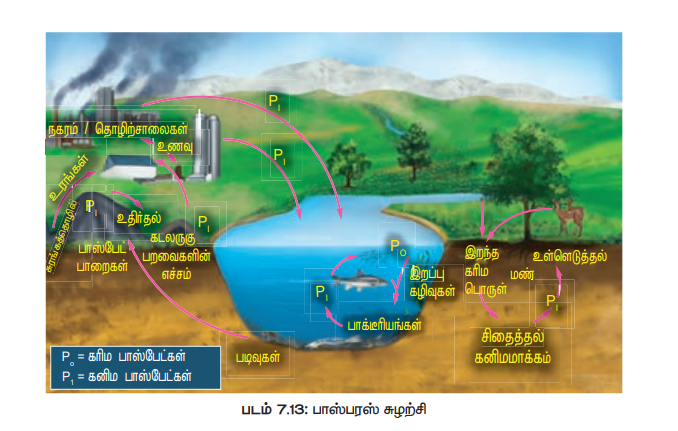
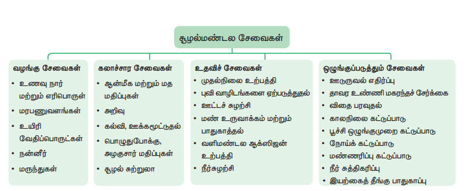

# சூழல்மண்டலம்

---

**கற்றல் ந�ோக்கங்கள**

இப்பாடத்தினை கற்போர்
 சூழல்மண்டலத்தின் அமைப்பு, செயல்பாடு 
மற்றும் வகைகளை விவரிக்கவும்.
 - சூழல் பிரமிட்களான எண்ணிக்கை, 
உயிரித்திரள், ஆற்றல் பிரமிட்களை 
வரையவும்
 - கார்பன் மற்றும் பாஸ்பரஸ் சுழற்சியை
விளக்கவும்
 - குளச் சூழல்மண்டலம் ஒரு சுய தன்னிறைவு 
மற்றும் தன்னைத்தானே சரிசெய்யும் அமைப்பு 
என்பதை அறியவும்
 - சூழல்மண்டலத்தின் பயன்பாடுகள் மற்றும் 
மேலாண்மை பற்றி கூர்ந்தாயவும்
 - சூழல்மண்டலத்தின் முக்கியத்துவம் மற்றும் 
பாதுகாப்பு பற்றி விவாதிக்கவும்
 - தாவர வழிமுறை வளர்ச்சியின் காரணங்கள், 
செயல்பாடுகள் மற்றும் வகைகளை 
விவரிக்கவும்
 - இந்திய மற்றும் தமிழ்நாட்டின் தாவர 
வகைகளை வகைப்படுத்தவும் இயலு

---
**பாட உள்ளடக்கம**

7.1 குழில்மண்டலத்தின்‌ இர அமைப்ப

7.2 நழல்மண்டலத்தின்‌ ஹயல்பாருகள்‌:

7.3 தாவர வர்ச்சி

7.4 தாவரத்ஷாகப்பு

உங்களை சுற்றியுள்ள பகுதிகளில்‌ காணப்படும்‌ “எரி, குனம்‌, குட்டைகளை: பார்த்தள்ளீர்களா?. இவை பல்வேறு வகையான கூறுகளைக்‌: கொண்ட நீர்நிலைகள்‌ என்றழைக்கப்படகின்றன. நீர்நிலைகளில்‌. காணப்படம்‌. வாருட்சளை: உங்களால்‌. படவி முமவா? சே,டடச்சத்துகள்‌, களிமண்‌, கரைந்த வாயுக்கள்‌, மதலை உயிர்கள்‌, நுண்ணுயிரிகள்‌, பாசிகள்‌, ஹைப்ரில்லா,.. தாமறை,.. அல்லி போன்ற நாவரங்கள்‌ மற்றும்‌ பம்புகள்‌, சிறிய மீன்கள்‌, வெறிய மீன்கன்‌, தவளைகள்‌, ஆமை, சொக்கு போன்ற விலங்குகள்‌ ஆகிய அனைத்குக்‌ கூறுகளும்‌ ஒன்றுசேர்ந்து அமையப்பெற்றதே ஒரு ஆழல்மண்டலமாகும்‌ (2005/6'சா. தாவரங்களும்‌. விலங்குகளும்‌ சற்றுச்கழலின்‌ முக்கிய உயிரினக்‌. கூறுகள்‌ என்பது நமக்குக்‌ தெரிந்ததே. இவைகள்‌ உயிரற்ற கூறுகளான காற்று, நீர்‌, மண்‌, கூறிய ஒளி. போன்றவைகள்‌... ஷொடர்பு கொண்டுள்ளன... எடுத்துக்காட்டாக நீங்கள்‌ பஜினோராம்‌. வகுப்பில்‌, வாழ்வியல்‌ நிகழ்வான ஒளிச்சேர்க்கையைப்‌ பற்றி படி்து்ளர்கள்‌. ஒளிச்சேர்க்கை என்பது கூரிய ஒளி, ந்‌, கார்பன்‌ டைஆக்ஸைய மண்ணிலுள்ள ஊட்டம்பருட்கள்‌ ஆகியவற்றைப்‌... பயன்படுத்தி ஆக்ஸிஜனை: வளிமண்டலத்தில்‌ வவளிவிடம்‌ ஒரு வாழ்வியல்‌ செயலாகும்‌. இதிலிருந்து. உயிருள்ள கூறுகளுக்கும்‌,உயிரற்ற கூறுகளுக்கும்‌ இடையே நடைஷறுல்‌ பொருட்களின்‌ பரிமாற்றங்களை வியலாம்‌. அதேபோல்‌, நீங்கள்‌ இப்பாடத்தில்‌ ுழல்மண்டலத்தின்‌ அமைப்பு, செயல்பாடு மற்றும்‌ தென்‌. வகைகளை பற்றி அறியலாம்‌. 'கம்மண்டலம்‌' என்ற சொல்‌ 8.0. பான்ஸ்லி (5௬௧) என்பவரால்‌ முன்மொழியப்பட்டத. இது வரையறை செய்துள்ளார்‌. அதே சமயம்‌, ஓடம்‌ (0962) இதனை 'ழ்நிலையியலின்‌ சமைப்பு மற்றும்‌. செயல்பாட்டு சதை" என்று
'வரையறுத்குள்ளார்‌.

**சூழல்மண்டலத்திற்கு இணையான சொற்கள்**

சூழல்மண்டலம் இரண்டு முக்கிய கூறுகளைக்
கொண்டுள்ளது. அவைகளாவன.
i) உயிரற்ற கூறுகள் (Abiotic (non-living) 
components): இது காலநிலைக் காரணிகள் 
(காற்று, நீர், சூரிய ஒளி, மழை, வெப்பநிலை
மற்றும் ஈரப்பதம்), மண் காரணிகள் (மண் காற்று, 
மண் நீர் மற்றும் மண் pH) நில அமைப்புக்
காரணிகள் (விரிவகலம், குத்துயரம்); கரிம
பொருட்கள் (கார்போஹைட்ரேட்டுகள், புரதங்கள், 
கொழுப்புகள் மற்றும் மட்குப் பொருட்கள்), கனிமப்
பொருட்கள் (C, H, O, N மற்றும் P) ஆகியவைகளை 
உள்ளடக்கியது. உயிரற்ற கூறுகள் 
சூழல்மண்டலத்தில் மிக முக்கிய பங்கு 
வகிக்கின்றன. எனவே சூழல்மண்டலத்தின் ஒரு 
குறிப்பிட்ட காலத்தில் காணப்படும் மொத்த
கனிமப் பொருட்கள் நிலைத்த தரம் (standing quality) அல்லது நிலைத்த கூறு (standing state) என்று அழைக்கப்படுகின்றன.

ii உயிரினக் கூறுகள் (Biotic (living) components):
இது உயிரினங்களான தாவரங்கள், விலங்குகள், 
பூஞ்சைகள், பாக்டீரியங்கள் ஆகியவைகளை 
உள்ளடக்கியது. இவை சூழல்மண்டலத்தின்
ஊட்ட மட்டங்களை உருவாக்குகின்றன. 
ஊட்டச்சத்து உறவுகளின் அடிப்படையில், 
சூழல்மண்டலத்தின் ஊட்ட மட்டங்கள் இரண்டு 
கூறுகளாக அறியப்பட்டுள்ளன. 

(1) தற்சார்பு 
ஊட்டக்கூறுகள 
(2) சார்பூட்டக் கூறுகள்

(1) தற்சார்புஊட்டக் கூறுகள் (Autotrophic components): தற்சார்புஊட்ட உயிரிகள் 
ஒளிச்சேர்க்கை என்ற நிகழ்வின் மூலம் எளிய 
கனிமக்கூறுகளிலிருந்து கரிமக்கூறுகளை உற்பத்தி 
செய்கின்றன. பெரும்பாலான சூழல்மண்டலத்தில், 
தாவரங்களே தற்சார்புஊட்ட உயிரிகளாக உள்ளதால்
இவை உற்பத்தியாளர்கள் (producers) என்று 
அழைக்கப்படுகின்றன.
(2) சார்பூட்டக் கூறுகள் (heterotrophic 
components): உற்பத்தியாளர்களை உண்ணும் 
உயிரினங்கள் நுகர்வோர்கள் (consumers) 
என்றழைக்கப்படுகின்றன. இவை பெரு மற்றும் 
நுண் நுகர்வோர்கள் என அறியப்படுகின்றன.

**பெரு நுகர்வோர்கள்‌** 

பெரு நுகர்வோர்கள் (macroconsumers) என்பவை
தாவர உண்ணிகள், ஊண் உண்ணிகள் மற்றும் 
அனைத்துண்ணிகளைக் (முதல்நிலை, 
இரண்டாம்நிலை மற்றும் மூன்றாம் நிலை
நுகர்வோர்கள்) குறிக்கும். நுண் நுகர்வோர்கள்
(microconsumers) சிதைப்பவைகள் (decomposers) 
என்றழைக்கப்படுகின்றன. சிதைப்பவைகள் இறந்த
தாவரங்களையும், விலங்குகளையும் சிதைத்து கரிம
மற்றும் கனிம ஊட்டங்களை சுற்றுச்சூழலில்
விடுவித்து மீண்டும் தாவரங்களால்
பயன்படுத்தப்படுத்துவதற்கு உதவுகின்றன. 
எடுத்துக்காட்டு: பாக்டீரியங்கள், 
ஆக்டினோமைசீட்டுகள் மற்றும் பூஞ்சைகள்
ஓர் உயிரினக் கூட்டத்தில் ஒரு குறிப்பிட்டக்
காலத்தில் காணப்படும் உயிரிகளின் அளவிற்கு 
நிலைத்த உயிரித்தொகுப்பு (standing crop) என்று 
பெயர். இது ஓர் அலகு இடத்தில் இவைகளின் 
எண்ணிக்கை அல்லது உயிரித்திரள் அடிப்படையில்
குறிப்பிடப்படுகிறது. உயிரித்திரள் (biomass) என்பது 
உயிரினத்தின் பசுமை எடை அல்லது உலர் எடை
அல்லது கார்பன் எடையால் அளவிடப்படுகிறது.
உணவுச்சங்கிலி, உணவு வலை, சூழல் பிரமிட்கள் 
ஆகியவையின் உருவாக்கத்திற்கு உயிரிக்கூறுகள் 
உதவுகின்றன

## சூழல்மண்டலத்தின் செயல்பாடுகள

சூழல்மண்டலத்தின் ஆற்றல் உருவாக்கம், ஆற்றல்
பரிமாற்றம், உயிருள்ள, உயிரற்ற கூறுகளுக்கிடையே
நடைபெறும் பொருட்களின் சுழற்சி ஆகியவை
சூழல்மண்டலச் செயல்பாடுகளாகும்.
எந்தவொரு சூழல்மண்டலத்தின் 
உற்பத்தித்திறனைப் பற்றி படிக்கும்முன், முதல்
ஊட்ட மட்டத்தில் உள்ள உற்பத்தியாளர்களால்
பயன்படுத்தப்படும் சூரிய ஒளியின் முக்கிய பங்கை
நாம் புரிந்து கொள்ள வேண்டும். தாவரங்களினால்
உற்பத்தி செய்யப்படும் ஆற்றல் சூரிய ஒளியின் 
அளவிற்கு நேர்விகிதத்தில் இருக்கும்.

**ஒளிச்சேர்க்கைசார் செயலூக்கக்
கதிர்வீச்சு – PAR (Photosynthetically Active Radiation - PAR)**

தாவரங்களின் ஒளிச்சேர்க்கைக்குக்
கிடைக்கக்கூடிய ஒளியின் அளவு, ஒளிச்சேர்க்கைசார் 
செயலூக்கக் கதிர்வீச்சு எனப்படுகிறது. இது 400 – 700 nm க்கு இடைப்பட்ட அலைநீளங்களைக்
கொண்ட கதிர்வீச்சாகும். இது ஒளிச்சேர்க்கைக்கும், 
தாவர வளர்ச்சிக்கும் இன்றியமையாததாகும். இதன் 
அளவு எல்லா நேரங்களிலும் நிலையாக 
இருப்பதில்லை. ஏனென்றால் மேகங்கள், மர 
நிழல்கள், காற்று, தூசு துகள்கள், பருவகாலங்கள்,

'விரிவகலம்‌, பகல்‌ நேரத்தில்‌ கிடைக்கும்‌ ஒளியின்‌: வு போன்றவைகளால்‌ மாற்றமடைகிறது. பொதுவாக, தாவரங்கள்‌ திறம்பட ஒளிச்சேர்க்கை. செய்ய அதிக அளவில்‌ நீலம்‌ மற்றும்‌ சிவப்பு நிற ஒளிக்கதிர்களை ஈர்க்கின்றன.

மொத்த கூரிய ஒளியில்‌, வளிமண்டலத்தை: பையும்‌ 34% மீண்டும்‌. வளிமண்டத்திற்கே நிருப்பப்புகிறது. மேலும்‌ 10% ஒசோன்‌, நீராவி, வளிமண்டல வாயுக்களால்‌ ஈர்க்கப்பட்டு, மீதமுள்ள 56% மட்டுமே பூமியின்‌ மேற்பரப்பை வந்தடைகிறது. இந்த ௧6 விழுக்காப்டல்‌ 2-10 விழு! மட்டுமே. தாவரங்களின்‌ ஒளிச்‌ மயன்மருத்தப்பட்டு மீதமுள்ள பகுதி வெப்பமாக சிதறடக்கப்படறது.

ஒளிச்சேர்க்கைசார்‌ செயலூக்க கதிர்வீச்சின்‌. அளவு, சிலிகான்‌ ஒளிமின்‌ காண்கலம்‌ ஒன்றின்‌ உதவியால்‌ நுண்‌ அறியப்பட்ட மில்லிமோல்கள்‌ / சதுரமீட்டர்‌/வினாடிஎன்ற அலகால்குறிப்பிடப்புகிறது. “இது 400-700 ர அலை நீளம்‌ கொண்ட ஒளியை மட்டமே நுண்ணறிய முமயும்‌, ஒளிச்சேர்க்கைசார்‌ செயூக்கத்திற்கான. கதிர்வீச்சின்‌. (98) களவு "இலக்கு ௦ - 8000 மில்லிமோல்கள்‌ / சதமீட்ட்‌ / "வினாடி வரை இருக்கும்‌, இரவு நேரங்களில்‌ 088. முஞ்யமாகவும்‌, கோடை காலங்களின்‌ மதிய வேளையில்‌ 4. 2000 - 3000 மில்லிமோல்கள்‌ / சதமீட்டர்‌ வினாடி ஆகவும்‌ உள்ளது.

---

**do you know ?**

**கார்பனின் வகைகள்
பசுமைக் கார்பன்**

உயிர்க்கோளத்தில் சேமிக்கப்படும் 
கார்பன் (ஒளிச்சேர்க்கை செயல்
மூலம்).
சாம்பல் கார்பன்:
தொல்லுயிர் படிவ எரிபொருளாக 
சேமிக்கப்படும் கார்பன் (நிலக்கரி, எண்ணெய் 
மற்றும் உயிரி வாயுக்களாக பூமிக்கடியில்
படிந்திருக்கும்).

நீல கார்பன்‌: வளிமண்டலம்‌ மற்றும்‌ கடல்களில்‌ ேமிக்கப்படும் கார்பன்.
    
பழுப்பு கார்பன்‌: தொழில்‌ ரீதியாக உருவாக்கப்படும்‌. காடுகளில்‌ சேமிக்கப்டம்‌ கார்பன்‌ (வணிக நீதியாக. பயன்புக்கப்படம்மரங்கள்‌)

குறுமைக்‌ கார்பன்‌: வாயு. மல்‌. என்ஜின்‌, நிலக்கறியைப்‌ பயன்படுத்தும்‌ மின்‌ உற்பத்தி நிலையங்கள்‌. ஆகியவற்றிலிருக்று: வெளியேற்றப்படும்‌ கர்ப்‌

---

## கூழல்மண்டலத்தின்‌ உற்பத்தித்திறன்‌

“ஒர அலகு காலத்தில்‌ ஒரி அலகுப்‌ பரப்பில்‌ உற்பத்தி “செய்யப்பரும்‌ உயிரித்திரள்‌ வீதமே உற்பத்தித்திறன்‌ “எனப்படுகிறது. இது கிராம்‌ / சதுரமீட்டர்‌ / வருடம்‌.

அல்லது கிலோ கலோரி சநரமீட்டர்‌ / வருடம்‌ ஆகிய அலகுகளால்‌ குறப்பிடப்பகிறது. இது கீழ்கண்டவாறு 'வகைப்பருத்தப்பரகிறது.

1. முதல்நிலை உற்பத்தித்திறன்‌

2. இரண்டாம்நிலை உற்பத்தித்திறன்‌.

3. குழும உற்பத்தித்திறன்‌

**1. முதல்நிலை உற்பத்தித்திறன் (Primary productivity)**

ஒளிச்சேர்க்கை மற்றும் வேதிச்சேர்க்கை
செயல்பாட்டின் மூலம் தற்சார்பு ஊட்ட உயிரிகளினால்
உற்பத்தி செய்யப்படும் வேதியாற்றல் அல்லது கரிம
கூட்டுப்பொருட்கள் முதல்நிலை உற்பத்தித்திறன் 
எனப்படுகிறது. இது பாக்டீரியங்கள் முதல் மனிதன் 
வரை உள்ள அனைத்து உயிரினங்களுக்கும் 
கிடைக்கும் ஆற்றல் மூலமாகும்.

**அ. மொத்த முதல்நிலை உற்பத்தித்திறன் (Gross primary productivity - GPP)**
சூழல்மண்டலத்திலுள்ள தற்சார்பு ஊட்ட உயிரிகளால்
ஒளிச்சேர்க்கையின் மூலம் உற்பத்தி செய்யப்படும் 
மொத்த உணவு ஆற்றல் அல்லது கரிமப்பொருட்கள் 
அல்லது உயிரித்திரள் மொத்த முதல்நிலை
உற்பத்தித்திறன் எனப்படுகிறது.

**ஆ. நிகர முதல்நிலை உற்பத்தித்திறன் (Net primary productivity - NPP)**
தாவரத்தின் சுவாசச் செயலால் ஏற்படும் இழப்பிற்குப்
பிறகு எஞ்சியுள்ள ஆற்றல் விகிதமே நிகர முதல்நிலை
உற்பத்தித்திறன் எனப்படுகிறது. இது 
வெளிப்படையான ஒளிச்சேர்க்கை என்றும் 
அழைக்கப்படுகிறது. எனவே GPP-க்கும் சுவாச
இழப்பிற்கும் இடையேயுள்ள வேறுபாடே NPP யாகும்.
    NPP = GPP – சுவாச இழப்பு
மொத்த உயிரிக்கோளத்தின் நிகர முதல்நிலை
உற்பத்தித்திறன் ஒரு வருடத்திற்கு சுமார் 170 
மில்லியன் டன்கள் (உலர் எடை) என
மதிப்பிடப்பட்டுள்ளது. இதில் ஒரு வருடத்தில் ஓர்
அலகு காலத்தில் கடல்வாழ் உற்பத்தியாளர்களின் 
நிகர முதல்நிலை உற்பத்தித்திறன் மட்டும் 55
மில்லியன் டன்கள் ஆகும்.

**2. இரண்டாம்நிலை உற்பத்தித்திறன் (Secondary productivity)**

சார்பூட்ட உயிரிகள் அல்லது நுகர்வோர்களின் 
திசுக்களில் சேமித்து வைக்கப்படும் ஆற்றலின்
அளவே இரண்டாம்நிலை உற்பத்தித்திறன் ஆகும்.
அ. மொத்த இரண்டாம்நிலை உற்பத்தித்திறன் 
(Gross secondary productivity)
தாவர உண்ணிகளால் உட்கொள்ளப்படும் மொத்த
தாவரப் பொருட்களில், அவற்றினால் கழிவாக
வெளியேற்றப்படும் பொருட்களைக் கழித்து வரும் 
மதிப்பே இதுவாகும்.

**ஆ. நிகர இரண்டாம்நிலை உற்பத்தித்திறன் (Net secondary productivity)**
ஓர் அலகு இடத்தில் ஓர் அலகு காலத்தில் சுவாச
இழப்பிற்குப் பிறகு நுகர்வோர்களால் சேமிக்கப்படும் 
ஆற்றல் அல்லது உயிரித்திரளே நிகர 
இரண்டாம்நிலை உற்பத்தித்திறன் எனப்படுகிறத

**3. குழும உற்பத்தித்திறன் (Community productivity)**
ஓர் அலகு இடத்தில் ஓர் அலகு காலத்தில் ஒரு தாவரக்
குழுமத்தினால் உற்பத்தி செய்யப்படும் நிகர கரிம
பொருட்களின் உயிரித்திரள் விகிதமே குழும
உற்பத்தித்திறன் எனப்படுகிறது.
முதல்நிலை உற்பத்தித்திறனை பாதிக்கும் 
காரணிகள்
முதல்நிலை உற்பத்தித்திறன் ஒரு குறிப்பிட்ட 
இடத்தில் காணப்படும் தாவரச் சிற்றினங்கள், 
அவைகளின் ஒளிச்சேர்க்கைத் திறன், கிடைக்கும் 
ஊட்டச்சத்துக்களின் தன்மை, சூரிய ஒளி, மழையளவு, 
மண் வகை, நிலப்பரப்பு காரணிகள் (குத்துயரம், 
விரிவகலம், திசைகள்) மற்றும் பிற சுற்றுச்சூழல்
காரணிகளைப் பொருத்தது. இது சூழல்மண்டலத்தின் 
வகைகளுக்கேற்ப மாறுபடுகிறத

### சூழல்மண்டலத்தின் ஊட்டமட்டம் தொடர்பான கருத்துரு

(கிரேக்க சொல் “Trophic” = உணவு அல்லது 
ஊட்டமளித்தல்)
உணவுச்சங்கிலியில் உயிரினங்கள் அமைந்திருக்கும் 
இடத்தை குறிப்பதே ஊட்டமட்டமாகும். ஊட்ட
மட்டங்களின் எண்ணிக்கை, உணவுச்சங்கிலி 
படிநிலைகளின் எண்ணிக்கைக்குச் சமமாக 
இருக்கும். முதல் ஊட்ட மட்டத்தில் (T1
) பசுந்தாவரங்கள் 
இடம் பெற்றுள்ளதால், அவை உற்பத்தியாளர்கள்
(producers) எனப்படுகின்றன. தாவரங்கள் உற்பத்தி 
செய்யும் ஆற்றலை, பயன்படுத்தும் தாவர 
உண்ணிகள் முதல்நிலை நுகர்வோர்கள் (primary 
consumers) என்று அழைக்கப்படுவதோடு, 
இரண்டாவது ஊட்ட மட்டத்தில் (T2) இடம் 
பெறுகின்றன. தாவரஉண்ணிகளை உண்டு 
வாழும், ஊண்உண்ணிகள், மூன்றாவது ஊட்ட 
மட்டத்தில் (T3) இடம்பெறுகின்றன. இவை
இரண்டாம்நிலை நுகர்வோர்கள் (secondary 
consumers) அல்லது முதல்நிலை ஊண்உண்ணிகள்
(primary carnivores) என்றும் அழைக்கப்படுகின்றன.

படம் 7.2: ஊட்ட மட்டங்களின் வரைபட உருவமைப்ப

ஒரு ஊண் உண்ணியை உணவாகக் கொள்ளும் 
மற்றொரு ஊண் உண்ணி நான்காவது ஊட்ட 
மட்டத்தில் (T4) இடம் பெறுகின்றது. இவை
மூன்றாம்நிலை நுகர்வோர்கள் (tertiary consumers) 
அல்லது இரண்டாம்நிலை ஊண் உண்ணிகள் 
(secondary carnivores) என்றும் அழைக்கப்படுகின்றன. 
தாவரங்கள் மற்றும் விலங்குகள் இரண்டையும் 
உண்ணும் உயிரினங்கள் அனைத்துண்ணிகள்
(omnivores) (காகம்) எனப்படுகிறது. இந்த உயிரினங்கள் 
உணவுச்சங்கிலியில் ஒன்றுக்கு மேற்பட்ட ஊட்ட 
மட்டத்தில் இடம் பெறுகின்றன.

### ஆற்றல் ஓட்

சூழல்மண்டலத்தில் ஆற்றல் ஊட்ட 
மட்டங்களுக்கிடையே பரிமாற்றம் அடைவது ஆற்றல் 
ஓட்டம் என குறிப்பிடப்படுகிறது. இது 
சூழல்மண்டலத்தின் முக்கிய செயல்பாடு ஆகும். 
உற்பத்தியாளர்களால் சூரிய ஒளியிலிருந்து 
பெறப்படும் ஆற்றல் நுகர்வோர்களுக்கும், 
சிதைப்பவைகளுக்கும், அவற்றின் ஒவ்வொரு ஊட்ட
மட்டத்திற்கும் பரிமாற்றம் அடையும்பொழுது சிறிதளவு 
ஆற்றல் வெப்பமாக சிதறடிக்கப்படுகிறது.
சூழல்மண்டலத்தின் ஆற்றல் ஓட்டம் எப்பொழுதும் ஓர்
திசை சார் ஓட்டமாக உள்ளது. அதாவது ஒரே
திசையில் பாய்கிற

படம் 7.3: ஆற்றல் ஓட்டத்தின் வரைபட உருவமைப்ப

வெப்ப இயக்கவியலின் விதிகள்
ஒரு சூழல்மண்டலத்தின் ஆற்றல் சேமிப்பு மற்றும் 
இழப்பு வெப்ப இயக்கவியலின் இரண்டு விதிகளை 
அடிப்படையாகக் கொண்டது.

**i. வெப்ப இயக்கவியலின் முதல் விதி**
ஆற்றல் வெவ்வேறு வடிவங்களில் ஒரு அமைப்பில்
இருந்து மற்றொன்றுக்கு கடத்தப்படுகிறது என்பதே
முதல் விதியாகும். ஆற்றலை ஆக்கவோ அழிக்கவோ
முடியாது ஆனால் ஒரு வகை ஆற்றலை மற்றொரு 
வகை ஆற்றலாக மாற்ற முடியும். இதனால், இந்த
பேரண்டத்தில் உள்ள ஆற்றலின் அளவு 
நிலையானது. 
**எடுத்துக்காட்டு:** 
ஒளிச்சேர்க்கையில் வினைபடு பொருட்கள் 
(பச்சையம், நீர், கார்பன் டைஆக்ஸைடு) 
சேர்க்கைச்செயல் மூலம் தரசம் (வேதி ஆற்றல்) 
உருவாகிறது. தரசத்தில் சேகரிக்கப்படும் ஆற்றல் புற
ஆதாரங்களிலிருந்து (ஒளி ஆற்றல்) பெறப்படுகிறது.
அதனால், மொத்த ஆற்றலில் லாபமும் இல்லை, 
இழப்பும் இல்லை. இங்கு ஒளி ஆற்றல் வேதி 
ஆற்றலாக மாற்றப்படுகிறது.
பச்சையம் 

C6H12O6 6 CO2 + 6 H2O + 6 O2//todo
ஒளி
ஒளி ஆற்றல் வேதி ஆற்றல்
ii. வெப்ப இயக்கவியலின் இரண்டாம் விதி
ஒவ்வொரு ஆற்றல் மாற்றத்தின்போதும் அமைப்பில்
உள்ள கட்டிலா ஆற்றல் அளவு குறைக்கப்படுகிறது 
என்பதே இரண்டாம் விதியாகும். அதாவது ஆற்றல்
மாற்றம் 100% முழுமையாக இருக்க முடியாது. 
அதனால் ஆற்றல் ஒரு உயிரினத்திலிருந்து 
மற்றொன்றிற்கு, உணவு வடிவில்
கடத்தப்படும்பொழுது, ஆற்றலின் ஒரு பகுதி 
உயிரித்திசுவில் சேகரிக்கப்படுகிறது. அதேசமயம் 
அதிகப்படியான ஆற்றல் பிறச்செயலின் வாயிலாக 
வெப்பமாக சிதறடிக்கப்படுகிறது. ஆற்றல் மாற்றம் ஒரு
மீளா தன்மையுடைய இயற்கை நிகழ்வாகும். 
எடுத்துக்காட்டு: பத்து விழுக்காடு விதி.

**பத்து விழுக்காடு விதி (Ten percent law)**

இந்த விதி லின்டிமேன் (1942) என்பவரால்
முன்மொழியப்பட்டது. உணவுவழி ஆற்றல் ஒரு 
ஊட்ட மட்டத்திலிருந்து மற்றொன்றிற்கு 
கடத்தப்படும்போது, 10% மட்டுமே ஒவ்வொரு ஊட்ட
மட்டத்திலும் சேமிக்கப்படுகிறது. மீதமுள்ள ஆற்றல்
(90%) சுவாசித்தல், சிதைத்தல் போன்ற நிகழ்வின் 
மூலம் வெப்பமாக இழக்கப்படுகிறது. எனவே இவ்விதி
பத்து விழுக்காடு விதி (Ten percent law) எனப்படுகிறத

எடுத்துக்காட்டாக: 1000 ஜூல்கள் சூரியஒளி 
உற்பத்தியாளர்களால் ஈர்க்கப்படுகிறது எனக்
கொண்டால், அதில் ஒளிச்சேர்க்கையின் மூலம் 100 
ஜூல்கள் ஆற்றல் வேதியாற்றலாக சேமிக்கப்பட்டு 
மீதமுள்ள 900 ஜூல்கள் சுற்றுச்சூழலில்
இழக்கப்படுகிறது. அடுத்த ஊட்ட மட்டத்தில் தாவர 
உண்ணிகள், உற்பத்தியாளர்களை உண்ணும்போது 
10 ஜூல்கள் ஆற்றலை மட்டும் அவை பெறுகின்றன, 
மீதமுள்ள 90 ஜூல்கள் சுற்றுச்சூழலில் இழக்கப்படுகிறது. 
இதே போல் அடுத்த ஊட்ட மட்டத்தில், 
ஊண்உண்ணிகள், தாவர உண்ணிகளை 
உண்ணும்போது 1 ஜூல் ஆற்றல் மட்டுமே
சேகரிக்கப்பட்டு மீதமுள்ள 9 ஜூல்கள் 
சிதறடிக்கப்படுகிறது. இறுதியாக மூன்றாம்நிலை
நுகர்வோர்களால் ஊண் உண்ணிகள் 
உண்ணப்படும்பொழுது 0.1 ஜூல் ஆற்றல் மட்டுமே
சேகரிக்கப்பட்டு மீதமுள்ள 0.9 ஜூல் சுற்றுச்சூழலில்
இழக்கப்படுகிறது. எனவே மொத்தத்தில் 10 சதவீத 
ஆற்றல் மட்டும் அடுத்தடுத்த ஊட்ட மட்டங்களில் சேமிக்கப்படுகிறத

### உணவுச்சங்கிலி (Food chain)

உற்பத்தியாளர்களிடமிருந்து ஆற்றல் இறுதி 
உண்ணிகள் வரை கடத்தப்படுவது உணவுச்சங்கிலி
என்று அழைக்கப்படுகிறது. அதாவது எந்த
உணவுச்சங்கிலியானாலும், ஆற்றல்
உற்பத்தியாளர்களிடம் இருந்து முதல்நிலை
நுகர்வோர்கள், பிறகு முதல்நிலை நுகர்வோர்களிடம் 
இருந்து இரண்டாம்நிலை நுகர்வோர்கள் மற்றும் 
இறுதியாக இரண்டாம்நிலை நுகர்வோர்களிடமிருந்து 
மூன்றாம்நிலை நுகர்வோர்களுக்கு கடத்தப்படுகிறது. 
எனவே, இது நேர்க்கோட்டில் அமைந்த பின்னல்
இணைப்பை வெளிப்படுத்துகிறது. இரண்டு வகை
உணவுச்சங்கிலிகள் உள்ளன, (1) மேய்ச்சல்
உணவுச்சங்கிலி (2) மட்குப்பொருள் உணவுச்சங்கிலி.
**1. மேய்ச்சல் உணவுச்சங்கிலி (Grazing food chain)** 
மேய்ச்சல் உணவுச்சங்கிலிக்கு சூரியனே முதன்மை
ஆற்றல் மூலமாகும். இதன் முதல் இணைப்ப
உற்பத்தியாளர்களிடமிருந்து (தாவரங்கள்) 
தொடங்குகிறது. உணவுச்சங்கிலியின் இரண்டாவது 
இணைப்பினை அமைக்கும் முதல்நிலை நுகர்வோர்கள் 
(எலி), உற்பத்தியாளர்களிடமிருந்து உணவைப்
பெறுகின்றன. உணவுச்சங்கிலியின் மூன்றாவது 
இணைப்பை அமைக்கும் இரண்டாம்நிலை
நுகர்வோர்கள் (பாம்பு) முதல்நிலை
நுகர்வோர்களிடமிருந்து உணவைப் பெறுகின்றன. 
நான்காம் இணைப்பை அமைக்கும் மூன்றாம்நிலை
நுகர்வோர்கள் (பருந்து) இரண்டாம்நிலை
நுகர்வோர்களிடமிருந்து தங்கள் உணவைப்
பெறுகின்றன

படம் 7.5: மேய்ச்சல் உணவுச்சங்கிலியின் வரைபட
உருவமைப்பு 

2. மட்குப்பொருள் (சிதைவுக்கூளம்) உணவுச்சங்கிலி 
(Detritus food chain) 
இந்த வகையான உணவுச்சங்கிலி இறந்த
கரிமப்பொருட்களிலிருந்து தொடங்குகிறது. இதுவே
முக்கியமான ஆற்றல் மூலமாக உள்ளது.
அதிகப்படியான கரிமப்பொருட்கள் இறந்த
தாவரங்கள், விலங்குகள் மற்றும் அவற்றின் கழிவு
பொருட்களிலிருந்து பெறப்படுகிறது. இந்த வகையான
உணவுச்சங்கிலி அனைத்து சூழல்மண்டலத்திற்கும் 
பொதுவானது.
இறந்த உயிரிகளின் கரிமப்பொருட்களிலிருந்து 
ஆற்றல் கடத்தப்படுவது வரிசையாக அமைந்த
மண்வாழ் உயிரினங்களான மட்குண்ணிகள் -
சிறிய ஊண்உண்ணிகள் – பெரிய (இறுதி)
ஊண்உண்ணிகள் முறையே உண்ணுதலாலும், 
உண்ணப்படுதலாலும் நிகழ்கிறது. இந்த தொடர் 
சங்கிலியே மட்குப்பொருள் உணவுச்சங்கிலி 
எனப்படுகிற

படம் 7.6: மட்குப்பொருள் உணவுச்சங்கிலியின் 
வரைபட உருவமைப்ப

### உணவு வலை (Food web)

உணவுச்சங்கிலிகள் ஒன்றோடொன்று 
பின்னிப்பிணைந்து வலை போல் அமைந்திருந
அது உணவு வலை எனப்படுகிறது. ஒரு 
சூழல்மண்டலத்தின் அடிப்படை அலகாக இருப்பதுடன் 
அதன் நிலைத்தன்மையை தக்கவைக்க உதவுகிறது. 
இதற்கு சமநிலை அடைதல் என்று பெயர்.
எடுத்துக்காட்டு: புல்வெளியில் காணப்படும் மேய்ச்சல்
உணவுச்சங்கிலியில் முயல் இல்லாதபோது எலி 
உணவு தானியங்களை உண்ணும். அதேசமயம் 
எலி நேரடியாக பருந்தால் அல்லது பாம்பினால்
உண்ணப்படலாம். மேலும் பாம்பு நேரடியாக 
பருந்தால் உண்ணப்படலாம். இவ்வாறு பின்னப்பட்ட 
நிலையிலுள்ள உணவுச்சங்கிலியே உணவு 
வலையாகும். சில இயற்கைத் தடைகள் ஏற்படினும், 
சூழல்மண்டலத்திலுள்ள சிற்றினங்களின் 
சமநிலையைத் தக்கவைக்க உணவு வலை
உதவுகிறது. 

படம் 7.7: புல்வெளி சூழல்மண்டல உணவு 
வலையின் வரைபட உருவமைப்ப

**உணவு வலையின் முக்கியத்துவம்**

• நேரடி இடைச்செயல் எனப்படும் சிற்றினங்களுக்–
கிடையே நிகழும் இடைவிளைவை விளக்கவே
உணவு வலை உருவாக்கப்படுகிறது.
• இது வேறுபட்ட சிற்றினங்களுக்கிடையேயுள்ள
மறைமுக தொடர்புகளை விளக்க பயன்படுகிறது.
• குழும கட்டமைப்பின் கீழ்நிலை - உயர்நிலை
அல்லது உயர்நிலை - கீழ்நிலை
கட்டுப்பாட்டுகளை அறிய இது பயன்படுகிறது.
• நில மற்றும் நீர்வாழ் சூழல்மண்டலங்களின் 
வேறுபட்ட ஆற்றல் பரிமாற்றங்களை 
வெளிப்படுத்த இது பயன்படுகிறது.

### சூழியல் பிரமிட்கள்
ஒரு சூழல்மண்டலத்தின் அடுத்தடுத்த ஊட்ட 
மட்டங்களின் அமைப்பு மற்றும் செயல்பாடுகளை 
குறிக்கும் திட்ட வரைபடங்கள் சூழியல் பிரமிட்கள்
என்று அழைக்கப்படுகின்றன. இக்கருத்து சார்லஸ்
எல்டன் (1927) என்பவரால் அறிமுகப்படுத்தப்பட்டது.
இதனால் அவை எல்டோனியின் பிரமிட்கள் எனவும் 
அழைக்கப்படுகின்றன. 
இதில் மூன்று வகைகள் உள்ளன. 
(1) எண்ணிக்கை பிரமிட் 
(2) உயிரித்திரள் பிரமிட்
(3) ஆற்றல் பிரமிட

1\. எண்ணிக்கை பிரமிட் (Pyramid of number) 
ஒரு சூழல்மண்டலத்தின் அடுத்தடுத்த
ஊட்டமட்டங்களில் காணப்படும் உயிரினங்களின் 
எண்ணிக்கையை குறிக்கும் திட்ட வரைபடம் 
எண்ணிக்கை பிரமிட் என்று அழைக்கப்படுகிறது. 
இது நேரான, கதிரிழை மற்றும் தலைகீழ் பிரமிட்கள் 
என மூன்று வெவ்வேறு வடிவங்களில்
காணப்படுகிறது.
உற்பத்தியாளர்களில் தொடங்கி முதல்நிலை
நுகர்வோர்கள், பிறகு இரண்டாம்நிலை
நுகர்வோர்கள் மற்றும் இறுதியாக மூன்றாம்நிலை
நுகர்வோர்கள் வரை ஒவ்வொரு ஊட்ட மட்டத்திலும் 
உயிரினங்களின் எண்ணிக்கை குறைந்து 
வருகிறது. எனவே, புல்வெளி மற்றும் குளச் 
சூழல்மண்டலம் ஆகியவற்றின் பிரமிட்கள் எப்போதும் 
நேரானவை (படம் 7.8 அ, ஆ).
வனச் சூழல்மண்டலத்தின் எண்ணிக்கை பிரமிட்
சற்று வேறுபட்ட வடிவத்தை கொண்டிருக்கிறது. 
ஏனென்றால் பிரமிடின் அடிப்பகுதி (T1
) குறைவான
எண்ணிக்கையிலான பெரிய மரங்களை 
கொண்டுள்ளது. இரண்டாவது ஊட்ட மட்டத்தில்
இடம் பெற்றுள்ள தாவர உண்ணிகள் (T2) (பழம் 
உண்ணும் பறவைகள், யானை, மான்) 
உற்பத்தியாளர்களைவிட அதிக எண்ணிக்கையை
கொண்டுள்ளது. இறுதி ஊட்ட மட்டத்தில் (T4) 
காணப்படும் மூன்றாம்நிலை நுகர்வோர்கள் (சிங்கம்) 
மூன்றாம் ஊட்ட மட்டத்தில் (T3) உள்ள
இரண்டாம்நிலை நுகர்வோர்களை விட (நரி மற்றும் 
பாம்பு) குறைவான எண்ணிக்கையை
கொண்டுள்ளது. எனவே வனச் சூழல்மண்டலத்தின் 
எண்ணிக்கை பிரமிட் கதிரிழை வடிவத்தில்
தோன்றுகிறது. (படம் 7.8 இ).
ஒட்டுண்ணி சூழல்மண்டலத்தின் எண்ணிக்கை
பிரமிட் எப்பொழுதும் தழைகீழானது, தனி மரம் 
ஒன்றிலிருந்து தொடங்குவதே இதற்குக் காரணமாகும

எனவே, உயிரினங்களின் எண்ணிக்கை
படிப்படியாக அடுத்தடுத்த ஊட்ட மட்டங்களில்
உற்பதியாளர்கள் முதல் மூன்றாம்நிலை
நுகர்வோர்கள் வரை படிப்படியாக அதிகரிக்கிறது.
(படம் 7.8 ஈ).
**2. உயிரித்திரள் பிரமிட் (Pyramid of biomass)**
ஒரு சூழல்மண்டலத்தின் அடுத்தடுத்த ஊட்ட 
மட்டங்களில் காணப்படும் கரிமப்பொருட்களின் 
(உயிரித்திரள்) அளவை குறிக்கும் திட்ட வரைபடம் 
உயிரித்திரள் பிரமிட் என்று அழைக்கப்படுகிறது.
புல்வெளி மற்றும் வனச் சூழல்மண்டலத்தில் 
உயிரிதிரளின் அளவு அடுத்தடுத்த ஊட்ட மட்டங்களில், 
உற்பத்தியாளர்களில் தொடங்கி இறுதி உண்ணிகள் 
(மூன்றாம்நிலை நுகர்வோர்) வரை படிப்படியாகக்
குறைகிறது. எனவே இந்த இரண்டு 
சூழல்மண்டலங்களிலும் உயிரித்திரள் பிரமிட்
நேரான பிரமிட்டாக உள்ளது. (படம் 7.9 அ, ஆ).
எனினும், குளச் சூழல்மண்டலத்தில் பிரமிட்டின் 
அடிப்பகுதியில் உள்ள உற்பத்தியாளர்கள் 
நுண்ணுயிரிகளாக குறைவான உயிரித்திரளைக்
கொண்டுள்ளது. மேலும் உயிரித்திரள் மதிப்பு 
பிரமிட்டின் இறுதிவரை படிப்படியாக அதிகரிக்கிறது.
எனவே இந்த உயிரித்திரள் பிரமிட் எப்பொழுதும் 
தழைகீழ் வடிவத்தில் காணப்படும். (படம் 7.9 இ).
**3. ஆற்றல் பிரமிட் (Pyramid of energy)**
ஒரு சூழல்நிலைமண்டலத்தில் ஒவ்வொரு அடுத்தடுத்த
ஊட்ட மட்டங்களில் ஆற்றல் ஓட்டத்தை குறிக்கும் திட்ட 
வரைபடம் ஆற்றல் பிரமிட் என்று அழைக்கப்படுகிறது. 
ஆற்றல் பிரமிட்டின் அடிப்பகுதியில் உள்ள
உற்பத்தியாளர்கள் முதல் இறுதி மட்டம் வரையுள்ள
அடுத்தடுத்த ஊட்ட மட்டங்களில் ஆற்றல் கடத்தல்
படிப்படியாக குறைகிறது. எனவே, ஆற்றல் பிரமிட்
எப்பொழுதும் நேரானத

படம் 7.8: பல்வேறு வகையான சூழல்மண்டலங்களில் எண்ணிக்கை பிரமிட் (ஓர் அலகு இடத்தில் காணப்படும் உயிரினங்கள்)

நேரானது – அ) புல்வெளி சூழல்மண்டலம் ஆ) குளச் சூழல்மண்டலம்,
கதிர் வடிவம் – இ) வனச் சூழல்மண்டலம், தலைகீழானது – ஈ) ஒட்டுண்ணி சூழல்மண்டலம

படம் 7.9: பல்வேறு சூழல்மண்டலங்களில் உயிர்த்திரள் பிரமிட் (ஓர் அலகு இடத்தில் உலர் எடை)
நேரானது – அ) புல்வெளி சூழல்மண்டலம் ஆ) வனச் சூழல்மண்டலம், தலைகீழானது – இ) குளச் சூழல்மண்டலம

### சிதைத்தல் (Decomposition)

சிதைவுக்கூளங்கள் (இறந்த தாவரங்கள், விலங்குகள் 
மற்றும் அதன் கழிவுகள்) சிதைப்பவைகளால், சிறிய
கரிமப்பொருளாக உடைக்கப்படும் செயல்முறைக்கு 
சிதைத்தல் என்று பெயர். இது, ஒரு சூழல்மண்டலத்தில்
ஊட்டங்களின் மறுசுழற்சிக்கும் சமநிலைப்பாட்டிற்கும் 
தேவைப்படும் முக்கியமான செயலாக உள்ளது.

**சிதைவின் இயல்பு**

சிதைவு செயல்முறை கரிமக்கூறுகளின் 
தன்மையைப் பொருத்து வேறுபடுகிறது. அதாவது 
செல்லுலோஸ், லிக்னின், கைட்டின், உரோமங்கள், 
எலும்புகள் ஆகியவற்றை விட கார்போஹட்ரேட், 
கொழுப்பு, புரதம் போன்ற கரிமச்சேர்மங்கள் 
விரைவாக சிதைவடைகின்றன.

**சிதைவு செயல்முறைகள்**

சிதைவு என்பது நொதிகளின் செயல்பாட்டால்
படிப்படியாக நடைபெறக்கூடிய ஒரு நிலையழிவுச் 
செயலாகும். சிதைவுக்கூளங்கள் சிதைத்தலுக்கு 
உதவும் மூலப்பொருட்களாக செயல்படுகின்றன. இது
கீழ்கண்ட நிலைகளில் நடைபெறுகிறது

**அ. துணுக்காதல் (Fragmentation)**

சிதைப்பவைகளாக உள்ள பாக்டீரியங்கள், 
பூஞ்சைகள் மற்றும் மண் புழுக்களிகளால்
சிதைவுக்கூளங்கள் சிறிய துண்டுகளாக 
உடைபடுவதற்கு துணுக்காதல் என்று பெயர். 
இந்த சிதைப்பவைகள் துணுக்காதலை
விரைவுபடுத்த சில பொருட்களைச் சுரக்கின்றன. 
துணுக்காதலால் சிதைவுக்கூளத் துகள்களின் 
மொத்தப் பரப்பளவு அதிகரிக்கிறது.

**ஆ. சிதைமாற்றம் (Catabolism)** 

சிதைப்பவைகள் செல்வெளி நொதிகள் சிலவற்றை அவற்றின் 
சுற்றுப்புறத்தில் சுரந்து அங்குள்ள சிக்கலான
கரிம மற்றும் கனிமச்சேர்மங்களை எளிய
ஒன்றாக உடைக்க உதவுகின்றன. இது
சிதைமாற்றம் என்று அழைக்கப்படுகிறது.

**இ. கசிந்தோடுதல் (Leaching) அல்லது வடிதல்(Eluviation)** 

சிதைந்த, நீரில் கரையும் கரிம மற்றும் 
கனிமப்பொருட்கள் மண்ணின் 
மேற்பரப்பிலிருந்து கீழ் அடுக்கிற்கு இடப்பெயர்ச்சி 
அடைதலுக்கு அல்லது நீரினால் எடுத்து 
செல்லப்படுவதற்கு கசிந்தோடுதல் அல்லது 
வடிதல் என்று பெயர்.

**ஈ. மட்காதல் (Humification)**

எளிமையாக்கப்பட்ட சிதைவுக்கூளங்கள் கருமையான படிக 
உருவமற்ற பொருளான மட்காக மாற்றமடையும் 
செயலுக்கு மட்காதல் என்று பெயர். இது அதிக 
நுண்ணியிர் எதிர்ப்புத் திறன் பெற்றிருப்பதால்
சிதைத்தல் மிகவும் மெதுவாக நடைபெறுகிறது. 
இது ஊட்டச்சத்து தேக்கமாகக் கருதப்படுகிறது.

**உ. கனிமமாக்கம் (Mineralisation)** 

சில நுண்ணுயிரிகள் மண்ணின் கரிம மட்கிலிருந்து 
கனிம ஊட்டச்சத்துகளை வெளியேற்றுவதில்
ஈடுபடுகின்றன. அத்தகைய செயல்முறை
கனிமமாக்கல் என்று அழைக்கப்படுகிறது.

**சிதைவுச் செயலைப் பாதிக்கும் காரணிகள்**

வெப்பநிலை, மண் ஈரப்பதம், மண் pH, ஆக்ஸிஜன் 
ஆகிய காலநிலைக் காரணிகளாலும் 
சிதைவுக்கூளங்களின் வேதித்தன்மையினாலும் 
சிதைவுச் செயல் பாதிக்கப்படுகிறது.

### உயிரி புவி வேதிச்சுழற்சி (Biogeochemical cycles) அல்லது ஊட்டங்களின் சுழற்சி (Nutrient cycles)

உயிரினங்களுக்கும் அதன் சுற்றுச்சூழலுக்கும் 
இடையே நிகழும் ஊட்டங்களின் பரிமாற்றம் ஒரு
சூழல்மண்டலத்தின் முக்கிய அம்சங்களில் ஒன்றாகும். 
அனைத்து உயிரினங்களுக்கும் அவற்றின் வளர்ச்சி, 
உருவாக்கம், பராமரிப்பு, இனப்பெருக்கம் 
ஆகியவற்றிற்கு ஊட்டங்கள் தேவைப்படுகிறது. 
சூழல்மண்டலம் அல்லது 
உயிர்கோளத்திற்குள்ளேயான ஊட்டங்களின் சுழற்சி 
‘உயிரி புவி வேதிச்சுழற்சி’ என்று அழைக்கப்படுகிறது. 
‘பொருட்களின் சுழற்சி’ எனவும் இது 
அழைக்கப்படுகிறது. இதில் இரண்டு அடிப்படை
வகைகள் உள்ளன.
1. வளி சுழற்சி (Gaseous cycle) – வளிமண்டல 
ஆக்ஸிஜன், கார்பன், நைட்ரஜன் ஆகியவற்றின் 
சுழற்சிகள் இதில் அடங்கும்.
2. படிம சுழற்சி (Sedimentary cycle) – புவியில்
படிமங்களாக உள்ள பாஸ்பரஸ், சல்பர், கால்சியம் 
ஆகியவற்றின் சுழற்சிகள் இதில் அடங்கும்.
மேலே குறிப்பிட்டுள்ள பெரும்பாலான சுழற்சிகள் பற்றி 
முந்தைய வகுப்புகளில் படித்துள்ளீர்கள். எனவே
இப்பாடத்தில் கார்பன் மற்றும் பாஸ்பரஸ் சுழற்சிகள் 
மட்டுமே விளக்கப்பட்டுள்ளத

**கார்பன் சுழற்சி (Carbon cycle)**
உயிரினங்களுக்கும் சுற்றுச்சூழலுக்கும் இடையே
நடைபெறும் கார்பன் ஓட்டத்திற்கு கார்பன் சுழற்சி என்று 
பெயர். கார்பன் அனைத்து உயிரி மூலக்கூறுகளின் ஒரு 
தவிர்க்க முடியாத பகுதிக்கூறாகும். இது உலகளாவிய 
காலநிலை மாற்றத்தினால் கணிசமான
விளைவுகளுக்கு உள்ளாகிறது. உயிரினங்களுக்கும் 
வளிமண்டலத்திற்கும் இடையில் கார்பன் 
சுழற்சியடைதல், ஒளிச்சேர்க்கை மற்றும் செல் சுவாசம் 
ஆகிய இரு வாழ்வியல் செயல்பாடுகளின் பரஸ்பர 
விளைவாகும்.

**பாஸ்பரஸ் சுழற்சி (Phosphorus cycle)**

இது படிம சுழற்சியின் ஒரு வகையாகும். அனைத்து
உயிரினங்களிலும் காணப்படும் DNA, RNA, ATP, 
NADP மற்றும் அனைத்து பாஸ்போலிப்பிட் போன்ற 
உயிரிய மூலக்கூறுகளில் பாஸ்பரஸ் இருப்பது 
ஏற்கனவே நமக்கு தெரிந்ததே. பாஸ்பரஸ்
உயிரிக்கோளத்தில் அதிக அளவில்
காணப்படுவதில்லை, அதே சமயம் பாறை படிவுகள், 
கடல் படிவுகள், கடல் அருகு வாழ் பறவைகளின் 
எச்சங்கள் போன்றவற்றில் அதிகப்படியான
பாஸ்பரஸ் காணப்படுகிறது. உதிர்தல் சிதைவு மூலம்
இப்படிமங்களிலிருந்து இது வெளிவிடப்படுகிறது.
அதன் பிறகு நிலவெளியிலும், நீர் வெளியிலும் சுழற்சி 
அடைகிறது. உற்பத்தியாளர்கள் பாஸ்பேட்
அயனிகளாக பாஸ்பரஸை உள்ளெடுப்பதன் மூலம்
உணவுசங்கலியின் ஒவ்வொரு, ஊட்ட மட்டத்திற்கும் 
உணவு மூலமாக கடத்தப்படுகிறது. உயிரினங்களின் 
இறப்பு மற்றும் இறப்பினால் உண்டான எச்சங்கள் 
சிதைப்பவைகளின் செயல்பாட்டின

தொல்லுயிர் எச்ச
எரிபொருட்களை எரிப்பது,
வனஅழிவு, காட்டுத்தீ, 
எரிமலை வெடிப்புகள், 
இறந்த கரிமப்பொருட்களின் 
சிதைவு போன்றவைகளால்
கார்பன் மிகையாக 
வெ ளி வி ட ப ்ப டுவத ால்
வளிமண்டலத்தில் இதன் 
அளவு அதிகரிக்கிறது. 
கார்பன் சுழற்சியின் 
விவரங்கள் படத்தில்
கொ டு க ்க ப ்பட் டு ள்ளன . 
(படம் 7.12)

சிதைக்கப்பட்டு மீண்டும் பாஸ்பரஸ் நிலவெளியிலும் 
நீர்வெளியிலும் திருப்பப்பட்டு பாஸ்பரஸ் சுழற்சி 
தக்கவைக்கப்படுகிறது. (படம் 7.13)

### சூழல்மண்டலத்தின் வகைகள்
உயிரிக்கோளம் பல்வேறு வகையான
சூழல்மண்டலங்களை தன்னகத்தே கொண்டுள்ளது. 
அவை பின்வருமாறு:

படம் 7.15: உயிரற்ற மற்றும் உயிருள்ள கூறுகளைக்கொண்ட குளச் சூழல்மண்டலத்தைக் காட்டும் வரைபடம்

நன்னீர், நிலை நீர் பெற்ற இயற்கையான நீர்
சூழல்மண்டலத்திற்கு சிறந்த எடுத்துக்காட்டு 
இதுவாகும். இது சூழல்மண்டலத்தின் கட்டமைப்பு 
மற்றும் செயல்பாட்டை புரிந்துக் கொள்ள மிக
உதவுகிறது. ஓரளவிற்கு குழியான பகுதிகளில் மழை
நீர் சேகரிக்கபடும் பொழுது ஒரு குறிப்பிட்ட காலத்தில்
படிப்படியாக பல்வேறு வகையான உயிரினங்கள் 
(நுண்ணியிரிகள், தாவரங்கள், விலங்குகள்) 
இச்சூழல்மண்டலத்தின் ஒரு பகுதியாக மாறுகின்றன. 
இது ஒரு தன்னிறைவு பெற்ற மற்றும் 

தன்னைத்தானே சரிசெய்து கொள்ளும் தகுதிபெற்ற 
நன்னீர் சூழல்மண்டலமாகும். இதிலுள்ள உயிரற்ற 
மற்றும் உயிருள்ள கூறுகளுக்கிடையே ஒரு 
சிக்கலான கூட்டுச்செயல் காணப்படுகிறது.

**உயிரற்ற கூறுகள்**(Abiotic components)
ஒரு குளச் சூழல்மண்டலம் கரைந்த கனிம (CO2, O2, Ca, N, பாஸ்பேட்) மற்றும் இறந்த கரிமப்
பொருட்களிலிருந்து உருவாகும் கரிமச்சேர்மங்கள் 
(அமினோ அமிலங்கள், கரிம மட்கு அமிலம்)
ஆகியவற்றைக் கொண்டுள்ளது. ஒரு குளச் 
சூழல்மண்டலத்தின் செயல்பாடு அங்கு நிலவும் 
ஒளியின் அளவு, வெப்பநிலை, நீரின் pH மதிப்பு 
மற்றும் பிற காலநிலைத்தன்மை போன்ற 
காரணிகளால் ஒழுங்குப்படுத்தப்படுகிறது.
**உயிருள்ள கூறுகள்** (Biotic components)
இது உற்பத்தியாளர்கள், பல்வேறு வகையிலான
நுகர்வோர்கள் மற்றும் சிதைப்பவைகள்
(நுண்ணுயிரிகள்) ஆகியவற்றைக் கொண்டுள்ளது.
அ. உற்பத்தியாளர்கள்
ஆசில்லட�ோரியா, அனபேனா, பாண்ட�ோரீனா, 
கிளாமிட�ோனோனஸ் யூட�ோரைனா, வால்வாக்ஸ், 
டயாட்டம் போன்ற பல்வேறு வகையான மிதவை
உயிரிகள்; யூலோத்ரிக்ஸ், ஸ்பைரோகைரா, 
கிளாஃட�ோபோரா, ஊட�ோகோனியம் போன்ற இழை
உடலப்பாசிகள்; மிதவை தாவரங்களான அச�ோலா, 
சால்வியா, பிஸ்டியா, உல்பியா மற்றும் ஐகோர்னியா; 
நீரில் மூழ்கிய தாவரங்களான பொட்டம�ோஜியாட்டான்
மற்றும் பிராக்மேட்டிஸ்; வேரூன்றிய மிதவை
தாவரங்களான தாமரை மற்றும் அல்லி; பெரும் 
தாவரங்களான டைபா மற்றும் ஐபோமியா ஆகியன
குளச் சூழல்மண்டலத்தின் முக்கிய 
உற்பத்தியாளர்களாக உள்ளன.

**ஆ. நுகர்வோர்கள்**

விலங்குகள் ஒரு குளச் சூழல்மண்டலத்தின் 
நுகர்வோர்களைக் குறிக்கின்றன. இதில்
பரம�ோசியம், டாஃப்னியா (முதல்நிலை நுகர்வோர்) 
போன்ற விலங்கு மிதவை உயிரிகள்; மெல்லுடலிகள் 
மற்றும் வளைதசைப் புழுக்கள் (கீழே வாழும் 
விலங்குகள்) போன்ற ஆழ்நீர் வாழிகள் அல்லது 
அடித்தள உயிரினங்கள்; நீர் வண்டுகள்; தவளைகள் 
போன்ற இரண்டாம்நிலை நுகர்வோர்கள்; வாத்து, 
கொக்கு போன்ற மூன்றாம்நிலை நுகர்வோர்கள் 
(ஊண் உண்ணிகள்) மற்றும் சில உச்சநிலை ஊண்
உண்ணிகளான பெரிய மீன்கள், பருந்து, மனிதன் 
போன்றவைகள் அடங்கும்.

---

**do you know ?**

கழிமுகம் மற்றும் கடலோர 
சூ ழ் நி லைம ண்டலங ்க ளி ல்
காணப்படும் கடற்புற்கள் மற்றும் 
சதுப்பு நிலத் தாவரங்கள் அதிக
கார்பன் சேகரிக்கும் திறன் கொண்டவை. எனவே
இவை நீல கார்பன் சூழல்மண்டலங்கள் என்று 
அழைக்கப்படுகின்றன. இவை உலக அளவில்
அதிக உயிரி வளங்ளை கொண்டிருந்தாலும், சரிவர
பயன்படுத்துவதும், பராமரிக்கப்படுவதும் இல்லை.

---

**இ. சிதைப்பவைகள்**

இவை நுண்நுகர்வோர்கள் என அழைக்கப்படுகிறது.
சூழல்மண்டலத்தில் ஊட்டச்சத்துகளை மறுசுழற்சி 
செய்ய இவை உதவுகின்றன. சிதைப்பவைகள் 
சேற்றுநீர் மற்றும் குளத்தின் அடித்தளத்தில்
காணப்படுகின்றன. எடுத்துக்காட்டு, பாக்டீரியங்கள் 
மற்றும் பூஞ்சைகள். குளச் சூழல்மண்டலத்திலுள்ள
ஊட்டச் சத்துகளை செறிவூட்ட சிதைப்பான்கள் 
சிதைவு செயல்முறையை செயல்படுத்துகிறத

---
**do you know ?**

நன்னீரியல் (Limnology)
இது உள்நில (கடற்கரை–
யோரத்திற்கு அப்பால்) நன்னீர் 
சூழல்மண்டலத்தின் உயிரியல், வேதியியல், 
உடற்கூறு மற்றும் புவியியல் கூறுகளை பற்றி 
படிக்கும் பிரிவு ஆகும் (குளம், ஏரிகள் முதலியன).
கடலியல் (Oceanography)
இது கடலின் உயிரியல், வேதியியல், உடற்கூறு 
மற்றும் புவியியல் கூறுகளை பற்றி படிக்கும் 
பிரிவாகும்.

---

குளச் சூழல்மண்டலத்தில் உயிரற்ற மற்றும் 
உயிருள்ள கூறுகளுக்கிடையே ஊட்டச்சத்துக்களின் 
சுழற்சி தெளிவாக உள்ளதால், தன்னிறைவு மற்றும் 
தானே இயங்கவல்ல அமைப்பாக குளச் 
சூழல்மண்டலம் தன்னை உருவாக்கிக் கொள்கிறது.
**குளச் சூழல்மண்டலத்தின் அடுக்கமைவ**

படம் 7.16: குளச் சூழல்மண்டலத்தின் 
அடுக்கமைவைக் காட்டும் வரைபடம

இது கரையிலிருந்து அமையும் தொலைவு, ஒளி
ஊடுருவல், நீரின் ஆழம், காணப்படும் தாவரங்கள், 
விலங்குகள் ஆகியவற்றின் அடிப்படையில்
கரையோரம், மேல்நிலை மிதவை (லிம்னெடிக்) 
மற்றும் ஆழ்மிகுமண்டலம் என மூன்று வகை
அடுக்குகளாக பிரிக்கப்பட்டுள்ளது. கரைக்கு 
அருகிலுள்ள ஆழமற்ற, எளிதில் ஒளி ஊடுருவும் 
பகுதி கரையோரம் எனப்படுகிறது. இது சூடான நீர்
மற்றும் வேரூன்றிய தாவர சிற்றினங்களால்
ஆக்கிரமிக்கப்படுள்ளது. லிம்னெடிக் மண்டலம் 
நன்றாக ஒளி ஊடுருவும் மற்றும் மிதவை
தாவரங்களால் ஆதிக்கம் செய்யும் குளத்தின் திறந்த
நீர்ப்பகுதியைக் குறிக்கிறது. லிம்னெடிக்
மண்டலத்திகு கீழே காணப்படும் குளத்தின் 
ஆழமான பகுதி ஆழ்மிகு மண்டலம் எனப்படுகிறது. 
இது பயனுள்ள ஒளி ஊடுருவல் இல்லாததால்
சார்பூட்ட உயிரிகளை கொண்டுள்ளது. குளத்தின் 
அடிப்பகுதி பென்திக் என குறிப்பிடப்படுகிறது.
ஆழ்நீர்வாழ்விகள் (வழக்கமாக மட்குண்ணிகள்) 
என்றழைக்கப்படும் உயிரி குழுமங்களைக்
கொண்டுள்ளது. அதிக ஒளி ஊடுருவலினால்
ஒளிச்சேர்க்கையின் மூலம் உருவாகும் முதல்நிலை
உற்பத்திதிறன் ஆழ்மிகு மண்டலத்தை விட
கரையோர மற்றும் மேல்நிலை மிதவை
மண்டலங்களில் அதிகமாகும்.

### சூழல்மண்டலத்தின் சேவைகள்

சூழல்மண்டலத்தின் சேவைகள், மக்கள் 
இயற்கையிருந்து பெறும் நன்மைகளாக 
வரையறுக்கப்படுகின்றன. ராபர்ட் கான்ஸ்டான்ஸா
மற்றும் அவரது குழுவினர் (1927) “நீர், நிலம், 
தாவரத்தொகுப்பு ஆகியவற்றை உள்ளடக்கிய 
சுற்றுச்சூழலின் சொத்துக்கள், இன்றியமையா
பொருட்கள் மற்றும் சேவைகளாக ஓட்டமடைதல்
மூலம் மனிதனுக்கு சூழல்மண்டலத்தின் நன்மைகள் 
மற்றும் சேவைகள் கிடைக்கப்பெறுகின்றன” எனக்
கூறினர்.
சூழல்மண்டலத்தின் சேவைகள் பற்றிய ஆய்வு,
சூழல்மண்டல நன்மைகள் மற்றும் அவற்றின் நீடித்த
பயன் பற்றிய அறிவைப் பெற ஒரு சிறந்த கருவியாகச் 
செயல்படுகிறது. இத்தகைய அறிவாற்றலைப்
பெறவில்லையென்றால், எந்த சூழல்மண்டலத்தின் 
அமைப்பும் ஆபத்தைச் சந்திப்பதோடு எதிர்காலத்தில்
அவை நமக்கு வழங்கும் நன்மைகளைப்
பாழாக்கிவிடும்.
சூழல்மண்டலத்திலிருந்து பெறப்படும் பல்வேறு 
வகையான நன்மைகள் கீழ்கண்ட நான்கு 
பிரிவுகளாக வகைப்படுத்தப்பட்டுள்ளது. (படம் 7.17).
மனிதனின் செயல்கள் சூழல்மண்டல சேவைகளை
எவ்வாறு பாதிக்கின்றன?

படம் 7.17: சூழல்மண்டலச் சேவைகளின் வகைகள

---

**do you know ?**

இராபர்ட் காண்ஸ்டான்சா
மற்றும் அவருடைய குழுவினர் 
பல்வேறு அளவுகோல்களின் 
அடிப்படையில் உலகளாவிய 
சூழல்மண்டலத்தின் சேவைகளின் மதிப்பை
மதிப்பீடு செய்தனர். அவர்களின் ஆய்வின்படி 
1997ஆம் ஆண்டில், சூழல்மண்டல சேவைகளின் 
உலகளாவிய சராசரி மதிப்பீடு 33 டிரில்லியன் 
அமெரிக்க டாலராக இருந்தது. 2011ஆம் ஆண்டில்
உலகளாவிய சூழல்மண்டல சேவைகளுக்கான
மேம்படுத்தபட்ட மொத்த மதிப்பீடு 125 டிரில்லியன் 
அமெரிக்க டாலர்கள் என உயர்ந்திருப்பது, 1997 
முதல் 2011 வரை சூழல்மண்டல சேவைகள் 
நான்கு மடங்கு அதிகரித்திருப்பதைச் 
சுட்டிக்காட்டுகிறத

---
---

சதுப்பு நில சூழல்மண்டலத்தின் சேவைகள்
• வ ா ழி டத்தை
வ ழ ங் குவது ட ன் , 
நீர்வாழ் தாவரங்கள் 
மற் று ம் 
வி ல ங் குகளுக ்கான
நாற்றங்கால்களாகத் 
திகழ்கிறது.
• மருந்துகள், எரி கட்டைகள் மற்றும் 
மரக்கட்டைகள் ஆகியவற்றை வழங்குகிறது.
• வண்டல் படிதல் மற்றும் மண் அரிப்பை
சமநிலைப்படுத்துவதன் மூலம் கடலுக்கும் 
நதிகளுக்கும் இடையில் ஒரு பாலமாக 
செயல்படுகிறது.
• சூறாவளி, ஆழிப்பேரலை மற்றும் உயர் 
அலைக்காலங்களில் நீரின் விசையைக்
குறைக்க உதவுகிறது. 
• காற்றுத்தடுப்பு, ஆக்ஸிஜன் உற்பத்தி, கார்பன் 
சேகரிப்பு மற்றும் அலைகளிலிருந்து உப்பு 
தெளிப்பைத் தடுக்க உதவுகிறத

---

தற்போது நமது தேவைக்கு அதிகமாக 
சூழல்மண்டலத்தை நாம் அனைவரும்
பயன்படுத்துகிறோம். “கடந்த 50 ஆண்டுகளில், 
மனித வரலாற்றில் ஒப்பிடக்கூடிய கால அளவிற்கும் 
மேலாக, மனிதர்கள் சூழல்மண்டலத்தை மிக
விரைவாகவும், விரிவாகவும் மாற்றியுள்ளனர் 
என்பதை 2005–இன் மில்லினியம் சூழல்மண்டல 
மதிப்பீடு காட்டுகிறது. இது பெரும்பாலும் வேகமாக 
வளர்ந்துவரும் தேவைகளான உணவு, தூயநீர், 
மருந்து, மரக்கட்டை, நார்கள் மற்றும் எரிபொருள் 
தேவைக்களுக்காகவே என்பதையும் 
கண்டறிந்துள்ளது".
பொதுவாக கீழ்கண்ட மனித செயல்பாடுகள்
ஒவ்வொரு நாளும் சூழல்மண்டலத்தை
பாதிக்கின்றன அல்லது மாற்றியமைக்கின்றன.
• புவி வாழிடத்தை அழித்தல்
• வனஅழிப்பு மற்றும் மிகை மேய்ச்சல்
• மண் அரிப்பு
• அயல்நாட்டுத் தாவரங்களை அறிமுகப்படுத்துதல்
• தேவைக்கு அதிகமாக தாவரப் பொருட்களை 
அறுவடை செய்தல்
• நில, நீர் மற்றும் காற்று மாசுபாடு
• பூச்சிக் கொல்லிகள், உரங்கள் மற்றும் விலங்குக்
கழிவுகள் வழிந்தோடல்.

---
**do you know ?**

**சூழல்மண்டலத்தின் மீள்திறன்**
சூழல்மண்டலம் தீ, வெள்ளம், 
கொன்றுண்ணுதல், நோய்த்தொற்று, 
வறட்சி முதலியவற்றின் பாதிப்பால் அதிக அளவிலான
உயிரித்திரளை இழக்கிறது. எனினும், 
சூழல்மண்டலம் சேத எதிர்ப்பையும், விரைவான
மீட்சித் திறனையும் தன்னகத்தே கொண்டிருக்கிறது. 
சூழல்மண்டலத்தின் இத்திறனே சூழல்மண்டல 
மீள்திறன் அல்லது சூழல்மண்டல வீரியம் என்று 
அழைக்கப்படுகிறது.

---

சூழல்மண்டலத்தைப் பாதுகாப்பது எப்படி?
தனி மனிதன், நிறுவனங்கள் மற்றும் அரச

மட்டங்களில், இயற்கை மற்றும் மனிதர்களின் 
நன்மைக்காக சூழல்மண்டலத்தை பாதுகாப்பது ஒரு 
நடைமுறையாகும். மனித செயல்கள், புவி 
வெப்பமடைதல், மாசுபாடு போன்ற தீங்கு 
விளைவிக்கும் பல அச்சுறுத்தல்கள் 
சூழல்மண்டலத்திற்கு ஏற்படுகிறது. எனவே, நமது 
அன்றாட வாழ்க்கை முறையை நாம் மாற்றி 
அமைத்தால் நமது புவிக்கோளையும் அதன்
சூழல்மண்டலத்தையும் பாதுகாக்க முடியும்.

**“சுற்றுச்சூழலைப் பாதுகாப்பதில் நாம் தோல்வி அடைந்தால், நம் சந்ததிகளை காப்பாற்றுவதிலும**தோல்வி அடைவோம்.”
எனவே அன்றாட வாழ்வில் நாம் கீழ்க்கண்டவற்றை
பின்பற்ற வேண்டும்.
• சூழல்நட்புடையப்பொருட்களை மட்டுமே வாங்குதல், 
பயன்படுத்துதல் மற்றும் மறுசுழற்சி செய்தல்.
• அதிக மரங்களை வளர்த்தல்
• நீடித்த நிலைத்த பண்ணைப் பொருட்களைத் 
தேர்ந்தெடுத்தல் (காய்கறிகள், பழங்கள், கீரைகள் 
முதலியன)
• இயற்கை வளங்களைப் பயன்படுத்துவதைக்
குறைத்தல்.
• கழிவுகளை மறுசுழற்சி செய்தல் மற்றும் கழிவு 
உற்பத்தி அளவைக் குறைத்தல்.
• நீர் மற்றும் மின்சார நுகர்வை குறைத்தல்.
• வீட்டில் பயன்படுத்தப்படும் வேதிப்பொருட்கள் 
மற்றும் பூச்சிக்கொல்லிகளைக் குறைத்தல் அல்லது 
தவிர்த்தல்
• உங்கள் மகிழுந்து மற்றும் வாகனங்களை 

---

**do you know ?**

**பசுமைக்குச் செல்லுங்கள**

இது சுற்றுச்சூழலின் 
ப ாதுகா ப் பி ற ்கா க வு ம் , 
நன்மைக்காகவும் ஒருவர் 
தனது வாழ்க்கை
முறையை மாற்றிக்
கொள்வதைக் குறிக்கிறது.
(குறைத்தல், மறு பயன்பாடு, மறு சுழற்சி)
• பசுமையைப் போற்றுதலும், பேணுதலும்
• பயன்படுத்தாதபோது தண்ணீர் குழாயை மூடுதல்
• பயன்படுத்தாதபோது மின்சாதனப் பொருட்களை 
அணைத்து வைத்தல்.
• நெகிழியை ஒருபோதும் பயன்படுத்தாமல், 
அவற்றிற்கு மாற்றாக உயிரிய சிதைவடையும் 
பொருட்களை பயன்படுத்துல்.
• சூழல் நட்புடைய தொழிற்நுட்பத்தையும், 
பொருட்களையும் எப்போதும் பயன்படுத்துதல்.

**“சூழல்மண்டலத்தைப்பயன்படுத்து. ஆனால் இழக்காதே; அதை நீடித்த மற்றும் நிலையானதாக மாற்று”**

சரியாக பராமரித்தல் (கார்பன் உமிழ்வைக்
குறைப்பதற்கு)
• உங்கள் நண்பர்கள் மற்றும் குடும்ப உறுப்பினர்கள் 
இடையே சூழல்மண்டலம் பற்றிய விழிப்புணர்வு, 
அதன் பாதுகாப்பு பற்றிய கல்வி அறிவை அளித்தல்
மற்றும் இப்பிரச்சினையைக் குறைக்க தீர்வு
காணல்

### சூழல்மண்டல மேலாண்மை
தற்போதைய மற்றும் எதிர்காலத் தேவைகளைப்
பூர்த்தி செய்வதற்கும் சூழல்மண்டலத்தின் தரத்தை
தக்கவைத்து மேம்படுத்துவதற்கும், சூழலியல், சமூக 
பொருளாதாரம், தனியார் நிறுவனங்கள் போன்ற 
காரணிகளை ஒரு விரிவான வியூகம் மூலமாக 
ஒருங்கிணைக்கும் செயல்முறை இதுவாகும்.
மனிதனின் முறையான பயன்பாடு மற்றும் 
குறைவான இடையூறுகளின் மூலம் ஏற்படக்கூடிய 
நீடித்த நிலையான நன்மையை சூழல்மண்டல 
மேலாண்மை வலியுறுத்துகிறது. சுற்றுச்சூழல் அழிவு 
மற்றும் உயிரிப்பன்ம இழப்பு ஆகியன இயற்கை
வளங்களின் குறைவிற்கு வழிவகுப்பதோடு, 
இறுதியாக மனிதனின் வாழ்வாதாரத்தை பாதிக்கிறது.

---
**do you know ?**

“2025ஆம் ஆண்டளவில், 
குறைந்தபட்சம் 3.5 பில்லியன் 
மக்கள்-உலக மக்கட்தொகையில்
கிட்டத்தட்ட 50 விழுக்காடு-நீர் 
பற்றாக்குறையைச் சந்திப்பர்” – IUCN
“உலகளாவிய உயிரி பன்மத்தின் 50
விழுக்காட்டை வனங்கள் பெற்றுள்ளன. 
குறைந்தபட்சம் 300 மில்லியன் மக்கள் தங்கள் 
நீடித்த நிலையான வாழ்வாதாரத்திற்கு 
காடுகளிலிருந்து பெறும் பொருட்கள் மற்றும் 
சேவையை சார்ந்துள்ளனர்.” - IUCN

---

சூழல்மண்டல மேலாண்மை உத்திகள்
• இது சூழல்மண்டலத்தின் உயிரிப்பன்மத்தைப்
பராமரிக்க உதவுகிறது.
• சேதமடைந்த சூழல்மண்டலத்தை சுட்டிக்காட்ட 
இது உதவுகிறது. (சில உயிரினங்கள் 
சூழல்மண்டலத்தின் ஆரோக்கியத்தை
குறிக்கின்றன. இத்தகையச் சிற்றினங்கள் 
“தலைமை இனங்கள்” (flagship species) என
அழைக்கப்படுகின்றன).
• இது சூழல்மண்டலத்தின் 
தவிர்க்கவியலாத மாற்றத்தை
அடையாளம் காணவும் அதற்கேற்ப
திட்டம் தீட்டவும் பயன்படுகிறது.
• இது நீடித்த நிலையான வளர்ச்சி 
திட்டத்தின் மூலம் சூழல்மண்டலத்தின

நிலைத்தன்மையை அடைவதற்கான
கருவிகளில் ஒன்றாகும்.
• புனரமைப்பு தேவைப்படுகிற சூழல்மண்டலங்களை 
அடையாளம் காண இது உதவுகிறது.
• அரசு நிறுவனங்கள், உள்ளுர் மக்கள், குழுமங்கள் 
மற்றும் அரசு சாரா நிறுவனங்களின் 
ஒருங்கிணைந்த நிர்வாகத்துடன் இது
தொடர்புடையது.
• சூழல்மண்டல மேலாண்மை நடவடிக்கைகள் 
முடிந்த பின்னரும் நீண்ட காலமாக செயல்

உள்ளூர் நிறுவனங்கள் மற்றும் சமுதாய 
குழுக்கள் பொறுப்பேற்கும் திறன் மேம்பட இது
உதவுகிறது.
## 7.3 தாவர வழிமுறை வளர்ச்சி(Plant succession)
இயற்கை பேரழிவு (வெள்ளம், பூகம்பம்), மனிதச் 
செயல்பாடுகள் (தீ, மிகை மேய்ச்சல், மரங்களை 
வெட்டுதல்) ஆகியவற்றால் காடுகளும், நிலங்களும் 
கடுமையாக பாதிக்கப்படுவதை நாம் காண்கிறோம். 
இந்த காரணங்களால் ஒரு பகுதியின் அனைத்து
தாவரங்களும் அழிக்கப்பட்டு அப்பகுதி தரிசு நிலமாக 
மாறிவிடுகிறது. இப்பகுதியை நாம் கண்காணிக்கும் 
போது ஒரு காலத்தில் இது படிப்படியாக தாவர 
குழுமத்தால் மூடப்பட்டு வளமானதாக மாறிவிடுவதைக்
காணலாம். ஒரு குறிப்பிட்ட வகை தாவர குழுமம் 
மற்றொரு வகை குழுமத்தை அடுத்துடுத்து அதே
இடத்தில் இடம் பெறச் செய்தல் தாவர வழிமுறை
வளர்ச்சி எனப்படும். ஒரு தரிசு நிலத்தில் முதலில்
குடிபுகும் தாவரங்கள் முன்னோடிகள் என்று 
அழைக்கப்படுகின்றன. மறுபுறம், ஒரு குறிப்பிட்ட 
இடத்தில் ஒன்றன்பின் ஒன்றாக தோன்றும் 
இடைநிலை வளர்ச்சித் தாவர குழுமங்கள் படிநிலை
தொடரிக் குழுமங்கள் (seral communities) என்று 
அழைக்கப்படுகின்றன. இறுதியில், உச்சநிலை மற்றும் 
உச்சநிலைத் தாவரக்குழுமம் அமைவது முறையே
உச்சம் மற்றும் உச்சக் குழுமம் என அழைக்கப்படுகிறது.

### 7.3.1 வழிமுறை வளர்ச்சிக்கான காரணங்கள்

உயிரித்தோற்றம் ஆரம்பமான காலம் முதல்
உயிரினப் பரிணாமமும் சுற்றுச்சூழல் வழிமுறை
வளர்ச்சியும் இணையாக நடைபெற்று வருகின்றன. 
சுற்றுச்சூழல் வழிமுறை வளர்ச்சி ஒரு சிக்கலான
செயல்முறையாகும். எந்தவொரு சுற்றுச்சூழல்
வழிமுறை வளர்ச்சிக்கும் மூன்று காரணங்கள் 
உள்ளன. அவைகளாவன:
**அ. துவக்கக் காரணங்கள் (Initiating causes)**  
உயிரற்ற காரணிகளின் (ஒளி, வெப்பநிலை, நீர், தீ, 
மண் அரிப்பு மற்றும் காற்று) செயல்பாடு, உயிரிக்
காரணிகளின் (உயிரினங்களுக்கிடையே
நடைபெறும் போட்டி) செயல்பாடு போன்றவற்றால்
தோன்றும் வெற்றுநிலம் அல்லது ஒரு குறிப்பிட்ட 
தாவர குழும அழிவுள்ள இடத்தில் முறையே
முதல்நிலை வழிமுறை வளர்ச்சி அல்லது 
இரண்டாம்நிலை வழிமுறை வளர்ச்சி நிகழத் 
தொடங்குகிறது.
**ஆ. தொடர்காரணங்கள் (Continuing causes)**
வலசை பெயர்வு, திரட்சி, போட்டி, எதிர்வினை
போன்ற தொடர்ச்சியான காரணங்களின் 
செயல்களால், ஒரு இடத்திலுள்ள தாவர குழுமங்கள் 
மற்றும் மண்ணின் தன்மை மாற வழிவகுக்கிறது.
**இ. நிலைக் காரணங்கள்** (Stabilizing causes) - ஒரு 
இடத்திலுள்ள தாவர குழுமங்களை நிலைப்படுத்த
பல காரணிகள் இருப்பினும் காலநிலை காரணிகளே
முதன்மையானதாகும். 
### சூழலியல் வழிமுறை வளர்ச்சியின் பண்புகள் 
• தாவர குழுமத்தின் குறிப்பிட்ட அமைப்பில்
மாற்றங்களை ஏற்படுத்தும் ஒரு முறையான
செயல்முறையாக விளங்குகிறது.
• உயிரற்ற மற்றும் உயிருள்ள காரணிகளின் 
மாற்றங்கள் விளைவாக உருவாகிறது.
• நிலையற்ற குழுமத்தை நிலையான குழுமமாக 
மாற்றி அமைக்கிறது.
• சிற்றின பன்மம், மொத்த உயிரிஎடை, 
செயல்வாழிடத்தன்மை, மண்ணின் கரிம மட்கு 
போன்றவற்றில் படிப்படியாக முன்னேற்றம் 
காணப்படுகிறது.
• எளிய உணவுச்சங்கிலியிருந்து சிக்கலான
உணவு வலைக்கு முன்னேறுகிறது.
• கீழ்நிலை மற்றும் எளிய உயிரினங்களை 
முன்னேறிய உயர் உயிரினங்களாக 
மாற்றியமைக்கிறது.
• தாவரங்கள் மற்றும் விலங்குகளுக்கிடையே
இடைச்சார்பை உருவாக்குகிறது.

### வழிமுறை வளர்ச்சியின் வகைகள் (Types of succession)
வழிமுறை வளர்ச்சி, பல்வேறு அம்சங்களின் 
அடிப்படையில் வெவ்வேறு வகைகளாக 
வகைப்படுத்தப்பட்டுள்ளன. அவை பின்வருமாறு:
1. முதல்நிலை வழிமுறை வளர்ச்சி (Primary 
succession) - எந்தவொரு உயிரின சமுதாயமும் 
இல்லாத ஒரு வெற்றுப் பகுதியில் தாவர குழுமம் 
வளர்ச்சி அடைவதற்கு முதல்நிலை வழிமுறை
வளர்ச்சி என்று பெயர். வெற்றுப் பரப்பில் முதலில்
குடியேறும் தாவரங்கள் முன்னோடி சிற்றினங்கள்
(pioneer species) அல்லது முதல்நிலை குழுமம் (primary 
community) அல்லது முதல்நிலை காலனிகள் (primary

colonies) என்று அழைக்கப்படுகின்றன. பொதுவாக 
முதல்நிலை வழிமுறை வளர்ச்சி எந்தவொரு 
பகுதியிலும் மிக நீண்டகாலமாக நடைபெறும்.
எடுத்துக்காட்டு: நுண்ணுயிரிகள், லைக்கன், மாஸ்கள் 
2. இரண்டாம்நிலை வழிமுறை வளர்ச்சி
(Secondary succession) - ஒரு இடத்திலுள்ள
ஏற்கனவே வளர்ந்த குழுமம் சில இயற்கை
இடையூறுகளால் (தீ, வெள்ளப் பெருக்கு, மனித 
செயல்கள்), அழிக்கப்பட்டு அதே இடத்தில் ஒரு தாவர 
குழுமம் வளர்ச்சி அடைவதற்கு இரண்டாம்நிலை
வழிமுறை வளர்ச்சி என்று பெயர். பொதுவாக, 
முதல்நிலை வழிமுறை வளர்ச்சி எடுத்துக்கொள்ளும் 
காலத்தைவிட குறைவான காலத்தையே இது 
எடுத்துக் கொள்ளும்.
எடுத்துக்காட்டு: தீ மற்றும் அதிகப்படியான மரங்களை 
வெட்டுதல் ஆகியவற்றால் அழிக்கப்பட்ட காடுகள், 
காலப்போக்கில் சிறு செடிகளால் மீண்டும் 
ஆக்கிரமிக்கப்படலாம். (படம் 7.18)

அட்டவணை 1: முதல்நிலை மற்றும் இரண்டாம்நிலை
வழிமுறை வளர்ச்சிகளுக்கு 
இடையேயுள்ள வேறுபாடுகள்
 3. வேற்று வழிமுறை வளர்ச்சி 
(Allogenic succession)
உயிரற்ற காரணிகளின் 
விளைவால் இது 
நடைபெறுகிறது தற்போதுள்ள
குழுமம், புறக்காரணிகளால்
(மண் அரிப்பு, ஓடும் நீரினால்
மண் தனிமங்கள் கசிந்தோடுதல்) 
மாற்றி அமைக்கப்படுகின்றன. 

ஆனால் தற்போதுள்ள உயிரினங்களால் அல்ல.
எடுத்துக்காட்டு: ஒரு வனச் சூழல்மண்டலத்தில், மண்
அரிப்பு மற்றும் கசிந்தோடுதல் ஆகியவை மண்ணின் 
ஊட்டச்சத்து மதிப்பை மாற்றியமைத்து அப்பகுதியின் 
தாவரத்தொகுப்பு மாற்றத்திற்கு வழிவகுக்கிறது.
4. தற்சார்ப்புஊட்ட வழிமுறை வளர்ச்சி (Autotrophic 
succession)
வழிமுறை வளர்ச்சியின் ஆரம்ப நிலைகளில் தற்சார்பு 
ஊட்ட உயிரிகளான பசுந்தாவரங்கள் ஆதிக்கம் 
செலுத்தினால் அது தற்சார்பு ஊட்ட வழிமுறை
வளர்ச்சி என அழைக்கப்படுகிறது. இது கனிம
பொருட்கள் நிறைந்த வாழிடங்களில்நடைபெறுகிறது.
இந்த வழிமுறை வளர்ச்சியின் ஆரம்ப நிலைகளில்
பசுந்தாவரங்கள் ஆதிக்கம் செலுத்துவதால்
சூழல்மண்டலத்தின் கரிமப் பொருட்களின் அளவு 
படிப்படியாக அதிகரித்து அதன் விளைவாக ஆற்றல்
ஓட்டமும் படிப்படியாக அதிகரிக்கிறது. 

### வழிமுறை வளர்ச்சியின் செயல்முறைகள்
முதல்நிலை தற்சார்புஊட்ட வழிமுறை வளர்ச்சியில்
பல தொடர்ச்சியான செயல்முறைகள் உள்ளன. 
அவைகளாவன: (1) தரிசாதல் (2) குடிபுகல்
(3) நிலைப்படுதல் (4) திரளுதல் (5) போட்டியிடல்
(6) எதிர்வினையடைதல் (7) நிலைப்பாடுறுதல்
(உச்ச நிலை).
1. தரிசாதல் (Nudation) - இது எவ்விதமான
உயிரினமும் இல்லாத இடம் உருவாதலாகும். நில 
அமைப்பு (மண் அரிப்பு, காற்று செயல்பாடு), காலநிலை
(ஆலங்கட்டி, புயல், தீ) மற்றும் உயிரிகாரணிகள் 
(மனிதச் செயல்கள், தொற்றுநோய்கள் முதலியன) 
போன்றவைகளால் தரிசு நிலங்கள் உருவாகலாம்.
2. குடிபுகல் (Invasion) - சிற்றினங்கள் வேறு 
எந்தவொரு பகுதியிலிருந்தும் தரிசு நிலத்தை
வந்தடைதல் குடிபுகல் என்று அழைக்கப்படுகிறது. 
விதைகள், வித்துக்கள் அல்லது பிற தாவர 
இனப்பெருக்க உறுப்புகள், காற்று, நீர் மற்றும் 
பல்வேறு காரணிகளின் மூலம் தரிசு நிலங்களை 
அடைவதற்கு உள்படையெடுப்பு என்று பெயர்.
3. நிலைப்படுதல் (Ecesis) - புதிய இடத்தை அடைந்த
பிறகு, இப்பகுதியில் நிலவும் நிலைமைக்கேற்

சிற்றினங்கள் வெற்றிகரமாக தங்களை சரிசெய்து 
நிலைப்படுத்தலுக்கு நிலைப்படுதல் என்று பெயர். 
இதன் பின்னரே குடிபுகுந்த தாவரங்கள் அந்த
குறிப்பிட்ட பகுதியில் பாலினப்பெருக்கம் செய்ய
முடியும்.
4. திரளுதல் (Aggregation) - இனப்பெருக்கத்தினால்
உயிரினங்களின் எண்ணிக்கை முந்தைய 
நிலையைவிட அதிகரிப்பதன் விளைவாக குடிபுகுந்த
சிற்றினங்கள் நிலைப்படுத்தப்படுதலுக்கு திரளுதல்
என்று பெயர்.
5. போட்டியிடல் (Competition) - சிற்றினங்கள் 
திரளுற்ற பின்னர் நீர், உணவு, ஒளி ஆற்றல், 
கார்பன்-டை-ஆக்ஸைடு, ஆக்ஸிஜன், வாழிடம் 
ஆகியவற்றிற்கு சிற்றினங்களுக்கிடையேயும் 
சிற்றினங்களுக்குள்ளேயும் உள்ள தனி
நபர்களுக்கிடையே ஏற்படும் போட்டியை இது
குறிக்கிறது.
6. எதிர்வினையடைதல் (Reaction) - ஏற்கெனவே
உள்ள சிற்றினக் குழுமத்தை மற்றொன்று 
மாற்றுவதால், ஆக்கிரமித்துள்ள சிற்றினங்கள் 
படிப்படியாக வாழிட சுற்றுச்சூழல் நிலையை
மாற்றிவிடுகிறது. இந்த மாற்றத்திற்கு காரணமான
சிற்றினக் குழுமத்திற்கு படிநிலை தொடரிக் குழுமம்
(seral community) என்று பெயர்.
7. நிலைப்பாடுறுதல் (Stabilization) / உச்ச நிலை
(Climax) - தாவரக் குழுமத்தின் இறுதி செயலாக்கமே
நிலைப்பாடுறுதல் என்று அழைக்கப்படுகிறது. இந்த
செயலாக்கம் உச்சநிலையுடன் கூடிய சமநிலையைப்
பராமரிக்கவும் பிற இனங்களால் மாற்றி அமைக்க
முடியாத உச்சநிலைக் குழுமத்தை ஒரு பகுதியில்
ஏற்படுத்தவும் உதவுகிறது. இந்த நிலைக்கு உச்சநிலை
என்றும் அங்கு நிலவும் தாவரத்தொகுப்பிற்கு 
உச்சநிலைக் குழுமம் என்றும் பெயர்.

### தாவர வழிமுறை வளர்ச்சியின் வகைகள்
நீர்நிலை வழிமுறை வளர்ச்சி மற்றும் பாறை
வழிமுறை வளர்ச்சி விரிவாக கீழே
விவாதிக்கப்பட்டுள்ளது

**நீர்நிலை வழிமுறை வளர்ச்சி (Hydrosere)**
ஒரு நன்னீர் சூழல்மண்டலத்தில் நடைபெறும் 
வழிமுறை வளர்ச்சி நீர்நிலை வழிமுறை வளர்ச்சி
என குறிப்பிடப்படுகிறது. குளச் சூழல்மண்டலம்
ஒன்றின் வழிமுறை வளர்ச்சி முன்னோடித் 
தாவரங்களான மிதவை உயிரிகளின் 
குடியேற்றத்தில் தொடங்கி இறுதியாக உச்சக்
குழுமம் பெற்ற காடு நிலை தோன்றுவதில்
முடிவடைகிறது. இது கீழ்கண்ட நிலைகளைக்
கொண்டுள்ளது (படம் 7.21).
**1. தாவர மிதவை உயிரிநிலை (Phytoplankton stage)**- 
நீலப்பசும்பாசிகள், பாக்டீரியங்கள், சயனோ
பாக்டீரியங்கள், பசும்பாசிகள், டயட்டம், போன்ற 
முன்னோடி குழுமங்களைக் கொண்ட வழிமுறை
வளர்ச்சியின் முதல்நிலை இதுவாகும். இந்த
உயிரினங்களின் குடிபெயர்வு, வாழ்க்கை
செயல்முறைகள், இறப்பின் மூலமாக குளத்தின் கரிம
பொருளின் அளவு மற்றும் ஊட்டச்சத்து 
செறிவடைகிறது. இது வளர்ச்சியின் அடுத்த படிநிலை
வளர்ச்சிக்கு உதவுகிறது.

**2. நீருள் மூழ்கிய தாவர நிலை (Submerged plant stage)** - மிதவை உயிரிகளின் இறப்பு மற்றும் 
மட்குதலின் விளைவாலும், மழைநீர் மூலம்
நிலத்திலிருந்து மண் துகள்கள் அடித்து
வரப்படுவதாலும், குளத்தின் அடிப்பகுதியில் ஒரு
தளர்வான மண் உருவாக வழி வகுக்கிறது. எனவே
வேரூன்றி நீருள் மூழ்கி வாழும் நீர்வாழ்த் தாவரங்கள் 
புதிய வாழ்தளத்தில் தோன்ற ஆரம்பிக்கிறது.
எடுத்துக்காட்டுகள்: கேரா, யூட்ரிகுலேரியா, 
வாலிஸ்நேரியா, ஹைட்ரில்லா முதலியன. இந்த
தாவரங்களின் இறப்பு மற்றும் சிதைவு குளத்தின் 
அடித்தளத்தை உயர்த்துவதால் குளம் 
ஆழற்றமற்றதாக மாறுகிறது. எனவே இந்த வாழிடம் 
நீருள் மூழ்கி மிதக்கும் நிலையிலுள்ள
வேறுவகையான தாவரங்கள் குடியேறுவதற்கு 
ஏதுவாக அமைகிறது.
**3. நீருள் மூழ்கி மிதக்கும் நிலை (Submerged free floating stage)** - இந்த நிலையில் குளத்தின் ஆழம் 
கிட்டத்தட்ட 2 – 5 அடியாக இருக்கும். எனவே, 
வேரூன்றிய நீர்வாழ்த் தாவரங்கள் மற்றும் பெரிய 
இலைகளுடன் கூடிய மிதக்கும் தாவரங்கள் குளத்தில்
குடியேற ஆரம்பிக்கின்றன. எடுத்துக்காட்டாக, 
வேரூன்றிய மிதக்கும் தாவரங்களான தாமரை, அல்லி 
மற்றும் ட்ராபா; மிதக்கும் தாவரங்களான அச�ோலா, 
லெம்னா, உல்ஃபியா. பிஸ்டியா போன்றவை இந்த
நிலையில் உள்ளன. இந்த தாவரங்களின் இறப்பு 
மற்றும் சிதைத்தல் மூலம் குளத்தின் ஆழம் மேலும் 
குறைகிறது. இதன் காரணமாக மிதக்கும் தாவரங்கள் 
படிப்படியாக பிற இனங்களால் மாற்றி 
அமைக்கப்படுவதால் புதிய நிலை ஒன்று 
உருவாகிறது.
**4. நாணற் சதுப்பு நிலை (Reed-swamp stage)** - இது 
நீர்-நில வாழ்நிலை எனவும் அழைக்கப்படுகின்றது.
இந்த நிலையில் வேரூன்றிய மிதக்கும் தாவரங்கள் 
பிற தாவரங்களால் மாற்றியமைக்கப்படுகிறது. இது 
நீர்சூழ்நிலையிலும், நில சூழ்நிலையிலும் 
வெற்றிகரமாக வாழக்கூடியது. எடுத்துக்காட்டு: 
டைஃபா, பிராக்மிட்டிஸ், சேஜிட்டேரியா மற்றும் 
ஸ்கிர்ப்பஸ் முதலியன. இந்த நிலையின் இறுதியில்
நீரின் அளவு மிகவும் குறைவதோடு, நீர்-நில வாழ்த் 
தாவரங்களின் தொடர்ச்சியான வளர்ச்சிக்கு 
தகுதியற்றதாகிறது.
**5. சதுப்பு புல்வெளி நிலை (Marsh meadow stage)** - 
நீரின் அளவு குறைவதால், குளத்தின் ஆழம் 
குறையும்பொழுது சைப்பரேசி மற்றும் போயேசி 
சிற்றினங்களான கேரெக்ஸ், ஜன்கஸ், சைபெரஸ். 
எலியோகேரிஸ் போன்றவை அப்பகுதியில்
குடியேறுகின்றன. இவற்றின் அதிகம் கிளைத்த
வேர்களின் உதவியால் பாய் விரித்தது போன்ற தாவரத்தொகுப்பு ஒன்று உருவாகிறது. இது அதிக அளவு நீர் உறிஞ்சுவதற்கும், நீர் இழப்பிற்கும் வழி 
வகுக்கிறது. இந்த நிலையின் முடிவில் ம

வறண்டு, சதுப்புநிலத் தாவரங்கள் படிப்படியாக 
மறைந்து புதர்ச்செடிகள் குடிபுக வழிவகுக்கிறது.
6. புதர்ச்செடி நிலை (Shrub stage) - சதுப்பு நிலத் 
தாவரங்கள் தொடர்ந்து மறைவதால், மண் வறண்டு 
போகிறது. எனவே இந்த பகுதிகளில் நிலவாழ்த் 
தாவரங்களான புதர்ச்செடிகள் (சாலிக்ஸ் மற்றும் 
கார்னஸ்) மற்றும் மரங்கள் (பாப்புலஸ் மற்றும் 
அல்னஸ்) ஆகியவை படையெடுக்கின்றன. இந்த
தாவரங்கள் அதிக அளவிலான நீரை உறிஞ்சி, 
வறண்ட வாழிடத்தை உருவாக்குகின்றன. அத்துடன் 
செழுமையான நுண்ணுயிரிகளுடன் கூடிய கரிம
மட்கு சேகரமடைவதால் மண்ணில் கனிமவளம் 
அதிகரிக்கிறது. இறுதியில் அப்பகுதி புதிய மர 
இனங்களின் வருகைக்கு சாதகமாகிறது.
7. காடு நிலை (Forest stage) - நீர்வழிமுறை
வளர்ச்சியின் உச்சநிலை குழுமம் இதுவாகும். இந்த
நிலையின்போது பல்வேறு வகையான மரங்கள் 
படையெடுப்பதோடு ஏதாவது ஒரு வகையான
தாவரத்தொகுப்பு உருவாகிறது. எடுத்துக்காட்டு: குளிர் 
மண்டலக் கலப்புக்காடு (அல்மஸ், ஏசர், குர்கஸ்), 
வெப்பமண்டல மழைக்காடுகள் (ஆர்டோக்கார்பஸ், 
சின்னம�ோமம்), வெப்பமண்டல இலையுதிர்க் காடுகள் 
(மூங்கில், தேக்கு) முதலியன.
நீர்நிலை வழிமுறை வளர்ச்சியின் இந்த ஏழு 
நிலைகளில், நிலை 1 முன்னோடி குழுமத்தினால்
ஆக்கிரமிக்கப்படுகிறது, நிலை 7 உச்சநிலை
குழுமத்தினால் ஆக்கிரமிக்கப்படுகிறது. 2 முதல் 6
வரையிலான நிலைகள் படிநிலை தொடரிக்
குழுமங்களால் ஆக்கிரமிக்கப்படுகின்றன.
பாறை வழிமுறை வளர்ச்சி (Lithosere)
பாறை வழிமுறை வளர்ச்சி என்பது வெற்றுப்
பாறைப்பரப்பில் துவங்கும் வறள்நிலை வழிமுறை
வளர்ச்சியின் ஒரு வகையாகும். வெற்றுப்பாறை நீர்
மற்றும் கனிமப் பொருட்கள் அற்றது. உதிர்தலின் 
காரணமாக ஒரு வெற்றுப்பாறையின் மீது கனிமப்
பொருட்கள் படியத் தொடங்குகின்றன. இதன்
விளைவாக முன்னோடி உயிரினங்களான
கிரஸ்டோஸ் லைக்கன்கள் குடியேறுகின்றன. 
அடுத்தடுத்த தொடர்ச்சியான நிலைகளின் மூலம்
இறுதியாக காடு நிலை (உச்ச குழுமம்) 
அடையப்படுகிறது. இந்த தொடர்ச்சியான நிலைகள் 
கீழே கொடுக்கப்பட்டுள்ளது (படம் 7.22).
1. கிரஸ்டோஸ் லைக்கன் நிலை (Crustose lichen 
stage) - முன்னோடியான கிரஸ்டோஸ்லைக்கன்கள் 
(ரைச�ோகார்பான் மற்றும் லேகனோரா) சில 
அமிலங்களை சுரந்து பாறையின் உதிர்வுச்செயலை
ஊக்குவிக்கிறது. இந்த தொடர் உதிர்வுச்செயலால்
சிறிய மண் துகள்கள் உருவாகின்றன. இவற்றுடன

அழுகியச் சிதையும் லைக்கன்கள் சேர்ந்து மெல்லிய 
மண் அடுக்கு ஒன்று பாறைப்பரப்பின் மீது
உருவாகிறது. இந்த செயல்முறை மிகவும் மெதுவாக 
நிகழ்கிறது. இறுதியில் இந்த வாழிடம் ஏற்கனவே
இருந்த லைக்கன்களுக்கு ஏற்புடையதாக 
அமையாமல் படிப்படியாக ஃபோலியோஸ்
லைக்கன்களுக்கு ஏற்புடையதாக 
மாற்றியமைக்கப்படுகிறது.
2. ஃபோலியோஸ் லைக்கன் நிலை (Foliose lichen 
stage) - படிப்படியாக கிரஸ்டோஸ் லைக்கன்கள் 
மறைந்து ஃபோலியோஸ் லைக்கன்களான
பார்மிலியா மற்றும் டெர்மட்டோகார்பான்
முதலியவற்றால் மாற்றியமைக்கப்படுகிறது. இந்த
லைக்கன்கள் இலை போன்ற அமைப்பைக்
கொண்டுள்ளன. இவை சுரக்கும் அமிலங்களால்
பாறை மேலும் உதிர்வுற்று சிறிய மண் துகள்களாக 
தளர்த்தப்படுகிறது. இந்த செயல்முறை வாழிடத்தின் 
நீர்பிடிப்பு திறனை அதிகரிப்பதுடன் அதிக அளவில்
மண்துகள்கள் மற்றும் கரிம மட்கு திரள்வதற்கு 
காரணமாகிறது. இந்த மாற்றங்கள் ஏற்கனவே
இருக்கும் ஃபோலியோஸ் லைக்கனுக்கு சாதகமற்ற 
பகுதியாக மாற்றப்படுகிறது.
3. மாஸ் நிலை (Moss stage) - வாழிடம் மாற்றப்படும் 
பொழுது, முன்பிருந்த ஃபோலியோஸ் லைக்கன்கள் 
மறையத் தொடங்குகின்றன. சில வறள்நில 
மாஸ்களான பாலிட்ரைக்கம், ட�ோர்டுலா, கிரிமியா
போன்றவைகள் வளர சாதகமாக அமைகிறது.
செழுமையான மாஸின் வளர்ச்சி லைக்கனுடன் 
போட்டியிடுகிறது. மாஸ்களின் இறப்பு மற்றும் 
சிதைவுகளால் வாழிடத்தின் கரிம மட்கு மற்றும் 
ஈரப்பதம் மேலும் அதிகரிக்கிறது. எனவே, அடுத்த
படிநிலை தொடரிக் குழுமம் மாஸ் குழுமத்தை
மாற்றியமைக்க முயற்சிக்கிறது.
4. சிறுச்செடி நிலை (Herb stage) - மாஸ்நிலை
படிப்படியாக மறையும்போது சிறுச்செடி தாவர 
குழுமங்கள் போன்ற அரிஸ்டிடா, பெஸ்டுகா மற்றும்
போவா முதலியன வாழிடத்தில் குடிபுகுகின்றன. 
பரவலாக வளரும் இந்த சிறுச்செடிகளின் வளர்ச்சி 
வாழிடத்தை மாற்றியமைக்கின்றன. 
அழுகிச்சிதைகின்ற இலைகள், தண்டுகள், வேர்கள் 
மற்றும் தாவரத்தின் பிற பகுதிகள் மண்ணின் 
மேற்பரப்பில் கரிம மட்கு வடிவில் படிகின்றன. இது
மண்ணின் நீர்ப் பிடிப்புத் திறனை மேலும் அதிகரிக்கச் 
செய்கிறது. இந்நிலை புதர்ச்செடிகளுக்கு மிகவும் 
ஏற்றதாக அமைகிறது.
5. புதர்ச்செடி நிலை (Shrub stage) - வாழிட
மாற்றத்தின் விளைவாக புதர்ச்செடிகளான ரஸ், 
ஜுஜிபஸ், கப்பாரிஸ் போன்றவைகள் குடியேறி புதர்
தாவரங்களின் ஆதிக்கம் பெற்ற பகுதியாக மாறுகிறது.

புதர்ச்செடிகளின் இறப்பு மற்றும் அழுகிச்சிதைதல், 
மண் மற்றும் கரிம மட்கை அதிகரித்து வாழிடத்தை
வளப்படுத்துகின்றன. எனவே, புதர்ச்செடிகள் 
மரங்களினால் மாற்றியமைக்கப்படுவதுடன், 
இறுதியில் உச்சக்குழுமம் ஒன்று உருவாகிறது.
6. காடு நிலை (Forest stage) - வறண்ட நிலையில்
வாழும் திறன் கொண்ட மரங்கள் புதர்ச்செடிகளால்
ஆக்கிரமிக்கப்பட்ட பகுதிக்கு படையெடுக்க முயற்சி 
செய்கின்றன. மண்ணில் கரிமமட்கு மேலும் அதிகரித்து
அதிகப்படியான மரங்களின் வருகை ஏற்பட்டு 
இடைநிலைத் தாவரங்களுக்கு சாதகமான வாழிடமாக 
மாறுகிறது. இறுதியாக இந்நிலையில் நன்கு கிளைத்த
மற்றும் ஆழமாக வேரூன்றிய மரங்கள் தோன்றி 
அவைகள் அதிகப்படியான நீர் மற்றும் 
ஊட்டச்சத்துக்களை உறிஞ்சுகின்றன. நீண்ட 
இடைவெளிக்குப் பிறகு தாவரக்குழுமங்களின் 
மத்தியில் ஒரு முழுமையான ஒருங்கிணைப்பு 
ஏற்படுத்தப்படுகிறது. சில முக்கிய சுற்றுச்சூழல்
மாற்றங்கள் இல்லாதவரை உச்ச நிலை மாறாமல்
உள்ளது.
பாறை வழிமுறை வளர்ச்சியின் 6 நிலைகளில், 
நிலை 1 முன்னோடி குழுமத்தால்
ஆக்கிரமிக்கப்பட்டுள்ளது. நிலை 6 உச்சநிலை
குழுமத்தால் ஆக்கிரமிக்கப்பட்டுள்ளது. 2 முதல் 5
வரையிலான நிலைகள் படிநிலை தொடரிக்
குழுமங்களால் ஆக்கிரமிக்கப்படுகின்றன. தொடரி 
நிலைகள் அதே பாறையின் மேற்பரப்பில்
நடைபெறுகிறது. 

### தாவர வழிமுறை வளர்ச்சியின் முக்கியத்துவம்
• இது இயக்கநிலையில் உள்ள ஒரு
செயல்முறையாகும். எனவே ஒரு குறிப்பிட்ட 
பகுதியில் காணப்படும் ஒரு தாவர குழுமத்தை
பற்றி சுற்றுச்சூழலியலார் தீர்மானிக்கவும், 
படிநிலை தொடரிக் குழுமங்களை படித்தறியவும் 
ஏதுவாகிறது.
• சுற்றுச்சூழல் சார் வழிமுறை வளர்ச்சி பற்றிய அறிவு,
காடுகளில் ஒன்று அல்லது அதற்கு மேற்பட்ட 
சிற்றினங்களின் கட்டுப்பாட்டான வளர்ச்சியைப்
புரிந்து கொள்ள உதவுகிறது.
• வழிமுறை வளர்ச்சி பற்றிய அறிவை
பயன்படுத்துவதன் மூலம், வண்டல் படிவிலிருந்து 
அணைகளை பாதுகாக்கலாம்.
• காடுகளை மீட்டெடுத்தல், புதிய
காடுகளை வளர்த்தலில்
பயன்படுத்தப்படும் நுட்பங்களைப்
பற்றிய தகவல்களை இது 
வழங்குகிறது.
• மேய்ச்சல் நிலங்களின் 
பராமரிப்புக்கு இது உதவுகிற

• உயிரினங்களின் உயிரிபன்மத்தை ஒரு
சூழல்மண்டலத்தில் பராமரிக்க இது உதவுகிறது.
• வள ஆதாரம் கிடைக்கும் அளவு மற்றும் பல்வேறு 
காரணிகளின் இடையூறுகளால் வழிமுறை
வளர்ச்சியின்போது உருவாகும் 
உயிரிபன்மத்தன்மைகள் தாக்கத்திற்கு 
உள்ளாகின்றன.
• உயிரினங்கள் இல்லாத ஒரு வாழ்விடப் பகுதியில்
குடியேறி காலனிகள் தோன்ற முதல்நிலை
வழிமுறை வளர்ச்சி உதவுகிறது.
• சேதமடைந்த பகுதி மற்றும் வாழிடத்தில் ஒரு
தாவர குழுமத்தை மறுசீரமைப்பதில்
இரண்டாம்நிலை வழிமுறை வளர்ச்சி 
ஈடுபடுகிறது.
• உலகெங்கிலும் நாம் பார்க்கும் காடுகள் மற்றும் 
தாவரங்கள் அனைத்தும் தாவர வழிமுறை
வளர்ச்சியினால் தோன்றியவையேயாகும்.

## தாவரத்தொகுப்பு (Vegetation)
ஒரு பகுதியில் பரவியிருக்கும் தாவரத்தை இது
குறிக்கிறது. புவியியல் ரீதியாக இந்தியா ஒரு 
வெப்பமண்டல நாடாகும். வலுமான பருவ 
காலநிலைகளைக் கொண்டுள்ளதால் மற்ற உலக 
வெப்பமண்டலப் பகுதிகளிலிருந்து வேறுபடுகிறது.
இந்தியா நான்கு காலநிலை மண்டலங்களைக்
கொண்டுள்ளது. அவை ஈரமான மண்டலம், 
இடைநிலை மண்டலம், உலர் மண்டலம் மற்றும் 
வறண்ட மண்டலம் என்பனவாகும். இப்பகுதிகள் 
பலவேறு வகையான இயற்கைத் தாவரத் 
தொகுப்புகளால் பண்பறியப்படுகின்றன. இங்குள்ள
தாவரங்களின் இயல்பு அவற்றின் குத்துயரம், தாவர 
வகைகள், விலங்குகள், காலநிலை, மண்வகை
முதலியவற்றால் தீர்மானிக்கப்படுகிறது. இந்திய 
துணைக்கண்டத்தின் தாவரத்தொகுப்புகள் உயிரி 
காரணிகளாலும் நீண்டகாலமாக இருக்கும் மனித 
கலாச்சாரங்களாலும் பாதிக்கப்படுகின்றன. 
தாவரத்தொகுப்புகள் உருவாக்கம் மற்றும் பரவல்கள் 
ஆகியவற்றில் மனிதனால் விளையும் தாக்கங்கள் 
மனித விளைவுகள் (Anthropogenic effect) என்று 
அழைக்கப்படுகின்றன.
தமிழ்நாட்டில் மன்னார் வளைகுடாவிலிருந்து 
மேற்குத் தொடர்ச்சி மலை வரை ஒரு வளமான
உயிரிபன்மம் காணப்படுகிறது. தமிழ்நாடு, மேற்கு 
தொடர்ச்சி மலையடிவாரங்களை கேரளா, கர்நாடகா, 
கோவா, மகாராஷ்டிரா, குஜராத் ஆகிய மாநிலங்களுடன் 
பகிர்ந்துக் கொள்கிறது. கிழக்குத் தொடர்ச்சி மலையை
ஆந்திர மாநிலத்துடன் பகிர்ந்துக் கொள்கிறது.
இந்தியாவில் காணப்படும் 10 புவியியல்
மண்டலங்களில் தமிழ்நாட்டில் கொரமண்டல்
எனப்படும் கிழக்கு கடற்கரையும் மேற்குத் தொடர்ச்சி மலைகளும் உள்ளன.

## இந்தியா மற்றும் தமிழ்நாட்டின் தாவரத் தொகுப்புகளின் வகைகள்

இந்தியா மற்றும் தமிழ்நாடு பல்வேறு வகையான
தாவரத் தொகுப்புகளையும், செறிந்த
உயிரிபன்மத்தையும் கொண்டுள்ளன. இது பின்வரும் 
நான்கு வகைளில் வகைப்படுத்தப்பட்டுள்ளது.
இவற்றின் தனித்துவமான பண்புகள் மற்றும் பரவல்
பற்றிய விளக்கங்களைக் கொண்டு இவை
விவரிக்கப்பட்டுள்ளன.
1. வனத் தாவரத்தொகுப்பு 
2. புல்வெளித் தாவரத்தொகுப்பு 
3. கரையோரம் வாழும் தாவரத்தொகுப்பு 
4. நீர் மற்றும் நீர்நில வாழ்த் தாவரத்தொகுப்பு 
**1. வனத் தாவரத்தொகுப்பு (Forest vegetation)**

சாம்பியன் மற்றும் சேத் (1968) ஆகியோரால்
இந்தியாவில் மொத்தம் 16 வகை காடுகளும், அதே
சமயம் 9 வகைகள் தமிழ்நாட்டிலும் 
இனமறியப்பட்டுள்ளன.
**I) ஈரமான வெப்பமண்டலக் காடுகள்**
இவை வெப்பமான சமவெளிப்பகுதிகளில் உள்ள
காடுகளாகும். இவை மிகவும் அடர்த்தியான, பல 
மட்டங்களில் அமைந்த பல்வேறு மரங்கள், புதர்ச்
செடிகள், கொடியினங்கள், முட்புதர்கள் என
பண்பறியப்படுகின்றன. இவற்றில் அதிக மழை
மற்றும் வறண்ட காலநிலை நிலவுகிறது. 
ஈரப்பதனத்தின் அடிப்படையில் கீழ்கண்டவாறு 
இவை வகைப்படுத்தப்பட்டுள்ளது.

**1. வெப்பமண்டல பசுமைமாறாக் காடுகள்**

சுமார் 1500 மீ குத்துயரத்தில், மலை மற்றும் 
மலைச்சரிவுகளில் காணப்படும். இவை
வெப்பமண்டல மழைக்காடுகள் அல்லது 
வெப்பமண்டல பசுமைமாறாக் காடுகள் எனவும் 
அழைக்கப்படுகின்றன. இங்கு ஆண்டுக்கு 250
செ.மீக்கும் அதிகமான மழைப்பொழிவு இருக்கும். 45
மீட்டருக்கு மேல் உயரமுள்ள செழிப்பாக வளரும் 
பெரிய மரங்கள், புதர்ச்செடிகள், கொடியினங்கள், 
ஏராளமான தொற்றுத் தாவரங்கள் போன்ற பல 
தாவர வகைகளை இது கொண்டுள்ளது. பொதுவான
தாவரங்கள் டிரோகார்பஸ், ஆர்டோகார்பஸ், 
மாஞ்சிஃபெரா, எம்பிளிகா, இக்ஸோரா போன்றவை. 
இக்காடுகள் அந்தமான் - நிக்கோபார் தீவுகள், 
மேற்குக் கடற்கரை, ஆனைமலைக் குன்றுகள், 
அசாம் ஆகிய பகுதிகளில் காணப்படுகின்றன. 
தமிழ்நாட்டின் மேற்குத்தொடர்ச்சி மலைப்பகுதிகளான
திருநெல்வேலி, கன்னியாகுமரி, ஆனைமலைக்
குன்றுகள் ஆகியவற்றில் இவ்வகைக் காடுகள் 
காணப்படுகின்றன
**2. வெப்பமண்டல பகுதி – பசுமைமாறாக் காடுகள்**
இவை மலை மற்றும் மலைச்சரிவுகளில் பொதுவாக 
1000 மீ. உயரம் வரை காணப்படுகின்றன. 
இக்காடுகளில் ஆண்டு மழையளவு 200 முதல் 250
செ.மீ. வரை இருக்கும். செழித்து வளரக்கூடிய 
பசுமைமாறா தன்மை பெற்ற பெரிய மர வகைகள் 
மற்றும் புதர்ச்செடிகள் ஆகியவைகளைக்
கொண்டுள்ளது. பொதுவாக காணப்படும் மர 
இனங்கள் டெர்மினாலியா, பாம்பூசா, இக்ஸோரா, 
ஆர்டோகார்பஸ், மைக்கீலியா, யூஜினியா, ச�ோரியா. 
இத்துடன் ஆர்கிட்கள், பெரணிகள், சில புற்கள், 
சிறுச்செடிகள் ஆகியன மேலாதிக்கம் 
செலுத்துகின்றன. மேற்குக் கடற்கரைகள், கிழக்கு 
ஒடிசா மற்றும் அசாமின் மேற்குப்பகுதிகளில்
இக்காடுகள் காணப்படுகின்றன. இவ்வகைக்
காடுகள் தமிழ்நாட்டின் கோயமுத்தூர், 
திருநெல்வேலி, கன்னியாகுமரி ஆகிய 
மாவட்டங்களில் காணப்படுகின்றன.
**3. வெப்பமண்டல ஈர இலையுதிர்க் காடுகள்**
இது ஆண்டு மழையளவு 100 முதல் 200 செ.மீ. 
கொண்ட குறுகிய வறண்ட காலத்தை கொண்ட 
காடுகளாகும். நாட்டின் ஒரு பரந்துவிரிந்த பகுதியாக 
இக்காடுகள் உள்ளன. இவற்றில் பல தாவரங்கள் 
வெப்பமான கோடைக் காலங்களில் தங்களுடைய 
இலைகளை உதிர்க்கின்றன. சில பசுமைமாறா
மற்றும் பகுதி பசுமைமாறா தாவரங்களையும் இவை
கொண்டுள்ளன.இங்கு காணப்படும் பொதுவான
தாவர இனங்கள் டெர்மினாலியா, க்ரூவியா, 
அடைனா, மீலியா, அல்பிஜியா, டால்பெர்ஜியா மற்றும் 
ச�ோரியா ஆகியனவாகும். மிக அதிகம் காணப்படும் 
மரங்கள் டெக்டோனா மற்றும் சால். கேரளா, 
கர்நாடகா, தென் மத்தியப்பிரதேசம், பீகார், பெங்கால், 
ஒடிசா, அசாம் ஆகிய பகுதிகளிலும் இக்காடுகள் 
காணப்படுகின்றன. தமிழ்நாட்டில் கன்னியாகுமரி, 
தேனி, கடலூர், திண்டுக்கல், மதுரை, நீலகிரி ஆகிய 
இடங்களில் இவை காணப்படுகின்றன.

**4. கடலோர மற்றும் சதுப்பு நிலக்காடுகள்**

கடற்கரைக் காடுகள், அலையாத்திக் காடுகள் 
மற்றும் நன்னீர் சதுப்புநிலக் காடுகள் ஆகியவை
இதில் அடங்கும்.

**அ. கடற்கரைக் காடுகள்**

இக்காடுகள் கடற்கரையோரங்களிலும் ஆற்றுப்
படுகைகளிலும் காணப்படுகின்றன. இந்த பகுதிகள் 
அதிகப்படியான சுண்ணாம்பு மற்றும் உப்புகள் 
கொண்ட மணல் நிறைந்த ஆனால் நைட்ரஜன் 
மற்றும் பிற கனிமச்சத்துகளை குறைவாகப் பெற்ற 
பகுதிகளாக உள்ளன. மழைப்பொழிவு 75 முதல்
500 செ.மீ. வரை வேறுபடுவதுடன் மிதமான
வெப்பநிலை காணப்படுகிறது. இங்குள்ள பொதுவான
தாவரங்கள் கேசுரைனா, பொராசஸ், போனிக்ஸ்,
பான்டனஸ், ம�ொரிண்டா மற்றும் தெஸ்பீசீய

இவற்றுடன் பல பின்னுக் கொடிகளும், 
ஏறுக்கொடிகளும் காணப்படுகின்றன.

**ஆ. அலையாத்தி அல்லது சதுப்புநிலக்காடுகள்**

இவை முகத்துவாரங்கள், தீவுகளின் 
சதுப்பு நில ஓரங்களிலும், 
கடற்கரையோரங்களுக்கு அருகேயும் 
வளரும் காடுகளாகும். இங்கு 
உவர்நிலத் தாவரங்கள் அதிகம் 
காணப்படுகின்றன. இவை தாங்கு 
வேர்கள், சுவாச வேர்கள் மற்றும் 
கனிக்குள் விதை முளைத்தல்
(விவிபாரி) ஆகிய பண்புகளைக்
கொண்டுள்ளன. இங்கு காணப்படும் 
பொதுவான தாவரங்கள் 
ரைச�ோபோரா, அவிசினியா, 
ச�ொனரேசியா ஆகியவைகளாகும். 
இக்காடுகள், குஜராத், கங்கை, மகாநதி, 
கோதாவரி, கிருஷ்ணா ஆகிய 
நதிகளின் டெல்டா, சுந்தரவனப்
பகுதிகளிலும் தமிழ்நாட்டில்
பழவேற்காடு, பிச்சாவரம், 
இராமநாதபுரம் ஆகிய பகுதிகளிலும் 
காணப்படுகின்றன.
**இ. நன்னீர் சதுப்புநிலக் காடுகள்**
இவ்வகைக்காடுகள் மழை அல்லது 
ஆற்றுநீர் சில காலங்கள் சேமித்து 
வைக்கப்படும் தாழ்வான படுகைகளில்
காணப்படுகின்றன. எனவே
நிலத்தடிநீர் பூமியின் மேற்பரப்பிற்கு 
அருகில் உள்ளது. இங்குள்ள
பொதுவான தாவரங்கள் சாலிக்ஸ், 
ஏசர், பைகஸ் மற்றும் அனைத்து
வகையான புற்களும், புல் போன்ற 
தாவரங்களும் ஆகும். இக்காடுகள் 
தமிழ்நாட்டில் காஞ்சிபுரம

கன்னியாகுமரி ஆகியவற்றின் 
ஈர நிலங்களில்
காணப்படுகின்றன.
**II. வறண்ட வெப்பமண்டலக்காடுகள்**
இவை வெப்பமண்டல வறண்ட 
இலையுதிர் காடுகள், 
வெப்பமண்டல முட்காடுகள், 
வெப்பமண்டல வறண்ட 
பசுமைமாறாக் காடுகள் என
மூன்று வகைகளாக 
வகைப்படுத்தப்பட்டுள்ளன. 
**5. வெப்பமண்டல வறண்ட இலையுதிர்க் காடுகள்**
இவ்வகைக் காடுகள் கடல்
மட்டத்திலிருந்து (MSL) 400 
முதல் 800 மீ உயரத்தில்
காணப்படுகின்றன. ஆண்டு 
மழைப்பொழிவு 70 முதல் 100
செ.மீ வரை குறைவாக உள்ள
பகுதிகளில் இவை
காணப்படுகின்றன. நாட்டின் 
மிகப்பெரிய வனப்பகுதி 
வெப்பமண்டல வறண்ட 
இலையுதிர்க் காடுகளால்
ஆ க் கிரமிக ்க ப ்பட் டு ள்ள து .
வறண்ட பருவம் மிக நீண்டது 
மற்றும் பெரும்பாலான மரங்கள் 
இ ப ்ப ருவத்தி ல்
இலைகளற்றதாகவே உள்ளன. 
இந்த காட்டில் காணப்படும் 
மரங்கள் அடர்த்தியானவை
அல்ல, மேலும் 10 முதல் 15 மீ. 
உயரம் வரை வளர்பவை. 
இங்குள்ள பொதுவான
தாவரங்கள் டால்பெர்ஜியா, 
டயோஸ்பைரஸ், டெர்மினாலியா, 
அக்கேஷியா குளோரோசைலான், 
பாஹினியா மற்றும் ஜுஜிபஸ்
ஆகியனவாகும். ஏறுகொடிகள 

காம்பிரிட்டம், ஹிப்டேஜ்; சிறு செடிகளானஅபுட்டிலான், 
அக்கிராந்தஸ், ட்ரிபுலஸ் ஆகிய சிலவும் 
காணப்படுகின்றன. ஆந்திரபிரதேசம், பஞ்சாப், 
உத்திரபிரதேசம், பீகார், ஒடிசா, மத்திய பிரதேசம் 
மற்றும் தமிழ்நாட்டின் அனைத்து மாவட்டங்களின் 
தாழ்வான இடங்களில் இக்காடுகள் 
காணப்படுகின்றன.

**6. வெப்பமண்டல முட்காடுகள்**

இவ்வகைக் காடுகள் சமவெளிப்பகுதிகளிருந்து 400
மீ. உயரம் வரை பரவி உள்ளன. இந்த இடங்களில்
ஆண்டு மழையளவு 20 செ.மீ. - 70 செ.மீட்டருக்கு 
இடைப்பட்டது. வறண்ட பருவம் அதிகவெப்பமானது 
மற்றும் மிகவும் நீண்டது. சிறிய மரங்கள் 8 முதல் 10
மீ. நீளம் மற்றும் பெரிய முட்கள் அல்லது சிறிய 
முட்களையுடைய புதர்ச்செடிகள் போன்ற வளர்ச்சி 
குன்றிய திறந்த வெளித் தாவரங்களை இவை
கொண்டுள்ளன. இங்குள்ள தாவரங்கள் ஆண்டின் 
பெரும்பாலான நாட்களில் இலைகளற்றும், 
லேட்டக்ஸ் கொண்ட பல சிற்றினங்களும் 
காணப்படுகின்றன. மழைக்காலங்களில் செழித்து
வளரும் குறுகிய கால சிறுச்செடிகள் மற்றும் புற்களை 
இவை கொண்டுள்ளன. இங்கு காணப்படும் 
பொதுவான தாவரங்கள் அக்கேஷியா, கேசியா, 
கலோட்ராபிஸ், அல்பிசியா, ஜுஜிபஸ், 
டைக்ரோஸ்டாக்கிஸ், யூபோர்பியா, கப்பாரிஸ் மற்றும் 
பல உண்ண இயலாச் சிற்றினங்களும் ஆகும். 
இக்காடுகள் கர்நாடகா, ஆந்திரப்பிரதேசம், 
மகாராஷ்டிரா, தென் பஞ்சாப், இராஜஸ்தானின் 
பெரும்பாலான பகுதிகள், குஜராத்தின் ஒரு பகுதி 
மற்றும் தமிழ்நாட்டில் திருநெல்வேலியிலும் 
காணப்படுகின்றன.

**7. வெப்பமண்டல வறண்ட பசுமைமாறாக் காடுகள்**

இவ்வகையான காடுகள் ஆண்டு மழையளவு அதிமாக இருக்கும் இடங்களில் காணப்படுகின்றன. 
ஆனால் வறண்ட பருவம் ஒப்பீட்டளவில் அதிகமாகக்
காணப்படும். இவற்றில் அடர்த்தியான, பசுமைமாறா, 
குட்டையான 10 முதல் 15 மீ. உயரம் வரை வளரும் 
மரங்கள் காணப்படுகின்றன. இங்குள்ள பொதுவான
தாவரங்கள் மனில்காரா, வால்சுரா, டையோஸ்பைரஸ், 
மெமிசைலான் ஆகும். இவ்வகைத் தாவரங்கள் 
தமிழ்நாட்டின் கிழக்குக் கடற்கரை பகுதிகளில்
காணப்படுகின்றன. இவை தமிழ்நாட்டின் கடற்கரை
மாவட்டங்களான திருவள்ளூரிலிருந்து 
நாகப்பட்டிணம் வரை காணப்படுகின்றன.
III. மலையக மிதவெப்பமண்டலக் காடுகள்
இக்காடுகள் அதிக மழை பெறும் பகுதிகளில்
உள்ளன. ஆனால் வெப்பமண்டலங்களை விட
குளிராகவும், குளிர்மண்டலக் காடுகளை விட
வெப்பம் மிகுந்தும் இருக்கும் பகுதிகளில்
காணப்படுகின்றன. இவை 1000 மீ. முதல் 2000 மீ. 
வரை உயரமுள்ள பகுதிகளில் காணப்படுகின்றன.
இக்காடுகள் யூஜினியா, சைசிஜியம், டூனா போன்ற 
பசுமைமாறா தாவரங்களை கொண்டுள்ளன. 
தொற்றுத் தாவரங்களாக உள்ள பல்வேறு ஆர்கிட்கள் 
மற்றும் பெரணிகள் காணப்படுகின்றன. இவை
நீலகிரி, மகாபலேஷ்வர், அசாம், மணிப்பூர் ஆகிய 
இடங்களில் காணப்படுகின்றன. தமிழ்நாட்டில்
கிழக்கு தொடர்ச்சி மலையின் சேர்வராயன் மலை, 
கொல்லிமலை மற்றும் பச்சைமலையின் மேல் சரிவு 
மற்றும் உயர்ந்த சமவெளி பகுதிகளில்
காணப்படுகின்றன. இவை, 
8. மித வெப்பமண்டல அகன்ற இலைக்காடுகள்
(தமிழ்நாடு, கேரளா, கர்நாடகம் மற்றும் அசாம்)
9. மித வெப்பமண்டல ஊசியிலைக் காடுகள் (பஞ்சாப், 
உத்திரபிரதேசம் மற்றும் சிக்கிம்மின் ஒரு பகுதி) 
10. மித வெப்பமண்டல வறண்ட பசுமைமாறாக்
காடுகள் (சிவாலிக் மற்றும் மேற்கு இமயமலையின் 
அடிக் குன்றுகள்) என வகைப்படுத்தப்பட்டுள்ளன.
IV). மலையக குளிர்மண்டலக் காடுகள்
இவ்வகைக் காடுகள் ஈரப்பதம் மற்றும் வெப்பநிலை
ஒப்பீட்டளவில் குறைவாக இருக்கும் பகுதிகளில்
காணப்படுகின்றன. மிகவும் அடர்ந்த, பரந்துவிரிந்த
புற்களின் வளர்ச்சி மற்றும் 15 முதல் 45 மீட்டர் வரை
உயரமுள்ள பசுமைமாறா மரங்கள் இக்காடுகளில்
காணப்படுகின்றன. பொதுவாக ஆர்டோகார்பஸ், 
பிலானோகார்பஸ், டீரோகார்பஸ், மிரிஸ்டிகா,
வன்கொடிகள், பெரணிகள், தொற்றுத் தாவரங்கள் 
ஆகியவை இவற்றில் காணப்படுகின்றன. இவை
மலையக ஈர குளிர்மண்டலக் காடுகள் எனவும் 
அழைக்கப்படுகின்றன. இக்காடுகள் இமயமலைப்
பகுதிகளில் அதிகம் காணப்படுகின்றன. இவை மேலும் 
11. மலையக ஈர குளிர்மண்டலக் காடுகள்
12. இமயமலை ஈரப்பதமிக்க குளிர்மண்டலக் காடுகள்
13. இமயமலை வறண்ட குளிர்மண்டலக் காடுகள்
என வகைப்படுத்தப்பட்டுள்ளன. 
தமிழ்நாட்டில் மலையக குளிர்மண்டலக் காடுகள் 
ஆனைமலை, நீலகிரி, பழனி மலைகளில் 1000
மீட்டர் உயரத்திற்கு மேலுள்ள ஈரமான
பள்ளத்தாக்குகள், குறும்பள்ளத்தாக்குகள் ஆகிய 
இடங்களில் காணப்படுகின்றன. தமிழகத்தில் இவை
‘சோலைகள்’ (sholas) என்று அழைக்கப்படுகின்றன. 
பொதுவாக ஐலக்ஸ், சைசிஜியம், மைக்கேலியா, 
யூர்யா, ரோட�ோடெண்ட்ரான் போன்ற தாவரங்கள் 
இங்கு காணப்படுகின்றன.
V. துணை பனிமலைக் காடுகள்
14. துணை பனிமலைக் காடுகள்
இந்த வகைக் காடுகள் 2900 மீ. முதல் 3500 மீ. 
உயரத்தில் காணப்படுகின்றன. இங்கு ஒரு ஆண்டின் 
பல வாரங்களில் பனிப்பொழிவும் 65 செ.மீட்டருக்கு 
குறைவான மழைப்பொழிவும் காணப்படுகிறத

எனவே வருடத்தின் பெரும்பாலான நேரங்களில் 0° 
Cக்கு குறைவாகவும், பலத்த காற்றும் வீசுகிறது.
இவற்றில் பொதுவாக ஏபிஸ், பைனஸ், பெட்டுலா, 
குர்காஸ், சாலிக்ஸ், ரோட�ோடெண்ட்ரான் போன்ற 
மரங்களும், அதிகப்படியான தொற்றுத் 
தாவரங்களான ஆர்கிட்கள், மாஸ்கள், லைக்கன்கள் 
ஆகியவையும் காணப்படுகின்றன. இவை
இமயமலையின் லடாக்கின் மேற்குப் பகுதியிலிருந்து 
அருணாசலப்பிரதேசம், கிழக்கு வங்காளம் வரையும், 
உத்திரப்பிரதேசம், அசாம், ஜம்மு மற்றும் காஷ்மீர் 
ஆகிய பகுதிகளிலும் காணப்படுகின்றன.
**VI. பனிமலை – புதர் காடுகள்இந்த வகை காடுகள்** இமயமலையின் 3600 மீ. 
முதல் 4900 மீ. உயரத்தில் காணப்படுகின்றன. 
உயரம் அதிகரிக்க அதிகரிக்க மரத்தின் உயரம் 
குறைகிறது. பொதுவாக சிறிய வகை தாவரங்களான
சிடம், பிரைமுலா, சாக்ஸிஃப்ேரகா, 
ரோட�ோடெண்ட்ரான், ஜுனிபெரஸ் மற்றும் பல 
வகையான லைக்கன்கள் ஆகியவை இவற்றில்
காணப்படுகின்றன. இவை மேலும் 
15. ஈரப்பத பனிமலை புதர்க்காடுகள் 
16. வறண்ட பனிமலை புதர்க்காடுகள் என
வகைப்படுத்தப்பட்டுள்ளன.

**2. புல்வெளி தாவரத்தொகுப்பு**

இங்கு புற்கள் மற்றும் புற்கள் ஒத்த தாவரங்கள் 
ஆதிக்கம் செலுத்துகின்றன. இவை கடல்மட்டத்திற்கு 
மேல் 150 முதல் 2000 மீ. உயரத்தில்
காணப்படுகின்றன. முக்கிய தாவர குடும்பங்களான
போயேசி, சைபரேசி, பேபேசி, ஜென்டியனேசி மற்றும் 
ஆஸ்டரேசி ஆகியன பொதுவாக காணப்படுகிறது.
இவை புல்இனத் தாவரங்களை மட்டும் 
கொண்டிருப்பதில்லை. மேலும் பல்வேறு வகையான
நுண் மற்றும் பெரிய விலங்குகளின்,
வாழ்விடங்களாகவும் இவை உள்ளன. மலையின் 
உயரத்தின் அடிப்படையில் புல்வெளிகள், 
தாழ்புல்வெளிகள், உயர்புல்வெளிகள் என
வகைப்படுத்தப்பட்டுள

---
**do you know ?**

மனிதனால் உருவாக்கப்பட்டு, 
பராமரிக்கப்படும் புல்வெளிகள் 
மனித இனத்தால் தோன்றிய 
புல்வெளிகள் (Anthropogenic 
grasslands) எனப்படுகின்றன.
---
**அ. தாழ் புல்வெளிகள்**

இவ்வகையான புல்வெளிகள் 1000 மீ. உயரம் வரை காணப்படுகின்றன. இங்குள்ள பொதுவான
தாவரங்கள் ஹாலோபைரம், காட்டுச் சக்காரம், 
அருன்டினெல்லா, ஹெட்டிரோபோகன் மற்றும் 
கிரைச�ோபோகன் போன்றவைகளைக்
கொண்டுள்ளன. இந்த வகையான புல்வெளிகள்

கடலோரப் பகுதிகள், ஆற்றுப் பாதைகள் மற்றும் 
வண்டல் படுகைகளான டெக்கான் பீடபூமி, 
சோட்டாநாக்பூர் பீடபூமி, கங்கை பிரம்மபுத்திரா
சமவெளி, கிழக்குத் தொடர்ச்சி மலைகள் போன்ற 
இடங்களில் பரவிக் காணப்படுகின்றன. தமிழ்நாட்டில்
கிழக்குத் தொடர்ச்சி மலைகளில் காணப்படுகின்றன. 
இவைகள், உள்ளூர் காடுகளோடு சிதறி மற்றும் 
இடையிடையே கலந்து காணப்படுகின்றன. 
இவ்வகைப் புல்வெளிகள் பல்வேறு 
உயிரினங்களினால் கணிசமாகப்
பாதிக்கப்படுகின்றன. வறண்ட மாதங்களில் தீ 
உருவாதல் என்பது இங்கு பொதுவாக 
நிகழக்கூடியது.
**ஆ. உயர் புல்வெளிகள்**

இவ்வகைப் புல்வெளிகள் 1000 மீ. உயரத்திற்கு 
மேல்
காணப்படுகின்றன. 
இ ங் கு ள்ள
பொ து வ ான
த ா வரங ்க ள் 
கிரைச�ோபோகன்,
அருன்டினெ ல ் லா , 
ஆன்ட்ரோபோகன், 
ஹெட்டிரோபோகன், 
சிம்பபோகன், இம்பிராட்டா, பெஸ்டுகா மற்றும் 
அக்ரோஸ்டிஸ் ஆகியவையாகும். இது 
இமயமலையின் தெற்கு சரிவுகள், இமயமலையின் 
துணை எல்லைகள் நாகாலாந்து, ஹிமாச்சல்
பிரதேசம் மற்றும் மேற்குத் தொடர்ச்சி மலை
பகுதிகளிலும் பரவிக் காணப்படுகின்றன.
தமிழ்நாட்டில் மேற்குத் தொடர்ச்சி மலையின் 
உயர்ந்த பகுதிகளிலும், பள்ளத்தாக்குகளின் 
தாழ்வான மற்றும் நீர் உருண்டோடும் பகுதிகளில்
ஏற்படும் சிறு பள்ளங்களிலும் காணப்படுகின்றன
எனவே இப்புல்வெளிகள் உருண்டோடும் 
புல்வெளிகள் (rolling grasslands) அல்லது சோலைசூழ் 
புல்வெளிகள் (shola grasslands) என
அழைக்கப்படுகின்றன. புற்கள், சிறுச்செடிகள், சில
புதர்ச்செடிகள், வளர்ச்சி குன்றிய மரங்கள் போன்ற 
பல்வேறு வகையான தாவர வகைகள் இங்கு 
காணப்படுகின்றன.

---
**do you know ?**

நீலகிரியில் சராசரி 
கடல்மட்டத்திற்கு மேல் (MSL) 
7000 அடி உயரமுள்ள மலை
உச்சியில் ஒரே காலநிலை
தாக்கத்தினால் இரண்டு உச்சநிலை குழுமங்கள் 
காணப்படுகின்றன. எடுத்துக்காட்டுகள்:
சோலைகள் மற்றும் புல்வெளிகள்.

---
**3. கரையோரம் வாழும் தாவரத்தொகுப்பு**

இவ்வகையான தாவரங்கள் ஓடைகள் மற்றும் ஆறு
போன்ற பகுதிகளின் கரையோரங்களில்
காணப்படுகின்றன. இங்கு பொதுவான தாவர 
இனங்களாக டெர்மினேலியா, டையோஸ்பைரஸ், 
சாலிக்ஸ், பைகஸ் மற்றும் புற்கள் போன்றவை
காணப்படுகின்றன. இது கோதாவரி, கிருஷ்ணா, 
கங்கை, பிரம்மபுத்திரா, நர்மதா, யமுனா
நதிக்கரையோரங்களிலும் மற்றும் தமிழ்நாட்டின் 
காவிரிக் கரையோர படுகையிலும், தாமிரபரணி 
ஆற்றின் ஓரங்களிலும் காணப்படுகின்றன.

---
**செயல்பாடு**
**********
அருகிலுள்ள காடு மற்றும் நீர்நிலைகளை 
பார்வையிட்டு, காணப்படும் இனங்களை உற்று 
நோக்கி, பல்வேறு வகையான தாவர 
தொகுப்புகளை அடையாளம் கா

---
**4. நீர் மற்றும் நீர்-நிலம் வாழ் தாவரத்தொகுப்பு**

இந்த வகை தாவரங்கள் ஏரிகள், குளங்கள், 
குட்டைகள், சதுப்பு நிலங்கள் ஆகிய இடங்களில்
காணப்படுகின்றன. இங்குள்ள பொதுவான
தாவரங்கள் நிலம்போ, நிம்ஃபையா, பகோபா, 
டைஃபா, பாண்டனஸ், சைப்ரஸ், அஸ்கீனாமின், 
ஹைட்ரில்லா, அபனோஜிடான் மற்றும் 
பொட்டம�ோஜிட்டான் ஆகியனவாகும். இது 
தமிழ்நாட்டின் பல்வேறு பகுதிகளில் காணப்படுகிறது.
**பாடச்சுருக்கம்**
சுற்றுச்சூழலிலுள்ள உயிரி மற்றும் உயிரற்ற 
கூறுகளுக்கிடையேயான தொடர்பு சூழல்மண்டலம்
என்று அழைக்கப்படுகிறது. தற்சார்பு ஊட்ட உயிரிகள் 
மற்றும் சார்பூட்ட உயிரிகள் முறையே
உற்பத்தியாளர்கள் மற்றும் நுகர்வோர்கள் 
எனப்படுகின்றன. சூழல்மண்டலத்தின் 
செயல்பாடுகள் ஆற்றல் உருவாக்கம், ஆற்றல் ஓட்டம் 
மற்றும் ஊட்டங்களின் சுழற்சி ஆகியவற்றை
குறிக்கின்றன. ஒளிச்சேர்க்கைக்கு பயன்படும் 
ஒளியின் அளவு ஒளிச்சேர்க்கைசார் செயலூக்க
கதிர்வீச்சு என்று அழைக்கப்படுகிறது. இது 
சூழல்மண்டலத்தின் உற்பத்தியை அதிகரிப்பதற்கு 
அவசியமாகும். ஓர் குறிப்பிட்ட காலத்தில் ஓர்
குறிப்பிட்ட அலகு இடத்தில் உற்பத்தி செய்யப்படும் 
உயிரித்திரள் வீதமே உற்பத்தித்திறன் எனப்படுகிறது.
இது முதல்நிலை உற்பத்தித்திறன், இரண்டாம்நிலை
உற்பத்தித்திறன் மற்றும் குழும உற்பத்தித்திறன் 
என வகைப்படுத்தப்படுகிறது. சூழல்மண்டலத்தில
நிகழும் ஆற்றல் பரிமாற்றமே ஆற்றல் ஓட்டம்
எனப்படுகிறது. ஆற்றல் ஓட்டம் உணவுச்சங்கிலி, 
உணவு வலை, சூழியல் பிரமிட்கள் (எண்ணிக்கை
பிரமிட், உயிரித்திரள் பிரமிட், ஆற்றல் பிரமிட்) மற்றும் 
உயிரிபுவி வேதிச்சுழற்சி ஆகியவற்றின் மூலம்
விளக்கப்படுகிறது. குளச் சூழல்மண்டலத்தில்
உயிரற்ற மற்றும் உயிரி கூறுகளுக்கிடையே
ஊட்டச்சத்துகளின் சுழற்சி தெளிவாக உள்ளதால், 
தன்னிறைவு மற்றும் தன்னைத்தானே சரிசெய்யும் 
அமைப்பாக தன்னை மாற்றிக்கொள்கிறது.
வருங்கால சந்ததிகளுக்கான சூழல்மண்டலப்
பாதுகாப்பு, சூழல்மண்டல மேலாண்மை என்று
அழைக்கப்படுகிறது.
ஒரு குறிப்பிட்ட வகை தாவர குழுமம் மற்றொரு 
வகை குழுமத்தை அடுத்தடுத்து அதே இடத்தில்
இடம்பெறச் செய்தல் தாவர வழிமுறை வளர்ச்சி 
எனப்படுகிறது. ஒரு வெற்று நிலத்தில் முதலில்
குடிபுகும் தாவரங்கள் முன்னோடிக் குழுமங்கள் 
என்று அழைக்கப்படுகின்றன. மறுபுறம் ஒரு
குறிப்பிட்ட இடத்தில் ஒன்றன்பின் ஒன்றாக தொடர்ந்து 
தோன்றும் இடைநிலை தாவரக் குழுமங்கள் 
படிநிலை தொடரிக் குழுமங்கள் என்று
அழைக்கப்படுகின்றன. இறுதியில் உச்சநிலை
மற்றும் உச்சநிலை தாவரக் குழுமம் அமைவது 
முறையே உச்சம் மற்றும் உச்ச குழுமம் என
அழைக்கப்படுகிறது. வழிமுறை வளர்ச்சி முதல்நிலை
வழிமுறை வளர்ச்சி, இரண்டாம்நிலை வழிமுறை
வளர்ச்சி, வேற்று வழிமுறை வளர்ச்சி, தற்சார்புஊட்ட 
வழிமுறை வளர்ச்சி, என வகைப்படுத்தப்பட்டுள்ளது. 
தாவர வழிமுறை வளர்ச்சி நீர்நிலை வழிமுறை
வளர்ச்சி, இடைநிலை வழிமுறை வளர்ச்சி, 
வறள்நிலை வழிமுறை வளர்ச்சி எனவும் 
வகைப்படுத்தப்பட்டுள்ளது. வறள்நிலை வழிமுறை
வளர்ச்சி பாறை வழிமுறை வளர்ச்சி, உவர் 
வழிமுறை வளர்ச்சி மற்றும் மணல் வழிமுறை
வளர்ச்சி என பிரிக்கப்பட்டுள்ளது.
தாவரத்தொகுப்பு என்பது ஒரு பகுதியில் இருக்கும் 
தாவரப் பரவலைக் குறிக்கிறது. புவியியல் ரீதியாக 
இந்தியா மற்றும் தமிழ்நாடு வெப்பமண்டல 
காலநிலைகளைக் காட்டுகிறது. எனவே இவை
செழிப்பான தாவரத்தொகுப்புகளைக் கொண்டுள்ளன. 
(வனத் தாவரத்தொகுப்பு, புல்வெளித் தாவரத் 
தொகுப்பு, கரையோரம் வாழும் தாவரத்தொகுப்பு, நீர் 
மற்றும் நீர்-நில வாழ் தாவரத்தொகுப்பு). சாம்பியன் 
மற்றும் சேத் (1968) என்பவர்கள் இந்தியா மற்றும் 
தமிழ்நாட்டில் உள்ள காடுகளை முறையே 16 மற்றும் 
9 வகைகளாக வகைப்படுத்தியுள்ளனர
