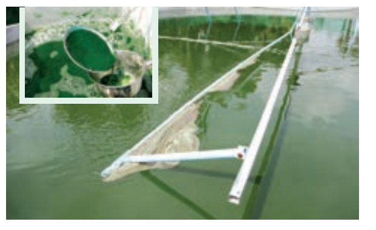

**பாட உள்ளடக்கம்**

101 உணவுத்‌ தாங்கள்‌. 

10.2 நறுமணப்வாருட்கள்‌, சுவையூட்டிகள்‌ 

10.3 நார்கள்‌

10.3 மரக்கட்டை

10.4 மரப்பால்‌

10.5 மரக்கூழ

10.7 சாயங்கள்‌

10.8 ஒப்பனைப்‌ பொருட்கள்‌ 

10.9 பாரம்பரிய மருத்துவமுறைகள்‌ 

10.10 மூலிகைத்‌ தாவரங்கள்‌.

10.11  தொழில்முனைவுத்‌ தாவரவியல்‌.

நிலத்திலும்‌, நீரிலும்‌ பரந்துபட்ட ாவரத்‌ தொகுதிகளை "நேரடியாகவோ மறைமுகமாகவோ சார்ந்து அனைத்து வகையான. உயிரினங்களும்‌ வாழ்கின்றன. வனாற்றுக்கு முந்தைய மனிதர்களின்‌ வாழ்நாள்‌ பழங்கள்‌, கீரைகள்‌, கிழங்குகள்‌ முதலியவற்றைச்‌ சேகரிப்பதிலும்‌, விலங்குகளை வேட்டையாடுவதிலும்‌ கழிந்தது... காவரங்களையும்‌, விலங்குகளையும்‌ வள்ப்பச்‌ சூழலுக்கு உட்படக்தியதன்‌ மூலம்‌ உரி உணவு உற்பத்திக்க வழி வதக்தது. இதுவே நாகரிக

வர்சசிக்கு... அடிப்படையாக. அமைந்தது. ஆரம்பகாலத்தில்‌ உலகின்‌ வெவ்வேறு பகுதிகளில்‌ தோன்றிய நாகரிகங்கள்‌: பல்வேறு

'நோக்கங்களுக்காகம்‌ பலவகையான தாவரங்களை அவற்றின்‌... பயன்பாப்டன்‌.... கடிப்பபையில்‌ வணர்பபுச்மழலுக்கு... உட்டருத்தின.. இவ்வகை: பொருளாதார முக்கியத்துவம்‌ வாய்ந்த தாவரங்கள்‌ அவற்றின்‌ பயன்பாட்டின்‌ கமப்படையில்‌ உணவுக்‌ தாவரங்கள்‌, தீவனத்‌ தாவரங்கள்‌, நார்‌ தாவரங்கள்‌, கட்டை தரும்‌ தாவரங்கள்‌, மூலிகைத்‌ தாவரங்கள்‌, காகிதத்‌. தொழிற்சாலையில்‌ பயன்படுத்தப்பம்‌ தாவரங்கள்‌, சாயத்‌ தாவரங்கள்‌, ஒப்பனைப்‌ பொருட்களில்‌ பயன்பருத்தப்படம்‌ தாவரங்கள்‌ என: வகைப்பரத்கப்பநகின்றன.. ஒவ்வாரு வகையிலும்‌ பொருளாதார... முக்கியத்துவம்‌... வாய்ந்த 'தேர்ந்தெடுக்கப்பட்ட தாவரங்கள்‌ இப்பாடம்‌ பகுதியில்‌ விவாதிக்கப்படுகின்றன.

**உணவுத்‌ தாவரங்கு**

ஏறக்குறைய 10000 உணவுத்‌ தாவரங்கள்‌ தற்போது பயன்பாப்டில்‌ உள்ளன. இவற்றில்‌ ஏறக்குறைய (500. சிற்றினங்கள்‌... மட்டுமே பமிரிடப்பறகின்றன. இருப்பினும்‌ பெரும்பான்மை. மக்களின்‌ உணவு, அப்படை சிசி, கோதுமை, சோனம்‌ ஆகிய மூன்று புல்வகைகளை மட்டுமே அதிகம்‌ சார்ந்துள்ளது.

10.11 **தானியங்கள** 

தானியம்‌ எனும்‌ சொல்‌ 'சீரிஸ'‌. (ceres) எனும்‌. வார்த்தையிலிருந்து உருவானது. இது ரோமானியக்‌ கொன்மத்தில்‌ வேளாண்மைக்‌ கடவுளைக்‌ கறக்கும்‌. சரசம்‌ மிதந்த உண்ணக்கூடிய விதைகளுக்காக, வளர்க்கப்படும்‌. எல்லாத்‌ தானிய வகைகளுமே 'போயேசி எனப்படும்‌ புல்‌ குடும்பத் தாவரங்களாகும

தானியங்கள்‌ பின்வரும்‌ காரணங்களால்‌ உணவுத்‌

'தாஷங்களில்‌ முக்கியத்துவம்‌ பெறுகின்றன.

i. எல்வகை வளர்‌ சூழலுக்கும்‌ ஏற்ப வெற்றிகரமாகத்‌ தகவமைத்துக்‌ கொள்ளும்‌ தன்மை ()

ii. எளிதில்‌ பமிறிபப்படக்கூடியவை.

iii. அதிக. அடிகிளைத்தல்‌() ஷய்யம்‌ தன்மையினால்‌ ஒரு குறிப்பட்ட நிலப்பரப்பில்‌ அதிக விளைச்சல்‌ கிடைக்கச்‌ ஷய்தல்‌

 iv. செறந்த உலர்ந்த தானியங்களை: எவ்விதச்‌ சேதமுமின்றி எளிதில்‌ கையாளவும்‌, கொண்டி, செல்லவும்‌, சேமித்து வைக்கவும்‌ முடியம்‌.

v. உயர்  கலோரி. மதிப்புள்ள ஆற்றலை. வழங்கக்கூடியவை. 

கார்போஹைட்ரேட்டுகள், புரதங்கள், நார்கள் மற்றும் பலவகையான வைட்டமின்கள், கனிமங்கள்
ப�ோன்ற ஊட்டச்சத்துக்களைத் தானியங்கள்
வழங்குகின்றன. அளவின் அடிப்படையில் 
தானியங்கள் இரண்டு வகையாக
வகைப்படுத்தப்படுகின்றன. அவை
 (1) பெருந்தானியங்கள் (2) சிறு தானியங்கள்.

### பெருந்தானியங்கள்.

**நெல்**

**தாஷலியல்‌ வயர்‌: ஒரைசா சட்டைவா**

தேங்கும் நிலை நீரில்‌ வளரும்‌ பகதி நீர்வா்த (2! ஜெ) தாவரம்‌ ரல்‌. முக்கியமான உணவப்பயிரான "இதுபிடிடப்பவதிலும்‌ உற்பத்தியிலும்‌ கோதுமைக்கு. "த்தப்டியாக இரண்டாவது இடத்தைப்பெற்றள்ளது. கார்போஹைட்ரேட்டை வங்கம்‌ மக்கிய ஆகாரமாக. ரிசி உள்ளது.

**தோற்றம்‌ மற்றும்‌ விளையுமடம்‌**

ஓஷல்லின்‌ தோற்ற மையம்‌ தென்கிழக்கு ஆசியா எனக்‌. கரகப்புகிறது. சீனா, இந்தியா, தாய்லாந்து போன்ற. நாடுகளில்‌ நெல்‌ பமிரட்ப£்கான தொன்மைக்கால. சான்றுகள்‌ கண்டறியப்பட்டள்ளன. நல்‌ தமிழகத்தின்‌ ஓடல்பாமற்றும்‌ பாசனப்‌ பகுதிகளில்‌ பிரிடப்பகறது. 

**பயன்கள்‌**

அரிசி கலோரி மிதந்க எளிதில்‌ ஊரிமானமாகக்‌ கடய. உணவு இது ஷற்த மற்றும்‌ வடகிழக்கு இந்தியாவில்‌. முக்கிய உணவாகப்‌ பயண்படுக்கப்புகிறு.

படம் 10.1: பெருந்தானியங்கள

அவல்‌ (Flaked Rice)/ ப�ொரி (Puffed Rice) போன்ற சிசி பொருட்கள்‌ காலை உணவாகவும்‌, சிற்றுண்டியாகவம்‌

இந்தியாவின்‌. பல்வேறு: பகுதிகளில்‌. பயன்பரத்தப்படுகின்றன.

அரிசி தவிட்டலிருந்து. பெறப்பட்ட விட்ட எண்ணெய்‌ (Rice bran oil)சமையலிலம்‌,
கொழிற்சாலைகளிலும்‌ பயன்பருக்சப்பரகின்றது. 

உமி (Husks) எறிவாருளாகவும்‌, வாதி. கட்டுவதற்கும்‌, உரம்‌ போன்றவை தயாரிக்கவும்‌ பயன்படத்தப்புகின்றன.

---
**உனக்கு தெரியுமா ?**

பன்னாட்டு நெல் ஆராய்ச்சி 
நிறுவனம் (IRRI) பிலிப்பய்ன்ஸ்‌ தலைநகரமான: மணிலாவின்‌ லாஸ்‌ பனோஸில்‌ அமைந்துள்ளது. உலகிலேயே நெல்‌ ஆராய்ச்சிகளை மட்டுமே மேற்ாள்கின்ற ஒரே நிறுவனம்‌ (IRRI) ஆகம்‌.

இந்நிறுவனத்தின் முக்கிய நோக்கம் வறுமை, பசி, ஊட்டச்சத்து குறைபாடு ப�ோன்றவற்றை நீக்கி வாழ்வாதாரங்கள் மற்றும் ஊட்டச் சத்துக்களை
மேம்படுத்துவதாகும். உலகிலுள்ள எல்லா IR நெல் வகைகளும் நெல் கலப்பினப் பயிர் பெருக்கத் திட்டங்கள் மூலம் உற்பத்தி செய்து IRRI வெளியிட்டதாகும்.

இன்றுவரை IRRI 843 அரிசி ரகங்களை
உற்பத்தி செய்து, 77 நாடுகளில் வெளியிட்டுள்ளது. இந்நிறுவனம் 1960-களின் துவக்கத்தில் IR 8 எனும் உயர்விளைச்சல் குட்டை ரக நெல் வகையை உருவாக்கியது. பஞ்சத்தைப் ப�ோக்குவதில் முக்கியப் பங்காற்றியதால் இது ‘அற்புத அரிசி’ என அனைவராலும் ப�ோற்றப்பட்டது. IR 36 இன்னொரு குறிப்பிடத்தகுந்த அதிகப் பூச்சி மற்றும் நோயெதிர்ப்பு திறன் கொண்ட அரைக்குட்டை நெல் ரகம். இந்தரகம் உயர்விளைச்சல் மூலம் ஆசியக் குடும்பங்களில் முக்கிய உணவான அரிசியின் விலையை மலிவாக்கியது. IRRI-ன் பன்னாட்டு மரபணு வங்கி 1,17,000-க்கும் அதிகமான நெல் வகைகளைச் சேகரித்து வைத்துள்ளது. இதில் பாரம்பரிய நெல் வகைகளும், அவற்றின் உறவுடைய வளர்ப்புச் சூழலுக்கு உட்படுத்தப்படாத நெல் வகைகளும் 
அடங்கும்.

---

**கோதுமை**

**தாவரவியல்‌ வயர்‌: டிிபுக்கம்‌ எஸ்டிவம்‌ தோற்றம்‌ மற்றும்‌ விளையுமிடம்‌**

கோதுமை. பமிற்பதற்கான... தொன்மை ஆதச்சன்றுகள்‌ செழுமை பிறை (௭1௨ ௭௯௦௭) பகுதியில்‌ கிடைத்துள்ளன. பொதுவாகப்‌ பயிரிடப்‌ கோதுமை ரகமான பரிட்டுக்கம்‌ ஹஸ்டிவம்‌ கமழ்‌ 7500 ஆண்டுகளாகப்‌. பமிறிபப்பட்டு.. வருகின்றது. "உத்திரபிரதேசம்‌, பஞ்சாப்‌ ஹரியானா, இராஜஸ்தான்‌, மத்தியப்பிரதேசம்‌, பீகார்‌ போன்ற வட இந்திய மாறிலங்களில்‌ கோதுமை அதிகமாகப்பமிறிடப்புகிறத.

**பயன்கள்‌** 

கோதுமை வட இந்தியாவில் முக்கிய உணவாக
உள்ளது. கோதுமை மாவு ரொட்டி மற்றும் பிற அடுமனை ப�ொருட்கள் தயாரிக்க ஏற்றது. மைதா என்றழைக்கப்படும் 
நார்சத்து அற்ற பதபடுத்தப்பட்ட கோதுமை மாவு பரோட்டா, ரொட்டி மற்றும் அடுமனை ப�ொருட்களைத் தயாரிக்கப் பரவலாகப் பயன்படுத்தப்படுகிறது.முளைகட்டிய கோதுமை (malted wheat) மதுபானம், 
ஊட்டச்சத்து பானங்கள் ப�ோன்றவை உற்பத்தி செய்வதற்கான முக்கிய மூலப்பொருளாகும்.

**மக்காச் சோளம்**

தாவரவியல் பெயர்: ஜியா மேய்ஸ்
தோற்றம் மற்றும் விளையுமிடம்
இது புதிய உலகிலிருந்து (new world) தோன்றி வளர்ப்புச்சூழலுக்கு உட்படுத்தப்பட்ட ஒரே தானியமாகும். 
மத்தியப் பிரதேசம், இமாச்சலப் பிரதேசம், பஞ்சாப் ஆகியவை இந்தியாவின் அதிக மக்காச்சோள உற்பத்தி 
செய்யும் மாநிலங்ளாகும். பெரம்பலூர், அரியலூர், கடலூர், திண்டுக்கல், திருப்பூர் ஆகியவை தமிழ்நாட்டின் 
முக்கிய மக்காச்சோள வளர்ப்புப் பகுதிகளாகும

**மக்காச்சோளப் ப�ொரி (பாப்கார்ன்) ஏன் வெடிக்கிறது?**

சோளத்தில் மென்மையான
மற்றும் கடினமான
கருவூண்திசுக்கள் உள்ளன. 
ம க்காச் ச ோளப்ப ொ ரி யி ன் 
பெரும்பகுதி மென்மையான
கருவூண்திசுவாலானது. இதைச் சூழ்ந்து கடினக்கருவூண்திசு உள்ளது. சூடாக்கும்போது, உட்புறத் 
தரசம் மற்றும் புரதம் ஆகியவை ஜெலட்டினால் ஆன ப�ொருட்களாக மாற்றப்படுகின்றன, மேலும், 
அழுத்தம் அதிகரிக்கும்போது, மென்மையான
கருவூண்திசு விரிவடைந்து,வெடிக்கும்போது ஜெலட்டின் தரசம் நுரையாக மாற்றப்படுகிறது.
அவை உடனே எளிதாய்க்கடினதன்மையடைந்து 
சுவையான, மொறுமொறுப்பான
மக்காச்சோளப்பொரியாக மாறுகின்றது

**பயன்கள்‌**

உற்பத்தி செய்யப்படும்‌ வரும்பான்மை மக்காச்சோளம்‌: உணவை விடத்‌ தீவனமாகவே பயன்படுகிறது. மக்காச்சோள நீரப்பாகு (வாடு) குழந்தைகளுக்கான: உணவுத்தயாரிப்பில்பயன்படுகின்றது மக்காச்சோளம்‌. மதுபானம்‌: தயாரிக்கும்‌ ஆலைகளில்‌: மூலப்பொருளாக.

---
**உனக்கு தெரியுமா ?**

ப�ொய் தானியம்
(Pseudo-cereal)
ப�ொய் தானியம் எனும் 
சொல் புல் குடும்பத்தைச் சாராத 
த ா வ ர ங ்க ளி லி ரு ந் து 
ப ெறப்பட் டு , உ ண ்ணப்ப டு ம் 
த ா னியங்க ளைக்கு றி க் கி ற து . 
எடுத்துக ்காட் டு : கீன�ோ ப � ோ டி ய ம் கின�ோவ ா . உண்மையில் இது 
அமர ாந ்தேசி குடும்பத்தைச் சார்ந்த கீன�ோப�ோடியம் கின�ோவாஎனும் தாவரத்திலிருந்து பெறப்படுகிறது. குளூட்டன் அற்ற முழுதானிய கார்போஹைட்ரேட்டும், முழுமையான புரதமும் (அனைத்து ஒன்பது 
இன்றியமையா அமினோ அமிலங்களைக் கொண்ட
கடினமான புரதம்) உடையது. மேலும், 6,000
ஆண்டுகளாக மலைப் பகுதிகளில் உணவாக
உட்கொள்ளப்பட்டு வருகிறத
---
**சிறுதானியங்கள்‌ (Millets)**

ஆப்பிரிக்கா மற்றும் ஆசியாவில் பழங்கால மக்களால் 
முதலில் பயிரிடப்பட்ட சிறிய விதைகள் பலவற்றிற்குச் 
சிறுதானியங்கள் (Millets) எனும் சொல் 
பயன்படுத்தப்படுகின்றது. இவை தரச புரச பசையற்ற 
(குளூட்டன்) குறைவான சர்க்கரை அளவுக்
குறியீட்டைக் கொண்ட தானிய வகையாகும்.

**கம்பு (Pearl millet)**

தாவரவியல் பெயர்: பெனிசிட்டம் அமெரிக்கானம். இது இந்தியாவிலும்‌, ஆப்பிரிக்காவிலம்‌ 'றிுகப்ப்தப்பட்ட கம்பு வகைகளில்‌ ஒன்றாகும்‌. "இந்தியாவின்‌ பல பகநிகளிலம்‌, குறிப்பாகக்‌ ககரால்‌, ராஜஸ்தான்‌. போன்ற மாநிலங்களில்‌ அதிகமாகப்‌ மலறிபப்படுகின்றத.

**பயன்கள்**

இது ப�ொதுவாகத் தட்டை ரொட்டி, தரச புரதப் 
பசையமற்ற தானிய அடிப்படையிலான ப�ொருட்கள்
செய்யப் பயன்படுத்தப்படுகிறது. கம்மங்கூழ், பிஸ்கட், 
பாஸ்தா மற்றும் பால் தவிர்த்த புரோபயாட்டிக் (Probiotic) 
பானங்கள் தயாரிக்கப் பயன்படுகின்றது.

படம் 10.2: சிறுதானியங்கள

**கேழ்வரகு (Finger millet)**

தாவரவியல்‌ வயர்‌: எல்லன்‌ கேரகளா 'கேழ்வரகுகிழக்குஆப்பிரிக்காவிலிருந்த இந்தியாவிற்கு வெகு காலத்திற்கு முன்பே சஸிமுகப்பருக்கப்ப்ட பிர்‌. இது கால்சியம்‌ நிரைந்த.

**பயன்கள**

"இந்தியாவின்‌ பல தற்கு மலைப்பததிகளில்‌ ஒரு முக்கிய உணவாக இறு பயன்பரத்தப்புகிறது. கேழ்வரகு. கஞ்சியாகவோ, கூழாகவோ "உண்ணப்படுகிறது. ராகிமால்ட்‌ (Ragi malt)‌ ஒரு மிரபலமான ஊட்டச்சத்துப்‌ பானமாகும்‌, கேழ்வரகு தாதி பானங்கள்‌ தயாரிப்பில்‌ (Fermented beverages) மூலப்வொருளாகப்‌ பயன்படுகிறது.

**சோளம்‌  (Sorghum)**

தாவரவியல்‌ வயர்‌: வர்கம்‌ வல்சேர்‌

சோளம்‌ ஆப்ிரிக்காவிலிருந்து அறிமுக்படக்கப்ப்டது. உலகின்‌ முக்கிய சிறுதானியங்களில்‌ சோளமும்‌: ஒன்று. கால்சியம்‌ மற்றும்‌ இரும்பு சத்து அதிக அளவில்‌ உள்ளது.

**பயன்கள**

கோழி, பறவைகள்‌, பன்றிகள்‌... மற்றும்‌ கால்நடைகளுக்குச்‌... சோளம்‌. தீவனமாகப்‌மயன்படகின்றது நொதி சாராயம்‌ பானங்களின்‌ மூலப்‌ வாகுளாக உள்ளத.

### மிகச்சிறு தானியங்கள் (Minor Millets) 
**சாமை (Little Millet)**
தாஷவியல்‌ வயர்‌: பாணிக்கம்‌ சமத்ன்ஸ்‌. மழமையான மிகச்சிறு தானியங்களில்‌ சாமை 44௭) ஒன்று இது இந்தியாவைப்‌ பிறப்பிடமாகக்‌ கொண்டது. இன்‌ சிற்றினம்‌... பெயர்‌... சமததிராவிலரநது. சேகரிக்கப்பட்ட வகை மாதிரியின்‌ அடிப்படையில்‌

தரப்பட்டுள்ளது. இதில் இரும்பு சத்து, நார்சத்து 
ப�ோன்றவை அரிசியை விட அதிகமாக இருப்பதால் 
நீரிழிவு நோயாளிகளுக்குச் சிறந்ததாகக்
கருதப்படுகிறது

**பயன்கள்‌**

சாமை. சறிசியைப்‌ போன்றே சமைக்கவும்‌, அரைக்கவும்‌, அருமனை பண்டத்‌ தயாரிப்பிலும்‌ பயன்பரகிறது. இது இரக்கச்‌ சோகை, மலச்சிக்கல்‌. மற்றும்‌. இதர. ஊரிமானக்‌ கோளாறுகளைக்‌ ணப்பற்துகிறது.

**தினை (Foxtail Millet)**

தாவரவியல்‌ வயர்‌: சி்பேரியா இடாலிக்கா “இந்தியாவில்‌ பாரம்பறியமாகப்‌ பயன்படுத்தப்‌ தினை வகைகளில்‌ இதவும்‌ ஒன்று. சமார்‌ 6,00௦. வருடங்களுக்கு முன்பே சீனாவில்‌ வளர்ப்ப்‌ கழலுக்கு உப்படக்ப்பட்டற. தினையில்‌ முழம்‌, கார்போஹைட்ரேட்‌, வைட்டமின்‌ 6, ௦, பொட்டாசியம்‌ மறறும்‌ கால்சியம்‌ போன்றவைமிதந்தள்ளை. "இனை இதயத்தைப்‌ பலப்படுத்தவும்‌, கண்பார்வையை மேம்படுத்தவும்‌. பயன்படுகிறது... தினைக்கக்சி பாலூட்டும்‌ அன்னையருக்குக்‌ கொருக்கப்புகிறது.

**வரகு (Kodo Millet)** 

தாவரவியல்‌ வயர்‌: பஸ்பாலம்‌ ஸ்குரோபிதலேட்டம்‌. வகு. மேற்கு ஆப்பிறிக்காவைப்‌ பிறப்பிடமாகக்‌ கொண்டது. நார்சத்து, பரதம்‌ மற்றும்‌ கனிமங்கள்‌ நிறைந்தது.

**பயன்கள்‌**

வரகு மாவாக அரைக்கப்பட்டுக் களியாக்கப்படுகின்றது 
(Pudding). சிறுநீர் பெருக்கியாகவும், மலச்சிக்கலைக்குணப்படுத்தவும், உடல் பருமனைக் குறைக்கவும், 
இரத்தச் சர்க்கரை மற்றும் இரத்த அழுத்தத்தைக்குறைக்கவும் உதவுகிறது.

படம்‌ 10: சிறுதானியங்கள்‌

படம் 10.4: பருப்ப

### பருப்பு வகைகள்‌ (Pulses).
 
“பல்சஸ்‌" என்ற சால்‌"கடர்ந்த ஆப்‌" எனப்பொருள்படும்‌: த்தன்‌ வார்க்தைகளான பல்ஸ்‌ (puls) அல்லது ப்டஸ்‌. முமிவு என்ற சொல்லிலிருந்து வற்பட்டது. பருப்பு ஃபேபேஸி குடும்பங்களிலிருந்து பெறப்படும் 
விதைகள். இவை உலகிலுள்ள மக்களுக்குத் 
தேவையான தாவரசார் (plant based) புரதம், வைட்டமின்கள் மற்றும் கனிமங்களை
வழங்குகின்றன

**உளுந்து (Black gram)** 

தாஷலியல்‌ வயம்‌: விக்னா முங்கோ
தோற்றம் மற்றும் விளையுமிடம

இந்தியாவைப் பிறப்பிடமாகக் கொண்டது. தொன்மைதொல்தாவரவியல் சான்றுகள் (Archeobotanical) சுமார் 
3,500 ஆண்டுகளுக்கு முன்பே இந்தியாவில் உளுந்து இருந்ததை உறுதி செய்கின்றன. இது வறண்ட
இடங்களில் மானாவாரி (Rainfed) பயிராகப் 
பயிரிடப்படுகிறது. உலகளாவிய உளுந்து உற்பத்தியில் இந்தியா 80% பங்களிப்பு செய்கிறது. இந்தியாவில் 
உத்திரப் பிரதேசம், சட்டிஸ்கர், கர்நாடகா ப�ோன்ற மாநிலங்களில் அதிகமாகப் பயிரிடப்படுகின்றது.

**பயன்கள**

உளுந்து விதைகள் முழுதாகவோ, உடைத்தோ, 
வறுத்தோ அல்லது மாவாக அரைத்தோ
உண்ணப்படுகிறது. உளுந்துமாவு பிரபலமான
தென்னிந்தியக் காலை சிற்றுண்டிகளில் உணவைத் 
தயாரிப்பதற்கான ஒரு முக்கியப் ப�ொருளாக உள்ளது. உடைத்த உளுத்தம் பருப்பு இந்தியக் குழம்பு வகைகளில் தாளிக்கப் பயன்படுகின்றது.

**துவரை (Red gram)**

தாவரவியல் பெயர்: கஜானஸ் கஜன்
தோற்றம் மற்றும் விளையுமிடம்
தென்னிந்தியாவில் தோன்றிய ஒரே பருப்பு வகை
துவரை ஆகும். இது மகாராஷ்டிரா, ஆந்திரப் பிரதேசம், மத்தியப் பிரதேசம், கர்நாடகா, குஜராத் ப�ோன்ற மாநிலங்களில் அதிகமாகப் பயிரிடப்படுகின்றது.வறுத்து உப்பிட்ட அல்லது உப்பிடாத பருப்பு ஒரு 
பிரபலமான நொறுக்குத்தீனியாகும். இளம் காய்கள் 
(Young pods) சமைத்து உண்ணப்படுகின்றன.
**பயன்கள்**

துவரம் பருப்பு தென்னிந்தியாவின் சிறப்பு வகை குழம்பான சாம்பாரின் மிக முக்கிய அங்கமாகும.வறுத்து உப்பிட்ட அல்லது உப்பிடாத பருப்பு ஒரு 
பிரபலமான நொறுக்குத்தீனியாகும். இளம் காய்கள் (Young pods) சமைத்து உண்ணப்படுகின்றன.

**பாசிப்பயறு / பாசிப்பருப்பு (Green gram)**
தாவரவியல் பெயர்: விக்னா ரேடியேட்டா
தோற்றம் மற்றும் விளையுமிடம்

பாசிப்பயறு இந்தியாவில் தோன்றியது என்பதற்கான
தொல்லியல் சான்றுகள் மகாராஷ்டிரா மாநிலத்தில் 
கிடைக்கப்பெற்றன. இது மத்தியபிரதேசம், கர்நாடகா, 
தமிழ்நாடு ப�ோன்ற மாநிலங்களில் அதிகமாகப் 
பயிரிடப்படுகிறது.

**பயன்கள்**

இதை வறுத்தோ, சமைத்தோ, முளைக்க வைத்தோ
பயன்படுத்தலாம். பாசிப்பருப்பு தமிழ்நாட்டில் 
பிரபலமான காலை உணவான ப�ொங்கலில் ஒரு 
முக்கியப் ப�ொருளாகப் பயன்படுகின்றது. வறுத்துத் தோல் நீக்கப்பட்ட, உடைத்த அல்லது முழுப் பயிறு பிரபலமான சிற்றுண்டியாகப் பயன்படுத்தப்படுகின்றன. 
இதன் மாவு பாரம்பரியமாகத் தோல் பராமரிப்புக்கான ஒப்பனைப் ப�ொருளாகப் பயன்படுத்தப்படுகின்றது.

**கொண்டைக்கடலை (Bengal gram)**

தாவரவியல் பெயர்: சிசர் எரேட்டினம்
தோற்றம் மற்றும் விளையுமிடம்
கொண்டைக்கடலை மேற்கு ஆசியாவில் தோன்றியது. 
மேலும் இந்தியாவில் 4,000 ஆண்டுகளுக்கு 
முன்னரே பயிரிடப்பட்டது. மத்தியப் பிரதேசம், 
உத்திரப்பிரதேசம், ராஜஸ்தான் மாநிலங்களில் 
அதிகமாகப் பயிரிடப்படுகின்றது.

**பயன்கள**

கொண்டைக்கடலையிலுள்ள புரதம், அமினோ அமிலம், 
அதன் செரிமானத்தன்மை ஆகியவற்றின் 
அடிப்படையில் உயர் மதிப்புடையதாகக்
கருதப்படுகின்றது. குழந்தைகளுக்கான உணவின் 
முக்கிய உபப்பொருளாக முளைகட்டிய கடலை
பெரும்பாலும் பயன்படுத்தப்படுகிறது. கடலை மாவு பலவகையான இந்திய இனிப்பு வகைகளின் 
மூலப்பொருளாக உள்ளது. வறுத்து உப்பிட்ட முழு அல்லது உடைத்த கடலை, நடுத்தர மக்களின் 
பிரபலமான திண்பண்டமாக உள்ளது.

### காய்கறிகள் 

காய்கறிகள் நிறைந்த ஒரு சந்தையில் நடந்து 
செல்லும்போது அடுக்கிய வெண்டைக்காய்கள், 
மலைப�ோல் குவிந்திருக்கும் உருளைக்கிழங்குகள், 
கூம்பாகக் குவித்திருக்கும் கத்திரிக்காய், தக்காளி, வெள்ளரி ப�ோன்றவற்றைக் காண்பீர்கள். பழக்கவழக்கங்கள், குடும்பச் சுவைக்கேற்றவற்றைப் 
புதிய சத்தான, மென்மையான, பழுத்தவற்றை
அனுபவம் மற்றும் பாரரம்பரிய பழக்கத்தின் மூலம் தெரிவு செய்கின்றோம். நாம் ஏன் காய்கறிகளைச் சாப்பிட வேண்டும்? அவை நமக்கு என்ன தருகின்றன?

காய்கறிகளுக்கு ஆரோக்கியமான உணவில் 
பங்கு உள்ளது. ப�ொட்டாசியம், நார்சத்துக்கள், 
ஃப�ோலிக் அமிலம், வைட்டமின் A, E மற்றும் C ப�ோன்ற 
பல ஊட்டச்சத்துக்களைக்காய்கறிகள் வழங்குகின்றன. 
இதிலுள்ள ஊட்டச்சத்துக்கள் நமது ஆரோக்கியத்தைப் 
பராமரிப்பதற்கு மிகவும் அவசியம்.

**உருளைக்கிழங்கு (Potato)**

தாவரவியல் பெயர்: ச�ொலானம் டியூபரோசம்
குடும்பம்: சொலானேசி
தோற்றம் மற்றும் விளையுமிடம்
பெரு மற்றும் ப�ொலிவியாவின் உயர் மலைப்பகுதிகளில் 
உருளைக்கிழங்கு தோன்றியது. இந்தியாவில் 
உத்திரப்பிரதேசம், மேற்கு வங்கம், பீகார் ப�ோன்ற 
மாநிலங்களில் அதிகமாகப் பயிரிடப்படுகின்றது. 
தென்னிந்திய மலைப்பகுதியில் (Southern Hills) உள்ள
நீலகிரி மற்றும் பழனி மலைத் தொடர்கள்
உருளைக்கிழங்கு விளைச்சலில் முக்கியப் பங்கு 
வகிக்கின்றது.

**பயன்கள்**

உருளைக்கிழங்கு வேகவைத்தோ (Steamed),
வறுத்தோ, அடுமனையிலிட்டோ, சூப்புகளாகவோ, 
மசித்தோ அல்லது அப்பமாகவோ
பயன்படுத்தப்படுகின்றது. வறுசீவல்கள் (Chips) மற்றும் மதுபான (Brewery) தொழிற்சாலைகளில் முக்கிய 
மூலப்பொருளாகப் பயன்படுத்தப்படுகின்றது.
நுண்ணுயிரியல் மற்றும் மருத்துவப் 
பயன்பாடுகளுக்கான ப�ொருட்களின் உற்பத்தியிலும் 
முக்கிய இடுப்பொருளாக உள்ளத

**வெண்டைக்காய் (Lady’s Finger)**

தாவரவியல் பெயர்: எபெல்மாஸ்கஸ் எஸ்குலெண்டஸ்
குடும்பம்: மால்வேசி

**தோற்றம் மற்றும் விளையுமிடம்**

வெண்டை வெப்பமண்டல ஆப்பரிக்காவை
பூர்வீகமாகக் கொண்டது. அசாம், மகாராஷ்டிரா, 
குஜராத் ஆகிய மாநிலங்களில் அதிகமாகப் 
பயிரிடப்படுகின்றது. தமிழகத்தில் கோயம்பத்தூர தர்மபுரி, வேலூர் ஆகிய பகுதிகளில் அதிகமாகப் 
பயிரிடப்படுகின்றது.

**பயன்கள**

முற்றாத பசுமையான இளம் காய்கள் காய்கறிகளாகப் 
பயன்படுத்தப்படுகின்றன. வெட்டப்பட்டு உலரவைக்கப் 
பட்ட (dehydrated) வெண்டை பின்பயன்பாட்டிற்காகபாதுகாக்கப்படுகிறது.  இது மிக முக்கியமான ஊட்டச்சத்துக்களைக் கொண்டுள்ளது.

**வெள்ளரி (Cucumber)**

தாவரவியல் பெயர் : குக்குமிஸ் சடிவஸ்
குடும்பம்: குக்கர்பிட்டேசி
குக்கர்பிட் என்பது குக்கர்பிட்டேசி குடும்பத்தைச் சார்ந்த
கொடியின தாவரங்களான வெள்ளரி, ஸ்குவாஷ் 
(squash), பூசணி, முலாம் ப�ோன்றவை இவ்வினம் சார்ந்த காய்கறிகளைக் குறிக்கும் சொல்லாகும்.

**தோற்றம் மற்றும் விளையுமிடம்**
இந்தியா முழுவதிலும் பரவலாக வெள்ளரி 
பயிரிடப்படுகிறது. இந்தியாவின் அனைத்துப் 
பகுதிகளிலும் வெள்ளரி ஒரு முக்கியக் கோடைக்காலக்
காய்கறியாகப் பயன்படுத்தப்படுகின்றது. இந்தியாவில் தோன்றிய இவ்வினம், 3,000 ஆண்டுகளாகப் பயிரிடப்பட்டு வருகின்றது.

**பயன்கள்**

வகையைப் ப�ொறுத்து இளம் அல்லது முதிர்ந்த பழங்களை நேரடியாகவோ அல்லது சமைத்தோ உண்ணப்படுகிறது. சாலட் (salad) மற்றும் ஊறுகாய் தயாரிக்கப்படுகிறது. வெள்ளரி விதைகளிலிருந்து 
பெறப்பட்ட எண்ணெய் மூளை மற்றும் உடலுக்குச் சிறந்தது, மேலும் அதன் விதைப்பருப்பு பல்வேறு இனிப்பு தயாரிப்புகளில் பயன்படுகின்றத

### பழங்கள்

உண்ணக்கூடிய பழங்கள் சதைபற்றுடன், இனிய 
வாசனை மற்றும் சுவையுடையன. பழங்கள்
ப�ொட்டாசியம், நார்ச்சத்து, ஃப�ோலிக் அமிலம், விட்டமின்கள் ப�ோன்ற பல ஊட்டச்சத்துக்களின் 
மூலமாக உள்ளன. வளரும் தட்பவெப்ப இடத்தைப் ப�ொறுத்துப் பழங்கள் குளிர்மண்டல பழங்கள் (ஆப்பிள், 
பேரிக்காய், ஊட்டிஆப்பிள்), வெப்பமண்டலப் பழங்கள்
(மா, பலா, வாழை) என வகைப்படுத்தப்படுகின்றன. 
இந்தப் பாடப்பகுதியில் சில வெப்பமண்டலப் பழங்களைப் பற்றிக் காண்போம்.

**மா (Mango)**

தாவரவியல் பெயர்: மாஞ்சி ஃபெரா இண்டிகா
குடும்பம்: அனகார்டியேசி
தோற்றம் மற்றும் விளையுமிடம்
மா தெற்காசியாவைக் குறிப்பாகப் பர்மா மற்றும் 
கிழக்கிந்தியாவைப் பிறப்பிடமாகக் கொண்டது. இத

படம் 10.5: மா

இந்தியாவின் தேசியப்
பழமாகும். ஆந்திரப் 
பிரதேசம், பீகார், குஜராத், 
கர்நாடகா ஆகியவை
மாம்பழம் அதிகமாகப் 
ப யிரிட ப்ப டு ம் 
ம ா நிலங்கள ா கு ம் . 
தமிழகத்தில் சேலம், 
கிருஷ்ணகிரி, தர்மபுரி 
ஆகியவை அதிக மாம்பழ 
உற்பத்தி செய்யும் மாவட்டங்களாகும். அல்போன்ஸா, 
பங்கனபள்ளி, நீலம், மல்கோவா ப�ோன்றவை
இந்தியாவின் முக்கிய மாம்பழ வகைகள்.

**பயன்கள்**
மாம்பழம் இந்தியாவில் அதிகளவில் உட்கொள்ளப்படும் 
பழம். இதில் பீட்டா கரோட்டின் அதிகமாக உள்ளது.
இது பின்உணவுப் பண்டமாகவோ, பதப்படுத்தப்பட்டு 
அடைக்கப்பட்டோ, உலர்த்திப் பாதுகாக்கப்பட்டோ, 
இந்திய உணவில் பல வழிகளில் 
பயன்படுத்தப்படுகிறது. புளித்த, பழுக்காத மாங்காய் 
சட்னி, ஊறுகாய், கூட்டு தயாரிக்கவும் அல்லது உப்பு, 
மிளகாய் சேர்த்து நேரடியாக உண்ணவும் 
பயன்படுகிறது. மாங்காயின் சதைப்பற்றுப் 
பகுதியிலிருந்து களிமம் (ஜெல்லி) தயாரிக்கப்படுகிறது.
காற்றேற்றப்பட்ட மற்றும் காற்றேற்றப்படாத 
மாம்பழச்சாறு ஒரு பிரபலமான பழச்சாறு பானமாகும்.

**வாழை (Banana)**

தாவரவியல் பெயர்: மியூசா x பாரடிசியாகா
குடும்பம்: மியூசேசி
**தோற்றம் மற்றும் விளையுமிடம்**
வாழை தென்கிழக்கு ஆசியாவில் வளர்ப்புச்சூழலுக்கு 
உ ட ்ப டு த்தப்ப ட ்ட து . 
வாழை உற்பத்தியில் 
தமிழ்நாடு உலகில் 
முதலிடத்தில் உள்ளது. 
தேனி, திருச்சி, ஈரோடு, 
தூத்து க் கு டி , 
கோ ய ம் பு த் தூ ர் , 
க ன்னிய ா கு ம ரி , 
தஞ்சாவூர், திண்டுக்கல் ஆகிய மாவட்டங்கள்
தமிழ்நாட்டில் வாழை பயிரிடப்படும் முக்கியப் 
பகுதிகளாகும். செவ்வாழை, நேந்திரன், கற்பூரவல்லி, 
பூவன், பேயன் ஆகியவை அதிகமாகப் பயிரிடப்படும் 
வாழை இரகங்களாகும்.

**பயன்கள்**
வாழைப்பழத்தில் ப�ொட்டாசியம் மற்றும் 
இன்றியமையாத வைட்டமின்கள் அதிகமாக
நிறைந்துள்ளன. இது நேரடியாக அல்லது சமைத்து 
(வறுத்து, உலர வைத்து, வேகவைத்து) 
உண்ணப்படுகிறது. பழம் பதப்படுத்தப்பட்ட
மாவாக்கப்படுகிறது. மேலும் நொதிக்க வைக்கப்பட்ட
பானங்களான வாழைப்பழச்சாறு, பீர், வினிகர், ஒயின் 
(wine) தயாரிக்கப்பயன்படுகிறது.

**பலா (Jack fruit)**

தாவரவியல் பெயர்: அட்ரோகார்ப்பஸ்
ஹெட்டிரோஃபில்லஸ்
குடும்பம்: மோரேசி
**தோற்றம் மற்றும் விளையுமிடம்**
பலா இந்தியாவின் மேற்குத் தொடர்ச்சி மலையைப் 
பிறப்பிடமாகக் கொண்டது. 
இது தமிழ்நாட்டின் 
‘மாநிலப்பழம்’. தமிழ் 
நாட்டில் கடலூர், 
க ன்னிய ாக் கு ம ரி , 
தி ண் டு க ்க ல் , 
புதுக்கோட்டை, நாமக்கல், 
திருநெல்வேலி, நீலகிரி ஆகிய மாவட்டங்களில் 
அதிகமாக விளைவிக்கப்படுகின்றது. பண்ருட்டி, 
கோயம்புத்தூர் ப�ோன்ற இடங்கள் முக்கியச் சந்தை
மையங்கள்.

**பயன்கள்**
பலாச்சுளை நேரடியாகவோ, சமைத்தோ
உண்ணப்ப்படுகின்றது. பழுக்காத சுளைத் துண்டுகள்
ப�ொரித்து மொறுமொறுப்பான வறுசீவலாகத் 
தயாரிக்கப்படுகின்றது. விதைகள் வறுத்தோ, அவித்தோ
உண்ணப்படுகின்றன. பழுக்காத பலாச்சுளை
காய்கறியாகப் பயன்படுகிறது

### கொட்டைகள்‌ (Nuts)

கொட்டைகள்‌ கடினமான ஏட்ுக்கள்‌ உண்ணக்கூடிய பரும்பைக்‌ கொண்ட எளிய உலர்‌ கணியாகம்‌ 'வெழ்றில்‌ ஆரோக்கியமான கொழுப்புக்‌, நார்ச்சத்து மதம்‌, வைப்பமின்கள்‌, தாதுக்கள்‌ மற்றும்‌ எதிர்‌ ஆேச்கினனேற்றிகள்‌ (ர்வ). கதிகனவு, நிறைந்துள்ளன. இப்பாடத்தில்‌ சில முக்கியமான: கொட்டைகள்‌ கறத்தக்‌ கீழே விளக்கப்பகின்றன. 

**முந்திரி ((Cashewnuts)**

தாவரவியல்‌ வயற்‌: அனகார்ியம்‌ ஆக்ஸிஷண்டேமல்‌. 'டம்பம்‌:அனகார்டியேசி

**தோற்றம்‌ மற்றும்‌ விளையும்‌**

முந்திரி மரேசிலைப்‌ பிறப்பிடமாகக்‌ கொண்டது. ட ஆம்‌ நூற்றாண்டில்‌ பேரத்துக்கய மாலுமிகள்‌ மூலலாக.
இந்தியாவிற்குள்‌ நுழைந்தது. கேரளா, கர்நாடகா, கோவா, மகாராஸ்வா, தமிழ்நாடு மற்றும்‌ ஒடிசாவில்‌ அதிகமாக வளர்க்கப்புகிறது. பயன்கள்‌. முந்திரி பொதுவாக இனிப்புகள்‌ மற்றும்‌ பிற
பண்டங்களை அலங்கரிக்கபயன்பருகிறது. அரைக்கக்‌.

**பயன்கள்**

முந்திரி ப�ொதுவாக இனிப்புகள் மற்றும் பிற பண்டங்களை அலங்கரிக்க பயன்படுகிறது. அரைத்துக

அட்டவணை 10% பிற பொதுவான பழங்கள்‌. வ.எண்‌ | வாதுப்வயர்‌ \[தமிழ்ப் வயர்‌ | தாவரவியல்‌ வயர்‌: ரம்பம்‌ |\] பயன்படும்‌ பகதி. உ ரஷங்யா சியயம்‌குவாஜலா. ரச \[செடச்ளே்மற்றம்‌ 2 \[பள்‌ கெரிக்காயப்பாயா. கெரிக்கேசி \[கணி நடந்தோல்‌ 2 ்ள்தளை. பபூணில்லாகிறாண்டம்‌ ந்பூணிக்கேசி சல்காம்புத்ிச (ரில்‌, 21௪௧௪ 'பைசஸ்‌ சரிகா மோரேசி | சதைப்பற்றான பூத்தஎம்‌. உ\] வசம்‌. \[ஃகோணிச்ஸ்‌டேசிடைலிஃவரா | சளிகேசி | கணித்தோல்‌:

கிடைக்கப்பெறும்‌. பசை (ஷம). சில. ழம்பு.. காணப்புகின்றார்க்கரைதிறம்படம்பறித்தடப்பதற்கு வகைகளுக்கும்‌... இனிப்பு... வகைகளுக்கும்‌... ஏற்றதாக உள்ளதால்‌ வணிக முக்கியத்துவம்‌ வாய்ந்த மூலப்பொருளாக உள்ளது. வறுத்த முத்திறி்பளப்பு... சர்க்கரை தயறிக்கப்பயன்பரகின்றது.

**பாதாம் (Almond)**

தாவரவியல்‌ பயர்‌: சக்கரம்‌ அஃபிசினாரம்‌. கும்பம்‌: ரோசேச 

**தோற்றம்‌ மற்றும்‌ விளையுமிடம்‌**

பாதாம்‌ மத்தியத்‌ தரைக்கடல்‌ பகுதியின்‌ மத்தியக்‌: மயன்கள்‌ கிக்கமகுதியைப்பறப்மிமாகக்‌ கொண்டது காஸ்ீர்‌... வள்ளை. சர்க்கரை... உற்த்தியில்‌... களு இமாச்சல மரதேகம்‌. மற்றும்‌ உத்திரபபதேசத்தில்‌.. மூவப்பொருளாக. உள்ளது..சுத்திகரக்க்பட்ட பனங்‌ விளையிக்கப்பகில்று ரரக்கரைகளை உற்பத்தி ப்பம்‌ ஆலைகள்‌ மதுபான:

**பயன்கள்‌** 

பாம்‌ பரப்ப வரும்பாலுல்‌ நேவமாகலோ . ஆலைகள்‌, ஓப்க்கணக்கான: வெல்லம்‌. உற்பத்தி அல்லது வறுத்தோ உண்ணப்படுகின்றது. மேலும்‌. செய்யும்‌ ஆலைகளின்‌ ஆதாரமாகக்‌ கரும்பு துணை: 'அவைமுழுமையாகவோ,சீவல்களாகவோ,மாவாகவோ. புறிகின்றது. கரும்புச்சாறு ஒரு புத்துணர்ச்சி தரும்‌. “கிடைக்கப்‌ பெறுகின்றன. பாதாம்‌, பாதம்‌ வவண்டணய்‌,. பானமாகும்‌. வெல்லக்கழிவுப்‌ பாகு (702௯௦௦) எத்தில்‌: மாம்‌ பல்மற்றும்‌ பம்‌ எண்ணையாக மறறப்படு, ஆல்கஹால்‌. உற்றத்தக்க... மூலப்பொருளாக இனிப்பு மற்றும்‌ காந்‌ இின்பண்டங்கள்‌ செய்யவ, .. விளங்குகிற.

ஒப்ைப்போருட்கள்‌. தயாரிக்கவும்‌ க்கரைத்‌ பக 54 ்‌ பனம்‌ உயர்‌ கர்வ வட்‌ சர்க்கரைத்‌ துளசி (516/6 / 862(1280) (பு உற்பத்தியை ஊக்குவிக்க உதவுகின்றது. 

### சர்க்கரைகள் (Sugars)
கரும்பின் தண்டை சுவைக்கும்போதும், பீட்ரூட், 
ஆப்பிள் ப�ோன்றவற்றைச் சாப்பிடும்போதும், பதநீரைப் 
பருகும்போதும் இனிப்புச் சுவையை
உணர்ந்திருப்பீர்கள். இது அவற்றில் வெவ்வேறு 
விகிதங்களில் காணப்படுகின்ற சர்க்கரையைப் 
ப�ொறுத்தது. சர்க்கரை என்பது உணவு மற்றும் 
உற்சாகப் பானங்களில் பயன்படுத்தக்கூடிய இனிப்புச் 
சுவையுடைய, கரையக்கூடிய கார்போஹட்ரேட்டின் 
ப�ொதுவான பெயராகும். கரும்பு மற்றும் பனையில் 
காணப்படுகின்ற சர்க்கரை திறம்படப் பிரித்தெடுப்பதற்கு 
ஏற்றதாக உள்ளதால் வணிக முக்கியத்துவம் வாய்ந்த
சர்க்கரை தயாரிக்கப் பயன்படுகின்றது.

**கரும்பு (Sugarcane)**

தாவரவியல் பெயர்: சக்காரம் அஃபிசினாரம்
குடும்பம்: ப�ோயேசி
தோற்றம் மற்றும் விளையுமிடம்
தற்போது பயிரிடப்படுகின்ற கரும்பு, 
நியூகினியாவிலுள்ள காட்டு ரகமான (wild varieties) 
சக்காரம் ஆஃபிசினாரம் மற்றும் இந்தியாவிலுள்ள
சக்காரம் ஸ்பான்டேனியத்துடன் அதன் தரத்தை
மேம்படுத்துவதற்காகப் பலமுறை பிற்கலப்பு செய்ததன் 
மூலம் பரிணமித்தது. தமிழ்நாட்டில் கன்னியாகுமரி, 
நீலகிரி நீங்கலாக அனைத்து மாவட்டங்களிலும் 
கரும்பு விளைவிக்கப்படுகின்றது.

**பயன்கள்**

வெள்ளை சர்க்கரை உற்பத்தியில் கரும்பு 
மூலப்பொருளாக உள்ளது. சுத்திகரிக்கப்பட்ட
சர்க்கரைகளை உற்பத்தி செய்யும் ஆலைகள், மதுபான
ஆலைகள், லட்சக்கணக்கான வெல்லம் உற்பத்தி 
செய்யும் ஆலைகளின் ஆதாரமாகக் கரும்பு துணை
புரிகின்றது. கரும்புச்சாறு ஒரு புத்துணர்ச்சி தரும் 
பானமாகும். வெல்லக்கழிவுப் பாகு (molasses) எத்தில் 
ஆல்கஹால் உற்பத்திக்கு மூலப்பொருளாக
விளங்குகிறது

**சர்க்கரைத் துளசி (Stevia / Sweet leaf)**

தாவரவியல்‌ வயர்‌: ஸ்மனியா ரியனமியானா.ர ட்ப அண்டரேி 1018 சர்க்கரைகள்‌ (90929) ஸ்கனியா என்பது. ஸ்லனியா. ரிஷணடியானா. கரும்பின்‌ தண்டை சுவைக்கும்போதும்‌, பீட்ரூட்‌, “இலைகளிலிருந்து எருக்கப்பரும்‌, சர்க்கரைக்கு. ஆப்பிள்‌ போன்றவற்றைச்‌ சாப்ிரும்போதும்‌, ப;நீரைப்‌ மாற்றான ஒரு இனிப்பாகும்‌. இது கலோரிகளற்றது. மருகல்பேதும்‌. இனிப்பு. அலையை. எர்ச்சரையைவிட2௦௦ மடங்கு கம்‌ இனிப்பானது, உணர்நகரபர்கள்‌. இது அவற்றில்‌ வெவ்வேறு ஸ்டனியாவின்‌ இனிப்புக்கு ஸ்கனியோசைட்‌ எனும்‌ விஜிங்களில்‌ . காணப்படுகின்ற சரக்கரையைப்‌. வேதி பொருளே காரணமாக்‌

வொறுக்தத. சர்க்கரை என்பது. உணவு மற்றும்‌. தோற்றம்மற்றும்‌விளையுமிடம்‌

உத்சாகப்‌ பானங்களில்‌ பயன்படக்கச்கூடிப இனிப்‌ ப ண ர்‌ கலைய/பைய, கரையக்கடிய கா்போணப்ரேடன்‌.. இணக்க அண்டத்‌ க்கக்‌ வொதுவான வெயராகும்‌, கரும்பு மற்றும்‌ பையில்‌ “டடம ணு

0.  வருசாவரப்பயனுள்ள தாவரங்களும்‌ கொழில்முனைவுத்‌ ாவரவியலம்‌

ஹவராடுஞ்௦9ட/

ரல

பளைமரம்மற்றும்‌

படம்‌ சர்க்கரைகள்‌.

கர்ப்‌ வருக நிய. ஒரைத்தார்‌ கனாக்‌... தமிழ்நாடு. ஆகிய மாநிலங்களில்‌. மனிறிபப்படகின்றது.

பயன்கள்‌

“இது மிகவும்‌ பிரபலமான இயற்கை இனிப்பாகவும்‌, வெள்ளைச்‌ சர்க்கரைக்கு மாற்றாகவும்‌ உள்ளதால்‌. நீரிழிவு... நோயாளிகள்‌ மற்றும்‌ உடல்நலன்‌: 'பேணுபவரால்‌ பரவலாகப்‌ பயன்படத்தப்படகன்றது. 

பனை  (Palmyra)

தாவரவியல்‌ வயர்‌: வாராசஸ்‌ ஃபினாவல்லிஃஅபர. கம்பம்‌ அறிகேசி

(ுிழ்நாட்டன்‌ மாநில மரம்‌)

**தோற்றம்‌ மற்றும்‌ விளையுமிடம்‌**

பனை ஆப்மிறிக்கா,. ஆசியா... நயூகினியாவின்‌ வெப்பமண்டலப்‌ பகுதிகளைப்‌ பிறப்பிடமாகக்‌

கொண்டது. இம்மரம்‌ தமிழகம்‌ முழுவதும்‌, குறிப்பாகக்‌ 'கபலோர மாவட்டங்களில்‌ அதிமாக வளர்கின்றது. **பயன்கள்‌** 

கருப்ப்டி | கருப்புக்கட்டி தயாரிக்க அதன்‌: மஞ்சரி சர்சிலிரந்து வெளியேறும்‌ பதீர்‌ கரைசல்‌. (இண்டு... சேகரிக்கப்படகிறது.... மஞ்சரியை: இவட்பவதிலிருந்து (18௦0) கிடைக்கப்வறும்‌ பதர்‌ ஆரோக்கியப்‌ பானமாகப்‌ பயன்படுகிறது. பதநீர்‌ ம்ப்ப்தப்ப்டு (ராமச) பனை வெல்லமாகவோ: அங்லது பனிக்க. வைத்துக்‌... கன்ளாகவோ. பெறப்படுகின்றது. இதன்‌ கருஷண்திச சாம்ஷேளார, ங்கு புத்துணர்ச்சி தரும்‌ கோடைக்கால உணவா (ரங்கு) பயன்பரகிறது. முளைவிட்ட விதைகளில்‌. உள்ள நீளமான கருவினைச்‌ ுழ்ந்து காணப்படும்‌: சதைப்பற்றான... தில்‌ இலை (பனங்கிழங்கு உண்ணக்கூடயது. 

### எண்ணைய்‌ விதைகள்‌

வறுத்த உணவு ஏன் அவித்த உணவைவிடச்
சுவையாக உள்ளது?
எண்ணெய்கள் இரண்டு 
வகைப்படும். இவை
அத்திய ா வசியம ான
எண்ணெய்கள் மற்றும் கொழுப்பு 
எண்ணெய்கள் (தாவர 
எண்ணெய்). அத்தியாவசியமான எண்ணெய்கள்
அல்லது எளிதில் ஆவியாகக்கூடிய நறுமணம் 
கொண்ட எண்ணெய்கள் காற்றுடன் கலக்கும்போது 
ஆவியாகின்றன. அத்தியாவசியமான எண்ணெய்க்கு 
ஒரு தாவரத்தின் எந்தப் பகுதியும் மூல ஆதாரமாக
இருக்கலாம். எடுத்துக்காட்டு: பூக்கள் (ரோஜா), கனிகள்
(ஆரஞ்சு), தரைகீழ்த்தண்டு (இஞ்சி). தாவர 
எண்ணெய்கள் அல்லது ஆவியாகாத எண்ணெய்கள்
அல்லது நிலைத்த எண்ணெய்கள் ஆவியாவதில்லை. 
முழுவிதை அல்லது கருவூண்திசு தாவர 
எண்ணெய்க்கு மூல ஆதாரமாக உள்ளத

ஒருசில எண்ணெய் விதைகளைப் பற்றி தெரிந்து 
கொள்வோம்.

**வேர்க்கடலை**

தாவரவியல் பெயர்: அராகிஸ் ஹைப�ோஜியா
குடும்பம்: பேபேசி
தோற்றம் மற்றும் விளையுமிடம்
வேர்க்கடலையின் பிறப்பிடம் பிரேசில

போர்சசுகசியர்கள்‌ ஆப்பிரி்காவிற்கநிலக்கடலையை. அறிழகப்படத்தினர்‌. ஸ்பெயின்‌ நாட்டவர்கள்‌ பிலிப்பைன்ஸ்‌ வழியாகத்‌ தென்கிழக்கு ஆசியாவிற்ும்‌. 'இந்தயாவிற்கம்‌ எடுத்துச்‌ சென்றனர்‌. இந்தியாவில்‌ காக்‌. ஆக்கிராபிரதேமம்‌, ராஜஸ்தான்‌ ஆகியவை. மிந்த உற்பத்தி செய்யம்‌ மாறிலங்களாகம்‌.

**பயன்கள்‌**

நிலக்கடலை 45% எண்ணெய்யைக்‌ கொண்டுள்ளது. 'நிலக்கடலைப்‌ பரப்பு அதிக அளவில்‌ பாஸ்பரஸ்‌, வைட்டமின்கள்‌... குறிப்பாகத்‌... தயாமின்‌, ரைபோபிளேவின்‌... மற்றும்‌... நயாசின்னைக்‌. கொண்டுள்ளது. இது ஒரு உயர்‌ மதிப்புமிக்க சமையல்‌. எண்ஷய்‌ ஏனனில்‌ இதை உயர்‌ வெப்பச்கிற்க்‌ ூடேற்றும்போது புகையை வெளிவிருவதில்லை. மலைத்த. எண்ணெய்‌ சோம்‌ மற்றம்‌ உயவும்‌ வொரு்கள்‌ தயாரிப்பிலும்‌ பயன்பருக்கப்படகிறு எள்‌ 

**எண்டெெய்‌ (நல்லெண்ணெய்‌)**

தாவரவியல்‌ வயர்‌: எஸாமம்‌ திண்டிகம்‌

கும்பம்‌. பெடாலியேணி

**தோற்றம்‌ மற்றும்‌ விளையுமிடம்**‌ வாமம்‌ இண்டிகம்‌ ஆப்ிரிக்காவைம்‌ பர்விகமாகக்‌ கொண்டது.என்‌. ஒரு. வறண்ட நிலப்பமராகப்‌

மமிரிபப்படுகிறது. 207-ஐல்‌ மேற்கு வங்கானம்‌, மத்தியப்பிரதேசம்‌ இந்தியாவின்‌ அதிக உற்பத்தி ௦ப்ய்‌ மாநிலங்கள்‌. தென்னிந்தியக்‌ கலாசாரத்தில்‌ இது ஒரு ஆறோக்கியலான எண்டெய்யாகச்‌ சமையலிலும்‌,

முரத்துவத்துறையில்‌ கறபபப்பட்டள்ளது. 

**பயன்கள்‌** 

என்‌... எண்டணய்‌... பரும்பாலும்‌... சமையலில்‌

பயன்படுகிறது. குறைந்த தரமுள்ள எண்ணைய்‌ சோப்‌ தயாரிப்பிலும்‌, விண்ட்‌ தொழிற்சாலைகளில்‌ உயவுப்‌ பொருளாகவும்‌, விளக்கரிக்கவும்‌ பயன்பரகிறது. இந்தியாவில்‌. நறுமணப்வாருட்களில்‌. மயன்பரு்தப்படம்‌ நறுமண எண்டணய்களில்‌ இது அடிப்படை எண்ணெயாகப்‌ பயன்படுத்தப்புகிறத. "இந்தியா முழுவதும்‌ என்‌ விதையிலான சிற்றுண்டிகள்‌ பிரபலமாக உள்ளன.

**தென்னை**

தாவரவியல்‌ வயர்‌: கோரகோஸ்‌ தியசிவரா.

கும்பம்‌: அரிக்கேன்‌

**தோற்றம்‌ மற்றும்‌ விளையுமிடம்‌**

தென்னையின்‌ பூர்விகம்‌ பசிக்‌ தீவுப்பகுதிகள்‌ ஆகும்‌. கேரளா, தமிழ்நாடு இந்தியாவின்‌ மிருந்த உற்பத்தி ய்யும்‌ மாடிலங்களாகம்‌.

**பயன்கள்‌** 

தேங்காய்‌. எண்ணை உண்ணக்கூஷய மற்றும்‌ தொழில்துறை, எண்ணையாக வகைப்படத்கப்பட்டுள்ளத. தேங்காய்‌

எண்ணையலிருந்து வறப்படம்‌ சோய்கள்‌ மென்‌: நரல்‌ கடன நரல்‌ அதிகநுரை கொடுக்கும்‌ இபப செயற்கை: வசின்கள்‌, உயவுப்பொருட்கள்‌, விமான:

மிறுக்கக்நிரவங்கள்‌, துவைக்கும்‌... சேப்‌ போன்றவைகளின்‌ தயாரிப்பில்‌ பயன்பருகிறது. முக்கியமாகத்‌. தலைம. எண்ணையாகவம,

மூஙிகைப்வொடிகள்‌ கலக்க அடத்தளமாகவும்‌ உள்ளது. 

### பானங்கள்‌

நாம்‌ எப்போதும்‌ நமது விருந்தினர்களை "ஒர. கோப்பை தேனீர்‌ அல்லது காஃபி சங்பிுகிரர்களா?' “ன்ற உயரிப்பின்‌ மூலமே வரவேற்கிறோம்‌. அதுபோலக்‌ குழந்தைகள்‌ தம்‌. பிறந்த நாளில்‌. சாக்லேட்களைய்‌ பரிமாறிக்‌ கொள்கின்றனர்‌. ஆம்கலாய்ம உள்ளதால்‌ எல்லா ஆல்கஹால்‌ சற்ற. பானங்களும்‌. மைய நரம்பு. மண்டலத்தைத்‌ நூண்டுயவையாகவும்‌, சிறுநீர்‌ பெருக்கியாகவும்‌ உள்ளன. இந்த அத்தியாயத்தின்‌ பாகத்தில்‌ தேனீர்‌, காம்பிட கோக்கோ என்ற மூன்று பிரபலமான. ஆம்கஹால்‌ அற்ற பானங்களைப்பற்றி கற்கலாம்‌. 

**தேயிலை**

தாவரவியல்‌ வயர்‌: சேவல்லியா சைனன்சில்‌, கடம்பம்‌: தியேசி

**தோற்றம்‌ மற்றும்‌ விளையுமிடம்‌**

"தேயிலையின்‌ பிறப்பம்‌ சைனா ஆகம்‌ இந்தியாவில்‌, அஸ்ஸாமுக்கு சுத்தக்‌ கேரளாவும்‌, தமிழ்நாடும்‌ மிகுந்த தேயிலை உற்பத்தி செய்ய்‌ மாறிலங்களாகம்‌. 

**பயன்கள்‌**

"தேயிலை இந்தியாவின்‌ அனைத்தப்பிரிவு மக்களின்‌: மிகச்சிர்த பீரபலமான புத்துணர்வு பானமாகம்‌. பசமைத்தேயிலையை தனமும்‌ குடித்தால்‌ ட்ட கொழுப்பைக்‌ குறைத்து. நல்ல கொழுப்பை அதிகரிப்பதாக நம்பப்படுகிறது.
‌

**காஃப**

தாஷவியல்‌ வயர்‌: காபியா சரிகா

கும்பம்‌. ருமியேசி

**இரவில்‌ கண்விழித்துப்‌ படிக்கும்‌ மாணவர்களோ,"வண்டி ஒட்டம்‌ ஒட்டனர்களோ தேனீர்‌ கல்லது காஃபி அருந்துவது சன்‌?**

**தோற்றம்‌ மற்றும்‌ விளையமிடம்‌**
ாஃபியா அராபிகா வணிகக் காஃபியின் தலையாய 
மூலப்பொருட்களாகும். இது வெப்பமண்டல 
எத்தியோப்பியாவைப் பூர்விகமாகக் கொண்டது. ஒரு 
இந்திய இஸ்லாமியத் துறவி பாபா புதான் என்பவர் 
காஃபியை ஏமனிலிருந்து மைசூர் பகுதிக்கு 
அறிமுகப்படுத்தினார். இந்தியாவில் கர்நாடகா
காஃபியின் மிகப்பெரிய உற்பத்தி மாநிலமாகும். 
அடுத்துத் தமிழ்நாடும், கேரளாவும் உள்ளன. தமிழ்நாடு 
இந்தியாவில் காஃபியின் மிகப்பெரிய நுகர்வோர் 
மாநிலமாக உள்ளது. 

**பயன்கள்**
அளவாகக் காஃபி குடிப்பது கீழ்கண்ட ஆரோக்கிய 
நன்மைகளை அளிக்கிறது. காஃபெயின் 
அசிட்டைல்கோலைன் எனும், நரம்பிடைக்
கடத்தியைச் சுரக்கச் செய்கிறது. இது செயல்திறனை 
அதிகரிக்கிறது. கொழுப்படைத்த கல்லீரல் நோய், 
சிர்ரோசிஸ் (கல்லீரல் இழைநார் நோய்), 
புற்றுநோய்களைக் குறைக்கப் பயன்படுகிறது. 
இரண்டாம் வகை சர்க்கரை நோய்க்கான ஆபத்தைக்
குறைக்கிறத.

**கோகோ**

தாவரவியல்‌ வயர்‌: சிவாயுரெமா கொண. ரம்பம்‌ மால்வேசி

தோற்றம்‌ மற்றும்‌ விளையுபடம்‌

கோகோ. வெப்பமண்டல... அரிக்கப்பகுதியை: முழ்விகமாகக்‌ கொண்டது. திலயஙூனாமா என்ற சால்‌. கியாஸ்‌ என்றால்‌ கடவுள்‌,புராமா என்றால்‌ உணவு 'கபவுள்களின்‌ உணவு! எனும்‌ வாரன்‌ தரும்‌. இந்தியாவில்‌ கேரளா. மிகப்பேரிய உற்பத்தி மாஜிலமாகவும்‌, கதை அடுத்துக்‌. கர்நாடகாவும்‌ உள்ளன.

**பயன்கள்**

மிட்பாய்‌.. தொழிற்சாலைகளில்‌... முக்கியமாகம்‌ மயன்பருத்தப்புகிறது மற்றம்‌ சத்து பானங்களின்‌:

வாருளாஷம்பயனுன்ள தாஷங்களும்‌ கொழில்முனைவுத்‌ ாஷவியழம்‌

முக்கியமான கலவைப்‌ பொருளாகவும்‌ இருக்கிறது. கோகோ தயாரிப்புகள்‌ நார்சத்து, கனிமங்கள்‌, ஆண்டி ஆக்கிடண்ட்கள்‌ நிறைந்து இருப்பதல்‌ புற்றுநோய்‌, இதயக்தமனி நோய்கள்‌, முன்முதிர்வு வராமலும்‌ கடக்கிறது, 

### நறுமணப்வொருட்கள்‌ மற்றும்‌ சுவையூட்டிகள்‌ 

“நறுமணம் அனைவரையும் கவரும்”
வரலாறு: 
பல்லாயிரம் ஆண்டுகளாக நறுமணப்பொருட்கள்
உலகமெங்கும் பரவலாக உபயோகப்படுத்தப்படுகிறது. 
வெங்காயமும் பூண்டும் 2500 ஆண்டுகளுக்கு 
முன்பே உபயோகபடுத்தப்பட்டதற்குப் பதிவுகள்
உள்ளன. பெரும்பான்மையான நறுமணப்பொருட்கள்
மத்தியத் தரைக்கடல் பகுதி, இந்தியா மற்றும் 
தென்கிழக்கு ஆசிய நாடுகளைச் சேர்ந்தவை. 
ஸ்பானியர்களும், ப�ோர்த்துகீசியர்களும் வணிகப் 
பயணங்கள் மேற்கொள்ளவும் நறுமணப்பொருட்கள், 
குறிப்பாக மிளகு இந்தியாவிற்குக் கடல் பாதையைத் 
தேடவும் தூண்டுதலாக இருந்தது.
நறுமணப்பொருட்கள் துணை உணவுகளாக
உணவு தயாரித்தலில் உணவுக்குச் சுவையூட்ட
உதவுகின்றன. நறுமணப்பொருட்கள் நறுமணத் 
தாவரப் ப�ொருளாகவும், இனிப்பு அல்லது கசப்புச்சுவை
கொண்டவையாகவும் உள்ளன. சமையல் 
செய்முறைகளில் குறைந்த அளவுவிலேயே
நறுமணப்பொருட்கள் சேர்க்கப்படுகின்றன. 
எடுத்துக்காட்டு: மிளகு.
சுவையூட்டிகள் மாறாகக் கூர்மையான
சுவையுடையவை, சுவையூட்டும் ப�ொருட்கள்
வழக்கமாகச் சமையல் முடியும் ப�ோது 
சேர்க்கப்படுகின்றன. எடுத்துக்காட்டு: கறிவேப்பிலை.
கீழ்க்கண்ட நறுமணப்பொருட்களையும், 
சுவையூட்டிகளையும் பற்றி விரிவாக விவாதிக்கலாம்

### நறுமணப்பொருட்கள்

**ஏலக்காய்**

தாவரவியல் பெயர்: எலிட்டரியா கார்டோமோமம் 
குடும்பம்: ஜின்ஜிபெரேச
'சுவையூப்டிகளையும்‌ பற்றி விரிவாக விவாதிக்கலாம்‌. நறுமணப்பொருட்கள்‌.

**தோற்றம்‌ மற்றும்‌ விளையுிடம்‌**

இது ஷன்னந்தியா ற்றும்‌ ஞீலங்காவைச்‌ சேர்க்க. ஏலக்காய்‌. 'நறுமணம்வொருட்களின்‌. அரசி". என அழைக்கப்படுகிறது. மேற்கு தொடர்ச்சி மலைகளில்‌, வடகிழக்கு... இந்தியாவிலும்‌... முக்கியமாக, 'விளைவக்கப்பம்‌ பண்பயிராகம்‌

**பயன்கள்‌**

இடன்‌. விதைகள்‌... மகிழ்விக்கும்‌... நறுமணம்‌, வெதுவெதுப்பான பண்புடன்‌, லேசான காரச்சவையும்‌ கொண்டவை மிட்டாய்‌ ஷாழிற்சாலைகள்‌, கடிமனை தயாரப்புகள்‌ மற்றும்‌. புத்துணர்வு பானங்களில்‌. நறுமணப்வோருட்களாகம்‌ பயன்படுகிறது. கழ்பப்பொடி ஊறுகாய்‌, கேக்குகள்‌ தயாரிப்பில்‌ இகன்‌ விதைகள்‌... பயன்படுகின்றன... மருத்துவத்தில்‌ தூண்டியாகவும்‌, சயானவாயு. நீக்கியாகவும்‌ மயன்படுகிறது. வாய்‌ நறுமணமூட்டியாகலம்‌ பயன்படுகிறது. 

**கருமிளகு**

தாவரவியல்‌ வயர்‌; பைபபர தைக்‌ கடம்பம்‌: பைப்பரேசி

**தோற்றம்‌ மற்றும்‌ விளையுமிடம்‌**

இது இந்தியாவிலுள்ள மேற்த தொடர்ச்சி மலையைச்‌ ந்தது. மினகு இந்தியாவின்‌ மிக முக்கியமான: நறுமணய்வாருள்‌... இது நறுமணம்பொருட்களின்‌: ரசன்‌, . இந்தியாவின்‌ கருந்தங்கம்‌ என்றும்‌. அழைக்கப்படுகிறது.

மிளகின்‌. பண்பான. காரத்தன்மைக்கு அதிலுள்ள. அங்கலாய்பு பைப்பரின்‌ காரணமாகும்‌. கருமிளகு. மற்றும்‌ வண்மிளகு என இருவகையான மிளகுகள்‌. சந்தையில்‌ கிடைக்கின்றன.

**பயன்கள்‌**

சாஸ்கள்‌, கங்கள்‌, கழம்பம்வாடி மற்றும்‌ ஊறுகாய்‌ குயாரிப்சில்‌. மணமூப்டம்‌.. பயன்பருச்சப்புிறது மருத்துவத்தில்‌ நறுமணம்‌ தாண்டியாக உமிழறீர, வயிற்றுச்‌ சர்புகளிலும்‌,..செிப்ு. மரந்தாகவம: உபயோகப்படுகிறது... மருந்துகளின்‌ உயி உறிஞ்கதலை அதிகரிக்கிறது

**மஞ்சள்‌** 

தாவரப்வயர்‌: கர்தமாலாங்கா கும்பம்‌: ஜிஞ்ஜிவெரேசி,

குடும்பம்: ஜிஞ்ஜிபெரேச

**தோற்றம்‌ மறறும்‌ விளையுமிடம்‌**

இது கற்காசியாவைச்‌ சேர்ந்தது. மஞ்சள்‌ மிக. முக்கியமான நறுமணப்வாருட்களில்‌ ஒன்று இந்தியா மகம்‌ வறிய மஞ்சன்‌ உற்பத்தி, நுகர்வு, ஏற்றுமதி சசய்யும்‌ நாடாகும்‌. தமிழ்நாட்டிலுள்ள ஈரோடு மாவட்டம்‌ சர்வதேச சுனவில்‌ மஞ்சளுக்கான மிகப்வரிய வாக்க 'விற்பனைச்சந்தையாக உள்ளது.

ஷான்மையான இந்திய நறுமணப்வாருளான மஞ்சள்‌... சமையலுக்கும்‌, .. அலங்காரததுக்க்‌, ஆயிரக்கணக்கான வருடங்களாகப்‌ பாரம்பறியமாகப்‌ பயன்படுத்தப்பட்ட வருகின்றது. 

**பயன்கள்‌**

குழம்பு்வோடியின்‌ முக்கியப்‌ கலவைப்‌ பொருளாக, உள்ளது. மருந்தக, இனிப்பப்‌ பண்ட உணவகத்‌ கதொழி்சாலைகளில்‌... மஞ்சள்‌. நிறமூப்கயாகப்‌ பயன்பருகிறது. பல விழாக்களில்‌ மஞ்சள்‌ தடவிய கிரி புனிதமாக, மங்களரமானதாகவும்‌ உயியோகிக்கப்பகிறது. இது மேலும்‌, தோல்‌, நூல்‌, பேப்பர்‌ மற்றும்‌ விளையாட்டுப்‌ பொருட்களை: இறமூட்டவுல்‌ பயன்படுகிறது.

"இதன்‌ மஞ்சள்‌ நிற்தற்ுக்‌ காரணம்‌ குர்குமின்‌: என்ற வேதிப்போருளாகம்‌. குர்குமின்‌ ஒரு நல்ல. ஆண்டிஆக்ஸிலண்ட்‌ இது பல. வகையான: புற்றுநோயை எதிர்க்கும்‌. இதுவீக்க எதிர்ப்பி ரர்க்களை. 'நோய்‌ எதிர்ப, பாக்கர்‌ எதிர்ப்பி ூத்சை எதிர்ப, வைரஸ்‌ எதிர்ப்பி செயல்பாடுகளைக்‌ கொண்டது.

இரத்தக் குழாய்களில் தட்டையச்செல்களில் 
உறைதலைத் தடுப்பதன் மூலம் மாரடைப்பைத் 
தடுக்கிறத

**மிளகாய்‌**

தாவரப்பெயர்:கேப்சிகம் அன்னுவம், கே. ஃப்ருட்டிசென்ஸ்
குடும்பம்: சொலானேசி
தோற்றம் மற்றும் விளையுமிடம்
கேப்சிகம் தென் அமெரிக்காவைப் பூர்வீகமாகக்
கொண்டது. ஆங்கிலத்தில் சில்லீஸ் (chillies) என்றும், 
ரெட் பெப்பர் என்றும் பிரபலமாக அறியப்பட்டது. 
இந்தியா உற்பத்தியாளராகவும், ஏற்றுமதியாளராகவும் 
உள்ளது. கே. அன்னுவம், கே. ஃப்ருட்டிசென்ஸ்
மிளகாயின் விளைவிக்கப்படும் முக்கிய 
சிற்றினங்களாகும்

**பயன்கள்‌**

கே. ஃப்ருட்டிசென்சஸை விடக் கே. அன்னுவம் 
குறைவானகாரத்தன்மை கொண்டது. கே. அன்னுவம் 
பெரிய, இனிப்பு குடமிளகாய் வகைகளையும் 
உள்ளடக்கியது. இதன் நீண்ட கனி கொண்ட
சிற்றினங்கள் கேய்னி பெப்பர் என்ற வணிகப் பெயரில் 
அறியப்படுபவை. இவ்வகை மிளகாய்கள் நசுக்கப்பட்டு, 
ப�ொடியாக்கப்பட்டு, சுவையூட்டியாக
உபயோகிக்கப்படும். சூப்கள், குழம்புப் ப�ொடிகள், 
ஊறுகாய் தயாரிப்புகளில் பயன்படுகிறது. கேப்சைசின் 
மிளகாய்களில் உள்ள செயல்படும் கலவைக் கூறாகும். 
இது வலி நீக்கும் பண்பு கொண்டதால் வலி நீக்கிக்
களிம்புகளில் உபயோகப்படுத்தப்படுகிறது. மிளகாய் 
வைட்டமின் C, A மற்றும் E-க்கு சிறந்த
மூலப்பொருளாகும்.

**உனக்கு தெரியுமா ?**

கேப்சைசின் மிளகாயின் 
காரச்சுவை அல்லது காட்டமாக
இருப்பதற்குக் காரணம் 
மிளகாய்களின் காரத்தன்மை ஸ்கோவில்லி வெப்ப
அலகுகள் (SHU-Scoville Heat Units) மூலம் 
அளக்கப்படுகிறது. உலகத்தின் மிகக்காரமான
மிளகாய் கரோலினா ரீப்பர் 2,200,000 SHU 
அளவுகள் கொண்டது. இந்தியாவின் மிகக்காரமான
நாகா வைப்பர் மிளகாய் 1,349,000 SHU அளவுகள்
கொண்டது. ப�ொதுவாக உபயோகிக்கும் கேய்னி
பெப்பர் மிளகாய் 30,000-லிருந்து 50,000 வரை
SHU அளவுகள் கொண்டது

**சுவையூட்**
**புளி**

தாஷரப்வயர்‌: பாவரின்டஸ்‌ இண்டிகா. கும்பம்‌: அபேபேசி - சீசல்பனியாய்டியே.

தோற்றம்‌ மற்றும்‌ விளையுமிடம்‌ வெப்பமண்டல ஆப்பரக்கப்பகதியை பூர்விகமாகக்‌ கொண்ட புளி. இந்தியாவில்‌ பல்லாயிரம்‌

ஆண்டுகளுக்கு முன்பே சுிமுகப்படத்தப்பட்டது..
இந்தியா, மியான்மர், 
தெற்காசிய நாடுகள், பல 
ஆப்பிரிக்க, தென் 
அமெரிக்க நாடுகளில் 
விளைவிக்கப்படுகிறது. 
புளி வெகு காலத்திற்கு 
முன்பிரு ந ் தே
ஆப்பிரிக ்கா வி லு ம் 
தெற்காசியாவிலும் பயன்படுத்தப்படுகிறது. 
‘டாமரிண்டஸ்’ என்ற அரேபியச் சொல், ‘இந்தியாவின் 
பேரீச்சை’ (டமர் - பேரீச்சை, இண்டஸ் - இந்தியா) 
என்று ப�ொருள்படும்.

**பயன்கள்**

சூப்களை மணமூட்ட அமெரிக்காவிலும் 
மெக்ஸிகோவிலும் பயன்படுகிறது. பல சமையல் 
தயாரிப்புகளுக்கு இந்தியாவில் இதன் பழக்கூழ் 
முக்கிய கலவைப் ப�ொருளாக உள்ளது. இனிப்புப்புளி 
தாய்லாந்து, மலேசியாவிலிருந்து இறக்குமதி செய்து 
இந்தியாவில் உண்ணத் தகுந்த பழங்களாக
விற்கப்படுகிறது

**உனக்கு தெரியுமா ?**
**சாம்பார்‌- உலகமே உள்ளே**

நாம்‌ ஒரு சாம்பார்‌ கிண்ணத்தைப்‌ பார்க்கும்போது உலகமே உள்ளே இருப்பதைக்‌ காணமுடியும்‌. கட்க, கொத்துமல்லி போன்றவை. மத்தியத்‌.
ரகம்‌,ஷன்‌. 'அமெரிக்காவிலிரந்தம்‌, வெங்காயம்‌. ஆய்கானிஸ்தானிலிருந்தம்‌, புளி வெப்பமண்டல. 'அமெரிக்காவிலிருந்தும்‌, உருளை பெரு மற்றும்‌ பொலிவியாவிலிரந்தும்‌, வெண்டை

### நார்கள்
தாவரவியலின்படி நார் என்பது ஒரு நீண்ட, குறுகிய 
மற்றும் தடித்த சுவருடைய செல்லாகும். தாவர நார்கள்
அவற்றின் உபயோகத்தின் அடிப்படையில் 
வகைப்படுத்தப்பட்டுள்ளன.

**பருத்தி** 

தாவரவியல்‌ வயர்‌: காணிபியம்‌ சிற்னினம்‌ ரம்பம்‌ மால்வேசி மருத்தியானது. உலகத்தின்‌ மிக முக்கியமான. உணைவல்லாத பணப்பமிாகம்‌, தோற்றம்‌ மற்றும்‌ விளையுமிடம்‌ (இது உலகத்தின்‌ மிகப்பழமையான, பயிரிப்ப்ட மயி்களில்‌ ஒன்று, ஏறத்தாழ 6000 ஆண்டுகளாகப்‌ புது உலகிலும்‌, மண்டைய உலகிலும்‌ பமிரடப்ப்டு வந்துள்ளது. வணிகப்‌ பருத்தி. நான்கு பருத்தி சிற்றினங்களில்‌ இருந்து கிடைக்கிறது: இரண்ட பது உலகிலும்‌, இரண்டி பண்டைய உலகிலிரந்தம. தோன்றின. (1 காஹிர்ுட்டம்‌ (2) காபார்படன்ஸ்‌. ஆகியவை புதிய உலகச்‌ சிற்றினங்கள்‌, (3) கா. சமனம்‌ கவுன்சில்‌ மலை கண்க மண்டைய உலகச்‌ சிற்றினங்களாகம்‌. இந்தியாவில்‌ குரனாத்‌, மகாராஸ்ப்ரா, ஆந்திரபிரதேசம்‌ மற்றம்‌: துமிழநாப்ில பருத்தி அதிகம்‌ பயிறிடப்பரகிறது.

**மயன்கள்‌**

பல வகையான நெசவுத்‌ துணிகள்‌, உள்ளாடைத்‌ தயாரிப்புகள்‌, பொம்மைகள்‌ தயாரிப்புகள்‌ மற்றம்‌ முருத்துவமனைகளிலும்‌ இது பயன்பரகிறது. 

**சணல**

தாவரவியல்‌ வயற்‌: கார்கோரஸ்‌ சிற்றினம்‌

ரம்பம்‌ மால்வேசி

**தோற்றம்‌ மற்றும்‌ விளையும்‌**

சணல்‌ 9 காற்கோரஸ்‌ கேப்சலாறிஸ்‌ (2) கா. ஒனிபறியஸ்‌ என்ற இரண்ட சிற்றினங்களிலிருந்து கிடைக்கிறது. காலலிடோரியஸ்‌ ஆப்பிரிக்காவைப்‌ மழ்விமாகக்‌ கொண்டது. ஆனால்‌ காசேப்சலரால்‌. இந்தோயர்மாவைப்‌ பூர்வமாகக்‌ கொண்டதாக, நம்பப்படுகிறது. இந்தியாவின்‌ கங்கைச்‌ சமலவளிகள்‌

மற்றும்‌... பங்களாதேஷில்‌ முக்கியமாக விளைவிக்கப்படும்‌ பணப்பயிராகம்‌.
**பயன்கள**
இந்தியாவின்‌... மிகப்பெரிய ஏற்றுமதியாகும்‌ நார்ப்போருட்களில்‌ ஒன்று... சணல்‌ ஷாழில்‌:

“இந்தியாவின்‌ தேசியப்‌ பொருளாதாரத்தில்‌ ஒரு முக்கிய “இடத்தைப்‌ பிமத்திருக்கிறது. சணல்‌ இயற்கையான, மறுகழற்சி செய்யக்கூடிய, மக்கக்க்ஷய, சற்றுச்மழலுக்கு உசந்த, பாதுகாப்பான வோதிகட்டம்‌. பொருள்‌. துணிகளைப்‌ போர்க்தவும்‌ மூட்டை கட்டவும்‌ பயன்பறகிறறு. சணல்‌ உற்பத்தியில்‌ 75% காலுறை. தயாரிக்கவும்‌, பைகள்‌ செய்யவும்‌ பயன்பருகிறது. 'போர்வைகள்‌,கம்பளிப்போர்வைகள்‌, திரைச்சீலைகள்‌ தயாரிப்பிலும்‌ பயண்பருகிறது. சமீபகாலமாக நெசவு நாராகப்‌ பயன்பருத்சப்பருகிறத.

**தேங்காய்‌ நார்‌**

தாவரனியல்‌ வயர்‌: கோகோஸ்‌ தியசிவரா.

கும்பம்‌: அறிகேசி வணிகத்‌ தேங்காய்‌ நார்‌ தேங்காயின்‌ கனி நட. உறையிலிருந்து கிடைக்கிறது. இதன்‌ லேசான நிறை, நீன்தன்மை உப்பு நீரைக்‌ தாங்கும்‌ திறன்‌ மற்றும்‌ கடத்தாத்திறன்‌. போன்ற பண்புகள்‌ நன்கு அறியப்பட்டது.

தோற்றம்‌ மற்றும்‌ விளையுமிடம்‌

எண்டணய்‌. விதைக்களில்‌ நாம்‌. ஏற்கனவே தேங்காயின்‌ தோற்றத்தைம்‌ படித்து விட்டோம்‌.

“இந்தியாவும்‌ ஸ்ரீலங்காவும்‌ மிதந்த நேங்காய்றார்‌ உற்பத்தி செய்யும்‌ நாருகள்‌. கேரளாவும்‌, தமிழ்நாடும்‌ “இந்தியாவின்‌ அதிகத்‌ தெங்காய்நார்‌ உற்பத்தி மய்யம்‌ மாநிலங்களாகம்‌.

**பயன்கள்‌****

மிதியடிகள்‌, குஷன்‌ இருக்கைகள்‌, பைகள்‌, பொதி கடும்‌ பொருட்கள்‌, நீர்‌ ஊடுருவாய்‌, ஒலி ஊஎடுருவா பலகைகள்‌, வெப்பக்கா்பப்‌ பொருட்கள்‌ தயாரிக்கப்‌ மயன்படுகிறது. தோட்டக்கலையில்‌ தேங்காய்‌ நார ட்‌ உபயோகிப்பதால்‌ தேங்காய்றாருக்குத்‌ தேவை. கூடியுள்ளது. மக்கக்கூடிய தாவரத்ஷாட்டிகள்‌ போன்ற சற்றுச்கூலுக்கு... உகந்த. தோட்டக்கலைப்‌ பொருட்களைத்‌ தயாரிப்பதிலும்‌ பயன்பருகிறது.

### மரக்கட்டை

அஷெப்படைத்‌ தேவையான இருப்பிடம்‌ கட்டை தரும்‌ மரங்களால்‌ கிடைக்கிறது. சில முக்கிய கட்டைத்‌ தாவரங்களை இப்பாடப்பததியில்‌ பயிலலாம்‌.

**தேக்கு**

தாவரவியல்‌ வயர்‌: உக்டோனா கிராண்டிஸ்‌: கும்பம்‌: லேமியேசி,டிம்‌ பகதேக்த 

தோற்றம்‌ மற்றும்‌ விளையுிடம்‌**

இது ஷன்‌ கிழக்கு ஆசியாவைய்‌ பூ்விசமாகக்‌ கொண்டது... கஸ்ஸாமில்‌.... காட்டப்பமிராக, அறியப்ப்டன்ளது. வங்காளம்‌, சஸ்ஸாம்‌, கேரளா, தமிழ்நாடு. மற்றும்‌. வடமேற்கு இந்தியாவில்‌ மலிறிபப்பகிறு.

**பயன்கள்‌**

பது உலகத்தின்‌ மிகச்சிறந்த கப்டைகளில்‌ ஒன்று. புதிதாக. அறுக்கப்பட்ட. வன்சட்டைதங்கறிற.

முஞ்சளிலிருந்து தங்கறிறம்‌ பழுப்பாகவும்‌, ஒளியில்‌, இவளிடம்‌ போது டர்‌ நிறமாகவும்‌ மாறும்‌ கரையான்‌. மற்றும்‌ பூஞ்சைகளின்‌ எதிர்ப்பாற்றல்‌. கொண்டதால்‌ இது நீண்ட காலப்‌ பயன்பாட்டு்கு உகந்தது என்பது ஷரிந்ததே.

இந்தக்கட்டையானது உடைதல்மற்றும்‌கீறலுறாததால்‌ கர்சர்களுக்குத்‌ நோழமையானது... இந்தியாவில்‌. முக்கிய ரயில்‌ வெட்டி மற்றும்‌ பாரவண்டி தயாரிக்கப்‌ பயன்படும்‌ கட்பையாகும்‌, கப்பல்‌ கட்டிவதும்‌, பாலம்‌. கட்டுவதும்‌ தேக்கக்கட்டையைர்‌ சார்ந்துள்ளது. படு,

இினைவுட்‌ கதவு நிலைகள்‌ மற்றும்‌ கதவுகள்‌ செய்யப்‌ மயன்பருக்றத.

**தோதகத்தி / ஈட்டி / நூக்க மரம்‌**

தாவரவியல்‌ வயர்‌: பால்வர்ஜியா வாட்டிபோலியா கடம்பம்‌: பேபேசி

**தோற்றம்‌ மற்றும்‌ விளையும்‌**

தோககத்தி ஈட்டி இந்தியாவைப்‌ பூர்வீகமாகக்‌ கொண்டது. இது உத்தரப்பிரதேசம்‌, பீர்‌, ஓகஸா, மத்திய, மேற்த மற்றும்‌ ஷன்‌ இந்தியாவில்‌ வளர்க்கப்புகிறு.
**பயன்கள**
"இந்தியத்‌ கோககத்ி மஞ்ச்‌ நிறச்‌ சற்றுக்‌ கட்டையும்‌ மங்கிய பழுபபிலிரந்து. ஏறத்தாழ ஊமா நிற. வன்கட்டையும்‌. கொண்டது... குட்டையானது. நறுமணமுள்ள... கனமான, குறுகிய பிணைந்த மரச்சீராயமுடன்‌, நடக்கக்‌ கரட்டுக்கன்மைப்‌ போன்ற. பண்புகளுடையது.... நீண்ட உழைப்புபையது, கனமானது எனவே நீரடி பயன்பாட்டுக்கு உகக்கது மரச்சாமான்கள்‌, ராணுவ... வேகன்கள்‌, கோயில்‌. தேர்கள்‌, அலமாரிகள்‌, ரயில்‌ தூங்கு கட்டைக்‌, "இசைக்கருவிகள்‌, சுத்தியல்‌ கைப்பிடிகள்‌, காலணி, பெிரறங்கள்‌, புகையிலைக்குழாய்கள்‌ செய்யவும்‌ பயன்படுகிறது.

**கருங்காலி**

தாவரனியல்‌ வயர்‌: பயாஸ்பைரஸ்‌ எவனம்‌ கடம்பம்‌: எவனேசி

**தோற்றம்‌ மற்றும்‌ விளையுமடம்‌**

இவை வாதுவாகத்‌ தென்‌ இந்தியா மற்றும்‌ (ஞீலங்காவின்‌... வெப்பமண்டலக்‌ காடுகளில்‌. காணப்படம்‌. கருங்காலி கர்நாடகா, கேரளா மற்றும்‌ தமிழ்நாட்டு காடுகளில்‌ பரவிடிள்ளது.

**பயன்கள்‌**

வன்கட்டையானது சீராக்கப்படம்‌ போது பளபளப்பான கருப்பாகவும்‌ உலோகப்‌ பளபளப்பலம்‌ கருக்கும்‌. அது. மூசசிகள்‌, பூஞ்சைகள்‌... தாக்ககலைத்‌.நாங்கம்‌: 'இறனுபையது... இதன்‌ கட்டை பதபபடு்க்‌ கடினமானது. எனவே பதப்பததம்‌. முன்‌ சிறிய குண்டிகளாக கெட்டப்பம்‌, முக்கியமாகப்‌ பியானோ விசைகள்‌, கருவிகளின்‌... கைப்பிடிகள்‌, "இசைக்கருவிகள்‌, கைத்கடிகள்‌, குடைக்‌ கைப்பிடிகள்‌, சாப்பைகள்‌ மற்றம்‌. மரச்சாமான்கள்‌. செய்யம்‌ பயன்பருகிறத.

### மரப்பால்‌

**இரப்பர்‌**

தாவரவியல்‌ வயர்‌ :ஹீவியா பிரேசிலியன்ஸில்‌. 'ுும்பம்‌;யூஃபோற்பியேசி

**தோற்றம்‌ மற்றும்‌ விளையுமிடம்‌**

மிர சிலைம்‌ முர்விகமாகக்‌ கொண்ட இது காலனிக் காலத்தில்‌ மற நாளில்‌ றிழுகம்பததபட்ட ட முக்கிய மணம்பமிராகவும்‌ ஆனது... ௨௯ உற்பத்தியில்‌ ஆசியாவின்‌ பங்கு 90% ஆகம்‌. இந்தியாவில்‌ கேரளாவிற்கு அருத்துத்‌ தமிழ்நாடு. மிகப்வறிய உற்பத்தி மாநிலமாக உள்ளது

பயர்‌ மற்றும்‌. மற்ற வாகனப்பாகங்கள்‌ உற்பத்தி கதொழிற்சாலைகள்‌ 70%, ரப்பர்‌ உச்பத்தியைப்‌ மயன்பழத்திக்‌ கொள்கின்றன. காலனி, கம்பி மற்றம்‌ மின்‌... சறறியன்ள.... கடத்தாப்வாரன்‌, மழைக்கோட்டுகள்‌, வீர மற்றும்‌ மருத்துமனைப்‌ வாருள்கள்‌,.. கஜிர்வு... தாங்கிகள்‌, பெல்ட்‌ விளையாட்டும்‌ பொருள்கள்‌, சழிப்பான்கள்‌, பசைகள்‌, ப்பர்‌ பட்டைகள்‌ போன்றவற்றின்‌ தயாரிப்பில்‌ உயயோகப்பக்கப்பகிறது. கடன தரப்ப மின்‌ மற்றும்‌ வாணாலி பொஜிமியல்‌ தொழிற்சாலைகளில்‌. மயன்புகிறது. அடர்‌ மரப்பால்‌. கையுறைகள்‌, மதான்கள்மற்ும்களுக்தடைர்‌சாதனத்தயாறிபபகளில்‌, மயன்பரு்கபபகிறது.... நுறையூப்டிய. மர்பல்‌ வத்தைகன்‌, தலையணைகள்‌ மற்றும்‌. உயிர்‌ மதுகாப்பு . பப்டைகள்‌ தயாரிப்பிலும்‌ மன்படு்தப்பகிறு.

---
**உனக்கு தெரியுமா ?**
இரப்பர் - வல்கனைசேசன்
சார்லஸ் குட் இயர் 1839-ல் 
வ ல ்கனை சே சனை க்
கண்டுபிடித்தார். இரப்பர் 
ப�ொருட்களில் உள்ள குறைகளை அதை 1500 C-ல் 
சல்பருடன் அழுத்தத்தில் சூடாக்குவதன் மூலம் 
சரியாக்க முடியும் எனக் கண்டறிந்தார். இந்தச் 
செயல்முறை வல்கனைசேசன் எனப்பட்டது. 
இந்தப் பெயர் ரோம நெருப்புக்கடவுள் வல்கன் -இல்
இருந்து கொடுக்கப்பட்டது. இந்த முறையால் 
முதன்முறையாக 1867-ல் திட இரப்பர் டயர்கள்
பயன்படுத்தப்பட்டன. அதனால் தான் நாம் 
சாலைகளில் அதிர்வின்றிப் பயணம் செய்கிறோம

---
**மரக்கூழ்‌**

பேப்பர்‌ என்ற ஷால்‌. பேப்பைரஸ்‌ என்ற வார்த்தையிலிருந்து வந்தது. அது ஒரு தாவரம்‌ (சைவரஸ்‌ பெய்பரைஸ்‌),.எிப்தியற்களால்‌ பேப்பர்‌ மாதிரியான பொருளைத்‌ தயாரிக்கப்‌ பயண்பட்டது.

காகித. உற்பத்தியானது. ஒரு. சீனக்கண்டபிடப்பு சீனர்கள்‌ 05 வா.ஆபில்‌. காகித மல்வரி உள்மரப்பட்டையிலிரந்து: காகிதத்தைக்‌ கண்டுபிடித்தனர்‌. அராபியர்கள்‌... காகிலம்‌ தயாரிக்கும்‌ கலையைக்கற்று 750 வா.ஆ.பி.வக்கில்‌ 'மேம்பருத்தம்‌ வரை நீண்ட காலமாக அது சீனர்களின்‌ பிரத்யேக உரிமையாக இருந்தது. கச்சப்பதத்தல்‌ கண்டறிந்த. பின்பு. காகிதத்திற்கான தேவை அதிகரித்தது.

படம்‌ 1017:மரக்கூழ்‌

மரக்கூழ்‌ தயாரிப்டு கட்டையானது கூழாக எந்திர மற்றும்‌ வேதிமுறைகளால்‌ கூழாக மாற்றப்படுகிறது காகிதக்கூழ்‌ தயாரிக்க மிமியா அரடரச்பா (மலை. வேம்பு... இியாலாமற்கியா.. சைஷன்சிஸ்‌ (இஷண்குடமபு, சேசலரைனா (சவுக்கு) ஆகிவற்ின்‌.

'அசிட்டேட்‌பிலிம்கள்‌) நகிழிகள்‌ தயாரப்பிற்கான.

பொருளாகச்‌. சத்திரக்கப்ப்ட கூழ்‌ உபயோகப்படுகிறது யல்முறையில்‌ ரேயான்‌.
மிகப்போதுவான.கஷப்படைப்‌ வீஸ்கோஸ்‌. தயாமப்பது,செயல்முறையாகும்‌.

---
**உனக்கு தெரியுமா ?**

ரேயான் அல்லது 
செயற்கைப்பட்டு, துணிகள், ஒளி 
ஊடுருவும் பிலிம்கள்
(செல்லோபேன், செல்லுலோஸ் 
அசிட்டேட் பிலிம்கள்) நெகிழிகள் தயாரிப்பிற்கான
அடிப்படைப் ப�ொருளாகச் சுத்திகரிக்கப்பட்ட
கரையும் கூழ் உபயோகபடுத்தப்படுகிறது. 
விஸ்கோஸ் செயல்முறையில் ரேயான் 
தயாரிப்பது ஒரு மிகப்பொதுவான
செயல்முறையாகும்

---
**சாயங்கள்‌**

நிறத்தை உணரக்கூடிய திறமை கண்களுக்கு இருப்பது. ஒரு ஆச்சரியப்பட வைக்கும்‌ நிலை. சாயங்கள்‌ நாம்‌ உபயோகிக்கும்‌ பொருட்களில்‌ நநிறந்தைச்‌.. சேர்க்கின்றன அவை பண்டைய காலங்களிலிருந்து உபயோகத்திலுள்ளன. 

மண்டைய எகிப்தின்‌ கல்லறை ஒவியங்களில்‌. சாயங்கள்‌ இருப்பதற்கான நம்பக்கூடிய பதிவுகள்‌ கண்டுபிடிக்கப்ப்டிருக்கின்றன... சவி, குங்குமப்பூ போன்றவற்றின்‌ சாயங்கள்‌ மம்மியைச்‌ சுற்றிய சிஷண்ட்களில்‌ காணப்படுகின்றன... இச்சாயம்‌ 'இந்தியாவில்பாஜை ஒவியங்களிலும்‌ காணப்படுகிறது 

**இண்டிகோ (அவுரி)**

தாவரவியல் பெயர்: இண்டிகோ பெரா
குடும்பம்: பேபேச

**தோற்றம் மற்றும் விளையுமிடம்**
இண்டிகோபெரா டின்க்டோரியா இந்தியாவைப் 
பிறப்பிடமாகக் கொண்டது. இந்தியாவின் பல 
மாநிலங்களில் முன்பு வளர்க்கப்பட்டது. தற்போது 
தமிழ்நாடு, ஆந்திரப் பிரதேசம் ப�ோன்ற சில 
மாநிலங்களில் மட்டும் வளர்க்கப்படுகிறது.

**பயன்கள்‌**

பயன்கள்
இண்டிகோபெராவின் பல சிற்றினங்களின் 
இலைகளிலிருந்து பெற்ற சாறுதான் பளபளப்பான
அடர் நீலச் சாயம் இண்டிகோவாகும். ஆசியாவின் 
மக்கள் குறிப்பாக இந்தியர்களுக்கு 4000 
ஆண்டுகளுக்கு மேல் இந்தச் சாயம் தெரியும். 
இண்டிகோபெரா தென்இந்தியாவின் கோவில் 
கலைகளிலும், கலம்காரி எனப்படும் நாட்டுப்புறக்
கலைகளிலும் நீண்டகாலமாக உபயோகத்திலுள்ளது. 
பருத்தி, ரேயான் மற்றும் கம்பளிகளைச் சாயமேற்றவும் 
அச்சேற்றவும் பயன்படுகிறது

**மருதாணி**

தாவரவியல்‌ வயர்‌: ாளேனியா திணர்மிஸ்‌. ரம்பம்‌-லைத்ரேசி

தோற்றம்‌ மற்றும்‌ விளையுமிடம்‌

இது வட ஒப்பரிக்காமற்றும்‌ தென்மேற்கு ஆசியாவைச்‌ செரக்கது. இது வரும்பாலும்‌ இந்தியா முழுவதும்‌. பமிறிப்படுகிறது. குறிப்பாக ராஜஸ்தான்‌, குஹாக்‌, ஆந்திரா மற்றும்‌ தமிழ்நாடி போன்ற மாநிலங்களில்‌ பயிரிடப்படுகிறது

---

**உனக்கு தெரியுமா ?**

சம்பாரண் சத்தியாகிரகம்
ஆங்கிலேயர் இந்தியாவில் பயிர் 
செய்தவற்றில் அவுரிதான் மிக
முக்கியமான பணப்பயிர். 
உணவுப் பயிர்களுக்குப் பதிலாக அவுரியைப் 
பயிரிட விவசாயிகள் கட்டாயப் படுத்தப்பட்டார்கள். 
காந்தி பீகாரைச் சேர்ந்த சம்பாரணில் 
விவசாயிகளுக்கு ஆதரவாகச் சத்தியாகிரகத்தை
ஆரம்பித்தார். காந்தியால் இந்தியாவில் 
நடத்தப்பட்ட முதல் சத்தியாகிரகம் இதுதான். அரசு 
‘சம்பாரண் விவசாயிகள் மசோதா’வை
ஏற்றுக்கொண்டது. 

---

**பயன்கள்**
லாச�ோனியா இனெர்மிஸ் இளம் தண்டுத்தொகுப்பு 
மற்றும் இலைகளிலிருந்து ‘ஹென்னா’ என்கிற
ஆரஞ்சு சாயம் பெறப்படுகிறது. இலைகளின் முக்கிய 
சாயப்பொருளான ’லாகோசோன் ‘ தீங்கற்றது, தோலில் 
எரிச்சல் கொடுக்காதது. இந்தச் சாயம் பல காலமாகத் 
தோல், முடி மற்றும் நகங்களுக்குச் சாயமிடப் 
பயன்படுகிறது. தோல், குதிரைவால்களுக்குச் 
சாயமிடவும், தலைமுடி சாயங்களிலும் பயன்படுகிற

**ஒப்பனைப்‌ பொருட்கள்‌**
தென்னிந்தியாவில் பாரம்பரியமாக மக்கள் தங்கள்
தோல் மற்றும் முடி பராமரிப்பிற்கு மஞ்சள், பாசிப்பயறு 
ப�ொடி, மருதாணி, சிகைக்காய், உசிலைப் 
ப�ோன்றவற்றைப் பயன்படுத்தி வந்தனர். 
ஒப்பனைக்காகப் பயன்படுத்தப்படும் இவை
பெரும்பாலும் வீட்டில் தயாரிக்கப்பட்டவை. ஒப்பனைப் 
ப�ொருட்கள் இன்று அதிக வணிக மதிப்பைப் 
பெற்றுள்ளதால், இவை வேதிப்பொருள் சார்ந்த
ஆலைப் ப�ொருட்களாகிவிட்டன. தனிமனிதப் பராமரிப்பு 
சேவைகளை வழங்குவது ஒரு முக்கியத் தொழிலாக
மாறியுள்ளது. சமீபகாலமாக வேதிப்பொருட் சார்ந்த
ஒப்பனைப் ப�ொருட்களின் அபாயங்களை மக்கள்
உணர்ந்து இயற்கைப் ப�ொருட்களுக்குத் திரும்பி 
வருகின்றனர். இந்தப் பகுதியில் ஒப்பனைத் 
தொழில்களில் பயன்படுத்தப்படும் ஒரு முக்கியத் 
தாவரமான சோற்றுக்கற்றாழையைப் பற்றி 
காண்போம்

**சோற்றுக்கற்றாழை**

தாஷப்வயர்‌:அலோனீரா. "கம்பம்‌: அஸ்‌ஃ3போடலேசி (முன்புலிலியேசி) **தோற்றம்‌ மற்றும்‌ விளையுமிடம்‌**

(இது நூயானைப்‌ மிறப்பிடமாகக்‌. கொண்டது. ோஜஸ்தான்‌.. குஜராத்‌, மகாராஸ்டிரா, ஆந்திரப்‌

பிரதேசம்‌, தமிழ்நாடு போன்ற மாநிலங்களில்‌: பெருமளவில்‌ பமிரடப்பகிறது. 

**பயன்கள்‌**

'அலாயின்‌' களுக்கோசையகளின்‌ கலவை மற்றும்‌. “இதன்‌ களிம்புதோலுக்கு ஊட்டமளிக்கக்‌ கூடியது. 'கனிர்ச்சியான மற்றும்‌ ஈரப்பதமூட்டும்‌ பண்புகளைப்‌

ப ெற் று ள ்ள த ா ல் 
களிம்புகள், பூச்சுகள்,
ஷாம்பு, முகச்சவர 
களிம்புகள் மற்றும் 
அதையொத்தப�ொருட்கள்
த ய ா ரி க ்க ப் 
பயன்படுத்தப்படுகிறது. மூப்படைந்த தோலைப் 
ப�ொலிவாக்குவதற்கும் இது பயன்படுகின்றது. 
கற்றாழை இலைகளிலிருந்து தயாரிக்கப்படும் 
ப�ொருட்கள் குழைவுத்தன்மை, பாக்டீரிய எதிர்ப்பி, 
ஆக்ஸிஜனேற்ற எதிர்ப்பி, பூஞ்சை எதிர்ப்பி, 
கிருமிநாசினி ப�ோன்ற பண்புகளைக் கொண்டுள்ளன.

### நறுமணத்தைலங்கள் (Perfumes)

பெர்ஃபியூம் (perfumes) என்ற சொல் ’பெர்’ (வழி) 
மற்றும் ‘ஃபியூம்ஸ்’ (புகை) எனப் ப�ொருள்படும் இரு 
இலத்தீன் சொற்களிலிருந்து உருவானது. இச்சொல்
‘புகைவழி’ எனப்படும். இது சமய விழாக்களில் 
நறுமணக் கட்டைகளை எரிக்கின்ற பழம்பெரும் 
மரபைக் குறிக்கின்றது. மக்கள் சுயச் சுகாதாரத்தைப் 
பற்றிக் குறைவாக உணர்ந்திருந்த ஆரம்ப நாட்களில், 
உடல் துர்நாற்றத்தை மறைக்க மட்டுமன்றி, கிருமி 
நாசினியாகவும் நறுமண எண்ணெய்கள்
செயல்பட்டன. குளிப்பதற்கும், உடலைத் 
தூய்மைப்படுத்தவும் நறுமணத்தைலங்கள்
பயன்படுத்தப்படுகின்றன.
மணமுள்ள, எளிதில் ஆவியாகும் தன்மையுள்ள
எண்ணைகளிலிருந்து நறுமணத்தைலங்கள்
தயாரிக்கப்படுகின்றன. நறுமண எண்ணெய்கள்
இலைகள் (கறிவேப்பிலை, புதினா), மலர்கள் (ரோஜா, 
மல்லிகை), பழங்கள் (சிட்ரஸ், ஸ்டிராபெர்ரி), மரம் 
(சந்தனக்கட்டை, யூக்கலிப்டஸ்) ப�ோன்ற பல்வேறு 
தாவரப்பாகங்களில் காணப்படுகின்றத‌

**மல்லிகை (Jasmine)**

தாவரவியல் பெயர்: ஜாஸ்மினம் கிராண்டிஃபுளோரம்
குடும்பம்: ஓலியேசி
***தோற்றம் மற்றும் விளையுமிடம்**
மலரிலிருந்து பெறப்படும் வாசனைத் திரவியங்களில் 
ரோஜாவிற்கு அடுத்த இடத்தில் மல்லிகை உள்ளது. 
வணிக ரீதியாக வளர்க்கப்படும் ஜாஸ்மினம்
கிராண்டிஃபுளோரம் வடமேற்கு இமயமலை பகுதியைப்

பிறப்பிடமாகக் கொண்டது. தமிழ்நாட்டில் மதுரை, 
கன்னியாகுமரி மாவட்டத்தின் தோவாளை ஆகியவை
மல்லிகை வளர்ப்பு மையங்களாகும். இம்மலரின் புல்லி,
அல்லியின் மேல்புறத்தோல், மற்றும் கீழ்புறத்தோல்களில் 
நறுமண எண்ணெய் உள்ளது. ஒரு டன் மல்லிகை
மலரிலிருந்து 2.5 முதல் 3 கிலோ நறுமண எண்ணெய் 
பெறப்படுகிறது. இது பூவின் மொத்த எடையில் 0.25
முதல் 3% வரை இருக்கும்

**பயன்கள்‌**
பயன்கள்
மல்லிகை மலர்கள் இந்தியாவில் 
பழங்காலத்திலிருந்தே வழிபாடுகள், சடங்குகள்
(ceremonial purpose), தூபங்கள், புகையூட்டிகள், 
வாசனையூட்டப்பட்ட முடித் தைலங்கள், ஒப்பனைப் 
ப�ொருட்கள், சோப்புகள் ப�ோன்றவற்றில் 
பயன்படுத்தப்பட்டு வருகின்றன. மல்லிகை எண்ணெய் 
அதன் சுகமான, இதம் தரக்கூடிய, மனச்சோர்வை
நீக்குகின்ற பண்புகளால் மதிப்பு வாய்ந்த முக்கிய 
எண்ணெயாகக் கருதப்படுகிறது. மல்லிகை
எண்ணெய் பிற வாசனை திரவியங்களுடன் 
நன்றாகக் கலக்கின்ற தன்மையுடையதால் நவீன
நறுமணத்தைலங்கள், ஒப்பனைப் ப�ொருட்கள், காற்று 
மணமூட்டி (air freshners), வியற்வை குறைப்பி, 
முகப்பவுடர், ஷாம்பு, நாற்றம்நீக்கி (deodorant) ப�ோன்ற 
ப�ொருட்களில் அதிகமாகப் பயன்படுத்தபடுகிறது.

---
**மதுரை மல்லி**

மதுரையின் பெருமையான
‘மதுரை மல்லி’ உலகளாவிய 
தனித்துவமான புகழைக்
கொண்டுள்ளதால் அதற்கு 
இந்தியப் புவிசார் குறியீடு பதிவகத்தால் (Geographical
indication Registry of India) புவிசார் குறியீட்டு முத்திரை
(GI) வழங்கப்பட்டது. மதுரை மல்லியில் தடித்த
இதழ்களையும், இதழ்களின் உயரத்துக்குச் சம
அளவான காம்புகளையும், ஜாஸ்மைன் மற்றும் 
ஆல்பா டெர்பினியால் ப�ோன்ற வேதி ப�ொருட்கள்
இருப்பதால் தனித்துவமான நறுமணத்தினைக்
கொண்டுள்ளது. இத்தகைய பண்பால் மதுரை மல்லி
வேறு இடங்களிலுள்ள மல்லிகையிலிருந்து 
வேறுபடுகிறது. மதுரை மல்லி “மைசூர் 
மல்லிகைக்குப்” பிறகு புவிசார் குறியீடு வழங்கப்பெற்ற 
இரண்டாவது மல்லிகை இரகமாகும்
---

**ரோஜா (Rose)**
தாவரவியல் பெயர்: ரோசா x டாமசீனா
குடும்பம்: ரோசேசி
**தோற்றம் மற்றும் விளையுமிடம்**
ரோசா x டாமசீனா மத்தியக் கிழக்குப் பகுதியைப் 
பிறப்பிடமாகக் கொண்டது. இராஜஸ்தான், டெல்லி, 
ஹரியானா, மகாராஷ்டிரா, மேற்கு வங்கம், கர்நாடகா, 
ஆந்திரப்பிரதேசம், தமிழ்நாடு ஆகியவை நறுமண 
ரோஜா வளர்க்கும் முக்கிய மாநிலங்களாகும். ரோஜா
எண்ணெய் பழமையானதும், அதிக விலை
உயர்ந்ததுமான நறுமணத்தைலங்களில் ஒன்றாகும். 
மலர் இதழின் அகப்பகுதியிலுள்ள புறத்தோலில் 
எண்ணெய் செல்கள் செறிந்துள்ளன. 1000 கிராம் 
மலர்களிலிருந்து சராசரியாக 0.5 கிராமுக்குச் சற்றுக்
குறைவாக எண்ணெய் கிடைக்கிறது.
பயன்கள்
ரோஜா எண்ணெய் பெரும்பாலும் வாசனைத் 
திரவியங்கள், வாசனை சோப்புகள், மென்பானங்கள், 
மதுபானம், சில புகையிலை வகைகள், குறிப்பாக
மெல்லும் மற்றும் புகைக்கும் புகையிலை ஆகியவற்றில் 
அதிகமாகப் பயன்படுத்தப்படுகிறது. பினைல்எத்தில் 
ஆல்கஹால் மற்றும் பிற கலவைகள் சேர்ந்த பன்னீர் 
(rose water) இனிப்பு வகைகள், நீர்ப்பாகுகள் மற்றும் 
மென்பானங்களில் பயன்படுத்தபடுகின்றது. 
இந்தியாவில் பன்னீர் கண் திரவங்கள், கண்
கழுவிகளில் அதிகமாகப் பயன்படுத்தப்படுகின்றன. 
மேலும் சுபநிகழ்வுகளில் விருந்தினர்களை வரவேற்க 
அவர்கள் மீது தெளிக்கப்படுகின்றன

ரோஜா (Rose)
தாவரவியல் பெயர்: ரோசா x டாமசீனா
குடும்பம்: ரோசேசி
தோற்றம் மற்றும் விளையுமிடம்
ரோசா x டாமசீனா மத்தியக் கிழக்குப் பகுதியைப் 
பிறப்பிடமாகக் கொண்டது. இராஜஸ்தான், டெல்லி, 
ஹரியானா, மகாராஷ்டிரா, மேற்கு வங்கம், கர்நாடகா, 
ஆந்திரப்பிரதேசம், தமிழ்நாடு ஆகியவை நறுமண 
ரோஜா வளர்க்கும் முக்கிய மாநிலங்களாகும். ரோஜா
எண்ணெய் பழமையானதும், அதிக விலை
உயர்ந்ததுமான நறுமணத்தைலங்களில் ஒன்றாகும். 
மலர் இதழின் அகப்பகுதியிலுள்ள புறத்தோலில் 
எண்ணெய் செல்கள் செறிந்துள்ளன. 1000 கிராம் 
மலர்களிலிருந்து சராசரியாக 0.5 கிராமுக்குச் சற்றுக்
குறைவாக எண்ணெய் கிடைக்கிறது.
பயன்கள்**
ரோஜா எண்ணெய் பெரும்பாலும் வாசனைத் 
திரவியங்கள், வாசனை சோப்புகள், மென்பானங்கள், 
மதுபானம், சில புகையிலை வகைகள், குறிப்பாக
மெல்லும் மற்றும் புகைக்கும் புகையிலை ஆகியவற்றில் 
அதிகமாகப் பயன்படுத்தப்படுகிறது. பினைல்எத்தில் 
ஆல்கஹால் மற்றும் பிற கலவைகள் சேர்ந்த பன்னீர் 
(rose water) இனிப்பு வகைகள், நீர்ப்பாகுகள் மற்றும் 
மென்பானங்களில் பயன்படுத்தபடுகின்றது. 
இந்தியாவில் பன்னீர் கண் திரவங்கள், கண்
கழுவிகளில் அதிகமாகப் பயன்படுத்தப்படுகின்றன. 
மேலும் சுபநிகழ்வுகளில் விருந்தினர்களை வரவேற்க 
அவர்கள் மீது தெளிக்கப்படுகின்றன

**சந்தன மரம் (sandal wood)**
தாவரவியல் பெயர்: சான்டலம் ஆல்பம்
குடும்பம்: சான்டலேசி
தோற்றம் மற்றும் விளையுமிடம்
சந்தன மரம் தென்கிழக்கு ஆசியாவைப் பிறப்பிடமாகக்
கொண்டது. இந்தியாவில் கர்நாடகா மற்றும் 
தமிழ்நாட்டில் இயற்கைச் சூழலில் வளரும் சந்தன
மரங்கள் அதிக எண்ணிக்கையில் காணப்படுகின்றன. 
இதன் வைரக்கட்டையில் சான்டலால் உள்ளதால் 
மணமுள்ளதாக உள்ளது. இதிலிருந்து எண்ணெய் 
பிரித்தெடுக்கப்படுகிறது. மரச் சீவல்களிலிருந்து 
பெறப்படும் எண்ணெய் 4 – 5% வேறுபடுகின்றது. 
வேர்களிலிருந்து பிரித்தெடுக்கப்படும் எண்ணெய் 
(உலர் எடையில் 10%) மரச்சீவல்களிலிருந்து 
பெறப்படும் எண்ணெயை விட (உலர் எடையில் 4 – 
5%) அதிகமாகும்.
பயன்கள

**பயன்கள்‌**

“சந்தன எண்ஷணயின்‌ சிறப்பாகக்‌ கலக்கம்‌ பண்பால்‌. மற்ற வாசனை திரவியங்களில்‌ மதிப்பு வாய்த்த. நிலைறிறுக்தியாக (௬.4௦) பயன்படுகிறது. சந்தன. எண்ணையை நறுமணச்‌ சோப்புகள்‌, முகப்‌ பவர்‌,

முகப்பச்சுகள்‌,. முடி. எண்டணய்‌,. கைப்ச்சு நறுமணத்தைலங்கள்‌ மற்றும்‌ மருக்கக ஆலைகள்‌ -901டற்கும்‌ அதிகமாகப்‌ பயன்படத்தப்படுகிறன.
### பாரம்பரிய மருத்துவ முறைகள்
(Traditional system of Medicine)

"இந்தியா ஒரு சிறக்க மருத்துவப்‌ பாரம்பரியத்தைக்‌ கொண்டள்ளது. பல பாரம்பரிய மருத்தவ முறைகள்‌: "இந்தியாவில்‌ நடைமுறையில்‌ உள்ளன. இவஜ்ில்‌சீல. “இந்தியாவிற்கு... வெளியிலிருந்து... வந்தவை. “இந்தியாவில்‌ உள்ள பாரம்பரிய மருத்துவ முறைகள்‌: நிறுவன மயமாக்கப்பட்ட கல்லது ஆவணப்படக்கபபட்ட மற்றும்‌ நிறுவனமயமாக்கப்படாத அல்லது வாய்வழி. மரம... என... வகைப்புத்தப்புகின்றன. நிறுவனமயமாக்கப்பப்ட. இந்திய முறைகளில்‌. சிக்காவும்‌.ஆயர்வேதமும்‌ இரண்டாயிரம்‌ ஆண்டுகளாக நடைமுறையில்‌ உள்ளன. இம்மருத்துவ முறையில்‌. அறிதறிகள்‌, நோய்‌ கண்டறிதல்‌, குணப்பதுததம்‌ மருந்துகள்‌, மருந்துகள்‌ தயாரித்தல்‌, அளவு மற்றும்‌ உணவு சிகிச்சை உணவு, தினாரி மற்றும்‌ பருவகால உணவு ஆகியவற்றிற்கான பரிந்துரை்கப்பட ஆவண உரைகள்‌ உள்ளன... நிறுவனமயமாக்கப்பபாத முறையில்‌ இத்தகைய ஆவணங்கள்‌ இல்லாமல்‌, இந்தியாவைள்ள.. கிராமப்புற மற்றும்‌. பழங்குடி முக்கால்‌... நபைழுறைப்படுத்தம்‌... பரகின்றது இத்தகைய சுஜிவு பெரும்பாலும்‌ வாய்மொழியாகவே. உள்ளது... பரம்பரிய மருத்துவ. முறைகள்‌ ஆரோக்கியமான வாழ்க்கை முறை. ஆரோக்கியமான. உணவு, ஆரோக்கியத்தைய்‌ பராமரித்தல்‌, நோயைக்‌ குணப்படத்நுல்‌.. போன்றஹில்‌ கவனம்‌: செலுத்துகின்றன.

சித்த மருத்துவம் (Siddha System of Medicine)
தமிழ்நாட்டில் சித்த மருத்துவம்‌ மிகவும்‌ பிரபலமாக, மவலாக... நடைமுறை. கலாளாக்கால்‌ ரற்றுக்கொள்ளப்பட்ட மருத்துவமுறையாகம்‌, இது 6. சித்தர்கள்‌. எழுதிய நூல்களை அடிப்படையாகக்‌ கொண்டது. இந்த (5. சித்கர்களின்‌ கூட்பமைவு, குறித்தப்‌ பல்வேறு கருத்துக்கள்‌ நிலவுகின்றன. சித்தர்கள்‌. கிழ்நாப்டிலிருந்து. மட்டுமன்றி மற்ற. நாருகளிலிரந்தும்‌. வந்துள்ளனர்‌. தமிழ்மாழியில்‌. கவிதை. ஷலில்‌. முழு. அவம்‌ ஆவணப்படக்கப்பட்டள்ளது.... சத்த... மருத்துவம்‌ முக்கியமாகப்‌ பஞ்சபூதத்‌ தத்துவத்தை கடப்படையாகக்‌. கொண்டது. இந்த மருத்துவமுறைப்பம, மனிகர்களின்‌: ஆரோக்கியத்திற்கு காரணமானவை வாகம்‌, பத்க்‌, கம்‌ ஆகிய மூன்று உடல்ீர்மங்கள்‌. இந்த உடல்‌. நீரமங்களின்‌ சமறிலையில்‌ ஏற்பம்‌ மாற்றங்கள்‌. உடக்குலத்தைப்‌ பாதிக்கும்‌. சித்த மருத்துவத்தின்‌ மருந்து மூலங்கள்‌ தாவரங்கள்‌, விலங்குகள்‌, பாசிகள்‌, குயற்‌ வொருப்கள்‌, தாதுக்கள்‌ ஆகியவையாகும்‌

வாருளாகம்பயனுன்ள தாவரங்களும்‌ தொழில்முனையுத்‌ காஷனியதுல்‌ 24.ஹவராடுஞ்௦9ட/

இம்மருத்துவ முறையில்‌ கனிமங்களைப்‌ பயன்படுத்தி நீண்ட நாட்கள்‌ இருக்கம்‌ மருந்தப்வாருட்களைத்‌. தயாரிக்கும்‌ நிபுணத்துவம்‌ உள்ளது. இந்த முறையில்‌. மருந்துகளின்‌ ஆகாரமாகச்‌ சுமார்‌ 600 மூலிகைகள்‌: மமன்படுத்தப்படகின்றன.. நோங்தபப்பு. உடல்நல. மேம்பாூ,.. பதுப்பொலிவாக்கும்‌,. குணப்படுத்தும்‌: சிஷ்சைகளில்‌ பரம்‌ கவனம்‌ சலுக்கப்படகன்றது.

### ஆயுர்வேத மருத்துவம் (Ayurveda System of Medicine

ஆயுர்வேதமஆெற்வேதம்‌..மரம்மனிடமிருந்து. தோன்றியதாகக்‌. கருதப்படுகின்றது... சரசா, சுஸ்ருதா,. வாக்பப்டா ஆகியோரால்‌ எழுதப்பட்ட செறிவடக்க ஏருகளில்‌. (ோரளமிபா) ஆயற்வேதத்திற்கான மூல ஆகார அறிவு, ஆவணப்பரக்கப்பப்டள்ளது. இம்முறையிலும்‌ கூட ஆரோக்கியமான. வாழ்க்கை சமறிலையிலுள்ள மூன்று உடல்நீர்மங்களான வா. பித்த. கபத்தை அடிப்படையாகக்‌ ஷொண்டது... இப்மருத்துவமுறை. அதிக மூலிகைகளிலம்‌, சில விலங்குகளிலும்‌ இருந்து மருத்துவ ஆகாரங்களைப்‌ பறுகின்றது. ஆயுர்வேத. மூலிகைகளில்‌ இமாயை மூலிகைகள்ுக்கியப்‌ பங்க (வகிக்கின்றன. இந்திய ஆயுர்வேதக்‌ குணப்பாட நால்‌. (்ஷுஸ்ணியுள்மாமமஜ௰வ் சமார்‌ 500 மூலிகைகளைப்‌ மப்டியிலிருகின்றது.

**மக்கள் மருத்துவமுறை (Folk system of 
medicine)**

மக்கள்‌ மருத்துவமுறை இந்தியாவின்‌ எண்ணற்ற. கிராமபுற மற்றும்‌ பழங்குடி இன: மக்களின்‌ ஒரு, மறம்பறிய வாய்ஷாழி. மருத்துவமாக இருந்து வருகின்றது. இந்திய அரசு சுற்றுசூழல்‌ மறறும்‌ "வனத்துறை அமைச்சகத்கால்‌ பழங்குடிகள்‌ (ச்ஸ்‌ ஜாயா). பயன்பருத்தப்பம்‌.. மூலிகைகளை: ஆவணப்பருக்க சுகில இந்திய ஒருங்கிணைந்த, மங்கு உயிரியல்‌ ஆய்வத்திப்பம்‌ (61 ௦௯. பேவண்விம்‌ னன்‌. இற்‌ ரா. ஈர்ஸ்ஸ்ஜ) கொபங்கப்பப்டது. இதன்‌ விளைவாக மருத்தவம்‌. மயன்பாடுன்ள . ஏறக்குறைய 6000. தாவரச்‌ சிற்றினங்கள்‌ ஆவணப்படுத்ப்பப்டன. இந்தியாவில்‌. (இன்றும்‌ ஆராயப்படாத மற்றும்‌ குறைவாக ஆவ்வு செய்யப்பட்டபகுதிகளில்‌ ஆவணப்படுத்தும்‌ இம்முயற்சி "இன்னும்‌ ஷொடர்கின்றது. தமிழ்நாப்டலள்ள முக்கிய பழங்குடி இனங்களான இருளர்கள்‌, மலையாளிகள்‌, குரும்பர்கள்‌. பளியன்கள்‌, காணிகள்‌ ஆகியோர்‌ அவர்களது மருத்துவ அறிவால்‌ சறியப்பட்டவர்கள்‌.

### மூலிகைத் தாவரங்கள் (Medicinal Plants)

இந்தியா மூலிகைத்‌ தாவரங்கள்‌ ஊறிந்த நாட இம்மூலிகை... தாவரங்கள்‌... உள்நாட்டு பாறம்பறியத்துடனும்‌ உலகளாவிய வர்த்தகத்துடனும்‌ 'இணைக்கப்பட்டள்ளன. இந்தியாவிலுள்ள அனைத்து நிறுவனமயமாக்கப்பட்ட மருத்துவ முறைகளிலும்‌ (ஜில்‌ வலிளாடு மருந்துகள்‌ தயாரிக்க மூலிகைகளே ஆகாரமாக பயன்படுத்துகின்ற. தற்போது ௦0% மூலிகைகள்‌... பமிறிபப்பபாத (பபர்‌) மூலங்களிலிருந்து பெறப்படுகின்றது. மூலிகை. தயாரிப்புகளுக்கான... வளர்ந்துவரும்‌ தேவை. உள்நாட்சலும்‌, நாடிகளுக்கிடையிலும்‌ மூலிகை: வணிகத்தைப்‌ பன்மடங்கு அதிகரித்துள்ளது. பெருகி (வரும்‌ தேவை தற்போதைய மூலிகை வளங்களின்‌: "மேல்‌ வரும்‌ சுமையை ஏற்படுத்தி உள்ளது. எனவே,

மூலிகைத்‌ தாவரங்களைப்‌ பயிரிரதலுக்கான: கொழில்நுட்பங்களை விவசாயிகளுக்கு அறிமுகப்படக்கக்‌..... தற்போது... முயற்சிகள்‌ 'மேற்கொள்ளப்படகின்றன.

கிராமப்புற மற்றும்‌ பழங்குடி மக்களுக்கான: முதல்நிலை சுகாதாரப்‌ பராமறிப்பச்‌ சேவைகளை அளிப்பதில்‌ மூலிகைகள்‌ முக்கியப்‌ பங்காற்றுகன்‌

மட்டுமின்றி பாரம்பரிய மற்றும்‌ நலீன மரந்து தயாரிப்பில்‌. முக்கிய. மூனப்வாருப்களாகவம்‌: பங்காற்றுகின்றன. தாவரங்களிருந்து. பெறப்பம்‌ மருத்துவ மூலக்கூறுகளுள்ள. மருந்துகள்‌ உமி, மருந்து (பாட) என்று அழைக்கப்பரகின்றது. வொஸகள்‌,. கல்லது... வேறு. வகைகளில்‌. சந்தைப்பட்கப்பம்‌ மருக்துவத்‌ தாவரங்கள்‌ தாவர. மருந்துகள்‌. மஸ. ஈஸ்ணஷ). என: அழைக்கப்பகின்றன... தமிழநா்டஸ்‌, பொதுவாகம்‌ பயன்பரத்தம்புகின்ற சிலமருத்துவத்‌ தாவரங்களைம்‌ பற்ற இந்தப்‌ பாடத்தில்‌ நீங்கள்‌ ெரி்து கொள்வீர்கள்‌. "இவ்வகை தாவரங்கள்‌ நாம்‌ வாழும்‌ இடங்களிலும்‌, அவற்றைச்‌ சற்றியும்‌ பரவலாகக்‌ கிடைக்கின்றன. மெலும்‌. விப்டுத தோட்டங்களிலும்‌ இவற்றை.
வர்க்கலாம்‌.

**கீழாநெல்லி**
தாவரவியல் பெயர்: பில்லாந்தஸ் அமாரஸ்
குடும்பம்: யூஃப�ோர்பியேசி (தற்போது பில்லாந்தேசி)
**தோற்றம் மற்றும் விளையுமிடம**
"இத்தாவரம்‌ வெப்பமண்டல ௯மேரிக்கப்‌ பகுதியைப்‌ பிறப்பிடமாகக்‌ கொண்டது. இந்தியாவிலும்‌ பிற. வெப்பமண்டல நாடுகளிலும்‌ இயல்‌ தாவரம்‌ போல்‌. மாவியு்ளது. இது பயிரிப்படுவதில்லை, மாறாகர்‌ சமலளிகளிலுள்ள ஈரமான இடங்களிலிருந்து ரேகரிக்கப்படகிறது. வனமல்லாத பகுதிகளிலிருந்து சேகரிக்கப்படும்‌ மில்லாக்கஸ்‌ மட்ராஸ்வட்டேன்சிஸ்‌

மருத்துவத் தாவரசந்தைகளில் கீழாநெல்லி எனும் 
பெயரில் விற்கப்படுகின்றது. 
**செயலாக்க மூல மருந்து:**ஃபிலாந்தின் முக்கிய 
வேதியப் ப�ொருளாகும்
மருத்துவ முக்கியத்துவம்
மஞ்சள் காமாலை (jaundice) 
நோய்க்கும்‌, கலகம்‌. மாதுகாபற்கும்‌ தமிழ்நாட்ல நன்கு அறியப்பட்ட தாஷம்‌ கீழாரெல்லி ஆகம்‌. டாக்டர்‌ 57. தியாகராதன்‌: மறறும்‌ சஷது ஆய்வுக்‌ குழுவினரும்‌ மேற்கொண்ட தேய்ச்சியில்‌-.. அமிலாக்கஸ்‌.... சமாரணிலிரக்ு மரதஷக்கப்பம்‌ சாறு ஹப்படைடஸ்‌ பி வைரஸ்‌. நாக்கதலுக்கு எதிராகச்‌ ஊயல்பரகிறது. எனபதை, ஒறிவியல்பூர்வாக நிுமத்தள்ளனர்‌

ஆடாதோடை (Adathaoda)

தாவரவியல்‌ வயர்‌: தஸ்டசியா ஆடாதோடா.

'ட்பம்‌ அக்காந்கேி

**தோற்றம்‌ மற்றும்‌ விளையுமிடம்‌**

ஆபாதோடா... இந்தியா மற்றும்‌. ஸரீலங்காவைப்‌ மிம்பிபமாகக்‌. கொண்டது... இந்தச்‌. சிற்றினம்‌. தமிழ்நாட்டல்‌ இயற்கைச்‌ மலில்‌ வளரும்‌ தாவரமாக. அறியப்படவில்லை. ஆனால்‌ உயிர்‌ வேலியாகவம்‌, 'கோவில்களைச்சற்றியும்பரவலாக வளர்க்கப்புிறது. செயலாக்க மூலைருந்து வாஸ்சின்‌,

**பயன்கள்‌**

ஆபாதோடா முச்ச்குழலை விரிவபையச்‌ செய்ய்‌ தன்மையுடையது. இருமல்‌, துலதோசம்‌, ஆஸ்துமா. போன்ற மூச்சுக்குழல்‌ சம்மந்தப்பட்ட நோய்களுக்கான சிகிச்சையில்‌ இதன்‌ கஷாயம்‌ பயன்புத்தப்படகிறது. இது காய்ச்சலைக்‌. குணப்படுத்தவும்‌ மயண்பரத்தபரகின்றது. இருமல்‌ மருந்துகளில்‌ இதன்‌: சாறு ுக்கியம்‌ வாருளாக உள்ளது.

**நிலவேம்பு** 
தாவரவியல் பெயர்: ஆண்ட்ரோகிராபிஸ் 
பானிகுலேட்டா
குடும்பம்: அக்காந்தேசி
‘கசப்புகளின் அரசன்’ (‘த கிங் ஆப் பிட்டர்ஸ்’) என
அழைக்கப்படும் நிலவேம்பு பாரம்பரியமாக இந்திய மருத்துவ முறைகளில் பயன்படுத்தப்படுகின்றது.
செயலாக்க மூல மருந்து: ஆன்ட்ரோகிராஃபலைடுகள்
மருத்துவ முக்கியத்துவம்
நிலவேம்பு சக்தி வாய்ந்த கல்லீரல் பாதுகாப்பி 
என்பதால் கல்லீரல் நோய்களுக்காகப் பரவலாகப் 
பயன்படுத்தப்படுகிறது. நிலவேம்பும் எட்டு 
மூலிகைகளும் சேர்ந்து தயாரிக்கப்படும் வடிநீர் 
(நிலவேம்பு குடிநீர்) மலேரியா, டெங்கு சிகிச்சையில் 
திறம்படப் பயன்படுத்தப்படுகிறத

தாவரனியல்‌ வயர்‌: க்குமா வாங்கா ம்பம்‌: திக்கிஃவரேசி

மஞ்சள் (Turmeri‌c).

தாவரவியல் பெயர்: குர்குமா லாங்கா
குடும்பம்: ஜிஞ்சிஃபெரேச

---

 (Narcotics Control 
Bureau-NCB

மஞ்சளின் காப்புரிமை
அமெரிக்காவின் மிசிசிப்பி 
மருத்துவ மையப் 
பல ்க லை க்கழ க த் தி ற் கு க்
காயங்களைக் குணப்படுத்தும் மஞ்சளின் 
தன்மைக்காக 1995ல் காப்புரிமை தரப்பட்டது. 
இந்தக் காப்புரிமை வாய்வழி மற்றும் மேற்பூச்சுப் 
பயன்பாடுகளுக்காக விற்பனை செய்ய மற்றும் 
விநியோகிப்பதற்கான ஒரு பிரத்யேக உரிமையை
வழங்குகிறது. காயங்களைக் குணமாக்கும் 
மஞ்சளின் பயன்பாடு பற்றிய ஒரு ப�ொதுவான
அறிவை இந்தியா கொண்டிருப்பதால், இந்திய 
அறிவியல் மற்றும் தொழிற்துறை ஆராய்ச்சி 
நிறுவனம் (CSIR) மூலம் இக்காப்புரிமைக்கு 
எதிராகப் ப�ோராட இந்திய அரசு முடிவு செய்தது. 
இதற்காகப் பல இலக்கியங்களிருந்து CSIR 
ஆவணங்களைச் சேகரித்தது. காயங்களைக்
குணப்படுத்தும் மஞ்சளை நீண்ட காலமாக
இந்தியாவில் பயன்படுத்தியதற்கான
ஆதாரங்களை அமெரிக்கா காப்புரிமை மற்றும் 
வர்த்தகக் குறியீட்டு அலுவலகத்தில் (USPTO) 
சமர்ப்பித்தது. இந்த ஆதாரங்களின் அடிப்படையில் 
USPTO காப்புரிமையைத் திரும்பப் பெற்றது. 
எனவே மஞ்சள் பற்றிய பாரம்பரிய அறிவு 
உயிரிகொள்ளை (bio-piracy)-யிலிருந்து 
பாதுகாக்கப்பட்டத

---

தோற்றம் மற்றும் விளையுமிடம்
நீங்கள் ஏற்கெனவே நறுமணப் ப�ொருட்களில் இதைப் 
பற்றி படித்துள்ளீர்கள்.
செயலாக்க மூல மருந்து: குர்குமின்
மருத்துவ முக்கியத்துவம்
 குர்குமின் (மஞ்சளில் உள்ள மருத்துவத் தன்மையுள்ள
மஞ்சள் நிறக் கலவை) அதனுடைய மருத்துவப் 
பண்புகளால் அதிகம் அறியப்பட்டது. இது இரத்தக்குழாய் 
- மூளைத்தடுப்புகளை கடந்து செல்லும் பண்புள்ளதால் 
அல்ஷிமர் நோய் சிகிச்சையில் பயன்படுத்தப்படுகிறது. 
இது ஒரு சக்தி வாய்ந்த எதிர் ஆக்சிஜனேற்றியாகவும், 
புற்றுநோய் எதிர்ப்பியாகவும், அழற்சி எதிர்ப்பி, நீரிழிவு 
எதிர்ப்பி, பாக்டீரிய எதிர்ப்பி, பூஞ்சை எதிர்ப்பி, வைரஸ் 
எதிர்ப்பி ப�ோன்ற சக்தி வாய்ந்த பண்புகளைப் 
பெற்றுள்ளது. காயங்களைக் குணப்படுத்துவதற்கான
பாரம்பரிய மருந்துகளில் இதுவும் ஒன்றாகும்.

### புலனுணர்வுமாற்ற மருந்துகள்(Psychoactive drugs)

மேலேயுள்ள பாடத்தில் நீங்கள் பல்வேறு 
நோய்களுக்குச் சிகிச்சையளிக்க மருத்துவ ரீதியாகப் 
பயன்படும் தாவரங்களைப் பற்றி கற்றுக்கொண்டீர்கள். 
சில தாவரங்களிலிருந்து பெறப்படும் வேதிப்பொருட்கள்
அல்லது மருந்துகள் ஒருவருடைய புலனுணர்வுக்
காட்சிகளில் (perception) மருட்சியை ஏற்படுத்தும் தன்மையுடையதால் புலனுணர்வுமாற்ற மருந்துகள்
என்று அழைக்கப்படுகின்றன. இம்மருந்துகள்
அனைத்துப் பண்டைய கலாசாரங்களிலும் குறிப்பாக
ஷாமன் எனப்படும் மாந்திரீகக் குருமார்கள் மற்றும் 
பாரம்பரிய மருத்தவர்களால் பயன்படுத்தப்பட்டு வந்தது. 
இதுப�ோன்ற பண்புகளைக் கொண்ட தாவரங்களான
அபின் மற்றும் கஞ்சா என்ற இரண்டு தாவரங்களைப் 
பற்றி இங்குக் காண்போம்.

**அபின் / கசகசா (Opium poppy)**

தாவரவியல்‌ வயர்‌: பப்பாவர்‌சம்னிவரம்‌ கட்பம:ப்பாவரேசி

தோற்றம்‌ மற்றும்‌ வினையுமிடம்‌

ஓபியம்‌ பா்‌ ஷென்கிழக்கு ஐரோப்பா. மறறும்‌ மேற்கத்திய ஆசியாவை பிறப்பமாகக்‌ கொண்டது. மத்தியப்‌. பிரதேசம்‌... இராஜஸ்தான்‌... மறறும்‌ உத்திரப்பிரதேசம்‌ ஓபியம்‌ பப வளர்்தர்கான உரிமம்‌ வெற்ற மாநிலங்களாக்‌, பாப்சி தாவரத்தின்‌ கனிகளின்‌. கசிவிலிரந்து... ஒபபியம்‌... ப்பி பெறம்படகிறது. இது பாரம்பரியமாகத்‌ தூக்கத்தைத்‌ நாண்டுவதற்கம்‌, வலி. நிவாரணியாகவும்‌ பயன்படுத்தப்பட்ட. ஒப்பியதகிலருந்து, கிடைக்கப்பறும்‌. மார்‌ஃமின்‌ ஒரு. வலுவான. வலிநிவாரணி என்பதால்‌ அறுவைச்‌ சிகிச்சைகளில்‌ பயன்பட்தப்பகிறது.... எனினும்‌ ஒபியம்‌ இடிமைய்பததம்‌ ஒரு மருந்தாகும்‌

வாஞசாதாப்பயனுள்ள தாவரங்களும்‌ ஜொறில்முனைவத்‌ தாஷவிபலும்‌ஹவராடுஞ்௦9ட/

கஞ்சாசெடி (cannabis)

தாவரவியல் பெயர்: கன்னாபிஸ் சட்டைவா
குடும்பம்: கன்னாபியேசி
தோற்றம் மற்றும் விளையுமிடம

கஞ்சாசேடி சீனாவைப்‌ பிறப்பிடமாகக்‌ கொண்டது. சதாத்‌... இமாச்சலப்‌. பிரதேசம்‌, உத்தர்காண்ட்‌. உத்திரப்பிரதேசம்‌, மத்தியப்‌ பிரதேசம்‌ போன்ற மாறிலங்கள்‌ ஷொழிற்சாலைகளுக்காக இத்தாவரத்தை வளர்க்க. (வனாக ராடு) சட்டப்பூர்வ. அனுமதி பெற்றுள்ளன. கஞ்சாசெயயின்‌ செயலாக்க மூமைருந்து கரான்ஸ்‌-படட்ராஹைட்றோகனாபினால்‌ (70) “இது பல மருத்துவக்‌ குணங்களைக்‌ கொண்டது. இது ஒரு சிறக்க வலிறிவாரணியாகவும்‌ உயர்‌ இரக்க அழுத்தத்தைக்‌ குறைக்கும்‌ மருந்தாகவும்‌ உள்ளது.

கிளாக்கோமா எனப்படும்‌. கண்களில்‌ ஏற்படும்‌ அழுத்தத்திற்கு... சிகிச்சையளிக்க... 7௦ மயன்பழத்தப்படகிறது. புற்றுநோயாளிகளுக்கு

அளிக்கப்படும்‌ கதிர்வீச்சு... மற்றும்‌. கீமோதெரபி "சிகிச்சையில்‌ நோயாளிகளுக்கு ஏற்பூம்‌ கமட்டலைக்‌ (குறைப்பதில்‌ 7140 பயன்பருத்தப்படகிறது. சுவாசக்‌ கரய்களை விரிவடையச்‌ வய்பம்‌. 'தன்மையுபையதால்‌ சுவாச. நோய்கள்‌, குறிப்பாக ஆஸ்துமாவிற்கு நிவாருணியாகப்‌ பயன்படுகின்றது. 'இம்மருத்துவக்‌ குணங்கள்‌ காரணமாகக்‌ கன்னாபிஸ்‌: 'சில நாடுகளில்‌ சட்பப்பூர்வமாகம்‌ பமிறடப்புகிறது. ஆனால்‌. நீண்ட காலப்‌ பயன்பாடு போதையை ஒற்பருத்துவதோடு, கனி நபரின்‌ ஆரோக்கியத்தற்க்‌, சமுதாயத்திற்கும்‌ கேட விளைவிக்கிறநு. எனவே. பெரும்பாலான நாடகள்‌ இதைப்‌ பயிரிடவத்கும்‌, மயன்படுத்துவதற்கம்‌ தடை விதித்துள்ளது.

---

**உனக்கு தெரியுமா ?**

**போதைய்வாருள்‌ தப்புத்‌ துறை  (Narcotics Control Bureau-NCB)**

போதைப்‌... வாருப்கள்‌ பல்வேறு... ஷவங்களில்‌ பல்வேறு வகைளில்‌ பயன்பருத்தப்புகின்றன. வற்றில்‌ சில அங்கீகாரம்‌ பெற்றவை, சில சட்ட ஆங்கீகாரம்பறாதாவைபோதைப்போகுட்களைக்‌ தவறாகவும்‌, கேட விளைவிக்கும்‌ வகையிலும்‌ பயன்படுத்துவதால்‌. மலவைகையான: உபல்நலக்கேடுகளையும்‌, சதீதப்‌ பயன்பாடு, இறப்பையும்‌ ஏறபத்தம்‌. இந்தியாவின்‌ போதைப்வாகுள்‌ 12 கம்த்தறை என்பத பேகை (டப குப்பர சப்பந்தை அமல்படுத்தும்‌ 3ஷைன்‌ மற்றும்‌. அஜன்‌... 

நுண்ணறிவும்‌ வாகம்‌. மேலும்‌ போதை மரந்து: கடத்கல்‌ மற்றும்‌. தவறாகம்‌ பயண்படத்தலலைத்‌ டுக்கும்‌ வாறுப்பம்‌ இத்துறைக்கு உள்ளது.

---
### தொழில்‌ முனைவுத்‌ தாவரவியல்‌ (Entrepreneurial Botany)

தொழில்‌ முனைவுத்‌ தாவரவியல்‌. என்பது தாவ. வளங்களைப்‌ பயன்படுத்திப்‌ புதிய தொழிலை எவ்வாறு தொடங்குவது என்பதனையும்‌, தற்கான: செயன்முறைகளையும்‌... விக்கும்‌. தாவரலியல்‌. ரவு... தொழிக்முனைவோர்‌. (ளான) என்போர்‌ மக்கள்‌ வாங்குவதற்கான தயாரிப்பையோ மல்லது. சேலையையோ.. உருவாக்குவதற்கான: பொசனையின்‌ சப்படைபில்‌ அதன்‌ தயாரிப்பில்‌, வற்பனைக்கும்‌ துணை நிற்கும்‌ ஓர்‌ நிறுவனக்கைக்‌ நக்கி நடத்துபவராவார்‌. . இளைகர்களிடையே புதிய. துறைகள்‌. உருவாக்குவதற்கான. மோனைகளை வளர்ந்துக்‌. கொள்வதாக, மேல்நிலை மாணவர்களுக்கான இச்ிப்பான கனி நலைப்ில்‌ கவனம்‌ மலுககப்பட்டள்ளு. தாஷலியல்‌ மாணவர்களுக்குப்‌ பரந்த வாய்ப்புகள்‌ உள்ளன... ச்போதைய சூழலில்‌ மாணவர்கள்‌ தங்கள்‌ திறனையும்‌ சறிவையும்‌ பொருக்கமன்ள. முறையில்‌... ஒன்றிணைப்பதற்கான திறமையை, வார்த்துக்‌ கொள்ள வேண்டம்‌. காவரவியல்‌ சலிலை வாழ்வாதாக்திந்கான. வணிகக்‌. குத்தலாக உருவாக்குவதற்கான... பயிற்சி மாணவர்களுக்கு மிகவம்‌ தேவைப்படுகிறது

மாணைர்கள்‌.... இம்மாதிரியான... திறமைகளை: நபைழறை பயிற்சி மூலம்‌ பெற்றுக்‌ கொள்வதற்கு உருவம்‌. வகையில்‌ ஒரு சில ோழில்கர்க்க செயல்பாடுகளை. விளக்குவதே... இபபதியின்‌ நோக்கமாகும்‌

### காளான்‌ வளர்ப்பு

வளரும்‌ நாருகளில்‌ மக்களின்‌ தினசரி உணவில்‌, "போதுமான புரதமும்‌ ஊட்டர்சத்துக்களும்‌ இல்லாததால்‌ ஏற்பரும்‌ ஊட்டச்சத்து குறைபாுமிகப்பெரிய உடல்நலச்‌ குழலில்‌ பல்வகைப்‌

சீர்கேடாகம்‌.. இத்தகைய மதங்களும்‌. ஊட்டர்சத்றுக்களும்‌ நிறைந்துள்ள. ஒவ்வவாரு நானும்‌:

நம்‌. உணவின்‌. படிப்படை மற்றம்‌ இன்றியமையாத:

வருனானம்பயனுன்ன தாவரங்களும்‌ கொழிக்முனையுக்‌ காவியும்‌. 26.

ஹவராடுஞ்௦9ட/

மதப்பு மட்டுமல்ல, அதன்‌ தனித்துவமான வாசனை:

மற்றும்‌. சுவையினால்‌ காய்கறிகளில்‌ மிகவம்‌

'விலையயர்ந்ததாக உள்ளது. வெள்ளை காங்கறி(ச்.

9 என்றும்காளான்கள்‌ கழைக்கப்படகின்றன.

“இந்தியா மற்றும்‌ பிற வளரும்‌ நாடுகளில்‌ காளான்‌.

வளர்ப்பு வருமனவில்‌ நடையறுகிறது. காளான்‌:

'வனர்ப்பு செயல்பாடுகள்‌ உள்ளூர்‌ வாருளாஹாக்தைய்‌

பெருக்குவதில்‌ துணையுரிகின்றன.. உள்ளூர்‌

ஏந்தைகளில்‌... காளான்‌... விற்பனை. செய்வதால்‌. கட்பததறகக்‌ கூரதல்‌ வருமானம்‌ கிடைக்கறது. 

**காளான்‌ ஊர்ப்பின்‌ படிநிலைகள்‌**

•	 உரமாகப் பயன்படுத்தப்படும் பழுத்த வைக்கோல், 
தங்க மஞ்சள் நிறத்தில் இருக்க வேண்டும். அதை
2 – 4 அங்குல நீளத்தில் வெட்டிக் கிருமி நீக்கம் 
செய்தல் வேண்டும்.
•	 வளர்ப்பிடம் சுத்தமாகவும், காற்றோட்டத்துடனும் 
இருத்தல் வேண்டும். மேலும் பூச்சிகள், 
பறவைகள் ப�ோன்றவைகள் நுழைவதைத் 
தடுக்கும்வண்ணம் ஜன்னல்கள்கம்பி வலையால் 
மூடப்பட வேண்டும்.
•	 வளர்ப்பு அறையில் வித்து (spawn) இடும் 
முன்னரும், பிற பைகளுக்கு மாற்றுவதற்கு இரு
தினங்களுக்கு முன்னரும் 0.1% நியூவான் மற்றும் 
5% பார்மலின் கலந்து தெளிக்க வேண்டும்.
•	 காளான் வளர்ப்பிற்குப் பயன்படுத்தும் வித்து 
தொற்றுநீக்கம் செய்யப்பட வேண்டும். வளர்ப்புப் 
பைகளில் 8 கிலோ ஈரமான வைக்கோலை
நிரப்ப வேண்டும்.
•	 வித்திடும் நேரத்தில் நிலவும் வெப்பநிலை
20° C - 30° Cயும், ஈரப்பதம் 75 – 85% வரை
இருக்கும்படி பராமரித்தல் வேண்டும்.
•	 வளர்உறைகளை அகற்றும்போது சரியான
முறையில் நீர் தெளித்து, உலர் திட்டுக்கள் ஏற்படா
வண்ணம் பார்த்துக்கொள்ளுதல் அவசியம். 
அதிகப்படியான நீர் பயன்பாட்டைத் தவிர்த்தல் நலம்.
•	 இரண்டு பைகள் அல்லது தொகுதிகளுக்கு (block) 
இடையே 20 செ.மீ. இடைவெளி இருக்குமாறு 
பார்த்துக் கொள்ள வேண்டும்.
•	 காளான் குடைகள் (Caps) 10 – 12 செ.மீ. அளவை
எட்டும்போது, திருகிப் பறிக்க வேண்டும்.
இரண்டு வகையான காளான்கள்
வளர்க்கப்படுகின்றன. அவை மொட்டு (button)
மற்றும் சிப்பி (oyster) காளான் ஆகும்.
### ஒற்றைச்சல்‌ புரத(SCP)  உற்பத்தி

ஒற்றைச்செல் புரதம் (SCP) என்பது மனித 
உணவாகவோ, விலங்குத் தீவனமாகவோ
பயன்படும் நுண்ணியிரிகளின் உலர்ந்த செல்கள SCP உற்பத்திக்காகப் பயன்படுத்தக்கூடிய 
நுண்ணியிரிகள், உயர் உயிரினங்களை (higher living organism) விடப் புரதங்களை விரைவாக உற்பத்தி 
செய்யும் திறன் வாய்ந்தவை. பாசிகள், பூஞ்சைகள், 
ஈஸ்ட்கள், பாக்டீரியங்கள் ப�ோன்ற நுண்ணியிரிகள்
இந்த நோக்கத்திற்காகப் பயன்படுத்தப்படுகின்றன. 
இப்பகுதியில் ஸ்பைருலினா பாசியிலிருந்து SCP 
உற்பத்தி செய்வதைப் பற்றி அறியவிருக்கின்றீர்கள்

படம் 10.23: ஸ்பைருலினா உற்பத்த

சிறிய அளவிலான ஸ்பைருலினா உயிர்த்திரள்
(biomass) உற்பத்தி
இதற்கு மீன்தொட்டி, காற்று உந்தி (air pumps), 
ஊட்டச்சத்துகள், ஸ்பைருலினா தாய் மூலம் (mother 
culture) ப�ோன்றவை தேவைப்படுகின்றன.
•	 30 லிட்டர் கொள்ளளவு கொண்ட மீன்தொட்டியில் 
பாதியளவு நீரை நிரப்ப வேண்டும்.
•	 நீரில் ஃபுளூரின், கால்சியம், கார்பனேட்
ப�ோன்றவை அல்லது ஏதாவது கன உலோகங்கள்
உள்ளனவா என்பதைச் சோதிக்க வேண்டும்.
•	 தொட்டியில் நீரை நிரப்பி ஊட்டச்சத்துக்களைச் 
சேர்க்கும்பொழுது, முக்கியமாக ஜரூக்
(zarrouk) ஐ முதலில் பாதியையும், பின்னர் 
மீதியையும் சேர்த்தல் வேண்டும்.
•	 ஊட்டச்சத்துக்களைச் சேர்த்த பிறகு, ஊடகத்தைக்
காற்றேற்றுவதற்கு காற்று உந்தியைப் ப�ொருத்த
வேண்டும் (மையவிலக்கு விசை உந்தியைத் 
தவிர்க்கவும்).
•	 ஒரு லிட்டர் தண்ணீருக்கு 4 கிராம் தாய் மூலத்தை
(mother culture) தொட்டியில் சேர்த்தல் வேண்டும்
•	 ஒரு வாரத்திற்குப் பின் வளர்ஊடகத்தை
சரிபார்த்து, மீண்டும் கூடுதலாக நீர் சேர்த்து,
உயிரித்திரள் (biomass) அடர் பச்சை நிறமாக
மாறும் வரை வைத்திருக்க வேண்டும்.
•	 மெல்லிய துணியைப் பயன்படுத்திப் பாசியை
அறுவடை செய்தல் வேண்டும்
•	 நீரை மீண்டும் பயன்படுத்தலாம்.
•	 பாசியைப் பின்னர்ப் பயன்படுத்துவதற்கு ஏற்ப
உலர வைக்கவும்.

புரதம், வைட்டமின், இன்றியமையாத அமினோ
அமிலங்கள், லிப்பிடுகள் ப�ோன்ற ஊட்டச்சத்துக்கள்
அதிகமுள்ளதால் ஒற்றைச்செல் புரதம் அதிக ஊட்டச்சத்து 
மதிப்புள்ளதாகிறது. எனவே இது புரதத்திற்கான சிறந்த
துணை உணவாகிறது. எனினும், அதிக நியூக்ளிக்
அமிலம் உள்ளதாலும் செரிமானம் தாமதிப்பதாலும் 
வழக்கமான புரத மூலங்களுக்கு முற்றிலும் மாற்றாகக்
கருதமுடியாது. மேலும் இது ஒவ்வாமை விளைவுகளை
ஏற்படுத்தலாம்

### திரவக் கடற்களை உரம்(seaweed liquid fertilizer)

திரவக் கடற்களை உரங்களில் நுண்சத்து 
கனிமங்கள் (trace elements) மற்றும் ப�ொட்டாசியம் 
அதிகம் உள்ளதால் அவற்றை அறுவடை செய்தவுடன் 
உரத்துக்கான தழைக்கூளமாகவோ அல்லது திரவ 
உரம் தயாரிக்கவோ எளிதாகப் பயன்படுத்தலாம். 
திரவக் கடற்களை உரங்கள், தாவரங்கள் பயன்பெறும் 
60 ஊட்டச்சத்துக்களைக் கொடுக்கின்றன.
•	 அதிக நாற்றமற்ற (stinky) கடற்களையைச் 
சேகரிக்க வேண்டும்.
•	 அதிகபடியான உப்பை நீக்குவதற்காகக்
கடற்களையைச் கழுவ வேண்டும்.
•	 வாளியில் முக்கால் பகுதி நீர்நிரப்பி, அதில் 
நிரம்பும் அளவுக்குக் கடற்களையைச் சேர்த்து 
மூழ்கியிருக்குமாறு ஊற வைக்கவும்.
•	 இரண்டு அல்லது நான்கு நாட்களுக்கு ஒரு முறை
கடற்களையைக் கலந்து விடவும்.
•	 பல வாரங்களிலிருந்து பல மாதங்கள் வரை ஊற
வைக்கவும். காலப்போக்கில் உரம் வலுவான
நிலையடையும். (இச்செய்முறை அமைப்பை
அன்றாட வாழ்க்கையைப் பாதிக்கா வண்ணம் 
வைப்பதை உறுதி செய்யவும்).
•	 இது அம்மோனியா வாசனையை இழந்ததும் 
பயன்படுத்துவதற்கு உகந்ததாகிறது.
•	 தயாரானதும், தாவரங்கள் மற்றும் தோட்டப் 
படுகைகளில் (garden beds) பயன்படுத்தும்
உரமாகிறது. (பயன்படுத்துவதற்கு முன்னர் 
மூன்று பகுதி நீருக்கு ஒரு பகுதி என்ற அளவில்
நீர்க்க வேண்டும்)
திரவக் கடற்களைச் சாறு தாவரங்கள், மலர்கள்
மற்றும் காய்கறிகளின் ஆரோக்கியமான வளர்ச்சியை
மேம்படுத்துகின்றது. தொடர் பயன்பாடு சுற்றுச்சூழல் 
அழுத்தம், பூச்சி மற்றும் நோய் தாக்குதல்களைத் 
தாங்கிக்கொள்ள உதவுகிறது. இதைப் பழம், 
பூ, காய்கறிப் பயிர்கள், புதர்ச் செடிகள், மரங்கள்
ப�ோன்றவற்றிற்கான இலை தெளிப்பானாகவும்
பயன்படுத்தலாம். அனைத்துத் தாவரங்களிலும் 
ஆரோக்கியமான வளர்ச்சியை இது தூண்டுகிறது

### இயற்கை வேளாண்மை: (Organic farming)

இயற்கை வேளாண்மை: என்பது. ஒரு மாற்று வேளாண்மை முறையாகும்‌; இதில்‌ உயிரியல் 
இடுப�ொருட்களைப் பயன்படுத்தி இயற்கையாகத் 
தாவரங்கள் பயிரிடப்படுவதால் மண்வளமும் 
சுற்றுச்சூழல் சமநிலையும் பராமரிக்கப்பட்டு மாசு 
மற்றும் இழப்பு குறைக்கப்படுகிறது. பசுமைப்புரட்சி 
நடைமுறைப்படுத்துவதற்கு முன்னர் இந்திய 
விவசாயிகள் இயற்கை விவசாயம் செய்து 
வந்தனர். ஒருங்கிணைந்த இயற்கை விவசாய 
மேலாண்மையின் முக்கியக் கூறுகளில் ஒன்றாக உயிரி
உரங்கள் (bio-fertilizers) பயன்படுத்தப்படுகின்றன. 
இவை விலை குறைந்த, புதுபிக்கத் தகுந்த
மூலமாக இருப்பதால் வேதி உரத்திற்கு மாற்றாகத் 
தொடர்பயன்தரு வேளாண்மையில் (sustainable 
agriculture) பங்கு பெறுகின்றன.
உயிரி உரங்கள் தயாரிப்பில் தாவரங்களுடன் 
தொடர்புடைய பல நுண்ணுயிர்கள்
பயன்படுத்தப்படுகின்றன. இவ்வாறு இயற்கை
வேளாண்மை என்பது இயற்கைக்குத் திரும்புதல் 
என்ற தத்துவத்தை நோக்கி இயங்குவதாகக்
கருதப்படுகிறது.
I. இயற்கை பூச்சிக்கொல்லி (Organic pesticide)
செடிப்பேன், சிலந்தி, கரையான் ப�ோன்ற பூச்சிகள்
மலர்கள், பழங்கள், காய்கறிகள் ஆகியவற்றைச் 
சேதப்படுத்துகின்றன. இந்த உயிரினங்கள் திரளாகத் 
தோட்டங்களைத் தாக்குகின்றன, 
மேலும் நோய்த்தொற்றை
உருவாக்கி பயிரின் 
வாழ்நாளைக் குறைக்கின்றன. 
பல இரசாயனப் பூச்சிக்
கொல்லிகள் மனிதனுக்கும் சுற்று 
சூழலுக்கும், பாதுகாப்பற்றவை
என நிருபணமாகியுள்ளன. 
இத்தகைய பழங்கள், காய்கறிகள், ப�ோன்றவை
உண்பதற்குப் பாதுகாப்பற்றவையாக உள்ளன. 
எனினும் பூச்சிகளுக்கு எதிராகப் ப�ோரிடக்கூடிய பல 
இயற்கை பூச்சிக்கொல்லிகளை வீட்டிலேயே தயாரிக்க 
இயலும்.
இயற்கை பூச்சிக்கொல்லி தயாரிப்பு
பார்க்கவும்: படம் 10.24
II. உயிரிப் பூச்சி விரட்டி (Bio Pest Repellent)
வேம்பின் உலர்ந்த இலைகளிலிருந்து தாவரப் 
பூச்சி விரட்டி, பூச்சிக்கொல்லி ப�ோன்றவை
தயாரிக்கப்படுகின்றன

படம் 10.24: இயற்கை பூச்சிக்கொல்லி தயாரிப்ப

**உமிழப்பூச்சிவிரட்டி தயாரிப்பு**

- வேப்பமரத்திலிருந்து. இலைகளைப்‌ பறித்துச்‌ சிறிய தண்டிகளாக வவட்டவம்‌,

உட நறுக்கிய இலைகளைச்‌ குமார்‌ ௧௦ லிட்டர்‌ கொள்ளளவு. உள்ள பாத்திரத்தில்‌ பாதியளவு, நீறல்‌ போட்டு மூடி மூன்று நாட்கள்‌ நொதிக்க. விடவும்‌.

உ. மூன்று. நாட்கள்‌. நொதித்த கலவையை. வஷிகப்டியைப்‌ பயன்படுத்தி மற்றொரு. பாத்திரத்தில்‌ வடிகட்டி இலைகளை ீக்கவும்‌.வட. க்டிய நீரைப்பூச்சிகளை விரட்டத்‌ தாவரங்களில்‌. கெளிக்கவம்‌.

உட முச்சிவிரப்டி தாவரத்தில்‌ ஒப்டுவதை உறுதிசெய்ய. 100 மிலி. சமையல்‌ எண்ணெயும்‌ கதே. அளவு சோப்புக்கரைசலும்‌ சேர்க்க வேண்டும்‌.. (சேப்புக்கரைசல்‌.. எண்டணய்ப்‌. பசையை.

நீக்கவும்‌, எண்ணய்‌ பூச்சிவிரட்டி இலைகளில்‌. ஒப்டிக்‌ கொள்ளவும்‌ உதவுகிறது!)

உட கலவையிலிருந்து எடுக்கப்பட்ட நொதித்த இலைகளை உரக்குவியலாகவோ, தாவர. 'வேர்ப்பகுதிகளைச்‌ சுற்றியோ இடலாம்‌.

### கண்ணாடித்‌ தாவரப்‌ பேணகம்‌:(Terrariam)

**கையடக்கச்‌ சிறிய கறை பசந்தாவரங்களைவணிகரீதியாக விற்க முடியுமா**
"கண்ணாடித்‌ தாவரப்‌ பேணகம்‌ என்பது உள்ளிருப்பு வெளியில்‌ தெரியக்கூடிய, ஒளி ஊடுருவும்‌, மூடிய கண்ணாடி கொள்கலனில்‌ வர்க்கும்‌ சிறு சகளின்‌: தொகுப்பாகும்‌. இத்தகைய கண்ணாடி பேணகங்கள்‌: எனிலல்‌ தயரிக்கக்கூடய குறைந்த பராமரிப்பு கொண்ட குறைந்தளவு நரல்‌ நீண்டநாள்‌ வாழக்கூடிய தோட்டங்களாகம்‌.

**கண்ணாடித் தாவரப் பேணகத்தை தயாரிப்பது எப்படி?**
கொள்கலனைத் தயார் செய்தல்: உங்களுக்கு 
விருப்பமான கண்ணாடி கொள்கலனைக்
கடையிலிருந்து சேகரித்து, சுத்தம் செய்து கொள்ளவும். 
தாவரத்தை எவ்வாறு கண்ணாடி கொள்கலனுள்
ஒழுங்குப்படுத்த வேண்டும் என்பதைத் திட்டமிட்டுக்
கொள்ள வேண்டும்.
வடிகால் அடுக்குகளை
அமைத்தல்: கூழாங்கற்களைப் 
பயன்படுத்தி ஒரு வடிகால் 
ப�ோன்ற அடுக்கை
உருவாக்குவதால் நீர் 
வடிந்து, தேக்கமடைவது 
த வி ர்க ்க ப்ப டு கி ற து . 
கொள்கலனின் அளவைப் 
ப�ொறுத்துக் கூழாங்கற்களின் 
அடுக்கின் ஆழத்தைத் 
தீர்மானிக்கலாம்.
செயலூட்டப்பட்ட கரியைச் 
சேர்த்தல்: பாக்டீரியா, பூஞ்சை
மற்றும் நாற்றங்களைக்
கு றைப்ப த ற ்கா வு ம் , 
கண்ணாடித் தாவரப் 
பேணகத்தின் தரத்தை
மேம்ப டுத்துவதற ்காக வு ம

கூழாங்கற்களுடன் செயலூட்டப்பட்ட கரி 
சேர்க்கப்படுகிறது.
மண் சேர்த்தல்: தாவர வேர்கள் பற்றி வளர்வதற்குப் 
ப�ோதுமான இடமளிக்கும் வகையில் தேவையான
அளவு மண் சேர்க்கவும். 
தாவரங்கள்: கள்ளிமுளியான் சிற்றினங்கள், 
தண்ணீர்விட்டான் கிழங்கு சிற்றினங்கள், 
பருப்புக்கீரை சிற்றினங்கள், குளோரோபைட்டம் 
சிற்றினங்கள் ப�ோன்றவற்றுள் விரும்பிய
தாவரங்களைத் தேர்ந்தெடுக்கவும். அதன் வேர்கள்
நீளமானதாக இருந்தால் ஒழுங்கமைக்கவும் ஒரு 
குச்சியைப் பயன்படுத்திக் குழி தோண்டித் தாவர 
வேர்களை அதனுள் வைத்து வேரின் மேல் மண்
சேர்த்து அழுத்தி வைக்கவும்.

**படம் 10.25: கண்ணாடித் தாவரப் பேணகம்**

கொள்கலனில் சிறிய தாவரங்களை விளிம்பில் 
இருந்து விலக்கி நடுவதால், இலைகள் விளிம்பில் 
தொடாதிருக்கும். தாவரங்களை நட்ட பிறகு மாஸ அடுக்குகள் (உலர்ந்த அல்லது உயிருடன் உள்ள), 
சிறிய சிலைகள் (பழைய ப�ொம்மைகள், கண்ணாடி 
மணிகள்) அல்லது சிறிய பாறை அடுக்குகள்
ப�ோன்றவற்றைச் சேர்க்க வேண்டும் இது ஒரு சிறிய 
பசுமை உலகமாகும்.
**சுத்தப்படுத்துதல் மற்றும் நீர்பாய்ச்சுதல்**

கொள்கலனின் 
பக்கங்களில் அழுக்கு இருந்தால் துடைக்க வேண்டும். 
கண்ணாடித் தாவரப் பேணகத்திற்கு சிறிது நீர் பாய்ச்சி, சிறிய அழகிய பசுமை உலகை உங்கள்
மேசை மீதோ அல்லது வரவேற்பறையிலோ வைத்து 
ரசிக்கலாம். 

**ஆயத்தக் கண்ணாடித் தாவரப் பேணகங்கள்**

அறை
மற்றும் தோட்ட அணிகலனாகவோ அல்லது பரிசுப் 
ப�ொருட்களாகவோ விற்று நல்ல ப�ொருளீட்டலாம

### மூலிகை மற்றும்‌ நறுமணப்‌ பயிர்கள்‌. மயிரிருதல்‌.

உலகமயமாக்கல்‌ அணைத்து. வியாபரம்‌ மிறிவுகளிலும்‌ வாய்ப்புகளையும்‌ சவால்களையும்‌. ஒற்படுத்தியள்ளதுஉள்நாட்டு மற்றும்‌ பன்னாட்டி நுகர்வோர்‌. வாருட்களுக்கான. தேவைகளை: "நிறைவேற்றக்‌ கூடிய ஏறக்குறைய 8000 மூலிகைக்‌ தாவரங்களையும்‌ 2500 நறுமணத்‌ தாவரங்களையும்‌.

“இந்தியா தன்னகத்தே கொண்டுள்ளது... இதனால்‌. “இந்திய சராசங்கம்‌ இந்தியாவை 2-ம்‌ நூற்றாண்டில்‌ உலக முன்னோடியாக்கக்‌ கூடிய துறைகளில்‌. ஒன்றாக மூலிகை மற்றும்‌ நறுமணத்‌ தாவரங்களை அடையாளம்‌ கண்டுள்ளது.

மருத்துவப் பண்புகளைக் கொண்ட
இரண்டாம்நிலை வளர்சிதை மாற்றப் ப�ொருட்கள்
மூலிகைத்தாவரங்களிலிருந்து கிடைக்கின்றன. 
மருந்துகள் மூலம் தாவரங்களிலிருந்து 
பிரித்தெடுக்கப்பட்ட வேதியப் ப�ொருட்கள்
பாரம்பரிய மற்றும் உயிரி மருத்துவ முறைகளில் 
மனிதர்களுக்கும் விலங்குகளுக்கும் நோய்களைத் 
தீர்க்கப் பயன்படுத்தப்படுகின்றன. ஆனால் 
பெரும்பான்மையான மூலிகை மற்றும் நறுமணத் 
தாவரங்கள் இன்னும் வளர்ப்புச்சூழலுக்கு உட்படாத 
காடுகளிலிருந்து தான் சேகரிக்கப்படுகின்றன. 
மூலிகை மற்றும் நறுமணத் தாவரங்களில், மூலிகை
மற்றும் நறுமணப் பயிர்கள் நிறுவனம் (CIMAP) அதிக
விளைச்சல் தரும் இரகங்களையும் செயலாக்கத் 
தொழில்நுட்பங்களையும் உருவாக்கியுள்ளது. 
மூலிகைத் தாவரங்களை இலாபகரமாகப்பயிரிடுதலைப் 
பாரம்பரிய வேளாண்மை அல்லது தோட்டக்கலை
பயிர்களுடன் இணைந்து தொழில்முனைவோரால் 
நடைமுறைப்படுத்த முடியும். அவைகளை இலாபகரமாக
ஊடுபயிராகத் தோட்டங்களில் பயிரிடலாம். மூலிகை
மற்றும் நறுமணத் தாவரங்களைப் பயிரிடுவதால் 
பின்வரும் நன்மைகள் கிடைக்கின்றன.
•	 துணைத் தொழில்களின் வளர்ச்சி மூலம் வேலை
வாய்ப்பு உருவாக்கபடும்.
•	 ஏற்றுமதி மூலம் அந்நியச் செலாவணியை
ஈட்டலாம்
•	 வீட்டு விலங்குகளாலும், பறவைகளாலும் பயிர்கள்
சேதப்படுத்தப்படுவதில்லை.
•	 இதன் தொடர்புடைய தொழில்நுட்பங்கள்
விவசாயிகளுக்கும் சூழலுக்கும் உகந்ததாக
உள்ளன.
I. மூலிகைப் பயிர் பயிரிடுதல் - குளோரியோசா
சூபர்பா (செங்காந்தள்)
ப�ொருளாதார முக்கியத்துதவம் வாய்ந்த தாவரப் பகுதி 
- விதை, மட்டநிலத்தண்டு.
முக்கிய வேதிக்கூறுகள் - கால்சிசின் (0.5 – 0.7 %) 
மற்றும் கால்சிகோசைடு.
பயன்கள் - கீல்வாத குணப்படுத்தி, அழற்சி எதிர்ப்பி, 
புற்றுநோய் எதிர்ப்பி.
மண் மற்றும் காலநிலை: சிவப்பு தோட்ட மண்
பயிரிடுவதற்கு மிகவும் ஏற்றது. தமிழ்நாட்டில், 
முக்கியமாகத் திருப்பூர், திண்டுக்கல், கரூர் மற்றும் 
சேலம் மாவட்டங்களில் 2,000 ஹெக்டேர் பரப்பளவில் 
செங்காந்தள் பயிரிடப்படுகிறது

நடவு: ஜுன் – ஜுலை மாதத்தில் நடவு செய்யப்படுகிறது. 
இரண்டு முதல் மூன்று முறை வயலை உழுது, 
கடைசி உழவின் ப�ோது 10 டன் பண்ணை உரம் 
சேர்க்க வேண்டும். 30 செ.மீ. ஆழக் குழிதோண்டிக்
கிழங்குகளை 30 – 45 செ.மீ. இடைவெளியில் 
நடவேண்டும். ஒரு ஆதாரத்தின் மீது கொடிகள்
சுற்றிவிடப்பட வேண்டும்.
நீர்பாசனம்: நடவு செய்தவுடன் நீர் பாய்ச்ச வேண்டும். 
பின்னர் அடுத்தடுத்து ஐந்து நாட்கள் இடைவெளியில் 
நீர் பாய்ச்ச வேண்டும்.
அறுவடை: காய்கள் (pods) 160 முதல் 180 நாட்களில் 
அறுவடை செய்யப்படுகின்றன

படம் 10.26: குளோரியோசா சூபர்்பா

II. **நறுமணத் தாவரம் பயிரிடல் - சிம்போப�ோகான் 
சிட்ரேட்டஸ் (எலுமிச்சம் புல்)**

எலுமிச்சம் புல் (Lemon grass) என்பது திடமான
எலுமிச்சை மணமுடைய ஒரு வெப்பமண்டல 
மூலிகையாகும். எலுமிச்சை சுவை ஆசியச் 
சமையலிலும், தேநீர், சுவையூட்டிகள் மற்றும் 
சூப்களிலும் அதிக மதிப்புமிக்கதாக உள்ளது.

ப�ொருளாதார முக்கியத்துவம் வாய்ந்த தாவரப் பகுதி:
தண்டின் அடிப்பகுதியும், இலைகளும்.
முக்கிய வேதி கூறுகள்: சிட்ரோனெல்லால், 
ஜெரனியால், சிட்ரோனெல்லால் ஆகியவை முதன்மை
வேதி ப�ொருட்களாகும்.
பயன்கள்: நறுமண எண்ணெய் சுவையூட்டும் 
பண்புளைக் கொண்டுள்ளது. மேலும் மணமூட்டிகள், 
ஒப்பனைப் ப�ொருட்கள், இனிப்புகள், பானங்கள், கொசு 
விரட்டிகள், கழிப்பறை கழுவிகள் ப�ோன்றவற்றிலும்
பயன்படுத்தப்படுகிறது. 
மண் மற்றும் காலநிலை: எலுமிச்சம் புல், நல்ல சூரிய 
ஒளியும், மிகுந்த நீர்வளமும், நன்கு வடியும் தன்மையும் 
(well drained) கொண்ட மண்ணில் நன்கு வளரும்.
நடவு: இத்தாவரம் ஆண்டு முழுவதும் நன்கு 
வளரக்கூடியது. மண்ணின் வளமையும் நீர் 
கொள்திறனும் அதிகரிக்க நடவுத் துளைகளை உரம் 
கொண்டு நிரப்ப வேண்டும். தாவரங்களுக்கிடையே
60 செ.மீ. இடைவெளி விட்டு நட வேண்டும

நீர்பாசனம்: இத்தாவரங்களுக்குத் தேவையான
நீரின் அளவு அது வளரும் மண்ணின் வகையைச் 
சார்ந்து மாறுபடும். வண்டல் கலந்த மண்ணைவிட, மணற்பாங்கான, தளர்வான மண்ணிற்கு அடிக்கடி நீர் 
பாய்ச்ச வேண்டும்.
அறுவடை: தண்டு 30 செ.மீ. உயரமும் தண்டின் அடிப்பகுதி 1.5 செ.மீ. சுற்றளவையும் அடையும் ப�ோது 
தரைமட்டத்திலிருந்து அறுவடை செய்ய வேண்டும்
பாடச்சுருக்கம்
ஆரம்பகாலத்தில் உலகின் பல்வேறு பகுதிகளில்
தோன்றிய நாகரீகங்கள் பல்வேறு நோக்கங்களுக்காக
பலவகையான தாவரங்களை அவற்றின் பயன்பாட்டின்
அடிப்படையில் வளர்ப்புச்சூழலுக்கு உட்படுத்தினர். 
ப�ொருளாதார முக்கியத்துவம் வாய்ந்த தாவரங்கள் அதன்
பயன்பாட்டைப் ப�ொறுத்து உணவுத்தாவரங்கள், தீவனத்
தாவரங்கள், நார் தாவரங்கள், கட்டை தரும் தாவரங்கள், 
மூலிகைத் தாவரங்கள், காகிதத் தொழிற்சாலையில்
பயன்படுத்தப்படும் தாவரங்கள், சாயத் தாவரங்கள்
மற்றும் ஒப்பனைப் ப�ொருட்களில் பயன்படுத்தப்படும்
தாவரங்கள் என வகைப்படுத்தப்படுகின்றன. 
இருப்பினும் பெரும்பான்மை மக்களின்
உணவு அடிப்படையில் ஒரு சில தானியங்களையும்
சிறுதானியங்கள், பருப்பு வகைகள், காய்கறிகள், 
பழங்கள், கொட்டைகள், சர்க்கரைகள், எண்ணெய்
விதைகள், பானங்கள், நறுமணப் ப�ொருட்கள் , 
சுவையூட்டிகளை சார்ந்துள்ளது.
எண்ணெய்கள் இரண்டு வகைப்படும். அவை
அத்தியாவசியமான எண்ணெய்கள் மற்றும் தாவர
எண்ணெய்கள். கொழுப்பு அமிலங்கள் நிறைவுற்ற
அல்லது நிறைவுறாக் கொழுப்பு அமிலங்களான
உள்ளன. வேர்க்கடலை, எள், சூரியகாந்தி, தேங்காய்
மற்றும் கடுகு எண்ணெய் கொடுக்கும் தாவரங்களாகும். 
சமையல், சோப் தயாரிக்க, மற்ற பயன்பாடுகளுக்கு
எண்ணெய் உபயோகப்படுத்தப்படுகிறது. ஆல்கலாய்ட்
கொண்ட பானங்கள் மைய நரம்பு மண்டலத்தை
தூண்டும். காஃபி, தேயிலை, கோகோ ப�ோன்றவை
ஆல்கஹாலற்ற பானங்களாகும். பல்லாண்டுகளாக
உலகமெங்கும் நறுமணப் ப�ொருட்கள்
உபயோகப்படுத்தப்படுகிறது. “நறுமணப்பொருட்களின் 
அரசி” எனப்படும் ஏலக்காய் மிட்டாய் தொழிற்சாலைகள்
மற்றும் பானங்களை மணமூட்டப் பயன்படுகிறது. 
மிளகு“நறுமணப்பொருட்களின் அரசன்” ஆகும். 
தாவரவியலின்படி நார் என்பது ஒரு நீண்ட, 
குறுகிய மற்றும் தடித்த சுவருடைய செல்லாகும். 
நார்கள் உபயோகத்தின் அடிப்படையில் நெசவு
நார், தூரிகை நார், பின்னல் நார், திணிப்பு நார் என
வகைப்படுத்தப்படும். பருத்தி, சணல், தென்னை
ஆகியவை நார் கொடுக்கும் தாவரங்களாகும். தேக்கு, 
தோதகத்தி, கருங்காலி கட்டைகள் மரச்சாமன்கள

சாமான்கள் செய்யப் பயன்படுகின்றன. இரப்பர்
ஹீவியா பிரேசிலியன்சிஸ் மரப்பாலிலிருந்து
தயாரிக்கப்படுகிறது. காகிதகூழ் உற்பத்தி என்பது சீனக்
கண்டுபிடிப்பு. சாயங்கள் பண்டைய காலங்களிலிருந்து
உபயோகத்திலுள்ளன. இண்டிகோ இண்டிகோஃபெரா
இலைகளிலிருந்து பெறப்பட்ட சாயமாகும் . ஆரஞ்சு
நிற மருதாணி லாச�ோனியா இலைகளிலிருந்து
பெறப்படுகிறது. ஒப்பனைப் ப�ொருட்கள் இன்று
அதிக வணிக மதிப்பைப் பெற்றுள்ளதால் இவை
வேதிப்பொருள் சார்ந்த ஆலைப் ப�ொருட்களாகிவிட்டன. 
பல்வேறு தாவரங்களிலிருந்து பெறப்படும் மணமுள்ள, 
எளிதில் ஆவியாகக்கூடிய எண்ணெய்களிலிருந்து
நறுமணத் தைலங்கள் தயாரிக்கப்படுகின்றன. 
மூலிகைத் தாவரங்கள் சிகிச்சைக்கான காரணிகளாக
மட்டுமின்றி பாரம்பரிய மற்றும் நவீன மருந்து
தயாரிப்பில் முக்கிய மூலப்பொருட்களாகவும்
பங்காற்றுகின்றன. தாவரங்களிலிருந்து பெறபடும்
மருத்துவ மூலக்கூறுகளுள்ள மருந்துகள் உயிரி
மருந்து என்று அழைக்கப்படுகின்றது. எனினும் சில
தாவரங்களிலிருந்து பெறப்படும் வேதிப் ப�ொருட்கள்
ஒருவருடைய புலனுணர்வுக் காட்சிகளில் மருட்சியை
ஏற்படுத்தும் தன்மையுடையதால் புலனுணர்வுக் மாற்ற
மருந்துகள் என அழைக்கப்படுகின்றன. இதனால்
உலகெங்கிலும் வாழும்மக்களின்வாழ்வில் தாவரங்கள்
முக்கியப் பங்கு வகிக்கின்றன.
தொழில் முனைவுத் தாவரவியல் என்பது
தாவர வளங்களைப் பயன்படுத்தி புதிய தொழிலை
எவ்வாறு தொடங்குவது என்பதனையும் அதற்கான
செயல்முறைகளையும் விளக்கும் தாவரவியல் பிரிவு, 
காளான்கள், காய்கறிகளில் மிகவும் விலையுர்ந்த
உண்ணக்கூடிய பூஞ்சையின் கனியுறுப்பாகும்.
ஒற்றைச்செல்புரதம்என்பதுமனிதஉணவாகவோ, 
விலங்குத் தீவனமாகவோ பயன்படும் புரதமாகிய
நுண்ணியிரிகளின் உலர்ந்த செல்கள் ஆகும். பாசிகள், 
பூஞ்சைகள், ஈஸ்ட்கள், பாக்டீரியங்கள் ப�ோன்ற
நுண்ணியிரிகள் இதில் பயன்படுத்தப்படுகின்றன.
கண்ணாடித் தாவரப் பேணகம் என்பது
வெளியில் தெரியக்கூடிய, ஒளிப்புகும், மூடிய
கண்ணாடி கலன்களில் வளர்க்கும் சிறு செடிகளின்
தொகுப்பாகும். முழு வளர்ந்த மரத்தின் வடிவையும், 
அளவையும் ஒத்திருக்கும் கலன்களில் குறுமரங்களாக
வளர்க்கப்படும் ஜப்பானிய கலை ப�ோன்சாய் ஆகும்.
மூலிகைத் தாவரங்களிலிருந்து
பிரித்தெடுக்கப்படும் வேதிப் ப�ொருட்கள்
பாரம்பரிய மற்றும் உயிரி மருத்துவத்துறைகளில்
மனிதர்களுக்கும் விலங்குகளுக்கும் நோய் தீர்க்கப்
பயன்படுத்தப்படுகின்றன. ஆனால் இன்றும்
பெரும்பான்மையான மூலிகை மற்றும் நறுமணத்
தாவரங்கள் வளர்ப்புச் சூழலுக்கு உட்படாத
காடுகளிலிருந்து தான் சேகரிக்கப்படுகின்றன