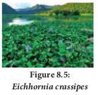
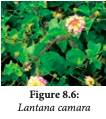
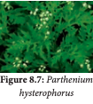
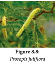

அன்னிய ஆக்கிரமிப்பு அல்லது அறிமுகப்படுத்தப்படும்
சிற்றினங்கள் சூழல்மண்டல செயல்முறைகளைத்
தடுத்தல், உயிரிபன்மத் தன்மையை அச்சுறுத்தல்,
பிறப்பிடச் சிறு செடிகளைக் குறைத்தல�ோடு அதனால்
சூழல்மண்டல சேவைகளையும் (நன்மைகளையும்)
குறைக்கிறது. இந்தச் சிற்றினங்களை அழிக்கப்
பயன்படும்
வேதிப்பொருட்கள்
பசுமை
இல்ல
வாயுக்களை
அதிகரிப்பத�ோடு,
மெதுவாக
நுண்காலநிலை,
மண்ணின்தன்மை
சூழல்மண்டலத்தை மாற்றி அமைக்கிறது. எனவே
பிறப்பிடத் தாவரங்கள் வளர்வதற்கு ஏற்றதல்லாத
நிலை ஏற்படுகிறது. மனிதர்களுக்கு உடல்நலக்கேடு
ப�ோன்ற ஒவ்வாத்தன்மையும், உள்ளூர் சுற்றுச்சூழல்
அழிவு மற்றும் முக்கியமான உள்ளூர் சிற்றினங்கள்
இழப்பையும் ஏற்படுத்துகிறது.

உலகப் பாதுகாப்பு சங்கத்தின்படி அன்னிய
ஆக்கிரமிப்புத் தாவரங்கள் வாழ்விட இழப்பிற்கும்
மற்றும்
உயிரி
பன்மத்திற்கும்
ஏற்படுத்தும்
இரண்டாவது மிக முக்கிய அச்சுறுத்தலாகும்.

ஆக்கிரமிப்புத் தாவரங்கள் என்றால் என்ன?
உள்ளூர் அல்லாத ஒரு சிற்றினம் இயற்கையாகவே
சூழல் த�ொகுப்பில் அல்லது குறிப்பிட்ட நாட்டில் பரவி,
உள்ளூர்
சிற்றினங்களின்
உயிரியல்
மற்றும்
வாழ்நிலையில்
குறுக்கீடு
செய்வது
மற்றும்
சூழ்த்தொகுப்பிற்கு
ஒரு
பெரிய
அச்சுறுத்தலை
ஏற்படுத்தி,
ப�ொருளாதார
இழப்பையும்
ஏற்படுத்துவதாகும். காற்று, வான் அல்லது கடல்
வழியாகத் துறைமுகங்கள் மூலம் பல ஆக்கிரமிப்பு
இனங்கள் தற்செயலாக அறிமுகமாகியவை என
நிலைநிறுத்தப்பட்டது. சில ஆராய்ச்சி நிறுவனங்கள்
காட்டு இயல்வகைகளின் மரபணுவளக்கூறுகளை
(germplasm) இறக்குமதி செய்யும்போதும் இவை
அறிமுகப்படுத்தப்பட்டுள்ளன. வழக்கமாக ஆக்கிரமிப்புத்
தாவரங்களின்
உண்ணத்
தகுந்த
பழங்கள்
பறவைகளின் மூலம் பரப்பப்படுகின்றன.
ஆக்கிரமிப்புத்
தாவரங்கள்
வேகமாக
வளரக்கூடியதாகவும்,
எளிதில்
தகவமைத்துக்
க�ொள்வதாகவும் உள்ளது. இவைகள் இலைமட்குத்
தரத்தை மாற்றுவதன் மூலம் மண்ணின் சமூக
அமைப்பை மாற்றி மண்ணிலுள்ள உயிரினங்கள்,
மண்
விலங்குகள்
மற்றும்
சூழல்மண்டல
செயல்பாடுகளைப் பாதிக்கிறது.
இவை மண்ணில் சிதைத்தலின் மீது எதிர்மறை
விளைவை ஏற்படுத்தி அருகிலுள்ள உள்ளூர்
சிற்றினங்களுக்கு
அழுத்தத்தைக்
க�ொடுக்கிறது.
சுற்றுசூழல் பிரச்சினைகளை ஏற்படுத்தும் சில
ஆக்கிரமிப்புத்
தாவரங்களைப்
பற்றி
கீழே
விவாதிக்கப்பட்டுள்ளது.

**ஐக�ோர்னியா கிராஸிபஸ்**

இது
தென்
அ மெ ரி க்காவை ப்
புகலிடமாகக் க�ொண்ட
ஆ க் கி ர மி ப் பு த்
தாவரமாகும்.
இது
நீர்நிலை அலங்காரத்
த ா வ ர ம ா க
அறிமுகப்படுத்தப்பட்டது.
கிராஸிபஸ்
இவை
ஆண்டு
முழுவதும் வேகமாக வளர்கிறது. இதன் பரந்துவிரிந்த
வளர்ச்சி,
உலகளவிலான
உயிரிபன்மத்தின்
இழப்பிற்குக் காரணமாகிறது. 

இது தாவர மிதவை
உயிரிகளின் வளர்ச்சியைப் பாதிப்பத�ோடு இறுதியாக
நீர் சூழல்மண்டலத்தையே மாற்றிவிடுகிறது.
நீர்நிலைகளில் ஆக்ஸிஜனின் அளவை குறைப்பத�ோடு
ஊட்ட மிகுத்தலுக்கும் வழிவகுக்கிறது. இது மனித
உடல்நலத்திற்கு அச்சுறுத்தலாக உள்ளது. ஏனெனில்
இது ந�ோயை உருவாக்கும் க�ொசுக்களின் (குறிப்பாக
அன�ோபிலிஸ்)
இனப்பெருக்கம்
செய்யும்
உறைவிடமாகவும், தனியாக மிதக்கும் அடர்ந்த
வேர்களும், பாதி மூழ்கிய இலைகளில் நத்தைகளும்
உள்ளன.
இது
ஆழ்நிலைக்குச்
சூரிய
ஒளி
ஊடுருவுவதைத் தடை செய்வத�ோடு நீர் வழிகளுக்கு
இடையூறாகவும்,
விவசாயம்,
மீன்
பிடித்தல்,
ப�ொழுதுப�ோக்கு மற்றும் நீர் மின்சாரம் உற்பத்தியையும்
பாதிக்கிறது

**லேண்டானா கமாரா**

உலக
ஆக்கிரமிப்பு
சிற்றினங்களின் தரவுத்தள
அமைப்பு மூலம் மிகவும்
ம�ோசமான ஆக்கிரமிப்புச்
சிற்றினமாக
இது
அ டை ய ா ள ம்
காணப்பட்டுள்ளது.
இது
படம் 8.6:
வட அமெரிக்காவிலிருந்து
லேண்டானா கமாரா
அழகுத்
தாவரமாக
அறிமுகப்படுத்தப்பட்ட ஒரு ஆக்கிரமிப்பு சிற்றினாகும்.

பரவலாகத்
தகவமைவுடைய
பல்வேறு
இது
வாழிடத்தை ஆக்கிரமிக்கிறது.
இது பறவைகள் மூலம் பரவுகிறது. வேர்சுரப்பு
உயிர்வேதி
விளைவை
(allelepathic)
இவை
ஏற்படுத்துவதால் சுற்றிக் காணப்படும் தாவர விதை
முளைத்தல்
மற்றும்
வேர்
நீட்சியடைதலின்
வளர்ச்சியைத் தடுக்கிறது. வேர்களை நீக்குதல் மற்றும்
உயிரிவழிக் கட்டுப்படுத்துதல் ஆகியன இதனைக்
கட்டுப்படுத்தும் சிறந்த முறைகளாகும். தற்போது
மலைவாழ் மக்களுக்கு இவற்றின் தண்டுகளை
உபய�ோகித்து
வீட்டு உபய�ோகப் ப�ொருட்களான
கூடைகள், மரச்சாமான்கள் (கட்டில் உட்பட) தயாரிக்கப்
பயிற்சி அளிக்கப்படுகிறது.

**பார்த்தீனியம் ஹிஸ்டிர�ோஃப�ோரஸ்**

தென்
அமெரிக்காவை
இருப்பிடமாகக் க�ொண்ட
ப ா ர் த் தீ னி ய ம்
ஹி ஸ் டி ர�ோ ஃ ப�ோர ஸ்
இறக்குமதி செய்யப்பட்ட
உ
ண
வு
த்
த ா னி ய ங ்க ளு ட ன்
எதிர்பாராத
விதமாகக்
படம் 8.7: பார்த்தீனியம்
கலந்து
உலகின்
ஹிஸ்டிர�ோஃப�ோரஸ்
பல்வேறு
பகுதிகளில்
அறிமுகப்படுத்தப்பட்டது. இது காடுகளில் காணப்படும்
தீங்கு விளைவிக்கக்கூடிய களைச் செடியாகும். இவை
பிறப்பிடச்
சிற்றினங்களின்
வளர்ச்சியைக்
குறைப்பத�ோடு
விலங்குகளுக்குக்
கிடைக்கும்
தீவனங்களையும் குறைக்கிறது. மேய்ச்சல் மற்றும்
விளைநிலங்ளிலும் ப�ொதுவாக அதன் விளைச்சலைக்
குறைக்கிறது. இத்தாவரங்களால் வேரில் உற்பத்தி
செய்யப்படும் உயிர்வேதிப் ப�ொருட்கள் பயிர் மற்றும்
பிறப்பிடத் தாவரங்களின் வளர்ச்சியை ஒடுக்குகிறது.
இதன் மகரந்தத்துகள்கள் மனிதர்களில் நாசியழற்சி,
ஆஸ்துமா, த�ோலழற்சி ப�ோன்றவற்றை ஏற்படுத்துகிறது.

**புர�ோசாபிஸ் ஜுலிஃப்ளோரா**
புர�ோசாபிஸ் ஜுலிஃப்ளோரா மெக்ஸிக�ோ மற்றும் தென்
அமெரிக்காவிலிருந்து வந்த ஆக்கிரமிப்புத் தாவரமாகும்.
இது குஜராத்தில் முதன்முதலாகப் பாலைவனப்
பரவலைத் தடுக்க அறிமுகப்படுத்தப்பட்டது. பிறகு
ஆந்திரப்பிரதேசம் மற்றும் தமிழ்நாட்டில் எரிப�ொருளாக
அறிமுகப்படுத்தப்பட்டது.

இது ஒரு வலிமைமிகு ஆக்கிரமிப்பு குடியேறியாகும்.
இதன் விளைவாக வாழ்விடங்கள் இச்சிற்றினங்களால்
விரைவாக ஆக்கிரமிக்கப்படுகிறது. இதன் ஆக்கிரமிப்பு
வளரிடவாழ் மருத்துவ மூலிகைச் சிற்றினங்களின்
வளர்பரப்பைக் குறைக்கிறது. இது காற்றுவழி மண்
அரிமாணத்தைத் தடுக்கவும், பாலைவன மற்றும்
கடற்கரைய�ோரங்களில்
காணப்படும்
மணற்
குன்றுகள் நிலைபெறவும் உதவுகிறது. இவை
மண்ணில் காணப்படும் தீங்கு விளைவிக்கக்கூடிய
அபாயகரமான வேதிப்பொருட்களை உறிஞ்சுவத�ோடு
மரக்கரி உருவாக்கத்திற்கு முக்கிய மூல ஆதாரமாகவும்
விளங்குகிறது.

