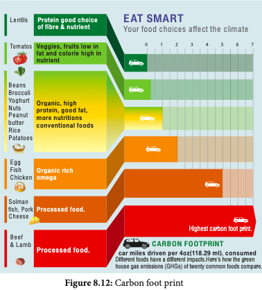

 Carbon capture and storage is a technology of capturing carbondioxide and injects it deep into the underground rocks to a depth of 1 km or more and it is an approach to mitigate global warming by capturing CO2 from large point sources such as industries and power plants and subsequently storing it instead of releasing it into the atmosphere. Various safe sites have been selected for permanent storage in various deep geological formations, liquid storage in the Ocean and solid storage by reduction of CO2 with metal oxide to produce stable carbonates. It is also known as Geological sequestration which involves injecting CO2 directly into the underground geological formations (such as declining oil fields, gas fields saline aquifers and unmineable coal have been suggested as storage sites).

**Carbon Sequestration** Carbon sequestration is the process of capturing and storing CO2 which reduces the amount of CO2 in the atmosphere with a goal of reducing global climate change. Carbon sequestration occurs naturally by plants and in ocean. Terrestrial sequestration is typically accomplished through forest and soil conservation practices that enhance the storage carbon. As an example microalgae such as species of _Chlorella_, _Scenedesmus_, _Chroococcus_ and _Chlamydomonas_ are used globally for CO2 sequestration. Trees like _Eugenia caryophyllata_, _Tecoma stans_, _Cinnamomum verum_ have high capacity and noted to sequester carbon. Macroalgae and marine grasses and mangroves are also have ability to mitigate carbon-di-oxide.

**Carbon Sink** Any system having the capacity to accumulate more atmospheric carbon during a given time interval than releasing CO2. Example: forest, soil, ocean are natural sinks. Landfills are artificial sinks.

**Carbon Sequestration**

Carbon sequestration is the process of capturing and storing CO2 which reduces the amount of CO2 in the atmosphere with a goal of reducing global climate change.

Carbon sequestration occurs naturally by plants
and in ocean. Terrestrial sequestration is typically
accomplished through forest and soil conservation
practices that enhance the storage carbon.

As an example microalgae such as species
of Chlorella, Scenedesmus, Chroococcus and
Chlamydomonas are used globally for CO2
sequestration. Trees like Eugenia caryophyllata,
Tecoma stans, Cinnamomum verum have
high capacity and noted to sequester carbon.
Macroalgae and marine grasses and mangroves
are also have ability to mitigate carbon-di-oxide.

**Carbon Foot Print (CFP)** Every human activity leaves a mark just like our footprint. This Carbon foot print is the

total amount of green house gases produced by human activities such as agriculture, industries, deforestation, waste disposal, buring fossil fuels directly or indirectly. It can be measured for an individual, family, organisation like industries, state level or national level. It is usually estimated and expressed in equivalent tons of CO2 per year. The burning of fossil fuels releases CO2and other green house gases. In turn these emissions trap solar energy and thus increase the global temperature resulting in ice melting, submerging of low lying areas and inbalance in nature like cyclones, tsunamis and extreme weather conditions. To reduce the carbon foot print we can follow some practices like (i) Eating indigenous fruits and products (ii) Reducing use of electronic devices (iii) Reduce travelling (iv) Avoid buying fast and preserved, processed, packed foods. (v) Plant a garden (vi) Reducing consumption of meat and sea food. Poultry requires little space, nutrients and less pollution compared cattle farming. (vii) reducing use of Laptops (when used for 8 hours, it releases nearly 2 kg. of CO2 annually) (viii) Line drying clothes. (Example: If you buy imported fruit like kiwi, indirectly it increases CFP. How? The fruit has travelled a long distance in shipping or airliner thus emitting tons of CO2)

**Biochar**

**Biochar** is another long term method to store carbon. To increase plants ability to store more carbon, plants are partly burnt such as crop waste, waste woods to become carbon rich slow decomposing substances of material called Biochar. It is a kind of charcoal used as a soil amendment. Biochar is a stable solid, rich in carbon and can endure in soil for thousands of years. Like most charcoal, biochar is made from biomass via pyrolysis. (Heating biomas in low oxygen environment) which arrests wood from complete burning. Biochar thus has the potential to help mitigate climate change via carbon sequestration. Independently, biochar when added to soil can increase soil fertility of acidic soils, increase agricultural productivity, and provide protection against some foliar and soil borne diseases. It is a good method of preventing waste woods and logs from getting decayed and instead we can convert them into biochar thus converting them to carbon storage material.
