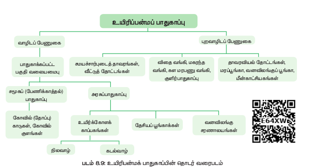
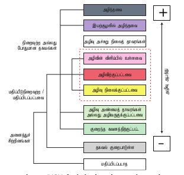

 நிலப்பரப்பு, புவியியல் மற்றும் காலநிலை வடிவங்கள்,
முறைகள் ஆகியவற்றால் இந்தியா பல்வேறுபட்ட
உயிரி வகைகளைக் க�ொண்டுள்ளன. இம்மாபெரும்
பன்முகத்தன்மை பல சுற்றுச்சூழல் பிரச்சினைகள்
காரணமாக
தற்போது
அச்சுறுத்தலுக்கு
உள்ளாகியுள்ளது. இதற்குப் பாதுகாப்பு என்ற ஒரு
முக்கிய கருவியை நமது ச�ொந்த மண்ணிலிருந்து பல
இனங்கள்
இழத்தலைக்
குறைப்பதற்குப்
பயன்படுத்தலாம். இனச்செல் வளக்கூறு பாதுகாப்பு,
வாழிடப் பேணுகை(in situ) , புற வாழிடப் பேணுகை
(ex situ), ஆய்வுக்கூட வளர்ப்பு முறைமாதிரிகள் (in
மேலாண்மை
உத்திகளைப்
vitro),
ஆகிய
பயன்படுத்துவதன் மூலம் இடவரை (endemic) மற்றும்
அச்சுறுத்தப்படும் சிற்றினங்கள் பாதுகாக்கப்படுகின்றன.

**வாழிடப் பேணுகை பாதுகாப்பு (insitu conservation)**
இவை இயற்கை வாழிடங்களில் காணப்படும் மரபியல்
ஆதாரங்களின் மேலாண்மை மற்றும் பாதுகாப்பு
என்பதாகும்.
இங்குத்
தாவரங்கள்
அல்லது
விலங்கினங்கள் தற்போதுள்ள வாழ்விடங்களிலேயே
பாதுகாக்கப்படுகின்றன. இப்பாதுகாப்பு முறை மூலம்
அச்சுறுத்தலுக்குட்பட்ட வன மரங்கள், மருத்துவ மற்றும்
நறுமணத்தாவரங்கள்
பாதுகாக்கப்படுகின்றன.
சமுதாயம் அல்லது மாநிலப் பாதுகாப்பு மூலம்
வனவிலங்கு, தேசியப் பூங்கா மற்றும் உயிர்கோள
காப்பகங்கள்
உள்ளடக்கியவை
செயல்படுத்தப்படுகின்றன.
சுற்றுச்சூழல்
ரிதீயாக
தனித்துவம் பெற்ற மற்றும் பல்வகைமை நிறைந்த
பகுதிகள்
சட்டப்பூர்வமாக
வன
விலங்கு
சரணாலயங்கள், தேசியப் பூங்காக்கள் மற்றும்
உயிர்கோளம்,
உயிரியல்
காப்பகங்களாகப்
பாதுகாக்கப்படுகின்றன. மேகமலை , சத்தியமங்கலம்
வன உயிரி காப்பகம், கிண்டி மற்றும் பெரியார்
தேசியப்பூங்கா , மேற்கு த�ொடர்ச்சி மலை , நீலகிரி,
அகஸ்திய மலை மற்றும் மன்னார் வளைகுடா
ஆகியவை தமிழ்நாட்டின் உயிர்கோள காப்பகங்கள்
ஆகும்.

**க�ோயில் காடுகள் (sacred groves)**
இவை சமூகங்களால் பாதுகாக்கப்பட்டு வளர்க்கப்பட்ட
மரங்களின்
த�ொகுப்புகளாகவ�ோ
அல்லது
த�ோட்டங்களாகவ�ோ சமூகத்தின் பாதுகாப்பிற்காக
சமயச்
சித்தாந்தங்களைக்
ஒருகுறிப்பிட்ட
க�ொண்டிருக்கும் வலுவான மத நம்பிக்கை க�ொண்ட
அமைப்புகளை
அடிப்படையாகக்
க�ொண்டவை.
பெரும்பாலும்
ஒவ்வொரு
கிராமத்துக்
க�ோயில்காடுகளும் ஐயனார் அல்லது அம்மன் ப�ோன்ற
கிராம ஆண், பெண் தெய்வங்களின் உறைவிடமாகவே
இவை கருதப்படுகின்றன. தமிழ்நாடு முழுவதும் 448
க�ோயில் காடுகள் ஆவணப்படுத்தப்பட்டுள்ளன. இதில்
ஆறு க�ோயில் காடுகள் விரிவான தாவர மற்றும்
விலங்கின வகை (floristic and faunistic) ஆய்வுகளுக்கு

எடுத்துக்கொள்ளப்பட்டுள்ளன.
(பனங்குடிச�ோலை,
திருகுறுங்குடி
மற்றும்
உதயங்குடிகாடு,
சித்தன்னவாசல், புத்துப்பட்டு மற்றும் தேவதானம்).
இவை நீர்பாசனம், தீவனம், மருத்துவத் தாவரங்கள்
மற்றும் நுண்காலநிலை கட்டுப்பாடு ஆகியவற்றைப்
பாதுகாப்பதன் மூலம் ஏராளமான சுற்றுச்சூழல்
அமைப்புச்சேவைகளை அண்டை பகுதிகளுக்கு
வழங்குகின்றன.

**புற வாழிடப் பேணுகை (Ex-situ conservation)**

இப்பாதுகாப்பு
முறையில்
சிற்றினங்கள்
இயற்கைச்சூழலுக்கு
வெளியே
பாதுக்காக்கப்படுகின்றன.இவை
தாவரவியல்
த�ோட்டங்கள்,
விலங்கியல்
பூங்காக்களைத்
த�ோற்றுவித்தல், பாதுகாப்பு உத்திகளான மரபணு,
மகரந்தம், விதை, அகவளர் முறை பாதுகாப்பு, உறை
குளிர் பாதுகாப்பு , நாற்றுகள், திசு வளர்ப்பு மற்றும் DNA
வங்கிகள் மூலம் பாதுகாக்கப்படுகின்றன. இந்த
வசதிகள் அச்சுருத்தலுக்குண்டான சிற்றினங்களுக்கு
உறைவிடம் மற்றும் பராமரிப்பு வழங்குவத�ோடு
மட்டுமல்லாமல் சமுதாயத்திற்கான கல்வி மற்றும்
ப�ொழுதுப�ோக்கு அம்சங்களையும் பெற்றுத் தருகின்றன.

8.7.1 இயற்கை பாதுகாப்பிற்கான பன்னாட்டு
ஒன்றியம் (International Union for Conservation
of Nature - IUCN)
இயற்கை பாதுகாப்பிற்கான பன்னாட்டு ஒன்றியம்
(IUCN) 1948 அம் ஆண்டு த�ோற்றுவிக்கப்பட்ட உலகின்
பழமையான சுற்றுச்சூழல் அமைப்பாகும். இதன்
தலைமையகம் சுவிட்ஸர்லாந்து நாட்டிலுள்ள க்லாந்து
எனும் இடத்திலுள்ளது. இது அரசு, அரசு சாரா
நிறுவனங்கள், விஞ்ஞானிகள், வணிகம் மற்றும்
உள்ளாட்சி சமுதாயங்களுக்கும் ஒரு நடுநிலைஅமைப்பாக விளங்குகிறது. சுற்றுச்சூழல் பாதுகாப்பு
மற்றும் நிலையான வளர்ச்சியுடன் த�ொடர்புடைய
க�ொள்கைகளை நடைமுறைப்படுத்தும் ந�ோக்கத்துடன்
இது உருவாக்கப்பட்டுள்ளது.
IUCN சிவப்பு பட்டியல் (செம்பட்டியல்)
இப் பட்டியலின் பிரிவுகள், தாவர மற்றும் விலங்கின
வளங்களுக்கு ஏற்படும் அச்சுறுத்தல்களின் விகிதம்
மற்றும் பாதுகாப்பு முன்னுரிமைகள் ஆகியவற்றை
மதிப்பீடு செய்ய நமக்கு உதவுகிறது.

இது உலகலாவிய அனைத்துத் தாவர மற்றும்
விலங்கினச் சிற்றினங்களின் அச்சுறுத்தலுக்கு உள்ள
பாதுகாப்பினை
வழங்க
அரசினை
இணங்க
வைப்பதற்கு உதவும் ஒரு சக்திவாய்ந்த கருவியாகும் .

IUCN பாதுகாக்கப்பட்ட பகுதிகளை உருவாக்கி மற்றும்
அச்சுறுத்தலுக்கு
உள்ளான
சிற்றினங்களைப்
பாதுகாக்க
உயிரினங்களுக்குத்
தகுந்த
அடிப்படைகளை
உருவாக்க
அ - உயிரினத்தொகை குறைப்பு
ஆ - புவியியல் வரம்பு
இ - சிறிய உயிரினத்தொகை அளவு மற்றும் சரிவு
ஈ -	மிகவும்
சிறிய
உயிரினத்தொகை
அல்லது
குறுக்கப்பட்ட
உ - அளவு பகுப்பாய்வு

IUCN சிவப்புப் பட்டியல் வகைப்பாடுகள்
கடைசி தனி உயிரியின் இறப்பிற்கு எந்த நியாயமான
சந்தேகமும் இல்லாத ப�ோது அந்த வகைப்பாட்டின்
அலகு (taxon) அழிந்துவிட்டது எனக் கருதப்படும். மிக
விரிவான கள ஆய்வுகள், முன்பே பதிவு செய்யப்பட்ட
இடங்களிலும், அத்தகைய பிற வாழிடங்களிலும்
ப�ொருத்தமான காலங்களில் (நாள், பருவம், மற்றும்
ஆண்டு முழுவதும்) பரவல் எல்லைகள் முழுவதும் ஒரு
தனிச் சிற்றினத்தைப் பதிவு செய்யத் தவறினால் அந்த
உயிரினம் முற்றிலும் அழிந்ததாகக் கருதப்படும்.
எடுத்துக்காட்டு: நியூரகாந்தஸ் நீசியானஸ்.
ஒரு வகைப்பாட்டு அலகு இயற்கை சூழலில்
ப�ோதிலும்
கடந்தகாலப்
பரவல்
அழிந்துவிட்ட
வரம்புகளுக்கு வெளியே வளர்ப்பு சூழலில�ோ அல்லது
இயல்சூழல் மயப்பட்ட உயிரித் த�ொகையாகவ�ோ,
அதனுடைய பழைய பரவல் வரம்பிற்கு மிக வெளியே
(உயிரித்தொகை) மட்டும் உயிர் வாழக்கூடியவை.
எடுத்துக்காட்டு: ஜின்கோ பைல�ோபா.
அழி விளிம்பில் உள்ளவை (Critically Endangered – CR)
ஒரு வகைப்பாட்டு அலகு கிடைக்கின்ற சிறந்த
சான்றுகளின் அடிப்படையில் அ முதல் உ வரையிலான
காரணிக்கான
காரணிகளில்
அழிவிளிம்பு
அம்சங்களைப்
பெறுமாயின்
அழிவிளிம்பில்
உள்ளதாகக் கருதப்படும். இந்தப் பட்டியலில் உள்ள
தாவரங்கள்
மாபெரும்
அழிவு
விளைவை
ந�ோக்கியதாகக்
கருதப்படும்
(இயல்
சூழலில்).
எடுத்துக்காட்டு: யூஃப�ோர்பியா சாந்தப்பாயி, பைப்பர்
பார்பெரி, சைஜீஜியம் கேம்பிலியானம்.
அழிநிலைத் தாவரங்கள் (Endangered – EN)
ஒரு வகைப்பாட்டு அலகு கிடைக்கின்ற சான்றுகளின்
அடிப்படையில் அ முதல் உ வரையிலான காரணிகளில்
ஏதேனும் ஒன்றின் அழிநிலைக்கான அம்சங்களுக்குப்
ப�ொருந்துமாயின் அது அழிநிலை தாவரமாகக்
கருதப்படுகிறது. அவை இயற்கைச்சூழலில் அழியும்
கடுமையான அழிவுகளை எதிர் ந�ோக்கியதாகவே
கருதப்படுகின்றன. எடுத்துக்காட்டு: இலிய�ோகார்பஸ்வெனுஸ்டஸ்,
ப�ோக�ோஸ்டெமான்
யூஜீனியா சிங்கம்பட்டியானா.
நீல்கிரிகஸ்,
அழிந்தவை (Extinct - EX)பாதுகாப்பு இயக்கம்
ஒரு சமூக நிலையிலான பங்களிப்பு நமது
சுற்றுச்சூழலின் பேணுகை மற்றும் பாதுகாப்பிற்கு
உதவுகிறது.
பூமியிலுள்ள
அனைத்து
உயிரினங்களுக்கும் நம்முடைய சுற்றுச்சூழல் ஒரு
ப�ொதுவான ப�ொக்கிஷமாகும். ஒவ்வொரு தனி
நபரும் இதுபற்றி எச்சரிக்கையாக இருக்க வேண்டும்
மற்றும் உள்ளூர் சூழலைப் பாதுகாப்பிற்காக
வடிவமைக்கப்பட்ட
திட்டங்களில்
தீவிரமாகப்
பங்கேற்க
வேண்டும்.
சுற்றுச்சூழலைப்
பாதுகாப்பதற்காகப் பல மக்கள்
சிப்கோ இயக்கம்
1972-ஆம் ஆண்டு இமயமலை பகுதியிலுள்ள
பழங்குடி பெண்கள் காடுகள் சுரண்டப்படுவதற்கு
எதிர்ப்பு தெரிவித்தனர். 1974-ஆம் ஆண்டு சாம�ோலி
மாவட்டத்திலுள்ள மண்டல் கிராமத்தில் சுந்தர்லால்
பகுகுனா என்பவரால் இது சிப்கோ இயக்கம் என
மாற்றப்பட்டது. ஒரு விளையாட்டுப் ப�ொருள் தயாரிப்பு
நிறுவனம் மரங்களை வெட்டுவதற்கு எதிராக
மரங்களை ஒன்றாகக் கட்டித்தழுவி மக்கள்
எதிர்ப்பைத் தெரிவிதிப்கோ இயக்கத்தின்
முக்கிய அம்சங்கள்.
அ - உயிரினத்தொகை குறைப்பு
ஆ - புவியியல் வரம்பு
இ - சிறிய உயிரினத்தொகை அளவு மற்றும் சரிவு
ஈ -	மிகவும்
சிறிய
உயிரினத்தொகை
அல்லது
குறுக்கப்பட்ட
உ - அளவு பகுப்பாய்வு
IUCN சிவப்புப் பட்டியல் வகைப்பாடுகள்
கடைசி தனி உயிரியின் இறப்பிற்கு எந்த நியாயமான
சந்தேகமும் இல்லாத ப�ோது அந்த வகைப்பாட்டின்
அலகு (taxon) அழிந்துவிட்டது எனக் கருதப்படும். மிக
விரிவான கள ஆய்வுகள், முன்பே பதிவு செய்யப்பட்ட
இடங்களிலும், அத்தகைய பிற வாழிடங்களிலும்
ப�ொருத்தமான காலங்களில் (நாள், பருவம், மற்றும்
ஆண்டு முழுவதும்) பரவல் எல்லைகள் முழுவதும் ஒரு
தனிச் சிற்றினத்தைப் பதிவு செய்யத் தவறினால் அந்த
உயிரினம் முற்றிலும் அழிந்ததாகக் கருதப்படும்.
எடுத்துக்காட்டு: நியூரகாந்தஸ் நீசியானஸ்.
ஒரு வகைப்பாட்டு அலகு இயற்கை சூழலில்
ப�ோதிலும்
கடந்தகாலப்
பரவல்
அழிந்துவிட்ட
வரம்புகளுக்கு வெளியே வளர்ப்பு சூழலில�ோ அல்லது
இயல்சூழல் மயப்பட்ட உயிரித் த�ொகையாகவ�ோ,
அதனுடைய பழைய பரவல் வரம்பிற்கு மிக வெளியே
(உயிரித்தொகை) மட்டும் உயிர் வாழக்கூடியவை.
எடுத்துக்காட்டு: ஜின்கோ பைல�ோபா.
அழி விளிம்பில் உள்ளவை (Critically Endangered – CR)
ஒரு வகைப்பாட்டு அலகு கிடைக்கின்ற சிறந்த
சான்றுகளின் அடிப்படையில் அ முதல் உ வரையிலான
காரணிக்கான
காரணிகளில்
அழிவிளிம்பு
அம்சங்களைப்
பெறுமாயின்
அழிவிளிம்பில்
உள்ளதாகக் கருதப்படும். இந்தப் பட்டியலில் உள்ள
தாவரங்கள்
மாபெரும்
அழிவு
விளைவை
ந�ோக்கியதாகக்
கருதப்படும்
(இயல்
சூழலில்).
எடுத்துக்காட்டு: யூஃப�ோர்பியா சாந்தப்பாயி, பைப்பர்
பார்பெரி, சைஜீஜியம் கேம்பிலியானம்.
அழிநிலைத் தாவரங்கள் (Endangered – EN)
ஒரு வகைப்பாட்டு அலகு கிடைக்கின்ற சான்றுகளின்
அடிப்படையில் அ முதல் உ வரையிலான காரணிகளில்
ஏதேனும் ஒன்றின் அழிநிலைக்கான அம்சங்களுக்குப்
ப�ொருந்துமாயின் அது அழிநிலை தாவரமாகக்
கருதப்படுகிறது. அவை இயற்கைச்சூழலில் அழியும்
கடுமையான அழிவுகளை எதிர் ந�ோக்கியதாகவே
கருதப்படுகின்றன. எடுத்துக்காட்டு: இலிய�ோகார்பஸ்
202
•
•
•
இ
 ந்த இயக்கம் அரசியல் சார்பற்றது.
இ
 து காந்தியச் சிந்தனைகள் அடிப்படையிலான
தன்னார்வ இயக்கமாகும்.
சி
 ப்கோ இயக்கத்தின் பிரதான ந�ோக்கங்களான
உணவு, தீவனம், எரிப�ொருள், நார் மற்றும்
உரம் ஆகிய ஐந்து முழக்கங்கள் (Five F’s Food,
Fodder, Fuel, Fibre and Fertilizer) மூலம் தங்கள்
அடிப்படை தேவைகளுக்கான தன்னிறைவை
ஏற்படுத்துவதாகும்.
அப்பிக்கோ இயக்கம்
இமயமலையிலுள்ள உத்தரகாண்டில் புகழ்பெற்ற
சிப்கோ இயக்கத்தால் ஈர்க்கப்பட்டு உத்தரக்
கர்நாடகாவின்
கிராமவாசிகள்
தங்களுடைய
காடுகளைக் காப்பாற்றுவதற்காக இதே ப�ோன்ற
இயக்கத்தினைத் த�ொடங்கினார்கள். இந்த இயக்கம்
கர்நாடகாவில் சிர்சிக்கு அருகிலுள்ள குப்பிகட்டே
என்ற ஒரு சிறிய கிராமத்தில் பாண்டுரங்க
ஹெக்டேவினால் த�ொடங்கப்பட்டது. இந்த இயக்கம்
மரங்களை வெட்டுதல், ஒற்றைச் சிற்றன வளர்ப்பு
வனக்கொள்கை, காடு அழிப்பு ஆகியவற்றிற்கு
எதிராக ஆர்ப்பாட்டம் நடத்தத் த�ொடங்கியது.
பாதிப்பிற்கு உட்பட்டவை (Vulnerable - VU)
ஒரு வகைப்பாட்டு அலகு ஏதேனும் கிடைக்கின்ற
சிறந்த சான்றுகளின் அடிப்படையில் அ முதல் உவரையிலான
காரணிகளில்
ஏதேனும்
ஒரு
பாதிப்பிற்கான அம்சங்களுக்குப் ப�ொருந்துமாயின் அது
பாதிப்பிற்குட்பட்ட தாவரமாகக் கருதப்படும். எனவே
இயற்கை சூழலில் அழிவின் பாதிப்பிற்கு உட்பட்டதாகக்
கருதப்படும்.
எடுத்துக்காட்டு:
டால்பெர்ஜியா
லாட்டிஃப�ோலியா,
சாண்டலம்
ஆல்பம்,
குள�ோர�ோஸைலான் சுவிட்டினாயா.
அழிவு அன்மைத்தாவரங்கள் (Near Threatened - NT)
ஒரு வகைப்பாட்டு அலகு கிடைக்கின்ற சிறந்த
சான்றுகளின் அடிப்படையில் அ முதல் உ வரையிலான
காரணிகளில் ஏதேனும் ஒன்றின் அம்சங்களுக்கு
அழிவு அன்மை அலகின் தன்மைக்குப் ப�ொருந்துமாயின்
அது அழிவு அன்மை தாவரமாகக் கருதப்படும்.
இத்தகைய தாவரங்கள் எதிர்காலத்தில் அழிவு
அச்சுறுத்தலுக்கு உட்படும் தாவரங்களாகும்.
குறைந்த
கவனத்திற்கு
உட்பட்டவை
(Least
concerned - LC)
ஒரு வகைப்பாட்டின் அலகு மேற்கண்ட அலகுகளுக்கு
அப்பாற்பட்டவையாய் இருப்பின், அது குறைந்த
கவனத்திற்கு உட்பட்டவை எனக் கருதப்படுகிறது.
தகவல் குறைபாடு உள்ளவை (Date Deficient - DD)
ஒரு வகைப்பாட்டின் அலகின் அழிநிலைகளைப் பற்றி
அதனுடைய பரவல் மற்றும்
உ யி ரி த ் த ொகை யி ன்
அடிப்படையில் நேரடியாகவ�ோ
அல்லது
மறைமுகமாகவ�ோ
மதிப்பிடுவதற்குப்
ப�ோதுமான
இல்லாத
தரவுகள்
தாவரங்களுக்குத்
தகவல்
குறைபாடு
உள்ளதாகக்
கருதப்படுகிறது.
மதிப்பிடப்படாதது (Not Evaluated - NE)
மேற்கண்ட காரணிகளின் அடிப்படையில் உரிய
மதிப்பிடப்படாத வகைப்பாட்டின் அலகு மதிப்பீடு
செய்யப்படாதவை எனக் கருதப்படுகிறது

8.7.2 இடவரைமையங்கள் மற்றும் இடவரை
தாவரங்கள் (Endemic centres and endemic
plants )
ஒரு குறிப்பிட்ட புவியியல் பகுதியில்மட்டும் காணப்படும்
தாவரங்கள்
மற்றும்
விலங்குகள்
இடவரை
சிற்றனங்கள் எனப்படுகின்றன. புவியின் பெரிய
அல்லது சிறிய பகுதிகளில் இடவரை சிற்றினங்கள்
காணப்படலாம். சில இடவரைத் தாவரங்கள் ஒரு
குறிப்பிட்ட கண்டத்திலும் அல்லது ஒரு கண்டத்தின்
ஒரு பகுதியிலும் மற்றவை ஒரு தனித் தீவிலும்
காணப்படலாம்.
ஒரு குறிப்பிட்ட புவி பரப்பின் வரம்பிற்குட்பட்ட எந்த
ஒரு சிற்றினமும் இடவரை சிற்றினம் எனக்
குறிப்பிடப்படுகின்றன. இதற்குத் தனிமைப்படுதல்,சிற்றினங்களுக்கு இடையேயான இடைச்செயல்கள்,
விதை பரவுதலில் சிக்கல்கள்,ஒரு குறிப்பிட்டஇடம் தள
விசேடத்துவம், மற்றும் பல சுற்றுச்சூழல் மற்றும்
சூழ்நிலையியல் பிரச்சினைகள் ப�ோன்ற பல்வேறு
காரணங்களாக இருக்கலாம். மூன்று பெரிய இடவரை
மையங்கள் மற்றும் 27 நுண்ணியஇடவரை
மையங்கள்
இந்தியாவில்
காணப்படுகின்றன.
இந்தியாவில் சுமார் மூன்றில் ஒரு பங்கு இடவரைத்
தாவர இனங்களாக அடையாளம் காணப்பட்டுள்ளன
மற்றும் இந்தியாவின் மூன்று முக்கிய தாவரவியல்
மண்டலங்களில், அதாவது இந்திய இமயமலை,
தீபகற்ப இந்தியா மற்றும் அந்தமான் நிக்கோபார்
தீவுகளில் பரவிக் காணப்படுகின்றன. குறிப்பாக
மேற்குத் த�ொடர்ச்சி மலைப் பகுதியில் அதிகமான
செறிவில் இடவரை தாவரங்கள் காணப்படுகின்றன.
ஹார்ட்விக்கியா பைனேட்டா மற்றும் பென்டிக்கியா
க�ொண்டப்பனா ஆகியன இடவரைத் தாவரங்களுக்குச்
சிறந்த
எடுத்துக்காட்டுகளாகும்.
ஃப�ோயேஸி,
ஏப்பியேஸி , ஆஸ்ட்ரேஸி மற்றும் ஆர்க்கிடேஸி
குடும்பத்தைச் சார்ந்த சிறு செடிகளே அதிகச்
சதவீதத்தில் காணப்படும் இடவரை தாவரங்களாகும்.

இடவரைத் தாவரங்கள் வளரியல்பு இடவரைமையம்
பக்காரியா
குற்றாலன்சிஸ்
மரம்
மேற்குத்தொடர்ச்சி
மலையின் தெற்கு
பகுதி
அகஸ்தியமலைய்யா மரம்
பாசிஃப்ளோரா
தீபகற்ப இந்தியா
ஹார்ட்விக்கியா
பைனேட்டாமரம்
தீபகற்பம் மற்றும் வட
இந்தியா பகுதி
பென்டிக்கியா
க�ொண்டப்பனாமரம்
நெப்பந்தஸ்
காசியானாவன்கொடி காசி மலைகள் மற்றும்
மேகாலயா

குறுகிய குறிப்பிட்ட வசிப்பிடம், குறைவான விதை
உற்பத்தி, குறைந்த பரவல் விகிதம், குறைந்த வாழும்
தன்மையுடையவை மற்றும் மனிதக் குறுக்கீடுகள்
ஆகியன
பெரும்பாலும்
இடவரைத்
தாவரச்
சிற்றினங்களின் அச்சுறுத்தலுக்கு முக்கிய காரணங்கள்
ஆகும் . இவற்றின் பாதுகாப்பிற்குத் தீவிர முயற்சிகளை
மேற்கொள்ளப்படாவிடின்
உலகளவில்
இச்சிற்றினங்கள் அழிவது உறுதியாகும்.

