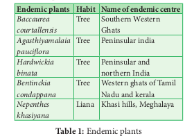

 

**IUCN Red List categories Extint (EX)** A taxon is Extinct when there is no reasonable doubt on the death of the last individual. A taxon is presumed Extinct when exhaustive surveys in known and/or expected habitat, at appropriate times (diurnal, seasonal, annual), throughout its historic range have failed to record an individual. Example: _Neuracanthus neesianus_.

**Extinct in the wild (EW)** A taxon is Extinct in the Wild when it is known only to survive in cultivation, in captivity or as a naturalised population (or populations) well outside the past range. Example: _Ginkgo biloba_

**Critically endangered (CR)** A taxon is Critically Endangered when the best available evidence indicates that it meets any of the criteria A to E for Critically Endangered, and it is therefore considered to be facing an extremely high risk of extinctions in the wild. Example: _Euphorbia santapaui, Piper barberi, Syzygium gambelianum._

**Endangered (EN)**

A taxon is Endangered when the best available evidence indicates that it meets any of the criteria A to E for Endangered, and it is therefore considered to be facing a very high risk of extinction in the wild. Example: Elaeocarpus venustus, Pogostemon nilagricus, Eugenia singampattiana.

**Vulnerable (VU)**

A taxon is Vulnerable when the best available evidence indicates that it meets any other criteria A to E for Vulnerable, and it is therefore considered to be facing a high risk of extinction in the wild. Example: Dalbergia latifolia, Santalum album, Chloroxylon sweitenia

**Near threatened (NT)**

A taxon is Near Threatened when it has been
evaluated against the criteria but does not
qualify for Critically Endangered, Endangered
or Vulnerable now, but is close to qualifying for
or is likely to qualify for threatened category in
the near future.

**Least concerned (LC)**

A taxon is Least Concerned when it has been
evaluated against the criteria and does not
qualify for Critically Endangered, Endangered,
Vulnerable or Near Threatened, Widespread
and abundant taxa are included in this category.

**Data deficient (DD)**

A taxon is Data Deficient when there is inadequate
information to make a direct, or indirect,
assessment of the risk of extinction based on its
distribution and/or population status.

**Not evaluated (NE)**
A taxon is Not Evaluated when it has not yet
been evaluated against the criteria

### Endemic Centres and Endemic Plants
 Endemic species are plants and animals that exist only in one geographic region. Species can be endemic to large or small areas of the earth. Some are endemic to a particular continent, some to a part of a continent and others to a single island.

Any species found restricted to a specified geographical area is referred to as ENDEMIC.. It may be due to various reasons such as isolation, interspecific interactions, seeds dispersal problems, site specificity and many other environmental and ecological problems. There are 3 Megacentres of endemism and 27 microendemic centres in India. Approximately one third of Indian flora have been identified as endemic and found restricted and distributed in three major phytogeographical regions of india, that is Indian Himalayas, Peninsular India and Andaman nicobar islands. Peninsular India, especially Western Ghats has high concentration of endemic plants. _Hardwickia_ _binata_ and _Bentinckia condapanna_ are good examples for endemic plants. A large percentage of Endemic species are herbs and belong to families such as Poaceae. Apiaceae, Asteraceae and Orchidaceae. 

Majority of endemic species are threatened due to their narrow specific habitat, reduced seed production, low dispersal rate, less viable nature and human intereferences.. Serious efforts need to be undertaken for their conservation, otherwise these species may become globally extinct.

