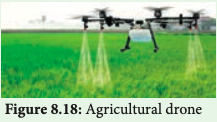

## Environmental Impact Assessment (EIA)

Environmental Impact Assessment is an environmental management tool. It helps to regulate and recommend optimal use of natural resources with minimum impact on ecosystem and biotic communities. It is used to predict the environmental consequences of future proposed developmental projects (example: river projects, dams, highway projects) taking into account inter-related socio-economic, cultural and human-health impacts. It reduces environmental stress thus helping to shape the projects that may suit local environment by ensuring optimal utilization of natural resources and disposal of wastes to avoid environmental degradation. 

**The benefits of EIA to society** 
- A healthier environment 
- Maintenance of biodiversity 
- Decreased resource usage 
- Reduction in gas emission and environment damage

### Biodiversity Impact Assessment (BIA)

Biodiversity Impact Assessment can be defined as a decision supporting tool to help biodiversity inclusive of development, planning and implementation. It aims at ensuring development proposals which integrate bio- diversity considerations. They are legally compliant and include mechanisms for the conservation of bio-diversity resources and provide fair and equitable sharing of the benefits arising from the use of bio-diversity.

**Biomonitoring** The act of observing and assessing the current state and ongoing changes in ecosystem, biodiversity components, landscape including natural habitats, populations and species. An agricultural drone is an unmanned aerial vehicle applied to farming in order to help increased crop production and monitor crop growth. Agricultural drones let farmers see their fields from the sky. This bird’s eye-view can reveal many issues such as irrigation problems, soil variation and pest and fungal infestations. It is also used for cost effective safe method of spraying pesticides and fertilizers, which proves very easy and non-harmful.

**Bio-diversity impacts can be assessed by** 

- Change in land use and cover 
- Fragmentation and isolation - Extraction 
- External inputs such as emissions, effluents
and chemicals 
- Introduction of invasive, alien or genetically
modified species 
- Impact on endemic and threatened flora and
fauna.

**8.12. Geographic Information System** 

GIS is a computer system for capturing, storing, checking and displaying data related to positions
on Earth’s surface. Also to manipulate, analyse, manage and present spacial or geographic data.

GPS is a satellite navigation system used to determine the ground position of an object. It is a **constellation** of approximately 30 well spaced satellites that orbit the earth and make it possible for the people with ground receivers to pinpoint their geographic location. Some applications in which GPS is currently being used for around the world include Mining, Aviation, Surveying Agricultural and Marine ecosystem. 

**Importance of GIS** 
- Environmental impact assessment 
- Disaster management 
- Zoning of landslide hazard 
- Determination of land cover and land use 
- Estimation of flood damage 
- Management of natural resources 
- Soil mapping 
- Wetland mapping 
- Irrigation management and identification of

volcanic hazard - Vegetation studies and mapping of
threatened and endemic species. 

**Remote Sensing** is the process of detecting and monitoring the physical characteristics of an area by measuring its reflected and emitted radiation at a distance from the targeted area. It is an tool used in conservation practices by giving exact picture and data on identification of even a single tree to large area of vegetation and wild life for classification of land use patterns and studies, identification of biodiversity rich or less areas for futuristic works on conservation and maintenance of various species including commercial crop, medicinal plants and threatened plants. 

**Specific uses** 
- Helps predicting favourable climate, for thestudy of spreading of disease and controlling
it.
- Mapping of forest fire and species
distribution.

- Tracking the patterns of urban area
development and the changes in Farmland
or forests over several years

- Mapping ocean bottom and its resources

**Summary** Green house effect leads to climate change which results in global warming. Deforestation causes soil erosion, whereas Afforestation helps to restore vegetation and increases ground water table. Agrochemicals like fertilizers, pesticides and runoff from fields cause soil infertility and in turn depletes the growth of plants. Help the government to retrieve the vegetation. Regeneration of trees by Agroforestry is possible with the involvement of community and government. Help to conserve the flora and fauna in their natural habitat and man-made environments like zoological parks and national parks. IUCN is the oldest environmental organisation which protects endemic and threatened species. Mitigation of carbon in the atmosphere done in the form of sequestration. Rain water harvesting is done for improving the ground water table. Importance and location of lakes in Tamil Nadu which aids water supply to the city is a measure of conservation of drinking water. Assessment of Environment and Biodiversity helps to study risk analysis and disaster management. Forest cover is monitored through Remote sensing and GIS.