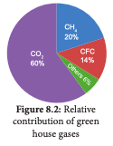

சூரியனிடமிருந்து வரக்கூடிய வெப்பக்கதிர்கள் வளிமண்டல வாயுக்களால் கவரப்பட்டு வளிமண்டலத்தில் வெப்பம் அதிகரிக்கும் நிகழ்வைப் பசுமை இல்ல விளைவு என்கிற�ோம். வெப்பக் க தி ர ்கள ை க் CH4 20% க வ ர் ந் தி ழு க் கு ம் வாயுக்களைப் பசுமை இல்ல வாயுக்கள் (Green Others House Gases) என 6% அழைக்கப்படுகின்றன. கார்பன்- டை-ஆக்ஸைடு (CO2),மீத்தேன் (CH4), நைட்ரஸ் ஆக்ஸைடு (N20) ஆகியவை அடங்கும். மேலும் செயற்கை வேதி ப�ொருட்களாகிய குள�ோர�ோஃபுள�ோர�ோ கார்பன் (CFC) ப�ோன்றவைகளும் வெப்பக் கதிர்களைக் கவர்ந்து புவியின் வெப்பத்தை அதிகரிக்கின்றன. இத்தகைய வாயுக்களின் அதிகரிப்பு பருவநிலை மாற்றம், பெரும் சூழல்மண்டலங்கள் மாற்றம் ப�ோன்றவற்றை ஏற்படுத்துகின்றன. வெப்பத்தினால் பெருமளவில் பாதிக்கப்படுவது பவழப் பாறைகள் அதிகம் நிறைந்த சூழல்மண்டலங்களாகும். எடுத்துக்காட்டாக: பவழப் பாறைகள் வெளிர்தல் (coral bleaching) தமிழ்நாட்டில் மன்னார் வளைகுடா பகுதியில் கண்டறியப்பட்டுள்ளது.




**பசுமை இல்ல விளைவை உண்டாக்கும் மனிதச் செயல்பாடுகள்**

- ல்லுயிர் படிம எரிப�ொருட்களை எரிக்கும் ப�ோது CO2 மற்றும் CH4 அதிகம் வெளிப்படுதல்

- வேள ாண் மற்றும் கால்நடை வளர்ப்பு ப�ோன்றவற்றின் செயல்முறைகளில் மாற்றங்களை உண்டாக்குதல்


- குளிர்சாதனப் பெட்டி, காற்று குளிர்விப்பான்கள் ப�ோன்ற மின்னணு சாதனங்களிலிருந்து குள�ோர�ோஃபுள�ோர�ோ கார்பன் வெளியேறுதல்

- வேளண் நிலங்களில் பயன்படுத்தப்படும் உரங்களில் இருந்து N2O வெளிப்படுதல்

- தனியங்கி வாகனங்களில் இருந்து வெளிவரும் புகை

பசுமை இல்ல வாயுக்களின் அடர்த்தி அதிகரிக்கும்ப�ோது புவியின் சராசரி வெப்பநிலையும் உயர்கின்றது (அதிகபட்சம் 4000 வருடங்கள்). இதுவே புவி வெப்பமடைதல் (global warming) என அழைக்கப்படுகின்றது. 

பெருகிவரும் மக்கள் த�ொகைக்கேற்ப உணவுப் ப�ொருட்களின் உற்பத்தி, நார் ப�ொருட்கள் மற்றும் எரிப்பொருட்களின் தேவையும் அதிகரிக்கப்பட வேண்டியுள்ளது. இதுவே புவி வெப்பமடைதலுக்கு முக்கிய காரணமாகக் கருதப்படுகிறது.

```
மேகங்கள் மற்றும் தூசுத்துகள்களும் பசுமை இல்ல வாயு விளைவினைத் த�ோற்றுவிக்கின்றன. அதன் காரணமாகவே மேகங்கள், தூசுகள் மற்றும் ஈரப்பத இரவுகள், தெளிவான உலர் இரவுகளை விட அதிக வெப்பத்துடன் காணப்படுகிறது.
```

**8.1.1. புவி வெப்பமடைதலின் விளைவுகள்**

- புவியின் வெப்பம் அதிகரிக்கும் ப�ோது துருவப் பகுதியில் பனிக்குன்றுகள் மற்றும் பனிக்கட்டிகள் உருகத் த�ொடங்குகின்றன. இதன் காரணமாகக் கடல்நீர் மட்டம் உயர்ந்து உலகின் பல பகுதிகளிலுள்ள கடல�ோர நகரங்கள் மூழ்கும் நிலை ஏற்படும்.


- கலநிலையில் தீவிர மாற்றங்கள் ஏற்பட்டு அதன் மூலம் கடும் வெள்ளப்பெருக்கு, அதிக வறட்சி ப�ோன்றவை நிலவும்.


- உயிரிபன்மைத் தன்மை குறைந்து வருவத�ோடு, சில சிற்றினங்கள் அழியும் நிலை ஏற்படும். வெப்ப மண்டல மற்றும் மித வெப்பமண்டலப் பிரதேசங்களில் உணவு உற்பத்தி குறையும்.

பசுமை இல்ல வாயுக்கள் வெளிவிடும்
மூலங்கள் (இயற்கை மற்றும் மனித இனம்
மூலம்) (Sources of Green House Gases
Emission - Natural and Anthropogenic)
CO2 (கார்பன்-டை-ஆக்ஸைடு)
•
•
•
•
நி
 லக்கரியைச் சார்ந்துள்ள மின் உற்பத்தி
நிலையங்களில்
த�ொல்லுயிர்
படிம
எரிப்பொருட்கள் எரிக்கப்படும் ப�ோது
த
 ானியங்கி வாகனங்கள், வணிக ஊர்திகள்,
வானூர்திகள் ப�ோன்றவற்றின் எரிப்பொருட்கள்
எரிக்கப்படுவதால்
புவி
வெப்பமடைதல்
அதிகளவில் ஏற்படுகிறது.
வேள

ாண் நிலங்களில் அறுவடையின்போது
அடிக்கட்டைப்
பயிர்களை
எஞ்சி
நிற்கும்
எரிப்பதாலும் CO2 வெளியேற்றப்படுகின்றது.
க
 ரிமப்பொருட்கள்,
எரிமலைகள்,
மித
வெப்பக்கடல்கள் மற்றும் வீழ்படிவங்கள் மூலம்
இயற்கையாக உருவாதல்
புவி வெப்பமாதலால்
விளைவுகள்
தாவரங்களில்
ஏற்படும்
•	வெப்ப மண்டலப் பிரதேசங்களில் உணவு
உற்பத்தி குறைதல்
•	வளி மண்டலத்தில் அதிகளவில் வெப்பக்
கதிர்கள் (heat waves) வீசுதல் (களைகள்,
பூச்சிகள் மற்றும் பூஞ்சைகளுக்கு அதிக வெப்பம்
தேவைப்படுகிறது)
•	ந�ோய் கடத்திகள் மற்றும் த�ொற்றுந�ோய்கள்
அதிகம் பரவுதல்
•	பலத்த
சூறாவளிக்காற்றும்,
கடுமையான
வெள்ளப்பெருக்கும் ஏற்படுதல்
•	தண்ணீர் தட்டுப்பாடு மற்றும் நீர்பாசனக்
குறைபாடு
•	பூக்கள்
த�ோன்றும்
காலங்கள்
மற்றும்
மகரந்தச்சேர்ப்பிகளில் மாற்றங்கள் நிகழ்தல்
•	தாவரப் பரவல் பிரதேசங்களின் சிற்றினங்களில்
மாற்றங்கள் காணப்படுதல்
• தாவரங்கள் அழிந்து வருதல்
மீத்தேன்
மீத்தேன், CO2-வைக் காட்டிலும் 20 மடங்கு
வெப்பத்தை வளி மண்டலத்தில் கூட்டுகிறது. நெல்
பயிரிடல், கால்நடை வளர்ப்பு, நீர்நிலைகளில் வாழும்

பாக்டீரியங்கள்
மற்றும்
த�ொல்லுயிர்
படிம
எரிப�ொருட்களின் உற்பத்தி, கடல், ஈரத்தன்மையற்ற
நிலம், காட்டுத்தீ வாயிலாக மீத்தேன் உருவாகிறது.
N2O (நைட்ரஸ் ஆக்ஸைட்)
இயற்கையில் பெருங்கடல்களிலிருந்தும், மழைக்
காடுகளிலிருந்தும் N2O உருவாகிறது. நைலான்,
நைட்ரிக் அமில உற்பத்தி, வேளாண் உரங்களைப்
பயன்படுத்துதல்,
வினைவேக
மாற்றிகள்
ப�ொருத்தப்பட்ட மகிழுந்துகளைப் பயன்படுத்துதல்
மற்றும் கரிமப்பொருட்களை எரித்தல் ப�ோன்றவற்றின்
மூலம் N2O செயற்கையாக உருவாகிறது.
8.1.3 புவி வெப்பமடைதலைத்
வழிமுறைகள்
•
•
•
•
தடுக்கும்
பு
 விப் பரப்பின் மீது தாவரப் ப�ோர்வையை
அதிகரித்தல், அதிக மரங்களை வளர்த்தல்
த�ொ
 ல்லுயிர் படிம எரி ப�ொருட்கள், பசுமை இல்ல
வாயுக்கள் பயன்பாட்டைக் குறைத்தல்
பு
 துப்பிக்கத்தக்க ஆற்றல் வள ஆதாரங்களைப்
பெருக்குதல்
நை
 ட்ரஜன் உரங்கள் மற்றும் ஏர�ோசால் (aerosol)
குறைந்த அளவு பயன்படுத்துதல்
8.1.4 ஓச�ோன் குறைதல் (Ozone depletion)
ஓச�ோன் அடுக்கு புவியின் மீவளிமண்டல அடுக்கின்
(stratosphere) ஒரு பகுதியாக அமைந்துள்ளது. இது
சூரியனிடமிருந்து வரக்கூடிய புற ஊதாக் கதிர்களைப்
பெருமளவில் கவர்ந்து க�ொள்கிறது. இதனால்
இவ்வடுக்கினை ஓச�ோன் கவசம் (Ozone Shield)
என்றும் அழைக்கலாம். இவ்வடுக்குப் புற ஊதாக்
கதிர்களைத் தடுத்து நிறுத்திப் புவியில் வாழும்
உயிரினங்களைப்
பாதுகாக்கும்
அடுக்காக
விளங்குகிறது.
வளி மண்டலத்தின் மேற்பகுதியில் இரண்டு
காணப்படுகின்றன.
அவையாவன
அடுக்குகள்
அடிவளி மண்டலம் (troposphere) (கீழடுக்கு) மற்றும்
மீவளி மண்டலம் (stratosphere) (மேலடுக்கு) அடிவளி
மண்டலப் பகுதியில் காணக்கூடிய ஓச�ோன் படலம்
பயனற்றதாகும் (bad ozone). அதே சமயம் மேலடுக்கில்
காணப்படும்
ஓச�ோன்
படலம்
நன்மைத்தரும்
அடுக்காகும் (good ozone). ஏனெனில் இவ்வடுக்கு
மட்டுமே சூரியனிடமிருந்து வெளிப்படும் UV கதிர்களை,
பெருமளவில் தடுத்து நிறுத்தி DNA சிதைவினால்
உயிரினங்களில் தீங்குண்டாவது தடுக்கப்படுகிறது.
ஓச�ோன் அடுக்கின் தடிமண் டாப்ஸன் அலகுகளால்
(Dobson Units) அளவிடப்படுகின்றன. இதன்மூலம்
புவிப் பரப்பிலிருந்து வளி மண்டலத்தின் வெளிப்பகுதி
வரையிலும் காற்றில் கலந்துள்ள ஓச�ோன் படலத்தை
அளவிட முடியும்.


ஓச�ோன் ஒரு நிறமற்ற வாயு. இது காற்றின்
மாசுப்பொருட்களுடன்
துரிதமாக
வினை
புரியக்கூடியது. இது இரப்பரில் வெடிப்புகளையும்,
தாவர உயிரிகளில் காயத்தையும் மற்றும் நுரையீரல்
திசுக்களில்
சிதைவினையும்
ஏற்படுத்தக்கூடியதாகும். சூரிய ஒளியிலிருந்து UV –
a மற்றும் UV – b எனும் தீங்கு விளைவிக்கும்
கதிரியக்கத்தை
ஓச�ோன்
உட்கிரகிக்கும்
தன்மையுடையது.
டாப்ஸன் அலகு என்றால் என்ன? ம�ொத்த ஓச�ோன்


அளவிட உதவும் ஓர் அலகு டாப்ஸன் அலகு
எனப்படும். 0° வெப்பநிலையில் 1 வளிமண்டல
அழுத்தத்தில் (புவிப்பரப்பின் மீதுள்ள காற்றழுத்தம்)
0.01 மில்லிமீட்டர் தடிமன் க�ொண்ட தூய ஓச�ோன்
அடுக்கை உருவாக்கத் தேவைப்படும் ஓச�ோன்
மூலக்கூறுகள் எண்ணிக்கை ஒரு டாப்ஸன் அலகு
(0.001 atm. cm) எனப்படும். புவிப்பரப்பின் மீது
காணப்படும் ம�ொத்த ஓச�ோன் அடுக்கு 0.3 செ.மீ. (3 மி.மீ.)
த டி ப் பு ள்ள து
ஆகும். இது 300
எனக்
DU
குறிப்பிடப்படும்.
புவியின் ம�ொத்த
ஓ ச�ோ ன்
அ ம ை ப ்பைக்
க ா ண் பி க் கு ம்
ப�ொய்
நிறத்தோற்றம்

ஊதா மற்றும் நீல
நிறங்கள் ஓச�ோன் மிகக் குறைந்த பகுதியாகும்.
மஞ்சள் மற்றும் சிவப்பு நிறப் பகுதிகள் ஓச�ோன் மிகு
பகுதியென அறியலாம்.

சில வகையான வேதிப் ப�ொருட்கள் வளி
மண்டலத்தில் வெளியிடப்படும் ப�ோது ஓச�ோன் படலம்
த�ொடர்ந்து
பாதிப்பிற்குள்ளாகிறது.
குறிப்பாக,
குளிர்சாதனப்
பெட்டிகளிலிருந்து
வெளியேறும்
குள�ோர�ோஃபுள�ோர�ோ
கார்பன்,
ஏர�ோசால்,
த�ொழிற்சாலைகளில்
அழுக்கு
நீக்கும்
வேதிப்
ப�ொருட்கள் ப�ோன்றவை இத்தகைய பாதிப்பினை
ஏற்படுத்துகின்றன. ஓச�ோன் அடுக்கின் அடர்வு
வெகுவாகக் குறைந்து காணப்படும் பகுதிகள்
அபாயகரமான
பகுதியாகக்
கண்டறியப்பட்டு
அப்பகுதியை ஓச�ோன் துளை (Ozone hole) என
அழைக்கப்படுகின்றன.
செப்டெம்பர் 16 - உலக ஓச�ோன் தினம்
மீவளிமண்டல
அடுக்கில்
ஓச�ோன்
அளவு
குறைந்துவரும் நிலையில் அதிகப்படியான புற ஊதாக்
கதிர்கள் குறிப்பாக UV B கதிர்கள் புவியை
வந்தடைகின்றன.
இக்கதிர்கள்
உயிர்
மூலக்கூறுகளையும்,
உயிர்ச்
செல்களையும்
அழிக்கின்றன (த�ோல் மூப்படைதல்). UV –C என்பது
அதிகளவு சேதம் விளைவிக்கும் UV கதிரியக்க
வகையாகும். ஆனால் ஓச�ோன் படலத்தால் இது
முற்றிலும் தடுக்கப்படுகிறது. 95 சதவீத UV கதிரியக்கம்
த�ோலின் நிறமாற்றம், த�ோல் கருகுதல் மற்றும் த�ோல்
புற்றுந�ோய்
ப�ோன்றவற்றைத்
தூண்டவும்
காரணமாகிறது.
இதன்வாயிலாகப்
புவியில்
உயிரினங்கள் அனைத்தும் ஆர�ோக்கியமாக வாழ
ஓச�ோன் அடுக்கு சீராக இருப்பது ஒன்றே தீர்வாகும்
என்று உணர முடிகிறது.
1970-ஆம் ஆண்டு நடத்தப்பட்ட ஆய்வு முடிவில்
மனிதன்
வாயிலாக
வெளியிடப்படும்
குள�ோர�ோஃபுள�ோர�ோ கார்பன் (CFC) ஓச�ோன்
மூலக்கூறுகளை
அதிகளவில்
சிதைத்து
வளிமண்டலத்தின் ஓச�ோன் அளவை வெகுவாகக்
குறைத்துவிடுவது கண்டறியப்பட்டது. இத்தகைய
ஓச�ோன் குறைபாடு மற்றும் ஆபத்து சர்வதேச அளவில்
அச்சுறுத்தலை
உண்டாக்கும்
முக்கியமான
பிரச்சினையாக உள்ளதென உலக வானிலை ஆய்வு
அமைப்பும், ஐக்கிய நாடுகள் சபையும் எடுத்துரைத்தன.
1985-ஆம் ஆண்டில் நடைபெற்ற வியன்னா மாநாட்டில்
நிறைவேற்றப்பட்ட ஒப்பந்தங்கள் (நடவடிக்கைகள்)
தீவிரமாக
நடைமுறைப்படுத்தப்பட்டது.
1988-ல்
சுற்றுச்சூழலைப் பாதுகாக்க ஏற்படுத்தப்பட்ட வியன்னா
கூட்டத்தில் ஆக்கப்பூர்வமான ஒழுங்கு நடைமுறைகள்
ஒப்பந்தம்
(உடன்படிக்கைகள்)
வகுக்கப்பட்டது.
பிற்காலத்தில் இந்தச் செயல்முறைகள் அனைத்தும்
சர்வதேச
அளவிலான
மான்ட்ரியல்
ஒப்பந்தம்
(Montreal
Protocol)
என
(உடன்படிக்கை)
அழைக்கப்பட்டது. 1987-ல் கனடாவில் நடைபெற்ற
சர்வதேசப்
பிரதிநிதிகள்
குழு
கூட்டத்தில்,
வளிமண்டலத்தில் ஓச�ோன் படலத்தைச் சேதப்படுத்தும்
ப�ொருட்களைக் களைவது குறித்தும் படிப்படியாக
அத்தகைய ப�ொருட்கள் உற்பத்தியை நிறுத்தி,
பயன்பாட்டைக்
குறைக்கவும்
குறிக்கோளாகக்
க�ொண்டு விவாதிக்கப்பட்டது
தூய்மை
மேம்பாடு
செயல்திட்டம்
(Clean
Development Mechanism - CDM) க்யோட்டோ ஒப்பந்தம்
/ உடன்படிக்கை (Kyoto Protocol) (2007) எனவும்
வரையறுக்கலாம்.
இதில்
சரியான
இதனை
குறிக்கோளுக்காக
செயல்திட்டம்
வகுக்கப்பட்டு
நடைமுறைப்படுத்தப்பட்டு
வருகிறது.
அதாவது
வானிலை மாற்றத்தின் விளைவால் ஏற்படும்
அபாயத்திலிருந்து பாதுகாப்பது மற்றும் பசுமை இல்ல
வாயுக்கள் வளி மண்டலத்தில் வெளியிடப்படுவதைக்
குறைப்பது ப�ோன்ற முக்கிய குறிக்கோள்களுக்கான
உருவாக்கப்பட்டுள்ளது.
CDM
செயல்
திட்டம்
திட்டத்தின் மூலம் பல்வேறு நாடுகளில் நச்சு
வாயுக்களின் வெளியேற்றம் குறைந்திருப்பத�ோடு
த�ொடர்ந்து
மேம்பாடடைய
சுற்றுச்சூழல்
ஊக்குவிக்கப்பட்டும் வருகிறது.

த்துக்காட்டாகச் சூரிய ஒளியிலிருந்து அல்லது
வலிமையான க�ொதிகலன்களிலிருந்தும் மின்சாரம்
தயாரிக்கப்படுவதைக் குறிப்பிடலாம். இவை மரபுசார்
மின்சார உற்பத்திக்குச் சிறந்த மாற்றாக அமைகின்றன.
மேற்குறிப்பிட்ட திட்டங்கள் செயல்படுத்தப்படும்போது
வளிமண்டலத்தில்
மாசு
குறைவதால்
அவை
சான்றளிக்கப்பட்ட உமிழ்வு குறைப்பு (Certified Emission
Reduction - CER) விருதுகளையும், சான்றிதழ்கள்
மற்றும் தர மதிப்பெண்களையும் பெறுகின்றன.
ஒவ்வொரு தர எண்ணும் ஒரு டன் CO2-விற்கு
இணையாகக் கருதப்படுகிறது. இவை க்யோட்டோ
(Kyoto) இலக்கினை அடைய உதவி புரிகின்றன.
தாவரக் சுட்டிக்காட்டிகள்
சில தாவரங்களின் இருப்பு அல்லது இல்லாமை
அங்கு நிலவும் சூழலைச் சுட்டிக்காட்டும் விதத்தில்
காணப்படும். தனித்தாவர சிற்றினம�ோ அல்லது
தாவரத் த�ொகுப்போ சூழல் நிலைகளைக் கண்டு
அளவிட
உதவுகின்றன.
அவை
உயிரிக்சுட்டிக்காட்டிகள்
அல்லது
தாவரக்
சுட்டிக்காட்டிகள் எனப்படும். உதாரணமாக

**8.1.5 ஓச�ோன் குறைதலின் விளைவுகள்**


முக்கிய விளைவுகளாவன:
•
•
•
•
•
க
 ண்ணில் புரை உண்டாதல், த�ோல் புற்றுந�ோய்
அதிகளவில்
த�ோன்றுதல்,
மனிதனின்
ந�ோயெதிர்ப்பு சக்தி குறைந்துவிடுதல்
இ
 ளமைக்காலங்களிலேயே
மடிந்து ப�ோதல்
விலங்கினங்கள்
சடுதி மாற்றங்கள் அடிக்கடி ஏற்படுதல்
ஒ
 ளிச்சேர்க்கை வேதிப்பொருட்கள் பாதிக்கப்பட்டு
அதன் மூலம் தாவரங்களின் ஒளிச்சேர்க்கை
தடைப்படுகிறது. ஒளிச்சேர்க்கை அளவு குறைந்து
வரும் வேளையில் உணவு உற்பத்தி குறைந்து
உணவு பற்றாக்குறை ஏற்படும். மேலும் வளி
மண்டலத்தில் CO2 அளவு அதிகரித்துப் புவி
வெப்பமடையும்.
வெப்ப

நிலை அதிகரிக்கும் ப�ோது வானிலை,
மழைப்பொழிவு ப�ோன்ற காலநிலையில் மாற்றம்ஏற்படும். இதன் விளைவால் வெள்ளப்பெருக்கு,
வறட்சி, கடல்மட்டம் உயர்தல் ப�ோன்றவை
ஏற்படும். சூழல்மண்டலங்கள் நடுநிலைத்தன்மை
தாவரங்களும்,
விலங்குகளும்
இழந்து
பாதிப்பிற்குள்ளாகும்.

