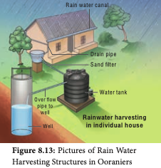
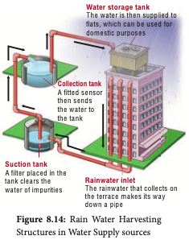
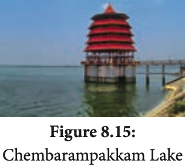

Rainwater harvesting is the accumulation and storage of rain water for reuse in-site rather than allowing it to run off. Rainwater can be collected from rivers, roof tops and the water collected is directed to a deep pit. The water percolates and gets stored in the pit. RWH is a sustainable water management practice implemented not only in urban area but also in agricultural fields, which is an important economical cost effective method for the future.

### Environmental benefits of Rain Water Harvesting:

- Promotes adequacy of underground water
and water conservation. - Mitigates the effect of drought. 
- Reduces soil erosion as surface run-off is reduced. 
- Reduces flood hazards. 
- Improves groundwater quality and water table / decreases salinity. 
- Avoid land wastage for storage purpose and no population displacement is involved. 
- Stores water underground as an eco-friendly
measure and is a part of sustainable water storage strategy for local communities.

### Importance of Lakes
Water bodies like lakes, ponds not only provide us a number of environmental benefits but they strengthen our economy as well as our quality of life like health. Lakes as a storage of rain water provide drinking water, improves ground water level and preserve the fresh water bio-diversity and habitat of the area where it occurs.

In terms of services lakes offer sustainable solutions to key issues of water management and climatic influences and benefits like nutrient retention, influencing local rainfall, removal of pollutants, phosphorous and nitrogen and carbon sequestration.

**Important lakes in Tamil Nadu** Lakes are man-made surface water harvesting systems. They are useful for irrigation, drinking, fishing and recreation purposes. It is the responsibility of the individuals as well as communities collectively to maintain and manage water bodies. Understanding catchment areas help us to halt the degradation of water bodies and protecting it from getting polluted. 

**Sholavaram Lake :** 
I**t** is located in Ponneri Taluk of Thiruvallur District. It is one of the rain fed reservoir from where water is drawn for supply to Chennai city. The full capacity of the lake is 65.5 ft. Built in the British era this lake is responsible for treating the guests to water sports too. This lake is rich in varied species of flora and fauna. 

**Chembarampakkam Lake:** I**t** is located about 25 km. from Chennai. This lake is 500 yrs old. This lake is a rain fed water body which aids the Chennai City in its water supply. A river named Adyar also incepts from this lake which acts as the primary outflow for this reservoir. This lake is spread over an area of 15 square km. 

**Maduranthakam Lake:** It is located in Kancheepuram district and it is a man-made creation. An ideal spot for an evening picnic, the widespread pristine waters of the lake are an exceptionally calming sight. The full capacity of the reservoir is 23.3ft. Kiliyar is a small river that originates from Madhuranthagam reservoir. It spreads to an area of 2908 acres and was built by Uttama Chola and the boundaries (stretched upto 12960 feet) are strengthened by Britishers with a storing capacity of 690 million cu.feet. Rain water from Cheyyar, Thiruvannamalai and Vandavasi reaches this lake.
