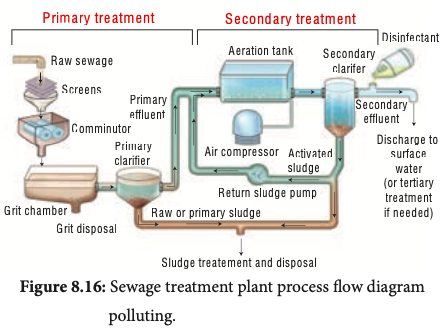

கழிவுப்பொருள்
நீக்கச்
செயல்முறைகள்
மூலக்கழிப்பொருட்களை
எளிதில்
நிர்வகிக்கக்
கூடியதாக மாற்றியமைக்க உதவுகிறது மற்றும்கழிவு
நீக்கம்
செய்யப்பட்ட
A¼Iï£CQ
ப�ொருட்களை மீட்டு மீண்டும்
裟«ø£Ÿøˆ ªî£†®
Íô‚ èN¾c˜
Þó‡ì£‹G¬ô
பயன்படுத்த
உதவுகிறது.
ªîOõ£‚A
கார்பன்டை
ஆக்ஸைட்,
õ®è†®èœ
மீத்தேன், நைட்ரஸ் ஆக்ஸைட்
ºî™G¬ô
èN¾èœ
Þó‡ì£‹
ப�ோன்ற
பசுமை இல்ல
G¬ô‚
à¬ìŠð£¡èœ
èN¾èœ
வாயுக்கள்
கழிவு
நீர்
«ñŸðóŠ¹
c˜ «ï£‚A
சுத்திகரிப்பின்போது
உற்பத்தி
ºî™G¬ô
裟ø¿ˆF A÷˜¾Ÿø êèF /
M´MŠ¹
ªîOõ£‚A
ɇìŠð†ì
செய்யப்படுகின்றன. இது வளி
°¬ö«êÁ
மண்டலத்தில்
ஏற்படுத்தும்
°¬ö«êÁ F¼Š¹‚ °ö£Œ
தாக்கம்
மட்டுமல்லாமல்
¶èœ
Íô Ü™ô¶ ºî™G¬ô °¬ö«êÁ
«êIŠð¬ø
நகர்ப்புறச்
சூழல்
அமைப்பு
¶èœ c‚è‹
மற்றும்
நீர்வாழ்
சூழல்
êèF ²ˆFèKŠ¹ ñŸÁ‹ c‚è‹
அமைப்பையும் பாதிக்கின்றன.
படம்
8.16:
கழிவுநீர்
சுத்திகரிப்பு
நிலையத்தின் செயல்முறை விளக்கப்படம்
மேம்பட்ட
கழிவுப்
ப�ொருள்
சுத்திகரிப்பு
நிலையங்கள்
பயன்படுத்துவதன் மூலம் காலநிலை மாற்

 

ீடு மற்றும் த�ொழிற்சாலைகளில் இருந்து
வெளிவரும்
கழிவுப்
ப�ொருட்களை, மலக்கழிவு
அல்லது அழுக்கடைந்த நீர் ப�ோன்றவை கழிவுநீர்
குழாய்கள் மூலம் பாய்கிறது. கழிவுநீர் சுத்திகரிப்பு
என்பது முழுமையான வீடு சார்ந்த மாசுக்களைக்
செயல்முறையாகும்.
கழிவுநீரிலிருந்து
அகற்றும்
மற்றும்
உயிரியல்
இயற்பியல், வேதியியல்
செயல்முறைகள்
ஆகியவை
மாசுபடுதலை
அகற்றுவத�ோடு, சுத்திகரிக்கப்பட்ட
கழிவுநீரை
உருவாக்கிச் சுற்றுச்சூழலுக்கு ஏற்ற வகையில்
மாற்றி அமைத்து உதவுகின்றன. கழிவுநீர் அதிக
அளவில்
கரிமப்
ப�ொருட்களாலும்
மற்றும்
நுண்ணுயிரிகளையும் க�ொண்டுள்ளன. நீர�ோடைகள்,
ஆறுகள் ப�ோன்ற இயற்கை நீர்நிலைகளுக்கு
நேரடியாக இவற்றை வெளியேற்ற முடியாது

 எனவே
கழிவுநீர்
சுத்திகரிப்பு
நிலையங்கள்
மற்றும் மாசுபாடுகளைக் குறைக்க இயலும்.
கழிவுநீரைக்
குறைவான
மாசடைவதாக
வீடு மற்றும் த�ொழிற்சாலைகளில் இருந்து
வெளிவரும்
கழிவுப்
ப�ொருட்களை, மலக்கழிவு
அல்லது அழுக்கடைந்த நீர் ப�ோன்றவை கழிவுநீர்
குழாய்கள் மூலம் பாய்கிறது. கழிவுநீர் சுத்திகரிப்பு
என்பது முழுமையான வீடு சார்ந்த மாசுக்களைக்
செயல்முறையாகும்.
கழிவுநீரிலிருந்து
அகற்றும்
மற்றும்
உயிரியல்
இயற்பியல், வேதியியல்
செயல்முறைகள்
ஆகியவை
மாசுபடுதலை
அகற்றுவத�ோடு, சுத்திகரிக்கப்பட்ட
கழிவுநீரை
உருவாக்கிச் சுற்றுச்சூழலுக்கு ஏற்ற வகையில்
மாற்றி அமைத்து உதவுகின்றன. கழிவுநீர் அதிக
அளவில்
கரிமப்
ப�ொருட்களாலும்
மற்றும்
நுண்ணுயிரிகளையும் க�ொண்டுள்ளன. நீர�ோடைகள்,
ஆறுகள் ப�ோன்ற இயற்கை நீர்நிலைகளுக்கு
நேரடியாக இவற்றை வெளியேற்ற முடியாது.
JlÐƒÌ.n›Ӂ£o
Ê Ú¡l+f¥Îo
மாற்றியமைக்க உதவுகின்றன.
கழிவுநீர்
சுத்திகரிப்பு
ப�ொதுவாக
மூன்று
வகைகளை உள்ளடக்கியது. இவை முதன்மை,
இரண்டாம் மற்றும் மூன்றாம்நிலை சுத்திகரிப்பு
என்று அழைக்கப்படுகின்றன.
திடக்கழிவு மேலாண்மை
management)
நிலத்தில்
நிரப்புதல், எரித்துச்
சாம்பலாக்குதல், மீட்பு, மறுசுழற்சி,
உரமாக்குதல் மற்றும் உயர்வெப்பச்
சிதைவு
ஆகிய
முறைகளைத்
திடக்கழிவு
மேலாண்மை
உள்ளடக்கியதாகும்.
JlÐƒÊ( 
ÊkÎ5o
¿p׎Ón›Ê~
À£fÊnÒjÎ
+ÎfÊ3 
Œ×l+ڃJlÐƒ
’Ø p×3Ì.fÊnÒÎ{
.ƒÌ ÕoÐÔ 0fÊ
Ä0ŒÒ žÙ Ê
ÂÒÔ &lÐ{
,Öl
•
,ÖlАHz
ÊkÊ *n›f
&Ï£
Ê( f’Ø pÊ~
படம் 8.17: நில நிரப்புதல்
waste
திடக்கழிவு எனப்படுவது திரவமல்லாத கழிவுகளைக்
குறிப்பிடுவதாகும். சுகாதாரப் பிரச்சினைகள் மற்றும்
மாசுபாட்டிற்கு
வழிவகுக்கும்
விரும்பத்
தகாத
வாழ்க்கைச் சூழலை ஏற்படுத்துகிறது. திடக்கழிவு
மேலாண்மை திடமான கழிவுகளைச் சேகரித்தல்
மற்றும்
சுத்திகரித்தல்
செயல்முறையை
உள்ளடக்கியது. இக்கழிவுகள் பயனுள்ள வளங்களாக
மாற்றியமைக்கப்பட்டு
மறுசுழற்சி
செய்யப்படுவது
எப்படி
என்பதைக்
Ê( l
Ê( ”l+Ê0n›
ÐfÊlŒÐ j
¾ŽÓn›
குறிப்பதாகும்.
.ƒ2ŽÌ
Òl+fÊjÎÎo
JlÐƒ× 
Jj›
(Solid
АH
z
Ê( fÊkÊ *n›f
&Ï£
தி
 டக்கழிவுப்
ப�ொருள்
சுத்திகரிப்பு
மற்றும்
அ க ற் று வ த ற்கான
த�ொழில்நுட்ப முன்னேற்றம்
புதுப்பிக்கத்தக்க
ஆற்றல்
மற்றும் கரிம எருவாக
ம ா ற் றி ய மைக்க
உதவுகிறது.

•
உ
 யிரிகளால்
சிதைக்க
முடியாத
நச்சுத்தன்மையினைக் க�ொண்ட மின்னணுக்
அச்சுறுத்துதலுக்கு
கழிவுகள், மனிதநலத்தை
உட்படுத்துவதுடன்
மறுசுழற்சியின்
ப�ோது
வெளியிடும் புகை வெளியேற்றம் மற்றும்
அவற்றின் கசிதல், நீர் நிலைகளுக்கு மிகப்பெரிய
அச்சுறுத்தலை
உருவாக்குகின்றன. இந்தப்
பிரச்சினைகளைக் குறைக்க வேளாண் நில
நிரப்புதலே ஒரு சிறந்த முறையாகும்.
திரவக் கழிவு மேலாண்மை (Liquid waste
management)
திரவக் கழிவு என்பது மூல ஆதாரங்கள் (point
source) மற்றும் மூலமறியா ஆதாரங்கள் (non-point
source) மூலம் வெளியேற்றப்படும் வெள்ளநீர் மற்றும்
கழிவுநீர்
ஆகியவற்றை
உள்ளடக்கியதாகும்.
வெளியேறும்
கழிவுநீர்,
வீடுகளிலிருந்து
த�ொழிற்சாலைகளில்
சுத்தப்படுத்தப்
பயன்படும்
கழிவுநீர்
திரவங்கள், வீணடிக்கப்பட்ட
அழுக்கு
ஆகியவன
திரவக்
கழிவுகளுக்கு
நீக்கிகள்
எடுத்துக்காட்டுகளாகும்.
நகராட்சி கழிவுகளிலிருந்து வெளியேற்றப்படும் நீர்
தீங்கு விளைவிக்கக்கூடிய ந�ோய் கிருமிகளைக்
க�ொண்டுள்ளது. இதுவும் பயனுறு நீர் (grey water )
எனப்படும். கழிப்பறை நீங்கலாக வீட்டு உபய�ோகக்
த�ொட்டி, குளியல்
கருவிகளிலிருந்து (குளியல்
நீர்த்தூவிகள், சமையலறை கழுவித் த�ொட்டிகள்
மற்றும் துணி துவைக்கும் இயந்திரம்) வெளியேறும்
நீரும் பயனுறு நீர் எனப்படும். நகராட்சி கழிவுகள்
உயிரியல் முறையில் நச்சுக்கள் நீக்கப்பட்டுப் பிறகு
மறுச்சுழற்சி செய்யப்படுகின்றன. வீட்டு உபய�ோகக்
கழுவு நீர் மறுசுழற்சி செய்யப்பட்டுத் த�ோட்டங்களுக்குப்
பயன்படுத்தப்படுகின்றன.

