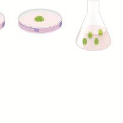

்‌ க்‌ அலகு 1/14: உயிரி தொழில்நுட்பவியல்‌: பாடம்‌ 5 தாவரத்‌ திசு வளர்ப்பு

\[ம அனை அ ன தாவ ப்பாடத்‌ ன ர அல்லது சாதாரணச்‌ சூழலில்‌ இருந்து பிரித்தெருக்துச்‌. இப்பாடத்தினைக்‌ கற்போர்‌. செயற்கையான சூழ்நிலையில்‌ வளர்த்தலைத்‌ திச. 4 தாவரக்திசு வளர்ப்பு கருத்துக்களை வளர்ப்பு என்கிறோம்‌. இவை சோதனை கலத்தில்‌: “உள்வாங்கிக்‌ கொள்ளவும்‌. தாவரப்‌ புரோட்டோபிளாஸ்ட்கள்‌, செல்கள்‌, திசுக்கள்‌. 4. தாஷத்திசு வளர்ப்பு தொழில்நுட்ப. மற்றும்‌ உறுப்புகள்‌ வளர்ப்ப என்றும்‌ அழைக்கப்படும்‌ முறையையும்‌, வகைகளையம்‌. ஸ்ட கந்தன்‌, கண்ணாடி. சோனை அறிந்துக்காள்ளவம்‌. குழாயினுள்‌\] ஒரு தனிப்‌ பிரிகூறு (521) குறுகிய: ௮ ஸரோப்போயிளாச வளர்ப்பைவிரிவாக்‌ காலத்திலும்‌... இடத்திலும்‌... கப்டபபரகக்ப்ட றக \*ழ்திலையில்‌ பல்லாமிரக்கணக்கான நாவரங்களாகப்‌

ப வலவவலுவை கவ்‌. பனக த்‌ 'இரண்டாம்நிலை வளர்சிதைப்‌ பொருள்களின்‌... அரிக்‌ நோக்கில்‌ தாவர.

க்கை வதன்‌ கனி ன்‌ க தனக வணக அ நாகத்‌ ஆராஙசசகளுக்கம்‌ 4: நண்வரு்கம்‌உடகக்‌கவப்டக்தம்‌ தண்டி... பயன்படகறத.... காரம்‌ ஆக்கத்‌ ஊளர்பமாபணுவனக்கறு நக ஊரிய மனு முக்கல்‌ ஆகியவற்றின்‌ பயன்களை சாற்பப்ட கஷங்களன்‌ உரைகல்‌ மனுமாக்கதில்‌ தனக 4: க்ரமம்‌, உயிரி பாதுக்பு மற்றும்‌ உயிரி முலமாக... கருவியாகப்‌ "ததி பற்றிய சலிவைப்‌ பெறவும்‌ இயலும்‌. பங்காற்றுகிறது இதுதலிர்தத. நண்‌ நக ஊளர்பபன்‌ சல

முகக்‌ வன்பலகாக சரிய தாய்‌ வர்க்‌

பாட உள்ளடக்கம்‌. உயர்தர (வ்‌ னல) தாவரங்களின்‌ பாதுகாப்பு

(வைரஸ்‌ அற்ற தாவர உற்பத்தி, மரபணு, வளக்கூறு (ரகா). பாதுகாத்தல்‌, தொழிற்சாலையில்‌:

பட பகத்‌ று “இரண்டாம்‌ நிலை வளர்ச்சிதை மாற்றப்‌ பொருள்கள்‌.

அடிப்படைக்‌.

க்‌ கதித்த ப உளக இழத வந்தலகா

௧௮ ஷத்திக ஊர்பு கணமின்‌ காணு வழில நபம்‌ வலை பபன்ப

கொழில்நுட்பமுறை, மற்றும்‌ சுற5ைறி பிரர்சினைகளுக்கான விழிப்புணர்வு நத ககன்‌ ககன வழியல்ல,

ஸ்‌ ஜன்மம்‌ மிகி. நலக்‌ காஹலியவர்‌. வாகிய

க்கம்‌ மஷெமிமேண்ட்‌ (6௦2 மழகக ககன்‌ கரம்கை

(௧4 தனத்த வரல்‌ ப்பர்‌ முன்வாசல்‌ அவ்‌ சர்ம வடகத்‌

2 ட கேம்‌ பரியம்‌ நார நலைய்பைத்‌ த.

ரட்‌ சங்கைப்‌ பனப்கர்‌ சயதிகையான பகம்‌

௧௧ அறிவுசார்‌ சா தாவரச்‌ செல்களை முதன்முதலில்‌ வளர்த்துப்‌:

கரிம கங்கை. சல்களாம்‌ சடங்ம்‌ வரக்‌

பெ உமசஹமக்துபவைைன்‌ சதன்‌ கர்‌ காலத்‌ இக வார்பபின்‌ சழ்தையாக்‌

கருதப்படுகிறார்‌

ஹவராடுஞ்௦9ட/

51.  திசு வளர்ப்பின்‌ அடிப்படைக்‌ "கொள்கைகள்‌ தாவரத்திக வளர்ப்பின்‌ அடப்படைக்கருத்துககளாவன முழு ஆக்கத்தின்‌, வேறுபாமறுகல்‌, மறுவேறுபா௦. அடைதல்‌, வேறுபாடு இக்கல்‌ போன்றவையாகம்‌. முழு ஆக்குத்திறன்‌ (10100௦).

ரியல்‌ திறன்களைக்‌ கொண்டுள்ள உயிருள்ள. தாவரச்‌ ஊங்களை ஊட்ட (கரைசல்‌) ஊடகத்தில்‌ வளர்க்கும்‌ போறு அவை ழும்‌ தனித்‌ தாவரமாக.

கணர்சசியபையும்‌. பண்டே முழு. ஆக்கத்திறன்‌. ஐ க்ஷ. ட டப்‌ வலம

மடம்‌ காமுழு ஆக்கத்திறன்‌. 'வேறுபாமறுகல்‌ (எள)

செல்களில்‌ உயிரி வேதியிய மற்றும்‌ அமைப்பிய மாற்றங்கள்‌ ஏற்படுத்தி அவற்றைச்‌ சிறப்பான அமைப்பு மற்றும்‌ பணியினை மேற்கொள்ளச்‌ மய்தல்‌. மறுவேறுபாடறுகல்‌ (£ணரஎளஸா0)

ஏற்கனவே வேறுபாருற்ற ஒரு சல்‌ மேலும்‌: 'வேறுபாுற்று மற்ஷறாரு செல்லாக மாற்றமடைதல்‌. எடுத்துக்காட்ட: ஊட்டச்‌ சத்து ஊடகத்தில்‌ கேலஸ்‌: 'இகனின்‌ ஊல்கூறுகள்‌ முழுத்தாவு அமைப்பை "உருவாக்கும்‌ திறன்‌ பற்றுள்ளதைமறுவேறுபாடறுகல்‌ 'வேறுபாடிழத்தல்‌ ௦! எளர்லிர,

முதிர்ச்சி. கடைந்த... வங்கள்‌... மீண்டும்‌ ஆக்குத்திசவாக மாறிக்‌ சேலஸ்‌ போன்ற திசுவை உருவாக்கும்‌ நிகழச்சி வேறுபாடு இழத்தல்‌ என: அழைக்கப்படுகிறது. உயிருள்ள தாவரச்‌ செல்களின்‌, 'இசக்களின்‌ வேறுபாடறுதலும்‌, வேறுபாமழக்கலும்‌ உள்ளார்ந்து ஒரு சேரக்‌ காணப்பப்பால்‌ அவை. முழுஞக்குத்திறன்‌ பெற்றதாகக்‌ கருதப்பட,

டத...

5.2 தாவரத்‌ திசு வளர்ப்பு (9! 70௦. ௦யச-20).

தாவரத்‌ திசு வளர்ப்பு என்பது ஆய்வு கூடச்‌ சோதனை: வர்ப்புமுறைமற்றும்‌ நுண்ணுயிர்‌ நீக்கிய நிலையில்‌ சவற கடத்தில சேலம்‌ காஷ்பததிகளை என... வரையறுக்கப்பரகிறது இஷாமி்கப்ப! வயல்முறை மன்று சடிபடை ஷறிமுறைகளைக்‌ கொண்டுள்ளது. “தேவையான தாவரப்பததி அல்லது. அதன்‌ மிரிகறு தேர்வு செய்யப்பட்ட பின்பு இகர உடல்‌ பகுதியிலிருந்து பிறித்ஷரக்கப்படிறது பஹ னை ல கழ்றிலையிலும்‌, வரையறுக்கப்பட்ட வேதியிய (கேட்ட ஊடகம்‌) கழலிலும்‌ பராமரக்கப்புகிறது. ரகூறு என்பது தேர்ந்ததுக்கப்பப்ட தாவரத்தை: உருவாக்குவதற்கு வளர்ப்பு ஊடகத்தில்‌ வைத்து, வளர்க்கத்‌ தேவைப்படும்‌ தாவரத்‌ கச.

5:21 தாவரத்‌ திசு வளர்ப்பிற்கான அடிப்படை

ஆய்வக வசதிகள்‌:

தாவரத்‌ திசு வளரபிற்கு ஆய்வகம்‌ பின்வரும்‌

வசதிகளைக்‌ கொண்டிருக்க வேண்டும

“- கண்ணாடுக்கலன்களைக்‌ கழுவுவதற்கான வசதி மற்றும்‌. வற்றை. உலர்த்துவதற்கான. நுண்ணலை அடிப்பு (ன) வசதி

42 தன்னமுத்தக்‌ கலன்‌ (யய, எலக்ப்ரனிய தராசு மற்றும்‌ ஐ\] மீப்பநடன்‌ க்ஷய வளர்பபு ஊடகம்‌ தயாரிப்பதற்கான அறை.

படம்‌ 52: திச வளர்ப்பு ஆய்வகம்‌.

“நுண்ணுயிர்‌ நீக்கப்பட்ட அறை: இது ஒரு சிரக்கு காற்றுபாய்வு கமைப்பும்‌ உயர்திறன்‌ துகள்‌ காற்று (னக மரு வானவ எம்ப சம) ஷப்பான்‌. என்றழைக்கப்படும்‌ அழுத்தக்‌ காற்றோட்ட அலகும்‌ உள்ளன. இவற்றின்‌ வேலை நுண்ணுயிர்‌ சற்ற. ஒரு கழலை உருவாக்குவதாகம்‌.

“வளர்ப்பு. வசதி: பிரிகூறு வளர்ப்புக்‌ குழாயில்‌ பொதிக்கப்பப்டு 22-2610. வெப்ப நிலையிலும்‌, 2400 லக்ஸ்‌ ஒளிச்மறிவிலும்‌,8-16 மணிநேரம்‌ ஒளிக்காலத்துவத்திலம்‌, ஏறத்தாழ. 60%. ஈப்பதத்திலும்‌ வளர்க்கப்புகிறத.

ஹவராடுஞ்௦9ட/

5.2.2 தாவரத்‌ திசு வளர்ப்பில்‌ அடங்கியுள்ள அடிப்படைத்‌ தொழில்நுட்பமுறை

௩றுண்ணுமிர்‌ நீக்கம்‌; இண)

நுண்ணுயிர்‌ நீக்கம்‌ என்பது வளர்பபு கடகம்‌, வளர்ப்ப போன்றவற்றிலிரந்து

4.  நுண்ணுமிர நீக்கப்பட நிலையைப்‌ பராமரிக்க: ஆய்வகச்‌ ஊயற்கை... ஊர்ப்‌ நுண்ணுயிர்‌ நீக்கப்பட்ட நிலையைப்‌ பராமரிக்கப்‌. பின்வரும்‌ முறைகள்‌ மின்பற்றப்பகின்றன.... கண்ணாகக்‌. கலன்கள்‌, இரக்கி, கத்தி, அனைத்து உபகரணங்கள்‌: ஆகியவை. தன்னமுக்கக்கனில்‌ ௩ 0௨. (20. வெப்பநிலை) சழக்க்கில்‌, ௩ - 3௦ நிமிடங்களுக்கு உட்பக்தம்படகிறது. அல்லது. 70% ஆல்கஹாலில்‌.

நனைக்கப்பரகிறது. . இகைக்‌ ஷொடர்ந்து கெப்பமூட்டலும்‌. களிர்னித்தலும்‌ நடையெற்று நுண்ணுயிர்ீக்கம்‌ மய்யப்படுகின்றன.

ப) வசர்ப்பு அறை நுண்ணுயிர்‌ நீக்கம்‌ ஊய்தல்‌: முதலில்‌ தரை மற்றும்‌ சவர்களைச்‌ சோப்பு கொண்டும்‌ மிறக 2% சோடியம்‌ ஹைப்போகுளோரைட்‌ அல்லது, "95% எத்தனால்‌ கொண்டும்‌ கழுவ வேண்டும்‌. சரக்கு காற்று பாய்வு அறையின்‌ மேற்பரப்பு ௧௪% எத்தனால்‌. கொண்டு நுண்ணுயிர்‌ நீக்கம்‌ செய்யப்பட வேண்டும்‌. கிர்‌ வீ்சிற்க.

1.  ஊட்ட ஊடகத்தை நுண்ணுயிர்‌ நீக்கம்‌ செய்தல்‌: “வளர்ப்பு ஊடகம்‌ கொண்டுள்ள கண்ணாடிக்‌ கலனை: ஈரம்‌ உறிஞ்சாழ பருத்தி அல்லது பிளாஸ்டிக்‌ கொண்டு மூடி தன்ணமுத்தக்கலனில்‌ 15 ரல (20) ல்‌ ௩ - 2௦. நிமிடங்களுக்கு நுண்ணுயிர்‌ நீக்கம்‌ செய்யப்படுகிறது. ஜாவர்‌ சாறு, வைட்டமின்கள்‌, அமினோ அமிலங்கள்‌ மற்றும்‌ ஹார்மோன்கள்‌ ஆகியவை ௦.2 (ற துளை

'விட்பழபைய மில்லிபோர்‌ வடிகட்டி வழியாகச்‌ சலுக்கப்ப்டநுண்ணுயர்‌ நீக்கம்‌ செய்யப்பிகின்றன. நுண்ணுமீர்‌ நீக்கிய சீர்க காற்று பாய்வு அறையில்‌ நுண்ணுமீர்‌ நீக்கிய வரப்பு. ஊடகம்‌ வைக்கப்புகிறற.

14.  மிரிகறுக்கு நுண்ணுயிர்‌ நீக்கம்‌ செய்தல்‌: ௪. வளர்ப்ப பயன்படும்‌ தாவரப்‌ பொருளை முதலில்‌ “ஓடுகின்ற மாய்‌ நீரில்‌ வைத்து நுண்ணுயிர்‌ நீக்கம்‌ செய்யப்படுகிறது. அதற்குப்‌ பின்‌ 0:% மெர்குிக்‌ 'களோரைடி 70% ஆல்கஹால்‌ போன்றவற்றைப்‌ பயன்படுத்தி நுண்ணுயீர்‌ அற்ற நிலையில்‌ சீக்கு சற்று பாய்வு அறையில்‌ பறப்பரப்பு நுண்ணுயிர்‌ நீக்கம்‌ செய்யப்படுகிறது.

௨ ஊடகம்‌ தயாரித்தல்‌ ரரஷனாவிள ௦1 ஈபிபா௨ ட்ட

நிச வர்ப்பின்‌ வற்றி, வளர்ப்பு ஊடகத்தின்‌ கூறுகள்‌,

1/9 ஊட்ட ஊடகம்‌ (ழராஷிகிமற்றும்‌ஸ்கூற்‌ 962) தாவரத்‌. திச வார்ப்ில்‌.. வாதுவாகப்‌ பயன்படுத்தப்புகிறது. இது தகுந்த வைட்டமின்கள்‌ மற்றும்‌ ஹார்மோன்களுடன்‌ தகுந்த கார்பன்‌ மூலங்களையும்‌ கொண்டுள்ளன. 1/5 ஊடகத்தைக்‌ தனித்‌ தாவரக்‌ திக வளற்பற்காக 8 ஊடகம்‌ (கேம்போர்க்‌ குழுவினர்‌ 1966) ஒய்‌ ஊடகம்‌ (ஒயிட்‌ ௫௧) நச்‌ ஊடகம்‌ (இபச்‌ மற்றும்‌ நடச்‌ 1909) போன்றவை உள்ளன. ஒரு ஊடகம்‌ திட, பகதிதிட அல்லது நீர்ம நிலையில்‌ இருக்கலாம்‌. ஊடகத்தைத்‌ நஇிடப்பத்தவதற்குக்‌ கூழ்மக்‌ காரணியான அலார்‌ ெக்கபபடகிறது.

ஹவராடுஞ்௦9ட/

அகார்‌: ஊடகத்‌ தயாரிப்பில்‌ திடநிலைபடத்துவதற்கு பயன்பருத்தப்படம்‌ கடல்‌ பாசிகளலிருந்து (52. “௦09 கிடைக்கும்‌ ஒரு சிக்கலான மியூசிலேம்‌:

(ரப௦்ெ9ொபபட) பாலிசாக்காரைரகளாகும்‌. கர்ப்ப கழல்‌. ள்‌

சிறந்த முடிவினைப்‌ பெறுவதற்கு ஊடகத்தின்‌ 4. ஐ க6முதல்‌ 6௦ வரை வைக்க வேண்டம்‌. வெப்பநிலை.

இல்வளர்ப்ிற்கு 2௧70 5 20 நிலையான: வெப்பநிலை உகந்தது. ஈரப்பதம்‌ மற்றும்‌ ஒளிச்சிவு

5௦ - 60 % ஒப்ப ஈரப்பதமும்‌, தோராயமாக 1000. லக்ஸ்‌; ுமணிடளிக்காலத்துவழும்‌ வர்ப்பத்கம்‌ தேவைப்படுகின்றன. காற்றோட்டம்‌

சோதனைக்‌ குழாய்‌ சுல்லது. குடவையில்‌. காற்றோட்டம்‌ தானியங்கி குுக்கியின்‌ மூலம்‌ கொருக்கப்புகிறது. இது காற்று ஷஷகட்டி மூலம்‌: நுண்ணுயிரி. நீக்கப்பட... ஊடகத்தில்‌ செலுக்கப்பகிறது. 4 கேலஸ்‌ தூண்டப்பதல்‌ \[ாஸ்னிளா எ! ௦ஸ) க உல்‌ தேர்ந்தெடுக்கப்பட்ட “இலை, தண்டி, கிழங்க.

மற்றம்‌ வேரின்‌ 1-2 %ி செமீ நோய்‌ கிருமி

நீகப்பப்டதுண்டகளின்‌.

மரவறுகள்‌ ஆக்ஸின்‌. ச்‌ கட ககாகச்‌ ட\] நெக்வம்பக்ம்‌ பவ காண்ட

குடை சலம்‌ 'ஸைக்கப்பகிமநு இவை25:02210மவப்பநிலையில்‌, "ம மணி நேரம்‌ ஒளி மற்றும்‌ ம மணி நேரம்‌ இருள்‌: என மாறி மாறி வைக்கப்படும்‌ போது மல்‌ பிரில்‌. நூண்பப்ட்டம்‌ மர்கூறின்‌ மேற்பரப்பில்‌ கேஸ்‌. வளர்ச்சி நடைபறுகிறது. கேலஸ்‌ என்பது ஆம்வகூட்‌ சோதனை வளர்பு ஊடகத்தில்‌ தாவரச்‌ செல்கள்‌. அல்லது திசுக்களின்‌ முறையற்ற வளர்ச்சி ஆகம்‌. ககருவருவாக்கம்‌ (மன்ற (ளா)

கேஸ்‌. ல்கள்‌ வேறுமாகளுக்கு. உள்ளாகி... உட்க கருக்களை: ்‌ உருவாக்குகின்றன... இவை. ந கருவருக்கள்‌... 8ாம்முலஸு) எனப்படும்‌ இந்தக்கருவருக்களை துணை வளர்பு உப்பி. டக

கன வாம்பபிற்த உட்ப நாற்றுரக்கள்‌ ரன) உற்த்தி ப

செய்யப்படுகின்றன.

டத...

'க.வன்மையாக்குதல்‌ (எச்சு.

ஆய்வகச்‌ சோதனை முறையில்‌ வளர்க்கப்பட்ட நாற்றுருக்களுக்கு வலிமை. வறம்‌. காலம்‌. 'தேவையருவதால்‌ அவை பசுமை இங்லம்‌ கல்லது, வன்மையாக்கி அறைக்கும்‌, பின்னர்‌ இயற்கை. கழலுக்கம்‌ மாற்றப்பருகின்றன. வன்மையாக்குகல்‌ என்பது ஆய்வகச்‌ சோதனை முறையில்‌ ஈரப்பதமான: அறையில்‌ உருவாக்கபபட்டநற்றுரக்களை ஒளியின்‌: “இயற்கையான களச்‌ ஒழலில்‌ வளர்வதற்கு ஏற்ப மடப்படியாக வவளிக்கொணர்தல்‌ ஆகும்‌,

5,239 திசு வளர்ப்பின்‌ வகைகள்‌: மிரிகூறு அடப்பபையில்‌ தாவரத்‌ திக வளர்ப்பின்‌: 1 உறுப்புவணர்ப்‌, ௨ ஆக்குத்திசு வளறப்ப 5. புரோட்போபிலாஸ்ட்‌ ஊர்ப் ௩ வல்மிதவை வளர்பபு உறுப்பு ஊளர்பப

வளர்பபு ஊடகத்தில்‌ கருக்கள்‌, மகரந்தப்‌ மை, ஆலப்பை, வேர்கள்‌, தண்டு கஸ்து தாவரத்தின்‌ பிற உறுப்புகளை வரர்க்க்‌.

படம்‌ ௧௨: உறுப்பு வளர்பபு

ஐஆக்குத்திக வார்ப்பு வளர்ப்பு ஊடகத்தில்‌ தாவரத்தின்‌ ஆக்கத்‌ கவை வர்க்க.

ஹவராடுஞ்௦9ட/

ணா 1) ஆஃ இளஞ்சிகப்பு நற. க்கல்‌ ப ஓஒ. ஸு வகை தம்‌ வை பன்‌ ட ட டண ௧ ்‌ ப

கறி்வள்‌.. பேஷ்‌... நரகக்‌ படம்‌ க7:ஆக்கதிச வரப்ப

இபிரோட்டோமிளாஸ்ட்‌ வளர்ப்ப

பரோட்போயினாஸ்ட்‌ என்பது சல்‌ சுஷ்ற. ஆனால்‌.

ல்சல்வு அல்லது பாஸ்மா சல்வினால்‌ மப்ப்ட

சல்‌... அமைப்பாகும்‌. புரோட்டோபிளாஸ்ட்டை மயன்படுத்தி ஒற்றைச்‌ செல்லிலிருந்து முழுக்‌ ஸறபிபபளப்னிமு

படம்‌ ஐ: புரோட்டோபிளாஸ்ட்‌ வளர்ப்பு

தாவரத்தை மீளுருவாக்கம்‌ செய்ய இயலும்‌ மற்றும்‌ உடலக்‌. கருக்களை உருவாக்க. முடியம்‌ புரோட்பேயிளாஸ்ட்‌ வளர்ப்பில்‌ அடங்கியுள்ள படிநிலைகள்‌ டுபுரோட்டோபிளாஸ்ட்டைபிரித்தடுத்தல்‌.இலைக்‌ திச. 'போன்றதாவரத்திசுவின்‌சிறுபகுதிபுரோட்டோபினாஸ்ட்‌ மிறித்ஹவப்பதற்காகம்‌ பயன்படந்தப்பகிறத. 941 54 நிலையில்‌ ௦5% மேசரோசைம்‌ மற்றும்‌ 10% சார்பப்பலில்‌ அல்லது மானிட்டாலில்‌ கரைந்துள்ள 2%, ஒனோசகா. ல்லுலேஸ்‌ ரொதியில்‌ இலைத்‌: திசுக்களின்‌ சிறு துண்டுகளை மூழ்கி இருக்குமாறு 'வைக்கப்பரிறறு. இவற்றை 2-0 ஒவப்பறிலையில்‌ “இரவு முழுவதும்‌ வைத்தும்‌ பிறகு மென்மையாகச்‌ சல்களைத்‌ தணிமைபஜத்தம்‌ (மனாஒ போது, புரோட்பேயிளாஸ்ட்கள்‌ பெறப்படுகின்றன. இவ்வாறு, பெறப்பட்ட புரோட்டூாபிளாஸ்ட்‌ அதன்‌ உயிர்ப்‌ தன்மையை நிலை நிறுந்த 20% சக்ரோஸ்‌. கரைமுக்கு மாற்றப்பமகிறது. பிகு மையவிலக்கி்கு உட்டடுக்கப்பட்டச்ஊல்கவரிலிருந்தபிரித்துககப்பட்ட நாய பிரோட்டோபினாஸ்ட்கள்‌ பறப்படுகின்றன. 'ுபுரோட்டோயிளாஸ்ட்‌ இணைவு :புரோட்டோபிளாஸ்ட்‌ இணைவு. தந்த. இணைவு காணியால்‌. நி்கதப்புகிறு. இது பொதுவாகப்‌ பாலித்தீன்‌ கிளைக்கால்‌.. (80) மூலம்‌... நிகழ்கிறது. பிரித்‌ வதடக்கப்பட்ட புரோட்பேயிளாஸ்ட்‌ 25% முதல்‌ 80%. ஊறிவுள்ள. பாலித்தீன்‌ 'கிளைக்கால்‌ மற்றும்‌ மசுயனியில்‌

வைக்கும்‌. போது. இணைவு, ஏற்படுகிறது. ஸு... புரரோட்டோமிளாஸ்ட்டிகள்‌:

ெனர்ப்பு : புரோட்போமிளாஸ்ட்கள்‌. "சில மாற்றங்கள்‌ செய்யப்பட்ட (85 வளர்ப்பு ஊடகத்தின்‌ நுண்‌ துளி, கட்டி அல்லது நுண்‌ துளி வரிசை: பி முறையில்‌. வளர்க்கப்படுகின்றன.

முரோட்டோபிளாஸ்ட்டை வளர்ப்பதற்கு முன்பாக ஃப்ளூரசின்‌: டைசசிட்டேட்டைக்‌ கொண்டு அதன்‌ உமர்யுுத்திறன்‌சோதிக்கப்புகிறு பிறக வளர்ப்பானது. தொடர்ந்து, 2௩0 ஷப்பறிலையில்‌, 000 முதல்‌ 22000. லக்ஸ்‌ ஒளிச்‌ கெறிவில்‌. வைக்கப்படுகிறது. 24 - 46 மணி நேரத்தில்‌ ஊல்‌ சுவர்‌ தோற்றமும்‌, 2 முதல்‌ ர நாட்களுக்கிடையே முதல்‌. செல்பிரிதலில்புதியசல்தோற்றமும்‌. வளர்ப்ப ஊடகத்தில்‌ நிகழ்கிறது.

ஹவராடுஞ்௦9ட/

14.  உடல்‌ கலப்பின்‌ செல்களைத்‌ தேர்ந்தெடுத்தல்‌ வேறுபட்ட. சல்களின்‌.. உட்கரு... அற்ற புரோட்பேயிளாஸ்ட்டை இணைத்துப்‌ பெறப்படவது. 'ஸசைிரட்‌(வறா்‌ என அழைக்கப்படுகிறது. இதன்‌ பின்பு உட்கரு இணைவு நடைபபறுகிறது இந்தநிகழ்வானது. உடல்‌ குலப்சினமாக்கல்‌ (மால்‌ ராம்ணா) என: அழைக்கப்பம்‌ செல்‌ மிதவை வளர்ப்பு(0எ வஷைஸ்ு 0) ஆய்வக்கூடச்‌ சோதனை முறையில்‌ சில தனிச்‌ ெல்களையயோ அல்லது சல்‌ ஜொதப்பையோ நீர்ம: ஊடகத்தில்‌ வளர்க்கும்‌ முறை செல்‌ மிதவை வளர்ப்பு எனப்பருகிறது

மேலம்‌, சுழற்சி கலக்கி கருவியைப்‌ பயன்படுத்தக்‌ கிளர்வூட்டப்ப்ட கரி) கேலஸின்‌ ஒரு பகுதியை: நீரிம ஊடகத்திற்கு மாற்றுவதன்‌ மூலம்‌ செல்‌ மிதவை. தயாரிக்கப்படிறது. கேலஸ்‌ திசவின்‌ செல்கள்‌ தனிமையடக்தப்பட்ட செல்‌. மிதவை. ஊர்ப்பறக்‌ மயன்படத்தப்புகிறு. இரண்டாம்‌ நிலை வனர்சிதை மாற்றப்‌ பொருள்கள்‌: உற்பத்தி

“ஊல்‌ மிதவை வளர்ப்பின்‌ மூமாக இரண்டாம்‌. நிலை... வர்சிதை மாற்றப்‌. வொருள்களான ஆங்கலாய்முகன்‌, மவிளேவினாய்ககள்‌, பெறிமினா்ுகள்‌, 2கீனால்‌ கூபம்‌ பொருள்கள்‌, மறுகூட்டணைவுப்‌ பதங்கள்‌ போன்ற பொருள்களை, உருவாக்கலாம்‌. பொதுவாக, இரண்டாம்‌. நிலை. 'வனர்சிதைய்‌ பொருள்கள்‌ வேதியப்‌ பொருள்களாகும்‌, தாவர வார்ச்சிக்கத்‌ தேவைப்படாமலும்‌ உள்ளன. ஆணால்‌ தாவரங்களின்‌ ௨ல்‌ வனர்சிைமாற்றக்கின்‌ பொது உபவாருள்களாக, இலை. உருவாக்கப்படகின்றன. எரு்தக்கப்பாக, மெணறங்சஸ்‌.... ரொசியஸ்‌.. தாஷகத்தின்‌. வல்‌ ஊர்ப்பிலிருந்து... இண்டோல்‌.. ஆல்கலாய்கள்‌. உமிரிஉற்பத்தி மூலம்‌ ிரக்தடக்கப்பரகிறது.

வணிக. உற்பத்திக்காக உயிரிகலன்களைப்‌ பயன்படுத்தி இரண்பாம்‌. நிலை. வர்சிதைம்‌ பொருள்களின்‌ உற்பத்தி செயல்முறைகளைம்‌: தானியங்கி. முறையல்‌ அனவிடலாம்‌.. அதிகத்‌ திறனுடைய இிரண்டாம்நிலை வளர்சிதை பொருள்கள்‌ உற்பத்தியைச்‌ ௦ல்‌. மிதவை. வளர்ப்பின்‌ மூலம்‌ மேற்லாள்வதல்குர்‌ சில உத்திகளான. உமிரிளர்‌. இலை மாற்றம்‌ 6௯ ஈராவ்ராவிரர) வளர்ச்சிதை: மாற்றப்‌ பொருள்‌ தூண்டல்‌ (பமல மறறும்‌ முடக்க. ஊர்பு.. ராலமலஸு.. போன்றவை. மயன்புக்தப்படகின்றன. கொழிற்துறை முக்கியத்துவம்‌ வாய்ந்த இரண்டாம்‌ நிலை வளர்சிதை: மாற்றப்‌ பொருள்கள்‌ கீழ்காணும்‌ அட்டவணையில்‌ ககொடுக்கப்ப்டள்ளன.

மட கஷத்திக விய

பாணனை ப 'கரண்பாம்நிலை ஊனர்சிதைப்‌ தாவரங்கள்‌ பயன்கள்‌ பொருள்கள்‌. டிகாக்ஸின்‌.. ுஜியானில்‌ \[இதயத்திற்கு வர்றியா. |மருந்து கோடன்‌: பயாவர்‌.. வலிநிவாரணி டம்‌ கேம்சைசின்‌ கேப்சிகம்‌ | வாதவலியை அனுவ்‌ \[குணப்பரக்க வன்கிரஸ்டைன்‌ கேக்கராந்தஸ்‌ புற்றுநோய்க்கு நொசியஸ்‌. எதிற்மரு்து குனினைன்‌ 'சின்கோனா |மலேரியா. 'அஃபிசினாலிஸ்‌ எதிர்ந்து பட வணை 5௦ ஜண்பப்நிலை வார்சிதை

58 தாவரங்களின்‌ மீளுருவாக்க வழித்தடம்‌. (௫11௦0 ளஎலி0ா 9௭௭௮) மிரிகூறுவிலிருந்து உடல்‌ கருவருவாக்கம்‌ அல்லது,

உறுப்புகளக்கம்‌ மூலம்‌ தாவரங்கள்‌ மீளுருவாக்கம்‌ செய்யப்படுகிறது.

ட...

டம ௮, தாவர மீனுருவாக்க வழித்தடத்தை. எைக்கம்பபம்‌
ஹவராடுஞ்௦9ட/

௧31 உடல்‌ கருவுருவாக்கம்‌:

கேலஸ்‌. திசவிலிருந்து. நேரடியாகக்‌ கரு 'உருவாதலுக்கு உடல்‌ கருவுருவாக்கம்‌ என்று வயர்‌. 'இக்கருக்கள்‌ உடல்கருக்கள்‌ அல்லது கருவுருக்கள்‌ என்று அழைக்கப்படுகின்றன.

கருவுருக்கள்‌ அல்லது ஆய்வுக்கூடச்‌ சோதனை: முறை ஊர்ப்பு சல்களிலிருந்து நேரடியாக முன்‌ ௧௫ ல்கள்‌ வளர்ந்து. கருவருக்களாக வேறுபாடு அடைகின்றன.

ணா

உ உடல்கருவுருவாக்கம்‌திறன்மிக்கநாற்றுருக்களை: வழங்கி, பின்னர்‌ வன்மையாக்கத்திற்கப்‌ பின்பு முழுக்‌ தாவரங்களைக்‌ கொரக்கிறது.

உ ஷெயற்கை விதைகள்‌ உற்பத்திக்கு உடல்‌ கருக்கள்‌ மயன்படுத்தப்படுகின்றன.

உ அல்லியம்‌ சப்டைவம்‌, ஹார்டியம்‌ வல்கேர்‌ ஒரைசா சப்டைவா சியாவய்ஸ்போன்ற பல தாவரங்களில்‌. உடல்‌. கருவருவாக்கம்‌: தற்போது, கண்டறியப்பட்டள்ளது.... மேலும்‌, இம்முறை எவ்வகை தாவரத்திலும்‌ சாத்தியமாகம்‌.

அகரோஸ்‌ இழுமம்‌ அல்லது கால்சியம்‌ ஆல்ஜினேட்‌ வாண்டு கருவருக்களை உழையட்டச்‌ வயற்கை: (விதைகள்‌ உற்பத்தி ய்யப்பகின்றன.

௧3.2 உறுப்புகள்‌ உருவாக்கம்‌ 'கேலஸில்‌ காணப்படும்‌ புறத்தோற்ற மாறுபாடுகளின்‌: காரணமாக அதிலிருந்து தண்டி மற்றும்‌ வேர்‌ உருவாக்கத்திற்கு உறுப்புகள்‌ உருவாக்கம்‌ என்று, தண்டு (தண்டுருவாக்கம்‌) அ ல

காலஸ்‌ -4 வேறுபாகு அடைதல்‌ சிறுதாவரங்கள்‌

ப ன வேர்‌ வேருருவாக்கம்‌)

ஒ.நட ஊடகததில்‌ தாவர வரச சரியக்ககளைச்‌ சேர்பதனால்‌ ஆய்வக்கூடர்‌ சோதனை முறையில்‌. உறுப்புகளின்‌ உருவாக்கம்‌ தூண்டப்பகிறத.

உ ஆத்சின்‌ மற்றும்‌ சைப்போகைனின்‌ தண்டுமற்றும்‌ 'வேஷ்‌ உருவாக்கந்தைத்‌ தூண்டுகின்றன.

4 தாவரத்‌ திசு வளர்ப்பின்‌ பயன்பாடுகள்‌

தாவரத்‌ திச வார்ப்பு பல்வேறு பயன்பாருகளைக்‌:

கொண்டுள்ளது.

ட உடல்கலப்பினமாதல்மூலம்மேம்பட்டகலப்டபிரிக்‌ உற்பத்தி... மய்யப்படதலுக்கு... உடல்‌ 'கப்புிரியாக்கம்‌ என்று வயர்‌.

ட உறை சூழப்பட்ட கருக்கள்‌ அல்லது. செயற்கை விதைகள்‌ தாவரங்களின்‌ உயிரிப்பன்மத்தைய்‌ பாதுகாக்க உதவுகிறது

1 ஆக்குக திச மற்றும்‌ தண்டு நுனி வளர்ப்பின்‌ மூலம்‌ நோய்‌ எதிர்ப்பு தாவரங்களை உற்பத்தி ஊய்தல்‌.

ந களைக்கொல்லி. சகிப்புத்தன்மை... வெப்பச்‌ சகய்த்தன்மை கொண்ட தாவரங்கள்‌ போன்ற அழுத்தத்தை. (இறுக்கத்தை) எதிர்க்கக்‌ கூடிய: தாவரங்களின்‌ உற்பத்தி.

4 வருடம்முழுவதும்‌ குறைந்த காலத்தல்பயி்மற்றும்‌ வனத்திற்கம்‌ பயன்படும்‌ மரச்‌ சிற்றினங்கள்‌ அதிக. எண்ணிக்கையிலான நாற்றுருக்கள்‌ நுண்பேருக்க. கதொழில்நுட்பம்‌ மூலம்‌ கிடைக்கின்றன.

“வல்‌ வளர்ப்பில்‌ இரந்து உற்பத்தி செய்யப்படும்‌ இரண்டாம்நிலை வளர்சிதை மாற்றப்‌ பொருள்கள்‌. மருந்து. உற்பத்தி, அழத. சாதனம்‌. பொருள்கள்‌ மற்றும்‌ உணவு தொழிற்சாலைகளில்‌ மயன்பரத்தப்புகி்றன.

உடல்‌ நகல்சார்‌ வேறுயாடு ($மாசஸ்ரல! புளிவிள ஆய்வுக்கூடச்‌ சோதனை வளர்பபிலிரந்து, உருவாகம்‌ தாவர மீள்‌ உருவாக்கத்தில்‌ மூலத்தாவரக்கிலிருந்து. சில. வேறுபாடுகள்‌. காணப்படுகின்றன. இந்த வேறுபாடுகள்‌ இலை, தண்டு, வேர்‌, கிழங்கு , இனப்பெருக்க வித்து "(மட்க ஆகியவற்றில்‌ காணப்படுகின்றன.

கெமீட்டக நகல்சார்‌ வேறுபாடு (கோலெ பளிலன) ஆய்வுக்கூடச்‌ சோதனை ஊர்ப்பன்‌ போது கேமீட்களிலிருந்து உருவாகும்‌ கேமீட்ட, தாவர மீன்‌ உருவாக்கத்தில்‌ வேறுபாருகள்‌ காணப்படுகின்றன... (கேமீட்டலும்‌, கேமீட்டக 'காவரத்திலும்‌ காணப்படம்‌ வேறுபாடு,

ஹவராடுஞ்௦9ட/

௧41... வாழையில்‌ நுண்டெருக்கம்‌: (141௭100100 89சப்‌0ா ஈ சாகச)

கொழிற்துறை.. அளவில்‌ தாவர நுண்பேருக்கம்‌ அன்னாசி, வாழை, ஸ்ட்ராவர்ரி, உருளைக்கிழங்க. போன்ற தாவரங்களில்‌ அதிக நிலையான ஒக்க. மரபியல்‌ தன்மை பராமரிக்கப்படவதற்கு உதவுகிறது.

படம்‌ கர: வாழையில்‌ நுண்டெருக்கம்‌ ௧42 செயற்கை விதைகள்‌ (கீர10\] 5௦60௨ எ $ரர்ர௦ 59604)

ஆய்வக்கூடர்‌ சோதனை வ௱ர்ப்பு மூலம்‌ கிடைக்கக்‌, கூடிய கருவுருக்களைப்‌ பயன்படுத்திச்‌ செயற்கை. விதைகள்‌. உற்பத்தி செய்யப்படுகிறது. இவை. தாவரத்தின்‌ எந்த ஒரு பகுதியிலிருந்து எடுக்கக்கூடிய, தனிச்‌ ஹல்களிலிருந்தும்‌ பெறப்படலாம்‌.. இக்‌ ல்கள்‌... பின்பு. பகுப்படைந்து. அடர்த்தியான. 'சைட்போமிலாசத்தையும்‌, பரிய உட்கருலையும்‌, 78 மணிகளையும்‌, பரதங்களையம்‌, எண்டெய்களைய்‌: கொண்டிருக்கும்‌. செயற்கை விதைகள்‌ தயாரிப்பதற்கு அகரோஸ்‌ மற்றும்‌ சோடியம்‌ ஆல்ஜினேட்‌ போன்ற மந்தமான. வாருச்கள்‌ கருவருக்களின்‌ மீது, முசபபுகின்றன.

கற்கை

\[எ கவலை \[எ வயத்கைககுஷண்‌

வ்‌

படம்‌ 512 ஊயற்கை விதைகள்‌ செயற்கை விதைகளின்‌ நன்மைகள்‌ : செயற்கை விதைகள்‌ உண்மை விதைகளைக்‌: காட்டலும்‌ பல நன்மைகளைப்‌ பற்றுள்ளன. உ குறைந்த செலவில்‌ எந்தக்‌ காலத்திலும்‌ மில்லியன்‌: கணக்கான. செயற்கை விதைகளை உற்பத்தி உ ளிரும்மிய பண்புகளைக்‌ கொண்ட மரபணு, மாற்றப்பட்ட தாவரங்களை இம்முறையில்‌ எளிதாக உருவாக்கலாம்‌.

மக கஷத்திகவரிய

உ தாவரங்களின்‌ மரபணுசார்‌ வகைய விகிதத்தை: எளிதாகச்‌ சோதனை செய்யலாம்‌.

உ உறைகளிர்பாதுகாப்பு. முறையில்‌ செயற்கை.

விதைகளை நீண்ட நாட்களுக்குக்‌ திறன்‌. முக்கவையாகச்‌ சேமித்து வைக்கலாம்‌, உவயற்கை விதைகள்‌. மூலமாக உருவவாத்த, தாவரங்களை உருவாக்கலாம்‌.

உ வயற்கை விதைகளில்‌ விதை உறக்கக்‌ காலம்‌. பெருமளவில்‌ குறைக்கப்பட்டள்ளது. இதனால்‌. குறுகிய வாழ்க்கை கழற்சியடன்‌ கூடிய வேகமான வர்ச்சியைப்‌ வற்றுள்ளது.

549 வைரஸ்‌ அற்ற தாவரங்கள்‌:

ம ல்க கில்டட செல்வ வக்‌ 9.

ச ம்க்‌ இ

தாவரங்களில்‌ பூஞ்சை, பாக்டீரியங்கள்‌, மைக்கோபிளாஸ்மா, வைஸ்‌ போன்ற பூடம்க:9தண்டுநுணி. மங்வேறு. நோய்க்‌

கோரணிகளின்‌. 2 7ர்சர்சிக கதொற்றலினால்‌ பொதுவாகக்‌ குறிப்பிடத்தக்க களவு,

பொருளாதார. இழப்பு. ஐற்பரகிறது... பூஞ்சை, பாக்மறியங்கள்‌.. போன்றவற்றை வேதியியல்‌: முறையினால்‌ கட்டப்பரத்தமாம்‌.... என்றாலும்‌

வைரஸ்கள்‌ பொதுவாக வேதியியல்‌ கட்டப்பாப்ிறகு உப்படுவதில்லை.

வைரஸ்‌ அற்ற தாவரங்களின்‌ உற்பத்திக்கும்‌. தண்டு நுனி ஆக்குத்‌ திச வளர்ப்பு ஒரு முறையாகும்‌. தண்டு நுனியின்‌ ஆக்குக்‌ திச எப்போதும்‌ வைரஸ்‌ அற்றநாக உள்ளது.

௧5. தாவர மரபணுசார்‌ வளங்களைப்‌: பாதுகாத்தல்‌.

651 மரபணுவளக்கூறைப்‌ (ளோறுககா)) பாதுகாத்தல்‌:

மரபணுவக்கூறு பாதுகாத்தல்‌ என்பது பயிர்‌ பருக்க நோக்கத்திற்காக உயிருள்ள நிலையில்‌ தாவரம்‌ பொருள்களான மக்கம்‌, விதைகள்‌ அல்லது திசுக்கள்‌ போன்றவற்றைப்‌ பராமிரிக்துப்‌ பாதுகப்பநாகம்‌,.. மேலும்‌ “இவை பல்வேறு ஆராயச்சி பணக னுக்கும்‌ பயன்பரத்தப்படுகின்றன.

மடம்‌ கரக விதைவங்கி,

ஹவராடுஞ்௦9ட/

மரபணுவளக்கூறுகளைம்‌ பாதுகாத்தல்‌ என்பது. சேகரக்கப்பப்ட விதைகள்‌ மற்றும்‌ மகரந்தத்தின்‌ ஒரு பகுதியை விதைவங்கி அல்லது மகரந்த வங்கியில்‌ சேமித்தல்‌ ஆகும்‌. இதனால்‌ அவற்றின்‌ உமர்பபக தன்மை மற்றும்‌ வளத்தன்மை பாதுக்காக்கபபட்ட மிறக கலப்பினமாக்கம்‌ மற்றும்‌ பயிர்‌ பெருக்கத்திற்கு மயன்பருத்தப்படுகின்றன. மரபணுவளக்கூறு: பாதுகாத்தலில்‌ மரபணு. வங்கி, 09%. வங்கி போன்றவை... ஈடருத்தப்படகின்றன...... இந்த மரபணுக்களும்‌, 01. வும்‌ உயர்ந்த, மேம்புததபபட்ட தாவர மூலங்களிலிருந்து. எருக்கப்பட்டு இந்த வங்கிகளில்‌ உயிரிபன்ம பேணலுக்கும்‌, உணவுப்‌ பாதுகாப்பிற்கும்‌ பயன்பருத்தப்படுகின்றன.

5௧.2 உறைகளிர்பாதுகாப்பு (ரஸல்‌ (-196₹0)

உறைகளிர்பாதுகாப்பு என்பதை உறை களர்‌ ம்பறிலை பாதுகாப்பு பேணல்‌ (01௦௦3ாசஸபனர) எனவும்‌. அழைப்பர்‌. இம்முறையில்‌ சிதைவஸ்கு உப்பட்டள்ள.. அல்லது... கிதைவடைகின்ற புரோட்டோவிளாஸ்ட்கள்‌,

ல்கள்‌, திசுக்கள்‌, ஊம்‌ நுண்ணுலும்புகள்‌, (உறுப்கள்‌, செல்லுக்கு! வெளியே. உள்ள, பொருள்கள்‌, நொதிகள்‌| மல்லது பிற உயரம்‌ பொருள்கள்‌) -௦2௦. இரவ நைப்ரகனைம்‌: மயன்பருத்தி மிகக்‌ குறைந்த வெப்பநிலையில்‌ குளிர “வைத்து பதப்படுத்துதல்‌ உறைகளிர்பாதுகாப்பு என்று அழைக்கப்படுகிறது

படம்‌ 516: உறைகளிர்‌. பாதுகாப்பு

தீண்‌. றைந்த. வெப்பநிலையில்‌ உயிர்‌ பொருள்களின்‌ ஏதேனும்‌ ஒரு நொதியின்‌ செயல்பாடு அல்லது. வேதிய செயல்பாடுகள்‌ முழுவதுமாக நின்றுவிருகின்றன. இதன்‌ விளைவாகப்‌ பொருள்கள்‌. உறக்கநிலையில்‌ பதப்பருத்தப்பருகின்றன. பிறக மற்ற. பரிசோதனை பணிக்காக மெதுவாக றை இெப்பநிலைக்குக்‌ கொண்டு. வரப்பருகின்றன. உறைகளிர்பாதுகப்பு செயல்முறைக்கு முன்பாகத்‌ 'தாஷப்‌ பொருள்‌ தயாரித்தல்‌ பாதுகாப்பு காரணிகளான: டை ஷத்தில்‌ சல்‌ஃபாக்கைபு, கிளிசரால்‌ அல்லது. “சுக்ரோஸ்‌ ஆகியன சேர்க்கப்படுகின்றன. இத்தகைய பாதுகாப்பு காரணிகள்‌ உறைகளிர்பாதுகாப்பு செயல்‌. மாதுகாப்பான்கள்‌ என்று சழைக்கப்படிகின்றன. இந்த பாதுகாப்பு காரணிகள்‌ தீவிர குளிர்‌ விளைவுகளில்‌: 'இருந்துவல்கள்‌அல்லதுதிசக்களைபாதுகாக்கின்றன.

௩௧ அறிவுசார்‌ சொத்துரிமை (ர161௦௦1பல! ரஸ கள்‌ டால.

“அறிவார்‌ சாத்தரிமை என்பது ஒரு வகை ஊத்து. ஆகும்‌. இது பிரித்தறிய முடியாத மனித அறிவின்‌ பிபைப்ுள்‌, பதி்பரிமம்‌, க்ரமம்‌, மற்றம்‌ வணரிக முத்திரை... ஆகியவற்றை... முதன்மையாக. உள்ளடக்கியறு மேலும்‌ இிறுமிறவகைஉரிமைகளான வணிக ரகசியங்கள்‌, விளம்பர உரிமைகள்‌, தமக உறிமைகள்‌ மற்றும்‌ நேர்மையற்ற போப்டகளுக்கு எதிரான உறிமைகள்‌ ஆகியவற்றை உள்ளடக்கியது

உ உமிரஷாழில்‌... நுப்பவியலில்‌,... வணிக உற்பத்திக்காக மாற்றப்பட்ட நுண்ணுயிர்கள்‌ தாவரங்கள்‌. மற்றும்‌... ஷொழில்நுப்பங்கள்‌.

'கண்டிமிடிப்பாளர்களுக்கே உரிய சொத்காகம்‌,

உ கண்டிமிடிப்பாளர்களுக்கு அவருடைய கத்தில்‌ முழு உரிமை உள்ளது. அதை மற்றவர்கள்‌ சட்ட அனுமதியில்லாமல்‌ புறக்கணிக்க முடியாது.

உ: கண்டுமிடிப்பாளர்களின்‌ உரிமைகள்‌ ஒரு நாட்டல்‌, உருவாக்கப்பட்ட சட்டங்களினால்‌. பாதுகாக்கப்படுகின்றன.

உ. அறிவுளர்‌ சொத்தறிமை பல்வேறு. வழிகளில்‌. அதாவது: காப்பரிமம்‌, வணிக ரகசியம்‌, வணிக. முத்திரை,வடிவமைப்புமற்ும்‌ புவிசார்‌ குறியீடுகள்‌ ஆகியவற்றால்‌ பாதுகாக்கபபடகிறது.

ல

மடம்‌ 5-6: இந்தியாவில்‌ அறிவுளர்‌ ஊாத்தரிமை ௩61 காப்புரிமம்‌.

உக்ரம்‌... என்பது. கண்டுபிிப்பவருக்கு. உருவாக்கப்பப்டவருக்கு ஒரு சிறப்பு உரிமை ஆகும்‌. இது புதிய பொருள்களை வணிகம்‌: செய்வதற்காகச்‌ சட்டங்கள்‌ மூலம்‌ அரசால்‌. வழங்கப்பரகிறது.

ஹவராடுஞ்௦9ட/

உ ஒருகாப்பரிம்‌ தனிப்பட்டகாத்தாகம்‌ இதனை ஒரு தனி மனிகர்‌ (சஸ்லது) நிறுவனம்‌ வேறு எந்க்‌ சொத்து போன்றே வாடகைக்கு விடலாம்‌ அல்லது. விற்கலாம்‌.

உ கா்றிமம்‌ என்ற வால்‌ மற்றவர்களைத்‌ தவிர்த்துக்‌ கண்டுபடிப்பவர்களுக்கு வர்களின்‌: கண்டுபிடப்ுகளைத்‌ தயாரித்தல்‌, பயன்படக்ுகல்‌

மற்றம்‌... விற்பனை வெய்தலுக்கு. உறிய உரிமையைக்‌ கொடுக்கிறது.

காப்ுறிமம்சார்‌ வாதுவான படிநிலைகள்‌:

டயபடிக்‌

ட்ட

ல்லதுமறுப்பு

ட

௧8.2 உயிரி பாதுகாப்பு மற்றும்‌ உயிரி அறஷறி

மலறபபனியலின்‌ மேம்பாடு மப்பில்‌ வற்றின்‌ பயன்பாடுகள்‌ பற்றி அதிகக்‌ கருத்து, வேறுபாடுகள்‌ உள்ளன... ஜனனில்‌, நவின. உமிரிஷாழில்நுட்பவியலின்‌ பெரும்பாலான பககிகள்‌. மரபணு கையாளுதலுடன்‌ தொடர்புடையன. உயிரி பாதுகாப்பு ௫௦601. உயிரி ஒருங்கினைந்த தன்மையின்‌ வெரியனவு, இழப்பைத்‌ தடப்பதுதான்‌ உயிரி பாதுகாப்பாகும்‌, இதல்‌ கும்றிலையியலும்‌, மனித உடல்நலமும்‌ கவனத்தில்‌ எருக்க. கொள்ளம்படுகின்றன.. இந்தக்‌ குட்பு செயல்முறைகள்‌ ஆய்வகச்‌ மூழலில்‌ உயிரி பாதுகாப்பு முற்றிய தொடர்‌ மீளாய்வு செய்தலையும்‌ பின்பற்ற “வேண்டிய கடமையான வழிகாட்டதல்களையும்‌: உள்ளடக்கபள்ளன.. உயிரி தங்க விளைவிக்கும்‌ பொருள்களை (ுள்மனாஸ்‌) கையாளும்‌ பல. ஆய்வகங்களில்‌, தொடர்ந்து. செயல்படும்‌. தீங்கு

ட...

மேலாண்மை மதி௦் மற்றும்‌ உயிரி பாதுகாப்பை. உறு. வங்கம்‌... நடைமுறைகளையும்‌ மேற்கொள்கின்றன. இக்துகைய நடைமுறைகளை: மின்பற்ற தவறினால்‌ தீங்கு விளைவிக்கும்‌ வேதிப்‌ வொருச்களாலும்‌ நோய்‌ காரணிகளாலும்‌ அதிகளவு, சாதிப் எ்பகிறத.

உமரி றி - அறம்சா்‌, சட்டப/்வமான மற்றம மூக வினைவுகள்‌ (டி - பலவ பல்‌ 8௦0. எவவ)

உயிர்‌ அலறி என்பது மேம்பட்ட உயிரியல்‌ மறறும்‌ மருத்துவத்தில்‌. காணப்படும்‌ அறம்‌. சார்ந்த பிரச்சனைகள்‌ பற்றிய படிப்பாகும்‌, இது உயிரியல்‌. மற்றும்‌... மருத்துவத்தில்‌... ஏற்பட்டுள்ள முன்னேற்றங்களிலிறந்து. தோன்றுகிறது... இறு

மருத்துவ. விதிமுறை மற்றும்‌ பயிற்சியோடி தொடர்புடைய. தறததறிசார்‌... பகுத்தறிவை உள்ளடக்கியது... உமிறி அறிவியல்‌, உயிரி கொழில்நுப்பம்‌, மருத்துவம்‌ ஆகியவற்றிற்கு

இடையேயுள்ள ஷொடர்புகளில்‌ எழும்‌ அற௦நலிளர்‌. கேள்விகள்‌ உயிரிகறநெறியாளர்களைச்‌ சார்ந்துள்ளது. முதல்நிலை. உடல்பேணல்‌. மற்றம்‌ மருத்துவத்தின்‌ இகர துறைகளின்‌ விழுமியங்கள்‌: ப்றிய ஆய்வை இது உள்ளடக்கியது. உமிரிமலத்தின்‌ நோக்கமானது... நகலாக்கம்‌, மரபணு சிகிச்சை, உயிர்‌ நீட்டிப்பு மனித மரபுசார்‌. பொறிமியல்‌, வான்வெளியில்‌ உயிர்‌ ாபற்பாண வான்‌: “கரலி மற்றம்‌ மாற்றப்பட்ட பப ஈம ம்றம்‌ மதங்கள்‌. மூலம்‌. அடிப்படை உமிரியலைக்‌. கையாளுதல்‌... போன்றவற்றை. உள்ளடக்கிய உமிரிஷாழில்நுட்டனியோடு நேரடியாகத்‌ தொடர்ப கொண்டுள்ளது. உமிர்ஷாழில்றப்பவியலில்‌. ஏற்யப்டள்ள... இந்த... வணர்ச்சிகள்‌ வருங்காலப்‌ ஸரணாமத்தைப்‌ பதிக்கும்‌... மற்றும்‌. புதிய னலிமுறைகளின்‌ தேவையை உருவாக்கும்‌ "இவற்றில்‌ உயிரையும்‌ அதன்‌ அடிப்படை உயிரி, பண்புகளையும்‌ அமைப்புகளையும்‌ மதிக்கும்‌ உயிரி அஜ9றிகள்‌ சடங்கும்‌ 'அறஷஷறிசா.சட்டப்பர்வமற்றுமசமூகவிளைவுகள்‌ (109) வயல்தி்டம (60ல்‌ மனித மரபணு தகைய இட்டத்தின்‌.... ஒருங்கினைந்த... பகுதியாக. உருவாக்கம்பப்பது. பறி செயல்திட்டத்தின்‌ சரிய நோக்கம்‌ மரபணு தொகைய ஆய்வினால்‌ எழுப்பப்பட்ட மரச்சினைகளை.. அபையாளம்‌.... கண்டறிவதும்‌ அவற்றிற்குக்‌ தீர்வு காண்பதும்‌ ஆகும்‌, இங்க்‌ மரச்சினைகள்‌ தனிப்பட்ட மனிதர்கள்‌, கம்பங்கள்‌,ஹவராடுஞ்௦9ட/

மரபணுப்‌ வாறிமியல்‌ மதிப்ட்ட கழ(9550- ளக ள்ண்டிக்றாஸ்டி ளாரே)

தீங்கு ஊய்யும்‌ நுண்ணுயிர்கள்‌ சஸ்லது மரபணு, மாற்றமடைந்த உயிரிகள்‌ (0409 மற்றும்‌ செல்கள்‌ பொன்றவற்றின்‌ உற்பத்தி, பயன்பாடு, இறக்குமதி, ஏற்றுமதி சேமிப்பு போன்றவற்றை நாட்டல்‌ ஒழுங்குருக்தர்‌ கழூலியல்‌, வனங்கள்‌ காலநிலை. மாற்ற அமைச்சகத்தின்‌ கீழ்‌ அமைக்கப்ப்ட்ள ஒரு முதன்மை குழு தான்‌ 0840 ஆகும்‌. ஆய்வில்‌, கொழிற்துறை.. உற்பத்தியிலும்‌, தீங்கு மய்யம்‌ நுண்ணுயிர்களையம்‌, மறுகூட்டணைவு, உயிரிகளையும்‌ பெரிய அனவில்‌ பயன்பரத்துவதில்‌ ஈடுபட்டுள்ள செயல்பாடுகளுக்கு அனுமதிகளைக்‌: கொருப்பதற்கு உருவாக்கம்பட்ட இது ஒரு முக்கியமான: அமைப்பாகும்‌. சோதனை அடிப்படையில்‌ கள. முயற்சிகளையும்‌ உள்ளடக்கிய சூழலில்‌ மரபணு, மாற்றமடைந்த... உமிரிகளையும்‌,. உமிரப்‌ பொருள்களையும்‌. வெளியிறவது தொடர்பான: செயல்திட்டங்களுக்கு அனுமதி அளிப்பதற்கும்‌ 0580. காரணமாகிறது.

57 உயிரிதாழில்நுட்பவியலின்‌ எதிர்காலம்‌

மனித மரபணு தொகையம்‌ மட்டுமின்றி ஒரு சில. முக்கியமான உயிரிகளின்‌ மரபணு தொகையத்தின்‌ கொடர்வரிசையாக்கத்திற்கு பின்பு ஒரு குறுகிய காலத்திற்குள்‌ அறிவுசார்‌ மற்றும்‌ வணிக நோக்கில்‌ "உயிரிஷாழில்நுட்டவியல்‌ ஒரு ஒருங்கிணைந்த அறிவியல்‌ முயற்சியாக மாறியுள்ளது. உயிரிஷாழில்‌ நுட்பவியலின்‌ வருங்கால வளர்ச்சிகள்‌ மிகவும்‌: வியக்கத்தக்கதாக இருக்கம்‌. இதன்‌ காரணமாக “உயிரிஷாழில்நுட்டவியலில்‌ ஏற்படும்‌ வளர்ச்சி ஒரு புதிய அறிவியல்‌ பறடசக்கு வழிவகுக்கும்‌. இநதப பட்சி மக்களின்‌ வாழ்க்கைகளையும்‌ எதிர்காலத்தையம்‌ மாற்றும்‌ ; தொழில்‌ மற்றம்‌ கணினி பட்சி போன்று.

உயிரிஷாழில்நுட்வியல்‌ ப்ர்சி/ும்‌.. நனின. வாழ்க்கையின்‌ பல. கம்சங்களில்‌ முக்கிய மாற்றங்களை ஏற்படுக்கக்கூரம்‌.

பாடச்சருக்கம்‌

"திக வாரப்‌ என்பது தாவரச்‌ ல்கள்‌, க்கள்‌ கல்லது. உறுப்புகளை நுண்ணுயிர்‌ நீக்கப்பட்ட நிலையில்‌ கப்டப்பக்த்பப்ட. கழ்நிலையில்‌. (ஆய்வகூடர்‌ சோதனை முறையில்‌) முழுத்‌ தாவரங்களாக. இளர்க்கலாகம்‌. ௫௦2 ஆம்‌ ஆண்டி, கெர்மானிய "வாழ்வியல்‌ சறிகுரான காட்லிப்‌ ஹேபர்லேண்ட் முகன்‌: முதலில்‌ தாவரச்‌ செல்களைச்‌ செயற்கையான ஊடகத்தில்‌ வளர்க்க முயற்சித்தார்‌. எனவே, இவர்‌: தாஸ்‌ திக வளர்ப்பின்‌ தந்தையாகக்‌ கருகப்பிு்‌. தாஷத்திச வளம்ப்புமழஷக்கக்கிறன்‌,வேறுபாமறுஎல்‌, மறுவேறுபாமறுதல்‌, வேறுபாமழத்தல்‌ ஆகியவற்றை.

ஷெப்பபையாகக்‌ கொண்டது. தாவரத்‌ திச வார்ப்பு கொழில்நுட்பம்‌ பிரிகூறுகளைத்‌ செறிவு மெய்க்‌, நுண்ணுயிர்‌ நீக்கம்‌, வளர்ப்பு ஊடகம்‌ தயாரித்தல்‌, ஊர்ப்பு நிலையைப்‌ பராமரிக்கல்‌ கேலஸ்‌ உருவாக்‌,

கருவருவாக்கம்‌.

அல்லது... உறுப்பகளாக்கம்‌,

வண்மையாக்கம்‌ போன்றவற்றை உள்ளடக்கியது. மிறிகூறு தேர்ந்தெடுத்தல்‌ அடிப்படையில்‌ தாவரத்‌ தி. கர்ப்ப உறுப்பு வளர்ப்ப ஆக்குத்திச வளர்பு புரோட்போயிளாஸ்ட்‌ வளர்ப்பு சல்‌ மிதவை வார்ப்பு “என வகைய்பரு்கப்புகிறது. பிரகூறிலிருந்து உடல்‌ ரு உருவாக்குதல்‌ அல்லது உறுப்பகளாக்குதல்‌ மூலம்‌: தாவரங்கள்‌ மீளுருவாக்கம்‌ அடைவது. தாவர மீஞருவாக்க வழித்தடம்‌ எனப்படம. திச வளர்ப்பின்‌ சில முக்கிய பயன்பாடுகள்‌ பின்வருமாறு : உடல்வழிக்‌ குபபுமிிகள்‌, செயற்கை விதைகள்‌, நோய்‌ தடுப்பு

மற்றும்‌ அழு்த தடுப்புத்‌ தாவரங்கள்‌, மரபணு வளக்கூறு

ரகசியம்‌. மற்றும்‌. வணிக முத்திரை

கொருக்கப்ப்டள்ளன. உயிரி பதுக்புஎன்பது நோய்க்‌, காரணிகள்‌ அல்லது உயிரி தீங்குவிளைவிப்பான்கள்‌

ஏற்படும்‌... நிகழ்வுகளில்‌. இரந்து,

பாதுகாப்பதற்கான டப்பு முறையாகும்‌. உப) என்பது அறகனிட சப்பர்பர்வ. மற்றும்‌. சமூக விளைவு போன்றவற்றை உள்ளடக்கியது: இது மரபணு,

ஷாகைய

ஆராய்ச்சிக்கு... ஷாடர்புடைய

மீரச்சினைகளைத்‌ தீர்கம்‌ இட்பமாகும்‌... 02% (மரபணுப்‌ பொறியியல்‌ மதிப்பீட்டு குழ) சூழ்நிலையில்‌ மரபணு மாற்றப்பப்ட உயிரினங்கள்‌ அல்லது உற்பத்திப்‌

பொருள்களை. வெளியிடுவதற்கும்‌. ஒழுங்குப்‌- படுத்துவதற்கும்‌ ஏற்ப்பட்ட ஒரு அமைப்பாக உள்ளது. மதிப்சட ௩ முழுகக்குத்திறன்‌ என்பது

அமரபணு க்க

தாவரங்களை உருவாக்கம்‌ திறன்‌.

ஆந்த தாவு வல்‌. பிரிகூறிலிருந்து ஒரு முழு தாவரத்தை உருவாக்கும்‌ திறன்‌.

இ;கலப்பின... புரோட்டோபிளாஸ்ட்களை: உருவாக்கம்‌ திறன்‌.

ஈ) நோயற்றத்‌ தாவரங்களில்‌ இருந்து வளமான: தாவரங்களை மீளப்வறுகல்‌.
ஹவராடுஞ்௦9ட/

௨ நுண்வெருக்கம்‌ இதை உள்ளடக்கியது ௮ நுண்ணுயிரிகளைப்பயன்படக்திதாவங்களி்‌. உடல்‌ வழிப்பெருக்கமடையச்‌ செய்தல்‌. திகிறிய . மீரிகூறுகளைப்‌ பயண்பரத்தி தாவரங்களில்‌ உடல்‌ வழிப்வருக்கமடையச்‌

வங்கம்‌. னு ளைப்‌ ்‌ "தாவரங்களில்‌ உடல்‌ வழிப்வருக்கமடையச்‌ வயம்‌.

9.  கீழ்கண்டவற்றை பொருத்துக, பககி-௮. மகதி.

(முழக்கத்தின்‌ ' ச)முதிரந்த மால்‌ மீண்டும்‌: ஆக்குத்திசவாக மாறுகல்‌

இ ஹல்களின்‌உயிறிவேதிய மற்றும்‌. அமைப்பிய மாற்றங்கள்‌

ஒமுழுக்காவரமாக 'வரக்கூஷய உயிருள்ள. ல்களின்‌ பண்பு

0.  ஊர்ப்‌). ஊடகத்திற்கு தெர்க்தட்க.

ஓ) வேறுபாடீழக்கல்‌

இமரக்ணு,

ட லட

்‌ ௩ படக "க. தன்னமுத்தக்கலனைப்‌ பயன்படுத்தி நுண்ணுயிர்‌ நீக்கம்‌ செய்வதற்க இமடங்கள்‌: மற்றும்‌ மேற்கொள்ளப்பருகிறது. ௮) ௦ முதல்‌ 50 நிமிடங்கள்‌ மற்றும்‌ 250. ஆ। உ முதல்‌ 2௦ நிமிடங்கள்‌ மற்றும்‌ 10. 'இ)முதல்‌ நிமிடங்கள்‌ மற்றும்‌ 1250 ஈம முதல்‌ 20 நிமிடங்கள்‌ மற்றும்‌ 1210. கு பின்வருவனவற்றில்‌ சரியான கூற்று எந? அககார்‌... குடற்பாசியில்‌ இருந்து மிறித்தெடுக்கப்பருவதில்லை. ஆ) கேலஸ்‌ வேறுபாடுறுகலை மேற்ஷாண்டி. 'உடல்களுக்களை உற்பத்தி ஊ்கிறது

'இரவர்குறிக்‌ புரோமைடைப்‌ பயன்படுத்தி மிரிகூறுகளை புடப்பரப்பு நுண்ணுயிர்‌ நீச்சம்‌ செய்யப்பருிறது.

௭) வளர்ப்பு ஊடகத்தின்‌ 4 5௦ முகல்‌ ௧௦. கமின்வரும்‌ கூற்றிலிருந்து தவறான கூற்றைத்‌ தேர்ந்தடுக்கவும்‌

அறஇதய அபைப்பிற்து.. பயன்பருத்தப்பும்‌:

ட...

ஊட்பபானம்‌ டுஜிடாவிஸ்‌ பர்பபரயாவிலருந்து

கிடைக்கிறது

ஆமூட்டவலியை. பயண்பருக்கப்பம்‌.. மருந்து 'அனுவத்திலிுந்ு பிரித்ஷக்கப்புகிறது.

இரமலேறியா எதிர்ப்பு மருந்து சீன்பிகொனா அபசினானில்‌. தாவரக்கிலிருந்து மிறித்தரு்கப்புிறது.

ஈபற்றுநோய்‌ எதிர்ப்பு பண்யானது கேகராந்சஸ்‌. ரோசியஸ்‌ தாவரத்தில்‌ காணப்படவில்லை.

ர, வைரஸ்‌ கற்ற தாவரங்கள்‌ \_\_\_\_\_. இரந்து உருவாக்கப்படகின்றன.

௮௮) உறுப்பு வளர்பபு ஆ ஆக்குத்திசு வளர்ப்ப 'இரபுரோட்டோபிளாச வளர்ப்பு எ) ஹல்‌ வார்ப்பு க. வெருமளவில்‌ உயிரி நேர்மை இழப்பைத்‌ தடுப்பது. ௮) உமிரிகாப்புரமம்‌: ஆ உமிரிசறஷறி இ) உயிரி பாதுகாப்பு எ) உயிரி எரிவாருள்‌:

9, உறைகளிர்பாதுகாப்பு என்பது. தாவர செல்கள்‌, நஇிசக்கள்‌ மற்றும்‌. உறுப்புகளை பாதுகாக்கும்‌ செயல்முறைகளுக்க,

அதைப்‌ பயன்படுத்தி. மிக. "வெப்பநிலைக்கு உட்படுத்துவது,

ஆ! திரவ நைப்ரஜனைப்‌ பயன்படத்தி மி உயர்‌ "வெப்பநிலைக்கு உட்படுத்துவது,

இ)திரவ நைட்ரஜனைப்‌ பயன்படுத்தி மிக. குறைந்த வெப்பறிலையான -050 க்கு உட்படுத்துவது,

எ)திரவ. நையாகணைப்‌ பயண்பநத்தி மிக. குறைந்த வெப்பநிலைக்கு உட்படுத்துவது:

19.  தாவர திச வளர்ப்பில்‌ திடப்படத்தம்‌ காரணியாகப்‌ பயன்பருத்தப்படுவது:

௮) நிக்கோட்டினிக்‌ அமிலம்‌. ஆ) கோபால்ப்டஸ்‌ குளோரைக லாக

எக்‌

"ட கீழ ாடுக்கப்பட்டள்ள செயல்முறையின்‌ பெயர்‌ என்ன? சதன்‌ 4 வகைகள்‌ யாவை?

பங்க்‌ கணப்ட்ம்‌

குறைந்த.

ம்‌

ஹவராடுஞ்௦9ட/

எ வணர்ப்ு செயல்முறையின்‌ போது, வளர்ப்பு ஊடகத்தில்‌ நுண்ணுயிர்களின்‌ வளர்ச்சியினை: நீர்எல்வாறுதவிர்ப்பாய்‌? நுண்ணுயிர்களை நீக்கப்‌ பயன்படுத்தப்பம்‌தொழில்நுப்பமுறைகள்‌ யாவை?

கணல்‌ வளர்ப்பு நிலையில்‌ உள்ள பல்வேறு, பஷறிலைகளை எழுத.

கட்கருவறு" பற்றி நீ சிவது என்ன?

கு. தாஷங்களில்வய்யப்பட்டள்ளநுண்பெருக்கத்ிற்க எடுத்துக்காட்டு கருக.

"தாவ திக வரப்பில்‌ கடங்கியுள்ள அடிப்படைக்‌, ஷொள்கைகளை விளக்கு௩.

ரர. வளர்பபே. ஷொழில்நுப்பத்தை,. பயன்பரக்கப்ப்‌ வொருள்களின்‌ டிப்படையில்‌ எவ்வாறு, வகைபடத்துவாய்‌? அதனை விளக்குக.

௯ உறைகள்‌ பாதுகாப்ப பற்றி விளக்குக

௫ூ.மரபணுவளக்கூறு பாதுகாப்பு பற்றி நீர சிவது. என்ன? அவற்றை விவரி

20.  வயற்கைவிதைதயாரிப்பிற்கான ஷெறிமுறையை எழுதுக.

கலைச்சொல்‌ அகராதி

நண்ணும்‌ நீக்கப்பட்ட நிலை; ஆய்வுக்கூட வளர்ப்பு

நிலையில்‌ நுண்ணுயிர்‌ அற்ற வாருள்களைக்‌:

தயாரித்தல்‌.

“சல்‌ ஊணர்பு ஆய்வுக்கூட செல்‌ ஊர்பின்‌ போது, மரவ ஊடகத்தில்‌ நனி சல்‌. கல்லது குறைங்க செனிலான சல்‌. தாகமமன்‌ வளர்ப்பை உள்ளடக்கியது

வெறிய முறை வரையறுக்கப்பட்ட சங்கள்‌ கல்லது. நக்கன்‌ வளர்க்க ர்‌ செயக்‌: மயன்மரு்தப்பம்‌. ஊட்ட ஊடகம்‌. ட்கந்தன்‌. வேதியம்‌ பொருள்கள்‌ செரிந்கவை. மறம்‌ வரையறுக்கப்படவை. எ ரிப்‌. வேறுபட வற்லேர்‌. மூலங்களின்‌ செல்களினுடைய மட்போலோர்‌ இலையால்‌

சைட்போமிளாச... கலப்பினம்‌. கிடைக்கிறது.

இச்வாற்றாடர்‌. ட்ப வேறுபட்ட

புரோட்டோபிலாஸ்ட்களின்‌ சைட்போபிளாச 'இணைவிற்கு பயன்படக்கப்பரகிறது.

உறுவ) உருவாக்கம்‌: ஆய்வுக்கூட சோதனை: வளர்ப்பில்‌ குறிப்பாக கேலஸில்‌ இருந்து தண்டு மற்றும்‌ வேர்‌ தோற்றுவித்தல்‌ மற்றும்‌ வளர்ச்சி செயல்முறையை கறி்கம்‌.

பெரும்‌ ஊட்டப்‌ பொருள்கள்‌. அமோனியம்‌ நைட்ரேட்‌

சய. 155௦0 மிகி பொட்டாசியம்‌ நைட்ரேட்‌

(0103). 150௦0மிகிலி கால்சியம்‌ குளோரைம

(02020) 4400 மிகிலி, மக்னீசியம்‌ சம்‌ஃபேட்‌

(14450, ௧0.0) 97௦0 மிகிலி பொட்டாசியம்‌ டைஹைப்சகன்‌. 'யாஸ்‌ஃபேட்‌(0,20.) 1700 மிகிலி, நுண்‌ ஊட்டப்‌ பொருள்கள்‌:

மாங்கனீஸ்‌ சல்‌ஃபேட்‌.

050,410) 225மிலில்‌, தத்தறாகச்‌சல்‌ஃபே.

(250,440) ககுமிகிலி. போரிக்‌ அமிலம்‌ (1,90.) கலமிகிலி, வாட்பாசியம்‌ சுயோடைர (8) 0-25மிகிலி, சிறிய ஊட்டப்‌ வாருள்கள்‌.

சோடியம்‌ மாலிப்டேட்‌

(04440,2%:0) 0250 மிகிலி, கியூபிக்‌ சல்‌ஃபேட்‌

(050..5,0) 0025மிகிலி, கோபால்டஸ்‌ குளோரைட்‌

(0௦080. 0025மிகிலி, இரும்புப்‌ பொருள்கள்‌:

நம்ஸாக்‌ ச2மிகிலி வற்ரஸ்சல்ஃ்பேட்290, 7100) ஊககமிகிலி, வைட்டமின்கள்‌.

கிளைசன்‌: 2௦மிகிலி, நக்கோப்டினிக்‌ அமிலம்‌. ௦மிகிலி, ைபாக்ஸின்‌ (0. கமிகிலி, தயமின்‌ (40. மாமதி ஊர்ச்சி ஹார்மோன்கள்‌

'இண்டோல்‌ அசிட்டிக்‌ அமிலம்‌ (88) (50மிகிலி, கைணட்டின்‌ 04-0மமிகிலி, மையோ அயனோசிட்டால்‌ . 300.0மிகிி நைட்ரஜன்‌ மூலம்‌ -சக்ரோஸ்‌ 300மிகிலி,

'ிடபபடத்தக்கூடிய காரணி,

அகார்‌ க௦கில்‌ஹவராடுஞ்௦9ட/

ஹேயர்லேண்ட்‌ (902) அதாவது ஆய்வுகூடச்‌ சோதனை: முறையில்‌. கணித்து எடுக்கப்பட்ட தாவரச்‌ செல்கள்‌ அல்லது நஇகுவிலிருந்து முழுத்‌ தாவரத்தை வளர்க்க, குளுக்கோஸ்‌ மற்றும்‌ பெப்டோன்‌ கொண்ட வளர்ப்பு ஊடகத்தில்‌ (நாஃப்ஸ்‌ உப்பு கரைக்‌) செயற்கையான நிலையில்‌ ஆய்வுகூடர்‌ (கண்ணாடி கலனில்‌) சோதனை முறையில்‌: வளர்த்தல்‌ மற்றும்‌ கேலஸ்‌ வளர்ச்சி (செல்கள்‌: அல்லது திசுக்களின்‌ முறையற்ற வளர்ச்சி,

நகஒயிட் (604) வபைரிடாக்சின்‌, தயமின்‌, மற்றும்‌ நிக்கோட்டினிக்‌ அமிலம்‌ போன்ற மூன்று: வைட்டமின்களுடன்‌ கூடிய நாஃப்ஸ்‌ உப்புக்‌ குரைசலைப்‌ பயன்பருக்தி வேர்‌ வளர்ப்பை உண்டாக்கினார்‌. ௦. ஸ்மவர்ட்‌(948) தாவரக்‌ திக. வளர்ப்பில்‌ இனந்ரைப்‌ பயன்படுத்தினார்‌. மேலும்‌ கேரட்‌ பிரிகூறிலிருந்து ல்கள்‌ பெருக்கமடைந்து கிடைத்தன. மோரலம்‌ மார்மனும்‌ (௦52,555)

வைரஸ்‌ அற்ற டாலியா மற்றும்‌ உருளைக்கிழங்கு. தாவரத்தைத்‌ தண்டி. ஆக்குக்கிக. வழ்ப்பின்‌ ம்‌ உருவாக்கினார்கள்‌.

முராவிகிமற்றும்‌ ஸ்கூஜும்‌ (962)

பி வளர்ப்பு ஊடகத்தை.

முறைபடுக்தினார்கள்‌. இது திசு வளர்ப்பில்‌ ஒரு: மைல்‌ கல்‌ ஆகும்‌. இது அனைத்து வகையான: திக ஊளர்பபுகளுக்கும்‌ பெரும்பாலும்‌ அடிக்கடி பயண்பரத்தக்கூடிய வளர்ப்பு ஊடகமாகும்‌, காந்தாக்‌ குழுவினர்‌ (962)

பூக்கும்‌ தாவரங்களில்‌ சோதனை குராய்‌ கருவறுதலை உண்டாக்கினர்‌.

சவத்கிக வர்ம

தாவரத்‌ திச வளர்ப்பின்‌ மைல்‌ கற்கள்‌:

யாமாபா குழுவினர்‌ (963) ிராடஸ்கான்ஷியா ரிஃப்லக்ணா திச.

வளர்ப்பில்‌ தனிச்‌ செல்கள்‌ மற்றும்‌

'கேலஸ்களை உருவாக்கினர்‌.

குஹாவும்‌ மகேஸ்வரியும்‌ (964) பாட்டராவின்‌ மகரந்தப்‌ பையிலிருந்து

ஒற்றை மடியக்‌ கருவினை ஆய்வுக்கூடச்‌ சோதனை முறையில்‌ வளர்த்தார்கள்‌. 'வாசிலும்‌ ஹில்ட்பீராண்டும்‌ (065) நுண்‌ வரு முறையில்‌: 'தணித்தெருக்கப்பட்ட ஒற்றைச்‌ செல்லிலிருந்து, வேறுபாடடைந்த. முழும்‌ புகையிலைத்‌. தாவரத்தை உருவாக்கினார்கள்‌. பாக்கேவ குழுவினர்‌ (977) மிறித்தெருக்கப்பட்ட இலை இடைத்‌: 'ிசவின்‌ புரோட்டோபிலாஸ்ட்டிலிருந்து முழுப்‌ புகையிலை. தாவரத்தை மீண்டும்‌ உருவாக்கினார்கள்‌. கார்ல்சனும்‌ அவருடைய சகாக்களும்‌.

மேலும்‌ மரல்‌ முதல்‌ சிற்றினங்களுக்கிடையே. உடல்‌ கலப்பினங்களை உருவாக்கினர்‌. (ரல்‌ மக்ச்சர்‌ மறறும்‌ குழுவினர்‌, உருளைக்கிழங்கு, தக்காளி ஆகிய பேரினங்களுக்கிடையே போமாட்டோ எனும்‌ கலப்பினத்தை உருவாக்கினார்கள்‌. சில்டன்‌ (963) இவளிமரபணு நுழைப்பு மூலம்‌ மாற்றி அமைக்கப்பட்ட ஒற்றைச்‌. செல்லிலிறந்து மாற்றப்பட்ட முழுப்‌ புகையிலைத்‌ தாவரத்தை உருவாக்கினார்கள்‌. ஹார்ஸ்‌ குழுவினர்‌ (94) அல்ரோபாக்கரியத்தின்‌ மூலம்‌ மரபணு, மாற்றம்‌. செய்து. மரபணு மாற்றப்பட்ட புகையிலைத்தாவரத்தை உருவாக்கினார்கள்‌.

ண ண ன ன ன கை ணன கை சை பகுதிப்‌ பொருள்கள்‌ : கால்சியம்‌ நைட்ரேட்‌3 கி, பொட்டசியம்‌ நைட்ரேட்‌ 10 கி.சக்ரோஸ்‌ 5௦0 கி(மிதமான|. ஷக்னீசியம்‌ சல்‌ஃபேட்1ட கி. இரட்டைக்‌ காரக்துவ பொட்டாசியம்‌ பாஸ்‌ஃபேட்‌10 கி அயனி நீக்கப்பட்ட நீர 0000 மிலி.
