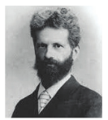

```hint { role="info" }
**கற்றல் நோக்கங்கள்**

இப்பாடத்தினைக் கற்போர்

- தாவரத் திசு வளர்ப்பு கருத்துக்களை உள்வாங்கிக் கொள்ளவும்

- தாவரத் திசு வளர்ப்பு தொழில்நுட்ப முறையையும், வகைகளையும் அறிந்துக்கொள்ளவும்

- புரோட்டோபிளாச வளர்ப்பை விரிவாகப் புரிந்துக்கொள்ளவும்

- செல் வளர்ப்பு மூலமாகக் கிடைக்கும் இரண்டாம்நிலை வளர்சிதைப் பொருள்களின் பட்டியிலை வெளிக்கொணரவும்

- தாவர மீளுருவாக்க வழிதடத்தை கற்கவும்

- நுண்பெருக்கம், உடலக் கலப்புறுத்தம், தண்டு ஆக்குத்திசு வளர்ப்பு, மரபணுவளக்கூறு பாதுகாத்தல் ஆகியவற்றின் பயன்களை உணரவும்

- காப்புரிமம், உயிரி பாதுகாப்பு மற்றும் உயிரி அறநெறி பற்றிய அறிவைப் பெறவும் இயலும்.


```

தாவரப் புரோட்டோபிளாஸ்ட்கள், செல்கள், திசுக்கள் அல்லது உறுப்புகளை அவற்றின் இயல்பான அல்லது சாதாரணச் சூழலில் இருந்து பிரித்தெடுத்துச் செயற்கையான சூழ்நிலையில் வளர்த்தலைத் திசு வளர்ப்பு என்கிறோம். இவை சோதனை கலத்தில் தாவரப் புரோட்டோபிளாஸ்ட்கள், செல்கள், திசுக்கள் மற்றும் உறுப்புகள் வளர்ப்பு என்றும் அழைக்கப்படும் [in vitro (லத்தீன்) – கண்ணாடி / சோதனை குழாயினுள்]. ஒரு தனிப் பிரிகூறு (Explant) குறுகிய காலத்திலும், இடத்திலும் கட்டுப்படுத்தப்பட்ட சூழ்நிலையில் பல்லாயிரக்கணக்கான தாவரங்களாகப் திசு பெருக்கமடைகிறது. வளர்ப்பு தொழில் நுட்பம் வணிக நோக்கில் தாவர உற்பத்தி மட்டுமின்றித் தாவர ஆராய்ச்சிகளுக்கும் தாவரத் பயன்படுகிறது. திசு வளர்ப்பு மரபணு மாற்றப்பட்ட தாவரங்களின் மீளுருவாக்கத்தில் தவிர்க்க முடியாத கருவியாகப் பங்காற்றுகிறது. இது தவிர்த்து,தாவரத் திசு வளர்ப்பின் சில முக்கியப் பயன்பாடுகளாக அரிய தாவரப் பெருக்கம், உயர்தர (elite varieties) தாவரங்களின் பாதுகாப்பு, வைரஸ் அற்ற தாவர உற்பத்தி, மரபணு வளக்கூறு பாதுகாத்தல், (Germplasm) தொழிற்சாலையில் இரண்டாம் நிலை வளர்ச்சிதை மாற்றப் பொருள்கள் உற்பத்தி மற்றும் பல உள்ளன. இந்தப் பாடத்தில் திசு வளர்ப்பின் வரலாறு, தொழில் நுட்பம், வகை, பயன்பாடு மற்றும் அறநெறி பிரச்சினைகளுக்கான விழிப்புணர்வு ஆகியன விவாதிக்கப்படுகின்றன.



ஜெர்மனி நாட்டுத் தாவரவியலார் காட்லிப் ஹேபர்லேண்ட் (1902) முழுஆக்குத் திறன் கருத்தை முன்மொழிந்தார். மேலும் அவர் வளர்ப்பு ஊடகத்தில் லேமியம் பர்பியூரியம் தாவர இலையிடைத் திசு செல்களைப் பயன்படுத்திச் செயற்கையான சூழலில் தாவரச் செல்களை முதன்முதலில் வளர்த்துப் பெருக்கமடைந்த செல்களைக் கிடைக்கப் பெற்றார். இவர் தாவரத் திசு வளர்ப்பின் தந்தையாகக் கருதப்படுகிறார்.