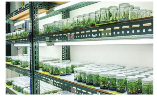
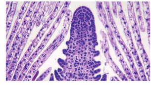
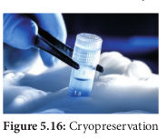

```hint { role="info" }
**கற்றல் நோக்கங்கள்**

இப்பாடத்தினைக் கற்போர்

- தாவரத் திசு வளர்ப்பு கருத்துக்களை உள்வாங்கிக் கொள்ளவும்

- தாவரத் திசு வளர்ப்பு தொழில்நுட்ப முறையையும், வகைகளையும் அறிந்துக்கொள்ளவும்

- புரோட்டோபிளாச வளர்ப்பை விரிவாகப் புரிந்துக்கொள்ளவும்

- செல் வளர்ப்பு மூலமாகக் கிடைக்கும் இரண்டாம்நிலை வளர்சிதைப் பொருள்களின் பட்டியிலை வெளிக்கொணரவும்

- தாவர மீளுருவாக்க வழிதடத்தை கற்கவும்

- நுண்பெருக்கம், உடலக் கலப்புறுத்தம், தண்டு ஆக்குத்திசு வளர்ப்பு, மரபணுவளக்கூறு பாதுகாத்தல் ஆகியவற்றின் பயன்களை உணரவும்

- காப்புரிமம், உயிரி பாதுகாப்பு மற்றும் உயிரி அறநெறி பற்றிய அறிவைப் பெறவும் இயலும்.


```

தாவரப் புரோட்டோபிளாஸ்ட்கள், செல்கள், திசுக்கள் அல்லது உறுப்புகளை அவற்றின் இயல்பான அல்லது சாதாரணச் சூழலில் இருந்து பிரித்தெடுத்துச் செயற்கையான சூழ்நிலையில் வளர்த்தலைத் திசு வளர்ப்பு என்கிறோம். இவை சோதனை கலத்தில் தாவரப் புரோட்டோபிளாஸ்ட்கள், செல்கள், திசுக்கள் மற்றும் உறுப்புகள் வளர்ப்பு என்றும் அழைக்கப்படும் [in vitro (லத்தீன்) – கண்ணாடி / சோதனை குழாயினுள்]. ஒரு தனிப் பிரிகூறு (Explant) குறுகிய காலத்திலும், இடத்திலும் கட்டுப்படுத்தப்பட்ட சூழ்நிலையில் பல்லாயிரக்கணக்கான தாவரங்களாகப் திசு பெருக்கமடைகிறது. வளர்ப்பு தொழில் நுட்பம் வணிக நோக்கில் தாவர உற்பத்தி மட்டுமின்றித் தாவர ஆராய்ச்சிகளுக்கும் தாவரத் பயன்படுகிறது. திசு வளர்ப்பு மரபணு மாற்றப்பட்ட தாவரங்களின் மீளுருவாக்கத்தில் தவிர்க்க முடியாத கருவியாகப் பங்காற்றுகிறது. இது தவிர்த்து,தாவரத் திசு வளர்ப்பின் சில முக்கியப் பயன்பாடுகளாக அரிய தாவரப் பெருக்கம், உயர்தர (elite varieties) தாவரங்களின் பாதுகாப்பு, வைரஸ் அற்ற தாவர உற்பத்தி, மரபணு வளக்கூறு பாதுகாத்தல், (Germplasm) தொழிற்சாலையில் இரண்டாம் நிலை வளர்ச்சிதை மாற்றப் பொருள்கள் உற்பத்தி மற்றும் பல உள்ளன. இந்தப் பாடத்தில் திசு வளர்ப்பின் வரலாறு, தொழில் நுட்பம், வகை, பயன்பாடு மற்றும் அறநெறி பிரச்சினைகளுக்கான விழிப்புணர்வு ஆகியன விவாதிக்கப்படுகின்றன.


ஜெர்மனி நாட்டுத் தாவரவியலார் காட்லிப் ஹேபர்லேண்ட் (1902) முழுஆக்குத் திறன் கருத்தை முன்மொழிந்தார். மேலும் அவர் வளர்ப்பு ஊடகத்தில் லேமியம் பர்பியூரியம் தாவர இலையிடைத் திசு செல்களைப் பயன்படுத்திச் செயற்கையான சூழலில் தாவரச் செல்களை முதன்முதலில் வளர்த்துப் பெருக்கமடைந்த செல்களைக் கிடைக்கப் பெற்றார். இவர் தாவரத் திசு வளர்ப்பின் தந்தையாகக் கருதப்படுகிறார்.

## திசு வளர்ப்பின் அடிப்படைக் கொள்கைகள்

தாவரத் திசு வளர்ப்பின் அடிப்படைக் கருத்துக்களாவன முழு ஆக்குத்திறன், வேறுபாடுறுதல், மறுவேறுபாடு அடைதல், வேறுபாடு இழத்தல் போன்றவையாகும்.

### முழு ஆக்குத்திறன் (Totipotency)

மரபியல் திறன்களைக் கொண்டுள்ள உயிருள்ள தாவரச் செல்களை ஊட்ட (கரைசல்) ஊடகத்தில் வளர்க்கும் போது அவை முழுத் தனித் தாவரமாக வளர்ச்சியடையும் பண்பே **முழு ஆக்குத்திறன்** எனப்படும்.

### வேறுபாடுறுதல் (Differentiation) 

செல்களில் உயிரி வேதியிய மற்றும் அமைப்பிய மாற்றங்கள் ஏற்படுத்தி அவற்றைச் சிறப்பான அமைப்பு மற்றும் பணியினை மேற்கொள்ளச் செய்தல்.


### மறுவேறுபாடுறுதல் (Redifferentiation)

ஏற்கனவே வேறுபாடுற்ற ஒரு செல் மேலும் வேறுபாடுற்று மற்றொரு செல்லாக மாற்றமடைதல். எடுத்துக்காட்டு: ஊட்டச் சத்து ஊடகத்தில் கேலஸ் திசுவின் செல்கூறுகள் முழுத்தாவர அமைப்பை உருவாக்கும் திறன் பெற்றுள்ளதை **மறுவேறுபாடுறுதல்** எனலாம்.

### வேறுபாடிழத்தல் (Dedifferentiation)

முதிர்ச்சி அடைந்த செல்கள் மீண்டும் ஆக்குத்திசுவாக மாறிக் கேலஸ் போன்ற திசுவை உருவாக்கும் நிகழ்ச்சி **வேறுபாடு இழத்தல்** என அழைக்கப்படுகிறது. உயிருள்ள தாவரச் செல்களின், திசுக்களின் வேறுபாடுறுதலும், வேறுபாடிழத்தலும் உள்ளார்ந்து ஒரு சேரக் காணப்பட்டால் அவை முழுஆக்குத்திறன் பெற்றதாகக் கருதப்படும்.

## தாவரத் திசு வளர்ப்பு (PTC)

தாவரத் திசு வளர்ப்பு என்பது ஆய்வு கூடச் சோதனை வளர்ப்பு முறை மற்றும் நுண்ணுயிர் நீக்கிய நிலையில் திசு வளர்ப்பு ஊடகத்தில் ஏதேனும் தாவரப் பகுதிகளை வளர்த்தல் என வரையறுக்கப்படுகிறது. இத்தொழில்நுட்பச் செயல்முறை மூன்று அடிப்படை நெறிமுறைகளைக் கொண்டுள்ளது.

- தேவையான தாவரப்பகுதி அல்லது அதன் பிரிகூறு தேர்வு செய்யப்பட்டு, பின்பு இதர உடலப் பகுதியிலிருந்து பிரித்தெடுக்கப்படுகிறது.

- இது கட்டுப்படுத்தப்பட்ட இயற்பியல் சூழ்நிலையிலும், வரையறுக்கப்பட்ட வேதியிய (ஊட்ட ஊடகம்) சூழலிலும் பராமரிக்கப்படுகிறது.

```hint { role="info" }

பிரிகூறு என்பது தேர்ந்தெடுக்கப்பட்ட தாவரத்தை
உருவாக்குவதற்கு வளர்ப்பு ஊடகத்தில் வைத்து
வளர்க்கத் தேவைப்படும் தாவரத் திசு.
```
### தாவரத் திசு வளர்ப்பிற்கான அடிப்படை ஆய்வக வசதிகள்

தாவரத் திசு வளர்ப்பிற்கு ஆய்வகம் பின்வரும் வசதிகளைக் கொண்டிருக்க வேண்டும் :

- கண்ணாடிக் கலன்களைக் கழுவுவதற்கான வசதி மற்றும் அவற்றை உலர்த்துவதற்கான நுண்ணலை அடுப்பு (oven) வசதி

- தன்னழுத்தக் கலன் (Autoclave), எலக்ட்ரானிய தராசு மற்றும் pH மீட்டருடன் கூடிய வளர்ப்பு ஊடகம் தயாரிப்பதற்கான அறை




- நுண்ணுயிர் நீக்கப்பட்ட அறை: இது ஒரு சீரடுக்கு காற்று பாய்வு அமைப்பும், உயர்திறன் துகள் காற்று (HEPA- High Efficiency Particulate Air) வடிப்பான் என்றழைக்கப்படும் அழுத்தக் காற்றோட்ட அலகும் உள்ளன. இவற்றின் வேலை நுண்ணுயிர் அற்ற ஒரு சூழலை உருவாக்குவதாகும்.

- வளர்ப்பு வசதி: பிரிகூறு வளர்ப்புக் குழாயில் பொதிக்கப்பட்டு 22-28°C வெப்ப நிலையிலும், 2400 லக்ஸ் ஒளிச்செறிவிலும், 8 – 16 மணி நேரம் ஒளிக்காலத்துவத்திலும், ஏறத்தாழ 60% ஈரப்பதத்திலும் வளர்க்கப்படுகிறது.

### தாவரத் திசு வளர்ப்பில் அடங்கியுள்ள அடிப்படைத் தொழில்நுட்பமுறை

#### நுண்ணுயிர் நீக்கம் (Sterilization)

நுண்ணுயிர் நீக்கம் என்பது வளர்ப்பு ஊடகம், வளர்ப்பு கலன்கள், பிரிகூறு போன்றவற்றிலிருந்து பாக்டீரியங்களையும், நுண்ணுயிர்களான பூஞ்சைகளையும் நீக்கும் தொழில்நுட்பம். 

i) **நுண்ணுயிர் நீக்கப்பட்ட நிலையைப் பராமரித்தல்**: ஆய்வகச் செயற்கை வளர்ப்பில் நுண்ணுயிர் நீக்கப்பட்ட நிலையைப் பராமரிக்கப் பின்வரும் பின்பற்றப்படுகின்றன. கண்ணாடிக் முறைகள் கலன்கள், இடுக்கி, கத்தி, அனைத்து உபகரணங்கள் ஆகியவை தன்னழுத்தக்கலனில் 15 psi (121°C வெப்பநிலை) அழுத்தத்தில், 15 – 30 நிமிடங்களுக்கு உட்படுத்தப்படுகிறது அல்லது 70% ஆல்கஹாலில் நனைக்கப்படுகிறது. இதைத் தொடர்ந்து வெப்பமூட்டலும் குளிர்வித்தலும் நடைபெற்று நுண்ணுயிர்நீக்கம் செய்யப்படுகின்றன.

ii) **வளர்ப்பு அறை நுண்ணுயிர் நீக்கம் செய்தல்**: முதலில் தரை மற்றும் சுவர்களைச் சோப்பு கொண்டும் பிறகு 2% சோடியம் ஹைப்போகுளோரைட் அல்லது 95% எத்தனால் கொண்டும் கழுவ வேண்டும். சீரடுக்கு காற்று பாய்வு அறையின் மேற்பரப்பு 95% எத்தனால் கொண்டு நுண்ணுயிர் நீக்கம் செய்யப்பட வேண்டும். பிறகு 15 நிமிடங்களுக்குப் புறஊதாக் கதிர் வீச்சிற்கு உட்படுத்தப்பட வேண்டும்.

iii) **ஊட்ட ஊடகத்தை நுண்ணுயிர் நீக்கம் செய்தல்**: வளர்ப்பு ஊடகம் கொண்டுள்ள கண்ணாடிக் கலனை ஈரம் உறிஞ்சாத பருத்தி அல்லது பிளாஸ்டிக் கொண்டு மூடி, தன்னழுத்தக்கலனில் 15 psi (121°C) ல் 15 – 30 நிமிடங்களுக்கு நுண்ணுயிர் நீக்கம் செய்யப்படுகிறது. தாவரச் சாறு, வைட்டமின்கள், அமினோ அமிலங்கள் மற்றும் ஹார்மோன்கள் ஆகியவை 0.2 µm துளை விட்டமுடைய மில்லிபோர் வடிகட்டி வழியாகச் செலுத்தப்பட்டு நுண்ணுயிர் நீக்கம் செய்யப்படுகின்றன. நுண்ணுயிர் நீக்கிய சீரடுக்கு காற்று பாய்வு அறையில் ஊடகம் நுண்ணுயிர் நீக்கிய வளர்ப்பு வைக்கப்படுகிறது.


iv) **பிரிகூறுக்கு நுண்ணுயிர் நீக்கம் செய்தல்**: திசு வளர்ப்பிற்குப் பயன்படும் தாவரப் பொருளை முதலில் ஓடுகின்ற குழாய் நீரில் வைத்து நுண்ணுயிர் நீக்கம் செய்யப்படுகிறது. அதற்குப் பின் 0.1% மெர்குரிக் குளோரைடு, 70% ஆல்கஹால் போன்றவற்றைப் பயன்படுத்தி நுண்ணுயிர் அற்ற நிலையில் சீரடுக்கு காற்று பாய்வு அறையில் புறப்பரப்பு நுண்ணுயிர் நீக்கம் செய்யப்படுகிறது.

#### ஊடகம் தயாரித்தல் (Preparation of culture medium)

திசு வளர்ப்பின் வெற்றி, வளர்ப்பு ஊடகத்தின் கூறுகள், தாவர வளர்ச்சி சீரியக்கிகள், வெப்பநிலை, pH, ஒளி மற்றும் ஈரப்பதம் போன்றவற்றைப் பொறுத்து அமையும். எந்தத் தனி ஊடகமும் அனைத்துத் தாவரத் திசுவின் உகந்த வளர்ச்சிக்கு உகந்ததல்ல. திசு வளர்ப்பு நெறிமுறைக்கேற்பத் தகுந்த ஊட்ட ஊடகம் தயாரிக்கப்பட்டுப் பயன்படுத்தப்படுகிறது.

MS ஊட்ட ஊடகம் (முராஷிகி மற்றும் ஸ்கூஜ் 1962) பொதுவாகப் தாவரத் திசு வளர்ப்பில் பயன்படுத்தப்படுகிறது. இது தகுந்த வைட்டமின்கள் மற்றும் ஹார்மோன்களுடன் தகுந்த கார்பன் மூலங்களையும் கொண்டுள்ளன. MS ஊடகத்தைத் தவிரத் தாவரத் திசு வளர்ப்பிற்காக B5 ஊடகம் (கேம்போர்க் குழுவினர் 1968), ஒயிட் ஊடகம் (ஒயிட் 1943) நிட்ச் ஊடகம் (நிட்ச் மற்றும் நிட்ச் 1969) போன்றவை உள்ளன. ஒரு ஊடகம் திட, பகுதிதிட அல்லது நீர்ம நிலையில் இருக்கலாம். ஊடகத்தைத் திடப்படுத்துவதற்குக் கூழ்மக் காரணியான அகார் சேர்க்கப்படுகிறது.

**அகார்**: ஊடகத் தயாரிப்பில் திடநிலைபடுத்துவதற்கு பயன்படுத்தப்படும் கடல் பாசிகளிலிருந்து (Sea weeds) கிடைக்கும் ஒரு சிக்கலான மியூசிலேஜ் (mucilagenous) பாலிசாக்காரைடுகளாகும்.


#### வளர்ப்பு சூழல்

**pH** 

சிறந்த முடிவினைப் பெறுவதற்கு ஊடகத்தின் pH ஐ 5.6 முதல் 6.0 வரை வைக்க வேண்டும்.

**வெப்பநிலை**

இவ்வளர்ப்பிற்கு 25°C ± 2°C நிலையான வெப்பநிலை உகந்தது.

**ஈரப்பதம் மற்றும் ஒளிச்செறிவு**

50 – 60 % ஒப்பு ஈரப்பதமும், தோராயமாக 1000 லக்ஸூம், 16 மணி ஒளிக்காலத்துவமும் வளர்ப்பதற்குத் தேவைப்படுகின்றன.

**காற்றோட்டம்**

சோதனைக் குழாய் அல்லது குடுவையில் காற்றோட்டம் தானியங்கி குலுக்கியின் மூலம் கொடுக்கப்படுகிறது. இது காற்று வடிகட்டி மூலம் நுண்ணுயிரி நீக்கப்பட்டு ஊடகத்தில் செலுத்தப்படுகிறது.
#### கேலஸ் தூண்டப்படுதல் (Induction of callus)


**கேலஸ்**:

தேர்ந்தெடுக்கப்பட்ட இலை, தண்டு, கிழங்கு மற்றும் வேரின் 1 – 2 செ.மீ நோய் கிருமி நீக்கப்பட்ட துண்டுகளின் பிரிகூறுகள் ஆக்ஸின் கூடுதலாகச் சேர்க்கப்பட்ட MS ஊட்டக் கரைசலில் வைக்கப்படுகிறது. இவை 25°C ± 2°C வெப்பநிலையில் 12 மணி நேரம் ஒளி மற்றும் 12 மணி நேரம் இருள் என மாறி மாறி வைக்கப்படும் பொது செல் பிரிதல் தூண்டப்பட்டுப் பிரிகூறின் மேற்பரப்பில் கேலஸ் வளர்ச்சி நடைபெறுகிறது. கேலஸ் என்பது ஆய்வுகூடச் சோதனை வளர்ப்பு ஊடகத்தில் தாவரச் செல்கள் அல்லது திசுக்களின் முறையற்ற வளர்ச்சி ஆகும்.

#### கருவுருவாக்கம் (Embryogenesis)

கேலஸ் செல்கள் வேறுபாடுகளுக்கு உள்ளாகி உடலக் கருக்களை உருவாக்குகின்றன. இவை **கருவுருக்கள்** (Embryoids) எனப்படும். இந்தக் கருவுருக்களை துணை வளர்ப்பிற்கு உட்படுத்தி **நாற்றுருக்கள்** (Plantlets) உற்பத்தி செய்யப்படுகின்றன.


#### வன்மையாக்குதல் (Hardening)

ஆய்வகச் சோதனை முறையில் வளர்க்கப்பட்ட நாற்றுருக்களுக்கு வலிமை பெறும் காலம் தேவைபடுவதால் அவை பசுமை இல்லம் அல்லது வன்மையாக்கி அறைக்கும், பின்னர் இயற்கை சூழலுக்கும் மாற்றப்படுகின்றன. வன்மையாக்குதல் என்பது ஆய்வகச் சோதனை முறையில் ஈரப்பதமான அறையில் உருவாக்கப்பட்ட நாற்றுருக்களை ஒளியின் இயற்கையான களச் சூழலில் வளர்வதற்கு ஏற்ப படிப்படியாக வெளிக்கொணர்தல் ஆகும்.

### திசு வளர்ப்பின் வகைகள்

பிரிகூறு அடிப்படையில் தாவரத் திசு வளர்ப்பின் வகைகளாவன

1. உறுப்பு வளர்ப்பு

2. ஆக்குத் திசு வளர்ப்பு

3. புரோட்டோபிளாஸ்ட் வளர்ப்பு

4. செல் மிதவை வளர்ப்பு

#### உறுப்பு வளர்ப்பு

வளர்ப்பு ஊடகத்தில் கருக்கள், மகரந்தப் பை, சூலகப்பை, வேர்கள், தண்டு அல்லது தாவரத்தின் பிற உறுப்புகளை வளர்த்தல்.


The culture of embryos, anthers, ovaries, roots, shoots or other organs of plants on culture media.

#### ஆக்குத் திசு வளர்ப்பு 

வளர்ப்பு ஊடகத்தில் தாவரத்தின் ஆக்குத் திசுவை வளர்த்தல்.


#### புரோட்டோபிளாஸ்ட் வளர்ப்பு

புரோட்டோபிளாஸ்ட் என்பது செல் சுவரற்ற, ஆனால் செல்சவ்வு அல்லது பிளாஸ்மா சவ்வினால் சூழப்பட்ட செல் அமைப்பாகும். புரோட்டோபிளாஸ்ட்டை பயன்படுத்தி ஒற்றைச் செல்லிலிருந்து முழுத் தாவரத்தை மீளுருவாக்கம் செய்ய இயலும் மற்றும் உடலக் கருக்களை உருவாக்க முடியம். புரோட்டோபிளாஸ்ட் வளர்ப்பில் அடங்கியுள்ள படிநிலைகள்


i) **புரோட்டோபிளாஸ்ட்டை பிரித்தெடுத்தல்**: இலைத் திசு போன்ற தாவரத் திசுவின் சிறு பகுதி புரோட்டோபிளாஸ்ட் பிரித்தெடுப்பதற்காகப் பயன்படுத்தப்படுகிறது. pH 5.4 நிலையில் 0.5% மேசரோசைம் மற்றும் 13% சார்பிட்டாலில் அல்லது மானிட்டாலில் கரைந்துள்ள 2% ஒனோசுகா செல்லுலேஸ் நொதியில் இலைத் திசுக்களின் சிறு துண்டுகளை மூழ்கி இருக்குமாறு வைக்கப்படுகிறது. இவற்றை 25°C வெப்பநிலையில் இரவு முழுவதும் வைத்துப் பிறகு மென்மையாகச் செல்களைத் தனிமைபடுத்தும் (teasing) போது புரோட்டோபிளாஸ்ட்கள் பெறப்படுகின்றன. இவ்வாறு பெறப்பட்ட புரோட்டோபிளாஸ்ட் அதன் உயிர்ப்புத் தன்மையை நிலை நிறுத்த 20% சுக்ரோஸ் கரைசலுக்கு மாற்றப்படுகிறது. பிறகு மையவிலக்கிக்கு உட்படுத்தப்பட்டுச் செல் சுவரிலிருந்து பிரித்தெடுக்கப்பட்ட தூய புரோட்டோபிளாஸ்ட்கள் பெறப்படுகின்றன. 

ii) **புரோட்டோபிளாஸ்ட் இணைவு** : புரோட்டோபிளாஸ்ட் தகுந்த இணைவு காரணியால் இணைவு நிகழ்த்தப்படுகிறது. இது பொதுவாகப் பாலிஎத்திலீன் (PEG) நிகழ்கிறது. கிளைக்கால் மூலம் பிரித்தெடுக்கப்பட்ட புரோட்டோபிளாஸ்ட் 25% முதல் 30% செறிவுள்ள பாலிஎத்திலீன் கிளைக்கால் மற்றும் Ca++ அயனியில் வைக்கும் போது இணைவு ஏற்படுகிறது.

iii)**புரோட்டோபிளாஸ்ட்டுகள் வளர்ப்பு** : புரோட்டோபிளாஸ்ட்கள் சில மாற்றங்கள் செய்யப்பட்ட MS வளர்ப்பு ஊடகத்தின் நுண் துளி, தட்டு அல்லது நுண் துளி வரிசை (array) முறையில் வளர்க்கப்படுகின்றன . புரோட்டோபிளாஸ்ட்டை வளர்ப்பதற்கு முன்பாக ஃப்ளூரசின் டைஅசிட்டேட்டைக் கொண்டு அதன் உயிர்ப்புத் திறன் சோதிக்கப்படுகிறது. பிறகு வளர்ப்பானது தொடர்ந்து 25°C வெப்பநிலையில், 1000 முதல் 2000 லக்ஸ் ஒளிச் செறிவில் வைக்கப்படுகிறது. 24 – 48 மணி நேரத்தில் செல் சுவர் தோற்றமும், 2 முதல் 7 நாட்களுக்கிடையே முதல் செல் பிரிதலில் புதிய செல் தோற்றமும் வளர்ப்பு ஊடகத்தில் நிகழ்கிறது. 

**iv.உடல் கலப்பினச் செல்களைத் தேர்ந்தெடுத்தல்** : உட்கரு அற்ற வேறுபட்ட செல்களின் புரோட்டோபிளாஸ்ட்டை இணைத்துப் பெறப்படுவது **சைபிரிட்** (cybrid) என அழைக்கப்படுகிறது. இதன் பின்பு உட்கரு இணைவு நடைபெறுகிறது. இந்த நிகழ்வானது **உடல் கலப்பினமாக்கல்** (somatic hybridization) என அழைக்கப்படும்.

#### செல் மிதவை வளர்ப்பு (Cell suspension Culture) 

ஆய்வுக்கூடச் சோதனை முறையில் சில தனிச் செல்களையோ அல்லது செல் தொகுப்பையோ நீர்ம ஊடகத்தில் வளர்க்கும் முறை செல் மிதவை வளர்ப்பு எனப்படுகிறது.

மேலும், சுழற்சி கலக்கி கருவியைப் பயன்படுத்திக் கிளர்வூட்டப்பட்ட (agitated) கேலஸின் ஒரு பகுதியை நீர்ம ஊடகத்திற்கு மாற்றுவதன் மூலம் செல் மிதவை தயாரிக்கப்படுகிறது. கேலஸ் திசுவின் செல்கள் தனிமைபடுத்தப்பட்டு செல் மிதவை வளர்ப்பிற்குப் பயன்படுத்தப்படுகிறது.

**இரண்டாம் நிலை வளர்சிதை மாற்றப் பொருள்கள் உற்பத்தி :**

செல் மிதவை வளர்ப்பின் மூலமாக இரண்டாம் வளர்சிதை மாற்றப் பொருள்களான நிலை ஆல்கலாய்டுகள், ஃபிளேவினாய்டுகள், டெர்பினாய்டுகள், ஃபீனால் கூட்டுப் பொருள்கள், மறுகூட்டிணைவுப் புரதங்கள் போன்ற பொருள்களை உருவாக்கலாம். பொதுவாக, இரண்டாம் நிலை வளர்சிதைப் பொருள்கள் வேதியப் பொருள்களாகவும், தாவர வளர்ச்சிக்குத் தேவைப்படாமலும் உள்ளன. ஆனால் தாவரங்களின் செல் வளர்சிதைமாற்றத்தின் போது உபபொருள்களாக இவை உருவாக்கப்படுகின்றன. எடுத்துக்காட்டாக, ரோசியஸ் கேதராந்தஸ் தாவரத்தின் செல் வளர்ப்பிலிருந்து இண்டோல் ஆல்கலாய்டுகள் உயிரிஉற்பத்தி மூலம் பிரித்தெடுக்கப்படுகிறது.

வணிக உற்பத்திக்காக உயிரிகலன்களைப் இரண்டாம் நிலை வளர்சிதைப் பயன்படுத்தி பொருள்களின் உற்பத்தி செயல்முறைகளைத் தானியங்கி முறையில் அளவிடலாம். அதிகத் திறனுடைய இரண்டாம்நிலை வளர்சிதை பொருள்கள் உற்பத்தியைச் செல் மிதவை வளர்ப்பின் மூலம் மேற்கொள்வதற்குச் சில உத்திகளான உயிரிசார் நிலை மாற்றம் (Bio transformation) வளர்ச்சிதை மாற்றப் பொருள் தூண்டல் (Elicitation) மற்றும் முடக்க வளர்ப்பு (immobilization) போன்றவை பயன்படுத்தப்படுகின்றன. தொழிற்துறை முக்கியத்துவம் வாய்ந்த இரண்டாம் நிலை வளர்சிதை மாற்றப் பொருள்கள் கீழ்காணும் அட்டவணையில் கொடுக்கப்பட்டுள்ளன.

| இரண்டாம்நிலை வளர்சிதைப் பொருள்கள் 	| தாவரங்கள்                     	| பயன்கள்                  	|
|-----------------------------	|-----------------------------	|------------------------	|
| டிஜாக்ஸின்                    	| டிஜிடாலிஸ் பர்புரியா          	| இதயத்திற்கு மருந்து       	|
| கோடின்                       	| பப்பாவர் சாம்னிபெரம்            	| வலி நிவாரணி            	|
| கேப்சைசின்                    	| கேப்சிகம் அனுவம்               	| வாதவலியை குணப்படுத்த     	|
| வின்கிரிஸ்டைன்                 	| கேத்தராந்தஸ் ரோசியஸ்            	| புற்றுநோய்க்கு எதிர்மருந்து 	|
| குவினைன்                     	| சின்கோனா மலேரியா அஃபிசினாலிஸ் 	| மலேரியா எதிர்மருந்து     	|

## தாவரங்களின் மீளுருவாக்க வழித்தடம்

பிரிகூறுவிலிருந்து உடல் கருவுருவாக்கம் அல்லது உறுப்புகளாக்கம் மூலம் தாவரங்கள் மீளுருவாக்கம் செய்யப்படுகிறது.


 

### உடல் கருவுருவாக்கம்

கேலஸ் திசுவிலிருந்து நேரடியாகக் கரு உருவாதலுக்கு உடல் கருவுருவாக்கம் என்று பெயர். இக்கருக்கள் உடல்கருக்கள் அல்லது கருவுருக்கள் என்று அழைக்கப்படுகின்றன. 

கருவுருக்கள் அல்லது ஆய்வுக்கூடச் சோதனை முறை வளர்ப்பு செல்களிலிருந்து நேரடியாக முன் கரு செல்கள் வளர்ந்து கருவுருக்களாக வேறுபாடு அடைகின்றன.

**பயன்பாடுகள்** 

- உடல் கருவுருவாக்கம் திறன்மிக்க நாற்றுருக்களை வழங்கி, பின்னர் வன்மையாக்கத்திற்குப் பின்பு முழுத் தாவரங்களைக் கொடுக்கிறது.

- செயற்கை விதைகள் உற்பத்திக்கு உடல் கருக்கள்
பயன்படுத்தப்படுகின்றன.

- அல்லியம் சட்டைவம், ஹார்டியம் வல்கேர், ஒரைசா சட்டைவா, சியா மெய்ஸ் போன்ற பல தாவரங்களில் உடல் கருவுருவாக்கம் தற்போது கண்டறியப்பட்டுள்ளது. மேலும், இம்முறை எவ்வகை தாவரத்திலும் சாத்தியமாகும்.

அகரோஸ் இழுமம் அல்லது கால்சியம் ஆல்ஜினேட் கொண்டு கருவுருக்களை உறையிட்டுச் செயற்கை விதைகள் உற்பத்தி செய்யப்படுகின்றன.

### உறுப்புகள் உருவாக்கம்

கேலஸில் காணப்படும் புறத்தோற்ற மாறுபாடுகளின் காரணமாக அதிலிருந்து தண்டு மற்றும் வேர் உருவாக்கத்திற்கு **உறுப்புகள் உருவாக்கம்** என்று பெயர்.

- MS ஊடகத்தில் தாவர வளர்ச்சி சீரியக்கிகளைச்
சேர்ப்பதனால் ஆய்வுக்கூடச் சோதனை முறையில்
உறுப்புகளின் உருவாக்கம் தூண்டப்படுகிறது.

- ஆக்சின் மற்றும் சைட்டோகைனின் தண்டு மற்றும்
வேர் உருவாக்கத்தைத் தூண்டுகின்றன.

## தாவரத் திசு வளர்ப்பின் பயன்பாடுகள்

தாவரத் திசு வளர்ப்பு பல்வேறு பயன்பாடுகளைக் கொண்டுள்ளது.

i.உடல் கலப்பினமாதல் மூலம் மேம்பட்ட கலப்புயிரிகள் உற்பத்தி செய்யப்படுதலுக்கு உடல் கலப்புயிரியாக்கம் என்று பெயர்.

ii.	உறை சூழப்பட்ட கருக்கள் அல்லது செயற்கை விதைகள் தாவரங்களின் உயிரிப்பன்மத்தைப் பாதுகாக்க உதவுகிறது.

iii.	ஆக்குத் திசு மற்றும் தண்டு நுனி வளர்ப்பின் மூலம் நோய் எதிர்ப்பு தாவரங்களை உற்பத்தி செய்தல்.

iv.	களைக்கொல்லி சகிப்புத்தன்மை, வெப்பச் சகிப்புத்தன்மை கொண்ட தாவரங்கள் போன்ற அழுத்தத்தை (இறுக்கத்தை) எதிர்க்கக் கூடிய தாவரங்களின் உற்பத்தி.

v.	வருடம் முழுவதும் குறைந்த காலத்தில் பயிர் மற்றும் வனத்திற்குப் பயன்படும் மரச் சிற்றினங்கள் அதிக எண்ணிக்கையிலான நாற்றுருக்கள் நுண்பெருக்க தொழில்நுட்பம் மூலம் கிடைக்கின்றன.

vi.	செல் வளர்ப்பில் இருந்து உற்பத்தி செய்யப்படும் இரண்டாம்நிலை வளர்சிதை மாற்றப் பொருள்கள் மருந்து உற்பத்தி, அழகு சாதனப் பொருள்கள் மற்றும் உணவு தொழிற்சாலைகளில் பயன்படுத்தப்படுகின்றன.

**உடல் நகல்சார் வேறுபாடு** (Somaclonal Variation) ஆய்வுக்கூடச் சோதனை வளர்ப்பிலிருந்து உருவாகும் தாவர மீள் உருவாக்கத்தில் மூலத்தாவரத்திலிருந்து சில வேறுபாடுகள் காணப்படுகின்றன. இந்த வேறுபாடுகள் இலை, தண்டு, வேர், கிழங்கு , இனப்பெருக்க வித்து (propagule) ஆகியவற்றில் காணப்படுகின்றன.

**கேமீட்டக நகல்சார் வேறுபாடு** (Gametoclonal Variation) ஆய்வுக்கூடச் சோதனை வளர்ப்பின் போது கேமீட்களிலிருந்து உருவாகும் கேமீட்டகத் தாவர மீள் உருவாக்கத்தில் வேறுபாடுகள் காணப்படுகின்றன. (கேமீட்டிலும், கேமீட்டகத் தாவரத்திலும் காணப்படும் வேறுபாடு)

### வாழையில் நுண்பெருக்கம் (Micropropagation in banana)

தொழிற்துறை அளவில் தாவர நுண்பெருக்கம் அன்னாசி, வாழை, ஸ்ட்ராபெர்ரி, உருளைக்கிழங்கு போன்ற தாவரங்களில் அதிக நிலையான ஒத்த மரபியல் தன்மை பராமரிக்கப்படுவதற்கு உதவுகிறது.


### செயற்கை விதைகள் (Artificial seeds or Synthetic seeds)

ஆய்வுக்கூடச் சோதனை வளர்ப்பு மூலம் கிடைக்கக் கூடிய கருவுருக்களைப் பயன்படுத்திச் செயற்கை விதைகள் உற்பத்தி செய்யப்படுகிறது. இவை தாவரத்தின் எந்த ஒரு பகுதியிலிருந்து எடுக்கக்கூடிய தனிச் செல்களிலிருந்தும் பெறப்படலாம். இந்தச் செல்கள் பின்பு பகுப்படைந்து அடர்த்தியான சைட்டோபிளாசத்தையும், பெரிய உட்கருவையும், தரச மணிகளையும், புரதங்களையும், எண்ணெய்களையும் கொண்டிருக்கும். செயற்கை விதைகள் தயாரிப்பதற்கு அகரோஸ் மற்றும் சோடியம் ஆல்ஜினேட் போன்ற மந்தமான பொருள்கள் கருவுருக்களின் மீது பூசப்படுகின்றன.


**செயற்கை விதைகளின் நன்மைகள் :** 

செயற்கை விதைகள் உண்மை விதைகளைக் காட்டிலும் பல நன்மைகளைப் பெற்றுள்ளன. 

- குறைந்த செலவில் எந்தக் காலத்திலும் மில்லியன் கணக்கான செயற்கை விதைகளை உற்பத்தி செய்யலாம்.

- விரும்பிய பண்புகளைக் கொண்ட மரபணு மாற்றப்பட்ட தாவரங்களை இம்முறையில் எளிதாக உருவாக்கலாம்.

- தாவரங்களின் மரபணுசார் வகைய விகிதத்தை எளிதாகச் சோதனை செய்யலாம்.

- உறைகுளிர்பாதுகாப்பு முறையில் செயற்கை விதைகளை நீண்ட நாட்களுக்குத் திறன் மிக்கவையாகச் சேமித்து வைக்கலாம்.

- செயற்கை விதைகள் மூலமாக உருவொத்த தாவரங்களை உருவாக்கலாம்.

- செயற்கை விதைகளில் விதை உறக்கக் காலம் பெருமளவில் குறைக்கப்பட்டுள்ளது. இதனால் குறுகிய வாழ்க்கை சுழற்சியுடன் கூடிய வேகமான வளர்ச்சியைப் பெற்றுள்ளது.


### வைரஸ் அற்ற தாவரங்கள்

நிலத்தில் வளரக்கூடிய பயிர்கள் போன்ற பல்லாண்டு தாவரங்களில் பூஞ்சை, பாக்டீரியங்கள் , மைக்கோபிளாஸ்மா, வைரஸ் போன்ற பல்வேறு நோய்க்காரணிகளின் தோற்றலினால் பொதுவாகக் குறிப்பிடத்தக்க அளவு பொருளாதார இழப்பு ஏற்படுகிறது. பூஞ்சை, பாக்டீரியங்கள் போன்றவற்றை வேதியியல் முறையினால் கட்டுப்படுத்தலாம். என்றாலும் வைரஸ்கள் பொதுவாக வேதியியல் கட்டுப்பாட்டிற்கு உட்படுவதில்லை.



வைரஸ் அற்ற தாவரங்களின் உற்பத்திக்குத் தண்டு நுனி ஆக்குத் திசு வளர்ப்பு ஒரு முறையாகும். தண்டு நுனியின் ஆக்குத் திசு எப்போதும் வைரஸ் அற்றதாக உள்ளது.

## தாவர மரபணுசார் வளங்களைப் பாதுகாத்தல்
### மரபணுவளக்கூறைப் (Germplasm) பாதுகாத்தல்:

மரபணுவளக்கூறு பாதுகாத்தல் என்பது பயிர் பெருக்க நோக்கத்திற்காக உயிருள்ள நிலையில் தாவரப் பொருள்களான மகரந்தம், விதைகள் அல்லது திசுக்கள் போன்றவற்றைப் பராமரித்துப் பாதுகாப்பதாகும். மேலும் இவை பல்வேறு ஆராய்ச்சி பணிகளுக்குப் பயன்படுத்தப்படுகின்றன.

மரபணுவளக்கூறுகளைப் பாதுகாத்தல் என்பது சேகரிக்கப்பட்ட விதைகள் மற்றும் மகரந்தத்தின் ஒரு பகுதியை விதைவங்கி அல்லது மகரந்த வங்கியில் சேமித்தல் ஆகும். இதனால் அவற்றின் உயிர்ப்புத் தன்மை மற்றும் வளத்தன்மை பாதுக்காக்கப்பட்டு பிறகு கலப்பினமாக்கம் மற்றும் பயிர் பெருக்கத்திற்குப் பயன்படுத்தப்படுகின்றன. மரபணுவளக்கூறு பாதுகாத்தலில் மரபணு வங்கி, DNA வங்கி போன்றவை ஈடுபடுத்தப்படுகின்றன. இந்த மரபணுக்களும், DNA வும் உயர்ந்த, மேம்படுத்தப்பட்ட தாவர மூலங்களிலிருந்து எடுக்கப்பட்டு இந்த வங்கிகளில் உயிரிபன்ம பேணலுக்கும், உணவுப் பாதுகாப்பிற்கும் பயன்படுத்தப்படுகின்றன.


### உறைகுளிர்பாதுகாப்பு (Cryopreservation) (-196° C)

உறைகுளிர்பாதுகாப்பு என்பதை உறை குளிர் வெப்பநிலை பாதுகாப்பு பேணல் (Cryoconservation) எனவும் அழைப்பர். இம்முறையில் சிதைவுக்கு உட்பட்டுள்ள அல்லது சிதைவடைகின்ற புரோட்டோபிளாஸ்ட்கள், செல்கள், திசுக்கள், செல் நுண்ணுறுப்புகள் , (உறுப்புகள், செல்லுக்கு வெளியே உள்ள பொருள்கள், நொதிகள் அல்லது பிற உயிரிப் பொருள்கள்) -196°C திரவ நைட்ரஜனைப் பயன்படுத்தி மிகக் குறைந்த வெப்பநிலையில் குளிர வைத்து பதப்படுத்துதல் உறைகுளிர்பாதுகாப்பு என்று அழைக்கப்படுகிறது



தீவிர குறைந்த வெப்பநிலையில் உயிர் பொருள்களின் ஏதேனும் ஒரு நொதியின் செயல்பாடு அல்லது வேதிய செயல்பாடுகள் முழுவதுமாக நின்றுவிடுகின்றன. இதன் விளைவாகப் பொருள்கள் உறக்கநிலையில் பதப்படுத்தப்படுகின்றன. பிறகு மற்ற பரிசோதனை பணிக்காக மெதுவாக அறை வெப்பநிலைக்குக் கொண்டு வரப்படுகின்றன. உறைகுளிர்பாதுகாப்பு செயல்முறைக்கு முன்பாகத் தாவரப் பொருள் தயாரித்தல் பாதுகாப்பு காரணிகளான டை மெத்தில் சல்ஃபாக்சைடு, கிளிசரால் அல்லது சுக்ரோஸ் ஆகியன சேர்க்கப்படுகின்றன. இத்தகைய பாதுகாப்பு காரணிகள் உறைகுளிர்பாதுகாப்பு செயல் பாதுகாப்பான்கள் என்று அழைக்கப்படுகின்றன. இந்த பாதுகாப்பு காரணிகள் தீவிர குளிர் விளைவுகளில் இருந்து செல்கள் அல்லது திசுக்களை பாதுகாக்கின்றன.

## அறிவுசார் சொத்துரிமை (IPR)

அறிவுசார் சொத்துரிமை என்பது ஒரு வகை சொத்து ஆகும். இது பிரித்தறிய முடியாத மனித அறிவின் படைப்புகள், பதிப்புரிமம், காப்புரிமம், மற்றும் வணிக முத்திரை ஆகியவற்றை முதன்மையாக உள்ளடக்கியது. மேலும் இது பிற வகை உரிமைகளான வணிக ரகசியங்கள், விளம்பர உரிமைகள், தார்மீக உரிமைகள் மற்றும் நேர்மையற்ற போட்டிகளுக்கு எதிரான உரிமைகள் ஆகியவற்றை உள்ளடக்கியது.

- உயிரிதொழில் நுட்பவியலில், வணிக உற்பத்திக்காக மாற்றப்பட்ட நுண்ணுயிர்கள், தாவரங்கள் மற்றும் தொழில்நுட்பங்கள் கண்டுபிடிப்பாளர்களுக்கே உரிய சொத்தாகும்.

- கண்டுபிடிப்பாளர்களுக்கு அவருடைய சொத்தில் முழு உரிமை உள்ளது. அதை மற்றவர்கள் சட்ட அனுமதியில்லாமல் புறக்கணிக்க முடியாது.

- கண்டுபிடிப்பாளர்களின் உரிமைகள் ஒரு நாட்டில் உருவாக்கப்பட்ட சட்டங்களினால் பாதுகாக்கப்படுகின்றன.

- அறிவுசார் சொத்துரிமை பல்வேறு வழிகளில் அதாவது காப்புரிமம், வணிக ரகசியம், வணிக முத்திரை, வடிவமைப்பு மற்றும் புவிசார் குறியீடுகள் ஆகியவற்றால் பாதுகாக்கப்படுகிறது.


### காப்புரிமம்

- காப்புரிமம் என்பது கண்டுபிடிப்பவருக்கு / உருவாக்கப்பட்டவருக்கு ஒரு சிறப்பு உரிமை ஆகும். இது புதிய பொருள்களை வணிகம் செய்வதற்காகச் சட்டங்கள் மூலம் அரசால் வழங்கப்படுகிறது.

- ஒரு காப்புரிமம் தனிப்பட்டச�ொத்தாகும் இதனை ஒரு தனி மனிதர் (அல்லது) நிறுவனம் வேறு எந்தச் சொத்து போன்றே வாடகைக்கு விடலாம் அல்லது விற்கலாம்.

- காப்புரிமம் என்ற சொல் மற்றவர்களைத் தவிர்த்துக் கண்டுபிடிப்பவர்களுக்கு அவர்களின் கண்டுபிடிப்புகளைத் தயாரித்தல், பயன்படுத்துதல் மற்றும் விற்பனை செய்தலுக்கு உரிய உரிமையைக் கொடுக்கிறது.

- சில உருவாக்கங்களுக்கு அவற்றின் ரகசியத்தைக் காப்பது கடினம். எனவே தகுதி வாய்ந்த காப்புரிம வழக்கறிஞர் மூலம் வழிக்காட்டுதல் பெறப்படுகிறது. காப்புரிமம் மூன்று பகுதிகளைக் கொண்டுள்ளது. அவை அனுமதி, விவரக் குறிப்பு மற்றும் உரிமை கோருதல் ஆகும்.

- **அனுமதி** (Grant) : காப்புரிம அனுமதி விண்ணப்பம் காப்புரிம அலுவலகத்தில் நிரப்பப்படுகிறது. இவை வெளியிடப்படுவதில்லை. இவை கையொப்பமிடப்பட்ட ஆவணங்களாகும்.உண்மையில் இது உருவாக்குபவருக்கு கொடுக்கப்படும் காப்புரிமை அனுமதி ஒப்பந்தம் ஆகும்.
- **விவரக் குறிப்பு** (Specification) : விவரக் குறிப்புகள் மற்றும் உரிமை கோருதல் ஒற்றை ஆவணமாக வெளியிடப்படுகிறது. அவை பொது மக்களுக்கும் காப்புரிம அலுவலகத்திற்கும் இடையில் மேற்கொள்ளப்படுகிறது. விவரக் குறிப்பு பகுதியில் உருவாக்கத்தின் விவரிப்பும், எவ்வாறு உருவாக்கம் மேற்கொள்ளப்பட்டது என்பதும் தொகுக்கப்பட்டிருக்கும்.

- **உரிமை கோருதல் பகுதி** (Claim) : இதில் உருவாக்கத்தின் எந்த நோக்கம் பாதுகாக்கப்பட வேண்டுமோ அது காப்புரிமத்தால் குறிப்பாக வரையறுக்கப்படுகிறது. இந்த நோக்கம் மற்றவர்களால் நடைமுறைப்படுத்த முடியாததாகும்.

### உயிரி பாதுகாப்பு மற்றும் உயிரி அறநெறி

உயிரிதொழில்நுட்பவியலின் மேம்பாடு மட்டுமின்றி அவற்றின் பயன்பாடுகள் பற்றி அதிகக் கருத்து வேறுபாடுகள் உள்ளன. ஏனெனில், நவீன உயிரிதொழில்நுட்பவியலின் பெரும்பாலான பகுதிகள் மரபணு கையாளுதலுடன் தொடர்புடையன. ELSI (Ethical, Legal, Social and Implications) என்பது உயிரிதொழில்நுட்பவியலின் அகன்ற அறநெறி, சட்ட மற்றும் சமுதாயப் பிரச்சினைகளின் விளைவுகள் தொடர்பானதாகும். இது உயிரிதொழில்நுட்ப அறிவியலுக்கும் சமுதாயத்திற்குமிடையே உள்ள அறநெறி மற்றும் சட்டப்பூர்வமான கூறுகள் பற்றிய தொடர்பை உள்ளடக்கியது.

#### உயிரி பாதுகாப்பு (Biosafety):

உயிரி ஒருங்கிணைந்த தன்மையின் பெரியளவு இழப்பைத் தடுப்பது தான் உயிரி பாதுகாப்பாகும். இதில் சூழ்நிலையியலும், மனித உடல்நலமும் கவனத்தில் எடுத்துக் கொள்ளப்படுகின்றன. இந்தத் தடுப்பு செயல்முறைகள் ஆய்வகச் சூழலில் உயிரி பாதுகாப்பு பற்றிய தொடர் மீளாய்வு செய்தலையும் பின்பற்ற வேண்டிய கடுமையான வழிகாட்டுதல்களையும் உள்ளடக்கியுள்ளன. உயிரி பாதுகாப்பு தீங்கு நிறைந்த நிகழ்வுகளிலிருந்து மக்களைப் பாதுகாப்பதற்குப் பயன்படுகிறது. உயிரி தீங்கு விளைவிக்கும் பொருள்களை (biohazards) கையாளும் பல ஆய்வகங்களில், தொடர்ந்து செயல்படும் தீங்கு மேலாண்மை மதிப்பீடு மற்றும் உயிரி பாதுகாப்பை உறுதி செய்யும் நடைமுறைகளையும் மேற்கொள்கின்றன. இத்தகைய நடைமுறைகளை பின்பற்ற தவறினால் தீங்கு விளைவிக்கும் வேதிப் பொருள்களாலும் நோய் காரணிகளாலும் அதிகளவு பாதிப்பு ஏற்படுகிறது. மனிதத் தவறும் மோசமான தொழில்நுட்ப முறைகளும் தீங்கு விளைவிக்கும்
தொருள்களால் ஏற்படும் தேவையற்ற பாதிப்பும்
பாதுகாப்பு செயல்முறைகளை பாதிக்கின்றன.

#### சாத்தியமான ஆபத்துகளும் பாதுகாப்பு அம்சங்களுக்கான கருத்துகளும்

- இயல்பான மரபணு மாற்றமடைந்த உயிரினங்கள்,
வைரஸ்கள் போன்றவைகளின் நோயூட்டும்
தன்மை –– மனிதர்கள், விலங்குகள், தாவரங்களில்
நோய் தொற்றினை ஏற்படுத்துதல்.

- நுண்ணுயிரி உற்பத்தி திறன் தொடர்புடைய
ஒவ்வாமையின் நச்சுத்தன்மை.

- உயிரி எதிர்ப் பொருள் தடுப்பு பெற்ற நோய்
உண்டாக்கும்நுண்ணுயிரிகளின் எண்ணிக்கை
அதிகரிப்பு.

- செலவிடப்பட்ட நுண்ணுயிரி சார் உயிரித்திரளின்
(Biomass) கழிவு நீக்கத்தோடு தொடர்புடைய
பிரச்சினைகள் மற்றும் உயிரி தொழில்நுட்பச்
செயல்முறைகளின் காரணமாகச் சுத்தமாக்கப்பட்ட
கழிவுநீர் தொடர்பான பிரச்சினைகள்.

- கலப்படம், தொற்றுதல் அல்லது சடுதிமாற்ற செயல்முறை நுண்ணுயிரி ரகங்களுடன் தொடர்புடைய பாதுகாப்பு அம்சங்கள்.

- செயற்கையாக நுழைக்கப்பட்ட மறுகூட்டிணைவு
மரபணுக்களைக் கொண்ட நுண்ணுயிரிகளின்
தொழில்சார் பயன்பாட்டுடன் தொடர்பு கொண்டுள்ள
பாதுகாப்பு அம்சங்கள்

**உயிரி பாதுகாப்பு வழிகாட்டு முறைகளை நடைமுறைப்படுத்துதல் பின்வரும் முறைகளில் செய்யப்படுகின்றன**

- நிறுவனங்கள் அளவில் ஆராய்ச்சி செயல்பாடுகளை உயிரி பாதுகாப்புக் குழு கண்காணித்தல் (IBSC – Institutional BioSafety Committee)

- உயிரிதொழில்நுட்பத்துறையில் (DBT – Department of Biotechnology) செயல்பட்டு வரும் மரபணு கையாளுதல் ஆய்வுக் குழு (RCGM – Review Committee on Genetic Manipulation) ஆய்வகங்களில் மேற்கொள்ளப்படும் ஆபத்தான ஆய்வுச் செயல்களைக் கண்காணித்தல்.

- வணிக மட்டத்திலும் வேளாண்மை பயிர்கள், தொழில் சார் உற்பத்தி பொருள்கள், உடல்நலப் பேணல் பொருள்கள் போன்றவற்றை உள்ளடக்கிய மரபணு மாற்றமடைந்த பொருள்களைப் பயிர் நில முன் சோதனைகளிலும், மரபணு சார் மாற்றமடைந்த உயிரியின் பயன்பாட்டையும் அனுமதிக்கும் அதிகாரம் சுற்றுச் சூழல் மற்றும் வன அமைச்சகத்தின் மரபுப் பொறியியல் அங்கீகாரக் குழுவிற்கு (GEAC - Genetic Engineering Approval Committee) உள்ளது.

#### உயிரி அறநெறி – அறம்சார், சட்டப்பூர்வமான மற்றும் சமூக விளைவுகள் (ELSI – Ethical Legal Social Implications )

உயிரி அறநெறி என்பது மேம்பட்ட உயிரியல் மற்றும் மருத்துவத்தில் காணப்படும் அறம் சார்ந்த பிரச்சினைகள் பற்றிய படிப்பாகும். இது உயிரியல் மற்றும் மருத்துவத்தில் ஏற்பட்டுள்ள முன்னேற்றங்களிலிருந்து தோன்றுகிறது. இது மருத்துவ விதிமுறை மற்றும் பயிற்சியோடு தொடர்புடைய அறநெறிசார் பகுத்தறிவை உள்ளடக்கியது. உயிரி அறிவியல், உயிரி தொழில்நுட்பம், மருத்துவம் ஆகியவற்றிற்கு இடையேயுள்ள தொடர்புகளில் எழும் அறநெறிசார் கேள்விகள் உயிரிஅறநெறியாளர்களைச் சார்ந்துள்ளது. முதல்நிலை உடல்பேணல் மற்றும் மருத்துவத்தின் இதர துறைகளின் விழுமியங்கள் பற்றிய ஆய்வை இது உள்ளடக்கியது.

உயிரிஅறத்தின் நோக்கமானது நகலாக்கம், மரபணு சிகிச்சை, உயிர் நீட்டிப்பு, மனித மரபணுசார் பொறியியல், வான்வெளியில் உயிர் தொடர்பான வான் அறநெறி மற்றும் மாற்றப்பட்ட DNA, RNA மற்றும் புரதங்கள் மூலம் அடிப்படை உயிரியலைக் கையாளுதல் போன்றவற்றை உள்ளடக்கிய உயிரிதொழில்நுட்பவியலோடு நேரடியாகத் தொடர்பு கொண்டுள்ளது. உயிரிதொழில்நுட்பவியலில் ஏற்பட்டுள்ள இந்த வளர்ச்சிகள் வருங்காலப் பரிணாமத்தைப் பாதிக்கும் மற்றும் புதிய நெறிமுறைகளின் தேவையை உருவாக்கும். இவற்றில் உயிரையும் அதன் அடிப்படை உயிரி பண்புகளையும் அமைப்புகளையும் மதிக்கும் உயிரி அறநெறிகள் அடங்கும்.

அறநெறிசார், சட்டப்பூர்வ மற்றும் சமூக விளைவுகள் (ELSI) செயல்திட்டம் 1990ல் மனித மரபணு தொகைய திட்டத்தின் ஒருங்கிணைந்த பகுதியாக உருவாக்கப்பட்டது. ELSI செயல்திட்டத்தின் சீரிய நோக்கம் மரபணு தொகைய ஆய்வினால் எழுப்பப்பட்ட பிரச்சினைகளை அடையாளம் கண்டறிவதும் அவற்றிற்குத் தீர்வு காண்பதும் ஆகும். இந்தப் பிரச்சினைகள் தனிப்பட்ட மனிதர்கள், குடும்பங்கள், சமுதாயம் போன்றவற்றைப் பாதிக்கக்கூடும். ”நேஷ்னல் இன்ஸ்டிடியுட் ஆஃப் ஹெல்த்” (National Institutes of Health) மற்றும் USன் ”டிபார்ட்மெண்ட் ஆஃப் எனர்ஜி” (Department of Energy)ல் மனித மரபணு தொகைய செயல்திட்டத்தின் பட்ஜெட்டில் ஒரு குறிப்பிட்ட விழுக்காடு ELSI ஆய்விற்குப் பகிர்ந்தளிக்கப்பட்டுள்ளது.

**மரபணு தொகைய ஆராய்ச்சியில் அறம்சார் பிரச்சினைகள்**


- தொழிலில் அமர்த்துதல் மற்றும் காப்பீட்டில் (Insurance) மரபணுசார் வேறுபாட்டை உள்ளடக்கிய மரபணுசார் தகவல் பயன்பாட்டில் தனிமனித ரகசியத்தையும், செயல்படுத்துதல். நேர்மையையும்

- மரபணுசார் சோதனை போன்ற புதிய மரபணுசார் தொழில்நுட்பங்களைச் சிகிச்சைச் சார் மருத்துவ நடைமுறையில் ஒன்றிணைத்தல்.

- மக்களின் முன் ஒப்புதலுடன் கூடிய மரபணு ஆராய்ச்சி மற்றும் வடிவமைப்பைச் சார்ந்த அறநெறி சார் பிரச்சனைகள்.

மரபணுப் பொறியியல் மதிப்பீட்டு குழு (GEAC – Genetic Engineering Appraisal Committee )

தீங்கு செய்யும் நுண்ணுயிர்கள் அல்லது மரபணு மாற்றமடைந்த உயிரிகள் (GMOs) மற்றும் செல்கள் போன்றவற்றின் உற்பத்தி, பயன்பாடு, இறக்குமதி, ஏற்றுமதி சேமிப்பு போன்றவற்றை நாட்டில் ஒழுங்குபடுத்தச் சூழலியல், வனங்கள் காலநிலை மாற்ற அமைச்சகத்தின் கீழ் அமைக்கப்பட்டுள்ள ஒரு முதன்மை குழு தான் GEAC ஆகும். ஆய்விலும், தொழிற்துறை உற்பத்தியிலும், தீங்கு செய்யும் நுண்ணுயிர்களையும், மறுகூட்டிணைவு உயிரிகளையும் பெரிய அளவில் பயன்படுத்துவதில் ஈடுபட்டுள்ள செயல்பாடுகளுக்கு அனுமதிகளைக் கொடுப்பதற்கு உருவாக்கப்பட்ட இது ஒரு முக்கியமான அமைப்பாகும். சோதனை அடிப்படையில் கள முயற்சிகளையும் உள்ளடக்கிய சூழலில் மரபணு மாற்றமடைந்த உயிரிகளையும், உயிரிப் பொருள்களையும் வெளியிடுவது தொடர்பான செயல்திட்டங்களுக்கு அனுமதி அளிப்பதற்கும் GEAC காரணமாகிறது. (Biosafety Research level trial – I and II known as BRI – I, BRI – II)

## உயிரிதொழில்நுட்பவியலின் எதிர்காலம்

மனித மரபணு தொகையம் மட்டுமின்றி ஒரு சில முக்கியமான உயிரிகளின் மரபணு தொகையத்தின் தொடர்வரிசையாக்கத்திற்கு பின்பு ஒரு குறுகிய காலத்திற்குள் அறிவுசார் மற்றும் வணிக நோக்கில் உயிரிதொழில்நுட்பவியல் ஒரு ஒருங்கிணைந்த அறிவியல் முயற்சியாக மாறியுள்ளது. உயிரிதொழில் நுட்பவியலின் வருங்கால வளர்ச்சிகள் மிகவும் வியக்கத்தக்கதாக இருக்கும். இதன் காரணமாக உயிரிதொழில்நுட்பவியலில் ஏற்படும் வளர்ச்சி ஒரு புதிய அறிவியல் புரட்சிக்கு வழிவகுக்கும். இந்தப் புரட்சி மக்களின் வாழ்க்கைகளையும் எதிர்காலத்தையும் மாற்றும் ; தொழில் மற்றும் கணினி புரட்சி போன்று, உயிரிதொழில்நுட்பவியல் புரட்சியும் நவீன வாழ்க்கையின் பல அம்சங்களில் முக்கிய மாற்றங்களை ஏற்படுத்தக்கூடும்.

## பாடச்சுருக்கம்

திசு வளர்ப்பு என்பது தாவரச் செல்கள், திசுக்கள் அல்லது உறுப்புகளை நுண்ணுயிர் நீக்கப்பட்ட நிலையில் கட்டுப்படுத்தப்பட்ட சூழ்நிலையில் (ஆய்வுகூடச் சோதனை முறையில்) முழுத் தாவரங்களாக வளர்த்தலாகும். 1902 ஆம் ஆண்டு ஜெர்மானிய வாழ்வியல் அறிஞரான காட்லிப் ஹேபர்லேண்ட் முதன் முதலில் தாவரச் செல்களைச் செயற்கையான ஊடகத்தில் வளர்க்க முயற்சித்தார். எனவே, இவர் தாவரத் திசு வளர்ப்பின் தந்தையாகக் கருதப்படுகிறார். தாவரத் திசு வளர்ப்பு முழு ஆக்குத் திறன், வேறுபாடுறுதல், மறுவேறுபாடுறுதல், வேறுபாடிழத்தல் ஆகியவற்றை அடிப்படையாகக் கொண்டது. தாவரத் திசு வளர்ப்பு தொழில்நுட்பம் பிரிகூறுகளைத் தெரிவு செய்தல், நுண்ணுயிர் நீக்கம், வளர்ப்பு ஊடகம் தயாரித்தல், வளர்ப்பு நிலையைப் பராமரித்தல் கேலஸ் உருவாதல், கருவுருவாக்கம் அல்லது உறுப்புகளாக்கம், வன்மையாக்கம் போன்றவற்றை உள்ளடக்கியது. பிரிகூறு தேர்ந்தெடுத்தல் அடிப்படையில் தாவரத் திசு வளர்ப்பு, உறுப்பு வளர்ப்பு, ஆக்குத்திசு வளர்ப்பு, புரோட்டோபிளாஸ்ட் வளர்ப்பு, செல் மிதவை வளர்ப்பு என வகைப்படுத்தப்படுகிறது. பிரிகூறிலிருந்து உடல் கரு உருவாக்குதல் அல்லது உறுப்புகளாக்குதல் மூலம் தாவரங்கள் மீளுருவாக்கம் அடைவது தாவர மீளுருவாக்க வழித்தடம் எனப்படும். திசு வளர்ப்பின் சில முக்கிய பயன்பாடுகள் பின்வருமாறு : உடல்வழிக் கலப்புயிரிகள், செயற்கை விதைகள், நோய் தடுப்பு மற்றும் அழுத்த-தடுப்புத் தாவரங்கள், மரபணு வளக்கூறு பாதுகாப்பு, நுண்பெருக்கம், இரண்டாம் நிலை வளர்சிதை மாற்றப்பொருள்களின் உற்பத்தி போன்றவையாகும்.  

அறிவுச்சார் சொத்துரிமையின் (IPR) முதல்நிலை நோக்கம் மரபணு மாற்றப்பட்ட தாவரங்கள் அல்லது நுண்ணுயிர்கள் போன்றவற்றிலிருந்து வணிக உற்பத்திக்கான கண்டுபிடிப்பாளர்களுக்கு / உருவாக்குபவர்களுக்கு பதிப்புரிமம், காப்புரிமம், வணிக ரகசியம் மற்றும் வணிக முத்திரை கொடுக்கப்பட்டுள்ளன. உயிரி பாதுகாப்பு என்பது நோய்க் காரணிகள் அல்லது உயிரி தீங்குவிளைவிப்பான்கள் காரணமாக ஏற்படும் நிகழ்வுகளில் இருந்து பாதுகாப்பதற்கான தடுப்பு முறையாகும். ELSI என்பது அறநெறி, சட்டப்பூர்வ மற்றும் சமூக விளைவு போன்றவற்றை உள்ளடக்கியது; இது மரபணு தொகைய ஆராய்ச்சிக்குத் தொடர்புடைய பிரச்சினைகளைத் தீர்க்கும் திட்டமாகும். GEAC (மரபணுப் பொறியியல் மதிப்பீட்டு குழு) சூழ்நிலையில் மரபணு மாற்றப்பட்ட உயிரினங்கள் அல்லது உற்பத்திப் பொருள்களை வெளியிடுவதற்கும் ஒழுங்குப்– படுத்துவதற்கும் ஏற்படுத்தப்பட்ட ஒரு அமைப்பாக உள்ளது.