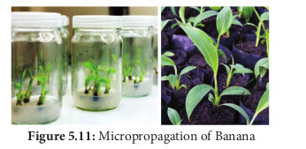
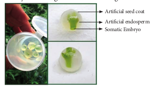
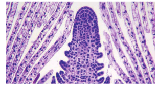

தாவரத் திசு வளர்ப்பு பல்வேறு பயன்பாடுகளைக் கொண்டுள்ளது.

i.உடல் கலப்பினமாதல் மூலம் மேம்பட்ட கலப்புயிரிகள் உற்பத்தி செய்யப்படுதலுக்கு உடல் கலப்புயிரியாக்கம் என்று பெயர்.

ii.	உறை சூழப்பட்ட கருக்கள் அல்லது செயற்கை விதைகள் தாவரங்களின் உயிரிப்பன்மத்தைப் பாதுகாக்க உதவுகிறது.

iii.	ஆக்குத் திசு மற்றும் தண்டு நுனி வளர்ப்பின் மூலம் நோய் எதிர்ப்பு தாவரங்களை உற்பத்தி செய்தல்.

iv.	களைக்கொல்லி சகிப்புத்தன்மை, வெப்பச் சகிப்புத்தன்மை கொண்ட தாவரங்கள் போன்ற அழுத்தத்தை (இறுக்கத்தை) எதிர்க்கக் கூடிய தாவரங்களின் உற்பத்தி.

v.	வருடம் முழுவதும் குறைந்த காலத்தில் பயிர் மற்றும் வனத்திற்குப் பயன்படும் மரச் சிற்றினங்கள் அதிக எண்ணிக்கையிலான நாற்றுருக்கள் நுண்பெருக்க தொழில்நுட்பம் மூலம் கிடைக்கின்றன.

vi.	செல் வளர்ப்பில் இருந்து உற்பத்தி செய்யப்படும் இரண்டாம்நிலை வளர்சிதை மாற்றப் பொருள்கள் மருந்து உற்பத்தி, அழகு சாதனப் பொருள்கள் மற்றும் உணவு தொழிற்சாலைகளில் பயன்படுத்தப்படுகின்றன.

**உடல் நகல்சார் வேறுபாடு** (Somaclonal Variation) ஆய்வுக்கூடச் சோதனை வளர்ப்பிலிருந்து உருவாகும் தாவர மீள் உருவாக்கத்தில் மூலத்தாவரத்திலிருந்து சில வேறுபாடுகள் காணப்படுகின்றன. இந்த வேறுபாடுகள் இலை, தண்டு, வேர், கிழங்கு , இனப்பெருக்க வித்து (propagule) ஆகியவற்றில் காணப்படுகின்றன.

**கேமீட்டக நகல்சார் வேறுபாடு** (Gametoclonal Variation) ஆய்வுக்கூடச் சோதனை வளர்ப்பின் போது கேமீட்களிலிருந்து உருவாகும் கேமீட்டகத் தாவர மீள் உருவாக்கத்தில் வேறுபாடுகள் காணப்படுகின்றன. (கேமீட்டிலும், கேமீட்டகத் தாவரத்திலும் காணப்படும் வேறுபாடு)

### வாழையில் நுண்பெருக்கம் (Micropropagation in banana)

தொழிற்துறை அளவில் தாவர நுண்பெருக்கம்
அன்னாசி, வாழை, ஸ்ட்ராபெர்ரி, உருளைக்கிழங்கு
போன்ற தாவரங்களில் அதிக நிலையான ஒத்த
மரபியல் தன்மை பராமரிக்கப்படுவதற்கு உதவுகிறது.

### செயற்கை விதைகள் (Artificial seeds or Synthetic seeds)

ஆய்வுக்கூடச் சோதனை வளர்ப்பு மூலம் கிடைக்கக் கூடிய கருவுருக்களைப் பயன்படுத்திச் செயற்கை விதைகள் உற்பத்தி செய்யப்படுகிறது. இவை தாவரத்தின் எந்த ஒரு பகுதியிலிருந்து எடுக்கக்கூடிய தனிச் செல்களிலிருந்தும் பெறப்படலாம். இந்தச் செல்கள் பின்பு பகுப்படைந்து அடர்த்தியான சைட்டோபிளாசத்தையும், பெரிய உட்கருவையும், தரச மணிகளையும், புரதங்களையும், எண்ணெய்களையும் கொண்டிருக்கும். செயற்கை விதைகள் தயாரிப்பதற்கு அகரோஸ் மற்றும் சோடியம் ஆல்ஜினேட் போன்ற மந்தமான பொருள்கள் கருவுருக்களின் மீது பூசப்படுகின்றன.

**செயற்கை விதைகளின் நன்மைகள் :** 

செயற்கை விதைகள் உண்மை விதைகளைக் காட்டிலும் பல நன்மைகளைப் பெற்றுள்ளன. 

- குறைந்த செலவில் எந்தக் காலத்திலும் மில்லியன் கணக்கான செயற்கை விதைகளை உற்பத்தி செய்யலாம்.

- விரும்பிய பண்புகளைக் கொண்ட மரபணு மாற்றப்பட்ட தாவரங்களை இம்முறையில் எளிதாக உருவாக்கலாம்.

- தாவரங்களின் மரபணுசார் வகைய விகிதத்தை
எளிதாகச் சோதனை செய்யலாம்.

- உறைகுளிர்பாதுகாப்பு முறையில் செயற்கை விதைகளை நீண்ட நாட்களுக்குத் திறன் மிக்கவையாகச் சேமித்து வைக்கலாம்.

- செயற்கை விதைகள் மூலமாக உருவொத்த
தாவரங்களை உருவாக்கலாம்.

- செயற்கை விதைகளில் விதை உறக்கக் காலம்
பெருமளவில் குறைக்கப்பட்டுள்ளது. இதனால்
குறுகிய வாழ்க்கை சுழற்சியுடன் கூடிய வேகமான
வளர்ச்சியைப் பெற்றுள்ளது.

### வைரஸ் அற்ற தாவரங்கள்

நி ல த் தி ல் வளரக்கூடிய பயிர்கள் போன்ற பல்லாண்டு தாவரங்களில் பூஞ்சை, ப ா க் டீ ரி ய ங ்க ள் , மைக்கோபிளாஸ்மா, வைரஸ் போன்ற பல்வேறு நோய்க்காரணிகளின் தோற்றலினால் பொதுவாகக் குறிப்பிடத்தக்க அளவு பொருளாதார இழப்பு ஏற்படுகிறது. பூஞ்சை, பாக்டீரியங்கள் போன்றவற்றை வேதியியல் முறையினால் கட்டுப்படுத்தலாம். என்றாலும் வைரஸ்கள் பொதுவாக வேதியியல் கட்டுப்பாட்டிற்கு உட்படுவதில்லை.

வைரஸ் அற்ற தாவரங்களின் உற்பத்திக்குத் தண்டு நுனி ஆக்குத் திசு வளர்ப்பு ஒரு முறையாகும். தண்டு நுனியின் ஆக்குத் திசு எப்போதும் வைரஸ் அற்றதாக உள்ளது.

