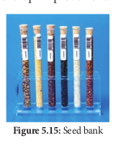

### மரபணுவளக்கூறைப் (Germplasm) பாதுகாத்தல்:

மரபணுவளக்கூறு பாதுகாத்தல் என்பது பயிர் பெருக்க நோக்கத்திற்காக உயிருள்ள நிலையில் தாவரப் பொருள்களான மகரந்தம், விதைகள் அல்லது திசுக்கள் போன்றவற்றைப் பராமரித்துப் பாதுகாப்பதாகும். மேலும் இவை பல்வேறு ஆராய்ச்சி பணிகளுக்குப் பயன்படுத்தப்படுகின்றன.

மரபணுவளக்கூறுகளைப் பாதுகாத்தல் என்பது சேகரிக்கப்பட்ட விதைகள் மற்றும் மகரந்தத்தின் ஒரு பகுதியை விதைவங்கி அல்லது மகரந்த வங்கியில் சேமித்தல் ஆகும். இதனால் அவற்றின் உயிர்ப்புத் தன்மை மற்றும் வளத்தன்மை பாதுக்காக்கப்பட்டு பிறகு கலப்பினமாக்கம் மற்றும் பயிர் பெருக்கத்திற்குப் பயன்படுத்தப்படுகின்றன. மரபணுவளக்கூறு பாதுகாத்தலில் மரபணு வங்கி, DNA வங்கி ப�ோன்றவை ஈடுபடுத்தப்படுகின்றன. இந்த மரபணுக்களும், DNA வும் உயர்ந்த, மேம்படுத்தப்பட்ட தாவர மூலங்களிலிருந்து எடுக்கப்பட்டு இந்த வங்கிகளில் உயிரிபன்ம பேணலுக்கும், உணவுப் பாதுகாப்பிற்கும் பயன்படுத்தப்படுகின்றன.

### உறைகுளிர்பாதுகாப்பு (Cryopreservation) (-196° C)

உறைகுளிர்பாதுகாப்பு என்பதை உறை குளிர் வெப்பநிலை பாதுகாப்பு பேணல் (Cryoconservation) எனவும் அழைப்பர். இம்முறையில் சிதைவுக்கு உட்பட்டுள்ள அல்லது சிதைவடைகின்ற புரோட்டோபிளாஸ்ட்கள், செல்கள், திசுக்கள், செல் நுண்ணுறுப்புகள் , (உறுப்புகள், செல்லுக்கு வெளியே உள்ள பொருள்கள், நொதிகள் அல்லது பிற உயிரிப் பொருள்கள்) -196°C திரவ நைட்ரஜனைப் பயன்படுத்தி மிகக் குறைந்த வெப்பநிலையில் குளிர வைத்து பதப்படுத்துதல் உறைகுளிர்பாதுகாப்பு என்று அழைக்கப்படுகிறது

தீவிர குறைந்த வெப்பநிலையில் உயிர் பொருள்களின் ஏதேனும் ஒரு நொதியின் செயல்பாடு அல்லது வேதிய செயல்பாடுகள் முழுவதுமாக நின்றுவிடுகின்றன. இதன் விளைவாகப் பொருள்கள் உறக்கநிலையில் பதப்படுத்தப்படுகின்றன. பிறகு மற்ற பரிசோதனை பணிக்காக மெதுவாக அறை வெப்பநிலைக்குக் கொண்டு வரப்படுகின்றன. உறைகுளிர்பாதுகாப்பு செயல்முறைக்கு முன்பாகத் தாவரப் பொருள் தயாரித்தல் பாதுகாப்பு காரணிகளான டை மெத்தில் சல்ஃபாக்சைடு, கிளிசரால் அல்லது சுக்ரோஸ் ஆகியன சேர்க்கப்படுகின்றன. இத்தகைய பாதுகாப்பு காரணிகள் உறைகுளிர்பாதுகாப்பு செயல் பாதுகாப்பான்கள் என்று அழைக்கப்படுகின்றன. இந்த பாதுகாப்பு காரணிகள் தீவிர குளிர் விளைவுகளில் இருந்து செல்கள் அல்லது திசுக்களை பாதுகாக்கின்றன.
