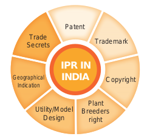

 Intellectual property right (IPR) is a category of rights that includes intangible creation of the human intellect, and primarily consists of copyrights, patents, and trademarks. It also includes other types of rights, such as trade secrets, publicity rights, moral rights, and rights against unfair competition.

- In biotechnology, the transformed microorganisms and plants and technologies for the production of commercial products are exclusively the property of the discoverer.
- The discoverer has the full rights on his property. It should not be neglected by the others without legal permission.
- The right of discoverer must be protected and it does by certain laws framed by a country.
- The IPR is protected by different ways like patents, copyrights, trade secrets and trademarks, designs and geographical indications.

### Patents
- It is a special right to the discoverer/inventor that has been granted by the government through legislation for trading new articles.
- A patent is a personal property which can be licensed or sold by the person or organisation just like any other property.
- Patent terms give the inventor the rights to exclude others from making, using or selling his invention.

### Biosafety and Bioethics
Advances in biotechnology and their applications deals with genetic manipulation. 

**Biosafety** Biosafety is the prevention of large-scale loss of biological integrity, focusing both on ecology and human health. These prevention mechanisms include conduction of regular reviews of the biosafety in laboratory settings, as well as strict guidelines to follow. Many laboratories handling biohazards employ an ongoing risk management assessment and enforcement process for biosafety. Failures to follow such protocols can lead to increased risk of exposure to biohazards or pathogens.

**Bioethics - Ethical, Legal and Social Implications (ELSI)** 

Bioethics refers to the study of ethical issues emerging from advances in biology and medicine. It is also a moral discernment as it relates to medical policy and practice. Bioethicists are concerned with the ethical questions that arise in the relationships among life sciences, biotechnology and medicine. It includes the study of values relating to primary care and other branches of medicine. The scope of bioethics is directly related to biotechnology, including cloning, gene therapy, life extension, human genetic engineering, astroethics life in space, and manipulation of basic biology through altered DNA, RNA and proteins. These developments in biotechnology will affect future evolution, and may require new principles, such as biotic ethics, that values life and its basic biological characters and structures. The Ethical, Legal, and Social Implications (ELSI) program was founded in 1990 as an integral part of the Human Genome Project. The mission of the ELSI program was to identify and address issues raised by genomic research that would affect individuals, families, and society. A percentage of the Human Genome Project budget at the National Institutes of Health and the U.S. Department of Energy was devoted to ELSI research. 

**Genetic Engineering Appraisal Committee (GEAC)** 

GEAC is an apex body under Ministry of Environment, Forests and Climate change for regulating manufacturing, use, import, export and storage of hazardous microbes or genetically modified organisms (GMOs) and cells in the country. It was established as an apex body to accord approval of activities involving large scale use of hazardous microorganisms and recombinants in research and industrial production. The GEAC is also responsible for approval of proposals relating to release of genetically engineered organisms and products into the environment including experimental field trials.
