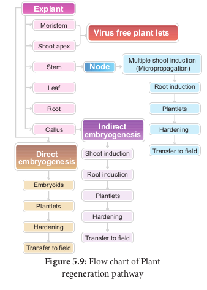

From the explants, plants can be regenerated by somatic embryogenesis or organogenesis.

 

### Somatic Embryogenesis

Somatic embryogenesis is the formation of embryos from the callus tissue directly and these embryos are called **Embryoids** or from the _in vitro_ cells directly form pre-embryonic cells which differentiate into embryoids.

**Applications** 
- Somatic embryogenesis provides potential plantlets which after hardening period can establish into plants.
- Somatic embryoids can be be used for the production of synthetic seeds.
- Somatic embryogenesis is now reported in many plants such as _Allium sativum_, _Hordeum vulgare, Oryza sativa, Zea mays_ and this possible in any plant.

Synthetic seeds are produced by encapsulation of embryoids in agarose gel or calcium alginate.

### Organogenesis
The morphological changes occur in the callus leading to the formation of shoot and roots is called organogenesis.

Callus Differentiation Plantlets

Shoots (Caulogenesis)

Roots (Rhizogenesis)
- Organogenesis can be induced _in vitro_ by introducing plant growth regulators in the MS medium.
- Auxin and cytokinins induce shoot and root formation.
