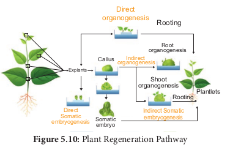

பிரிகூறுவிலிருந்து உடல் கருவுருவாக்கம் அல்லது உறுப்புகளாக்கம் மூலம் தாவரங்கள் மீளுருவாக்கம் செய்யப்படுகிறது.

 

### உடல் கருவுருவாக்கம்

கேலஸ் திசுவிலிருந்து நேரடியாகக் கரு உருவாதலுக்கு உடல் கருவுருவாக்கம் என்று பெயர். இக்கருக்கள் உடல்கருக்கள் அல்லது கருவுருக்கள் என்று அழைக்கப்படுகின்றன. 

கருவுருக்கள் அல்லது ஆய்வுக்கூடச் சோதனை முறை வளர்ப்பு செல்களிலிருந்து நேரடியாக முன் கரு செல்கள் வளர்ந்து கருவுருக்களாக வேறுபாடு அடைகின்றன.

**பயன்பாடுகள்** 

- உடல் கருவுருவாக்கம் திறன்மிக்க நாற்றுருக்களை வழங்கி, பின்னர் வன்மையாக்கத்திற்குப் பின்பு முழுத் தாவரங்களைக் கொடுக்கிறது.

- செயற்கை விதைகள் உற்பத்திக்கு உடல் கருக்கள்
பயன்படுத்தப்படுகின்றன.

- அல்லியம் சட்டைவம், ஹார்டியம் வல்கேர், ஒரைசா சட்டைவா, சியா மெய்ஸ் போன்ற பல தாவரங்களில் உடல் கருவுருவாக்கம் தற்போது கண்டறியப்பட்டுள்ளது. மேலும், இம்முறை எவ்வகை தாவரத்திலும் சாத்தியமாகும்.

அகரோஸ் இழுமம் அல்லது கால்சியம் ஆல்ஜினேட் கொண்டு கருவுருக்களை உறையிட்டுச் செயற்கை விதைகள் உற்பத்தி செய்யப்படுகின்றன.

### உறுப்புகள் உருவாக்கம்

கேலஸில் காணப்படும் புறத்தோற்ற மாறுபாடுகளின் காரணமாக அதிலிருந்து தண்டு மற்றும் வேர் உருவாக்கத்திற்கு **உறுப்புகள் உருவாக்கம்** என்று பெயர்.

- MS ஊடகத்தில் தாவர வளர்ச்சி சீரியக்கிகளைச்
சேர்ப்பதனால் ஆய்வுக்கூடச் சோதனை முறையில்
உறுப்புகளின் உருவாக்கம் தூண்டப்படுகிறது.

- ஆக்சின் மற்றும் சைட்டோகைனின் தண்டு மற்றும்
வேர் உருவாக்கத்தைத் தூண்டுகின்றன.
