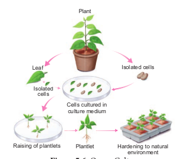
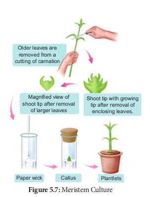

தாவரத் திசு வளர்ப்பு என்பது ஆய்வு கூடச் சோதனை வளர்ப்பு முறை மற்றும் நுண்ணுயிர் நீக்கிய நிலையில் திசு வளர்ப்பு ஊடகத்தில் ஏதேனும் தாவரப் பகுதிகளை வளர்த்தல் என வரையறுக்கப்படுகிறது. இத்தொழில்நுட்பச் செயல்முறை மூன்று அடிப்படை நெறிமுறைகளைக் கொண்டுள்ளது.

- தேவையான தாவரப்பகுதி அல்லது அதன் பிரிகூறு தேர்வு செய்யப்பட்டு, பின்பு இதர உடலப் பகுதியிலிருந்து பிரித்தெடுக்கப்படுகிறது.

- இது கட்டுப்படுத்தப்பட்ட இயற்பியல் சூழ்நிலையிலும், வரையறுக்கப்பட்ட வேதியிய (ஊட்ட ஊடகம்) சூழலிலும் பராமரிக்கப்படுகிறது.

```hint { role="info" }

பிரிகூறு என்பது தேர்ந்தெடுக்கப்பட்ட தாவரத்தை
உருவாக்குவதற்கு வளர்ப்பு ஊடகத்தில் வைத்து
வளர்க்கத் தேவைப்படும் தாவரத் திசு.
```
### தாவரத் திசு வளர்ப்பிற்கான அடிப்படை ஆய்வக வசதிகள்

தாவரத் திசு வளர்ப்பிற்கு ஆய்வகம் பின்வரும் வசதிகளைக் கொண்டிருக்க வேண்டும் :

- கண்ணாடிக் கலன்களைக் கழுவுவதற்கான வசதி மற்றும் அவற்றை உலர்த்துவதற்கான நுண்ணலை அடுப்பு (oven) வசதி

- தன்னழுத்தக் கலன் (Autoclave), எலக்ட்ரானிய தராசு மற்றும் pH மீட்டருடன் கூடிய வளர்ப்பு ஊடகம் தயாரிப்பதற்கான அறை


- நுண்ணுயிர் நீக்கப்பட்ட அறை: இது ஒரு சீரடுக்கு காற்று பாய்வு அமைப்பும், உயர்திறன் துகள் காற்று (HEPA- High Efficiency Particulate Air) வடிப்பான் என்றழைக்கப்படும் அழுத்தக் காற்றோட்ட அலகும் உள்ளன. இவற்றின் வேலை நுண்ணுயிர் அற்ற ஒரு சூழலை உருவாக்குவதாகும்.

- வளர்ப்பு வசதி: பிரிகூறு வளர்ப்புக் குழாயில் பொதிக்கப்பட்டு 22-28°C வெப்ப நிலையிலும், 2400 லக்ஸ் ஒளிச்செறிவிலும், 8 – 16 மணி நேரம் ஒளிக்காலத்துவத்திலும், ஏறத்தாழ 60% ஈரப்பதத்திலும் வளர்க்கப்படுகிறது.

### தாவரத் திசு வளர்ப்பில் அடங்கியுள்ள அடிப்படைத் தொழில்நுட்பமுறை

#### நுண்ணுயிர் நீக்கம் (Sterilization)

நுண்ணுயிர் நீக்கம் என்பது வளர்ப்பு ஊடகம், வளர்ப்பு கலன்கள், பிரிகூறு போன்றவற்றிலிருந்து பாக்டீரியங்களையும், நுண்ணுயிர்களான பூஞ்சைகளையும் நீக்கும் தொழில்நுட்பம். 

i) **நுண்ணுயிர் நீக்கப்பட்ட நிலையைப் பராமரித்தல்**: ஆய்வகச் செயற்கை வளர்ப்பில் நுண்ணுயிர் நீக்கப்பட்ட நிலையைப் பராமரிக்கப் பின்வரும் பின்பற்றப்படுகின்றன. கண்ணாடிக் முறைகள் கலன்கள், இடுக்கி, கத்தி, அனைத்து உபகரணங்கள் ஆகியவை தன்னழுத்தக்கலனில் 15 psi (121°C வெப்பநிலை) அழுத்தத்தில், 15 – 30 நிமிடங்களுக்கு உட்படுத்தப்படுகிறது அல்லது 70% ஆல்கஹாலில் நனைக்கப்படுகிறது. இதைத் தொடர்ந்து வெப்பமூட்டலும் குளிர்வித்தலும் நடைபெற்று நுண்ணுயிர்நீக்கம் செய்யப்படுகின்றன.

ii) **வளர்ப்பு அறை நுண்ணுயிர் நீக்கம் செய்தல்**: முதலில் தரை மற்றும் சுவர்களைச் சோப்பு கொண்டும் பிறகு 2% சோடியம் ஹைப்போகுளோரைட் அல்லது 95% எத்தனால் கொண்டும் கழுவ வேண்டும். சீரடுக்கு காற்று பாய்வு அறையின் மேற்பரப்பு 95% எத்தனால் கொண்டு நுண்ணுயிர் நீக்கம் செய்யப்பட வேண்டும். பிறகு 15 நிமிடங்களுக்குப் புறஊதாக் கதிர் வீச்சிற்கு உட்படுத்தப்பட வேண்டும்.

iii) **ஊட்ட ஊடகத்தை நுண்ணுயிர் நீக்கம் செய்தல்**: வளர்ப்பு ஊடகம் கொண்டுள்ள கண்ணாடிக் கலனை ஈரம் உறிஞ்சாத பருத்தி அல்லது பிளாஸ்டிக் கொண்டு மூடி, தன்னழுத்தக்கலனில் 15 psi (121°C) ல் 15 – 30 நிமிடங்களுக்கு நுண்ணுயிர் நீக்கம் செய்யப்படுகிறது. தாவரச் சாறு, வைட்டமின்கள், அமினோ அமிலங்கள் மற்றும் ஹார்மோன்கள் ஆகியவை 0.2 µm துளை விட்டமுடைய மில்லிபோர் வடிகட்டி வழியாகச் செலுத்தப்பட்டு நுண்ணுயிர் நீக்கம் செய்யப்படுகின்றன. நுண்ணுயிர் நீக்கிய சீரடுக்கு காற்று பாய்வு அறையில் ஊடகம் நுண்ணுயிர் நீக்கிய வளர்ப்பு வைக்கப்படுகிறது.


iv) **பிரிகூறுக்கு நுண்ணுயிர் நீக்கம் செய்தல்**: திசு வளர்ப்பிற்குப் பயன்படும் தாவரப் பொருளை முதலில் ஓடுகின்ற குழாய் நீரில் வைத்து நுண்ணுயிர் நீக்கம் செய்யப்படுகிறது. அதற்குப் பின் 0.1% மெர்குரிக் குளோரைடு, 70% ஆல்கஹால் போன்றவற்றைப் பயன்படுத்தி நுண்ணுயிர் அற்ற நிலையில் சீரடுக்கு காற்று பாய்வு அறையில் புறப்பரப்பு நுண்ணுயிர் நீக்கம் செய்யப்படுகிறது.

#### ஊடகம் தயாரித்தல் (Preparation of culture medium)

திசு வளர்ப்பின் வெற்றி, வளர்ப்பு ஊடகத்தின் கூறுகள், தாவர வளர்ச்சி சீரியக்கிகள், வெப்பநிலை, pH, ஒளி மற்றும் ஈரப்பதம் போன்றவற்றைப் பொறுத்து அமையும். எந்தத் தனி ஊடகமும் அனைத்துத் தாவரத் திசுவின் உகந்த வளர்ச்சிக்கு உகந்ததல்ல. திசு வளர்ப்பு நெறிமுறைக்கேற்பத் தகுந்த ஊட்ட ஊடகம் தயாரிக்கப்பட்டுப் பயன்படுத்தப்படுகிறது.

MS ஊட்ட ஊடகம் (முராஷிகி மற்றும் ஸ்கூஜ் 1962) பொதுவாகப் தாவரத் திசு வளர்ப்பில் பயன்படுத்தப்படுகிறது. இது தகுந்த வைட்டமின்கள் மற்றும் ஹார்மோன்களுடன் தகுந்த கார்பன் மூலங்களையும் கொண்டுள்ளன. MS ஊடகத்தைத் தவிரத் தாவரத் திசு வளர்ப்பிற்காக B5 ஊடகம் (கேம்போர்க் குழுவினர் 1968), ஒயிட் ஊடகம் (ஒயிட் 1943) நிட்ச் ஊடகம் (நிட்ச் மற்றும் நிட்ச் 1969) போன்றவை உள்ளன. ஒரு ஊடகம் திட, பகுதிதிட அல்லது நீர்ம நிலையில் இருக்கலாம். ஊடகத்தைத் திடப்படுத்துவதற்குக் கூழ்மக் காரணியான அகார் சேர்க்கப்படுகிறது.

**அகார்**: ஊடகத் தயாரிப்பில் திடநிலைபடுத்துவதற்கு பயன்படுத்தப்படும் கடல் பாசிகளிலிருந்து (Sea weeds) கிடைக்கும் ஒரு சிக்கலான மியூசிலேஜ் (mucilagenous) பாலிசாக்காரைடுகளாகும்.


#### வளர்ப்பு சூழல்

**pH** 

சிறந்த முடிவினைப் பெறுவதற்கு ஊடகத்தின் pH ஐ 5.6 முதல் 6.0 வரை வைக்க வேண்டும்.

**வெப்பநிலை**

இவ்வளர்ப்பிற்கு 25°C ± 2°C நிலையான வெப்பநிலை உகந்தது.

**ஈரப்பதம் மற்றும் ஒளிச்செறிவு**

50 – 60 % ஒப்பு ஈரப்பதமும், தோராயமாக 1000 லக்ஸூம், 16 மணி ஒளிக்காலத்துவமும் வளர்ப்பதற்குத் தேவைப்படுகின்றன.

**காற்றோட்டம்**

சோதனைக் குழாய் அல்லது குடுவையில் காற்றோட்டம் தானியங்கி குலுக்கியின் மூலம் கொடுக்கப்படுகிறது. இது காற்று வடிகட்டி மூலம் நுண்ணுயிரி நீக்கப்பட்டு ஊடகத்தில் செலுத்தப்படுகிறது.
#### கேலஸ் தூண்டப்படுதல் (Induction of callus)


**கேலஸ்**:

தேர்ந்தெடுக்கப்பட்ட இலை, தண்டு, கிழங்கு மற்றும் வேரின் 1 – 2 செ.மீ நோய் கிருமி நீக்கப்பட்ட துண்டுகளின் பிரிகூறுகள் ஆக்ஸின் கூடுதலாகச் சேர்க்கப்பட்ட MS ஊட்டக் கரைசலில் வைக்கப்படுகிறது. இவை 25°C ± 2°C வெப்பநிலையில் 12 மணி நேரம் ஒளி மற்றும் 12 மணி நேரம் இருள் என மாறி மாறி வைக்கப்படும் பொது செல் பிரிதல் தூண்டப்பட்டுப் பிரிகூறின் மேற்பரப்பில் கேலஸ் வளர்ச்சி நடைபெறுகிறது. கேலஸ் என்பது ஆய்வுகூடச் சோதனை வளர்ப்பு ஊடகத்தில் தாவரச் செல்கள் அல்லது திசுக்களின் முறையற்ற வளர்ச்சி ஆகும்.

#### கருவுருவாக்கம் (Embryogenesis)

கேலஸ் செல்கள் வேறுபாடுகளுக்கு உள்ளாகி உடலக் கருக்களை உருவாக்குகின்றன. இவை **கருவுருக்கள்** (Embryoids) எனப்படும். இந்தக் கருவுருக்களை துணை வளர்ப்பிற்கு உட்படுத்தி **நாற்றுருக்கள்** (Plantlets) உற்பத்தி செய்யப்படுகின்றன.


#### வன்மையாக்குதல் (Hardening)

ஆய்வகச் சோதனை முறையில் வளர்க்கப்பட்ட நாற்றுருக்களுக்கு வலிமை பெறும் காலம் தேவைபடுவதால் அவை பசுமை இல்லம் அல்லது வன்மையாக்கி அறைக்கும், பின்னர் இயற்கை சூழலுக்கும் மாற்றப்படுகின்றன. வன்மையாக்குதல் என்பது ஆய்வகச் சோதனை முறையில் ஈரப்பதமான அறையில் உருவாக்கப்பட்ட நாற்றுருக்களை ஒளியின் இயற்கையான களச் சூழலில் வளர்வதற்கு ஏற்ப படிப்படியாக வெளிக்கொணர்தல் ஆகும்.

### திசு வளர்ப்பின் வகைகள்

பிரிகூறு அடிப்படையில் தாவரத் திசு வளர்ப்பின் வகைகளாவன

1. உறுப்பு வளர்ப்பு

2. ஆக்குத் திசு வளர்ப்பு

3. புரோட்டோபிளாஸ்ட் வளர்ப்பு

4. செல் மிதவை வளர்ப்பு

#### உறுப்பு வளர்ப்பு

வளர்ப்பு ஊடகத்தில் கருக்கள், மகரந்தப் பை, சூலகப்பை, வேர்கள், தண்டு அல்லது தாவரத்தின் பிற உறுப்புகளை வளர்த்தல்.



The culture of embryos, anthers, ovaries, roots, shoots or other organs of plants on culture media.

#### ஆக்குத் திசு வளர்ப்பு 

வளர்ப்பு ஊடகத்தில் தாவரத்தின் ஆக்குத் திசுவை வளர்த்தல்.



#### புரோட்டோபிளாஸ்ட் வளர்ப்பு

புரோட்டோபிளாஸ்ட் என்பது செல் சுவரற்ற, ஆனால் செல்சவ்வு அல்லது பிளாஸ்மா சவ்வினால் சூழப்பட்ட செல் அமைப்பாகும். புரோட்டோபிளாஸ்ட்டை பயன்படுத்தி ஒற்றைச் செல்லிலிருந்து முழுத் தாவரத்தை மீளுருவாக்கம் செய்ய இயலும் மற்றும் உடலக் கருக்களை உருவாக்க முடியம். புரோட்டோபிளாஸ்ட் வளர்ப்பில் அடங்கியுள்ள படிநிலைகள்


i) **புரோட்டோபிளாஸ்ட்டை பிரித்தெடுத்தல்**: இலைத் திசு போன்ற தாவரத் திசுவின் சிறு பகுதி புரோட்டோபிளாஸ்ட் பிரித்தெடுப்பதற்காகப் பயன்படுத்தப்படுகிறது. pH 5.4 நிலையில் 0.5% மேசரோசைம் மற்றும் 13% சார்பிட்டாலில் அல்லது மானிட்டாலில் கரைந்துள்ள 2% ஒனோசுகா செல்லுலேஸ் நொதியில் இலைத் திசுக்களின் சிறு துண்டுகளை மூழ்கி இருக்குமாறு வைக்கப்படுகிறது. இவற்றை 25°C வெப்பநிலையில் இரவு முழுவதும் வைத்துப் பிறகு மென்மையாகச் செல்களைத் தனிமைபடுத்தும் (teasing) போது புரோட்டோபிளாஸ்ட்கள் பெறப்படுகின்றன. இவ்வாறு பெறப்பட்ட புரோட்டோபிளாஸ்ட் அதன் உயிர்ப்புத் தன்மையை நிலை நிறுத்த 20% சுக்ரோஸ் கரைசலுக்கு மாற்றப்படுகிறது. பிறகு மையவிலக்கிக்கு உட்படுத்தப்பட்டுச் செல் சுவரிலிருந்து பிரித்தெடுக்கப்பட்ட தூய புரோட்டோபிளாஸ்ட்கள் பெறப்படுகின்றன. 

ii) **புரோட்டோபிளாஸ்ட் இணைவு** : புரோட்டோபிளாஸ்ட் தகுந்த இணைவு காரணியால் இணைவு நிகழ்த்தப்படுகிறது. இது பொதுவாகப் பாலிஎத்திலீன் (PEG) நிகழ்கிறது. கிளைக்கால் மூலம் பிரித்தெடுக்கப்பட்ட புரோட்டோபிளாஸ்ட் 25% முதல் 30% செறிவுள்ள பாலிஎத்திலீன் கிளைக்கால் மற்றும் Ca++ அயனியில் வைக்கும் போது இணைவு ஏற்படுகிறது.

iii)**புரோட்டோபிளாஸ்ட்டுகள் வளர்ப்பு** : புரோட்டோபிளாஸ்ட்கள் சில மாற்றங்கள் செய்யப்பட்ட MS வளர்ப்பு ஊடகத்தின் நுண் துளி, தட்டு அல்லது நுண் துளி வரிசை (array) முறையில் வளர்க்கப்படுகின்றன . புரோட்டோபிளாஸ்ட்டை வளர்ப்பதற்கு முன்பாக ஃப்ளூரசின் டைஅசிட்டேட்டைக் கொண்டு அதன் உயிர்ப்புத் திறன் சோதிக்கப்படுகிறது. பிறகு வளர்ப்பானது தொடர்ந்து 25°C வெப்பநிலையில், 1000 முதல் 2000 லக்ஸ் ஒளிச் செறிவில் வைக்கப்படுகிறது. 24 – 48 மணி நேரத்தில் செல் சுவர் தோற்றமும், 2 முதல் 7 நாட்களுக்கிடையே முதல் செல் பிரிதலில் புதிய செல் தோற்றமும் வளர்ப்பு ஊடகத்தில் நிகழ்கிறது. 

**iv.உடல் கலப்பினச் செல்களைத் தேர்ந்தெடுத்தல்** : உட்கரு அற்ற வேறுபட்ட செல்களின் புரோட்டோபிளாஸ்ட்டை இணைத்துப் பெறப்படுவது **சைபிரிட்** (cybrid) என அழைக்கப்படுகிறது. இதன் பின்பு உட்கரு இணைவு நடைபெறுகிறது. இந்த நிகழ்வானது **உடல் கலப்பினமாக்கல்** (somatic hybridization) என அழைக்கப்படும்.

#### செல் மிதவை வளர்ப்பு (Cell suspension Culture) 

ஆய்வுக்கூடச் சோதனை முறையில் சில தனிச் செல்களையோ அல்லது செல் தொகுப்பையோ நீர்ம ஊடகத்தில் வளர்க்கும் முறை செல் மிதவை வளர்ப்பு எனப்படுகிறது.

மேலும், சுழற்சி கலக்கி கருவியைப் பயன்படுத்திக் கிளர்வூட்டப்பட்ட (agitated) கேலஸின் ஒரு பகுதியை நீர்ம ஊடகத்திற்கு மாற்றுவதன் மூலம் செல் மிதவை தயாரிக்கப்படுகிறது. கேலஸ் திசுவின் செல்கள் தனிமைபடுத்தப்பட்டு செல் மிதவை வளர்ப்பிற்குப் பயன்படுத்தப்படுகிறது.

**இரண்டாம் நிலை வளர்சிதை மாற்றப் பொருள்கள் உற்பத்தி :**

செல் மிதவை வளர்ப்பின் மூலமாக இரண்டாம் வளர்சிதை மாற்றப் பொருள்களான நிலை ஆல்கலாய்டுகள், ஃபிளேவினாய்டுகள், டெர்பினாய்டுகள், ஃபீனால் கூட்டுப் பொருள்கள், மறுகூட்டிணைவுப் புரதங்கள் போன்ற பொருள்களை உருவாக்கலாம். பொதுவாக, இரண்டாம் நிலை வளர்சிதைப் பொருள்கள் வேதியப் பொருள்களாகவும், தாவர வளர்ச்சிக்குத் தேவைப்படாமலும் உள்ளன. ஆனால் தாவரங்களின் செல் வளர்சிதைமாற்றத்தின் போது உபபொருள்களாக இவை உருவாக்கப்படுகின்றன. எடுத்துக்காட்டாக, ரோசியஸ் கேதராந்தஸ் தாவரத்தின் செல் வளர்ப்பிலிருந்து இண்டோல் ஆல்கலாய்டுகள் உயிரிஉற்பத்தி மூலம் பிரித்தெடுக்கப்படுகிறது.

வணிக உற்பத்திக்காக உயிரிகலன்களைப் இரண்டாம் நிலை வளர்சிதைப் பயன்படுத்தி பொருள்களின் உற்பத்தி செயல்முறைகளைத் தானியங்கி முறையில் அளவிடலாம். அதிகத் திறனுடைய இரண்டாம்நிலை வளர்சிதை பொருள்கள் உற்பத்தியைச் செல் மிதவை வளர்ப்பின் மூலம் மேற்கொள்வதற்குச் சில உத்திகளான உயிரிசார் நிலை மாற்றம் (Bio transformation) வளர்ச்சிதை மாற்றப் பொருள் தூண்டல் (Elicitation) மற்றும் முடக்க வளர்ப்பு (immobilization) போன்றவை பயன்படுத்தப்படுகின்றன. தொழிற்துறை முக்கியத்துவம் வாய்ந்த இரண்டாம் நிலை வளர்சிதை மாற்றப் பொருள்கள் கீழ்காணும் அட்டவணையில் கொடுக்கப்பட்டுள்ளன.

| இரண்டாம்நிலை வளர்சிதைப் பொருள்கள் 	| தாவரங்கள்                     	| பயன்கள்                  	|
|-----------------------------	|-----------------------------	|------------------------	|
| டிஜாக்ஸின்                    	| டிஜிடாலிஸ் பர்புரியா          	| இதயத்திற்கு மருந்து       	|
| கோடின்                       	| பப்பாவர் சாம்னிபெரம்            	| வலி நிவாரணி            	|
| கேப்சைசின்                    	| கேப்சிகம் அனுவம்               	| வாதவலியை குணப்படுத்த     	|
| வின்கிரிஸ்டைன்                 	| கேத்தராந்தஸ் ரோசியஸ்            	| புற்றுநோய்க்கு எதிர்மருந்து 	|
| குவினைன்                     	| சின்கோனா மலேரியா அஃபிசினாலிஸ் 	| மலேரியா எதிர்மருந்து     	|
