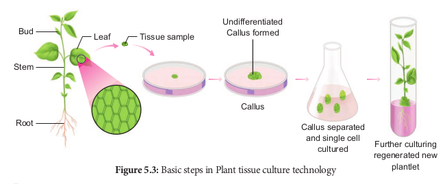
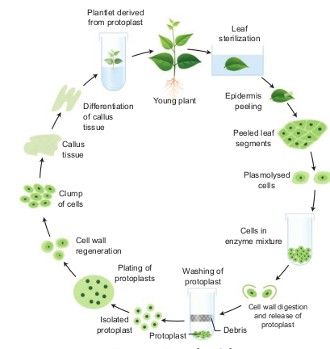

Plant tissue culture is used to describe the _in vitro_ and aseptic growth of any plant part on a tissue culture medium. This technology is based on three fundamental principles: 
- The plant part or explant must be selected and isolated from the rest of plant body.
- The explant must be maintained in controlled physically (environmental) and chemically defined (nutrient medium) conditions.
- Aseptic condition must be maintained, which requires high degree of cleanliness in the laboratory.

```
**Explant:** The tissue taken from a selected** plant transferred to a culture medium often to establish a new plant.

```
### Laboratory Facilities for PTC
For PTC, the laboratory must have the following facilities:


- Washing facility for glassware and ovens for drying glassware.
- Medium preparation room with autoclave,electronic balance and pH meter. 
- Transfer area sterile room with laminar air-flow bench and a positive pressure ventilation unit called High Efficiency Particulate Air (HEPA) filter to maintain aseptic condition.
- Culture facility: Growing the explant inoculated into culture tubes at 22-28° C with illumination of light 2400 lux, with a photoperiod of 8-16 hours and a relative humidity of about 60%.

### Technique Involved in PTC

#### 1. Sterilization
Sterilization is the technique employed to get rid of microbes such as bacteria and fungi in the culture medium, vessels and explants. 

i. **Maintenance of Aseptic Environment:** During in vitro tissue culture maintenance of aseptic environmental condition should be followed, i.e., sterilization of glassware, forceps, scalpels, and all accessories in wet steam sterilization by autoclaving at 15 psi (121°C) for 15 to 30 minutes or dipping in 70% ethanol followed by flaming and cooling. 

ii. **Sterilization of culture room:** Floor and walls are washed first with detergent and then with 2% sodium hypochlorite or 95% ethanol. The cabinet of laminar airflow is sterilized by clearing the work surface with 95% ethanol and then exposure of UV radiation for 15 minutes. 

iii. **Sterilization of Nutrient Media:** Culture media are dispensed in glass containers, plugged with non-absorbent cotton or sealed with plastic closures and then sterilized using autoclave at 15 psi (121°C) for 15 to 30 minutes. The plant extracts, vitamins, amino acids and hormones are sterilized by passing through Millipore filter with 0.2 mm pore diameter and then added to sterilized culture medium inside Laminar Airflow Chamber under sterile condition.



iv. **Sterilization of Explants:** The plant materials to be used for tissue culture should be surface sterilized by first exposing the material in running tap water and then treating it in surface sterilization agents like 0.1% mercuric chloride, 70% ethanol under aseptic condition inside the Laminar Air Flow Chamber.

#### 2. Media Preparation
The success of tissue culture lies in the composition of the growth medium, plant growth regulators and culture conditions such as temperature, pH, light and humidity. No single medium is capable of maintaining optimum growth of all plant tissues. Suitable nutrient medium as per the principle of tissue culture is prepared and used.

MS nutrient medium (Murashige and Skoog 1962) is commonly used. It has carbon sources, with suitable vitamins and hormones. The media formulations available for plant tissue culture other than MS are B5 medium (Gamborg.et.al 1968), White medium (white 1943), Nitsch’s medium (Nitsch & Nitsch 1969). A medium may be solid or semisolid or liquid. For solidification, a gelling agent such as agar is added.

**Agar:** A complex mucilaginous polysaccharide obtained from marine algae (sea weeds) used as solidifying agent in media preparation.


#### 3. Culture condition

**pH** 
The pH of medium is normally adjusted between 5.6 to 6.0 for the best result.

**Temperature** 
The cultures should be incubated normally at constant temperature of 25°C ± 2°C for optimal growth.

**Humidity and Light Intensity** 
The cultures require 50-60% relative humidity and 16 hours of photoperiod by the illumination of cool white fluorescent tubes of approximately 1000 lux.

**Aeration** 
Aeration to the culture can be provided by shaking the flasks or tubes of liquid culture on automatic shaker or aeration of the medium by passing with filter-sterilized air.

#### 4. Induction of Callus


Explant of 1-2 cm sterile segment selected from leaf, stem, tuber or root is inoculated (transferring the explants to sterile glass tube containing nutrient medium) in the MS nutrient medium supplemented with auxins and incubated at 25°C ± 2°C in an alternate light and dark period of 12 hours to induce cell division and soon the upper surface of explant develops into callus. Callus is a mass of unorganized growth of plant cells or tissues in _in vitro_ culture medium.

#### 5. Embryogenesis
The callus cells undergoes differentiation and produces somatic embryos, known as **Embryoids. The embryoids** are sub-cultured to produce plantlets.


#### 6. Hardening

The plantlets developed in vitro require a hardening period and so are transferred to greenhouse or hardening chamber and then to normal environmental conditions. Hardening is the gradual exposure of _in vitro_ developed plantlets in humid chambers in diffused light for acclimatization so as to enable them to grow under normal field conditions.

### Types of Plant tissue cultures
Based on the type of explant other plant tissue culture types are 
1. Organ culture 
2. Meristem culture 
3. Protoplast culture 
4. Cell suspension culture.

**1. Organ culture**


The culture of embryos, anthers, ovaries, roots, shoots or other organs of plants on culture media.

**2. Meristem Culture:** The culture of any plant meristematic tissue on culture media.


**3. Protoplast Culture:** 
Protoplasts are cells without a cell wall, but bound by a cell membrane or plasma membrane. Using protoplasts, it is possible to regenerate whole plants from single cells and also develop somatic hybrids. The steps involved in protoplast culture. i. **Isolation of protoplast:** Small bits of plant tissue like leaf tissue are used for isolation of protoplast. The leaf tissue is immersed in 0.5% Macrozyme and 2% Onozuka cellulase enzymes dissolved in 13% sorbitol or mannitol at pH 5.4. It is then incubated over-night at 25°C. After a gentle teasing of cells, protoplasts are obtained, and these are then transferred to 20% sucrose solution to retain their viability. They are then centrifuged to get pure protoplasts as different from debris of cell walls.



ii. **Fusion of protoplast:** It is done through the use of a suitable fusogen. This is normally PEG (Polyethylene Glycol). The isolated protoplast are incubated in 25 to 30% concentration of PEG with Ca++ ions and the protoplast shows agglutination (the formation of clumps of cells) and fusion. 

iii. **Culture of protoplast:** MS liquid medium is used with some modification in droplet, plating or micro-drop array techniques. Protoplast viability is tested with fluorescein diacetate before the culture. The cultures are incubated in continuous light 1000-2000 lux at 25°C. The cell wall formation occurs within 24-48 hours and the first division of new cells occurs between 2-7 days of culture. 

**iv. Selection of somatic hybrid cells:**
The fusion product of protoplasts without nucleus of different cells is called a cybrid. Following this nuclear fusion takes place. This process is called somatic hybridization.

**4. Cell Suspension Culture** The growing of cells including the culture of single cells or small aggregates of cells _in vitro_ in liquid medium is known as cell suspension culture. The cell suspension is prepared by transferring a portion of callus to the liquid medium and agitated using rotary shaker instrument. The cells are separated from the callus tissue and used for cell suspension culture.

**Production of Secondary Metabolites** Cell suspension culture can be useful for the production of secondary metabolites like alkaloids, flavonoids, terpenoids, phenolic compounds and recombinant proteins. Secondary metabolites are chemical compounds that are not required by the plant for normal growth and development but are produced in the plant as ‘byproducts’ of cell metabolism. For Example: Biosynthesis and isolation of indole alkaloids from _Catharanthus roseus_ plant cell culture.

The process of production of secondary metabolites can be scaled up and automated using bio-reactors for commercial production. Many strategies such as biotransformation, elicitation and immobilization have been used to make cell suspension cultures more efficient in the production of secondary metabolites. Few examples of industrially important plant secondary metabolites are listed below in the table:

| **Secondary metabolites** 	| **Plant source**        	| **Uses**                    	|
|---------------------------	|-------------------------	|-----------------------------	|
| Digoxin                   	| Digitalis<br>purpurea   	| Cardiac tonic               	|
| Codeine                   	| Papaver<br>somniferum   	| Analgesic                   	|
| Capsaicin                 	| Capsicum<br>annuum      	| Rheumatic<br>pain treatment 	|
| Vincristine               	| Catharanthus<br>roseus  	| Anti-<br>carcinogenic       	|
| Quinine                   	| Cinchona<br>officinalis 	| Antimalarial                	|
