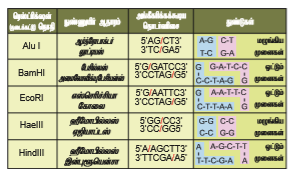

```hint { role ="info" }
**கற்றல் நோக்கங்கள்** 

**இப்பாடத்தினைக் கற்போர்**

அன்றாட வாழ்வில் பாரம்பரிய மற்றும் நவீன உயிரி தொழில்நுட்பவியலை பயன்படுத்தவும் நொதித்தல் செயல்முறை பயன்பாட்டை அறியவும் மரபணு பொறியியல் செயல்முறைகளின் மீதான அறிவை பெறவும் மரபணு மாற்றமடைந்த தாவரங்களின் வரம்புகள் மற்றும் பயன்களை ஆராயவும் உயிரி வளம் நாடல் மற்றும் உயிரிப் பொருள் கொள்ளை ஆகிய பதத்தை அறிந்துக் கொள்ளவும் இயலும்.
```

```hint { role ="info" }
**பாட உள்ளடக்கம்**

4.1 உயிரிதொழில்நுட்பவியலின் வளர்ச்சி

4.2 பாரம்பரிய உயிரிதொழில்நுட்பவியல்

4.3 நவீன உயிரிதொழில்நுட்பத்தில் ஏற்பட்டுள்ள முன்னேற்றங்கள்

4.4 மரபணு பொறியியலின் கருவிகள்

4.5 மரபணு மாற்ற முறைகள்

4.6 மறுக்கூட்டிணைவை சலிக்கைச் செய்தல்

4.7 மரபணு மாற்றமடைந்த தாவரங்கள் / மரபணு மாற்றமடைந்த பயிர்கள்

4.8 உயிரிதொழில்நுட்பவியலின் பயன்பாடுகள்
```

உயிரிதொழில்நுட்பவியல் என்பது பயன்பாட்டு உயிரியல் செயல்முறை அறிவியலாகும். மனித இனத்திற்கும் மற்ற உயிரினங ்க ளுக்கு ம் பயன்படக்கூடிய அறிவியல் வளர்ச்சி, உயிரியல் செயல்முறைகளின் பயன்பாடு, அமைப்பு மற்றும் தொகுதி எனக் கூறலாம். 1919 ஆம் ஆண்டு ஹங்கேரிய பொறியாளரான கார்ல் ஏர்கி என்பவரால் உயிரிதொழில் நுட்பவியல் என்ற சொல் உருவாக்கப்பட்டது. உயிரிதொழில்நுட்பவியல் என்பது உயிரினங்கள், திசுக்கள், செல்கள், நுண்ணுறுப்புகள் அல்லது தனிமைபடுத்தப்பட்ட மூலக்கூறுகளான நொதிகளை பயன்படுத்தி உயிரியல் அல்லது பிற மூலக்கூறுகளை அதிக மதிப்புடைய பொருட்களாக மாற்றும் செயல்பாடுகளை உள்ளடக்கியதாகும். 

## உயிர்தொழில்நுட்பவியலின் வளர்ச்சி 

கடந்த நூற்றாண்டுகளில் உயிரிதொழில் நுட்பவியல் மிக அபரிமிதமான வளர்ச்சியைப் பெற்றுள்ளது. இவ்வளர்ச்சியானது வழக்கமான அல்லது பாரம்பரிய உயிரிதொழில்நுட்பவியல் மற்றும் நவீன உயிரிதொழில்நுட்பவியல் எனும் இரு தலைப்புகளின் கீழ் நன்கு புரிந்துக்கொள்ள இயலும். 

**1. வழக்கமான அல்லது பாரம்பரிய உயிரிதொழில்நுட்பவியல்**

நம் மூதாதையர்களால் உருவாக்கப்பட்ட சமையலறை தொழில்நுட்பம் தான் இது. இத்தொழில்நுட்பத்தில் பாக்டீரியங்களையும், நுண்ணுயிரிகளையும் பயன்படுத்தி தயிர், நெய், பாலாடைக்கட்டி போன்ற பால்சார் பொருட்களும், இட்லி, தோசை, நாண், ரொட்டி, பிட்சா போன்ற உணவுப் பொருட்களும் தயாரிக்கப்படுகின்றன. பாரம்பரிய உயிரிதொழில்நுட்பம் ஒயின், பீர் போன்ற மதுபானத் தயாரிப்பிலும் பயன்படுத்தப்படுகிறது. 18ஆம் நூற்றாண்டுகளில் அறிவியல் மற்றும் தொழில்நுட்ப முன்னேற்றத்தின் காரணமாக சமையலறைத் தொழில்நுட்பம் அறிவியல் பூர்வ
மதிப்பைப் பெற்றது.

**2. நவீன உயிரிதொழில்நுட்பவியல்**

நவீன உயிரிதொழில்நுட்பம் இரு முக்கிய அம்சங்களைக் கொண்டுள்ளது. இவை பாரம்பரியத் தொழில்நுட்பத்திலிருந்து வேறுபட்டவை. (i) மறுகூட்டிணைவு DNA தொழில்நுட்பத்தின் மூலம் குறிப்பிட்ட தேவைக்காக புதியத் தயாரிப்புகள் பெறுவதற்கு மரபணு மாற்றம் செய்யப்படுதல் (ii) புதிதாக உருவாக்கப்பட்ட தொழில்நுட்பத்தின் உரிமை மற்றும் அதன் சமூகத் தாக்கம். இன்றையக் காலகட்டத்தில் உயிரிதொழில்நுட்பவியல் மூலம் உலகெங்கும் ஒரு பில்லியன் டாலர் வர்த்தகம் நடைபெறுகிறது. மருந்து நிறுவனங்கள், மதுபானத் தொழிலகங்கள், வேளாண் தொழிற்சாலைகள் மற்றும் பிற உயிரிதொழில்நுட்பம் அடிப்படையிலான தொழில்கள் அவற்றின் தயாரிப்புகளின் முன்னேற்றத்திற்காக உயிரிதொழில்நுட்பக் கருவிகள் பயன்படுத்தப்படுகின்றன.

நவீன உயிரிதொழில்நுட்பவியல் மறுகூட்டிணைவு DNA தொழில்நுட்பம் மூலம் ஏற்படும் மரபணு மாற்றம் மட்டுமின்றி செல்லிணைவுத் தொழில்நுட்பத்தின் அனைத்து வழிமுறைகளையும் உள்ளடக்கியது. உயிரிதொழில்நுட்பவியலின் முக்கிய அம்சங்களாவன பின்வருமாறு :

- **நொதித்தல்** : அமிலங்கள், நொதிகள், ஆல்கஹால்கள், உயிரி எதிர்ப்பொருட்கள், நுண் வேதியப்பொருட்கள், வைட்டமின்கள் மற்றும் நச்சுப் பொருட்களின் உற்பத்தி.

- ஒற்றை செல் புரதம், ஆல்கஹால் மற்றும் உயிரி எதிர்ப் பொருள் பெருமளவில் உற்பத்தி செய்வதற்கான **உயிரித்திரள்**

- **நொதிகள்** பதப்படுத்தும் தொழிற்சாலைகளில் உயிரி உணர்விகளாக செயல்படுதல்.

- ஹைட்ரஜன் , ஆல்கஹால், மீத்தேன் போன்ற உயிரி எரிபொருள் உற்பத்தியில்

- **நுண்ணுயிரி உட்புகட்டல்கள்** (Inoculants) உயிரி
உரங்கள் மற்றும் நிலைநிறுத்திகளாக

- இரண்டாம் நிலை வளர்ச்சிதைப் பொருட்கள் மற்றும் மானோகுளோனல் ஆண்டிபாடி (Monoclonal Antibody) உற்பத்திக்கு தாவர மற்றும் விலங்கு செல் வளர்ப்பு

- நுண்வேதியப்பொருட்கள், நொதிகள், தடுப்பூசிகள், வளர்ச்சி ஹார்மோன்கள், உயிரி எதிர்ப்பொருட்கள் மற்றும் இண்டர்பெரான்களின் உற்பத்தியில் **மறுகூட்டிணைவு DNA தொழில்நுட்பம்**.

- **செயல்முறை பொறியியல்** (Process Engineering) நீர் மறு சுழற்சி மற்றும் கழிவுப் பொருட்கள் சுத்திகரிப்பில் பயன்படும் உயிரிதொழில் நுட்பவியல் கருவிகளின் பயன்பாடு துறையில் பதப்படுத்தும் பொறியியல்

இந்த அலகில் நவீன உயிரிதொழில்நுட்பவியலின் பல்வேறு அம்சங்கள், அதன் உற்பத்திப் பொருட்கள், பயன்பாடு போன்றவை விவரிக்கப்பட்டுள்ளன.

## பாரம்பரிய உயிரிதொழில்நுட்பவியலின் முறைகள் (Methods of Biotechnology)

ஏற்கனவே விவரித்தது போல் நம்முடைய மூதாதையர்களால் உருவாக்கப்பட்ட இந்த சமையலறை தொழில்நுட்பம் தான் நொதிக்க வைக்கும் பாக்டீரியங்களை பயன்படுத்தியது. எனவே, இது உயிரினங்களில் இயற்கையாக அமைந்த திறன்களை அடிப்படையாக கொண்ட செயல்பாடுகளை உள்ளடக்கியது.

### நொதித்தல் (Fermentation)

நொதித்தல் எனும் சொல் இலத்தீன் மொழியின் “ஃபெர்விர் (fervere) லிருந்து பெறப்பட்டடது. இது காய்ச்சுதல் (to boil) என்று பொருள்படும். நொதித்தல் என்பது வளர்சிதை மாற்றச் செயலில் கரிம மூலக்கூறுகளை (பொதுவாக குளுக்கோஸ்) ஏதேனும் எலக்ட்ரான் கடத்து சங்கிலி அல்லது ஆக்ஸிஜனற்ற நிலையில் அமிலங்கள், வாயுக்கள் அல்லது ஆல்கஹாலாக மாற்றுவது ஆகும். நொதித்தல் மற்றும் அவற்றின் நடைமுறை பயன்பாடுகளை பற்றிப் படிப்பது சைமோலாஜி ஆகும். இது 1856ஆம் ஆண்டு உருவாக்கப்பட்டது. அந்த ஆண்டில் பிரான்ஸ் நாட்டு வேதியியலார் லூயிஸ் பாஸ்டர் ஈஸ்ட்டினால் நொதித்தல் உண்டாகிறது என்பதை நிரூபித்தார். உயிர் வாழ ஆக்சிஜனற்ற சூழல் தேவைப்படும் போது சில வகை பாக்டீரியங்களும் பூஞ்சைகளும் நொதித்தலை மேற்கொள்கின்றன. உணவு மற்றும் மதுபான தொழில்களில் நொதித்தல் செயல்கள் மிகவும் பயன்படக்கூடியதாக உள்ளன. இங்கு ஆல்கஹால் பானங்களை உருவாக்க சர்க்கரை கரைசல் எத்தனாலாக மாற்றப்படுகின்றன. ரொட்டிகளை உப்பச்செய்ய ஈஸ்டால் வெளியிடப்படும் CO2 உதவுகிறது; காய்கறிகள் மற்றும் பால்சார் பொருட்களைப் பாதுகாக்கவும் மணமூட்டவும் பயன்படும் கரிம அமிலங்களின் உற்பத்தியிலும் பயன்படுகிறது.

#### உயிரி வினைகலன் - Bioreactor

**(நொதிகலன் - Fermentor)**

உயிரிவினைகலன் (நொதிகலன்) என்பது ஒரு பாத்திரம் அல்லது கொள்கலன் ஆகும். இது வினைபடு பொருட்களுடன் நுண்ணுயிரிகள் அல்லது அவற்றின் நொதிகள் தேவையான பொருட்களை உற்பத்தி செய்வதற்கு வினைபுரியும் வகையில் உகந்த சூழ்நிலையை வழங்கக் கூடியதாக வடிவமைக்கப்பட்டு இருக்கும். இந்த உயிரிவினை கலனில் காற்றோட்டம், கிளர்வூட்டம் (agitation), வெப்பநிலை, pH போன்றவை கட்டுபடுத்தப்பட்டிருக்கும். நொதித்தல் மேற்கால் பதப்படுத்தம் மற்றும் கீழ்க்கால் பதப்படுத்தம் என இரு செயல்முறைகளை உள்ளடக்கியது.

**i. மேற்கால் பதப்படுத்தம் (Upstream process)**

நொதித்தல் தொடங்குவதற்கு முன்பாக உள்ள அனைத்து செயல்முறைகளும் அதாவது நொதிகலனில் நுண்ணுயிர் நீக்கம், தயார்படுத்துதல், வளர்ப்பு ஊடக நுண்ணுயிர் நீக்கம் மற்றும் பொருத்தமான உட்புகட்டலின் (inoculum) வளர்ச்சி ஆகியவை மேற்கால் பதப்படுத்தம் எனப்படும்.

**ii. கீழ்க்கால் பதப்படுத்தம் (Downstream Process)**

நொதித்தலுக்கு பிறகு உள்ள அனைத்து செயல்முறைகளும் கீழ்க்கால் பதப்படுத்தம் எனப்படும். இச்செயல்முறையில் வாலை வடித்தல், மையவிலக்கல், விசைக்கு உட்படுத்துதல், வடிகட்டுதல் மற்றும் கரைப்பான் மூலம் பிரித்தெடுத்தல் போன்றவை உள்ளடங்கியுள்ளன. பெரும்பாலும் இச்செயல்முறை விரும்பப்படும் விளை பொருளின் தூய்மையை உள்ளடக்கியது.


**நொதித்தல் செயல்முறை**

அ. உற்பத்திப் பொருட்களைச் சார்ந்து உயிரி வினைகலன் தேர்ந்தெடுக்கப்படுகிறது.

ஆ. குறிப்பிட்ட வெப்பநிலை, pHல் பொருத்தமான வளர்தளப் பொருள் (substrate) நீர்ம ஊடகத்தில் சேர்க்கப்பட்டு பின்னர் நீர்க்கப்படுகிறது.

இ. இதில் உயிரினம் (நுண்ணுயிரிகள், விலங்கு / தாவர செல், செல் நுண்ணுறுப்புகள் அல்லது நொதிகள்) சேர்க்கப்படுகிறது.

ஈ . இது குறிப்பிட்ட கால அளவிற்கு குறிப்பிட்ட வெப்பநிலையில் வைக்கப்படுகிறது.

உ. உயிரினம் காற்றுள்ள நிலையிலோ அல்லது காற்றற்ற நிலையிலோ தேவைகேற்ப வைக்கப்படலாம்.

ஊ. கீழ்க்கால் பதப்படுத்துதல் முறையைப் பயன்படுத்தி விளைப்பொருட்கள் பெறப்படுகின்றன.

**தொழிற்சாலையில் நொதித்தலின் பயன்பாடுகள்**

**நொதித்தல் பின்வரும் தொழில்சார் பயன்பாடுகளைக் கொண்டுள்ளது. அவையாவன:**

1. **நுண்ணுயிரி உயிரித்திரள் உற்பத்தி:** நுண்ணுயிரி செல்களான (உயிரித்திரள்) பாசிகள், பாக்டீரியங்கள், ஈஸ்ட், பூஞ்சைகள் போன்றவை வளர்க்கப்பட்டு உலர்த்தப்பட்டு ஒற்றை செல் புரதம் (SCP) என்றழைக்கப்படும் முழு புரத மூலமாகப் பயன்படுகின்றன. இவை மனித உணவாகவோ, விலங்கு தீவனமாகவோ செயல்படுகின்றன. இதற்கு ஒற்றை / தனி செல் புரதம் என்று பெயர்.

2. **நுண்ணுயிரி வளர்சிதை மாற்றப் பொருட்கள்** நுண்ணுயிரிகள் மனித மற்றும் விலங்குகளுக்கு பயனுள்ளதாக இருக்கும் வேதியப் பொருட்களை உற்பத்தி செய்கின்றன. இந்த பொருட்கள் வளர்சிதை மாற்றப் பொருட்கள் என்று அழைக்கப்படுகின்றன. இவை இரண்டு பிரிவுகளாகப் பிரிக்கப்படுகின்றன.

அ. **முதல்நிலை வளர்சிதை மாற்றப்பொருட்கள் :** நுண்ணுயிரிகளின் உயிர் செயல்முறைகளை பராமரிப்பதற்காக உற்பத்தி செய்யக்கூடியவை முதல்நிலை வளர்சிதை மாற்றப்பொருட்கள் எனப்படும். எடுத்துக்க்காட்டு: எத்தனால், சிட்ரிக் அமிலம், லாக்டிக் அமிலம், அசிட்டிக் அமிலம்.

ஆ. **இரண்டாம்நிலைவளர்சிதைமாற்றப்பொருட்கள்:** இரண்டாம் நிலை வளர்சிதை மாற்றப்பொருள்கள் நுண்ணுயிரிகளின் முக்கிய வாழ்க்கை செயல்முறைக்கு தேவைப்படுவதில்லை. ஆனால் இவை மதிப்புக்கூட்டும் தன்மையுடையவை. இவற்றில் உயிரி எதிர்ப்பொருட்களும் (Antibiotics) உள்ளடங்கும். எடுத்துக்காட்டுகள்: ஆம்போடெரிசின் –B (ஸ்ரெப்டோமைசஸ் நோடோஸ்), பெனிசிலின் (பெனிசீலியம் கிரைசோஜீனம்), ஸ்ட்ரெப்டோமைசின் (ஸ்ட்ரெப்டோமைசஸ் கிரைசஸ்), டெட்ராசைக்ளின் (ஸ்ட்ரெப்டோமைசஸ் ஆரியோஃபேசியன்ஸ்), ஆல்கலாய்டுகள், நச்சு நிறமிகள், வைட்டமின்கள் மற்றும் பிற.

3. **நுண்ணுயிர் நொதிகள்**: நுண்ணுயிரிகளை வளர்க்கும் போது அவை வளர்ப்பு ஊடகத்தில் சில நொதிகளைச் சுரக்கின்றன. இந்த நொதிகள் சோப்பு, உணவு பதப்படுத்தம், மதுபானம் (brewing), மருந்தியியல் ஆகிய தொழிற்சாலைகளில் பயன்படுத்தப்படுகின்றன. எடுத்துக்காட்டுகள்: புரோட்டீயேஸ், அமைலேஸ், ஐசோமெரேஸ், லைப்பேஸ் போன்றவை.

4. **உயிர்-சார் மாற்றம், உயிர்-சார் வேதிய மாற்றம் அல்லது தளப்பொருள் மாற்றம்:** நொதிக்க வைக்கும் நுண்ணுயிரிகள் மதிப்பு மிக்க தயாரிப்புக்களை உற்பத்தி செய்யும் திறனைக் கொண்டுள்ளன. எத்தனாலை அசிட்டிக் அமிலமாக (வினிகர்), ஐசோ புரோப்பனாலை அசிட்டோனாக, சார்பிட்டாலை சார்போஸ் சர்க்கரையாக (வைட்டமின் C உற்பத்திக்கு பயன்படுவது) ஸ்டீராலை ஸ்டீராய்டாக மாற்ற நொதித்தல் பயன்படுகிறது

### தனி செல் புரதம் (Single Cell Protein- SCP)

தனி செல் புரதம் என்பது விலங்கு உணவாக அல்லது மனித துணை உணவாக (supplementary food) பயன்படுத்தப்படும் நுண்ணுயிரிகளின் உலர்ந்த செல்களாகும். தனி செல் புரதம் முழு மனித இனம் எதிர் கொள்ளும் புரதக் குறைபாட்டிற்கு, தற்காலத்தில் ஒரு தீர்வாக விளங்குகிறது. தனி செல் புரதங்கள் அவற்றின் அதிக புரதச்சத்து, வைட்டமின்கள், அத்தியாவசியமான அமினோ அமிலங்கள் மற்றும் கொழுப்பு பொருட்களுக்கு காரணமான அதிக ஊட்டச்சத்து பெற்றிருந்தாலும் அவற்றின் அதிக நியூக்ளியர் அமிலம் மற்றும் மெதுவாக செரிக்கும் தன்மையின் காரணமாக வழக்கமான புரத ஆதாரத்திற்கு மாற்றாக இருக்க இயலுமா என்பது சந்தேகமே. தனி செல் புரத உற்பத்தியில் பயன்படுத்தப்படும் நுண்ணுயிரிகள் கீழே கொடுக்கப்பட்டுள்ளன.

- பாக்டீரியங்கள் – மெத்தைலோபில்லஸ் மெத்தைலோட்ரோபஸ், செல்லுலோமோனாஸ் அல்கலிஜீன்ஸ்

- பூஞ்சைகள் - அகாரிகஸ் கேம்பஸ்டிரிஸ், சாக்கரோமைசட்ஸ் செர்வீசியே (ஈஸ்ட்), கேண்டிடா யுட்டிலிஸ்.

- பாசிகள் – ஸ்பைருலினா, குளோரெல்லா, கிளாமிடோமோனாஸ்

தனி செல் புரதம் அவற்றின் புரதச்சத்து, கார்போஹைட்ரேட்கள், கொழுப்புகள், வைட்டமின்கள், தாது உப்புகள் போன்றவற்றின் காரணமாக முக்கியமான உணவாகப் பயன்படுத்தப்படுகின்றன. இவை உணவின் முக்கிய ஆதார அமைப்பாகிறது. மேலும் இது விண்வெளி வீரர்கள் மற்றும் அண்டார்டிக்கா பயணம் மேற் க ொ ள் ளு ம் விஞ் ஞா னி க ளா ல் பயன்படுத்தப்படுகிறது.


உருளை கிழங்கு பதப்படுத்தப்படும் தொழிற்சாலைகளிலிருந்து கிடைக்கும் கழிவுநீர் (தரசம் கொண்டது), வைக்கோல், வெல்ல சக்கைப்பாகு, விலங்கு உரம் மற்றும் கழிவுநீர் போன்ற பொருட்களில் ஸ்பைருலினாவை எளிதில் வளர்த்து அதிகளவில் புரதங்கள், தாது உப்புகள், கொழுப்புகள், கார்போஹைட்ரேட் மற்றும் வைட்டமின்கள் நிறைந்த உணவை உண்டாக்கலாம். மேலும், இத்தகைய பயன்பாடுகள் சுற்றுச்சூழல் மாசுபாட்டைக் குறைக்கிறது. 250 கி மெத்தைலோபில்லஸ் மெத்தைலோட்ரோபஸ், அதனுடைய மிக அதிகளவு உயிரித்திரள் பயன்பாட்டின் மூலம் 25 டன் புரத உற்பத்தியை உருவாகக்கூடும்.

**தனி செல் புரதத்தின் பயன்பாடுகள்**

- இது புரதத்திற்கு மாற்றாகப் பயன்படுகிறது.

- இது ஆரோக்கியமான முடி மற்றும் தோலுக்கான அழகுப் பொருட்களில் பயன்படுத்தப்படுகிறது.

- இது புரதத்தின் மற்றும் ஊட்டச் சத்துக்களின் சிறந்த ஆதாரமாக பறவைகள், மீன்கள், கால்நடைகள் போன்றவற்றின் உணவிற்காக பரவலாக பயன்படுத்தப்படுகிறது.

- இது உணவுத் ததொழிற்சாலைகளில் மணமூட்டியாக வைட்டமின் கொண்டதாக, அடுமனை பொருட்களின் ஊட்டச்சத்து மதிப்பை அதிகரிக்கும் காரணியாக, சூப்புகள், தயார்நிலை உணவுகள் மற்றும் உணவுக்குறிப்புகளில் பயன்படுத்தப்படுகிறது.

- காகித தயாரிப்பிலும், தோல் பதப்படுத்துதலிலும், நுரை நிலைநிறுத்தியாகவும் இது பயன்படுகிறது.

## நவீன உயிரிதொழில்நுட்பத்தில் ஏற்பட்டுள்ள முன்னேற்றங்கள்

நவீன உயிரிததொழில் நுட்பவியல் அனைத்து மரபணு-சார் கையாளுதல் முறைகள், புரோட்டோபிளாச இணைவு ததொழில்நுட்பங்கள் மற்றும் பழைய உயிரிததொழில்நுட்பவியல் செயல்முறைகளில் மேற்கொள்ளப்பட்ட மேம்பாடுகள் போன்றவற்றை உள்ளடக்கியுள்ளது. நவீன உயிரிததொழில்நுட்பவியலின் ஒரு சில முக்கிய மேம்பாடுகள் கீழே விவரிக்கப்பட்டுள்ளன.

### மரபணு-சார் பொறியியல்

மரபணு சார் பொறியியல் அல்லது DNA மறுகூட்டிணைவு ததொழில் நுட்பம் அல்லது மரபணு நகலாக்கம் என்பது ஒரு ததொகுப்பான சொல்லாகும். இதில் வெவ்வேறு சோதனை செயல்முறைகள் உள்ளடக்கப்பட்டுள்ளன. இவை DNA மாற்றுருவாக்கம் மற்றும் DNA ஐ ஒரு உயிரியிலிருந்து இருந்து மற்றொரு உயிரிக்கு மாற்றுதல் ஆகியவை நடைபெறுகின்றன.

முன்பே அலகு II ல் பாரம்பரிய மறுகூட்டிணைவிற்கான வரையறையை அறிந்திருப்பீர்கள். பாரம்பரிய
மறுகூட்டிணைவு குன்றல் பகுப்பின் போது ஒத்த இணை குரோமோசோம்களுக்கிடையே ஏற்படும் மரபணு பரிமாற்றம் அல்லது மறுகூட்டிணைவைக் குறிக்கும். நவீன தொழில்நுட்பத்தைப் பயன்படுத்தி செயற்கையாக மறுகூ ட் டி ணைவை ச ெ ய ல்ப டு த ்தப்ப டு வ து மறுகூட்டிணைவு DNA தொழில்நுட்பம் (rDNA தொழில்நுட்பம்) என்றழைக்கப்படுகிறது. மேலும் இது மரபணு மாற்ற தொழில்நுட்பம் என்றும் அழைக்கப்படும். குறிப்பிட்ட மரபணுவிற்கு குறியீடு செய்யும் DNA ஐ ஒரு உயிரியிலிருந்து இருந்து மற்றொரு உயிரிக்கு மாற்றம் செய்வதை இந்த தொழில்நுட்பமுறை தன்னகத்தே கொண்டுள்ளது. இதில் குறிப்பிட்ட தாங்கிக்கடத்திகள் (Vectors) முகவர்களாக செயல்படுத்தப்படுகின்றன அல்லது மின்துளையிடல் கருவி, மரபணு துப்பாக்கி போன்ற கருவிகள் பயன்படுத்தப்படுகின்றன அல்லது இது லிப்போசோம் மூலமோ, வேதியப் பொருட்கள் மூலமோ, நுண் உட்செலுத்துதல் (Microinjection) மூலமோ மேற்கொள்ளப்படுகிறது,


### மறுகூட்டிணைவு DNA

**தொழில்நுட்பத்தின் படிநிலைகள் மறுகூட்டிணைவு DNA தொழில்நுட்பத்தின் படிநிலைகள் பின்வருமாறு:**

- நகலாக்கம் செய்யப்படவேண்டிய, விரும்பத்தகுந்த, மரபணுவை கொண்டுள்ள DNA துண்டைத் தனிமைபடுத்துதல் . இதற்கு செருகி (Insert) என்று பெயர்.

- ஓம்புயிர் செல்லுக்குள்ளேயே சுயமாக பெருக்கமடையக்கூடிய தாங்கிக்கடத்தி எனும் ஒரு கடத்தி மூலக்கூறுடன் DNA துண்டுகளை செருகுவதினால் மறுகூட்டிணைவு DNA (rDNA ) மூலக்கூறு உருவாக்கப்படுகிறது.

- rDNA மூலக்கூறை தாங்கியிருக்கும் மாற்றப்பட்ட ஓம்புயிரி செல்களைத் தேர்ந்தெடுத்தல் மற்றும் அவற்றை பெருக்கமடைய செய்தல்; இதன் மூலம் rDNA பெருக்கமடைகிறது.

- எனவே, இந்த அனைத்து செயலினால் செருகி அதிகளவு rDNAவையோ அல்லது அதன் பண்புகளை வெளிப்படுத்தும் அதிகளவு புரதங்களையோ உருவாக்குகிறது.

- எங்கெல்லாம் தாங்கிக்கடத்திகள் ஈடுபடுத்தப்படவில்லையோ அங்கெல்லாம் அந்த விரும்பத்தகுந்த மரபணு பாலிமரேஸ் சங்கிலி வினை (PCR) தொழில்நுட்பத்தின் மூலம் பெருக்கமடையச் செய்யப்படுகிறது. இந்த பெருக்கமடைந்த நகல்கள் ஓம்புயிரி செல்லின் புரோட்டோபிளாஸத்தினுள் ஊசி மூலமோ அல்லது மரபணு துப்பாக்கி மூலமோ செலுத்தப்படுகின்றன.

---
PCR: பாலிமரேஸ் சங்கிலி வினை DNA வின் குறிப்பிட்ட பகுதியை நகலாக்கம் (மில்லியன்) செய்யப் பயன்படுத்தப்படும் பொதுவான ஆய்வக தொழில்நுட்பமாகும்.

---

## மரபணுப் பொறியியலுக்கான கருவிகள் (Tools for Genetic Engineering)

மேலே விவரிக்கப்பட்டதிலிருந்து இந்த தொழில்நுட்பத்தில் சில அடிப்படைக் கருவிகள் மறுகூட்டிணைவு DNA மூலக்கூறை உற்பத்தி செய்வதற்கு தேவைப்படுகிறது என்பது நமக்கு தெரிய வருகிறது. அடிப்படைக் கருவிகளாவன நொதிகள், தாங்கிக்கடத்திகள் மற்றும் ஓம்புயிரிகள். மரபணுப் பொறியியலில் தேவைப்படும் மிக முக்கிய நொதிகள் தடைகட்டு நொதிகள் (Restriction enzymes), DNA லைகேஸ் மற்றும் ஆல்கலைன் பாஸ்ஃபடேஸ் ஆகும்.

### தடைகட்டு நொதிகள் (Restriction enzymes)

1963 ஆம் ஆண்டு பாக்டீரியோஃபாஜின் வளர்ச்சியை கட்டுப்படுத்தக் காரணமான இரண்டு நொதிகள் ஈஸ்டிரிச்சியா கோலையில் இருந்து தனிமைப்படுத்தப்பட்டன. ஒரு நொதி DNA உடன் மெத்தைல் தொகுதியை சேர்க்கிறது. மற்றொரு நொதி DNAஐ துண்டிக்கிறது. DNAஐ துண்டிக்கும் நொதி ரெஸ்ட்ரிக்‌ஷன் எண்டோ நியுக்ளியேஸ் ஆகும். இவை DNA மூலக்கூறுக்குள் குறிப்பிட்ட அடையாளம் காணக்கூடிய பகுதிக்கு அருகில் அல்லது இடத்தில் DNAஐ துண்டிக்கின்றன. இதற்கு தடைகட்டுக் களம் (Restriction sites) எனப்படும். இவை செயல்படும் விதத்தின் அடிப்படையில் தடைகட்டு நொதிகள் எக்சோநியுக்ளியேஸ் (Exonuclease) மற்றும் எண்டோநியுக்ளியேஸ் (Endonuclease) என வகைப்படுத்தப்படுகின்றன. அ. எக்சோநியுக்ளியேஸ் நொதி DNA மூலக்கூறின் ஒரு முனையில் இருந்து நியுக்யோடைடுகளை நீக்குகிறது. எ-கா : Bal 31, எக்சோ நியுக்ளியேஸ் III ஆ. எண்டோநியுக்ளியேஸ் நொதி DNA மூலக்கூறின் உட்புறம் உள்ள ஃபாஸ்ஃபோ டை எஸ்டர் பிணைப்பை நீக்குகிறது. எ-கா : Hind II, EcoRI, Pvul, Bam H I, Taq I


**ரெஸ்ட்ரிக்‌ஷன் எண்டோநியுக்ளியேஸ் : மூலக்கூறு கத்தரிகோல்கள்.**

ரெஸ்ட்ரிக்ஷன் எண்டோநியுக்ளியேஸ் நொதிகள் மூலக்கூறு கத்தரிகோல் எனப்படும். இவை மறுகூட்டிணைவு DNA தொழில்நுட்பத்தின் அடித்தளமாக செயல்படுகின்றன. இந்த நொதிகள் பல பாக்டீரியங்களில் உள்ளன. அங்கு இவை பாதுகாப்பு அமைப்பின் பகுதியாக செயல்படுகின்றன. இவற்றிற்கு தடைகட்டு மாற்றுருவாக்க தொகுதி (Restriction modification system) என்று பெயர்.

ரெஸ்ட்ரிக்ஷன் எண்டோநியுக்ளியேஸ் மூன்று முக்கிய வகுப்புகளை கொண்டுள்ளது. வகை I, வகை II, வகை III. இவை செயல்படும் விதத்தில் ஒன்றிலிருந்து மற்றொன்று வேறுபடுகின்றன. 

வகை II நொதி மட்டும் மறுகூட்டிணைவு DNA தொழில்நுட்பத்தில் அதிகம் பயன்படுத்தப்படுகிறது. பொதுவாக, இது 4 – 8 bp (base pairs) கொண்டுள்ள ஒரு குறிப்பிட்ட தொடர்வரிசைக்குள்ளே DNAஐ அடையாளம் கண்டறிந்து துண்டிக்கிறது. சில நொதிகளுக்கான எடுத்துக்காட்டுகள் அட்டவணையாக 4.1ல் கொடுக்கப்பட்டுள்ளன. ரெஸ்ட்ரிக்ஷன் நொதி Hind II எப்போதும் குறிப்பிட்ட வரிசையில் 6 காரஇணைகளை அடையாளம் கண்டறிந்து அவ்விடத்தில் DNA மூலக்கூறுகளை துண்டிக்கிறது. அவ்வரிசைகள் அடையாளத் தொடர் வரிசைகள் (Recognition sequences) என்று அழைக்கப்படுகின்றன. தற்போது, வேறுபட்ட அடையாள தொடர்வரிசையுடன் கூடிய 900 க்கும் மேற்பட்ட தடைகட்டு நொதிகள் 230 வகை பாக்டீரியங்களில் இருந்து பிரித்து எடுக்கப்படுகின்றன. இந்த தொடர்வரிசை தடைகட்டு களம் எனப்படுகிறது. இது பொதுவாக முன்பின் ஒத்த வரிசை (Palindrome) ஆகும். அதாவது அந்த களத்தில் இரண்டு DNA இழையின் தொடர்வரிசையில் 5’ - 3’ திசையிலும், 3’ - 5’ திசையிலும் வாசிப்பதற்கு ஒன்றாக உள்ளது. எடுத்துக்காட்டு: MALAYALAM. இந்த சொல்லை எந்த திசையில் படித்தாலும் ஒன்றேயாகும். ரெ ஸ் ட் ரி க் ஷ ன் எண்டோநியுக்ளியேஸ்கள் தகுந்த வழிமுறைகள் மூலம் பெயரிடப்படுகின்றன. நொதியின் முதல் எழுத்து பேரினப் பெயரையும், அடுத்த இரண்டு எழுத்துக்கள் சிற்றினத்தையும், அடுத்து வருவது உயிரினத்தின் இனக்கூறினையும், இறுதியாக ரோமானிய எண் அந்தக் கண்டுபிடிப்பின் தொடர்வரிசையையும் குறிப்பிடுகிறது. எடுத்துக்காட்டாக: EcoRI என்பதில் E – எஸ்ச்சரிசியா, co - கோலை, R - RY 13 இனக்கூறினையும், I – கண்டுபிடிக்கப்பட்ட முதல் எண்டோநியுக்ளியேஸையும் குறிக்கிறது.

---
முன்பின் ஒத்த தொடர்வரிசை மாறிகள் (Palindromic repeats) DNA இழைகளிலுள்ள ஒரு சமச்சீரான மாறி தொடர்வரிசை

5’ – CATTATATAATG – 3’

3’ – GTAATATATTAC – 5’

குறிப்பு: கார இணைகளின் தொடர்வரிசை முதல் வரிசையை ஒப்பிடும் போது மறுதலை திசையிலும் (reverse direction) ஒரே மாதிரி உள்ளதைக் காணலாம்.

---

ஒரு மரபணு நகலாக்கச் சோதனையின் வடிவமைப்பில் ஒரு தடைகட்டு நொதியினால் உண்டாக்கப்படும் சரியான வகை பிளவு முக்கியமானதாகும். ஒரு சில தடைகட்டு நொதிகள் இரண்டு DNA இழைகளின் மையப்பகுதியின் ஊடே பிளவு ஏற்படுத்துவதன் விளைவாக மழுங்கிய (blunt) அல்லது பறிக்கப்பட்ட முனை (flush end) உண்டாகிறது. இவை சமச்சீர் துண்டிப்புகள் என அழைக்கப்படுகின்றன. சில நொதிகள் DNA ஐ வெட்டும் போது நீட்டிக் கொண்டு காணப்படும் முனைகள் உண்டாகின்றன. இவை ஒட்டும் (Sticky) அல்லது ஒட்டிணைவான (cohesive) முனைகள் என அழைக்கப்படுகின்றன. இத்தகைய வெட்டுகள் சமச்சீரற்ற வெட்டுகள் எனப்படுகின்றன. 


DNA மறுகூட்டிணைவு தொழில்நுட்பத்தில் முக்கிய பங்கு வகிக்கின்ற வேறு இரண்டு நொதிகள் DNA லைகேஸ் மற்றும் ஆல்கலைன் பாஸ்ஃபடேஸ் ஆகும்.

### DNA லைகேஸ்

DNA லைகேஸ் நொதி இரட்டை இழை DNA (dsDNA) வின் சர்க்கரை மற்றும் பாஸ்ஃபேட் மூலக்கூறுகளை 5’- PO4 மற்றும் ஒரு 3’ - OH உடன், ஒரு அடினோசைன் டிரை பாஸ்ஃபேட் (ATP) சார்ந்த வினையில் சேர்க்கின்றது. இது T4 ஃபாஜிலிருந்து பிரித்தெடுக்கப்படுகிறது.



### ஆல்கலைன் பாஸ்ஃபடேஸ்

ஆல்கலைன் பாஸ்ஃபடேஸ் என்பது DNAவை மாற்றி அமைக்கும் ஒரு நொதியாகும். இது இரட்டை இழை DNAவின் (dsDNA) 5’ முனைப் பகுதியில் அல்லது ஒற்றை இழை DNAவில் (ssDNA) அல்லது RNAவில் குறிப்பிட்ட பாஸ்ஃபேட் தொகுதியை சேர்க்கிறது அல்லது நீக்குகிறது. இதனால் அது சுய-கட்டுறுத்தத்தை (self ligation) தடுக்கிறது. இது பாக்டீரியங்களிலிருந்தும் கன்றுக்குட்டி சிறுகுடல் பகுதியிலிருந்தும் பிரித்தெடுக்கப்படுகிறது.


### தாங்கிக்கடத்தி (Vectors)

மரபணு நகலாக்க சோதனையின் மற்றொரு முக்கியக் கூறு பிளாஸ்மிட் போன்ற ஒரு தாங்கிக்கடத்தியாகும். ஒரு தாங்கிக்கடத்தி என்பது சுய இரட்டிப்படையக் கூடிய ஒரு சிறிய DNA மூலக்கூறாகும். இது ஒரு கடத்தியாக செயல்படுகிறது மற்றும் நகலாக்கப் பரிசோதனைக்காக அதனுள் செருகப்பட்ட ஒரு DNA துண்டின் கடத்தியாக பயன்படுத்தப்படுகிறது. தாங்கிக்கடத்தி நகலாக்க ஊர்தி (cloning vehicle) அல்லது நகலாக்க DNA (cloning DNA) என்றும் அழைக்கப்படுகிறது. தாங்கிக்கடத்திகளில் இரு வகைகள் உள்ளன. (1) நகலாக்கத் தாங்கிக்கடத்தி (Cloning vector) (2) வெளிப்படுத்தும் (Expression vector) தாங்கிக்கடத்தி. நகலாக்கத் தாங்கிக்கடத்தி பொருத்தமான ஓம்புயிரி செல்லுக்குள் நகலாக்க DNA செருகலை (DNA-Insert) நகலாக்கம் செய்ய பயன்படுத்தப்படுகிறது. வெளிபடுத்தும் தாங்கிக்கடத்தி ஓம்புயிரினுள் புரதத்தை உண்டாக்குவதற்கான DNA செருகியை வெளிப்பாடடைய உதவுகிறது.

**தாங்கிக்கடத்தியின் பண்புகள்:**

தாங்கிக்கடத்திகள் ஓம்புயிரி செல்லுக்குள் அவற்றுடைய DNA செருகலுடன் கூடவே பல மடங்கு நகல்களின் உற்பத்திக்காக தன்னிச்சையாக பெருக்கமடையும் திறனுடையது. 


- இது அளவில் சிறியதாக இருக்க வேண்டும்; குறைந்த மூலக்கூறு எடை கொண்டிருக்க வேண்டும், அதாவது 10 கிலோபேஸிக்கும் (10kb) குறைவான அளவை எடையுடையது. இதன் காரணமாக ஓம்புயிரி செல்லுக்குள் நுழைதல் / மாறுதல் எளிதாகிறது.

- தாங்கிக்கடத்தி பெருக்கமடைதலுக்கான ஒரு த�ோற்றுவியை (Origin) கொண்டிருக்க வேண்டும். இதனால் அது ஓம்புயிரி செல்லுக்குள் தன்னிச்சையாக பெருக்கமடையும் திறனைப் பெறும்.

- இது உயிரிஎதிர்ப்பொருள் தடுப்பு போன்ற பொருத்தமான அடையாளக் குறியை (marker) கொண்டிருக்க வேண்டும். இதனால் மரபணு மாற்றமடைந்த ஓம்புயிரி செல்லுக்குள் அதனை அடையாளம் கண்டறிய முடியும்.

- தாங்கிக்கடத்தி DNA செருகல் உடன் ஒருங்கிணைவதற்கு தனிப்பட்ட இலக்குக் களங்களைப் பெற்றிருக்க வேண்டும் மற்றும் அது தாங்கியிருக்கும் DNA செருகல் உடன் சேர்ந்து ஓம்புயிரி செல்லின் மரபணு தொகையத்துடன் ஒருங்கிணையும் திறனைப் பெற்றிருக்க வேண்டும். பெரும்பாலான சாதாரணமாக பயன்படுத்தக்கூடிய நகலாக்கக் தாங்கிக்கடத்திகள் ஒன்றிக்கும் மேற்பட்ட தடைகட்டு தளங்களைக் கொண்டுள்ளன. இவை பல நகலாக்க களங்கள் (Multiple Cloning SiteMCS) அல்லது பல இணைப்பான்கள் (Polylinker) எனப்படும். பல நகலாக்க களங்களின் (MCS) இருப்பு தேவைப்படும் தடைகட்டு நொதிகளின் பயன்பாட்டிற்கு வழிவகை செய்கிறது.

ஒரு தாங்கிக்கடத்திக்குள் நகலாக்கத்தை எளிதாகுவதற்கு பின்வரும் பண்புகள் தேவைப்படுகின்றன.


1. **பெருக்கமடைதலின் தோற்றம்** (Origin of replication - Ori): இந்த தொடர்வரிசையிலிருந்து தான் இரட்டிப்பாதல் தொடங்கப்படுகிறது. இந்த தொடர்வரிசையுடன் ஒரு துண்டு DNA இணைக்கப்பட்டால் ஓம்புயிரி செல்லுக்குள் அதனைப் பெருக்கமடையச் செய்ய முடியும்.

2. **தேர்ந்தெடுக்கும் அடையாளக்குறி** (Selectable marker): Ori ஐயும் சேர்த்து தாங்கிக்கடத்திக்கு ஒரு தேர்ந்தெடுக்கும் அடையாளக்குறி தேவைப்படுகிறது. இது மரபணு மாற்றமடையாத செல்களை அடையாளம் கண்டறிந்து அவற்றை நீக்குவதிலும் மரபணு மாற்றமடைந்த செல்களின் வளர்ச்சியை தேர்ந்தெடுத்து அனுமதிக்கிறது.

3. **நகலாக்கக் களம்** (Cloning Site): அன்னிய DNAஐ இணைக்கும் பொருட்டு, தாங்கிக்கடத்திக்கு சில களங்கள் இருப்பினும் ஒரே ஒரு அடையாளக் களம் விரும்பத்தக்கதாக உள்ளது.

**தாங்கிக்கடத்தியின் வகைகள்**

ஒரு சில தாங்கிக்கடத்திகள் கீழே விரிவாக விவரிக்கப்பட்டுள்ளன.


**பிளாஸ்மிட்**

பிளாஸ்மிட் என்பது ப ாக்டீரிய குரோமோசோமைத் தவிர பாக்டிரியா செல்களில் குரோமோசோமிற்கு வெளியே காணப்படும் தன்னிச்சைய ாக பெருக்கமடையக் கூடிய இரட்டை இழை (ds circular DNA) வட்ட வடிவ DNA மூலக்கூறு ஆகும். பிளாஸ்மிட் அவற்றுடைய சொந்த பெருக்கமடைவதற்கான மரபணுசார் தகவல்களைக் கொண்டுள்ளது. 


pBR 322 மறுக்கட்டமைக்கப்பட்ட பிளாஸ்மிட் ஆகும். இது நகலாக்க தாங்கிக்கடத்தியாக அதிகமாகப் பயன்படுத்தப்படுகிறது. இது 4361 bp கொண்டுள்ளது. pBRல் p என்பது பிளாஸ்மிட், B மற்றும் R முறையே பிளாஸ்மிட் உருவாக்கிய அறிவியல் அறிஞர்களின் பெயர்களான பொலிவர் மற்றும் ரோட்டிரிகஸ் ஆகிய இருவரையும் குறிக்கின்றன. 322 என்ற எண் அவர்களுடைய ஆய்வகத்தில் உருவாக்கப்பட்ட பிளாஸ்மிட்டின் எண்ணிக்கையாகும். இதில் இரண்டு வேறுபட்ட உயிரிஎதிர்ப்பொருள் தடுப்பு மரபணுக்களும் (ampR , tetR), பல தடைகட்டு நொதிகளுக்கான (Hind II, EcoRI, BamH I, Sal I, Pvu II, Pst I, Cla I) அடையாளக் களங்களும் மற்றும் Ori மரபணுவும் உள்ளன. பிளாஸ்மிட் பெருக்கமடைவதில் ஈடுபடும் புரதங்களும் Rop குறியீடு செய்கிறது.


**Ti பிளாஸ்மிட்**

Ti பிளாஸ்மிட் பல இருவிதையிலைத் தாவரங்களில் கழலைளைத் தூண்டுவதற்கு க ாரணம ான அக்ரோபாக்டீரியம் டியுமி பே சியன்ஸ் ப ாக்டீரியத்தில் காணப்படுகிறது. இது மாற்றும் (tra) மரபணுவைத் தாங்கியுள்ளது. மற்றும் இது T- DNAவை ஒரு பாக்டீரியத்திலிருந்து மற்றொரு பாக்டீரியம் அல்லது தாவர செல்லிற்கு மாற்றுவதற்கு உதவுகிறது. இந்த பிளாஸ்மிட் மாற்றும் மரபணுவை எடுத்துச் செல்கிறது. இது புற்று நோயூக்கிக்கான Onc மரபணு, பெருக்கமடைதலுக்கு தேவையான ori மரபணு மற்றும் ஒவ்வாத்தன்மைக்கான Inc மரபணுவை இந்த பிளாஸ்மிட் பெற்றுள்ளது. Ti பிளாஸ்மிட்டின் TDNA தாவர-DNA உடன் நிலையாக ஒருங்கிணைக்கப்படுகிறது. அக்ரோபாக்டீரியம் பிளாஸ்மிட்கள் தாவரங்களில் விரும்பத்தக்க பண்புகளுக்கான மரபணுக்களை நுழைப்பதற்கு பயன்படுகிறது.

### தகுந்த ஓம்புயிரி (Competent Host) (மறுகூட்டிணைவு DNA கொண்டு மரபணு மாற்றம் செய்வதற்கான) 

ஒரு உயிர் தொகுதி அல்லது ஓம்புயிருக்குள் மறுகூட்டிணைவு DNA மூலக்கூறுகள் பெருக்கம் அடைய வேண்டும். ஈ.கோலை, ஈஸ்ட், விலங்கு அல்லது தாவர செல்கள் போன்ற பல வகை ஓம்புயிர் செல்கள் மரபணு நகலாக்கத்தில் காணப்படுகின்றன. ஓம்புயிர் செல்களின் வகை நகலாக்கச் சோதனையைச் சார்ந்தது. ஈ.கோலை பெரும்பாலும் அதிகமாக பயன்படுத்தப்படும் உயிரியாகும். ஏனெனில் இதனுடைய மரபணு அமைப்பு விரிவாக ஆய்வு செய்யப்பட்டுள்ளது. இதனை எளிதில் கையாளவும், வளர்க்கவும் முடியும். பல்வேறு வகை தாங்கிக்கடத்திகளை ஏற்கும் மற்றும் பாதுகாப்புமிக்கது. ஓர் ஓம்புயிர் செல்லாக ஈ.கோலையை விருப்பத் தேர்வு செய்வதற்கு ஒரு முக்கியமான பண்பு உகந்த வளர்ப்பு நிலையில் இதன் செல்கள் ஒவ்வொரு 20 நிமிடத்திற்கும் இரண்டாக பகுப்படைகின்றன.

DNA ஒரு நீர் விரும்பும் மூலக்கூறு என்பதால் அது செல் சவ்வுகள் ஊடே கடக்க முடியாது. பிளாஸ்மிட்டை கட்டாயமாக பாக்டீரியங்களுக்குள் நுழைக்க, பாக்டீரிய செல்கள் DNA ஐ எடுத்துக் கொள்ள தகுந்தவையாக மாற்ற வேண்டும். இதற்கு கால்சியம் போன்ற இரு பிணைப்பு உடைய நேர்அயனியைக் கொண்ட ஒரு குறிப்பிட்ட செறிவில் பாக்டீரிய செல்கள் வைக்கப்பட வேண்டும். பின்பு மறுகூட்டிணைவு DNA இத்தகைய செல்களில் கட்டாயமாக நுழைக்கப்படுகிறது. இதற்கு இந்த செல்கள் மறு கூட்டிணைவு DNA உடன் பனிக்கட்டியில் வைக்கப்படுகின்றன மற்றும் இதனைத் தொடர்ந்து குறுகிய காலத்திற்கு 420C (வெப்ப அதிர்ச்சி)ல் வைக்கப்பட்டு மற்றும் அதன் பின்பு மீண்டும் பனிக்கட்டியில் வைக்கப்படுகின்றன. இது மறுகூட்டிணைவு DNA வை பாக்டீரியங்கள் எடுத்துக் கொள்வதற்கு ஏதுவாக்கிறது.

உண்மையுட்கரு புரதங்களை வெளிப்பாடு அடையச் செய்ய உண்மையுட்கரு செல்கள் விருப்பத் பயன்படுத்தப்படுகின்றன. ஏனெனில் ஒரு செயல்திறன் வாய்ந்த புரதத்தை உண்டாக்குவதற்கு அந்த புரதம் சரியாக மடிப்படைய வேண்டும் மற்றும் தகவல் பெயர்விற்கு பின் ஏற்படும் மாற்றங்களும் ஏற்பட வேண்டும். இது தொல்லுட்கரு செல்களில் (ஈ.கோலை) சாத்தியமில்லை.

## மரபணு மாற்ற முறைகள்

மறுகூட்டிணைவு DNA மூலக்கூறு உருவாக்கிய பின்னர் அடுத்த படிநிலை அவற்றை பொருத்தமான ஒம்புயிர் செல்லில் நுழைத்தலாகும். மறுகூட்டிணைவு தாங்கிக்கடத்திகளை நுழைப்பதற்கு பல செயல்முறைகள் உள்ளன. அவை தாங்கிக்கடத்தி வகை மற்றும் ஓம்புயிரி செல் போன்ற பல காரணிகளைச் சார்ந்தது.

தாவரங்களில் மரபணு மாற்றத்தை அடைவதற்கு அடிப்படை முன் தேவையாக தாங்கிக்கடத்தியை கட்டமைப்பு செய்ய வேண்டும். இந்த தாங்கிக்கடத்தி மரபணுவை தாங்கிச் செல்கிறது. இந்த மரபணு அதன் இரண்டு பக்கமும் தேவையான கட்டுப்பாட்டு தொடர்வரிசைகளால் சூழப்பட்டுள்ளது. அதாவது ஒரு முன்னியக்கி (Promotor) மற்றும் ஒரு முடிவுறுத்தி (Terminator) ஆகியவற்றால் சூழப்பட்டுள்ளது. பின்பு இந்த மரபணுக்கள் ஓம்புயிரி தாவரத்தில் வைக்கப்படுகிறது.

தாவரங்களில் இரண்டு வகையான மரபணு மாற்ற முறைகள் உள்ளன. அவை

- நேரடி (அ) தாங்கிக்கடத்தி அற்ற மரபணு மாற்றம் (Direct or vectorless gene transfer)

- மறைமுக (அ) தாங்கிக்கடத்தி வழி மரபணு மாற்றம் (Indirect or vector – mediated gene transfer)

### நேரடி அல்லது தாங்கிக்கடத்தி அற்ற மரபணு மாற்றம் :

நேரடி அல்லது தாங்கிக்கடத்தி அற்ற மரபணு மாற்ற முறையில் விரும்பத்தகுந்த அயல் மரபணுவை தாங்கிக்கடத்தி உதவி இல்லாமல் ஓம்புயிர் தாவரத்திற்குள்ளாக செலுத்தப்படுகிறது. பின்வருவன தாவரங்களில் நேரடி மரபணு மாற்றத்திற்கு சில பொதுவான முறைகளாகும்.

அ. **வேதியியல் வழி மரபணு மாற்றம்:** பாலி எத்திலீன் கிளைக்கால் மற்றும் டெக்ஸ்ட்ரான் சல்ஃபேட் போன்ற சில வேதிப் பொருட்கள் தாவரங்களில் புரோட்டோபிளாஸ்ட்களுக்குள் DNAவை எடுத்துக் கொள்ளத் தூண்டுகின்றன.

ஆ. **நுண் உட்செலுத்துதல் (Microinjection) :** தாவர செல்களை மரபணு மாற்றம் செய்ய DNAவை நேரடியாக ஒரு மிக நுண்ணிய முனையுடைய கண்ணாடி ஊசி அல்லது நுண் பிப்பெட்டினைப் பயன்படுத்தி உட்கருவினுள் உட்செலுத்தப்படுகிறது. புரோட்டோபிளாஸ்ட்கள் ஒரு திட தாங்கியின் மேல் (நுண்ணோக்கி கண்ணாடி தகட்டின் மேல் வைக்கப்பட்ட அகரோஸ்) நகர்வு முடக்கம் செய்யப்படுகின்றன. அல்லது உறிஞ்சு நிலையில் பிப்பெட்டால் நிலைநிறுத்தி வைக்கப்படுகிறது.. இ. மின்துளையாக்க முறையில் மரபணு மாற்றம் (Electroporation methods of gene transfer) : புரோட்டோபிளாஸ்ட்கள் செல்கள் அல்லது திசுக்களுக்கு உயர் மின்அழுத்த விசை கொடுக்கப்படுகிறது. இது பிளாஸ்மா சவ்வில் தற்காலிக துளைகளை உண்டாக்குகிறது. இந்த துளைகள் மூலம் அயல் DNA உள்ளெடுக்கப்படுகிறது.


ஈ. லிப்போசோம் வழி மரபணு மாற்ற முறை: செயற்கை பாஸ்போ லிப்பிடு லிப்போசோம்கள் என்ற நுண்பைகள் மரபணு மாற்றத்தில் பயன் உள்ளவையாக உள்ளன. மரபணு அல்லது DNA லிப்போசோமிலிருந்து தாவர செல்களின் நுண்பைகளுக்கு மாற்றப்படுகின்றது. இது காற்று உறை சூழப்பட்ட DNAவினால் நுண்குமிழ் பைக்குள் தாங்கிச் செல்லப்படுகிறது. இந்த தொழில்நுட்பமுறை அனுகூலமானது, ஏனெனில் லிப்போசோம் நுழைக்கப்பட்ட DNAவை நுண்குமிழ் பைகளிலுள்ள அமில PH, புரோட்டீயேஸ் நொதி ஆகியவற்றால் ஏற்படும் சிதைவிலிருந்து பாதுகாக்கிறது. மரபணு மாற்றத்தின் விளைவாக லிப்போசோம் மற்றும் காற்றுக் குமிழியின் டோனோபிளாஸ்ட் இணைகிறது. இந்த செயல்முறை லிப்போபெக்சன் என்று பெயர்.


உ. பையோலிஸ்டிக் முறை: நுண்ணிய தங்க அல்லது டங்ஸ்டன் (1 – 3 µm) துகள்களால் பூச்சு செய்யப்பட்ட அயல் DNA இலக்கு திசு அல்லது செல்களின் மீது துகள் துப்பாக்கியை (மரபணு துப்பாக்கி (gene gun) / நுண் எறிதல் துப்பாக்கி (micro projectile gun) / வெடிப்புத் துப்பாக்கி (shot gun)) பயன்படுத்தி அதிக விசையுடன் செலுத்தப்படுகிறது. பின்பு தாக்கப்பட்ட செல்கள் அல்லது திசுக்கள் தேர்வு செய்யப்பட்ட ஊடகத்தில் வளர்க்கப்படுகின்றன. இதன் மூலம் மரபணு மாற்றமடைந்த செல்களிலிருந்து தாவரங்களை மீளுருவாக்கம் செய்ய முடியும் (படம் 4.13).


### மறைமுக அல்லது தாங்கிக்கடத்தி வழி மரபணு மாற்றம் :

ஒரு பிளாஸ்மிட் தாங்கிக்கடத்தி உதவியோடு ஏற்படுத்தப்படும் மரபணு மாற்றம் மறைமுக அல்லது தாங்கிக்கடத்தி வழி மரபணு மாற்றம் எனப்படுகிறது. தாவர மரபணு மாற்றத்திற்கு பயன்படுத்தப்படும் பல்வேறு தாங்கிக்கடத்திகளில் முக்கியமாக பயன்படுத்தப்படுவது அக்ரோபாக்டீரியம் டியுமிபேசியன்ஸின் Ti பிளாஸ்மிட் ஆகும். இந்த பாக்டீரியம் Ti பிளாஸ்மிட் (கழலையை உண்டாக்கும்) என அழைக்கப்படும் பிளாஸ்மிட்டையும் பெரிய பரிமாற்ற DNAவின் (T-DNA - கடத்து DNA) ஒரு பகுதியையும் கொண்டுள்ளது. இவை தொற்றுதலுக்குள்ளாகும் செல்களின் தாவர மரபணுத் தொகையத்திற்கு மாற்றப்பட்டு தாவர கழலையை (மகுட கழலை-Crown gall) உண்டாக்குகின்றன. இந்த பாக்டீரியத்திற்கு அதனுடைய பிளாஸ்மிட்டின் T-DNA பகுதியை தாவர மரபணு தொகையத்திற்குள் செலுத்தக்கூடிய இயல்பான திறன் உள்ளதால், காயமடைந்த களங்களில் உள்ள செல்கள் தொற்றுதல் அடைகின்றன. இதன் காரணமாக இது தாவரங்களின் இயற்கை மரபணுப் பொறியாளர் என்றும் அழைக்கப்படுகிறது.

அயல் மரபணுவும் (எடுத்துக்காட்டாக பூச்சிகளின் தாக்கத்திற்கு தடை ஏற்படுத்தும் Bt மரபணு) தாவர தேர்வு அடையாளக் குறி மரபணுவும் (இது பொதுவாக npt II போன்ற உயிரி எதிர்ப் பொருள் மரபணுவாகும்; இது கேனாமைசீன் என்ற உயிரிஎதிர்ப்பொருளுக்கு தடையை உண்டாக்குகிறது.) Ti பிளாஸ்மிட்டின் T-DNA பகுதியில் நகலாக்கம் செய்யப்படுகின்றன. இவை தேவையற்ற DNA தொடர்வரிசை இடங்களுக்கு பதிலாக நகலாக்கம் செய்யப்படுகின்றன (படம் 4.14).


## மறுகூட்டிணைவு செல்களுக்கான சலிக்கை செய்தல் (Screening for Recombinants)

பொருத்தமான ஓம்புயிர் செல்லில் மறுகூட்டிணைவு DNAவை நுழைத்த உடன் rDNA மூலக்கூறைப் பெற்ற செல்களை அடையாளம் கண்டறிவது மிகவும் அவசியமாகும். இந்த செயல் சலிக்கைச் செய்தல் (Screening) என்று அழைக்கப்படுகிறது. மறுகூட்டிணைவு அடைந்த செல்லில் உள்ள தாங்கிக்கடத்தி அல்லது அயல் DNA பண்புகளை வெளிப்படுத்துகின்றது. மாறாக மறுகூட்டிணைவு அடையாத செல்கள் இந்த பண்புகளை வெளிப்படுத்துவது இல்லை. இதற்காக சில முறைகள் பயன்படுத்தப்படுகின்றன. அவற்றில் ஒரு முறை நீலம் - வெண்மைத் தேர்வு முறையாகும்.

### உட்செருகுதல் செயலிழப்பு – நீலம் - வெண்மை காலனி தேர்வு முறை

இது மறுகூட்டிணைவு பிளாஸ்மிட்டை சலிக்கைச் செய்ய பயன்படுத்தப்படும் ஒரு திறன் மிக்க முறையாகும். இம்முறையில் lacZ என்ற ரிப்போர்டர் மரபணு ஐ தாங்கிக்கடத்திக்குள் செருகப்படுகிறது. இந்த lacZ -காலக்டோசிடேஸ் என்ற நொதிக்கு குறியீடு செய்கிறது. மேலும் இது தடைகட்டு நொதிக்கு பல அடையாளக் களங்களை கொண்டுள்ளது.

X – gal என்றழைக்கப்படும் (5-புரோமோ -4 குளோரோ – இண்டோலைல் - - D - காலக்டோபைரனோசைட்) செயற்கை தளப்பொருட்களை - காலக்டோசிடேஸ் உடைக்கிறது மற்றும் கரையாத நீல நிற விளைபொருளை உருவாக்குகிறது. lacZ க்குள் அயல் மரபணுவை வைக்கும் போது இந்த மரபணு செயலிழக்கிறது. எனவே நீலநிறம் உண்டாகாது. வெண்மை நிறம் காணப்படுகிறது. ஏனெனில் lacZ செயலிழப்பினால் -காலக்டோசிடேஸ் உண்டாக்கப்படுவதில்லை. எனவே தளப்பொருளில் வெண்மை நிற காலனிகளை உருவாக்கும். rDNA கொண்ட ஓம்புயிரி செல் X – gal ஐ பெற்றுள்ளன. மாறாக மறுகூட்டிணைவு DNA பெற்றிராத இதர செல்கள் நீலநிற காலனிகளை உண்டாக்குகின்றன. காலனி நிற அடிப்படையில் மறுகூட்டிணைவு அடைந்த செல்கள் தெரிவு செய்யப்படுகின்றன.


### உயிரிஎதிர்ப்பொருள் தடுப்பு அடையாளக் குறி (Antibiotic Resistance Marker)

உயிரிஎதிர்ப்பொருள் தடுப்பு அடையாளக் குறி என்பது ஒரு மரபணுவாகும். இது செல்களில் உயிரி எதிர்ப் பொருளுக்கான எதிர்ப்புத் தன்மையை வழங்கும் ஒரு புரதத்தை உண்டாக்குகிறது. மரபணு மாற்றப்பட்ட DNA கொண்ட பாக்டீரியங்களை உயிரிஎதிர்ப்பொருள் கொண்ட ஒரு வளர்தளத்தில் வளர்ப்பதின் மூலம் அடையாளம் கண்டறியலாம். மறுகூட்டிணைவு அடைந்த செல்கள் இந்த வளர்தளத்தில் வளர்கின்றன. ஏனெனில் ஆம்பிசிலின், குளோரோம்ஃபினிக்கால், டெட்ராசைக்ளின் அல்லது கேனாமைசின் கொண்ட எதிர் உயிரி பொருட்களுக்கு தடையைக் குறியீடு செய்யும் மரபணுக்களை இவை பெற்றுள்ளன. மாறாக இதர செல்கள் இந்த வளர்தளத்தில் வளர முடியாது. எனவே இது ஒரு பயனுள்ள தேர்வு செய்யப்படக்கூடிய அடையாளக் குறியாக பயன்படுகிறது.

### நகல் தட்டிடுதல் தொழில்நுட்பமுறை (Replica plating technique)

இத்தொழில்நுட்பத்தில் வளர்ப்புத் தட்டில் வளர்க்கப்படும் காலனிகள் நகல் எடுக்கப்படுகின்றன. வளர்ப்பு தட்டில் வளரும் காலனிகளின் வளர்ப்பு தட்டின் மீது நுண்ணுயிர் நீக்கப்பட்ட ஒரு வடிதட்டை ஒற்றி எடுக்கப்படுகிறது. பின்னர் வடிகட்டியை இரண்டாவது நுண்ணுயிர் நீக்கப்பட்ட வளர்ப்பு தட்டில் ஒற்றி எடுக்க வேண்டும். இதன் விளைவாக புதிய தட்டு முந்தையத் தட்டில் காலனிகள் இருந்த அதே ஒப்பு அமைவிடங்களில் தொற்று பெற்ற செல்களைக் கொண்டுள்ளது. பொதுவாக இரண்டாவது தட்டில் பயன்படுத்தப்படும் ஊடகம் முதல் தட்டில் பயன்படுத்தப்படும் ஊடகத்திலிருந்து வேறுபடுகிறது. இதில் உயிரிஎதிர்ப்பொருள் கொண்டுள்ளது அல்லது வளர்ச்சி காரணிகள் இல்லை. இவ்வகையில் மாற்றப்பட்ட செல்கள் தெரிவு செய்யப்படுகின்றன.


### மூலக்கூறு தொழில்நுட்பமுறைகள் (Molecular Techniques ) - மரபணுப் பொருளினை பிரித்தெடுத்தலும், இழும மின்னாற்பிரித்தலும் (Isolation of Genetic Material and Gel Electrophoresis)

மின்னாற்பிரித்தல் என்பது ஒரு பிரித்தல் தொழில்நுட்பமுறையாகும். இது நேர் மற்றும் எதிர் மின்னூட்டம் கொண்ட வெவ்வேறு உயிரி மூலக்கூறுகளை பிரிக்கப் பயன்படுகிறது.

**நெறிமுறை**

மின்சாரம் (DC) செலுத்தும் போது மூலக்கூறுகள் அவற்றின் மின்சுமையைப் பொறுத்து இடம் பெயர்கின்றன. வெவ்வேறு மூலக்கூறுகளின் மின்சுமைகள் வெவ்வேறானவை.

| |
|----|
|+ve மின்னூட்டம் பெற்ற நேர்மின் அயனிகள்ஆனது (-ve) எதிர்மின்வாய் நோக்கி நகர்கிறது|
|-ve மின்னூட்டம் பெற்ற எதிர்மின் அயனிகள் ஆனது (+ve) நேர்மின்வாய் நோக்கி நகர்கிறது|

**அகரோஸ் இழும மின்னாற்பிரிப்பு (Agarose GEL electrophoresis)**

குறிப்பிட்ட DNA துண்டுகளை தூய்மைப்படுத்த இம்முறை முக்கியமாக பயன்படுத்தப்படுகிறது. சில 100 முதல் 20,000 வரையிலான கார இணைகள் உள்ள DNA துண்டுகளை பிரித்தெடுக்க அகரோஸ் பொருத்தமான ஊடகமாக உள்ளது. சிறிய அளவிலான DNA துண்டுகளை தூய்மைப்படுத்த பாலிஅக்ரலமைட் இழுமம் (Polyacrylamide) உகந்ததாக கருதப்படுகிறது. இந்த இழுமம் பல்படிய சிக்கலான மூலக்கூறுகளால் ஆன கூட்டமைப்பாகும். DNA மூலக்கூறு எதிர் மின்சுமையுடைய மூலக்கூறு ஆகும். இது மின் புலத்தில் வைக்கப்படும்போது இழுமம் வழியாக இடம் பெயர்கிறது. அளவு தெரிந்த அடையாள குறி பெற்ற DNA துண்டுகளில் அடிக்கடி மின்னாற்பிரித்தல் நிகழ்த்தப்படும் போது அது தெரியாத DNA மூலக்கூறின் இடைசெருகுதலினால் துல்லியமாக அளவிட அனுமதிக்கிறது. அகரோஸ் இழும மின்னாற்பிரித்தலின் நன்மைகளாவன : அதிக உணர் திறனில் DNA பட்டையானது நன்கு கண்டறியப்படுகிறது. இந்த இழுமத்தில் உள்ள DNAவின் பட்டையானது எத்திடியம் புரோமைட் (Ethidium bromide) என்னும் சாயத்தைக் கொண்டு சாயமேற்றப்படுகிறது. DNA ஐ கண்ணுக்கு புலனாகும் மிளிர் ஒளியில் கண்டறியலாம். அதாவது புறஊதா கதிரில் மிளிர் ஒளி மூலம் ஒளியூட்டும் போது இது ஆரஞ்சு மிளிர் ஒளியை உண்டாக்குகிறது மற்றும் இதை புகைப்படம் எடுக்கலாம். 


---
விவசாயத்தில் கண்டறிதல் என்பது தாவரத் திசுக்களில் நோய்க் காரணிகளைக் கண்டறியப் பயன்படுத்தப்படும் பல்வேறு வகைச் சோதனைகளை குறிப்பதாகும். மிகவும் திறன்மிக்க இரண்டு முறைகளாவன

**1. ELISA (Enzyme Linked Immuno Sorbent Assay) ந�ொதிகளுடன் இணைக்கப்பட்ட ந�ோய் தடுப்பைக் கூராய்ந்தறிதல் .**

ELISA என்பது எதிர்புரதம் மற்றும் கண்டறிய உதவும் காரணிகளைப் பயன்படுத்தி நோய்க்காரணிக்குரிய சிற்றினங்களை அறிய உதவும் முறையாகும்அதிகளவு நடவுகளிலிருந்து வைரஸ் பாதிக்கப்பட்ட தாவரங்களை தாவர நோய் அறிகுறி உள்ளவற்றை களையெடுக்க ELISA வின் பயன்பாடு நன்கு அறியப்பட்டுள்ளது.

**2. DNA துருவி**

வைரஸ்கள் மற்றும் பிற நோய் காரணிகளைக் அடையாளம் காண்பதற்கு DNAதுருவிகள், கதிரியக்க மற்றும் கதிரியக்கம் அல்லாதவைகள் (நார்தன் மற்றும் சதர்ன் ஒற்றியெடுப்பு) பிரபலமான கருவியாகும்.

---

### உட்கரு அமில கலப்புறுத்தம் (Nucleic Acid Hybridization) – ஒற்றியெடுப்பு நுட்பமுறைகள்

அதிக எண்ணிக்கையிலான மூலக்கூறுகளிலிருந்து பிரித்தெடுக்கப்பட்ட தேவைப்படும் DNA அல்லது RNA துண்டுகளை குறிப்பாக அடையாளம் காண ஒரு பிரித்தறியும் கருவியாக ஒற்றியெடுப்பு முறையானது பரவலாக பயன்படுத்தப்படுகிறது. ஒற்றியெடுத்தல் என்பது வகைகாட்டு(sample) உட்கரு அமிலங்களை நகரும் முடக்கம் அல்லது திட தாங்கியில் (solid support) நைட்ரோசெல்லுலோஸ் (நைலான்படலம்) ஈடுபடுத்தும் செயல்முறையாகும். ஒற்றியெடுக்கப்பட்ட உட்கரு அமிலங்கள் பின்பு கலப்புறுத்தச் சோதனைகளில் அவற்றின் குறிப்பிட்ட இலக்கை கண்டறியப் பயன்படுகிறது.

#### ஒற்றியெடுப்பு தொழில்முறைகளின் வகைகள் (Types of Blotting Techniques)

**சதர்ன் ஒற்றியெடுப்பு (Southern Blotting):** அகரோஸ் இழுமத்திலிருந்து நைட்ரோசெல்லுலோஸ் சவ்விற்கு DNA-வை மாற்றுவது சதர்ன் ஒற்றியெடுப்பு எனப்படும்.

**நார்தர்ன் ஒற்றியெடுப்பு (Northern Blotting):** நைட்ரோசெல்லுலோஸ் சவ்விற்கு RNA-வை மாற்றுவது நார்தர்ன் ஒற்றியெடுப்பு எனப்படும்.

**வெஸ்டர்ன் ஒற்றியெடுப்பு (Western blotting):** புரதத்தை நைட்ரோசெல்லுலோஸ் சவ்விற்கு மின்னாற்பிரிப்பு மூலம் மாற்றுவது வெஸ்டர்ன் ஒற்றியெடுப்பு எனப்படும்.

**சதர்ன் ஒற்றியெடுப்பு தொழில்நுட்பமுறைகள் (Southern Blotting Techniques) – DNA:** இந்த செயல்முறை 1975ல் சதர்ன் (Southern) என்பவரால் அறிமுகப்படுத்தப்பட்டது. இதில் இயல்பிழந்த DNA (Denatured DNA) அகரோஸ் கூழ்மத்திலிருந்து நைட்ரோசெல்லுலோஸ் தாளிற்கு அல்லது வடிகட்டிதாளுக்கு (Filter Paper Technique) மாற்றப்படுகிறது. இந்த தொழில்நுட்பமுறை சதர்ன் ஒற்றியெடுப்பு தொழில்நுட்பமுறை (Southern Blotting Technique) என அழைக்கப்படுகிறது.


**படிநிலைகள்**

அகரோஸ் கூழ்மத்திலிருந்து நைட்ரோசெல்லுலோஸ் வடிதாளுக்கு DNA வை மாற்றுவது நுண்புழை செயல்பாட்டின் (Capillary action) மூலம் சாத்தியமாகிறது.

சோடியம் சலைன் சிட்ரேட் (SSC) என்ற தாங்கல் கரைசல் பயன்படுத்தப்படுகிறது. இதில் DNA அதிகமாக கரைகிறது. இதனை நைட்ரோ செல்லுலோஸ் சவ்விற்கு இழுமம் மூலம் மாற்றப்படுகிறது.

இந்த நிகழ்வின் காரணமாக ssDNA-வானது சவ்வின் ஊடகத்தில் பிடிக்கப்படுகிறது.

இந்த DNA உட்கரு அமிலத்துடன் கலப்புறுத்தம் செய்யப்படுகிறது மற்றும் இதை கதிரியக்க படமெடுப்பு மூலம் கண்டுணரலாம்.

கதிரியக்க படமெடுப்பு (Autoradiography) – கதிரியக்கம் உண்டாக்கும் ஒரு பொருளில் அடையாளமிடப்பட்ட ஒரு கூறு (component) வெளிப்படுத்தப்படாத ஒளிப்படச் சுருளோடு வைக்கப்படும் போது அடையாளமிடப்பட்ட கூறிலிருந்து உமிழப்படும் ஒளி அல்லது கதிரியக்கத்தால் உண்டாக்கப்படும் ஒரு பிம்பத்தை ஒளிப்படப் பால்மத்தில் (Photographic emulsion) உருவாக்கும் தொழில்நுட்ப செயல்முறையாகும். 


|ஒற்றியெடுப்பு | தொழில்நுட்பமுறைகளுக்கிடையே|உள்ள வேறுபாடுகள்||
|----|----|----|----|
||சதர்ன் ஒற்றியெடுப்பு|நார்தர்ன் ஒற்றியெடுப்பு|வெஸ்டர்ன் ஒற்றியெடுப்பு|
|பெயர்|கண்டுபிடிப்பாளரின் பெயர் சதர்ன் ஆகும்|நார்தர்ன் என்பது ஒரு தவறான பெயராகும்.|வெஸ்டர்ன் என்பது ஒரு தவறான பெயராகும்.|
|பிரிக்கப்படுவது|DNA|RNA|புரதங்கள்|
|இயல்பிழத்தல் (Denaturation)|தேவைப்படுகிறது|தேவையில்லை |தேவைப்படுகிறது|
|சவ்வு|நைட்ரோசெல்லுலோஸ் /நைலான்|அமினோபென்சைலாக்சி மெத்தில்|நைட்ரோசெல்லுலோஸ்|
|கலப்புறுத்தம்|DNA - DNA|DNA-RNA|புரதம் - எதிர்ப்புரதம் (antibody)|
|காட்சிப்படுத்துதல் (visualizing)|கதிரியக்க படம் (autoradiogram)|கதிரியக்க படம்|இருள் அறை|

அட்டவணை 4.2: ஒற்றியெடுப்பு தொழில்நுட்ப செயல்முறைகளுக்கிடையே உள்ள வேறுபாடுகள்

**நார்தர்ன் ஒற்றியெடுப்பு (Northern Blot)**

RNA செல்லுலோஸ் நைட்ரேட்டுடன் பிணைக்கப்படுவதில்லை என்பது அறியப்பட்டுள்ளது. எனவே, ஆல்வின் மற்றும் அவரது குழுவினர் (1979) ஒரு செய்முறையை திட்டமிட்டனர். இதில் RNA பட்டைகள் அகரோஸ் இழுமத்திலிருந்து நைட்ரோஸ் செல்லுலோஸ் வடிதாளிற்கு மாற்றப்படுகின்றன. இழுமத்திலிருந்து சிறப்பு வடித்தாளுக்கு (Special Filter Paper) RNA மாற்றப்படுவது நார்தர்ன் ஒற்றியெடுப்பு கலப்புறுத்தம் எனப்படுகிறது. நார்தர்ன் ஒற்றியெடுப்பிற்கு பயன்படுத்தப்படும் வடிதாள் வாட்மேன் 540 எனும் தாளில் இருந்து தயாரிக்கப்படும் அமைனோ பென்சைலாக்சிமெத்தில் (Amino Benzyloxymethyl) தாள் ஆகும்.

**வெஸ்டர்ன் ஒற்றியெடுப்பு (Western Blot)**

ஒற்றியெடுப்பு தாளுக்கு மின்னாற்பிரிப்பு முறையில் புரதங்கள் மாற்றப்படுவது வெஸ்டர்ன் ஒற்றியெடுப்பு எனப்படுகிறது. வெஸ்டர்ன் ஒற்றியெடுப்பு தொழில்நுட்பமுறையில் நைட்ரோ செல்லுலோஸ் வடிதாள் பயன்படுத்தப்படுகிறது. கதிரியக்க அடையாளமிடப்பட்ட எதிர்ப்புரதம் (antibody) ஒன்றினால் ஒற்றியெடுப்பு துருவி மூலம் ஆய்வு செய்யும் போது ஒரு குறிப்பிட்ட புரதம் அடையாளப்படுத்தப்படுகிறது. இந்த எதிர்ப்புரதம் ஒரு குறிப்பிட்ட புரதத்துடன் இணைகிறது. இந்த புரதத்திற்கு எதிராகத்தான் இந்த எதிர்ப்புரதம் தயாரிக்கப்பட்டதாகும்.

### இலக்கு மரபணு விளைவை உயிராய்ந்தறிதல் (Bioassay for Target Gene Effect)

இலக்கு மரபணு என்பது நகலாக்கம் செய்யப்பட வேண்டிய அல்லது சிறப்பாக சடுதிமாற்றம் செய்ய வேண்டிய இலக்கு DNA, அயல் DNA (foreign DNA), பயணி DNA (Passenger DNA), வெளியில் உருவாகும் DNA (exogenous DNA), தேவைப்படும் DNA அல்லது செருகல் DNA (insert DNA)ஆகும். மரபணு இலக்கு சோதனைகள் உட்கருக்களை இலக்குகளாக கொண்டுள்ளன. மரபணு வெளியேற்றத்திற்கு (Gene Knock-out). வழிவகுக்கின்றன. நோக்கத்திற்கு இரண்டு வகை இலக்குகள் தாங்கி கடத்திகள் (Vectors) பயன்படுத்தப்படுகின்றன. (i) உள் செருகும் தாங்கிக்கடத்திகள் (insertion vectors) (ii) பதிலீடு அல்லது மாற்றீடு தாங்கிக்கடத்திகள் (replacement or transplacement vectors).

---
**ஊடுதொற்றுதல் (Transfection):** வைரஸ் அல்லாத முறைகளால் செல்லினுள் அயல் உட்கரு அமிலங்கள் (foreign nucleic acid) நுழைக்கப்படுதலாகும்.
---

1. உட்செருகும் தாங்கிக்கடத்தி (Insertion vectors) ஒத்த இடத்திற்குள் (homologous regions) தாங்கிக்கடத்திகள் நேர்க்கோட்டு அமைப்புகளாக (linearised) மாற்றப்படுவதால் இலக்காக தேர்ந்தெடுக்கப்பட்ட அமைவிடத்தில் முழுவதுமாக செருகப்படுகின்றன. முதலில், இந்த தாங்கிக்கடத்திகள் வட்ட வடிவமாக உள்ளன என்றாலும் நேர் கோட்டு அமைப்புகளாக மாறுகின்றன. தேர்ந்தெடுக்கப்பட்ட அடையாளக்குறிகளுக்கு (selectable markers) அருகில் உள்ள தொடர்வரிசைகளின் இரட்டிப்படைதலுக்கு வழிவகுக்கின்றன.

2. மாற்றீடு தாங்கிக்கடத்தி (replacement Vector) ஒரே இடத்தைப் பெற்றுள்ளது (Homology region) மற்றும் ஒத்த நேர்க்கோட்டில் (Co-linear) அமைந்ததாகும். இந்த தாங்கிக்கடத்தி ஊடுதொற்றுதலுக்கு(transfection) முன்னர் ஒத்த இடத்திற்கு வெளியே தன்னை நேர்க் கோட்டு அமைப்பாக மாற்றிக் கொள்கிறது. ஒரு குறுக்கேற்றம் ஏற்பட்டு உள் நுழையும் DNA- ஆல் வெளியில் உருவான DNA மாற்றீடு செய்யப்படுகிறது.

### மரபணு தொகையத் தொடர்வரிசையாக்கமும் மற்றும் தாவர மரபணு தொகைய செயல்திட்டங்களும் (Genome sequencing and Plant Genome Projects)

ஒரு உயிரினத்தின் / செல்லின் அனைத்து பண்புகளையும் நிர்ணயிக்கின்ற அனைத்து மரபணுக்களின் தொகுப்பு மரபணுத் தொகையம் எனப்படும். இந்த மரபணுத் தொகையம் உட்கரு மரபணுத் தொகையமாகவோ, மைட்டோகாண்டிரிய மரபணுத் தொகையமாகவோ அல்லது கணிக மரபணுத் தொகையமாகவோ இருக்கலாம். பல தாவரங்களின் மரபணுத் தொகையம் செயல்படும் மற்றும் வெளிப்பாடு அடையாத DNA (non expressive DNA) புரதங்களைக் கொண்டிருக்கும். மரபணுத் தொகைய செயல் திட்டத்தில் மொத்த தாவரத்தின் மரபணுத் தொகையமும் பகுப்பாய்வு செய்யப்படுகிறது. இதில் தொடர்வரிசையாக்கமும் மற்ற தாவரங்களோடு உள்ள தொடர்வரிசையாக்க ஒப்புமையும் பகுப்பாய்வு செய்யப்படுகிறது. இது போன்ற மரபணுத் தொகைய செயல்திட்டங்கள் கிளாமிடோமோனஸ் (பாசி), அராபிடாப்சிஸ் தாலியானா (Arabidopsis thaliana), அரிசி, மக்காசோளம் போன்ற தாவரங்களில் மேற்கொள்ளப்பட்டுள்ளன. ஒரு உயிரினத்தின் மரபணு தொகைய உள்ளடக்கப் பொருள் கார (அடி) இணைகளின் எண்ணிக்கைகளிலோ, அல்லது C-மதிப்பில் குறிப்பிடப்படும் DNAவின் அளவிலோ சொல்லப்படுகிறது.

### DNAஐப் பயன்படுத்தி பரிணாமப் பாங்கை மதிப்பீடு செய்தல் (Evolutionary Pattern assessed using DNA )

அண்மை ஆண்டுகளில் பல்வேறு தாவர இனங்களுக்கு இடையேயான பரிணாம உறவுமுறைகள் DNA அளவையும், DNA தொடர் வரிசையில் உள்ள ஒற்றுமை வேற்றுமைகளையும் பயன்படுத்தி மதிப்பீடு செய்யப்படுகின்றன. இத்தகைய பகுப்பாய்வின் அடிப்படையில் உயிரினங்கள் மற்றும் அவற்றின் உறவுமுறைகள் கிளைப் பரிணாம வரைபடத்தில் (Cladogram) குறிக்கப்படுகின்றன. இத்தகைய கிளைப் பரிணாம வரைபடம் இரு வேறுபட்ட இனங்களுக்கு இடையேயான மரபணுசார் இடைவெளியைக் (Genetic distance) காட்டும். மேலும் இது ஒரு இனம் மற்றொரு இனத்தை ஒப்பிடும் போது எந்த அளவிற்கு தொல்தன்மை அல்லது அண்மைத் தன்மை கொண்டுள்ளது என்பதைக் காட்டுகிறது. (மேலும் பார்க்க அலகு-2, பாடம்-5, XI – வகுப்பு)

---
**உங்களுக்கு தெரியுமா?**

**வரிக்குறியீடு (Barcode):** பல்பொருள் அங்காடியில் நீங்கள் வாங்கும் அனைத்து பொருட்களிலும், அனைத்துப் புத்தகத்திலும் வரிக்குறியீடு இருப்பதை நீங்கள்பார்த்திருக்கலாம். அது புத்தகத்தின் அடையாளத்தையோ, நீங்கள் வாங்கும் பொருளைப் பற்றிய தகவலையோ, அவற்றின் விலையையோ குறிப்பதாக இருக்கும். இதைப் போன்றே மரபியல் அடிப்படையில் வரிக்குறியீடு என்பது மரபணு உள்ளடக்கத்தின் (Genetic makeup) அடிப்படையில் ஒரு தாவர இனத்தை அடையாளம் கண்டறிய உதவும் ஒரு உத்தியாகும். நடைமுறையில் இது தரவுகளின் ஒளிசார் கருவியால்படிக்கப்படக்கூடிய ஒரு குறியீட்டு வழிமுறையாகும். இது தாவரத்தின் அல்லது பொருளின் பண்புகளை விவரிக்கிறது. 
---

### மரபணுத் தொகைய சீர்வரிசையாக்கம் (Genome editing ) மற்றும் CRISPR – Cas 9

ஓர் உயிரினத்தின் DNA-வில் மாற்றம் ஏற்படுத்தும் திறன் கொண்ட தொழில்நுட்பங்களின் ஒரு தொகுதி தான் மரபணுத் தொகைய சீர்வரிசையாக்கம் அல்லது மரபணு சீர்வரிசையாக்கமாகும். இந்த தொழில்நுட்பங்கள் மரபணுத் தொகையத்தின் எந்த ஒரு மரபணு சார் பொருட்களை சேர்க்கவோ, நீக்கவோ, மாற்றவோ அனுமதிக்கிறது. மரபணுத் தொகைய சீர்வரிசையாக்கத்தில் பல்வேறு அணுகுமுறைகள் உருவாக்கப்பட்டுள்ளன . இவற்றில் அண்மைக் காலத்தில் உருவாக்கப்பட்ட ஒன்று CRISPR – Cas 9 எனப்படுகிறது. இது ஒன்று திரண்ட ஒழுங்கான இடைவெளி கொண்ட குட்டையான முன்பின் ஒத்த மாறிகள் (Clustered Regularly Interspaced Short Palindromic Repeats – CRISPR) மற்றும் CRISPR தொடர்புடைய புரதம் 9 என்பதன் சுருக்க வடிவமாகும். இந்த CRISPR – Cas 9 தொகுதி அறிவியல்சமுதாயத்தில்அதிகஅளவிளானஆர்வத்தை உருவாக்கியுள்ளது. ஏனெனில் முந்தைய, பழைய மரபணுத் தொகை சீர்வரிசையாக்க முறைகளை விட இது வேகமானது, மலிவானது, அதிக துல்லியமானது மற்றும் அதிக செயல் திறனுடையது. CRISPR வழி மேற்கொள்ளப்பட்ட இலக்கு திடீர் மாற்றம் (targeted mutagenesis), மரபணு பதிலீடு (gene replacement) போன்றவற்றில் நடைமுறைச் சாத்தியக்கூறை எடுத்துக்காட்டுவதற்கு பயன்படுத்தப்பட்ட முதல் தாவரங்களில் முக்கியமானது அரிசி தாவரமாகும். மரபணுத் தொகைய சீர்வரிசையாக்க கருவியான CRISPRஐ பயன்படுத்தி கலப்பின அரிசியை உருவாக்கலாம் ; இவற்றின் விதைகளை நகலாக்கம் செய்ய முடியும். இம்தியாஸ் காண்ட், வெங்கடேசன் சுந்தரேசன் மற்றும் அவர்களுடைய சகாக்களும் ஒரு புதிய ஆய்வின் மூலம் அரிசியை எப்படி பால்நிலையிலிருந்து பாலிலா நிலைக்கு மாற்றுவதற்கு அரிசி தாவரத்தை மறுமாற்றம் செய்யலாம் என்பதைத்
தெளிவாக காட்டியுள்ளனர். 

### RNA குறுக்கீடு (RNA interference – RNA i)

உயிரினத்தின் அனைத்து பண்புகளும் உட்கரு DNA வின் பகுதிகளிலுள்ள பல்வேறு மரபணுக்கள் வெளிப்பாட்டின் விளைவாகும். இந்த வெளிப்பாடு படியெடுத்தல் (transcription) மற்றும் தகவல் பெயர்வு (translation) ஆகியவை உள்ளடக்கியது. படியெடுத்தல் என்பது DNAவின் ஒரு இழையிலிருந்து (வெளிப்பாடடையும் இழை) மரபணுசார் தகவல்கள் RNA வால் நகலாக்கப்படும் நிகழ்வாகும். இந்த RNA உருவாக்கப்பட்ட உடனேயே நேரடியாக சைட்டோபிளாசத்திற்கு அனுப்ப முடியாது. அங்கு தகவல் பெயர்வை மேற்கொள்ள முடியாது. இது சீர்வரிசையாக்கம்(edited) செய்யப்பட வேண்டும். தகவல் பெயர்வுக்கு ஏற்ற முறையில் மாற்றப்பட்டு புரதச் சேர்க்கையை மேற்கொள்கிறது. RNA இழையின் ஒரு முக்கிய பகுதியான இண்ட்ரான்கள் (introns) நீக்கப்பட வேண்டும். இந்த அனைத்து மாற்றங்களும் தகவல்பெயர்வுக்கு முன்பு நடைபெறும் இயல்பான மாற்றங்களாகும். அங்கு DNAவின் சில பகுதிகள் செயல்படாமல் உள்ளன. எனினும், ஒரு RNA குறுக்கீட்டு வழித்தடம் (RNA interference pathway / RNAi pathway) காணப்படுகிறது. RNA குறுக்கீடு என்பது ஒரு உயிரிய செயல் நிகழ்வாகும். இதில் RNA மூலக்கூறுகள் மரபணு வெளிப்பாட்டை அல்லது தகவல் பெயர்வை தடை செய்கின்றன. இது இலக்கு mRNA மூலக்கூறுகளை செயலிழக்கச் செய்வதன் மூலம் மேற்கொள்ளப்படுகிறது.

RNAi வழித்தடத்திற்கு ஒரு எளிமையாக்கப்பட்ட முன்மாதிரி உள்ளது. இது இரண்டு படிநிலைகளின் அடிப்படையில் நடைபெறுகிறது. ஒவ்வொன்றிலும் ரிபோநியுக்ளியேஸ் நொதி ஈடுபடுகிறது. முதல் படிநிலையில் தூண்டும் RNA (trigger RNA) [இது dsRNA –ஆகவோ miRNA - இன் முதன்மை படியாக (transcript) இருக்கலாம்] RNAase - II நொதிகளால் ஒரு குட்டையான இடையீட்டு (interfering) RNA ஆக (siRNA) பதப்படுத்தப்படுகிறது. இந்த நொதிகள் டைசர் மற்றும் டுரோசா (Dicer and Drosha) என்று அழைக்கப்படுகின்றன. இரண்டாவது படிநிலையில், siRNA க்கள் வினைவூக்கி கூட்டுப்பொருள் (effector complex), சிக்கலான RNA தூண்டப்பட்டு வெளிப்பாடடைவதைத் தடுக்கும் (silencing) கூட்டு அமைப்பான RISC (RNA induced silencing complex) - இல் செலுத்தப்படுகின்றன. RISC கோர்த்தலின் போது (assembly) siRNA அதனுடைய சுருள் அமைப்பை இழக்கிறது மற்றும் ஒற்றை இழையுடைய RNA, mRNA இலக்குடன் கலப்புறுகிறது. இத்தகைய RNAi தாவரத்தை உண்ணும் உருளைப் புழுக்களில் (nematodes) காணப்படுகிறது.


## மரபணு மாற்றப்பட்டத் தாவரங்கள் (Transgenic plants / Genetically modified crops-GM crops)

### களைக்கொல்லி எதிர்ப்புத்தன்மை - கிளைபோசேட் (Glyphosate)

பயிர் நிலங்களில் எப்போதும் காணப்படும் ஒரு பிரச்சினை களைகளாகும். களைகள் பயிர்களுடன் சூரிய ஒளி, நீர், உணவு மற்றும் இடத்திற்காக போட்டியிடுவதுடன் பூச்சிகள் மற்றும் நோய்களின் கடத்திகளாக உள்ளன. இவற்றைக் கட்டுப்படுத்தாவிட்டால் களைகள் பயிர்விளைச்சலை குறிப்பிடத்தக்க அளவு குறைத்துவிடும்.
---
மரபணு மாற்றப்பட்டத் தாவரங்கள் வேறொரு உயிரியின் புதுமையான DNA நுழைக்கப்பட்ட மரபணுத் தொகையம் பெற்றத் தாவரங்களாகும்.
---

**கிளைபோசேட் களைக்கொல்லி** அமெரிக்க நிறுவனமான மான்சான்டோ (Monsanto) மூலமாக தயாரிக்கப்படுகிறது. இதன் வணிக பெயர் ’ரவுண்ட் அப்’ ஆகும். இது தாவரங்களில் 5 ஈனோபைருவேட் சிக்கிமேட் - 3 ஃபாஸ்ஃபேட் சிந்தடேஸ் நொதியை (5 enopyruvate shikimate 3, phosphate synthase - EPSPS) தடைசெய்வதன்மூலம்தாவரங்களைக்கொல்லுகிறது. இந்த நொதி நறுமணமூட்டும் அமினோ அமிலங்கள், வைட்டமின்கள், பல இரண்டாம் நிலை தாவர வளர்சிதை பொருட்களின் உற்பத்தியில் ஈடுபடுகிறது.

தாவரப்பயிர்களில் கிளைபோசேட் சகிப்புத்தன்மையை உருவாக்க பல வழிகள் உள்ளன. இவற்றில் ஒரு உத்தி மண்வாழ் பாக்டீரிய மரபணு ஒன்றை நுழைப்பதாகும். இந்த மரபணு ஒரு கிளைப்போசேட் – தாங்கு வகை EPSPS-சை உண்டாக்குகிறது. மற்றொரு உத்தி ஒரு வேறுபட்ட மண்வாழ் பாக்டீரிய மரபணுவை நுழைப்பதாகும். இது கிளைபோசேட் சிதைக்கும் நொதியை உற்பத்தி செய்கிறது.

**களைக்கொல்லியைத் தாங்கும் தன்மையுடைய தாவரங்களின் அனுகூலங்கள் (Advantage of herbicide tolerant crops)**

-	 களைகள் குறைக்கப்படுவதால் விளைச்சல் அதிகரிக்கிறது.
-	 களைக்கொல்லி தெளிப்பு குறைகிறது.
-	 தாவரங்களுக்கும், களைகளுக்கும் இடையேயான போட்டி குறைகிறது.
-	 குறைவான நச்சுப் பொருட்கள் பயன்படுத்தப்படுவதால் அவற்றின் பாதிப்பு மண்ணில் குறைவாகவோ, செயல்திறன் குறைவாகவோ காணப்படும்.
-	 மண்ணின் தன்மையையும், நுண்ணுயிரிகளையும் இதன் மூலம் பாதுகாக்கலாம்.

### ஃபாஸ்டா களைக்கொல்லி எதிர்ப்புத் தன்மை. (Herbicide Tolerant - Basta)

ஃபாஸ்பினோத்ரிசின் என்னும் வேதியப் பொருள் அடங்கிய பொதுவாக செயல்படும் களைக்கொல்லியின் வணிகப் பெயர் பாஸ்டா (basta)ஆகும். பாஸ்டா களைக்கொல்லி எதிர்ப்பு மரபணு (PPT) (L -ஃபாஸ்பினோத்திரிசின்) மெடிகாகோ சடைவா (Medicago sativa) எனும் தாவரத்திலிருந்து பிரித்தெடுக்கப்படுகிறது. இது அம்மோனியா உள்ளேர்ப்பில் பங்கேற்கும் குளுட்டமைன் சிந்தடேஸ் என்ற நொதியைத் தடை செய்கிறது. PPT மரபணு புகையிலையில் உள்நுழைக்கப்பட்டது மற்றும் மரபணுமாற்றமடைந்த புகையிலைத் தாவரம் PPTக்கு எதிர்ப்புத் தன்மையுடையது. இதனைப் போன்ற ஒரு நொதி ஸ்ட்ரெப்டோமைசஸ் ஹைக்ரோஸ்கோபிகஸ் (Streptomycetes hygroscopicus)-லிருந்தும் பிரித்தெடுக்கப்பட்டுள்ளது. இதிலுள்ள பார் (bar) மரபணு ஃபாஸ்பினோத்ரைசின் அசிட்டைல் ட்ரான்ஸ்ஃபரேஸ் (PAT) என்பதை குறிக்கிறது. இது பருத்தி மற்றும் பீட்ரூட் போன்ற பயிர்த் தாவரங்களில் உள் நுழைக்கப்பட்டு மரபணு மாற்றம் செய்யப்பட்ட தாவரங்கள் உருவாக்கப்படுகின்றன.

### பூச்சிகள் எதிர்ப்புத் தன்மை – Bt பயிர்கள் (Insect resistance – Bt crops)

i. Bt பருத்தி (Bt Cotton)


Bt பருத்தி என்பது மரபணு மாற்றபட்ட ஒரு உயிரினம் (GMO) அல்லது மரபணுச் சார் மாற்றம் செய்யப்பட தீங்குயிரி (pest) எதிர்ப்பு பெற்ற பருத்தித் தாவர ரகமாகும். இது காய்புழுவிற்கு (bollworm) எதிரான பூச்சி எதிர்ப்புத்தன்மையை கொண்டுள்ளது.


பேசில்லஸ் துரிஞ்சியென்சிஸ் (Bacillus thuringiensis) என்ற பாக்டீரியத்தின் ரகங்கள் 200-க்கு அதிகமான வெவ்வேறு Bt நச்சுப் பொருட்களை உற்பத்தி செய்கின்றன. இவை ஒவ்வொன்றும் வெவ்வேறு பூச்சிகளுக்கு தீங்கிழைக்கின்றன. பெரும்பாலான Bt நச்சுகள் லார்வா நிலையிலுள்ள அந்துப்பூச்சிகள், வண்ணத்துப்பூச்சிகள், வண்டுகள், பருத்திக்காய்ப் புழுக்கள், உண்ணி (gad flies) போன்றவற்றை அழிக்கிறது. ஆனால் மற்ற உயிரினங்களுக்கு எவ்வித பாதிப்பையும் ஏற்படுத்துவதில்லை.

இந்த Cry தொகுதியைச் சேர்ந்த எண்டோடாக்சினில் (endotoxin) உள்ள நச்சுப் படிகங்களுக்கு மரபணு குறியீடு செய்யப்படுகின்றது. பருத்தித் தாவரத்தை தாக்கி அதனை உண்ணும் போது Cry நச்சு பூச்சியின் வயிற்றினுள் சென்று கரைகிறது.

குடலின் எபிதீலிய சவ்வுகள் ஒரு சில அவசியமான ஊட்டப் பொருட்களின் உள்ளெடுப்பை தடுக்கின்றன. இதன் மூலம் பொட்டாசியம் அயனிகளின் போதுமான அளவு சீரியக்கம் பூச்சிகளில் இழக்கப்படுகிறது. இதனால் சிறுகுடலின் படலத்தில் உள்ள எபிதீலிய செல்கள் இறக்கின்றன. இது பூச்சியின் லார்வாக்கள் இறப்பிற்கு காரணமாகிறது.

**நன்மைகள்**

Bt பருத்தியின் நன்மைகள் பின்வருமாறு

- பருத்தி விளைச்சல் அதிகரிக்கிறது, ஏனெனில் காய்ப்புழுக்களின் தாக்குதல் நன்கு கட்டுப்படுத்தப்படுகிறது.
- Bt பருத்தி பயிரிடுவதில் பயன்படுத்தப்படும் பூச்சி மருந்து குறைக்கப்படுகிறது.
- பயிர் வளர்ப்பில் உண்டாகும் செலவு குறைகிறது.

**தீமைகள்**

Bt பருத்தியின் தீமைகள் பின்வருமாறு

- Bt பருத்தி விதையின் விலை அதிகம்
- இதன் வீரியம் முதல் 120 நாட்கள் மட்டுமே. பின்னர் இதன் வீரியம் குறைகிறது.
- சாறு உறிஞ்சும் தத்துப்பூச்சிகள் (Jassids) , அசுவினிப் பூச்சிகள் (aphids) , வெள்ளை ஈக்கள் (white flies) போன்றவற்றிற்கு எதிராக இது செயல்படுவதில்லை.
- மகரந்தச்சேர்க்கையில் துணை புரியும் பூச்சிகளை பாதிக்கிறது. இதனால் விளைச்சல் குறைகிறது.

**ii. Bt கத்திரிக்காய் (Bt Brinjal)**


மற்றொரு மரபணு மாற்றமடைந்தத் தாவரம் இதுவாகும். இது வெவ்வேறு வகை கத்திரிக்காய் பயிர் ரகங்களின் மரபணுத் தொகையத்திற்குள் பேசில்லஸ் துரிஞ்சியென்சிஸ் எனும் மண் வாழ் பாக்டீரியத்திலிருந்து பிரித்தெடுக்கபட்ட படிக புரத மரபணு (Cry1Ac) என்ற மரபணுவை நுழைப்பதால் உருவாக்கப்பட்டதாகும். இந்த மரபணுவுடன் சேர்ந்து முன்னியக்கிகள் (promotors), முடிவுறுத்தி (terminator) ஒரு உயிரிஎதிர்ப்பொருள் தடை(antibiotic resistance) , அடையாளக் குறி மரபணு (marker gene) போன்றவை அக்ரோபாக்டீரியம் வழி ஏற்படுத்தப்படும் உள்நுழைத்தல் மூலம் மரபணு மாற்றம் செய்யப்படுகிறது. Bt கத்திரிக்காய் லெபிடோப்டெரா (lepidoptera) வகை பூச்சிகளுக்கு குறிப்பாக கத்திரிக்காய் மற்றும் தண்டு துளைப்பானுக்கு (leucinodes orbonalis) எதிராக உருவாக்கப்பட்டுள்ளது. 

**iii. தாரா கடுகு கலப்பினம் (Dhara mustard Hybrid – DMH)**


அரசு உதவி செயல்திட்டத்துடன் டில்லி பல்கலைக்கழகத்தைச் சேர்ந்த பயிர்களில் மரபணுச்சார் மாற்றங்களை கையாளும் அறிவியல் மையத்தின் அறிவியல் அறிஞர் குழுவினரால் மரபணு மாற்றமடைந்த DMH – 11 என்ற கடுகு ரகம் உருவாக்கப்பட்டது. இது களைக்கொல்லி எதிர்ப்புத்தன்மை பெற்ற (Herbicide tolerant – HT), மரபணு மாற்றபட்ட தாவரமாகும். இது பர்னேஸ் / பார்ஸ்டார் (Barnase / Barstar) என்னும் தொழில்நுட்பத்தைப் பயன்படுத்தி மண்ணில் வாழும் பாக்டீரியத்தின் மரபணு சேர்க்கப்பட்டு உருவாக்கப்படும் கடுகு வகையாகும். இது ஓர் தன் மகரந்த சேர்க்கை தாவரமாகும். மண்வாழ் பாக்டீரியத்திலிருந்து DMH – 11 மூன்று மரபணுக்களைக் கொண்டுள்ளது. அவை ஃபார் மரபணு (Bar gene), பர்னேஸ் மரபணு (Barnase gene) மற்றும் ஃபார்ஸ்டார் மரபணு (barstar gene). இந்த பார் மரபணு, தாவரத்தை ஃபாஸ்டா என்னும் களைக்கொல்லிக்கு எதிர்ப்புத்தன்மை உடையதாக்குகிறது.

### வைரஸ் எதிர்ப்புத்தன்மை (Virus Resistance)

பல தாவரங்கள் வைரஸ் தாக்குதலால் பாதிக்கப்படுகின்றன. இதனால் அதிக இழப்பும் மற்றும் இறப்பும் உண்டாகின்றன. உயிரி தொழில்நுட்பம் பயன்படுத்தப்பட்டு வைரஸிற்கு எதிரான மரபணுக்கள் ஓம்புயிரினுள் செலுத்தப்படுகின்றன. இதன் மூலம் வைரஸ் எதிர்ப்புத் தன்மை உருவாக்கப்படுகி
றது. வைரஸ் DNA வைச் செயலிழக்கச் செய்யக்கூடிய தடை மரபணுக்களை நுழைப்பதன் மூலம் இது சாத்தியமாகிறது.

### ஃபிளேவர்சேவர் தக்காளி (FlavorSavr tomato)

அக்ரோபாக்டீரியத்தைப் பயன்படுத்தி மேற்கொள்ளப்பட்ட மரபணுப் பொறியியல் மூலமாக FlavrSavr தக்காளி உருவ ாக்கப்படுகிறது . அதாவது, தக்காளி நீண்ட நாட்களுக்கு இயல்பான நிறம் மற்றும் மணம் மாறாமல் நிலைநிறுத்தி வைக்கப்படுகிறது.

மரபணுப் பொறியியலின் மூலம் தக்காளிக்காய் பழுத்தல் தாமதப்படுத்தப்படுகிறது மற்றும் இதன் மூலம் கனி மென்மையாவது தடுக்கப்படுகிறது மற்றும் நீண்ட நாட்கள் கெடாமல் பாதுகாக்கப்படுகிறது. உணர்தடை மரபணு (anti sense gene) அக்ரோபாக்டிரிய வழி மரபணு மாற்ற செயல்பாட்டு முறையால் நீண்ட நாட்கள் கெடாமல் இருக்கும் தக்காளி உருவாக்கப்படுகிறது. இதில் வெளிப்பாட்டிற்கு எதிரான மரபணு (antisense gene) நுழைக்கப்படுகிறது. இந்த மரபணு பாலிகேலக்டுரோனேஸ் (polygalacturonase) நொதியின் உற்பத்தியை இடையீடு (interferes) செய்கிறது. இதனால் காய் கனியாவது தாமதமாகிறது. இதன் மூலம் தக்காளியை நீண்ட நாள் சேமிப்பின் போதும் நெடுந்தூரம் எடுத்துச் செல்லும் போதும் தக்காளியை கெடாமல் பாதுகாக்கலாம்.

### பொன்நிற அரிசி – உயிரிவழி ஊட்டம் சேர்த்தல் (Golden rice - Biofortification)

இது மரபணு பொறியியலைப் பயன்படுத்தி உருவாக்கப்பட்ட பொன்நிற அரிசி (ஒரைசா சட்டைவா - அரிசி) இன் ஒரு ரகமாகும். உயிரிச் செயல் மூலம் உருவாக்கப்பட்ட வைட்டமின் A-வின் முன்னோடியான பீட்டா கரோட்டின் அரிசியின் உண்ணும் பகுதியில் நுழைக்கப்படுவதாகும். இது இங்கோ போட்ரிகஸ் (Ingo Potrykus) மற்றும் அவரது குழுவினரால் உருவாக்கப்பட்டது. இதன் நோக்கம் நெல் பயிரிடப்படும் பகுதி மற்றும் பயன்படுத்தப்படும் பகுதிகளில் நிலவும் வைட்டமின் A குறைப்பாட்டை நீக்குதலாகும். இதனால் ஐந்து வயதிற்குட்பட்ட அதிக அளவிலான குழந்தைகளின் இறப்பு குறைக்கப்படும். 


பொன்நிற அரிசி அதன் பெற்றோரை விட கூடுதலாக சேர்க்கப்பட்ட மூன்று வகையான பீட்டா –கரோட்டீன் உருவாக்க மரபணுக்களைக் கொண்டுள்ளது. அவையாவன நார்சிஸ்ஸஸ் சூடோநார்சிஸ்ஸஸ் (Narcissus pseudonarcissus) என்ற தாவரத்திலிருந்து (daffodil) பெறப்பட்ட 'psy' என்ற (phytoene synthase) மரபணு, எர்வினியா யுரிடோவேரா (Erwinia uredorara) என்ற மண்-வாழ் பாக்டீரியாத்திலிருந்து பெறப்பட்ட ‘crt.1’ என்ற மரபணுமற்றும் இயல் நெல் ரகத்தின் (wild rice) கருவூண்திசுவிலிருந்து பெறப்பட்ட ‘lyc’ (lycopene cyclase) என்ற மரபணு போன்றவை ஆகும்.

சாதாரண அரிசி ரகத்தின் கருவூண் திசு பீட்டா கரோட்டினைக் கொண்டிருப்பதில்லை. பொன்நிற அரிசி மரபணுமாற்றபட்ட அரிசி வகையாகும். இதனால் தற்போது இதன் கருவூண் திசுவில் பீட்டா கரோட்டீன் சேர்க்கையுறுகிறது. இது மறுகூட்டிணைவு DNA தொழில்நுட்பத்தைப் பயன்படுத்தி செய்யப்படுகிறது. பொன்நிற அரிசி குழந்தைகளில் நிலவும் குருட்டுத் தன்மை (blindness), விழிவெண்படல வறட்சி (Xerophthalmia) ஆகியவற்றை கட்டுப்படுத்துகிறது.

**மரபணு மாற்றப்பட்ட உணவுகள் (GM food) – நன்மைகள்**

-	 தீங்குயிரி (pest) அற்ற அதிக விளைச்சல்
-	 பூச்சிக் கொல்லி பயன்பாடு 70% அளவு குறைப்பு
-	 மண் மாசுப்பாடு பிரச்சைனையைக் குறைக்கிறது.
-	 மண் நுண்ணுயிரித் தொகை பேணப்படுகிறது.

**ஆபத்துகளாக நம்பப்படுபவை**

-	 கல்லீரலை பாதிக்கிறது, சிறுநீரக செயல்பாட்டை பாதிக்கிறது, புற்றுநோயை உண்டாக்குகிறது.
-	 ஹார்மோன் சமனின்மை மற்றும் உடல்நிலை சீர்குலைவு (physical disorder)
-	 பாக்டீரிய புரதத்தின் காரணமாக நோய் எதிர்ப்புத்தன்மை தொகுதியில் மோசமான விளைவுகள் ஏற்படுகின்றன.
-	 பிறழ்ச்சியடைந்த அதிர்ச்சி (திடீர் மிகையுணர்வு வினை) (Anaphylactic shock) மற்றும் ஒவ்வாமை.
-	 விதைகளின் உயிர்ப்புத் தன்மை இழப்பு GM பயிர்களின் முடிவுறுத்தி விதைத் தொழில்நுட்பத்தில் (Terminator seed technology) காணப்படுவது.

### பாலிஹைட்ராசிபியுட்டரேட் (Polyhydroxybutyrate – PHB)

செயற்கைப் பாலிமர்கள் (synthetic polymers) எளிதில் சிதைவடையாமலும், மண் மாசுறுத்தியாகவும், எரிக்கும் போது சூழலில், புற்றுநோய் உண்டாக்கும் டையாக்சின் (dioxin) சேர்க்கையுறுத்திகளாகவும் உள்ளன. எனவே, சூழல் மாசுறுத்தாத மாற்று பாலிமர்களை பெறுவதற்கான முயற்சிகள் மேற்கொள்ளப்பட்டன. பாலிஹைட்ராக்ஸி ஆல்கனோவேட்கள் (Polyhydroxyalkanoates – PHAs), பாலிஹைட்ராக்சிபியுட்டரேட்கள் (PHB) ஆகிய இரண்டும்சிதைவடையகூடியஉயிரிபாலிமர்களாகும். இவற்றிக்கு பல மருத்துவப் பயன்பாடுகள் உள்ளன. எடுத்துக்காட்டாக சரியான ஏற்பிடத்தில் மருந்து சேர்க்கப்படுதல் (drug delivery), சாரக்கட்டு அமைக்க (scaffold) மற்றும் இதய வால்வுகள் அமைக்க இவை உதவுகின்றன. PHAs பொதுவாக உயிரிய பெரு மூலக்கூறுகளாகவும் (biological macro molecules) வெப்ப பிளாஸ்டிக்குகளாகவும் (thermoplastics) செயல்படுகின்றன. இவை உயிரிய சிதைவடையக் கூடியவை. உயிரிய ஒத்துபோகும் தன்மை உடையவை.

பல்வேறு வகையான நுண்ணுயிர்கள் பயன்படுத்தப்பட்டு பல்வேறு வகையான PHA-க்கள் உருவாக்கப்படுகின்றன. இவற்றில் கிராம் நேர் பாக்டீரியங்களான பேசில்லஸ் மெகாஸ்டிரியம், பேசில்லஸ் சப்டைலிஸ், கார்னிபாக்டீரியம் குளுடேனிக்கம் போன்றவையும், கிராம் எதிர் பாக்டீரியங்களான சூடோமோனாஸ் சிற்றினங்கள், ஆல்கலிஜீன்ஸ் யூட்ரோபஸ் (Alcaligenes utrophus) போன்றவையும் அடங்கும்.

### பாலிலாக்டிக் அமிலம் (polylactic acid – PLA)

பாலிலாக்டிக் அமிலம் அல்லது பாலிலாக்டைடு (polylactide) உயிரிய சிதைவடையக்கூடியது. உயிரிய செயல்பாடுடைய வெப்ப பிளாஸ்டிக் ஆகும்.


இது மக்காச் சோள தரசம் (corn starch), மரவள்ளிக் கிழங்கு வேர்கள் (cassava roots), சீவல்கள், தரசம் அல்லது கரும்பு போன்ற மீள்புதுப்பிக்கத்தக்க மூலப்பொருட்களிலிருந்து பெறப்படும் கரிம வளைய (aliphatic), பாலியெஸ்டர் (polyester)ஆகும். PLA தயாரிப்பில் இரண்டு முக்கிய ஒற்றை அலகுகள் (monomers) பயன்படுத்தப்படுகின்றன. லாக்டிக் அமிலம் மற்றும் லாக்டைட் என்ற சுழல் டையெஸ்டர் (cyclic diester) க ரை நிலையிலு ள்ள தகர ஆக்டோவேட் போன்ற உலோக வினையூக்கி (catalyst) போன்றவற்றின் உதவியோடு இந்த வேதிப்பொருளின் வளைய அமைப்பை திறத்தல் தான் மிகவும் சாதாரணமான வழிமுறையாகும். உலோக வினையூக்கி வினை மற்றும் l பாலிலாக்டிக் அமிலத்தின் சம அளவுகளில் முடிவடைகிறது.

### பச்சை மிளிர்வொளிப் புரதம் (Green fluorescent protein – GFP)

இது 238 அமினோ அமில எச்சங்களால் (26.9 kDa) ஆக்கப்பட்டுள்ளது. நீலம் முதல் புற ஊதா கதிர்களால் ஒளியூட்டப்படும் போது (395 nm) இது ஆழ்ந்த பச்சை நிறமாக ஒளிர்கிறது

உயிரியலில் GFP மூலக்கூறு ஆக்ஸிஜன் தவிர வேறு எந்த கூடுதல் துணைக் காரணிகள் (cofactor) , மரபணுசார் விளைப்பொருட்கள் (gene products), நொதிகள், தள பொருட்கள் (substrators) போன்றவை தேவைப்படாமல் அக நிறமித்தாங்கிகளை (chromatophores) உண்டாக்கும் இதனால் GFP ஒரு மிகச்சிறந்த உயிரியல் கருவியாகச் செயல்படுகிறது.

GFP முதன்முதலில் அக்குவாரியா விக்டோரியா (Aequorea victoria) என்னும் ஜெல்லி மீனில் இருந்து பிரித்தெடுக்கப்பட்ட ஓர் புரதமாகும். செல் மற்றும் மூலக்கூறு உயிரியலில் GFP மரபணு அடிக்கடி ஒரு மரபணு வெளிப்பாட்டு அறிவிப்பாளர் (reporter) கருவியாக பயன்படுத்தப்படுகிறது. இது உயிரி உணர்விகளை (biosensor) உருவாக்க மாற்றுரு பெற்ற வடிவங்களில் பயன்படுகிறது.

### உயிரி மருந்தாக்கம் (Biopharming)

மூலக்கூறு மருந்தாக்கம் எனவும் அழைக்கப்படும் உயிரி மருந்தாக்கம் மனித பயன்பாட்டுக்காக மருந்து சார் பொருட்களை உண்டாக்க மரபணுப் பொறியியல் மூலம் மரபணு மாற்றமடைந்த தாவரங்களை உருவாக்கிப் பயன்படுத்துவதாகும். இது ”மூலக்கூறு வேளாண்மை அல்லது மூலக்கூறு மருந்தாக்கம்” எனவும் அறியப்படுகிறது. இயல்பான மருத்துவக் தாவரங்களிலிருந்து இவை மாறுபட்டவை. தாவரங்களை உயிரி வினைக்கலன்களாக (bioreactors) மாற்றிப் பயன்படுத்துதல் நவீன உயிரி தொழில்நுட்பத்தில் அதிக முக்கியத்துவம் பெற்று வருகிறது. மரபணு மாற்றமடைந்த தாவரங்களைப் பயன்படுத்தி பல வகையான மருந்துப் பொருட்களை பெறலாம். எடுத்துக்காட்டு : பொன்நிற அரிசி.

### உயிரி வழித்திருத்தம் (Bioremediation)

சூழல் மாசுறுதலை சுத்தம் செய்ய நுண்ணுயிர்கள் அல்லது தாவரங்களைப் பயன்படுத்துவது உயிரி வழித்திருத்தம்எனப்படுகிறது. கழிவுநீர், தொழிற்சாலை கழிவு, திடக்கழிவுகள் போன்றவற்றை உள்ளடக்கிய கழிவுகளை சரிசெய்ய இந்த அணுகுமுறை பயன்படுத்தப்படுகிறது. உயிரி வழித்திருத்தம் மண், நிலத்தடி நீர் ஆகியவற்றில் இருக்கும் எண்ணெய் கசிவு, பெட்ரோலிய வேதிய எச்சங்கள், பூச்சிக்கொல்லிகள் அல்லது வன்உலோகங்கள் போன்றவற்றை நீக்குகிறது . பல எடுத்துக்காட்டுகளில் இயற்பிய மற்றும் வேதிய முறை திருத்தங்களைக் காட்டிலும் உயிரி வழித்திருத்தம் குறைந்த செலவில் அதிக நன்மையைப் பெற உதவுகிறது. உயிரியத் திருத்த செயல்முறை மலிவானது மட்டுமின்றி சூழல் மாசுறாத ஒரு அணுகுமுறையாகும். குறைந்த செறிவில் காணப்படும் மாசுறுத்திகளை அதிக திறனுடன் இது நீக்கிவிடும். மண் மற்றும் நீரில் பயன்படுத்தப்படும் உயிரிவழித்திருத்த உத்திகள் பின்வருமாறு :

- உயிரி வழித்திருத்தம் செயல்பாட்டிற்கு சூழல் சிற்றினங்களாக உள்நாட்டு நுண்ணுயிர்த் தொகையைப் (microbial population) பயன்படுத்துதல்.

- தகவமைப்பு மேற்கொண்ட அல்லது வடிவமைப்பு செய்யப்பட்ட நுண்ணுயிரி உட்புகட்டல்களை (Inoculants) கொண்டுஉயிரி வழித்திருத்தம்செய்தல்.

- பசுமைத் தொழில்நுட்பம் – தாவரங்களை உயிரி வழித்திருத்தத்திற்கு பயன்படுத்துதல்.

உயிரி வழித்திருத்த தொழில்நுட்பத்திற்கான சில எடுத்துக்காட்டுகள்:

- **தாவர வழித்திருத்தம் (Phytoremediation)** – சூழல் மாசுறுத்திகளை தாவரங்களைப் பயன்படுத்தி திருத்தம் செய்தல்.

- **பூஞ்சை வழித்திருத்தம் (Mycoremediation)** – பூஞ்சைகளைக் கொண்டு சூழல் மாசுறுத்திகளை திருத்தம் செய்தல்.

- **உயிரிவழி காற்றோட்டமளித்தல் (Bioventing)** – இது ஆக்சிஜன் அல்லது காற்றோட்டத்தை அதிகரிக்கும் ஒரு செயலாகும். இதன் மூலம் சூழல் மாசுறுத்திகளின் சிதைவைத் துரிதப்படுத்தலாம்.

- **உயிரி வழி கரைத்துப் பிரித்தல் (Bioleaching)** – மாசுறுத்தப்பட்ட இடங்களிலிருந்து கரைசல் உலோக மாசுறுத்திகளை (metal pollutant) கரைசல் நிலையில் நுண்ணியிரிகளைப்பயன்படுத்தி மீட்டல்.

- **உயிரி வழி பெருக்குதல் (Bioaugmentation)** – ஒரு சில தேர்ந்தெடுக்கப்பட்ட நுண்ணியிர்களைசேர்ப்பதன் மூலம் சிதைவடையும் வேகத்தினை அதிகரிக்கச் செய்யும் செயல்முறை.

- **உரமாக்குதல் (Composting)** – நுண்ணியரிகளைக் கொண்டு திட கழிவுகளை உரமாக மாற்றும் செயல்முறை. இது தாவர வளர்ச்சிக்கு ஊட்டப் பொருளாக பயன்படும்.

- **வேர்ப்புல வடிகட்டல் (Rhizofiltration)** – நுண்ணியிர்களைக் கொண்டு வேர்ப்புல (rhizosphere) உலோகங்களை உள்ளெடுத்தல் அல்லது கரிம சேர்மங்களை சிதைத்தல்.

- **வேர்ப்புல நுண்ணுயிரித் தூண்டல் (Rhizostimualtion)** – தாவர வளர்ச்சியை வேர்ப்புல நுண்ணுயிரிகள் மூலம்   தூண்டல்; இது சிறந்த வளர்ச்சி சூழ்நிலைகளை கொடுப்பதன் மூலமாகவோ நச்சுப் பொருட்களை குறைப்பதனாலோ தூண்டப்படுகிறது.

**வரம்புகள் (Limitations)**

- உயிரி வழித்திருத்த முறையில் உயிரியசிதைவிற்குள்ளாகும் மாசுறுத்திகளை மட்டுமே மாற்ற இயலும்.

- மாசுறுத்தப்பட்ட இடங்களில் உள்ள சூந்நிலைகளுக்கு ஏற்ப மட்டுமே உயிரி வழித் திருத்த செயல்முறைகளைக் குறிப்பாக செய்ய முடியும்.

- மாசுறுத்தப்பட்ட இடத்தில் பெரிய அளவிலான செயல்பாடுகளை சிறிய அளவிலான முன் சோதனைகள் செய்த பின்னரே பின்பற்ற வேண்டும்.

- உயிரி வழித்திருத்தம் செயலுக்காக மரபணுப் பொறியியல் தொழில்நுட்பத்தின் பயன்பாடு மரபணு மாற்றமடைந்த நுண்ணுயிரிகளை உருவாக்க அல்லது நுண்ணுயிரிக் கூட்டமைப்புகளை உருவாக்க மிகவும் அதிக திறன் வேண்டியிருத்தல்.

### உயிரிஎரிபொருள் (Bio fuel) / பாசி வழி உயிரிஎரிபொருள் (Algal Biofuel)

பாசி உயிரி வழி எரிபொருள் அல்லது பாசி வழி எண்ணெய் என்றும் அழைக்கப்படும் பாசி எரிபொருள் பெட்ரோலிய எண்ணெய் என்ற தொல்லுயிர் எச்ச திரவ எரிபொருளுக்கு ஒரு மாற்றாகஉள்ளது. அது பாசிகளை அதிக ஆற்றலைக் கொண்ட எண்ணெய்யின் மூலப்பொருளாக பயன்படுத்துகிறது. மேலும் பாசி எரிபொருட்கள் பொதுவாகப் பயன்படுத்தப்படும் மூலங்களான மக்காச் சோளம், கரும்பு போன்றவற்றிலிருந்து பெறப்படும் ஆற்றலுக்கு ஒரு மாற்றாக விளங்குகின்றன. ஆற்றல் நெருக்கடியும் 


உலக உணவு நெருக்கடியும் பாசி வளர்ப்பில் (Algal culture) ஒரு ஆர்வத்தை தூண்டியுள்ளன. இந்த வளர்ப்பு உயிரி டீசல் உற்பத்திக்காகவும், இதர உயிரி எரிபொருட்களின் உற்பத்திக்காகவும் பயன்படுத்தப்படுகிறது. இந்த உற்பத்தி வேளாண்மைக்குப் பயன்படாத நிலத்தைப் பயன்படுத்துகிறது. போட்ரியோகாக்கஸ் பிரானிஐ (Botryococcus braunii) என்ற பாசி பொதுவாக உயிரிஎரிபொருள் தயாரிப்பிற்கு பயன்படுத்தப்படுகிறது.

**பாசிகளால் உயிரிய ஹைட்ரஜன் உற்பத்தி (Biological hydrogen production by algae)**

உயிரிய ஹைட்ரஜன் உற்பத்தி பாசிகளில் ஒளி உயிரிய முறையில் நீர்பிளக்கும் செயல் முறையாகும். பொதுவான ஒளிச்சேர்க்கையின் போது கிளாமிடோமோனஸ் ரீன்ஹார்டிஐ (Chlamydomonas reinhardtii) என்ற பாசி ஆக்சிஜனை வெளியேற்றுகிறது. இதற்கு கந்தகம்கொடுக்கப்படாதபோது ஒளிச்சேர்க்கை நிகழ்வில் இது ஹைட்ரஜன் உற்பத்திக்கு மாறுகிறது மற்றும் எலக்ட்ரான்கள் ஃபெர்ரடாக்சினுக்கு கடத்தப்படுகின்றன. (Fe) – ஹைட்ரோஜினேஸ் நொதிகள் இவற்றை இணைத்து ஹைட்ரஜன் வாயு உற்பத்தி செய்கின்றன.


### உயிரிவளம்நாடல் (Bioprospecting)

உயிரி வளம் நாடல் என்பது உயிரிய மூலப்பொருட்களிலிருந்து புதிய விலை பொருட்களை கண்டறிதல் மற்றும் வணிகமயமாக்கல் ஆகும். உயிரிவளம் நாடலில் உயிரிபொருள் கொள்ளையும் சேரலாம். இதில் உள்ளூர் மக்களிடமிருந்து த�ோன்றும் இயற்கை பற்றிய வட்டார அறிவு இதர மக்களால் ஆதாயத்திற்காக உள்ளூர் மக்களின் ஒப்புதல் இன்றியோ அவர்களுக்கு எவ்வித இழப்பீடும் கொடுக்காமல் சுரண்டப்பட்டு பயன்படுத்தப்படுகிறது.

**உயிரிப்பொருள் கொள்ளை (Biopiracy)**

தேசிய மரபணு வளங்களின் மீது தனிப்பட்ட கட்டுப்பாட்டை பெறும் நிறுவங்களினால் அவ்வளங்களின் உண்மையான உரிமையாளர்களுக்கு போதுமான அங்கீகாரம் அல்லது ஊதியம் வழங்காமல் அறிவுசார் சொத்துரிமை
சட்டங்களை கையாளுதல் உயிரிப் பொருள்
கொள்ளை என வரையறுக்கப்படுகிறது. உயிரிப்
பொருள் கொள்ளைக்கு எடுத்துக்காட்டாக மஞ்சள்,
வேம்பு மற்றும் மிகவும் நன்கறிந்த பாசுமதி அரிசியின்
மீது அமெரிக்க நிறுவனங்களுக்கு அமெரிக்க
காப்புரிமம் மற்றும் வணிக முத்திரை
அலுவலகத்தினால் வழங்கப்பட்டசமீபத்தியகாப்புரிமம்.
இந்த மூன்று உற்பத்திப் பொருட்களும் இந்திய – பாக்
துணைக் கண்டத்தின் உள்நாட்டுக்குரியதாகும்.

**வேம்பில் உயிரிப்பொருள் கொள்ளை (Biopiracy of Neem)**

இந்திய மக்கள் பூஞ்சை மற்றும் பாக்டீரிய த�ோல் நோய்
தொற்றல்களை கட்டுப்படுத்த பல வழிகளில்
வேம்பினையும் அதன் எண்ணெய்யையும்
பயன்படுத்தி வந்தனர். வேம்பின் பண்புகளை
இந்தியர்கள் உலகம் முழுவதும் உள்ள மக்களுடன்
பகிர்ந்து கொண்டனர். W.R.கிரேஸ் (W.R. Grace) என்ற
அமெரிக்க பன்னாட்டு நிறுவனமும் (MNC) அமெரிக்க
வேளாண்துறையும் (USDA-United States Department
of Agriculture) 1990 ஆம் ஆண்டின் முற்பகுதியில்
இந்த அறிவைத் திருடி ஐரோப்பிய காப்புரிமம்
நிறுவனத்தில் (EPO) ஓர் காப்புரிமம் உரிமத்தை
வேண்டினர். இந்த காப்புரிமம் உரிமம்
”பிரித்தெடுக்கப்பட்ட நீர் வெறுப்பு (hydrophobic) வேப்ப
எண்ணெய்யின் உதவியுடன் தாவரங்களின் மேல்
ஏற்படும் நோய்களைக் கட்டுப்படுத்தும் ஒரு
செயல்முறைக்காக கோரப்பட்டது”. வேம்பின் பூஞ்சை
எதிர்ப்பு மற்றும் பாக்டீரிய எதிர்ப்பு பண்புகளை
காப்புரிமம் செய்வது உயிரிப் பொருள் கொள்ளைக்கு
ஓர் எடுத்துக்காட்டாகும். எனினும் இந்தியர்களின்
பாரம்பரிய அறிவானது இறுதியில் பாதுகாக்கப்பட்டு,
காப்புரிமம் இரத்து செய்யப்பட்டது.

**மஞ்சளில் உயிரிப்பொருள் கொள்ளை (Biopiracy in Turmeric)**

1995-ஆம் ஆண்டு அமெரிக்க ஐக்கிய நாட்டின்
காப்புரிமை மற்றும் வணிக குறியீடு அலுவலகம் (United
States Patent and Trademark Office) மஞ்சளை ஒரு
கிருமிநாசினியாகபயன்படுத்துவதற்குகாப்புரிமையை
வழங்கியது. மஞ்சள் இந்திய மக்களால் புண்களை
வேகமாக குணப்படுத்தவும், புண் தடிப்புகளை
குணப்படுத்தவும்ஒருவீட்டுமருந்தாகபயன்படுத்தப்பட்டு
வருகிறது. 1953-ல் இந்திய மருத்தவ கழகத்தால் ஒரு
சஞ்சிகை கட்டுரை (Journal article) வெளியிடப்பட்டது.
அதில் இந்த மருத்துவக் குறிப்பு உள்ளது. எனவே,
இதன் மூலம் மஞ்சளின் கிருமி நாசினிப் பண்பு
உலகத்திற்கு புதியதல்ல என்பதும், இது ஒரு புதிய
கண்டுபிடிப்பல்ல என்பதும், இந்தியர்களின் பாரம்பரிய
அறிவின் ஒரு பகுதி என்பதும் நிரூபணமானது. US
காப்புரிமம் மற்றும் வணிகக் குறியீடு
அலுவலகத்திற்கான எதிர்ப்பு இந்த எடுத்துக்காட்டில் ஒப்புக்கொள்ளப்பட்டது மற்றும் இந்தியர்களின்
பாரம்பரிய அறிவு பாதுக்காக்கப்பட்டது. இது உயிரிப்
பொருள் கொள்ளைக்கான மற்றொரு
எடுத்துக்காட்டாகும்.

**பாசுமதி அரிசியில் உயிரிப்பொருள் கொள்ளை (Biopiracy of Basmati Rice)**

1997 ஆம் ஆண்டு செப்டம்பர் 2 – ஆம் தேதி US காப்புரிமை மற்றும் வணிகக்குறி அலுவலகம் “பாசுமதி அரிசி கால்வழிகள் மற்றும் தானியங்கள் தொடர்பான காப்புரிமத்தை ரைஸ் டெக் (Rice tec) என்ற டெக்சாஸ் நிறுவனத்திற்கு வழங்கியது. இந்த விரிவான காப்புரிமம் அந்த நிறுவனத்திற்கு பல உரிமைகளைக் கொடுக்கிறது. இதில் ”பாசுமதி” என்ற சொல்லை இந்நிறுவனம் மட்டுமே பயன்படுத்தும் உரிமையும் அடங்கும். மேலும் எந்த ஒரு கலப்புறுத்தங்களின் விளைவாகத் த�ோன்றும் விதைகளை பயன்படுத்துதல் சார்பான உரிமையும் அடங்கும். தாவர மேம்படுத்தும் செயலையும் இந்த காப்புரிமம் வழங்குகிறது. RiceTec – ன் புதிய அரிசி கால்வழிகளும் சமையல் பண்புகள், தரசப் பொருளின் அளவு, அரிசி தானியங்களில் எவ்வளவு உள்ளது என்பனவற்றை நிர்ணயிக்கும் வழிமுறைகளும் இந்த காப்புரிமத்தில் அடங்கும்.

இந்தியா இந்த பாஸ்மதி அரிசி உயிரிகொள்ளையை WTOவிற்கு TRIPS ஒப்பந்தத்தை மீறிய செயல் என எடுத்துச் சென்றது. இதனால் 2002ஆம் ஆண்டு US காப்புரிமம் அலுவலகம் ரைஸ் டெக் நிறுவனத்திடமிருந்து 15 உரிமைக் கோருதல்களை ரத்து செய்தது. அதில் முக்கியமாக பாஸ்மதி என்ற பெயரும் அடங்கும். காப்புரிமம் நிறுவனம் ரைஸ் டெக் நிறுவனத்தின் ரகத்தை ‘ரைஸ் லைன் 867’ (Rice line 867) என்று மாற்றியது. இதன்மூலம் இந்திய பாஸ்மதி ரகத்தின் வெளிநாட்டு ஏற்றுமதிக்கான உரிமம் பாதுகாக்கப்பட்டது.

## உயிரிதொழில்நுட்பவியலின் பயன்பாடுகள் (Applications of Biotechnolgy)

- 21 ஆம் நூற்றாண்டின் மிகவும் முக்கியமான பயன்பாட்டு தொடர்புடைய அறிவியல்களில் ஒரு முக்கியத்துவம் வாய்ந்த துறை உயிரிதொழில்நுட்பமாகும். இது நம் வாழ்க்கையை ஒரு பயனுள்ள முறையில் செலவிட நமக்குள்ள ஒரு நம்பத்தகுந்த துறையாகும்.

- உயிரிதொழில்நுட்பவியலின் பயன்பாடுகள் வேளாண்மை, மருத்துவம், சூழல், வணிக தொழில்கள் போன்ற பல துறைகளில் அதிகமாக பயன்படுகிறது.

- இந்த அறிவியல் மரபணு மாற்றத் தாவர வகைகளைப் பெறுவது போன்ற அதிக மதிப்புள்ள விளைவுகளைப் பெற்றுள்ளது. எடுத்துக்காட்டுகளாக மரபணு மாற்றமடைந்த பருத்தி (Bt – பருத்தி), அரிசி, தக்காளி, புகையிலை,  காலிஃபிளவர், உருளைக்கிழங்கு, வாழை போன்றவற்றைக் குறிப்பிடலாம்.

- வேளாண் பயிர்களில் களைக்கொல்லி எதிர்ப்புத்தன்மை, இறுக்க எதிர்ப்புத் தன்மை (strees resistant), நோய் எதிர்ப்புத்தன்மை போன்றவற்றைக் கொண்ட வகைகளை உருவாக்குவது உயிரிதொழில்நுட்பத்தின் மகத்தான விளைவு ஆகும்.

- மனிதர்களில் இன்சுலின் குறைப்பாட்டு நோயை சரி செய்யவும் ஈ.கோலையை பயன்படுத்தி மனித இன்சுலின் மற்றும் இரத்த புரதத்தை உருவாக்க மருத்தவ உயிரி தொழில்நுட்ப தொழிற்சாலைகள் பயன்படுகின்றன.

- உயிரிதொழில்நுட்ப தொழிற்சாலை மூலம் தடுப்பூசி மருந்து (Vaccine), நொதிகள், உயிர் எதிர்ப் பொருட்கள், பால் சார்ந்த தயாரிப்புகள், பானங்கள் (Beverages) போன்றவற்றை உற்பத்தி செய்யப்படுகிறது.

- உயிர்தொழில்நுட்பத்தின் மூலம் உயிரி சில்லுகளை(biochips) அடிப்படையாக கொண்ட உயிரிய கணினி உருவாக்குதல் மேலும் ஓர் சாதனையாகும்.

- மரபணு பொறியியல் மரபணு கையாளுதலை உள்ளடக்கியது; திசு வளர்ப்பு முழுஆக்குத் திறன் பெற்ற (totipotent plant cell) தாவர செல்லை நுண்ணுயிரி நீக்கப்பட்ட முறையில் கட்டுப்படுத்தப்பட்ட சூழலில் தாவர நகலாக்கம் செய்வதாகும்.

- உணவுத் தொழிற்சாலையில் ஸ்பைருலினா (Spirulina)-வைப் பயன்படுத்தி தனி செல் புரதம் பெறப்படுகிறது.

- இரண்டாம் நிலை வளர்சிதைப் பொருட்கள், உயிரி உரங்கள், உயிரி தீங்குயிரிக் கொல்லிகள், நொதிகள்போன்றவை உற்பத்தி செய்யப்படுகிறது.

- சூழல்சார் உயிரிதொழில்நுட்பத்திற்காக, உயிரித்திரள் ஆற்றல் (Biomass energy), உயிரி எரிபொருள், உயிரிவழி திருத்தம், தாவர வழிதிருத்தம்போன்றவைஉருவாக்கப்பட்டுள்ளன.

### பாடச் சுருக்கம்

உயிரித�ொழில்நுட்பவியல் அறிவியலின் பயன்பாடு உயிரியல் செயல்பாடுகளாகும். அதில் நன்மைபயக்கும் பயன்களுக்காக கட்டுப்படுத்தப்பட்ட உயிரின காரணிகளின் அதாவது நுண்ணுயிர்கள் அல்லது செல் கூறுகள் பயன்படுத்தப்படுகிறது. ஹங்கேரியப் பொறியாளர் கார்ல் எர்கி (1919) உயிரித�ொழில்நுட்பவியல் எனும் சொல்லை உருவாக்கினார். உயிரித�ொழிநுட்பவியல் பாரம்பரிய மற்றும் நவீன முறை என பிரிக்கப்படுகிறது. பாரம்பரிய உயிரித�ொழில்நுட்பவியல் பண்டைய பயிற்சிகளான நொதித்தலை உள்ளடக்கியது. ஒற்றை செல் புரதம் புரதங்கள், தாது உப்புக்கள், கொழுப்பு, கார்போஹைட்ரேட் மற்றும் வைட்டமின்கள் உற்பத்திக்கு அதிகளவிற்கு வளர்க்கப்படுகிறது. நவீன உயிரித�ொழில்நுட்பவியல் அனைத்து மரபணு கையாளுதலுடன் இணைந்தது. மறுகூட்டிணைவு த�ொழில்நுட்பம் நவீன உயிரிநுட்பவியலின் த�ொழில்நுட்பமாகும். அதில் தாங்கி கடத்தியைப் பயன்படுத்தி அல்லது கருவிகளான நுண்துளையாக்கம், மரபணு துப்பாக்கி, லிப்போசோம் வழி அல்லது வேதி வழி மற்றும் நுண் செலுத்துதல் போன்ற சிறப்பான காரணிகள் குறிப்பிட்ட மரபணுவிற்காக DNA குறியீடுகளை ஒரு உயிரினத்திலிருந்து மற்றொரு உயிரினத்திற்கு மாற்றப்படுதலையும் உள்ளடக்கியது. மற்ற கருவிகள் நொதிகள் மற்றும் உயிரிகள் ஆகும். ரெஸ்ட்ரிக்ஷன் எண்டோநியுக்ளியேஸ்நொதிமூலக்கூறுகத்தரிகோல் எனப்படுகிறது. இது DNAவின் குறிப்பிட்ட ரெஸ்ட்ரிக்ஷன் தளங்கள் அல்லது அதற்கு அருகில் துண்டிக்கிறது. மற்ற பிற நொதிகளாவன DNA லைகேஸ் மற்றும் அல்கலைன் பாஸ்படேஸ். DNA லைகேஸ் நொதி இரட்டை இழை DNAவில் சர்க்கரை, பாஸ்பேட் மூலக்கூறுகளை இணைக்கிறது. அல்கலைன் பாஸ்படேஸ் நொதி இரட்டை இழை DNA உடன் குறிப்பிட்ட பாஸ்பேட் த�ொகுதியை சேர்க்கிறது அல்லது நீக்குகிறது.

ஒரு தாங்கி கடத்தி என்பது சுயமாக பெருக்கமடையக்கூடிய திறன் பெற்ற சிறிய DNA மூலக்கூறாகும். ஓம்புயிர் செல்லுக்குள்ளாக செலுத்தக்கூடிய DNA கடத்தியாக பயன்படுகிறது. தாங்கி கடத்திகளுக்கு சில எடுத்துக்காட்டுகளாக pBR322, காஸ்மிட், லாம்டா ஃபாஜ், M13, ஃபாஜ்மிட், BAC, YAC, தாங்கிக்கடத்திகளாக இடமாற்றிக் கூறுகள் (டிரான்ஸ்போசன்கள்) குறைதூரத் தாங்கிக்கடத்தி மற்றும் வெளிப்படுத்தும் தாங்கிக்கடத்திகள்.

மறுகூட்டிணைவு DNA மூலக்கூறினை உற்பத்தி செய்த பிறகு பொருத்தமான ஓம்புயிர் செல்லுக்குள்ளாக அறிமுகப்படுத்தப்படுகிறது. ஓம்புயிர் செல்களின் வகை மற்றும் நகலாக்கச் சோதனையைப் பொருத்தது. ஈ.கோலை பெரும்பாலும் பயன்படுத்தப்படும் ஓம்புயிரியாகும். தாவரங்களில் இரு வகையான மரபணு மாற்ற முறை காணப்படுகிறது. அவை நேரடி அல்லது தாங்கி கடத்தியற்ற மரபணு மாற்றம் மற்றும் மறைமுக அல்லது தாங்கி கடத்தி வழி மரபணுமாற்றம் ஆகும். நேரடி மரபணுமாற்றத்தில் வேதி வழி மரபணு மாற்றம், நுண்செலுத்துதல் மற்றும் மின்துளையாக்கம், மரபணு துப்பாக்கி மற்றும் லிப்போசோம் வழி மரபணு மாற்றம் ஆகியன அடங்கும். மறைமுக / தாங்கி கடத்தி வழி மரபணு மாற்றம், பிளாஸ்மிட் / தாங்கி கடத்தி உதவியுடன் மரபணு மாற்றம் மேற்கொள்ளப்படுகிறது. அக்ரோபாக்டீரியம் டியுமிபேசியன்ஸின் Ti பிளாஸ்மிட் அதிகளவு பயன்படுத்தப்படுகிறது.

மறுகூட்டிணைவு DNAவை ஓம்புயிர் செல்லுக்குள்ளாக அறிமுகப்படுத்திய பிறகு அச்செல்கள் மறுகூட்டிணைவு DNAவை பெற்றிருப்பதைகண்டறிதல்அவசியமாகிறது. இதற்கு சலிக்கை செய்தல் (Screening) என்று பெயர். மறுகூட்டிணைவு DNA சலிக்கை செய்தலில் நீல வெண்மைநிற தெரிவு முறை மற்றும் நகலாக்க தட்டிடுதல் முறை பயன்படுகிறது. இதில் வளர்ப்பு தட்டின் மீது வளரக்கூடிய காலனி அமைப்பை நகலாக்கப்படுகிறது. மின்னாற்பிரித்தல் என்பது வேறுபட்ட உயிரி மூலக்கூறுகளைப் பிரித்தெடுக்கப் பயன்படும் பிரித்தெடுக்கும் த�ொழில்நுட்பமாகும். ஒற்றி எடுக்கும் த�ொழில்நுட்பம் அதிக எண்ணிக்கையிலான மூலக்கூறுகளில் இருந்து விரும்பத்தக்க DNA அல்லது RNA துண்டுகளை அடையாளம் காண்பதற்காக அதிகம் பயன்படுத்தப்படுகிறது. சில மரபணு மாற்றப் பயிர்கள் களைக்கொல்லி எதிர்ப்பவையாகும் – பாஸ்டா, கடுகு, பூச்சி எதிர்ப்பவை – Bt பயிர்கள், கார சுவை – உருளை, தங்க அரிசி. செயற்கை பாலிமர்ஸ் – பாலிஹைட்ராக்ஸி பியூட்டரேட்(PHB), பாலிலாக்டிக் அமிலம்(PLA) மற்றும் பச்சை ஒளிர் புரதம், .பிற பயன்பாடுகள் – உயிரிமருந்தாக்கக்கூடியவை, உயிரி கனிம வளம், உயிரி மருந்துவியல் மற்றும் உயிரி எரிபொருள்.
