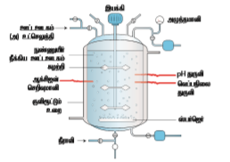

4.2 பாரம்பரிய உயிரிதொழில்நுட்பவியலின்‌ முறைகள்‌ (410045 0\[ 80154௦09))

ஏற்கனவே விவரித்தது. போல்‌ நம்முடைய மூநாதையர்களால்‌.. உருவாக்கப்பட்ட இந்த. சமையலறை தொழில்நுட்பம்‌ தான்‌ ஷநாதிக்க வைக்கும்‌... பாக்மரியங்களை பயன்படத்தியது. எனவே, இது உயிரினங்களில்‌ இயற்கையாக அமைந்த திறன்களை அடிப்படையாக கொண்ட செயல்பாடுகளை உள்ளடக்கியது.

421 நொதித்தல்‌ (ளாள(2100)

நாகித்தல்‌ எனும்‌. சொல்‌ இலத்தீன்‌ மொழியின்‌: \*பற்விர்‌ (ளன லிருந்து பெறப்பட்டது... இது சாய்ச்சு (6 601) என்று பொருள்படும்‌ நொதித்தல்‌. என்பது. வனர்சிதை மாற்றச்‌ செயலில்‌ கரிம: மூலக்கூறுகளை. (பொதுவாக. குளுக்கோஸ்‌) 'ஒதேனும்‌. எலக்ட்ரான்‌ கடத்து சங்கினி அல்லது. ஆக்ஸிஜனற்ற நிலையில்‌ சமிலங்கள்‌, வாயுக்கள்‌ அல்லது. ஆல்கஹாலாக மாற்றுவது. ஆகம்‌. காசிக்கல்‌ மற்றும்‌. அவற்றின்‌ நடைமுறை: பயன்பாடுகளை பற்றிப்‌ படிப்பது சைமோலாஜி ஆரும்‌. (இது 5௧ஆம்‌ ஆண்டு, உருவாக்கப்ப்பது. அந்‌. ஆண்டில்‌ பிரான்ஸ்‌ நாட்டு வேதிமியலார்‌ லூயிஸ்‌. பாஸ்டர்‌ ஈஸ்ட்டினால்‌ நொதித்தல்‌ உண்டாகிறது என்பதை நிருபித்தார்‌. உயிர்‌ வாழ ஆக்சிஜனற்ற. குழல்‌ தேவைப்படும்‌ போது சில வகை. பாக்கியங்களும்‌ பூஞ்சைகளும்‌ நொதித்தலை. “மேற்கொள்கின்றன. உணவு மற்றும்‌ மதுபான கதாழில்களில்‌ எநாதித்தல்‌ செயல்கள்‌ மிகவம்‌ பயன்படக்கவவயதாக உள்ளன. இங்கு ஆல்கஹால்‌

பானங்களை உருவாக்க சர்க்கரை கரைசல்‌ எத்தனாலாக. மாற்றப்படகின்றன... ரொட்டுகளை: உப்பச்மய்ய.. ஈஸ்பால்‌... வெளியிடப்படும்‌. 00, உதவுகிறது... கா்கதிகள்‌. மற்றும்‌. பாஸ்சார்‌ பொருட்களைப்‌ பாதுகாக்கவும்‌ மணலூட்டவம்‌:

பயன்படும்‌ கரிம அமிலங்களின்‌ உற்பத்தியிலும்‌ பயன்படுகிறது

உமிரி வினைகலன்‌ - 00௦௧௦0௭.

(நொதிகலன்‌ ரள)

உமிரிவினைகலன்‌ (நொதிகலன்‌) என்பது. ஒரு: மாத்திரம்‌ அல்லது கொள்கலன்‌ ஆகம்‌. இது வினைபட. பொருட்களுடன்‌ நுண்ணுயிரிகள்‌ அல்லது அவற்றின்‌ திகள்‌ தேவையான பொருட்களை உற்பத்தி செய்வதற்கு. விணைபறியும்‌ வகையில்‌ உகந்த

சுந்திகிய்ில்‌... பயன்படும்‌ உயிரிசதாழில்‌ கம்மிலையை வழங்கக்‌. கூடியதாக வடிவமைக்கப்பட்டு இருக்கும்‌. இந்த உயிரிவினை “உயிறிஷாழில்நுட்பனியல்‌ நஜிமுறைகளும்‌ சயல்முறைகளும்‌ 7?ஹவராடுஞ்௦9ட/

களர்வட்டம்‌ (சரியா), வெப்பநிலை, ள்‌ போன்றவை. கட்டுபு்தப்பட்டிரக்கும்‌, நொதித்தல்‌ மேற்கால்‌ பதம்பரத்தம்‌ மற்றும்‌ கீழ்க்கல்‌ பதப்படித்தம்‌ என இரு செயல்முறைகளை உள்ளடக்கியது. ட மேற்கால்‌ பதப்புத்தம்‌ (ர£்ணா ரா௦௦௯54) சநாதித்தல்‌ தொடங்குவதற்கு முன்பாக உள்ள. அனைத்து... செயல்முறைகளும்‌.. சதாவது நாதிகலனில்‌ நுண்ணுயிர்‌ நீக்கம்‌, தயார்புத்துகல்‌, வளர்ப்பு. ஊடக நுண்ணுயிர்‌ நீக்கம்‌ மற்றம்‌ பொருத்தமான உட்புகட்டலின்‌ (ர௦பபிபா) வளர்ச்சி ஆகியவை மேற்கால்‌ பதப்புத்தம்‌ எனப்படும்‌. கக்கல்‌ பதப்படுத்த (999ாலாகளா 0௦% ாகித்தலுக்கு.. பிறக. உள்ள கனைத்து, 'செயல்முறைகளும்‌ கழக்கால்‌பதப்படத்தம்‌ எனப்படம.

இச்வயல்முறையில்‌ வாலை. ஷடித்தல்‌, 'மையனிலக்கல்‌, விசைக்கு உம்பருக்தகல்‌, வடிகட்டுதல்‌... மற்றும்‌... கரைப்பான்‌... மூலம்‌

மிறித்தெடக்கல்‌ போன்றவை உள்ளடங்கியுள்ளன. பெரும்பாலும்‌ இச்செயல்முறை விரும்பப்படும்‌ விளை பொருளின்‌ தூய்மையை உள்ளடக்கியது.

மடம்‌ க உயிரி உலைகள்‌.

நொதித்தல்‌ செயல்முறை

கெ உற்பத்திப்‌ பொருட்களைச்‌ சார்ந்து உயிரி 'வினைகலன்‌ தேர்ந்தெரக்கப்புகிறு.

ஆ குறிப்பிட வெப்பநிலை, ஸில்‌ பொருக்கமான. 'ஊளர்தளப்‌ பொருள்‌ (௦61) நீர்ம ஊடகத்தில்‌ ே்க்கப்ப்ட பின்னர்‌ நீ்ககப்புகிறது.

இ: இதல்‌ உயிரனம்‌ (நுண்ணுயிரிகள்‌, விலங்கு / தாவர சல்‌, சல்‌ நுண்ணுஜுப்புகள்‌ கல்லது நொதிகள்‌) சேரக்கப்புகிறது.

எ. இது: குறிப்பிட்ட கால. அளவிற்கு குறிப்பிட்ட வெப்பிலையில்‌ வைக்கப்படுகிறது.

உ உமிரினம்‌. காற்றுள்ள. நிலையிலோ அல்லது. காற்றற்ற நிலையிலோ தேவைகேற்ப வைக்கப்பபலாம்‌

ஊெ.கழ்க்கால்‌... பதப்பறத்துதல்‌.. முறையைப்‌ பயன்படுத்தி விளைப்வாருட்கள்‌. பெறப்படுகின்றன.

தொழிற்சாலையில்‌ நொதித்தலின்‌ பயன்பாருகள்‌: ஷநாதித்தல்‌ பின்வரும்‌ தொழில்சார்‌ பயன்பாருகளைக்‌.

கொண்டிள்ளது. அவையாவன: ௩ நுண்ணுமிரி உயிரித்தி உற்பத்த நுண்ணுயிரி செல்களான. (உமிரித்திரள்‌)

பாசிகள்‌, பாக்மரியங்கள்‌, ஈஸ்ட்‌, பூஞ்சைகள்‌ போன்றவை. ஊர்க்கப்பட்டு உலர்த்தப்பட்ட "ஒற்றை வல்‌ புரம்‌ (507) என்றழைக்கப்படும்‌ முழு பரத மூலமாகப்‌ பயன்படுகின்றன. இவை. மணித உணவாகவோ, விலங்கு தீவனமாகவோ. செயல்படுகின்றன. இதற்கு ஒற்றை / தனி ௦2ல்‌. ப்ரம்‌ என்று வயர்‌

௨. நுண்ணுமிரி வளர்சிதை. மாற்றப்‌ வொருட்கள்‌ நுண்ணுயிரிகள்‌ மனித மற்றும்‌ விலங்குகளுக்கு பயனுள்ளதாக இருக்கும்‌ வேதியப்‌ பொருட்களை உற்பத்தி செய்கின்றன... இந்த பொருட்கள்‌

வளர்சிதை மாற்றப்‌. பொருட்கள்‌ என்று, அழைக்கப்படுகின்ற... இவை இரண்ட மிறிவுகளாகப்‌ பிரிக்கப்படுகின்றன.

அட முதல்நிலை. வளர்சிதை மாற்றப்பொருட்கள்‌. நுண்ணுயிரிகளின்‌ உயிர்‌ செயல்முறைகளை பராமரிப்பதற்காக உற்பத்தி செய்யக்கூடியவை முதல்நிலை வளர்சிதை மாற்றப்பொருட்கள்‌. “எனப்படம்‌. எரத்துக்க்காட்ட: எத்தனால்‌, சிட்ரிக்‌ அமிலம்‌, லாக்டிக்‌ அமிலம்‌, அசிட்டிக்‌ அமிலம்‌.

ஆ இரண்டாம்‌நிலை வளர்சிதைமாற்றப்பொருட்கள்‌: 'இரண்டாம்நிலைஊளர்சிதைமாற்றப்வாருள்கள்‌.

நுண்ணுயிரிகளின்‌ முக்கிய. வாழ்க்கை செயல்முறைக்கு... தேவைப்பருவதில்லை. ஆனால்‌... இவை. மதிப்கககூட்டும்‌

தன்மையுடையவை... இவற்றில்‌ உயிரி, எதிர்ப்வாருட்களும்‌ (சபர1001௦2) உள்ளடங்கும்‌.

எடுத்துக்காட்டள்‌; ஆம்போடேரிசின்‌ 8. (ஸ்ஷப்டோமைசஸ்‌ தோடோஸ்‌), பெனிசிலின்‌ (வணிசிவயம்‌ கிரைசோதினம்‌, ஸ்ட்ஷப்டோமைசின்‌. (ஸ்ட்ஷப்டோமைசஸ்‌. கரைசல்‌). உப்ராசைக்ளின்‌.

(ஸ்ட்ஷப்டோமைசஸ்‌ ஆரியோஃபேசியன்ஸ்‌), ஆல்கலாய்டுகள்‌, ச்ச நிறமிகள்‌, வைட்டமின்கள்‌. மற்றும்‌ பிற.

உ. நுண்ணுயிர்‌ நொதிகள்‌: நுண்ணுயிரிகளை வளர்க்கும்‌ போது அவை வளர்ப்பு ஊடகத்தில்‌, 'சில நாதிகளைச்‌ சுரக்கின்றன. இந்த நொதிகள்‌: சோப்பு, உணவு பதப்பரத்தம்‌, மதுபானம்‌. மாவண்த. மருந்தியியல்‌. ஆகிய தொழிற்சாலைகளில்‌ பயன்பருத்தம்படகின்றன. எடுத்துக்காட்டகள்‌: புரோட்டயேஸ்‌, அமைலேஸ்‌, 'ஒசோஷரேஸ்‌, லைப்பேஸ்‌ போன்றவை.

80... வமரிஷூில்ுபபனியல்‌ ஷறிழுறைகளும்‌ வயல்முறைகளும்‌

ஹவராடுஞ்௦9ட/

4.  உயமிர்‌-சார்‌ மாற்றம்‌, உயிர்‌-சார்‌ வேதிய மாற்றம்‌. அல்லது. தளப்பொருள்‌ மாற்றம்‌: நொதிக்க. வைக்கும்‌. நுண்ணுயிரிகள்‌ மதிப்பு மிக்க. 'தயாரிபபுக்களை உற்பத்தி செய்யும்‌ திறனைக்‌: கொண்டுள்ளன... எத்தனாலை... அசிட்டிக்‌ அமிலமாக (வினிகர்‌), ஐசோ புரோப்பனாலை. அசிப்டோனாக, .. சார்பிட்டாலை சார்போஸ்‌: சர்க்கரையாக (வைட்டமின்‌ ௦ உற்பத்திக்கு மயன்மருவது) ஸ்டராலை ஸ்மராய்டாக மாற்ற நொதித்தல்‌ பயன்பருகிறது.

422 தணி செல்புரதம்‌ (909௦ 06 ஈஎஸ்- 509)

தனி ஷல்புரதம்‌ என்பது விலங்கு உணவாக அல்லது.

மனித துணை உணவாக (வற்சானாு 10௦0)

மயன்மருத்தப்படம்‌ நுண்ணுயிரிகளின்‌ உலர்ந்த

சசங்களாகும்‌. தனி சல்‌ புரதம்‌ முழு மனித இனம்‌: திர்‌ கொள்ளும்‌ பரதக்‌ குறைபாட்டிற்கு, தற்காலத்தில்‌ ஒரு தீர்வாக விளங்குகிறது. தனி செல்‌ புரதங்கள்‌ அவற்றின்‌ அதிக புரதச்சத்து, வைட்டமின்கள்‌, அத்தியாவசியமான அமினோ அமிலங்கள்‌ மற்றம்‌ கொழுப்பு பொருட்களுக்கு. காரணமான அதிக ஊட்டச்சத்து பெற்றிருந்தாலும்‌ அவற்றின்‌ அதிக நியூக்ளியர்‌ சுமிலம்‌ மற்றும்‌ மதுவாக ஊரிக்கும்‌ தன்மையின்‌ காரணமாக வழக்கமான பரத ஆதாரத்திற்கு மாற்றாக இருக்க இயலுமா என்பது,

சந்தேகமே... தனி சல்‌. பத உற்பத்தியில்‌ பயன்படுத்தப்பட... நுண்ணுயிரிகள்‌... கீழே. கொடுக்கப்பட்டள்ளன.

உ பாக்கறியங்கள்‌.. -... வத்தைபிலாபில்லஸ்‌.

ஷத்தைலோட்ரோபஸ்‌, செல்லுலோமோனாஸ்‌. அல்கலிதீன்ஸ்‌.

உ ழுத்சைகள்‌ - சோக்கரோமைசட்ஸ்‌, கெண்டிடாயுட்டலிஸ்‌.

உட பாசிகள்‌... ஸ்பைருலினா, குளோவல்லா, கினாமிடோமோனாஸ்‌.

அகாரிகஸ்‌.. கேம்பஸ்டிரிஸ்‌, வர்னீசியே (ஸ்ப,

தனி வல்‌. புரதம்‌ அவற்றின்‌ புரதச்சத்து.

கார்போஹைட்ரேட்கள்‌, கொழுப்புகள்‌, வைட்டமின்கள்‌, தாது உப்புகள்‌ போன்றவற்றின்‌ கருணமாக முக்கியமான... உணவாகப்‌

மயன்மருத்தப்படகின்றன. இவை உணவின்‌ முக்கிய

ஆதார அமைப்பாகிறது. மேலும்‌ இது விண்ெளி

ண்ர்கள்‌ மற்றும்‌ அண்டார்டிக்கா. பயணம்‌:

மேத்வஉாள்ளும்‌

விக்ஞானிகளால்‌.

மயன்மருத்தப்படுகிறது ஞு உருளைக்கிழங்கு இத்தக

மதம்‌ படுத்தப்படும்‌.

தொழிற்சாலைகளிலிருந்து

கிடைக்கும்‌ கழிவுநீர்‌ (ரசம்‌ படம்‌ 4௮ ஸ்பைருலினா.

கொண்டது), வைக்கோல்‌, பொருள்கள்‌.

வவல்லசக்கைப்பாகு, விலங்கு உரம்மற்றும்‌ கிவ்‌ "போன்ற பொருட்களில்‌ ஸ்பைருவினாவை எளிதில்‌ வளர்த்து அதிகளவில்‌ புரதங்கள்‌, தாது உப்புகள்‌, கொழுப்புகள்‌, கார்போஹைட்ரேட்‌ மற்றும்‌ வைட்டமின்கள்‌... நிறைந்த. உணவை. உண்டாக்கலாம்‌. மேலும்‌, இத்தகைய பயன்பாடுகள்‌: சுற்றுச்சூழல்‌ மாசுபாட்டைக்‌ குறைக்கிறது. 20 கி. த்தைலோயில்லஸ்‌. ஹத்தைலோட்றோபஸ்‌, அதனுடைய மிக. திகு உயிரி்திரன்‌ மயன்பாப்டின்‌ மூலம்‌ 25 டன்‌ பரத உற்பத்தியை. உருவாகக்கூட்‌.

தனி ஷ்‌ ரதத்தின்‌ பயன்பாடுகள்‌.

“இது பாக்தி்கு மாற்றாகப்‌ பயன்படுகிறது. “இது ஆரோக்கியமான முடி மற்றும்‌ தோலுக்கான: அழகுப்‌ பொருட்களில்‌ பயன்படு்கப்புகிறு. “இது ரதத்தின்‌ மற்றும்‌ ஊட்டச்‌ சத்துக்களின்‌. சிறந்த. ஆகாரமாக பறவைகள்‌, மீன்கள்‌, கால்நடைகள்‌ போன்றவற்றின்‌ உணவிற்காக.

பரவலாக பயன்பருத்தப்பரகிறது.

“இத... உணவுத்‌... தொழிற்சாலைகளில்‌. முணமூப்டயாக வைப்டமின்‌ கொண்டதாக, அருமனை பொருட்களின்‌ ஊட்டச்சத்து மதிப்பை. அதிகறிக்கும்‌ காரணியாக, கப்புகள்‌, தயார்நிலை. உணவுகள்‌ மற்றும்‌ உணவுக்குறிப்புகளி்‌ பயன்பரத்தப்புகிறத.

2 காகித தயாரிப்பிலும்‌, தோல்‌ பதமப்புக்துகலிலம்‌, நுரை நிலைநிறுக்கியாகவும்‌ இது பயன்படுகிறது.

4௫ நவீன உயிரிதொழில்நுட்பத்தில்‌ ஏற்பட்டுள்ள முன்னேற்றங்கள்‌

நவீன. உமிரஷதாழில்‌ நுப்பமைல்‌ அனைத்து, மரபணு-சார்‌... கையாகைல்‌.. முறைகள்‌, முரோட்போமிளாச இணைவு, சொழில்ந்பங்கள்‌ மற்றம்‌... பழைய. உயிரிஷாழில்றப்பலியல்‌. செயல்முறைகளில்‌ மேற்கொள்ளப்பட்ட மேம்பாடுகள்‌. போன்றவற்றை... உள்ளடக்கியுள்ளது. நலீன. உமிரிஷாழில்நட்பனியலின்‌. ஒரு சில முக்கிய மேம்பாடுகள்‌ கீழே விவரிக்கப்பட்டு்ளன.

431 மரபணு-சார்‌ பொறியியல்‌: மரபணு, சார்‌. பொறியியல்‌ அல்லது. 00%. மறுகூட்டிணைவு ஷதொழில்‌ நுட்பம்‌ அல்லது மரபணு நநகலாக்கம்‌ என்பது ஒரு தொகுப்பான சொல்லாகம்‌. "இதில்‌ வவவ்வேறு சோதனை செயல்முறைகள்‌ உள்ளடக்கப்பப்டள்ளன..... இவை. 0. மாற்றுருவாக்கம்மற்றும்‌ 0515 ஐஒரு உயிரியிலிருந்து. “இருந்து மற்றொரு உயிரக்கு மாற்றுதல்‌ ஆகியவை. நடையபறுகின்றன.

முன்பே சதை ॥.ல்‌. பாரம்பரிய மறுகூட்டிணைவிற்கான: "வரையறையை

உலிஷாழில்றுஃ்பியல்‌ ரஜிழுறைகளும்‌ சயல்முறைகளும்‌.
ஹவராடுஞ்௦9ட/

அறிந்திருப்ீர்கள்‌. பாரம்பரிய மறுகூட்டிணைவு குன்றல்‌ பகுப்பி்‌ போது இந்த... இணை 'குரோமோசோம்களுக்கிடையே ஏற்படம்‌ மரபணு பரிமாற்றம்‌ அல்லது. மறுகூட்ட்ணைவைக்‌.. கறிக்கம்‌ நவீன கொழில்நுட்பத்தைப்‌ மயன்பருக்கி செயற்கையாக. மறுகூட்டிணை வ வசயல்படுத்தப் படுவது மறுகூட்டுணைவு. பம தொழில்நுட்பம்‌(1012 தொழில்நுட்பம்‌) என்றழைக்கப்பருகிறது. மேலும்‌ இது மரபணு. மாற்ற தொழில்நுட்பம்‌ என்றும்‌ அழைக்கப்படும்‌. குறிப்பிட்ட மரபணுவிற்கு குறியீடு செய்யும்‌ 00% ஐ. ஒரு உயிரியிலிருந்து இருந்து மற்றொரு உமிரிக்கு மாற்றம்‌ செய்வதை இந்த சொழில்நுட்பமுறை தன்னகத்தே கொண்டுள்ளது. இதில்‌ குறிப்பிட்ட. தாங்கிக்கடத்திகள்‌ மனம, முகவர்களாக செயல்படத்தப்படுகின்றன அல்லது மின்நுளையிடல்‌ கருவி, மரபணு துப்பாக்கி போன்ற கருவிகள்‌ மயன்மருத்தப்படுகின்றன அல்லது இது விப்போசோம்‌. மூலமோ, வேதியப்‌ பொருட்கள்‌ மூலமோ, நுண்‌:

உப்சலுத்ததல்‌.. நசனைரு.. மூலமோ. மேற்வொள்ளப்படகிறது.

432.  மறுகூட்டிணைவு, பி தொழில்நுட்பத்தின்‌ படிநிலைகள்‌. மறுகூட்டிணைவு 01% தொழில்நுட்பத்தின்‌ மறிலைகள்‌ பின்வருமாறு?

ப நகனாக்கம்‌ செய்யப்படவேண்டிய,

'விரும்பத்தகுந்த, மரபணுவை கொண்டுள்ள 0413: குண்டைத்‌ தனிமைபரத்தகல்‌ . இதற்கு செருகி, (௦௭0 என்று வயர்‌.

உ ஓம்பும்‌... ஹல்லுக்குள்ளேயே சுயமாக. பெருக்கமடையக்கூடிய தாங்கிக்கடத்தி எனும்‌. இரு கடத்தி மூலக்கூறுடன்‌ (904. தண்டுகளை: ெருகுவதினால்‌ மறுகூட்டிணைவு 0146 (01) மூலக்கூறு உருவாக்கப்பருகிறது

“(01% மூலக்கூறை தாங்கியிருக்கும்‌ மாற்றப்பட ஒம்பமிரி செல்களைக்‌ தெர்ந்தெடுக்கல்‌ மற்றும்‌ அவற்றை பருக்கமடைய செய்தல்‌; இதன்‌ மூலம்‌. மும்‌ வருக்கமடைகிறது.

எனவே, இந்த அனைத்து செயலினால்‌ செருகி. அதிகளவு பபமகவையோ.. கல்லது. அஜண்‌. பண்புகளை. வெளிப்படுத்தும்‌ அதிகளவு, பரதங்களையோ உருவாக்குகிறது.

2 எங்கல்காம்‌. தாங்கிக்கடத்திகள்‌. ஈடுபரத்தப்படலில்லையோ சஸ்கல்லாம்‌ அந்த.

படம்‌ 43-ம்‌ ஷாழில்நுட்பததில்‌ உள்ளடக்கிய படிநிலைகள்‌.

'விரும்பத்தகுந்த மரபணு: பாலிமரேஸ்‌ சங்கிலி வினை (606) ஷாழில்றுப்பத்தின்‌ மூலம்‌ வெருக்கமபையர்‌ செய்யப்படிகிறது. இந்த பெருக்கமடைந்த நகல்கள்‌ ஒம்பயிரி சல்லின்‌

புரோப்போபிளாஸக்தினுள்‌. ஊசி மூலமோ. அல்லது... மரபணு... தப்பக்கி மூலமோ ஊுக்சப்புகின்றன.

ஈட பாலிமரேஸ்‌ சங்கலி வினை 00௨ வன்‌ குறிப்பட்ட பகுதியை நகலாக்கம்‌.. (மில்லியன்‌) ஸய்யம்‌ பயன்படுத்தப்படம்‌ பொதுவான ஆய்வக

கொழில்நுட்பமாகும்‌.

4.4 மரயணுப்‌ வொறியியலுக்கான கருவிகள்‌: (7௦061௭ கோ௦1௦ சாரா௨ர்ட)

மெலே... விவரிக்கம்பட்டதிலிறுந்து..... இந்த. கொழில்நுட்பத்தில்‌ சில அடிப்படைக்‌ கருவிகள்‌: மறுகூட்டணைவு. 04%. மூலக்கூறை. உற்பத்தி சசய்வதற்கு தேவைப்படுகிறது என்பது நமக்கு கரிய வருகிறது. அடிப்படைக்‌ கருவிகளாவன நொதிகள்‌, நாங்கிக்கடத்திகள்‌ மற்றும்‌ ஒம்ுவிரிகள்‌. மரபணுப்‌ பொறியியலில்‌ தேவைப்படி்‌ பிக முக்கிய நொதிகள்‌: 'தடைகட்டு நொதிகள்‌ (ஈக்ப்ப00ா. எவவ), 01. -லைகேஸ்‌ மற்றும்‌ ஆல்கலைன்‌ பாஸ்‌ஃபடேஸ்‌. ஆகம்‌.

441 தடைகட்டு நொதிகள்‌ (929/௦10. ய

1985ஆம்‌ ஆண்டுபாக்மறியோஃபாஜின்‌ வளர்ச்சியை. குட்டப்படத்தக்‌ காரணமான இரண்டு. நொதிகள்‌:

25... உமரிஷாில்ுபபனியல்‌ ஷறிழுறைகளும்‌ ஊயல்முறைகளும்‌
ஹவராடுஞ்௦9ட/

ஈஸ்டரச்சியா. கொலையில்‌. இருந்து 'தனிமைப்படத்தப்பட்டன, ஒரு நொதி 014. உடன்‌. மெத்தைல தொகுதியை சேர்க்கிறது. மற்றொரு, நொதி 0116ஐ கண்டிக்கிறது. 0116ஐ துண்டிக்கும்‌ ஷாதி ஷஸ்ட்றிக்ஷன்‌ எண்டோ நியுக்ளியேஸ்‌. ஆகம்‌. இவை 044. மூலக்கூறுக்கள்‌ குறிப்பட்ட அடையாளம்‌ காணக்கூடிய பகுதிக்கு அருகில்‌ அல்லது இடத்தில்‌ 01ப/ஐ துண்டிக்கின்றன. இக்கு தடைகப்டக்‌ களம்‌ (£மவபிச1ஸ. வம) எனப்படம.

இவை ஷயல்பரும்‌ விதத்தின்‌ சடிப்படையில்‌: தடைகப்டு.. நொதிகள்‌ எக்சோறியுக்ளியேஸ்‌. (ராய). மற்றும்‌. எண்டோறியுக்ளியேஸ்‌.

(8ோமராய90020) என வகைப்பருத்தப்படுகின்றன. ௬ எக்சோறியுக்ளியேஸ்‌ நொதி 04. மூலக்கூறின்‌: இரு முனையில்‌ இருந்து நியுக்யோடைடிகளை நீக்ுகிறது.எ-கா:8௮ 31 எக்சோ நியுக்ளியேஸ்॥

ஆ எண்போரியுக்ளியேஸ்‌ தாதி 01% மூலக்கூறின்‌ யாஸ்‌ஃபோ டை எஸ்டர்‌ மட்ட,

உப்பறம்‌ உள்ள பிணைப்பை நீக்குகிறது. எ-கா நவ்ணே ரிபாஸ்‌!

ட்டர்‌

அர்ச்‌ தமஸ்‌ கல்லல்‌ ன்‌ நவவவமக்ன ணைஸ்ஸட \[ட நாட | திமவிஸஸ்‌: நாட | அிரமிஷல்‌. இவரு.

அட்டவணை 4: தடைகட்டு நொதி வகை 1-ன்‌ மூலங்கள்‌,

"அடையாளம்‌ கண்டறிதல்‌ மற்றும்‌ வெட்டப்படும்‌ களம்‌.

ஷஸ்ப்ரிக்ஷன்‌ எண்டோதியுக்ளியேஸ்‌ : மூலக்கூறு குத்தநிகோல்கள்‌.. ஷஸ்ப்ரிக்ஷன்‌ எண்டோநியுக்ளியேஸ்‌ நொதிகள்‌: மூலக்கூறு. கத்தரிகோல்‌ எனப்படும்‌. இவை. மறுகூட்ுணைவு.... 04%. தொழில்நுட்பத்தின்‌ அடித்தளமாக செயல்படுகின்றன. இந்த நொதிகள்‌ பல. பாக்கரியங்களில்‌ உள்ளன. சங்கு இவை பாதுகாப்பு அமைப்பின்‌. பகுதியாக செயல்படுகின்றன. (இவற்றிற்கு தடைகட்டு மாற்றுருவாக்க தொகுதி. (ண்லள்‌ ரனினா) என்று வயர்‌. ஷஷஸ்ப்ரிக்ஷன்‌ எண்டோநியுக்ளியேஸ்‌ மூன்று, ய வகுப்புகளை கொண்டுள்ளது. வகை।, வகை வகை 1. இவை செயல்படும்‌ விதத்தில்‌

௩ ஒன்றிலிருந்து மற்ஷான்று வேறுபடுகின்றன.

உலிஷாழில்றுஃ்பியல்‌ ரஜிழுறைகளும்‌ சயல்முறைகளும்‌.

வகை ॥ நொதி மட்டம்‌ மறுகூட்டிணைவு 0915 சொழில்நுட்பத்தில்‌ அதிகம்‌ பயன்பருத்தப்பருகிறது. பொதுவாக, இது 4- ஐ 60 (௪ ஸ்ட) கொண்டுள்ள ஒரு. குறிப்பிட்ட தொடர்வரிசைக்குள்ளே 010. அடையாளம்‌ கண்டறிந்து துண்டிக்கிறது.. சில. ஷாதிகளுக்கான. எடுத்துக்காட்டகள்‌. அப்டவணையாக 4ல்‌ கொடுக்கப்ப்டுள்ளன.

ஷஸ்ட்ரக்ஷன்‌ நொதி (4 ॥ எப்போதும்‌ குறிப்பட்ட ஷஹிசையில்‌ 6. காரஇிணைகளை அடையாளம்‌: கண்புறிந்து அவ்விடத்தில்‌ 01% மூலக்கூறுகளை நண்டிக்கிறது. அவ்வரிசைகள்‌ அடையாளத்‌ தொடர்‌ வரிசைகள்‌ (௪௦௦ஸாலிரா.. சரசா)... என்று, 'அழைக்கம்படுகின்றன... தற்போது, .. வேறுபட்ட அபையாள தொடற்வரிசையுடன்‌ கூடிய 900 க்கும்‌ மேற்பட்ட தடைகட்ட நொதிகள்‌ 230 வகை பாக்கறியங்களில்‌ இருந்துபிறத்துஎடக்கப்படகின்றன.

இந்த. ஷாடர்வரிசை. தபைகட்டு. களம்‌. 'எனப்பரகிறது. இது பொதுவாக முன்பின்‌ ஓக்க விசை (ண்ணா ஆகும்‌. அதாவது அந்த களத்தில்‌ இரண்டை (ம இழையின்‌ ஷாடர்வரிசையில்‌5' 3 திசையிலம்‌,

௫௪ உ' திசையிலும்‌ வாசிப்பதற்கு ஒன்றாக.

உள்ளது.

எடுத்துக்காட்ட ப/கடலாகபகட இந்த வால்லை. எந்த. திசையில்‌ படித்தாலும்‌ ஒன்றேயாகும்‌.

உரஸ்‌ட்‌.ி.க்‌ ஷன்‌ எண்போறியுக்ளியேஸ்கள்‌ கக்க. வழிமுறைகள்‌ மூலம்‌ பெயரிடப்படுகின்றன. எநாதியின்‌ முதல்‌ எழுந்து பேரினப்‌ வயரையும்‌, அரக்க இரண்டு எழுத்துக்கள்‌ சிற்றினத்தையும்‌, அடுத்து... வருவது உயிரினத்தின்‌... இனக்கூறினையு்‌, "இறுதியாக ரோமானிய எண்‌: அந்தக்‌ கண்டுபிடிப்பின்‌... தொடர்வறிசையையும்‌ குறிப்பிடுகிறது

எடுத்துக்காட்டாக: ஜே. என்பதில்‌ உ - எஸ்ச்சரிசியா, ஸ.- கோலை, ௩ - ஈ1௩. 'இனக்கூறினையும்‌, | - கண்டுபிட்கப்பட்ட முதல்‌. 'எண்போறியுக்ளியேலையும்‌ குறிக்கிறது.

முன்பின்‌ ஒத்த தொடர்வரிசை மாறிகள்‌: (ஸ்ன்றார ரை) 01% இழைகளிலுள்ள ஒரு சமச்சீரான மாறி தொடர்வறிசை

சட வளாகாகாக்காம-௧

2-ளகளளளாக0 ௧

கற்ப. கர. இணைகளின்‌: கஷாடர்வரிசை முதல்‌ வரிசையை ஒப்பிடும்‌ போது, மறுகலை திசையிலும்‌ (1௦/௭௦ சொல்ர) ஒரே மாதிரி உள்ளதைக்‌ காணலாம்‌.ஹவராடுஞ்௦9ட/

ஒரு மரபணு. நகலாக்கர்‌. சோதனையின்‌. வடிவமைப்பில்‌ ஒரு தடைகட்டு நொதியினால்‌ உண்டாக்கப்படும்‌. சரியான. வகை... பிளவு முக்கியமானதாகும்‌, ஒரு சில தடைகட்டு நொதிகள்‌ “இரண்டு 01ம்‌ இழைகளின்‌ மையப்பகுதியின்‌ ஊடே பிளவு ஏற்படுத்துவதன்‌ விளைவாக மழுங்கிய (பா) அல்லது பறிக்கப்பட்ட முனை (யஸ்‌. ராலி உண்டாகிறது. இவை சமச்சீர்‌ துண்டிப்புகள்‌ என அழைக்கப்படுகின்றன. சில நொதிகள்‌ 00% ஐ. வெட்டும்‌ போது தீட்டிக்‌ கொண்டு காணப்படும்‌ முனைகள்‌ உண்டாகின்றன. இவை ஒட்டம்‌ (50௦4) அல்லது ஒட்டிணைவான (601௦4(6) முனைக்‌ அழைக்கப்படிகின்றன.... இந்தகைய வெட்டுகள்‌ சமச்சீரற்ற வட்டுகள்‌ எனப்படுகின்றன.

ந்தா கொடிய எறி

ரத நத நன ப பலவமக வக்‌

புட. மறுகூட்டிணைவு... தொழில்நப்பத்தில்‌, முக்கிய பங்கு வகிக்கின்ற வேறு இரண்டு நொதிகள்‌ '0ிமி லைகேஸ்‌ மற்றும்‌ ஆல்கலைன்‌ பாஸ்‌ஃபடேஸ்‌ ஆமம்‌.

442 010 லைகேஸ்‌.

00 லைகேஸ்‌ நொதி இரட்டை இழை 0112 (44000) வீன்‌ சர்க்கரை மற்றும்‌ பாஸ்‌ஃபேட்‌ மூலக்கூறுகளை 5- 80, மற்றும்‌ ஒரு 2

வினையில்‌ சேர்க்கின்றது. இது 1, 3 மிறித்தெரக்கப்படுகிறது. ஷீகல்‌ வினை

கைஸ்‌.

ண.

449 ஆல்கலைன்‌ பாஸ்‌ஃபடேஸ்‌. ஆல்கலைன்‌ பாஸ்‌ஃபடேஸ்‌ என்பது 05%வை மாற்றி அமைக்கும்‌ ஒரு நொதியாகும்‌. இது இரட்டை இழை: 01-வின்‌ (0140) 5\] முனைப்‌ பகுதியில்‌ சுல்லது.

ஒற்றை இழை 014 வில்‌ (-0113) அல்லது (11ல்‌ குறிப்பட்ட பாஸ்‌ஃபேட்‌ தொகுதியை சேர்க்கிறது அல்லது... நீக்குகிறது... இதனால்‌. அது சுய-கட்டறுத்தத்தை (2 \[ராபா\] தடுக்கிறது. இது பாக்கரியங்களிலிருந்தும்‌ கன்றுக்குட்டி சிறுகுடல்‌ பகுதியிலிருந்தம்‌ பிறிதததடக்கப்புகிறது.

3 வங்கம்‌. னு அங்கள்‌ பல்பம்‌.

படம்‌ ௧௧: ஆல்கலைன்‌ பாஸ்‌ஃபடேஸ்‌ செயல்பாடு,

444 தாங்கி,

பத்தி (4201௦9)

மரபணு, நகலாக்க. சோதனையின்‌ மற்றாரு முக்கியக்‌ கூறு மிளாஸ்மிட்‌ போன்ற ஒரு 'தாங்கக்கடத்தியாகும்‌. ஒரு தாங்கிக்கடத்தி என்பது சுய இரட்டிப்படையக்‌ கூடிய ஒரு சிறிய 04. மூலக்கூறாகும்‌. இது ஒரு கடத்தியாக செயல்படுகிறது. மற்றும்‌ நகலாக்கப்‌ பரிசோதனைக்காக அதனுள்‌ ஒெருகப்பட்ட ஒரு 0144. துண்டின்‌ கடத்தியாக பயன்பருத்தப்படகிறது. தாங்கிக்கடத்தி நகலாக்க. சர்தி (பரம பஸ) அல்லது ந \[ட (ண்டி. 06). என்றும்‌ அழைக்கப்பரகிறது. காங்கிக்கடத்திகளில்‌ இரு வகைகள்‌ உள்ளன. (1) நகலாக்கத்‌ தாங்கிக்கடத்தி (பென்று பக௦ (2). வெளிப்படுத்தும்‌ (ஸ்மால்‌. 019) தாங்கிக்கடத்தி. நகலாக்கத்‌ தாங்கிக்கடத்தி பொருத்தமான ஒம்புிறி செல்லுக்குள்‌ நகலாக்க 01% செருகலை (பிய6-௬௧ள).. நகலாக்கம்‌ செய்ய பயன்பரு்தப்படுகிறது. வெளிபடுத்தும்‌ தாங்கிக்கடத்தி ஒம்புயிறினுள்‌ பரத்தை உண்டாக்குவதற்கான 014. ெருகியை வவளிப்பாடடைய உதவுகிறது.

நாங்க்கடத்தியின்‌ பண்புகள்‌: நாங்கக்கடததிகள்‌.... ஓம்பி... சல்லு்கள்‌ வெற்றுடைய (4 ஊருகலுடன்‌ கூடவேபலைடங்கு நகல்களின்‌... உற்பத்திக்காக... தன்னிச்சையாக, வெருக்கமபையும்‌ திறனுடையது

25... உமரிஷில்ுபபனியல்‌ ஷறிழுறைகளும்‌ வயல்முறைகளும்‌

ஹவராடுஞ்௦9ட/

ட பவை,

கறு அனவில்‌ சிறியதாக இருக்க வேண்டும்‌; குறைந்த. மூலக்கூறு. எடை கொண்டருக்க வேண்டும்‌, அதாவது 2௦ கிலோபேக்ு்‌ (06) குறைவான. அளவை. எடையுடையது... இதன்‌ காரணாமாக ஒமபுயரி செல்லுக்குள்‌ நுழைகல்‌ மாறுதல்‌ எளிதாகிறது.

தாங்கக்கடத்தி. பெருக்கமடைகலுக்கான இரு தோற்றுவியை (0) கொண்டிருக்க வேண்டும.

இது உயிறிஎதிர்ப்வாருள்‌ தடுப்பு போன்ற வொருக்தமான அடையாளக்‌ குறியை (௭). கொண்டிருக்க வேண்டும்‌. இதனால்‌ மரபணு மாற்றமடைந்த ஒம்புயிரி செல்லுக்குள்‌ அதனை! அடையாளம்‌ கண்டறிய முலயும்‌

தாங்கிக்கடத்தி

ப0%. வரகும்‌. உடன்‌

ஒருங்கிணைவதற்கு. கணிப்ப்ட. இக்கல்‌ 'ஊளங்களைப்‌ வற்றிருக்க வேண்டம்‌ மற்றம்‌ அது நாங்கபிருககம்‌ 013. ஊருகல்‌ உடன்‌ சேர்ந்து ஏபி ஸ்லின்‌ மரபணு தொகையத்துடன்‌

ஒருங்கிணையுல்‌.. திறனைப்‌ பெற்றிருக்க. வேண்டும்‌... பெரும்பாலான சாதாரணமாக பயன்படுத்தக்க்ஷய நகலாக்க

தாங்கிக்கடத்திகள்‌. ஒன்றிக்கும்‌ மேற்பட்ட 'தடைகட்டு தளங்களைக்‌ கொண்டுள்ளன. இவை. பல நகலாக்க களங்கள்‌ (106 மொடு 90- 1405) அல்லது பல இணைப்பான்கள்‌ (”யப/4௪\] “எனப்படம்‌. பல நகலாக்க களங்களின்‌ (1/09) இருப்பு தேவைப்படிம்‌ தடைகட்டு நொதிகளின்‌:

பயன்பாட்டிற்கு வழிவகை செய்கிறது. ஒர தாங்க எளிகாகுவதற்கு தேவைப்படுகின்றன. வரப்பட்ட

யம மம்‌ வண்‌ பிடதி கென்‌ பண மவ்த்‌ ணி

கேத்கைலல “ற?

படம்‌ க: தாங்கிக்கடத்தியின்‌ பண்புகள்‌

உ வருக்கமடைதலின்‌. தோற்றம்‌. (09௭. ஈரி - ரர: இந்த ஷாடர்வரிசையிலிுந்து நான்‌ கப்ிப்பதல்‌ ஷொடங்கப்பரகிறது. இந்த தொபர்விசையன்‌ ஒரு துண்டி மம. இணைகக்கம்பட்பல்‌. ஒம்புவிர. ஊல்லுக்கள்‌. அதனைப்‌ ருக்கமடையர்‌ சசய்ய மும்‌

உட தேர்ந்ததடக்கும்‌ அடையாளக்குறி (56௦-௯௦௧ ஈன): கய்‌ சேர்த்த தாங்கக்கடத்தக்க ஒரு கேர்க்தைக்கம்‌ அடையாளக்குறி 'ஜேவைப்படுகிறது. இது மரபணு மாற்றமடையாத. ஊல்களை அடையாளம்‌ கண்டறிந்து அவற்றை. நீக்குவதிலும்‌ மரபணு மாற்றமடைந்த செல்களின்‌ வணர்ச்சியை தேரறகுத்து அனுமதிக்கிறது.

௩. நகலாக்கக்‌ களம்‌ (மோ 31) அன்னிய 014.௯ இணைக்கும்‌ பொருட்ட, தாங்கிக்கடத்திக்கு சில களங்கள்‌ இருப்பினும்‌ ஒரே ஒரு சடையாளக்‌ கனம்‌ வரம்பத்ககககாக உள்ளது.

காங்கக்கடததியன்‌ வகைகள்‌:

ஒரு. சில. தாங்கிக்கடத்திகள்‌ கீர. விரிவாக.

விவரிக்கப்பட்ன்ளன.

உலிஷாழில்றுஃ்பியல்‌ ரஜிழுறைகளும்‌ சயல்முறைகளும்‌.ஹவராடுஞ்௦9ட/

மிளாஸ்மிட்‌ மிளாஸ்மிட்‌ என்பது. மா க டிரிய

குரோமோசோமைந்‌:

தண. பாக்கறிய

பசல்‌ களில்‌ மய ட ஸ்வம்‌

குரோமோசோமிற்கு “771௨௮

வளியே காணம்பரும்‌ படம்‌ கக. பாக்மரிய

தன்னிச்சையாக குரோமோசோம்மற்றும்‌ மினாஸ்மிட்கள்‌

பெருக்கமடையக்‌. கூடிய இரட்டை இழை: (கே ன்பபன பம) வட்ட ஷவ0143 மூலக்கூறு ஆகம்‌. பிளாஸ்மிட்‌ அவற்றுடைய வந்த. பெருக்கமடைவதற்கான மரபணுசார்‌ தகவல்களைக்‌ கொண்டுள்ளது.

99% 522 பிளாஸ்மிட்‌

(9௨௭22 மறுக்கட்டமைக்கப்பப்ட பிளாஸ்மிட்‌ ஆகும்‌.இது நகலாக்க தாங்கக்கடத்தியாக அதிகமாகப்‌ மயன்பருத்தபபுகிறது. இது 4361 ௫ கொண்டுள்ளது. (ண்ல்‌ ந என்பது பிளாஸ்மிட்‌ 8 ம்றும்‌ 8 முறையே. பிளாஸ்மிட்‌ உருவாக்கிய கறிவியல்‌ அறிகுர்களின்‌: பெயர்களான பொலிவர்‌ மற்றும்‌ ரோட்டிரிகுஸ்‌ ஆகிய "இருவரையும்‌ குறிக்கின்றன... 322. என்ற எண்‌: அவர்களுபைய ஆய்வகத்தில்‌ உருவாக்கப்பட்ட ிளாஸ்மிப்டின்‌ எண்ணிக்கையாகம்‌. இதில்‌ இரண்ட வேறுபட்ட உயிரஎதர்ப்போருள்‌தடப்பு ஏபணுக்களும்‌ (னர பஸ) பல தடைகட்ட ஹொதிகளுக்கான (401. கிடார்‌ (வ (வே |. 2801) 0௨) அடையாளக்‌. களங்களும்‌ மற்றும்‌. 0 மரபணுவும்‌ உள்ளன. பிளாஸ்மிட்‌ வருக்கமடைவதில்‌ ஈட்டம்‌ புரதங்களும்‌. ௫௧ கறிமீட செய்கிறது.

ருமினாஸ்மிட்‌

மினாஸ்மிட்‌ பல. 'இருவிதையிலைக்‌ தாவரங்களில்‌ கழலைகளைச்‌ தூண்டுவதற்கு

காரணமான “மம அக்றோயாக்ரியம்‌. டியுமியேசியன்ஸ்‌ படம்‌. 40:71 பிளாஸ்மிட்‌

மாக்டீறியத்தில்‌ காணப்பருகிறது. இது மாற்றும்‌ (1௦) மரபணுவைத்‌ தாங்கியுள்ளது. மற்றும்‌ இது 7- 0ப/வை ஒரு

பாக்கரியத்திலிருந்து மத்ஹொரு பாக்கியம்‌ அல்லது தாவர செல்லிறகு மாற்றுவதற்கு உதவுகிறது. இந். பிளாஸ்மிட்மாற்றும்‌ மரபணுவை எரத்தச்‌ செல்கிறது. "இது புற்று நோயூக்கக்கான. 0௨. மரபணு. வெருக்கமடைதலுக்கு. தேவையான ரர. மரபணு மற்றும்‌ ஒவ்வாத்தன்மைக்கான 10௦ மரபணுவை. “இந்த பிளாஸ்மிட்‌ பெற்றுள்ளது. பிளாஸ்மிப்டன்‌ 7. பு... தாவரஃ0ம்‌.. உடன்‌... நிலையாக ஒருங்கிணைக்கப்படுகிறநு..... அக்ரோோயாக்வரியம்‌ மொஸ்மிட்கள்‌ தாவரங்களில்‌ விரம்பத்தக்‌ பண்புகளுக்கான மரபணுக்களை நுழைப்பதற்கு பயன்பருகிறது

44௧ தகுந்த ஒம்புமிரி (மொழி. 108) (மறுகூட்டிணைவு 0144 கொண்டு மரபணு மாற்றம்‌ செய்வதற்கான)

ஒரு உயிர்‌ தொகுதி அல்லது ஒம்புிரக்கள்‌. மறுகூட்டிணைவு 0914. மூலக்கூறுகள்‌ பெருக்கம்‌ அடைய வேண்டும்‌. ஈ.கோலை, ஈஸ்ட்‌. விலங்கு அல்லது தாவர ஊல்கள்‌ போன்ற பல வகை ஓம்பி 'சல்கள்‌ மரபணு நகலாக்கத்தில்‌ காணம்படுகன்றன. ஒம்புமிர்‌. ங்களின்‌ வகை நகலாக்கர்‌ சோதனையைச்‌ சார்ந்தது. ஈகோலை பெரும்பாலும்‌ அதிகமாகபயன்பரக்கப்பம்‌ உயிரியாகம்‌. ஏனனில்‌. 'இகணுடைய மரபணு அமைப்பு வீறிவாக ஆய்வு செய்யப்பட்டது. இதனை எளிதில்‌ கையாளவும்‌, வனர்க்கவம்‌.... முடியும்‌... மல்வேறு வகை காங்கக்கடத்திகளைஎற்கும்மற்றும்பாதகாபமிக்கு. “ஓர்‌ ஏம்புமிர்‌ மல்லாக ஈகோலையை விருப்பத்‌ தேர்வு சய்வதற்கு ஒரு முக்கியமான பண்பு உக்க. வளர்ப்பு நிலையில்‌ இதன்‌ ல்கள்‌ ஒவ்வவாரு 2௦ ிமடத்திறகம்‌ இரண்டாக பகுப்படைகின்றன.

(4 ஒரு ீர்‌ விரும்பம்‌ மூலக்கூறு என்பதால்‌ அது ல்சவ்வுகள்‌ ஊடே கடக்க முடியாது. பிளாஸ்மிட்டை கப்பாயமாக . பாக்சரியங்களுக்குள்‌ . நுழைல்‌ பாக்கரிய மங்கள்‌ 09%. ஐ எடந்துக்‌ கொள்ள 'தகுந்தவையாக மாற்ற வேண்டும்‌. இதற்கு கால்சியம்‌: போன்ற இரு பிணைப்பு உடைய நேர்கயனியைக்‌. கொண்ட ஒரு குறிப்பட்ட ஊறிவில்‌ பாக்மரிய செல்கள்‌ "வைக்கப்பட வேண்டும்‌. பின்புமறுகூட்டிணைவு 0114. (இத்தகைய. மல்களில்‌.. கப்பாயமாக, நுழைக்கப்படகிறது. இதற்கு இந்த செல்கள்‌ மறு கூப்முணைவு.. 006. உடன்‌ பனிக்கப்டயில்‌ 'வைக்கம்பருகின்றன மற்றும்‌ இதனைத்‌ தொடர்ந்து (குறுகிய காலத்திற்கு 421௦ (வெப்ப அதிர்ச்சில்‌ வைக்கப்பட்ட. மற்றும்‌ சுதன்‌ பின்பு மீண்டும்‌ மனிக்கட்டியில்‌... வைக்கப்படகின்றன..... இறு மறுகூட்டிணைவு 01% வை பாக்சரியங்கள்‌ எடத்க்‌ கொள்வதற்கு ஏதுவாக்கிறத,

உண்மையுட்கரு. புரதங்களை வெளிப்பாடு அடையச்‌ செய்ய உண்மையுட்கரு செல்கள்‌ விருப்பத்‌ பயன்பருத்தப்படுகின்றன... ரனனில்‌ ஒரு சசயல்திறன்‌ வாய்ந்த பதத்தை உண்டாக்குவதற்கு

85... உமரிஷில்ுபபனியல்‌ ஷஜிழுறைகளும்‌ ஊயல்முறைகளும்‌ஹவராடுஞ்௦9ட/

“ந்த ஸர்‌ சரியாக மடப்படைய வேண்டம்‌ மற்றும்‌. கவல்‌ பெயர்விற்கு பின்‌ ஏற்படும்‌ மாழ்றங்களும்‌ முற்பட வேண்டும்‌, இது ஷால்லுட்கரு ல்களில்‌. (ஈம்காலை சாத்தியமில்லை. 45 மரயணு மாற்ற முறைகள்‌ மறுகூட்டுணைவு 010 மூலக்கூறு உருவாக்கிய பின்னர்‌ அடத்த படநிலை அவற்றை பொருத்தமான: ம்பமிர்‌செல்லில்நுழைந்கலாகம்‌ மறுகூட்டிணைவு, தாங்கக்கடத்திகளை நுழைப்பதற்கு பல. செயல்முறைகள்‌ உள்ளன. அவை நாங்கிக்கடத்தி வகை: மற்றும்‌. ஒம்புமிரி சல்‌ போன்ற பல. கரணிகளைச்‌ சார்ந்தது. தாவரங்களில்‌ மரபணு மாற்றத்தை அடைவதற்கு பெப்படை முன்‌ தேவையாக தாங்கிக்கடத்தியை. கப்டமைப்ப செய்ய வேண்டம்‌. இந்த தாங்கக்கடத்தி மரபணுவை தாங்கிர்‌ செல்கிறது. இந்த மரபணு. அதன்‌ இரண்டு பக்கமும்‌ தேவையான கட்டப்பாட்ி கொடர்வறிசைகளால்‌ கழப்ப்டள்ளது. சதாவது ர. முன்னியக்கி (ராவ) மற்றும்‌ ஒரு முடிவறுக்கி (ரன்ன) ஆகியவற்றால்‌ கழ்பட்டள்ளது. பின்பு இந்த. மரபணுக்கள்‌ ஒம்புயிரி தாவரத்தில்‌ வைக்கம்படகிறது தாவரங்களில்‌ இரண்டி வகையான மரபணு. மாற்ற முறைகள்‌ உள்ளன. அவை “நேரடி (௪ தாங்கிக்கத்தி சற்ற மரபணு மாற்றம்‌ டப்‌ ஷம டன (னன) மறையக்‌ (ச) தாங்கிக்கபததி வழி மரபணு மாற்றம்‌ (மில்ஸ்‌ - ஈவ்ஸ்ம ர:௯. மு,

"நேரடி அல்லது தாங்கிக்கடத்தி அற்ற மரபணு மாற்ற. முறையில்‌ விரும்பத்ககுந்த அயல்‌ மரபணுவை தாங்கிக்கடத்தி உதவி இல்லாமல்‌.

ஓம்பும்‌ தாவரக்திற்கள்ளாக செலுக்தப்படகிறது...... பின்வருவன: தாவரங்களில்‌ நேரடி மரபணு, மாற்றத்திற்கு. சில. வாதுவான. முறைகளாகம்‌.

அ.வேதியியல்‌ வழி மரபணு மாற்றம்‌: பாலி எத்திலீன்‌ கிளைக்கால்‌ மற்றும்‌

கோட வம புரோட்டோபிளாஸ்ட்களுக்குள்‌

மரபணு மற்றம்‌ செய்ய 00/வை நேரடியாக ஒர, மிக நுண்ணிய முனையடைய கண்ணாடி ஊரி இல்லது. நுண்‌ மப்வட்டினைப்‌ பயண்படுத்தி உட்கருவினுள்‌ உட்வுக்கப்புகிறது. முரோட்போபினாஸ்ட்கள்‌ ஒரு திடதாங்கியின்‌ மேல்‌. (ுண்ணோக்கி கண்ணாடி. தகப்டன்‌ மேல்‌. வைக்கப்பட்ட அகரோஸ்‌) நகற்வு முடக்கம்‌ யயபபருகின்றன. அல்லது உறிஞ்சு நிலையில்‌ மீம்ட்டால்‌ நிலைநிறுத்தி வைக்கப்படுகிறது

இ.மின்நுளையாக்க முறையில்‌ மரபணு மாற்றம்‌ (டாமல்‌ ஐவி 61 ஜம ஈவ்‌)

புரோட்போபிளாஸ்ட்கள்‌. செல்கள்‌ அல்லது, திசுக்களுக்கு. உயர்‌ மின்னழுத்த விசை கொருக்கப்படகிறது. இது பிளாஸ்மா சவ்வில்‌

தற்காலிக துளைகளை உண்டாக்குகிறது. இந்த துளைகள்‌. மூலம்‌ தல்‌ 00%

உள்ளருக்கப்புகிறது

படம்‌ கர மின்துணையாக்க முறை மரபணுமாற்றம்‌ ஈ.லிய்போளோம்‌. வழி மரமணு மாற்ற முறை செயற்கை. பாஸ்போ எபி லிப்போசோோ்கள்‌ என்ற நுண்பைகள்‌ மரபணு மாற்றத்தில்‌ பயன்‌ உள்ளவையாக உள்ளன. மரபணு கல்லது 0. வம்போசோமிலிறந்து... தாவர. ங்களின்‌ நுண்பைகளுக்கு மாற்றப்படகின்றது. இது காற்று உறை. கட்பட்ட பிவினால்‌...நண்கமிழ்‌ க்கள்‌. நாங்கிர்‌ ஹல்லப்பகிறது... இந்த ஷாழிக்நுட்பமுறை அனுகூலமானது, ஏனனில்‌.

2௨௫

இும்வை. எடுத்துக்‌. கொள்ளம்‌. ்‌ தூண்டிகின்றன. வலை ஆநுண்‌ உட்ணலுத்தகல்‌ (ரனமமுவளை) | தாவ ஊல்களை படம்‌ ம: லிப்போசோம்‌ மரபணுமாற்றம்‌. உலிஷாழில்றுஃ்பியல்‌ ரறிழுறைகளும்‌ சயல்முறைகளும்‌. 57

ஹவராடுஞ்௦9ட/

லைபோசோம்‌ நுழைக்கப்பப்ட0ப//வைநுண்குமிழ்‌ 'பைகளிலுன்ள அமில நர்‌, புரோட்சயேஸ்‌ நொதி. ஆகியவற்றால்‌... ஏற்படும்‌... சிதைவிலிரந்து பாதுகாக்கிறது. மரபணு மாற்றத்தின்‌ விளைவாக. லப்போசோம்‌. மற்றும்‌ காற்றுக்‌. குமிழியின்‌ போனோபிளாஸ்ட்‌ இணைகிறது. இந்த ஊயல்முறை லிப்போவக்சன்‌ என்று பயர்‌.

உ பையோலிஸ்டிக்முறை:நுண்ணியதங்க கல்லது. டங்ஸ்டன்‌(1-போரரதுகள்களால்பூச்சு சய்யப்பட்ட அயல்‌ ப இலக்கு திச அல்லது செல்களின்‌ மீது குகள்‌ கப்பக்கியை (மரபணு துப்பாக்கி (ரள ஓ) / நுண்‌ எறிதல்‌ தப்பாக்கி (ரஸ ஜட: ௦) /ஷடி்புத்‌ தப்பக்கி (பர) பயன்படுத்தி அதிக விசையுடன்‌ செழுத்தப்புகிறது. பின்பு தாக்கப்பட்ட செல்கள்‌ அல்லது திசுக்கள்‌ தேர்வு செய்யப்பட்ட ஊடகத்தில்‌ வளர்க்கப்படகின்றன. இதன்‌. மூலம்‌. மரபணு... மாற்றமடைந்த ல்களிகிரு்து தாவரங்களை மீளுருவாக்கம்‌ செய்யமுடியும்‌ (டம்‌ 410).

42 மறைமுக அல்லது தாங்கிக்கடத்தி வழி மரயணு மாற்றம்‌:

ஒரு. பிளாஸ்மிட்‌ தாங்கிக்கடத்தி உதவியோடு ஏற்படத்தப்பும்‌ மரபணு மாற்றம்‌ மறைமுக அல்லது. 'ாங்கிக்கடத்தி வழி மரபணு மாற்றம்‌ எனப்படுகிறது. 'தாவற மரபணு மாற்றத்திற்கு பயன்படுத்த்படும பல்வேறு தாங்கிக்கடத்திகளில்‌ முக்கியமாக மயன்பருத்தப்பவது, அக்ரோபாக்கறியம்‌ முயுமிப்பசியன்ஸின்‌ 71 பிளாஸ்மிட்‌ ஆகும்‌. இந்த பாக்கியம்‌ ிளாஸ்மிட்‌(கழலையை உண்டாக்கும்‌) என அழைக்கப்படும்‌. பிளாஸ்மிட்டையும்‌. பெரிய பரிமாற்ற 01ய%வின்‌ (7-0பிட- கடத்து 06) ஒர பகுதியையும்‌. கொண்டுள்ளது... இவை. தொற்றுகலுக்குள்ளாகும்‌ செல்களின்‌ தாவர மரபணுக்‌ தொகையத்திற்கு மாற்றப்பட்டு தாவர கழலையை (மகுட கழலை-0௦௭ 041) உண்டாக்குகின்றன. “இந்த பாக்மரியத்திற்கு அதணுடைய பிளாஸ்மிட்டன்‌ 7-0\] மூ பகுதியை தாவர மரபணு தொகையத்கிற்கள்‌ செலுத்தக்கூடிய இயல்பான திறன்‌ உள்ளதால்‌, காயமடைந்த களங்களில்‌ உள்ள செல்கள்‌ தொற்றுகல்‌

உ. மக்கா. கதன்‌

மரபணு தப்பி பபாய்‌

ய்‌ னை நிரைமிரகினாம்‌

முமடபபட, ப கடந்த

பப்பட்‌ நங்க தகர்‌,

அலன்‌ இக்கு நார படம்‌ க: மரபணு தப்பக்கிவழி மரபணுமாற்றம்‌

பெபைகின்றன.... இதன்‌. காரணமாக... இது, தாவரங்களின்‌ இயற்கை மரமணும்‌ பொறியாளர்‌ என்றும்‌ அழைக்கப்படுகிறது.

அயல்‌ மரபணுவும்‌ (சக்தக்காட்டாக பூச்சிகளின்‌ தாக்கத்திற்கு தடை ஏற்படுத்தும்‌ 81 மரபணு! தாவர. தேர்வு அடையாளக்‌ கறிமரபணுவம்‌ (இது பொதுவா! ரப போன்ற உயிரி எதிர்ப்‌ பார்‌ மரமணுவாகம்‌; “இது கேனாமைசீன்‌ என்ற உயிறிகதிற்ப்வோருளுக்கு தடையை உண்டாக்குகிறது) 11 பிலாஸ்மிட்கள்‌. "பிட பகுதியில்‌ நகலாக்கம்‌ செய்யப்படுகின்றன. இவை... தேவையற்ற. 0. ஷாடர்வரிசை இடங்களுக்கு... பதிலாக... நகலாக்கம்‌ செய்யப்படுகின்றன (படம்‌ 414.

ளு கம்ப்‌. நங்க நகளுபன்‌: மினல்‌ தப

48... மறுகூட்டிணைவு. செல்களுக்கான. சலிக்கை செய்த்‌ (82 (௭ ௯௦ம்‌)

பொருத்தமான ஒம்புயிர்‌ செல்லில்‌ மறுகூட்டிணைவு முமஃவை நுழைத்த உடன்‌ 10145 மூலக்கூறைப்‌ பெற்ற செல்களை அடையாளம்‌ கண்டறிவது மிகவம்‌ அவசியமாகும்‌. இந்த செயல்‌ சலிக்கைச்‌ செய்தல்‌

"று தன ரமேஷ்‌ பிய ஸமனுனை அப்தலறு.

நவ வெ சை,

டக

செப்ப வதம்‌ மிகரனயம்‌ பத பவப்‌. கணநக ன

படம்‌ 44: தாவரங்களில்‌ அக்றோயாக்கரியம்‌ டயூமிபேசியன்ஸ்‌ வழி மரபணுமாற்றம்‌.

உமிரிஷாழிலநப்பவியல்‌ ஷரிழுறைகளம்‌ ஊயல்முறைகளும்‌ஹவராடுஞ்௦9ட/

(௭சன்டு.. என்று... அழைக்கப்படுகிறது. மறுகூட்டிணைவு. அடைந்த செல்லில்‌ உள்ள தாங்கிக்கடத்தி அல்லது அயல்‌ 04%. பண்புகளை வெளிம்பரத்துகின்றது. மாறாக மறுகூட்டிணைவு அடையாத. செல்கள்‌ இந்த பண்புகளை வெளிப்படுத்துவது இல்லை. இதற்காக சில முறைகள்‌ மயென்மருத்தப்படகின்றன. அவற்றில்‌ ஒரு முறை நீலம்‌

*   வெண்மைத்‌ தேர்வு முறையாகும்‌.

4௫1. உட்ஷருகுதல்‌ செயலிழப்பு - நீலம்‌ - வெண்மை காலனி தேர்வு முறை

“இது மறுகூட்டணைவு பிளாஸ்மிட்டை சலிக்கைச்‌ செய்ய பயன்படுத்தப்படம்‌ ஒரு திறன்‌ மிக்க முறையாகும்‌. இம்முறையில்‌ (௦௦2 என்ற ரிப்போர்டர்‌ மரபணு, ஐ தாங்கிக்கடத்தக்குள்‌ செருகப்பரகிறது. (இந்த டி: -காலக்போசிடேஸ்‌ என்ற நொதிக்கு 'குறிமீம ஊய்கிறது. மேலும்‌ இது தடைகட்டி நொதிக்கு மல அடையாளக்‌ களங்களை கொண்டுள்ளது.

9 - கி என்றழைக்கப்படம்‌ (கபுரோமோ -4. குளோரோ -. இண்டோலைல்‌ - - ௦ - காலக்போபைரனோசைப்‌) செயற்கை 'தளப்பொருட்களை - காலக்டோசிடேஸ்‌ உடைக்கிறது. மற்றும்‌ கரையாத நீல நிற விளையாருளை உருவாக்குகிறது. ௦௦2 க்குள்‌ சுயல்‌ மரபணுவை. வைக்கும்‌ போது இந்த மரபணு செயலிழக்கிறது. எனவே நீலநிறம்‌ உண்டாகாது. வெண்மை நிறம்‌ காணப்பருிறது. ஏனனில்‌ (6௦2 செயலிழப்பீனால்‌. \[/-காலக்டோசிடேஸ்‌. உண்டாக்கப்படவதில்லை. எனவே. தளப்போருளில்‌. வண்மை நிற காலனிகளை உருவாக்கும்‌. 91% கொண்ட ஒம்புயிரி சசல்‌டடமக்‌ ஐூயற்றுள்ளன. மாறாகமறுகூட்டிணைவு 91ம்‌ வற்றிராத இதர ல்கள்‌ நீலநிற காலனிகளை உண்டாக்குகின்றன. காலனி நிற அடிப்படையில்‌

மறுகூட்கிணைவு அடைந்த. சங்கள்‌ சதறிவு,

ஒெய்யப்புகன்றன.

பெல்லி ப துட்ட

திண எபபநிதர்‌ டட ட என்கை

ர்க த்‌ வம லு மர்‌ வலம ப மகா

மவ ௧௫. படம்‌.4:%:௯.நீல-வெண்மைக்காக. வடிவமைக்கப்பட்ட பிளாஸ்மிட்‌ தாங்கக்கடத்தி ஆ நீல- வெண்மை காலனி தேர்வு 4.8.2 உயிரிஎதிர்ப்பொருள்‌ துப்பு அடையாளக்‌.

குறி (40/01 ₹௦927௦௪ 142150)

மாற்றப்பட்ட 046 கொண்ட பாக்கரியங்களை உயிரிஎதிர்ப்போருள்‌ கொண்ட ஒரு வளர்தனத்தில்‌ வளர்ப்பதின்‌ மூலம்‌ அடையாளம்‌ கண்டறியலாம்‌.

மறுகூட்டிணைவு. கடைந்த. செல்கள்‌... இந்த. வளந்காக்தில்‌.. வார்கின்றன. ஆம்பல்‌. 'குளோரோம்‌;

இடட்ராசைக்கின்‌ அல்லது கேனாமைசின்‌ கொண்ட எதிர்‌ உயிரி பொருட்களுக்கு தடையைக்‌ குறியீடு செய்யும்‌ மரபணுக்களை இவை வற்றுள்ளன. மாறாக இதர செல்கள்‌ இந்த வளர்தளத்தில்‌ வளர முடியாது. எனவே இது ஒரு பயனுள்ள தேர்வு செய்யப்படக்கூடய அடையாளக்‌ குறியாக பயன்படுகிறது

4௧.3 நகல்‌ தட்டுதல்‌ தொழில்நுட்பமுறை: ய பப்ப

இத்கதாழில்நட்பத்தில்‌ வளர்ப்புத்‌. தட்டில்‌ வளர்க்கப்படும்‌ காலணிகள்‌ நகல்‌ எருக்கப்படுகின்றன. வளர்ப்பு தட்டல்‌ வளரும்‌ காலனிகளின்‌ வளர்பபு 'ட்டன்‌ மீறு நுண்ணுயிர்‌ நீக்கப்பட்ட ஒரு வடிதட்டை ஒற்றி எடுக்கப்படுகிறது. பின்னர்‌ வடிகப்டியை “இரண்டாவது நுண்ணுயிர்‌ நீக்கப்பட்ட வளர்பபு ட்டில்‌ ஒற்றி எடுக்க வேண்டும்‌. இதன்‌ விளைவாக புதிய தட்ட முந்தையத்‌ தட்டில்‌ காலனிகள்‌ இருந்த அதே ஒப்பு அமைவிடங்களில்‌ தொற்று பெற்ற செல்களைக்‌. கொண்டுள்ளது... பொதுவாக “இரண்டாவது தட்டில்‌ பயன்படுத்தப்படும்‌ ஊடகம்‌ முதல்‌ தட்டில்‌ பயன்பருத்தப்படம்‌ ஊடகத்திலிாந்ு வேறுபருகிறது. இதில்‌ உயிரிஎதிர்ப்பொருள்‌ கொண்டுள்ளது. கல்லது. வளர்ச்சி. காரணிகள்‌ "இல்லை. இவ்வகையில்‌ மாற்றப்பட்ட செல்கள்‌ தரிவு செய்யப்படுகின்றன.

குமரிக்‌ வணர குய்ய

மன்ன பழ நனனுன்‌.. மழு வளியில்‌ 'உமிரிஎதிர்ப்பொருள்‌ தடுப்பு அடையாளக்‌ குறி என்பது. “நப வேல. பன்‌ ஒரு மரபணுவாகும்‌. இது செல்களில்‌ உயிரி எதிர்ப்‌ பொருளுக்கான எதிர்ப்புத்‌ தன்மையை வழங்கும்‌ மடம்‌ 4/9ுகலாக்க தட்டுதல்‌. ஒரு. பதத்தை உண்டாக்குகிறது. மரபணு கொழில்நுப்ப முறை. "உண்ஷாழில்நுப்பைல்‌ ஷறிமுறைகளும்‌ சயல்முறைகளம்‌.. 7”ஹவராடுஞ்௦9ட/

48.4... மூலக்கூறு. தொழில்நுட்பமுறைகள்‌

ட்ட்தட்ட அணை... பொருளினை பிறித்தெருத்தலும்‌, இழும மின்னாற்பிறித்தலும்‌ (5060௭ ௦1 கோ௪(௦ ம்ப.

மின்னாற்பிறித்தல்‌... என்பது... ஒரு. பிரித்தல்‌.

சொழில்நுட்பமுறையாகும்‌. இது நேர்‌ மற்றும்‌ எதிர்‌

மின்னூட்டம்‌ கொண்ட வெவ்வேறு உயிரி மூலக்கூறுகளை பிரிக்கப்‌ பயன்பரகிறது. நெறிமுறை

மின்சாரம்‌ (90) லுக்கும்‌ போது மூலக்கூறுகள்‌ அவற்றின்‌. மின்சுமையைப்‌ வொறுத்து இடம்‌ வெயர்கின்றன... வெல்வேறு மூலக்கூறுகளின்‌ மின்சுமைகள்‌ வெவ்வேறானவை,

“ஷை மின்னூட்டம்‌ வற்ற நேர்மின்‌ அயனிகள்‌ஆனது. (ட எதிர்மின்னாய்‌ நோக்கி நகர்கிறது. மின்னூட்டம்‌ பற்ற எதிர்மின்‌ அயனிகள்‌ ஆனது. (“1௮ நேர்மின்வாய்‌ நோக்கி நகர்கிறது

அக்ரோஸ்‌ இழும மின்னாற்பிறப்பு (ரக பட சமஸ்‌)

குறிப்பிட்ட 0ப& துண்டுகளை தூய்மைப்படுத்த "இம்முறை முக்கியமாக பயன்படத்தப்புகிறது. சில 100 முதல்‌ 20,000 வரையிலான கார இணைகள்‌ உள்ள 0145 துண்டுகளை பிரித்தெடுக்க அகரோஸ்‌:

பொருந்தமான.. ஊடகமாக உள்ளது. சிறிய அளவிலான 04% துண்டுகளை தூய்மைப்பருத்த பாலிகக்ரலமைட்‌ ழும்‌ (90ழ/௦ட/கார்,

உகந்ததாக கருதப்படுகிறது. இந்த இழுமம்‌ பல்படிய சிக்கலான மூலக்கூறுகளால்‌ ஆன கூட்டமைப்பாகம்‌. 004 மூலக்கூறு எதிர்‌ மின்சுமையுடைய மூலக்கூறு ஆகும்‌. இது மின்‌ புனத்தில்‌ வைக்கப்பரம்போது 'இழுமம்‌ வழியாக இடம்‌ வயர்கிறது. அனவு செரிங்க அடையாள கறி பெற்ற 0145 துண்டுகளில்‌ அடிக்கடி மின்னாற்பிரித்தல்‌. நிகழ்த்தப்படும்‌ போது அது, ஒதரியாத 014 மூலக்கூறின்‌ இடையாருகுதலினால்‌. 'ுல்லைமாக அளவிட அனுமதிக்கிறது. அகரோஸ்‌: 'இழும மின்னாற்பிரித்தலின்‌ நன்மைகளாவன அதிக உணர்‌ திறனில்‌ 044 பப்டையானது நன்கு கண்டறியப்படுிறது. இந்த இழுமத்தில்‌ உள்ள 012- 'னீன்‌ பட்டையானது எத்திடியம்‌ புரோலைட்‌ (8110. ஏமா). என்னும்‌... சாயத்தைக்‌ கொண்டு சாயமேற்றப்படகிறது. 01% ஐ கண்ணுக்குபுலனாகம்‌. மிளிர்‌ ஒளியில்‌ கண்டறியலாம்‌. அதாவது புறஊதா கதிரில்‌ மிளிர்‌ ஒளி மூலம்‌ ஒளியூப்டும்‌ போது இது, ஆரஞ்சு மிளிர்‌ ஒளியை உண்டாக்குகிறது மற்றம்‌ இதை புகைப்படம்‌ எடுக்கலாம்‌.

1!

ந... \*-

படம்‌ க: ௪. அகரோஸ்‌ இழமத்தல்‌ 0பஃ-வின்‌ பட்டை ஆ. இழும மின்னாற்பிப்க கருவி

விவளயத்தில்‌ கண்டறிதல்‌. என்பது. தாவரத்‌ திசுக்களில்‌ நோய்க்‌ காரணிகளைக்‌ கண்டறியப்‌ பயன்பருக்தப்படும்‌ பல்வேறு. வகைச்‌ சோதனைகளை குறிப்பதாகும்‌, மிகவும்‌ திறன்மிக்க இரண்டிமுறைகளாவன ட 8௦% ஜஷாட பின ராபா னர 8-௮) ஷொதிகளுடன்‌ இணைக்கப்பட்ட நோய்‌ தரப்பைச்‌ 82%, என்பது. எதிர்மதம்‌. மற்றும்‌ கண்டறிய உதவும்‌... காரணிகளைப்‌. பயன்படுத்தி உகம்‌ முறையாகம்சிகவு நபவுகளிவிரக்த “வைரஸ்‌ பாதிக்கப்பட்ட தாவரங்களை தாவர நோய்‌ அறிதி உள்ளவற்றை களையெடுக்க 2158. வின்‌ பயன்பாடு நன்கு அறியப்பட்டள்ளத. ௨00 தரன்‌ வைரஸ்கள்‌ மற்றும்‌ பிற நோய்‌ காரணிகளைக்‌ அடையாளம்‌... காண்பதற்கு. 0144 துருவிகள்‌, கதிரியக்க மற்றும்‌ கதிரியக்கம்‌ அஸ்லாதவைகள்‌ (ரார்கன்‌ மற்றும்‌ சதர்ன்‌ ஒற்றிவடபபு பிரமமான கருவியாகும்‌. 465, உட்கரு அமில கலப்புறுத்தம்‌ (0௦45 806. 1 ுமர்காளிரரி- ஒற்றிவெடுப்பு நுட்பமுறைகள்‌: அதிக எண்ணிக்கையிலான மூலக்கூறுகளிலிருந்து மிித்தருக்கப்பட்ட தேவைப்படும்‌ 01ப% சஸ்லது 804. துண்டுகளை குறிப்பாக அடையாளம்‌ காண ஒரு மிரி்தறிும்‌ கருவியாக ஒற்றிலெடுப்பு முறையானது. பரவலாக. பயன்படுக்தப்புகிறது. ஒற்றியெருக்கல்‌ என்பது வகைகாட்டு/ணார) உட்கரு கமிலங்களை, நகரும்‌ முடக்கம்‌ அல்லது. திட தாங்கியில்‌ (501. வறர) நைட்ரோசல்லுலோஸ்‌ (நைலான்படலம்‌) ஈடுபடுத்தும்‌ சயல்முறையாகும்‌. ஒற்றியரக்கப்பட்ட உட்கரு அமிலங்கள்‌ மின்பு... கப்பு சோதனைகளில்‌ அவற்றின்‌ குறிப்பிட்ட இலக்கை: கண்டறியப்‌ பயன்படுகிறது. ஒற்றிவரப்ு தொழில்முறைகளின்‌ வகைகள்‌ (110: எலளம்ட சசஸலஸு, சதர்ன்‌ ஒற்றிலெருபபு ($மபரஈ இடியால்‌: சகரோஸ்‌, 'இழுமத்திலிருந்து நைட்ரோசல்லுலோஸ்‌ சல்விற்கு பயவை மாற்றுவது. சதர்ன்‌ ஒற்றிலெடப்ப எனப்படும்‌.

1௦... உயிரிஷஷாழியநுப்பனியல்‌ ஜறிமுறைகளும்‌ செயல்முறைகளும்‌

ஹவராடுஞ்௦9ட/

நாந்தர்ன்‌ ஒற்றிவெடுப்பு. (ன்னா... 8௦9: 'நைட்ரோசல்லுலோஸ்‌ சல்விற்கு. ஐபடவை மாற்றுவது நார்தர்ன்‌ ஒற்றிவடப்பு எனப்படும்‌. வெஸ்டர்ன்‌ ஒற்றியெடப்பு (9/௪. பிம்‌: பறதந்தை... நைட்றோசெல்லுலோஸ்‌. சல்விற்கு மின்னாற்மிறப்பு மூலம்‌ மாற்றுவது. வெஸ்டர்ன்‌ ஒற்றிவெடப்பு எனப்படும்‌

சதர்ன்‌. ஒற்றிவெருப்பு. தொழில்நுட்பமுறைகள்‌ (வர்ண இனிம ரச்சு - 04% இந்த செயல்முறை 19ரகல்‌ சதர்ன்‌ ($0பர்ஷா| என்பவரால்‌. அறிமுகப்பருத்தப்பட்டது. இதில்‌ இயல்பிழந்த 005 (னப்‌ 000 சுகரோஸ்‌ கூழ்மத்திலிருந்து 'நைட்ரோசல்லுலோஸ்‌. நாளிற்கு... சஸ்து, வஷகப்டிதாளுக்கு (ரள. ஜன. "99ஸ்வ) மாற்றப்பருகிறது. இந்த கொழில்நுட்பமுறை சதர்ன்‌ ஒற்றில்படுப்பு தொழில்நுட்பமுறை (5௦0 89919 ரீஷிரிபபட) என சழைக்கப்பரகிறது.

அகரோஸ்‌ கூழ்மத்திலிரந்து நைட்ரோசல்லுலோஸ்‌. தாளுக்கு 09 வை மாற்றுவது நுண்புழை: செயல்பாப்டன்‌. (ேனிஸஷு மம. மூலம்‌: சாத்தியமாகிறது.

சோடியம்‌ சலைன்‌ சிட்ரேட்‌ (550) என்ற காங்கல்‌. கரைசல்‌. பயன்பருத்தப்பரகிறது... இதில்‌ 004; அதிகமாக. கரைகிறது... இதனை நைட்ரோ. செல்லுலோஸ்‌. சவ்விற்கு... இழுமம்‌ மூலம்‌: மாற்றப்படுகிறது.

இந்த நிகழ்வின்‌ காரணமாக வ0ர/4-வானது. 'ச்வின்‌ ஊடகத்தில்‌ ிடககப்புகிறது.

இந்த 004. உட்கரு அமிலத்துடன்‌ கலப்பறுக்க்‌ செய்யப்படுகிறது மற்றும்‌ இதை கதிரியக்க படணடு்பு மூலம்‌ கண்டுணைவம்‌.

கதிரியக்க படடும்பு (ரகம) கதிரியக்கம்‌. உண்டாக்கும்‌ ஒரு பொருளில்‌: அடையாளமிடப்பட்ட ஒரு கூறு (6ாழராசா!) வெளிப்பரத்தப்பபாத ஒளிப்பபர்‌ சுருளோட ைக்கப்படம்‌ போது. ௬பையானமிடப்பட்ட

0ம்‌ டுள்‌ நரகப்‌ இனங்க திய பப சரம,

படம்‌ 409: சதர்ன்‌ ஒற்றியெப்பு ஷொழில்நுட்பமுறையில்‌ அடங்கியுள்ள பவறிலைகள்‌:

கெறிலிரந்து... உமிழும்‌. ஒளி. கல்லது. கதிரியக்கத்தால்‌ உண்டாக்கப்படும்‌ ஒரு பிம்பத்தை: ஒளிப்படம்‌ பால்மத்தில்‌ (ராலமஜ%௨ சாயகளா) உருவாக்கும்‌ தொழில்நுட்ப செயல்முறையாகும்‌.

உணி்ஷாழில்றுப்பையல்‌ ரறிழுறைகளும்‌ சயல்முறைகளம்‌.
ஹவராடுஞ்௦9ட/

ஒற்றிவம்பு தொழில்நப்பழுறைகளுக்கிடையே உள்ள வேறுபாடுகள்‌ சசர்ன்‌ ஒற்றிவரு்பு | நூர்தரன்‌ ஒற்றிவயரம்பு | வெஸ்டர்ன்‌ ஒற்றிவடபபு வயர்‌ கண்டிபிடப்பானரின்‌ நார்தர்ன்‌ என்பது ஒரு | வெஸ்டர்ன்‌ என்பது ஒரு தவஜான: வெயற்சதர்ன்‌ ஆகம்‌ தவறான பயராகம்‌. ர்க்‌ மரக்கப்பரவது றட ட பங்கள்‌ இயல்பிழக்தல்‌ | தேவைப்பரிறது தேவையில்லை. தேவைப்படுகிறது. ளவ, சல்வு.. நைட்ரோசல்லுலோஸ்‌/| சமினாவன்சைலாக்சி | நைட்ரோசெல்லுலோஸ்‌ நைன்‌. கத்தல்‌ கலப்ுுக்கம்‌ பட ுமட௦ய, ஸம்‌ - எதிர்ப்பதம்‌ (எாஸ்ல) காட்ச்படத்துகல்‌ கிறயக்கபடம்‌ கதிரியக்கம்‌ இருள்‌ கறை ப்பைட...

அட்டவணை? 42: ஒற்றிவெருபபு தொழில்நுட்ப செயல்முறைகளுக்கிடையே உள்ள வேறுபாககள்‌

நார்தர்ன்‌ ஒற்றியெடப்பு ர ரர்ஸ 9௦) ஈம. ல்லுலோஸ்‌.. நைட்ரேட்டன்‌ பிணைக்கப்புவதில்லை என்பது அறியப்பட்டுள்ள. எனவே, ஆல்வின்‌ மற்றும்‌ சஷது குழுவினர்‌ (979) இரு ஊய்முறையை திட்டமிட்டனர்‌. இதில்‌ 01% (பட்டைகள்‌ அகரோஸ்‌ இழுமத்திலிரந்து நைட்ரோஸ்‌. செல்லுலோஸ்‌ வஷதாளிற்கு மாற்றப்படகின்றன. 'இழுமத்திலிரந்து சிறப்பு வடத்தாளுக்கு (39௦௦ ரள ஈஸ) 1. மாற்றப்படுவது நார்சர்ன்‌. ஒற்றிலெடுபபு கலப்ுறுக்தம்‌ எனப்படிிறது. நர்தர்ன்‌ ஒற்றிலுமமிற்கு. பயன்படுத்தப்‌ வடதான்‌ வாட்மேன்‌ ௧௧௦. எனும்‌ தாளில்‌. இருந்து தயாரிக்கப்படும்‌ அமைனோ வென்சைலாக்கிமத்தில்‌ (ராமை சபாள்ர தாள்‌ ஆகம்‌. வஷஸ்டரன்‌ ஒற்றிவெரபப(1/6ற9௦) ஒற்றிவடப்பு... தாளுக்கு... மின்னாற்ிர்ு முறையில்‌ புரதங்கள்‌ மாற்றப்படுவது வெஸ்டர்ன்‌ ஒற்றிலயடப்பு.... எனப்படுகிறது... கெண்டர்ன்‌ ஒற்றிவடப்பு. ஷொழில்நுப்பமூறையில்‌ நைட்ரோ ல்லுலோஸ்‌ வடதாள்‌ பயன்படத்தப்படகிறறு. கிறியக்க அடையாளமிடம்பட்ட எதிழப்ரகம்‌ (னில்‌) ஒன்றினால்‌ ஒற்றிவெடப்பு துருவி மூலம்‌ ஆய்வு ஊய்யும்‌ போது ஒரு குறிப்பிட்ட பரம்‌ அடையாளப்படுத்ப்புகிறது. இந்த எதிர்ப றதம்‌ ஒரு குறிப்பிட்ட பரத்துடன்‌ இணைகிறது... இந. பரத்திற்கு எதிராகத்தான்‌ இந்த எதிர்ப்பதம்‌ குயாரிக்கப்பட்டதாகம்‌. ௬௨௦. இலக்கு. மரபணு விளைவை உயிராய்ந்தறிதல்‌ (8௦262௮) 19 7௭0௪ ௦ கால (இலக்கு மரபணு என்பது நகலாக்கம்‌ செய்யப்பட வேண்டிய அல்லது சிறப்பாக சடுதிமாற்றம்‌ செய்ய வேண்டிய இலக்கு 09, அயல்‌ 0: (ரா 00.

பயணி டா 1 ணணஞா 0915) வளியில்‌ உருவாகும்‌ (ம (௦05 0140) தேவைப்படும்‌ 01% அல்லது. கருகல்‌ ப ராணா 0)ம0ஆகம்‌, மரபணு இலக்கு சோதனைகள்‌... உட்கருக்களை இலக்குகளாக. கொண்டுள்ளன. மரபணு வெளியேற்றத்திற்கு (௨ நமஃ... வழிவகுக்கின்றன... நோக்கத்திற்கு, இரண்டு வகை இலக்குகள்‌ தாங்கி கடத்திகள்‌ ((/0மட) பயன்பருத்தப்படகின்றன. () உள்‌ சருகம்‌ 'ாங்கிக்கடந்திகள்‌ ரானா. யம) (9) பதிலீந "அல்லது மாற்றீடு தாங்கிக்கடத்திகள்‌ (ஷிமனாமா ௭: மனாஷலளான பவ

செல்லினுள்‌ அயல்‌ உட்கரு: அமிலங்கள்‌. (ரர ௩000. 6) நுழைக்கப்பருகலாகம்‌.

“1 உம்சசருகும்‌ தாங்கக்கடத்தி (னர்‌ ம) ஒத்த... இடத்திற்குள்‌ \[மாயி .. 000௯) தகாங்கிக்கடத்திகள்‌ நேர்க்கோட்டு அமைப்புகளாக. “ரமணனை... மாற்றப்பவுவதால்‌.. இலக்காக. தேர்ந்தெரக்கப்பட்ட அமைவிடத்தில்‌ முழுவதுமாக. ஊருகப்படகின்றன....... முதலில்‌, இந்த. 'தாங்கிக்கடத்திகள்‌ வட்ட வடிவமாக உள்ளன. என்றாலும்‌ நேர்‌ கோட்ட அமைப்புகளாக.

மாறுகின்றன. தேர்ந்ஷெரக்கப்பட்ட 'அபையாளக்குறிகளுக்கு (9௦௦௦0௨. ஈன) அருகில்‌. உள்ள தொடர்வரிசைகளின்‌. இடட்டப்படைநலுக்கு வழிவகுக்கின்றன.

௨. மாற்றீடு தாங்கிக்கடத்தி (9௦௦னன ம) ஒரே இடத்தைப்‌ பெற்றுள்ளது ("ளப 0௦) மற்றும்‌ த்த... நேர்க்கோட்டில்‌. (0௯0),

1௧2... உமரவஷாழி்றுப்வனியல்‌ நறிழுறைகளும்‌ செயல்முறைகளும்‌
ஹவராடுஞ்௦9ட/

அமைந்தகாகம்‌...... இந்த. தாங்கிக்கடந்ி கடுகொற்றுகலுக்குரனள) முன்னர்‌ ஒக்க இடத்திற்கு ஷெளியே தன்னை நேர்க்‌ கோட்ட அமைப்பாக. மாற்றிக்‌ கொள்கிறது... ஒரு குறுக்கேற்றம்‌ ஏற்பட்டு உள்‌ நுழையும்‌ ப1பிட ஆல்‌. வெளியில்‌ உருவான 04... மாற்ற. செய்யப்பரகிறது

க்கா. மரபணு ஷொகையத்‌ தொடர்வரிசையாக்கமும்‌ மற்றும்‌ தாவர மரபணு 'தொகைய செயல்திட்டங்களும்‌ (ளோ சபசாண்டு2ப் ரீமா! சொராம 810206)

ஒரு உமிரினத்தின்‌. |. வல்லின்‌ சுனைத்து, பண்புகளையும்‌. நிர்ணையிக்கின்ற. அனைத்து, மெயணுக்களின்‌ தொகுப்பு மரபணும்‌ தொகையம்‌: எனப்படும்‌. இந்த மரபணுக்‌ நொகையம்‌ உட்கரு. மபணுத்‌ கொகையமாகவோ, மைட்டோகாண்டரிய மரபணுத்‌ தொகையமாகவோ அல்லது கணிக. மரபணுத்‌ தொகையமாகவோ இருக்கலாம்‌, பல. தாஷங்களின்‌ மரமணுக்‌ தொகையம்‌ செயல்படும்‌ மற்றும்‌ வளிப்பாடு அடையாத 08% (ஸா சமண. பம பதங்களைக்‌ கொண்டிருக்கும்‌, மரபும்‌ தொகைய யல்‌ திட்டத்தில்‌ மாத்த தாஷத்ின்‌. மரபணுக்‌ தொகையமும்‌ பகுப்பாய்வு செய்யப்படுகிறது. “இதில்‌ ஷுடர்வரிசையாக்கமும்‌ மற்ற தாவரங்களோம. உள்ள ஷொடர்வரிசையாக்க ஒப்புமைய்‌ பகுப்பாய்வு, செய்யப்படுகிறது. இது போன்ற மரபணுத்‌ தொகைய. கெயல்தப்டங்கள்‌. கிளாமிடோமோனஸ்‌.. பாளி, சரவிடாயசில்‌ தாலியானா (சாஸ்மமஸ்‌ மவன்‌, அரிச, மக்காசோனம்‌ போன்ற தாவரங்களில்‌.

'மேற்கொள்ளப்பட்டள்ளன. ஒரு. உயிரினத்தின்‌ மரபணு தொகைய உள்ளடக்கப்‌ பொருள்‌ கார (டி இணைகளின்‌: எண்ணிக்கைகளிலோ, . அல்லது. 0-மதிப்ில்‌ குறிப்பிடப்படும்‌... பாசனின்‌... அளவிலோ சொல்லப்படுகிறது. 48.8. 01/ஜப்‌. பயன்படுத்தி பறிணாமப்‌ பாங்கை மதிப்பீடு செய்தல்‌ (8/0ப்ராரு டவிளா 28969896 பல 0118.) அண்மை. ஆண்டுகளில்‌ பல்வேறு. தாவர இனங்களுக்கு... இடையேயான. பரிணாம.

உறவுமுறைகள்‌ 04%. சளவையுல்‌, ய ஷாடர்‌ வரிசையில்‌ உள்ள ஒற்றுமை வேற்றுமைகளையும்‌: பயன்படுத்தி மதிபசீடு செய்யப்படுகின்றன. இத்தகைய பகுப்பாய்வின்‌ கடிப்படையில்‌ உயிரினங்கள்‌ மற்றும்‌ அவற்றின்‌. உறவுமுறைகள்‌ கிளைப்‌ பரிணாம வரைபடத்தில்‌ (0ம்௦ஜனா) குறிக்கப்படகின்றன. (இத்தகைய கிளைப்‌ பரிணாம வரைபடம்‌ இரு வேறுபட்ட இனங்களுக்கு இடையேயான மரபணுசார்‌ இடைவெளியைக்‌ (சோரி பலாச) காட்டும்‌. மேலம்‌

உலிஷாழில்றுஃ்பியல்‌ ரஜிழுறைகளும்‌ சயல்முறைகளும்‌.

ஹிக்கறிமீட போல

பல்வாருள்‌ அங்காடியில்‌ நீங்கள்‌:

நீங்கள்பா்த்தரக்கலாம்‌.... அது... பதத்தின்‌. அபையாளத்தையோ, நீங்கள்‌... வாங்கும்‌ வொருளைப்‌ பற்றிய கவலையோ, அவற்றின்‌ விலையையோ குறிப்பாக இருக்கம்‌. இதைப்‌ போன்றே மரபியல்‌ அடிப்படையில்‌ வரககறிீு என்பது மரபணு உள்ளடக்கத்தின்‌ (னோலிபாி- ஸு). அடிப்படையில்‌ ஒரு தாவர. இனந்தை: அடையாளம்‌ கண்டறிய உதவும்‌ ஒரு உத்தியாகும்‌.

“இது ஒரு இனம்‌ மற்ொரு இனத்தை ஒப்பம்‌ போது எந்த அளவிற்கு தொல்தண்மை அல்லது அண்மைத்‌ தன்மை. கொண்டுள்ளது. என்பதைக்‌ காட்டுகிறது. (மேலும்‌ பர்க்க அலு-2, படம்‌-5,30- வகுப்பு

4.௧5 மரபணுத்‌ தொகைய சீர்வரிசையாக்கம்‌. (ஜோராக விம்‌) மற்றும்‌ ௫150-02 9

“ஜி உமிரனத்தின்‌ 01மி-வில்‌ மாற்றம்‌ ஏற்பதும்‌ திறன்‌ கொண்ட தொழில்நுட்பங்களின்‌ ஒரு தொகுதி தான்‌ மரபணுக்‌ தொகைய சீரவிசையாக்கம்‌ அல்லு. மரபணு... சரவறிசையாக்கமாகும்‌...... இந்த. கழுக்நு்பங்கள்‌ மரபணுக்‌ தொகையத்தின்‌ எந்‌. இரு ஊயணு சாம்‌ பொருட்களை சேர்க்கவோ, நீக்கவே, மாற்றவோ அனுமதிக்கிறது. மரபணும்‌. நகைய. சருவரிசையாக்கத்தில்‌ பல்வேறு அணுகுமுறைகள்‌ உருவாக்கப்பட்டள்ளன . இவற்றில்‌. மண்மைக்‌ காலத்தில்‌ உருவாக்க்பப்ட ஒன்று. "டட 0௯ 9 எனப்படுகிறது. இது ஒன்று திரண்ட ஒழுங்கான இடைவோளி கொண்ட குட்டையான. முன்பின்‌ ஒத்த மாறிகள்‌ (பேகம்‌ ஈடு பின்ல வொ வா்‌ ளாஸ்‌ ஈ௧9௦கட - 0௯8௭8) மற்றும்‌ 09௬ ஷாபற்புடைய பரதம்‌ 9 என்பதன்‌: சுருக்க வடிவமாகும்‌. இந்த ரொ. 0௯ ௦ தொகுி ிவியல்‌ சமுதாயத்தில்‌ அதிகஅளவிளான ஆர்வத்தை: உருவாக்கியுள்ளது. ரனில்‌ முந்தைய, பழைய மரபணும்‌ தொகை சிரவிசையாக்க முறைகளை விட “இறு வேகமானது. மலிவானது, அதிக நல்லியமானது. மத்றும்‌ அதிக செயல்‌ திறனுடையது. 08578. வழி. மேற்கொள்ளப்பட்ட இலக்கு திர்‌ மாற்றம்‌ (ளக.
ஹவராடுஞ்௦9ட/

"யமாக. மரபணு பதிலடி (ரர மனானா\]) போன்றவற்றில்‌ நுபைழுறைச்‌ சாத்தியக்கூறை: எடு்த்காட்டவதற்கு.. பயன்படுத்தப்பட்ட முதல்‌. தாவரங்களில்‌ முக்கியமானது அறிசி தாவரமாகம்‌. மமணுத்‌ ஜொகைய சீருவறிசையாக்க கருவியான ரொடககு.. பயன்பரத்தி. கலப்பின... கரிசியை. உருவாக்கலாம்‌ ; இவற்றின்‌ விதைகளை நகலாக்கம்‌: செய்ய முடியும்‌. இம்தியாஸ்‌ காண்ட்‌, வெங்கடேசன்‌. சுந்தரேசன்‌ மற்றும்‌ அவர்களுடைய சமக்களும்‌ ஒர. முதிய ஆம்னின்‌ மூலம்‌ அரிசியை எப்படி பால்நிலையிலிரந்துபாலிலா நிலைக்க மாற்றுவற்க. "ரசி தாவரத்தை மறுளற்றம்‌ செய்யலாம்‌ என்பதைக்‌ ஆெளிவாக காட்ள்ளனர்‌.

4810 1014 குறுக்கீடு (௨ ஈ6ாஎளக - ஐ,

உமிரினத்தின்‌ அனைத்து பண்புகளும்‌ உட்கரு 014. வின்‌ பகுதிகளிலுள்ள. பல்வேறு மரபணுக்கள்‌. வெளிப்பாப்டன்‌ விளைவாகும்‌. இந்த வெளிப்பாட படர்தல்‌ (ரகர) மற்றும்‌ தகவல்‌ பெயர்வு (னவிளிள) ஆகியவை உள்ளடக்கியது. படியெரு்கல்‌ என்பது... பிய்வின்‌ ஒரு இழையிலிரந்து (வெளிப்பாடபையும்‌ இழை) மரபணுசார்‌ தகவல்கள்‌ ர. வால்‌ ுகலாக்கப்பம்‌ நிகழ்வாகும்‌. இந்த 600 உருவாக்கப்பட்ட. உடனேயே நேரடியாக. சைப்போயினாசத்திற்கு அனுப்ப முடியாது. சங்கு தகவல்‌ வயற்வை. மேற்கொள்ள முடியாது. இது, சீர்விசையாக்கம்(னின). செய்யப்பட வேண்டும்‌. கவல்‌ வயர்ுக்கு ஒற்ற முறையில்‌ மாற்றப்பட்ட ரச சேர்க்கையை மேற்கொள்கிறது. 504 இழையின்‌ ஒர. முக்கிய பகுதியான இண்ட்ரான்கள்‌ (ஈஸ) நீக்கப்பட வேண்டும்‌... இந்த அனைத்து. மாற்றங்களும்‌. 'தகவல்வெயற்வுக்கு முன்பு நடைவறும்‌ இயல்பான மாற்றங்களாகும்‌. அங்கு பவன்‌. சில பகுதிகள்‌ செயல்பபாமல்‌ உள்ளன... எனினும்‌, ஒரு 1003. குறுக்கீடு வழித்தடம்‌ ("ம ஈனாளளாமக நண்ணு பம வரண) காணப்படுகிறது. (ட கறுக்க, என்பது ஒரு உயிரிய ஊயல்‌ நிகழ்வாகும்‌. இதில்‌ 504; மூலக்கூறுகள்‌ மரபணு வெளிப்பாட்டை அல்லது (தகவல்‌ பெயர்வை தடை செய்கின்றன. இது இலக்கு ஈன்மிட மூலக்கூறுகளை செயலிழக்கச்‌ செய்வதன்‌ மூலம்‌ மேற்கொள்ளப்படகிறது.

பப) வழிக்தடத்திற்கு ஒரு எளிமையாக்கப்பட்ட முன்மாதிரி உள்ளது. இது இரண்டு படிநிலைகளின்‌: கடிப்பபையில்‌ நடையறுகிறது. ஒ்வொன்றிலும்‌: நிபோறியுக்ளியேஸ்‌ நொதி. ஈடிருகிறது.. முகல்‌. மநிலையில்‌ தூண்டும்‌ 19 (ரஜ 6029) (இது, செப ஆகவோ ஈமம்‌. - இன்‌ முதன்மை படியாக. (னனர) இருக்கலாம்‌\] 8 ம12௦௦ -1 நாதிகளால்‌ ஒரு கப்பையான இபையீட்ட (ர/சாளாஜு 01 ௯௨. (ன்ப) தப்பத்தப்பருகிறது. இந்த நொதிகள்‌ டைர்‌ மற்றும்‌ ரோசா ண ஸாம்‌ 0) என்று,

'அழைக்கப்படுகின்றன. இரண்டாவது. படிநிலையில்‌, எம்‌ க்கள்‌ விணைஷக்கி கூட்டப்வாருள்‌ (எ\*௦எ௦ ஸாஷ்டி. சிக்கலான... ஐஸ்‌... தூண்டப்பட்ட வளிப்பாடடைவதைக்‌ கடக்கும்‌ (சினம்‌ கூட்ட "அமைப்பான 8050 (11. 600௦௦0 வளன்‌ மாமல - இல்‌ ஊலுக்கப்படகின்றன. 850 கோர்த்தலின்‌ போது, (ஷாலி) ஸ்ட, சுதனுடைய சுருள்‌ அமைப்பை இழக்கிறதுமற்றும்‌ ஒற்றை இழையுடைய ரப படர\]. இலக்குடன்‌ கலப்பறுகிறறு. இத்தகைய ஈ01வ. தாவரத்தை உண்ணும்‌ உருளைம்‌ புழக்களில்‌ ((ணவ்ஸ்வ காணப்படுகிறது.

படம்‌ 420:'பய தறுக்கீடு

4.  மரபணு... மாற்றப்பட்டத்‌ தாவரங்கள்‌: (ராகா நிசா சொல்க ஈரம்‌ ௭00-011 ௭௦0௮)

௬7. களைக்கொல்லி எதிர்ப்புத்தன்மை - கிளைபோசேட்‌ (000௦812) பலர்‌. நிலங்களில்‌ எப்போதும்‌ காணப்படும்‌ ஒரு மச்சினை களைகளாகும்‌. களைகள்‌ பயிர்களுடன்‌ கூறிய ஒளி, நீர, உணவு மற்றும்‌ இடத்திற்காக போப்டயிடுவதுடன்‌. பூ்சகள்‌ மற்றும்‌ நோய்களின்‌ குடத்திகளாக...... உள்ளன. இவற்றைக்‌ க்டப்பரக்தாவிட்டால்‌ களைகள்‌ பயிர்விளைச்சலை குறிப்பிடத்தக்க களவு குறைத்துவிம்‌ மரபணு மாற்றப்பட்டத்‌ தாவரங்கள்‌ வேறோரு உயிரியின்‌ புதுமையான 0414. நுழைக்கப்பட்ட மரபணுத்‌ தொகையம்‌ பெற்றக்‌ தாவரங்களாகம்‌. கிளைபோசேட்‌ களைக்கொல்லி சரிக்க நிறுவனமான மான்சான்போ ரானா) மூலமாக 'தயாிக்கப்புிறது. இதன்‌ வணிக பெயர்‌ \[வுண்ட்‌ ம்‌ ஆகும்‌. இது தாவரங்களில்‌ 5 ஈனோபைருவேட்‌ சிக்கமேட்‌ட ர ஃபாஸ்ஃபேட்‌ சந்தடேஸ்‌ நொதியை (5 எ்ஜூமக யாமி ஷர்விமவாள்ம௦ - 2909) 'தடைவய்வதன்‌ மூலம்‌ தாவரங்களைக்‌ கொல்லுகிறது. இந ஷாதி நறுமணலும்டம்‌ சமினோ அமிலங்கள்‌, வைட்பமின்கள்‌, பல இரண்டாம்‌. நிலை. தாவர வளர்சிதை பொருட்களின்‌ உற்பத்தியில்‌ ஈடபடகிறத.

“4. உயிரிஷஷாழியநுப்பனியல்‌ ஜறிமுறைகளும்‌ சயல்முறைகளும்‌ஹவராடுஞ்௦9ட/

தாவரப்பயிர்களில்‌. கிளைபோசேட்‌ சகப்புத்ன்மையை உருவாக்க பல வழிகள்‌ "உள்ளன. இவஜ்றில்‌ ஒரு உத்தி மண்வாழ்‌ பாக்கரிய

மரபணு ஒன்றை நுழைப்பதாதம்‌. இந்த மரபணு ஒரு

கிளைப்போசேட்‌ - தாங்கு வகை 69908-சை

"உண்டாக்குகிறது. மற்ஷாரு உத்தி ஒரு வேறுபட்ட

மண்வாழ்‌ பாக்‌ரிய மரபணுவை நுழைப்பதாகம்‌.

“இது கிளைபோசேட்‌ சிதைக்கும்‌ நொதியை உற்த்கி

செய்கிறது,

களைக்கொல்லியைத்‌ தாங்கும்‌ தன்மையுடைய

தாவரங்களின்‌ அனுகூலங்கள்‌ (சிமா 0!

நன: (எலா! எ)

உட களைகள்‌. குறைக்கப்படுவதால்‌ விளைச்சல்‌. அதிவிக்கறது

உ களைக்ஷால்லி ஷளிப்பு குறைகிறது.

உ தாவரங்களுக்கும்‌, களைகளுக்கம்‌ இடையேயான போட்டி குறைகிறது.

உ குறைவான. பச்ச வாருட்கள்‌. மயன்மருத்தப்படுவதால்‌. அவற்றின்‌ பாதிப்பு மண்ணில்‌ குறைவாகவோ, செயல்திறன்‌. குறைவாகவோ காணப்படும்‌.

உ மண்ணின்‌ நுண்ணுயிரிகளையும்‌ மாதுகாக்கலாம்‌.

தன்மையையும்‌, கேன்‌. முலம்‌.

472.  பாஸ்டா. களைக்கொல்லி எதிர்ப்புத்‌ தன்மை, (4000௨ 70எளா(- 98512) வோஸ்பினோற்ரசின்‌ என்னும்‌ வேதியப்‌ பொருள்‌: பெங்கிய வாதுவாக செயல்படும்‌ களைக்கொல்லியின்‌. வணிகப்‌ பெயர்‌ பாஸ்டா ௫௦4விஆகம்‌. பாஸ்டா. களைக்ஷால்லி எதிர்பு மயணு. 607) 6.

ஃயாஸ்பினோக்கறசின்‌) வடிகாகோ.. சடைவா. (கலை... ஷு. எனும்‌... தாவரக்கலருந்து மிரிக்தடக்கப்படகிறது.. இது சம்மோனியா. உள்ளேரப்பல்‌ பங்கேற்கும்‌ குளுட்டமைன்‌ சிந்தடேஸ்‌. என்ற நொதியைத்‌ தடை செய்கிறது. 887 மரபணு: புகையிலையில்‌ உள்நுழைக்கப்பட்டது.. மற்றம்‌ மரபணுமாற்றமடைந்த புகையிலைத்தாஷரம்‌ க்க. தர்ப்ப தன்மையுடையது. இதனைய்‌ போன்ற ஒரு. நொதி ஸ்ட்டப்டோமைசஸ்‌ ஹைக்றோஸ்சோபிகஸ்‌. டமாக ரஸ) லிருந்தும்‌ முறித்தைரக்கபபட்டள்ளது இதிலுள்ள பர்‌ 1) மரபணு. வோஸ்பினோத்ரைசின்‌ அசீட்டைல்‌ பரான்ஸ்‌ஃபரேஸ்‌. 8) என்பதை குறிக்கிறது. இது பருக்கி மற்றம்‌ மீப்ரட்‌ போன்ற பமிர்த்‌ தாவரங்களில்‌ உள்‌: நுழைக்கப்ப்டு. மரபணு மாற்றம்‌. செய்யப்பட்ட தாஷரங்கள்‌ உருவாக்கப்படுகின்றன.

47.அபூச்சிகள்‌ எதிர்ப்புத்தன்மை-81 பயிர்கள்‌. ம ப்பட்ட அட\] 1 டிருத்தி ௫0௦000)

உலிஷாழில்றுஃ்பியல்‌ ரஜிழுறைகளும்‌ சயல்முறைகளும்‌.

பட வருத்தி என்பது

மரபணு மாற்றபட்ட ஒரு

உம்ரினம்‌.. (940)

அல்லது மரபணுச்‌ சர்‌

மாற்றம்‌... ஊய்யப்பட

கணட மக்கம்‌ மவ. மம்களைபியரககி

ஈகமாகம்‌.இது கய்புழிற்ு பமா) எதிரானடூச்சி

சதரப்ப்கன்மையை கொண்டள்ளது.

பெசில்லஸ்‌ தரி்சியன்சிஸ்‌ (31 ரயாடனானு)

என்ற பாக்கரியத்தன்‌ ரகங்கள்‌ 200-க்க அதிகமான

கெல்லேறு இட றச்சம்‌ பொருட்களை உற்பந்ி

ய்கன்றன... இவை ஒல்வவான்றும்‌ வெல்வேறு,

மசசிகளக்கு நீங்கிரைக்கின்றன. பெரும்பாலான 0.

ந்சகள்‌ வார்வா நிலையிலுள்ள ச்த்ூ்சக்‌,

வண்ணணத்ுபப்சிகள்‌, வண்டுகள்‌, பர்தக்காய்‌

மழக்கள்‌, உண்ணி. (ர்‌ ரஸ) போன்றவற்றை.

அழிக்கிறது. ஆனால்‌ மற்ற உயிரினங்களுக்கு எல்வித.

மதிப்பையும்‌ ஏறபத்துவதில்லை.

இநத ரர ஷாகதியைர்‌ சேர்நத எண்பேடாக்கனில்‌.

(னபபன்‌)ு உன்ன நச்சுப்‌ படங்களுக்கு மரபணு.

குறியீடு சய்யப்புகின்றது. பருத்தித்‌ தாவரத்தை.

நாக்கி தனை உண்ணும்‌ போது பர நச்சு

வயித்றினுள்‌ சன்று கரைகிறது.

(கடலின்‌ எபிதீகிய சவ்வுகள்‌ ஒரு சில அவசியமான:

செட்டப்‌ பருட்களிண்‌ உள்ளெடுப்பை தடுக்கின்றன.

“இன்‌ மூலம்‌ பொட்டாசியம்‌ சுயனிகளின்‌ போதுமான

வெவு சிரியக்கம்‌. பூச்சிகளில்‌ இழக்க;்புகிறது

“இதனால்‌ சிறுகுடலின்‌ படலத்தில்‌ உள்ள எபி்மிய

“ல்கள்‌ இறக்கின்றன. இது பூச்சியின்‌ லார்வாக்கள்‌

இறப்பிற்கு காரணமாகிறது.

நன்மைகள்‌:

புபரந்தியின்‌ நன்மைகள்‌ பின்வருமாறு

ட பருத்தி விளைச்சல்‌ அதிகரிக்கிறது. ரனில்‌ காயபபழக்களின்‌..... தூக்குதல்‌... நன்கு

உ இடபரு்தி பமறவதில்‌ பயன்பு்கப்ப்‌ பரசி மருந்து கறைக்கப்புிறத

உட மிழ்‌ வனர்பபில்‌ உண்டாகும்‌ சலவு குறைகிறது.

தீமைகள்‌

புபரக்தியின்‌ தீமைகள்‌ பின்வருமாறு

இருக்கி விதையின்‌ விலை அதிகம்‌

உ இன்னீரியம்முதல்‌ 2௦ நாட்கள்‌ மட்டமே பின்னர்‌ இதன்‌ வீரியம்‌ குறைகிறது.

ஈறு உறிக்சம்‌. த்தபூசசிகள்‌ (பலஸு) அசுவினி பூ்ிகள்‌ (ஷு, வெள்ளை ஈக்கள்‌ (ஷர போன்றவற்றிற்கு எதிராக இது செயல்படுவதில்லை.
ஹவராடுஞ்௦9ட/

உ மகரந்தச்சேர்க்கையில்‌ துணை பரியம்‌ பூச்சிகளை: பாதிக்கிறது. இதனால்‌ விளைச்சல்‌ குறைகிறது.

உடு கத்திறிக்கய்‌ (போர) மற்ஹாரு. 2\] மாற்றமடைந்தத்‌... தாவரம்‌:

இதுவாகம்‌. இது வெவ்வேறு வகை. சநதரக்கா்‌. பலர்‌ க்களின்‌. மரபணுக்‌ கொகையத்தறகள்‌ பேசில்லஸ்‌. தளித்சவன்சில்‌ எனும்‌ மண்‌: வாழ்‌... பாக்கரியத்ிலர்து. பிரிக்தடக்கப்ட படக பூக ெயணு (0 என்ற மரபணுவை நுழைப்கால்‌. உருவாக்கபபட்டதகம. தந்த மாமணுவடன்‌ சேர்க முன்னியக்கிகள்‌ மானில முமறுத்தி ப லாள்ன) ஒரு உமிரிகதிர்வோருள்‌ தபைராபிட ஈன), அடையாக குறி மரபணு ரார்ன ரா) போன்றவை. அ்றோயாக்கரயம்‌ வழி. ஏற்வ்தப்பம்‌ உள்றுழைக்கல்‌... மூலம்‌... ரு. மற்றம்‌ ய்யப்பகறது. ௫) கத்தரிக்காய்‌ ஷமிபோய்டரா நன்மனன்‌ வகை. ழர்சகளுக்க... கறப்பாக கத்திரிக்காய்‌. மற்றம்‌. தண்டி துளைப்ானுக்கு லன்ன எனன சிராக உருவாக்கப்பட்டு.

"தரா டக கலப்பினம்‌ (யாய்‌ 10-01. ரசு. உதவி. செயல்திட்டத்துடன்‌. மல்லி மங்கலைக்கழகந்தைச்‌.... சேர்நத... பயிர்களில்‌ மரபணுச்ார்‌ மாற்றங்களை கையாளும்‌ அறிவியல்‌. "மையத்தின்‌ அறிவியல்‌ சறிகுர்‌ குழுவினரால்‌ மரபணு, மாற்றமடைந்த 01 -.॥. என்ற கட்கு ரகம்‌: உருவாக்கப்பப்பது..... இறு... களைக்ஷால்லி ஏதிர்பபக்தன்மை வெற்ற (1௭௦௯ மனா - 1௬), மரபணு மாற்றபட்ட தாவரமாகும்‌. இது பர்னேஸ்‌ பார்ஸ்பார்‌.. ரளாஸை. சோக). என்னும்‌. கழிக்நுட்பத்தைப்‌ பயன்படத்தி மண்ணில்‌ வாழும்‌ பாக்வறியத்தின்‌.. மரபணு... செர்க்கப்பப்ட உருவாக்கப்படும்‌ கடக வகையாகும்‌. இது ஏர்‌ தன்மகரந்தச்சேர்க்கை தாவரமாகம்‌, .. மண்வாம்‌. பாக்வறியத்திலிருந்து0141-ா. மூன்று. மரபணுக்களைக்‌. ்‌ கொண்டுள்ளது. அவை ஃபார்‌ படட 42௧: தாரா கக மரபணு (6௭ ஜால, பர்னேஸ்‌. மரபணு இமா னு மற்றும்‌ ஃபார்ஸ்டா்‌ மரடணு ௫னண்‌ ஜோஷ இந்த பார்‌ மரபணு, தாவரத்தை. ஸ்டா... என்னும்‌. களைக்கல்லிக்கு ஏதிர்ப்த்கன்மை உடையதாக்குகிறது.

எதிர்ப்புத்தன்மை (4௩

474.  வைரல்‌. 81299௧௦9)

மடை தாஷங்கள்‌.. வைரஸ்‌... தாக்குதலால்‌. மாதக்கப்பகின்றன. இதனால்‌ அதிக இடபம்‌ மற்றம்‌

“இப்பம்‌ உண்டாகின்றன. உயிரி தொழில்நுட்பம்‌ பயன்பரத்தப்பட்டு வைரஸிற்கு எதிரான மரபணுக்கள்‌. ஒம்பபிரினுள்‌ செலுத்தப்படகின்றன... இதன்‌ மூலம்‌ வைரஸ்‌ எதிர்ப்புத்‌ தன்மை உருவாக்கப்படுகிறது. வைரஸ்‌ (ப. வைர்‌ யலிழக்கச்‌ செய்யக்கூடிய. தடை மரபணுக்களை நுழைப்பதன்‌ மூலம்‌ இது, சாத்தியமாகிறது.

4.௧ ஃபிளேவர்சேவர்‌ தக்காளி ("வஎ$லா. ட்டி

அக்ரோயாக்டறியத்தைப்‌ மயன்‌ முத்தி மேற்கொள்ளப்பட்ட மரபணுப்‌ பொறியியல்‌. மூலமாக ரவா. கக்காளி உருவாக்கப்படுகிறது. தொவது, தக்காளி. நீண்ட நாட்களுக்கு. இயல்பான. நிறம்‌ மற்றும்‌. மணம்‌ மாறாமல்‌ நிலைநிறுக்கி வைக்கப்புகிறற.

மரபணுப்‌ பொறிமியலின்‌ மூலம்‌ தக்காளிக்காய்‌ பழுத்தல்‌ தமதப்பு்தப்புகிறு மறறும்‌ இதன்‌ மூலம்‌ கணி ஷன்மையாவது தக்கப்பகிறது மற்றம்‌ நீண்ட நாட்கள்‌ ஷடாமல்‌ பாதுகக்கப்புகிறது. உணர்தடை மரபணு (னம்‌ வால ஜனக) சுக்ரோபாக்டரிய வழி. மரபணு மாற்ற செயல்பாட்டு முறையால்‌ நீண்ட நாட்கள்‌... கெடாமல்‌. இருக்கும்‌... தக்காளி. உருவாக்கப்படகிறது... இதில்‌ ளி்வாட்டற்கு ஒதிரான மரபணு (எள 0) நுழைக்கப்புகிறது. இத. மறணு. பாலிகேலக்குரோனேஸ்‌. மம்ம ஷ்பபமாம.. நொதியின்‌ உற்பத்தியை. 'இபையீடு (ரன) ஊய்கிறது. இதனால்‌. காய்‌ கணியாவது தாமதமாகிறது. இதன்‌ மூலம்‌ தக்காளியை நீண்டநாள்‌ சேமிப்பின்‌ போதம்‌ நெட்நூரம்‌ எடக்க்‌ ல்லும்‌ போதும்‌ தந்காளியை கெபாமல்‌ பாதுகாக்கலாம்‌.

படம்‌ 42௧ அபிளேவர்‌ சேவர்‌ ரில) தக்காளி

47.6 வொன்றிற அறிசி - உயிரிவழி ஊட்டம்‌ சேர்த்தல்‌ (042௦௨ - இரினா)

"இது மரபணு. வொறிமியலைப்‌ பயன்படுத்தி உருவாக்கப்பப்ட வான்றிற சறிசி(ஒரைசா சட்டைலா. “அழிசி இன்‌ ஒரு ரகமாகம்‌. உயிரிச்‌ செயல்‌ மூலம்‌ உருவாக்கப்பப்ட.. வைப்பின்‌. கவின்‌ முன்னோடியான சீப்பா. குரோப்டின்‌ அரிசியின்‌ உண்ணும்‌ பகுதியில்‌ நுழைக்கப்படுவதாகும்‌. இது "இங்கோ போட்ரிகஸ்‌ (௦ ம்ப) மற்றும்‌ அவரது குழுவினரால்‌ உருவாக்கப்பட்டது. இதன்‌ நோக்கம்‌ ரல்‌ பயிரிடப்படும்‌ பருதி மற்றும்‌ பயண்படத்கப்பம்‌ பகுதிகளில்‌ நிலவும்‌ வைட்டமின்‌ 8. குறைப்பாட்டை நக்குதலாகும்‌. இதனால்‌ ஐந்து வயதிற்குட்பட்ட அதிக. அளவிலான குழந்தைகளின்‌ இறப்பு குறைக்கப்பட

"௨. உயிரிஷஷாழியநுப்பனியல்‌ ஜறிமுறைகளும்‌ சயல்முறைகளும்‌

ஹவராடுஞ்௦9ட/

பொன்றிற அரிசி அதன்‌ பெற்றோரை விட கூஷதலாக சேர்க்கப்பட்ட மூன்று வகையான பீட்டா -கரோட்சன்‌. "உருவாக்க. மரபணுக்களைக்‌ கொண்டுள்ளது.

அவையாவன நார்சிஸ்ஸஸ்‌ குடோநார்சிஸ்லஸ்‌. (மினஸ்லச வலஸ்ாளஸ்வட) என்ற தாவரத்ிலிருந்து (சேன்‌) வறப்பட்ட 99 என்ற (ன வார்மஸ) மரபணு. எர்வினியாயுளிடோவேரா(பாளல்‌ பஸ்சா) என்ற மண்டவாழ்‌ பாக்கரியாத்தலிகு்து பெறப்பட்ட 'ஏப' என்ற மரபணும்றும்‌ இயல்‌ ஷெல்‌ ரகத்தின்‌ (௬42 "9 கருஷண்‌ கிசவிலிருந்து பெறப்பட்ட முன

௫9550 என்ற மரபணு போன்றவை ஆகம்‌.

டம்‌ க.29 வான்றிற அரிசி சாதாரண அரிசி ரகத்தின்‌ கருஷண்‌ திச பப்டா

குரோப்னைக்‌ கொண்டருப்பதில்லை. பொன்றிற.

ரிசிமரபணு மாற்றபட்ட ரிசி வகையாகும்‌. இதனால்‌.

(தற்போது இதன்‌ கருஷண்‌ திசவில்‌ ட்டா கரோட்சன்‌:

சேர்க்கையுறுகிறது. இது மறுகூட்டிணைவு 0.

கதாழில்நுட்பத்தைப்‌ பயன்படக்தி செய்யப்படுகிறது.

பொன்நிற அரிசி குழந்தைகளில்‌ நிலவும்‌ கருடட்‌

தன்மை... ட£ரனாஷ,. விழிவவண்டடல வறட்சி

(0சரர்மவா ஆகியவற்றை கட்ுப்பததகிறது.

மரபணு மாற்றப்பட்ட உணவுகள்‌ (04 (009) -

நன்மைகள்‌:

உ தங்கயிறி டண) சற்ற அதிக விளைச்சல்‌

உட பூச்சிக்‌ ஷால்லி பயன்பாடு 70% அளவு குறைப்பு

உ மண் மாகப்பாடபிரச்சைனையைக்‌ குறைக்கிறது.

உ மண்‌ நுண்ணுயிரித்‌ தொகை பேணப்படுகிறது.

ஆயத்துகளாக நம்பப்படபவை.

£- கல்லீரலை பாதிக்கிறது, சிறுநீரக செயல்பாட்டை பாதிக்கிறது புற்றுநோயை உண்டாக்குகிறது.

உ ஹார்மோன்‌ சமனின்மை மற்றும்‌ உடல்நிலை. சீர்குலைவு (1-௮ 0௯௭0௭)

உட மாக்கரிய பரத்தின்‌ காரணமாக நோய்‌ சதிர்பபக்கள்மை... தொகுதியில்‌ மோசமான: விளைவுகள்‌ ஏற்படுகின்றன.

*   மிறழ்ச்சியடைந்த அதரசசி (திம்‌ மிகையுணர்வு வினை) மாவு மன) மற்றும்‌ ஒல்வாமை.

ஈ- விதைகளின்‌ உயிர்ப்பு தன்மை இழப்பு 0 பயிர்களின்‌.

முமிவறுத்தி விதை

47.7 பாலிஹைட்ராசிபியுட்டரேட்‌ (ஷ்ஙுள்வுயாகம- 9௫)

செயற்கைப்‌ பாலர்கள்‌ (வார்ஸ ரஸரனடு) எளிதில்‌, சிதைவபையாமலும்‌, . மண்‌. மாகறுத்தியாகவம்‌, எரிக்கும்‌ போது கலில்‌, ர்றுநோய்‌ உண்டாக்கம்‌ பையாக்கின்‌ (மேன்‌) சேர்க்கையறுக்திகளாகவும்‌ உள்ளன... எனவே, கழல்‌ மாகறுத்தாத மாற்று பாலிமர்களை பெறுவதற்கான... முயன்சிக்‌ மேற்கொள்ளப்பட்டன. பால்ஹைப்ரக்ஸி ஆல்கனோவேட்கள்‌ (_9/ரஸ்டவ்வாவஷி 154. பாலிஹைப்ராக்ிபியுப்டரேட்கள்‌ (98) ஆகிய பரண்டும்சிதைவடைய கூடிய உயிறிபாலிமர்களாகம்‌ "இவற்றிக்கு பல மருத்துவப்‌ பயன்பாடுகள்‌ உள்ளன. எடத்தக்காட்டாக. சரியான ஏற்ிடத்தில்‌ மருந்து செரக்கப்படதல்‌ (௦ சென்ன சறக்கட்டு அமைக்க. (ஜேன0) மற்றும்‌ இதய வால்வுகள்‌ அமைக்க இவை. உதவுகின்றன. 8_ம்‌௨ வொதுவாக உயிரிய பெரு மூலக்கறுகளாகவம்‌. (5௦ம்‌ ஈஸ. லப “ப்ப. பிளாஸ்டிக்குகளாகவும்‌.. (ராமக42) செயல்படுகின்றன. இவை உயிரிய சிதைவடையக்‌.

கூடியவை. உயிரிய ஒத்துபோதம்‌ தன்மை. பல்வேறு. வகையான நுண்ணுயிர்கள்‌.

மயன்பருத்தப்பட்ட பல்வேறு வகையான ஈக்கள்‌. உருவாக்கப்படுகின்றன.. இவற்றில்‌ கிராம்‌ நேற்‌ பாக்மறியங்களான பேசில்லஸ்‌ ஷெகாஸ்டிரியம்‌, பேசில்லஸ்‌. சப்டைலிஸ்‌, கார்ணிாக்மரியம்‌ \*ுளுடேனிக்கம்‌ போன்றவையும்‌, கிராம்‌. எதிர்‌ மாக்மறியங்களான ஆடோமோனாஸ்‌, சிற்றினங்கள்‌, ஆல்கலிலீன்ஸ்‌ பூட்ரோபஸ்‌ (ப/௮ஹாஸ பஸ்ம. போன்றவையும்‌ சடங்கும்‌

47.8 பாலிலாக்ுக்‌ அமிலம்‌ (99்‌/௪௦10 ௧00-104) மாலிலாக்குக்‌ அமிலம்‌ அல்லது. பாலிலால்டைப: 1-௯ உமிரிய சிதைவடையக்கூடியது உயிரிய செயல்பாருபைய வெப்ப பிளாஸ்டிக்‌ ஆகம்‌. 'இதுமக்காச்‌ சோள தரசம்‌ (ரா) என்‌) மரவள்ளிக்‌ கிழங்கு வேர்கள்‌ (வலை ௦06) சீவல்கள்‌, தரம்‌ அல்லது. கரும்பு. போன்ற மீன்ுது்பிக்கத்தக்க (வறிவிடு,. பாலியஸ்டர்‌ (ஷஷ்/(ஆகம்‌.. 71% தயாரிப்பில்‌ இரண்டு. முக்கிய ஒற்றை அலருகள்‌ (ரானமானா/ பயன்படுத்தப்படுகின்றன. லாக்டிக்‌ அமிலம்‌ மற்றும்‌ லாக்டைட்‌ என்ற, குழல்‌. பையண்டர்‌ (வ ஸேஸ் கரைநிலையிலுள்ள. தகர. ஆக்போவேட்‌ போன்ற... உலோக. வினையுக்கி (மய) போன்றவற்றின்‌.

ஹவராடுஞ்௦9ட/

உதவியோடு இந்த. வேறிப்வாருளின்‌ வளைய அமைப்பை திறத்தல்‌ தான்‌ மிகவும்‌ சாதாரணமான: வழிமுறையாகும்‌. உலோக வினையூக்கி வினை ௨. மற்றம்‌ | பாலிலாக்ுக்‌ சமிலத்தின்‌ சம அளவுகளில்‌. முமவடைசிறது

47:59 பச்சை மிளிற்‌வொளிப்‌ புரதம்‌ (98௭. நனை (ாளன்‌ 0௫9)

(இது 236 சுமி மில எச்சங்களால்‌ (269 (09) ஆக்கப்பட்ுள்ளது. நீலம்‌ முதல்‌ பற ஊதா கதிர்களால்‌ ஒளிடிப்பப்பம்‌ போது (௫95 ரா) இது ஆழ்ந்த பச்சை: நிறமாக ஒளிர்கிறது

உமிறியலில்‌ 0 மூலக்கூறு ஆக்ஸிஜன்‌ தவிர "வேறு எந்த கூடதல்‌ துணைக்‌ காரணிகள்‌ (50/2004/, மரபணுசார்‌ விளைப்பொருட்கள்‌ (டன. ௦6, நொதிகள்‌, தன பொருட்கள்‌ (மனன்‌) போன்றவை. தேவைப்படாமல்‌. ௯௩... நிறமிக்தா்கிகளை: (ன்ளாமமன்ப-) உண்பாக்கும்‌ இதனால்‌ ர ஒரு மிகச்சிறந்த உயிரியல்‌ கருவியாகர்‌ செயல்படுகிறது.

௭ முதன்முதலில்‌ சஷ்குவாரியா விக்டோரியா (ம/ஷ்ன ஸ்ஸ்‌) என்னும்‌ ஜெல்லி மீனில்‌ இருந்து, பிரிக்ஷேுக்கப்பப்ட ஒர்‌ புராகும்‌. ஹல்‌. மற்றும்‌ மூலக்கூறு உயிரியலில்‌ 0௭7” மரபணு சக்கடி ஒரு மரபணு. வெளிப்பாட்டு. தறிவிப்பானர்‌. (8௯) கருவியாக மயன்பருத்தப்புகிறது... இது உயிரி உணர்விகளை (900௦௧) உருவாக்க மாற்று பற்ற வடிவங்களில்‌ பயன்புகிறது.

4710 உயிரி மருந்தாக்கம்‌ (இிடர்வாள்ட,

மூலக்கூறு மருந்தாக்கம்‌ எனவும்‌ அழைக்கப்படும்‌ உமரி மருந்ாக்கம்‌ மனித பயன்பாட்டுக்காக மருந்து சார்‌ பொருட்களை உண்டாக்க மரயணும்‌ பொறியியல்‌. மூலம்‌ மரபணு. மாற்றமடைந்த தாவரங்களை உருவாக்கப்‌ பயண்பரத்துவதாகும்‌, இது "மூலக்கூறு வேளாண்மை அல்லது மூலக்கூறு மருந்தாக்க்‌ எனவும்‌ அறியப்படுகிறது. இயல்பான மருத்துவக்‌: தாவரங்களிலிறுந்து.. இவை மாறுபட்டவை. நாஷங்களை உயிரி விணைக்கலன்களாக. (பிரஸ்‌) மாற்றிப்‌ பயன்படுத்துதல்‌ நவீன உயிரி கொழில்நுட்பத்தில்‌ அறிக முக்கியத்துவம்‌ வெற்று வருகிறது. மரபணு மாற்றமடைந்த தாவரங்களைப்‌. பயன்படுத்தி பல வகையான மருந்துப்‌ பொருட்களை: ஒபழலாம்‌. எடுத்துக்காட்டு :9ான்றிற அரச,

ரர்‌ உயிரி வழித்திருத்தம்‌ (௭ஊ௦பிவ10)

குழல்‌ மாசறுதலை சுத்தம்‌ செய்ய நுண்ணுயிர்கள்‌ அல்லது. தாவரங்களைப்‌ பயன்படுத்துவது உயிரி 'வழித்ிரு்தம்‌ எனப்படுகிறது. கழிவுீர்‌ தொழிற்சாலை. குழிவு, திடக்கழிவுகள்‌ போன்றவற்றை உள்ளடக்கிய கழிவுகளை சரிணய்ய இந்த. கணுகுமுறை. மபயன்படுத்தப்புகிறது. உயிரி வழித்திருத்தம்‌ மண்‌, (நிலத்தடி நீர்‌ ஆகியவற்றில்‌ இருக்கும்‌ எண்ணெய்‌

கசிவு... வட்ரோகிய வேதிய எச்சங்கள்‌, மூச்சக்கால்கைள்‌. அல்லது. வன்‌உலோகங்கள்‌: போன்றவற்றை நீக்குகிறது. பல எடத்த்காட்டுகில்‌: 'இயற்பிய மற்றும்‌ வேதிய முறை திருக்கங்களைக்‌. காப்வமம்‌ உயிரி வழித்திருக்தம்‌ குறைந்த சலவில்‌ அதிக நன்மையைப்‌ பெற உதவுகிறது. உயிரியத்‌ திருத்த செயல்முறை மலிவானது மட்டுமின்றி கழல்‌ மாசறாதஒரு அணுகுமுறையாகும்‌. குறைந்த சிவில்‌: காணப்படும்‌ மாசறுக்கிகளை அதிக திறனுடன்‌ இது நீலம்‌. மண்‌: மற்றும்‌ நீரல்‌ பயன்படுத்தப்பட உமிரிவழித்திருக்க உத்திகள்‌ பின்வருமாறு.

ஈ- உயிரி. வழத்திருந்தம்‌ செயல்பாட்டிற்கு சூழல்‌ சித்றினங்களாக. உள்நாட்டு. நுண்ணுமிரத்‌ தொகையைப்‌ (ானலள்‌.. ஜக பயன்படுத்தல்‌.

உ தகவமைப்பு மேற்கண்ட சஸ்லது வடிவமைப்பு செய்யப்பட்ட நுண்ணுயிரி உப்புகப்டங்களை: ஸவளடு கொண்டி உயிரி வழி்தருக்கம்‌ செய்க்‌.

உ பசுமைத்‌ தொழில்நுட்பம்‌ - தாவரங்களை உயிரி வழி்தரக்தக்திற்ு பயன்படுத்தக்‌,

உமரி வழிக்தருக்த ஷழில்நுப்பததிற்கான சில

எடத்தக்கட்டகள்‌.

உ தாவர வழிக்கிரத்தம \[ரர/ரகாசக்வள) ல்‌ மாசறுக்திகளை தாவரங்களைப்‌ பயன்படுத்தி இரக்கம்‌ ச்த்‌.

மூஞ்சை வழித்திருக்தம்‌ \[ஸளாவியள) - முஞ்சைகளைக்‌ கொண்டி கழல்‌ மாகறுக்கிகளை தருக்கம்‌ மயல்‌.

உ. உயிரிவழி காற்றோட்பமளித்தல்‌ இவளா - (இது ஆக்கிக்‌. கல்லது. காற்நோட்டந்தை. அதிகரிக்கும்‌ இரு செயலாகும்‌. ன்‌ மூலம்‌ கழல்‌ மாசறுக்திகளின்‌ சிதைவைத்‌ தரிதப்படக்கலா்‌.

உயிரி வழி கரைத்த பறத்தல்‌ (யப - மாசலுக்தப்ப்ட. இடங்களிலிருந்து... கரைக்‌: உலோக. மாகறுக்திகளை ராசு ரமெலார) கரைசல்‌... நிலையில்‌ நுண்ணியிரிகளைம்‌ பயன்பருக்கி மீட்டல்‌

உ உமிரிவழி வருக்கதல்‌ இமவராளாமப) -ஒரு சில... கெ்ந்துக்கப்ப்ட நுண்ணியிர்களை: மேரப்பதன்‌ மூலம்‌ சிதைவபைபும்‌ வேகத்தினை: தெிகறிக்கச்‌ செய்யும்‌ செயல்முறை.

உ உரமாக்குதல்‌(௦ாட௦கஸ்டு-நுண்ணியரிகளைக்‌ கொண்டு திட கழிவுகளை உரமாக மாற்றும்‌ செயல்முறை. இது தாவர வளர்சிக்கு ஊட்டப்‌ பொருளாக பயன்படும்‌

உ வேற்ப்புல. ஷகப்பம்‌ ரஙமாவஸு. - நுண்ணியிர்களைக்‌. கொண்டி. வே! (ரமவளமு உலோகங்களை உள்ளொடத்தல்‌ அல்லது கரிம சேர்மங்களை கிதைத்க்‌.

உவேர்ப்புல..... நுண்ணுமிரித்‌.. தூண்டல்‌ ரரஷன்யரசரு- தாவ வளர்ச்சியை வேர்ப்.

"ல. உயிரிஷஷாழியநுப்பனியல்‌ 6றிமுறைகளும்‌ சயல்முறைகளும்‌ஹவராடுஞ்௦9ட/

நுண்ணுயிரிகள்‌ மூலம்‌ தூண்டல்‌; இது சிறந்த.

வர்ச்சி.. சூழ்நிலைகளை கொடுப்பதன்‌ மூலமாகவோ ச்ச்‌... பொருட்களை: ுறைப்பதனாலோ தூண்டப்படுகிறது. வரம்புகள்‌ (பா)

உவமம்‌... வழித்திருத்த.. முறையில்‌ உமிரியசிதைவிற்குள்ளாகும்‌. மாசறுக்திகளை: மட்டுமே மாற்ற இயலும்‌

உமாகறுக்சப்பப்ட.. இடங்களில்‌... உள்ள

ரந்நிலைகளுக்கு ஏற்ப மட்டுமே உயிரி வழிக்‌ "ரக்த செயல்முறைகளைக்‌ குறிப்பாக ய்ய. மும்‌.

உ. மாகறுத்தப்பட்ட இடத்தில்‌ பெறிய அளவிலான: செயல்பாடுகளை சிறிய அளவிலான முன்‌: சோதனைகள்‌ செய்த பின்னரே பின்பற்ற.

னை

4.  உமிரி. வழி்திருத்தம்‌ செயலுக்காக மரபணுப்‌ பொறியியல்‌. தொழில்நுப்பத்தின்‌ பயன்பாடு, மரபணு. மாற்றமடைந்த நுண்ணுயிரிகளை: உருவாக்க... அல்லது... நுண்ணுயிரக்‌ கூப்டமையகளை உருவாக்க மிகவும்‌ அதிக, திறன்‌ வேண்டியிரு்கல்‌

47:12 உமிறிஎறியாருள்‌ (9௦ 108) / பாசி வழி

உயிரிஎரிபோருள்‌ (410881௦105)

பாசி உயிரி வழி எறிவோருள்‌ அல்லது பாசி வழி.

'எண்டணய்‌ என்றும்‌ அழைக்கப்படும்‌ பாசி எறிவாருள்‌:

பெட்ரோலிய எண்ணெய்‌ என்ற தொல்லுயிர்‌ எச்ச திரவ.

எரிவாருளுக்குஒருமாற்றாக உள்ளது அதுபாசிகளை, அறிக ஆற்றலைக்‌ கொண்ட எண்ணைய்யின்‌: மூலப்பொருளாக பயன்படுத்துகிறது. மேலும்‌. பாசி ணிவாருப்கள்‌. பொதுவாகப்‌ பயன்பரு்தப்பம்‌: மூலங்களான.. மக்காச்‌... சோளம்‌, கரும்பு நங்கககனகந்து பறப்ம்‌ ங்றுக்க ஒன மாற்றாக விளங்குகின்றன. ஆற்றல்‌ நெருக்கடியும்‌ ஊ்ணப்‌ பர்த்‌.

௫௨

உலக உணவு நெருக்கம்‌ பாசி வளர்ப்பில்‌ (ப வாடு ஒரு கர்வத்தை தூண்மயள்ளன. இந்த வார்ப்பு உயிரி மல்‌ உற்பத்திக்கும்‌, தகர உயிரி எறியொருட்களின்‌ உற்பத்திக்கும்‌ பயன்படு்தப்பகிறது..... இந்த. உற்பத்தி வேளாண்மைக்கம்‌.... பயன்படாத. நலந்தைம்‌ பயன்படுத்துகிறது. போட்ரியோகாக்கஸ்‌ பீரானிச. (மேலை எவ என்ற பாசி பொதுவாக. உயிரிஸிவாருள்‌ தயாரிப்பிற்கு பயன்படக்கப்புிறத.

பாசிகளால்‌ உயிரிய ஹைட்ரஜன்‌ உற்பத்தி(90௦௦௨' பரன்‌ ஜவ்வாக,

உயிரிய ஹைப்பஜன்‌ உற்பத்தி பாசிகளில்‌ ஒளி உயிரிய முறையில்‌ நீர்ிளக்கம்‌ சயல்‌ முறையாகும்‌. வொதவான... ஒளிச்சேரக்கையின்‌... போது, அிளாமிபோமோனஸ்‌ நீன்ஹாரிடித (மோரஸ்ம (சம என்ற பாசி ஆக்சிஜனை வெளியேட்லுகிற;ு இறல்ககந்தகம்‌ கொடுக்கப்படாத போது ஒளிச்சேர்க்கை: நிகழ்வில்‌ இது ஹைப்பஜன்‌ உற்பத்திக்க மாறுகிறது. மற்றும்‌... எலக்பரான்கள்‌... ஃவெர்ரபக்கினுக்ு

கடத்தப்படகின்றன... (6) - ஹைட்ரோலினேஸ்‌

படம்‌ 42௧: பாசிகளால்‌ ஹைட்ரஜன்‌ உற்பத்தி

4709 உயிரிவளம்நாடல்‌ (8001059600)

உமர வம்‌ நாமல்‌ என்பது... உயிரிய மூலப்வொருட்களிலிருந்து புதிய விலை பொருட்களை: கண்டறிதல்‌ மற்றும்‌ வணிகமயமாக்கல்‌ ஆகும்‌. உமிரிவனம்‌ நாடலில்‌ உயிறிபொருன்‌ கொள்ளையும்‌ சேரலாம்‌. இதில்‌ உள்ளூர்‌ மக்களிடமிருந்து தோன்றும்‌ "இயற்கை பற்றிய வட்டார சறிவு இதர மக்களால்‌ ஆதாயத்திற்காக உள்ளூர்‌ மக்களின்‌ ஒப்புதல்‌ “இன்றியோ அவர்களுக்கு எவ்வித இழப்பீடும்‌ கொருக்காமல்‌ சுரண்டப்பட்டு பயண்படத்தப்புகிறது.

பரபத்‌ உமிரிப்வாருள்‌ கொள்ளை (9420)) தேசிய மரபணு வளங்களின்‌ மீது தனிப்பட்ட இரககம. பப்பி குப்டப்பப்டை வெறும்‌... நிறுவங்களினால்‌. ஷெழிஷயக்க்‌. வார்‌ அவ்வளங்களின்‌. உண்மையான பம்‌ 427: பாசி உமிரிஎரிவாருள்‌. உறிமையாளர்களுக்கு போதுமான அங்கீகாரம்‌ உலிஷாழில்றுஃ்பியல்‌ ரஜிழுறைகளும்‌ செயல்முறைகளம்‌ 5ஹவராடுஞ்௦9ட/

அல்லது ஊதியம்‌ வழங்காமல்‌ சுறிவுசார்‌ சொக்தரிமை: சப்பங்களை கையாளுதல்‌ உமிரம்‌ வாருள்‌: கொள்ளை என வரையறுக்கப்புகிறது. உயிர்ப்‌ பொருள்‌ கொள்ளைக்கு எடுத்துக்காட்டாக மஞ்ச்‌, வேம்பு மற்றம்‌ மிகவம்‌ நன்கறிந்த பாசமதி சரிசியின்‌ மீது "அஷரிக்க நிறுவனங்களுக்கு அமரிக்க காப்பரிமம்‌.... மற்றும்‌... வணிக. முத்திரை. அலுவலகத்தினால்‌ வழங்கப்பட்ட சமீபத்திய கப்ர்‌. "இந்த மூன்று உற்பத்திப்‌ பொருட்களும்‌ இந்திய “பாக்‌. துணைக்‌ கண்டத்தின்‌ உள்நாட்டக்குரியதாகம்‌

இளவர). இந்தியமக்கள்பூஞ்சைமற்றும்‌ பாக்கரிய தோல்நோய்‌, கதொற்றல்களை - கப்டப்பத்த. பல. வழிகளில்‌. வேம்பினையும்‌ அதன்‌ எண்டனய்யையும்‌. பயன்படுத்தி வந்தனர்‌. வேம்பின்‌ பண்புகளை இந்தியர்கள்‌ உலகம்‌ முழுவதும்‌ உள்ள மக்களுடன்‌: பகிர்ந்து கொண்டனர்‌. /7-கிரேஸ்‌(1/.00௦9 என்ற. "அமரிக்க பன்னாட்ட நிறுவனமும்‌ (1810) மரிக்க 'வேளாண்துதையும்‌ (1504-00௦4 94௦0௯ எ கனுவயால) ௯௦௦ ஆம்‌ ஆண்டின்‌ முற்பகுதியில்‌ இநத றிவைத்‌ திருஷ ஒரோப்பிய காப்புரிமம்‌: இறுவனத்தில்‌ (00) ஒழ்‌ காப்பரமம்‌ உரிமத்தை: வெண்டர்‌.. இந்த. கா்றிமம்‌. உரிமம்‌: 'பறி்தடக்க்ப்ட நீர்‌ வெறுப்பு ர்டலல்‌) வேப்ப எண்ணமய்மின்‌ உதவியுடன்‌ தாவரங்களின்‌ மெல்‌. ஏற்படும்‌ நோய்களைக்‌ கட்கப்படத்தம்‌. ஒரு செயல்முறைக்காக கோருப்பட்டத", வேம்பின்‌ பூஞ்சை: ஏதிறபு மற்றும்‌. பாக்கரிய எதிர்பு பண்புகளை: காப்புரிமம்‌ செய்வது உயிரிப்‌ பொருள்‌ கொள்ளைக்கு “ஷ்‌ எடத்துக்கட்டாகம்‌. எனினும்‌ இந்தியர்களின்‌: பாறம்பறிய சுஜிவானது இறுதியில்‌ பாதுகாக்கப்பட, காப்பிம்‌ இரத்து ஊய்யப்ப்டது.

மஞ்சளில்‌ உயிறிப்வாருள்‌ கொள்ளை:

டவ உரமான,

௦௩-ஆம்‌. ஆண்டு அஷரிக்க ஐக்கிய நாட்சண்‌: காப்றிமைமற்றும்‌ வணிககுறிமீடு அலுவலகம்‌ (பா. ஸி ஈலா| எல்‌ 7டப்ளாளரி: 0104) மஞ்சளை ஒரு. 'ிுமிநாசினியாகபயன்பருத்துவதல்குகாப்பரிமையை வழங்கியது, மஞ்சள்‌ இந்திய மக்களால்‌ புண்களை: வேகமாக குணப்படுத்தவும்‌, புண்‌ தடப்புகளை: குணப்பரக்கவும்‌ஒருவீட்டிமருந்காகபயன்படக்கப்ப் வருகிறது. 1950-ல்‌ இந்திய மருத்தவ கழகத்தால்‌ ஒரு சஞ்சிகை கட்டிரை ப்பா! எ) வெளியிடப்ப்டது. அதில்‌ இந்த மருத்துவக்‌ குறிப்பு உள்ளது. எனவே, இதன்‌ மூலம்‌ மஞ்சளின்‌ கிருமி நாசினிப்‌ பண்பு உலகத்திற்கு புதியதல்ல என்பதும்‌, இது ஒரு புதிய 'கண்டபிடிப்பல்ல என்பதம்‌, இந்தியர்களின்‌ பாரம்பரிய அறிவின்‌ ஒரு பகுதி என்பதும்‌ நிரூபணமானது. 05 காப்பரிமம்‌.... மற்றும்‌... வணிகக்‌. குறி. அலுவலகத்திற்கான ஏதிர்ப்பு இந்த எடுத்துக்காட்ட

ஒப்பக்கொள்ளப்பப்டத. மற்றும்‌... இந்தியர்களின்‌:

மாறம்பறிய அறிவு பாதுக்காக்கப்ப்டது, இது உயிர்‌

பொருள்‌... கொள்ளைக்கான... மற்றாரு. எடுத்தக்காட்டாகம்‌

பாசுமதி அரிசியில்‌ உமிரிப்வாருள்‌ கொள்ளை:

இஷாஷ ப 8லாகம165)

ஒறு ஆம்‌ ஆண்டு வெ்பம்பர்‌ 2 - ஆம்‌ தேதி 05.

காப்புரிமை மற்றம்‌ வணிகக்குறி அலுவலகம்‌ "பாசுமதி

அறிசி கால்வழிகள்‌ மற்றும்‌ தானியங்கள்‌ தொடர்பான காப்பரிமத்தை ரைஸ்‌ டக்‌ (86௦ 66 என்ற டெக்சாஸ்‌. நிறுவனத்திற்கு. வழங்கியது... இந்த விரிவான. சாப்பிமம்‌ அந்த நிறுவனத்திற்கு பல உரிமைகளைக்‌. கொடுக்கிறது. இதில்‌ "பாசுமதி" என்ற சொல்லை.

"இந்நிறுவனம்‌ மட்டுமே பயன்படுத்தும்‌ உரிமையும்‌

மெங்கும்‌. மேலும்‌ எந்த ஒரு கலப்பறுக்கங்களின்‌:

"விளைவாகத்‌ தோன்றும்‌ விதைகளை பயன்படத்தகல்‌.

எர்பான உரிமையும்‌ கடங்கும்‌. தாவர மேம்புத்தும்‌

செயலையும்‌ இந்த காப்புரிமம்‌ வழங்குகிறது 8027௯:

டன்புதிய அரிசி கால்வழிகளும்‌ சமையல்‌ பண்புகள்‌,

தரல்‌ வருளின்‌ களவு அரிசி தானியங்களில்‌. எவ்வளவு உள்ளது என்பனவற்றை நிர்ணயிக்கும்‌ வழிமுறைகளும்‌ இந்த காப்பியத்தில்‌ சடங்கும்‌

“இந்தியா இந்த பாஸ்மதி சரிசி உமிரிகொள்ளையை

"பர௦னற்கு ராரா ஒப்ப்கத்தை மீறிய செயல்‌ என

எட்தச்‌ ஊன்று. இதனால்‌ 2002ஆம்‌ ஆண்ட 05.

காப்ிமம்‌.. அலுவலகம்‌... ரைஸ்‌. வக்‌

நிறுவனத்திடமிரந்து 16 உரிமைக்‌ கோருகல்களை: ரத்து செய்தது. அதில்‌ முக்கியமாக பாஸ்மதி என்ற. பெயரும்‌ அடங்கும்‌. கப்பரிமம்‌ நிறுவனம்‌ ரைஸ்‌ க்‌.

நிறுவனத்தின்‌ ரகத்தை 'ஷரஸ்‌ லைன்‌ 067\] (௦217௨

867.  என்று மாற்றியது. இதன்மூலம்‌ இந்திய பாஸ்மதி

கத்தின்‌ வெளிநாட்டு ஏற்றுமதிக்கான உரிமம்‌:

பாறுகக்கப்ப்டு.

4.8 உயிரிதொழில்நுட்பவியலின்‌:

பயன்பாடுகள்‌ (8001021075 0\[ 9015ள௦0))

உ. ௮1 ஆம்‌. நூற்றாண்டின்‌ மிகவும்‌ முக்கியமான: பயன்பாட்டு தொடர்புடைய அறினியல்களில்‌ ஒரு முக்கியத்துவம்‌ வாய்ந். நமை உமிரஷாழில்நுட்டமாகம்‌.இதுநம்‌ வாழ்க்கையை இரு பயனுள்ள முறையில்‌ செலவிட நமக்குள்ள. இருநம்பத்தகுக்க துறையாகம்‌,

உ. உமிரிஷாழில்நுஃ்பனியலின்‌... பயன்பாறகள்‌ வேளாண்மை, மருத்துவம்‌, கழல்‌, வணிக தாழில்கள்‌ போன்ற பல துறைகளில்‌ அதிகமாக, பயன்பரகிறத.

உ இநத. அறிவியல்‌. மரபணு மாற்றத்‌. தாவர வகைகளைப்‌ பெறுவது போன்ற அதிக மதிப்புள்ள விளைவுகளைப்‌. பெற்றுள்ளது. எடுத்தக்கா்டுகளாக மரபணு மாற்றமடைந்த பருத்தி (ட பருக்க, கரசி தக்காளி புகையிலை,

“95... மரிஷூில்ுபபவியல்‌ ஷலிழுறைகளும்‌ ஊயல்முறைகளும்‌ஹவராடுஞ்௦9ட/

காலிஃபிளவர்‌, உருளைக்கிழங்கு, வாழை: போன்றவற்றைக்‌ குறிப்பிடலாம்‌. உட வேளாண்‌. பமிர்களில்‌. களைக்கால்லி.

எஜிர்ப்புகன்மை, இறுக்க. எதிர்ப்புத்‌ தன்மை:

(னல மண்ணடி. நோய்‌ எதிர்ப்புத்தன்மை. போன்றவற்றைக்‌ கொண்ட வகைகளை: உருவாக்குவது... உமிரிஷாழில்நுட்பத்தின்‌. மகத்தான விளைவு ஆகம்‌.

உ. மனி௰ர்களில்‌ இன்சுலின்‌ குறைப்பட்டு நோயை சரி ஊய்யவும்‌ ஈகோலையை பயன்படுத்தி மணிக "இன்சுலின்‌ மற்றும்‌ இரக்க பாதத்தை உருவாக்க. மருத்தவ உயிரி தொழில்நுட்ப தொழிற்சாலைகள்‌: மயன்பருகின்றன.

“- உயிரிஷதாழில்நுட்ப தொழிற்சாலை மூலம்‌ தடப்பூசி மருந்து \[/லன்மு, நொதிகள்‌, உயிர்‌ எதிர்ப்‌ பொருட்கள்‌, பால்‌ சார்ந்த தயாரிப்புகள்‌, பானங்கள்‌ (ேனகு.. போன்றவற்றை உற்பத்தி செய்யப்படுகிறது

உ உமிர்ஷாமில்நுப்பத்தின்‌... மூலம்‌. உயிரி 'ில்லுகளை(௦விடக) அடிப்படையாக கொண்ட உமிறிய கணினி உருவாக்குதல்‌ மேலும்‌ ர்‌ சாதனையாகும்‌.

உ மரபணு பொறியியல்‌ மரபணு கையாளுதலை. உள்ளடக்கியது: திசு வர்ப்ு முழுக்கக்‌ திறன்‌ ற்ற (மிஸ்ரா ஜாட ௦9) தாவர மல்லை. நுண்ணுயிரி. நீக்கப்பட. முறையில்‌. கப்டம்படத்தப்பட்ட கலில்‌ தாவர நகலாக்கம்‌ செய்வதாக.

4.  உணவுத்‌ தொழிற்சாலையில்‌ ஸ்பைருலினா (கரவிமைவைப்‌ பயன்படுத்தி தனி சல்‌ புரம்‌: பெறப்படுகிறது.

\*- இரண்டாம்‌ நிலை வளர்சிதைப்‌ பொருட்கள்‌, உயிரி உரங்கள்‌, உயிரி தீங்குயிரிக்‌ ஷால்லிகள்‌, ஷொதிகள் போன்றவை உற்பத்திசெய்யப்புகிறது.

உ கூழல்சம்‌ உயிரிாழில்நுட்பத்திற்காக, உயிரத்திரன்‌ ஆற்றல்‌ இமாண சானளு\], உயிரி ஸிவாருள்‌, உயிரிவழி திருக்க. தாஹ. வழிதருக்தம்போன்றவைஉருவாக்கப்பட்டுள்ளன.

பாடச்‌ சருக்கம்‌. உமிரிஷாழில்நுட்டனியல்‌ அறிவியலின்‌ பயன்பாடு உலிரியல்வயல்பாடகளாகும்‌ அதில்நன்மைபயக்கும்‌ மமன்களுக்காக.. கடட்புக்கப்பட. உயிரின: கறுணிகளின்‌ அதாவது நுண்ணுயிர்கள்‌ அல்லத. 'ஊல்‌ கூறுகள்‌ பயன்பு்கபபடிறது. ஹங்கேறியப்‌ பொறியாளர்‌... கரம்‌. னக. (09) உமிரிஷாழில்நுப்பனியல்‌.. எனும்‌... வல்லை. உருவாக்கினார்‌. உயிரிஷாழிறப்பவியல்‌ பாரம்பரிய மற்றும்‌ நவீன முறை என மரக்கப்பகிறத. பறம்பரிய உயிரிஷாழில்நுட்பனியல்‌ மண்டைய பயிறசிகளான நாதிக்தலை உள்ளடக்கியது. ஒற்றை வல்‌ பரக்‌ மதங்கள்‌, தாது. உருக்கள்‌, கொழுப்பு

காழ்போஹைட்ரேட்‌. மற்றும்‌... வைட்டமின்கள்‌ உற்பத்திக்கு அதிகளவிற்கு வளர்க்கப்படுகிறது. நவீன உமிரிஷாழில்நட்டவியல்‌.. அனந்து... மரபணு கையாளுகலுடன்‌ இணைர்கது. மறுகூட்டிணைவு கதாழில்நுப்பம்‌.... நன்ன... உமிரிறுப்பலியலின்‌: கொழில்நுப்பமாகம்‌, அதில்‌ தாங்கி கடத்தியைப்‌ பயண்பருத்தி. அல்லது. கருவிகளான. நுண்துளையாக்கம்‌, மரபணு த்பக்க, லப்போனேம்‌ வழி அல்லது வேதி வழி மற்றும்‌ நுண்‌ சுக்கல்‌ போன்ற. சீறப்பான காரணிகள்‌ குறிப்பட்ட மரபணுவிற்காக. 08% குறிமீரகளை ஒரு. உமிரினத்திலிருந்துமற்லாரு. உமரினத்கிற்க மாற்றப்படதலையம்‌ உள்ளடக்கியது. மற்ற கருவிகள்‌ ஷாகிகன்‌ மற்றும்‌ உயிரிகள்‌ ஆகம்‌, சஸ்ப்ரி்கண்‌: எண்போறியக்ளியேஸ்ஷொதிமூலக்கூறுகத்கரிகோல்‌, எனப்படுகிறது... இது புமிவிண்‌.. குறிபிட்ட ஸ்ப்ரிக்ஷன்‌ தளங்கள்‌ அல்லது. அதற்கு அருகில்‌ கண்டிக்கிறது. மற்ற பிற நொதிகளாவன 0944 லைஸ்‌ மற்றும்‌ அல்கலைன்‌ பாஸ்படேஸ்‌, 00. 'லைகேஸ்‌ ஷாதி இரட்டை இழை 04ல்‌ சரக்கை, பாஸ்பேட்‌... மூலக்கூறுகளை... இணைக்கிற அங்கைன்‌ பாஸ்படேஸ்‌ நொதி இரட்டை இழை. உடன்‌ குறிப்பிட்ட பாஸ்ட்‌ தொகுதியை சேர்க்கிறது அல்லது நீக்குகிறது.

ஒர தாங்கி. வத்தி. என்பது... சுயமாக, வெருக்கமபையக்கூடிய திறன்‌ பெற்ற சிறிய 04. மூலக்கூறாகம்‌..... ஒம்புமிர்‌.. வல்லுக்கன்ளாக செலுத்தக்கூடிய 0ப%. கடத்தியாக பயன்படுகிறது. தாங்கி கடத்திகளுக்கு சில எடுத்துக்காட்ருகளாக. (வகை, காஸ்ட்‌, லம்பா 2பாஜ்‌, 15, 3பாற்மிட்‌ 00,420 தாங்கக்கடத்திகளாக இடமாற்றக்‌ கூறுகள்‌ (டிரான்ஸ்போசன்கள்‌) குறைதூரத்‌ தாங்கிக்கடத்தி ம்ம்‌ வெளிப்பக்கம்‌ தாங்கக்கடத்திகள்‌.

மறுகூட்டிணைவு 09% மூலக்கூறினை உற்பத்தி ஊய்திறகு பொருக்கமான ஒம்ுிர்‌ சல்லுக்கள்ளாக. றிமுகப்்த்பகிறது. ஒம்ம சல்களின்‌ வகை. மற்றும்‌ நகலாக்கச்‌ சோதனையைப்‌ பொருக்க. கோலை... பெரும்பாலும்‌... பயன்படுத்தப்‌ ஒஷபமறியாகும்‌. தாவரங்களில்‌ இரு வகையான. மரமணு மாற்ற முறை காணப்படுகிறது. அவை நேர அல்லது தாங்கி கடத்தியற்ற மரபணு மாற்றம்‌ மற்றும்‌ மறைமுக அல்லது தாங்கி கடத்தி வழிமரபணு மற்ம்‌ ஆகம்‌. நேட மரபணு மாற்றத்தில்‌ வேதி வழி மரபணு: மாற்றம்‌, நுண்‌ செலுத்துகல்மற்றும்‌மின்துளையாக்கம்‌, மாபணு தமபக்கி மறறம விப்போளேம்‌ வழி மரபணு மற்றம்‌ ஆகியன அடங்கும்‌. மறைமுக / தாங்கி கடத்தி வழி மரபணு மாற்றம்‌, பினஸ்ப்‌ / தாங்கி கடத்தி உதவியுடன்‌ மரபணு மாற்றம்‌ மேற்கொள்ளப்பரகிறது. அல்றோயாக்மறியம்‌ முமிபசியன்னமன்‌ 1\] பிளாஸ்ம்‌ மஇதிகளவு பயன்பட்தப்புகறது.

மறுகூட்டிணைவு01/ வைப்பும்‌ வல்லுக்கள்ளாக.

உலிஷாழில்றுஃ்பியல்‌ ரஜிழுறைகளும்‌ சயல்முறைகளும்‌.ஹவராடுஞ்௦9ட/

அறிமுகப்படுத்திய பிறகு சச்சல்கள்‌ மறுகூட்டணைவு 0/2/வைவற்றிருப்பதை கண்டறிதல்‌ அவசியமாகிறது. “இதற்கு சலிக்கை செய்தல்‌ (5௦௦௭) என்று பெயர்‌. மறுகூட்டிணைவு 0414. சலிக்கை செய்தலில்‌ நீல. கெண்மைநிற தெரிவு முறை மற்றும்‌ நகலாக்க 'தப்டரதல்‌ முறை பயன்படுகிறது. இதில்‌ வளர்பு தத்மன்‌ மீறு. வளரக்கூடிய காலனி அமைப்பை நகலாக்கப்பருகிறது. . மின்னாற்பிறித்தல்‌.. என்பது “வேறுபட்ட உயிரி மூலக்கறுகளைப்‌ பிறி;்தெருக்க்‌ மயன்படம்‌ பிரித்ததருக்கும்‌ தொழில்நுட்பமாக.

ஒற்றி எடுக்கும்‌. ஷாழில்நுப்பம்‌. குறிக எண்ணிக்கையிலான. மூலக்கூறுகளில்‌ இருந்து விரும்பத்தக்க 0, அல்லது. (904. துண்டுகளை: அடையாளம்‌. காண்பதற்காக. அதிகம்‌: மயன்பருத்தப்புகிறது. சில மரபஹறு மாற்றப்‌ பயிர்க்‌ களைக்கொல்லி எதிர்ப்பவையாகும்‌ - பாஸ்டா, ௧௦. முச்சிஎதிர்ப்பவை-ட)பயிர்கள்‌,கார சுவை- உருளை, தங்க ரிசி. ஊயற்கை பாலிமர்ஸ்‌ - பாலிஹைட்ராக்ஸி பியூப்டரேப்‌(\*49) பாலிலாக்டுக்‌ அமிலம்‌\[”பட) மற்றும்‌ பச்சை ஒளிர்‌ பரதம்‌, மிற பயன்பாருகள்‌ - உமிரிமருந்தாக்கக்கூடியவை, உயிரி கனிம வாம்‌, உயிரி ரருந்துவியல்‌ மற்றும்‌ உயிரி எறிவாருள்‌.

மதிப்பீடு 1 வஸ்ப்ரிக்ஷன்‌ என்பது. கெமர்‌... பொறியியலில்‌ எம்டமாதும்‌ தேவைப்படிவதில்லை. ஆமிர்‌. பொறியியலில்‌ முக்கியமான கருவியாகும்‌. இ றயுக்ளியேஸ்‌ 01பஃவைக்‌ குறிப்பிட்ட இடத்தில்‌ துண்டிக்க. ர.ஆமற்றம்‌ இ. ௨ மினாஸ்மிட் என்பது. வட்டவடிவ பரத மூலக்கூறுகள்‌ ஆ பாக்கரியாவினால்‌ நேவைப்படவது. 'இ.நுண்ணிய பாக்கரியங்கள்‌. ௩ உமிரிஏதிர்ப்‌ வாருளுக்கு தரப்பை வழங்க. ௨ 0ய/வைஈகோலை துண்டிக்குமிடம்‌ பேர ஆராத இவரா ராகாகமே

க மரணம்‌ பொறியியல்‌.

அடனயற்கை மரபணுக்களை உருவாக்கக்‌.

ஆ.ஒரு உயிரினத்தின்‌ 014. மழ்றவைகளுடன்‌: கப்பினம்‌ வக்‌

இ நுண்ணுவிரிகளைப்‌ பயன்படுத்தி ஆல்கஹால்‌: உற்பத்தி

500,250 போன்ற கண்டறியும்‌ கருவிகள்‌, யற்கை உறுப்புகள்‌ உருவாக்குக

ஷாகிகள்‌:

௩. மின்வரும்‌ கூற்றைக்‌ கருதுக: மமறுகூட்டிணைவு 04% தொழில்நுட்பம்‌ என்பது, பிரபலமாக அறியப்பட்ட மரபணு பொறியியல்‌. ஆகும்‌. இது மனிதனால்‌ ஆய்வுக்கூட சோதனை:

முறையல்‌... மரபணும்‌.. பொருட்களை கையாளுகலை விவரிக்கிறது. பபணாக2.. என்பது. வாரம்‌... ஈகோலை.

ஆகியோரால்‌ முதன்‌ முதல்‌ உருவாக்கப்பட்ட ஊயற்கையான நகலாக்க தாங்கிக்கட்தியாகும்‌

நடதபைகப்டு (ஸ்பின்‌) நொதிகள்‌ என்பது நியூக்ளியேஸ்‌ எனப்படும்‌ நொதிகள்‌ வகுப்பைச்‌ சார்ந்தது.

மேற்கூறிய கூற்றின்‌ சஷப்படையில்‌ சரியான

குறியீட்டைத்‌ தேரந்தரக்கவம்‌.

அப்று ஆற்றும்‌.

இரமற்றம்ம்‌.. கரமற்றம்‌ம.

உட மறுகூட்ணைவு தொழில்நுட்பம்‌ பின்வரும்‌ படிறிலைகளைக்‌ ஷாண்டுள்ளது.

மலைகளைக்‌ கண்டன்ன

|டட்புமர்‌ கல்லில்‌ மறுகூட்டிணைவு (பவை.

செல்தல்‌.

நட தடைகப்டு (ரஸ்ட்ரக்சன்‌) ஷாதியைய பயன்படுத்த குறிப்பட்ட இடத்தில்‌ 014 வைக்‌ தண்டித்தல்‌,

14.  மரபணுப்‌ போருட்களைப்பிரிக்தக்கல்‌ (0) மறுகூட்டிணைகவு தொழில்நுப்பத்தன்‌ சரியான விசையைத்‌ தேர்ந்டக்கவம்‌

2௮1,110.) ஆம.

இப்பம்‌ கமா

௫௩ சில தபைகட்டு(ரஸ்டரிக்சன்‌) நாதிகளினால்‌. 010௨ வின்‌ பின்னரும்‌ எந்த ஒரு முண்பன்‌ ஒக்க (பாலியாண்ட்ரோம்‌) தொடர்வரிசையின்‌:

மையத்தில்‌ எளிதாக துண்டக்கிறது?. ௬00002. இகரராக்க. ஆகசொகாடள இராதராக க: இ.௨௦/ரா0௮. உளாகக௦௪. ர க௦மராகஅ. எளகராக.

உ ர9ர௧22. 96 என்பது. 'கடபினாள்பிட்‌பாக்சறிய மறுகூட்டிணைவு ஆ.பிளாஸ்மிட்‌பாக்மறிய பெருக்கம்‌ இ.பிளாஸ்பிட்வாலிவர்‌ மற்றும்‌ ரோட்ிக்கஸ்‌ ஈஉமிளாஸ்மிட்‌ பால்டிமோர்‌ மற்றும்‌ ரோடரிக்கஸ்‌.

உ பின்வருவனவற்றுள்‌ எது உயிரி உணர்வியில்‌ பயன்படத்தபபடுகிறது? கூமின்னாற்பிரப்பு ஆ. உமரி உலைக்கலன்‌: இ.தாங்கக்கடத்தி ஈ.மின்துளையாக்கம்‌

உமிரிஷாழிலநப்பவியல்‌ ஷரிழுறைகளம்‌ ஊயல்முறைகளும்‌
ஹவராடுஞ்௦9ட/

௫), மின்வருவனவற்றைப்‌ வொருத்தக 'இ.ஷல்லில்‌ உட்கரு அமிலத்தின்‌ ஊருஷதாற்றுகல்‌. ட வ வைரஸ்‌ சுற்ற முறையாகம்‌. ்‌ ஈ.யாலிலாக்குக்‌ என்பது. ஒரு வகை உமர்‌. " ஏக்கோரியுக்ளியேஸ்‌ |) பாஸ்‌ஃபேட்டை சிதைவபையும்‌ மற்றும்‌ உயிரி செயல்‌ மிகு (சேர்த்தல்‌ அல்லது நீக்குதல்‌. கஷப்பபிளாஸ்டக்‌

ஊண்போறியுக்ளியேஸ்‌ (901; தண்டுகளை,

ஆ ஷெஸ்ட்ர்ன்‌ ஒற்றிவரப்பு தொழில்நுட்டழுறை. 'இ.பாலரேஸ்‌ சங்கிலித்‌ தொடர்வினை: ௩. அகரோஸ்‌ இழும மின்னாஜ்‌ பிறப்பு

4 சதர்ன்‌ கலப்பினமாக்கல்‌ தொழில்நுட்பமுறையின்‌

இணைக்க. குரோமோசோம்‌. பஸ்‌. பத்பய்வு. எதில்‌ அல்கலை. நுனிப்பகுதியில்‌. பயன்படுவதில்லை. மஸ்கபட்டேஸ்‌ வை துண்டித்த்‌ அடமின்னாத்பிரப்பு. ஆ.ஒற்றிஷடிப்புமுறை லைஸ்‌. ஒுறுமவைநடலில்‌ இகதிரியக்கபுகைப்படமுறை

*   ்‌ கவல்‌ ன்‌ ர. பாமைரேஸ்‌ சங்கிலித்‌ ஷாடற்‌ முறை. ட்டம்‌ ம்‌. 3 “௪. ஒரு சாங்கிக்கடத்தியில்‌ உயிரி எதிர்ப்‌ பொருள்‌ பொட்ட. மரபணு எதனை தேர்ந்தெடுக்க உதவுகிறது? ன ரர இபோப்டி ல்கள்‌... ஆ மாற்றப்பப்டசல்கள்‌ கட ல்க ட்ட இமறுகூட்டிணைவுர்‌ ல்கள்‌ 1 எததடயம்‌புரோமைய எ்த ஷாழில்நுப்பூறையில்‌, ஈட மேற்கூறிய எதுவுமில்லை.

1௧ பருத்தியின்‌ சில பண்புகள்‌

கநீண்ட நார்களும்‌, ககவுனி பூச்சிகளுக்கு (ஷு எதிர்்த திறன்‌.

ஆ.நடத்தரமான அறுவடை, நீண்டநார்கள்மற்றும்‌ 'வண்டிகளுக்கான எதிறப்ுத்‌ தன்மை

'இ.அதிகவிளைச்சல்மற்றும்்கிரியன்‌ பூச்சிகளைக்‌.

வ கமல வவணுவலி்பலல சக்கான்‌ ன்‌ மிரபலமானது. ஏனெணில்‌ இந்த பாக்கறியம்‌. கொல்லக்‌ கூடிய படிக நச்சப்பரத உற்பத்தி அனைத்து தானியங்கள்‌ மற்றும்‌ பயிறு வசை ர.அதிக உற்பத்தி மற்றும்‌ காய்‌ புழுவிற்கான. கத எடம்‌ பகம்‌. கத்தம்‌ இருங்கிணைந்துள்ளநு. 7. தற்காலப்பயிற்சியில்‌ உயிரி தாழில்நுட்பவியலை. சமை பகியகுரோனனாபின்‌ பணம்‌. அங்கக க தொகையத்தில்‌ இணைசக்கப்பட்ட ஒரு மரபணு. ஷ்பைருலினா போன்ற நுண்ணுயிர்களை: அந்த பாக்கரியம்‌ இணைந்துள்ள தாலரச்கற்ு 3 எண்ன வு ன்‌ ணன்‌ வங்கக்‌ பாம

எவ்வித வெண்கம்‌ கவதவலகமைகளைளை கனல்‌. பட டன்‌ கனவ கக பன க்‌ உர்வா ன ஈங்கை மம்வியத்தப பன்னி ஆய்வ இ க்றுமறம் கனம்‌ கண்ணனால்‌... நவ வங கவிகை கணிமை யான கவ்வ பப்னாய் பனியால்‌ "இ கூற்று சரி. ஆனால்‌ காரணம்‌ தவறானது. 20. நியுக்ளியோடை௫ு தொடர்வரிசையின்‌ முனை எவவ கலைவயவியவத, பநமப வைவ்‌ மயா உ கர்றுவிு வம்‌ குண்ட க னைய்மை தன்ட சன்ன ஸே ஓகம்‌ கழறுவி்‌ கத ளியான கறக

கரி பிளாஸ்மிட்‌ வாழையில்‌ உச்சிக்‌ கொத்து நோயை உருவாக்குகிறது. ஆல நகலாக்க களங்கள்‌ பல இணைப்பான்‌.

எட்டபணு... மாற்றத்திற்கு... பயன்பருத்தப்பும்‌ 'வேதிப்வாருட்களின்‌ வயர்களைக்‌ கூறுக.

22 9.522 எனும்‌ வார்த்தையிலிருந்த நீர்‌ கறிந்து. கொள்வது என்ன?

உலிஷாழில்றுஃ்பியல்‌ ரஜிழுறைகளும்‌ சயல்முறைகளும்‌.ஹவராடுஞ்௦9ட/

சயணுவை. மாற்ற முடியா? உன்‌ விடை எதுவாகினும்‌ அதை நியாயப்புக்துக.

2௩.ஒரு கங்கக்கடத்தியை எவ்வாறு அடையாளம்‌. காண்பாய்‌?

ஊர பல்வேறு வகை ஒற்றிவப்| தொழில்நுட்பத்தை. ஒப்ப

2௯ களைக்கால்லியைத்‌ தாங்கக்கூடிய பயிர்களின்‌: நன்மைகள்‌ யாவை?

29 பருத்தியின்‌ நன்மை, தீமைகளை எழுக.

0௦. உமிறி உமிரிவழி்‌ தருக்கம்‌ என்றால்‌ என்ன. உயரிவழித்‌ தருக்கக்திற்ு எுததுககப்ு தருக சுட மரபணு மாற்றப்பட்ட உணின்‌ நன்மைகள்‌

மற்றம்‌ சபயங்கள்யாவை?

கலைச்சொற்கள்‌:

௫\] ஹைட்ராக்ஸி முனை: நியகளிக்‌ கமிலதகல்‌: கடைசி நயுக்ளியோடைடன்‌ சர்க்கரையின்‌ பவத: காண்பன்‌. சணுவில்‌ ஷைப்ராக்ஸில்‌ தொகுதி மணைந்து காணப்ப.

மாக்கிய செயற்கை குரோமோசோம்‌. 980) சாயத்‌ தொகையின்‌ (மேலாம்‌ 000) 0. விலிருந்து மறித்துக்கப்பட ஒரு நகல£க்க கடத்தி (ன்ற 99௦0 8 காணியின்‌ அஷப்பபையில்‌ கப்பட்டது.

சோள 0800. தொடர்பில்லாத மரபணுக்களை: ஷாண்டமறுசேசர்க்கை 014) மூலக்கூறுகள்‌. கெ (ளவு / பிரிவு; (05 0140) இரட்டை சர்‌: மாமவின்‌ பாஸ்போ டை எஸ்டர்‌ பிணைப்பை: "உடைத்தல்‌. இது வரும்பாலும்‌ ரஸ்டரிக்சன்‌ நொதி மூலம்‌ நிகழ்கிறது.

நநகலாக்க களம்‌: 01பப/வைநகல்வருக்க கத்தியுடன்‌. நுழைக்கும்‌ இடம்‌,

நநகல்பருக்கம்‌நகலாக்கம்‌: 04. மூலக்கூறுடன்‌: குரோமோசோமின்‌ பகுதி அல்லது நகல்‌ பெருக்க. கடத்தியுடன்‌ (ஸ்ட 96014) கூட இணைவது.

நகல்வெருக்கரநுகலாக்க. கடத்தி: நகல்‌ பெருக்க, மரபணு நுழைக்கப்பட சிறிய, தன்‌ பருக்கமடையும்‌ டி

இட்டிணைவுக்‌ களம்‌(0௦8 8129). 2வது காரம்‌, ஒற்றை இழை, லேம்டா பேஜ்‌(0),014-வின்‌ நிறைவு உண்டாகிற விரிவு பகதி.

நட பாலிடரேஸ்‌: 0.4. உருவாக்கத்தின்‌ போது, பாஸ்போடைஎஸ்டர்‌ (ர்மஷள்மமிகனன) பிணைப்பு உருவாவதை ஊக்குவிக்கும்‌ நொகி. எண்டோநியுகிளியோஸ்‌:014-வின்‌ உள்ளமைப்பில்‌ பிளவை ஏற்பரத்தி 014. -வை குறிப்பட்ட இடத்தில்‌ வெட்டுவதை ஊக்குவிக்கும்‌ நொதி.

மரபணு தொகையம்‌:ஒர்‌ உயிரினத்தின்‌ ஒட்டுமாத்க மரபப்வாருள்‌.

நடு 084 ஷாடர்வரிசையில்‌ தாங்கிக்கடத்தியாக. பயன்பரத்தம்பும்‌ ஒடு பாக்கறியஃபால்‌,

ஈன்சி்‌: பாத்‌ பூய மற்றும்‌ பிளாஸ்மட்கஸ்‌, இரந்து வெறப்பட்டகூறுகளைக்‌ கொண்ட நகலாக்கத்‌ காங்கிக்கடத்தி பளாஸ்மிய்‌. பாக்மரிய குரோமோசோமைத்‌ தவிர மாக்கரிய செல்களில்‌ குரோமோமோமிற்கு வளியே காணப்படும்‌ தன்னிச்சையாக பெருக்கமடையக்‌ க்ஷய கிரட்டை இழை (௫ ஈ௦பள பம) வட்ட வ டும்‌ மூலக்கூறு ஆகம்‌. 'இடைக்கப்டு. வறிபடம்‌; பல்வேறு தடைகட்டி சாதிகளால்‌ தண்டிக்க்ப்ட புடின்‌ ஒரு நீண்ட ஆய்த்தறிகல்‌ காம்‌. குறைநாரக்தாங்கக்கடத்தி: இருவேறு தட்டப்‌. கோற்றத்திற்கான ரர ரர்‌\*! உற்று இருவேறு உயிரினங்களில்‌ பெருக்கமடையும்‌ நகலாக்கக்‌ தாங்கிக்கடத்தி. 12) பாலிமரேஸ்‌: வெப்ப விரும்பம்‌ பக்கரியமான ஷரீமஸ்‌ அக்குவாட்டிகஸ்‌ பாக்கரியத்திலிரந்து முித்துக்கப்பம்‌ வெப்பம்‌ தாங்கும்‌ பா்‌ பாலிமரேஸ்‌. நாங்கிக்கடததி: ஒரு செல்லிலிருந்து மற்ஸாரு, செல்லுக்கு ரிமி/வை மாற்றம்‌ ஊர்தி

௨... உமரிஷில்ுபபவியல்‌ ஷறிழுறைகளும்‌ வயல்முறைகளும்‌ஹவராடுஞ்௦9ட/

உமிறிஷிவாருள்‌ ஹைட்ரஜன்‌, எ்தனால்மற்றும்‌ மத்தனால்‌ போன்றவை உயிரிலூலங்களிலிருந்து, நுண்ணுயிரி மெயல்பாடுகளினால்‌ உற்பத்தி செய்யப்படுபவை,

உயிரி கழுவிபகுத்தல்‌: உலோகங்கள்‌ அவற்றின்‌ தாதுக்கள்‌ அல்ல்து மாசற்ற சூழலில்‌ இருந்து நுண்ணுமிரிகளைப்‌ பயன்படுத்தி மீட்டறக்கும்‌ செயல்முறை.

தாவர வழித்தரத்தம்‌: தாவரங்களைப்‌ பயன்படு்தி கூழில்‌ இருந்து மாசுகள்‌ அல்லது மாசறுக்திகளை: நீக்கக்‌.

மறுகூட்டிணைவு: மரபணுக்களின்‌ மறுகூட்டிணைவினால்‌..... செல்கள்‌... அல்லது, உமிரினங்களை உருவாக்கல்‌.

பரிமாற்றம்‌ (ராவாஏிளாகர்௦: சுவல்‌:

மரபணுவை ஸல்லினுள்‌ ஊலுக்கி அதனுடைய

தகவல்‌.

ப௦ விக்கம்‌. கில்‌ இரந்த... காணும்‌ கோகையந்தினை மறுக்‌ நுண்ணுயிர்களைப்‌ பயன்படுத்தி மாசுறுத்திகளை நாங்கிக்கடத்திகள்‌; (பட மழுக்ப்டி - நீக்‌ கல்லதுகறைங்கம்‌ செயல்முறை... ழி தகம்‌... அயல்மல்லிற்து பதிய பசுமைத்‌: தொழில்நுட்ட மூலங்களில்‌: மரபணுவை எடுத்துச்‌ செல்லும்‌ கடத்தி: மாசறுத்திகளை கட்டுபடுத்தி, மாகயாடில்லாத "இயல்பான வகை: இயற்கையாக காணப்படும்‌. தொழில்நுப்ட்‌ ட படட. உயிரினங்கள்‌

களிணைப்கள்‌

உயிரி தொழில்நுட்பவியலுடன்‌ இணைந்த துறைகள்‌: "அம்‌ நூற்றாண்டில்‌ உயிரி தொழில்நுட்பவியல்‌ பலத்‌ துறைகளில்‌ பயன்புக்கப்பம்‌ மிக மக்கிய பிரிவாகும்‌ நம்முடைய வாழ்வில்‌ பயன்பரக்தக்கூடிய ஒரு நம்பகமான துறையாகும்‌. உயிரி தொழில்நுட்பவியல்‌ வேறுபட்ட 'துறைகளாகிய வேளாண்மை, மருத்தவம்‌, சற்றுர்‌ கடல்‌ மற்றும்‌ வணிக ரீதியான தொழிற்சாலைகளில்‌.

விரிவான பயன்பாருகளைக்‌ கொண்டுள்ளது.

படம்‌ 41. இடைத்தொடர்புடைய சவிவியல்‌ புலமாகத்‌ திகழும்‌ உயிறிதொழில்நுட்டலியல்‌.

உலிஷாழில்றுஃ்பியல்‌ ரஜிழுறைகளும்‌ சயல்முறைகளும்‌.

ஹவராடுஞ்௦9ட/

வரலாற்று:

பார்வையி!

பதைரப்பட்ட பயன்பாருகள்‌ கொண்ட இடைத்தொடர்புடைய அறிவியல்‌ புலமாகத்‌ திகழும்‌: உமிரிஷாழில்நுப்பவியல்‌ வளர்ச்சியின்‌ முக்கிய வரலாற்று நிகழ்வுகள்‌ கீழே பட்டியலிடப்பட்டள்ளன.

வரவ ககன பன கவனகம்‌ எய்க அமக் க்‌ டக அக்க க்கான க்கல்‌

ரம... ஆண்போய்ன்‌ லாவோசியர்‌ வேதிய டிப்பபையிலான ஆல்கஹால்‌ ஜொதிக்கலை சக்‌.

தாலிஸ்‌... பாஸ்டர்‌... நொதித்தல்‌. நுண்ணாவர்களின்‌ பங்கிலைக்‌ கண்பறிகக.

ராரா?

ரர - உயிரிகாழிலநப்பணியல்‌ என்ற சொல்‌ காரில்‌

எ்கிஎன்பஷால்‌ உருவாக்கப்பட்டது 92௨... தஷக்காண்பர்‌. பிளம்மில்‌ என்பவரால்‌

பெணிசிின்‌ கண்டுபிடிக்கப்பட. ௫௮ ட எார்ஜ்‌ சீஸ்‌. மற்றும்‌. எட்டு பாப்பம்‌. ஆகியோரால்‌... நியுரோஸ்போறா..... ராசாவில்‌

மேற்கொன்ளப்பட்டபரிசோதனையின்‌ விளைவாக 9௫. மரபஹலு- ஒரு நொதி கருதுகோளை (0 ஜாம ரம. எலால(றளிகஸ்‌) முன்வாமிந்தனர்‌.

௫௧௩. அவரி, மேக்கியாட்‌, மக்கர்்,ி ஆகியோர்‌ இும்வை ஒரமாய்‌ வாருள்‌ என கண்டறிக. ௫9௧௧-ரதம்ஸ்‌ வாடன்‌; பிரான்சிஸ்‌ கிரிக்‌ ஆகியோரால்‌. மம. வன்‌. இரட்டை இழை அமைப்ப கண்டுமிடக்க்ப்டு

7௨ - ஆர்ப்‌, ஸ்மித்‌ ூந்தர்ன்ஸ்‌ ஆகியோராம்‌. 'தபைகட்டு ரவி நொதிகள்கண்டிபிடக்கப்ப்டன. ர - பும்வைத்‌ துண்டத்தல்‌ - பிளாஸ்மட்‌ 0. உடன்‌ இணைத்தல்‌... மறுகூட்டணைவு பம. கொழில்நுப்பம்‌ - மரபும்‌ வாறிலியல்‌. - ஸ்பான்னி கோஹன்‌ , அன்ன சாங்க்‌, இர்‌ ஹீலிங்‌ மறும்‌ ஹப்‌ போயர்‌ ஆகியோரால்‌ மரயணு மாற்றம்‌ செய்யப்படல்‌.

ரக... கோஹ்கர்‌, மில்ஸ்கன்‌ ஆகியோரால்‌. மானோகசோனம்‌ ஆண்டியாடி (4 கா) உற்பத்தி வய்யப்ப்டது.

மரக. சங்கர்‌, கல்ப்‌. ஆகியோர்‌. பட. ஷாபர்விசையாச்சத்‌.... தொழில்‌. நப்பத்தை. உருவாக்கினார்கள்‌.

௫ர௨-ஈ கோலையில்‌ மனித இன்சுலின்‌ உற்பத்தி ௫ர௨-. ப 6கேரானா.. என்பவரால்‌. உயிருள்ள. செல்லுக்குள்‌ செயல்படக்கூஷப செயற்கை மரபணு உருவாக்கம்‌. க -ஐக்கிய அவிக்க நாடு மனித பயன்பாப்ற்கான. மறுகூப்ணைவு 044 தொழில்நட்பவியலின்‌ முகல்‌. மலத்தியல்‌ உற்பத்திப்‌ வாரண ஹியூமுனினை (வாயா சஸ்கீகிக்தது. 2௯ - தாஷங்களின்‌ ஊபணு மாற்க்திற்கு 1 - பளான்மிட்பயன்பாு. 1௫6௧ - கேரி முல்லிஸ்‌ என்பவரால்‌... பானிடரேஸ்‌, சங்கிலித்‌ ஷாடர்‌ வினை (50) உருவாக்கப்பட்டது. "சச - வையோலிஸ்டிக்‌ மாற்ற முறையில்‌ மரபணு, ஈஸ்ப்டின்‌.. முதல்‌. கறோமோசேம்‌.

ஜயுவிவவவய்பா

2 முதல்‌ மாபணு: மாற்றப்பட உணவு: (வரேவ தக்காளியை அரமக சங்கரக்கத. 19௭7 - அயன்‌ வில்மர்ட்‌ உட்கரு நகலாக்கத்தின்‌ மூலம்‌: முதல்‌ மரபணு மாற்ற விலங்கான பாலூட்டி வகை ௬௦. போலியை உருவாக்கினார்‌. 2000-முதல்‌ நாவரணபணு ஷாகையம்‌ கராபடாப்சல்‌ 'தவியானாவில்‌ தொடர்‌ வரிசைபடக்கப்பட்டத.

'2001-மனிகமரயணுக்‌தொகைய செயல்‌ தட்டம்மன. ஜமணுக்‌. தகைய தொடர்‌ வரிசையின்‌ முதல்‌. வரைவைக்‌ கொடுக்க.

(2002. ஒரைசா சப்டைவாவில்‌ முதல்‌ பலர்‌ தாஷ. மயணு கொகையம்‌ தொடர்‌ வரிசைபட்கப்பட்டத்‌. 2008 - மணிக மரபணு தொகைய செயல்‌. திட்டம்‌ இறைவற்மது... இது மனிதனின்‌ அனைத்து 2௧. 'குரோமோசேம்களில்‌ உள்ள மனித மரயணுனின்‌. ஷயர்வரிசை மற்றும்‌ இருபபந்தின்‌ தகவல்களை: வழங்கியது.

2200 -ர்‌ இராபர்ட்‌ ளெட்ஷட்‌ ஆய்வுக்கூட சோரனை: வளர்பு முறையில்‌ விலங்கு கருவறகலை நடத்திக்‌ '209-- பக்கவாத ஜோயாளிகளில்‌ மீண்டும்‌ நடக்க ய்ய கண்டு செல்கள்‌ 0) உட்டமக்கபபப்டது. தண்டு சல்‌ சிட்சை

22019“ இரக்க தண்டு செல்கள்‌ ஆய்வகத்தில்‌ வளர்ப்ப 205 - ஜேம்ஸ்‌ அலசன்‌, பாசகு ஹோன்னோ ஆகிய. "இருவரும்‌ நோய்‌ தட்ப செல்களில்‌ பரதம்‌ இருப்பதை. கண்டறிந்தனர்‌. பற்று நோய்‌ சிகர்சையில்‌.. இற்கு. முக்கியயங்கு காணப்பட்டது.

85... வமரிஷில்ுபபனியல்‌ ஷறிழுறைகளும்‌ ஊயல்முறைகளும்‌ஹவராடுஞ்௦9ட/

டம்‌ அகர கவ்வ கபம்‌ பவம்‌

இணைப்பால்‌.

ஊரல்‌

நண்டு த

கஸ்மட்கள்‌ ஒத்திணைவு நுனியைக்‌ கொண்ட தொடர்வரிசையை அஜாவது ஒத்திணைகு நுனியைக்‌ (வ வாமி. பே) கொண்டுள்ள பீளாஸ்மட்‌ ஆகம்‌. இவை அதனுடைய 0௦௦ கத்தே உள்ள லாப்டா யல்‌ (பற்‌) பு ன்‌ ஒரு நண்டையும்‌, ஒறு பக்கரிய பளாஸ்மிட்டைய்‌ பற்றுள்ள

டி னான்விட்டளினருந்து ப்பட கலப்பு த்கக்கடத்திகளாதம்‌.

ரம ரவா

மாக்மறியோஃபாத்‌. என்பது ாக்கரியாவைத்‌ தொழ்றக்கடய வைரஸ்கள்‌. ஆகம்‌. மகவும்‌ சாதாரணமாக பயன்ப்தப்பம்‌ ஈகோலை ஃபாத்கள்‌, | - பொல்‌ 0. அபதி) மற்றம்‌. அபாஜ்‌ போன்ற ஃபாஜ்‌ தாங்கக்கடத்தகள்‌. பளொஸ்சிட்‌ கடத்திகளை: விட சுதி, இிறனுபையவையாகம்‌... பாத்‌ நாங்க்கடத்திகளில்‌ 
###  Fermentation 

The word fermentation is derived from the Latin verb ‘fervere’ which means ‘ to boil’. Fermentation refers to the metabolic process in which organic molecules (normally glucose) are converted into acids, gases, or alcohol in the absence of oxygen or any electron transport chain. The study of fermentation, its practical uses is called zymology and originated in 1856, when French chemist Louis Pasteur demonstrated that fermentation was caused by yeast. Fermentation occurs in certain types of bacteria and fungi that require an oxygen-free environment to live. The processes of fermentation are valuable to the food and beverage industries, with the conversion of sugar into ethanol to produce alcoholic beverages, the release of CO2 by yeast used in the leavening of bread, and with the production of organic acids to preserve and flavor vegetables and dairy products.

#### Bioreactor ( Fermentor) 
Bioreactor (Fermentor) is a vessel or a container that is designed in such a way that it can provide an optimum environment in which microorganisms or their enzymes interact with a substrate to produce the required product. In the bioreactor aeration, agitation, temperature and pH are controlled. Fermentation involves two process namely upstream and downstream process.

**i. Upstream process** All the process before starting of the fermenter such as sterilization of the fermenter, preparation and sterilization of culture medium and growth of the suitable inoculum are called upstream process.

**ii. Downstream process** All the process after the fermentation process is known as the downstream process. This process includes distillation, centrifuging, filtration and solvent extraction. Mostly this process involves the purification of the desired product.

#### Procedure of Fermentation

a. Depending upon the type of product,bioreactor is selected. 

b. A suitable substrate in liquid medium is added at a specific temperature, pH and then diluted.

c. The organism (microbe, animal/plant cell, sub-cellular organelle or enzyme) is added to it.

d. Then it is incubated at a specific temperature for the specified time.

e. The incubation may either be aerobic or anaerobic.

f. Withdrawal of product using downstream processing methods

#### Application of fermentation in industries

Fermentation has industrial application such as:

##### 1.Microbial biomass production 

Microbial cells (biomass) like algae, bacteria, yeast, fungi are grown, dried and used as source of a complete protein called ‘single cell protein (SCP)’ which serves as human food or animal feed.

##### 2. Microbial metabolites

Microbes produce compounds that are very useful to man and animals. These compounds called metabolites, can be grouped into two categories: 
**a. Primary metabolites :** 

Metabolites produced for the maintenance of life process of microbes are known as primary metabolites Eg. Ethanol, citric, acid, lactic acid, acetic acid.

**b. Secondary metabolites:** Secondary metabolites are those which are not required for the vital life process of microbes, but have value added nature, this includes antibiotics e.g -Amphotericin-B (_Streptomyces nodosus_), Penicillin (_Penicillium chryosogenum_) Streptomycin (_S. grises_) , Tetracycline (_S. aureofacins_), alkaloids, toxic pigments, vitamins etc.

##### 3.Microbial enzymes 

When microbes are cultured, they secrete some enzymes into the growth media. These enzymes are industrially used in detergents, food processing, brewing and pharmaceuticals. Eg. protease, amylase, isomerase, and lipase.

##### 4. Bioconversion, biotransformation or modification of the substrate 

The fermenting microbes have the capacity to produce valuable products, eg. conversion of ethanol to acetic acid (vinegar), isopropanol to acetone, sorbitol to sorbose (this is used in the manufacture of vitamin C), sterols to steroids.

### Single Cell Protein (SCP)

Single cell proteins are dried cells of microorganism that are used as protein supplement in human foods or animal feeds. Single Cell Protein (SCP) offers an unconventional but plausible solution to protein deficiency faced by the entire humanity. Although single cell protein has high nutritive value due to its higher protein, vitamin, essential amino acids and lipid content, there are doubts on whether it could replace conventional protein sources due to its high nucleic acid content and slower in digestibility. Microorganisms used for the production of Single Cell Protein are as follows:
 
- Bacteria - _Methylophilus methylotrophus_,_Cellulomonas, Alcaligenes_ 
-  Fungi - _Agaricus campestris, Saccharomyces_
_cerevisiae_ (yeast)_, Candida utilis_ 
-  Algae - _Spirulina, Chlorella, Chlamydomonas_

The single cell protein forms an important source of food because of their protein content, carbohydrates, fats, vitamins and minerals. It is used by Astronauts and Antarctica expedition scientists.

_Spirulina_ can be grown easily on materials like waste water from potato processing plants (containing starch), straw, molasses, animal manure and even sewage, to produce large quantities and can serve as food rich in protein, minerals, fats, carbohydrate and vitamins. Such utilization also reduces environmental pollution. 250 g of _Methylophilus m e t h y l o t r o p h u s_ , with a high rate of biomass production and growth, can be expected to produce 25 tonnes of protein.

#### Applications of Single-Cell Protein 

-  It is used as protein supplement 
-  It is used in cosmetics products for healthy hair and skin 
-  It is used as the excellent source of protein for feeding cattle, birds, fishes etc. 
-  It is used in food industry as aroma carriers, vitamin carrier, emulsifying agents to improve the nutritive value of baked products, in soups, in ready-to-serve-meals, in diet recipes
- It is used in industries like paper processing, leather processing as foam stabilizers.

னனர வாகை

“போன்றே செயல்படுகிறது. கறு இறு வடிவங்களில்‌ காணப்படுகிறது. அலாவது வட்ட “ஷிவ மற்றம்‌ கோடு வடிவம்‌. வட்ட வட ஈஸ்ட்‌ செயற்கை குரோமோசோம்‌.

்‌ “14. ஆம்‌ மயற்கை குரோமோசோம்‌. பனாஸ்மட்‌ கத்தியும்‌ ஈஸ்ட்‌ குளேனோசோம்‌. மாக்கறியங்களிலும்‌, கோடு வடிவம்‌ ஈஸ்ட்‌ செயற்கை. கரோமோசோங்கள்‌ ஈஸ்ட்‌

ர சல்னிலும்‌ பரு்கமடைகின்றன.

னனர கர ரப ரா கா "இர வேறபட்டரிற்தினங்களின்‌ ௦ல்களிற்தள்‌ வளுக்ககடைவதற்கான வகையில்‌. 'வடிவமைக்க்பப்டபிளள்வட்கள நான்‌ குறைதாரக நாங்கக்கடத்திகளாகம்‌ க்க தாங்கக்கடத்திகள்‌மறுகூட்டமைகு தாழ ட்பத்தினால்‌ உருவாக்க்ப்டவை. "இங்க குறைதாரக்‌ தாங்கிக்கடத்தகள்‌ ஒரு ஒம்ூிரி சல்லில்‌ பளுக்கமடைந்து, வேறு எந்த மாற்றமும்‌. தேலைப்பபாமல்‌. மற்றோகு ஒலிக்கு... இடம்‌ வயருகின்றன. .. பரு்பாலான.... உண்மையு"கு " தாங்கக்கடந்தகள்‌. இவ்வகையைச்‌ சேர்ந்கலையாகம்‌.

உலிஷாழில்றுஃ்பியல்‌ ரஜிழுறைகளும்‌ சயல்முறைகளும்‌.

ன அ ரணை வ (ஜு) 3 மெலடிஹவராடுஞ்௦9ட/

\[பயப்பட

உயிரிஷாழில்நுட்பவியல்‌ நெறிமுறைகளும்‌ செயல்முறைகளும்‌

செயலியின்‌ வயர்‌ ௮0 7201871012.

கன இர்வயலியானது... உயிரி காழிற்றுப்பம்‌ ஸ்ச்த “2 அளிக்கிறது. செயல்முறை:

“பிட பபாடக்கரத்துகள்‌ வரினைப்பரந்கப்பட்டு கொருக்கப்ப்க்‌ ணை ஷொடுக்கினால்‌ அதனை பற்றிய விளக்கங்கள்‌ திறக்கும்‌

“ஸ்ட ஐ இந்த ஊயலியை ஊயல்பருத்த இணைய வசதி தேவைப்படும்‌:

“2 பஷ ல செயலியின்‌ வலது மேற்பக்கத்தில்‌ உள்ள மூன்று பள்ளிகளை ஊாருக்கினால்‌ உயிரி, கொழில்றுப்பத்தின்‌ பல்வேறு உப்பிறவுகள்‌ இருக்கும்‌.

6500000065௦ பணம. ஷண ரஷ்ஸ

8ி/சன009/14:55, ர்‌ 959) பப திய வ்‌

\[ட 0125 வட ஸை, ர அன ரவையை

வகை

நளரிவவைரவண்ட

நல்லை எ பணம்‌ ம 5 எலிய விலா, வைலம

கடர வண்‌ ம,

நயன்‌ பைவ்‌ 1

மடம்‌ டக ஸம

உரல்‌,

நழுவி ம00ஜிஷ வை ஸவ ஷர சவினிய் பஷ முனிம்விமாவ்விலா. நஸ்ண்மள் ர

"படங்கள்‌ அடையாளத்திற்கு மட்டம்‌

7௨... உமிரிஷாில்ுப்பனியல்‌ ஷலிழுறைகளும்‌ வயல்முறைகளும்‌
