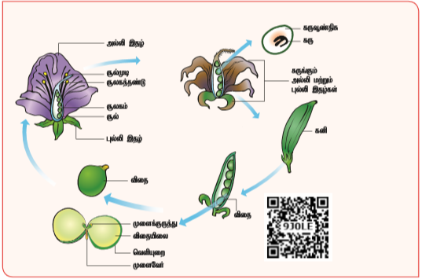
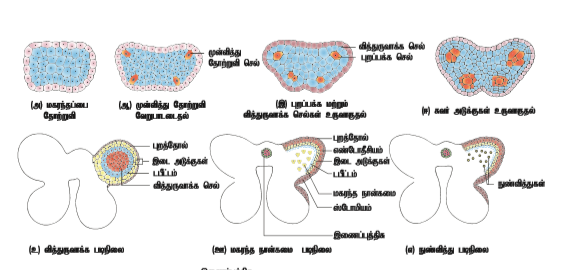
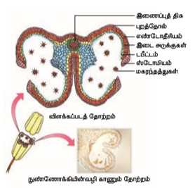
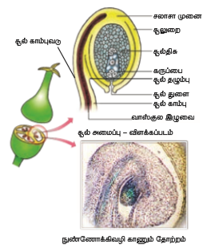
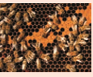
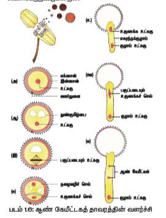

தாவரங்களில் ஏற்படும் ஹார்மோன் மற்றும் வளர்ச்சி மாற்றங்கள் மலர் தோற்றுவியின் வேறுபாடுறுதலுக்கும் வளர்ச்சிக்கும் வழிவகுக்கின்றன. கருவுறுதலுக்கு முந்தைய அமைப்புகள் மற்றும் நிகழ்வுகள் கீழே கொடுக்கபட்டுள்ளன.

### ஆண் இனப்பெருக்க பகுதி – மகரந்தத்தாள் வட்டம்

மகரந்தத்தாள் வட்டம் மகரந்தத்தாள்களால் ஆனது. ஒவ்வொரு மகரந்தத்தாளும் ஒரு மகரந்தப்பையையும் ஒரு மகரந்தத்தாள் கம்பியையும் கொண்டது. மகரந்தப் பையிலுள்ள மகரந்தத் துகள்கள் ஆண் கேமீட்டகத் தாவரத்தைக் குறிக்கின்றன. இப்பாடத்தில் மகரந்தப்பையின் அமைப்பு மற்றும் வளர்ச்சி பற்றி விரிவாகக் காண்போம். மகரந்தப்பையின் வளர்ச்சி: மிகவும் இளம் நிலை மகரந்தப்பை புறத்தோலால் சூழப்பட்ட ஒருபடித்தான செல் திரள்களால் ஆனது. இதன் வளர்ச்சியின் போது மகரந்தப்பை நான்கு மடல்களைக் கொண்ட அமைப்பாகிறது. ஒவ்வொரு மடலிலும் ஒன்று அல்லது ஒரு சில வரிசைகளில் அமைந்த புறத்தோல் அடிச்செல்கள் தெளிவான உட்கருவைக் கொண்டு அளவில் பெரிதாகின்றன. இவை முன்வித்து செல்களாக செயல்படுகின்றன. இந்த முன்வித்து செல்கள் பரிதிக்கிணையான தளத்தில் பகுப்படைந்து (periclinal divison) புறத்தோலை நோக்கி முதல்நிலை புறபக்க (parietal) செல்களையும், மகரந்தப்பையின் உட்புறம் நோக்கி முதல்நிலை வித்துருவாக்க (sporogenous) செல்களையும் தோற்றுவிக்கின்றன. 


 


முதல்நிலை புறபக்க செல்கள் தொடர்ச்சியாக பரிதிக்கிணையான தள மற்றும் ஆரத்திற்கு இணையான பகுப்படைந்து 2 - 5 அடுக்குகள் கொண்ட மகரந்தப்பைச் சுவரை உருவாக்குகின்றன. இவை புறத்தோலிலிருந்து உட்புறம் நோக்கி எண்டோதீசியம், இடை அடுக்குகள் மற்றும் டபீட்டம் என்ற பகுதிகளை கொண்டுள்ளன. நுண்வித்துருவாக்கம் (Microsporogenesis): இருமடிய நுண்வித்து தாய் செல் குன்றல்பகுப்படைந்து ஒருமடிய துண்வித்துகள் உருவாகும் படிநிலைகளுக்கு நுண்வித்துருவாக்கம் (microsporogenesis) என்று பெயர். முதல்நிலை வித்து செல்கள் நேரடியாகவோ அல்லது சில குன்றலிலா பகுப்புகளுக்கு உட்பட்டோ வித்துருவாக்க திசுவைத் (sporogenous tissue) தோற்றுவிக்கின்றன. வித்துருவாக்க திசுவின் கடைசி செல்கள் நுண்வித்து தாய் செல்களாகச் செயல்படுகின்றன. ஒவ்வொரு நுண்வித்து தாய் செல்லும் குன்றல் பகுப்புற்று நான்கு ஒருமடிய நுண்வித்துகளைத் தோற்றுவிக்கின்றன (நான்கமை நுண்வித்து). இந்த நான்கமை வித்துகள் நான்முகப்பு, குறுக்கு மறுக்கு, நேர்கோட்டு, இருமுகப்பு, T வடிவ அமைப்பில் உள்ளது. நுண்வித்துகள் விரைவில் ஒன்றிலிருந்து மற்றொன்று பிரிந்து தனித்தனியாக மகரந்தப்பை அறையில் காணப்படுகின்றன மற்றும் மகரந்தத்துகள்களாக வளர்கின்றன. நுண்வித்தகங்களின் வளர்ச்சியிலுள்ள படிநிலைகள் படம் 1.4-ல் கொடுக்கப்பட்டுள்ளன. சில தாவரங்களில் ஒரு நுண்வித்தகத்திலுள்ள நுண்வித்துகள் அனைத்தும் ஒன்றாக இணைந்து பொலினியம் (pollinium) என்ற அமைப்பை பெற்றுள்ளது. எடுத்துக்காட்டு: எருக்கு. கூட்டு மகரந்தத்துகள்கள் டுரோசீரா, டிரைமிஸ் ஆகிய தாவரங்களில் காணப்படுகின்றன.

```
செயல்பாடு

டாட்டூரா மெட்டலின் மொட்டுகள் மற்றும் மலர்களைச் சேகரிக்கவும். மகரந்தத்தாள்களை பிரித்தெடுத்து மகரந்தப்பையை மெல்லிய குறுக்குத் துண்டுகள் எடுத்து நுண்ணோக்கியில் உற்று நோக்கவும். மகரந்தப்பையின் பல்வேறு வளர்ச்சி நிலைகளை உற்று நோக்கி பதிவு செய்யவும்.
```

#### முதிர்ந்த மகரந்தப்பையின் குறுக்கு வெட்டுத் தோற்றம்

முதிர்ந்த மகரந்தப்பையின் குறுக்கு வெட்டுத்
தோற்றம் மகரந்த அறை மகரந்தச்சுவரால்
சூழப்பட்டுள்ளதைக் காட்டுகிறது. இது இருமடலுடைய
இரு பை அமைப்பு (dithecous) கொண்டுள்ளது. ஒரு
வகைமாதிரி (typical) மகரந்தப்பை நான்கு
வித்தகங்களைக் கொண்டது. முதிர்ந்த மகரந்தப்பையின் குறுக்கு வெட்டுத் தோற்றம் படம்
1.5-ல் கொடுக்கப்பட்டுள்ளது.

**1. மகரந்தப்பை சுவர்**

ஒரு முதிர்ந்த மகரந்தப்பையின் சுவர் **(அ) புறத்தோல் (ஆ) எண்டோதீசியம் (இ) இடை அடுக்குகள் (ஈ) டபீட்டம் என்ற அடுக்குகளைக் கொண்டுள்ளது.**

**அ) புறத்தோல்:** இது ஓரடுக்கு செல்களால் ஆன பாதுகாப்பு அடுக்காகும். வேகமாக பெரிதாகும் உட்புறத் திசுக்களுக்கு ஈடுகொடுக்கும் பொருட்டு இச்செல்கள் தொடர்ச்சியாக ஆரத்திற்கு இணையான பகுப்படைகின்றன.

**ஆ) எண்டோதீசியம்:** இது பொதுவாக புறத்தோலுக்குக் கீழாக ஆரப்போக்கில் நீண்ட ஓரடுக்கு செல்களால் ஆனது. உட்புற கிடைமட்டச் சுவர் (சில சமயங்களில் ஆரச்சுவரும்) - செல்லுலோசால் ஆன (சில சமயங்களில் லிக்னினாலும் ஆன) பட்டைகளைத் தோற்றுவிக்கிறது. இச்செல்கள் நீர் உறிஞ்சும் தன்மை (hygroscopic) கொண்டவை. நீர்வாழ்த் தாவரங்கள், சாற்றுண்ணித் தாவரங்கள், மூடிய பூக்களைக் கொண்ட தாவரங்கள் மற்றும் தீவிர ஒட்டுண்ணித் தாவரங்களில் மகரந்தப்பைகளில் எண்டோதீசியம் வேறுபாடடைவதில்லை. இரண்டு வித்தகங்களை இணைக்கும் ஒரு மகரந்த மடல் பகுதியில் அமைந்த செல்களில் இத்தடிப்பு காணப்படுவதில்லை. இப்பகுதிக்கு ஸ்டோமியம் (stomium) என்று பெயர். எண்டோதீசியத்தின் நீர் உறிஞ்சுதன்மையும், ஸ்டோமியமும் முதிர்ந்த மகரந்தப்பை வெடிப்பிற்கு உதவுகின்றன.

**இ) இடை அடுக்குகள்:** எண்டோதீசியத்தை அடுத்துள்ள இரண்டு அல்லது மூன்று அடுக்கு செல்கள் இடை அடுக்குகளை குறிப்பிடுகின்றன. இவை குறுகிய வாழ்தன்மை (ephemeral) உடையது. மகரந்தப்பை முதிர்ச்சியடையும் போது இவை நசுக்கப்படுகின்றன அல்லது சிதைவடைந்து விடுகின்றன.

**ஈ) டபீட்டம்:** இது மகரந்தப்பை சுவரின் உட்புற அடுக்காகும். நுண்வித்து உருவாக்கத்தின் நான்மய நுண்வித்துகள் நிலையில் இது தன் முழு வளர்ச்சி நிலையை அடைகிறது. டபீட்டத்தின் ஒரு பகுதி மகரந்த அறையைச் சூழ்ந்துள்ள இணைப்புத் திசுவிலிருந்தும் மற்றொரு பகுதி வெளிப்புற சுவர் அடுக்கிலிருந்தும் உருவாகிறது. எனவே டபீட்டம் இரட்டை தோற்றமுடையது. இது வளரும் வித்துருவாக்க திசுக்கள், நுண்வித்து தாய் செல்கள் மற்றும் நுண் வித்துகளுக்கு ஊட்டமளிக்கிறது. டபீட்டத்தின் செல்கள் ஒரு உட்கரு அல்லது ஒன்றுக்கு மேற்பட்ட உட்கரு அல்லது பன்மடிய தன்மையுடைய உட்கரு கொண்டு காணப்படும். மகரந்தப்பை சுவர் பொருட்கள், ஸ்போரோபொலனின், போலன்கிட், டிரைஃபைன் மற்றும் ஒவ்வாத்தன்மை வினையை (incompatibility) கட்டுப்படுத்தும் ஏராளமான புரதங்கள் உற்பத்தியிலும் டபீட்டம் பங்கு கொள்கிறது. மேலும் நுண்வித்து அல்லது மகரந்தத்துகள்களின் வளத்தன்மை அல்லது மலட்டுத்தன்மையை இது கட்டுப்படுத்துகிறது.

செயல்பாட்டின் அடிப்படையில் டபீட்டம் சுரப்பு டபீட்டம், ஊடுருவும் டபீட்டம் என இரு வகைப்படும்.


**சுரப்பு டபீட்டம் (புறப்பக்க / சுரப்பு / செல் வகை) (Secretory tapetum):** இவ்வகை டபீட்டம் தோற்றநிலை, செல்லமைப்பை தக்கவைத்து, செல் ஒருங்கமைவுடன் இருந்து நுண்வித்துகளுக்கு ஊட்டமளிக்கின்றன.

**ஊடுருவும் டபீட்டம் (பெரிபிளாஸ்மோடிய வகை) (Invasive tapetum):** இவ்வகை டபீட்டத்தின் செல்கள் உட்புற கிடைமட்ட சுவர்களையும், ஆரச் சுவர்களையும் இழந்து அனைத்து புரோட்டோபிளாஸ்ட்களும் ஒன்றிணைந்து பெரிபிளாஸ்மோடியத்தை உருவாக்குகின்றன.

**டபீட்டத்தின் பணிகள்**

- வளரும் நுண்வித்துகளுக்கு ஊட்டமளிக்கிறது.

- **யுபிஷ் உடலத்தின்** (ubisch bodies) மூலம் ஸ்போரோபொலனின் உற்பத்திக்கு உதவுவதால் மகரந்தச்சுவர் உருவாக்கத்தில் முக்கிய பங்காற்றுகிறது.

- போலன்கிட்டுக்கு தேவையான வேதிப்பொருட்களை தந்து அவை மகரந்தத்துகளின் பரப்புக்கு கடத்தப்படுகிறது.

- சூலக முடியின் **ஒதுக்குதல் வினைக்கான** (rejection reaction) எக்சைன் புரதங்கள் (exine proteins) எக்சைன் குழிகளில் காணப்படுகின்றன. இவ்வகைப் புரதங்கள் டபீட்ட செல்களிலிருந்து பெறப்படுகின்றன.

```
உங்களுக்கு தெரியுமா ?

பெரும்பாலான தாவரவியல் வல்லுநர்கள் அமீபா வகை என்ற மூன்றாவது வகை டபீட்டம் பற்றி குறிப்பிட்டுள்ளனர். இவ்வகையில் செல்சுவர் இழக்கப்படாமல் மகரந்த அறையினுள் செல்கள் ஊடுருவுகின்றன. இவ்வகை ஆண்மலட்டுத் தன்மையுடன் தொடர்புடையது. மேலும் பெரிபிளாஸ்மோடிய வகையுடன் அடிக்கடி குழப்பத்தை ஏற்படுத்தப்படுகிறது
```

**2. மகரந்த அறை:** மகரந்த அறை இளம் நிலையில் நுண்வித்துகளாலும், முதிர்ந்த நிலையில் மகரந்தத்துகள்களாலும் நிறைந்திருக்கும். நுண்வித்து தாய்செல்கள் குன்றல் பகுப்படைந்து ஒரு மடிய நிலையிலுள்ள நுண்வித்துகளைத் தருகின்றன.

**3. இணைப்புத் திசு:** இது மகரந்த மடல்களுக்கு இடையில் காணப்படும் வளமற்ற திசுப் பகுதியாகும். இது வாஸ்குலத் திசுக்களைக் கொண்டுள்ளது. இது உள்பக்க டபீட்டத்தின் உருவாக்கத்திற்குப் பங்களிக்கிறது.

#### நுண் வித்துகள் மற்றும் மகரந்தத் துகள்கள்

நுண்வித்து தாய் செல்கள் குன்றல் பகுப்படைதலின் விளைவாக பெறப்படுவது நுண்வித்துகளாகும். மகரந்தத் துகள் நுண்வித்திலிருந்து பெறப்படுகின்றது. நுண்வித்துகள் புரோட்டோபிளாசம் பெற்று முழுமையாக வளர்ச்சியடையாத சுவற்றினால் சூழப்பட்டுள்ளது. மகரந்தத்துகளில் புரோட்டோபிளாசம் அடர்ந்த சைட்டோபிளாசத்தையும், மையத்திலமைந்த உட்கருவையும் கொண்டுள்ளது. இதன் சுவர் உட்புற **இன்டைன்** (intine) மற்றும் வெளிப்புற **எக்சைன்** (exine) என இரு அடுக்குகளைக் கொண்டது. இன்டைன் பெக்டின், ஹெமிசெல்லுலோஸ், செல்லுலோஸ், காலோஸ் மற்றும் புரதங்கள் கொண்டு சீரானமெல்லிய தடிப்புடன் காணப்படும். எக்சைன் செல்லுலோஸ், ஸ்போரோபொலினின், போலன்கிட் கொண்டு தடித்து காணப்படும். எக்சைன் சீரற்ற தடிப்புகளுடன் சில பகுதிகளில் மெல்லியதாக காணப்படும். இப்பகுதிகள் சிறிய வட்டவடிவில் இருந்தால் **வளர்துளைகள்** என்றும், சற்று நீண்டு காணப்பட்டால் **பிளவுப்பள்ளங்கள்** என்றும் அழைக்கப்படுகின்றன. இவை மகரந்தத்துகளின் முளைத்தலுடன் தொடர்புடையவை. வளர்துளைப் பகுதியில் ஸ்போரோப்பொல்லனின் பொதுவாகக் காணப்படுவதில்லை. எக்சைனின் புறப்பரப்பு மென்மையாகவோ அல்லது பலவகை அலங்கார பாங்குகளுடனும் உள்ளது. (தடி வடிவம், சிறு குழியுடைய, கரணை போன்ற, சிறு புள்ளி போன்ற). அலங்கார பாங்குகள் தாவரங்களை அடையாளம் கண்டறியவும் வகைப்படுத்தவும் பயன்படுத்தப்படுகிறது.

```
உங்களுக்கு தெரியுமா ?

**மகரந்தவியல் (Palynology)**

மகரந்தத்துகள் பற்றிய படிப்பிற்குமகரந்தவியல் (Palynology) என்றுபெயர். இது நிலக்கரி மற்றும் எண்ணெய்புலங்களின் பரவலைக் கண்டறிய உதவுகிறது.ஒரு பகுதியின் தாவர கூட்டத்தை மகரந்தத்துகள்கள்பிரதிபலிக்கின்றன.மகரந்தத்துகள்களை நீண்டகாலம்உயிர்ப்புத்தன்மையுடன் பாதுகாக்க திரவநைட்ரஜன் (-196°C) பயன்படுத்தப்படுகிறது.இந்நுட்பம் உறைகுளிர்பாதுகாப்பு(cryopreservation) என அறியப்படுகிறது. இந்நுட்பம்பொருளாதார முக்கியத்துவமுள்ள பயிர்களின்மகரந்தத்துகள்களை தாவர மேம்பாடுசெயல்திட்டங்களுக்காக சேமித்து வைக்கஉதவுகிறது.
```

```
உங்களுக்கு தெரியுமா ?

**தேனீ மகரந்தம் (Bee pollen)**

தேனீ மகரந்தம் ஒரு இயற்கை பொருளாகும். இதில் அதிக அளவு புரதம், கார்போஹைட்ரேட், மிக குறைவான தாதுப் பொருள்கள் மற்றும் வைட்டமின்கள் உள்ளன. எனவே இது கூடுதல் ஊட்டப் பொருளாகப் பயன்படுத்தப்படுகிறது; இது மகரந்த மாத்திரைகளாகவும் , பாகுநீராவும் விற்கப்படுகிறது. மேலும் தடகள வீரர்கள் மற்றும் பந்தயக் குதிரைகளின் செயல்பாட்டை அதிகரிக்க உதவுகிறது. தீக்காயத்தினால் ஏற்படும் புண்கள் ஆறுவதற்கு இது உதவுகிறது. பூந்தேன் மகரந்தம் பற்றிய அறிவியலுக்கு பூந்தேன் மகரந்தவியல் (mellitopalynology) என்று பெயர்.


```

மகரந்தத்துகளின் வடிவம் சிற்றினத்திற்கு சிற்றினம் மாறுபடுகிறது. கோளம், நீள்கோணம், கதிர்கோல், மடல், கோண அல்லது பிறை வடிவம் என பல்வேறு வடிவங்களில் காணப்படுகிறது. மகரந்தத்துகள்களின் அளவு 10 மைக்ரோ மீட்டர் (மயோசோடிஸ்) முதல் 200 மைக்ரோ மீட்டர் (குக்கர்பிட்டேசி மற்றும் நிக்டாஜினேசி குடும்பத் தாவரங்கள்) வரை வேறுபடுகின்றன.

சுவர்ப்பொருளான ஸ்போரோபொலினின் உருவாக மகரந்தத்துகளின் சைட்டோபிளாசம் மற்றும் டபீட்டம் பங்களிக்கிறது. இது கரோட்டினாய்டிலிருந்து பெறப்படுகிறது. இது இயற்பியல் மற்றும் உயிரிய சிதைவைத் தாங்கும் தன்மையுடையது. அதிக வெப்பத்தைத் தாங்கும்தன்மை, வீரியமிக்க அமிலம், காரம் மற்றும் நொதிகளின் செயல்களிலிருந்தும் பாதுகாக்கிறது. எனவே தொல்லுயிர் புதைபடிவுகளில் மகரந்தத்துகள் நீண்ட காலம் பாதுகாப்பாக இருக்க இதுவே காரணமாகும். மேலும் மகரந்தப்பையிலிருந்து சூலக முடி வரையிலான மகரந்தத்துகள்களின் பயணத்தை இது பாதுகாப்பானதாக்குகிறது.

போலன்கிட் உருவாக்கத்தில் டபீட்டம் பங்களிக்கிறது. கரோட்டினாய்டு அல்லது ப்ளேவோனாய்ட் இதற்கு மஞ்சள் அல்லது ஆரஞ்சு நிறத்தைத் தருகிறது. இது மகரந்தத்துகள்களின் புறப்பரப்பில் காணப்படும் பிசுபிசுப்பான பூச்சு கொண்ட எண்ணெய் அடுக்காகும். இது பூச்சிகளைக் கவர்வதுடன் புற ஊதாக் கதிர்களிலிருந்தும் பாதுகாக்கிறது.

#### ஆண் கேமீட்டகத் தாவரத்தின் வளர்ச்சி

ஆண் கேமீட்டகத் தாவரத்தின் முதல் செல் நுண்வித்தாகும். இது ஒருமடியமானது. நுண்வித்தகத்திற்கு உள்ளிருக்கும் போதே ஆண் கேமீட்டகத் தாவரத்தின் வளர்ச்சி தொடங்கிவிடுகிறது. நுண்வித்தின் உட்கரு பகுப்படைந்து ஒரு தழைவழி (vegetative) உட்கருவையும், ஒரு உருவாக்க (generative) உட்கருவையும் தோற்றுவிக்கிறது. உருவாக்க உட்கருவைச் சூழ்ந்து சுவர் தோன்றுவதால் இரண்டு சமமற்ற செல்கள் உருவாகின்றன - ஒரு பெரிய, ஒழுங்கற்ற உட்கரு கொண்ட, அதிக சேமிப்பு உணவைக் கொண்ட தழைவழி செல் மற்றும் ஒரு சிறிய உருவாக்க செல். பொதுவாக இரண்டு செல் நிலையில் மகரந்தத்துகள்கள் மகரந்தப்பையிலிருந்து வெளியேற்றப்படுகின்றன.



ஒரு சில தாவரங்களில் உருவாக்க செல் மீண்டும் பகுப்படைந்து இரு ஆண் கேமீட்டுகளைத் தோற்றுவிக்கிறது. இத்தாவரங்களில் மகரந்தத் துகள்கள் மூன்று செல் நிலையில் வெளியேற்றப்படுகின்றன. 60% மூடுவிதைத் தாவரங்களில் மகரந்தத்துகள்கள் இரண்டு செல் நிலையிலேயே வெளியேற்றப்படுகின்றன. மகரந்தத்துகள் சரியான சூலகமுடியினை அடைந்த பின்னரே ஆண் கேமீட்டகத் தாவரம் மேற்கொண்டு வளரும்.

சூலகமுடியை அடைந்த மகரந்தத்துகள் ஈரப்பசையை உறிஞ்சி உப்புதலடைகிறது. இன்டைன் வளர்துளையின் வழியாக மகரந்தக் குழாயாக வளர்கிறது. இரண்டு செல் நிலையில் மகரந்தத்துகள் வெளியேற்றப்பட்டிருப்பின் சூலக முடியை அடைந்த பின் அல்லது மகரந்தக்குழாய் கருப்பையை அடையும் முன்னர் உருவாக்க செல் பகுப்படைந்து இரு ஆண் செல்களைத் (விந்துக்கள்) தருகிறது. ஆண் கேமீட்டகத் தாவரத்தின் வளர்ச்சி நிலைகள் படம் 1.6-ல் கொடுக்கப்பட்டுள்ளன.

### பெண் இனப்பெருக்கப் பகுதி - சூலகவட்டம்

சூலகவட்டம் மலரின் பெண் இனப்பெருக்க உறுப்பாகும். சூலகவட்டம் என்ற சொல் மலரின் ஒன்று அல்லது அதற்கு மேற்பட்ட சூலக அலகுகளைக் குறிக்கிறது. சூலக அலகு சூலகப்பை, சூலகத் தண்டு, சூலகமுடி ஆகிய பகுதிகளைக் கொண்டது. சூலக அலகு (pistil) சூலக இலையிலிருந்து பெறப்படுகிறது. சூலகம் என்ற சொல் சூல்கள் கொண்ட பகுதியைக் குறிக்கிறது. சூலகமுடி மகரந்தத்துகளை ஏற்கும் பரப்பாகச் செயல்படுகிறது. சூலகமுடிக்குக் கீழாகக் காணப்படும் நீண்ட, மெல்லிய பகுதி சூலகத் தண்டாகும். சூலக அலகின் பருத்த அடிப்பகுதி சூலகமாகும். சூலொட்டுத்திசுவால் இணைக்கப்படுள்ள சூல்கள் சூலக அறையினுள் அமைந்துள்ளன. மலர்தோற்றுவியின் (floral primordium) நுனியில் தோன்றும் ஆக்குத்திசுவிலிருந்து சிறிய காம்புரு (papillate) போன்ற வளர்ச்சியிலிருந்து சூலக அலகு தோன்றுகிறது. இது துரிதமாக வளர்ந்து சூலகம், சூலகத்தண்டு மற்றும் சூலகமுடியாக வேறுபாடடைகிறது. சூலொட்டுத் திசுவிலிருந்து சூல்கள் அல்லது பெரு வித்தகங்கள் தோன்றுகின்றன. ஒரு சூலகம் ஒன்று (நெல், மா) முதல் பல (பப்பாளி, தர்பூசணி, ஆர்க்கிட்கள்) சூல்களைக்கொண்டிருக்கும்.

#### சூலின் அமைப்பு (பெருவித்தகம்)

ஒன்று அல்லது இரண்டு சூலுறைகளால் பாதுகாப்பாக சூழப்பட்ட சூல் பெருவித்தகம் என்று அறியப்படுகிறது. ஒரு முதிர்ந்த சூல் ஒரு காம்பையும், உடலையும் கொண்டிருக்கும். சூலகக்காம்பு அடிப்பகுதியில் அமைந்து சூல்களை சூலொட்டுத்திசுவுடன் இணைக்கிறது.


சூலகக்காம்பு சூலின் உடலோடு
இணையும் பகுதி **சூல்தழும்பு** (hilum) எனப்படும். தலைகீழாக அமைந்த சூலுடன் சூலகக்காம்பு ஒட்டிய இடத்தில் உருவாகும் விளிம்பு பகுதி **சூல்காம்புவடு** (raphe) எனப்படும். சூலின் மையத்தில் காணப்படும் பாரங்கைமாவாலான திசுப்பகுதி **சூல்திசு** (nucellus) என்று அழைக்கப்படுகிறது. சூல்திசுவைச் சூழ்ந்து காணப்படும் பாதுகாப்பு உறை **சூலுறை** (integument) எனப்படும். ஒரு சூலுறை மட்டும் காணப்படின் ஒற்றை **சூலுறைச் சூல்** (unitegmic) என்றும், இரு சூலுறைகள் காணப்படின் **இரு சூலுறைச் சூல்** (bitegmic) என்றும் அழைக்கப்படும். சூலுறையால் சூழப்படாத சூல்திசுப்பகுதி **சூல்துளை** (micropyle) எனப்படும். சூல்திசு, சூலுறை மற்றும் சூல் காம்பு ஆகியவை சந்திக்கும் அல்லது இணையும் பகுதிக்கு சலாசா (chalaza) என்று பெயர். சூல்துளைக்கு அருகில் சூல்திசுவில் காணப்படும் பெரிய முட்டை வடிவ பை போன்ற அமைப்பு **கருப்பை (embryo sac) அல்லது பெண்கேமீட்டகத் தாவரம்** என்று அழைக்கப்படுகிறது. இது சூல் திசுவிலுள்ள செயல்படும் பெருவித்திலிருந்து தோன்றுகிறது. ஒரு சில சிற்றினங்களில் (ஒரு சூலறையுடைய மென் சூல்திசு கொண்ட) சூலுறையின் உள்ளடுக்கு சிறப்பு பெற்று கருப்பையின் ஊட்டத்திற்கு உதவுகிறது. இந்த அடுக்கு **எண்டோதீலியம்** (endothelium) அல்லது **சூலுறை டபீட்டம்** (integumentary tapetum) என்று அழைக்கப்படுகிறது (எடுத்துக்காட்டு: ஆஸ்டரேசி). வித்துருவாக்க செல்லின் அமைவிடத்தைப் பொறுத்து சூல்கள் இரு வகைப்படும். வித்துருவாக்க செல்கள் புறத்தோலடியில் ஒரே ஒரு அடுக்காக சூல் திசுவால் சூழப்பட்டிருந்தால் அது **மென்சூல்திசு சூல்** (tenuinucellate) வகை எனப்படும்.

பொதுவாக இவ்வகை சூல்கள் மிகச் சிறிய சூல் திசுவைக் கொண்டிருக்கும். வித்துருவாக்க செல்கள் புறத்தோலடியின் கீழ்ப் பகுதியிலிருந்து தோன்றினால் அந்த வகை சூல்கள் **தடிசூல்திசு சூல்** (crassinucellate) வகை எனப்படும். இத்தகைய சூல்கள் பொதுவாக அதிக சூல்திசு கொண்டவையாக இருக்கும். சலாசா மற்றும் கருப்பையின் இடையே சூலின் அடிப்பகுதியில் காணப்படும் செல் தொகுப்பு ஹைப்போஸ்டேஸ் (hypostase) என்றும், சூல்துளைக்கும் கருப்பைக்கும் இடையே காணப்படும் தடித்த சுவருடைய செல்கள் எப்பிஸ்டேஸ் (epistase) என்றும் அழைக்கப்படுகிறது. சூலின் அமைப்பு படம் 1.7-ல் கொடுக்கப்பட்டுள்ளது.

#### சூலின் வகைகள்

திசையமைவு, வடிவம், சூல்காம்பு மற்றும் சலாசாவிற்கு தொடர்பாக சூல்துளையின் அமைவிடம் ஆகியவற்றின் அடிப்படையில் சூல்கள் ஆறு முக்கிய வகைகளாக வகைப்படுத்தப்பட்டுள்ளன. இவற்றில் மிக முக்கியமானவை நேர்சூல் (orthotropous), தலைகீழ்சூல் (antatropous), கிடைமட்டசூல் (hemianatropous) மற்றும் கம்பைலோட்ராபஸ் (campylotropous) வகைகளாகும். சூல்களின் வகைகள் படம் 1.8-ல் கொடுக்கப்பட்டுள்ளது.



**நேர்சூல் (Orthotropous):** இவ்வகைச் சூலில் சூல்துளை இணைப்புப் பகுதியிலிருந்து தொலைவில் அமைந்திருக்கும். சூல்காம்பு, சூல்துளை மற்றும் சலாசா ஆகியவை ஒரே நேர்க்கோட்டில் அமைந்திருக்கும். எடுத்துக்காட்டுகள்: பைப்பரேசி, பாலிகோனேசி.

**தலைகீழ்சூல் (Anatropous):** இவ்வகைச் சூலில் சூல் முழுமையாக தலைகீழாகத் திரும்பியிருக்கும். எனவே சூல்துளையும் சூல்காம்பும் அருகருகே அமைந்திருக்கும். பெரும்பாலான ஒருவிதையிலை, இருவிதையிலை தாவரங்களில் இவ்வகை சூல் காணப்படுகிறது.



**கிடைமட்டசூல் (Hemianatropous):** இவ்வகையில் சூலின் உடல் குறுக்குவாட்டில் சூல்காம்பிற்குச் செங்குத்தாக அமைந்து காணப்படும். எடுத்துக்காட்டு: பிரைமுலேசி.

**கம்பைலோட்ராபஸ் (Campylotropus):** சூல்துளைப் பகுதியில் சூலின் உடல் வளைந்து ஏறத்தாழ அவரை விதை வடிவில் காணப்படும். கருப்பையும் சற்று வளைந்திருக்கும். விதைத்தழும்பு, சூல்துளை, சலாசா ஆகியவை ஒன்றுக்கொன்று அருகமைந்து சூல்துளை, சூல் ஒட்டுதிசுவை நோக்கிய நிலையில் அமைந்திருக்கும். எடுத்துக்காட்டு: லெகுமினோசே.

மேற்கூறிய முக்கிய வகைகளைத் தவிர மேலும் இரு வகைகள் உள்ளன. அவை

**ஆம்பிட்ரோபஸ் (Amphitropous):** இவ்வகை சூல் ஏறத்தாழ தலைகீழ் சூலிற்கும், கிடைமட்ட சூலிற்கும் இடைப்பட்டதாகும். இங்கு சூல்திசுவும், கருப்பையும் குதிரை லாடம் போன்று வளைந்திருக்கும். சூல்துளை, சூல்காம்பு, சலாசா ஆகிய மூன்றும் அருகாமையில் அமைந்திருக்கும். எடுத்துக்காட்டு: ஒரு சில அலிஸ்மட்டேசி குடும்பத் தாவரங்கள்.

**சிர்சினோட்ரோபஸ் (Circinotropous):** சூலினைச் சூழ்ந்து மிக நீளமான சூல்காம்பு காணப்படுகிறது. இது சூலை முழுவதுமாகச் சூழ்ந்துள்ளது. எடுத்துக்காட்டு: காக்டேசி

#### பெருவித்துருவாக்கம் (Megasporogenesis)

பெருவித்து தாய் செல்லிலிருந்து பெருவித்து உருவாகும் நிகழ்வு **பெருவித்துருவாக்கம்** (megasporogenesis) எனப்படும். சூல் வளர்ச்சியடையும் போது சூல்திசுவின் புறத்தோலடித்தோல் கீழ் அமைந்துள்ள ஒரு சூல்திசு செல் பெரிதாகி **முன்வித்தாக** (archesporium) செயல்படுகிறது. சில தாவரங்களில் முன்வித்து செல் நேரடியாக பெருவித்து (megaspore) தாய் செல்லாகச் செயல்படுகிறது. பிற தாவரங்களில் இவை குறுக்குவாட்டில் பகுப்படைந்து வெளிப்புறத்தில் முதல்நிலை புறப்பக்க செல்லையும் (outer primary parietal cell), உட்புறத்தில் முதல்நிலை வித்துருவாக்க செல்லையும் (inner primary sporogeneous cell) தருகிறது. இந்த புறப்பக்க செல் பகுப்படையாமலோ அல்லது பரிதி மற்றும் ஆரத்திற்கு இணையாக சில பகுப்புகளை அடைந்து முதல்நிலை வித்துருவாக்க செல் சூல்திசுவில் ஆழமாகப் பதியச் செய்கிறது. இந்த முதல்நிலை வித்துருவாக்கச் செல் பெருவித்து தாய் செல்லாகச் செயல்படுகிறது. பெருவித்து தாய் செல் குன்றல் பகுப்பிற்குட்பட்டு நான்கு ஒருமடிய பெருவித்துகளைத் தருகிறது. கருப்பை வளர்ச்சியில் பங்கு பெறும் பெருவித்துகளின் எண்ணிக்கையைப் பொருத்து ஒருபெருவித்துசார் கருப்பை (monosporic), இருபெருவித்துசார் கருப்பை (bisporic), நான்கு பெருவித்துசார் கருப்பை (tetrasporic) என மூன்று அடிப்படை வகையான வளர்ச்சி முறைகள் காணப்படுகின்றன. பொதுவாக நான்கு பெருவித்துகள் நேர்கோட்டில் அமைந்திருக்கும். இந்த நான்கு பெருவித்துகளில் பொதுவாக சலாசா பக்கமுள்ள பெருவித்து செயல்படும் பெருவித்தாகிறது. மற்ற மூன்றும் அழிந்துவிடுகின்றன. செயல்படும் பெருவித்து பெண் கேமீட்டகத் தாவரம் அல்லது கருப்பையை உருவாக்குகிறது. இந்த வகை கருப்பை வளர்ச்சி ஒருபெருவித்துசார் கருப்பை (எடுத்துக்காட்டு: பாலிகோனம்) என அழைக்கப்படுகிறது. நான்கு பெருவித்துகளில் இருவித்துகள் கருப்பை உருவாக்கத்தில் ஈடுபட்டால் இருபெருவித்துசார் கருப்பைவளர்ச்சி (எடுத்துக்காட்டு: அல்லியம்) எனப்படுகிறது. நான்கு பெருவித்துகளும் கருப்பை உருவாக்கத்தில் ஈடுபட்டால் அது நான்குபெருவித்துசார் கருப்பை (எடுத்துக்காட்டு: பெப்பரோமியா) எனப்படும். ஒருபெருவித்துசார் கருப்பையின் வளர்ச்சி (பாலிகோனம் வகை) படம் 1.9-ல் கொடுக்கப்பட்டுள்ளது.

#### ஒரு பெருவித்துசார் கருப்பையின் வளர்ச்சி

கருப்பையின் வளர்ச்சியிலுள்ள படிநிலைகள் மற்றும் அமைப்பை விளக்க எளிய ஒருபெருவித்துசார் கருப்பையின் வளர்ச்சி கீழே கொடுக்கப்பட்டுள்ளது.



செயல்படும் பெருவித்து கருப்பை அல்லது பெண் கேமீட்டகத் தாவரத்தின் முதல் செல்லாகும். சூல்துளை – சலாசா அச்சிற்கு இணையாக பெருவித்து நீட்சியடைகிறது. இதன் உட்கரு குன்றலில்லா பகுப்படைகிறது. உட்கரு பகுப்பினைத் தொடர்ந்து செல்சுவர் தோன்றுவதில்லை. மையத்தில் ஒரு பெரிய நுண்குமிழ்ப்பை (vacuole) இரு உட்கருக்களுக்கு இடையே தோன்றுகிறது. நுண்குமிழ்ப்பை விரிவடைந்து உட்கருவை கருப்பையின் இரு து ரு வ ங ்க ளு க் கு ம் தள்ளுகிறது. இரு உட்கருவும் இரண்டு முறை குன்றலில்லா பகுப்படைந்து நான்கு உ ட்க ரு க ்கள ை ஒவ் வொ ரு து ரு வ த் தி லு ம் உ ரு வாக் கு கி ற து . இந்நிலையில் எட்டு உ ட்க ரு க ்க ளு ம் பொ து வான சைட்டோபிளாசத்தில் (தனி உட்கரு பகுப்பு) காண ப்படு கின்றன. கடைசி உட்கரு பகுப்பிற்கு பின் செல் குறிப்பிடத்தக்க நீட்சியடைந்து பை போன்ற அமைப்பைத் தருகிறது. இதன் தொடர்ச்சியாக கருப்பை செல் அமைப்பை ஏற்படுத்திக் கொள்கிறது. சூல்துளைப் பகுதியிலுள்ள நான்கு உட்கருக்களில் மூன்று முட்டைசாதனமாக மாறுகின்றன. நான்காவது உட்கரு மைய செல்லின் (centre cell)சைட்டோபிளாசத்தில் தனித்து காணப்பட்டு மேல் துருவ உட்கருவாகிறது. சலாசா பகுதியிலுள்ள நான்கு உட்கருக்களில் மூன்று **எதிரடிச் செல்களாகவும்** (antipodal cells) ஒன்று கீழ்துருவ உட்கருவாகவும் ஆகிறது. தாவரங்களுக்கு ஏற்ப இரண்டு **துருவ உட்கரு** (polar nuclei) இணையாமல் அல்லது இணைந்து **இரண்டாம் நிலை உட்கருவாக** (secondary nucleus) (மைய செல்லுக்குள்) மாறுகிறது. முட்டை சாதனத்தின் (egg apparatus) மையத்தில் ஒரு முட்டை செல்லும், அதன் இரு பக்கங்களிலும் சினர்ஜிட்களும் அமைந்துள்ளன. சினர்ஜிட்கள் வேதியீர்ப்பு பொருட்களைச் சுரப்பதினால் மகரந்தக்குழாயை ஈர்க்க உதவுகின்றன. சினர்ஜிட்களில் உள்ள நூலிழை சாதனம் சூல்திசுவிலுள்ள ஊட்டம் கருப்பைக்கு உறிஞ்சிக் கடத்துவதற்கு உதவுகிறது. மேலும் மகரந்தக்குழாய் முட்டையை நோக்கிச் செல்வதற்கு வழிகாட்டுகிறது. இவ்வாறு 7 செல்கள் கொண்ட 8 உட்கரு பெற்ற கருப்பை உருவாகிறது. கருப்பையின் அமைப்பு படம் 1.10-ல் கொடுக்கப்பட்டுள்ளது.

### மகரந்தச் சேர்க்கை


மகரந்தச் சேர்க்கை ஒரு அற்புதமான நிகழ்வாகும். இது மகரந்தச்சேர்க்கையில் ஈடுபடும் உயிரினங்களுக்கு உணவையும், வாழ்விடத்தையும் தருகிறது. பெரும்பான்மையான தாவரங்களில் மகரந்தச்சேர்க்கை குறிப்பிட்ட விலங்கின சிற்றினங்களின் மூலம் நடைபெறுகிறது. மகரந்தச் சேர்க்கைக்கு ஏற்றவாறு மலர்கள் மாறுபாடு அடைந்துள்ளன. எனவே தாவரங்களுக்கும் விலங்கினங்களுக்கும் இடையே கூட்டுப்பரிணாமம் (co-evolution) காணப்படுகிறது. மகரந்தச்சேர்க்கை நடைபெறவில்லை என்று கற்பனை செய்து பாருங்கள் மகரந்தச்சேர்க்கை நடைபெறவில்லையெனில் கனிகளும், விதைகளும் உருவாகும் என எண்ணுகிறீர்களா? நடைபெறாவிட்டால் மகரந்தச்சேர்க்கையில் ஈடுபடும் உயிரினங்களின் நிலை என்னவாகும்? உணவிற்காக மகரந்தச்சேர்க்கை நடத்தும் உயிரிகளை நாடியுள்ளவையின் நிலை என்ன? இதுவே மகரந்தச்சேர்க்கை எனும் நிகழ்வின் முக்கியத்துவமாகிறது. மகரந்தப்பையில் உருவாகும் மகரந்தத்துகள்கள் சூலகஅலகில் உள்ள சூலகமுடியினை சென்றடைந்தபின் மட்டுமே முளைக்கின்றன. ஒரு மலரின் மகரந்தத்தாள்களும் சூலகமும் உருவாக்கும் இனப்பெருக்க உறுப்புகள் இடத்தால் பிரிக்கப்படுகின்றன. இச்செயல்பாடு சூலகமுடியை மகரந்தத்துகள்கள் அடைவதற்கு மிக அவசியமானதாகும். இவ்வாறு மகரந்தப்பையிலிருந்து மகரந்தத்துகள்கள் சூலகமுடியை சென்றடையும் நிகழ்வு **மகரந்தச் சேர்க்கை** (pollination) எனப்படும்.

மகரந்தச்சேர்க்கை மூடுவிதை (angiosperms) மற்றும் திறந்தவிதைத் (gymnosperms) தாவரங்களின் ஒரு சிறப்பு பண்பாகும். திறந்தவிதைத் தாவரங்களில் மகரந்தச்சேர்க்கை நேரடி முறையில், அதாவது மகரந்தத்துகள்கள் திறந்த நிலையில் உள்ள சூல்களை நேரடியாகச் சென்றடைகின்றன. மாறாக மூடுவிதை தாவரங்களில் மகரந்தத்துகள்கள் சூலக அலகின் சூலகமுடியில் படிவதால் இது மறைமுக நிகழ்வாகும். பெரும்பான்மையான மூடுவிதைத்தாவரங்களில் மலர் மலர்ந்து, அதன் முதிர்ந்த மகரந்தப்பைகளையும், சூலகமுடியையும் மகரந்தச்சேர்க்கைக்காக வெளிக்காட்டுகின்றன. இத்தகைய மலர்கள் **திறந்தமலர்கள்** (chasmogamous) எனவும், இத்தகைய நிகழ்ச்சி **திறந்தமலர் மகரந்தச்சேர்க்கை** (chasmogamy) எனவும் அழைக்கப்படுகிறது. சில தாவரங்களில் மகரந்தச்சேர்க்கை மலர் திறக்காமலும், அவற்றின் இன உறுப்புகள் வெளிபாடடையாமலும் இருக்கின்றன. இத்தகைய மலர்கள் **மூடியமலர்கள்** (cleistogamous) எனவும், இத்தகைய நிகழ்வு **மூடியமலர் மகரந்தச்சேர்க்கை** (cleistogamy) எனவும் அழைக்கப்படுகின்றன.

மலர்களில் உள்ள மகரந்தத்துகள்கள் சூலகத்தில் உள்ள சூலகமுடியினை சென்றடைவதன் அடிப்படையில் மகரந்தச்சேர்க்கை இரண்டு வகைப்படும்: **தன்-மகரந்தச்சேர்க்கை** (self-pollination / Autogamy) மற்றும் **அயல்-மகரந்தச்சேர்க்கை** (cross-pollination / Allogamy).

#### அ. தன்-மகரந்தச்சேர்க்கை (கிரேக்கத்தில் Auto = தன், Gamous = சேர்க்கை)

பெரும்பான்மையான தாவரவியல் வல்லுநர்களின் கருத்துப்படி ஒரு மலரில் உள்ள மகரந்தத்துகள்கள் அதே மலரில் உள்ள சூலக முடியை சென்றடையும் நிகழ்வு தன்-மகரந்தச்சேர்க்கை அல்லது சுயகலப்பு எனப்படும். இருபால் மலர்களை கொண்ட தாவரங்களில் மட்டுமே தன் மகரந்தச்சேர்க்கை நடைபெறுகிறது. தாவரங்களில் தன் மகரந்தச்சேர்க்கையை ஊக்குவிக்க மலர்களில் கீழ்க்கண்ட பல தகவமைப்புகள் அல்லது இயங்குமுறைகள் காணப்படுகின்றன. அவையாவன:


1. **மூடியமலர் மகரந்தச்சேர்க்கை** (Cleistogamy) (**கிரேக்கத்தில்** Kleisto = **மூடிய**, Gamous = **சேர்க்கை**): மலர்கள் மகரந்தச்சேர்க்கைக்காக திறக்காமலும் அல்லது இனப்பெருக்க உறுப்புகளை வெளிக்காட்டாமலும் மூடிய நிலையில் மலரில் மகரந்தச்சேர்க்கை நடைபெறும். காமிலினா, வயோலா, ஆக்சாலிஸ் ஆகியவை மூடிய மலர்களுக்கு எடுத்துக்காட்டுகளாகும். காமிலினா பெங்காலன்ஸிஸ் தாவரத்தில் இரண்டு வகை மலர்கள் உண்டாக்கப்படுகின்றன. அவை தரைமேல் மற்றும் தரைகீழ் மலர்களாகும். தரைக்கு மேல் காணப்படும் மலர்கள் பிரகாசமான நிறத்துடன், திறந்தவகை (chasmogamous) மலர்களைக் கொண்டு, பூச்சிகள் மூலம் அயல்-மகரந்தச்சேர்க்கையில் ஈடுபடுகின்றன. தரைகீழ்க் மலர்கள் தரைகீழ் மட்டநிலத்தண்டின் கி ள ைகளி லி ரு ந் து உ ரு வா கி ன்றன . இவை மந்தமான நிறத்துடன், மூடிய மலர்களைக் கொண்டு (cleistogamous) தன்- மகரந்தச்சேர்க்கையில் ஈடுபடுகின்றன. இவை மகர ந்த ச்சே ர்க்கை நடத்தும் முகவர்களைச் சார்ந்திருப்பதில்லை (படம் 1.11)

2. **ஒத்த முதிர்வு(Homogamy):** ஒரு மலரில் மகரந்தத்தாள், சூலக முடி இரண்டும் ஒரே சமயத்தில் முதிர்ச்சி அடைந்தால் இதற்கு ஒத்த முதிர்வு என்று பெயர். இது தன்-மகரந்தச்சேர்க்கை நடைபெற சாதகமான சூழ்நிலையை உருவாக்குகிறது. எடுத்துக்காட்டுகள்: மிராபலிஸ் ஜலாபா, கேத்தராந்தஸ் ரோஸியஸ்.

**3. முழுமையற்ற இருகால முதிர்வு (Incomplete dichogamy):** இருகால முதிர்வு மலர்களில் ஒரு மலரின் மகரந்தத்தாளும் சூலகமுடியும் வெவ்வேறு காலங்களில் முதிர்ச்சியடைகின்றன. சில நேரங்களில் இந்த இன்றியமையா உறுப்புகளின் முதிர்வடையும் நேரம் ஒன்றுடன் ஒன்று மேற்பொருந்தும்போது தன்- மகரந்தச்சேர்க்கைக்கு சாதகமாகிறது. ஆ. அயல்-மகரந்தச்சேர்க்கை (Cross-pollination) ஒரு மலரில் உள்ள மகரந்தத்துகள் வேறொரு மலரில் உள்ள சூலக முடியைச் சென்றடையும் நிகழ்வு அயல்- மகரந்தச்சேர்க்கை எனப்படும். அயல்- மகரந்தச்சேர்க்கை கீழ்கண்ட இரண்டு வகைகளில் நடைபெறுகிறது.

**i. கேய்ட்டினோகேமி (Geitonogamy):** ஒரு மலரில் உள்ள மகரந்தத்துகள்கள் அதே தாவரத்தில் உள்ள மற்றொரு மலரின் சூலக முடிக்கு மாற்றப்படும் நிகழ்வு கேய்ட்டினோகேமி எனப்படும். இவ்வகை மகரந்தச்சேர்க்கை பெரும்பாலும் ஒருபால் மலர் (monoecious) தாவரங்களில் நடைபெறுகிறது.

**ii. வெளி மகரந்தச்சேர்க்கை (Xenogamy);** ஒரு மலரில் உள்ள மகரந்தத்துகள்கள் (மரபணுசார் வேறுபாடு கொண்ட) அதே சிற்றினத்தைச் சார்ந்த வேறொரு தாவரத்தில் உள்ள மலரின் சூலக முடிக்கு மாற்றப்படும் நிகழ்வு வெளி-மகரந்தச்சேர்க்கை எனப்படும்.

#### அயல்-மகரந்தச்சேர்க்கைகான உத்திகள்

அயல்-மகரந்தச்சேர்க்கையை ஊக்குவிக்க தாவரங்களின் மலர்களில்பல்வேறு இயக்கமுறைகள் உள்ளன. இவை **அயல்-மகரந்தச்சேர்க்கைக்கான உத்திகள்** (contrivances of cross-pollination) அல்லது **வெளிக்கலப்பு** (outbreeding) உத்திகள் என அழைக்கப்படுகின்றன. அவைகளாவன:

**1. ஈரிடபிரிதல் அல்லது ஒருபால்தன்மை (Dicliny or unisexuality)**

ஒருபால் தன்மையுடைய மலர்கள் இருப்பின் அயல் மகரந்தச்சேர்க்கை மட்டுமே நடைபெறும். இது இரண்டு வகைப்படும்.

**i. ஆண் பெண் மலர்த் தாவரங்கள் (Monoecious):** ஆண் மற்றும் பெண் மலர்கள் ஒரே தாவரத்தில் காணப்படுதல். எடுத்துக்காட்டு: தென்னை, பாகற்காய். ஆமணக்கு, சோளம் போன்ற தாவரங்களில் தன்- மகரந்தச்சேர்க்கை தடுக்கப்படுகிறது. ஆனால் அவற்றில் கேய்ட்டினோகேமி நடைபெறுகிறது.

**ii. ஒருபால் மலர்த்தாவரங்கள் (Dioecious):** ஆண் மற்றும் பெண் மலர்கள் வெவ்வேறு தாவரங்களில் காணப்படுதல். எடுத்துக்காட்டுகள்: பொராசஸ், கேரிக்கா, பேரீச்சை மரம். இங்கு தன்-
மகரந்தச்சேர்க்கை மற்றும் கேய்ட்டினோகேமி ஆகிய
இரண்டுமே தடுக்கப்படுகின்றன.

**2. ஓரிடஅடைதல் அல்லது இருபால்தன்மை (Monocliny or Bisexuality)**

மலர்கள் இருபால்தன்மை கொண்டவை. எனவே தன் மகரந்தச்சேர்க்கையைத் தடுக்க சிறப்பான தகவமைப்புகளைப் பெற்றுள்ளன.

**i. இருகால முதிர்வு (Dichogamy):** இருபால் மலரிலுள்ள மகரந்தப்பையும் சூலக முடியும் வெவ்வேறு காலங்களில் முதிர்ச்சியடைகின்றன. இதனால் தன் மகரந்தச்சேர்க்கை தடுக்கப்படுகிறது. இது இரு வகைப்படும்.

**அ. ஆண்முன் முதிர்வு (Protandry):** மகரந்தத்தாள்கள் சூலகமுடிக்கு முன்னரே முதிர்ச்சியடைகின்றன. எடுத்துக்காட்டுகள்: ஹீலியாந்தஸ், கிளிரோடென்ட்ரம் (படம் 1.12 அ).


**ஆ. பெண் முன் முதிர்வு (புரோடோகைனி - Protogyny):** சூலகமுடி மகரந்தத்தாள்களுக்கு முன்னரே முதிர்ச்சியடைகிறது. எடுத்துக்காட்டுகள்: ஸ்க்ரோப்புலேரியா நோடோசா, அரிஸ்டலோகியா பிராக்ட்டியேட்டா (படம் 1.12 ஆ).

**ii. பாலுறுப்பு தனிப்படுத்தம் (Herkogamy):** இருபால் மலர்களில் உள்ள இன்றியமையாத உறுப்புகளான மகரந்தத்தாள்களும், சூலக முடியும் மலரில் அமைந்திருக்கும் விதம் தன் மகரந்தச்சேர்க்கை நடைபெறுவதைத் தடுக்கிறது. எடுத்துக்காட்டாக குளோரியோசா சூபர்பா தாவரத்தில் சூலகத்தண்டு மகரந்தத்தாள்களிலிருந்து எதிர்திசையில் விலகியுள்ளது. ஹைபிஸ்கஸ் தாவரத்தில் சூலகமுடிகள் மகரந்தத்தாள்களுக்கு மேலாக நீட்டிக்கொண்டு காணப்படுகின்றன (படம் 1.13).


**iii. மாற்று சூலகத்தண்டுத்தன்மை** (Heterostyly): சில தாவரங்கள் இரண்டு அல்லது மூன்று வெவ்வேறு வகையான மலர்களைத் தோற்றுவிக்கின்றன. இவற்றில் மகரந்தத்தாள்களும் சூலகத்தண்டும் வேறுபட்ட நீளத்தைப் பெற்றுள்ளன. எனவே, இவற்றில் மகரந்தச்சேர்க்கைசம நீளமுடைய இன உறுப்புகளுக்கு இடையே மட்டும் நடைபெறுகிறது (படம் 1.14).

**அ. இரு சூலகத்தண்டுத்தன்மை (Distyly):** தாவரம் இரண்டு வகை மலர்களைத் தோற்றுவிக்கிறது. அவற்றில் ஒன்று ஊசி மலர் (pineyed flower) அல்லது நீண்ட சூலகத் தண்டு, நீண்ட சூலக முடி, காம்புருக்கள், குட்டையான மகரந்தத்தாள்கள் மற்றும் சிறிய மகரந்தத்துகள்களைப் பெற்றுள்ள மலர். மற்றொன்று ஊசிக்கண் (thrum eyed flower) போன்ற அல்லது குட்டையான சூலகத்தண்டு, சிறிய சூலக முடி, காம்புருக்கள், நீண்ட மகரந்தத்தாள்கள் மற்றும் பெரிய மகரந்தத்துகள்களைப் பெற்ற மலர். எடுத்துக்காட்டு: பிரைமுலா (படம் 1.14 அ). ஊசிக்கண் மலர்களின் சூலக முடியும், ஊசிமலரின் மகரந்தப்பையும் ஒரே மட்டத்தில் அமைந்து மகரந்தச்சேர்க்கை அடைகின்றன. இதே போன்று ஊசிக்கண் வகை மலரின் மகரந்தப்பையும் ஊசிப்பூவின் சூலக முடியும் சம உயரத்தில் காணப்படுகின்றன. இது மகரந்தச்சேர்க்கை நடைபெற உதவுகிறது.

**ஆ. மூன்று சூலகத்தண்டுத்தன்மை (Tristyly):** சூலகத்தண்டு மற்றும் மகரந்தத்தாள்களின் நீளத்தினைப் பொறுத்து தாவரம் மூன்று வகையான மலர்களைத் தோற்றுவிக்கிறது. இங்கு ஒரு வகை மலரின் மகரந்தத்துகள்கள் மற்ற இரண்டு வகை மலர்களில் மட்டுமே மகரந்தச்சேர்க்கை நிகழ்த்தவல்லது. அதே வகை மலர்களில் மகரந்தச்சேர்க்கை நிகழ்த்த முடியாது. எடுத்துக்காட்டு: லைத்ரம் (படம் 1.14 ஆ).


**iv. தன்-மலட்டுத்தன்மை அல்லது தன்-ஒவ்வாத்தன்மை** (Self-sterility or Selfincompatibility): சில தாவரங்களில் ஒரு மலரின் மகரந்தத்துகள் அதே மலரின் சூலகமுடியை அடைந்தால் அதனால் முளைக்க இயலாது அல்லது முளைப்பது தடுக்கப்படுகிறது. எடுத்துக்காட்டுகள்: அபுட்டிலான், பேசிஃபுளோரா. இது மரபணுசார் செயல்பாடாகும்.

#### மகரந்தச்சேர்க்கைக்கான முகவர்கள் (Agents of pollination)

மகரந்தச்சேர்க்கை காற்று, நீர், பூச்சிகள் போன்ற பல முகவர்களால் நடைபெறுகிறது. மகரந்தச்சேர்க்கை நடைபெற உதவும் முகவர்களின் அடிப்படையில் உயிரிலி மற்றும் உயிரி வகைகள் என வகைப்படுத்தப்படுகிறது. இதில் இரண்டாவது வகை மூலமாகவே பெரும்பாலான தாவரங்களில் மகரந்தச்சேர்க்கை நடைபெறுகிறது.

**உயிரிலி முகவர்கள்** (Abiotic agents)

1) காற்று மகரந்தச்சேர்க்கை (Anemophily) – காற்றின் மூலம் மகரந்தச்சேர்க்கை

2) நீர் மகரந்தச்சேர்க்கை (Hydrophily) – நீரின் மூலம் மகரந்தச்சேர்க்கை

**உயிரி முகவர்கள்** (Biotic agents)

**விலங்கு மகரந்தச்சேர்க்கை** (zoophily)

விலங்குகளின் மூலம் நடைபெறும்
மகரந்தச்சேர்க்கை விலங்கு மகரந்தச்சேர்க்கை
(Zoophily) என்றும் பூச்சிகள் மூலம் நடைபெறும்
மகரந்தச்சேர்க்கை பூச்சி மகரந்தச்சேர்க்கை
(entomophily) என்றும் அழைக்கப்படுகிறது.

**1. காற்று மகரந்தச்சேர்க்கை**: காற்றின் மூலம் மகரந்தச்சேர்க்கை நடைபெறும் மலர்கள் **காற்று மகரந்தச் சேர்க்கை மலர்கள்** (anemophilous) என அழைக்கப்படுகின்றன. காற்று அதிக அளவு வீசக்கூடிய பகுதிகளில் காற்றின் மூலம் மகரந்தச்சேர்க்கை நடைபெறும் தாவரங்கள் காணப்படுகின்றன. எனவே இம்முறையில் இது ஒரு வாய்ப்பு நிகழ்வாகும். இந்நிகழ்வில் ஒரு மலரிலிருந்து மற்றொரு மலருக்கு மகரந்தத்துகள்கள் கடத்தப்படும்போது குறிப்பிட்ட ஒரு மலரை சென்றடையாமல் அதிக அளவில் வீணடிக்கப்படுகின்றன. புற்கள், கரும்பு, மூங்கில், தென்னை, பனை, சோளம் போன்றவை காற்று மகரந்தச்சேர்க்கைக்கு பொதுவான எடுத்துக்காட்டுகளாகும்.

**காற்று மகரந்தச்சேர்க்கை மலர்களில் பின்வரும் பண்புகள் காணப்படுகின்றன.**

- மலர்கள் தொங்கு (pendulous), தொங்கு கதிர் (catkin) அல்லது கதிர் (spike) வகை மஞ்சரிகளில் காணப்படுகின்றன.

- மஞ்சரி அச்சு நீட்சி பெற்று, மலர்கள் இலைகளுக்கு மேல் நீண்டு காணப்படும்.

- பூவிதழ்கள் இன்றியோ அல்லது மிகவும் குன்றியோ காணப்படும்.

- மலர்கள் சிறியவை, தெளிவற்றவை, நிறமற்றவை, மணமற்றவை மற்றும் பூத்தேன் சுரக்காதவை.

- மகரந்தத்தாள்கள் எண்ணற்றவை, மகரந்தக்கம்பிகள் நீண்டவை, வெளிநோக்கி வளைந்தவை, மகரந்தப்பை சுழலக்கூடியவை.

- மகரந்தச்சேர்க்கைக்காக காத்திருக்கும் சூல்களின் எண்ணிக்கையை ஒப்பிடும் போது மகரந்தப்பைகள் மிக அதிக அளவு மகரந்தத்துகள்களை உண்டாக்குகின்றன. இவை மிகச் சிறியவை, உலர்ந்தவை எடை குறைவானவை. எனவே காற்றின் மூலம் நீண்ட தொலைவிற்கு இவற்றை எடுத்துச் செல்ல இயலும்.

- சில தாவரங்களில் மகரந்தப்பைகள் பலமாக வெடித்து மகரந்தத்துகள்களை காற்றில் வெளியேற்றுகின்றன. எடுத்துக்காட்டு: அர்டிகா.

- மலர்களின் சூலகமுடி அளவில் மிகப்பெரியதாகவும், துருத்திக்கொண்டும், சில நேரங்களில் கிளைத்தும், இறகு போன்றும் அமைந்து மகரந்தத்துகள்களைப் பிடிப்பதற்கேற்ப தகவமைப்பைப் பெற்றுள்ளன. பொதுவாக ஒரே ஒரு சூல் காணப்படுகிறது.

- சில தாவரங்களில் புதிய இலைகள் தோன்றுவதற்கு முன்னரே மலர்கள் உருவாகின்றன. இதனால் மகரந்தத்துகள்கள் இலைகளின் இடையூறின்றி எளிதாக எடுத்துச் செல்லப்படுகின்றன.

**மக்காச்சோளத்தில் மகரந்தச்சேர்க்கை** (Zea mays): இத்தாவரம் ஆண்-பெண் (monoecious) மலர்களுடைய ஒருபால் (unisexual) மலர்கள் கொண்டது. ஆண் மஞ்சரி (கதிர்குஞ்சம் - tassel) தாவரத்தின் நுனிப் பகுதியிலும், பெண் மஞ்சரி (கதிர் - cob) கீழ்மட்டத்தில் பக்கவாட்டிலும் காணப்படும். மக்காச்சோளத்தில் மகரந்தத்துகள்கள் பெரியவை, அதிக எடையுள்ளவை, மெல்லிய காற்றினால் எடுத்துச்செல்ல முடியாதவை. எனினும் காற்றால் ஆண் மஞ்சரி அசைக்கப்படும்போது மலரிலுள்ள மகரந்தத்துகள்கள் கீழ்நோக்கி விழுகின்றன. பெண் மஞ்சரியின் மலர்களில் சுமார் 23 செ.மீ. நீளமுள்ள சூலகமுடி (silk) காணப்படுகிறது. மேலும் இது இலைகளை தாண்டி அவற்றிற்கு மேல் நீண்டுள்ளது. கதிர்குஞ்சத்தில் இருந்து விழும் மகரந்தத்துகள்களை சூலக முடிகள் பற்றிக் கொள்கின்றன (படம் 1.15).
படம் 1.16: வாலிஸ்நேரியாவில் மகரந்தச்சேர்க்கை


2. **நீர்மகரந்தச்சேர்க்கை** (Hydrophily): மகரந்தத்துகள்கள் நீரின் மூலம் சூலகமுடியை சென்றடையும் நிகழ்வு நீர்மகரந்தச்சேர்க்கை எனப்படும். நீரின் மூலம் மகரந்தச்சேர்க்கை அடையும் மலர்கள் **நீர்மகரந்தச்சேர்க்கையுறும் மலர்கள்** (hydrophilous) என அழைக்கப்படுகின்றன. எடுத்துக்காட்டுகள்: வாலிஸ்நேரியா, ஹைட்ரில்லா. எண்ணற்ற நீர்வாழ்த்தாவரங்கள் இருப்பினும் அதில் சில தாவரங்களில் மட்டுமே நீர் மூலம் மகரந்தச்சேர்க்கை நடைபெறுகிறது. நீர்வாழ்த் தாவரங்களின் மகரந்தச்சேர்க்கைக்காக மலர்களை சூழ்ந்துள்ள உறைகள் குறைக்கப்பட்டோ அல்லது காணப்படாமலோ இருக்கின்றது. ஐக்கார்னியா மற்றும் நீர்அல்லி போன்ற நீர்வாழ்த் தாவரங்களின் மகரந்தச்சேர்க்கை காற்று மூலமோ அல்லது பூச்சிகளின் மூலமோ நடைபெறுகின்றன. நீர் மூலம் நடைபெறும் மகரந்தச்சேர்க்கை இரண்டு வகைப்படும், நீர்மேல் மகரந்தச்சேர்க்கை (Epihydrophily) மற்றும் நீருள் மகரந்தச்சேர்க்கை (Hypohydrophily). பெரும்பாலான நீர் மகரந்தச்சேர்க்கை மலர்கள் மியுசிலேஜ் உறை கொண்டுள்ளதால் மகரந்தத்துகள்கள் ஈரமாவதிலிருந்து பாதுகாக்கப் படுகின்றன.

**அ. நீர் மேல் மகரந்தச்சேர்க்கை**(Epihydrophily)

இவ்வகை மகரந்தச்சேர்க்கையானது நீர்ப்பரப்பிற்கு மேல் பகுதியில் நடைபெறுகிறது. எடுத்துக்காட்டுகள்: வாலிஸ்நேரியா ஸ்பைராலிஸ், எலோடியா.

**வாலிஸ்நேரியா ஸ்பைராலிஸில் மகரந்தச்சேர்க்கை**

வாலிஸ்நேரியா ஸ்பைராலிஸ் மூழ்கி வேரூன்றி வளரும் நன்னீர் வாழ் ஒருபால் (dioecious) தாவரமாகும். பெண் தாவரங்கள் தனி மலர்களை மகரந்தச்சேர்க்கைக்கு ஏதுவாக நீரின் மேற்பரப்பு வரை கொண்டு செல்ல நீண்ட சுருள் போன்ற காம்பைப் பெற்றுள்ளன. நீரின் மேற்பரப்பில் பெண்மலரைச் சுற்றி குழிந்த கோப்பை வடிவ பள்ளம் உருவாகிறது. ஆண் தாவரத்திலிருந்து உருவாகும் ஆண் மலர்கள் தாவரத்திலிருந்து பிரிந்து நீர்ப்பரப்பில் மிதக்கின்றன. இவ்வாறு மிதக்கின்ற ஆண் மலர்கள் பெண் மலர்களைச் சூழ்ந்த குழிந்த கோப்பை வடிவ பரப்பில் படிந்து பெண் மலரிலுள்ள சூலகமுடியுடன் தொடர்பு கொண்டு மகரந்தச்சேர்க்கை நிகழ்கிறது. மகரந்தச்சேர்க்கை அடைந்த பெண்மலரின் காம்பு சுருண்டு மலர்கள் நீரின்மேற்பரப்பிலிருந்து நீருக்கடியில் கொண்டு வரப்பட்டு கனிகள் உருவாகின்றன (படம் 1.16).


```
செயல்பாடு

அருகிலுள்ள பூங்காவிற்குச் சென்று அங்குள்ள மலர்களை கவனிக்கவும். அவைகளில் பல்வகை மகரந்தச்சேர்கை நடைபெற ஏதுவாக காணப்படும் தகவமைப்புகள் மற்றும் மாற்றுருக்களைப் பதிவு செய்யவும்.
```


**ஆ. நீருள் மகரந்தச்சேர்க்கை** (Hypohydrophily): இது நீருக்குள் நடைபெறும் மகரந்தச்சேர்க்கை ஆகும். எடுத்துக்காட்டுகள்: ஜொஸ்டிரா மரைனா, செரட்டோஃபில்லம்.

**3. விலங்கு மகரந்தச்சேர்க்கை** (Zoophily): விலங்கினங்களின் மூலம் நடைபெறும் மகரந்தச்சேர்க்கை விலங்கு மகரந்தச்சேர்க்கை எனப்படும். விலங்கினத்தின் மூலம் மகரந்தச்சேர்க்கை அடையும் மலர்கள் **விலங்கு மகரந்தச்சேர்க்கையுறும் மலர்கள்** (zoophilous) என அழைக்கப்படுகின்றன. இத்தகைய மகரந்தச்சேர்க்கை பறவைகள், வௌவால்கள், நத்தைகள் மற்றும் பூச்சிகள் போன்ற விலங்கினங்களின் மூலம் நடைபெறுகின்றன. இதில் பூச்சிகள் மகரந்தச்சேர்க்கைக்காக சிறப்பான தகவமைப்புகளைப் பெற்றுள்ளன. பெரிய விலங்கினங்களான பிரைமேட்கள் (லெமூர்), மரப்பொந்துவாழிகள், ஊர்வன (ஜெக்கோ பல்லிகள் மற்றும் ஓணான்) போன்றவையும் மகரந்தச்சேர்க்கை முகவர்களாகும்.

**அ. பறவை மகரந்தச்சேர்க்கை**(Ornithophily): பறவைகளின் மூலம் நடைபெறும் மகரந்தச்சேர்க்கை பறவை மகரந்தச்சேர்க்கை என அழைக்கப்படுகிறது. எரித்ரைனா, பாம்பாக்ஸ், சைஜைஜீயம், பிக்னோனியா, ஸ்டெர்லிட்சியா போன்ற தாவரங்கள் எடுத்துக்காட்டுகளாகும். ஒசனிச்சிட்டு (humming bird), பூஞ்சிட்டு (sun bird), தேனுண்ணி (honey eaters) போன்ற பறவைகள் தினந்தோறும் தேனிற்காக மலர்களை நாடிச் செல்வதன் மூலம் மகரந்தச்சேர்க்கை நடைபெறுகிறது.

**பறவை மகரந்தச்சேர்க்கை நடைபெறும் மலர்களின் சிறப்புப் பண்புகள்**

- மலர்கள் பொதுவாக பெரிய அளவுடையவை.

- மலர்கள் குழல், கோப்பை அல்லது தாழி வடிவானவை.

- மலர்கள் சிவப்பு, ஆரஞ்சு சிவப்பு, இளஞ்சிவப்பு, ஆரஞ்சு, நீலம் மற்றும் மஞ்சள் என பல்வேறு பிரகாசமான நிறங்களில் காணப்படுவதால் அவை பறவைகளை ஈர்க்கின்றன.

- மலர்கள் மணமற்றவை, அதிக அளவு பூந்தேனைச் சுரக்கும் தன்மையுடையன. மலர்களுக்கு வருகை தரும் பறவைகளுக்கு மகரந்தத்துகள்களும் பூந்தேனும் மலர் சார்ந்த வெகுமதியாகிறது.

- மலரின் பாகங்கள் தடித்தும், தோல் போன்று உறுதியாகவும் காணப்படுவதால் மலரினை நாடிவரும் வலிமைமிக்க விருந்தாளிகளின் (பறவைகளின்) தாக்குதலை எதிர்கொள்ள உதவுகிறது.

**ஆ. வௌவால் மகரந்தச்சேர்க்கை** (Cheiropterophily)

வௌவால்கள் மூலம் நடைபெறும் மகரந்தச்சேர்க்கை வௌவால் மகரந்ததச்சேர்க்கை எனப்படுகிறது. வௌவால் மகரந்தச்சேர்க்கையுறும் ஒரு சில சாதாரண தாவரங்கள் கைஜீலியா ஆப்பிரிக்கானா, அடன்சோனியா டிஜிடேட்டா போன்றவையாகும்.

**இ. நத்தை மகரந்தச்சேர்க்கை** (Malacophily):

இலைஅட்டைகள் (slugs) மற்றும் நத்தைகளின் (snails) மூலம் நடைபெறும் மகரந்தச்சேர்க்கை நத்தை மகரந்தச்சேர்க்கை எனப்படும். ஏரேசி (Araceae) குடும்பத்தின் சில தாவரங்களில் நத்தைகளின் மூலம் மகரந்தச்சேர்க்கை நடைபெறுகிறது நீர் நத்தைகள் (water snails), லெம்னா (lemna) தாவரத்தின் மேல் ஊர்ந்து செல்லும்போது மகரந்தச்சேர்க்கை நடைபெறுகிறது.

**ஈ. பூச்சி மகரந்தச்சேர்க்கை** (Entomophily): பூச்சிகளின் மூலம் நடைபெறும் மகரந்தச்சேர்க்கை பூச்சி மகரந்தச்சேர்க்கை என்றும், எறும்புகளின் மூலம் நடைபெறும் மகரந்தச்சேர்க்கை **எறும்பு மகரந்தச்சேர்க்கை** (மிர்மிக்கோபில்லி - myrmecophily) என்றும் அழைக்கப்படுகிறது. தேனீக்கள், அந்துப்பூச்சிகள், பட்டாம்பூச்சிகள், ஈக்கள், குளவிகள், வண்டுகள் போன்றவை மகரந்தச்சேர்க்கைக்கு உதவும் வகையில் சிறந்த தகவமைப்பைப் பெற்றுள்ளன. மலர்களை நாடிச் சென்று மகரந்தச்சேர்க்கையில் ஈடுபடும் பூச்சிகளில் முக்கியமானவை தேனீக்களாகும். பெரும்பாலான மூடுவிதைத்தாவரங்களில் பூச்சிகளின் மூலமே மகரந்தச்சேர்க்கை நடைபெறுகிறது. அதற்காக அவை சிறப்பான தகவமைப்புகளைப் பெற்றுள்ளன.

**பூச்சி மகரந்தச்சேர்க்கை அடையும் மலர்களின் முக்கியப் பண்புகள்:**

- பொதுவாக மலர்கள் பெரியதாகக் காணப்படும். மலர்கள் சிறியதாக இருப்பின் நெருக்கமாக அமைந்து அடர்த்தியான மஞ்சரியாகிறது. எடுத்துக்காட்டு: ஆஸ்ட்ரேசி மலர்கள்.

- மலர்கள் பிரகாசமான வண்ணங்களில் காணப்படும். பூச்சிகளைக் கவர்ந்து ஈர்ப்பதற்காக மலரினைச் சுற்றியுள்ள பாகங்கள் அடர்ந்த நிறத்துடன் காணப்படும். எடுத்துக்காட்டுகளாக பாய்ன்செட்டியா (Poinsettia) மற்றும் போகன்வில்லா தாவரங்களில் பூவடிச் செதில்கள் (bract) நிறமுற்று காணப்படும்.

- மலர்கள் மணமுடையவை மற்றும் பூந்தேன் உண்டாக்குபவை.

- பூந்தேனை சுரக்காத மலர்களின் மகரந்தத்துகள்களை தேனீக்கள் உணவிற்காகவோ அல்லது தேன் கூட்டினை உருவாக்கவோ பயன்படுத்துகின்றன. மகரந்தத்துகள்களும், பூந்தேனும் மலரை நாடிவரும் விருந்தாளிகளுக்கு வெகுமதியாகும்.

- ஈக்கள் மற்றும் வண்டுகள்வழி நடைபெறும் மகரந்தச்சேர்க்கையுறும் மலர்கள் மகரந்தக்காரணிகளை ஈர்க்க துர்நாற்றத்தைப் பரப்புகின்றன.

- சாறு செல்களைக் (juicy cell) கொண்ட சில மலர்களிலிருந்து பூச்சிகள் துளையிட்டு சாற்றை உறிஞ்சுகின்றன.

**சால்வியாவில் மகரந்தச் சேர்க்கை (நெம்புகோல் இயங்குமுறை)**

சால்வியாவின் மலர் ஆண் முன்முதிர்வுதன்மை கொண்டது. ஈருதடு வடிவமுடைய அல்லி வட்டத்தையும், இரு மகரந்தத்தாள்களையும் கொண்டது. சால்வியாவில் மகரந்தச்சேர்க்கை நடைபெற நெம்புகோல் இயங்குமுறை உதவுகிறது. ஒவ்வொரு மகரந்தப்பையும் மேற்புறத்தில் வளமான மகரந்த மடலையும் கீழ்ப்புறத்தில் வளமற்ற மகரந்த மடலையும் கொண்டுள்ளது. மகரந்த மடல்களுக்கு இடையே காணப்படும் நீண்ட இணைப்புத்திசு மகரந்தப்பை இங்குமங்கும் நன்கு அசைந்தாட உதவுகிறது. தேனீ நுழையும்போது மலரின் கீழ்ப்புற உதடு தேனீ அமர்வதற்குரிய தளமாகிறது. தேனீ பூத்தேன் உறிஞ்ச தலையை உள்ளே நுழைக்கும் பொழுது தேனீயின் உடல் இணைப்புத்திசுவில் படுகிறது. இதனால் மகரந்தப்பையின் வளமான பகுதி கீழிறங்கி (தாழ்ந்து) தேனீயின் முதுகில் மோதுகிறது. எனவே தேனீயின் உடலில் மகரந்தத்துகள்கள் படிகின்றன. தேனீ மற்றொரு மலரினுள் நுழையும்பொழுது மகரந்தத்துகள்கள் அம்மலரின் சூலகமுடியில் விழுவதன் மூலம் சால்வியாவில் மகரந்தச் சேர்க்கை நிறைவடைகிறது (படம் 1.17 அ). இதுதவிர பொறி இயங்குமுறை (அரிஸ்டலோக்கியா), விழுகுழி இயங்குமுறை (ஆரம்), கவ்வி அல்லது ஏதுவாக்கி இயங்குமுறை (அஸ்கிளபியடேசி), உந்துதண்டு இயங்குமுறை (பாப்பிலியோனேசி) என சில சுவாரசியமான மகரந்தச்சேர்க்கை முறைகள் பல்வேறு தாவரங்களில் காணப்படுகின்றன.

**கேல�ோடிராபிசில் மகரந்தச் சேர்க்கை (ஏதுவாக்கி இயங்குமுறை)**
அஸ்கிளபியடேசி (APG வகைப்பாட்டின்படி அப்போசைனேசி) குடும்பத் தாவரங்களில் இந்த இயங்கு முறை காணப்படுகிறது. மலர்கள் இருபால்தன்மை க�ொண்டவை. 5 மகரந்தத்தாள்கள் சூலகமுடியுடன் இணைந்து கைன�ோஸ்டீஜியம் (gynostegium) உருவாகிறது. சூலகமுடி பெரியது.ஐந்து பக்கங்களுடன் (ஐங்கோண வடிவில்) ஏற்கும் பரப்பை அடிப்பக்கம் க�ொண்டது. ஒவ்வொரு மகரந்தத்தாளும் அதன் பின்புறத்தில் பகட்டான நிறமுடைய முகடு ப�ோன்ற புறவளரியுடன் க�ொம்பு வடிவ தேன்சுரப்பியைச் சூழ்ந்துள்ளது. ஒவ்வொரு மகரந்த மடலிலுமுள்ள மகரந்தத்துகள்கள் இணைந்து ப�ொலினியத்தை அனைத்தும் உருவாக்குகின்றன. இந்த ப�ொலினியங்கள் க�ொக்கி அல்லது கவ்வி வடிவிலுள்ள ஒட்டும்தன்மையுடைய கார்பஸ்குலம் என்ற அமைப்புடன் இணைந்துள்ளன. ஒவ்வொரு ப�ொலினியத்திலிருந்தும் த�ோன்றும் இழை அல்லது நூல் ப�ோன்ற அமைப்பு ரெட்டினாகுலம் எனப்படும். ஆங்கில் எழுத்து ’Y’-ன் தலைகீழ் வடிவில் இருக்கும் இந்த ம�ொத்த அமைப்பிற்கு ஏதுவாக்கி என்று பெயர். பூச்சிகள் (டிராஸ்லேட்டர்) பூந்தேனெடுக்க மலரை நாடும்பொழுது ஏதுவாக்கி பூச்சிகளின் உறிஞ்சுகுழல் அல்லது கால்களில் ஒட்டிக் க�ொள்கிறது. பூச்சிகள் அடுத்த மலரை நாடும் ப�ொழுது ப�ொலினியங்கள் அம்மலரின் சூலகமுடியின் ஏற்கும்பரப்புடன் த�ொடர்பு க�ொள்வதால் மகரந்தச் சேர்க்கை நடைபெறுகிறது.


**அரிஸ்டல�ோக்கியாவில் மகரந்தச் சேர்க்கை (ப�ொறி
இயங்குமுறை)**

அரிஸ்டல�ோக்கியாவில் ப�ொறி இயங்குமுறை என்ற சிறப்பு முறையில் மகரந்தச் சேர்க்கை நடைபெறுகிறது. இலைக்கோணத்திலமைந்த குழல் ப�ோன்ற பூவிதழ்களைக் க�ொண்ட மலர்கள் காணப்படுகின்றன. இதன் அடிப்பகுதி கைன�ோஸ்டீஜியம் க�ொண்டு பருத்து காணப்படுகிறது. கைன�ோஸ்டீஜியத்தில் ஆறு மகரந்தத் தாள்கள் காணப்படுகின்றன. குழல்போன்ற பூவிதழின் உட்புறச்சுவர் வழுக்கும்தன்மையுடனும் கீழ்ப்புறம் ந�ோக்கி நீட்டியுள்ள விறைப்பான மயிரிகளைக் க�ொண்டும் காணப்படுகிறது. இளம் மலர்கள் நிமிர்ந்தவை. இந்நிலையில் உள்நுழையும் சிறு ஈக்கள் குழாயில் நுழைகின்றன. அவை தப்பமுடியாமல் மயிரிழைகளால் பிடிக்கப்படுகின்றன. மகரந்தப்பைகள் முதிர்ந்தவுடன் மலர்கள் கீழ்ப்புறம் ந�ோக்கி வளைவதுடன் மயிரிழைகள் உதிர்ந்துவிடுகின்றன. இதிலிருந்து தப்பிச்செல்லும் ஈக்கள் மற்றொரு மலரில் நுழையும் ப�ொழுது மகரந்தத் துகள்கள் அம்மலரின் சூலகமுடி மீது விழுந்து மகரந்தச் சேர்க்கை நடைபெறுகிறது.

**மகரந்தச்சேர்க்கையின் முக்கியத்துவம்**

- மகரந்தச்சேர்க்கை கருவுறுதலுக்கு முக்கிய முன்தேவையாகும்.

- கருவுறுதல் கனிகள் மற்றும் விதைகள் உருவாக உதவுகிறது.

- கருவுறுதலுக்காக ஆண் மற்றும் பெண் கேமீட்களை நெருக்கமாக கொண்டு செல்ல உதவுகிறது.

- வேறுபட்ட மரபணுக்கள் ஒன்றாக கலந்து தாவரங்களில் வேறுபாடுகளை அறிமுகப்படுத்த அயல்-மகரந்தச்சேர்க்கை உதவுகிறது. இவ்வேறுபாடுகள் தாவரங்களை சூழ்நிலைக்கேற்ப தகவமைத்துக் கொள்ளவும், சிற்றினமாக்கத்திற்கும் உதவுகின்றன.


```
உங்களுக்கு தெரியுமா ?

**மகரந்தச்சேர்க்கை – ஒரு கூட்டு நிகழ்வு**

மகரந்தச்சேர்க்கை பரிணாமம், சூழ்நிலையியல், விலங்குகள் பற்றிய படிப்பு, இரைதேடு நடத்தை போன்றவை குறித்த தகவல்களைத் தருகிறது. மலர்கள் பூந்தேன் மட்டுமின்றி நுண்காலநிலை, பூச்சிகள் முட்டையிடும் இடம், தங்குமிடம் ஆகியவற்றையும் தருகின்றன. மலர்களுக்கும் பூச்சிகளுக்குமான தொடர்பு மகரந்தச்சேர்க்கை நடைபெறுவதையும் அதன் மூலம் தன் இனத்தைப் பெருக்கிக் கொள்வதையும் உறுதி செய்கிறது. மகரந்தச்சேர்க்கை நிகழ்வதற்காக பூச்சிகளைக் கவரும்வண்ணம் மலர்ப் பாகங்களின் வடிவம், அளவு ஆகியவற்றை தகவமைத்துக் கொள்கின்றன.

யூக்காவிற்கும் அந்துப்பூச்சிக்கும் (டெஜிகுலா யூக்காசெல்லா) இடையேயான உறவு கட்டாய ஒருங்குயிரி வாழ்க்கைக்கு எடுத்துக்காட்டாகும். அந்துப்பூச்சி மலரின் சூலகப்பையினை துளையிட்டு முட்டையிடுகிறது. பின்னர் மகரந்தத்துகள்களை சேகரித்து பந்து வடிவில் சூலகமுடியின் உள்ளீடற்ற பகுதி வழியாக உள்ளே தள்ளுகிறது. கருவுறுதல் நடைபெற்று விதைகள் உருவாகின்றன. முட்டைப்புழுக்கள் (லார்வாக்கள்) வளரும் விதைகளை உண்ணுகின்றன. உண்ணப்படாத சில விதைகள் தாவரத்தின் பெருக்கத்திற்கு உதவுகின்றன. இதில் ஆச்சரியம் என்னவெனில் அந்த அந்துப்பூச்சிகள் யூக்காவின் மலர்கள் இன்றி உயிர்வாழ இயலாது. இத்தாவரமும் அந்துப்பூச்சிகளின்றி பாலினப் பெருக்கம் செய்ய இயலாது.

அமார்போபேலஸ் தாவர மலர்கள் மலர்ப்பொருள்களைப் வெகுமதியாகத் தருவது மட்டுமின்றி முட்டை இடுவதற்கு பாதுகாப்பான இடத்தையும் தருகின்றன. மலர்களுக்கு வருகை தரும் பல உயிரினங்கள் மகரந்தத்துகள்களையும் பூந்தேனையும் உட்கொள்கின்றன. ஆனால் மகரந்தச்சேர்க்கைக்கு உதவுவதில்லை. இவ்வுயிரிகள் மகரந்தத்துகள் / பூந்தேன் கொள்ளையர்கள் என அழைக்கப்படுகின்றன.

தேனீ ஆர்கிட்களின் (ஓபிரஸ்) மலர்கள் பெண்குளவியை (கால்பா) ஒத்து காணப்படுகின்றன. ஆண்குளவி மலரை பெண்குளவி எனக் கருதி அதனுடன் புணர முற்படுகிறது. இத்தகைய போலி புணர்ச்சிச் செயல் (pseudocopulation) மகரந்தச்சேர்க்கை நடைபெற உதவுகிறது. அத்தியில் (ஃபைகஸ் காரிகா) குளவியால் (பிளாஸ்டோபேகா சீன்ஸ்) ந டைபெ று ம் மகரந்தச்சேர்க்கையும் தாவர – பூச்சி இடைவினைக்கு எடுத்துக்காட்டாகும்.


```
