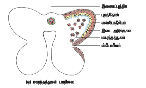
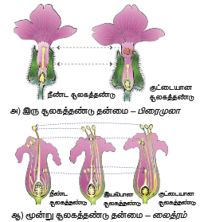

```hint { role ="info" }

கற்றல்‌ நோக்கங்கள்‌:

இப்பாடத்தினை கற்போ்போர்

- கீழ்நிலை, உயர்நிலை உயிரினங்களின்‌ பல்வேறு இனப்பெருக்க முறைகளை அறியவும்

- தாவரங்களில் நடைபெறும் பல்வேறு தழைவழி இனப்பெருக்க முறைகளை விவாதிக்கவும்

-  நவீன இனப்பெருக்க முறைகளை கண்டறியவும்

- மலரின் பாகங்களை நினைவு கூறவும்

- நுண் வித்துருவாக்கத்தில் உள்ள படிநிலைகளை விவரிக்கவும்

- முதிர்ந்த மகரந்தப்பையின் அமைப்பை கண்டறியவும்

- சூலின் அமைப்பு, வகைகளை விவரிக்கவும்

- பெருவித்துருவாக்கத்தின் படிநிலைகளை விவரிக்கவும்

- கருப்பையின் அமைப்பை பற்றி விவாதிக்கவும்

- மகரந்தச்சேர்க்கையின் பல வகைகளைக் கண்டறியவும்

- கருவூண் திசுவின் வகைகளைக் கண்டறியவும்

- இருவிதையிலை கருவளர்ச்சியை விவரிக்கவும்

- இருவிதையிலை, ஒருவிதையிலை விதையின் அமைப்பை வேறுபடுத்தவும் இயலும்.

```
உலகில்‌ வாழும்‌ உயிரினங்களின்‌ அத்தியாவசியமான பண்புகளில்‌ ஒன்று இனப்பெருக்கம்‌ ஆகும்‌. உலகில்‌ சிற்றினங்கள்‌ நிலைத்திருப்பதற்கம்‌, வேறுபாடின் மூலம்‌ தகுந்த மாற்றங்களுடன்‌ சந்ததிகள்‌ தொடர்ந்து வாழ்வதற்கும்‌ இனப்பெருக்கம்‌ ஒரு முக்கியமான நிகழ்வாக உள்ளது. தாவர இனப்பெருக்கம்‌ தாவரங்கள்‌ நிலைத்து வாழ்வதற்கு மட்டுமல்லாமல்‌, தாவரங்களை நேரடியாகவோ அல்லது மறைமுகமாகவோ சார்ந்து வாழும்‌ மற்ற எல்லா உயிரினங்களும்‌ தொடர்ந்து நிலைத்து வாழ்வதற்கு முக்கியமானதாக உள்ளது. பரிணாமத்தில் இனப்பெருக்கம் ஒரு முக்கிய பங்காற்றுகிறது. இந்த உலகில் தாவர இனப்பெருக்கத்தை பற்றி நாம் விரிவாக காணலாம்.


```hint { role ="info" }


**பஞ்சன் மகேஸ்வரி (1904-1966)**

பேராசிரியர் P. மகேஸ்வரி  தாவர கருவியல், புர அமைப்பியல்,  உள்ளமைப்பியல் போன்ற பிரிவுகளில் சிறப்பு பெற்ற ஒரு தாவரவியல் வல்லுநராவார். இவர் 1934-ஆம் ஆண்டு இந்திய அறிவியல்  கழகத்தின் (Indian Academy of Science)  சிறப்பு தேர்வு உறுப்பினரானார். 1950-ஆம் ஆண்டு “அன் இன்ட்ரோடக்ஷன் டு தி எம்பிரியாலஜி ஆப ஆஞ்சியோஸ்பெர்ம்ஸ்” (An introducction to the Embryology of Angiosperms) என்ற  தலைப்பில் ஒரு புத்தகம் வெளியிட்டார்.  இவர் 1951-ஆம் ஆண்டு “தாவர புற  அமைப்பியல் வல்லுனர்களுக்கான பன்னாட்டு கழகத்தை" (International Society for Plant Morphologists ) நிறுவினார்.

```

பொதுவாக உயிரினங்களின் இனப்பெருக்கம் கீழ்காணும் இரண்டு பிரிவுகளில் வகைப்படுத்தப்பட்டுள்ளது.

- பாலிலா இனப்பெருக்கம்
- பாலினப் பெருக்கம்

## பாலிலா இனப்பெருக்கம் (Asexual reproduction)

கேமிட்கள் ஈடுபடாமல் தன்னுடைய சொந்த சிற்றினங்களை பெருக்குவதற்கு  உதவும் இனப்பெருக்க முறை பாலிலா இனப்பெருக்கம் என்று அழைக்கப்படுகின்றது. பதினோராம் வகுப்பில் அலகு 1-லிருந்து இனப்பெருக்கம்‌ உயிரினங்களின்‌ ஒரு முக்கிய பண்பு என்பதை தெரிந்துக்‌ கொண்டோம்‌.

மேலும்‌ இங்கு பல்வகை இனப்பெருக்கம் பற்றி விவரித்துள்ளோம்‌ பரிணாமத்தில்‌ கீழ்நிலைத் தாவரங்கள்‌, பூஞ்சைகள்‌, விலங்குகளில்‌ பல்வகை பாலிலா இனப்பெருக்க முறை காணப்படுகிறது. கொனிடியங்கள்‌ தோற்றுவித்தல் (ஆஸ்பர்ஜில்லஸ்‌,பெனிசிலியம்),மொட்டு விடுதல் (ஈஸ்ட்‌, ஹைட்ரா),துண்டாகுதல்‌ (ஸ்பைரோகைரா),ஜெம்மா உருவாதல்‌ (மார்கான்ஷியா),மீளுருவாக்கம்‌ (பிளனேரியா) மற்றும்‌ இரு பிளவுருதல் (பாக்டீரியங்கள்‌) போன்றவை சில பாலிலா இனப்பெருக்க முறைகளாகும்‌. (பதினோராம்‌ வகுப்பில்‌ அலகு 1-ல் உள்ள பாடம்‌ ஒன்றைக்‌ காண்க). இந்த இனப்பெருக்க முறையில்‌ தோன்றும்‌ உயிரினங்கள்‌ புற அமைப்பிலும்‌, மரபியலிலும்‌ ஒத்திருப்பதால் நகல்கள்‌ **(clones)** என்று‌ அறியப்படுகின்றன. உயர்தாவரங்களும் பாலிலா இனப்பெருக்கத்தின் போது பல முறைகளை பின்பற்றுகின்றன. அவை கீழே கொடுக்கப்பட்டுள்ளன.


## தழைவழி பெருக்கம் (Vegetative propagation)

### இயற்கை முறைகள் (Natural methods)

இயற்கையாக தழைவழி இனப்பெருக்கத்தில் மொட்டுகள் வளர்ந்து புதிய தாவரங்களைத் தருகின்றன. மொட்டுகள் வேர், தண்டு, இலை போன்ற உறுப்புகளில் தோன்றலாம். ஒரு குறிப்பிட்ட நிலையில் புது தாவரம் பெற்றோர் தாவரத்திலிருந்து பிரிக்கப்பட்டு புதிய தாவரமாக உருவாகிறது. சில தழைவழி இனப்பெருக்கத்தில் ஈடுபடும் தாவர உறுப்புகள் சேமிப்பு மற்றும் பல ஆண்டு வாழும் தன்மை உடையதாகும். தாவர இனப்பெருக்கத்திற்கு பயன்படும் அலகு **இனப்பெருக்க உறுப்புகள்** (reproductive propagules) அல்லது **பரவல் உறுப்புகள்** (diaspores) என்று அறியப்படுகின்றன.  தழைவழி இனப்பெருக்கத்திற்கு உதவுகின்ற சில உறுப்புகளின்  படம் 1.1-ல் கொடுக்கப்பட்டுள்ளது.

### அ) வேரில் தழைவழி பெருக்கம் (Vegetative propagation in roots)

சில தாவரங்களின் வேர்களில் தழைவழி அல்லது மாற்றிட மொட்டுகள் தோன்றுகின்றன. எடுத்துக்காட்டுகள்:  *முரையா, டால்பர்ஜியா*  மற்றும் *மில்லிங்டோனியா*. சில கிழங்கு வடிவ மாற்றிட வேர்கள் மொட்டுகளை தோற்றுவிப்பதைத் தவிர உணவையும் சேமிக்கின்றன. எடுத்துக்காட்டு: *ஜப்போமியா பட்டாட்டஸ்* மற்றும் *டாலியா*. தகுந்த சூழ்நிலைகளில் மொட்டுகள் கொண்ட வேர்கள் தாய் தாவரத்திலிருந்து பிரிந்து தனித்த தாவரமாக வளர்கின்றன.


### ஆ) தண்டில்‌ தழைவழி இனப்பெருக்கம்‌ (Vegetative reproduction in stems)

பதினோராம்‌ வகுப்பில்‌ அலகு 3-லிருந்து பல்வகை தரைகீழ்‌ தண்டு மற்றும்‌ தரை ஒட்டிய தண்டின்‌ உருமாற்றங்களை பற்றி நீங்கள் நன்கு அறிந்திருப்பீர்கள். இலைகளில் மட்டநிலத் தண்டு *(மியூசா பாரடிசியாக்கா மற்றும் ஜின்ஜிஃபெர் அஃபிசினாலே, குர்குமா லாங்கா)*, தரையடிக்கிழங்கு *(அமோர்போபாலஸ் மற்றும் கொலகேஸியா)*, கிழங்கு *(சொலானம் டியூபரோசம்)*, குமிழ்த்தண்டு *(அல்லியம் சீப்பா மற்றும் லில்லியம்)*, ஓடு தண்டு *(சென்டெல்லா ஏசியாட்டிகா)*, வேர்விடும்  ஓடுதண்டு *(மென்தா மற்றும் ஃபிரகேரியா)*, நீர் ஓடு தண்டு *(பிஸ்டியா, ஜக்கார்னியா)*, தரைகீழ் உந்து தண்டு *(கிரைசாந்திமம்)*, சிறு குமிழ் மொட்டுக்கள் *(டயாஸ்காரியா, அகேவ்)*. மட்டநிலத்தண்டின் கணுவின் கோணமொட்டு மற்றும் கிழங்கின் கண் அமைப்பிலிருந்தும் புதிய தாவரங்கள் தோன்றுகின்றன.

```hint { role ="info" }
நீர்நிலைகளை பாதிக்கும் நீர் ஹையாசிந்த் (ஐக்கார்னியா கிராசிப்பஸ்) என்ற தாவரம் நீர் நிலைகளான குளம், ஏரி மற்றும் நீர் தேக்கங்களில் ஊடுருவும் களையாகும். இது பொதுவாக “வங்கத்தின் அச்சுறுத்தல்” என்று அறியப்படுகிறது. இது வேகமாக பரவி நீரில் கலந்துள்ள ஆக்ஸிஜனை குறைத்து மற்ற நீர்வாழ் உயிரினங்கள் மடிய காரணமாகிறது


```
```hint { role ="info" }
செயல்பாடு

ஒரு காய்கறி சந்தைக்கு சென்று அங்குள்ள காய்கறிகளை பயன்பாட்டின் அடிப்படையில் வேர், தண்டு அல்லது இலை என்று கண்டு பிடிக்கவும். அதில் எத்தனை பாலிலா இனப்பெருக்கம் வழி இனப்பெருக்கம் அடைகின்றன என்பதை கண்டறியவும்
```

### இ) இலையில்‌ தழைவழி இனப்பெருக்கம்‌ (Vegetative reproduction in leaf)

சில தாவரங்களில் இலைகளில் மாற்றிடத்து மொட்டுகள் தோன்றுகின்றன. இவை பெற்றோர் தாவரத்திலிருந்து பிரிந்து புதிய தனி தாவரங்களாக வளர்கின்றன. எடுத்துக்காட்டுகள்: பிரையோஃபில்லம், சில்லா, பெகோனியா. பிரையோஃபில்லத்தில் சதைப்பற்றுள்ள மற்றும் விளம்பில் பள்ளங்களுடைய இலைகள் உள்ளன. இப்பள்ளங்களில் வேற்றிட மொட்டுகள் தோன்றுகின்றன. இவை இலைவளர் மொட்டுகள் (epiphyllous buds) என்று அறியப்படுகின்றன. இலை அழுகியதும் இவ்வமைப்புகளில் வேர் தொகுப்பு உருவாகி தனி தாவரங்களாக மாறுகின்றன. சில்லா ஆற்று மணலில் வளரும் ஒரு குமிழ்தண்டு தாவரமாகும். இதன் தழை இலைகள் நீண்டும், குறுகியும் உள்ளன. இவற்றின் நுனியில் இலைவளர் மொட்டுகள் தோன்றி அவை தரையை தொட்டவுடன் புது தனி தாவரங்களாக மாறுகின்றன.


**இயல்பு தழைவழி இனப்பெருக்கத்தின் நன்மைகள் (Advantages of natural vegetative reproduction)**

- இனப்பெருக்கத்திற்கு ஒரு பெற்றோர் மட்டும் போதுமானது.

- தோன்றிய புதிய தாவரம் ஒத்த மரபணுதன்மையுடையவை

- சில தாவரங்களில் இது எளிதில் பரவுதலுக்கு உதவுகிறது. எடுத்துக்காட்டு: ஸ்பைனிஃபெக்ஸ்

- தோட்டக்கலை வல்லுநர்களும், விவசாயிகளும் இயல்பான தழைவழி இனப்பெருக்கம் செய்ய உதவும் இந்த உறுப்புகளை பயிறாக்கத்திற்கு பயன்படுத்துகின்றனர் மற்றும் பெரிய அளவில் தாவரங்களை அறுவடை செய்யவும் பயன்படுத்துகின்றனர்.

**இயல்பு தழைவழி இனப்பெருக்கத்தின் தீமை (Disadvantages of natural vegetative reproduction)**

- புதிதாக உருவாகும் தாவரங்களில் மரபணுசார்
வேறுபாடு காணப்படுவதில்லை.

### செயற்கை முறைகள் (Artificial Methods)
மேலே குறிப்பிட்டுள்ள இயல்பு தழைவழி இனப்பெருக்க முறைகளைத் தவிர வேளான்மையிலும், தோட்டக்கலையிலும் அவற்றின் உறுப்புகளிலிருந்து தாவரங்களை பெருக்குவதற்கு பல வழிமுறைகள் பயன்படுத்துகின்றன. இவை செயற்கை இனப்பெருக்க முறைகளாகும். சில செயற்கை இனப்பெருக்க முறைகள் மனிதர்களால் நீண்ட காலமாக பயன்படுத்தப்படுகின்றன. இவை பாரம்பரிய முறைகளாகும் (conventional methods). அன்மைக்காலங்களில் குறைந்த நேரத்தில் கூடுதலான எண்ணிக்கையில் தாவரங்களை உருவாக்க தொழில்நுட்பம் பயன்படுத்தப்படுகிறது. இம்முறைகளை நவீன முறைகள் (modern methods) என்று அழைக்கலாம்.

**I. பாரம்பரிய முறைகள் (Conventional methods)**

பொதுவான பாரம்பரிய முறைகளில் போத்துநடுதல், ஒட்டுதல், பதியம் போடுதல் போன்றவை அடங்கும்.

**அ) போத்துகள் (Cutting):** இம்முறையில் பெற்றோர் தாவரத்திலிருந்து வேர், தண்டு, இலை போன்ற பாகங்களை போத்துகளாக பயன்படுத்தலாம். வெட்டிய பகுதிகள் தகுந்த ஊடகத்தில் வைத்தபின் புதிய தாவரம் உருவாகிறது. இது வேர்களை உருவாக்கி புதிய தாவரமாக வளர்கிறது. பயன்படுத்தப்படும் பாகத்தின் அடிப்படையில் வேர் போத்துகள் (மாலஸ்), தண்டு போத்துகள் (ஹைபிஸ்கஸ், போகன்வில்லா, மொரிங்கா), இலை போத்துகள் (பிகோனியா, பிரையோஃபில்லம்). தண்டு போத்துகளே பெரும்பாலும் இனப்பெருக்கத்திற்கு பயன்படுத்தப்படுகின்றன.

**ஆ) ஒட்டுதல் (Grafting):** இம்முறையில் இரண்டு வெவ்வேறு தாவரங்களின் பாகங்கள் இணைக்கப்பட்டு அவை தொடர்ந்து ஒரே தாவரமாக வளர்கின்றன. இந்த இரண்டு தாவரங்களில் தரையுடன் தொடர்புடைய தாவரம் வேர்கட்டை (stock) என்றும் ஒட்டுதலுக்கு பயன்படுத்தப்படும் தாவரம் ஒட்டுத்தண்டு (scion) என்றும் அறியப்படுகின்றன (படம் 1.2 அ). எடுத்துக்காட்டுகள்: எலுமிச்சை, மா மற்றும் ஆப்பிள். வேர்கட்டை மற்றும் ஒட்டுத்தண்டு இடையே ஏற்படும் இணைப்பைச் சார்ந்து பல்வகை ஒட்டுதல் உள்ளன.

அவை

(i) மொட்டு ஒட்டுதல்

(ii) அணுகு ஒட்டுதல்

(iii) நா ஒட்டுதல்

(iv) நுனி ஒட்டுதல்

(v) ஆப்பு ஒட்டுதல் என்பனவாகும்.

**i) மொட்டு ஒட்டுதல் (Bud grafting):** வேர்கட்டையில் ஒரு T-வடிவ கீறல் ஏற்படுத்தப்படுகிறது. பின்பு மரப்பட்டை தூக்கப்படுகிறது. சிறிது கட்டையுடன் சேர்ந்த ஒட்டுத்தண்டு மொட்டு கீறலில் பட்டைக்கு கீழே வைக்கப்படுகிறது. பிறகு இது சரியாக ஒரு டேப் பயன்படுத்தி சுற்றப்படுகிறது.

**ii) அணுகு ஒட்டுதல் (Approach grafting):** இம்முறையில் வேர்கட்டை, ஒட்டுத்தண்டு இரண்டுமே வேரூன்றியுள்ளன. வேர்கட்டை ஒரு தொட்டியில் வளர்க்கப்படுகிறது. இது ஒட்டுத்தண்டுடன் நெருக்கமாக கொண்டு வரப்படுகிறது. இரண்டும் ஒரே அளவு தடிப்புடையதாக இருத்தல் அவசியம். இரண்டிலும் ஒரு சிறிய சீவல் வெட்டப்பட்டு நீக்கப்படுகிறது. இரண்டின் வெட்டப்பட்ட பரப்புகளும் ஒன்றையொன்று நெருக்கமாக கொண்டு வரப்பட்டு கட்டப்பட்டு ஒரு டேப்பினால் சுற்றப்படுகின்றன. 1 – 4 வாரங்களுக்கு பிறகு வேர்கட்டையின் நுனியும் ஒட்டுத்தண்டின் அடியும் நீக்கப்பட்டு தனித்தனி தொட்டியில் வளர்க்கப்படுகின்றன.

**iii) நா ஒட்டுதல் (Tongue grafting):** ஒரே பருமனுடைய ஒட்டுத்தண்டு மற்றும் வேர் கட்டையை சாய்வாக வெட்டி ஒட்டுத்தண்டை வேர்கட்டையுடன் டேப் பயன்படுத்தி ஒட்ட வேண்டும்.

**iv) நுனி ஒட்டுதல் (Crown grafting):** வேர்கட்டை அளவில் பெரியதாக இருக்கம்போது ஒட்டுக்கட்டைகள் ஆப்பு வடிவத்தில் வெட்டப்பட்டு, வேர்கட்டையில் உண்டாக்கப்பட்ட பிளவில் அல்லது பள்ளத்தில் செருகப்படுகின்றன. பின்பு இவை நிலையான ஒட்டுதல் மெழுகு பயன்படுத்தி நிலை நிறுத்தப்படுகிறது.

**v) ஆப்பு ஒட்டுதல் (Wedge grafting):** இம்முறையில் வேர் கட்டையில் துளை அல்லது மரப்பட்டையில் வெட்டு ஏற்படுத்தப்படுகிறது. ஒட்டுத்தண்டின் குச்சு கிளையை இதில் சொருகச் செய்து உறுதியாக இணைத்து, இரண்டின் கேம்பியமும் இணைக்கப்படுகின்றன.


```hint { role ="info" }
செயல்பாடு

அருகாமையிலுள்ள ஒரு தாவர
வளர்ப்பில்லத்திற்கு (Nursery) செல்லவும். அங்கு
ஒட்டுதல், பதியம் போடுதல் போன்றவை எவ்வாறு
செய்யப்படுகிறது என்பதை கவனிக்கவும். பின்பு
உன்னுடைய வீடு அல்லது பள்ளிக்குச் சென்று
இந்த செயல்பாட்டு முறைகளை செய்து பழகவும்.

```

**இ) பதியம் போடுதல் (Layering):** இம்முறையில் பெற்றோர் தாவரத்தின் தண்டு தாவரத்தோடு ஒட்டியிருக்கும் போது அதிலிருந்து வேர்கள் தோன்றுவதற்கு தூண்டப்படுகிறது. வேர் தோன்றியபின் வேர் பகுதி வெட்டி நீக்கப்பட்டு புதிய தாவரமாகிறது. எடுத்துக்காட்டுகள்: இக்சோரா மற்றும் ஜாஸ்மினம். மண்முட்டு பதியம் மற்றும் காற்று பதியம் போன்றவை சில வகை பதியங்களாகும் (படம் 1.2 ஆ).

**i) மண்முட்டு பதியம் (Mound layering):** நெகிழ்வுத்தன்மையுடைய கிளைகள் பெற்ற தாவரங்களில் இம்முறை பயன்படுத்தப்படுகிறது. இவைகளுடைய அடிகிளையை வளைத்து தரைப் பகுதிக்கு எடுத்துச் சென்று தண்டு மண்ணினுள் புதைக்கக்படுகிறது. தண்டின் நுனி தரையின் மேல் உள்ளது. புதைத்த தண்டிலிருந்து வேர்கள் தோன்றிய பின் பெற்றோர் தாவரத்திலிருந்து வெட்டப்படுவதால், புதைந்த பகுதி தனி தாவரமாக வளர்கிறது.

**ii) காற்று பதியம் (Air layering):** இதில் தண்டு கணுப்பகுதியில் செதுக்கப்படுகிறது. இப்பகுதியில் வளர்ச்சி ஹார்மோன்கள் சேர்ப்பதால் வேர் உருவாதலை தூண்டுகிறது. இப்பகுதி ஈரப்பதமான மண்ணால் மூடப்பட்டு பாலிதீன் உறையிடப்படுகிறது. 2 – 4 மாதத்திற்குள் இக்கிளைகளிலிருந்து வேர்கள் தோன்றுகின்றன. இவ்வாறு வேர்கள் தோன்றிய கிளைகள் பெற்றோர் தாவரத்திலிருந்து நீக்கப்பட்டு தனி தொட்டி அல்லது தரையில் வளர்க்கப்படுகின்றன.


**பாரம்பரிய முறைகளின் நிறைகள் (Advantages of conventional methods)**

- பாரம்பரிய முறைகளின் மூலம் உருவாக்கப்படும் தாவரங்கள் மரபணு ரீதியாக ஒரே மாதிரியானவை.

- இம்முறையின் மூலம் அதிக தாவரங்களை குறுகிய காலத்தில் உருவாக்கமுடியும்.

- சில தாவரங்கள் விதைகளை உருவாக்குவதில்லை அல்லது மிகக் குறைவான விதைகளை உருவாக்கும். இன்னும் சில தாவரங்களில் உருவாக்கப்படும் விதைகள் முளைப்பதில்லை. இத்தகைய எடுத்துக்காட்டுகளில் இம்முறைகளின் மூலம் குறுகிய காலத்தில் அதிக தாவரங்களை உருவாக்க முடியும்.

- தழைவழி இனப்பெருக்கம் மூலம் அதிக செலவில்லாமல் ஒரு சில தாவரங்களை பெருக்கமடையச் செய்யமுடியும். எடுத்துக்காட்டு: சொலானம் டியூபரோசம்.

- நோய் எதிர்ப்பு, உயர் விளைச்சல் போன்ற விரும்பத்தக்க பண்புளை கொண்ட இரண்டு வெவ்வேறு தாவரங்கள் ஒட்டு செய்யப்பட்டு புதிய தாவரங்களாக அதே விரும்பத்தக்கபண்புகளுடன் வளர்க்க முடியும்.

**பாரம்பரிய முறைகளின் குறைகள் (Disadvantages of conventional methods)**

- வைரஸ் தொற்று கொண்ட பெற்றோர் தாவரங்களை இம்முறைகளில் பயன்படுத்தும்போது வைரஸ் தொற்றுக் கொண்ட புதிய தாவரங்கள் உருவாக்கப்படுகின்றன.

- தழைவழிப் பெருக்கத்திற்காக பயன்படுத்தப்படும் தழை உறுப்புகள் (அமைப்புகள்) பருத்ததன்மை கொண்டுள்ளதால் அவைகளை சேமித்து வைப்பதும், கையாள்வதும் கடினம்.

## பாலினப் பெருக்கம் (Sexual Reproduction)

கீழ்நிலைத் தாவரங்களான பாசிகள், பிரையோஃபைட்களில் நடைபெறும் இனப்பெருக்க முறைகள் பற்றி முந்தைய வகுப்புகளில் விரிவாக படித்திருப்பீர்கள். பாலினப் பெருக்கம் ஆண், பெண் கேமீட்களின் உற்பத்தி மற்றும் இணைவு ஆகிய நிகழ்ச்சிகளை உள்ளடக்கியது. இதில் முந்தைய நிகழ்வு கேமீட் உருவாக்கம் (gametogenesis) என்றும், பிந்தைய நிகழ்வு கருவுறுதல் (fertilization) என்றும் அழைக்கப்படுகிறது. பாசிகள், பிரையோஃபைட்களில் நடைபெறும் பாலினப் பெருக்க முறைகளை நினைவு கூர்வோம். அவை சிற்றினத்தைப் பொறுத்து நகரும் அல்லது நகர இயலாகேமீட்களை உற்பத்தி செய்து இனப்பெருக்கம் செய்கின்றன. கேமீட்களின் இணைவு மூன்று வகைப்படும். ஒத்த கேமீட்களின் இணைவு (isogamy), சமமற்ற கேமீட்களின் இணைவு (anisogamy), முட்டைக் கருவுறுதல் (oogamy). பாசிகளில் வெளிக் கருவுறுதலும், உயர் தாவரங்களில் உட்கருவுறுதலும் நடைபெறுகின்றன.

#### மலர்

காலங்காலமாக மலர்களைப் பற்றி பன்பரிமாண நோக்குகள் நிலவுகின்றன. மலர்கள் கவிஞர்களுக்கு உற்சாகமூட்டும் கருவியாக உள்ளது. அனைத்து வகை விழாக்களிலும் அலங்காரப்பொருளாய் விளங்குகின்றது. தமிழ் இலக்கியத்தில் ஐவகை நிலங்களும், பல வகை மலர்களால் குறிப்பிடப்பட்டுள்ளன. சில நாடுகளின் கொடிகளிலும் மலர்கள் இடம் பெற்றுள்ளன. இவை வாசனை திரவியத் தயாரிப்பில் பயன்படுத்தப்படுகின்றன. தாவர புறஅமைப்பியல் வல்லுநரைப் பொறுத்தமட்டில் மலர் என்பது இனப்பெருக்கத்திற்காக மிகவும் சுருக்கமடைந்த தண்டுத் தொகுதியாகும். பதினோராம் வகுப்பில் அலகு II-ல் மலர்களின் பாகங்களைப் பற்றி நீவிர் படித்ததை நினைவு கூர்வோம். ஒரு மலர் நான்கு வட்டங்களைக் கொண்டுள்ளது. புல்லிவட்டம், அல்லிவட்டம், மகரந்தத்தாள்வட்டம், சூலகவட்டம். இவற்றில் மகரந்தத்தாள்வட்டமும், சூலகவட்டமும் இன்றியமையாத உறுப்புகளாகும் (படம் 1.3). உயர் தாவரங்களில் பாலினப் பெருக்கத்தில் நடைபெறும் நிகழ்வு மற்றும் மாற்றங்கள் மூன்று படிநிலைகளில் நிகழ்கின்றன. அவை கருவுறுதலுக்கு முன், கருவுறுதல், கருவுறுதலுக்கு பின் நடைபெறும் மாற்றங்களாகும். இந்நிகழ்வுகளை விரிவாக விவாதிப்போம்.


## கருவுறுதலுக்கு முந்தைய அமைப்புகள் மற்றும் நிகழ்வுகள்

தாவரங்களில் ஏற்படும் ஹார்மோன் மற்றும் வளர்ச்சி மாற்றங்கள் மலர் தோற்றுவியின் வேறுபாடுறுதலுக்கும் வளர்ச்சிக்கும் வழிவகுக்கின்றன. கருவுறுதலுக்கு முந்தைய அமைப்புகள் மற்றும் நிகழ்வுகள் கீழே கொடுக்கபட்டுள்ளன.

### ஆண் இனப்பெருக்க பகுதி – மகரந்தத்தாள் வட்டம்

மகரந்தத்தாள் வட்டம் மகரந்தத்தாள்களால் ஆனது. ஒவ்வொரு மகரந்தத்தாளும் ஒரு மகரந்தப்பையையும் ஒரு மகரந்தத்தாள் கம்பியையும் கொண்டது. மகரந்தப் பையிலுள்ள மகரந்தத் துகள்கள் ஆண் கேமீட்டகத் தாவரத்தைக் குறிக்கின்றன. இப்பாடத்தில் மகரந்தப்பையின் அமைப்பு மற்றும் வளர்ச்சி பற்றி விரிவாகக் காண்போம். மகரந்தப்பையின் வளர்ச்சி: மிகவும் இளம் நிலை மகரந்தப்பை புறத்தோலால் சூழப்பட்ட ஒருபடித்தான செல் திரள்களால் ஆனது. இதன் வளர்ச்சியின் போது மகரந்தப்பை நான்கு மடல்களைக் கொண்ட அமைப்பாகிறது. ஒவ்வொரு மடலிலும் ஒன்று அல்லது ஒரு சில வரிசைகளில் அமைந்த புறத்தோல் அடிச்செல்கள் தெளிவான உட்கருவைக் கொண்டு அளவில் பெரிதாகின்றன. இவை முன்வித்து செல்களாக செயல்படுகின்றன. இந்த முன்வித்து செல்கள் பரிதிக்கிணையான தளத்தில் பகுப்படைந்து (periclinal divison) புறத்தோலை நோக்கி முதல்நிலை புறபக்க (parietal) செல்களையும், மகரந்தப்பையின் உட்புறம் நோக்கி முதல்நிலை வித்துருவாக்க (sporogenous) செல்களையும் தோற்றுவிக்கின்றன. 


 


முதல்நிலை புறபக்க செல்கள் தொடர்ச்சியாக பரிதிக்கிணையான தள மற்றும் ஆரத்திற்கு இணையான பகுப்படைந்து 2 - 5 அடுக்குகள் கொண்ட மகரந்தப்பைச் சுவரை உருவாக்குகின்றன. இவை புறத்தோலிலிருந்து உட்புறம் நோக்கி எண்டோதீசியம், இடை அடுக்குகள் மற்றும் டபீட்டம் என்ற பகுதிகளை கொண்டுள்ளன. நுண்வித்துருவாக்கம் (Microsporogenesis): இருமடிய நுண்வித்து தாய் செல் குன்றல்பகுப்படைந்து ஒருமடிய துண்வித்துகள் உருவாகும் படிநிலைகளுக்கு நுண்வித்துருவாக்கம் (microsporogenesis) என்று பெயர். முதல்நிலை வித்து செல்கள் நேரடியாகவோ அல்லது சில குன்றலிலா பகுப்புகளுக்கு உட்பட்டோ வித்துருவாக்க திசுவைத் (sporogenous tissue) தோற்றுவிக்கின்றன. வித்துருவாக்க திசுவின் கடைசி செல்கள் நுண்வித்து தாய் செல்களாகச் செயல்படுகின்றன. ஒவ்வொரு நுண்வித்து தாய் செல்லும் குன்றல் பகுப்புற்று நான்கு ஒருமடிய நுண்வித்துகளைத் தோற்றுவிக்கின்றன (நான்கமை நுண்வித்து). இந்த நான்கமை வித்துகள் நான்முகப்பு, குறுக்கு மறுக்கு, நேர்கோட்டு, இருமுகப்பு, T வடிவ அமைப்பில் உள்ளது. நுண்வித்துகள் விரைவில் ஒன்றிலிருந்து மற்றொன்று பிரிந்து தனித்தனியாக மகரந்தப்பை அறையில் காணப்படுகின்றன மற்றும் மகரந்தத்துகள்களாக வளர்கின்றன. நுண்வித்தகங்களின் வளர்ச்சியிலுள்ள படிநிலைகள் படம் 1.4-ல் கொடுக்கப்பட்டுள்ளன. சில தாவரங்களில் ஒரு நுண்வித்தகத்திலுள்ள நுண்வித்துகள் அனைத்தும் ஒன்றாக இணைந்து பொலினியம் (pollinium) என்ற அமைப்பை பெற்றுள்ளது. எடுத்துக்காட்டு: எருக்கு. கூட்டு மகரந்தத்துகள்கள் டுரோசீரா, டிரைமிஸ் ஆகிய தாவரங்களில் காணப்படுகின்றன.

```hint { role ="info" }
செயல்பாடு

டாட்டூரா மெட்டலின் மொட்டுகள் மற்றும் மலர்களைச் சேகரிக்கவும். மகரந்தத்தாள்களை பிரித்தெடுத்து மகரந்தப்பையை மெல்லிய குறுக்குத் துண்டுகள் எடுத்து நுண்ணோக்கியில் உற்று நோக்கவும். மகரந்தப்பையின் பல்வேறு வளர்ச்சி நிலைகளை உற்று நோக்கி பதிவு செய்யவும்.
```

#### முதிர்ந்த மகரந்தப்பையின் குறுக்கு வெட்டுத் தோற்றம்

முதிர்ந்த மகரந்தப்பையின் குறுக்கு வெட்டுத்
தோற்றம் மகரந்த அறை மகரந்தச்சுவரால்
சூழப்பட்டுள்ளதைக் காட்டுகிறது. இது இருமடலுடைய
இரு பை அமைப்பு (dithecous) கொண்டுள்ளது. ஒரு
வகைமாதிரி (typical) மகரந்தப்பை நான்கு
வித்தகங்களைக் கொண்டது. முதிர்ந்த மகரந்தப்பையின் குறுக்கு வெட்டுத் தோற்றம் படம்
1.5-ல் கொடுக்கப்பட்டுள்ளது.

**1. மகரந்தப்பை சுவர்**

ஒரு முதிர்ந்த மகரந்தப்பையின் சுவர் **(அ) புறத்தோல் (ஆ) எண்டோதீசியம் (இ) இடை அடுக்குகள் (ஈ) டபீட்டம் என்ற அடுக்குகளைக் கொண்டுள்ளது.**

**அ) புறத்தோல்:** இது ஓரடுக்கு செல்களால் ஆன பாதுகாப்பு அடுக்காகும். வேகமாக பெரிதாகும் உட்புறத் திசுக்களுக்கு ஈடுகொடுக்கும் பொருட்டு இச்செல்கள் தொடர்ச்சியாக ஆரத்திற்கு இணையான பகுப்படைகின்றன.

**ஆ) எண்டோதீசியம்:** இது பொதுவாக புறத்தோலுக்குக் கீழாக ஆரப்போக்கில் நீண்ட ஓரடுக்கு செல்களால் ஆனது. உட்புற கிடைமட்டச் சுவர் (சில சமயங்களில் ஆரச்சுவரும்) - செல்லுலோசால் ஆன (சில சமயங்களில் லிக்னினாலும் ஆன) பட்டைகளைத் தோற்றுவிக்கிறது. இச்செல்கள் நீர் உறிஞ்சும் தன்மை (hygroscopic) கொண்டவை. நீர்வாழ்த் தாவரங்கள், சாற்றுண்ணித் தாவரங்கள், மூடிய பூக்களைக் கொண்ட தாவரங்கள் மற்றும் தீவிர ஒட்டுண்ணித் தாவரங்களில் மகரந்தப்பைகளில் எண்டோதீசியம் வேறுபாடடைவதில்லை. இரண்டு வித்தகங்களை இணைக்கும் ஒரு மகரந்த மடல் பகுதியில் அமைந்த செல்களில் இத்தடிப்பு காணப்படுவதில்லை. இப்பகுதிக்கு ஸ்டோமியம் (stomium) என்று பெயர். எண்டோதீசியத்தின் நீர் உறிஞ்சுதன்மையும், ஸ்டோமியமும் முதிர்ந்த மகரந்தப்பை வெடிப்பிற்கு உதவுகின்றன.

**இ) இடை அடுக்குகள்:** எண்டோதீசியத்தை அடுத்துள்ள இரண்டு அல்லது மூன்று அடுக்கு செல்கள் இடை அடுக்குகளை குறிப்பிடுகின்றன. இவை குறுகிய வாழ்தன்மை (ephemeral) உடையது. மகரந்தப்பை முதிர்ச்சியடையும் போது இவை நசுக்கப்படுகின்றன அல்லது சிதைவடைந்து விடுகின்றன.

**ஈ) டபீட்டம்:** இது மகரந்தப்பை சுவரின் உட்புற அடுக்காகும். நுண்வித்து உருவாக்கத்தின் நான்மய நுண்வித்துகள் நிலையில் இது தன் முழு வளர்ச்சி நிலையை அடைகிறது. டபீட்டத்தின் ஒரு பகுதி மகரந்த அறையைச் சூழ்ந்துள்ள இணைப்புத் திசுவிலிருந்தும் மற்றொரு பகுதி வெளிப்புற சுவர் அடுக்கிலிருந்தும் உருவாகிறது. எனவே டபீட்டம் இரட்டை தோற்றமுடையது. இது வளரும் வித்துருவாக்க திசுக்கள், நுண்வித்து தாய் செல்கள் மற்றும் நுண் வித்துகளுக்கு ஊட்டமளிக்கிறது. டபீட்டத்தின் செல்கள் ஒரு உட்கரு அல்லது ஒன்றுக்கு மேற்பட்ட உட்கரு அல்லது பன்மடிய தன்மையுடைய உட்கரு கொண்டு காணப்படும். மகரந்தப்பை சுவர் பொருட்கள், ஸ்போரோபொலனின், போலன்கிட், டிரைஃபைன் மற்றும் ஒவ்வாத்தன்மை வினையை (incompatibility) கட்டுப்படுத்தும் ஏராளமான புரதங்கள் உற்பத்தியிலும் டபீட்டம் பங்கு கொள்கிறது. மேலும் நுண்வித்து அல்லது மகரந்தத்துகள்களின் வளத்தன்மை அல்லது மலட்டுத்தன்மையை இது கட்டுப்படுத்துகிறது.

செயல்பாட்டின் அடிப்படையில் டபீட்டம் சுரப்பு டபீட்டம், ஊடுருவும் டபீட்டம் என இரு வகைப்படும்.


**சுரப்பு டபீட்டம் (புறப்பக்க / சுரப்பு / செல் வகை) (Secretory tapetum):** இவ்வகை டபீட்டம் தோற்றநிலை, செல்லமைப்பை தக்கவைத்து, செல் ஒருங்கமைவுடன் இருந்து நுண்வித்துகளுக்கு ஊட்டமளிக்கின்றன.

**ஊடுருவும் டபீட்டம் (பெரிபிளாஸ்மோடிய வகை) (Invasive tapetum):** இவ்வகை டபீட்டத்தின் செல்கள் உட்புற கிடைமட்ட சுவர்களையும், ஆரச் சுவர்களையும் இழந்து அனைத்து புரோட்டோபிளாஸ்ட்களும் ஒன்றிணைந்து பெரிபிளாஸ்மோடியத்தை உருவாக்குகின்றன.

**டபீட்டத்தின் பணிகள்**

- வளரும் நுண்வித்துகளுக்கு ஊட்டமளிக்கிறது.

- **யுபிஷ் உடலத்தின்** (ubisch bodies) மூலம் ஸ்போரோபொலனின் உற்பத்திக்கு உதவுவதால் மகரந்தச்சுவர் உருவாக்கத்தில் முக்கிய பங்காற்றுகிறது.

- போலன்கிட்டுக்கு தேவையான வேதிப்பொருட்களை தந்து அவை மகரந்தத்துகளின் பரப்புக்கு கடத்தப்படுகிறது.

- சூலக முடியின் **ஒதுக்குதல் வினைக்கான** (rejection reaction) எக்சைன் புரதங்கள் (exine proteins) எக்சைன் குழிகளில் காணப்படுகின்றன. இவ்வகைப் புரதங்கள் டபீட்ட செல்களிலிருந்து பெறப்படுகின்றன.

```hint { role ="info" }
உங்களுக்கு தெரியுமா ?

பெரும்பாலான தாவரவியல் வல்லுநர்கள் அமீபா வகை என்ற மூன்றாவது வகை டபீட்டம் பற்றி குறிப்பிட்டுள்ளனர். இவ்வகையில் செல்சுவர் இழக்கப்படாமல் மகரந்த அறையினுள் செல்கள் ஊடுருவுகின்றன. இவ்வகை ஆண்மலட்டுத் தன்மையுடன் தொடர்புடையது. மேலும் பெரிபிளாஸ்மோடிய வகையுடன் அடிக்கடி குழப்பத்தை ஏற்படுத்தப்படுகிறது
```

**2. மகரந்த அறை:** மகரந்த அறை இளம் நிலையில் நுண்வித்துகளாலும், முதிர்ந்த நிலையில் மகரந்தத்துகள்களாலும் நிறைந்திருக்கும். நுண்வித்து தாய்செல்கள் குன்றல் பகுப்படைந்து ஒரு மடிய நிலையிலுள்ள நுண்வித்துகளைத் தருகின்றன.

**3. இணைப்புத் திசு:** இது மகரந்த மடல்களுக்கு இடையில் காணப்படும் வளமற்ற திசுப் பகுதியாகும். இது வாஸ்குலத் திசுக்களைக் கொண்டுள்ளது. இது உள்பக்க டபீட்டத்தின் உருவாக்கத்திற்குப் பங்களிக்கிறது.

#### நுண் வித்துகள் மற்றும் மகரந்தத் துகள்கள்

நுண்வித்து தாய் செல்கள் குன்றல் பகுப்படைதலின் விளைவாக பெறப்படுவது நுண்வித்துகளாகும். மகரந்தத் துகள் நுண்வித்திலிருந்து பெறப்படுகின்றது. நுண்வித்துகள் புரோட்டோபிளாசம் பெற்று முழுமையாக வளர்ச்சியடையாத சுவற்றினால் சூழப்பட்டுள்ளது. மகரந்தத்துகளில் புரோட்டோபிளாசம் அடர்ந்த சைட்டோபிளாசத்தையும், மையத்திலமைந்த உட்கருவையும் கொண்டுள்ளது. இதன் சுவர் உட்புற **இன்டைன்** (intine) மற்றும் வெளிப்புற **எக்சைன்** (exine) என இரு அடுக்குகளைக் கொண்டது. இன்டைன் பெக்டின், ஹெமிசெல்லுலோஸ், செல்லுலோஸ், காலோஸ் மற்றும் புரதங்கள் கொண்டு சீரானமெல்லிய தடிப்புடன் காணப்படும். எக்சைன் செல்லுலோஸ், ஸ்போரோபொலினின், போலன்கிட் கொண்டு தடித்து காணப்படும். எக்சைன் சீரற்ற தடிப்புகளுடன் சில பகுதிகளில் மெல்லியதாக காணப்படும். இப்பகுதிகள் சிறிய வட்டவடிவில் இருந்தால் **வளர்துளைகள்** என்றும், சற்று நீண்டு காணப்பட்டால் **பிளவுப்பள்ளங்கள்** என்றும் அழைக்கப்படுகின்றன. இவை மகரந்தத்துகளின் முளைத்தலுடன் தொடர்புடையவை. வளர்துளைப் பகுதியில் ஸ்போரோப்பொல்லனின் பொதுவாகக் காணப்படுவதில்லை. எக்சைனின் புறப்பரப்பு மென்மையாகவோ அல்லது பலவகை அலங்கார பாங்குகளுடனும் உள்ளது. (தடி வடிவம், சிறு குழியுடைய, கரணை போன்ற, சிறு புள்ளி போன்ற). அலங்கார பாங்குகள் தாவரங்களை அடையாளம் கண்டறியவும் வகைப்படுத்தவும் பயன்படுத்தப்படுகிறது.

```hint { role ="info" }
உங்களுக்கு தெரியுமா ?

**மகரந்தவியல் (Palynology)**

மகரந்தத்துகள் பற்றிய படிப்பிற்குமகரந்தவியல் (Palynology) என்றுபெயர். இது நிலக்கரி மற்றும் எண்ணெய்புலங்களின் பரவலைக் கண்டறிய உதவுகிறது.ஒரு பகுதியின் தாவர கூட்டத்தை மகரந்தத்துகள்கள்பிரதிபலிக்கின்றன.மகரந்தத்துகள்களை நீண்டகாலம்உயிர்ப்புத்தன்மையுடன் பாதுகாக்க திரவநைட்ரஜன் (-196°C) பயன்படுத்தப்படுகிறது.இந்நுட்பம் உறைகுளிர்பாதுகாப்பு(cryopreservation) என அறியப்படுகிறது. இந்நுட்பம்பொருளாதார முக்கியத்துவமுள்ள பயிர்களின்மகரந்தத்துகள்களை தாவர மேம்பாடுசெயல்திட்டங்களுக்காக சேமித்து வைக்கஉதவுகிறது.
```

```hint { role ="info" }
உங்களுக்கு தெரியுமா ?

**தேனீ மகரந்தம் (Bee pollen)**

தேனீ மகரந்தம் ஒரு இயற்கை பொருளாகும். இதில் அதிக அளவு புரதம், கார்போஹைட்ரேட், மிக குறைவான தாதுப் பொருள்கள் மற்றும் வைட்டமின்கள் உள்ளன. எனவே இது கூடுதல் ஊட்டப் பொருளாகப் பயன்படுத்தப்படுகிறது; இது மகரந்த மாத்திரைகளாகவும் , பாகுநீராவும் விற்கப்படுகிறது. மேலும் தடகள வீரர்கள் மற்றும் பந்தயக் குதிரைகளின் செயல்பாட்டை அதிகரிக்க உதவுகிறது. தீக்காயத்தினால் ஏற்படும் புண்கள் ஆறுவதற்கு இது உதவுகிறது. பூந்தேன் மகரந்தம் பற்றிய அறிவியலுக்கு பூந்தேன் மகரந்தவியல் (mellitopalynology) என்று பெயர்.


```

மகரந்தத்துகளின் வடிவம் சிற்றினத்திற்கு சிற்றினம் மாறுபடுகிறது. கோளம், நீள்கோணம், கதிர்கோல், மடல், கோண அல்லது பிறை வடிவம் என பல்வேறு வடிவங்களில் காணப்படுகிறது. மகரந்தத்துகள்களின் அளவு 10 மைக்ரோ மீட்டர் (மயோசோடிஸ்) முதல் 200 மைக்ரோ மீட்டர் (குக்கர்பிட்டேசி மற்றும் நிக்டாஜினேசி குடும்பத் தாவரங்கள்) வரை வேறுபடுகின்றன.

சுவர்ப்பொருளான ஸ்போரோபொலினின் உருவாக மகரந்தத்துகளின் சைட்டோபிளாசம் மற்றும் டபீட்டம் பங்களிக்கிறது. இது கரோட்டினாய்டிலிருந்து பெறப்படுகிறது. இது இயற்பியல் மற்றும் உயிரிய சிதைவைத் தாங்கும் தன்மையுடையது. அதிக வெப்பத்தைத் தாங்கும்தன்மை, வீரியமிக்க அமிலம், காரம் மற்றும் நொதிகளின் செயல்களிலிருந்தும் பாதுகாக்கிறது. எனவே தொல்லுயிர் புதைபடிவுகளில் மகரந்தத்துகள் நீண்ட காலம் பாதுகாப்பாக இருக்க இதுவே காரணமாகும். மேலும் மகரந்தப்பையிலிருந்து சூலக முடி வரையிலான மகரந்தத்துகள்களின் பயணத்தை இது பாதுகாப்பானதாக்குகிறது.

போலன்கிட் உருவாக்கத்தில் டபீட்டம் பங்களிக்கிறது. கரோட்டினாய்டு அல்லது ப்ளேவோனாய்ட் இதற்கு மஞ்சள் அல்லது ஆரஞ்சு நிறத்தைத் தருகிறது. இது மகரந்தத்துகள்களின் புறப்பரப்பில் காணப்படும் பிசுபிசுப்பான பூச்சு கொண்ட எண்ணெய் அடுக்காகும். இது பூச்சிகளைக் கவர்வதுடன் புற ஊதாக் கதிர்களிலிருந்தும் பாதுகாக்கிறது.

#### ஆண் கேமீட்டகத் தாவரத்தின் வளர்ச்சி

ஆண் கேமீட்டகத் தாவரத்தின் முதல் செல் நுண்வித்தாகும். இது ஒருமடியமானது. நுண்வித்தகத்திற்கு உள்ளிருக்கும் போதே ஆண் கேமீட்டகத் தாவரத்தின் வளர்ச்சி தொடங்கிவிடுகிறது. நுண்வித்தின் உட்கரு பகுப்படைந்து ஒரு தழைவழி (vegetative) உட்கருவையும், ஒரு உருவாக்க (generative) உட்கருவையும் தோற்றுவிக்கிறது. உருவாக்க உட்கருவைச் சூழ்ந்து சுவர் தோன்றுவதால் இரண்டு சமமற்ற செல்கள் உருவாகின்றன - ஒரு பெரிய, ஒழுங்கற்ற உட்கரு கொண்ட, அதிக சேமிப்பு உணவைக் கொண்ட தழைவழி செல் மற்றும் ஒரு சிறிய உருவாக்க செல். பொதுவாக இரண்டு செல் நிலையில் மகரந்தத்துகள்கள் மகரந்தப்பையிலிருந்து வெளியேற்றப்படுகின்றன.


ஒரு சில தாவரங்களில் உருவாக்க செல் மீண்டும் பகுப்படைந்து இரு ஆண் கேமீட்டுகளைத் தோற்றுவிக்கிறது. இத்தாவரங்களில் மகரந்தத் துகள்கள் மூன்று செல் நிலையில் வெளியேற்றப்படுகின்றன. 60% மூடுவிதைத் தாவரங்களில் மகரந்தத்துகள்கள் இரண்டு செல் நிலையிலேயே வெளியேற்றப்படுகின்றன. மகரந்தத்துகள் சரியான சூலகமுடியினை அடைந்த பின்னரே ஆண் கேமீட்டகத் தாவரம் மேற்கொண்டு வளரும்.

சூலகமுடியை அடைந்த மகரந்தத்துகள் ஈரப்பசையை உறிஞ்சி உப்புதலடைகிறது. இன்டைன் வளர்துளையின் வழியாக மகரந்தக் குழாயாக வளர்கிறது. இரண்டு செல் நிலையில் மகரந்தத்துகள் வெளியேற்றப்பட்டிருப்பின் சூலக முடியை அடைந்த பின் அல்லது மகரந்தக்குழாய் கருப்பையை அடையும் முன்னர் உருவாக்க செல் பகுப்படைந்து இரு ஆண் செல்களைத் (விந்துக்கள்) தருகிறது. ஆண் கேமீட்டகத் தாவரத்தின் வளர்ச்சி நிலைகள் படம் 1.6-ல் கொடுக்கப்பட்டுள்ளன.

### பெண் இனப்பெருக்கப் பகுதி - சூலகவட்டம்

சூலகவட்டம் மலரின் பெண் இனப்பெருக்க உறுப்பாகும். சூலகவட்டம் என்ற சொல் மலரின் ஒன்று அல்லது அதற்கு மேற்பட்ட சூலக அலகுகளைக் குறிக்கிறது. சூலக அலகு சூலகப்பை, சூலகத் தண்டு, சூலகமுடி ஆகிய பகுதிகளைக் கொண்டது. சூலக அலகு (pistil) சூலக இலையிலிருந்து பெறப்படுகிறது. சூலகம் என்ற சொல் சூல்கள் கொண்ட பகுதியைக் குறிக்கிறது. சூலகமுடி மகரந்தத்துகளை ஏற்கும் பரப்பாகச் செயல்படுகிறது. சூலகமுடிக்குக் கீழாகக் காணப்படும் நீண்ட, மெல்லிய பகுதி சூலகத் தண்டாகும். சூலக அலகின் பருத்த அடிப்பகுதி சூலகமாகும். சூலொட்டுத்திசுவால் இணைக்கப்படுள்ள சூல்கள் சூலக அறையினுள் அமைந்துள்ளன. மலர்தோற்றுவியின் (floral primordium) நுனியில் தோன்றும் ஆக்குத்திசுவிலிருந்து சிறிய காம்புரு (papillate) போன்ற வளர்ச்சியிலிருந்து சூலக அலகு தோன்றுகிறது. இது துரிதமாக வளர்ந்து சூலகம், சூலகத்தண்டு மற்றும் சூலகமுடியாக வேறுபாடடைகிறது. சூலொட்டுத் திசுவிலிருந்து சூல்கள் அல்லது பெரு வித்தகங்கள் தோன்றுகின்றன. ஒரு சூலகம் ஒன்று (நெல், மா) முதல் பல (பப்பாளி, தர்பூசணி, ஆர்க்கிட்கள்) சூல்களைக்கொண்டிருக்கும்.

#### சூலின் அமைப்பு (பெருவித்தகம்)

ஒன்று அல்லது இரண்டு சூலுறைகளால் பாதுகாப்பாக சூழப்பட்ட சூல் பெருவித்தகம் என்று அறியப்படுகிறது. ஒரு முதிர்ந்த சூல் ஒரு காம்பையும், உடலையும் கொண்டிருக்கும். சூலகக்காம்பு அடிப்பகுதியில் அமைந்து சூல்களை சூலொட்டுத்திசுவுடன் இணைக்கிறது.



சூலகக்காம்பு சூலின் உடலோடு
இணையும் பகுதி **சூல்தழும்பு** (hilum) எனப்படும். தலைகீழாக அமைந்த சூலுடன் சூலகக்காம்பு ஒட்டிய இடத்தில் உருவாகும் விளிம்பு பகுதி **சூல்காம்புவடு** (raphe) எனப்படும். சூலின் மையத்தில் காணப்படும் பாரங்கைமாவாலான திசுப்பகுதி **சூல்திசு** (nucellus) என்று அழைக்கப்படுகிறது. சூல்திசுவைச் சூழ்ந்து காணப்படும் பாதுகாப்பு உறை **சூலுறை** (integument) எனப்படும். ஒரு சூலுறை மட்டும் காணப்படின் ஒற்றை **சூலுறைச் சூல்** (unitegmic) என்றும், இரு சூலுறைகள் காணப்படின் **இரு சூலுறைச் சூல்** (bitegmic) என்றும் அழைக்கப்படும். சூலுறையால் சூழப்படாத சூல்திசுப்பகுதி **சூல்துளை** (micropyle) எனப்படும். சூல்திசு, சூலுறை மற்றும் சூல் காம்பு ஆகியவை சந்திக்கும் அல்லது இணையும் பகுதிக்கு சலாசா (chalaza) என்று பெயர். சூல்துளைக்கு அருகில் சூல்திசுவில் காணப்படும் பெரிய முட்டை வடிவ பை போன்ற அமைப்பு **கருப்பை (embryo sac) அல்லது பெண்கேமீட்டகத் தாவரம்** என்று அழைக்கப்படுகிறது. இது சூல் திசுவிலுள்ள செயல்படும் பெருவித்திலிருந்து தோன்றுகிறது. ஒரு சில சிற்றினங்களில் (ஒரு சூலறையுடைய மென் சூல்திசு கொண்ட) சூலுறையின் உள்ளடுக்கு சிறப்பு பெற்று கருப்பையின் ஊட்டத்திற்கு உதவுகிறது. இந்த அடுக்கு **எண்டோதீலியம்** (endothelium) அல்லது **சூலுறை டபீட்டம்** (integumentary tapetum) என்று அழைக்கப்படுகிறது (எடுத்துக்காட்டு: ஆஸ்டரேசி). வித்துருவாக்க செல்லின் அமைவிடத்தைப் பொறுத்து சூல்கள் இரு வகைப்படும். வித்துருவாக்க செல்கள் புறத்தோலடியில் ஒரே ஒரு அடுக்காக சூல் திசுவால் சூழப்பட்டிருந்தால் அது **மென்சூல்திசு சூல்** (tenuinucellate) வகை எனப்படும்.

பொதுவாக இவ்வகை சூல்கள் மிகச் சிறிய சூல் திசுவைக் கொண்டிருக்கும். வித்துருவாக்க செல்கள் புறத்தோலடியின் கீழ்ப் பகுதியிலிருந்து தோன்றினால் அந்த வகை சூல்கள் **தடிசூல்திசு சூல்** (crassinucellate) வகை எனப்படும். இத்தகைய சூல்கள் பொதுவாக அதிக சூல்திசு கொண்டவையாக இருக்கும். சலாசா மற்றும் கருப்பையின் இடையே சூலின் அடிப்பகுதியில் காணப்படும் செல் தொகுப்பு ஹைப்போஸ்டேஸ் (hypostase) என்றும், சூல்துளைக்கும் கருப்பைக்கும் இடையே காணப்படும் தடித்த சுவருடைய செல்கள் எப்பிஸ்டேஸ் (epistase) என்றும் அழைக்கப்படுகிறது. சூலின் அமைப்பு படம் 1.7-ல் கொடுக்கப்பட்டுள்ளது.

#### சூலின் வகைகள்

திசையமைவு, வடிவம், சூல்காம்பு மற்றும் சலாசாவிற்கு தொடர்பாக சூல்துளையின் அமைவிடம் ஆகியவற்றின் அடிப்படையில் சூல்கள் ஆறு முக்கிய வகைகளாக வகைப்படுத்தப்பட்டுள்ளன. இவற்றில் மிக முக்கியமானவை நேர்சூல் (orthotropous), தலைகீழ்சூல் (antatropous), கிடைமட்டசூல் (hemianatropous) மற்றும் கம்பைலோட்ராபஸ் (campylotropous) வகைகளாகும். சூல்களின் வகைகள் படம் 1.8-ல் கொடுக்கப்பட்டுள்ளது.


**நேர்சூல் (Orthotropous):** இவ்வகைச் சூலில் சூல்துளை இணைப்புப் பகுதியிலிருந்து தொலைவில் அமைந்திருக்கும். சூல்காம்பு, சூல்துளை மற்றும் சலாசா ஆகியவை ஒரே நேர்க்கோட்டில் அமைந்திருக்கும். எடுத்துக்காட்டுகள்: பைப்பரேசி, பாலிகோனேசி.

**தலைகீழ்சூல் (Anatropous):** இவ்வகைச் சூலில் சூல் முழுமையாக தலைகீழாகத் திரும்பியிருக்கும். எனவே சூல்துளையும் சூல்காம்பும் அருகருகே அமைந்திருக்கும். பெரும்பாலான ஒருவிதையிலை, இருவிதையிலை தாவரங்களில் இவ்வகை சூல் காணப்படுகிறது.


**கிடைமட்டசூல் (Hemianatropous):** இவ்வகையில் சூலின் உடல் குறுக்குவாட்டில் சூல்காம்பிற்குச் செங்குத்தாக அமைந்து காணப்படும். எடுத்துக்காட்டு: பிரைமுலேசி.

**கம்பைலோட்ராபஸ் (Campylotropus):** சூல்துளைப் பகுதியில் சூலின் உடல் வளைந்து ஏறத்தாழ அவரை விதை வடிவில் காணப்படும். கருப்பையும் சற்று வளைந்திருக்கும். விதைத்தழும்பு, சூல்துளை, சலாசா ஆகியவை ஒன்றுக்கொன்று அருகமைந்து சூல்துளை, சூல் ஒட்டுதிசுவை நோக்கிய நிலையில் அமைந்திருக்கும். எடுத்துக்காட்டு: லெகுமினோசே.

மேற்கூறிய முக்கிய வகைகளைத் தவிர மேலும் இரு வகைகள் உள்ளன. அவை

**ஆம்பிட்ரோபஸ் (Amphitropous):** இவ்வகை சூல் ஏறத்தாழ தலைகீழ் சூலிற்கும், கிடைமட்ட சூலிற்கும் இடைப்பட்டதாகும். இங்கு சூல்திசுவும், கருப்பையும் குதிரை லாடம் போன்று வளைந்திருக்கும். சூல்துளை, சூல்காம்பு, சலாசா ஆகிய மூன்றும் அருகாமையில் அமைந்திருக்கும். எடுத்துக்காட்டு: ஒரு சில அலிஸ்மட்டேசி குடும்பத் தாவரங்கள்.

**சிர்சினோட்ரோபஸ் (Circinotropous):** சூலினைச் சூழ்ந்து மிக நீளமான சூல்காம்பு காணப்படுகிறது. இது சூலை முழுவதுமாகச் சூழ்ந்துள்ளது. எடுத்துக்காட்டு: காக்டேசி

#### பெருவித்துருவாக்கம் (Megasporogenesis)

பெருவித்து தாய் செல்லிலிருந்து பெருவித்து உருவாகும் நிகழ்வு **பெருவித்துருவாக்கம்** (megasporogenesis) எனப்படும். சூல் வளர்ச்சியடையும் போது சூல்திசுவின் புறத்தோலடித்தோல் கீழ் அமைந்துள்ள ஒரு சூல்திசு செல் பெரிதாகி **முன்வித்தாக** (archesporium) செயல்படுகிறது. சில தாவரங்களில் முன்வித்து செல் நேரடியாக பெருவித்து (megaspore) தாய் செல்லாகச் செயல்படுகிறது. பிற தாவரங்களில் இவை குறுக்குவாட்டில் பகுப்படைந்து வெளிப்புறத்தில் முதல்நிலை புறப்பக்க செல்லையும் (outer primary parietal cell), உட்புறத்தில் முதல்நிலை வித்துருவாக்க செல்லையும் (inner primary sporogeneous cell) தருகிறது. இந்த புறப்பக்க செல் பகுப்படையாமலோ அல்லது பரிதி மற்றும் ஆரத்திற்கு இணையாக சில பகுப்புகளை அடைந்து முதல்நிலை வித்துருவாக்க செல் சூல்திசுவில் ஆழமாகப் பதியச் செய்கிறது. இந்த முதல்நிலை வித்துருவாக்கச் செல் பெருவித்து தாய் செல்லாகச் செயல்படுகிறது. பெருவித்து தாய் செல் குன்றல் பகுப்பிற்குட்பட்டு நான்கு ஒருமடிய பெருவித்துகளைத் தருகிறது. கருப்பை வளர்ச்சியில் பங்கு பெறும் பெருவித்துகளின் எண்ணிக்கையைப் பொருத்து ஒருபெருவித்துசார் கருப்பை (monosporic), இருபெருவித்துசார் கருப்பை (bisporic), நான்கு பெருவித்துசார் கருப்பை (tetrasporic) என மூன்று அடிப்படை வகையான வளர்ச்சி முறைகள் காணப்படுகின்றன. பொதுவாக நான்கு பெருவித்துகள் நேர்கோட்டில் அமைந்திருக்கும். இந்த நான்கு பெருவித்துகளில் பொதுவாக சலாசா பக்கமுள்ள பெருவித்து செயல்படும் பெருவித்தாகிறது. மற்ற மூன்றும் அழிந்துவிடுகின்றன. செயல்படும் பெருவித்து பெண் கேமீட்டகத் தாவரம் அல்லது கருப்பையை உருவாக்குகிறது. இந்த வகை கருப்பை வளர்ச்சி ஒருபெருவித்துசார் கருப்பை (எடுத்துக்காட்டு: பாலிகோனம்) என அழைக்கப்படுகிறது. நான்கு பெருவித்துகளில் இருவித்துகள் கருப்பை உருவாக்கத்தில் ஈடுபட்டால் இருபெருவித்துசார் கருப்பைவளர்ச்சி (எடுத்துக்காட்டு: அல்லியம்) எனப்படுகிறது. நான்கு பெருவித்துகளும் கருப்பை உருவாக்கத்தில் ஈடுபட்டால் அது நான்குபெருவித்துசார் கருப்பை (எடுத்துக்காட்டு: பெப்பரோமியா) எனப்படும். ஒருபெருவித்துசார் கருப்பையின் வளர்ச்சி (பாலிகோனம் வகை) படம் 1.9-ல் கொடுக்கப்பட்டுள்ளது.

#### ஒரு பெருவித்துசார் கருப்பையின் வளர்ச்சி

கருப்பையின் வளர்ச்சியிலுள்ள படிநிலைகள் மற்றும் அமைப்பை விளக்க எளிய ஒருபெருவித்துசார் கருப்பையின் வளர்ச்சி கீழே கொடுக்கப்பட்டுள்ளது.


செயல்படும் பெருவித்து கருப்பை அல்லது பெண் கேமீட்டகத் தாவரத்தின் முதல் செல்லாகும். சூல்துளை – சலாசா அச்சிற்கு இணையாக பெருவித்து நீட்சியடைகிறது. இதன் உட்கரு குன்றலில்லா பகுப்படைகிறது. உட்கரு பகுப்பினைத் தொடர்ந்து செல்சுவர் தோன்றுவதில்லை. மையத்தில் ஒரு பெரிய நுண்குமிழ்ப்பை (vacuole) இரு உட்கருக்களுக்கு இடையே தோன்றுகிறது. நுண்குமிழ்ப்பை விரிவடைந்து உட்கருவை கருப்பையின் இரு து ரு வ ங ்க ளு க் கு ம் தள்ளுகிறது. இரு உட்கருவும் இரண்டு முறை குன்றலில்லா பகுப்படைந்து நான்கு உ ட்க ரு க ்கள ை ஒவ் வொ ரு து ரு வ த் தி லு ம் உ ரு வாக் கு கி ற து . இந்நிலையில் எட்டு உ ட்க ரு க ்க ளு ம் பொ து வான சைட்டோபிளாசத்தில் (தனி உட்கரு பகுப்பு) காண ப்படு கின்றன. கடைசி உட்கரு பகுப்பிற்கு பின் செல் குறிப்பிடத்தக்க நீட்சியடைந்து பை போன்ற அமைப்பைத் தருகிறது. இதன் தொடர்ச்சியாக கருப்பை செல் அமைப்பை ஏற்படுத்திக் கொள்கிறது. சூல்துளைப் பகுதியிலுள்ள நான்கு உட்கருக்களில் மூன்று முட்டைசாதனமாக மாறுகின்றன. நான்காவது உட்கரு மைய செல்லின் (centre cell)சைட்டோபிளாசத்தில் தனித்து காணப்பட்டு மேல் துருவ உட்கருவாகிறது. சலாசா பகுதியிலுள்ள நான்கு உட்கருக்களில் மூன்று **எதிரடிச் செல்களாகவும்** (antipodal cells) ஒன்று கீழ்துருவ உட்கருவாகவும் ஆகிறது. தாவரங்களுக்கு ஏற்ப இரண்டு **துருவ உட்கரு** (polar nuclei) இணையாமல் அல்லது இணைந்து **இரண்டாம் நிலை உட்கருவாக** (secondary nucleus) (மைய செல்லுக்குள்) மாறுகிறது. முட்டை சாதனத்தின் (egg apparatus) மையத்தில் ஒரு முட்டை செல்லும், அதன் இரு பக்கங்களிலும் சினர்ஜிட்களும் அமைந்துள்ளன. சினர்ஜிட்கள் வேதியீர்ப்பு பொருட்களைச் சுரப்பதினால் மகரந்தக்குழாயை ஈர்க்க உதவுகின்றன. சினர்ஜிட்களில் உள்ள நூலிழை சாதனம் சூல்திசுவிலுள்ள ஊட்டம் கருப்பைக்கு உறிஞ்சிக் கடத்துவதற்கு உதவுகிறது. மேலும் மகரந்தக்குழாய் முட்டையை நோக்கிச் செல்வதற்கு வழிகாட்டுகிறது. இவ்வாறு 7 செல்கள் கொண்ட 8 உட்கரு பெற்ற கருப்பை உருவாகிறது. கருப்பையின் அமைப்பு படம் 1.10-ல் கொடுக்கப்பட்டுள்ளது.

### மகரந்தச் சேர்க்கை


மகரந்தச் சேர்க்கை ஒரு அற்புதமான நிகழ்வாகும். இது மகரந்தச்சேர்க்கையில் ஈடுபடும் உயிரினங்களுக்கு உணவையும், வாழ்விடத்தையும் தருகிறது. பெரும்பான்மையான தாவரங்களில் மகரந்தச்சேர்க்கை குறிப்பிட்ட விலங்கின சிற்றினங்களின் மூலம் நடைபெறுகிறது. மகரந்தச் சேர்க்கைக்கு ஏற்றவாறு மலர்கள் மாறுபாடு அடைந்துள்ளன. எனவே தாவரங்களுக்கும் விலங்கினங்களுக்கும் இடையே கூட்டுப்பரிணாமம் (co-evolution) காணப்படுகிறது. மகரந்தச்சேர்க்கை நடைபெறவில்லை என்று கற்பனை செய்து பாருங்கள் மகரந்தச்சேர்க்கை நடைபெறவில்லையெனில் கனிகளும், விதைகளும் உருவாகும் என எண்ணுகிறீர்களா? நடைபெறாவிட்டால் மகரந்தச்சேர்க்கையில் ஈடுபடும் உயிரினங்களின் நிலை என்னவாகும்? உணவிற்காக மகரந்தச்சேர்க்கை நடத்தும் உயிரிகளை நாடியுள்ளவையின் நிலை என்ன? இதுவே மகரந்தச்சேர்க்கை எனும் நிகழ்வின் முக்கியத்துவமாகிறது. மகரந்தப்பையில் உருவாகும் மகரந்தத்துகள்கள் சூலகஅலகில் உள்ள சூலகமுடியினை சென்றடைந்தபின் மட்டுமே முளைக்கின்றன. ஒரு மலரின் மகரந்தத்தாள்களும் சூலகமும் உருவாக்கும் இனப்பெருக்க உறுப்புகள் இடத்தால் பிரிக்கப்படுகின்றன. இச்செயல்பாடு சூலகமுடியை மகரந்தத்துகள்கள் அடைவதற்கு மிக அவசியமானதாகும். இவ்வாறு மகரந்தப்பையிலிருந்து மகரந்தத்துகள்கள் சூலகமுடியை சென்றடையும் நிகழ்வு **மகரந்தச் சேர்க்கை** (pollination) எனப்படும்.

மகரந்தச்சேர்க்கை மூடுவிதை (angiosperms) மற்றும் திறந்தவிதைத் (gymnosperms) தாவரங்களின் ஒரு சிறப்பு பண்பாகும். திறந்தவிதைத் தாவரங்களில் மகரந்தச்சேர்க்கை நேரடி முறையில், அதாவது மகரந்தத்துகள்கள் திறந்த நிலையில் உள்ள சூல்களை நேரடியாகச் சென்றடைகின்றன. மாறாக மூடுவிதை தாவரங்களில் மகரந்தத்துகள்கள் சூலக அலகின் சூலகமுடியில் படிவதால் இது மறைமுக நிகழ்வாகும். பெரும்பான்மையான மூடுவிதைத்தாவரங்களில் மலர் மலர்ந்து, அதன் முதிர்ந்த மகரந்தப்பைகளையும், சூலகமுடியையும் மகரந்தச்சேர்க்கைக்காக வெளிக்காட்டுகின்றன. இத்தகைய மலர்கள் **திறந்தமலர்கள்** (chasmogamous) எனவும், இத்தகைய நிகழ்ச்சி **திறந்தமலர் மகரந்தச்சேர்க்கை** (chasmogamy) எனவும் அழைக்கப்படுகிறது. சில தாவரங்களில் மகரந்தச்சேர்க்கை மலர் திறக்காமலும், அவற்றின் இன உறுப்புகள் வெளிபாடடையாமலும் இருக்கின்றன. இத்தகைய மலர்கள் **மூடியமலர்கள்** (cleistogamous) எனவும், இத்தகைய நிகழ்வு **மூடியமலர் மகரந்தச்சேர்க்கை** (cleistogamy) எனவும் அழைக்கப்படுகின்றன.

மலர்களில் உள்ள மகரந்தத்துகள்கள் சூலகத்தில் உள்ள சூலகமுடியினை சென்றடைவதன் அடிப்படையில் மகரந்தச்சேர்க்கை இரண்டு வகைப்படும்: **தன்-மகரந்தச்சேர்க்கை** (self-pollination / Autogamy) மற்றும் **அயல்-மகரந்தச்சேர்க்கை** (cross-pollination / Allogamy).

#### அ. தன்-மகரந்தச்சேர்க்கை (கிரேக்கத்தில் Auto = தன், Gamous = சேர்க்கை)

பெரும்பான்மையான தாவரவியல் வல்லுநர்களின் கருத்துப்படி ஒரு மலரில் உள்ள மகரந்தத்துகள்கள் அதே மலரில் உள்ள சூலக முடியை சென்றடையும் நிகழ்வு தன்-மகரந்தச்சேர்க்கை அல்லது சுயகலப்பு எனப்படும். இருபால் மலர்களை கொண்ட தாவரங்களில் மட்டுமே தன் மகரந்தச்சேர்க்கை நடைபெறுகிறது. தாவரங்களில் தன் மகரந்தச்சேர்க்கையை ஊக்குவிக்க மலர்களில் கீழ்க்கண்ட பல தகவமைப்புகள் அல்லது இயங்குமுறைகள் காணப்படுகின்றன. அவையாவன:


1. **மூடியமலர் மகரந்தச்சேர்க்கை** (Cleistogamy) (**கிரேக்கத்தில்** Kleisto = **மூடிய**, Gamous = **சேர்க்கை**): மலர்கள் மகரந்தச்சேர்க்கைக்காக திறக்காமலும் அல்லது இனப்பெருக்க உறுப்புகளை வெளிக்காட்டாமலும் மூடிய நிலையில் மலரில் மகரந்தச்சேர்க்கை நடைபெறும். காமிலினா, வயோலா, ஆக்சாலிஸ் ஆகியவை மூடிய மலர்களுக்கு எடுத்துக்காட்டுகளாகும். காமிலினா பெங்காலன்ஸிஸ் தாவரத்தில் இரண்டு வகை மலர்கள் உண்டாக்கப்படுகின்றன. அவை தரைமேல் மற்றும் தரைகீழ் மலர்களாகும். தரைக்கு மேல் காணப்படும் மலர்கள் பிரகாசமான நிறத்துடன், திறந்தவகை (chasmogamous) மலர்களைக் கொண்டு, பூச்சிகள் மூலம் அயல்-மகரந்தச்சேர்க்கையில் ஈடுபடுகின்றன. தரைகீழ்க் மலர்கள் தரைகீழ் மட்டநிலத்தண்டின் கி ள ைகளி லி ரு ந் து உ ரு வா கி ன்றன . இவை மந்தமான நிறத்துடன், மூடிய மலர்களைக் கொண்டு (cleistogamous) தன்- மகரந்தச்சேர்க்கையில் ஈடுபடுகின்றன. இவை மகர ந்த ச்சே ர்க்கை நடத்தும் முகவர்களைச் சார்ந்திருப்பதில்லை (படம் 1.11)

2. **ஒத்த முதிர்வு(Homogamy):** ஒரு மலரில் மகரந்தத்தாள், சூலக முடி இரண்டும் ஒரே சமயத்தில் முதிர்ச்சி அடைந்தால் இதற்கு ஒத்த முதிர்வு என்று பெயர். இது தன்-மகரந்தச்சேர்க்கை நடைபெற சாதகமான சூழ்நிலையை உருவாக்குகிறது. எடுத்துக்காட்டுகள்: மிராபலிஸ் ஜலாபா, கேத்தராந்தஸ் ரோஸியஸ்.

**3. முழுமையற்ற இருகால முதிர்வு (Incomplete dichogamy):** இருகால முதிர்வு மலர்களில் ஒரு மலரின் மகரந்தத்தாளும் சூலகமுடியும் வெவ்வேறு காலங்களில் முதிர்ச்சியடைகின்றன. சில நேரங்களில் இந்த இன்றியமையா உறுப்புகளின் முதிர்வடையும் நேரம் ஒன்றுடன் ஒன்று மேற்பொருந்தும்போது தன்- மகரந்தச்சேர்க்கைக்கு சாதகமாகிறது. ஆ. அயல்-மகரந்தச்சேர்க்கை (Cross-pollination) ஒரு மலரில் உள்ள மகரந்தத்துகள் வேறொரு மலரில் உள்ள சூலக முடியைச் சென்றடையும் நிகழ்வு அயல்- மகரந்தச்சேர்க்கை எனப்படும். அயல்- மகரந்தச்சேர்க்கை கீழ்கண்ட இரண்டு வகைகளில் நடைபெறுகிறது.

**i. கேய்ட்டினோகேமி (Geitonogamy):** ஒரு மலரில் உள்ள மகரந்தத்துகள்கள் அதே தாவரத்தில் உள்ள மற்றொரு மலரின் சூலக முடிக்கு மாற்றப்படும் நிகழ்வு கேய்ட்டினோகேமி எனப்படும். இவ்வகை மகரந்தச்சேர்க்கை பெரும்பாலும் ஒருபால் மலர் (monoecious) தாவரங்களில் நடைபெறுகிறது.

**ii. வெளி மகரந்தச்சேர்க்கை (Xenogamy);** ஒரு மலரில் உள்ள மகரந்தத்துகள்கள் (மரபணுசார் வேறுபாடு கொண்ட) அதே சிற்றினத்தைச் சார்ந்த வேறொரு தாவரத்தில் உள்ள மலரின் சூலக முடிக்கு மாற்றப்படும் நிகழ்வு வெளி-மகரந்தச்சேர்க்கை எனப்படும்.

#### அயல்-மகரந்தச்சேர்க்கைகான உத்திகள்

அயல்-மகரந்தச்சேர்க்கையை ஊக்குவிக்க தாவரங்களின் மலர்களில்பல்வேறு இயக்கமுறைகள் உள்ளன. இவை **அயல்-மகரந்தச்சேர்க்கைக்கான உத்திகள்** (contrivances of cross-pollination) அல்லது **வெளிக்கலப்பு** (outbreeding) உத்திகள் என அழைக்கப்படுகின்றன. அவைகளாவன:

**1. ஈரிடபிரிதல் அல்லது ஒருபால்தன்மை (Dicliny or unisexuality)**

ஒருபால் தன்மையுடைய மலர்கள் இருப்பின் அயல் மகரந்தச்சேர்க்கை மட்டுமே நடைபெறும். இது இரண்டு வகைப்படும்.

**i. ஆண் பெண் மலர்த் தாவரங்கள் (Monoecious):** ஆண் மற்றும் பெண் மலர்கள் ஒரே தாவரத்தில் காணப்படுதல். எடுத்துக்காட்டு: தென்னை, பாகற்காய். ஆமணக்கு, சோளம் போன்ற தாவரங்களில் தன்- மகரந்தச்சேர்க்கை தடுக்கப்படுகிறது. ஆனால் அவற்றில் கேய்ட்டினோகேமி நடைபெறுகிறது.

**ii. ஒருபால் மலர்த்தாவரங்கள் (Dioecious):** ஆண் மற்றும் பெண் மலர்கள் வெவ்வேறு தாவரங்களில் காணப்படுதல். எடுத்துக்காட்டுகள்: பொராசஸ், கேரிக்கா, பேரீச்சை மரம். இங்கு தன்-
மகரந்தச்சேர்க்கை மற்றும் கேய்ட்டினோகேமி ஆகிய
இரண்டுமே தடுக்கப்படுகின்றன.

**2. ஓரிடஅடைதல் அல்லது இருபால்தன்மை (Monocliny or Bisexuality)**

மலர்கள் இருபால்தன்மை கொண்டவை. எனவே தன் மகரந்தச்சேர்க்கையைத் தடுக்க சிறப்பான தகவமைப்புகளைப் பெற்றுள்ளன.

**i. இருகால முதிர்வு (Dichogamy):** இருபால் மலரிலுள்ள மகரந்தப்பையும் சூலக முடியும் வெவ்வேறு காலங்களில் முதிர்ச்சியடைகின்றன. இதனால் தன் மகரந்தச்சேர்க்கை தடுக்கப்படுகிறது. இது இரு வகைப்படும்.

**அ. ஆண்முன் முதிர்வு (Protandry):** மகரந்தத்தாள்கள் சூலகமுடிக்கு முன்னரே முதிர்ச்சியடைகின்றன. எடுத்துக்காட்டுகள்: ஹீலியாந்தஸ், கிளிரோடென்ட்ரம் (படம் 1.12 அ).


**ஆ. பெண் முன் முதிர்வு (புரோடோகைனி - Protogyny):** சூலகமுடி மகரந்தத்தாள்களுக்கு முன்னரே முதிர்ச்சியடைகிறது. எடுத்துக்காட்டுகள்: ஸ்க்ரோப்புலேரியா நோடோசா, அரிஸ்டலோகியா பிராக்ட்டியேட்டா (படம் 1.12 ஆ).

**ii. பாலுறுப்பு தனிப்படுத்தம் (Herkogamy):** இருபால் மலர்களில் உள்ள இன்றியமையாத உறுப்புகளான மகரந்தத்தாள்களும், சூலக முடியும் மலரில் அமைந்திருக்கும் விதம் தன் மகரந்தச்சேர்க்கை நடைபெறுவதைத் தடுக்கிறது. எடுத்துக்காட்டாக குளோரியோசா சூபர்பா தாவரத்தில் சூலகத்தண்டு மகரந்தத்தாள்களிலிருந்து எதிர்திசையில் விலகியுள்ளது. ஹைபிஸ்கஸ் தாவரத்தில் சூலகமுடிகள் மகரந்தத்தாள்களுக்கு மேலாக நீட்டிக்கொண்டு காணப்படுகின்றன (படம் 1.13).


**iii. மாற்று சூலகத்தண்டுத்தன்மை** (Heterostyly): சில தாவரங்கள் இரண்டு அல்லது மூன்று வெவ்வேறு வகையான மலர்களைத் தோற்றுவிக்கின்றன. இவற்றில் மகரந்தத்தாள்களும் சூலகத்தண்டும் வேறுபட்ட நீளத்தைப் பெற்றுள்ளன. எனவே, இவற்றில் மகரந்தச்சேர்க்கைசம நீளமுடைய இன உறுப்புகளுக்கு இடையே மட்டும் நடைபெறுகிறது (படம் 1.14).

**அ. இரு சூலகத்தண்டுத்தன்மை (Distyly):** தாவரம் இரண்டு வகை மலர்களைத் தோற்றுவிக்கிறது. அவற்றில் ஒன்று ஊசி மலர் (pineyed flower) அல்லது நீண்ட சூலகத் தண்டு, நீண்ட சூலக முடி, காம்புருக்கள், குட்டையான மகரந்தத்தாள்கள் மற்றும் சிறிய மகரந்தத்துகள்களைப் பெற்றுள்ள மலர். மற்றொன்று ஊசிக்கண் (thrum eyed flower) போன்ற அல்லது குட்டையான சூலகத்தண்டு, சிறிய சூலக முடி, காம்புருக்கள், நீண்ட மகரந்தத்தாள்கள் மற்றும் பெரிய மகரந்தத்துகள்களைப் பெற்ற மலர். எடுத்துக்காட்டு: பிரைமுலா (படம் 1.14 அ). ஊசிக்கண் மலர்களின் சூலக முடியும், ஊசிமலரின் மகரந்தப்பையும் ஒரே மட்டத்தில் அமைந்து மகரந்தச்சேர்க்கை அடைகின்றன. இதே போன்று ஊசிக்கண் வகை மலரின் மகரந்தப்பையும் ஊசிப்பூவின் சூலக முடியும் சம உயரத்தில் காணப்படுகின்றன. இது மகரந்தச்சேர்க்கை நடைபெற உதவுகிறது.

**ஆ. மூன்று சூலகத்தண்டுத்தன்மை (Tristyly):** சூலகத்தண்டு மற்றும் மகரந்தத்தாள்களின் நீளத்தினைப் பொறுத்து தாவரம் மூன்று வகையான மலர்களைத் தோற்றுவிக்கிறது. இங்கு ஒரு வகை மலரின் மகரந்தத்துகள்கள் மற்ற இரண்டு வகை மலர்களில் மட்டுமே மகரந்தச்சேர்க்கை நிகழ்த்தவல்லது. அதே வகை மலர்களில் மகரந்தச்சேர்க்கை நிகழ்த்த முடியாது. எடுத்துக்காட்டு: லைத்ரம் (படம் 1.14 ஆ).


**iv. தன்-மலட்டுத்தன்மை அல்லது தன்-ஒவ்வாத்தன்மை** (Self-sterility or Selfincompatibility): சில தாவரங்களில் ஒரு மலரின் மகரந்தத்துகள் அதே மலரின் சூலகமுடியை அடைந்தால் அதனால் முளைக்க இயலாது அல்லது முளைப்பது தடுக்கப்படுகிறது. எடுத்துக்காட்டுகள்: அபுட்டிலான், பேசிஃபுளோரா. இது மரபணுசார் செயல்பாடாகும்.

#### மகரந்தச்சேர்க்கைக்கான முகவர்கள் (Agents of pollination)

மகரந்தச்சேர்க்கை காற்று, நீர், பூச்சிகள் போன்ற பல முகவர்களால் நடைபெறுகிறது. மகரந்தச்சேர்க்கை நடைபெற உதவும் முகவர்களின் அடிப்படையில் உயிரிலி மற்றும் உயிரி வகைகள் என வகைப்படுத்தப்படுகிறது. இதில் இரண்டாவது வகை மூலமாகவே பெரும்பாலான தாவரங்களில் மகரந்தச்சேர்க்கை நடைபெறுகிறது.

**உயிரிலி முகவர்கள்** (Abiotic agents)

1) காற்று மகரந்தச்சேர்க்கை (Anemophily) – காற்றின் மூலம் மகரந்தச்சேர்க்கை

2) நீர் மகரந்தச்சேர்க்கை (Hydrophily) – நீரின் மூலம் மகரந்தச்சேர்க்கை

**உயிரி முகவர்கள்** (Biotic agents)

**விலங்கு மகரந்தச்சேர்க்கை** (zoophily)

விலங்குகளின் மூலம் நடைபெறும்
மகரந்தச்சேர்க்கை விலங்கு மகரந்தச்சேர்க்கை
(Zoophily) என்றும் பூச்சிகள் மூலம் நடைபெறும்
மகரந்தச்சேர்க்கை பூச்சி மகரந்தச்சேர்க்கை
(entomophily) என்றும் அழைக்கப்படுகிறது.

**1. காற்று மகரந்தச்சேர்க்கை**: காற்றின் மூலம் மகரந்தச்சேர்க்கை நடைபெறும் மலர்கள் **காற்று மகரந்தச் சேர்க்கை மலர்கள்** (anemophilous) என அழைக்கப்படுகின்றன. காற்று அதிக அளவு வீசக்கூடிய பகுதிகளில் காற்றின் மூலம் மகரந்தச்சேர்க்கை நடைபெறும் தாவரங்கள் காணப்படுகின்றன. எனவே இம்முறையில் இது ஒரு வாய்ப்பு நிகழ்வாகும். இந்நிகழ்வில் ஒரு மலரிலிருந்து மற்றொரு மலருக்கு மகரந்தத்துகள்கள் கடத்தப்படும்போது குறிப்பிட்ட ஒரு மலரை சென்றடையாமல் அதிக அளவில் வீணடிக்கப்படுகின்றன. புற்கள், கரும்பு, மூங்கில், தென்னை, பனை, சோளம் போன்றவை காற்று மகரந்தச்சேர்க்கைக்கு பொதுவான எடுத்துக்காட்டுகளாகும்.

**காற்று மகரந்தச்சேர்க்கை மலர்களில் பின்வரும் பண்புகள் காணப்படுகின்றன.**

- மலர்கள் தொங்கு (pendulous), தொங்கு கதிர் (catkin) அல்லது கதிர் (spike) வகை மஞ்சரிகளில் காணப்படுகின்றன.

- மஞ்சரி அச்சு நீட்சி பெற்று, மலர்கள் இலைகளுக்கு மேல் நீண்டு காணப்படும்.

- பூவிதழ்கள் இன்றியோ அல்லது மிகவும் குன்றியோ காணப்படும்.

- மலர்கள் சிறியவை, தெளிவற்றவை, நிறமற்றவை, மணமற்றவை மற்றும் பூத்தேன் சுரக்காதவை.

- மகரந்தத்தாள்கள் எண்ணற்றவை, மகரந்தக்கம்பிகள் நீண்டவை, வெளிநோக்கி வளைந்தவை, மகரந்தப்பை சுழலக்கூடியவை.

- மகரந்தச்சேர்க்கைக்காக காத்திருக்கும் சூல்களின் எண்ணிக்கையை ஒப்பிடும் போது மகரந்தப்பைகள் மிக அதிக அளவு மகரந்தத்துகள்களை உண்டாக்குகின்றன. இவை மிகச் சிறியவை, உலர்ந்தவை எடை குறைவானவை. எனவே காற்றின் மூலம் நீண்ட தொலைவிற்கு இவற்றை எடுத்துச் செல்ல இயலும்.

- சில தாவரங்களில் மகரந்தப்பைகள் பலமாக வெடித்து மகரந்தத்துகள்களை காற்றில் வெளியேற்றுகின்றன. எடுத்துக்காட்டு: அர்டிகா.

- மலர்களின் சூலகமுடி அளவில் மிகப்பெரியதாகவும், துருத்திக்கொண்டும், சில நேரங்களில் கிளைத்தும், இறகு போன்றும் அமைந்து மகரந்தத்துகள்களைப் பிடிப்பதற்கேற்ப தகவமைப்பைப் பெற்றுள்ளன. பொதுவாக ஒரே ஒரு சூல் காணப்படுகிறது.

- சில தாவரங்களில் புதிய இலைகள் தோன்றுவதற்கு முன்னரே மலர்கள் உருவாகின்றன. இதனால் மகரந்தத்துகள்கள் இலைகளின் இடையூறின்றி எளிதாக எடுத்துச் செல்லப்படுகின்றன.

**மக்காச்சோளத்தில் மகரந்தச்சேர்க்கை** (Zea mays): இத்தாவரம் ஆண்-பெண் (monoecious) மலர்களுடைய ஒருபால் (unisexual) மலர்கள் கொண்டது. ஆண் மஞ்சரி (கதிர்குஞ்சம் - tassel) தாவரத்தின் நுனிப் பகுதியிலும், பெண் மஞ்சரி (கதிர் - cob) கீழ்மட்டத்தில் பக்கவாட்டிலும் காணப்படும். மக்காச்சோளத்தில் மகரந்தத்துகள்கள் பெரியவை, அதிக எடையுள்ளவை, மெல்லிய காற்றினால் எடுத்துச்செல்ல முடியாதவை. எனினும் காற்றால் ஆண் மஞ்சரி அசைக்கப்படும்போது மலரிலுள்ள மகரந்தத்துகள்கள் கீழ்நோக்கி விழுகின்றன. பெண் மஞ்சரியின் மலர்களில் சுமார் 23 செ.மீ. நீளமுள்ள சூலகமுடி (silk) காணப்படுகிறது. மேலும் இது இலைகளை தாண்டி அவற்றிற்கு மேல் நீண்டுள்ளது. கதிர்குஞ்சத்தில் இருந்து விழும் மகரந்தத்துகள்களை சூலக முடிகள் பற்றிக் கொள்கின்றன (படம் 1.15).
படம் 1.16: வாலிஸ்நேரியாவில் மகரந்தச்சேர்க்கை


2. **நீர்மகரந்தச்சேர்க்கை** (Hydrophily): மகரந்தத்துகள்கள் நீரின் மூலம் சூலகமுடியை சென்றடையும் நிகழ்வு நீர்மகரந்தச்சேர்க்கை எனப்படும். நீரின் மூலம் மகரந்தச்சேர்க்கை அடையும் மலர்கள் **நீர்மகரந்தச்சேர்க்கையுறும் மலர்கள்** (hydrophilous) என அழைக்கப்படுகின்றன. எடுத்துக்காட்டுகள்: வாலிஸ்நேரியா, ஹைட்ரில்லா. எண்ணற்ற நீர்வாழ்த்தாவரங்கள் இருப்பினும் அதில் சில தாவரங்களில் மட்டுமே நீர் மூலம் மகரந்தச்சேர்க்கை நடைபெறுகிறது. நீர்வாழ்த் தாவரங்களின் மகரந்தச்சேர்க்கைக்காக மலர்களை சூழ்ந்துள்ள உறைகள் குறைக்கப்பட்டோ அல்லது காணப்படாமலோ இருக்கின்றது. ஐக்கார்னியா மற்றும் நீர்அல்லி போன்ற நீர்வாழ்த் தாவரங்களின் மகரந்தச்சேர்க்கை காற்று மூலமோ அல்லது பூச்சிகளின் மூலமோ நடைபெறுகின்றன. நீர் மூலம் நடைபெறும் மகரந்தச்சேர்க்கை இரண்டு வகைப்படும், நீர்மேல் மகரந்தச்சேர்க்கை (Epihydrophily) மற்றும் நீருள் மகரந்தச்சேர்க்கை (Hypohydrophily). பெரும்பாலான நீர் மகரந்தச்சேர்க்கை மலர்கள் மியுசிலேஜ் உறை கொண்டுள்ளதால் மகரந்தத்துகள்கள் ஈரமாவதிலிருந்து பாதுகாக்கப் படுகின்றன.

**அ. நீர் மேல் மகரந்தச்சேர்க்கை**(Epihydrophily)

இவ்வகை மகரந்தச்சேர்க்கையானது நீர்ப்பரப்பிற்கு மேல் பகுதியில் நடைபெறுகிறது. எடுத்துக்காட்டுகள்: வாலிஸ்நேரியா ஸ்பைராலிஸ், எலோடியா.

**வாலிஸ்நேரியா ஸ்பைராலிஸில் மகரந்தச்சேர்க்கை**

வாலிஸ்நேரியா ஸ்பைராலிஸ் மூழ்கி வேரூன்றி வளரும் நன்னீர் வாழ் ஒருபால் (dioecious) தாவரமாகும். பெண் தாவரங்கள் தனி மலர்களை மகரந்தச்சேர்க்கைக்கு ஏதுவாக நீரின் மேற்பரப்பு வரை கொண்டு செல்ல நீண்ட சுருள் போன்ற காம்பைப் பெற்றுள்ளன. நீரின் மேற்பரப்பில் பெண்மலரைச் சுற்றி குழிந்த கோப்பை வடிவ பள்ளம் உருவாகிறது. ஆண் தாவரத்திலிருந்து உருவாகும் ஆண் மலர்கள் தாவரத்திலிருந்து பிரிந்து நீர்ப்பரப்பில் மிதக்கின்றன. இவ்வாறு மிதக்கின்ற ஆண் மலர்கள் பெண் மலர்களைச் சூழ்ந்த குழிந்த கோப்பை வடிவ பரப்பில் படிந்து பெண் மலரிலுள்ள சூலகமுடியுடன் தொடர்பு கொண்டு மகரந்தச்சேர்க்கை நிகழ்கிறது. மகரந்தச்சேர்க்கை அடைந்த பெண்மலரின் காம்பு சுருண்டு மலர்கள் நீரின்மேற்பரப்பிலிருந்து நீருக்கடியில் கொண்டு வரப்பட்டு கனிகள் உருவாகின்றன (படம் 1.16).


```hint { role ="info" }
செயல்பாடு

அருகிலுள்ள பூங்காவிற்குச் சென்று அங்குள்ள மலர்களை கவனிக்கவும். அவைகளில் பல்வகை மகரந்தச்சேர்கை நடைபெற ஏதுவாக காணப்படும் தகவமைப்புகள் மற்றும் மாற்றுருக்களைப் பதிவு செய்யவும்.
```


**ஆ. நீருள் மகரந்தச்சேர்க்கை** (Hypohydrophily): இது நீருக்குள் நடைபெறும் மகரந்தச்சேர்க்கை ஆகும். எடுத்துக்காட்டுகள்: ஜொஸ்டிரா மரைனா, செரட்டோஃபில்லம்.

**3. விலங்கு மகரந்தச்சேர்க்கை** (Zoophily): விலங்கினங்களின் மூலம் நடைபெறும் மகரந்தச்சேர்க்கை விலங்கு மகரந்தச்சேர்க்கை எனப்படும். விலங்கினத்தின் மூலம் மகரந்தச்சேர்க்கை அடையும் மலர்கள் **விலங்கு மகரந்தச்சேர்க்கையுறும் மலர்கள்** (zoophilous) என அழைக்கப்படுகின்றன. இத்தகைய மகரந்தச்சேர்க்கை பறவைகள், வௌவால்கள், நத்தைகள் மற்றும் பூச்சிகள் போன்ற விலங்கினங்களின் மூலம் நடைபெறுகின்றன. இதில் பூச்சிகள் மகரந்தச்சேர்க்கைக்காக சிறப்பான தகவமைப்புகளைப் பெற்றுள்ளன. பெரிய விலங்கினங்களான பிரைமேட்கள் (லெமூர்), மரப்பொந்துவாழிகள், ஊர்வன (ஜெக்கோ பல்லிகள் மற்றும் ஓணான்) போன்றவையும் மகரந்தச்சேர்க்கை முகவர்களாகும்.

**அ. பறவை மகரந்தச்சேர்க்கை**(Ornithophily): பறவைகளின் மூலம் நடைபெறும் மகரந்தச்சேர்க்கை பறவை மகரந்தச்சேர்க்கை என அழைக்கப்படுகிறது. எரித்ரைனா, பாம்பாக்ஸ், சைஜைஜீயம், பிக்னோனியா, ஸ்டெர்லிட்சியா போன்ற தாவரங்கள் எடுத்துக்காட்டுகளாகும். ஒசனிச்சிட்டு (humming bird), பூஞ்சிட்டு (sun bird), தேனுண்ணி (honey eaters) போன்ற பறவைகள் தினந்தோறும் தேனிற்காக மலர்களை நாடிச் செல்வதன் மூலம் மகரந்தச்சேர்க்கை நடைபெறுகிறது.

**பறவை மகரந்தச்சேர்க்கை நடைபெறும் மலர்களின் சிறப்புப் பண்புகள்**

- மலர்கள் பொதுவாக பெரிய அளவுடையவை.

- மலர்கள் குழல், கோப்பை அல்லது தாழி வடிவானவை.

- மலர்கள் சிவப்பு, ஆரஞ்சு சிவப்பு, இளஞ்சிவப்பு, ஆரஞ்சு, நீலம் மற்றும் மஞ்சள் என பல்வேறு பிரகாசமான நிறங்களில் காணப்படுவதால் அவை பறவைகளை ஈர்க்கின்றன.

- மலர்கள் மணமற்றவை, அதிக அளவு பூந்தேனைச் சுரக்கும் தன்மையுடையன. மலர்களுக்கு வருகை தரும் பறவைகளுக்கு மகரந்தத்துகள்களும் பூந்தேனும் மலர் சார்ந்த வெகுமதியாகிறது.

- மலரின் பாகங்கள் தடித்தும், தோல் போன்று உறுதியாகவும் காணப்படுவதால் மலரினை நாடிவரும் வலிமைமிக்க விருந்தாளிகளின் (பறவைகளின்) தாக்குதலை எதிர்கொள்ள உதவுகிறது.

**ஆ. வௌவால் மகரந்தச்சேர்க்கை** (Cheiropterophily)

வௌவால்கள் மூலம் நடைபெறும் மகரந்தச்சேர்க்கை வௌவால் மகரந்ததச்சேர்க்கை எனப்படுகிறது. வௌவால் மகரந்தச்சேர்க்கையுறும் ஒரு சில சாதாரண தாவரங்கள் கைஜீலியா ஆப்பிரிக்கானா, அடன்சோனியா டிஜிடேட்டா போன்றவையாகும்.

**இ. நத்தை மகரந்தச்சேர்க்கை** (Malacophily):

இலைஅட்டைகள் (slugs) மற்றும் நத்தைகளின் (snails) மூலம் நடைபெறும் மகரந்தச்சேர்க்கை நத்தை மகரந்தச்சேர்க்கை எனப்படும். ஏரேசி (Araceae) குடும்பத்தின் சில தாவரங்களில் நத்தைகளின் மூலம் மகரந்தச்சேர்க்கை நடைபெறுகிறது நீர் நத்தைகள் (water snails), லெம்னா (lemna) தாவரத்தின் மேல் ஊர்ந்து செல்லும்போது மகரந்தச்சேர்க்கை நடைபெறுகிறது.

**ஈ. பூச்சி மகரந்தச்சேர்க்கை** (Entomophily): பூச்சிகளின் மூலம் நடைபெறும் மகரந்தச்சேர்க்கை பூச்சி மகரந்தச்சேர்க்கை என்றும், எறும்புகளின் மூலம் நடைபெறும் மகரந்தச்சேர்க்கை **எறும்பு மகரந்தச்சேர்க்கை** (மிர்மிக்கோபில்லி - myrmecophily) என்றும் அழைக்கப்படுகிறது. தேனீக்கள், அந்துப்பூச்சிகள், பட்டாம்பூச்சிகள், ஈக்கள், குளவிகள், வண்டுகள் போன்றவை மகரந்தச்சேர்க்கைக்கு உதவும் வகையில் சிறந்த தகவமைப்பைப் பெற்றுள்ளன. மலர்களை நாடிச் சென்று மகரந்தச்சேர்க்கையில் ஈடுபடும் பூச்சிகளில் முக்கியமானவை தேனீக்களாகும். பெரும்பாலான மூடுவிதைத்தாவரங்களில் பூச்சிகளின் மூலமே மகரந்தச்சேர்க்கை நடைபெறுகிறது. அதற்காக அவை சிறப்பான தகவமைப்புகளைப் பெற்றுள்ளன.

**பூச்சி மகரந்தச்சேர்க்கை அடையும் மலர்களின் முக்கியப் பண்புகள்:**

- பொதுவாக மலர்கள் பெரியதாகக் காணப்படும். மலர்கள் சிறியதாக இருப்பின் நெருக்கமாக அமைந்து அடர்த்தியான மஞ்சரியாகிறது. எடுத்துக்காட்டு: ஆஸ்ட்ரேசி மலர்கள்.

- மலர்கள் பிரகாசமான வண்ணங்களில் காணப்படும். பூச்சிகளைக் கவர்ந்து ஈர்ப்பதற்காக மலரினைச் சுற்றியுள்ள பாகங்கள் அடர்ந்த நிறத்துடன் காணப்படும். எடுத்துக்காட்டுகளாக பாய்ன்செட்டியா (Poinsettia) மற்றும் போகன்வில்லா தாவரங்களில் பூவடிச் செதில்கள் (bract) நிறமுற்று காணப்படும்.

- மலர்கள் மணமுடையவை மற்றும் பூந்தேன் உண்டாக்குபவை.

- பூந்தேனை சுரக்காத மலர்களின் மகரந்தத்துகள்களை தேனீக்கள் உணவிற்காகவோ அல்லது தேன் கூட்டினை உருவாக்கவோ பயன்படுத்துகின்றன. மகரந்தத்துகள்களும், பூந்தேனும் மலரை நாடிவரும் விருந்தாளிகளுக்கு வெகுமதியாகும்.

- ஈக்கள் மற்றும் வண்டுகள்வழி நடைபெறும் மகரந்தச்சேர்க்கையுறும் மலர்கள் மகரந்தக்காரணிகளை ஈர்க்க துர்நாற்றத்தைப் பரப்புகின்றன.

- சாறு செல்களைக் (juicy cell) கொண்ட சில மலர்களிலிருந்து பூச்சிகள் துளையிட்டு சாற்றை உறிஞ்சுகின்றன.

**சால்வியாவில் மகரந்தச் சேர்க்கை (நெம்புகோல் இயங்குமுறை)**

சால்வியாவின் மலர் ஆண் முன்முதிர்வுதன்மை கொண்டது. ஈருதடு வடிவமுடைய அல்லி வட்டத்தையும், இரு மகரந்தத்தாள்களையும் கொண்டது. சால்வியாவில் மகரந்தச்சேர்க்கை நடைபெற நெம்புகோல் இயங்குமுறை உதவுகிறது. ஒவ்வொரு மகரந்தப்பையும் மேற்புறத்தில் வளமான மகரந்த மடலையும் கீழ்ப்புறத்தில் வளமற்ற மகரந்த மடலையும் கொண்டுள்ளது. மகரந்த மடல்களுக்கு இடையே காணப்படும் நீண்ட இணைப்புத்திசு மகரந்தப்பை இங்குமங்கும் நன்கு அசைந்தாட உதவுகிறது. தேனீ நுழையும்போது மலரின் கீழ்ப்புற உதடு தேனீ அமர்வதற்குரிய தளமாகிறது. தேனீ பூத்தேன் உறிஞ்ச தலையை உள்ளே நுழைக்கும் பொழுது தேனீயின் உடல் இணைப்புத்திசுவில் படுகிறது. இதனால் மகரந்தப்பையின் வளமான பகுதி கீழிறங்கி (தாழ்ந்து) தேனீயின் முதுகில் மோதுகிறது. எனவே தேனீயின் உடலில் மகரந்தத்துகள்கள் படிகின்றன. தேனீ மற்றொரு மலரினுள் நுழையும்பொழுது மகரந்தத்துகள்கள் அம்மலரின் சூலகமுடியில் விழுவதன் மூலம் சால்வியாவில் மகரந்தச் சேர்க்கை நிறைவடைகிறது (படம் 1.17 அ). இதுதவிர பொறி இயங்குமுறை (அரிஸ்டலோக்கியா), விழுகுழி இயங்குமுறை (ஆரம்), கவ்வி அல்லது ஏதுவாக்கி இயங்குமுறை (அஸ்கிளபியடேசி), உந்துதண்டு இயங்குமுறை (பாப்பிலியோனேசி) என சில சுவாரசியமான மகரந்தச்சேர்க்கை முறைகள் பல்வேறு தாவரங்களில் காணப்படுகின்றன.

**கேல�ோடிராபிசில் மகரந்தச் சேர்க்கை (ஏதுவாக்கி இயங்குமுறை)**
அஸ்கிளபியடேசி (APG வகைப்பாட்டின்படி அப்போசைனேசி) குடும்பத் தாவரங்களில் இந்த இயங்கு முறை காணப்படுகிறது. மலர்கள் இருபால்தன்மை க�ொண்டவை. 5 மகரந்தத்தாள்கள் சூலகமுடியுடன் இணைந்து கைன�ோஸ்டீஜியம் (gynostegium) உருவாகிறது. சூலகமுடி பெரியது.ஐந்து பக்கங்களுடன் (ஐங்கோண வடிவில்) ஏற்கும் பரப்பை அடிப்பக்கம் க�ொண்டது. ஒவ்வொரு மகரந்தத்தாளும் அதன் பின்புறத்தில் பகட்டான நிறமுடைய முகடு ப�ோன்ற புறவளரியுடன் க�ொம்பு வடிவ தேன்சுரப்பியைச் சூழ்ந்துள்ளது. ஒவ்வொரு மகரந்த மடலிலுமுள்ள மகரந்தத்துகள்கள் இணைந்து ப�ொலினியத்தை அனைத்தும் உருவாக்குகின்றன. இந்த ப�ொலினியங்கள் க�ொக்கி அல்லது கவ்வி வடிவிலுள்ள ஒட்டும்தன்மையுடைய கார்பஸ்குலம் என்ற அமைப்புடன் இணைந்துள்ளன. ஒவ்வொரு ப�ொலினியத்திலிருந்தும் த�ோன்றும் இழை அல்லது நூல் ப�ோன்ற அமைப்பு ரெட்டினாகுலம் எனப்படும். ஆங்கில் எழுத்து ’Y’-ன் தலைகீழ் வடிவில் இருக்கும் இந்த ம�ொத்த அமைப்பிற்கு ஏதுவாக்கி என்று பெயர். பூச்சிகள் (டிராஸ்லேட்டர்) பூந்தேனெடுக்க மலரை நாடும்பொழுது ஏதுவாக்கி பூச்சிகளின் உறிஞ்சுகுழல் அல்லது கால்களில் ஒட்டிக் க�ொள்கிறது. பூச்சிகள் அடுத்த மலரை நாடும் ப�ொழுது ப�ொலினியங்கள் அம்மலரின் சூலகமுடியின் ஏற்கும்பரப்புடன் த�ொடர்பு க�ொள்வதால் மகரந்தச் சேர்க்கை நடைபெறுகிறது.


**அரிஸ்டல�ோக்கியாவில் மகரந்தச் சேர்க்கை (ப�ொறி
இயங்குமுறை)**

அரிஸ்டல�ோக்கியாவில் ப�ொறி இயங்குமுறை என்ற சிறப்பு முறையில் மகரந்தச் சேர்க்கை நடைபெறுகிறது. இலைக்கோணத்திலமைந்த குழல் ப�ோன்ற பூவிதழ்களைக் க�ொண்ட மலர்கள் காணப்படுகின்றன. இதன் அடிப்பகுதி கைன�ோஸ்டீஜியம் க�ொண்டு பருத்து காணப்படுகிறது. கைன�ோஸ்டீஜியத்தில் ஆறு மகரந்தத் தாள்கள் காணப்படுகின்றன. குழல்போன்ற பூவிதழின் உட்புறச்சுவர் வழுக்கும்தன்மையுடனும் கீழ்ப்புறம் ந�ோக்கி நீட்டியுள்ள விறைப்பான மயிரிகளைக் க�ொண்டும் காணப்படுகிறது. இளம் மலர்கள் நிமிர்ந்தவை. இந்நிலையில் உள்நுழையும் சிறு ஈக்கள் குழாயில் நுழைகின்றன. அவை தப்பமுடியாமல் மயிரிழைகளால் பிடிக்கப்படுகின்றன. மகரந்தப்பைகள் முதிர்ந்தவுடன் மலர்கள் கீழ்ப்புறம் ந�ோக்கி வளைவதுடன் மயிரிழைகள் உதிர்ந்துவிடுகின்றன. இதிலிருந்து தப்பிச்செல்லும் ஈக்கள் மற்றொரு மலரில் நுழையும் ப�ொழுது மகரந்தத் துகள்கள் அம்மலரின் சூலகமுடி மீது விழுந்து மகரந்தச் சேர்க்கை நடைபெறுகிறது.

**மகரந்தச்சேர்க்கையின் முக்கியத்துவம்**

- மகரந்தச்சேர்க்கை கருவுறுதலுக்கு முக்கிய முன்தேவையாகும்.

- கருவுறுதல் கனிகள் மற்றும் விதைகள் உருவாக உதவுகிறது.

- கருவுறுதலுக்காக ஆண் மற்றும் பெண் கேமீட்களை நெருக்கமாக கொண்டு செல்ல உதவுகிறது.

- வேறுபட்ட மரபணுக்கள் ஒன்றாக கலந்து தாவரங்களில் வேறுபாடுகளை அறிமுகப்படுத்த அயல்-மகரந்தச்சேர்க்கை உதவுகிறது. இவ்வேறுபாடுகள் தாவரங்களை சூழ்நிலைக்கேற்ப தகவமைத்துக் கொள்ளவும், சிற்றினமாக்கத்திற்கும் உதவுகின்றன.


```hint { role ="info" }
உங்களுக்கு தெரியுமா ?

**மகரந்தச்சேர்க்கை – ஒரு கூட்டு நிகழ்வு**

மகரந்தச்சேர்க்கை பரிணாமம், சூழ்நிலையியல், விலங்குகள் பற்றிய படிப்பு, இரைதேடு நடத்தை போன்றவை குறித்த தகவல்களைத் தருகிறது. மலர்கள் பூந்தேன் மட்டுமின்றி நுண்காலநிலை, பூச்சிகள் முட்டையிடும் இடம், தங்குமிடம் ஆகியவற்றையும் தருகின்றன. மலர்களுக்கும் பூச்சிகளுக்குமான தொடர்பு மகரந்தச்சேர்க்கை நடைபெறுவதையும் அதன் மூலம் தன் இனத்தைப் பெருக்கிக் கொள்வதையும் உறுதி செய்கிறது. மகரந்தச்சேர்க்கை நிகழ்வதற்காக பூச்சிகளைக் கவரும்வண்ணம் மலர்ப் பாகங்களின் வடிவம், அளவு ஆகியவற்றை தகவமைத்துக் கொள்கின்றன.

யூக்காவிற்கும் அந்துப்பூச்சிக்கும் (டெஜிகுலா யூக்காசெல்லா) இடையேயான உறவு கட்டாய ஒருங்குயிரி வாழ்க்கைக்கு எடுத்துக்காட்டாகும். அந்துப்பூச்சி மலரின் சூலகப்பையினை துளையிட்டு முட்டையிடுகிறது. பின்னர் மகரந்தத்துகள்களை சேகரித்து பந்து வடிவில் சூலகமுடியின் உள்ளீடற்ற பகுதி வழியாக உள்ளே தள்ளுகிறது. கருவுறுதல் நடைபெற்று விதைகள் உருவாகின்றன. முட்டைப்புழுக்கள் (லார்வாக்கள்) வளரும் விதைகளை உண்ணுகின்றன. உண்ணப்படாத சில விதைகள் தாவரத்தின் பெருக்கத்திற்கு உதவுகின்றன. இதில் ஆச்சரியம் என்னவெனில் அந்த அந்துப்பூச்சிகள் யூக்காவின் மலர்கள் இன்றி உயிர்வாழ இயலாது. இத்தாவரமும் அந்துப்பூச்சிகளின்றி பாலினப் பெருக்கம் செய்ய இயலாது.

அமார்போபேலஸ் தாவர மலர்கள் மலர்ப்பொருள்களைப் வெகுமதியாகத் தருவது மட்டுமின்றி முட்டை இடுவதற்கு பாதுகாப்பான இடத்தையும் தருகின்றன. மலர்களுக்கு வருகை தரும் பல உயிரினங்கள் மகரந்தத்துகள்களையும் பூந்தேனையும் உட்கொள்கின்றன. ஆனால் மகரந்தச்சேர்க்கைக்கு உதவுவதில்லை. இவ்வுயிரிகள் மகரந்தத்துகள் / பூந்தேன் கொள்ளையர்கள் என அழைக்கப்படுகின்றன.

தேனீ ஆர்கிட்களின் (ஓபிரஸ்) மலர்கள் பெண்குளவியை (கால்பா) ஒத்து காணப்படுகின்றன. ஆண்குளவி மலரை பெண்குளவி எனக் கருதி அதனுடன் புணர முற்படுகிறது. இத்தகைய போலி புணர்ச்சிச் செயல் (pseudocopulation) மகரந்தச்சேர்க்கை நடைபெற உதவுகிறது. அத்தியில் (ஃபைகஸ் காரிகா) குளவியால் (பிளாஸ்டோபேகா சீன்ஸ்) ந டைபெ று ம் மகரந்தச்சேர்க்கையும் தாவர – பூச்சி இடைவினைக்கு எடுத்துக்காட்டாகும்.


```

## கருவுறுதல்

ஆண் கேமீட்டுடன் பெண் கேமீட்
இணைதல் **கருவுறுதல்** (fertilization)
எனப்படும். மூடுவிதைத் தாவரங்களில்
கருவுறுதல் இ**ரட்டைக் கருவுறுதல்**
(double fertilization) வகையைச்
சார்ந்ததாகும்.



**கருவுறுதலின் நிகழ்வுகள்**

இரட்டைக் கருவுறுதல் சூலகமுடியில் மகரந்தத்துகள் முளைத்து மகரந்தக்குழல் உருவாதல், சூலகத்தண்டில் மகரந்தக்குழாய் வளர்தல், சூல்துளை நோக்கி மகரந்தக்குழாய் வளர்தல், கருப்பையில் காணப்படும் ஒரு சினர்ஜிட்டினுள் மகரந்தக்குழாய் நுழைதல், ஆண் கேமீட்கள் வெளியேற்றம், கேமீட்கள் இணைதல் மற்றும் மூவிணைதல் (triple fusion) என பல்வேறு நிலைகளில் நடைபெறுகிறது. மகரந்தத்துகள் சூலக முடி மீது படிந்து மகரந்தக்குழாய் சூலினுள் நுழையும் வரையுள்ள நிகழ்வுகள் **மகரந்தத்துகள் – சூலக அலகு இடைவினை** (pollen – pistil interaction) என அழைக்கப்படுகிறது. இது ஒரு இயங்கு நிகழ்வாகும். மகரந்தத்துகள் ஏற்றுக்கொள்ளப்பட்டு அதன் முளைப்பு மற்றும் வளர்ச்சி ஊக்குவிக்கப்படுகிறது அல்லது தடை செய்யப்படுகிறது.

#### சூலகமுடியில் மகரந்தத்துகள்

இயற்கையில் பல்வேறு வகையான மகரந்தத்துகள்கள் ஏற்கும் இயல்புடைய சூலகமுடியின் ஏற்கும் பரப்பில் விழுகின்றன. ஆனால் அவை அனைத்தும் முளைப்பதில்லை, கருவுறுதலும் நடைபெறுவதில்லை. சூலக முடியின் ஏற்புப்பரப்பு மகரந்தத்துகளை ஏற்கிறது. சூலகமுடியோடு இணக்கமான மகரந்தத்துகளாக இருப்பின் அவை முளைத்து மகரந்தக்குழாயை உருவாக்குகின்றன. இதற்கு ஈர சூலகமுடியில் (wet stigma) காணப்படும் சூலகமுடி பாய்மமும் (stigmatic fluid), வறண்ட சூலகமுடியில் காணப்படும் மெல்லிய உறையும் (pellicle) காரணமாகவுள்ளன. இவை இரண்டும் சூலகமுடிக்கும் மகரந்தத்துகள்களுக்கும் இடையே நிகழும் புரத வினைகளை அங்கீகரித்தோ, நிராகரித்தோ இணையொத்த மற்றும் இணை ஒவ்வாத மகரந்தத்துகள்களை முடிவு செய்கின்றன. வெவ்வேறு சிற்றினங்களுக்கிடையே (interspecific) அல்லது ஒரே சிற்றினத்தில் (intraspecific) காணப்படும் தாவரங்களுக்கிடையே **பால்சார்ந்த ஒவ்வாமை** (sexual incompatibility) காணப்படுகிறது. ஒரே சிற்றினத்தில் உள்ள தாவரங்களுக்கிடையே காணப்படும் பால்சார்ந்த ஒவ்வாமை **தன்-ஒவ்வாமை** (self incompatibility) எனப்படும். மகரந்தத்துகள் சூலகமுடியில் விழுந்தவுடன் கண்களுக்கு புலப்படக்கூடிய முதல் மாற்றம் மகரந்தத்துகள் நீரேற்றமடைவதாகும். மகரந்தச்சுவர் புரதங்கள் மேற்புறத்திலிருந்து வெளியேறுகின்றன. மகரந்தத்துகள் முளைத்தலின்போது, மகரந்தத்துகளில் காணப்படும் அனைத்து உள்ளடக்கப் பொருட்களும் மகரந்தக்குழாயினுள் நகருகின்றன. மகரந்தக்குழாயின் வளர்ச்சி அதன் நுனியில் மட்டும் காணப்படும். அனைத்து சைட்டோபிளாச உள்ளடக்கப் பொருட்களும் நுனியை நோக்கி நகருகின்றன. மகரந்தக்குழாயின் இதர பகுதி நுனியிலிருந்து தோன்றும் நுண்குமிழ்ப்பையால் ஆக்கிரமிக்கப்படுகிறது. இது குழாய் நுனியிலிருந்து ஒரு கேலோஸ் அடைப்பால் பிரிக்கப்படுகிறது. நுண்ணோக்கியினால் பார்க்கும் போது மகரந்தக்குழியின் புறக்கோடி நுனிப்பகுதி அரைவட்ட வடிவில் ஒளி ஊடுருவும் பகுதியாக காணப்படுகிறது. இப்பகுதி கேப் பிளாக் (cap block) என்று அழைக்கப்படுகிறது. கேப் பிளாக் பகுதி மறைந்தவுடன் மகரந்தக்குழாயின் வளர்ச்சி நின்று விடுகிறது.

#### சூலகத்தண்டில் மகரந்தக்குழல்

மகரந்தத்துகள் முளைத்தலுக்குப் பின், மகரந்தக்குழாய் சூலகமுடியிலிருந்து சூலகத்தண்டினுள் நுழைகிறது. மகரந்தத்துகளின் வளர்ச்சி சூலகத்தண்டின் வகையைப் பொறுத்து அமைகிறது.

**சூலகத்தண்டின் வகைகள்**

மூன்று வகையான சூலகத்தண்டுகள் காணப்படுகின்றன. (அ) திறந்த அல்லது உள்ளீடற்ற சூலகத்தண்டு (ஆ) திட அல்லது மூடிய சூலகத்தண்டு (இ) பாதி திட அல்லது பாதி மூடிய சூலகத்தண்டு.

**உள்ளீடற்ற அல்லது திறந்த சூலகத்தண்டு** (Hollow or open style): பொதுவாக இவ்வகை சூலகத்தண்டு ஒரு விதையிலைத் தாவரங்களில் காணப்படுகிறது. இதில் ஒரு உள்ளீடற்ற கால்வாய் சூலகமுடியிலிருந்து சூலகத்தண்டின் அடிவரை காணப்படுகிறது. அக்கால்வாய் ஒருவரிசை சுரப்பு செல்களால் (ஊடு கடத்துதிசு Transmitting tissue) சூழப்பட்டுள்ளது. இச்செல்கள் வழுவழுப்பான மியூசிலேஜ் பொருட்களைச் சுரக்கின்றன. மகரந்தக்குழாய் சூலகத்தண்டு கால்வாயை ஒட்டிய செல்களின் பரப்பில் வளர்ந்து செல்கிறது. கால்வாயினுள் நிரப்பப்பட்ட சுரப்புப் பொருட்கள் வளரும் மகரந்தக் குழாய்க்கு உணவாகவும், சூலகத்தண்டுக்கும் மகரந்தக்குழாய்க்கும் இடையே ஏற்படும் ஒவ்வாமை வினைகளை கட்டுப்படுத்தும் காரணியாகவும் செயல்படுகின்றன. இச்சுரப்புப் பொருட்கள் கார்போஹைட்ரேட், கொழுப்பு மற்றும் எஸ்டரேஸ், அமில பாஸ்படேஸ் போன்ற நொதிகளையும், ஒவ்வும்தன்மையைக் கட்டுப்படுத்தும் புரதங்களையும் கொண்டுள்ளன.

**திட அல்லது மூடிய சூலகத்தண்டு** (solid or closed style): பொதுவாக இவ்வகை சூலகத்தண்டு இருவிதையிலைத் தாவரங்களில் காணப்படுகிறது. இதில் சூலகத்தண்டின் மையப் பகுதியில் நீண்ட சிறப்பு வாய்ந்த செல்கள் கற்றையாக அமைந்துள்ளன. இதற்கு **ஊடுகடத்தும் திசு** (transmitting tissue) என்று பெயர். இத்திசு திறந்த சூலகத்தண்டில் காணப்படும் சூழ்ந்தமைந்த சுரப்பு செல்களுக்கு சமமானவை மற்றும் அதேசெயலைச்செய்கின்றன. மகரந்தக்குழாய் இந்த ஊடுகடத்து செல்களுக்கு இடையேயுள்ள செல் இடைவெளிகளின் வழியே வளர்கிறது.

**பாதி திட அல்லது பாதி மூடிய சூலகத்தண்டு** (semisolid or half closed style): இவ்வகை சூலகத்தண்டு, திறந்த மற்றும் மூடிய வகை சூலகத்தண்டிற்கு இடைப்பட்ட ஒரு வகையாகும். ஊடுகடத்து திசுவின் இயல்பு பற்றி வேறுபட்ட கருத்துகள் உள்ளன. ஒரு சில ஆய்வாளர்கள் இது திடவகை சூலகத்தண்டில் மட்டும் காணப்படுகிறது என்றும் கருதுகிறார்கள். வேறு சிலர் உள்ளீடற்ற சூலகத்தண்டில் காணப்படும் சிறப்புவகை அடுக்கு செல்களையும் ஊடுகடத்து திசு என்று கருதுகின்றனர்.

**மகரந்தக்குழாய் சூலினுள் நுழைதல்**: மகரந்தக் குழாய் மூன்று வகைகளில் சூலினுள் நுழைகிறது (படம் 1.18)

**சூல்துளைவழி நுழைதல்** (Porogamy): **மகரந்தக்குழாய் சூல்துளை** (micropyle) **வழியாக சூலினுள் நுழைதல்.**


**சலாசாவழிநுழைதல்** (Chalazogamy): மகரந்தக்குழாய் சலாசா வழியாக சூலினுள் நுழைதல்.

**சூலுறைவழி நுழைதல்** (mesogamy): மகரந்தக்குழாய் சூலக உறை வழியாக சூலினுள் நுழைதல்.

**மகரந்தக்குழாய் கருப்பையினுள் நுழைதல்**: மகரந்தக்குழாய் சூலினுள் நுழையும் பகுதி எதுவாயினும், கருப்பையினுள் சூல்துளை வழியாகவே நுழைகிறது. இம்மகரந்தக்குழாய் கருப்பையிலுள்ள ஒரு சினர்ஜிட்(synergid)க்குள் நேரடியாக நுழைகிறது.

மகரந்தக் குழாய், சூலகம், சூல் மற்றும் கருப்பையை நோக்கி வளர்வதற்கு வேதிநாட்டப் பொருட்களே காரணமாகும். மகரந்தக்குழாய் சூலகத்தண்டின் முழு நீளத்திற்கும் பயணித்து சூலகஅறையை அடைகிறது. அங்கிருந்து சூலிலுள்ள சூல்துளை வழியாக நுழைவதற்கு ஒரு அமைப்பு வழிகாட்டியாக செயல்படுகிறது. அவ்வமைப்பு **வழிநடத்தி** (obturator) என்று அழைக்கப்படுகிறது. கருப்பையை அடைந்தபின், மகரந்தக் குழாயின் நுனியில் அல்லது நுனிப்பகுதியை ஒட்டிய மேல்பகுதியில் ஒரு துளை உருவாகிறது. சினர்ஜிட் வழியாக மகரந்தக்குழாயில் நுழைந்து அதன் சைட்டோபிளாச உள்ளடக்கப் பொருட்கள் (இரண்டு ஆண் கேமீட்களும், தழைவழி உட்கரு மற்றும் சைட்டோபிளாசம்) வெளியேற்றப்படுகின்றன. இதன்பின் கருப்பையில் மகரந்தக்குழாய் வளர்வதில்லை. மகரந்தக்குழாய் உட்கரு அழிந்துவிடுகிறது.

### இரட்டைக் கருவுறுதலும் மூவிணைதலும்

S.G. நவாஸின் மற்றும் L. கினார்டு 1898 மற்றும் 1899 -ஆம் ஆண்டு லில்லியம் மற்றும் ஃபிரிட்டிலாரியா தாவரங்களில் ஆண்கேமீட்டகத்திலிருந்து வெளியேறும் இரண்டு ஆண் கேமீட்களும் கருவுறுதலில் ஈடுபடுகின்றன என்பதைக் கண்டறிந்தனர். அந்த ஆண் கேமீட்கள் கருப்பையிலுள்ள இரண்டு வேறுபட்ட கூறுகளை கருவுறச் செய்கின்றன. இவ்வாறு இரண்டு ஆண் கேமீட்களும் கருவுறுதலில் ஈடுபடுவதால், இந்நிகழ்வு **இரட்டைக் கருவுறுதல்** (Double fertilization) என்று அழைக்கப்படுகிறது. இது மூடுவிதைத் தாவரங்களின் சிறப்புப் பண்பாகும். இரண்டு ஆண் கேமீட்களில் ஒன்று முட்டை உட்கருவுடன் (syngamy) இணைந்து **கருமுட்டை** (zygote)-யை உருவாக்குகிறது (படம் 1.19).


மற்றொரு ஆண் கேமீட் மைய செல்லை நோக்கி நகர்ந்து, அங்குள்ள **துருவ உட்கருக்கள்** (polar nuclei) அல்லது துருவ உட்கருக்கள் இணைந்து உருவான **இரண்டாம்நிலை உட்கருவுடன்** இணைந்து **முதல்நிலை கருவூண் உட்கரு** (primary endosperm nucleus – PEN) வை உருவாக்குகிறது. இந்நிகழ்வில் மூன்று உட்கருக்கள் இணைவதால் இதற்கு மூவிணைதல் (triple fusion) என்று பெயர். இந்நிகழ்வின் முடிவில் கருவூண் உருவாக்கம் நடைபெறுகிறது. கருவூண் வளரும் கருவிற்கு உணவாக உள்ளது.

## கருவுறுதலுக்குப் பின்னுள்ள அமைப்புகள் மற்றும் நிகழ்வுகள்

கருவுறுதலுக்குப் பின் விதை உருவாகும் வரை மலரின் பாகங்களில் பல மாற்றங்கள் நிகழ்கின்றன (படம் 1.20).


<table style="border-collapse:collapse;border-spacing:0" class="tg"><thead><tr><th style="border-color:black;border-style:solid;border-width:1px;font-family:Arial, sans-serif;font-size:14px;font-weight:bold;overflow:hidden;padding:10px 5px;text-align:left;vertical-align:top;word-break:normal">கருவுறுதலுக்கு முன் பாகங்கள்</th><th style="border-color:black;border-style:solid;border-width:1px;font-family:Arial, sans-serif;font-size:14px;font-weight:bold;overflow:hidden;padding:10px 5px;text-align:left;vertical-align:top;word-break:normal">கருவுறுதலுக்குப் பின் நிகழும் மாற்றங்கள்</th></tr></thead><tbody><tr><td style="border-color:black;border-style:solid;border-width:1px;font-family:Arial, sans-serif;font-size:14px;overflow:hidden;padding:10px 5px;text-align:left;vertical-align:top;word-break:normal">புல்லி இதழ்கள், அல்லி இதழ்கள், <br>மகரந்தத் தாள்கள், சூலகத்தண்டு <br>மற்றும் சூலகமுடி</td><td style="border-color:black;border-style:solid;border-width:1px;font-family:Arial, sans-serif;font-size:14px;overflow:hidden;padding:10px 5px;text-align:left;vertical-align:top;word-break:normal">ப�ொதுவாக உதிர்ந்து விடுகின்றன</td></tr><tr><td style="border-color:black;border-style:solid;border-width:1px;font-family:Arial, sans-serif;font-size:14px;overflow:hidden;padding:10px 5px;text-align:left;vertical-align:top;word-break:normal">சூலகம்</td><td style="border-color:black;border-style:solid;border-width:1px;font-family:Arial, sans-serif;font-size:14px;overflow:hidden;padding:10px 5px;text-align:left;vertical-align:top;word-break:normal">கனி</td></tr><tr><td style="border-color:black;border-style:solid;border-width:1px;font-family:Arial, sans-serif;font-size:14px;overflow:hidden;padding:10px 5px;text-align:left;vertical-align:top;word-break:normal">சூல்</td><td style="border-color:black;border-style:solid;border-width:1px;font-family:Arial, sans-serif;font-size:14px;overflow:hidden;padding:10px 5px;text-align:left;vertical-align:top;word-break:normal">விதை</td></tr><tr><td style="border-color:black;border-style:solid;border-width:1px;font-family:Arial, sans-serif;font-size:14px;overflow:hidden;padding:10px 5px;text-align:left;vertical-align:top;word-break:normal">முட்டை</td><td style="border-color:black;border-style:solid;border-width:1px;font-family:Arial, sans-serif;font-size:14px;overflow:hidden;padding:10px 5px;text-align:left;vertical-align:top;word-break:normal">கருமுட்டை</td></tr><tr><td style="border-color:black;border-style:solid;border-width:1px;font-family:Arial, sans-serif;font-size:14px;overflow:hidden;padding:10px 5px;text-align:left;vertical-align:top;word-break:normal">சூலகக்காம்பு</td><td style="border-color:black;border-style:solid;border-width:1px;font-family:Arial, sans-serif;font-size:14px;overflow:hidden;padding:10px 5px;text-align:left;vertical-align:top;word-break:normal">விதைக்காம்பு</td></tr><tr><td style="border-color:black;border-style:solid;border-width:1px;font-family:Arial, sans-serif;font-size:14px;overflow:hidden;padding:10px 5px;text-align:left;vertical-align:top;word-break:normal">சூல்துளை</td><td style="border-color:black;border-style:solid;border-width:1px;font-family:Arial, sans-serif;font-size:14px;overflow:hidden;padding:10px 5px;text-align:left;vertical-align:top;word-break:normal">விதைத்துளை (O2 மற்றும் நீர் கடத்த)</td></tr><tr><td style="border-color:black;border-style:solid;border-width:1px;font-family:Arial, sans-serif;font-size:14px;overflow:hidden;padding:10px 5px;text-align:left;vertical-align:top;word-break:normal">சூல்திசு</td><td style="border-color:black;border-style:solid;border-width:1px;font-family:Arial, sans-serif;font-size:14px;overflow:hidden;padding:10px 5px;text-align:left;vertical-align:top;word-break:normal">பெரிஸ்பெர்ம்</td></tr><tr><td style="border-color:black;border-style:solid;border-width:1px;font-family:Arial, sans-serif;font-size:14px;overflow:hidden;padding:10px 5px;text-align:left;vertical-align:top;word-break:normal">சூலக வெளியுறை</td><td style="border-color:black;border-style:solid;border-width:1px;font-family:Arial, sans-serif;font-size:14px;overflow:hidden;padding:10px 5px;text-align:left;vertical-align:top;word-break:normal">விதை வெளியுறை </td></tr><tr><td style="border-color:black;border-style:solid;border-width:1px;font-family:Arial, sans-serif;font-size:14px;overflow:hidden;padding:10px 5px;text-align:left;vertical-align:top;word-break:normal">சூலக உள்ளுறை</td><td style="border-color:black;border-style:solid;border-width:1px;font-family:Arial, sans-serif;font-size:14px;overflow:hidden;padding:10px 5px;text-align:left;vertical-align:top;word-break:normal">விதை உள்ளுறை</td></tr><tr><td style="border-color:black;border-style:solid;border-width:1px;font-family:Arial, sans-serif;font-size:14px;overflow:hidden;padding:10px 5px;text-align:left;vertical-align:top;word-break:normal">சினர்ஜிட் செல்கள்</td><td style="border-color:black;border-style:solid;border-width:1px;font-family:Arial, sans-serif;font-size:14px;overflow:hidden;padding:10px 5px;text-align:left;vertical-align:top;word-break:normal">அழிந்துவிடுகின்றன</td></tr><tr><td style="border-color:black;border-style:solid;border-width:1px;font-family:Arial, sans-serif;font-size:14px;overflow:hidden;padding:10px 5px;text-align:left;vertical-align:top;word-break:normal">இரண்டாம் நிலை உட்கரு</td><td style="border-color:black;border-style:solid;border-width:1px;font-family:Arial, sans-serif;font-size:14px;overflow:hidden;padding:10px 5px;text-align:left;vertical-align:top;word-break:normal">கருவூண் திசு</td></tr><tr><td style="border-color:black;border-style:solid;border-width:1px;font-family:Arial, sans-serif;font-size:14px;overflow:hidden;padding:10px 5px;text-align:left;vertical-align:top;word-break:normal">எதிரடி செல்கள்</td><td style="border-color:black;border-style:solid;border-width:1px;font-family:Arial, sans-serif;font-size:14px;overflow:hidden;padding:10px 5px;text-align:left;vertical-align:top;word-break:normal">அழிந்து விடுகின்றன</td></tr></tbody></table>

#### கருவூண் திசு

கருவுறுதலுக்குப் பின் கரு பகுப்படைவதற்கு முன் **முதல்நிலை கருவூண் உட்கரு** (PEN – Primary Endosperm Nucelus) உடனடியாக பகுப்படைந்து உருவாகும் திசு **கருவூண் திசு** என்றழ ைக்கப்படுகிறது. மூவிணைதல் மூலம் உருவாகும் முதல்நிலை கருவூண் திசு உட்கரு (2 துருவ உட்கருக்கள் மற்றும் 1 விந்து உட்கரு) மும்மடிய குரோமோசோம்களைக் (3n) கொண்டுள்ளது. இது ஊட்டமளிக்கும், சீரியக்கி அமைப்புத்திசுவாகும். மேலும் இது வளரும் கருவிற்கு ஊட்டமளிக்கிறது.

வளர்ச்சி முறையைப் பொறுத்து மூடுவிதைத் தாவரங்களில் 3 வகையான கருவூண் திசு அறியப்படுகிறது. அவை **உட்கருசார் கருவூண் திசு** (nuclear endosperm), **செல்சார் கருவூண் திசு** (cellular endosperm), **ஹீலோபிய கருவூண் திசு** (helobial endosperm) ஆகும் (படம் 1.21).

**உட்கருசார் கருவூண் திசு**

இந்த வகை கருவூண் திசு உருவாக்கத்தில் முதல்நிலை கருவூண் உட்கரு (PEN) குன்றலில்லா பகுப்படைகிறது. இதைத் தொடர்ந்து சுவர் உருவாக்கம் நடைபெறாமல் தனித்த உட்கருக்களைக் கொண்ட நிலையில் உள்ளன. எடுத்துக்காட்டுகள்: காக்ஸினியா, கேப்செல்லா, அராக்கிஸ்

**செல்சார் கருவூண் திசு**: இந்த வகை கருவூண் திசு உருவாக்கத்தில் முதல்நிலை கருவூண் திசு உட்கரு (PEN) பகுப்படைந்து இரண்டு உட்கருக்களை உருவாக்கி அதைத் தொடர்ந்து சுவர் உருவாக்கமும் நடைபெறுகிறது. அடுத்தடுத்து நடைபெறும் பகுப்புகளைத் தொடர்ந்து சுவர் உருவாக்கம் நடைபெறுகிறது. எடுத்துக்காட்டுகள்: அடாக்ஸா, ஹீலியாந்தஸ், ஸ்கோபாரியா.

**ஹீலோபிய கருவூண் திசு**: ஹீலோபிய கருவூண் திசு வகையில் முதல்நிலை கருவூண் உட்கரு (PEN) கருப்பையின் அடிப்பகுதிக்கு நகர்ந்து அங்கு இரண்டு உட்கருக்களாக பகுப்படைகிறது. இந்த இரண்டு உட்கருக்களுக்கிடையே சுவர் உருவாக்கம் நடைபெற்று பெரிய சூல்துளை அறையையும் சிறிய சலாசா அறையையும் தோற்றுவிக்கிறது. சூல்துளை அறையிலுள்ள உட்கரு பல பகுப்புகள் அடைந்து பல தனித்த உட்கருக்களை உருவாக்குகிறது. சலாசா அறையிலுள்ள உட்கரு பகுப்படையலாம் அல்லது பகுப்படையாமல் இருக்கலாம். எடுத்துக்காட்டுகள்: ஹைட்ரில்லா, வாலிஸ்நேரியா.

```hint { role ="info" }
உங்களுக்கு தெரியுமா ?

அலிரோன் திசு (Aleurone tissue) மிகவும் சிறப்படைந்த செல்களால் ஆனது. இது ஒன்று அல்லது ஒரு சில அடுக்குகளால் ஆனது. இது தானியங்களின் (பார்லி/மக்காச்சோளம்) கருவூண் திசுக்களை சூழ்ந்து காணப்படுகிறது. இதன் செல்களில் காணப்படும் துகள்கள் அலிரோன் துகள்கள் எனப்படுகின்றன. இவற்றில் ஸ்பீரோசோம்கள் காணப்படுகின்றன. விதை முளைத்தலின் போது இச்செல்கள் அமைலேஸ்கள், புரோட்டியேஸ்கள் போன்ற ஒரு சில நீராற்பகுப்பு நொதிகளைச் சுரக்கின்றன. இந்நொதிகள் கருவூண் திசு செல்களிலுள்ள சேமிப்பு உணவுப் பொருட்களைச் செரிக்க உதவுகின்றன.
```

முதிர்ந்த விதைகளில், கருவூண் திசு வளரும் கருவினால் முழுவதுமாக பயன்படுத்தப்படலாம் அல்லது முழுவதும் பயன்படுத்தப்படாமல் நிலைத்துக் காணப்படலாம். கருவூண் திசு இல்லாத விதைகள் **கருவூணற்ற விதைகள்** / **அல்புமினற்ற விதைகள்** (non endospermous seed / exalbuminous seed) என்று அறியப்படுகின்றன. எடுத்துக்காட்டுகள்: பட்டாணி, நிலக்கடலை, பீன்ஸ். விதைகள் கருவூண் திசு கொண்டிருந்தால் அவை **கருவூண் விதைகள்** / **அல்புமினுடைய விதைகள்** (endospermous seed / albuminous seed) எனப்படும். இந்த விதைகளில் உள்ள கருவூண்திசு விதை முளைத்தலின்போது கருவிற்கு உணவை அளிக்கிறது. எடுத்துக்காட்டுகள்: நெல், தென்னை, ஆமணக்கு.

**தொடர்விளிம்பற்ற கருவூண்திசு** (Ruminate endosperm): ஒழுங்கற்ற, சமமற்ற மேற்பரப்பைக் கொண்ட கருவூண்திசு, தொடர்விளிம்பற்ற கருவூண்திசு எனப்படும். (எடுத்துக்காட்டு: அரிக்கா கட்ச்சு – பாக்கு), பாசிஃபுளோரா, மிரிஸ்டிகா.

**கருவூண் திசுவின் பணிகள்**

-	 கருவூண் திசு வளரும் கருவிற்கு உணவாகப் பயன்படுகிறது.

-	 பெரும்பாலான மூடுவிதைத் தாவரங்களில் கருவூண்திசு உருவான பின்புதான் கருமுட்டை பகுப்படைகிறது.

-	 கருவூண்திசு கருவின் துல்லியமான வளர்ச்சியை ஒழுங்குபடுத்துகிறது.

```hint { role ="info" }
உங்களுக்கு தெரியுமா ?

இளநீர் ஒரு அடிப்படை ஊட்ட ஊடகமாகும். இது பல்வேறு தாவர திசுக்களிலிருந்து கரு மற்றும் நாற்றுருக்களின் வேறுபாடுருதலைத் தூண்டுகிறது. இளம் தென்னையிலிருந்து பெறப்படும் இளநீர் தனி உட்கருசார் கருவூண்திசுவாகும். இதனைச் சுற்றியுள்ள வெண்மைப் பகுதி செல்சுவர் உருவாக்கப்பட்ட கருவூண் திசுவாகும்.
```

#### கரு உருவாக்கம் (Embryogenesis)

**இருவிதையிலைத் தாவர கருவளர்ச்சி (Development of dicot embryo)**

இருவிதையிலைத் தாவர கருவளர்ச்சியிலுள்ள நிலைகள் விளக்க ஒனகிராட் அல்லது குரூசிஃபெர் வகைகொடுக்கப்பட்டுள்ளது (படம் 1.22). கருப்பையின் சூல்துளைப் பகுதியில் கருவளர்ச்சி நடைபெறுகிறது.

கருமுட்டை குறுக்குவாக்கு பகுப்புற்று **மேல்செல் அல்லது நுனி செல் மற்றும் கீழ் அல்லது அடி செல்லைத்** தருகிறது. அடி செல்லில் குறுக்குவாக்கு பகுப்பும், நுனி செல்லில் செங்குத்துப் பகுப்பும் நடைபெற்று நான்கு செல் **முன்கரு** (proembryo) உருவாகிறது. நுனி செல்லில் ஏற்படும் இரண்டாவது செங்குத்துப் பகுப்பு முதல் செங்குத்துப் பகுப்பிற்கு நேர்கோணத்தில் நடைபெறுகிறது. இதனால் நான்கு செல் நிலையான **குவாட்ரண்டு** (quadrant) உருவாகிறது. குவாட்ரண்ட் அல்லது நான்மய கருவில் ஒரு குறுக்குவாக்கு பகுப்பு நடந்து நான்கு செல் வீதம் இரண்டு அடுக்கில் அமைந்த **எட்டு செல் கருநிலை** (octant) உண்டாகிறது.

எட்டு செல் கரு நிலையின் மேலடுக்கிலுள்ள நான்கு செல்கள் மேலடிச்செல்கள் (epibasal) அல்லது முற்பக்க எட்டு செல் (anterior octant) நிலை என்றும், கீழுள்ள நான்கு செல்கள் கீழடிச் செல்கள் (hypobasal) அல்லது பிற்பக்க எட்டு செல் (posterior octants) நிலை என்றும் அறியப்படுகிறது. எட்டு செல் கரு நிலை பரிதிக்கிணையாக பகுப்படைந்து 16 செல் நிலையை எட்டுகிறது. இதில் புற அடுக்கில் எட்டு செல்களும், அக அடுக்கில் எட்டு செல்களும் அமைந்துள்ளன.

புறஅடுக்கில் அமைந்த எட்டு செல்கள் டெர்மட்டோஜனைக் (dermatogen) குறிக்கின்றன. இது ஆரத்திற்கு இணையாக பகுப்படைந்து புறத்தோலைத் தருகிறது. அக அடுக்கில் உள்ள எட்டு செல்கள் செங்குத்து மற்றும் குறுக்குவாக்கு பகுப்படைந்து வெளி அடுக்கு பெரிபிளம்மையும் மையத்தில் அமைந்து பிளியுரோமையும் உருவாக்குகின்றன. பெரிபிளம் புறணியையும் பிளியுரோம் ஸ்டீலையும் உண்டாக்குகின்றன.

கரு வளர்ச்சியின்போது அடிசெல்லிலுள்ள இரண்டு செல்கள் பலமுறை குறுக்குவாக்கு பகுப்படைந்து ஆறு முதல் பத்து செல்களுடைய சஸ்பென்ஸர் (suspensor) உருவாகிறது. இந்நிலையில் கரு கோள வடிவமடைகிறது. சஸ்பென்ஸர் கருவை கருவூண்திசுவினுள் உந்துவதற்கு உதவுகிறது. சஸ்பென்ஸரின் மேலேயுள்ள செல் பெரிதாகி உறிஞ்சு உறுப்பாகிறது. சஸ்பென்ஸரின் கீழேயுள்ளசெல்ஹைப்போபைஸிஸ் (hypophysis) என்று அறியப்படுகிறது. இச்செல்லில் ஒரு குறுக்குவாக்கு பகுப்பும், இரண்டு செங்குத்து பகுப்புகளும் (ஒன்றிற்கு ஒன்று நேர்கோணத்தில்) நடைபெற்று எட்டு செல்கள் கொண்ட ஹைப்போபைஸிஸ் உருவாகிறது. இந்த எட்டு செல்களும் நான்கு செல்கள் வீதம் இரண்டு அடுக்குகளில் அமைந்துள்ளது. மேல் அடுக்கு வேர்மூடி மற்றும் புறத்தோலைத் தருகிறது. இந்நிலையில் கரு இதய வடிவைப் பெறுகிறது. விதையிலை அடித்தண்டு (hypocotyl) பகுதியிலும் விதையிலையிலும் ஏற்படும் பகுப்புகள் கருவை நீட்சியடையச் செய்கின்றன. பிறகு நடைபெறும் வளர்ச்சி காரணமாக கருப்பையில் கரு வளைந்து குதிரைலாட வடிவைப் பெறுகிறது. முதிர்ந்த கருவில் முளைவேர், விதையிலை அடித்தண்டு, இரண்டு விதையிலைகள் மற்றும் முளைக்குருத்து காணப்படும் (படம் 1.22).

```hint { role ="info" }
செயல்பாடு

டிரைடாக்ஸ் தாவரத்தின் கனிகளை (சிப்செல்லா) சேகரிக்கவும். ஊசிையப் பயன்படுத்தி விதையினுள் உள்ள கருவினை பிரித்தெடுக்கவும். ஒரு கூறாக்குதல் நுண்ணோக்கியில் உருண்டை, டார்பிடோ, இதய வடிவ கரு நிலைகளைக் காணவும்.
```

**விதை**

கருவுற்ற சூல் விதை என்று அழைக்கப்படுகிறது. இது கரு, கருவூண்திசு மற்றும் பாதுகாப்பு உறை கொண்டுள்ளது. விதைகள் கருவூண்திசு கொண்ட விதைகளாகவோ (மக்காச்சோளம், கோதுமை, பார்லி, சூரியகாந்தி) அல்லது கருவூண்திசு அற்ற விதைகளாகவோ (பீன்ஸ், மா, ஆர்கிட்கள், குக்கர்பிட்கள்) இருக்கலாம்.

```hint { role ="info" }
உங்களுக்கு தெரியுமா ?

ஆர்கிட் விதையின் எடை 20.33 மைக்ரோகிராம். இரட்டைதென்னையின் விதை (லோடோய்சியா மால்டிவிக்கா) எடை ஏறத்தாழ 6 கி.கிராம்.

```

**இருவிதையிலைத் தாவர விதைக்கு சைசர் விதை எடுத்துக்காட்டு**

முதிர்ந்த விதைகள் ஒரு காம்பினால் கனிச்சுவரோடு இணைக்கப்பட்டிருக்கும். அக்காம்பிற்கு விதைக்காம்பு என்று பெயர். இவ்விதைக்காம்பு மறைந்து விதைகளில் ஒரு தழும்பை ஏற்படுத்தும். இத்தழும்பு **விதைத்தழும்பு** (hilum) என்று அழைக்கப்படும். விதைத்தழும்பிற்கு கீழாக ஒரு சிறிய துளை காணப்படும். அதற்கு **விதைத்துளை** (micropyle) என்று பெயர். இது விதை முளைத்தலின் போது ஆக்ஸிஜன் மற்றும் நீரை உள்ளெடுக்க உதவுகிறது.

ஒவ்வொரு விதையும் விதையுறையைக் கொண்டிருக்கும். இந்த உறை சூல் உறைகளிலிருந்து தோன்றுகிறது. விதை உறை **தடித்த வெளியுறை** (testa) மற்றும் **மெல்லிய சவ்வுபோன்ற உள்ளுறை** (tegmen)-ளைக் கொண்டுள்ளது. பட்டாணி தாவரத்தில் விதை வெளியுறை, விதை உள்ளுறை இரண்டும் இணைந்தே காணப்படும். கரு அச்சின் பக்கவாட்டில் இரண்டு விதையிலைகள் ஒட்டிக் காணப்படும். பட்டாணி விதையில் இது உணவுப் பொருட்களை சேமித்து வைக்கிறது. மாறாக ஆமணக்கு போன்ற இதர விதைகளில் மெல்லிய விதையிலைகளும் சேமிப்புப் பொருட்களைக் கொண்ட கருவூண்திசுவும் காணப்படும். விதையிலையைத் தாண்டி நீண்டு காணப்படும் கரு அச்சுப்பகுதி **முளைவேர்** (radicle) அல்லது **கருவேர்** (embryonic root) என்றும், அச்சின் மற்றொரு முனைப்பகுதி **முளைக்குருத்து** (plumule) என்றும் அழைக்கப்படும். கருஅச்சின் விதையிலையின் மேல் பகுதி விதையிலை மேற்தண்டு (epicotyl) எனவும், விதையிலையின் இடைப்பட்ட பகுதி விதையிலை அடித்தண்டு (hypocotyl) எனவும் அறியப்படுகிறது (படம் 1.23 அ) 

**ஒருவிதையிலை தாவர விதைக்கு எடுத்துக்காட்டு ஒரைசா விதை**

ஒரு விதையிலையைக் கொண்ட நெல் விதை **கேரியாப்சிஸ்** (caryopsis) என்று அழைக்கப்படும். ஒவ்வொரு விதையும் பழுப்பு நிற உமியால் மூடப்பட்டிருக்கும். அதில் இரண்டு வரிசைகளில் உமியடிச் செதில்கள் அமைந்திருக்கும். விதையுறை பழுப்பு நிறத்தில், சவ்வு போன்று விதையை மிக நெருக்கமாக ஒட்டி அமைந்துள்ளது. சேமிப்புத் திசுவான கருவூண்திசு விதையின் பெரும்பகுதியாக உள்ளது. கருவூண்திசு கருவிலிருந்து ஒரு வரையறுக்கபட்ட அடுக்கினால் தனிமைப் படுத்தப்பட்டுள்ளது. இவ்வடுக்கிற்கு மேலடுக்கு (epithelium) என்று பெயர். கரு சிறியது. இதில் ஸ்குடெல்லம் (scutellum) என்ற கவச வடிவ விதையிலை காணப்படுகிறது. இந்த ஸ்குடெல்லம் கருஅச்சின் பக்கவாட்டை நோக்கி அமைந்துள்ளது. வேர்மூடியால் பாதுக்காக்கப்பட்ட முளைவேரும் முளைக்குருத்தும் கொண்டு ஒரு குட்டையான அச்சு காணப்படுகிறது. முளைக்குருத்து **முளைக்குருத்து உறை** (coleoptile) என்று அழைக்கப்படும் ஒரு பாதுகாப்பு உறையால் சூழப்பட்டுள்ளது. வேர்மூடியை உள்ளடக்கிய முளைவேர் **முளைவேர் உறை** (coleorhizae) என்ற ஒரு பாதுகாப்பு உறையால் சூழப்பட்டுள்ளது. ஸ்குடெல்லம் மேலடுக்கின் உதவியால் கருவூண்திசுவிலிருந்து உணவுப் பொருட்களை உறிஞ்சி வளரும் கருவிற்கு வழங்குகிறது (படம் 1.23 ஆ).

```hint { role ="info" }
செயல்பாடு

பச்சைப்பயறு விதைகளை மூன்று மணி நேரம் ஊற வைக்கவும். நீரை வடித்தபின் சில விதைகளை எடுத்து தூய தட்டில்வைக்கப்பட்டுள்ள ஈர பஞ்சு அல்லது வடிதாளில் வைக்கவும். இந்த விதைகளை முளைக்க விடவும். முளைத்த விதைகள் எடுத்து பிளந்து அதன் பகுதிகளை உற்று நோக்கவும். உற்று நோக்கியதை பதிவு செய்யவும்.
```

## கருவுறா இனப்பெருக்கம் (Apomixis)

பூக்கும் தாவரங்களில் கருவுறுதல் மூலம் நடைபெறும் இனப்பெருக்கம் **கருவுறு இனப்பெருக்கம்** (amphimixis) எனப்படும். ஆனால் எந்நிலையிலும் ஆண், பெண் கேமீட்கள் இணைவின்றி நடைபெறும் இனப்பெருக்கம் **கருவுறா இனப்பெருக்கம்** (apomixis) என்று அழைக்கப்படுகிறது.

“அப்போமிக்ஸிஸ்” என்ற சொல், 1908-ஆம் ஆண்டு விங்க்ளர் என்பவரால் அறிமுகப்படுத்தப்பட்டது. 

இது வழக்கமாக நடைபெறும் பால் இனப்பெருக்க முறைக்குப் பதிலாக நடைபெறும் ஒருவித இனப்பெருக்கம் ஆகும். இதில் குன்றல் பகுப்பும், கேமீட்களின் இணைவும் நடைபெறுவதில்லை.

மகேஸ்வரி (1950) கருவுறா இனப்பெருக்கத்தை இரண்டு வகைகளாக வகைப்படுத்தியுள்ளார். அவை மீள்வகை கருவுறா இனப்பெருக்கம் மற்றும் மீளாவகை கருவுறா இனப்பெருக்கம்.

**மீள்வகை கருவுறா இனப்பெருக்கம்** (Recurrent apomixis): இது தழைவழி இனப்பெருக்கத்தையும், பாலிணைவில்லா விதைத்தன்மையையும் (agamospermy) உள்ளடக்கியது.

**மீளாவகை கருவுறா இனப்பெருக்கம்** (Non recurrent apomixis): குன்றல் பகுப்பிற்குப் பின் ஒருமடிய கருப்பை இது உருவாக்கப்பட்டு, கருவுறுதல் நடைபெறாமல் கருவாக மாறும் நிகழ்வாகும்.

**மீள்வகை கருவுறா இனப்பெருக்கத்தின் உருகோடு கீழே கொடுக்கப்பட்டுள்ளது.**

**தழைவழி இனப்பெருக்கம்:** தாவரங்கள் விதை தவிர மற்ற பாகங்கள் மூலம் பெருக்கமடைதல் தழைவழி இனப்பெருக்கம் எனப்படும்.

குமிழ்மொட்டுகள் - பிரட்டிலேரியா இம்பீரியாலிஸ்; குமிழ்தண்டுகள் – அல்லியம்; ஓடு தண்டு - மென்தா அர்வென்சிஸ் (புதினா), தரைகீழ் உந்து தண்டு – கிரைசாந்திமம் (சாமந்தி).

**பாலிணைவில்லா விதைத்தன்மை**

இது குன்றல் பகுப்பு மற்றும் கேமீட்டுகளின் இணைவின்றி உருவாகும் கருக்கள் ஆகும்.

**வேற்றிட கருநிலை** (Adventive embryony)

இருமடிய வித்தகத்தாவர செல்களாகிய சூல்திசுவிலிருந்தோ அல்லது சூல்உறையிலிருந்தோ நேரடியாக கரு உருவானால் அது வேற்றிட கருநிலை எனப்படும். இது **வித்தகத்தாவர மொட்டு உருவாதல்** என்றும் அழைக்கப்படும். ஏனெனில் கேமீட்டக தாவர நிலை முழுவதுமாக இதில் காணப்படுவதில்லை. சிட்ரஸ், மாஞ்சிஃபெரா போன்ற தாவரங்களில் வேற்றிட கருக்கள் காணப்படுகின்றன.

**உருவாக்க கருவுறாவித்து** (Generative apospory): பெருவித்து தாய்செல் நேரடியாக இருமடிய கருப்பையாக மாறுகிறது. இங்கு வழக்கமாக நடைபெறும் குன்றல் பகுப்பு நடைபெறுவதில்லை. எடுத்துக்காட்டுகள்: யூபடோரியம், ஏர்வா.

**கருவுறாவித்து** (Apospory): பெருவித்து தாய் செல்லில் வழக்கமாக நடைபெறும் குன்றல் பகுப்பு நடந்து நான்கு பெரு வித்துக்களைத் தருகிறது. பின்னர் இந்த நான்கு பெருவித்துகளும் படிப்படியாக மடிகின்றன. சூல்திசு செல் ஒன்று தூண்டப்பட்டு ஒரு இருமடிய கருப்பையாக மாறுகிறது. இந்த வகை கருவுறா வித்து **தழைவழி வேற்றிட வித்து** (somatic apospory) என்றும் அழைக்கப்படும். எடுத்துக்காட்டுகள்: ஹிராசியம், பார்த்தீனியம்.

## பல்கருநிலை (Polyembryony)

ஒரு விதையில் ஒன்றுக்கு மேற்பட்ட கரு காணப்பட்டால் அது பல்கருநிலை என்று அழைக்கப்படும் (படம் 1.24). 1719-ஆம் ஆண்டு ஆண்டன் ஃபான் லியூவன்ஹாக் சில ஆரஞ்சுத் தாவரங்களில் பல்கருநிலை பற்றிய முதல் தகவலைப் பதிவு செய்தார். பல்கருநிலை அதன் தோற்றத்தின் அடிப்படையில் நான்கு வகைகளாக பிரிக்கப்பட்டுள்ளது.

அ) **பிளவு பல்கரு நிலை** (எடுத்துக்காட்டு: ஆர்கிட்கள்)

ஆ) **கருப்பை முட்டை தவிர மற்ற செல்களிலிருந்து தோன்றும்கரு** (சினர்ஜிட்கள் – அரிஸ்டோலோக்கியா, எதிரடிச் செல்கள் – அல்மஸ், கருவூண்திசு – பலனோபோரா)

இ) **ஒரே சூலிற்குள் ஒன்றிற்கு மேற்பட்ட கருப்பைகள் வளர்ச்சியடைதல்**. (ஒரேயொரு பெருவித்து தாய்செல்லிலிருந்து தோன்றிய வழித்தோன்றல்கள் அல்லது இரண்டு அல்லது அதற்கு மேற்பட்ட பெருவித்து தாய் செல்லிலிருந்து தோன்றிய வழித்தோன்றல்கள் - கேசுரைனா).

ஈ) **சூலிலுள்ள சில வித்தகத் தாவரச் செல்களின் செயல்பாடுகள் தூண்டப்படுதல்** (சூல்திசு / சூலுறைகள் – சிட்ரஸ், சைஸிஜியம்)

**நடைமுறைப் பயன்பாடுகள்:**

சிட்ரஸ் தாவரத்தில் சூல்திசுவிலிருந்து பெறப்படும் நாற்றுக்கள் பழப்பண்ணைக்கு நல்ல நகல்களாக உள்ளன. பல்கருநிலையின் வழியாக தோன்றும் கருக்கள் வைரஸ் தொற்று இல்லாமல் காணப்படுகின்றன.

## கருவுறாக்கனிகள் (Parthenocarpy)

**கருவுறாக் கனியாதல்:** ஏற்கனவே குறிப்பிட்டது போன்று கருவுறுதலுக்குப் பின் சூலகம் கனியாகவும், சூல் விதையாகவும் மாறுகின்றன. எனினும் பல எடுத்துக்காட்டுகளில் கருவுறுதல் நடைபெறாமல் கனி போன்ற அமைப்புகள் சூலகத்திலிருந்து தோன்றலாம். இத்தகைய கனிகள் **கருவுறாக்கனிகள்** என அழைக்கப்படுகின்றன. அவை பெரும்பாலும் உண்மையான விதைகளைக் கொண்டிருப்பதில்லை. வணிக முக்கியத்துவம் வாய்ந்த பல கனிகள் விதைகளற்றவைகளாக ஆக்கப்படுகின்றன. எடுத்துக்காட்டுகள்: வாழைப்பழம், திராட்சை, பப்பாளி.

**முக்கியத்துவம்:**

- தோட்டக்கலைத்துறையில் விதையிலாக் கனிகள் அதிக முக்கியத்துவம் பெறுகின்றன.

- விதையிலாக்கனிகள் வணிகரீதியாக அதிக முக்கியத்துவம் வாய்ந்தவை.

- ஜாம்கள், ஜெல்லிகள், சாஸ்கள், பழபானங்கள் தயாரிப்பில் விதையிலாக்கனிகள் பயன்படுத்தப்படுகின்றன.

- கருவுறாக் கனிகளில் விதைகள் இல்லாத காரணத்தால் கனியின் பெரும்பகுதி உண்ணக்கூடிய பகுதியாக உள்ளது.

## பாடச்சுருக்கம்

இனப்பெருக்கம் உயிரினங்களின் பண்புகளில் முக்கியமான ஒன்று. நுண்ணுயிரிகள், கீழ்நிலைத் தாவரங்கள், மற்றும் விலங்குகள் வெவ்வேறு முறைகளில் இனப்பெருக்கம் செய்கின்றன (துண்டாதல், ஜெம்மா, இரு பிளவுறுதல், மொட்டுவிடுதல், மீளுருவாக்கம்). உயிரினங்கள் பாலிலா, பாலினப்பெருக்க முறைகளில் இனப்பெருக்கம் செய்கின்றன. விதைத் தாவரங்களில் பாலிலா இனப்பெருக்க முறைகள் இயற்கை அல்லது செயற்கை முறைகளில் நடைபெறுகிறது. இயற்கை முறையில் தழைவழி பரவல் உறுப்புகள் (diaspores) வழியே நடைபெறுகிறது. செயற்கை முறை இனப்பெருக்கம் போத்துகள், பதியமிடல், ஒட்டுதல் மூலம் நடைபெறுகிறது. புதிய தாவர உற்பத்தியில் நுண்பெருக்கம் என்னும் ஒரு நவீன முறை பயன்படுத்தப்படுகிறது.

பாலினப்பெருக்கம் கேமீட் உற்பத்தியையும், கருவுறுதலையும் உள்ளடக்கியது. பாசிகள் போன்ற கீழ்நிலைத் தாவரங்களில் வெளிக் கருவுறுதலும், உயர்தாவரங்களில் உட்கருவுறுதலும் நடைபெறுகிறது. மலர் என்பது இனப்பெருக்கத்திற்காக மாற்றுரு அடைந்த தண்டுத் தொகுதியாகும். மகரந்தத்தாள் மகரந்தத்துகள்களை உருவாக்கக்கூடிய ஒரு ஆண் இனப்பெருக்கப் பகுதியாகும். நுண்வித்து வளர்ச்சி நுண்வித்துருவாக்கம் என்றழைக்கப்படுகிறது. நுண்வித்து தாய்செல் குன்றல் பகுப்படைந்து நான்கு ஒருமடிய நுண்வித்துக்களை உருவாக்குகிறது. பெரும்பாலான மூடுவிதைத் தாவரங்களில், மகரந்தப்பை இரு பை அமைப்பையும், நான்கு வித்தக அமைப்பையும் கொண்டது. இது புறத்தோல், எண்டோதீசிய, மைய அடுக்குகள் மற்றும் டபீட்டம் கொண்டவை. நீர் உறிஞ்சும் தன்மைக்கொண்ட எண்டோதீசிய செல்களும் சேர்த்து மெல்லிய உறை கொண்ட ஸ்டோமிய செல்களும் ஒன்று சேர்ந்து மகரந்தப்பை வெடிப்பில் உதவுகின்றன. டபீட்டம் நுண்வித்துக்களுக்கு ஊட்டமளிப்பதுடன் மகரந்தத் துகள்களின் சுவர்ப் பொருட்களையும் தருகின்றது. மகரந்தத்துகள் நுண்வித்திலிருந்து பெறப்படுகிறது அது மெல்லிய உள் இன்டைனையும், தடிப்பான வெளி எக்ஸைனையும் பெற்றுள்ளது. மகரந்தத்துகளின் வெளியுறையில் காணப்படும் ஸ்போரோபொலினின் உயிரியல் மற்றும் செயலியல் சிதைவிற்கு உட்படாமல் தடுக்கிறது. நுண்வித்து ஆண்வித்தகத் தாவரத்தின் முதல் செல்லாகும். நுண்வித்தின் உட்கரு பகுப்படைந்து, ஒரு தழைவழி உட்கருவையும், ஒரு உருவாக்க உட்கருவையும் உண்டாக்குகிறது. உருவாக்க உட்கரு மீண்டும் பகுப்படைந்து இரண்டு ஆண் உட்கருக்களைத் தருகிறது. சூலக வட்டம் மலரின் பெண் இனப்பெருக்க பகுதியாக உள்ளது. இது ஒன்று அல்லது பல சூலக அலகுகளைக் கொண்டுள்ளது. சூலகப்பை சூல்ஒட்டுத் திசுவுடன் இணைந்த சூல்களைக் கொண்டது. ஆறு முக்கிய வகை சூல்கள் காணப்படுகின்றன. பெருவித்து தாய் செல்லிலிருந்து பெருவித்து உருவாதல் பெருவித்துருவாக்கம் என அழைக்கப்படுகிறது. மூன்று வகையான கருப்பை வளர்ச்சி காணப்படுகிறது. இவற்றில் மிகவும் பொதுவான வகை ஒரு பெருவித்துசார் கருப்பையாகும். ஒரு முதிர்ந்த கருப்பை பொதுவாக ஏழு செல்களையும், எட்டு உட்கருக்களையும் கொண்டது. ஒரு மலரின் சூலக முடிக்கு மகரந்தத்துகள்கள் எடுத்துச் செல்லப்படுவது மகரந்தச்சேர்க்கை எனப்படும். மகரந்தச்சேர்க்கை தன்-மகரந்தச்சேர்க்கை, அயல்-மகரந்தச்சேர்க்கை என இருவகைப்படும். இரட்டைக் கருவுறுதல், மூவிணைதல் ஆகியவை மூடுவிதைத் தாவரங்களில் காணப்படும் முக்கிய பண்புகளாகும். கருவுறுதலுக்குப் பின் சூலகப்பை கனியாகவும், சூல்கள் விதைகளாகவும் மாற்றமடைகின்றன. மூடுவிதைத் தாவரங்களில் கருவூண்திசு மும்மடியத்தன்மை வாய்ந்தது இது உட்கருசார், செல்சார் மற்றும் ஹீலோபிய வகை என மூன்று வகைப்படும். குன்றல் பகுப்பும் கேமீட் இணைவுமின்றி நடைபெறும் இனப்பெருக்கம் பாலிலா இனப்பெருக்கம் எனப்படும். ஒரு விதையில் ஒன்றிற்கு மேற்பட்ட கருக்கள் இருப்பது பல்கருநிலை எனப்படுகிறது. கருவுறாமல் கனி உண்டானால் அது கருவுறாக் கனியாதல் என்று அழைக்கப்படுகிறது.