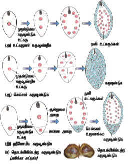

கேமிட்கள் ஈடுபடாமல் தன்னுடைய சொந்த சிற்றினங்களை பெருக்குவதற்கு  உதவும் இனப்பெருக்க முறை பாலிலா இனப்பெருக்கம் என்று அழைக்கப்படுகின்றது. பதினோராம் வகுப்பில் அலகு 1-லிருந்து இனப்பெருக்கம்‌ உயிரினங்களின்‌ ஒரு முக்கிய பண்பு என்பதை தெரிந்துக்‌ கொண்டோம்‌.

மேலும்‌ இங்கு பல்வகை இனப்பெருக்கம் பற்றி விவரித்துள்ளோம்‌ பரிணாமத்தில்‌ கீழ்நிலைத் தாவரங்கள்‌, பூஞ்சைகள்‌, விலங்குகளில்‌ பல்வகை பாலிலா இனப்பெருக்க முறை காணப்படுகிறது. கொனிடியங்கள்‌ தோற்றுவித்தல் (ஆஸ்பர்ஜில்லஸ்‌,பெனிசிலியம்),மொட்டு விடுதல் (ஈஸ்ட்‌, ஹைட்ரா),துண்டாகுதல்‌ (ஸ்பைரோகைரா),ஜெம்மா உருவாதல்‌ (மார்கான்ஷியா),மீளுருவாக்கம்‌ (பிளனேரியா) மற்றும்‌ இரு பிளவுருதல் (பாக்டீரியங்கள்‌) போன்றவை சில பாலிலா இனப்பெருக்க முறைகளாகும்‌. (பதினோராம்‌ வகுப்பில்‌ அலகு 1-ல் உள்ள பாடம்‌ ஒன்றைக்‌ காண்க). இந்த இனப்பெருக்க முறையில்‌ தோன்றும்‌ உயிரினங்கள்‌ புற அமைப்பிலும்‌, மரபியலிலும்‌ ஒத்திருப்பதால் நகல்கள்‌ **(clones)** என்று‌ அறியப்படுகின்றன. உயர்தாவரங்களும் பாலிலா இனப்பெருக்கத்தின் போது பல முறைகளை பின்பற்றுகின்றன. அவை கீழே கொடுக்கப்பட்டுள்ளன.


## தழைவழி பெருக்கம் (Vegetative propagation)

### இயற்கை முறைகள் (Natural methods)

இயற்கையாக தழைவழி இனப்பெருக்கத்தில் மொட்டுகள் வளர்ந்து புதிய தாவரங்களைத் தருகின்றன. மொட்டுகள் வேர், தண்டு, இலை போன்ற உறுப்புகளில் தோன்றலாம். ஒரு குறிப்பிட்ட நிலையில் புது தாவரம் பெற்றோர் தாவரத்திலிருந்து பிரிக்கப்பட்டு புதிய தாவரமாக உருவாகிறது. சில தழைவழி இனப்பெருக்கத்தில் ஈடுபடும் தாவர உறுப்புகள் சேமிப்பு மற்றும் பல ஆண்டு வாழும் தன்மை உடையதாகும். தாவர இனப்பெருக்கத்திற்கு பயன்படும் அலகு **இனப்பெருக்க உறுப்புகள்** (reproductive propagules) அல்லது **பரவல் உறுப்புகள்** (diaspores) என்று அறியப்படுகின்றன.  தழைவழி இனப்பெருக்கத்திற்கு உதவுகின்ற சில உறுப்புகளின்  படம் 1.1-ல் கொடுக்கப்பட்டுள்ளது.

### அ) வேரில் தழைவழி பெருக்கம் (Vegetative propagation in roots)

சில தாவரங்களின் வேர்களில் தழைவழி அல்லது மாற்றிட மொட்டுகள் தோன்றுகின்றன. எடுத்துக்காட்டுகள்:  *முரையா, டால்பர்ஜியா*  மற்றும் *மில்லிங்டோனியா*. சில கிழங்கு வடிவ மாற்றிட வேர்கள் மொட்டுகளை தோற்றுவிப்பதைத் தவிர உணவையும் சேமிக்கின்றன. எடுத்துக்காட்டு: *ஜப்போமியா பட்டாட்டஸ்* மற்றும் *டாலியா*. தகுந்த சூழ்நிலைகளில் மொட்டுகள் கொண்ட வேர்கள் தாய் தாவரத்திலிருந்து பிரிந்து தனித்த தாவரமாக வளர்கின்றன.


### ஆ) தண்டில்‌ தழைவழி இனப்பெருக்கம்‌ (Vegetative reproduction in stems)

பதினோராம்‌ வகுப்பில்‌ அலகு 3-லிருந்து பல்வகை தரைகீழ்‌ தண்டு மற்றும்‌ தரை ஒட்டிய தண்டின்‌ உருமாற்றங்களை பற்றி நீங்கள் நன்கு அறிந்திருப்பீர்கள். இலைகளில் மட்டநிலத் தண்டு *(மியூசா பாரடிசியாக்கா மற்றும் ஜின்ஜிஃபெர் அஃபிசினாலே, குர்குமா லாங்கா)*, தரையடிக்கிழங்கு *(அமோர்போபாலஸ் மற்றும் கொலகேஸியா)*, கிழங்கு *(சொலானம் டியூபரோசம்)*, குமிழ்த்தண்டு *(அல்லியம் சீப்பா மற்றும் லில்லியம்)*, ஓடு தண்டு *(சென்டெல்லா ஏசியாட்டிகா)*, வேர்விடும்  ஓடுதண்டு *(மென்தா மற்றும் ஃபிரகேரியா)*, நீர் ஓடு தண்டு *(பிஸ்டியா, ஜக்கார்னியா)*, தரைகீழ் உந்து தண்டு *(கிரைசாந்திமம்)*, சிறு குமிழ் மொட்டுக்கள் *(டயாஸ்காரியா, அகேவ்)*. மட்டநிலத்தண்டின் கணுவின் கோணமொட்டு மற்றும் கிழங்கின் கண் அமைப்பிலிருந்தும் புதிய தாவரங்கள் தோன்றுகின்றன.

```
நீர்நிலைகளை பாதிக்கும் நீர் ஹையாசிந்த் (ஐக்கார்னியா கிராசிப்பஸ்) என்ற தாவரம் நீர் நிலைகளான குளம், ஏரி மற்றும் நீர் தேக்கங்களில் ஊடுருவும் களையாகும். இது பொதுவாக “வங்கத்தின் அச்சுறுத்தல்” என்று அறியப்படுகிறது. இது வேகமாக பரவி நீரில் கலந்துள்ள ஆக்ஸிஜனை குறைத்து மற்ற நீர்வாழ் உயிரினங்கள் மடிய காரணமாகிறது


```
```
செயல்பாடு

ஒரு காய்கறி சந்தைக்கு சென்று அங்குள்ள காய்கறிகளை பயன்பாட்டின் அடிப்படையில் வேர், தண்டு அல்லது இலை என்று கண்டு பிடிக்கவும். அதில் எத்தனை பாலிலா இனப்பெருக்கம் வழி இனப்பெருக்கம் அடைகின்றன என்பதை கண்டறியவும்
```

### இ) இலையில்‌ தழைவழி இனப்பெருக்கம்‌ (Vegetative reproduction in leaf)

சில தாவரங்களில் இலைகளில் மாற்றிடத்து மொட்டுகள் தோன்றுகின்றன. இவை பெற்றோர் தாவரத்திலிருந்து பிரிந்து புதிய தனி தாவரங்களாக வளர்கின்றன. எடுத்துக்காட்டுகள்: பிரையோஃபில்லம், சில்லா, பெகோனியா. பிரையோஃபில்லத்தில் சதைப்பற்றுள்ள மற்றும் விளம்பில் பள்ளங்களுடைய இலைகள் உள்ளன. இப்பள்ளங்களில் வேற்றிட மொட்டுகள் தோன்றுகின்றன. இவை இலைவளர் மொட்டுகள் (epiphyllous buds) என்று அறியப்படுகின்றன. இலை அழுகியதும் இவ்வமைப்புகளில் வேர் தொகுப்பு உருவாகி தனி தாவரங்களாக மாறுகின்றன. சில்லா ஆற்று மணலில் வளரும் ஒரு குமிழ்தண்டு தாவரமாகும். இதன் தழை இலைகள் நீண்டும், குறுகியும் உள்ளன. இவற்றின் நுனியில் இலைவளர் மொட்டுகள் தோன்றி அவை தரையை தொட்டவுடன் புது தனி தாவரங்களாக மாறுகின்றன.


**இயல்பு தழைவழி இனப்பெருக்கத்தின் நன்மைகள் (Advantages of natural vegetative reproduction)**

- இனப்பெருக்கத்திற்கு ஒரு பெற்றோர் மட்டும் போதுமானது.

- தோன்றிய புதிய தாவரம் ஒத்த மரபணுதன்மையுடையவை

- சில தாவரங்களில் இது எளிதில் பரவுதலுக்கு உதவுகிறது. எடுத்துக்காட்டு: ஸ்பைனிஃபெக்ஸ்

- தோட்டக்கலை வல்லுநர்களும், விவசாயிகளும் இயல்பான தழைவழி இனப்பெருக்கம் செய்ய உதவும் இந்த உறுப்புகளை பயிறாக்கத்திற்கு பயன்படுத்துகின்றனர் மற்றும் பெரிய அளவில் தாவரங்களை அறுவடை செய்யவும் பயன்படுத்துகின்றனர்.

**இயல்பு தழைவழி இனப்பெருக்கத்தின் தீமை (Disadvantages of natural vegetative reproduction)**

- புதிதாக உருவாகும் தாவரங்களில் மரபணுசார்
வேறுபாடு காணப்படுவதில்லை.

### செயற்கை முறைகள் (Artificial Methods)
மேலே குறிப்பிட்டுள்ள இயல்பு தழைவழி இனப்பெருக்க முறைகளைத் தவிர வேளான்மையிலும், தோட்டக்கலையிலும் அவற்றின் உறுப்புகளிலிருந்து தாவரங்களை பெருக்குவதற்கு பல வழிமுறைகள் பயன்படுத்துகின்றன. இவை செயற்கை இனப்பெருக்க முறைகளாகும். சில செயற்கை இனப்பெருக்க முறைகள் மனிதர்களால் நீண்ட காலமாக பயன்படுத்தப்படுகின்றன. இவை பாரம்பரிய முறைகளாகும் (conventional methods). அன்மைக்காலங்களில் குறைந்த நேரத்தில் கூடுதலான எண்ணிக்கையில் தாவரங்களை உருவாக்க தொழில்நுட்பம் பயன்படுத்தப்படுகிறது. இம்முறைகளை நவீன முறைகள் (modern methods) என்று அழைக்கலாம்.

**I. பாரம்பரிய முறைகள் (Conventional methods)**

பொதுவான பாரம்பரிய முறைகளில் போத்துநடுதல், ஒட்டுதல், பதியம் போடுதல் போன்றவை அடங்கும்.

**அ) போத்துகள் (Cutting):** இம்முறையில் பெற்றோர் தாவரத்திலிருந்து வேர், தண்டு, இலை போன்ற பாகங்களை போத்துகளாக பயன்படுத்தலாம். வெட்டிய பகுதிகள் தகுந்த ஊடகத்தில் வைத்தபின் புதிய தாவரம் உருவாகிறது. இது வேர்களை உருவாக்கி புதிய தாவரமாக வளர்கிறது. பயன்படுத்தப்படும் பாகத்தின் அடிப்படையில் வேர் போத்துகள் (மாலஸ்), தண்டு போத்துகள் (ஹைபிஸ்கஸ், போகன்வில்லா, மொரிங்கா), இலை போத்துகள் (பிகோனியா, பிரையோஃபில்லம்). தண்டு போத்துகளே பெரும்பாலும் இனப்பெருக்கத்திற்கு பயன்படுத்தப்படுகின்றன.

**ஆ) ஒட்டுதல் (Grafting):** இம்முறையில் இரண்டு வெவ்வேறு தாவரங்களின் பாகங்கள் இணைக்கப்பட்டு அவை தொடர்ந்து ஒரே தாவரமாக வளர்கின்றன. இந்த இரண்டு தாவரங்களில் தரையுடன் தொடர்புடைய தாவரம் வேர்கட்டை (stock) என்றும் ஒட்டுதலுக்கு பயன்படுத்தப்படும் தாவரம் ஒட்டுத்தண்டு (scion) என்றும் அறியப்படுகின்றன (படம் 1.2 அ). எடுத்துக்காட்டுகள்: எலுமிச்சை, மா மற்றும் ஆப்பிள். வேர்கட்டை மற்றும் ஒட்டுத்தண்டு இடையே ஏற்படும் இணைப்பைச் சார்ந்து பல்வகை ஒட்டுதல் உள்ளன.

அவை

(i) மொட்டு ஒட்டுதல்

(ii) அணுகு ஒட்டுதல்

(iii) நா ஒட்டுதல்

(iv) நுனி ஒட்டுதல்

(v) ஆப்பு ஒட்டுதல் என்பனவாகும்.

**i) மொட்டு ஒட்டுதல் (Bud grafting):** வேர்கட்டையில் ஒரு T-வடிவ கீறல் ஏற்படுத்தப்படுகிறது. பின்பு மரப்பட்டை தூக்கப்படுகிறது. சிறிது கட்டையுடன் சேர்ந்த ஒட்டுத்தண்டு மொட்டு கீறலில் பட்டைக்கு கீழே வைக்கப்படுகிறது. பிறகு இது சரியாக ஒரு டேப் பயன்படுத்தி சுற்றப்படுகிறது.

**ii) அணுகு ஒட்டுதல் (Approach grafting):** இம்முறையில் வேர்கட்டை, ஒட்டுத்தண்டு இரண்டுமே வேரூன்றியுள்ளன. வேர்கட்டை ஒரு தொட்டியில் வளர்க்கப்படுகிறது. இது ஒட்டுத்தண்டுடன் நெருக்கமாக கொண்டு வரப்படுகிறது. இரண்டும் ஒரே அளவு தடிப்புடையதாக இருத்தல் அவசியம். இரண்டிலும் ஒரு சிறிய சீவல் வெட்டப்பட்டு நீக்கப்படுகிறது. இரண்டின் வெட்டப்பட்ட பரப்புகளும் ஒன்றையொன்று நெருக்கமாக கொண்டு வரப்பட்டு கட்டப்பட்டு ஒரு டேப்பினால் சுற்றப்படுகின்றன. 1 – 4 வாரங்களுக்கு பிறகு வேர்கட்டையின் நுனியும் ஒட்டுத்தண்டின் அடியும் நீக்கப்பட்டு தனித்தனி தொட்டியில் வளர்க்கப்படுகின்றன.

**iii) நா ஒட்டுதல் (Tongue grafting):** ஒரே பருமனுடைய ஒட்டுத்தண்டு மற்றும் வேர் கட்டையை சாய்வாக வெட்டி ஒட்டுத்தண்டை வேர்கட்டையுடன் டேப் பயன்படுத்தி ஒட்ட வேண்டும்.

**iv) நுனி ஒட்டுதல் (Crown grafting):** வேர்கட்டை அளவில் பெரியதாக இருக்கம்போது ஒட்டுக்கட்டைகள் ஆப்பு வடிவத்தில் வெட்டப்பட்டு, வேர்கட்டையில் உண்டாக்கப்பட்ட பிளவில் அல்லது பள்ளத்தில் செருகப்படுகின்றன. பின்பு இவை நிலையான ஒட்டுதல் மெழுகு பயன்படுத்தி நிலை நிறுத்தப்படுகிறது.

**v) ஆப்பு ஒட்டுதல் (Wedge grafting):** இம்முறையில் வேர் கட்டையில் துளை அல்லது மரப்பட்டையில் வெட்டு ஏற்படுத்தப்படுகிறது. ஒட்டுத்தண்டின் குச்சு கிளையை இதில் சொருகச் செய்து உறுதியாக இணைத்து, இரண்டின் கேம்பியமும் இணைக்கப்படுகின்றன.


```
செயல்பாடு

அருகாமையிலுள்ள ஒரு தாவர
வளர்ப்பில்லத்திற்கு (Nursery) செல்லவும். அங்கு
ஒட்டுதல், பதியம் போடுதல் போன்றவை எவ்வாறு
செய்யப்படுகிறது என்பதை கவனிக்கவும். பின்பு
உன்னுடைய வீடு அல்லது பள்ளிக்குச் சென்று
இந்த செயல்பாட்டு முறைகளை செய்து பழகவும்.

```

**இ) பதியம் போடுதல் (Layering):** இம்முறையில் பெற்றோர் தாவரத்தின் தண்டு தாவரத்தோடு ஒட்டியிருக்கும் போது அதிலிருந்து வேர்கள் தோன்றுவதற்கு தூண்டப்படுகிறது. வேர் தோன்றியபின் வேர் பகுதி வெட்டி நீக்கப்பட்டு புதிய தாவரமாகிறது. எடுத்துக்காட்டுகள்: இக்சோரா மற்றும் ஜாஸ்மினம். மண்முட்டு பதியம் மற்றும் காற்று பதியம் போன்றவை சில வகை பதியங்களாகும் (படம் 1.2 ஆ).

**i) மண்முட்டு பதியம் (Mound layering):** நெகிழ்வுத்தன்மையுடைய கிளைகள் பெற்ற தாவரங்களில் இம்முறை பயன்படுத்தப்படுகிறது. இவைகளுடைய அடிகிளையை வளைத்து தரைப் பகுதிக்கு எடுத்துச் சென்று தண்டு மண்ணினுள் புதைக்கக்படுகிறது. தண்டின் நுனி தரையின் மேல் உள்ளது. புதைத்த தண்டிலிருந்து வேர்கள் தோன்றிய பின் பெற்றோர் தாவரத்திலிருந்து வெட்டப்படுவதால், புதைந்த பகுதி தனி தாவரமாக வளர்கிறது.

**ii) காற்று பதியம் (Air layering):** இதில் தண்டு கணுப்பகுதியில் செதுக்கப்படுகிறது. இப்பகுதியில் வளர்ச்சி ஹார்மோன்கள் சேர்ப்பதால் வேர் உருவாதலை தூண்டுகிறது. இப்பகுதி ஈரப்பதமான மண்ணால் மூடப்பட்டு பாலிதீன் உறையிடப்படுகிறது. 2 – 4 மாதத்திற்குள் இக்கிளைகளிலிருந்து வேர்கள் தோன்றுகின்றன. இவ்வாறு வேர்கள் தோன்றிய கிளைகள் பெற்றோர் தாவரத்திலிருந்து நீக்கப்பட்டு தனி தொட்டி அல்லது தரையில் வளர்க்கப்படுகின்றன.


**பாரம்பரிய முறைகளின் நிறைகள் (Advantages of conventional methods)**

- பாரம்பரிய முறைகளின் மூலம் உருவாக்கப்படும் தாவரங்கள் மரபணு ரீதியாக ஒரே மாதிரியானவை.

- இம்முறையின் மூலம் அதிக தாவரங்களை குறுகிய காலத்தில் உருவாக்கமுடியும்.

- சில தாவரங்கள் விதைகளை உருவாக்குவதில்லை அல்லது மிகக் குறைவான விதைகளை உருவாக்கும். இன்னும் சில தாவரங்களில் உருவாக்கப்படும் விதைகள் முளைப்பதில்லை. இத்தகைய எடுத்துக்காட்டுகளில் இம்முறைகளின் மூலம் குறுகிய காலத்தில் அதிக தாவரங்களை உருவாக்க முடியும்.

- தழைவழி இனப்பெருக்கம் மூலம் அதிக செலவில்லாமல் ஒரு சில தாவரங்களை பெருக்கமடையச் செய்யமுடியும். எடுத்துக்காட்டு: சொலானம் டியூபரோசம்.

- நோய் எதிர்ப்பு, உயர் விளைச்சல் போன்ற விரும்பத்தக்க பண்புளை கொண்ட இரண்டு வெவ்வேறு தாவரங்கள் ஒட்டு செய்யப்பட்டு புதிய தாவரங்களாக அதே விரும்பத்தக்கபண்புகளுடன் வளர்க்க முடியும்.

**பாரம்பரிய முறைகளின் குறைகள் (Disadvantages of conventional methods)**

- வைரஸ் தொற்று கொண்ட பெற்றோர் தாவரங்களை இம்முறைகளில் பயன்படுத்தும்போது வைரஸ் தொற்றுக் கொண்ட புதிய தாவரங்கள் உருவாக்கப்படுகின்றன.

- தழைவழிப் பெருக்கத்திற்காக பயன்படுத்தப்படும் தழை உறுப்புகள் (அமைப்புகள்) பருத்ததன்மை கொண்டுள்ளதால் அவைகளை சேமித்து வைப்பதும், கையாள்வதும் கடினம்.
