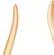

அலகு- 111

(௫7 கற்றகின்‌ நோக்கங்கள்‌: "பல்வேறு ாக்கரியா வைரஸ்‌, புஞ்சை மற்றும்‌ குடற்புழுவின நோய்களைப்பற்றி. கற்றுக்‌ கொள்ளுசல்‌. மலேரியா ஒட்டுண்ணிமின்‌ வாழ்க்கைச்‌ சழண்சியை பிந்து காள்னுசல்‌. , போசைமரும்தவள்வ்றம்‌.. இசைய மதுவினால்‌ வீணையும்‌ தீய \[2 ்‌ விளைவுகளை உணர்கல்‌. மட்‌ 9 அவரவருபையநடத்தை, 75 உடல்‌ நல பாமரி்புமறறம்‌ வாழ்க்கை முறைகள்‌ ஆகியவற்றுக்கான. வாறுப்பைஉணர்கல்‌. 9 மனநலன்‌ மற்றும்‌ தங்கள்‌:

பககம்‌ வல்‌ வாழ்க்கை முறைமாற்றங்கள்‌: புறிந்து கொள்ளுசல்‌.. வவசைவுஹவுவ

மனித நலன்‌ மற்றும்‌

லக சுகாதார நிறுவனத்தில்‌ (1140)

இட ந்வவைவிக்படு "ெல்கலம்‌ என்பது... வெறுமனே நோய்கள்‌ இல்லா. இலையன்று, உடல்‌, மனம்‌ மற்றும்‌. சமூக அளவிலான முழுமையான நல்வாழ்வுக்கான. இலையே உடல்நலம்‌ எவ்பதாகும்‌! மக்கள்‌ உடல்‌. நலமுடையவர்களாக, இருந்தால்‌ தங்களுடைய வேலையில்‌ அதிக திறனுடையவர்சளாகவும்‌. இருப்பார்கள்‌... இதையே "நோயற்ற வாழ்வே. குறைவற்ற செல்வம்‌” என நாம்‌. கூறலாம்‌. உடல்நலம்‌ மக்களின்‌ வாழ்நாள்‌. காலத்தை அதிகரிப்பதோடு மட்டுமல்லாமல்‌ குழந்தைகள்‌ மற்றும்‌ முதியவர்களின்‌ இறப்பு வீதத்தையும்‌ குறைக்கின்றது. நல்ல உடல்நலத்தை பராமரிக்க (தன்‌ சத்தம்‌, முறையான உடற்பயிற்சி மற்றும்‌ ஏரிவிதித உணவு ஆகியவை முக்கியமாவதாகும்‌

7.  பொதுவான மனித நோய்கள்‌ (00௦ சிவஷ ர ரயரமா ர்முல்‌.

நோம்‌ என்பது உடல்‌ அல்லது மனதில்‌ ஏற்படும்‌ கோளாறுகள்‌ (2) குறைகள்‌ ஆகும்‌. “இதில்‌ சுற்றுச்தழல்‌ காரணிகன்‌, நோழக்கிகள்‌, மரமிய முரண்பாடுகள்‌ மற்றும்‌ வாழ்க்கை முறை, மாற்றங்களால்‌... ஏற்படும்‌... புறத்தோற்ற. உடற்செயலியல்‌ மற்றும்‌ உளவியல்‌ ரீதியான: முரண்பாடுகள்‌ ஆகியவை அடங்கும்‌, தொற்று: நோய்கள்‌ மற்றும்‌ தொற்றா நோய்கள்‌ என: நோம்களைஇருபெரும்பிரிவுகளாகப்பிரிக்கலாம்‌.

ஒரு நபரிடமிருந்து மற்றொருவருக்கு பரவும்‌ நோய்கள்‌ தொற்று தோம்கள்‌ அல்லது பரவும்‌.
ஹவராடுஞ்௦9ட/

॥ ச சச்சசசச்சசச்ராாாா

்‌ அவஸ்நோய்கள்‌ ட பங்கள்‌. "நமா. மலம்‌ சத பவை. ககெண்ஷயாசிஸ்‌ பவேரியா... அவியல்‌ பதியா. பன்னுக்கனியளு எபாகம்டை.. “மீயசிஸ்‌... பலைவாக்றே்‌ “காலரா. “தட்டம்மை. “ஆப்பிரிக்க. (க்பைலேரியாசிஸ்‌). பங்கு “கணக்கி கக்கவயால்‌ நமோனியா.... அடங்கக்‌ அண்டக்‌. பசக்கன்சன்யா பஅன்னம்மை அம்மள்ளை வசம்‌: போலா மைகிகஸ்‌, நோய்கள்‌ (வாபர்‌: வ) எனப்படுகிறது. 'இந்நோய்களை உண்டாக்கும்‌ உயிரிகள்‌. பாக்மரியாவின்‌ எதிர்ப்புத்திறன்‌ நோழூக்கிகன்‌ (லஷ ஆகும்‌. இவை காற்று, 1, மஸ்ராவ்ை. உணவு உடல்‌ தொடர்பு மற்றும்‌ நோய்க்கடத்திகள்‌ பதம பாக்மரியத்‌ தொழ்நிற்கு எதிராக மூவ்‌ பரவுகின்றல வைரஸ்‌, பாக்ரியா பூஞ்சை, வக பகத

புரோட்டோசோவா.. ஒட்டுண்ணிகள்‌ மற்றும்‌ புழுவின... ஒட்டுண்ணிகள்‌. போன்றவை. நோயூக்கிகள்‌ ஆகும்‌... தொற்று நோய்கள்‌ பொதுவானவை. மேலும்‌, இத்தகைய நோயால்‌. £வ்வொருவரும்‌ ஏதேனும்‌ ஒரு நேரத்தில்‌ பாதிக்கப்படுவர்‌. பெரும்பாலான பாக்சரிய நோய்கள்‌ குணப்படுத்தப்பட கூடியவை. ஆனால்‌, வைரஸ்‌ நோய்கள்‌ அனைத்தும்‌ குணப்படுத்த. கூடியவை அல்ல. எய்ட்ஸ்‌ போன்ற சில தொற்று, நோய்கள்‌ இறப்பை ஏற்படுத்தக்கூடியன. நொய்த்தொற்றிய நபரிடமிருந்து ஆரோக்கியமான நபருக்கு எந்த நிலையிலும்‌. பரவாதவை தொற்றாநோம்கள்‌ ஆகும்‌. மரபு வழியாகலோ மிஸ்டிக்‌//பைப்ரோசிஸ்‌, கெப்டச்சத்து குறைபாடுகளாவோ (வைட்டமின்‌. குறைபாட்டு நோய்கள்‌) மற்றும்‌ உடற்சிதைவின்‌ கரணமாகவேர. மூட்டுவலி, மாரடைப்பு. பக்கவாதம்‌) இந்நோம்கள்‌ ஏற்படலாம்‌. தொற்றா நோய்களில்‌ புற்றுநோம்‌ இறப்பை ஏற்படுத்தக்‌

பாக்மரிய நோய்கள்‌

அதிக. எண்ணிக்தைமிலான... பாகிரரிய சிற்றிலங்கள்‌. இருந்தபோதிலும்‌, ஒரு சில. பாக்ஸரியங்கள்‌ மட்டுமே மனித நோம்களோடு. தொடர்புடையவை... இவை, நோயுக்கி பாக்மரியக்கள்‌ எனப்படுகின்ற. 'இந்நோயூகிகிகள்‌ வெளியிடும்‌ நச்சுப்பொருட்கள்‌ உடலைப்‌ பாதிக்கின்றன. பொதுவான நோயூக்க

பேத பாக்ரரியா அந்த. குறிப்பிட்ட உமிர்‌ எதிர்ப்பொருளுக்கு எதிராக எதிர்ப்புத்திறனை. பெறுகின்றது. எனவே பாக்சரியத்‌ தொற்றிலை. குணப்படுத்த... அந்த... குறிப்பிட்ட உமிர்எதிர்ப்பொருளை அதன்‌ பிறகு பயன்படுக்க. முழயாது:.. சில பாச்னரியாக்க்‌. பல

பாக்மரியாக்களால்‌ஏற்படுத்தப்படும்தொற்றினை. குணப்படுத்துவது னம்‌.

கீழ்க்கண்ட படிநிலைகளை அறிவதன்‌ மூலம்‌ மாகணியாவின்‌. எதிரபுததிறன்‌ அபாயத்தை: குறைக்க முடியும்‌..

உயிரஎதிர்ப்பொருள்‌ பயன்படுத்துவதை தவிர்க்க வேண்டும்‌. இதற்கான பாதுமாப்பை நம்முடைய

*   சாதாரணசளிஅல்லதுகாய்ச்சல்போன்ற வைரஸ்‌. தொற்நினை குணப்படுத்த கமிர்‌ எதிர்ப்பொருட்சளை பயண்டடத்தக்‌ கூடாது,

2 மருந்து சீட்டை எப்போதும்‌ பின்பற்ற வெண்டும்‌... மருந்து. எடுத்துக்‌ கொள்ள. அவ்வப்போது: தவறுதல்‌ அல்லது மருந்தினை: முழுமையாக எடுத்துக்‌ கொள்ளாமலிருக்கல்‌. உயிர்‌ எதிர்ப்பொருள்‌. எதிர்பபுத்திறனை அதிகரிக்கும்‌

1௫௧ வெதகைவுக்குவகள்‌ஹவராடுஞ்௦9ட/

அட்டவணை. மனித பாக்மரியா நோய்கள்‌.

ஷிஜெல்லோசிஸ்‌. வழல்லா மலக்கழிவு கவந்த | வயிற்று வலி,ீரழப்பு, இவிக இட | கணகமுமதி மவவதகமலு்கர்‌ திகள்‌ வை ண திட ர நமகக

பவனி ஒதுக்‌ |. இலல, சென்னியர்‌ காதம்‌ டர்‌ பம்‌, \[ தனல்ககயை மடவுலலை | க\] மன்னை. பனி, இறும்‌ தவளை வமல்‌ ென்வ

ட மனமா கொளிஸாக்விம்‌ கோல கவாச்‌. | த, வவி.காகரப்பான பண்‌... இனப்பெருக்க கழித்தொர்று ல்‌

, பவவிவவமை

ச கஷாய \[ அரியொகாலரே ல்‌ கணவுமற்றும் கீர்‌. விற்றுப்போக்கு தடைதான்‌

இணை ண டன! (அசையாத்தாடை | பழவகை. தொற்றுகல்‌. இ ட்கள்‌ கவத

அல்மா ர

கட அந்க்டு பம \[னை பச இவக னக னி பவவம்யாம்‌. வழியாக டண லையன்‌ வவ்மகதாம்‌

வண 4 பட (கிக்வவைன்‌ | எல்க்‌ வல்‌ படவ கவைல வழித்தொற்று | காசம்‌ வதும்‌. | வகினனவ்ளில்‌ னன

ச ய்ய ஏதபர்துனோமிஸ்‌. ுரையிரல்‌. கரத்திவலைகள்‌. இடர்‌ கோழை: ய்ஷக்ணனை ஸ்ஸ்‌) ஒழித்கொற்று |. பெனியேற்றம்‌.

பாக்கியங்கள்‌ மறறும்‌ அவறறிலால்‌ ஏற்படும்‌... வைரஸ்நோய்கள்‌:

நோய்கள்‌ பற்றிய விவரங்கள்‌ அட்டவணை -1

கொடுக்கப்பட்டுள்ளன.

வைரஸ்கள்‌. என்பவை. உமிருள்ள. செல்களுக்குள்‌. இனப்பெருக்கம்‌. செய்கின்ற.

பாக்டீரியங்கள்‌ காற்று, நீர்‌ மூலமாகவோ மிகச்சிறிய அகச்செல்‌ நிலைமாறா ஒட்டுண்ணிகள்‌. அல்லது... நீர்த்திவலைகள்‌ / தூசிகன்‌ ஆகும்‌. உயிருள்ள செல்களுக்கு வெளியே, ஓர்‌: பொனைவற்தை. வள்ளிழந்தல்‌ மூவப்கவே.. ககிரன்ன. கவரினததன்‌ பண்புகளை, இவை அல்லதுநோய்த்தொற்றியஒருவரின்பாத்திரங்கள்‌. 'பெற்றிருக்காது. வைரஸ்கள்‌ உயிருள்ள. மற்றும்‌ ஆடைகள்‌ போன்றவற்றைப்‌ பரிமாறிக்‌: செல்களுக்குள்‌ நுழைந்து புதிய வைரஸ்களை கொள்வதன்‌ முக பவ க்ம ப 'மெயால்‌ சோனை டயட வ மூவம்‌. வாங்கள்‌. செல்லை. உடைத்துக்கொண்டு டைபாய்டு கார்ச்சல்‌. இருப்பதை உறுதி பொரியேறி. உடலின்‌ மற்ற செல்களுக்குள்‌.

செய்யலாம்‌.

செழதனையறறம்கேமகள்‌

1௯

உருவாக்கஅச்செல்களைத்‌ தூண்டுகின்றன.புதிய

நுழைந்து... மனிதர்களுக்கு... நோயை ஏற்படுத்துகின்றன. ரைனோ வைரஸ்கள்‌.ஹவராடுஞ்௦9ட/

பட்டவை மனித வைரஸ்‌ நோய்கள்‌ ணை மகட்‌ ம வனாவைதஸ்கன்‌ ப்பா ங்கள்‌ | கோழை வெனியேரிற்‌. டட ன்‌ ட ட பழம்‌ தலைவன்‌ னககள்‌\] னம | தன்ன கன ர 2 | பப்ணுக்கு | பவிகிளோ வைரல்‌. உமரி சரபமி\] நிறத்த கம்‌ | சரப்பிவரிிகம்‌ அகக்‌ | “ன்னால்‌ சேல்‌ ண ப்பான தோண்ட குனைவஸ்வல . ல ப சத\] மன்ற, | னம்‌ தழதவவைய, சலாம்‌ கவ எப்சம்‌ அப்பன்‌. கைதக ண ணாக னு ப, 21. கலை | இிரிரோ டக்‌ எ பவிலை |. ஹஸ்‌: த்தப்‌ பரினறம்‌ | பட்டக்‌ மஞ்சன்‌ மற்றும்‌ வயிற்று வலி. வொல்ைவேளியர்‌ ரக்த கம்கம | அவுஸ்ரின கண | சரபபாதை | தததிவலைகள்‌. | சோலா ல்‌ 4 வவ ன தோல்மற்ும்‌, \[.. மற்றும்னேடி ட்ப ர ர ர ரர ர" ய்‌ களர்‌ உவம\] ஒன்றன்‌ நனம்‌ பவ. அவள்‌ ல நிறு சுவாசக்கோளாறு. கங்கு | டெக்தவைரஸ்‌() 'நோம்க்கடத்தியான | கிமரென நோகறும்‌: த த பிறப்‌ அந்தன்‌ அட மவ்ம வைல்ல அத | எஸ்டி. | தவல்‌ தவம மட்டலன்‌ ்‌ தமகத்தயான அகவாகவத்‌ எங்சசகமு்டலல, பரக்கக்‌ இவக பைவ சங்னதிக | அபச்ல்றுப்ி பம்மல்‌ | மழவர்கள்‌ | கொகக்ன்‌.! மப்டலளியம்‌ மனிதர்களை அதிகம்‌ தொற்றும்‌ நோய்களில்‌: பொதுவாக: நான்கு வகைகளாகப்‌

ஒன்றான "சாதாரண சணி' (மகர ஸி) என்ற.

மனித உடல்‌ நலக்குறைவை ஏற்படுத்துகின்றன. உடல்‌ உறுப்புகளில்‌ தொன்றும்‌ அறிகுறிகளை

அடிப்படையாகக்‌ கொண்டு வைரஸ்‌ நோய்கள்‌

சாதாரணசனியானது 149 ்கும்மேற்பட்ட வெவ்வேறு வசையான ரைனோ வைரச்களால்‌. ஏற்படுகிறது. மேலும்‌ அவைகளின்‌ 8004 ஜீனோம்‌ தொடர்நது திமர்‌ மாற்றங்களால்‌. மாறிக்கொண்டே இருக்கும்‌ காரணத்தினால்‌, சாதாரண சளிக்கு ஒரு பொதுவான தடுப்பூசி உருவாக்குவதில்‌ மிகுந்த சிக்கல்‌ ஏற்படுகிறது.

பிரிக்கப்பட்டுள்ளன. 9) சுவாச. நோய்கள்‌. (இன்புளுமன்சா தொற்றிய சுவாசப்‌ பாறை (9. தோல்‌... நோய்கள்‌. (சின்னம்மை மற்றும்‌. துட்டம்மையால்‌ பாதிக்கப்பட்ட தோல்‌ மற்றும்‌. தோலின்‌ ிற்‌அடுக்கு(0) உள்ளுறுப்பு நோய்கள்‌. (மஞ்சன்‌ காய்ச்சல்‌ மற்றும்‌ டெங்கு காய்ச்சலால்‌. பாதிக்கப்பட்டஇரத்தம்மற்றும்‌ உள்ளுறுப்புகள்‌). (0 நரம்மு. நோய்கள்‌. (ரேபிஸ்‌ மற்றும்‌ இளம்பிள்ளை வாதத்தால்‌ பாதிக்கப்பட்ட மைய கரம்பு மண்டவம்‌) மனிதனில்‌ உண்டாகும்‌ சில. வைரஸ்‌ நோய்கள்‌ பற்றிய. விவரங்கள்‌, அப்ப வணைர2-ல்‌ கொடுக்கப்பட்டுள்ளன.

ர வெல்லை வறுக்கஹவராடுஞ்௦9ட/

பன்றிக்காம்ச்சல்‌ ! “2 முதன்முதலில்‌. 1979-ம்‌.

2 ஆண்டு. தொற்று நோயாக , அங்கீகரிக்கப்பட்டு, இன்றள வம்‌.

; பருவக்காலங்களில்‌ ஏற்படும்‌ காய்ச்சலாக.

அறியப்படுகிறது... 8191 வைரஸ்‌ மூலம்‌. (பன்றிக்காய்ச்சல்‌. ஏற்படுகிறது... காய்ச்சல்‌, 'இருமல்‌,தொண்டை வலி, குனிர்‌,வலுவிழத்தல்‌ 1 மற்றும்‌ உடல்வலி போன்றவை இந்நோயின்‌: அறிகுறிகளாகும்‌... குழந்தைகள்‌, . கருவுற்ற 1 பெண்கள்‌ மற்றும்‌ வயதானவர்களில்‌ ஏற்படும்‌ கடுமையான தொற்று, அபாய நிலையை "ஏற்படுத்தும்‌ 72 புரோட்டோசோவா நோய்கள்‌: மனித உடலில்‌ ஏறத்தாழ 15 புரோட்டோசோவா இனங்கள்‌ ஒட்டுண்ணிகளாக வாழ்ந்து நோயை: ஏற்படுத்துகின்றன.

அமிரியாசிஸ்‌ (/ஷ்ஸ்ஷி) என்பது எண்ட்‌ ஹில்போலைடிகர லேஸ்‌ ஷிவ. எனும்‌. புரோட்டோசோவாவினால்‌. ஏற்படுத்தப்படும்‌. அமிபிக்‌ சீதபேதி அல்லது அமீபிக்‌ பெருங்குடல்‌. அழற்சி நோயாகும்‌. இவை மனித பெருங்குடலில்‌. உள்ள கோழை செல்கள்‌, பாகிமரியாக்களையும்‌. உட்கொண்டு. வாழ்கின்றன. (மடம்‌ 7.0. இந்த. ஒட்டுண்ணிமின்‌.. நோயுண்பாக்கும்‌. நிலை.

வடவனைமமவவேக 100

டிரோபோசோம்ட்‌ (7ம்‌) ஆகும்‌. இவை. விருந்தோம்பியின்‌: பெருக்குடற்சவரைச்‌. துளைத்துச்‌ சென்று திசு சிதைவு நொதியை (ஷர்ட்‌ ஷா)... வெளிவிடுகிறது. இதனால்‌. குடற்புண்‌, இரத்தக்கசிவு, வயிற்றுவலி மற்றும்‌ அதிககோழையுடன்‌ கூடிய மலக்கழிவு ஆகியவை. ஏற்படுகின்றன... இந்நோயின்‌. அறிகுறிகள்‌ வயிற்றுப்போக்கு முதல்‌ இரத்தம்‌ மற்றும்‌. கோழையுடன்‌. கூடிய. சீதபேதி வரை வேறுபடுகின்றன... மலக்கழிவு... கலந்த கெட்டுப்போன உணவு மற்றும்‌ நீரில்‌ இருந்து ஓட்டுண்ணியை கடத்தும்‌... கடத்தியாக. வீட்டு சக்கள்‌ (பஸ்மம்‌) செயலாற்றுகின்றன.

ஆம்மிரிக்க. தூக்க வியாதி என்பது டிரிப்பனோசோமா சிந்நினங்களால்‌. ஏழ்படுத்தப்படுவதாகும்‌.பொதுவாகசெட்சி(7-௦. என்றஇரத்தஉறிஞ்சிஈக்களால்‌ரிபனோசோமா கடத்தப்படுகிறது. டிரிப்பனோசோமாவின்‌ மூன்று: சிற்றினங்கள்‌ மனிதனில்‌ தூக்கவியாதியை: ஏற்படுத்தமின்றன.

மட ஓ. கேமியனஸ்‌ (7; ண்மை) கினாசிலா பலபாலிஸ் பரி ஷ்ரரயி) என்றசெட்சிசக்களால்‌. பரவுகிறது. இது கேம்பியன்‌ காய்ச்சல்‌ (ளேர்ல. பனிஅல்லதுமத்தியஆப்பிரிக்கதூக்கவியாதியை ஏற்படுத்துகிறது படம்‌ 72)

3.  ஒபிராசசியவஸி(ப்ஸ்ஸ்லிகிளாசிலா. மொரர்சிடனஸ்‌ (6 காணின்‌ என்ற வகை செட்சி ஈக்களால்‌ பரவுகிறது. இது ரோடீசியன்‌ அல்லது.

கிழக்கு... ஆப்பிரிக்க. தூக்க. வியாதியை: ஏற்படுத்துகிறது. ந ஓட கரசி (௩ எனி, ஒறையபோமா

கெணிஸ்டா (ரணை ஈவில என்ற பூச்சிகளால்‌. பரவுகிறது.இது சாகாஸ்நோய்‌ அல்லது அமெரிக்க "தூக்க வியாதி (கண்ண ரநனைங்க்‌) என்ற

நோயை ஏற்படுத்துகிறது.

ஹவராடுஞ்௦9ட/

காலா அசார்‌... அல்லது... வயிற்றழை லீஷ்மேனியாசிஸ்‌ என்ற நோம்‌ வீஷ்மேனிமா பொனொவாணி பன்ச்‌ ஸ்ஸணி என்னும்‌ ஒட்டுண்ணியால்‌... ஏற்படுகிறது... இவற்றை: மணல்யச்சி (ஸை) என்ற நோய்க்கடத்திகள்‌ பரப்புகின்றன. இந்தோயால்‌, எண்டோதீலியல்‌. செல்கள்‌, எலும்பு மத்ஜை, கல்லீரல்‌, நிணநீர்‌ சுரப்பிகள்‌ மற்றும்‌ மண்ணீரலின்‌ இரத்தம்‌ குழாய்கள்‌ ஆகியவற்றில்‌ தொற்று ஏற்படுகிறது. எடை குறைதல்‌, இரத்த சோகை, காய்ச்சல்‌, கல்ஷில்‌... மற்றும்‌ மண்ணீரல்‌. வீசம்‌ ஆகிய டைவ இந்நோயின்‌ அறிகுறிகளாகும்‌. முலேரியாவானது. பல்வேறு வகையான: மிளாஸ்மோடிய இனங்களான வட வெவாக்ஸ்‌ (1 ட) சிறுகேல்‌. (81 அஸி), சிலேரியே (81 கல்லல்‌ மற்றும்‌ (கி, மால்கினரம்‌. (8. பகல ஆகியவற்றால்‌. ஏற்படுகிறது சட்ட வணை?ப). பிளாஸ்மோடியம்‌. ுரோபோசொயிட்டுகள்‌ (ரேர்ஸ்‌). என்ற. முகிர்திலையில்‌ மனிதனின்‌. இரத்தச்‌ சிவப்பணுக்களில்‌.. வாழ்கின்ற. இது: நோள்த்தொற்றிய பெண்‌ அனாபிலஸ்‌ கொசு குடிப்பதன்‌... மூலம்‌... ஒருவரிபமிருந்து மற்றவர்களுக்குப்‌ பரவுகிறது.

பிளாஸ்மோடியத்தின்‌ வாழ்க்கைச்‌ சுழற்சி (1/6 ஏ சணிய),

்‌ வைவாச்ஸ்‌, இருவிருந்தோம்பிகளைக்‌. மண). கொண்ட உயிரி ஆகும்‌... இதன்‌ வாழ்க்கை: சுழற்சியில்‌ முதன்மை விருந்தோர்பியாக.. பெண்‌: அனாபிலஸ்‌.... கொசுவும்‌, இரண்டாம்‌. நிலை. விருந்தோம்பியாக: மனிதனும்‌. செயவாற்றுகின்றனர்‌.. பினாஸ்மோடியத்தின்‌

படம்‌ 72 டிரிப்பனோசோமா: கேம்மியன்ஸ்‌

வாழ்க்கைசுழற்சியில்‌ சைஷோகோனி,34ஷா))

கேமோகோனி, (ஹ்‌. மற்றும்‌. ஸ்போரோகோனி (௭ஷணி என்ற மூன்று, நிலைகள்‌ காணப்படுகின்றன (டம்‌ 7...

நோய்த்தொற்று கொண்ட பெண்‌ அனாபிலஸ்‌. கொசு ஒருமனிதனைக்கரக்கும்போதுமலேரியா ஒட்டுண்ணிகள்‌, மனிதனின்‌ இரத்த ஓட்டத்தினுள்‌. நுழைகின்றன... கொசு இரத்தத்தை உறிஞ்சம்‌. போது தன்‌ ஐமிழ்ந்நுன்‌ செர்த்து ஸ்பேரரோசொயிட்டுகளையும்‌ உட்செலுத்துகிறது. “இதனால்‌ ஸ்போரொசோரிட்டுகள்‌ உடனடியாக மனிதனின்‌ இரத்த ஓப்டத்தில்‌ நுழைந்து பின்‌: கல்லீரல்‌ செல்களை (ஸ்‌ ஸி அடைகின்றன. மேலும்‌. இவை கல்ஷ்ல்‌ செல்களில்‌, பாலிலா. பவரிளவு. (சைஷோகோனி) முறையில்‌. பெருக்கமடைந்து: மீரோசோயிட்டுகளை (ம/ஸன்‌க)\_ உற்பத்தி செய்கின்றன... கல்லில்‌. செல்களிலிருந்துவெளிவரும்மிரோசொயிட்டுகள்‌. “இரத்தச்‌ சிவப்பணுக்களைக்‌ தாக்குகின்றன. இரத்தச்‌ சிவப்பணுகளுக்குள்‌. நுழைந்த, மிரோசோமிட்டுகள்‌... ஒரு செல்லுடைய ூரோபோசொயிட்டுகளாக (மேரம்னன்வ) வளர்ந்து அளவில்‌ பெரிதாகின்றன. அதன்‌ மையத்தில்‌

உருவான... நண்குமிழ்‌... பெரிதாகி சைட்போபினாசத்தின்‌ ஒருபுறமாக ஒன்ளப்படுவதால்‌. முத்திரை மோதிர நிலை. ஷம ஷி. உருவாகின்றது... பின்னர்‌ ுரோபோசொயிட்டுகளின்‌ உட்கரு பாலிலா இனப்பெருக்க. முறையில்‌. பிளவுற்று

செஷாண்டுகளை உருவாக்குகின்றன. பெரிய செஷாண்டுகளில்‌ மஞ்சள்‌. நிறத்துடன்‌ கூடிய பழுப்பு நிறமியான 'ஷஃய்வரின்‌ துகன்கள்‌' பயி வலி... காணப்படுகின்றன. சைஷாண்டுகள்‌ பினவுற்று ஒற்றை உட்கருவைம்‌.

கொண்ட மிராசோவிட்டுகளை வருவாக்குகின்றடை.. இறுதியில்‌, . இரத்த சிவப்பணுக்கள்‌ வெடித்து மீறாசோமிட்டுகளையும்‌.... ஹீயோசோோயின்‌

இரத்தத்தில்‌ வெளியிடுகின்றன. மீரோசொயிட்டுகள்‌ பிற புதிய நல்ல நிலையில்‌. உன்ன... சிவப்பணுக்களைத்‌ தாக்குகின்றன.

மீரோசோயிட்டுகள்‌ கொண்ட சிவப்பணும்கள்‌.

மற்ற அறிகுறிகளும்‌ ஏற்படுகின்றன. இந்த இரக்கச்‌ சிவப்பணு ிலைசுழற்சிதோராயமாகஒவ்வொரு, முதல்‌ 72 மணரி நேரத்திற்கு ஒருமுறை மீண்டும்‌ மீண்டும்‌. நடைபெறும்‌. இக்கால அளவானது.

11 வெலகைவுக்கேவகள்‌

பககக உன்‌.

படம்‌ பிளாஸ்மோடியத்தின்‌ வாழ்க்கை சுழற்சி.

பினாஸ்மோடிய இனத்திற்கு ஏற்ப மாறுபடுகிறது. மீரோசோயிட்டுகள்‌ திமிரென வெளிப்படுவதால்‌. நீபக்கள்‌ தாக்கப்படுதல் தூண்டப்படுகிறது. சில. நேரங்களில்‌. மீரோசோயிட்டுகள்‌ மமேக்ரோகேமிட்டோசைட்டுகளாகவும்‌. மைக்ரோகேமிட்டோசைட்டுகளாகவும்‌. மாற்றமடைகின்றன... இவை கொசுவின்‌ உடலினுள்‌ நுழையும்‌ போது முறையே பெண்‌:

இனச்‌ செல்லாகவும்‌, ஆண்‌ இனச்‌ செல்லாகவும்‌. வளர்ச்சியடைகின்றன.

கொசுவின்‌. குடலில்‌. பாதிப்படைந்த சிவப்பணுக்கள்‌ உடைவதால்‌ வெளியேறும்‌ ஆண்‌: மற்றும்‌. பெண்‌ இனச்செல்கள்‌. இணைந்து: ஜெகைனெட்‌ (விரவி என்று இரட்பையய கருமுட்டையை உருவாக்குகின்றன. கொசுவின்‌: குடற்சவரைத்‌ துளைத்துச்‌ செல்லும்‌ காகைனெட்‌.

அட்டவணை. மலேரியாவின்‌ வகைகள்‌:

1 \[பனிக்‌ அவ பயன்‌ 9 வைி| வாகக்‌. | சிதம்‌ ச ர்வெக்கலினிய கணனி \[பணிவு ச ஆனைவஷ்ன யுவி குசலம்‌. \[சணிவும்‌ 4 எவவ பதவவுகள்‌ விவி சயாகம்‌ | எணமணிஜேம்‌

வட்வகைமவவேவகக 1.

ஹவராடுஞ்௦9ட/

கெசிஸ்ட்டுகளாக.. (ஸி. மாறுகின்றன. கசிஸ்ட்டுகள்‌. குன்றல்‌. பகுப்பு முறையில்‌. மிளவுற்று. ஸ்போரோசோமிட்டுகளை உருவாக்குகின்றன. இநதகர்விற்கு.

ஸ்போரறோகோனி (௭) என்று பெயர்‌. இந்த ஸ்போரோசொயிட்டுகள்‌ கொசுவின்‌ உமிழ்நீர்ச்‌ சுரப்பியை நோக்கி நகர்ந்து சென்று தங்குகின்ற.

இச்சுழற்சி. இத்துடன்‌. நிறைவுபெறுகிறது. இவ்வாறு... தன்‌. கமிழ்தீர்‌ சுரப்பியில்‌ ஸ்போரோசோயிட்டுகளைக்‌ கொண்ட

கொசுவானது மற்றொரு மனித விருந்தோம்பியை- கழிக்கும்‌ பொழுது ஸ்போரோசோமிட்டுகள்‌ உட்செலுக்தப்பட்டு புதிய சழற்சி தொடங்குகிறது. மமவேரியாவானது இரத்தச்‌ சிவப்பணுக்களில்‌ பாதிப்பை ஏற்படுத்துவது... மட்டுமல்லாமல்‌, மண்ணீரல்‌ மற்றும்‌. உள்ளுறுப்புகளையும்‌. பாதிக்கின்றதுபாலேரியாவின்‌அடைகாப்புக்காலம்‌. 12 நாட்கள்‌ ஆகும்‌. தலைவலி, குமட்டல்‌ \[ற்றும்‌ தசைவலி ஆகியவைமவேரியாவின்‌தொடக்ககால. எறிதற்னாகும்‌ ராசோயிட்டுகள்‌, ஹீமோசோயின்‌: மலம்‌ நரக மற்றும்‌. சிவப்பணு சிதைபொருள்கள்‌ ஆகியவை ஒத்திசைந்து இரக்க. ஓட்டத்திற்குள்‌ வெளியேறுவதனால்‌ நோய்க்கான: அறிகுறிகள்‌ தோன்றுகின்றன. அவை மலேரியா வலிப்பு (பய ரஷ), எனும்‌ குளிர்‌ நடுக்கம்‌, அதிகப்படியான காய்ச்சல்‌ இவற்றைத்‌ தொடர்நது, வியர்த்தல்‌ஆகியவையாகும்‌.மவேரியாநச்சானது. மேக்றோஃபேஜ்‌ செல்களைத்‌ தூண்டுவதால்‌. வெளிமிடப்படும்‌ கட்டி சிதைவு காரணி (711-ல.

நோய்க்கடத்திகளை அழிப்பதன்‌ மூலம்‌ நோய்‌

கடத்தல்‌ சுழற்சியை உடைக்கலாம்‌. கொசுக்கள்‌.

தங்களின்‌ முட்டைகளை நீரில்‌ இடுகின்ற. இம்முட்டைகள்‌... நீரினுள்‌... பொரித்து 'இளவுயிரிகனாக (லார்வாக்களாக) வெளியேறி வளர்கின்றன... ஆனால்‌, இவை நீரின்‌ மேற்பரப்பிற்கச்‌.... சென்று... காற்றைச்‌ அவாசிக்கின்றல. நீரின்‌ மெற்பரப்பில்‌ எண்ணெம்‌: கெனிப்பதன்‌ மூலம்‌ கொசுவின்‌ லார்வாக்கள்‌ மற்றும்‌ கூட்டுப்புழுக்கள்‌ சுவாசிக்க முடியாத: நிலையை ஏற்படுத்தலாம்‌. குளங்கள்‌. நீர்ப்பாசனம்‌, வடிகால்‌ பள்ளங்கள்‌ மற்றும்‌ பல:

நிரந்தர. நீர்‌ நிலைகளில்‌ கம்பூசியா போன்ற. கொசுக்களின்‌. இனவுமிரிகளை உண்ணும்‌. மீன்களை... வளர்க்கலாம்‌... பேசில்லஸ்‌ ுரிஞ்சியன்சிஸ்‌ (ஐவ வளக்‌) எனும்‌. பாக்மரியாக்களைத்‌ தெளிப்பதன்‌. மூலம்‌: கொசக்களின்‌ இளவுமிரிகளை கொல்ல முடியும்‌. இத்தயாரிப்பு பிற வமிரிகளுக்கு. நச்சாக: இருப்பதில்லை. மலேரியாவிற்கு எதிரான சிறந்த. பாதுனப்பு என்பது கொசுக்கடியைத்‌ தவிர்த்தல்‌. அகும்‌. கொசுக்‌ கடியைத்‌ தவிர்க்க கொசு 'வலைகளையும்‌, சாளரம்‌ மற்றும்‌ கதவுகளுக்கு கம்மி வலைகளையும்‌. பயன்படுத்த மக்கள்‌. அறிவறுத்தப்படுகிறார்கள்‌.

1௦ ஆம்‌ ஆண்டு உலக சுகாதார நிறுவனம்‌. (ரம) முவேரியா... ஒழிப்புத்‌. திப்பத்தை: அறிமுகப்படத்தியது... பிளாஈஸ்மோடிகமானது. அதனை அழிக்கும்‌ மருந்துகளுக்கு எதிராகவும்‌. கொசக்கள்‌.. ஜரா... மற்றும்‌... பிற பூச்சிக்கொல்லிகளுக்கு எதிராகவும்‌ எதிர்பபுத்திறனை வளர்த்துச்‌ கொண்டு விட்டதன்‌. சரணைமாக இத்திட்டம்‌ தோல்வியடைச்தது | ,. மலேரியா தடுப்பூசி,

'மெலேரியாவைத்‌... தடுக்க ள்‌ பயன்படுகிறது. 2812 வரை | மலொரியாவிற்கான அங்கீகரிக்கப்பட்ட ஒரே | “ தடமபூசி ர மஸ்கரி்ஸ என்பழாகும்‌ 1 குறைந்த திறனுள்ள (29-10) இம்மருந்து நான்கு முறை உட்செலுத்தப்படுகிறது. இது 1 குறைந்ததிறனை உடையதால்‌ உலகசுகாதார. நிறுவனமானது ஈ முதல்‌ 12 வார வயதுள்ள குழந்தைகளுக்கு இதை (075, 8 தடுப்பூசி

, பயன்படுத்த பரிந்துரைப்பதில்லை. | 74 பூஞ்சை நோய்கள்‌

பாக்மரியாவிற்கு.. வெகு... காலத்திற்கு முன்பிலிருந்தே... பூஞ்சைகள்‌ நோயை உண்டாக்கும்‌... நோய்க்காரணி என

அங்கீிச்கப்பட்டுள்ளதுடெர்ய்டோைகோசிஸ்‌. (மகணனமை) என்பது ஒரைகோஷட்டான்‌. (ரல்பபள்ள, மைச்றோஸ்போரம்‌ (1/௨ மற்றும்‌ எிரமேமைப்டான்‌. மறம்ஷைர்லை ஆகிய பூஞ்சை பேரினங்களால்‌ ஏற்படும்‌ தோல்‌ தொற்றாகும்‌.

பர வெல்லை வழுக்கள்‌ஹவராடுஞ்௦9ட/

பபயர்‌ தாமரை (ரள என்பது மனிதர்களுக்கு தொற்றக்கூடிய சாதாரண நோயாகும்‌ (மடம்‌ கி. தோல்‌, நாங்கள்‌... மற்றும்‌. தலைப்பகுதியில்‌ காணப்படும்வறண்டதோல்செதில்போன்றபுண்கள்‌ இந்நோயின்‌. முக்கிய அறிகுறிகளாகும்‌. தொடைஇடுக்குகள்‌ மற்றும்‌. கால்விரவிடைப்‌: பகுதிகளின்‌ தோல்‌ மடிப்புகளில்‌ உன்ன வெப்பம்‌. மற்றும்ஈரப்பதம்‌இப்பூஞ்மைகள்‌ வளரஉதவுகின்றன. பாதங்களில்‌ ஏற்படும்பபர்தாமரையானசேற்றுப்புண்‌: (வம்‌ ஸி முனியா பெடிஸ்‌ (ரஸ ரவி எனும்‌. யூஞ்சையால்‌.. ஏற்படுகிறது. (டம்‌ 73. பர்தாமரையானது பொதுவாக மண்ணிலிருந்தம்‌ அல்லது நோய்த்தொற்றிய நபர்கள்‌ பயன்படுத்திய ஆடைகள்‌, துண்டுகள்‌ மற்றும்‌ சீப்பு ஆகியவற்றின்‌. வழியாகவும்‌ பரவுகின்றது.

மடம்‌ படர்தாமரை அறிகுறிகள்‌

படம்‌ 7 சேற்றுப்புண்‌ அறிகுறிகள்‌

7.பசபுழுவின நோய்கள்‌:

மனிதர்களில்‌ கூடல்‌. மற்றும்‌ இரத்தத்தில்‌ ௮௧. ஒட்டுண்ணிகளாக இருக்கும்‌ புழுக்கள்‌, புழுவின நோய்களை (1/4) ஏற்படுத்துகின்றன. உருளைப்புழு. நோய்‌ (கோஸ்‌) மற்றும்‌. யானைக்கால்‌ நோய்‌ (77/4) ஆகிய இரண்டும்‌. அதிகமாக பரவலாகக்‌ காணப்படும்‌ புழுவின நோய்களாகும்‌.

வடவகைவமமவகக 162

அஸ்காரிஸ்‌ எல்பது அ ஜனன, ஒற்றைவிருந்தோம்பியை ம

(ஷி. கொண்ட 1 ஒட்டுண்ணி. ஆகும்‌ இதில்‌ பால்வழி! வேறுபாட்டுத்தன்மை. காணப்படுகிறது. (| என தம. குடலில்‌. லக

ஒட்டுண்ணிகளாக, வாழும்‌. அஸ்காரிஸ்‌ லும்மிரிகா்ட்ஸ்‌. (வள்‌ சர்ஸ்ஸி( புழுக்களால்‌. மனம்‌ ப்‌ பமசஆண்மற்றும்‌ பெபொது வர த பெண்டஸ்காரிஸ்புழு உருளைம்புழுக்கள்‌. (கணப்‌ ஈளல) என்றழைக்கப்படுகின்றன (டம்‌ 74). 'இந்நோயானது கெட்டுப்போன உணவு மற்றும்‌. நீரின்‌. வழியாக வரும்‌ வனர்கருக்களை: உட்கொள்வதன்‌ மூலம்பரவுகின்றது.குழந்தைகள்‌. அசுத்தமான மண்ணில்‌ விளையாடும்‌ பொழுது: முட்டைகள்‌ கையிலிருந்து வாய்க்குள்‌ செல்ல. வாய்ப்பிருக்கிறது.வயிற்றுவலி.வாத்தி,தலைவலி, "இரத்தசோகை எரிச்சல்‌ மற்றும்‌ வயிற்றுப்போக்கு ஆகியவை... இந்நோயின்‌ அறிகுறிகளாகும்‌. குழந்தைகளுக்கு ஏற்படும்‌. அதிகப்படியான தொற்றினால்‌... ஷட்டசசத்து.... குறைபாடு, கடுமையான வயிற்று வலி மற்றும்‌ குறை வளர்ச்சி ஆகியவை... ஏற்படுகின்ற. மேலும்‌ இது: (குடலழற்சி (கண்டு, கல்ஷீல்‌ அழற்சி (ரா) மற்றும்‌... மூச்சுக்குழலழற்தி (நாண ஆகியவற்றையும்‌ ஏற்படுத்துகிறது.

யானைக்கால்‌ புழு (மம்‌ ஷ்‌ என்று, பொதுவாக. அழைக்கப்படும்‌... கச்சி. மான்கிறண்டி. ராஷ்மி. ககர). எனும்‌. ஒட்டுண்ணியால்யானைச்கால்நோள்‌உண்டாகிறது. மயம்‌ ர). மனிதர்களின்‌ நிணநீர்‌ நாளங்கள்‌. மாறும்‌... நிணநீர்‌. முரச்சுகனில்‌.. இவை: காணப்படுகின்றன. பாலின வேறுபாடு (0௯௭ளிட. குப்ரினுப்தன்மை(%ணி ஆகிய பண்புகளைக்‌: கொண்ட இப்புழுவின்‌ வாழ்க்கைச்‌ சழற்சிபானிதன்‌. மூன்றும்‌ பெண்‌ கிடஷச்ஸ்‌ கொக என்ற இரு: விருந்தோர்பிகளைக்‌ கொண்டு நிறைவடைகிறது. வண்‌ மானைக்கால்‌ புழுவால்‌. 'மைக்ரோபைவேரியே லார்வாக்கள்‌. எனப்படும்‌ 'இளம்‌உிரிகள்‌(\[ஈணர)தோற்றுவிக்கப்படுகின்றன. இந்த இளம்‌ உயிரிகள்‌ நிணதீர முடிச்சுகளில்‌ முதிர்‌

ஹவராடுஞ்௦9ட/

வளிரிகளாக வனர்ச்சியடைகின்றன. புழுக்களின்‌: திரட்சியால்‌ நிணநீர்‌ மண்டலத்தில்‌ ஏற்படும்‌. செப்பு. நிணீர்‌ முடிச்சுகளில்‌ வீக்கத்தை. ஏற்படுத்துகிறது. சிலருக்கு நிணநீர்‌ நாளங்களில்‌: ஏற்படும்‌ அடைப்பின்‌ காரணமாக கால்கள்‌, விதைப்பை ணி மற்றும்‌ பால்‌ சுரப்பிகளில்‌ யானைக்கால்‌ நோய்‌ ஏற்படுகிறது (படம்‌ 7.7).

படமார உச்சரிகரபாவ்விரப்டி நீடத்தகால்‌ வீக்கம்‌

7.2 தனிப்பட்ட மற்றும்‌ பொதுச்‌ சுகாதார பராமரிப்பு: (3///௭௩௯ம மீ ப ப்ப ட

சுகாதாரம்‌. என்பது. நல்ல. உடல்நலத்தை பாதுகாப்பதற்காக, மேற்கொள்ளப்படும்‌ நடவடிக்கைகளின்‌ தொகுப்பு. ஆகும்‌. உலக சுகாதார நிறுவனத்தின்‌ (4140) படி சுகாதாரம்‌. என்பது "உடல்நலத்தைப்பராமரிக்கவும்நோய்கள்‌ பரவுவதை தடுக்கவும்‌ உதவும்‌ சுழ்நிலைகள்‌ மற்றும்‌ நடவடிக்கைகள்‌" ஆகும்‌. தணிப்பட்ட சுகாதாரம்‌. என்பது. குளித்தல்‌, கைகளைக்‌: கழுவுதல்‌, நகங்களை வெட்டுதல்‌, சத்தமான: ஆடைகளை உடுத்துதல்‌ ஆகியவற்றின்‌ மூலம் ம்‌. உடலை சுத்தமாக பராமரித்தல்‌ ஆகும்‌. மேலும்‌. வீடு மற்றும்‌. பணிபுரியும்‌. இடங்களில்‌ உள்ள. தரைப்பகுதிகள்‌,.. கழிப்பறைகள்‌ மற்றும்‌. குளியலறை வசதிகள்‌ ஆகியவற்றை சுத்தமாகவும்‌, நோழுக்கிகள்‌.. இல்லாமல்‌ வைத்திருப்பதும்‌. தனிப்பட்ட சுகாதாரத்தைக்‌ குறிக்கிறது. கும்முடைய பொது இடங்களில்‌ அதிகமான தொற்று, .. அசுத்தம்‌... மற்றும்‌... கிருமிகள்‌

காணப்படுகிவ்றன. நாம்‌ தொடும்‌ ஒவ்வொரு: பொருளின்‌ மேற்பரப்பிலும்‌, நாம்‌. சுவாசிக்கும்‌. காற்றிலும்‌ மாசபடுத்திகளும்‌, நுண்ணுயிரிகளும்‌, அடங்கியுள்ளன.பொது இடங்கள்‌ சுத்தமில்லாமல்‌: இருப்பது மட்டுமல்லாது. உண்பதற்கு முன்‌, கழிவறைக்குச்‌ சென்று வந்த பின்‌ அல்லது. முகத்தை மூபாமல்தும்மிய பின்னர்‌தங்களுடைய கைகளை கழுவாதவர்களைக்‌ கண்டு நாம்‌. வியப்படைகிறோம்‌. டைஃபாய்டு, அமீபியாசிஸ்‌: மற்றும்‌ உருளைப்புழு நோய்‌ போன்ற பல்வேறு: தொற்று நோய்கள்‌, தொற்றுள்ள உணவு மற்றும்‌. நீரின்‌ மூலம்‌ பரவுகின்றன.

பல்வேறு. தொற்றும்‌. மற்றும்‌. தொற்றா.

நோய்களை சிறப்பாகக்‌. கட்டப்படுத்தும்‌ முறைகளை அறிவியல்‌: மறறும்‌. தொழில்நுட்பங்களில்‌ ஏற்பட்டுள்ள.

முன்னேற்றங்கள்‌ வழங்குகின்றன. சடுப்பூசிகளின்‌: பயன்பாடு மற்றும்‌ நொம்‌ எதிர்ப்பு திமஹாட்டல்‌. கிப்டங்களை செயல்படுத்துதல்‌. ஆகியவை, இந்தியானிலிருந்து. பெரியம்மை (கேர ர) தோமை. ஒழிக்க. உதனியது. மேலும்‌. இனம்பின்ளைவாதம்‌, டிமதீரிய, நிமோனியா. மற்றும்‌ டெட்டனஸ்‌ போன்ற பல்வேறு தொற்று: 'நோம்கள்‌, கடுப்பூசிகளைப்‌ பயண்படுத்தியதாலும்‌. மற்றும்‌... மக்களிடையே... விழிப்புணர்வை: ஏற்படுத்தியதாலும்‌ கடடுப்படுத்தப்பட்டுள்ளன. 7.4 விடலைப்பருவம்‌- தவறான போதை மருந்து மற்றும்‌. மதுப்பழக்கம்‌ (4401/-2௦- ம்ம. நெமிலி ஸ்ப) பூப்பெய்துதலில்தொடங்கிமுதிரச்சியடைதல்‌ இறைவடையும்‌ காலகட்டமானு 12-19. வயது: வரையிலான உடல்‌. மற்றும்‌ இனப்பெருக்க. உறுப்புகளின்‌ தீனிர. வளர்ச்சிக்‌ காலமே. விடலைப்பருவம்‌. எனப்படும்‌. மேலும்‌. விடலைப்பருவம்‌ என்பது ஒருவரின்‌ உளவியல்‌. மற்றும்‌ சமூக அளவிலான அதிக அளவு. மாற்றங்களை. ஏற்படுத்தும்‌... செயல்மிது: காலமாகும்‌, இப்பருவத்தினர்‌ குழு (நண்பர்கள்‌) அழுத்தத்தினால்‌... எளிதில்‌ பாதிக்கப்படும்‌. வாய்ப்பிருக்கிறது. இதனால்‌ பல இளைஞர்கள்‌ போதைமருந்துகள்‌ மற்றும்‌ மதுப்‌ பழக்கத்தினை: ஏற்படுத்திக்‌ கொள்ளும்‌ மனநிலைக்குத்‌ தள்ளப்படுகிறார்கள்‌. முறையான கல்வி மற்றும்‌.

பட வெல்லை வுறுக்வேயகள்‌ஹவராடுஞ்௦9ட/

வழிகாட்டுதலை இளைஞர்களை போதை மருந்து மற்றும்‌ மதுவை வேண்டாம்‌ என்று சொல்லவும்‌, நலமான வாழ்க்கை முறையை பின்பற்றவும்‌ தண்டும்‌.

படம்‌ 72 அபின்‌ தாவரம்‌ (கசகசா தாவரம்‌) மது என்பது மனத்தின்‌:

மீது மெய்படும்‌ (ேஸ்வரிலு மருந்தாகும்‌... இது மூளையின்‌ மீது விலையாற்றி ஒருவரின்‌ மம்‌ மற்றும்‌. நடத்தையை பாதிக்கின்றது. இது நம்பு மண்டலத்தின்‌ செயல்பாட்டை குறைக்கும்‌ மன: அழுத்தலுக்கி(0வாஷணி ஆகும்‌. சில மருந்துகளை அதனுடைய இயல்பான மருத்துவ பயன்பாட்டின்‌. நோக்கத்தை தவிர்த்து, அதிக அளவிலும்‌ மற்றும்‌. குறுகிய கால இடைவெளியிலும்‌ ஒருவரின்‌ உடல்‌, உடற்செயலியல்‌ மற்றும்‌ உளவியல்‌ ஆகியவற்றில்‌ பாதிப்பை. ஏற்படுத்தும்‌... வகையில்‌. பயன்படுத்துவதே போதைமருந்துப்பழக்கம்‌(0ரஷ. மெலி எனப்படும்‌

படம்‌ 72 சணல்‌ தாவரம்‌ (கேணாமிஸ்‌ சட்டைவா ஓஃமியாய்டுகள்‌ (0/9, கேனபினாய்டுகள்‌

(்ஷல்லப, கோகா-அல்கலாய்டுகள்‌: (00 வில்வ பார்சிகரேட்டுகள்‌ (8ம்மாலல, ஆம்‌.மிடமைன்கள்‌.. (கரஸ்்ஷ்ட).. மற்றும்‌

எல்‌.எஸ்.ி(150-1) விவி யி/ி9 ஆகியவை. பொதுவாக வரையறையின்றி பயல்படுத்தப்படும்‌ போதைமருந்துகளாகும்‌..

ஓஃயியாய்டு என்பது மைய நரம்பு மண்டலம்‌. மற்றும்குடல்பாதைகளில்காணப்படும்குறிப்பிட்ட ஓஃபியாய்டு உணர்வேற்பிகளுடன்‌ இணையும்‌ போதை மருந்தாகும்‌. ஹெராய்ன்‌ (11-௦9 என்பது. 'டைஅசிட்டைல்‌ மார்‌ஃபின்‌ என்ற வென்னை நிற மற்ற மற்றும்‌ கசப்பான படிக நிலையிலுள்ள

வட்வளைவவமேக 144

கூட்டும்பொருளாகும்‌. இது கசகசா செடியில்‌: ப ரஸ பூக்களிலிருந்து பிரித்தெடுக்கப்படுகின்ற மார்யினை. அசிட்டைவேற்றம்‌ கேப்ஸ்மி செய்வதன்‌ மூலம்‌. பெறப்படுகின்றது (படம்‌ 74). மார்‌ஃபின்‌ என்பது: மறுவை... சிகிச்சையின்‌... பொழுது. பயன்படுத்தப்படும்‌ வலிமையான வலி நீக்கி மருந்தாகும்‌. இது பெரும்பாலும்‌ பரவலாக: பயன்படுத்தப்படும்‌ போதை மருந்தாகும்‌. இது உடலின்‌... செயல்பாடுகளை... குறைக்கும்‌. மனைழுக்தலுக்கியாக செயல்புரிகில்றது. கேனரினாய்டுகள்‌ என்பவை செனாரிஸ்‌ சணைவர (ப்ஸஸ்ம வலி என்ற இந்திய சணல்‌. (கனரக) செடுவிலிருந்து பெறம்படுகின்ற கூட்டு வேதிப்பொருட்களாகும்‌ (படம்‌ 7௮) மரிஜூவானா. (ஷிவ, கஞ்சா (0. ஹசிஷ்‌ (4-ல்‌ மற்றும்‌. சரஸ்‌. (மலி. போன்றவற்றின்‌ முக்கிய மூலாதாரமாக விளங்குபவை இயற்கையான: கேனபிலாய்டுகள்‌ ஆகும்‌. இது நரம்புணர்வு. கடத்தியான... போபரைன்‌ .. (மஷஷக் கெத்தப்படுதலில்‌ குறுக்கிடுவதுடன்‌, மைய நாம்ப மண்டலத்தின்‌ (0309) செயல்பாட்டைத்‌ தூண்டும்‌. இறனைப்‌ பெற்றுள்ளதால்‌ அதிக ஆற்றல்‌ எற்றும்‌ மகிழ்ச்சி) உணர்வையும்‌ ஏற்படுத்துகிறது கோகைன்‌ என்பது, எரித்ரோசைலம்‌ கோகா ே்லைங்லை லலி எனும்‌ தாவரப்‌ பெயர்‌ கொண்ட கோக... தாவரத்தின்‌... இலைகளிலிருந்து வெறப்படுகின்ற வெள்ளை நிற பொடியாகும்‌. இது பொதுவாக கோக்‌ (069 அல்லது கிராக்‌ (34) எனப்படம. இதுமமைருட்சி((பிய்வஸ்ிமற்றும்‌ மிரமை (லல உள்ளிட்ட தீவிர உடல்‌ மற்றும்‌ உளவியல்‌ சார்ந்த கோளாறுகளை ஏற்படுத்துகிற. மெரோவர வெல்லாபோன்னா. (நரம: வியி. மற்றும்‌ ௨ட்டுர (0ல்‌ ஆகியவைமவமைருட்சியை ஏற்படுத்தும்‌... பண்பைக்‌ கொண்ட மற்ற தாவரங்களாகும்‌ (டம்‌ 212 மற்றும்படம்‌ 21. மனைமுத்தம்‌ மற்றும்‌ தூக்கமின்மை போன்ற மன நோயாளிகளை குணப்படுத்த பயன்படும்‌.

மருந்துகளான: மெத்தாம்‌ஃபிட்டமின்கள்‌ பறி? 'ஆம்‌பபட்டமில்கள்‌ (மெரம்வம்விட. யாரமிகரேட்டுகள்‌, (பேரம)

அமைதிலக்கிகன்‌ (ஷய) மற்றும்‌ எல்‌.எஸ்.ி. போன்றவை அடிக்கடி பயவ்படுத்தப்படுகின்றன.

புகையிடிப்பதற்கும்‌, மெல்லுவதற்கும்‌ மற்றம்‌ மூக்குப்பொடியாகவும்‌ புகையிலை பயன்படுத்தப்படுகிறது. இது இரத்தத்தில்‌ காபன்‌ மோவாக்சைடுளைவை அதிகரிப்பதோடு ஹீழூடன்‌: "இணைந்த ஆக்சிஜன்‌ அபரிலவயும்‌ குறைப்பதால்‌. உடலில்‌ ஆக்சிஜன்‌. பற்றாக்குறை ஏற்படுகிறது.

எனா |) கப்கைலிவா அப வனை? போதைமருந்து வசைகள்‌ பவகமாக கை 1 1 கினர்லுட்டிகள்‌ யக. நிக்கோட்டின்‌ மற்றும்‌. ணட டட அத்‌ \[புகையிலை (7௦ம்‌ \[5 ணை றவை ட்டை... ்‌ ன்‌ னை \[அமைதியூக்கிகள்‌ (ஷியா | குறைக்கின்றன. பட்ச வதன அவனின்‌ படவ வரில... மறவ அழக்துமியாக கக ன த்கவை ப ர்செமகுபிமதுதனமமவஷல அம. தம வன்வழிலை ய்டட்ட்ட \[சிசைக்கிறது. டரா கவும்‌ மன அழுக்ுகினட பபவவ பலுபு பதும அருக்வுகயாவும்‌ மற்றும்‌ மன மருட்சி மருந்துகள்‌. மரிதவவானை கஞ்சா, சாரஸ்‌. \[மற்றும்‌ இரத்த ஒட்ட \[ண்டலத்காம்பகககின்றை

படம்‌ 742 அட்ரேயா.. படம்‌ மாட்டுரா வெல்லடோன்னா

இதயம்‌ , நுரையிரல்‌ மற்றும்‌ நரப்யு மண்டலத்தில்‌ கோளாறுகளை ஏற்படுத்தும்‌ தன்மை கொண்ட. இிோடின்‌, கார்பன்‌ மோனாச்சைடு மற்றும்‌ தார்‌ ஆகியவை புகையிலையில்‌ அடங்கியுள்ளன. நிகோப்டில்‌ அட்ரினல்‌ கரப்பிகளைத்‌ தூண்டுவதன்‌. மூலம்‌ வெளியேறும்‌ அட்ரினலின்‌ மற்றும்‌ நார்‌ அட்ரினலின்‌ ஹார்மோன்கள்‌, இரத்த அழுத்தம்‌.

மற்றும்‌ இதயத்துடிப்பு வீதந்தை அதிகரிக்க செய்கின்றன.

7.3.1 பழக்க. ப்‌ மறு சாருநிலை. படட

பழக்கவடைமைப்பாடுஎன்பதுஒருநபர்தனக்கு பாதிப்பை ஏற்படுத்தும்‌ அளவிற்கு ஆல்கஹால்‌. போன்ற. சிலவற்றை செய்யவோ அல்லது. எடுத்துக்கொள்ளவேர அல்லது பயன்படுத்தவோ "தூண்டும்‌ உடல்‌ சாரிந்த அல்லது. உளவியல்‌. நீதியான... தேவையாகும்‌. இப்பழக்கம்‌. அழிவைத்தரும்‌, இந்த போதை பழக்கம்‌ ஒரு:

நபரை வேலை, வீடு மற்றும்‌ பணம்‌ மட்டுமின்றி நட்பு, குடும்ப உறவுகள்‌ மற்றும்‌ இயல்பான: உலகின்‌. தொடர்புகள்‌... போன்றவற்றையும்‌ 'இழக்கர்‌ செய்கிறது. மகிழ்ச்சி மற்றும்‌ நன்றாக: இருப்பது போன்ற தற்காலிக உணர்வுகளான: உளவியலோடுூ இணைந்த சில விளைவுகளை: போதை... மருந்துகள்‌. மற்றும்‌. மதுவிற்கு வடிமையாதல்‌ ஆகியவை தோற்றுவிக்கின்றன. 'போதையருந்துகள்‌ மறறும்மது ஆகியவற்றை. மீண்டும்‌ மீண்டும்‌ பயன்படுத்துவதால்‌ உடலில்‌. உள்ள உணர்வேற்பிகளின்‌ தாங்குதிறன்‌ அளவு பாதிக்கப்படுகிறது. பின்னர்‌. இந்த. உணர்வேற்பிகள்‌ அதிகளவு போதை மருந்து மற்றும்‌ மதுவிற்கு மட்டுமே வினைபுரியும்‌. இதன்‌: விளைவாக மேலும்‌ அதிக அளவில்‌ போதை: மருந்துகளையும்‌, மதுவையும்‌ எடுத்துக்கொள்ள 'வேண்டியதாகிவிடும்‌வழக்கமாக போதைமருந்து மற்றும்‌ மதுவை மிகுதியாகப்‌ பயன்படுத்தும்‌. போது அவை தம்மீது உடல்‌ மற்றும்‌ உளவியல்‌. சார்ந்த. சார்பு. நிலையைத்‌ தோற்றுவிக்கும்‌. எப்பொழுது அச்சார்பு வளர்கின்றதோ அப்போது போதை மருநீது பயன்படுத்துபவர்‌ மதைனவில்‌. போதை. மருந்துடன்‌. "மாட்டிக்‌ கொண்ட நிலையைப்‌ பெறுகிறார்‌. போதை மருந்து பயன்படுத்துபவர்‌ தொடர்ந்து போதை மருந்தை: மட்டுமே நினைக்கிறார்‌. மேலும்‌ அதன்‌ மீது: அவருக்கு தொடர்ச்சியான கட்டுப்படுத்தப்பட முடியாத ஏக்கம்‌ ஏற்படுகிறது. இந்த நிலையே மகிழ்ச்சி உணர்வு (பஸ்ஸ) எனப்படும்‌. இந்நிலையில்‌. போதை: மருந்தை

பக வெழுகைவுுக்குவகள்‌

ஹவராடுஞ்௦9ட/

பயன்படுத்துபவரின்‌ மனமும்‌ உணர்சசிகளும்‌. போதை மருந்தால்‌ ஆக்கிரமிக்கப்பட்டிருக்கும்‌.

உடல்‌. சார்ந்த சார்பு. நிலை. என்பது பயன்படுதீதுபவரின்‌ உடலுக்கு தொடர்சியாக: போதை மருந்து தேவைப்படும்‌ நிலையாகும்‌. போதை. மருந்து... அல்லது... மதுவை. எடுத்துக்கொள்வதை திலிரன நிறுத்தும்‌ போது: அவல்‌ அல்லது அவளுக்கு "விலகல்‌ அறிகுறிகள்‌" மை ஏஸி தோன்றுகின்ற. உணர்வின்‌: வழி குழப்ப நிலையை அடைவதோடு போதை: மருந்து... இல்லாத... நிலைக்கு. எதிரான: தன்மையையும்‌ உடல்‌ பெற்று விடுகிறது. லேசான: நடுக்கம்‌ முதல்‌ வலிப்பு வரை, கடுமையான: வளர்ச்சி, மனைமுத்த உணரிவு கவலை, பதட்டம்‌, படபடப்பு, எரிச்சல்‌, தூக்கமின்மை, தொண்டை வறட்சி. ஏன பயன்படுத்தப்படும்‌ போதை: மருந்தில்‌. வகையைப்பொறுந்து. விலகல்‌. அறிகுறிகள்‌ மாறுபடும்‌.

732 போலை கள்‌ மற்றும்‌. மதுவினால்‌ உண்டாகும்‌ விளைவுகள்‌ போதை மருந்துகள்‌ மற்றும்‌. மதுவை எடுத்துக்கொண்ட பிறகு சில நிமிடங்களுக்கு மட்டுமே. குறுகிய கால. வினைவுகள்‌ தோன்றுகின்றன... போதை... மருந்துக்கு அடிமையானவர்கள்‌ நன்றாக இருப்பது போன்ற. போலி உணர்வையும்‌. மற்றும்‌. இன்பமாக: தோன்றுகிற குறை மயக்க. நிலையையும்‌. கணர்கிறார்கன்‌. மகிழ்ச்சி உணர்வு, வலி, மர உணர்வு. நடத்தையில்‌ மாற்றம்‌, இரக்க ௮( ஆழ்ந்த ற்கும்‌, குமட்டல்‌. மற்றும்‌. வாந்தி போன்றவைசிலகுறுகிய காலவிளைவுகள்‌ ஆகும்‌. போதை. மருந்துகள்‌... மற்றும்‌... மது போன்றவற்றை அதிகமாக பயன்படுத்துதல்‌ தீவிர செதத்தை.... ஏற்படுத்தக்கூடிய. நீண்டகால. விளைவுகளையும்‌ ஏற்படுத்துகின்றன. இவற்றை. பயன்படுத்துபவரின்‌ உடல்‌ மற்றும்‌. மனதில்‌. ஏற்படும்‌. தொந்தரவுகன்‌ அவர்களின்‌ வாழ்வை. தாங்க முடியாக வெவிற்கு, சி$்திரவதைக்குன்னாக்கிவிடும்‌ டுதீதுக்காட்டாக. அதிகமாக குடிப்பது. கல்லில்‌ மற்றும்‌ மூளையில்‌. நிரந்தர செதத்தை ஏற்படுத்துகிறது. விடலைப்பருவ.. காலத்தில்‌. மது (பயன்படுத்துவது... நீண்டகால. விளைவுகளை: ஏற்படுத்துகின்றன... கல்ஷிலின்‌ கொழுப்பை: சிதைக்கும்‌ திறனில்‌ மது குறுக்கிடுகிறது. நீண்ட காலமாக கொழுப்பு சேரிவதாலும்‌ அதிக அளவில்‌. மது அருந்துவதாலும்‌ கல்ஷில்‌ செல்கள்‌

வட்வளைவழமவேவக 14

அழிக்கப்படுகின்றன. மேலும்‌ இறந்த செல்களின்‌: “இடத்தில்‌ வடு திசுக்கள்‌ வளர்கின்றன. கல்லீரலில்‌: “இந்த வடு உருவாதல்‌ "கல்லீரல்‌ சிதைவுநோய்‌". ம/என்ஸ்ஸி எனப்படும்‌. அதிகப்படியான அமில. உற்பத்தியால்‌ இரைப்பைச்‌ சுவரின்‌ படலம்‌: மதுவினால்‌ சிதைக்கப்பட்டு குடற்புண்‌ ஏற்பட வழிவகுக்கும்‌. அதிகமாக. மதுவை. பயன்படுத்துவது, இதயத்தசைகளை: பலவீனமடையச்‌ செய்து இதயத்‌ தசை நார்களில்‌: வடு திசுக்களை ஏற்படுத்துகின்றது. இதன்‌. 'விலைவாக அதிகமாக குடிப்பவர்களுக்கு மிகை: இரத்த அழுத்தம்‌, பக்கவாதம்‌, இதய தமனி நோம்‌. மற்றும்‌ மாரடைப்பு போன்ற அதிக அபாய: நேரய்களுக்கான வாய்ப்புகள்‌ அதிகரிக்கின்றன. “கொர்சகாஃப்‌ நோய்‌" (80ண்ணி எண்ணல்‌ என்ற. கடுமையான நினைவு குறைபாட்டு நோய்‌ மதுவை: அதிகமாக பயன்படுத்துவதால்‌ ஏற்படுகிறது.

73 தடுப்பு முறைகள்‌ மற்றும்‌: கட்டுப்பாடு

போதை. மருந்துகள்‌. மற்றும்‌ மது குடிப்பதிலிருந்து... ஒருவரை. தடுப்பது:

நடைமுறையில்‌ சாத்தியமாகக்‌ கூடியதே ஆகும்‌. போதைமருந்து மற்றும்மதுவை வரையறையின்றி பயன்படுத்துவதை தடுக்க உதவும்‌ சில வழிகள்‌: கீழேதரப்பட்டுள்ளன.

1.  நண்பர்களின்‌ அழுத்தத்தைத்‌ திறமையாகக்‌ கையாளுதல்‌

பதின்‌ பருவத்தினர்‌ போதை மருந்துகளை எடுக்க துவங்குவதவ்‌ மிகப்பெரிய காரணம்‌:

மதுவின்‌ மீது ஏற்பட்ட உடல்‌ மற்றும்‌ உணர்ச்சி சார்ந்த சார்பு... நிலையின்‌: காரணமாக மது குடிப்பதை கட்டுப்படுத்த முடியாத நிலையே ஆல்கஹாலிசம்‌ அல்லது! மிதமிஞ்சிய மதுப்பழக்கமாகும்‌, சுகாதார வல்லுநர்கள்‌... மூலம்‌. ஆலோசனை: வழங்குவது. இதற்கான சிகிச்சையாகும்‌. மருத்துவமனைகளில்‌ தரப்படும்‌. நச்சு நீககும்‌. இப்பம்‌. மற்றும்‌ பிற மருத்துவ வசதிகள்‌ ஆகியவை கூடுதலாக உதவி தேவைப்படுவோருக்கு உதவுவனவாகும்‌. புகை பிடித்தல்‌ மற்றும்‌. மது குடிப்பதை குறைக்கவிரும்புபவர்களுக்கு மருந்துகளும்‌ படைக்கின்ற.ஹவராடுஞ்௦9ட/

அவர்களுடைய நண்பர்கள்‌! நண்பர்‌ குழுக்களால்‌. தரப்படும்‌. அழுத்தமாகும்‌. எனவே, போதை: மருந்துகள்‌ மற்றும்‌. மது போன்ற தீங்குகரும்‌. பொருட்களைத்‌ தவிர்க்க வேண்டுமெனில்‌ நல்ல. நண்பர்கள்‌... குழுவை பெற்றிருப்பது, முக்கியமானதாகும்‌.

2.  பெற்றோர்கள்‌ மற்றும்‌ நண்பர்களின்‌ உதவியை நாடுதல்‌.

வெத்றோர்கள்‌. மற்றும்‌. நண்பர்கள்‌ குழுவிடமிரந்து. உடனடியாக உதவியை பெற. முற்சிப்பதால்‌.. அவர்களிபமிரந்து.. உரிய வழிகாட்தேல்களைப்‌ பெற முடியும்‌, நெருக்கிய மற்றும்‌. நம்பகமான நண்பர்களிடமிரு்து தனிய பெற முயற்ரிக்கவாம்‌. தங்களுடைய மரசசினைகளை தீர்த்துக்‌. கொன்ன. சரியான: லோசனை. பெறுவது, இனைஞர்களில்‌, வேலை மறறும்‌ கற்ற உணர்வுகளைக்‌ களைய உதவிபுரியும்‌.

3.கல்வி மற்றும்‌ ஆலோசனை கல்வி மற்றும்‌ ஆலோசனை உருவாக்கும்‌

ஜேரிமறையான அணுகுமுறை வா மல சிநிகல்களை எதிர்கொள்ளவும்‌ மாற்றங்களைச்‌. தூங்கிக்‌ கொள்ளவும்‌ வழிவகுக்கின்றது. ஆபத்தான அறிகுறிகளைக்‌ கண்டறிதல்‌

போதைப்பழக்கத்திற்கு.. அடிமையாகும்‌.

போக்கைக்காட்டும்‌ அறிகுறிகளை ஆசிரியர்களும்‌: பெற்றோர்களும்‌ கண்டறிதல்‌ அவசியமாகும்‌.

3.  தொழில்முறை மற்றும்‌ மருத்துவ உதவியை நாடுதல்‌

போதைக்கு அடிமையானோர்‌ தங்களுடைய பமிரச்சினைகளிலிருந்து மீண்டெழ, தகுதியுள்ள. உளவியலாளர்கள்‌, மழைல ஆலோசகர்கள்‌. அடிமை மீட்சி மற்றும்‌ மறுவாழ்வு திட்டங்கள்‌ போன்ற வடிவங்களில்‌ உதவிக்‌ கிடைக்கின்றன.

7.  மன நலன்‌ -மன அழுத்தம்‌ (1/1! பப்படம்‌\] மனநலன்‌ என்பது சுவ மரியாதையுடன்‌ கூர. கல்ல மன நிலையைக்‌ குறிக்கும்‌. சுய மரியாதை: என்பது தன்னையே விரும்புவது மற்றும்‌ தான்‌.

கம்புவதே சரியென நம்புவதில்‌ உறுதியாகநிற்பது, என்று பொருள்படும்‌. நேர்மறையான மனநலன்‌. ஆரோக்கியத்தின்‌ முக்கிய பகுதியாகும்‌, மன நலமுடைய ஒரு நபர்‌ நல்ல ஆளுமையை பிரதிபலிக்கிறார்‌. மன. ரீதியாக. நல்ல. ஆரோக்கியத்துடன்‌... கள்ள. மக்களின்‌: நடவடிக்கைகள்‌ எப்பொழுதுமே சமூகத்தின்‌. பாராட்டையும்‌, வெகுமதியையும்‌ பெறுகின்றன. இவர்கன்படைப்பாளர்களாசவும்மற்றவர்களுடன்‌. இணைந்தும்‌. வாழ்கிறார்கள்‌. மன நலன்‌. வாழ்ச்கையின்‌ தரத்தை உயர்த்துகிறது.

மனஅழுத்தம்‌ என்பது பொதுவான மனநலக்‌ (குறைபாடு ஆகும்‌. இது ஏக்களிடையே சோர்ந்த பமனநிலை, ஆர்வம்‌ அல்லது. மகிழ்ச்சி குறைவு, குற்றணர்வு அல்லது. தன்‌ மதிப்பு குறைப்பு. அமைதியற்ற தூக்கம்‌ அல்லது. பசிளின்மை, குறைந்த ஆற்றல்‌. மற்றும்‌. குறைந்த சவம்‌. போன்றவற்றை ஏற்படுத்துகிறது.

மன அழுத்தத்தின்‌ அறிகுறிகள்‌

1.  தன்னம்பிக்கை மற்றும்‌ சய மரியாதையை இரக்கம்‌.
    
2.  பொதுவாக மகிழ்ச்சி தரக்கூடிய அல்லது, ஆர்வாரிக்கவற்றை அனுபவிக்க இயலாத: நிலை.
    

பெபற்பமிற்சி, இயானம்‌,. யோகா. மற்றும்‌

ஆரோக்கியமான உணவு பழக்கம்‌. பொன்ற. வாழ்க்கை. முறை. மாற்றங்கள்‌. மன அழுத்தத்திலிருந்து விடுபட உதவியாக இருக்கம்‌. படற்பவிற்சிமானது..... கடலைத்‌. தாண்டி சரபோவின்‌... கோஷ்‌. மறறும்‌ எண்டார்‌-வின்கனை . (வேஷர்வி... கரக்கச்‌ செய்கிறது. இந்த நரம்புணர்வு கடத்திகள்‌ மன அழுத்தத்தைக்‌ குறைக்கின்றன. தினசரி வாழ்வில்‌. மேற்கொள்ளப்படும்‌ உடற்பயிற்சி நேர்மறையான: மனப்பான்மையை கருவாக்குகின்றது. உடற்பவிந்சி திட்டங்களில்‌ பங்கேற்பது,

(ட சுயமரியாதையை அதிகரிக்கும்‌,

2.  தன்னம்பிக்கையை மேம்படுத்தும்‌,

ந அதிகார உணர்வை உருவாக்கம்‌,

கட சமூக. தொடர்புகள்‌ மற்றும்‌ உறவு

முறைகளை மேம்படுத்தும்‌.

பர. வல்லை வுறுக்வேயகள்‌ஹவராடுஞ்௦9ட/

ளகக வக

'அனாமதேயகுடிகாரர்கள்‌ என்ற அமைப்பை பல ஆண்டுகளாகவாழ்வில்நம்பிக்கைஇழத்து.குடிமில்‌ மூழ்கியிருந்த ஒரு தொழில்‌ அதிபரும்‌ ஒரு மருத்துவரும்‌ சேர்ந்து 1/:-ஆம்‌.ஆண்டு தொடங்கினர்‌. குடியை: நறுக்கவும்‌, மீண்டும்‌ குடிக்காமல்‌ இருக்கவும்‌ ஒருவருக்கொருவர்‌ உதவிக்‌ கொண்ட இவர்கள்‌ பிறகு. அணாமதேய குடிகாரர்கள்‌ எனும்‌ அமைப்பை திறுவிமற்ற குடிகாரர்களுக்கு உதவி புரிந்தனர்‌. அது முதல்‌. "அனாமதேய குடிகாரர்கள்‌" எனும்‌ அமைப்பு உலகம்‌ முழுவதும்‌ பரவியது.

உடலில்‌ அதிக அளவு வளர்சிதை மாற்றம்‌ நடைபெறும்‌ உறுப்பு மூளை ஆகும்‌. எனவே இது செயல்பட தொடர்ச்சியான ஊட்டச்சத்துகளின்‌. உன்னேற்றம்‌அவசியமாகிறது.குறைஉணவிலால்‌. ஆரோக்கியமான. உடனுக்கு... தேவையான: கெப்டச்சத்துகளை வழங்க முடியாது. இதனால்‌. கவலை மற்றும்‌ மன அழுத்தம்‌ போன்ற. அறிகுறிகள்‌ தூண்டப்படுகிவ்றன.

7.2 மனித வாழ்க்கை முறை. குறைபாடுகள்‌ (1//ஸ1௦ சிலம்‌ நப்ஸ்‌ "நோயற்ற வாழ்வே குறைவற்ற செல்வம்‌”

என்றபழைய கூற்று மனிதர்களுக்கு உண்மையாக:

பொருந்தும்‌. வாழ்க்கை முறை மாற்றங்களால்‌. வளர்ந்து வரும்‌ பல மருத்துவ சுழ்நிலைகள்‌ மற்றும்‌. நோய்கள்‌ மனித வாழ்நாளைக்‌: குறைக்கின்றன. புகைப்பிரத்தல்‌, மது மற்றும்‌. போதை மருந்தை. பயன்படுத்துதல்‌, அதிக கொழுப்புள்ள உணவை எடுத்துக்கொள்ளுகல்‌, உடற்பயிற்சியின்மை அல்லது. இயக்கமில்லா. வாழ்க்கை. ஆகியவை வாழ்க்கை முழை: குறைபாடுகளை தோர்றுவிக்கின்றன.

உலக சுகாதார நிறுவனம்‌ (0140) தனது அறிக்கையில்‌ நீரிழிவு நோய்‌, இதயம்‌ மற்றும்‌.

"துரையிரல்‌ நோய்கள்‌ போன்ற தொற்றா நோய்கள்‌.

வடிவில்‌ உன்ன வாழ்க்கைமுறை குறைபாடுகள்‌

பொதுசுகாதார பேரழிவை நோக்கிய மெதுவான: குகர்வு என எச்சரித்துள்ளது.

வாழ்க்கைமுறை தொட்பான: குறைபாடுகளால்‌. ஒவ்வொரு ஆண்டும்‌. ஆமிரக்கணக்கில்‌ அல்ல, 29 மூதல்‌ 59 வயதுடைய மில்லியன்‌ கணக்கான மம்கன்‌ இறக்கின்றனர்‌. என உலககுகாதார நிறுவனம்‌ நம்புகிறது.

கழ்காணும்‌ உண்மைகள்‌ வாழ்க்கைமுறை குறைபாடுகளை சிறப்பாகபுரிந்துகொள்ள உதவும்‌.

வட்வனைமவமேவகக 14

1.  உலகில்‌ ஏற்படும்‌. இறப்புகளில்‌ 97. வாழ்க்கைமுறைகுறைபாடுகளால்‌ ஏற்படும்‌இதய தோய்களால்‌ நிகற்கின்றன.

2 கடல்‌ கழைப்பில்லா. வாழ்க்கைமுறை, வைட்டமின்‌ 2. போன்ற. வைப்பமின்‌ குறைபாடுகளை ஏற்படுத்துகின்றன. இதனால்‌. கைப்பு: சோர்வு, முதுகுவலி, மண அமுக்கம்‌. எலும்பு. இழப்பு, தசை வலி. ஆகியவை. தோன்றுகின்றன.

பே வயது. தொடர்பான. பிரச்சினைகளை தோற்றுவிக்கும்‌ சமூக தனிமைப்படுத்துகலும்‌. மேய புவஸ்ட வாழ்க்கை முறை குறைபாடுகளில்‌. மெங்கும்‌.

4.  அதிக: கலோரி. மதிப்புடைய கார்போஹைட்ரேட்‌ மற்றும்‌ கொழுப்பு நிறைந்த. (குப்பை உணவுகளை (/மம்ர்வி உண்ணுதல்‌ உடல்‌. பருமன்‌ மற்றும்‌ ஆரம்ப தால உடல்‌ நல.

பிரச்சினைகளை ஏற்படுததம்‌ நார்ச்சத்து. குறைந்த பதப்படுத்தப்பட்ட மற்றும்‌... அடைக்கப்பட்ட உணவை எடுத்துக்கொள்ளுதல்‌ மலச்சிக்கலை. தோற்றுவிக்கும்‌. ௩ வயிற்றில்‌. ஏற்படும்‌ அசெளகரியம்‌: அல்லது. வலி. மற்றும்‌ குடல்‌ இயக்க

'கோளாறுகளுடன்‌ மலம்‌, கழித்தலில்‌ ஏற்படும்‌. தொந்தாவுகளால்‌.. இற்று... பல... மக்கள்‌: பாதிக்கப்பட்டுள்ளனர்‌. மன அழுத்தம்‌ மற்றும்‌. மற்ற உடல்நலக்‌ கோளாறுகளால்‌ இந்நோம்‌. ஏற்படுகிறது. வாழ்க்கை முறை மாற்றங்கள்‌

பட குப்பைகணவுகள்மற்றும்பதப்படுத்திக. முட்டிகள்‌ கலந்த உணவுமன்‌ உண்ணுவதை: தவிர்க வேண்டும்‌

2 வேகமாக நடத்தல்‌, யோகா போன்ற உடற்பயிற்சிகளை வழக்கமாகசெய்தல்வேண்டும்‌.ஹவராடுஞ்௦9ட/

3.  வாழிக்கைமுறைக்‌ கோளாறுகளுக்கும்‌ மேல்‌ஏதாவது உடலிநலப்பிரச்சினைகள்‌ என்றால்‌. மருத்துவரின்‌ ஆலோசனைகளைக்‌ கடைபிடிக்க. வேண்டும்‌.

4: புகைபிரத்தல்‌ மற்ும்‌ மது குருப்பதை: தவிர்க்கவேண்டும்‌

ம வைப்டமிவ்கன்‌.. மற்றும்‌... புரதங்கள்‌ நிறைந்த சரிவிகித உணவை உண்ண வேண்டும்‌

௩ ஒவ்வொரு நாளும்‌ 7-௪ மணி நேரம்‌ தூங்குதல்‌ வேண்டும்‌. பாடச்சுருக்கம்‌

ல்‌. நவ்‌. எண்பது. முழுமையான உடல்‌ மற்றும்‌. உளவியல்‌ நல்வாழ்வு நிலையாகும்‌. நுண்ணுயிரிகள்‌ பொன்ற பல காரணிகன்‌ மனிதர்களுக்கு கடல்நலக்குறைவை. ஏற்படுத்துகின்றன. எண்டமிர்‌ சினுங்மோடியம்‌. மறும்‌. விஷ்கெொியா. பொன்ற புரோட்போசோவாக்கள்‌ முறையே அமிபிக்கீதபெதி, மலேரியா மற்றும்‌ காலா அசார்‌ ஆகிய நோய்களை: ஏற்படுத்துகின்றன. தன்‌ உடல்‌ தூம்மை மற்றும்‌. சுகாதாரம்‌, கழிவுகளை முறையாக அகற்றுதல்‌, பாதுகாப்பான சுரீர்‌ மற்றும்‌ நொய்த்தடுப்பேற்றம. போன்றவை நோய்களை தடுப்பதற்கு மிகவும்‌

முறையில்‌. பாக்னியாக்களை கொல்ல இயலாது.இதன்‌ மூவம்‌. அதனுடைய வளர்ச்சியை மட்டுமேநிறுத்தமுடியும்‌.

2.  உயிர்‌ எதிர்‌ பொருள்கள்‌ (கவி தீமை செய்யும்‌ பாக்சரியாக்களை கொல்வதோடு. மட்டுமல்லாமல்‌ நம்‌ உடலில்‌ உள்ள நன்மை. செய்யும்‌ பாச்மரியாக்களையும்‌ கொல்கின்றன..
    
3.  சிறுநீர்‌ பாதை தொற்று (071- 07௩௭ ர ரர்ன்சைன்பது சாதாரணமாக உலகம்முழுவதும்‌ ஒவ்வொரு வருடமும்‌ 159 மில்லியல்‌ மக்களை: பாதிக்கும்‌ பாக்மரியா தொற்றாகும்‌.
    
4.  உலக மலேரியா தினம்‌ ஏப்ரல்‌27ஆகும்‌.
    

உ ஐஸ்லாந்து வேிஷிமற்றும்‌ஃபரோ தீவுகள்‌ (ஷப) மட்டுமே உலகில்‌ 'கொகு இல்லாக' நாடுகள்‌ ஆகும்‌.

௩. நோய்கடத்தி தடுப்பு ஆராய்ச்சி மையம்‌ (மு புதச்மேரியில்‌ உள்ளது. இம்மையத்துடல்‌ யானைக்கால்‌ நோம்‌ மற்றும்‌ ஒருங்கிணைந்த.

செயல்பாடுகள்‌:

செயல்பாடு? மாணவர்கள்‌... தினசரி வாழ்க்கையில்‌ நுண்ணுயிரிகளின்‌ தாக்கத்தை. ஆராய்தல்‌ மற்றும்‌ அதனுடைய பயன்பாட்டு திறனை எண்ணிப்பார்த்தல்‌. மேலும்‌ அவர்கள்‌. சுயமாக ஆராய்ச்சிகளை மேற்கொள்வதோடு, அவற்றின்‌ கண்டுபிடிப்புகளை தெரிவித்தல்‌.

செயல்பாடு:2 மாணவர்கள்‌ தமிரில்‌ உன்ன: நுண்ணுயிரிகளை கண்டறிவதற்காக தற்காலிக பூச்சைதயாரித்தல்‌.

செயல்பாடு:\*சில நோய்கள்‌ காற்று வழியாக எவ்வாறு. பரவுகின்றன என்பதை விளக்க குழுவின்‌ தலைவர்தன்‌ குழுவின்‌ முன்‌ காற்றுக்‌ குமிழ்களை ஊதிக்காட்டுதல்‌.

செயல்பாடு. எந்த ஒட்டுண்ணி மற்ற ஒட்டுண்ணிகளை கடத்தும்‌ விருக்தோம்பியாக செயல்படுகிறது£விவாதி.

செயல்பாடு. உன்னுடைய நண்பர்கள்‌.

என்ன பதிலை தீ கூறுவாய்‌? என்வாறு நீ உன்னுடைய பலத்தை திரபிப்பாய்‌!

ர. பூச்சிகளை மலடாக்கும்‌ தொழில்‌ நுட்பம்‌ ர) இத்தொழில்‌ நுட்பத்தில்‌ மூலம்‌ ஒரு: "நிலப்பரப்பிலிருந்து வெற்றிகரமாக நீக்கப்பட்ட தீங்குமிரி, திருகுப்புழு சன - ஊர) எனும்‌. பூச்சிமினமாகும்‌

&ட ஸிகா வைரஸ்‌ (ச ஸ்ம) மூளை புற்று நொர்க்கு எதிரான அறுவை சிகிச்சை ஆயுதமாக: பயன்படுத்த முழவும்‌.

பட வெலுகைவுுக்குவகள்‌
டட... மை ௭ ॥ ஒலவாலம்௦0வா

பயன்படும்‌... இணைஞர்கள்‌... மற்றும்‌ உடலில்துழைகிறது. விடலைப்பருவத்தினர்‌ போதை மருந்துகள்‌ மற்றும்‌. அதோல்‌. வாம்‌ மற்றும்‌ மூக்கு மதுவுக்கு அடிமையாவது மேவுமொருகவலையைத்‌. இகதுகள்‌.. இகண்கள்‌ தருவதாகும்‌.நண்பர்களின்‌அழுத்தம்‌.தேர்வுமற்றும்‌.. 7. ஆம்‌ஃமிடமைஸ்கள்‌ மத்தியதரம்பு மண்டலத்தை பொட்டிதொடர்பானமனஅழுத்தம்போன்றவற்றால்‌..... (209) கிளர்வூட்டுபவையாகும்‌. அதே போல்‌: போதை மருந்துகள்‌ மற்றும்‌ மதுவிற்கு. பார்பிடுரேட்டுகள்‌ \_ ட ஆகும்‌.

அடிமையாதல்‌ நிகழ்கிறது. அடிமையாகிய ஒரு நபர்‌ ௮) மைய நரம்பு மண்டல கிளர்வூட்டி. அனைத்து. வகையான அபுமையாதலிலிருந்தும்‌... ப மனமருட்சிஏற்படுத்துபலை. கம்மை விடுவித்துக்‌ கொள்ள முறையான... இஅமர்தும்கு இரண்டும்‌ ஆலோசனை, கல்வி. மற்றும்‌ தொழில்முறை.

மருத்துவ உதவியை நாடல்‌ வேண்டும்‌.

மதிப்பீடு,

ஸி மைய நரம்பு மண்டல சோர்வூட்டி விருந்து

௮) சணல்‌ செடியில்‌ சருகுகள்‌ மற்றும்‌ பூக்கள்‌ ஆ ளர்காட்பூஞ்சை

பசினாஸ்டிமொடியத்தால்‌ சணல்தாவரவேர்கள்‌. நடம்விாடட பவனதாவம்‌ முவம்பரவுகின்றது உசரியாக பொருந்திய இணையத்‌ தேரநதெடு பக ௮) ஆம்ஹிடமைன்கள்‌- கினர்வட்டி ரப்‌ 'லைசரீஜிக்‌ அமிலம்‌. டைஎத்திவமைடு- இ) உணவில்‌ மீதுள்ள தெள்ளுப்பூச்சிகள்‌ அல ப ந்ம்‌ 'த்திலபைட: ஐுகொகரித்தல்‌ 'இஹெராயின்‌- உளவியல்‌ மருந்து 32௪ வயதுடைய பெண்ணிற்கு 14 மணி நேரமாக: இபென்சோடை அசன்‌: வலிநீகக இரத்தம்‌ கலந்த வயிற்றுக்போக்கு தொடர்நது... (மனிதனில்‌ சேற்றுப்புண்ணை: வெளியேறுகிறது. கீழ்க்கண்ட எந்த உயிரி இந்த... ஏறு பத்துவது, கேட்டினை ஏற்படுத்தும்‌? அபபாகளியா.. அழூஞ்சை ௮) ஸ்ட்ஜெபோகாக்கஸ்பமோதென்ஸ்‌. இவைரஸ்‌ .. இபுரோட்டோசோவா. அகினாஸ்‌ிடியம்‌ ஒ.யிசைல்‌ ட அதிகமாக எடுத்துக்கொள்வது: இ! விஷெலலாடிஸ்செனட்ரியே. கலனில்‌ அழற்சி நோயை ஏற்படுத்துகிறது. ௫ுசால்மோனெல்லா என்ட்ரைடிடஸ்‌. அபில்‌ மது ிகிற்க்கண்ட எந்த நோய்‌ நீர்த்திவலைகள்‌ மூலம்‌. இிபுகையிலை.. 9 கோகெம்ன்‌ பரவுகிறது மு. மலேரியா ஓட்டுண்ணியின்‌ ஸ்போரோசோயிட்‌ அர துலாரெரியா ஆ லிஸ்பெரியோசிஸ்‌ இசினனம்மை ரபுட்பாளம்மை ஃபினாஸ்மொடியக்கின்‌ புறச்சிவப்பணு சைஷோ. கொசுவின்‌ உமிழ கொனிநடைபெறும்‌இடம்‌\_ மலேரியாவால்‌. பாதிக்கப்பட்ட மனித ௮) இரத்தசிவப்பணு ஆலிழக்கோசைட்டுகள்‌: இரக்க சிவப்பணுக்கள்‌: இஇவப்பை . இிகல்லிரல்‌ 'இரோய்த்தொற்றிய மனிதர்களின்‌ உமி, வைவாகினில்‌ ஸ்போரோசோயிட்டுகள்‌: மண்ணீரல்‌. ல உருவாக்கப்பட்டது. ஜிபெண்‌ அனாரிலஸ்‌ கொசுவின்‌ குடல்‌. ௮) கேமிட்டோசைட்டுகள்‌ (இனச்செல்கள்‌) 14 ஹிமோசோயின்‌ என்பது: ஸஸ்போரோபிளாஸ்டுகள்‌ ௮) ஹீமோகுளோபினின்‌ முன்னோடி இ)கரிஸ்டுகள்‌ அண்ட்ஜெடோகாக்கணிலிருந்ு இஸ்போர்கள்‌. வெளியெறும்நச்சு குழந்தைப்பருவ பக்கவாதத்தை ஏற்படுத்தும்‌. இ)மினாஸ்மோடியம்‌.. இனத்திலிருந்து இனம்பின்னைவாதம்‌ வழியாக வெனியேறும்நச்சு

வட்வனைமவமேலகக்‌ 180
ஹவராடுஞ்௦9ட/

இ ஹீமோபைலஸ்‌ இனத்திலிருந்து வெளியேறும்நச்ச. மகயாடுரா... மணாலி. தாவரத்திலிருந்து. உருவாக்கப்படும்‌ போதை மருந்து

௮) மனமருட்சியை ஏற்படுத்துபவை வசோர்லுப்டி.. இகிளர்வூப்ட வவலிதகல்‌

1 நொயூக்கிகள்‌ என்றும்‌ அவைகள்‌ உண்டாக்கும்‌ ஜொம்களை பொருக்கி, கீழே உன்ன சரியான: பொருந்து குறியீட்டை தேர்ந்தெடு, மளிஷ்மேனியா

பொனோவனி “1 அமிபியாமிஸ்‌ ந உரிம. பான்கிராவம்மு. பழுிய்வோசோமா கெமரியலிஸ்‌. 9.எ்பமிர. ஹிஸ்மானிடிகா. “4 யானைக்கால்ோய்‌. அகட நடி ॥

ஸம காலாவசார்‌

மெ துக்கலியாதி

ஆவடி றட றவ இடம்‌ மட றட ஸக்ட்‌ ரஷி ற

1 கீழ்க்காணும்‌ அப்‌. வணையை நிறைவு செய்‌.

(பட்பாளம்மை.

கணனம்மை, (டெங்கு காய்சல்‌

1தொண்டை அடைப்பான்‌ மற்றும்‌ டைஃபாய்டு ஆகியவற்றின்‌ நோய்க்காரணிகள்‌, பரவும்‌. முறை மற்றும்‌ அறிகுறிகளைக்‌ குறிப்பிடுக.

12.  பேரில்வரி சீதபேதி மற்றும்‌ அமீிக்‌ சீதபேதி - ஒப்பிட்டு வேறுபடுத்துக.

1%.ஒரு நோயாளி காய்ச்சல்‌ மற்றும்‌ குனிநுன்‌ மருத்துவமணையில்‌ அனுமதிக்கப்படுசறார்‌ மீரோசோரிட்டுகள்‌. அவது. இரத்தத்தில்‌

2௦௮) யானைக்கால்‌ நோயை. ஏற்படுத்தும்‌. மானைக்கால்‌.. புழுவின்‌ அறிவியல்‌. வெயவஎழுதுக

ஷி யானைக்கால்‌. நவின்‌ அறிகுறிகளை எழுது இ! இந்நோய்‌ எவ்வாறு பரவுகிறது. பெ போதை மருந்துகள்‌. மற்றும்‌... மதுப்‌ பழக்கத்திலிருரது விலகும்‌ போது ஏற்படும்‌ விலகல்‌ அறிகுறிகளை வரிசைப்படுத்து

28.காலா-அசாரர என்றால்‌ என்னி.

2.  சாதாரண சளிக்கு' எதிராக தடுப்பு மருந்தை: உற்பத்தி செய்ய முடியாதது பற்றி நீ என்ன. இனைக்கிறாய்‌?
    
3.  மனிதவைரஸ்நோய்களின்நோய்க்காரணிகள்‌, பரவும்‌. முறை மற்றும்‌ அறிகுறிகளை அட்டவணைப்படுத்துக.
    

தே புரோட்போசோவா நோய்களைப்‌ பற்றி ஒரு. சிறு குறிப்புவரைக.

கே மனிதனில்‌ பினாஸ்மோடியத்தின்‌ வாழக்கைம்‌ கற்சிலை விளக்குக

2, போதை மற்றும்‌. மதுவை வரையறையின்றி. (பயன்படுத்துவதைத்‌ தடுக்க சில வழிகளைப்‌ பரிந்துரை செய்க.

பன. வெல்லை வழுக்கள்‌ட எரா |) க ப பா \_

ஹவராடுஞ்௦9ட/

ன்‌ 8 | 11 ட

வடவை வமவமேவக 152

ர\] லகலய ஸே ௫ டபான
