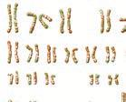

அலகு-11

மரபுக்‌ கடத்தல்‌ கொள்கைகள்‌ மற்றும்‌ மாறுபாடுகள்‌

மிரியலில்‌ ஒரு பிரிவான. மரபியல்‌ என்பது... மரபுவழி... மற்றும்‌ மாறுபாடுகளை பற்றி படிப்பதாகும்‌. ஒவ்வொரு: தலைமுறையிலும்‌. உயிரிகளின்‌. பண்புகள்‌ எவ்வாறுபெற்றோர்களிடமிருரதுசந்ததிகளுக்கு்‌ குடத்தப்படுகின்றன. என்பதை: பற்றி இல்வியல்‌. விவரிக்ிறது, மரபுக்கடத்தலின்‌ அலகு மரபணு. எனப்படும்‌. இது, உயிரிகளின்‌ தனித்தன்மையை: மஇரிணமிக்கும்‌.. மரபியல்‌. காரணியாகும்‌. சந்ததிகளுக்கும்‌. அவர்தம்‌ பெற்றோர்களுக்கும்‌ "இடையிலான வேறுபாட்டு தன்மையின்‌ அளவே. மாறுபாடு ஆகும்‌. இப்பாடத்தில்‌ மனித இரத்த வகைகளை “மேற்கோளாகக்‌ கொண்டு பல்கூட்டு அல்லல்கள்‌, மனிதன்‌, பூச்சிகள்‌. மற்றும்‌. பறவைகளில்‌. நடைபெறும்‌ பால்நிரிணய முறைகள்‌, பால்‌. சார்ந்த மரபுக்‌ கடத்தல்‌, மரபியல்‌ நோய்கள்‌,

1 மனிதனில்‌ பால்‌ சர்ந்0(மற்றும்‌97மரபு குரோமோசோம்‌. அல்லாத மரபுக்‌. கடத்தல்‌

நொய்களைப்பு்றி அறிதல்‌. மற்றும்‌ மனித இனத்தை மேம்பாடு அடைய

*   வண்டலியன்‌ குறையாடுகள்மற்றும்‌ செய்ய உதவும்‌ முழைகளாவ இனமேஃ்பாட்டியல்‌,

குரோமோசோம்‌ பிரழ்ச்சிகளோடு. குழல்‌ மேம்பாப்டியல்‌, சூழ்நிலையியல்‌ மற்றும்‌.

மகக கா அனை பபுறத்தோற்ற பெம்பாட்டியல்‌ ஆகியவை பற்றியும்‌ டு விளக்கப்பட்டுள்ளன.

ஜெ ஷைககபதகவேகைகக் வந்‌
ஹவராடுஞ்௦9ட/

41 பல்கூட்டு அல்லீல்கள்‌: பயர்றி4146)

'மெண்டலிய மரபுக்‌ கடத்தலின்‌ படி அனைத்து மரபணுக்களும்‌ இருமாற்று. வடிவங்களை: கொண்டுள்ளன... அவை ஓங்கிய மற்றும்‌. ஒடுக்கிய அல்லில்கள்‌ ஆகும்‌. (எ. ௧௧) நெட்டை (மற்றும்‌ குட்டை (9. இதில்‌ ஓங்கிய அல்லில்கள்‌ "இயல்பானவை மற்றும்‌ ஒடுக்கிய அல்லீல்கள்‌ ிரர்மாற்றம்‌அடைத்தவை,ஒருமரபணுபலமுழை. இரிமாற்றமடைந்து பல மாற்று வடிவங்களை: உருவாக்குகிறது. ஒரு குறிப்பிட்ட உமிரினத்தின்‌. ஒத்த குரோமோசோம்களின்‌ ஒரே மட்டத்தில்‌, ஒரு குறிப்பிட்ட பண்பை கட்டுப்படுத்துகிற். மூன்று அல்லது அதற்கு மேற்பட்ட அல்லில்கள்‌ காணப்பட்டால்‌ அவை பல்கூட்டு அல்லீல்கள்‌

என்றும்‌. இவை கடத்தப்படுதல்‌. பல்கூட்டு மரபுக்கபத்தல்‌ (ரர. வின்ஸ்‌. என்றும்‌. அழைக்கப்படுகிறது.

42 மனித இரத்த வகைகள்‌

(ர ௦0ம்‌ ரய)

மனிதனிலும்‌. பல்கூட்டு. அல்லீல்கள்‌. காணப்படுகின்றன... குறிப்பாக பல்வேறு: இரத்தவகைகளின்‌.. மரபுக்‌. கடத்தலைக்‌,

கூறலாம்‌... எதிர்பொருள்‌ தூஸ்டிகள்‌ (சஸ்ஷ) மற்றும்‌ எதிரிபொருள்கள்‌. (வர்ஷ) பற்றி அறிந்துகொள்வதல்‌. மூலம்‌ இரத்தவகையின்‌: மரபுக்கடத்தலை. அறிந்து கொள்ள முடியும்‌. இரத்தத்தில்‌ காணப்படும்‌. பகுதி பொருட்கள்‌, அதல்‌ வகைகள்‌ (400). இரத்த எதிர்பொருள்‌ 'தூண்டிகள்‌ மற்றும்‌ எதிர்பொருள்கள்‌ பற்றி நாம்‌ ஏற்கவவேபதினேராம்வகுப்பில்‌7ஆம்பாடத்தில்‌. பயில்றுன்ளோம்‌.

424490 இரத்த வகைகள்‌:

பல்கூட்டு அல்லில்களான 480) இரத்த: "வகைகளின்‌ மரபுக்‌ கடத்தல்‌:

ஒரு. மனிதனின்‌ இரத்தம்‌. இன்னொரு மனிதனின்‌ 'இரக்தத்திலிருந்து: வேழிப்பொருட்களின்‌ அடிப்படையில்‌, வேறுபடுகிறது. பொருத்தமில்லாத இரண்டு. இரத்த வகைகளை ஒன்றாக கலக்கும்போது. அதிலுள்ள இரத்த சிவப்பு செல்கள்‌ ஒன்றுடன்‌ ஒன்று இணைந்து இரக்த செல்‌ திரட்சியை ஏற்படுத்துகின்றன... இரத்த சிவப்பு செல்லின்‌ மேற்பறச்சல்வு மற்றும்‌ எபிதீலியல்‌ செல்களில்‌.

செக்வக்கொள்லைக்‌கத்தல்லதகடுகள்‌. 6.

காணப்படும்‌. எதிர்ப்பொருள்‌ தூஸ்டியின்‌: காரணமாக வேதிப்பொருட்களின்‌ வேறுபட்ட தன்மை நிர்ணயிக்கப்படுகிறது. டாகடர்‌ கார்ல்‌ லேண்ட்ஸ்டெய்னர்‌ என்பவர்‌ மனித இரத்தத்தில்‌ உள்ள 80 பின்‌ புறப்பரப்பில்‌ 'எதிர்ப்பொருள்‌. "தூண்டி 4. மற்றும்‌ "எதிர்ப்பொருள்‌ தூண்டி. ர என்ற இரண்டு வகையான எதிர்பொருள்‌ தூண்டிகள்‌.... இருப்பதைக்‌... கண்டறிந்தார்‌. எதிர்ப்பொருள்‌ தூண்டிக்‌ இருத்தல்‌ அல்லது: 'இல்லாமலிருத்தலின்‌ அடிப்படையில்‌, 4 இரத்த. (வகை ॥ி இரத்த வகை மற்றும்‌ 0 இரத்தவகை: என்ற மூன்று வகையான இரத்த வகைகளை: (00) அவர்‌ கண்டறிந்தார்‌. இதில்‌ '0\] வசை: கொண்டோரை பொதுக்கொடையாளர்கள்‌' என்பர்‌. 122.ஆம்‌. ஆண்டு. லேண்ட்ஸ்டெய்னருடைய மாணவர்களாகிய வான்‌ டி. காஸ்டெல்‌ மற்றும்‌. ஸ்டுர்லி. என்பவர்கள்‌ மிகவும்‌ அரிதான மம. என்ற நான்காவது. இரத்த வகையை (பொதுப்‌ பெறுநர்‌) கண்டுபிடிக்தனர்‌.

142: இல்‌ பெரனஸ்டின்‌ என்பவர்‌ மனிதனில்‌: பல்வேறு இரத்தவகைகளின்‌ மரபுக்‌ கடத்தல்‌. பபல்கூட்டு அல்லில்களால்‌ நிர்ணயிக்கப்படுகிறது. என கண்டறிந்தார்‌. எந்த ஒரு நபரின்‌ இரத்த வகைகயையும்‌ நிர்ணயிப்பது குரேமோசோம்‌. உல்‌. உள்ள மூன்று. அல்லில்கள்‌. கும்‌. (இரத்த வசையை கட்டுப்படுத்தும்‌. மரபணு, 1 அல்லது என குறிப்பிடப்படுகிறத. (4 என்பது கண்டுபிடிப்பாளரான வேண்ட்ஸ்டெய்னரிரையும்‌. என்பது... ஜஸோசக்ளுட்டினேசனையும்‌ குறிக்கும்‌) மரபணு | ஆனது 1: 1.1” என்ற மூன்று: அல்லல்‌. வடிவங்களைக்‌ கொண்டுள்ளது. 1 அலலில்‌ எதிர்பொருள்‌ தாண்டி -4 மையும்‌ 11 அல்லல்‌ எதிர்பொருள்‌ தூண்டி நி வையும்‌ குறிக்கிறது. ஆனால்‌, 1! அல்லல்‌ எந்த ஒரு. எதிர்ப்பொருள்‌ தூண்டியையும்‌ குறிக்கவில்லை. சிவரின்‌ கண்ணீர்‌ மற்றும்‌ உமிழ்நீர்‌ போன்ற. உடல்‌ திரவத்தில்‌ எதிரிப்பொருள்‌ தூண்டிகள்‌ காணப்படும்‌. அவர்கள்‌ கரம்பானர்கள்‌ என: அழைக்கப்படுகின்றனர்‌.

11 அல்லல்‌ ந அசிடல்‌ கேவச்போஸ்‌ டிரால்ஸ்பெரேஸ்நொதியசரந்து3-அசிட்டைல்‌. சேலக்போசமைனைச்‌.. (0/0) செரிக்கிறது. 11 அல்லல்‌, கேலக்டோஸ்‌ ஒிரான்ஸ்பெரேஸ்‌ தொழியை கரந்து கேலகடோஸை 11) பொருள்‌. எனப்படும்‌. மூவ்பொருோடு சேர்க்கிறது.ரா கவச வகை எதிர்‌-. 1 வகை வகை எதிர. ரர நலக: நிவகை எதிர்‌. ப்‌ வகை: நலக எதிர்‌-4. ரர சிவக. மற்றும்‌ ரவகைகள்‌: எதிரபொருட்கள்‌ இல்லை. 1 0வகை\_ | எதிர்ப்பொருள்‌ தூண்டி இல்லை | எதிர்‌ மற்றும்‌ எதிர்‌ 11/12 அல்லல்‌ பூரான்ஸ்பெரேஸ்‌ நொதி எதையும்‌. கொண்டிருக்கின்றன. ஆனால்‌. இவை.

சுரப்பதில்லை. எனவே "வெற்று அல்லீல்‌" (ய்‌ 449 என்று. அழைக்கப்படுகின்றன. மேலும்‌ இவை 1042 அல்லது. கேலக்போஸை. மூலப்பொருளுடன்‌ சேர்ப்பதில்லை. புறத்தோற்ற விகிதத்தில்‌ 1\* மற்றும்‌ 7" அல்லீல்கள்‌ \[5 விற்கு ஓங்கிய தன்மையை:

| 1... மனிதர்களிடையே ய \* காணப்படும்‌. எதிர்பொருள்‌ \[2 தூண்டிக்‌ மற்ற

உயிரினங்களின்‌

| "இரத்தத்திலும்‌ அடையானம்‌ ; காணப்பட்டுள்ளன. சிம்பான்சி மற்றும்‌

1 கப்பன்‌ கூரங்குகனில்‌ 4 வகை எதிர்பொருள்‌ | தூண்டிகளும்‌ உராங்குட்டால்‌ கூரங்குகளில்‌

1 ௩ மற்றும்‌ 48 வகை எதிர்ப்பொருள்‌ தூண்டிகளும்‌ காணப்படுகின்றன.

நவீல.. உஷத்தின்‌.. குரங்கு.

(பினாட்டிரைவமற்றும்லெழூர்‌ கூங்குகள்‌

*   ஒரேமாதிரியானபொருளைகொண்டுள்ளன. லால்‌... மனிதனில்‌ காணப்படுகின்ற.

1 எதிர்ப்பொருள்‌ தூண்டி -8 யோடு ஒத்து காணப்படுவதில்லை.

பூனைகளில்மூன்று இரத்தவகைகள்‌:

அறியப்பட்டுள்ளன. இவைமனிதர்களுடைய

1 மரபணு அமைப்புடன்‌ ஒத்துப்‌ போகின்றன. விலங்குகளின்‌ கண்ணீர்‌, உமிழ்ீர்‌ சிறு£ீர்‌,

1 விந்து திரவம்‌ இரப்பை நீர்‌ மற்றும்‌ பால்‌ போன்ற உடல்‌ திரவங்களில்‌ எதிர்ப்பொருள்‌

"தூண்டிகள்‌ காணப்படுகின்றன. |

“இரண்டும்‌ ஒல்றுக்கொல்று ஓங்குதஸ்மையுடல்‌. 115279 இருப்பதால்‌ இது "இணை ஐங்குதன்மை" (மிஸ்ஸ்கஸி என. அழைக்கப்படுகிறது. இவற்றின்‌ ஓங்கு. பண்புசார்ந்த. படிநிலை. ரய) முகை கனன்‌) ஆகும்‌. குழந்தைகள்‌ தங்கள்‌ பெற்றோர்கனிடமிருந்து இந்த மூன்று: அல்லீல்களில்‌ ஏதேனும்‌ ஒவ்றைப்‌ பெறுகின்றன. (இதனால்‌ அறுவகையான மரபணு வகைகளும்‌. நான்கு... வகையான. இரத்த வகைகளும்‌. (புறத்தோற்ற ஆக்கமும்‌) உருவாகின்றன. ரம மர) 102 என்ற அறுவகையான மரபுவகைகளை சேய்‌ உயிரிகள்‌ கொண்டுள்ளன.

ரீசஸ்‌ அல்லது 1 காரணி

ம காரணி அல்லது 84 எதிர்ப்பொருள்‌. தாண்டி... இரத்த. சிவப்பணுக்களின்‌. மெற்பரப்பில்‌ காணப்படுகின்றன. 2௦ல்‌ கார்ல்‌. 'லேண்ட்ஸ்பெ்னரி. மற்றும்‌. அலெக்சாண்டர்‌ வெய்ன்‌. ஆகிய இருவரும்‌ முதலில்‌. சாகா சரஸ்‌ என்னும்‌ ரீசஸ்‌ குரங்குகளிலும்‌. பிறகு மனிதனிலும்‌ இதனை கண்டுபிடித்தனர்‌. மம காரணி என்ற வார்த்தை தடுப்பாற்றல்‌ தருகின்ற 0 (இம்புலோஜெனிக்‌ 2) எதிர்பொருள்‌ தூண்டியைக்‌ குறிக்கிறது. 0 எதிர்பொருள்‌: தூண்டியை பெற்றிருப்பவர்‌ 8 0 உடையோர்‌. 104) என்றும்‌ எதிர்ப்பொருள்‌ தூண்டி அற்றவர்‌. 1 2 அற்றோர்‌ (64) என்றும்‌ அலழக்கப்படுவர்‌. "இரத்தத்தில்‌ காணப்படும்‌ ரீசஸ்‌ காரணியானது. ஓங்கு பண்பாக மரபுவழி கடத்தப்படுகிறது. “இயற்கையாகவே அனைவரின்‌ பிளாஸ்மாவிலும்‌. மக்குஎதிராணதிர்ப்பொருள்கள்‌ இருப்பதில்லை. பம (ம அற்றோறி இரத்தம்‌ மம.) உடையோர்‌)

ஜே ஷைககபதகவகைகக் வந்துப்‌ஹவராடுஞ்௦9ட/

'இரத்தத்தோடுதொடர்பு ஏற்படுகிறபோதுஅவர்கள்‌ இரத்தத்தில்‌ க்கு. எதிரான எதிர்ப்பொருள்‌ உருவாகின்றது... ஆனால்‌. 8. உடையோர்‌. ௫ அற்றோரின்‌ இரத்தத்தைப்‌ பெறும்போது எவ்வித விளைவுகளும்‌ உண்டாவதில்லை.

4410 காரணியின்‌ மரபுவழிக்‌:

கட்டுப்பாடு (0-4 வேர! எீர%8௭ஸ) மிஷ்‌ மற்றும்‌ ரேஸ்‌ கருதுகோள்‌:

1ம்‌ காரணிமின்‌ மூன்று வெவ்வேறு அல்லல்‌ இணைகள்‌, குரோமோசோம்‌. இணைகளின்‌: நெருக்கமான மூன்று வெவ்வேறு இடங்களில்‌. அமைத்துள்ளன. இன்றைய பயல்பாட்டில்‌ இரக்க. அமைப்பு பொதுவாக 04 என்ற பெயர்களில்‌. பயன்படுத்தப்படுகிறத.

0௭௦ 0௭௦ ஓ ஓ றம்‌ றஎம்‌ ஓ ஓ ப ப

படம்‌ விவரி மற்றும்ரேஸ்‌ கருதுகோள்‌

மேற்கண்ட படம்‌ 41ல்‌ மூன்று 8 அல்லல்‌ இணைகள்‌ (0 றம்‌. 89. அமைப்பொத்த. குரோமோசோம்‌ இணையில்‌, மூன்று வெவ்வேறு: அமைவிடங்களில்‌ ஒவ்வொரு. குரோமோசோழும்‌ ஒரு 0 அல்லது ௨ ஒரு 2. அல்லது ம்‌ ஒரு 8 அல்லது உவாம்பபுக்கான. மறபுவகையைப்‌ பெற்றிருக்கும்‌. எடுத்துக்காட்டு மிஷ்‌ பறி ஷி 004012 போன்றவை. அனைத்து மரபு வகைகளிலும்‌ உள்ள ஓவ்கிய 9 அல்லல்கள்‌. ஈரா ம.டையோர்‌) புறத்தோற்ற வசையை கருவாக்குகின்றன... அதேபோல்‌. இரண்டு ஒடுங்கிய பண்புகொண்ட மரபுவகையில்‌. (40 அல்லல்கள்‌. 2 புறத்தோற்ற வகையை: உற்பத்தி செய்கின்றன.

வெய்னரின்‌ கருதுகோள்‌ ஒரு னுடைய இருப்பிடத்தில்‌ எட்டு அல்லில்கள்‌ (8.8; 80.11 எ1.) இருக்கின்றன.

ெத்வக்கொள்லைகள்‌கததல்லதுடுகள்‌. 88

என்ற கருத்தை வெய்னர்‌ முன்மொழிந்தார்‌ ஓங்கிய ரி அல்லீல்களைக்‌ கொண்ட அனைத்து, மரபுவகைகளும்‌ (8, 8, 8; 8) 8: புறத்தோற்ற. வகையை உற்பத்தி செய்கின்றன. அதேபோல்‌. “இரண்டு ஒடுங்கிய பண்பு கொண்ட அனைத்து, மரபுவகையும்‌(ாரிரரர)மமயுறத்தோற்றக்தை: உற்பத்தி செய்கின்றன.

41ம்‌ காரணிமின்‌ இணக்கமின்மை

*   வளர்கரு இரத்த சிவப்பணு சிதைவு 'நோய்‌ (எரித்ரோபிளாஸ்டோசிஸ்‌ விடாலிஸ்‌- 8ரண்ிஸமல்‌ 6௭வில)

1... இணுக்கமின்மையானது.... பிள்ளை: பேற்றின்‌ மீது பெரும்‌ முக்கியத்துவத்தை கொண்டுள்ளது. ஒரு 14: பெண்‌ ஒரு 8ம்‌ ஆணை மணந்துக்கொள்ளும்போது அவர்களின்‌. குழந்தை ரிர்வாக இருக்கும்‌. இதற்கு தந்தையிடம்‌. இருந்து. பெற்ற காரணியே காரணமாகும்‌. (இந்த 882 தாம்‌ தன்‌ உடலில்‌ 80 குழந்தையை: அமக்கும்போது உணர்வாக்கம்‌ பெறுகிறார்‌ குழந்தைபிறப்பில்‌ பொது இரக்சக்குழாய்களில்‌. ஏற்படும்‌ சேதத்தால்‌ தாயின்‌ நோய்த்‌ தடைகாப்பு. மண்டலம்‌. 8... எதிர்பொருள்தூண்டிகளை: அடையாளம்‌ காண்கின்றன. இதன்‌ விளைவாக 1௩. எதிர்ப்பொருட்கள்‌. உற்பத்தியாகின்றன. “இதனால்‌ உண்டான \[20 வகை எதிர்ப்பொருட்கள்‌ மித சிறியதாக உள்ளதால்‌ அவை தாய்சேய்‌ இணைப்பு திசு (ஷி வழியாக ஊடுருவி கருவின்‌ இரத்த ஓட்டத்தில்‌ கலக்கின்றன... தாம்‌ உணர்வாக்கம்‌ பெற்று... /எதிர்ப்பொருட்கள்‌ உற்பத்தியாகும்‌ நேரத்தில்‌ குழந்தை பிறந்து விடும்‌... இதலால்‌ முதல்‌ குழந்தை பிறக்கும்‌. (வரை 8- எதிர்பொருள்‌ தூண்டிக்கெதிராக தாம்‌. எல்வித பாதிப்பையும்‌. ஏற்படுத்துவதில்லை. மாறாக அதே தாய்‌ அடுத்தடுத்த 8” எதிர்பொருள்‌ 'தூண்டிகளைக்‌ கொண்ட கருவைச்‌ சுமக்கின்ற போது அவைகளுக்கெதிராக தாய்‌ உடலானது. எதிர்பொருட்களை உற்பத்தி செய்கில்றது.. இ. எதிர்பொருட்கள்‌ தாய்‌ சேம்‌ இணைப்புதிச மூலம்‌. கருவின்‌ இரத்த ஓட்டத்தில்‌ கலந்து கருவின்‌ இரத்த சிவப்பணுக்களை அழிக்கின்றன. இதன்‌ விளைவாக இரத்த சோகை மற்றும்‌. மஞ்சன்‌ காமாலை உண்டாகின்றது. இந்நிலை. "வளர்கரு இரத்த சிவப்பணு சிதைவு நோம்‌" அல்லது சிசு ஹிமோஸைடிக்‌ நோய்‌ (10) என. அழைக்கப்படுகிறது.ஹவராடுஞ்௦9ட/

வளர்கரு இரத்த சிவப்பணு சிதைவு. நோயை தடுக்கும்‌ முறை

பதாம்‌ 88 குழந்தையை சுமக்கும்போது 1-எதிர்பொருள்களை எதிர்க்க வல்ல பொருளை (ன்‌ ற விஷு அவது வாரமும்‌ 9௪ வாரமும்‌: கருவுற்ற. தாம்க்கு தடுப்பு. நடவடிக்கையாக: கொடுக்கப்படுகிறது. 84-ம்‌ 88: குழந்தையை: பெற்றெடுத்தால்‌. குழந்தை. பிறந்த. உடனே. ம எதிர்பொருள்களை எதிர்க்க வல்ல பொருளை (லே ற ஒமியிலு தாய்க்கு கொடுக்க வேண்டும்‌. இதனால்‌ இயல்பான நோம்‌ தடைக்காப்பு! ஒருவாவதுடன்‌ கருவின்‌ சிவப்பணுக்களை. அழிக்கின்ற 0 எதிர்பொருள்‌ தாளின்‌ உடலில்‌. இருவாவது' தடுக்கப்படுகிறது. மேலும்‌ தான்‌: சிப்பம்‌ தரிக்கும்‌ போதெல்லாம்‌ இம்முறையை: மேற்கொள்ள வேண்டும்‌.

44 பால்‌ நிர்ணயம்‌ ($ல மீரனாம்ள0)

பால்‌ நிர்ணயம்‌ என்பது உயிரினங்களிடையே ஆண்‌, பெண்‌ வேறுபாடுகளை உருவாக்குகின்ற. முறைகளாகும்‌. பால்‌ குரோமோசோம்கள்‌ ஒரு பாலின (ஸ்ம எ பிங்ஷி உயிரிகளில்‌. பாலினத்தை... நிர்ணமித்தின்றன. ... பால்‌. குரோமோசோம்கள்‌ தவிர மீதமுள்ள அனைத்தும்‌. உடல்‌. குரோமோசோம்கள்‌ (சமி என: அழைக்கப்படுகின்றன. பால்குரோமோசோம்கள்‌ ஒரு பாலினத்தில்‌ உருவம்‌ ஒத்த குரோமோசோம்‌. அமைப்பையும்‌ (/ஸகரல்பி.. மற்றொரு: பாலினத்தில்‌ உருவம்வேறுபட்ட குரோமோசோம்‌. அமைப்பையும்‌ (1//ஸானரம்ி கொண்டுள்ளன. ஒத்த பால்‌ குரோமோசோம்கள்‌. கொண்ட பாலினத்தில்‌ ஒரே வகையான (1-ஷனா9. 'இனச்செல்கன்‌ உற்பத்தியாகின்றன. வேறுபட்ட குரோமோசோம்களை (14எஜஸை) கொண்ட 'பாலினத்தில்‌ இரண்டு வகையான இனச்செல்கள்‌ உற்பத்தியாகின்றன.

| ஆகும்‌. இதனுள்‌ ஐ மரபணுக்கள்‌ செயல்படும்‌. நிலைரில்‌ உள்ளன...

ப அதேபோல்‌ 1௭.16 சவுள்ள 1

( குரோமோசோயில்‌ 109 பரபனுக்கள்‌ உள்ளன. |

குரோமோசோம்‌ அடிப்படையிலான பால்‌ நிர்ணயம்‌ வேறுபட்ட இனச்செல்‌ (4/-ஷணள) வகை: பால்‌ நிர்ணயம்‌. வேறுபட்ட. இவச்மேல்‌.

பபால்நிர்ஷயத்தில்‌ஒருபாலில' உயிரியில்‌ ஒரே மாதிரியான: 'இலச்செல்களையும்மற்றொரு, பாலின உரிரி வேறுபப்‌, இனச்செல்களையும்‌ உற்பத்தி செய்கின்றன. இதில்‌. சேய்‌ உயிரிகளின்‌ பால்‌, கருவறுதலின்‌ போது: நிரணயிக்கப்படுகிறது.

1.  வேறுபட்ட இனச்செல்‌ ஆண்‌ உயிரிகள்‌: (ஷயான்‌ வயி

இம்முறையில்‌, ஆண்‌ உமிறிகன்‌ வேறுபட்ட இனச்செல்களை உற்பத்தி செய்கின்றன. பெண்‌: உமிரிகன்‌ ஒத்த இனசசெல்களை உர்பத்தி செய்கின்றன. இதனை 38-10 (எகா. மூட்டை பூச்சிக்‌ மற்றும்பூச்சிகளானகரப்பான்பூச்சிகள்‌. மற்றும்‌ வெட்டுக்கிளிகள்‌) மற்றும்‌ 0-1. (காட மனிதல்‌ மற்றும்‌ பழய்பூசீசி (ம்ஷரம்‌, வகைஎன இரண்டு வகையாக பிரிக்கலாம்‌. 2வேறுபட்ட இனச்செல்‌ பெண்‌ உமிரிகள்‌ (சனம்‌ காவி)

இம்முறையில்‌, பெண்‌ உயிரிகள்‌ வேறுபட்ட இனச்செல்களை உற்பத்தி செய்கின்றன. ஆண்‌: உபிரிகள்‌ ஒத்த இனச்செல்களை உற்பத்தி செம்மில்றனஏற்கவவே வேறுபட்ட இவச்மேல்‌. ஆண்டயிரிகளில்‌11-10மற்றும்‌ப11வகையில்‌. மற்றும்‌? எழுத்துக்கள்‌ பயன்படுத்தப்பட்டதால்‌ இப்போது குழப்பத்தை தனிர்க்க வேறுபட்ட இனச்செல்‌ பெண்களில்‌ ச மற்றும்‌. எழுத்து: முறையேபபிக்காடாகப்பயன்படுத்தப்படுகிற்வ. வேறுபட்ட இனச்செல்‌ பெண்களில்‌ 20-22 (எகா. அந்திப்‌ பூச்சிகள்‌, வண்ணத்துப்‌ பூச்சிகள்‌ மறும்‌ விட்டுக்கோழிகன்‌) மற்றும்‌ சார (காட திப்சி அந்தி்பூச்சி, மங்கள்‌, ஊர்வன. மற்றும்‌ பறவைகள்‌) ஆகிய இரண்டு வகையான மூட்டைகள்‌ காணப்படுகின்றன. மனிதனில்‌ பால்‌ நிர்ணயம்‌:

மனிதனில்‌ பால்‌. நிர்ணயம்‌ செய்யும்‌ மரபணுக்கள்‌ இண்டுபால்குரோமோசோம்களில்‌. உள்ளன. இக்குரோமோசோம்களுக்கு

ர க்கபததகவெளைகள் பந்‌
ஹவராடுஞ்௦9ட/

பபால்குரோமோசோம்கள்‌" அல்லது. "ல்லோசோம்கள்‌' என்றுபெயர்‌.பாலூட்டிகளில்‌, பபால்‌ நிர்ணயமானது. இரண்டு பாலினத்திலும்‌: உள்ள... பால்‌... குரோமோசோம்களின்‌. வேறுபாட்டை அடிப்படையாகக்‌ கொண்டு. அமைகின்றது. எடுத்துக்காட்டாக, பெண்கள்‌ 301. குரோமோசோம்களையும்‌. ஆண்கள்‌. 107 குரோமோசோம்களையும்‌ கொண்டுள்ளனர்‌ மனிதனில்‌. மொத்தம்‌ 24 இணை குரோமோசோம்கள்‌ உள்ளன. அதில்‌ 22 இணை உடல்‌ குரோமோசோம்களும்‌ (44) ஒர்‌ இணை பால்‌ குரோமோசோம்களும்‌ (3. அல்லது 17) அடங்கும்‌. பெண்கள்‌ ஓத்த இனச்செல்‌ பண்பு: கொண்ட ஒரே வகையான அண்டசெல்லை. (இனசைவெல்‌) உருவாக்குகின்றனர்‌... ஒவ்வொரு: அண்டசெல்லிலும்‌ ஒரு % குரோமோசோம்‌. மட்டுமே காணப்படும்‌. மாறாக வேறுபட்ட இனச்‌ செல்களை உருவாக்கும்‌ ஆண்கள்‌ இரு வேறு, வகை விந்துச்செல்களை அதாவது 3. மற்றும்‌.

1.  குரோமோசொம்களைக்‌ கொண்ட விந்து செல்களை உருவாக்குகின்றன. இதைப்போன்றே. பழப்பூச்சிபின்‌ பால்‌ குரோமோசோம்களின்‌: அமைப்பும்‌ மனிதனை போன்றே 3917 என்று, தன்வியல்பாய்‌ பரிணமித்துள்ளது படம்‌ 42).

ஞ்‌ ஷி மடவறுவலல. ஒழிதிவலல, பா சை. குவவு) விழக்‌... அலன்‌ ஜ்ஸ்ஷஸ. ஐணிலு ஹஜ. மலம. மகிமை டண (வலம பஸ்ஸை, வடடல வண்டல்‌ படம்‌ 42 மனிதனில்‌ பால்‌ நிர்ணயம்‌. 1 குரோமோசோம்‌ மற்றும்‌ ஆண்களின்‌ வளர்ச்சி.

1 குரோமோசோமில்‌ பல மரபணுக்கள்‌ இருப்பதையும்‌. அப்பகுதிகள்‌ ஆற்றல்‌. மிக்க மரமியல்‌ பணிகளை வெளிப்படுத்தும்‌. திறன்‌: கொண்டவை என்றும்‌ 1 குரோமோசோம்‌ பற்றிய தற்போதைய ஆய்வுகள்‌ தெரியப்படுத்துகின்றன. 11 குரோமோசோமில்‌ இப்மரபணுக்களுக்கான ஒத்த எதிர்‌ இணைகள்‌ இருக்கலாம்‌ அல்லது,

ெத்வதக்கொள்லைகள்‌ கத்தல்‌ டுகள்‌. 68

இல்லாமலும்‌ இருக்கலாம்‌. குரோமோசோமில்‌: 'இருமுனைகளிலும்போலிஉடல்குரோமோசோம்‌. பகுதிகள்‌ உள்ளன. (8) ("ஸம்ஸம்‌ ரஷ்‌. இதற்கு... இணையான. பகுதிகள்‌ 3 குரோமோசோமிலும்‌ உள்ளன. இப்பகுதியில்‌ குன்றல்‌ பகுப்பில்‌ குறுக்கெதிர்மாற்றமும்‌ மறு: 'இணைவும்‌ நடைபெறுகின்றன. மீதம்‌ உள்ள 89: 1 குரோசோமினுடைய பகுதிகள்‌, இணையா ர பகுதியாகும்‌ (100. இந்த இணையா பகுதிகள்‌ செயல்படும்‌. மரபணுக்கள்‌ (ஸா) பகுதி மற்றும்‌ செயல்படா மரபணுக்கள்‌ (//-ஸஸ்ாள9. பகுதி என இரண்டு சமமான பகுதிகளாக: பிரி்கப்பட்டுள்ளன.. செயல்படும்‌ மரபணு, பகுதியில்‌ பால்‌ நிர்ணயம்பகுதி 1 என்னும்‌. ௫ பண்னி ஈன - 880) மரபணு உள்ளது. மனிதனில்‌ 1 குரோமோசோம்‌ இல்லாதிலையில்‌, தவிர்க்க முடியாமல்‌ பெண்‌ உயிரியாக வளர்ச்சி டைய வழிவகுக்கிறது. பால்‌ திர்ஸய மரபணுப்பகுதி 37 குரோமோசோமில்‌ கிடையாது. இந்த பால்‌ நிர்ணயப்பகுதி 7 மின்‌ மரபணு 'விலள பொருள்‌, முதிர்ந்த ஆணின்‌ விந்தகத்தில்‌ காணப்படும்‌ விந்தக நிர்ணயக்‌ காரணியாகும்‌.

441 பழப்பூச்சிகளில்‌ மரபணு சமநிலை

8.  மிரிட்றஸ்‌ என்பவர்‌ முதன்‌ முதலில்‌ பழப்பூச்சிகளில்‌ மாபணு சமநிலை மூலம்‌ பால்‌. இர்ணயிக்கப்படுவதைக்‌ கண்டறிந்தார்‌ ஆண்பாலினத்தின்‌. கருவுறுதல்‌. திறனுக்கு
9.  குரோமோசோம்கள்‌. தேவையாவதாகும்‌. ஆனால்‌... அது... ஆண்‌. பாலினத்தை. இிரிணமிப்பதில்லை. பெண்‌ பழப்பூச்சியில்பெண்‌. தன்மைக்கானமரபணுக்கள்‌குரோமோசோமில்‌.

உள்ளன... அதேபோல்‌, ஆண்களில்‌ ஆண்‌

தன்மைக்கான... மரபணுக்கள்‌... உடல்‌

குரோமோசோம்களில்‌ உள்ளன. மரமியலானரான.. மிரிட்தஸ்‌.. தண்‌:

ஆராய்ச்சியில்‌ மும்மய (00 தன்மை கொண்ட 'பெண்பழப்பூச்சியுடன்‌ இயல்பான .ஆண்பூச்சியை அவப்பு செய்தபோது, உருவான சேய்‌ உ.யிரிகளில்‌ பால்‌ மற்றும்‌ கடல்‌ குரோமோசோம்களில்‌ பலவகை புதிய இணைவுகளைக்‌ கண்டறிந்தார்‌. 22ல்‌ ந.்தப்பட்ட இச்சோதனைகளில்‌ கிடைத்த. முடிவுகளின்‌ அடிப்படையில்‌, பழப்பூச்சியிஸ்‌ பகுரோமோசோரில்‌உள்ளபெண்தன்மைக்கான மரபணுக்களுக்கும்‌ உடல்‌ குரோமோசோம்களில்‌ஹவராடுஞ்௦9ட/

உள்ள ஆண்‌ தன்மைக்கான மரபணுகளுக்கம்‌ 'இடையேயானமபபுச்சமநிலையே இப்பூச்சினில்‌ பாலினத்தை நிர்ணயிக்கிறது. என பிரிட்ஜஸ்‌: கண்டறிந்தார்‌... எனவே... பழப்பூச்சியல்‌ உடல்குரோமோசொம்களின்‌ ... தொகுதிக்கும்‌ 10 குரோமோசோமுக்கும்‌ இடையே காணும்‌ விதமே... பாலினத்தை... நிர்ணயிக்கின்றன. 'இவ்விகிதமே”பால்குறியீட்டுஎண்‌" எனப்படுகிறது. இதனை கீழ்க்கண்டவாறு வெளிப்படுத்தல்‌.

குறியிட்டு எண்ணில்‌ ஏற்படுகின்ற மாற்றம்‌, உமிரிகளின்‌. புறத்தோற்ற பால்‌. பண்பில்‌. வெளிப்படுகிறது. மும்மய பெண்‌ பழப்பூச்சியை: (ட. இறட்டைமய ஆணுடன்‌. 04௮10. கலப்புச்செய்த ஆம்வின்‌ முழுவுகள்‌ அட்டவணை: சமமற்றும்‌ கமல்‌ கொடுக்கப்பட்டுள்ளன.

மட வின்‌ குறிரிட்டு எண்‌: 12 எனில்‌, அவ்வுயிரிகன்‌ இயல்பான பெண்களாக உள்ளன. குதியிஃடுஎண்டசசக்குமேல்‌எல்வளவுகூரனாலும்‌. அவை பெண்களாகவே உள்ளன... குறியிட்டு எண்‌: 8.59. என இருந்தால்‌ அவை இயல்பான: ஆண்களாக உள்ளன. மேலும்‌ இம்மதிப்பு 022 க்கு என்வளவு குறைவாக இருந்தாலும்‌ அவை: ஆண்களாகவே உன்ன. குறியிட்டு எண்‌ ௧2" ஆக இருந்தால்‌ இடைபால்‌ உயிரியாக உள்ளன. மிகை ஆண்களுக்கான குறியிட்டு எண்‌ 234. ஆகவும்‌ மிகை பெண்களின்‌ குறியிட்டு எண்‌ 1-8. ஆகவும்‌ உள்ளன... இவ்விருவகை உயிரிகளும்‌. வலிமையற்ற மலடுகளாக உள்ளன.

2 பழப்பூசசிகனில்‌,. பெண்‌ தன்மை "வளர்ச்சியை பால்‌ மாற்றி மரபணு' (ல எர்ஸ்‌ ஜால. வழிழட்துகின்றன. இந்த பால்‌ கொல்லி மரபணு!

(10 1 குரோமோசோயில்‌ காணப்படுகின்றது.

உடபால்‌ கொல்லி மரபணு இரண்டு. வகையான. நிலைகளைக்‌ கொண்டுள்ளன. 'இல்வகையான மரபணு செயல்படும்‌ நிலையில்‌. (மிறக்கும்‌ போது) பெண்‌ தன்மை வளர்ச்சியையும்‌. செயல்படாதநிலையில்‌ (மூடுகின்ற போது) ஆண்‌: தன்மை... வளர்சிசியையும்‌. வழிநடத்துகின்றது. மேலும்‌ 3 குரோமோசோமிலும்‌ உடல்‌. குரோமோசோமிலும்‌ உள்ள வேறு சில: மரபணுக்கள்‌ பால்‌ மாற்றி மரபணுக்களை: கட்டுப்படுத்துகின்றன.

அட்டவணை 42 மும்மய (240110) வெண்டூச்சிக்கும்‌ இரட்டைமய (24-11).

ஆண்பூச்சிககும்‌ இடையே செய்யப்பட்ட மிரிட்னின்‌ கப்பு ஆய்வு முடிவ மும்மய இரட்டைமய பெற்றோர்‌... கலப்பு. ஷமி (20. இனசலல்கள்‌ (242100) (மஷ(கஸ) 1 ம்‌ ம (பட கக்கம்‌ மய- கசன்‌ மும்ம - பெண்‌ | இடைபால்‌. கயிரி சமழும்ம | 4 சல ன்‌ மிகை. இடைபால்‌ உயிரி ஆண்‌ சக்ர ப ட க்ஸ இரட்டைமய மிகைபெண்‌ | இரபம க்ப்‌ தன க பட்டைமய- | இரட்டைமய பெண்‌ “ஆண்‌ உ பழப்பூச்சிகளில்‌ ஆண்‌. தன்மை

உருவாவதற்கு 1 குரோமோசோமின்‌ இருப்பு கட்டாயமாகும்‌. 1பகரரமோசோமை ஹெஸ்கில்‌ எவ்பவர்‌' 7981 ஆம்‌ஆண்டு கண்டுபிடித்தார்‌ 2 1குரோமோசேமை ஸ்டிவன்ஸ்‌ என்பவர்‌. 7902 ல்‌ .கண்டுபிடித்தார்‌.. இருபால்‌ உருவம்‌ (9 ய௯ப்‌ய௦1) "இவ்வகையான உயிரினங்களின்‌ சில உடல்‌. பகுதிகள்‌ ஆண்‌ பண்புகளையும்‌ மற்ற சில உடல்‌. பகுதிகள்‌. பெண்‌. பண்புகளையும்‌. வெளிப்படுத்துகின்ற. ஆண்‌: மற்றும்‌. பெண்‌: மறபுவகைகளைக்கொண்டதிசக்களால்‌இவ்வகை உயிரிகள்‌ உடலாக்கம்‌ பெற்றுள்ளன (மொசைக்‌ கன்ம.

ஷ ஷககபதகவகைகக் வனத்‌ஹவராடுஞ்௦9ட/

அட்டவணை 43: குரோமோசோம்கள்‌ மற்றும்‌ உடல்‌ குரோமோசோம்‌ தொகுதிகளின்‌ வெவ்வேறு அளவுகளால்‌ பழம்பூசசியின்‌ பால்நிரிணயத்தனில்‌ ஏற்படும்‌ தாக்கங்கள்‌.

442 அளவு ஈடுசெய்தல்‌-பார்‌. உறுப்புகள்‌ (0௦ஷ௦ 0 சரனவர்ம - நிலா நஸ்‌) 129-ஆம்‌.ஆண்டு பார மற்றும்‌ பெரட்ரம்‌ ஆகிய இருவரும்‌ பெண்‌ பூனையில்‌ நரம்பு செல்லில்‌ ஒரு. அெரித்தியான உறுப்பை கண்டறிந்தவர்‌. அவை. ஆண்‌. பூனையில்‌ காணப்படுவதில்லை. இந்த. அடர்த்தியான உறுப்பையால்‌ குரோமேட்டின்‌ (5௨. ண்ணி என்று அழைத்தார்கள்‌. பின்னர்‌ "பார்‌ உறுப்புக்கள்‌". எல... அழைக்கப்பட்ட 197 குரோமோசோம்‌ வகை பால்‌ நிர்ணமித்தலில்‌ ஆண்‌ உகிரிகள்‌ ஒரு ம்‌ குரோமோமோலபயும்‌ வயிரிகள்‌ இரண்டு. ப இரபோராம்களையும்‌. செண்டு. பாலினத்திற்கு இடையேயோன இந்த அளவிட்டு வேறுபாட்டை உயிரினம்‌ எப்படி ஈடு செய்கிறது. என்கிற வினா எழுகிறது. பாலூட்டிகளின்‌ பெண்‌: உமிரிகளில்‌ ஒரு 3! குரோமோசோம்‌ மட்டுமே. செயல்படுகின்றன.இன்னொரு குரோமோசோம்‌. செயல்படாமல்‌ இருப்பதால்‌ அளவீடுகளில்‌: வேறுபாட்டை ஈடுசெஞ்து.. கொள்கின்றன. இதனால்‌. ஆண்மற்றும்பெண்‌ ஆகிய இருபாலில. உயிரிகளிலும்‌ ஒரு செல்லுக்கு. ஒரு 11 குரோமோசோம்‌... மட்டுமே செயல்திறன்‌: பெற்றுள்ளது. செயலற்றகுரோமோசொமேபார்‌உடல்களாக உள்ளன என மேரி லியோன்‌ முன்மொழிந்தார்‌. இவை பெண்‌ உமிரிகளில்‌, மிக நெருக்கமாக

செத்வக்கொள்லைகள்‌கத்தல்லு வடுகள்‌. 00

ட \]மகைபேண்‌: 8 2 சமம்‌ 2 தாற்வம்‌ ப்‌ ப்‌ அவம்‌ 2\] இல மலை ம்‌ 4 நகம்‌ ச இட்டையம்‌ | 2 2 அம 2 ஒற்றையம்‌. 1 1 மலம 2 | இடைபால்க௰ிர்‌ 2 2 தவள ர\] இல்பானஷண்‌. ்‌ 2 ப கமலக்‌. 1 2 மனற

கருண்டு, குரோமேட்டினின்‌.. காணத்தக்க. வடிவமான ஹெட்டிரோ குரோமேட்டின்‌ ஆக. மாறுகிறது... (லையான்‌... கருதுகோள்‌. புஷ்‌ ரஸ்ய) ஒரு செல்லில்‌ உள்ள பார்‌ உறுப்பின்‌ எண்ணிக்கை, அச்செல்வில்‌ உள்ள பட குரோமோசோம்களின்‌ எண்ணிக்கையை வி. ஒன்று குறைவாகும்‌. 10 வகைபெண்‌ உயிரிகளில்‌. பார்‌ கறுப்புகன்‌ கிடையாது. மாறாக 3011 வகை: ஆண்‌ உயிரிகள்‌ ஒருபார்‌ உறுப்பைபெற்றுள்ளன.

மார்‌... உறுப்புகளின்‌... எண்ணிக்கை ப-விதியைப்‌ பின்பற்றுகிறது 1-1 விதியில்‌ (லிருந்து ஒன்றை கழித்தல்‌ விதி! என்பது. செல்லில்‌ உள்ள 3 குரோமோசோம்களின்‌: ஷொக்த எண்ணிக்கை ஆகும்‌.

தேனீக்களின்‌ ஒற்றைமய-இரட்டைமய நிலை:

ஹைமனோப்டிரா. வரிசையைம்‌.. சேர்ந்த பூச்சிகளான. தேனிக்கள்‌, எறும்புகள்‌ மற்றும்‌ குனவிகளில்‌ பொதுவாக ஒற்றைமய-இரட்டைமய முறையில்‌ பால்‌ நிர்ணயம்‌. நடைபெறுகின்றது. இம்முறையில்‌ சேய்‌ உமிரிகளின்‌ பாலினம்‌, அவை. பெறுகிற... குரோமோசோம்‌. தொகுதியின்‌ எண்ணிக்கையை. பொறுத்து. இரிணயிக்கப்படுமிறது. கருவுற்ற முட்டைகள்‌ பெண்‌ உமிரிகளாகவும்‌ (இராணி மற்றும்‌. வேலைக்கார தேனிக்கள்‌) கருவுறாத முட்டைகள்‌ஹவராடுஞ்௦9ட/

ஆண்‌. தேனீக்களாக கன்னி இனப்பெருக்க. முறையிலும்‌. (ோ்ஷைகஸ்‌, வளர்சீசியடைகின்றன... ஆண்‌ தேனிக்களில்‌. குரோமோசோம்களின்‌ எண்ணிக்கைபாதியளவே. உள்ளனரஒற்றைமயம்‌).. பெண்‌ தேனிக்களில்‌. குரோமோசோம்கள்‌ இரு மடங்காக உள்ளன. (இரட்பைமயம்‌.... இதனால்‌ இம்முறை: ஒற்றைமய - இரட்டைமய பால்‌ நிர்ணயம்‌ என: வழைக்கப்படுகின்றது. "இவ்வகையான பால்‌ திர்ணயம்‌, தேனீக்களின்‌ சமூக... வாழக்கை... பரிணாமத்திற்கு வழிவகுக்கின்றன... ஒரு இரட்டையய தன்மை: கொண்ட தேன்‌, இராணித்‌ தேனியாகி. கூட்டத்திற்கான முட்டைகளை இடுகின்றன. கருவுற்றமுடையில்‌ இருந்து உருவாகும்‌ பிறபெண்‌: தேனிக்கள்‌, இராணித்‌ தேனி இடும்‌ மூட்டைகளை: பராமரிப்பதற்கும்‌. அதன்‌... இனப்பெருக்க. வெற்றிக்கும்‌ மறைமுகமாக தங்களுக்காவும்‌. பங்களிக்கின்றன. எனவே, இத்தகைய நிகழ்வு கறவினர்‌ தேர்வ. (06 அழைக்கப்படுகிறது... ஒரு ஹார்மோனைச்சரப்பதன்‌ மூவம்‌ இராணித்தேன்‌. 'வேலைக்காரதேனிக்களின்‌ இனப்பெருக்கதிறனை:

வினவி என

ஒடுக்கி தன்‌ சமூக... வாழ்க்கை குழலை. கட்டமைத்துக்‌ கொள்கிறது. 425 பால்‌ சார்ந்த மரபுக்கடத்தல்‌ மப்பட்ப்டு\] ஏதாவது. ஒரு பால்‌. ஸு

குரோமோசெமில்‌

அமைந்துள்ள. மரயணு,. சில நஇட்மரக பண்புகளில்‌. மாபுகத்லை. ௫ இிரியியகிளது.... இதுவே ர மால்சார்ந்த.. மருக்கப்தல்‌ ஆகும்‌

அல்லது 1 குரோமோசோமின்‌ வெவ்வேறு பகுதிகளில்‌. காணப்படும்‌. மரயணுக்கள்‌ மால்சாரிந்த... மரபணுக்கள்‌... என்று.

அழைக்கப்படுகின்ற. % கூரோமோசோமின்‌ வெவ்வேறுபகுதிகளில்காணப்படும்மரபணுககள்‌ 1... சார்ந்த. மரயணுக்கள்‌.. ஆகும்‌. 1 குரோமோசோமில்‌ வெவ்வேறு பகுதிகளில்‌ கொணப்படும்‌... மரயணுக்கன்‌. 4 சார்ந்த மரபணுக்கள்‌! அல்லது. 'ஹோலாண்டிரிக்‌

"ஜீன்கள்‌' ((1ல/ஸம்‌ ஜாலி என அழைக்கப்படுகின்றன. ர சார்ந்த மரபணுக்களுக்கு. இணையான அல்லல்கள்‌. 12 குரோமோசோமில்‌ இல்லை. 1. சார்ந்த மரபணுக்கள்‌. 1/குரோமோசோமுடன்சேர்ந்தேகடத்தப்படுவதால்‌ ஆண்‌ பாலினத்தில்‌ மட்டுமே அவை தன்‌. பண்புகளை புறத்தோற்றத்தில்‌ 'வெளிப்படுத்துகின்றன. பால்சார்ந்த பண்புகளின்‌ மரக்கடத்தல்‌ பெண்களைவிட ஆண்களில்‌. பொதுவாகஅதிகம்காணப்படுகின்றன.ஏனெனில்‌, ஆண்கள்‌ ஹெமிசைகஸ்‌ (1ணண்ஷாி தஸ்மை. "கொண்டவர்களாக இருப்பதால்‌ ஒரு திமர்‌ மாற்ற அல்லீல்‌. அடுத்த. தலைமுறைக்கு. கெத்தப்படும்போது அதற்கான. பண்பை: வெளிப்படுத்துகின்றது. வெவ்வேறு பகுதிகளில்‌.

ன்ன 1: சார்ந்த அல்லது 1 சார்ந்த மரபணுக்கள்‌. (ஒவ்வாத்தன்மை பகுதிகள்‌) குன்றல்‌ பகுப்பின்‌ போது இணை சேர்வதோ அல்லது குறுக்தெதிர்‌: மாற்றத்தில்‌ பங்குகொள்வதோ இல்லை. எனவே. 3 அல்லது 1 சார்ந்த மரபணுக்கள்‌ மரபுவழி: கடத்தப்படுதலே பால்‌ சார்ந்த மரபுக்கடத்தல்‌. என்று அழைக்கப்படுகின்றது..

4311 சார்ந்த மரபணுவின்‌ மரபுக்கடத்தல்‌.

சிவப்பு. - பச்சை நிறக்குருடு அல்லது. மால்போனிசம்‌, இரத்தக்கசிவு நோய்‌ (ஷன்‌). மற்றும்‌ டசீசெல்ஸின்‌ தசை நலிவு நோம்‌: போன்றவை மனிதனில்‌ காணப்படும்‌ 3: சார்த்த மரயணுவின்‌ மரக்கடத்தலுக்கு எடுதீதுக்காட்டுகள்‌ ஆகும்‌.

1.  இரத்தக்‌ கசிவு நோய்‌ (ஹீமோஃபிலியா).

ஹீமோபிலியா பொதுவாக இரத்தக்கசிவு: தோய்‌ சிஷவி என அனழைக்கப்படுகின்றது. "இது பொதுவாக பெண்களை விட ஆண்களில்‌. அதிகம்‌. காணப்படுகின்றது. 1803ல்‌. ஜான்‌ கோட்போ என்பவர்‌ முதன்‌ முதலில்‌ மரபுக்கத்தல்‌ அடிப்படையிலான இந்நோமினை. பற்றிய தகவல்களை அளித்தார்‌. இரத்தக்கசிவு: நோம்‌ ஒடுங்கிய 8 சார்ந்த மரபணுவால்‌ ஏற்படுகிறது. நேத்தக்கரிவு நோய்க்கான ஒடுங்கு

எட ஷககபதகவேகைகக் வவ னறபடுள்‌
ஹவராடுஞ்௦9ட/

மரபணுவைச்‌ கொண்ட நபரின்‌ இரத்தத்தில்‌ இயல்பான. இரத்த உறைவு பொருள்‌ (திராம்போபிளாஸ்ட்டின்‌) காணப்படுவதில்லை. ஏனவே சிறுகாயங்கள்‌ ஏற்பட்டாலும்‌ இரத்தம்‌. தொடர்ச்சியாக. வெளியேறி இறப்புக்கு வழிவகுக்கிஸிறது...... பெண்கள்‌. இந்நோம்‌: கெத்திகளாகவும்‌,... ஆண்‌... இயல்பாகவும்‌. இருக்கும்போது, பிறக்கின்ற மகன்களில்‌ 30. பெருக்கு... இந்நோம்‌.. கடத்தப்படுகிறது. குறுக்குமறுக்கு (ர்‌. எஸ) மரயுக்கடத்தலை இது: பின்பற்றுகிறது.

2.  நிறக்குருடு:

மனிதனில்‌ ஓங்கு தன்மை கொண்ட 3 சார்ந்த மரயணுக்களே நிறங்களை பார்ப்பதற்க்கு உதவும்‌. கம்பு செல்களின்‌ உற்பத்திக்கு காரணமாக. இருக்கின்றன... இம்மாபணுக்கள்‌. ஒடுக்கு நிலையில்‌ இருந்தால்‌ இவற்றால்‌ கூம்பு செல்களை உருவாக்கமுடிவதில்லை. ஒத்த தன்மைகொண்ட ஒடுக்கு அல்லீல்களைப்‌ (9 9) பெற்றுள்ள பெண்கள்‌. மற்றும்‌. பாதியளவு... ஒடுக்கு அல்லில்களை (02 1) பெற்றுள்ள. ஆண்கள்‌ ஆலியோர்‌ சிவப்பு மற்றும்‌ பச்சை நிறங்களை வேறுபடுத்தியறிய முடிவதில்லை. கீழ்க்கண்ட இரண்டு வகையான திருமணங்களின்‌ வழியாக. நிறக்கருடுலில்‌ மரபுக்கடத்தலை அறியலாம்‌.

ட ஒரு. இயல்பான பாரிவையுபம. வண்ணுக்கும்‌.. ஒரு நிறக்குருடு உடைய ஆணுக்கும்‌ இடையிலான திருமணம்‌ : ஒரு. இயல்பானபார்வையுடையபெண்‌ஒருநிறக்குருடு ஆணை மணக்கும்‌ பொழுது 7! தலைமுறையைச்‌ சேர்ந்த ஆண்‌, பெண்‌ அனைவரும்‌ இயல்பான: பார்வைத்திறனுடனேயே பிறக்கின்றனர்‌ இருப்பினும்‌ 71. தலைமுறை பெண்கள்‌ கடத்திகளாக உள்ளனர்‌. இந்த) தவைமுறையில்‌. கெத்திகளாக உள்ள. ஆனால்‌. இயல்பான: பார்வையுடைய பெண்ணை ஒரு இயல்பான: பாரிவைய/டைய ஆண்‌ மணக்கும்பொழுது 72 தலைமுறையில்‌ ஒரு இயல்பான பார்வையுடைய பெண்‌.ஒரு இயல்பானபார்வைய/டைய ஆண்‌ ஒரு. இயல்பான பாரிலையுடைய க.த்தியாக உள்ள. வெண்‌ மற்றும்‌ நிறக்குருடு ஆண்‌ ஆகியோர்‌. மிழக்கன்றனர்‌. (27). நிறக்குருடு பண்பானது.

செக்வக்கொள்லைகள்‌கத்தல்லதுகடுகள்‌ (2

தந்தையிடம்‌ இருந்து கடத்திகளாக உள்ள மகள்‌: வழி பேரனுக்கு கடத்தப்படுவது குறுக்கு மறுக்கு

மரபுக்கடத்தல்‌. என அழைக்கப்படுகின்றது. (டம்‌ 25.

000 % ௦ என்ரர்‌. இவ்லைக்‌ வடம்‌,

வடு

ற

வோட னு ட ணத டட அல்ட்டு 3 இயல்பான பார்வை : | நிறக்குருடு (படம்‌ 43. இயல்பான பார்வையுடைய பெண்‌: நிறக்கரடு ஆணை மணக்கும்பொழுது: உண்டாகின்ற நிறக்குருடு மரபுக்கடத்தல்‌

(முஒருஇயல்பானபார்வையுடையஆனுக்கும்‌. நிறக்குருடு உடைய பெண்ணுக்கும்‌ இடையிலான. திருமணம்‌: ஒரு இயல்பான பாரிவையுடைய கண்ட (டி 1. ஒரு. நிறக்குருடு பெண்ணை. (8509... மணக்கும்பொழுது: 11 தலைமுறை மகன்கள்‌ அனைவரும்‌ நிறக்குருடு உடையவர்களாகவும்‌ மகன்கள்‌ அனைவரும்‌ "இயல்பான பார்வையுடைய கடத்திகளாகவும்‌. உள்ளனர்‌.

இரத ர தலைமுறையைச்‌. சேர்ந்த கேத்திகளாக உள்ள இயல்பான பாரிவையுடைய பெண்டருநிறக்குருடு ஆணை மணக்கும்பொழுது: (சதலைமுறையில்‌ஒருஇயல்பானபாரிவையுடைய ஆலால்கடத்தியாகஉன்ளபெண்‌.ஒரு இயல்பான: பாரிவையுடைய ஆண்‌, ஒரு நிறக்குருடு பெண்‌: மற்றும்‌ ஒரு நிறக்குருடு ஆண்‌ ஆகியோர்‌. மிறக்கின்றனர்‌ படம்‌ ௬4.ஹவராடுஞ்௦9ட/

இலை

இஇ

ட.

௫௫

ட்டா நத

ஜவ்வு கவல வல. இன்றும்‌

கலயம்‌ க படம்‌ 4௪ இயல்பான பார்வையுடைய ஆண்‌, \[நிறக்குருடு உடைய பெண்ணை மணக்கும்போது: உண்டாகின்ற நிறக்குருடு மரபுக்கடத்தல்‌.

4321- சார்ந்த மரபணுக்களின்‌ மரபுக்கடத்தல்‌

1-குரோமோசோமில்‌... ஒவ்வாதனிமை. பணச்லைஷவ) கொண்ட பகுதிகளில்‌ உள்ள. மரபணுக்கள்‌ ஒரு ஆணிடமிருந்து மற்றொரு: அணுக்கு நேரடியாகக்‌ கடத்தப்படுகின்றன. மனிதனில்‌. 9-சார்ந்த மரயணுக்கள்‌ அல்லது. ஹோலாண்ட்ரிக்‌ ஜீன்கள்‌, காது மடலில்‌ மிக: அதிகமாக முடிவளர்தலுக்குக்‌ காரணமாகும்‌. (ஹைப்பர்டிரைக்கோசிஸ்‌) இப்பண்டு தந்தையிடம்‌. "இருந்து மகனுக்கு நேரடியாக கடத்தப்படுகின்றது. ஏனெனில்‌, ஆண்கள்‌ 1-குரோமோசோமை: தந்தையிடம்‌ இருந்து நேரடியாகப்‌ பெறுகின்றனர்‌. 3. குரோமோசோமை மட்டுமே தந்தையிடம்‌. இருந்து... பெறுவதால்‌... பெண்கள்‌ பாதிக்கப்படுவதில்லை. 4சகுரோமோசோம்‌ தொகுப்பு

வரைபடம்‌ (200/௬)

ஒரு செல்லில்‌ உன்ன குரோமோசோம்‌. தொகுதியை முழுமையாகப்‌. பிரித்தெடுத்து அவற்றை. இலணகளாக . வரிசைபடுத்தம்‌. தொழில்நுட்பமே குரோமோசோம்‌ தொகுப்பு வரைபடம்‌ ஆகும்‌. குரோமோசோம்‌ வரைபடம்‌: (ஷி என்ற சொல்‌ குரோமோசோம்களை: படமாக காட்சிபடுத்துதலை குறிக்கும்‌.

19811 14

19.  பயம 1 91 நேர

மம்‌ 13 31% 1) அ எம ௩3

மடம்‌ எர மனிதனின்‌ குரோமோசோம்‌ தொகுப்பு வரைபடம்‌ (ஆண்‌),

குரோமோசோம்‌ தொகுப்பு வரைபடம்‌. தயாரிக்கும்‌ முறை

ஜியோ மற்றும்‌ விவான்‌ (7 ௯॥ 1௭ஸ (128). ஆகிய இருவரும்‌ மனித இரத்தத்தில்‌ உள்ள. லிம்போசைட்டுகளைஎனியமுறையில்‌வளர்ப்பது குறித்து விளக்கினர்‌. இச்செல்களின்‌ மறைமுகப்‌ பிரிவு தூண்டப்பட்டு மெட்டாபேஸ்‌ நிலையை: அடையும்பொழுதுஅதில்கோல்சினின்‌ (0140) சேர்த்தடன்‌,அச்செல்கள்‌ செல்பிரிதல்‌ நிகற்வை ந்தே நிலையில்‌ நிறுத்தினிட்டன. மின்னர்‌, மெட்பாபேஸ்‌. இலையில்‌ உள்ள செல்லில்‌ அனைத்து குரோமோசோம்களும்‌ படபெடுக்கப்பட்டது. படத்திலிருந்த ஒவ்வொரு. குரோமோசோமும்‌: தனித்தனியாயாக வெட்டியெடுத்து அவற்றின்‌ ஒத்த இணைகளோடு. மமஷ்ஷ சம) வரிசையாக. அமைத்தன. 'இத்தகையவரிமையமைய்பேயேகுரோமோசோம்‌.

தொகும்பு.. வரைபடம்‌ போனி என்று: அழைக்கப்படுகிறது... கூரோமோசோம்களில்‌. கள்ள பட்டை அமைப்பின்‌ மூலம்‌. குரோமோசோம்களின்‌ அமைப்பு மற்றும்‌ வேறுபாட்டை அறியமுடிகிறது.

குரோமோசோம்‌. தொகுப்பு. வரைபடத்தின்‌ பலன்கள்‌.

உ பாலினங்களை (ஆண்‌ மற்றும்‌ பென்‌) செடயாளம்‌ காண உதவுகின்றது.

“த்தம்‌... இரப்டித்தல்‌... இடம்பெயர்தல்‌ ம்றும்குரோமோசோம்கள்‌ பிரியாநிலைபோன்ற. குரோமோசோம்‌. மிறதசிசிகனை கண்டறிய பயன்படுகின்றது.

ஜெ ஷைககபதவகைகக் வவ னதுபடுள்‌

ஹவராடுஞ்௦9ட/

உ குரோமோசோம்‌... குறைபாடுகளான. ஒழுங்கற்ற பன்மயம்‌ (ரிம்‌) போன்றவற்றை. கண்டறிய பயன்படுகின்றது.

“- சிற்றினங்களுக்கிடையேயான பரிணாம. உறவுகளை கணிக்க உதவுகின்றது.

“ இத்தொழில்துட்பத்தின்‌ மூலம்‌ மனிதனில்‌. காணப்படும்மரமியல்நோம்களை கண்டறியலாம்‌. மனிதனின்‌ குரோமோசோம்‌ தொகுப்பு வரைபடம்‌.

சென்ட்ரோமியரில்‌ இடம்‌ மற்றும்‌ இரு: மரங்களின்‌. ஒப்பிட்டு. நீளம்‌. இவற்றின்‌ அடிப்படையில்‌ மனித குரொமோசோம்களை மூன்று வகையாக பிரிக்கலாம்‌. அவையாவன: மெட்டா. சென்ட்ரிக்‌, துணைமெட்டாசென்ட்ரிக்‌ மற்றும்‌... அத்ரோசெஸ்ட்ரிக்‌. ஆகும்‌. குரோமோசோம்களின்‌ புகைப்படத்தை அவற்றின்‌ நீளத்தை... அடிப்படையாக. கொண்டு.

'இறங்குவரிசையில்‌ 4 முதல்‌ 0 வரை குழுக்களாக,

வகைப்படுத்தப்படுகில்றன (படம்‌ 23.

47 மரபுக்கால்‌ வழித்தொடர்‌ பகுப்பாய்வு (224/2ால 4ஈவிரஸ்‌) மரபுக்கால்‌.. வழித்தொடர்‌ என்பது

பொருத்தமான மரபுக்‌ குறியீடுகளைக்‌ கொண்டு.

வரையப்பட்ட ஒரு குடும்ப மரமாகும்‌. இதன்‌: மூலம்குறிப்பிட்டபுறப்பண்புகளின்மரபுக்கடத்தல்‌ வழிகளைகண்டறியலாம்‌. ஒருகுடும்பத்தொடரில்‌. பண்புகள்‌ எவ்வாறு கடந்தபல தலைமுறைகளாக தோன்றுகின்றன. என்பதைப்‌ பற்றிய படிப்பே மரபுக்‌ கால்வழித்தொடரி பகுப்பாய்வு எனப்படும்‌. (டம்‌ 22.

மரமியல்‌ குறைபாடுகள்‌:

மரமியல்‌ குறைபாடுகள்‌ என்பவை ஒரு நோய்‌ அல்லது, சின்ட்ரோம்‌ ஆகும்‌. இவை ஒரு: உிரியின்‌ தனிப்பப்டடி என்ன

அல்லது, கோளாறுகளால்‌உருவாகின்றவஒருமரபணுவில்‌. ஏற்படும்‌. சிறு திவர்மாற்றம்‌ முகல்‌ ஒரு: குரோமோசோம்‌ தொகுதி அல்லது. ஒரு: முழுமையான குரோமோசோமுடன்‌: சேர்த்தல்‌. அல்லது. இழத்தல்‌ வரையிலான பரந்த வீச்சை மறமியல்‌ குறைபாடுகள்‌ என்கிறோம்‌. மரபியல்‌. குறைபாடுகளை இரண்டு வகையாக பிரிக்கலாம்‌. அவையாவன. மென்டலியன்‌ குறைபாடுகள்‌ மற்றும்‌ குரோமோசோம்‌ குறைபாடுகள்‌.

செக்வக்கொள்லைக்கத்தல்லதுஎடுகள்‌

44 மென்டலின்‌ குறைபாடுகள்‌ (கியி விலாம்சட.

ஒரு. மரபணுவில்‌. ஏற்படுகின்ற மறுசீரமைப்பு அல்லதுதிடிமாதிறம்‌மெண்டலின்‌. குறைபாட்டை ஏற்படுத்துகின்றன. மெண்டலின்‌: மரக்கடத்தல்‌ விதிகளில்‌ படியே இவை சேம்‌: உயிரிகளுக்குல்‌ கடத்தப்படுின்றவ. தலாசீமியா, அல்மினிசம்‌, பினைல்கீட்டோறீயூரியா, அரிவாள்‌ செல்‌ இரத்தசோகை நோய்‌ மற்றும்‌ ஹன்டிங்டன்‌. கொரியா. போல்றவை... மென்டலியன்‌: குறைபாடுகளுக்கு எடுத்துகாட்டுகளாகும்‌ இந்த: 'வசையாவ குறைபாடுகன்‌,.ஒங்கு தன்மை அல்லது. ஒடுங்குதன்மை கொண்டோ மற்றும்‌. உடல்‌. குரோமோசோம்‌ அல்லது பால்‌ குரோமோசோம்‌. சாரிந்தபண்பாகவோ இருக்கலாம்‌.

கதம்‌

படி 32 ப படம்‌ சமக்‌ கால்வழி மரபுத்‌ தொடரில்‌ மயண்படுத்தம்படும்‌ மரபுக்‌ குறியீடுகள்‌

தலாசீமியா (7ம/லலாம்‌?)

இது உடல்‌ குரோமோசோமில்‌ உள்ள ஒரு: ஒடுங்கு பண்பு மாபணுவின்‌ திமர மாற்றத்தினால்‌. ஏற்படும்‌ நோயாகும்‌. இந்நோமினால்‌, இரத்த. சிவப்பணுக்கள்‌ அதிகமாக சிதைக்கம்படுகின்றன. இயல்புக்கு. மாறான... ஹீமோகுளோபின்‌: மூலக்கூறுகள்‌. உருவாவதே. இதற்கும்‌ காரணமாகும்‌... இயல்பான ஹீமோகுளோபின்‌. நான்கு பாலிப்பெப்டைடு சங்கிலியால்‌ ஆனது.

ஹவராடுஞ்௦9ட/

அதில்‌ 2 ஆல்பா மற்றும்‌ 2 மிட்டா குளோபின்‌:

சங்கிலிகளாகும்‌... தலசீமியா. நோயால்‌. பாதிக்கப்பட்டவர்களின்‌ ஆல்பா... அல்லது பிட்டா... சங்கிலிகளில்‌ . ஏதாவதென்று,

பாதிக்கப்பட்டுள்ளதால்‌ இயல்புக்கு. மாறான: ஹீமோகுளோபின்‌ மூலக்கூறுகள்‌ உருவாகி, இரத்த சோகையை ஏற்படுத்துகிறது.

பாதிக்கப்பட்டுள்ள ஹீமோகுளோபின்‌: சங்கிலி வகையின்‌ அடிப்படையில்‌ ஆல்பா மற்றும்‌ பிரபா. தலசிமியா என இரு வகைகளாகப்‌ பிரிக்கலாம்‌... கதம்‌. குரோமோசொமில்‌. கெருக்கமாக அமைந்த 841 மற்றும்‌ 8942 ஆகிய இரண்டு... ஜின்கள்‌... தலாசீமியாவை. க்டுப்படுத்துகின்றன... திரர்மாற்றம்‌ அல்லது, நீக்கம்‌... அடைந்த... ஒன்று... அல்லது. ஒன்றுக்குமேற்பப்‌ ஆல்பாமரபணுக்கள்‌ஆல்‌:பா. தலாசிமீயாவை உண்டாக்குகின்றன. பிட்டா \*லசிமியா என்பது பீட்டா குளோபின்‌ சங்கிலி. உற்பத்திபாதிப்படைவதால்‌ ஏற்படுகிறது.இதனை: குரோமோசோம்‌ 11ல்‌ உள்ள ஒற்றை ஜின்‌ (880) க்டு்படுத்துகிறது. பொதுவாக காணப்படும்‌. “இவ்வகை தலாசிமியா கூலிளின்‌ இரத்தசோகை: (ப்ட்‌ ணு எனவும்‌ அழைக்கப்படுகிறது. 'இந்நொளினால்‌ ஆல்பா. சங்கிலி உற்பத்தி அதிகரித்து இரத்த சிவப்பணுக்களின்‌ சவ்வுகள்‌ செதமுறுகின்றன.

பினைல்கீடோதியூரியா

இது பினைல்‌ அலனைன்‌ வளர்சிதை: மாற்ற சிறலிக்‌ குறைபாட்டு நோயாகும்‌ (6௩. னன எகலம்விடை உடல்‌ குரோமோ சோம்களில்‌. உள்ள ஒரு இணை ஒடுங்கு மரபணுக்களால்‌. (இந்நோய்‌ ஏற்படுகிறது. குரோமோசோம்‌ 12ல்‌. அமைந்துள்ள மினைல்‌ அலனைன்‌ ஹைட்ராக்‌ ஸிலேஸ்‌ என்ற கல்லீரல்‌ நொதியை சரப்பதறகம்‌. காரணமான 741 மரபணுவின்‌ திமர்மாற்றத்தால்‌. (இந்நோய்‌ உண்டாகிறது. பினைல்‌ அலனைனை: 'டைரோசினாக மாற்ற இந்நொதி அவசியமாகும்‌. “இந்நோயால்‌ பாதிக்கப்பட்டவர்களுக்கு இந்நொதி' கரக்காது. "இதனால்‌ தேங்கிய பினைல்‌. அலனைஸ்கள்‌ பினைல்‌ பைருவிக்‌அமிவமாகவும்‌. மறிறும்‌அதன்‌வழிப்பொருளாகவும்மாறுகின்றன. “இதன்‌ விளைவால்‌ அதிதீவிர மூளை குறைபாட்டு நோம்‌, தோல்‌ மற்றும்‌ முடிகளில்‌ குறைவான: நிறமிகள்‌ ஆகியவை உண்டாகின்றன. பினைல்‌:

பைருவிக்‌. அமிலம்‌. 'வெளியெற்றப்படுகிறது.

சிறுநீர்‌. வழியாக

மினைல்சுலனைஸ்‌.

'நிறமி குறைபாட்டு நோய்‌ (41464) நிறமிதுறைபாட்டு நோய்‌ ஒரு வளர்சிதை மாற்ற மிழவி குறையாட்டு நோயாகும்‌ (18 எள: ஏ கம்பி இவை உடற்குரோமோசோமில்‌. உள்ள ஒடுங்கிய ஜீனால்‌ ஏற்படுகிறது. தோலில்‌: நிறத்திற்கு மெலாவில்‌ நிறமிகள்‌ காரணமாக: உள்ளன. மெலானில்‌ நிறமி இல்லாத நிலை. நிறமி... குறைபாட்டு நோய்‌ என அழைக்கப்படுகின்றது. ஒரு நபர்‌, ஒடுக்கிய அல்லில்களை பெற்றிருககும்போது, டைரோசினேஸ்‌.. நொதியை உற்பத்தி செம்யமுடியாது. மெலானோசைட்‌ செல்களில்‌. உள்ள வடைஷைட்ராக்ஸி மினைல்‌அலனைனை (000, மெலானின்‌ நிறமியாக மாற்ற இந்நொகி' 'தேவைப்படுகிவ்றது. இர்நோயால்‌ பாதிக்கப்பட்ட நபர்களில்‌ தோல்‌, உரோமம்‌, ஐரிஸ்‌ மற்றும்‌ பல. பகுதிகளில்‌ இயல்பான எண்ணிக்கையில்‌. ஷெலாலோசசைட்செல்கள்‌ காணப்படும்‌. ஆனால்‌. அவற்றில்‌ மெலானின்‌ நிறமி இருப்பதில்லை.

டெறோரின்‌

நடைஹைப்ராச்சி.. லுள்ள பினைல்‌அலணைன்‌(002) “௪ மெலானின்‌:

ஹன்டிங்டன்‌ கோரியா: "இது மனிதனில்‌ உடற்குரோமோசோமில்‌ ங்கு தன்மை கொண்ட கொல்லி மரபணுவால்‌. ஏற்படுகிறது... தன்னியல்பாவ உடல்‌ நடுக்கம்‌ மற்றும்‌ படிப்படியான நரம்யு மண்டல சிலவு. அதனுடன்‌ மனநிலைபாதிப்பு மறறும்‌ உடல்பலம்‌, குன்றல்‌ ஆகியவ இந்நோளின்‌ பண்புகளாகும்‌. இந்நோம்‌ கொண்ட நபர்கள்‌. 2 முதல்‌ 4. வயதுக்கிடையே இறப்பை சந்திக்கிறார்கள்‌. 49 குரோமோசோம்‌ பிறழ்ச்சிகள்‌' (0்மசமலாப! கீட்மமாக்/19) மனிதனுடைய ஒவ்வொரு இரட்டைமய (06 உடக்செல்களும்‌ 4௪ குரோமோசோம்களை: (சஇணைகள்‌) பெற்றுள்ளன. குரோமோசேயில்‌: அமைப்பு அல்லது எண்ணிக்கையில்‌ ஏற்படுகின்ற மாற்றங்கள்‌. குரோமோசோம்‌ குறைபாட்டு நோம்களை உண்டாக்குகின்றன. பொதுவாக, செல்‌. பிளவில்‌ ஏற்படும்‌ பிழைகளால்‌.

ஞே ஷைககபதக்வகைகள் வலன்‌ஹவராடுஞ்௦9ட/

குரோமோசோமில்‌ முரண்பாடுகள்‌ உண்டாகின்றன... செல்பிரிவின்‌. போது, குரோமோசோம்களின்‌ குரோமட்டிடுகள்‌ சரிவர. மிரியாததால்‌ ஒன்றோ அல்லது அதற்கு மேற்பட்ட குரோசோம்களின்‌ எண்ணிக்கை அதிகரித்தோ அல்லது குறைந்தோ காணப்படுவது ஒழுங்கற்ற. மன்மயம்‌.... (அஸ்பூபிளாப்டி) எனப்படும்‌. குரோமோசோம்கள்சரிவரபிரிந்துஒதுங்காததால்‌. இந்நிலை உண்டாகின்றது. ஒரு குறிப்பிட்ட குறைபாட்டு நோயில்‌ பண்புகளாக வெளிப்படுகிற பல்வேறு அடையாளங்களும்‌ அறிகுறிகளும்‌. சிண்ட்ரோம்‌. எனப்படும்‌... மனிதனில்‌, டவுன்‌. சிண்ட்ரோம்‌... பரீனர்‌... சிண்ட்ரோம்‌. கிளைன்‌ஃபெல்டர்‌ சிண்ட்ரோம்‌ மற்றும்‌ பட்டால்‌. சிண்ட்ரோம்‌. போன்ற. குரோமோசோம்‌. குறைபாட்டு நோய்கள்‌ காணப்படுகின்றன.

(௫) மனிதனில்‌ காணப்படும்‌ உடல்‌ குரோமோசோம்‌ சார்ந்த ஒழுங்கற்ற பன்மயம்‌

மனிதனில்‌ பல உடல்குரோமோசோம்‌. சார்த்த ஒழுங்கற்ற. பன்மயங்கள்‌: கண்டுபிடிக்கப்பட்டுள்ளவ...... (எகா) டவுண்‌ சிண்ட்ரோம்‌(21-டிரைசோமியாட்டவ்சிண்ட்ரோம்‌. (கடிரைசோமி)

1.  டவுண்‌ சிண்ட்ரோம்‌ (21-டிரைசோமி)

21--ஆவது.. குரோமோசோம்‌. புரைசோமி நிலையில்‌ இருப்பதை டவுண்‌ சிண்ட்ரோம்‌ என: அழைச்கிறோம்‌,தீவிரமூளை வளர்ச்சிகுறைபாடு, மைய நரம்பு மண்டல வளர்ச்சி பாதிக்கப்படுதல்‌, இரு கண்களுக்கிடையே அதிக தூரம்‌. காணப்படுதல்‌, தட்டையான மூக்கு. செவி. குறைபாடு, வாய்‌ எப்போதும்‌ திறந்திருத்தல்‌. மறறும்‌ நாக்கு வெளியே நீட்டியவாறு இருத்தல்‌. ஆகியவை இந்நோயின்‌ பண்புகளாகும்‌. 2. பட்டாவ்‌ சிண்ட்ரோம்‌. (02-டிரைசோமி)

பஃதுவது குரோமோசோம்‌. ூரைசோமி. நிலையில்‌ இருப்பதனால்‌ பட்டால்‌ சிண்ட்ரோம்‌. வருவாகிறது. . கன்றல்பிரிவின்‌ போது: குரோமோசோம்களின்‌ குரோமட்டிட்கள்‌ சரிவர. மிரியாததால்‌ இவ்வகையான குரோமோசோம்‌. மாற்றங்கள்‌ உண்டாகின்றன. இதன்‌ விளைவாக

செக்வக்கொள்லைகள்கத்தல்லது எடுக்‌. 08

அதிகரித்தமற்றும்தீலிரமானஉடல்குறைபாடுகள்‌, மறைலக்‌ குறைபாடு, சிறிய கண்களுடன்‌ சூடிய சிறிய தலைகள்‌, பிளவுற்ற அண்ணம்‌, மூளை: மற்றும்‌ உன்கறுப்புகளின்‌ குறைவளர்ச்சி ஆகியவை இதன்‌ சில அறிகுறிகளாகும்‌.

(ஜெ மனிதனில்‌ காணப்படும்‌. யால்குரோமோசோமின்‌ இயல்பற்ற மாற்றம்‌.

மறைமுகப்பிரிவுஅல்வதுகுல்றல்பிரிவின்‌: போது குரோமோசோம்கள்‌ சரிவர பிரிந்து ஒதுங்காததால்பால்குரோமோசோம்குறைபாட்டு நோய்கள்‌. உண்டாகின்றன... மனிதனில்‌, கிளைன்‌ஃபெல்டர்‌ சின்ட்ரோம்‌ மற்றும்‌ டர்னர்‌ சிண்ட்ரோம்‌ என பல. பால்‌ குரோமோசோம்‌. குறைபாட்டுநோம்கள்‌ கண்டுபிடிக்கப்பட்டுள்ளன.

3.கிளைன்‌ஃபெல்டர்‌ சிண்ட்ரோம்‌. (001/-ஆண்கள்‌),

இவ்வகை. மரபியல்‌ குறைபாட்டிற்கு ஆண்களில்‌ ஒரு 3: குரோமோசோம்‌ கூடுதலாக. இருப்பதே காரணமாகும்‌. இதன்‌ விளைவாக 'இச்சிண்ட்ரோம்‌ கொண்ட நபர்களுக்கு 4444-01. என மொத்தம்‌ 47 குரோமோசோம்கள்‌ உள்ளன. இக்குழைபாட்டுடல்‌... பிறப்பவர்கள்‌. மலட்டு ஆண்களாசவும்‌ நீண்ட கை கால்களுடனும்‌ உரத்த ஒலி கொண்டவர்களாகவும்‌, நெட்டையாகவும்‌ குண்டாகவும்‌. குறைவளர்சீசியுடையஆண்பாவின. உறுப்புகள்‌ மற்றும்‌ மார்பக வளர்ச்சியை: (சங்‌) கொண்டும்‌ காணப்படுகின்றனர்‌.

2.  டர்னர்‌ சிண்ட்ரோம்‌ (10-பெண்கள்‌)

இவ்வகை மரமியல்‌ குறைபாப்டற்கு பெண்களில்‌ ஒரு குரோமோசோம்‌ குறைந்து. காணப்படுவது காரணமாகும்‌. இந்த சிண்ட்ரோம்‌. கொண்ட நபர்கள்‌, 4 குரோமோசோம்களை: (28 உடல்குரோமோசோம்‌. மர்றும்‌ ஒரு 3: குரோமேரசோம்‌) மட்டுமெ பெற்றுள்ளனர்‌. இக்குறைபாட்டு... நோமின்‌. காரணமாக பெண்களுக்கு மலட்டுத்தன்மை, குன்ளத்தன்மை, அகன்ற சவ்வுகளையுடைய கழுத்து, குறை: மார்பக. வளர்ச்சி, அண்ட்‌. சரப்பி வளர்ச்சியின்மை மற்றும்‌ பருவமடையும்போது: மாதவிடாம்ச்சுழற்சியின்மை போன்றவை. அறிகுறிகளாக காணப்படுகின்றன.ஹவராடுஞ்௦9ட/

440 குரோமோசோம்‌ சாரா மரபுக்‌: கடத்தல்‌ (சைட்டோபிளாச வழி மரபு கடத்தல்‌) (8412 2௦௯௦௦ ப்ம்ணர்லா3)

ல்ல பஸ்புகள்‌, குளோோமிளாஸ்ட்‌, மைட்போகான்ட்ரியா, தொற்று வமிரி மற்றும்‌. பினாஸ்மிட்‌ போன்ற வட்கரு சாரா மரபுத்‌ கெொகுதிகளால்‌ கடடப்படு்தப்படுதில்றன. இவை மெண்டலின்‌: மரபுக்கடத்தல்‌... விதிகளுக்கு. உட்பபாதவை. குரோமோசோம்‌... சாராத. முபபணுக்களின்‌: மரபுக்க.த்தல்‌ தாளின்‌ தாக்கத்தைச்‌. சார்ந்தே. உன்துடகரு வளர்ச்சிக்கு சமச்சீரற்ற பங்களிப்பை அனிப்பழன்மூவம்தாயில்‌ தாக்கம்வெளிப்படுகிறது. ஆண்மற்றும்பெண்‌ஆசியஇரண்டுபெற்றோர்களும்‌. குரோமோசோம்‌... மரபணுக்கள்‌... மூலம்‌. கருமுட்டைக்கான பங்களிப்பை. சமமாக அனித்தாலும்‌. ஆண்களின்‌. விரதுசெல்களில்‌. மிகக்குறைந்தமைட்பேயினாமல்‌இருப்பதால்பெண்‌: பமிரிகன்‌ தங்கள்‌ பங்களிப்பாக கருமுட்டையின்‌. ஆரம்பிலை சைட்டேயினாசம்‌ மற்றும்‌ செல்‌ உள்‌ உறுப்புகள்‌ போன்றவற்றை... அளிக்கின்றன. செட்டோபினாசத்தில்‌ மரபுக்‌ கடத்தல்‌ அலகுகள்‌ இருந்தால்‌ அவை சேய்‌ உயிரிகளுக்கு மூட்டைகள்‌ மூலம்‌. கடத்தப்படுகின்றன... எனவே. சேய்கள்‌ தாய்சார்த்தவிலைவைக்‌ கொண்டுள்ளன.

சைட்போபினாசத்தில்‌ காணப்படும்‌ மரபுசாரா மரபணுக்களில்‌. மரபுக்கத்தல்‌. உட்கருவில்‌ காணப்படும்‌ குரோமோசோம்‌ மரபணுக்களின்‌: மரபுக்கடத்சலுடன்‌ ஓத்துபொவதில்லை. எனவே,

"இவை குரோமோசோம்‌ சாராத(௫) உட்கரு சாராத.

அல்லது சைட்போயிாச வழி மரபுக்கடத்தல்‌ என:

அழைக்கப்படுகின்றன. மேலும்‌ இவை தாய்சார்் தாக்கத்தைக்‌ கொண்டுள்ளன. உட்கரு சாரா மரபுக்கடத்தலில்‌ஆண்மற்றும்பெண்பெற்தோர்கள்‌ தங்கள்‌. வட்கரு மரபணுக்களுக்கு இணையாக: மங்கனது;.. பங்களிப்பை. சேய்களுக்கு அளிக்கின்றனர்‌. ஆவால்‌ குரோமோசோம்‌ சாராத: மரபணுக்களை சமமாக அளிப்பதில்லை. எனவே. மெண்டலின்‌ மரபுக்கடத்தல்‌ விதியில்‌ இருந்து மாறுபட்ட முழவுகள்‌ கிடைக்கின்றன. விர்னேப. கந்தை ஒப்டின்‌ கருன்‌ தன்மை. மற்றும்‌. மரறணியத்கில்‌ கப்பா துகள்கள்‌ ஆகியவற்றை. எடுத்துக்ொட்டாகக்‌ கொண்டு விலங்குகளில்‌. குரோமோசோம்சாராமரபுக்கடத்தலைசறியலாம்‌.

4:31 இனமேம்பாட்டியல்‌, புறத்தோற்ற மேம்பாட்டியல்‌ மற்றும்‌ சூழ்நிலை: மேம்பாட்டியல்‌: (மேவரு ர்க்க சம்‌ சீமர்னம்‌)

௮) இனமேம்பாட்டியல்‌ (ஷா(9.

மனித இனத்தை மேம்படுத்துவதற்காக மரபியல்‌ விதிகளை பயன்படுத்துவது. இன: மேம்பாட்டியல்‌ (ஸல) எனப்படும்‌. மிரான்சிஸ்‌. கால்டன்‌ என்பவர்‌ 1280 ஆம்‌ ஆண்டு பூதெனிகஸ்‌. என்ற சொல்லை உருவாக்கினார்‌. இதற்கு "நல்ல. பிறப்ப” என்று பொருள்‌. சிறந்த எதிர்கால. தலைமுறைக்காக. இன: மேம்பாப்டியல்‌. விதிகளைப்‌ பயன்படுத்தி தலைசிறந்த மக்களைக்‌: கொண்ட இனத்தொகையை அதிகப்படுக்ககல்‌. மற்றும்‌ இயல்பற்ற, குறைபாடுடைய மக்களின்‌. 'இனத்தொகையைக்குறைத்தல்‌அவசியமாகின்றது.

இன மேம்பாட்டியலில்‌ இரண்டு முறைகள்‌: உள்ளன வளராக்க முறை அல்லது நேர்மறை 'இனமெம்பாட்டியல்‌, கட்டு்படுத்தம்பட்ட முறை: அல்லது எதிர்மறை இலமேம்பாட்டியல்‌.

(9 நேர்மறை இன மேம்பாட்டியல்‌.

நேர்மறை இன: மேம்பாப்டியல்‌, சிறந்த அல்லது விரும்பத்தக்க வனர்கரு பினாசத்தினை: தொடர்ந்து நிலையாக அதிகரிக்கவும்‌ சமூகத்தின்‌. சிந்த வனர்கரு பினாசத்தினை பாதுகாக்கவும்‌. முயல்கின்றது... கீர்காணும்‌ நடவடிக்கைகளை: ஏற்றுக்‌ கொள்வதன்‌ மூலம்‌. விரும்பத்தகுந்த பண்புகளை அதிகரிக்க மூடும்‌

உ விரும்பத்தகுந்த பண்புகளைப்‌. பெற்றவர்களுக்கு மிக குறைந்த வயதிலேயே. திருமணம்‌ செய்து வைத்தல்‌.

௩ சிறந்தவளர்கருபிளாசத்தைபெறும்பொருட்டு விந்து மற்றும்‌. அண்ட வங்கிகளை நிறுவ! மானியம்‌ அளித்தல்‌.

மம. மரபியல்‌ மற்றும்‌ இன மேம்பாட்டியல்‌ பற்றிய அடிப்படை கொள்கைகளை போதித்தல்‌

ர. சுற்றுசுழல்‌ நிலைகளை மேம்படுத்துதல்‌

ட மரமிய ஆய்வுகளை முன்னெடுத்துச்‌ செல்லல்‌

(49 எதிர்மறை இன மேம்பாட்டியல்‌ குறைபாடுடைய வளர்கரு பிளாசத்தினை

சமூகத்திலிருந்து. வெளியேற்றும்‌ நிகழ்வே.

எதிர்மறை இன: மேம்பாட்டியல்‌ எனப்படும்‌.

ர ஷககபதகவகைகள் வந னதபடு்‌
ஹவராடுஞ்௦9ட/

இதற்கு... கற்காணும்‌

அவசியமாகிறது.

ம குறையாடுடையவர்களை பாலின. நீதியில்‌ தனிமைப்படுத்துதல்‌

மட குறையாடுடையவர்களை மலடாக்கதல்‌

மூ உன்‌ வருகையை (கஷ்க்லி கட்டுக்குள்‌ வத்தல்‌.

ட திருமணங்களை முறைப்படுத்துகல்‌

ஆ) புறத்தோற்ற மேம்பாட்டியல்‌

(மேந்ண்ல்‌.

மனித மரமிய நோய்களை, நோய்‌ அறிகுறி சார்ந்து... குணப்படுத்துவது... புறத்தோற்ற மேம்பாட்டியல்‌ அல்லது மருந்துவ பொறியியல்‌. எனப்படும்‌. பூபெவிக்ஸ்‌ என்ற சொல்‌, 1960 ஆம்‌. ஆண்டு ஜோஸ்வா லெடர்பெர்க்‌ (ய \[ஸ்ர என்பவரால்‌ உருவாக்கப்பட்டது. இதவ்‌ பொருள்‌ \*இயல்பானதோற்றம்‌" என்பதாகும்‌. இதுபல்வேறு மனிதபாரம்பரிய நோய்கள்‌ குறிப்பாகபிறப்புவழி' வளர்சிதைமாற்றக்‌. குறைபாடு நோயினை கட்ுப்படுத்துவதில்‌ பங்குபெறுகிறது. கி பினைல்கீட்டோனூரியா (7810.

நடவடிக்கைகள்‌.

இ) சூழ்நிலை மேம்பாட்டியல்‌ (8௭4௭45) சுற்றுச்சுழல்‌ நிலைகளை மெம்படுத்துவதன்‌ மூலம்‌... தற்போதான.. மனித. இனத்தை: மேம்படுத்தும்‌... அறினியல்‌ சூழ்நிலை. மேம்பாப்டியல்‌ எனப்படும்‌. அவர்களுக்கு நல்ல. உணவூட்டம்‌, மாசற்ற சுற்றுக்குழல்‌ நிலைகள்‌. சிறந்த கல்வி மற்றும்‌ போதுமான மருத்துவ வசதிகளை அளிப்பதன்‌. மூலம்‌. சுழ்நிலை. மேம்பாட்டினை அடைய முழவும்‌. பாடச்சுருக்கம்‌ மறமியல்‌ என்பது. பாரம்பரியம்‌ மற்றும்‌ வெறுபாடுகளைப்பற்றிபடிக்கும்‌உயிரியலின்‌ஒரு: பிரிவாகும்‌. இது பண்புகள்‌ மற்றும்‌ தோற்றங்கள்‌ பெற்றோர்களிடம்‌ இருந்து. அடுத்த அடுக்க. சந்ததிகளுக்கு... எவ்வாறு... கடத்தப்படுகிறது. என்பதை விளக்குகிறது. மாறுபாடுகள்‌ என்பது: பெற்றோர்களிடம்‌... இருந்து. குழந்தைகள்‌ வேறுபடும்‌ அளவை குறிப்பதாகும்‌. மூன்று: அல்லது. அதற்கு. மேற்பட்ட இணையான: அல்லல்கள்‌. இணை ஒத்த குரோமோசோயின்‌ ஒரே இடத்தில்‌ அமைத்து ஒரு குறிப்பிட்ட பண்பை கடடுப்படுத்துவது. பல்கூட்டு அல்லில்‌ ஆகும்‌.

செக்வக்கொள்லைகள்‌ கத்தல்‌ எடுக்‌. 08

“இதற்கு மனிதனின்‌ 490 இரத்த வகை மிக சிறந்த உதாரணமாகும்‌... மனித... இரத்தத்தில்‌ சிவப்பணுவின்‌ 4 மற்றும்‌ 8 எதிர்ப்பொருள்‌ 'தூண்டிகள்‌ மட்டுமின்றி 4 எதிர்பொருள்‌ தூண்டி. 1 ம. காரணிகளும்‌. காணப்படுகின்றன. எரித்ரோயிஸாஸ்ட்போஸிஸ்‌ ஃபிடாலிஸ்‌ என்பது. வனர்கரு இரத்த சிவப்பணு சிதைவு நோய்‌ என: அழைக்கப்படுகிறது... இந்நிலையில்‌ கருக்களில்‌.

உள்ள இரக்க. சிவப்பணுக்கள்‌ தாயினுடைய நோய்தடைகாப்பு. வினைகளால்‌. அழிக்கப்படுகின்றன. தாய்க்கும்‌. மற்றும்‌

சேய்க்கும்‌ இரத்ததொகுதிபொருத்தமின்மையால்‌. இவை உண்டாகின்ற.

ஒரு பால்‌ குரோமோசொயில்‌ அமைந்துள்ள மரபணு. சில பண்புகளின்‌ மரபுகடத்தலை. நஇிரிணமிக்கின்றது. இதுவே, பால்சார்ந்த மரபுக்கடத்தல்‌ எனப்படும்‌... ஹீமோபிலியா, நிறக்குருடு, தசை நலிவு நோய்‌ ஆகியவை: மனிதர்களில்‌ காணப்படும்‌ சில ம சரிந்த... மரயுக்கமத்தலுக்கான எடுத்துக்காட்டுகள்‌ ஆகும்‌.

மரபுக்கால்‌ வழித்தொடர்‌ என்பது. ஒரு குடும்பத்தொடரின்‌ பண்புகள்‌ எவ்வாறு பல. தலைமுறைகளாக தோன்றுகிறது என்பதைப்பற்றி அறிவதாகும்‌.. மரபியல்‌ குறைபாடுகள்‌ இரு: வகைப்படும்‌. அவை மெண்டலின்‌ குறைபாடுகள்‌ மற்றும்‌ குரோமோசோம்‌ குறைபாடுகள்‌ ஆகும்‌. ஒரு மரபணுவில்‌ ஏற்படும்‌ திமர்மாற்றங்கள்‌ தவியா, நிறமிக்‌ குறைபாட்டு நோய்‌, பிலைல்‌. கிடோனூரியா மற்றும்‌. ஹுஸ்டிங்டவ்கோரியா

போன்ற. நோய்களை ஏற்படுத்துகின்றன. குரோமோசோம்குறைபாடுகள்குரோமாட்டிடுகள்‌. பிரியாமை, இடம்‌ மாறுதல்‌, இழத்தல்‌,

'இரட்டிப்பாதல்‌ போன்றவற்றால்‌ ஏற்படுகின்றன. மவுஸ்‌. சிண்ட்ரோம்‌, டர்னர்‌ சிண்ட்ரோம்‌, இினைல்‌;பெல்டர்‌ சிண்ட்ரோம்‌ மற்றும்‌ பட்டாவ்‌ சிண்ட்ரோம்‌ போன்றவை குரோமோசோம்‌. பமறழ்சிக்கான எடுத்துக்காட்டுகள்‌ ஆகும்‌. குரோமேரசோம்‌ சன்‌ டிரைசோமி நிலை. டவுன்‌ சின்ட்ரோம்‌ எனப்படும்‌. குரோமோசோம்‌. மன்‌ டிரைசோமி நிலை பட்டாவ்‌ சின்ட்ரோம்‌. எனப்படும்‌... டர்னர்‌ சின்ட்ரோமில்‌ பால்‌. குரோமோசோம்‌ 30 என்ற நிலையிலும்‌. கிளைஸ்ஃபில்பர்‌.. சின்ட்ரோமில்‌ பால்‌. குரோமோசோம்கள்‌ 3014\] ஏன்ற நிலையிலும்‌. உள்ளவ... குரோமோசொம்களை படமாகக்‌ஹவராடுஞ்௦9ட/

காட்சிப்படுத்துகல்‌ குரோமோசோம்‌ வரைபடம்‌. எனப்படும்‌. சைட்போரபினாசத்தில்‌ காணப்படும்‌. மரபு சாரா. மரபணுக்களின்‌ மரக்கடத்தல்‌. உட்கருவில்‌ காணப்படும்‌ குரோமோசோம்‌. மரபணுக்களின்‌: மரயுக்கடத்தலுடன்‌. ஒத்துபோவதில்லை. எனவே... இவற்றை: குரோமோசோம்‌ சாராத அல்லது உட்கரு சாராத: அல்லது. சைட்போபினாச மரபுக்கடத்தல்‌ என: அழைக்கப்படுகிறது. இதனை விம்வேயா நக்தை: ஓப்டின்‌ கருன்‌ தன்மை மற்றும்‌ பாரமிசியத்தின்‌. கப்பாதுகள்கள்‌ வழியாக நாம்‌ அறிந்துரைலாம்‌.

இனமேம்பாரப்டயல்‌ புறத்தொற்ற. மேம்பாப்டயல்‌ மற்றும்‌ குழல்‌ சேம்பாப்டயல்‌. மூலமாக மனித இனத்தை மேம்பாடு அடையச்‌ செல்யலாம்‌.

மதிப்பீடு ஜீ.

பதத்தக்கிவு நோய்‌ ஆண்களில்‌ பொதுவாக \[ரர மணப்படும்‌.. கரணம்‌. என்ன அடடதுரோமோசோமில்‌, கொண்டுள்ளதால்‌ ஷர-குரோமோசோமில்‌. ஓங்கு கொண்டுள்ளதால்‌ இ)ட்குரோமோசோமில்‌ ஓங்கு கொண்டுள்ளதால்‌ இ1டகுரோமோசோயில்‌: கொண்டுள்ளதால்‌ பமனிதனில்‌.. (00 கட்டுப்படுத்துவது. அ)பல்கூட்டு அல்லீல்கள்‌. அ கொல்லிமரபணுக்கள்‌. இபால்சார்ந்த மரபணுக்கள்‌ இட சார்ந்தமரபணுக்கள்‌ 1.ஒரு குடும்பத்தில்‌ மூண்று குழந்தைகள்‌ 4, 48 மற்றும்‌ ந. என்ற. இரத்தவகைகளை கொண்டுள்ளனர்‌. இவர்களின்‌ பெற்றோர்கள்‌ எல்வகையான. மரபுவகை. விகிதத்தை கொண்டிருப்பார்கள்‌?. அபமற்ுமளா அமாமற்றும்‌ 1: இ! 11மற்றும்‌ 11/1 இரராமறறும்‌

ஒடுங்கு பண்பு:

பண்பு பண்பு ஒடுக்கு பண்டு

இரத்த. வகைகளை:

4கீழ்க்கண்டவைகளில்‌ தவறானவை எது. 2) இரண்டு அல்லது. அகற்கு மெற்பப்‌, அல்லீல்கன்‌ ஓர்‌ உளிரின தொகையில்‌. காணப்பட்பால்‌... அவை. பல்கு அல்லீல்கன்‌ என அழைக்கப்படுகின்ற. அ இயல்பான மரபணுக்கள்‌ திமர்மாற்றம்‌. வைத்து. பல... அல்லீல்களை உருவாக்குகின்றன. 'இ)பல்டூட்டுஅல்லில்கள்‌ குரோமோசோமின்‌ வெவ்வேறு இடத்தில்‌ அமைந்துள்ளன. எபல்வேறு உயிரினத்தொலையில்‌ இரட்டைமய . உமிரிகள்‌.. இரண்டு அல்லீல்கள்‌ மட்டுமேகொண்டுள்ளல. ககீழ்க்கண்ட எந்த. புறத்தோற்ற சந்ததிகள்‌ பெற்றோர்கள்‌ பி களுக்கிடையே பிறக்க சாத்தியம்‌ உண்டு? 24 மற்றும்‌ 8 மட்டும்‌ அகற்றும்‌ மட்டும்‌ இ;மமட்டும்‌ இகபமமற்றும்‌ 0. ககீழக்கண்ட. எந்த... புறத்தோற்ற.. சந்ததி பெற்றோர்களின்‌ மரபுவகையான 1\* 8-1 \[-1\* களுக்கிடையே பிறக்க சத்திமில்வை! ௮ம்‌. ஓம இட்ட ச;பெற்றோர்களான 9ம்‌. உற்‌ களுக்கிடையே பிறக்கும்‌ சந்ததிகளில்‌, 8 காரணியை பற்றி பின்வருவனவற்றில்‌ எது சரியானவை? ௮) அனைவரும்‌ வாக இருப்பார்கள்‌. அ இரண்டில்‌ ஒருபங்கு வாக இருப்பார்கள்‌ இரான்கில்‌ மூன்று பங்கு. நட வாக இருப்பார்கள்‌ நான்கில்‌ ஒரு ங்கு 8ம்‌ வாக இருப்பார்கள்‌ இரண்டு பெற்றோர்களில்‌ இரத்தவகையும்‌ 44. யாக. இருக்கும்‌ பொழுது. சந்ததிகளின்‌ 'இரத்தவகை என்னவாக இருக்கமுடியும்‌? சமட்டும்‌ அகரமற்றும்‌ பம. இக மமற்றும்‌0 ஜிகமற்றும்‌ சட்டம்‌

ஷி ஷைககபதவகைகக் பவளத்‌
ஹவராடுஞ்௦9ட/

குழந்தையின்‌. இர்தவகை. 0. என்றால்‌, 4 இரத்தவகை கொண்ட தந்தையும்‌ மற்றும்‌. 8இரத்தவகைகொண்ட தாயும்‌ எவ்வகையான. மரபுவகையைக்‌ கொண்டிருப்பார்‌ அபயத்தும்‌ 11" இரமற்றும்‌!!1" இரணம்‌ ர்ரமற்றும்‌ 1௦40 வகை பால்‌ நிர்ணயம்‌ மற்றும்‌ 30 வகை பால்‌... ிர்ணவம்‌.. எதற்கு உதாரணமாக ஆறலாம்‌. ௮) வேறுபட்ட இவச்செல்‌ ஆண்‌: ஆ வேறுபட்ட இனச்செல்பெண்‌: 'இஒத்த இவச்செல்‌ ஆண்‌: சிஆமற்றும்‌இ (பரு விபத்தில்‌ மிகப்பெரிய அளவில்‌ இரத்த இழப்பு ஏற்பட்டு மற்றும்‌ இரத்தவகையை: ஆம்வு செய்ய நேரம்‌ இல்லாதபோது எந்த 'இரத்தவகை பாதுகாப்பாக ஒரு நபருக்கு. பெவடியாக ஏற்ற மூடியும்‌? 2) 0மற்றும்‌1% மற்றும்‌ இயற்றும்‌ இமமமற்றும்‌ ம்‌ 1.ஒரு குழந்தையின்‌ தந்தை நிறக்குருடாகவும்‌ மற்றும்‌ தாய்‌ நிறக்குருடு கடத்தியாகவும்‌: இருக்கும்‌. பொழுது: குழந்தையின்‌: ந ிறக்குுடுக்கான வாய்ப்பு எவ்வளவு? ௮2௯. ஆகு இரவை ஸா (ப.ஒரு நிறக்குருடு ஆண்‌ இயல்பான பெண்ணை இருமணம்‌. செய்கின்ற போது பிறக்கும்‌ குழந்தைகள்‌ எவ்வாறு இருக்கம்‌. ௮மகன்கள்‌ அனைவரும்‌ கடத்திகளாகவும்‌ மற்றும்‌. மகன்கள்‌. இயல்பாகவும்‌. இருப்பார்கள்‌ ஆ) ௯ மகள்கள்‌ கடத்திகளாகவும்‌ மற்றும்‌ 3%இயல்பானபெண்களாக இருப்பார்கள்‌. இ நிறக்குருடு ஆண்களாகவும்‌ மற்றும்‌ சக இயல்பான ஆண்களாக இருப்பார்கள்‌.

ஐஅனைத்து. சந்ததிகளும்‌ கடத்திகளாக இருப்பார்கள்‌

மஃபவுன்சில்ட்ரோம்‌. எல்பது. ஒரு மரபியல்‌ குறைபாடு ஆகும்‌... இது எந்த குரோமோசோமின்‌ எண்ணிக்கை கூடுதல்‌. காரணமாக ஏற்படுகிறதா? ௮2 ச இட 2

ெக்வக்கொள்லைகள்‌கததல்லத டுகள்‌. 70

1 கிலளன்‌-பெல்டர்‌ சிண்ட்ரோம்‌ குரோமோசோம்‌ தொகுப்பு... வரைபம்‌ எவ்வாறு: வகைப்படுத்தப்பட்டுள்ளது?. அமர 10 இறட ஒலர

க யரிவர்‌ சிஸ்ட்ரோஸ்‌ கொண்ட பெண்களிடம்‌ காணப்படுவது. அரிறியகருப்பை “அ வளர்ச்சியடையாத அண்டகங்கள்‌.

"இர வனர்சசியடையாத மார்பகம்‌ மேற்கண்ட அனைத்தும்‌:

மஃபட்டால்‌ சிண்ட்ரோம்‌ எவ்வாறு அனைக்கப்படுகிறத?

௮) 18-டிரைசோமி. இகிடிவசோமி. இ;2டடிரைசோமி மேற்கண்ட ஓதவும்‌ இல்லை. பொதுக்‌ கொடையாளர்‌ மற்றும்‌. பொதுப்‌:

பெறுநர்‌ ஆகியோரின்‌... இரத்தவகை முறையே. மற்றும்‌ அதும்‌, ௮20. ௮௦ம்‌ இக ங்க ப.ச. வகை... பால்நிர்ணயம்‌... எதில்‌ காணப்படுகிறது. மின்கள்‌... ஆஷர்வன. இபபறவைகள்‌ ஜிமேற்கண்டஅனைத்தும்‌. 20. இணை ஒவ்குத்தன்மை இரத்தவகை எது. ௮4 ம இம ௮௦ பெறிடரர.. வகை.... பால்நிர்ணயத்தில்‌

ீழ்கண்டவைகளில்‌ தவறானது எது.

பறவை மற்றும்‌ சில ஊர்வனவற்றில்‌ காணப்படுகிறது.

அவெண்கள்‌ ஒத்தமிலச்செல்லையும்‌ மற்றும்‌ ஆண்கள்‌ வேறுபட்ட இனச்செல்லையும்‌

கொண்டுள்ளனர்‌. இஃஆண்கள்‌ ஒத்தமினச்செல்லை. உற்பத்தி. செய்கின்றனர்‌.

ஸிஇவை ிப்சி அந்தி பூசிசிில்‌. காணப்படுகின்றன.

2.  நனீன மெம்யாட்டியல்‌ இயக்கத்தின்‌ நிறுவனர்‌: யார்‌? அ)மெண்டல்‌. ஆபார்வின்‌ஹவராடுஞ்௦9ட/

இ) பிரான்சிஸ்‌ கால்டன்‌. இகரல்‌ மியர்சன. சமனித.. இனத்தை. மெஸ்படுத்துவதற்காக 'விருப்பத்தகுந்தபண்புகளைபெற்றவர்களுக்கு மிககுறைந்தவயதில்‌ திருமணம்செய்து அதிக: எண்ணிக்கையிலான. குழந்தையை 'பெற்றெடுப்பதை எவ்வாறு அழைக்கலம்‌... ௮) நேர்மறை இனமேம்பாட்டியல்‌: அ) எதிர்மறை இனமேம்பாப்டியல்‌ இ) நேர்மறை சுழ்நிலை மேம்பாட்டியல்‌. ஸி நேர்மறை புறதோற்ற மேம்பாட்டியல்‌ பே என்பவை... பல்வேறு... மனித மரபுக்கடத்தல்நோம்கள்‌ குறிப்பாகபிறவிவழி வளர்சிதை மாற்றக்‌ குறைபாட்டு நோயினை கட்டுப்படுததுவதில பங்குபெறுமிறத: அ) புறதோற்ற மேம்பாட்டியல்‌ அ இனமேம்பாட்டியல்‌ இரகுற்நிலைமெஸ்பாட்டியல்‌. மேற்கண்ட அனைத்தும்‌. ஜ.ஒந்றைமய்‌ - இரட்பையய நிலை என்றால்‌ என்ன? செவேறுபட்ட இவச்செல்‌ மற்றும்‌ ஒத்தபிஸசெல்‌. பால்‌. இரிணயத்திற்கும்‌ இடையே உள்ள வேறுபாடுகளை எழுது ச லையோனைசேவுள்‌ என்றால்‌ என்ன? குறுக்கு முக்கு மரபுகடத்தல்‌ என்றால்‌ என்ன? கெயால்சாரிந்த ஒடுங்கு பண்பு மரபு கடத்தல்‌. ஆண்களில்‌ ஏன்‌ அதிகமாகக்‌ காணப்படுகிறது? 3 ஹோலாண்டிரிக்‌ மரபணுக்கள்‌ யாவை? ரெரிலனல்கிடோதியூரியாவின்‌.. அறிகுறிகளை: குறிப்பிடுக?

யவன்‌. சிண்ட்ரோமின்‌ குறிப்பிடுக?

மரபு அடிப்படையில்‌ மனிதனின்‌ 480 இரத்த. வசையைவிவரி.

34மனிதனில்‌. பால்‌. இர்ணயிக்கப்படுகிறது?

வேறுபட்ட இனச்செல்‌ ஆண்‌ உயிரிகளை விவரி

கெவேறுபட்ட இனச்செல்‌ பெண்‌ உவிரிகளைப்‌: பற்றிஎமுதுக,

பம்‌ காரணியில்‌ மரபுக்‌ கட்டுப்பாட்டை பற்றி விளக்கு

9கதேனீக்களில்‌ பால்‌ திர்ணயம்‌ நடைபெறும்‌ முறையைனிவரி.

சகுரோமோசோம்‌ தொகுப்பு. வரைபடத்தின்‌ பய்களை எழுதுக,

40, மனிதனில்‌ பால்‌ சார்ந்த மரபுக்கடத்தலில்‌: காணப்பபடும்‌ பண்புகளை எழுதுக

அ. குரோமோசோம்‌ சாரா மரபு கடத்தல்‌ என்றால்‌. என்ன

4இடை பால்‌ உளிரியை மிகை பெண்ணில்‌ இருர்துவேறுபடுத்துக?

கபழ்பூச்சியை டிரோசோவபைலர சொரணமாக கொண்டு மரபு. சமநிலை: அடிப்படையில்பால்திர்ணயம்நடைபெறுவதை: விவாதி?

அ இனமேம்பாட்டியலில்‌ எழுதுக

அறிகுறிகளை:

எவ்வாறு.

முறைகளை பற்றி

ரர ஷககபத்வேகைகக் வனப்‌ஹவராடுஞ்௦9ட/

கருத்து வரைபடம்‌:

ரக

ற்ப

செத்வக்கொள்லைகள்‌கத்தல்லது டுகள்‌ 12
