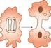

அலகு-1

உயிரிகளின்‌

11... இனப்வருக்கமுறைகள்‌. 1.2... பாலிவிஇனப்வருக்கம்‌ 1.2. பாவினப்வருக்கம்‌

(ஜே கற்றலின்‌ நோக்கங்கள்‌.

9: உயிர்களில்‌ பாலிலி இனப்வருக்க:

முறைகளைக்‌ கற்றல்‌ ண்ண முக்கியத்துவத்சை (தக ஸி்துணர்கல்‌. பபப 9 பல்வேறு. பாவினப்வருக்க \[35520717) முறைகளை சறது

கொள்ளுதல்‌. 9 பாலினப்வருக்கத்கின்‌.

பககக

உணர்தல்‌...

மிரினங்களிவ்‌ வாழ்க்கை சுழற்சியில்‌

பிறப்பு, வளர்ச்சி... முதிர்ச்சி, 'இனப்பெருக்கம்பற்றும்‌ இறப்பு ஆகியநிகறிவுகள்‌ காணப்படுகின்றன. இனப்பெருக்கம்‌ என்பது. அனைத்து... உயிரினங்களின்‌... அடிப்படை பண்பாகும்‌. இந்த உயிரியல்‌ நிகழ்வின்‌ மூலம்‌. உயிரிகள்‌ தங்கன்‌ சேம்களை உருவாக்குகின்றன. இச்சேம்‌ உயிரிகள்‌ வளர்ந்து முதிர்ச்சியடைந்த. பில்‌ இனப்பெருக்க நிகழ்வை தொடர்கின்றன. இவ்வாறாக, இனப்பெருக்கத்தினால்‌ சிற்றினத்‌.

இனப்பெருக்கம்‌

தொடர்ச்சி ஏற்படுவதுடவ்‌ உயிரினங்களினூடே மாறுபாடுகளும்‌. தோன்றுகின்றன... இந்த மாறுபாடுகள்‌ உயிரிவங்களின்‌ தகவமைப்பு. மற்றும்‌ பரிணாமத்திற்கு அத்தியாவசியமானவை. அகும்‌.

3.1 இனப்பெருக்க முறைகள்‌

அனைத்து இனப்பெருக்க முறைகளிலும்‌, டி.என்‌.ஏ இரட்டிப்பாதல்‌ ஆர்‌.என்‌.ஏ உற்பத்தி பரத. உற்பத்தி, செல்‌. பிரிதல்‌, வளர்ச்சி “இனப்பெருக்க அலகுகள்‌ உருவாக்கம்‌, அவை "இணைத்து, கருவுறுதல்‌ நடைபெற்று புதிய சேம்‌: உயிரிகள்‌ உருவாதல்‌ போன்ற அடிப்படைப்‌ பண்புகள்‌ காணப்படுகின்றன. உயிரினங்கள்‌, பாலிலி மற்றும்‌ பாலிவப்பெருக்கம்‌ எனும்‌ இரு. பெரும்‌... இனப்பெருக்க... முறைகளை மேற்கொள்கின்றன. தனியொரு பெற்றோரால்‌. 'இனச்செல்‌ உருவாக்கம்‌. இன்றி நடைபெறும்‌. "இனப்பெருக்கம்‌ பாலிலி இனப்பெருக்கம்‌(4ட௦ ஈவிவஸி எனப்படும்‌... இதன்‌. வழி உற்பத்தியாகும்‌... சேம்‌. உயிரினங்கள்‌ மரபொத்தனவாக இருக்கும்‌. உடல்‌ செல்களில்‌. நேரடி செல்பகுப்பு கேர்ஷ9) அல்லது மறைமூகச்‌ செல்‌. பகுப்பு. (டிஸ்‌. முறைகளில்‌. நடைபெறுவதால்‌ இது உடலால்‌ தோன்றும்‌. இனப்பெருக்கம்‌... கோஷ்‌). அல்லது. கருக்கோளத்தால்‌ தோன்றும்‌ இனப்பெருக்கம்‌.

(ரிவி. என்று... அழைக்கப்படுகி்றது. "இனப்பெருக்க செயலில்‌ இரு பெற்றோர்‌ (ஆண்‌, பெண்‌) ஈடுபட்டு இரண்டு வகை இனச்செல்கள்‌ இணைந்து. நடைபெறும்‌ இனப்பெருக்கம்‌

பாவினப்பெருக்கம்‌ (ப்‌ பூவியல்ல எனப்படும்‌.

1 பவம்‌ கவும்‌,
ஹவராடுஞ்௦9ட/

3.2 பாலிலி இனப்பெருக்கம்‌:

பரவலாக பல்வேறு உயிரினங்களில்‌ பாலிலி. 'இவட்பெருக்கம்‌ நடைபெறுகின்றது. பொதுவாக: புரோட்டிஸ்டா, பாக்சரியா, ஆர்கீகியா மற்றும்‌. எனியகட்டமைப்புகொண்டபவசெல்‌உவிரிகளில்‌. பாலிலி இனப்பெருக்கம்‌ காணப்படுகின்றது. இதன்‌ மூலம்‌ தோன்றும்‌ சேம்‌ உயிரிகள்‌, மரபு மாறுபாடுகள்‌ இன்றி "ஒற்றை பெற்றோர்‌ மறபும்‌. பண்புகளைக்‌" கொண்டிருக்கின்றன. மினவுறுதல்‌. (8/ஸலி. மூகிற்தல்‌ (வசர) 'துண்டாதல்‌ (ஷி மற்றும்‌ இழப்பு மீட்டல்‌ (ஷணலஸ. ஆகிய பல்வேறு. பாலிலி. இவட்பெருக்க முறைகள்‌ விலங்குகளில்‌. காணப்படுகின்றன.

மினவுறுதல்‌முறையில்பெற்றோர்‌ உடலானது. இரண்டு அல்லது. அதற்கும்‌. அதிகமான: அமைய்பொத்த சேல்‌ உயிரிகளாகப்‌ பிரிகில்றன. 'இருசமப்பிளவு (8௭ ஸல) முறை, பல பிளவு. முறை பப்டி ரஷ்கி, ஸ்போரிகன்‌ உருவாக்கம்‌. ௫ணளிஸி ஸ்ட்ரோபிலா ஆக்கம்‌ (ரன்ிஎ்ம. மற்றும்‌ பீனாஸ்மோடோமி (ணைன) ஆகிய ந்து. வகை பிளவுறுதல்‌ விலங்குகளில்‌. காணப்படுகின்றன.

'இருசமப்பிளவு முறையில்‌ பெற்றோர்‌ உயிரி இரு சம பகுதிகளாகப்‌ பிரிந்து ஒவ்வொரு, பகுதியும்‌ ஒரு சேய்‌ உமிரியாக மாற்றமடைகிறது. முதலில்‌ உட்கருவானது. நேர்முக அல்லது, மறைமுகப்பிரிவின்‌. மூலம்‌ பிரிவடைகிறது. (சரவ) (கேரியோகைனெசிஸ்‌). இதன்‌ தொடர்ச்சியாக சைட்டோபிளாசம்‌ பிரிவடைகிறது. (0ோவிலஸ்‌) (சைட்டோகைனெசிஸ்‌). இவ்விதம்‌: உருவாகும்‌ செய்‌ உயிரிகள்‌ மரபியல்‌ ரீதியாக. பெற்றோலை ஒத்திருக்கின்றல. பிளவு மட்டத்தைப்‌. பொறுத்து இரு சமபிளவு முறையானது.

௮) எனிய ஒழுங்கற்ற இருசமபிளவு. முழை: பவம்‌ ஸா நவர நஸ்ல

கிடைமட்ட. இருசமமிளவு.. முறை: ரணவைர்கர மிஸ்டு இரீனமட்ட.. இருசமமிஎவு... முறை

(ஷ்யவ நவர நஸ்லி

6-இநிற

ஏ சாய்வுமட்ட இருசமபிளவு முறை (04௨

ிஸ்டி என வகைப்படுத்தப்படுகின்றன. எளிய ஒழுங்கற்ற இருசமபிளவு முறை (கறம மடயம நிவா ரிஸ்‌)

இவ்வகை பிளவறுதல்‌ அமீபா போன்ற ஒழுங்கற்ற. வடிவமுடைய உமிரிகளில்‌. நடைபெறுகின்றது. (படம்‌ 1.0. இதில்‌ பிளவு, மட்டத்தை. கண்டறிதல்‌. கடினமானதாகும்‌. "இம்முறையில்‌ கருங்கு நுண்‌ குமிழ்‌ செயலிழப்து மைந்து. விடும்‌. உட்கருமணி மறைந்து உட்கருவானது... மறைமுகப்பிரிவு. முறையில்‌ பிளவுபடும்‌. பின்னர்‌, செல்லில்‌ நடுவில்‌ சருக்கம்‌ ஏற்பட்டு சைட்டோபிளாசம்‌ பிரிந்து இரு சேம்‌ செல்கள்‌ தோன்றுகின்றன.

கிடைமட்ட இருசமளவுமுறை முறையில்‌ பிளவு மப்டம்‌ உயிரியின்‌ கிடைமட்ட அச்சில்‌ ஏற்படுகின்றது. ௭.௧௭. பரியம்‌. மற்றும்‌. பிளனேரியா. பாரமீசியத்தில்‌ (படம்‌ (2) பெரிய உட்கரு நேர்முகப்‌ பிரிவு முறையிலும்‌ சிறிய உட்கரு. மறைமுகப்பிரிவு.... முறையிலும்‌. பிரிவடைகின்றன.

நீன்மட்ட இருசமபிளவு முறையில்‌ உட்கரு மற்றும்‌ சைட்டோபினாசம்‌ உயிரியின்‌ நீள்‌ அச்சில்‌. 'பிரிவடைகின்றது (படம்‌ 1.) நீளிழை உமிரிகளில்‌. பிளவின்போது நீளிழையாளது. ஒரு சேம்‌: செல்லில்‌ தக்க வைக்கப்படுகில்றது. அபுப்படைத்‌. துகள்‌ இரண்டாகப்‌... பிரிகிறது. புதிய அடிப்படைத்துகள்‌ மற்றொரு சேம்‌ செல்லின்‌: நீளிழையைத்‌. தோற்றுவிக்கின்றது.... எகா: வொ௱ரிடிசெல்லரமற்றும்‌ மக்ளினா.

சாய்வுமட்ட. இருசமமிளவு... முறையில்‌ மிளவுமட்டம்‌... சாய்வாக. அமைகின்றது. டைனோஃபிளாதெல்லேட்டுகளில்‌ இவ்வகைப்‌: 'பிளவுறுதல்‌ காணப்படுகிறது. எ.கா; செராவியம்‌

'பலபிளவு முறையில்பெற்றோரின்‌ உடஸ்‌.ஒத்த அமைப்புடைய பல. சேம்‌. உயிரிகளாக. பமிரிவடைகின்றது.உட்கருதொடர்ந்துபிரிவடைந்து, யல. பகி உருவாகின்றன. பின்னர்‌

படம்‌ ப அபபோனில்‌ நடைபெறும்‌ எனிய ஒழுங்கற்ற இரு சமப்பிவு

கவத தலவ்ருதல்‌ 2

1\]

ஆ க்க

படம்‌ 12 பாரமீசியத்தில்‌ நடைபெறும்‌ கிடைமட்ட இருசமரிளவு முறை:

படம்‌ 1 துக்ினாவில்‌ நடைபெறும்‌ நீன்மட்ட இருசம பிளவு மூறை,

உட்கரு எண்ணிக்கைக்கு ஏற்ப சைட்போபிளாசம்‌. பல. பகுதிகளாகப்‌ பிரிவடைந்து, ஒவ்வொரு: சைட்போபிளாச பகுதியும்‌ ஒரு சேய்‌ உட்கருவைச்‌ சூழ்ந்து கொண்டு ஓர்‌ உளிரியாக மாறுகின்றது. “இதன்மூலம்‌ ஒற்றை பெற்றோர்‌ உளிரியிலிருந்து பல சிறிய சேம்‌ உ.ிரிகள்‌ தோன்றுகின்றன. பவபிளவுமுறையில்‌ சமமான செல்‌ பிரிவினால்‌. ஒரு உபிரியிலிருந்து நான்கு அல்லது பல சேம்‌: உயிரிகள்‌ தோன்றுகின்றன. மேலும்‌, பிளவுறுகல்‌. நிகழ்வு முழுமையடையும்‌ வரை சேய்‌ உயிரிகள்‌ பிரிவதில்லை. இத்தகு பிரிவிற்கு மன்மடி பகுப்பு

கவல்‌ வல. என்று. பெயர்‌, எகா: வோரிடிசெல்ல. சாதகமற்ற. குழலில்‌. (வெப்பநிலை,

அதிகரித்தல்‌ அல்லது குறைதல்‌ மற்றும்‌ உணவுத்‌

தட்டுப்பாடு. அங்ர. போலிக்கால்களை: உள்ளிழுத்துக்‌ கொண்டு தன்னைச்‌ சற்றி சைட்டில்‌ என்னும்‌ பொருளால்‌ ஆன மூன்று: அடுக்கு சிஸ்ட்‌ எனும்‌ பாதுகாப்பு உறையச்‌: கரந்து. அதனுள்‌ செயலற்று உறைகிறது. (மடம்‌ 14. இந்ரிகழ்வுக்கு 'உறையாக்கம்‌' (ணி என்று பெயர்‌. சாதகமான சுழல்‌. ஏற்படும்போது உறையிலுள்ள அமீபா பவபினவு. முறையில்‌ பகுப்படைந்து எண்ணற்ற சிறிய 'போலிக்காலிஸ்போர்கள்‌' அல்லத அமீபுலேவை உற்பத்திசெய்கில்றன.சிஸ்ட்‌ உறை நீரை உறிஞ்ச. சிதைவடைதல்‌, நுண்ணிய போலிக்கால்களைக்‌. கொண்ட. சேய்‌. போலிக்காலிஸ்போர்கள்‌ வெளிவருகில்றன.இவை உணவுண்டு துரிதமாக: வனர்நீது தனித்து செயற்படக்கூடிய வாழ்க்கை: முறையை மேற்கொள்கின்றன.ஹவராடுஞ்௦9ட/

'பவசெல்‌ உயிரிகள்‌ சிலவற்றில்‌ ஸ்ட்ரோபிலா ஆக்கம்‌ டரன்பள்ஸி எனும்‌ சிறப்பு வகை கிடைமட்டப்பிளவு நடைபெறுகின்றது (படம்‌ 1.) ஸ்ட்ரோபிலா ஆக்க நிகழ்வில்‌ பல கிடைமட்டப்‌ 'மிளவுகள்‌ ஒரே நேரத்தில்‌ நடைபெற்று தனித்துப்‌ பிரியாத... எண்ணற்ற... உமிரிகளை: உருவாக்குகின்றன... ௭௧௩. ஆரினியா, பல. உட்கருக்களைக்‌ கொண்ட பெற்றோர்‌ உயிரிமின்‌: உட்கருக்கள்‌ பிரிந்து பல உட்கருக்களைக்‌: கொண்ட சேய்‌ உயிரிகளை உருவாக்குதல்‌. மினாஸ்மோடோமி (ரண) எனப்படும்‌. மின்னார்‌. உட்கருக்கள்‌ பிளந்து இயல்பான: எண்ணிக்கையை... நிலைப்படுத்துகின்றன. தொலினா... மற்றும்‌. மிலோமிக்ஸா (இராட்சத. அமிராக்கள்‌). ஆகியவற்றில்‌. மிளாஸ்மோடோமி முறை காணப்படுகின்றது.

அமீபாக்கள்‌, சாதகமற்ற சூழ்நிலைகளில்‌: “ஸ்போர்‌ உருவாக்கம்‌" முறையில்‌ மேலுறையை உருவாக்காமல்‌. எண்ணிக்கையில்‌. பெருக்கமடைகின்றன.. உட்கரு பல. சிறு: 'துண்டுகளாகவோ அல்லது... குரோமட்டின்‌ தொகுப்புகளாகவோ உடைகிறது. பின்‌ஒவ்வொரு. 'துண்டைச்சுற்றிலும்‌உட்கருச்‌சவ்வு உருவாகிறது. அவை. பின்னர்‌ சைட்போபிளாசத்தினால்‌. குழப்பட்ட மின்‌ தம்மைச்சற்றிலும்‌ ஓர்‌ ஸ்போர்‌. உறையை உருவாக்குகிறது (டம்‌ 14. சுழ்நிலை. சாதகமாகும்போது பெற்றோர்‌ உடல்‌ சிதைந்து ஸ்போர்கள்‌ வெளியேற்றப்படுகின்றன. ஸ்போர்கள்‌ ஓவ்வொன்றிலிருந்தும்‌ ஒரு இளம்‌: அமீபா வெளிவருகின்றது.

த கக்ட்‌ மத வஸ்ம.

முகிற்தல்‌ (வே4்ஷ) முறையில்‌ பெற்றோர்‌ உமிரிகளின்‌ உடலில்‌ ஒன்று அல்லது. பல. மொட்டுகள்‌ தோன்றி ஒவ்வொன்றும்‌ ஒரு சேம்‌. உயிரி ஆகில்றது. பின்னர்‌ ஒவ்வொரு மொட்டும்‌ பெற்நோரை வட்டப்பிரிநது.... இயல்பான: வாழ்க்கையைத்‌ தொடர்கின்றது. எடுத்துக்காட்டாக கடற்‌ பஞ்சுகளில்‌ உருவாகும்‌. மொட்டுகளின்‌ அடிப்பகுதி குறுகி பெற்றோரை: விட்டப்‌ பிரிந்து புதிய உயிரியாகில்றது டம்‌ 17). பெற்றோர்‌... உடலின்‌. வெளிப்பகுதியில்‌ மொட்டுகள்‌ உருவானால்‌ அதற்கு புற மூகிழ்தல. மஷஸை பவரஷ என்று பெயர்‌. எகா: ஹைட்ரா.. 'ஹைட்ராவில்‌ உணவு அதிகம்‌ கிடைக்கும்போது புறப்படைசெல்கள்பெருகிஉடலில்மேற்பகுதியில்‌ ஒரு புடைப்பை உருவாக்குகின்றது (படம்‌ 14). புறப்படை மற்றும்‌ அகப்படை வெளிநோக்கி தள்ளப்பட்டு மொட்டு உருவாகின்றது. இந்த. மொட்டில்‌ பெற்றோர்‌ உயிரியின்‌ குடற்குழி தீண்டுள்ளது. மொட்டின்‌ துனியில்‌ வாயும்‌ மறும்‌. அதனைச்‌ சுற்றி உர்நீட்சிகளும்‌ வளர்கின்றன. முழுவதும்‌ வளர்ந்த பிறகு மொட்டின்‌ அடிப்பகுதி ருக்கி பெற்றோர்‌ உடலிலிருந்து பிரிந்து தனித்த வாழ்க்கையை மேற்கொள்கின்றது. நாக்குலூகா-வில்‌... நூற்றுக்கணக்கான பொட்டுகள்‌ சைட்டோபிளாசத்தினுள்‌ உருவாகி. பெத்நோர்‌ உடலினுள்ளேயே இருக்கும்‌. நிலை. ௮௧ முகிற்தல்‌ (ஸஷஷிஸை: (விஷ) எனப்படும்‌. தன்னீர்‌ பஞ்சகன்‌ மற்றும்‌ சில கடற்‌ பஞ்சுகளில்‌. ஜெம்ழூல்கள்‌ (கஸஸ்‌) என்னும்‌ உள்ளமை. பொட்டுகள்‌ உருவாக்கத்தின்‌ மூலம்‌ சீரான:

ஷமலிய வளை "யல.

(படம்‌ 1 ஆரிலியாவில்‌ நடைபெறும்‌ ஸ்ட்ரோபிலா ஆக்கம்‌.

பகவதி தலவ்ருதல்‌ ம.ஸ்வ வர

வ

படம்‌ (ச அமீயாவில்‌ நடைபெறும்‌ ஸ்போர்கள்‌ உருவாக்கம்‌

கஸ்‌ வரர்‌

பிடிரு

பம்பலகொலனிவவில்‌வடவேம்‌ முகிழ்தல்‌. மற்றும்‌ தவித்துவமான பாவிலி இனப்பெருக்கம்‌: நடைபெறுகின்றது. (டம்‌. 12). முழுவளர்ச்சி பெற்ற தெம்யூல்‌ உறுதியான பந்துபோல்ற. அமைப்புடையதாகும்‌. இதல்‌ உட்பகுதியில்‌ உணவுப்பொருள்தாவ்கியஆர்க்கியோசைட்டுகள்‌ காணப்படுகின்றன. சாதகமற்ற துழலில்பழஞ்சுகள்‌

சிதைந்தாலும்‌ ஜெம்துல்கள்‌ மிக பாதகமான: குழலையும்‌. தாங்கி நிலைத்திருக்கின்றல. சாதகமாவ தழல்‌ வரும்போது ஜெம்யூல்கள்‌: பொரித்து கடற்‌ பஞ்சுகள்‌ வெளிப்படுகின்றன.

படம்‌ 1சஸ்யாஞ்சுகளின்‌ ஜெம்முல்‌. 'துண்டாதல்‌ முறையில்‌ (ஷ்ஷ்‌ பெற்றோர்‌. உடலானது பலதுண்டுகளாகப்பிரிகின்றது.பிரிரத ஒவ்வொரு துண்டும்‌ புதிய உமிரியாக வளரும்‌ திறனுடையது. துண்டாதல்‌ அல்லது அடிப்பகுகி

117

படம்‌ 1ச ஹைட்ராவில்‌ நடைபெறும்‌ முகிற்த்தல்‌

தண்டாதல்‌ முறை இனப்பெருக்கம்‌ கடல்‌. சாமந்தியின்‌பலபேரினங்களில்நடைபெறுகின்றது. பாதத்தட்டுகளின்‌.. அடிப்பகுதியில்‌ ஏற்படும்‌ ப ல பிரிந்த... கதுப்புகள்‌: ஒவ்வொன்றிலும்‌ குடல்‌ தாங்கிகளும்‌ ((/-வக்‌) உணர்கொம்புகளும்‌ (ரவி வளர்ந்து புதிய கடற்சாமந்திகள்‌ உருவாகின்றன.

நாடாப்புழுக்களில்‌(னியரசோனியம்‌)(7மஸ்‌. வங்டி. வயதான. பழுத்த... கண்டங்கள்‌ உடற்பகுதியாலஸ்ட்ரோபிலாவின்பின்முனையில்‌ உள்ளளை.இத்தகுபழுத்தகண்டங்கள்‌ தனியாகவோ அல்லது. தொகுப்பாகவோ உடலில்‌ இருந்து மிியும்‌ செயலுக்கு "அபோலைசிஸ்‌" (தற்சிதைவு)) (மூஷிஸ யடம்‌ 409) என்று பெயர்‌, இதன்‌ மூலம்‌. வளர்ந்த கருவானது முதல்‌ நிலை விருந்தோம்பி. (மனிதன்‌) மிடமிருந்து. இரண்டாம்‌. நிலை. விருந்தோம்மி(பன்றியைஅடைவதால்‌இந்நிகழ்வு மிகவும்‌ முக்கியத்துவம்‌ வாய்ந்ததாகும்‌. காயமடைந்த உடல்‌ பகுதியிலிருந்து உடல்‌ பாகங்கள்‌. (அல்லது) திசுக்கள்‌. மறுவளர்ச்சி. அடைவது 'இழம்பு மீட்டல்‌ (ஷேஷஸ்லி எனப்படும்‌. முலல்‌.. ஆபிரகாம்‌... ஒிரம்ப்னி.. என்னும்‌ அறிவியலாளர்‌ ஷைட்ராவில்‌ "இழப்பு மடல்‌"

ந பவம்‌ கவும்‌,
ஹவராடுஞ்௦9ட/

படம்‌ 11 நாடாப்புழுவில்‌ நடைபெறும்‌ தற்சிதைவு

குறித்து முதன்‌ முதலில்‌ ஆய்வு மேற்கொண்டார்‌. இழப்பு மீட்டல்‌ இருவகைப்படும்‌. அவை, 'மூழு: உருவ மீட்புக்கு) மற்றும்‌. "உறுப்பு மீட்பு/ரோகரங்லி ஆகும்‌... முழுஉருவ மீட்பில்‌. உடலின்‌ ஒரு சிறிய தண்டுப்பகுதியிலிருந்து முழு உடலும்‌ மீண்டும்‌ வளர்கிறது. எகா, ஹைட்ரா. மறறும்‌. மிளணேரியா.... ஹப்ராவை. பல: துண்டுகளாக வெப்டுனால்‌ ஒவ்வொரு துண்டும்‌ தனது இழந்த பகுதிகளை வளரச்‌ செய்து ஒரு: முழுமையான யுதிய ஹைட்ராவை. உருவாக்குகின்றது. (படம்‌1.11). இந்த இழப்பு: (மிடலில்‌உறுப்புகள்தங்களதுதுருவத்தன்மையைத்‌. தக்க வைத்தும்‌ கொள்கின்றன. வாம்முனை: (மவ கடி உணர்‌ நீட்சிகளையும்‌ ஜவக வாம்‌. எதிர்முனை (லி ஊர) அடித்தட்டுகளையும்‌. உருவாக்கிக்கொன்கின்ற. உறுப்பமிபபு என்பது, இழந்த உடல்‌ உறுப்புகளை மட்டும்‌ மீண்டும்‌ உருவாக்கிக்‌ கொள்ளும்‌ திறன்‌ ஆகும்‌, இது இரு: "வகைப்படும்‌. அவை 'சீராக்கல்‌' (மாண்டி மற்றும்‌. மீண்டும்‌ உருவாக்குதல்‌! (மஸண்டி வகையான இழப்பும்ட்டல்களாகும்‌ீராக்கல்‌இழப்புமிட்டலில்‌ பெடவில்‌ சேதமுற்ற சில வகையான திசக்கள்‌ மட்டும்‌ சரி செய்யப்படுகின்றன எ.கா. மனிதன்‌. மீண்டும்‌ கருவாக்குதல்‌ என்பது உடல்‌ இழந்த அல்லது வெட்டுண்ட பகுதியை முழுமையாக. உருவாக்கும்‌. திறனாகும்‌ எகா. நட்சத்திர மீன்‌ மற்றும்‌ சுவர்ப்பல்லிஇழந்தவால்யடம்‌122.

அவக தலவ்ருதல்‌ 6

11 ப்பட பர

படம்‌ 11 ஹைட்ராவில்‌ இழப்பு மீட்டல்‌.

338

படம்‌ நட்சத்திர மீனில்‌ நடையும்‌ மீண்டும்‌ “ உருவாக்ககல்‌வகையான ழப்புமட்ட்‌.

| இழப்பு மீட்டல்திறன்‌

த £3 தைக்கப்பட்ட கடற்பஞ்சிலை

2 ஒருமெல்லியபட்டுத்தணி௰ின்‌

ஈகபிழிந்தால்கிடைக்கும்‌

| செல்தொகுப்ு மீண்டும்‌ புதிய முழுமையான. பற்பஞ்சகளாக . உருவாக

*   இயலும்‌, இத்தொழில்‌ நுட்பம்‌ செயற்கை முறை ''கடற்பஞ்ச வளர்ப்பில்‌ பயன்படததப்படுகிது.

1 பாலினப்பெருக்கம்‌

ஆண்‌. மற்றும்‌. பெண்‌ இனச்செல்கள்‌. இணைவுற்று: இரும கருமுட்டையை மல்‌ ஆணி. உருவாக்கி அதிலிருந்து. ஒரு புதிய பமிரியைத்‌ தோற்றுவிக்கும்‌. முறையே பாலினப்பெருக்கம்‌ ஆகும்‌. இதல்மூலம்‌. மரபியல்‌ வேறுபாடுகள்‌ உருவாகின்றன. 'ஒருங்கிலணவு' (ஷண? மற்றும்‌'இணைவு முறை இனப்பெருக்கம்‌! (பஸ்ம... என்னும்‌. இருமுழைகளில்‌.. பாலினப்‌. பெருக்கம்‌. நடைபெறுகிறது. ஒருங்கிணைவு முறையில்‌, இர. ஒற்றை மய இனச்செல்கள்‌ (நரி தண.

ஹவராடுஞ்௦9ட/

ஒன்றிணைந்து. இரட்டைமய கருமுட்டை மலிவு உருவாக்கப்படுகிறது.கருவறுதலின்‌' நிகழ்விடத்தைப்‌ பொறுத்து ஒருங்கிணைவு முறை: “இரண்டு வகையாகப்‌ மிரிக்கப்பட்டுள்ளது. பெண்‌: உமிரியின்‌ உடலுக்கு வெளியில்‌, ஆண்‌, பெண்‌: இனச்மெல்கள்‌ இணைந்தால்‌ குறிப்பாக அவை: வாழும்‌ நீர வாழிடத்தில்‌ நிகழ்ந்தால்‌ அவ்வகைக்‌. கருவுறுதல்‌ வெளிக்கருவறுதல்‌ (8யவர்‌ சணமிவஷி எனப்படும்‌. ௭௮௩ கடற்பல்ககள்‌, மீன்கள்‌ மற்றும்‌ இருவாழ்விகன்‌. ஆண்‌, பெண்‌: இனசமெல்களின்‌. இலணதலானது.. பெண்‌: உமிரியின்‌ உடலுக்குள்ளேயே நிகழ்ந்தால்‌. அவ்வலைக்‌ கருவுறுதல்‌ 'உட்கருவுறுதல்‌' \[கவர சணமிவஷ என அழைக்கப்படும்‌. எகா: ஊரிவன.. பறவைக்‌ மற்றும்‌ பாலூட்டிகள்‌.

கலிரிகளில்‌ பல்வேறு. வகையான: ஒருங்கிணைவு கருவுறுதல்‌) நடைபெறுகிறது.

௮) தய கருவுறுதல்‌! (மடிஸி - ஒரு செல்லிலிருந்தோ௮ல்லது ஒரே யிரிமிலிருக்தோ உருவாகின்ற ஆண்‌ மற்றும்‌ பெண்‌ இவ செல்கள்‌ 'இணைக்து கருமுட்டையை உருவாக்குகின்றன. ஏகா ஆப்டினோஸ்பேரியம்‌ மற்றும்‌ பாரமீதியம்‌,

௮) அயல்‌ கருவுறுதல்‌ (ஷண - ஆண்‌ மற்றும்‌ பெண்‌ என்னும்‌ இரு தனித்தனி பெற்றோர்களிலிருந்து உருவாகின்ற ஆண்‌ மற்றும்‌ பெண்‌ இனச்செல்கள்‌ ஒன்றிணைந்து கருமுட்டை உருவாகிறது. எனவே, இது இரு பெற்றோர்‌. வகையானது. எகா: மனிதனில்‌ ஆண்‌ பெண்‌: என்னும்‌ இருதனித்தனி உயிரிகள்‌ காணப்படுதல்‌, (டயோஷியஸ்‌ அல்லது ஒரு பால்‌-உயிறி(06வஸ- எப்வணயி.

இ) 'முழுசேர்க்லக்‌ (ஷண?) - கீழ்நிலை உமிரிகளில்‌, சிலசமயங்களில்‌ முதிர்ந்த உயிரிகள்‌ 'இனசிமெல்களை உருவாக்காமல்‌, அவ்வயிரிகளே இனச்‌: செல்கள்‌. போன்று செயல்பட்டு ஒன்றிணைந்து... புதிய. உயிரிகளைத்‌: தோற்றுவிக்கின்றன.. இது 'முழுச்சேர்க்கை'

எனப்படும்‌. ௭.௧௩... ஒரைக்கோதில்யா. ரவணன்‌.

இ. இளம்‌ செல்‌ சேர்க்கை (ட்டன? - முதிர்ந்த... பெற்றோர்‌. செல்லிலிருந்து

மழைமுகப்பிரிவு மூலம்‌ உருவாகும்‌ இரு இனம்‌: சேம்‌. செல்கள்‌. இனச்செல்கள்‌ போன்று,

செயல்பட்டு ஒன்றிணைந்து புதிய உமிரியைத்‌ தோற்றுவிக்கும்‌ செயல்‌ 'இளம்‌ செல்‌ சேர்க்கை" எனப்படும்‌. எகா. ஆக்டுனோபிரிஸ்‌ட

௨) மாறுபட்ட செல்சேர்க்கை (/ஈஷன) - அமைப்பில்‌ மாறுபட்ட இரு சிறிய இனச்செல்கள்‌. ஒன்றிணையும்‌ முறை 'மாறுபட்ட செல்சேர்க்கை' ப்படும்‌. எக. புரோட்டோசோவா,

௯) ஒத்த செல்‌ சேர்க்கை (1 ஷர - அமைப்பிலும்‌ செயலிலும்‌ ஒரே மாதிரியான இரு: இனச்செல்கள்‌. ஒன்றிணைதல்‌ "ஓத்த செல்‌. சேர்க்கை' எனப்படும்‌. எ.கா. மோனோசிஸ்டிஸ்‌.

ஸி வேறுபட்ட செல்‌ சேர்க்கை! (ஸ்ஷணா? (0 4௭ ஈர்ம்ண ஷம்‌ எணாராங்‌ள - முற்றிலும்‌ வேறுபட்ட இரு இனச்‌ செல்கள்‌ ஒன்றிணையும்‌. முறை "வேறுபட்ட செல்‌ சேர்க்கை! (ஸ்ஷனா? எனப்படும்‌. இவ்வகைக்‌ கருவுறுதல்‌ உயர்வகை

விலங்குகணில்‌ நடைபெறுகிறது... ஆனால்‌, அவ்விலக்குகளில்‌ வேறுபட்ட. செல்‌ செர்க்கை!பவ்ஷை? "ஒருங்கிணைவு! (ஸா?

போன்ற வார்த்தைகளை விட கருவுறுதல்‌. (மினி என்னும்‌ வார்த்தைப்‌ பயன்பாடே

நடைமுறையில்‌ உள்ளது. ௭௬௩... உயந்நிலை. முதுகெலும்பற்றவை மற்றும்‌ அனைத்து, முதுகெலும்பிகள்‌.

'இணைவு முறை இனப்பெருக்கம்‌! (ரஷ, என்னும்‌ முறையில்‌ ஒரே சிற்றினத்தைச்‌ சார்க். இரு உமிரிகள்‌ தற்காலிகமாக இணைதல்‌. நடைபெறுகிறது. இல்விணைதலில்‌ ஈடுபடும்‌. உயிரிகள்‌ இணைவிகள்‌ (ரஷ) என்று, அழைக்கப்படுகின்ற. அவை தங்களுக்கிடையே. குறிப்பிட்ட அளவு உட்கரு பொருட்களை (034) பரிமாறிக்‌ கொண்ட பின்‌ தனித்தனியாகப்‌. பிரிகின்றன. பொதுவாக குறு இழைஉயிரிகளில்‌, 'இணைவுமுறைஇனப்பெருக்கம்காணப்படுகிறது. ௭.௧௩. பாரமீசியம்‌, வோர்ட்டிசெல்லா மற்றும்‌. பாக்மரியா (புரோகேரியோட்டுகள்‌). வாழ்க்கைச்‌ சுழற்சியின்‌ நிலைகள்‌: உயிரிகள்‌ தங்கள்‌ வாழ்க்கை சுழற்சியில்‌ மூன்று நிலைகளைக்‌ (7மஷ) கொண்டுள்ளன. அவை. இளம்‌ உயிரிதிலை' / 'வளராக்க நிலை' (ரணி: ரிம்னிஷள்ட ரிஸ்‌, "இனப்பெருக்க நிலை! / "முதிர்ச்சி நிலை! ராவிவ்டரமவ! மணா. மற்றும்‌ முதுமை நிலை (ஜே ரல, ஒரு உயிரியின்‌ பிறப்ிற்ும்‌

ர பவம்‌ கன்வேுமம்‌,ஹவராடுஞ்௦9ட/

இனப்பெருக்க... முதிரச்சிக்கும்‌ இடைப்பட்ட வளர்ச்சிக்காலம்‌ இளம்‌ உயிரி நிலை' எனப்படும்‌. ஒரு உமிரியானது இனப்பெருக்கம்‌ செய்து வழித்‌. தோன்றல்களை உருவாக்கும்‌ செயல்களைச்‌ செய்யும்‌ காலம்‌ இனப்பெருக்க நிலை ஆகும்‌. இனச்சேர்க்கையுறும்‌. காலத்தைப்‌ பொறுக்து. விலக்குகள்‌ இரு வகையாகப்‌ பிரிக்கப்படு அவை, பருவகால இனச்சேர்ச்கையாளர்கள்‌' ஸை ஈர மற்றும்‌. தொடர்ச்சியான: இனச்சேர்க்கையாளர்கள்‌' (வடை விர. ஒரு ஆண்டின்‌ குறிப்பிட்ட காலத்தில்‌ மட்டும்‌ இனச்செர்க்கையில்‌ ஈடுபடும்‌ உயிரிகள்‌ 'பருவ: கால இனச்சேர்க்கையாளர்கள்‌' எனப்படும்‌. எ.கா: தவளைகள்‌ ,பல்லிகன்‌ பெரும்பாலானபறவைகள்‌, மான்கள்‌ போன்றவை. பால்‌ முதிர்ச்சிக்‌ காலம்‌. முழுவதும்‌. இனசசேர்க்கையில்‌. ஈடுபடும்‌. அயிரிகள்‌... தொடர்ச்சியான... இண்‌ செர்க்கையாளர்கள்‌' ஆகும்‌. ௭. ௧௭ தேனீக்கள்‌, வளர்ப்புப்‌ பறவைகள்‌, முயல்கள்‌ போல்றவை. இனப்பெருக்க நிலை முடியும்‌ காலத்தில்‌ ஒரு: அயிரியின்‌ உடல்‌ அமைப்பிலும்‌. செயல்பாடுகளிலும்‌ சிதைவு ஏற்படத்‌ தொடங்கும்‌. இலை முதுமை நிலை ர \[4-9 எனப்படும்‌. கன்னி இனப்பெருக்கம்‌ (7௮நனடுனன?), பட அடா)

அண்ட செல்லாது, கருவுறாமவேயே முழு உமிரியாக வளர்ச்சி அடையும்‌ செயலுக்கு "கன்னி இனப்பெருக்கம்‌! என்று பெயர்‌. இது, ல்‌. சாரிலஸ்‌ பானட்‌ என்பவரால்‌ முதன்‌ முதலில்‌. கண்பறிப்பப்டது. கன்னி இனப்பெருக்கம்‌. "இருவகைப்படும்‌. அவை, இயற்கையான கன்னி: இனப்பெருக்கம்‌ (மால்‌ நாம்ஷனை?) மற்றும்‌. செயற்கையானக்‌ கன்னி இனப்பெருக்கம்‌ (பார்ப்‌ சேக்கைனை, சில விலங்குகளின்‌ வாழ்க்கை: ழற்சியில்கன்னிஇனப்பெருக்கம்தொடர்ச்சியாக, நிலையாகமற்றும்‌ இயற்கையாக நடைபெறுகிறது. (இது இயற்கையான கன்னி இனப்பெருக்கம்‌: எனப்படும்‌.

இயற்கையான கன்னி இனப்பெருக்கத்தை இரு வகைகளாகப்‌ பிரிக்கலாம்‌... அவை, "முழுமையான (ஷே மற்றும்‌ "முழுமையற்ற (ம்லரிகலி கன்னி இனப்பெருக்கம்‌ ஆகும்‌, சில. விலங்குகளில்‌, இரு பெற்றோர்களால்‌ நிகழும்‌. பாலிவப்பெருக்கம்‌நடைபெறுவதில்லை.மாறாக, அவை முழுமையான சன்னி இனப்பெருக்கம்‌. மூலம்‌ மட்டுமே இனப்பெருக்கம்‌ செய்கின்றன.

அவக தலவ்ருதல்‌ 8

இவ்விலங்குகளில்‌.. ஆண்‌... உயிரிகளே. காணப்படுவதில்லை, பெண்‌ உயிரிகள்‌ மட்டுமே. உள்ளவ. முழுமையற்ற கன்னி இனப்பெருக்கம்‌ நடைபெறும்‌ சில விலங்குகளில்‌, பாலினப்‌: பெருக்கம்‌ மற்றும்‌ கன்னி இனப்பெருக்கம்‌: இரண்டுமே. நடைபெறுகின்றன... எகா: தேனீக்களில்‌, கருவுற்ற முட்டை இராணித்‌: 'தேனீயாகவும்‌ வேலைக்காரத்‌ தேனீக்களாகவும்‌: 'வனர்சீசியுறுமின்றன.அதேவேளையில்‌.கருவுறாத: முட்டைகள்‌. ஆண்‌ தேனிக்களாக: வளர்சீசியடைகின்றன. 'இளம்‌ உ௰ிரி கன்னி. இனப்பெருக்கத்தில்‌' (8வ்ஷானிம ஜனம்‌ மல்லல்‌). இளவுயிரியே (௯) கன்னி 'இனப்பெருக்கத்தின்‌ மூலம்‌. புதிய தலைமுறை இனவுமிரிகளை உருவாக்குகிறது. கல்லில்‌. புழுவில்‌.. ஸ்போரோசிஸ்ட்டுகள்‌. மற்றும்‌ ரீடியா... லார்வாக்கள்‌. இவ்வகையில்‌. இனப்பெருக்கம்‌ செய்கின்றன. சிலவகைப்‌: பூச்சிகளின்‌... வார்வாக்களிலும்‌.. இது நடைபெறுகிறது. எகா, மொழுக்கு ௪ (61 83. செயற்கை சன்னி இவப்பெருக்கத்தில்‌ கருவுறாத: அண்டம்‌ இயற்பிய அல்லது வேதிய தூண்டல்கள்‌

மூலம்‌ தூண்டப்பட்டு முழு உமிரியாக வனர்சீசியடைகின்றன. எகா: வனை தசை புழுக்கள்‌ மற்றும்‌ கடல்‌ அரச்சின்‌..

கன்னி.

| 2 இயற்கையான | ௫ இனப்பெருக்கம்பலவகைப்படும. னி ௮) அர்ரினோடோகி (கார்ல்‌?)

| இவ்வகைக்‌ என்னி

இனப்பெருக்கத்தில்‌... ஆண்‌ 1 வறிரிகன்‌ மட்டுமே உருவாக்கப்படுகின்றன. ௭. கதேனியள்‌ | 1 அ தெலிபோமி (ரஷாஸ்‌ரு இவ்வகைக்‌ சன்னி 'இனப்பெருக்கத்தில்‌பெண்‌ உயிரிகள்‌ மட்டுமே. | உருவாக்கப்படுகின்றன.எ.கா.சொலனோபியா இ: ஆம்ஃபிபோகி (கர்ம இவ்வகைக்‌ கன்னி இனப்பெருக்கத்தில்‌ அண்ட செல்‌ 1 வளர்ச்சியுற்று ஆண்‌அல்லதுபெண்‌2யிரியாக | உருவாகின்றது எ.க..எயிஸ்‌. பாடச்சுருக்கம்‌. £ரிகள்‌ தங்களைப்போன்றே மற்றொரு உளிரியை உருவாக்கும்‌ இனவிருத்தி நிகழ்ச்சி 'இனப்பெருக்கம்‌ஆகும்‌.பாலிவி இனப்பெருக்கம்‌. மற்றும்‌... பாலினப்‌. பெருக்கம்‌. எனஹவராடுஞ்௦9ட/

இனப்பெருக்கத்தை இரு பெரும்‌ வகைகளாகப்‌: பிரிக்கலாம்‌. இனச்செல்கள்‌ உருவாக்கம்‌ மறறும்‌. வை. இணைதல்‌ போன்ற... நிகழ்ச்சிகள்‌ பாலினப்பெருக்கத்தில்‌ மட்டுமே நடைபெறுகிறது. பாலிலா. இனப்பெருக்கத்தில்‌. இங்விதம்‌. நிகழ்வதில்லை. .... பிளவறுதல்‌, முகிறத்தல்‌, 'துண்டாதல்‌, இழப்பு மீட்டல்‌ போன்ற முறைகளில்‌. பாலிலா இனப்பெருக்கம்‌ நிகழ்கிறது. பிளவறுதல்‌. நிகழ்ச்சியானது. இரு சமப்பிளவுமுறை, பல. பிளவுமுறை,ஸ்போர்‌ உருவாக்கம்‌, ஸ்ட்ரோபிலா உருவாக்கம்‌... போன்ற. பிரிவுகளாகப்‌ மிரிககப்பட்டுள்ளது. பிளவுறுதல்‌ நடைபெறும்‌. தனத்தைப்‌ பொறுத்து பல. வகையான இரு: பமிளவுறுதல்‌ காணப்படுகிறது. அவையாவன. எனிய. ஒழுக்கற்ற இருசமப்‌ பிளவுமுழை: கிடைமட்ட இரு சமபிளவு முறை, தீளவாட்டு இரு. சமமிளவு முறை மற்றும்‌ சாய்வு மட்ட இரு: சமப்பிளவு முறை. பல பிளவு முறை என்பது தாம்‌ செல்லானது. ஒரே நேரத்தில்‌ பல சிறிய சேம்‌: செல்களாகப்‌ பிரியும்‌ நிகழ்ச்சியாகும்‌. பாலிலி. 'இனப்பெருக்கத்தின்‌ மற்றொரு முறை முகி்த்தல. ஆகும்‌. பெற்றோரின்‌ உடலத்தில்‌ ஒன்று அல்லது: அதர்குமேற்பட்டமொட்டுகள்‌ தோல்றிஓவ்வொரு: ொட்டும்‌ஒருஇனம்‌உமிரியாகவளர்ச்சியடைந்து. பின்பு. உடலத்தில்‌ இருந்து தனித்துப்‌ பிரிந்து இயல்பான வாழ்க்கையை மேற்கொள்கின்றன. பெற்றோர்‌. உடலத்தின்‌ மேற்பரப்பில்‌ பல. மொட்டுகள்‌ தோல்றினால்‌ அது 'புற முகிழ்ததல்‌' என்றும்‌ பெற்றோர்‌ உடல்‌ செல்களின்‌: சைட்போயிளாசத்தில்‌.. பல... மொட்டுகள்‌ தோன்றிலால்‌ அது 'அ௧ முகிழ்த்தல்‌' என்றும்‌. அழைக்கப்படும்‌. 'துஸ்டாதல்‌' என்பது மற்றொரு: வகையானபாலிலிஇனப்பெருக்கம்‌ ஆகும்‌. இதில: பெற்றோர்‌ உடலானது. பல. துண்டுகளாக: உடைகிறது. இவ்வாறு உருவான ஓவ்வொரு: துண்டும்‌. ஒரு புதிய உமிரியை உருவாக்கும்‌ திறனைப்‌ பெற்றுள்ளது. இழப்பு மீட்டல்‌ என்பது: ஒருசிறு துண்டிலிருந்து முழுமையான உயிரியை: உருவாக்கும்‌ நிகழ்வாகும்‌. இது, ீராக்கல்‌ வகை: இழப்பு மீட்டல்‌ மற்றும்‌ மீண்டும்‌ உருவாக்குதல்‌. வகை இழப்பு மீட்டல்‌ என இரு வகைப்படும்‌ விலங்குகளில்பலவகையானபானினப்பெருக்க முழைகன்‌ காணப்படுகின்றன. ஒருங்கிணைவு. முறையில்‌ இரண்டு ஒற்றைமய இனசசெல்கள்‌ ஒன்றிணைத்து ஒரு கருமுட்டை உருவாக்கப்படுகிறது.விலங்குகளில்கீற்க்காணும்‌. பல வகையான ஒருங்கிணைவு முறைகள்‌

நடைபெறுகின்றன. அவை தன்‌ கருவுறுதல்‌, அயல்‌. கருவுறுதல்‌, முழுச்சேர்க்கை,.. இளம்‌: செல்சேர்க்கை மாறுபட்ட செல்‌ சேர்க்கை, ஒத்த. ெல்சேர்க்கை வேறுபட்டசெல்‌ சேர்க்கை மற்றும்‌. இணைவு முறை இனப்பெருக்கம்‌ ஆகியவை. ஆகும்‌... கன்னி இவப்பெருக்கம்‌ எலியது' விலங்குகளில்‌ காணப்படும்‌ சிறப்பு வகையான: “இனப்பெருக்க முறை ஆகும்‌. இது இயற்கையான: கன்வி இனப்பெருக்கம்‌ மற்றும்‌ செயற்கையான. ன்வி இனப்பெருக்கம்‌ எவ இருவகைப்படும்‌

மதிப்பீடு. ஞ்‌ பளவ்வகைக்‌, கன்னி இனப்பெருக்கத்தில்‌ ஆண்‌: மயிர்கள்‌... மட்டுமே உருவாகின்றன ௮) அர்ரினோடோக்கி ஆதெலிபோக்கி இ;ஆம்‌பிபோக்க இ'அிமற்றும்‌'இ' இரண்டும்‌ 2 யாக்கரியாவில்பால்‌இனப்பெருக்கம்கழ்க்கண்ட எந்த முறையில்‌ நடைபெறுகிறது அற கேமிட்‌ உருவாக்கம்‌ ஆ என்போஸ்போரர உருவாக்கம்‌ இ) இலகைல்‌. இதஸ்போர்‌ உருவாக்கம்‌ எவ்வகை இனப்பெருக்கத்தில்‌ வேறுபாடுகள்‌ தோஸ்றும்‌. ௮) பாலிலி இனப்பெருக்கம்‌ கன்னி இனப்பெருக்கம்‌ இ)பாலினப் பெருக்கம்‌ ௫ 'அ'மற்றும்‌ க இரண்டும்‌ கூற்று மற்றும்‌ காரண வினாக்கள்‌: கிற்க்கண்ட வினாக்களில்‌ இரண்டு கூற்றுகள்‌ கொடுக்கப்பட்டுள்ளன... ஒன்று கூற்று (௯ ஆகும்‌. மற்றொன்று காரணம்‌ (கரி. சரியான விடையை கீ்க்காணும்‌ வகையில்‌ குறிப்பிடுக.

௮/கட மற்றும்‌ "கர இரண்டும்‌ சரியானால்‌ 'க' என்பது 'கடவில்‌ சரியான விளக்கம்‌ ஆகும்‌.

அகட மற்றும்‌ "கா" இரண்டும்‌ சரியானவை ஆனால்‌ "கா என்பது "கூட வின்‌ சரியான: விளக்கம்‌ இல்லை.

இ பகவன்‌ கலவருங்ம்‌

ஹவராடுஞ்௦9ட/

இ 'க'சரியானது ஆனால்‌ 'கா' தவறானது. ௫ மற்றும்‌! இரண்டும்‌ தவறானவை. கூற்று: தேனீக்களின்‌. சமூகத்தில்‌ ஆண்‌: தெனீக்களைத்‌ தவிர மற்ற அனைத்தும்‌ இருமயம்கொண்டவை! காரணம்‌: ஆண்‌. தேனிக்கள்‌. கன்வி இனப்பெருக்கம்‌... மூலம்‌. உற்பத்தி செய்யப்படுகின்றன. ர க. கூற்று: பாலிலா. இனப்பெருக்கம்‌. மூலம்‌. உருவாகும்‌. சேய்கள்‌ பெற்றோரை ஒத்த மரபியல்‌ பண்புகளைக்‌ கொண்டிருக்கும்‌. சரணம்‌: பாலிலா... இனப்பெருக்கத்தல்‌, மறைமுகப்பிரிவ மட்டுமே நடைபெறுகிறது. ௮ இடு ப எவ்வயிரினத்தில்‌ செல்‌ பிரிதலே இனப்பெருக்க: முறையாகச்‌ செயல்புரிகிறது? கபெண்‌ இனச்செல்‌ நேரடியாக வளர்ச்சியடைந்து சேயாக மாறும்‌ நிகழ்வின்‌ பெயரையும்‌ அது. நிகழும்‌ ஒரு பறவையின்‌ பெயரையும்‌. குறிப்பிடுக ச.கன்னி இனப்பெருக்கம்‌ என்றால்‌ என்ன? விலக்குகளிலிருந்து இரு எடுத்துக்காட்டுகள்‌ கரக

உ அவக தவ்ருகல, 10

&பாலிலி இனப்பெருக்கம்‌ (அல்லத) பாலினப்‌. பெருக்கம்‌ இவற்றுள்‌ எது மேம்பட்டது? ஏல்‌? இரு பிளவுறுதல்‌ முறைப்படி இனப்பெருக்கம்‌ செய்யும்‌ ஒரு செல்‌ உயிரிகள்‌ அழிவற்றவை.

நியாயப்படுத்த,

ம.யாலிலி.. இனப்பெருக்க. முறையில்‌ உருவாக்கப்படும்‌ சேய்கள்‌ ஏன்‌ 'ிரதி' (4-9. என்று அழைக்கப்படுகிறது?

படகாரணங்கள்‌ குறுக

அ) தேனீக்கள்‌. போன்ற உயிரிகள்‌ கன்னி. இனப்பெருக்க. விலங்குகள்‌ என்று. அழைக்கப்படுகின்றல..

அ ஆண்தேனீக்களில்‌ ச்குரோமோசோம்களும்‌ வெண்‌ தேனிக்களில்‌ ப்‌ 'குரோமோசோ்களும்‌ காணப்படுகின்றன.

1.  கிற்க்கண்டவற்றை வேறுபடுத்துக. ௮வெளிக்ருவுறுதல்‌ மற்றும்‌ உட்கருவறுதல்‌. அபல்லிமற்றும்பிளனேரியாவில்காணப்படும்‌

இழப்பும்‌.

1-இனவுயிரி நிலை எவ்வாறு இனப்பெருக்க நிலையிலிருந்து வேறுபட்டுள்ளது?

14 உமிரிகளில்காணப்படும்பல்வேறு வகையான: ஒருங்கிணைவு முறைகளை விவரி.ஹவராடுஞ்௦9ட/

கருத்து வரைபடம்‌:

ர வகியகம்‌ கவரும்‌

| 1
